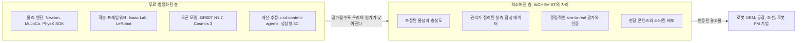
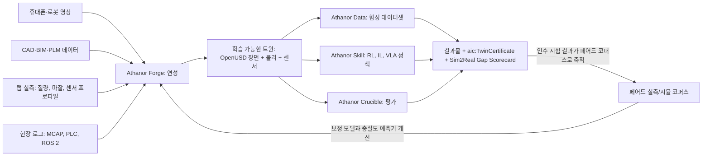
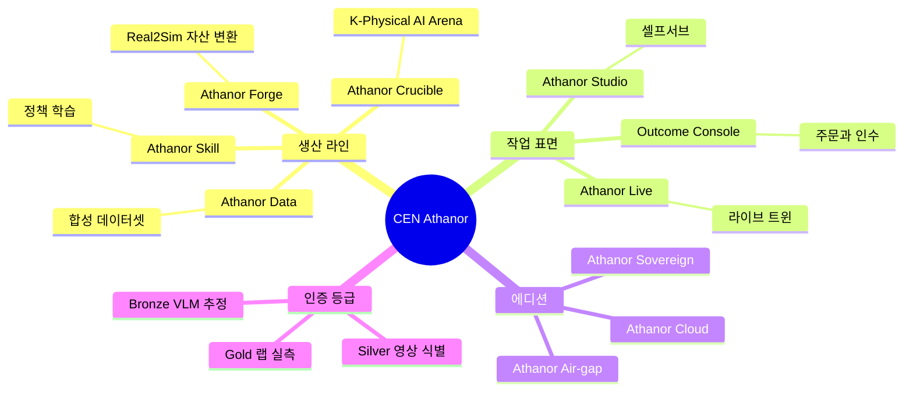
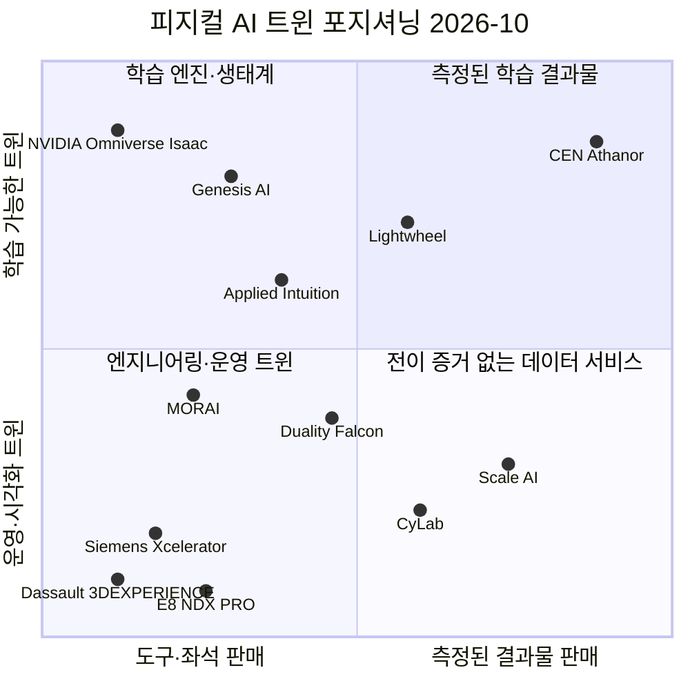
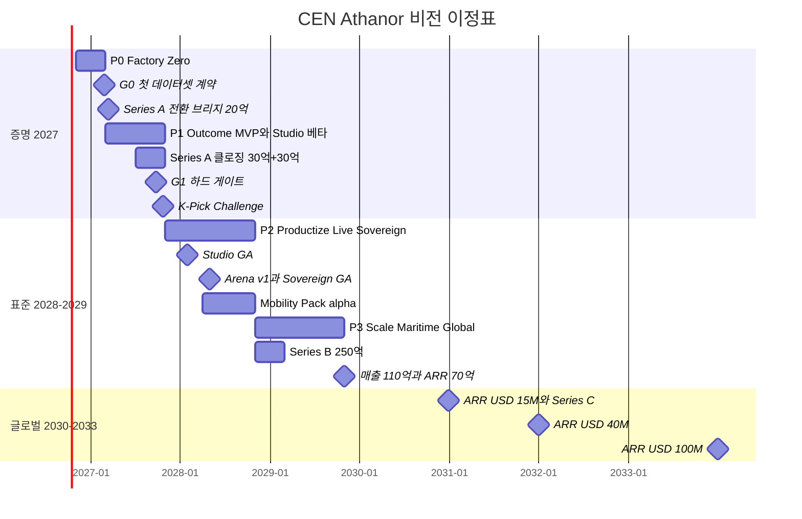

# 01. 비전과 포지셔닝: 측정된 현실을 학습 가능한 트윈으로

> **문서 번호** 01 · **기준일** 2026-10-06 · **버전** v1.1(DR §16 Errata 반영) · **상위 문서** [README](README.md) · **단일 기준** [00 결정 기록](00-decision-record.md)
> **관련 문서** [02 시장·경쟁](02-market-competition.md) · [03 엔진 선정](03-engine-selection-build-vs-buy.md) · [04 시스템 아키텍처](04-system-architecture.md) · [05 물리·현실감](05-physics-and-realism.md) · [06 사용성·에이전트](06-usability-and-agent.md) · [07 학습 모듈](07-training-module.md) · [08 도메인 팩](08-domain-packs.md) · [09 로드맵·조직·예산](09-roadmap-organization-budget.md) · [10 사업모델·GTM](10-business-model-gtm.md) · [11 리스크·KPI·컴플라이언스](11-risk-kpi-compliance.md) · [12 90일 실행](12-execution-90days.md) · [부록 A 기술 카탈로그](appendix-a-technology-catalog.md) · [부록 B 출처·검증](appendix-b-sources-verification.md)
> **표기** **[A]** 계획 가정(실적 확인 전까지 목표치) · **[U]** 1차 출처 미확인(대외 사용 전 [부록 B](appendix-b-sources-verification.md) 절차로 재검증) · 태그 없는 사실은 GitHub·PyPI·SkyPilot 가격 카탈로그로 확인된 값 · ₩억 = 1억 원, 1 USD = ₩1,400 [A] · 모든 매출 수치는 예측이 아닌 목표 · M1 = 2026년 11월 · D0 = 2026-10-16(CEO 승인)
> **용어** 피지컬 AI(Physical AI), sim-to-real, 허용형 라이선스, 결정론적 재현, 측정권 등은 [README §9 용어집](README.md)에서 설명한다

---

## 핵심 요약

- **2026년, 시뮬레이터는 무료가 됐다.** Newton 1.6.1(Apache-2.0, Linux Foundation), MuJoCo 3.15, PhysX SDK 5.11(코어 Apache-2.0), Isaac Lab 3.0-EA(BSD-3)가 모두 무료이고, MuJoCo는 2–3주마다, Newton은 한 달 남짓마다 새 버전을 낸다. 희소한 것은 엔진이 아니라 **"현실에서 작동한다는 증거"**다. 가치는 엔진에서 측정·데이터·평가로 넘어갔다.
- **CEN Athanor는 "측정된 현실 → 학습 가능한 트윈 → 결과물 + 인증"이라는 3단 변환 공정을 판다.** 시뮬레이터 좌석은 팔지 않는다. sim-to-real 점수가 붙은 인증 트윈, 데이터셋, 로봇 스킬, 평가를 판다.
- **CEO의 4대 요구(물리·현실감·편의성·학습)와 '무엇이든 트윈으로'는 아키텍처로 보장한다.** OpenUSD 단일 장면, 엔진 중립 Sim Kernel API, Domain Pack이 로봇·차량·드론·선박·공장을 같은 방식으로 수용한다. 자동차도 포함된다. 차량 트윈 기술(Mobility Pack α)은 M18–M24에 준비하고, 도로 자율주행 시뮬레이터 시장과는 정면 경쟁 대신 표준·MORAI로 연결한다. **기술적 범용성**과 **상업적 집중 순서(Wave 1→3)**는 별개의 축으로 관리한다.
- **해자는 엔진이 아니라 측정에서 나온다.** 페어드 실측/시뮬 코퍼스, Silver/Gold 인증 자산, 제3자가 공동서명하는 K-Physical AI Arena, 결과물당 엔지니어 시간의 학습곡선이 그것이다. 네 가지 모두 분기 KPI로 공개한다.
- **플랫폼명은 CEN Athanor(아타노르)로 확정한다.** 하위 브랜드는 Forge·Data·Skill·Crucible·Studio·Live, 에디션은 Cloud·Sovereign·Air-gap이다. 상표 검색은 M1(2026.11), 출원은 M2(2026.12)까지 마친다.
- **대표 슬로건으로 "Twin anything. Prove everything. / 무엇이든 트윈으로, 모든 결과는 증명으로"를 추천한다.** CEO가 요구한 범용성과 우리의 차별점인 증명을 한 문장에 담았다.
- **비전 이정표:** 2027년 매출 ₩15억, Series A ₩80억(M5 전환 브리지 ₩20억 + M10·M12 클로징), K-Pick Challenge(2027-10-22) 개최 → 2029년 매출 ₩110억, ARR ₩70억, Arena 인증서를 인용한 조달 3건 → 2033년 ARR 약 USD 100M(해외 비중 70% 이상) [A].

---

## 1. 왜 지금인가

**결론: 피지컬 AI(Physical AI)의 병목은 모델이 아니라 '현실에서 검증된 데이터'다. 엔진이 무료가 된 지금, 측정·데이터·평가 레이어를 선점할 창이 열려 있다.**

### 1.1 피지컬 AI 전환: 자본과 GPU가 '몸을 가진 AI'로 이동했다

언어모델의 다음 전선은 로봇, 차량, 공장처럼 물리 세계에서 행동하는 AI다. 2025–2026년의 자본 흐름은 시뮬레이터 회사가 아니라 **로봇 파운데이션모델과 자율화 스택 회사**로 향했다. 이들은 시뮬레이터를 내부 도구로 쓰고, 데이터와 평가는 외부에서 산다. 상세 분석은 [02 시장·경쟁 §2](02-market-competition.md)에 있다.

| 신호 | 내용 | 신뢰도 | 우리에게 주는 의미 |
|---|---|---|---|
| 로봇 FM 자본 집중 | Figure USD 39B(2025-09), Physical Intelligence USD 5.6B(2025-11), Skild AI 약 USD 14B(2026-01) | [U] | 데이터·평가 외부 구매자가 40–60곳 규모로 생겼다. USD 100M ARR 경로의 핵심 고객군이다 |
| 오픈 VLA의 기본값화 | GR00T N1.7 GA(3B, 코드 Apache-2.0, 가중치 NVIDIA Open Model License), openpi pi0.5, LeRobot 0.6.1 | 확인 | 모델은 무료다. 성능 차이는 파인튜닝 데이터와 평가에서 난다 |
| 한국 GPU 공급 | NVIDIA Blackwell 260k장 이상 한국 배정(2025-10-31: 정부·Samsung·SK·HMG 각 약 50k, Naver 약 60k). HMG 약 USD 3B 피지컬 AI 클러스터 | [U] | 고객은 이미 GPU를 갖고 있다. 부족한 것은 GPU를 현장 결과로 바꾸는 역량이다 |
| 산업 정책 | K-Humanoid Alliance(2025-04-10 출범), AI 기본법(2026-01-22 시행), 2026년 AI 예산 약 ₩10.1조 | [U] | 국산 피지컬 AI 데이터·평가 인프라에 정책 수요가 붙는다 |
| 검증 규제 | 자율운항선박법(2025-01-03 시행)의 성능 검증, UN ADS 규정(WP.29, 2026-06 승인 [U]), ISO 34505:2025 | 일부 [U] | 시뮬레이션 신뢰성의 '증거'에 대한 수요가 생긴다. 단, AI 기본법은 시뮬레이션 신뢰성을 의무화하지 않는다 |

### 1.2 데이터 병목: 네 가지가 동시에 터졌다

언어모델은 인터넷 텍스트로 규모를 키웠다. 로봇의 행동 데이터는 웹에서 긁어 올 수 없다. 아래 네 병목은 모델 크기를 키워서는 풀리지 않는다.

| 병목 | 무엇이 문제인가 | 규모로 해결되지 않는 이유 | Athanor의 해법 | 측정 지표(DR KPI) |
|---|---|---|---|---|
| **희소성** | 실로봇 시연은 사람이 직접 조종해서 모은다. GR00T N1.7조차 사전학습에 사람 영상 20K시간(EgoScale)을 썼다 | 데이터 수집 비용이 로봇 대수와 사람 시간에 정비례한다 | 텔레옵 시연 10개를 Mimic으로 1,000개로 증강한다(상태 기반 18–40분, 시각운동 약 10시간, Franka 생성 성공률 약 50%). Forge로 자산을 대량 생산한다 | Mimic 1,000개 생성: P1 상태 ≤1시간 / 시각운동 ≤12시간 |
| **프라이버시·보안** | 재벌 공장의 카메라 반입 금지, 개인정보보호법(PIPA), 공정 IP 보호 | 데이터를 밖으로 꺼낼 수 없으니 클라우드 학습만으로는 닿지 않는다 | 온프렘 촬영·재구성 키트(P1), 스플랫 학습 전 익명화(블러·인페인팅), Sovereign 에디션, 데이터 거주 태그(KR/US/EU)를 스케줄러가 강제한다 | 측정권 부여 고객: P1 4곳 → P3 25곳 |
| **데이터 근친교배** | 생성 모델이 만든 데이터로 다시 모델을 학습시키면 실측 기준점이 사라지고 오류가 누적된다. 월드모델은 물리를 환각하고 물체 경계를 옮겨 라벨을 조용히 오염시킨다 | 생성 데이터를 늘릴수록 분포는 좁아지고 오염은 증폭된다 [A] | 물리·라벨·센서는 시뮬레이터가 책임진다. Cosmos는 외형 증강에만 쓰고, 증강 프레임마다 라벨 일관성 QA를 거친다. 페어드 실측으로 주기적으로 재보정한다 | 증강 프레임 라벨 일관성 통과율: P1 ≥98% → P2 ≥99% |
| **롱테일** | 폴리백·케이블 같은 변형체, 한국 SKU, 드문 조명과 가림, 고장 상황 | 드문 사건은 실데이터에 거의 나타나지 않는다 | 구조화된 도메인 랜덤화, 대상 현장 스플랫, 소량 실데이터 파인튜닝, 라이브 트윈 실패 마이닝(P2)을 쓴다 | 합성 + 실데이터 10%가 실데이터 100% 대비: P1 ≥1.0 → P3 ≥1.05 |

**함의:** 네 병목은 하나의 질문으로 수렴한다. *"이 합성 데이터와 이 정책이 현실에서 작동한다는 것을 어떻게 아는가?"* 이 질문에 숫자로 답하는 회사가 피지컬 AI 데이터 공급망의 품질 기준을 쥔다. 고객이 가장 크게 느끼는 고통도 "합성 데이터가 충분히 좋다는 증거가 없다"는 점이다(리서치 결론).

### 1.3 시뮬레이터의 범용화: 엔진은 무료, 증거는 유료

| 오픈 자산 | 버전·일자(2026-10 기준) | 라이선스 | 과거에 들었던 비용 | 의미 |
|---|---|---|---|---|
| MuJoCo | 3.15.0(2026-10-05). 2026년 7–10월 마이너 릴리스 5회 | Apache-2.0 | Roboti LLC가 약 10년 개발. DeepMind가 2021-10 인수, 2022-05 오픈소스화 | 10년 걸린 접촉 물리 엔진을 2–3주마다 무료로 업데이트받는다 |
| Newton | 1.0.0(2026-03-10) → 1.6.1(2026-10-05). 7개월간 마이너 6회 | Apache-2.0, Linux Foundation | NVIDIA·Google DeepMind·Disney Research 3사 합작 | 대형 3사의 개발 속도를 스타트업이 따라잡을 수 없다 |
| PhysX SDK | 5.11, GPU 소스 포함 | 코어 Apache-2.0(저장소 루트 BSD-3) | GPU 가속 경로는 과거 바이너리로만 제공 [U] | 산업 표준 강체 물리까지 허용형으로 풀렸다 |
| Isaac Lab | 3.0.0-EA(2026-09-16), GA는 2026년 10월 말 목표 | 소스 BSD-3. PyPI 휠은 NVIDIA 독점 | — | Kit 없이 Newton 백엔드로 학습할 수 있다(beta) |
| Cosmos 3 | Super 64B / Nano 16B / Edge 4B | OpenMDW-1.1(전문 미확인 [U]) | — | 월드모델 증강도 무료 계층에 들어왔다 |
| usd-content-agents | 2026-10 갱신 | Apache-2.0 | SimReady 자산 수작업 변환 | 재질 지정, 물성 분류, 관절 추론을 자동화한다. **추정 수준**의 자산 제작이 범용화됐다 |
| Genesis World | 1.4.3(2026-09-30) | Apache-2.0(Nyx 렌더러는 폐쇄 바이너리) | 20개 이상 연구실이 약 24개월 협업 [U] | 비CUDA 대안이 생겼다. 우리는 관찰만 한다 |

같은 수준의 엔진을 자체로 만들려면 전문가 40–80명이 3–5년(추정 150–300 engineer-year), 약 ₩400–600억, MVP까지 30–48개월 이상을 들여야 한다. 우리 24개월 기준 예산 ₩122억의 3–5배다. 그렇게 만들어도 무료 엔진과 경쟁해야 한다. 엔진 결정의 상세 근거는 [03 엔진 선정](03-engine-selection-build-vs-buy.md)에 있다.

### 1.4 가치 이동: 무엇이 희소해졌는가

| 레이어 | 과거(2021년 이전)의 희소 자원 | 2026년의 상태 | 누가 가치를 가져가나 |
|---|---|---|---|
| 물리 엔진 | 상용 라이선스, 내부 개발 | 무료, 월 단위 릴리스 | NVIDIA·DeepMind·LF가 GPU 수요로 회수한다 |
| 렌더러·센서 | 상용 엔진 좌석 | RTX 런타임은 NVIDIA 독점, 웹 렌더러는 무료 | NVIDIA(RT 코어 GPU, NVAIE) |
| 자산 제작 | 수작업 모델링 | 생성형 3D와 content agent로 **추정치 수준**까지 자동화 | 누구도 독점하지 못한다 |
| **측정된 물성·충실도** | 희소 | **여전히 희소**: 고객 셀을 운영하는 플랫폼 벤더가 없다 | **AICHEMIST(Fidelity Lab, Gold 인증)** |
| **권리가 정리된 데이터** | 희소 | **더 희소**: ManiSkill 자산 CC BY-NC, Lightwheel 무료 자산은 비상업용, Hunyuan3D 2.1은 한국 제외 | **AICHEMIST(라이선스·출처 레지스트리)** |
| **중립 평가·인증** | 부재 | **여전히 부재**: LW-BenchHub는 시뮬 전용, RoboArena는 학술용 | **AICHEMIST(Crucible, K-Physical AI Arena)** |

**행동 원칙 3가지**
1. 엔진 릴리스는 위협이 아니라 원가 절감이다. 결과물 원가에 영향을 주는 새 버전은 P1에 45일, P2부터 30일 안에 사이드 브랜치에서 검증 완료 후보로 만들고, 프로덕션 반영은 다음 릴리스 트레인에서 한다([03 §12.5](03-engine-selection-build-vs-buy.md)).
2. NVIDIA가 몇 달 안에 따라 할 수 있는 범용 기능에는 엔지니어링을 쓰지 않는다. 엔지니어링 시간의 35%를 해자(Forge, Fidelity Lab, Crucible, 인증서)에 배정한다.
3. 모든 결과물에는 숫자를 붙인다. 숫자가 없는 결과물은 서비스로 평가받고, 숫자가 있는 결과물은 표준이 된다.

### 1.5 창은 얼마나 열려 있나: 닫히는 신호와 우리의 시간표

엔진이 무료가 된 지금 측정·데이터·평가 레이어는 비어 있다. 다만 영원히 비어 있지는 않다. 해자 1–5(§8)는 M18 무렵까지 얇으므로, 그 전에 측정 코퍼스와 인증 자산을 쌓아야 한다.

| 창을 닫을 수 있는 신호 | 지금 상태 | 우리의 선제 행동 | 점검 |
|---|---|---|---|
| NVIDIA가 측정형 SimReady 마켓이나 관리형 Isaac 클라우드를 한국에 출시 | usd-content-agents로 '추정 수준' 자산 자동화까지 공개 | Bronze는 KPI에서 빼고 Silver·Gold(영상 식별·랩 실측)와 실셀 인증으로 차별화 | [02 §10](02-market-competition.md) 트리거 #1·#3 |
| Lightwheel의 한국 영업 개시 | 비상업 무료 자산, 시뮬 전용 벤치마크 | 한국 SKU·상업 라이선스·실셀 평가를 먼저 깔고, 해외 리셀러 제안으로 선제 협력 | 트리거 #2 |
| 중국 데이터 팩토리의 초저가 공세 | 대규모 공개 데이터셋, 공격적 가격 [U] | '라이선스 청정·비중국 공급자' 포지션과 출처 레지스트리 | 트리거 #6 |
| 재벌 그룹의 사내 데이터 팩토리 발표 | 그룹 SI가 Omniverse 트윈 구축 | 협력사·로봇 OEM 집중, SI 리셀러, IP 유지 조항 | 트리거 #5 |

- **우리의 시간표:** M4 첫 데이터셋 계약 → M10 Arena 공동서명 MOU → M12 K-Pick Challenge(2027-10-22) → M18 외부 Arena v1과 Sovereign GA. 이 순서대로 '숫자가 붙은 첫 사례'를 경쟁자보다 먼저 공개하는 것이 창을 잡는 방법이다.

---

## 2. AICHEMIST의 철학과 CEN → CEN Athanor

**결론: 연금술은 장식용 은유가 아니라 공정표다. 납(미검증 자산)을 금(실측으로 검증된 자산)으로 바꾸는 과정 자체가 상품이다.**

### 2.1 연금술 3단 변환: 측정된 현실 → 학습 가능한 트윈 → 결과물 + 인증

연금술의 고전 4단계는 Athanor의 생산 공정과 그대로 대응한다. 대외 브랜드 서사로 쓰고, 내부에서는 각 단계를 품질 게이트로 운영한다. 단계별 의미와 소유 IP까지 담은 전체 대응표는 문서 끝의 '부록 01-A. 브랜드 작업 자료'에 있다.

| 연금술 단계 | 품질 게이트 |
|---|---|
| Nigredo(분해: 현실 측정) | 측정 프로토콜 v1, 센서 보정 차트 |
| Albedo(정화: 라이선스·물리 QA) | SPDX 거부 목록 CI, 질량·관성·관통·관절 한계 검사 |
| Citrinitas(각성: 데이터·스킬 생성) | sim2sim 게이트(Zone F: Newton·PhysX·MuJoCo CPU, Zone T/S: Newton·MuJoCo CPU), 라벨 일관성 QA |
| Rubedo(완성: 인증) | Scorecard, Bronze/Silver/Gold 기준, 공동서명 |

**Athanor 5원칙**

| # | 원칙 | 운영 규칙 |
|---|---|---|
| 1 | **측정하지 않은 것은 보증하지 않는다** | 변형체 성능은 M12 측정 전까지 보증하지 않는다. 인증서는 MuJoCo CPU 또는 Newton 결정론 모드에서 고정된 하드웨어·드라이버로만 발행한다(Newton은 N1–N5 결정론 시험 통과 후, Chrono·PX4 SITL·Fossen 경로는 CTO가 D0 목록에 등록한 뒤). 등록 전 차량·드론·선박 동역학 산출물에는 인증서 없이 Scorecard만 붙인다 |
| 2 | **엔진은 연료이지 화로가 아니다** | 모든 백엔드를 Sim Kernel API 뒤에 둔다. 벤더 처리량 수치는 의사결정에 쓰지 않고 사내 베이크오프 수치로 대체한다 |
| 3 | **깨끗한 원료만 쓴다** | Zone F/T/S 3구역 원칙을 지킨다. 테넌트용과 온프렘용 경로는 허용형(Apache-2.0/BSD/MIT)과 의무 이행이 가능한 약한 카피레프트(MPL-2.0·EPL-2.0·LGPL)로만 구성하고, TSL·BSL·AGPL·GPL·비상업 라이선스는 넣지 않는다([DR §6.2](00-decision-record.md)) |
| 4 | **화로는 꺼지지 않는다** | 결과물당 엔지니어 시간 지수를 100(P0) → 50(P1) → 25(P2) → 15(P3)로 낮춘다. 생산화 게이트를 통과한 라인만 셀프서브로 연다 |
| 5 | **금의 순도는 제3자가 찍는다** | Arena 외부 채점은 공동서명 기관과 거버넌스 헌장을 맺은 뒤에만 한다. 우리가 학습시킨 정책은 회피 규정에 따라 공동서명 기관의 검토를 거친다 |

### 2.2 CEN이 이미 가진 것: Athanor의 출발 자산

**CEN 현황 기준선(2026-09 말, CFO 확인 [A])**

투자자와 정부 평가위원이 가장 먼저 보는 출발점이다. TIPS·IITP 제안서의 '수행 역량'과 Series A 트랙션 자료는 이 표를 기준으로 쓴다. 값은 CFO가 M1(2026.11)에 확인하기 전까지 '[CFO M1 확인]'으로 두고, 대외 자료에는 확인된 값만 넣는다.

| 지표 | 정의 | 2026-09 말 값 | 확인 책임 | Athanor에서 쓰는 곳 |
|---|---|---|---|---|
| 연 매출 | 직전 12개월 인식 매출(구독·토큰·마켓 수수료·SDG 용역 구분) | [CFO M1 확인] | CFO | IR 트랙션, TIPS 수행 역량 |
| 유료 고객 수 | 직전 3개월 안에 결제한 법인·개인 고객 수 | [CFO M1 확인] | CFO | 첫 데이터셋 고객 지정, 결과물 크레딧 전환 대상 |
| 월간 활성 워크스페이스 | 월 1회 이상 GPU 세션을 연 워크스페이스 수 | [CFO M1 확인] | CTO(대행) | Studio 베타 초대 풀, Studio KPI 기준선 |
| 월 토큰 소비 | 월평균 소비 토큰 수와 금액(1 토큰 = ₩100 환산) | [CFO M1 확인] | CFO | 토큰 원가·가격 재산정(2027 Q1) |
| 마켓 리스팅 수 | 마켓플레이스 등록 자산 수(상업·비상업 구분) | [CFO M1 확인] | CTO(대행) | 라이선스 감사 범위, Certified 등급 전환 후보 |
| 기존 SDG 고객 수 | 합성 데이터 생성 계약 이력이 있는 고객 수 | [CFO M1 확인] | CEO | Wave 1 첫 데이터셋 계약(M4) 후보 풀 |

- 가용 현금(₩15억 [A])과 재배치 가능 인원(6명 [A])도 같은 시점에 확인한다([DR §9.4](00-decision-record.md), [09 §9.2](09-roadmap-organization-budget.md)).
- 이 기준선은 IR 덱과 정부과제 제안 키트([10](10-business-model-gtm.md))가 그대로 인용한다.

**출발 자산과 보완 과제**

| CEN 자산 | 현재 상태 | Athanor에서 맡는 역할 | 보완 과제 |
|---|---|---|---|
| 구독·토큰·마켓플레이스 | 운영 중인 수익 모델 | 수익 엔진으로 그대로 쓴다. 1 토큰 = ₩100, RT 60 / 서울 대화형 95 / TRAIN 80 / LIGHT 20 토큰/시간 | 결과물 계약 금액의 20–30%를 토큰 크레딧(12개월 유효)으로 구성해 셀프서브 전환을 유도한다 |
| GPU 클라우드 워크스페이스(Jupyter·가상 OS) | 운영 중 | Athanor Studio의 터전이 된다(브라우저 렌더 WebGPU/WebGL2, Selkies 데스크톱) | 테넌트 간 GPU 시분할을 금지한다. 자체 WebRTC 인증 게이트웨이를 붙인다 |
| NeRF 기반 2D→3D 변환 | 운영 중 | Athanor Forge의 전신 | **M1 라이선스 감사**(Instant-NGP 비상업 조항 가능성)를 거쳐 gsplat 1.6.0 + 3DGRUT 2.0(Apache-2.0)으로 이전한다 |
| LLM 텍스트 명령 인터페이스 | 운영 중 | 한국어 MCP 에이전트(MCP 사양 2026-07-28)로 확장한다 | 타입이 지정된 도구, gVisor·Kata 샌드박스, 검증 게이트, 사람 승인 병합을 추가한다 |
| CEN SDG 고객 기반 | 기존 고객 보유 | **첫 매출 경로**: M4까지 데이터셋 계약(₩0.5억 이상, mAP 인수 조건) | 고객 1곳을 CEO가 M1에 지정한다 |
| 인력 6명 | NeRF 2, SDG·렌더링 1, 웹 워크스페이스 1, 마켓플레이스·플랫폼 1, ML 1 [A] | M1에 재배치한다(P0 16명 중 6명) | 재배치 가능 인원을 CFO·CTO가 M1에 확인한다 [U] |

### 2.3 Athanor가 더하는 것

| 신규 구성요소 | 역할 | 첫 등장 | 관련 문서 |
|---|---|---|---|
| Sim Kernel API + 적합성 스위트 + Run Manifest | 엔진 교체 가능성과 재현성을 증명한다 | P0(v0, 장면 5개) | [04](04-system-architecture.md), [05](05-physics-and-realism.md) |
| Fidelity Lab | Test Cell에서 실측하고, 페어드 코퍼스와 Scorecard를 만든다 | Test Cell 1(P0), Test Cell 2(P1) | [05](05-physics-and-realism.md) |
| Athanor Data / Athanor Skill | 데이터셋 라인과 정책 학습 라인 | P1 | [07](07-training-module.md) |
| Athanor Crucible + K-Physical AI Arena | 평가·인증 라인과 중립 아레나 | Crucible v0 내부(P1) → 외부 Arena v1(M18) | [07](07-training-module.md), [11](11-risk-kpi-compliance.md) |
| Outcome Console + Outcome Orchestrator | 한국어 주문 → 작업 DAG → QA → 납품·인증 | P1 | [06](06-usability-and-agent.md) |
| Athanor Live | 라이브 트윈, fork-from-live, 충실도 드리프트 측정 | P2(첫 라이브 트윈 M18) | [04](04-system-architecture.md) |
| Athanor Sovereign / Air-gap | 온프렘·국내 CSP / 국방 에어갭 | Sovereign 베타 M14 → GA M18. Air-gap은 M27부터(트리거 조건부) | [10](10-business-model-gtm.md) |
| Domain Pack 체계 | 자산·물리 프로파일·센서 리그·커넥터·템플릿·평가지표·인증 기준의 묶음 | 조작 팩(P0–P1)부터 시작 | [08](08-domain-packs.md) |

### 2.4 진화 서사: 도구에서 공정으로, 공정에서 표준으로

| 단계 | 기간 | 정체성 | 고객이 사는 것 | 증명 |
|---|---|---|---|---|
| CEN | ~2026.10 | 콘텐츠 생성 워크스페이스(사진 → 3D, SDG) | 도구 구독, 토큰, 마켓 자산 | 사용량 |
| Athanor 1막: Factory Zero | P0–P1(2026.11–2027.10) | 내부 팩토리 + Done-for-you 결과물 | 데이터셋, Cell-to-Policy PoC, 인증 트윈 | 계약서의 mAP와 성공률 숫자 |
| Athanor 2막: Productize | P2(2027.11–2028.10) | 셀프서브 Studio GA(M15), Sovereign GA(M18), 외부 Arena(M18) | 구독, 온프렘 라이선스, 평가 캠페인 | 반복매출 30%, 공동서명 인증서 |
| Athanor 3막: Standard | P3 이후(2028.11–) | 피지컬 AI 데이터·평가의 품질 기준 | 글로벌 FM 기업 대상 데이터·평가, 조달 인증서 | 조달 문서가 인증서를 인용한다 |

한 문장으로 줄이면 이렇다. *CEN은 사진을 3D로 바꾸는 도구였다. Athanor는 현실을 '증명 가능한 로봇 능력'으로 바꾸는 공정이다.*

---

## 3. 플랫폼 정의: 무엇이고 무엇이 아닌가

**결론: Athanor는 '학습 가능한 트윈 + 결과물 팩토리 + 인증 발행자'다. IIoT 운영 트윈, 도로 자율주행 HIL·인증 도구, 새 물리 엔진, NVIDIA 리셀러가 아니다. 차량 트윈 자체는 만든다.**

**공식 정의(전 문서 공통, [DR §0](00-decision-record.md)):** CEN Athanor(아타노르)는 현실을 측정해 AI가 학습할 수 있는 디지털 트윈으로 만들고, 그 트윈에서 만든 학습 데이터·로봇 기술·평가 결과가 실제 현장에서 통한다는 것을 수치(sim-to-real 점수)로 인증해 공급하는 범용 피지컬 AI 디지털 트윈 플랫폼이다.

- '연성(鍊成)'은 §2의 브랜드 서사에서만 쓰는 은유다. 정의 문장에는 넣지 않는다.

### 3.1 무엇인가: 다섯 가지 속성

| 속성 | 의미 | 구현 | 고객이 체감하는 것 |
|---|---|---|---|
| **학습 가능한 트윈** | 트윈이 보기용 모형이 아니라 RL·IL·VLA·인식 모델을 학습시키는 환경이다 | OpenUSD 장면 + Sim Kernel(Newton, MuJoCo, PhysX(Zone F), Chrono) + Isaac Lab 3.x·mjlab·LeRobot | 같은 장면에서 데이터 생성, 학습, 평가가 끊김 없이 이어진다 |
| **범용 대상** | 로봇·차량·드론·선박·공장을 같은 방식으로 다룬다 | Domain Pack(자산, 물리 프로파일, 센서 리그, 커넥터, 템플릿, 지표, 인증 기준) | 새 대상이 생겨도 플랫폼을 바꾸지 않고 팩을 추가한다 |
| **결과물 팩토리 + 셀프서브 스튜디오** | 같은 생산 라인을 두 개의 문으로 연다 | Outcome Console(Done-for-you), Athanor Studio(Self-serve) | 처음에는 맡기고, 익숙해지면 직접 만든다 |
| **인증 발행자** | 모든 자산·데이터셋·정책에 측정 점수를 붙인다 | `aic:TwinCertificate` USD 스키마 + JSON 사이드카, Sim2Real Gap Scorecard, Bronze/Silver/Gold | 인수 기준을 계약서에 숫자로 쓸 수 있다 |
| **시뮬레이션 트윈이 기본, 라이브 트윈은 측정 도구** | 라이브 트윈은 운영 대시보드가 아니라 충실도와 실패를 측정하는 데 쓴다 | Athanor Live(P2): 인수 모니터링, 실패 마이닝, fork-from-live 드리프트 측정 | 배포 후에도 정책이 현실에서 얼마나 맞는지 계속 숫자로 본다 |

### 3.2 무엇이 아닌가: 범위 밖의 일과 영업 현장 답변

| 아닌 것 | 이유 | 대신 하는 것 | 영업 현장의 답변(예시) |
|---|---|---|---|
| 새 물리 엔진·렌더러 | 150–300 engineer-year, 예산의 3–5배 | Newton·MuJoCo·PhysX·Chrono·Drake·RTX·3DGUT 통합 | "엔진은 검증된 오픈소스와 NVIDIA 스택을 쓰고, 우리는 그 엔진이 현실과 얼마나 맞는지를 측정해 드립니다." |
| IIoT·PLM 운영 트윈 | Siemens·AVEVA·Dassault가 엔지니어링 데이터를 장악하고 있다 | OPC UA·USD로 연결한다 | "지금 쓰시는 Process Simulate 라인을 그대로 가져와 로봇 학습 환경으로 바꿔 드립니다." |
| 도로 자율주행 HIL·형식 인증 도구(차량 트윈 자체는 만든다) | dSPACE·IPG·Applied Intuition·MORAI가 자리 잡은 시장이다. 경쟁 지형 점수 1점 | 차량 Mobility Pack α(P2, M18–M24: 야드·저속 차량 동역학과 도로 시나리오 재생) + OpenSCENARIO·OSI·FMI 3.0 브리지, 인식 데이터는 MORAI 경유 | "CarMaker·MORAI는 그대로 쓰시고, 한국 도로 인식 데이터와 차량 트윈 학습 환경을 연결해 드립니다." |
| NVIDIA 리셀러·SI | 가치가 NVIDIA에 귀속되면 서비스 멀티플을 받는다 | co-sell은 하되, 가치는 측정·인증·데이터·한국 콘텐츠에 둔다 | "NVIDIA 스택(Isaac Lab·OpenUSD)과 호환됩니다. 우리가 더하는 것은 현장 측정과 인증입니다." |
| 좌석 단위 시뮬레이터 라이선스 | 고객의 RL·시뮬 팀이 얇아 좌석이 놀기 쉽다 | 뷰어·리뷰어 좌석 무료, 컴퓨트는 원가 근처, 가치는 결과물에서 받는다 | "좌석 수가 아니라 인수된 결과물에만 비용을 냅니다." |
| 범용 월드모델 회사 | 월드모델은 물리적 정확성과 정밀한 제어를 보장하지 않는다 | Cosmos는 외형 증강과 정책 사전 선별에만 쓴다 | "생성 영상은 외형을 다양하게 만드는 데만 쓰고, 라벨과 물리는 시뮬레이터가 보증합니다." |

### 3.3 경계 판정 테스트: 이 일을 해야 하는가

제품·영업 팀은 신규 요청을 아래 다섯 질문으로 판정한다. 셋 이상이 "아니오"면 거절하거나 파트너에게 넘긴다.

| # | 질문 | "예"의 근거 |
|---|---|---|
| 1 | 산출물에 측정 가능한 인수 기준(mAP 비율, 성공률 갭, 궤적 오차)을 붙일 수 있는가 | Scorecard 항목으로 표현된다 |
| 2 | 결과물이 다음 고객에게 재사용 가능한 자산·템플릿·Domain Pack으로 남는가 | 2개 이상 주문에서 재사용된 자산 비율 KPI(P1 20% → P3 45%)에 기여한다 |
| 3 | 테넌트·온프렘 경로가 허용형(또는 의무 이행이 가능한 약한 카피레프트) 라이선스만으로 구성되는가 | Zone T/S 허용 목록 안에 있다 |
| 4 | FDE 상한(결과물 매출 ₩8억당 1명) 안에서 납품할 수 있는가 | 서비스화 함정을 피한다 |
| 5 | Arena 중립성이나 측정권(데이터권)을 해치지 않는가 | 이해상충 회피 규정과 측정권 조항을 유지한다 |

### 3.4 검토한 포지셔닝 대안과 선택 이유

이 정의는 세 가지 포지셔닝 대안을 CTO, 투자자, 고객·정부 심사단이 각각 평가한 결과다([DR §1.3 검토 경위](00-decision-record.md)). 세 심사단 모두 C안을 1위로 꼽았다. 최종안은 C안의 골격에 B안의 라이선스 섀시와 A안의 시장 진입 속도를 결합했다.

| 대안 | 포지셔닝 | 심사 점수(CTO / 투자자 / 고객·정부) | 가장 강한 점 | 결정적 약점 | 최종안에 남긴 것 |
|---|---|---|---|---|---|
| A. NVIDIA-Accelerated | "NVIDIA 스택의 한국 라스트마일 딜리버리 파트너" | 6.22 / 5.76 / 5.88 | 첫 매출이 가장 빠르다. Inception·SI 공동 판매 경로가 현실적이다 | 제안서 스스로 "기술 해자가 아니다"라고 밝혔다. 가치가 NVIDIA에 귀속돼 SI 멀티플을 받는다. 핵심 매출이 확인되지 않은 NVIDIA 약관에 의존한다 | 12주 고정가 Cell-to-Policy PoC, 하드 게이트, NVIDIA co-sell |
| B. Sovereign Open Core | "라이선스가 깨끗한 소버린 피지컬 AI 코어" | 6.04 / 5.60 / 5.95 | 법무·보안 심사와 국방 인증에서 가장 강하다. 에디션 구조가 한국 조달 체계와 일대일로 맞는다 | 허용형 엔진 조립은 누구나 따라 할 수 있다. NVIDIA가 계속 개방하면 소버린 프리미엄이 사라진다 | 3구역 라이선스 원칙, 서명 SBOM, Sovereign·Air-gap 에디션 |
| **C. Outcome-led Data & Evaluation Factory** | "측정된 sim-to-real 점수가 붙은 결과물과 중립 평가" | **6.74 / 6.62 / 7.28** | NVIDIA 범용화가 오히려 순풍이 된다. 평가는 가장 끈끈한 자리다 | 서비스화 함정(SI 업무로 변질), 결과물 책임, 아레나 이해상충 | **전략 골격 전체**. 약점은 생산화 게이트, 책임 상한, 공동서명 헌장으로 통제한다 |

**선택 논리:** 엔진 선택(Newton, MuJoCo, PhysX, Isaac Lab)은 세 대안이 같았다. 승부는 비즈니스 모델에서 갈렸다. '증거'를 파는 C안만이 NVIDIA의 무료 공개를 원가 절감으로 바꾸고, 재벌의 자기 인증 한계를 매출로 바꾼다.

---

## 4. CEO 요구사항에 대한 한 장 답변

**결론: 네 가지 요구와 범용성은 측정 가능한 KPI로 답한다. 요구별 답은 [README §1](README.md)과 [DR §0](00-decision-record.md)의 1분 요약, 메커니즘과 단계별 KPI는 [DR §4](00-decision-record.md)가 정본이다. 이 절은 비전 관점의 한 줄 요약만 둔다.**

- **① 강력한 물리 엔진:** 검증된 엔진의 역할별 포트폴리오(로봇 Newton·MuJoCo·Drake와 사내 전용 NVIDIA Isaac Lab·PhysX, 차량·지형 Chrono, 선박 Chrono FSI·클린룸 Fossen, 드론 PX4 SITL + Gazebo)를 작업 유형별로 골라 쓰고, 현실과의 오차를 측정한다. 증명은 적합성 스위트 4×8(M12) → 6×15(M36)와 궤적 ADE ≤2 cm → ≤1 cm다([05](05-physics-and-realism.md), [03](03-engine-selection-build-vs-buy.md)).
- **② 높은 현실 유사도:** 재질·신경 재구성·실측 센서·생성형 증강의 4계층으로 맞추고 모든 납품물에 Scorecard를 붙인다. 증명은 합성 전용 mAP 비율 ≥0.90(M12)과 정책 갭 ≤15%p(M12) → ≤8%p(M36)다([05](05-physics-and-realism.md)).
- **③ 편의성:** 한국어로 주문하거나 설치 없이 브라우저에서 직접 만든다. 증명은 첫 시뮬레이션 ≤10분(베타) → ≤5분, 영상 → 피킹 스킬 24시간 → 4시간이다([06](06-usability-and-agent.md)).
- **④ 모델 학습 내장:** RL·IL·VLA·인식을 한 라인에서 학습하고 sim2sim 게이트와 실셀로 검증한다. 증명은 템플릿 8/3/3(M12) → 25/10/8(M36), 실셀 이전 정책 누적 8 → 80이다([07](07-training-module.md)).
- **⑤ 무엇이든 트윈으로:** 대상마다 플랫폼을 새로 만들지 않고 Domain Pack을 끼운다. 기술 준비 시점은 아래 §4.1과 [08 §2.3](08-domain-packs.md)(정본)에 있다.

### 4.1 기술 준비 시점(Capability Readiness)과 상업 Wave의 분리

**"자동차는 하지 않는다"가 아니다. 차량 트윈 기술(Mobility Pack α: 야드·저속 차량 동역학과 도로 시나리오 재생)은 P2(M18–M24)에 준비되고, 도로 AV 시뮬레이터 시장에는 정면 경쟁 대신 MORAI·표준(OpenSCENARIO·OSI·FMI 3.0)으로 연결한다.** 아래 표는 요약이며 정본은 [08 §2.3](08-domain-packs.md), 자동차 선택지 비교는 [DR §5.5](00-decision-record.md)다.

| 대상 | 기술 준비(Capability Readiness) | 상업 집중(Wave) | 핵심 구성 |
|---|---|---|---|
| 로봇 조작(암, 빈 피킹, 조립, 삽입) | P0–P1(M1–M12). P0 RL 템플릿 3종(팔 도달·큐브 들기, 빈 피킹, 디팔레타이징) | **Wave 1(M1–M18)** "Pick Anything, Korea" | Newton·PhysX(Zone F), Forge, Mimic, SmolVLA·GR00T |
| 모바일 로봇·AMR·공장/물류 셀 | P1–P2(M9–M18) | Wave 1의 부가 기능, P2 라이브 트윈 | PhysX Vehicle2(Zone F), Newton 관절형 휠 모델(Zone T/S) |
| 휴머노이드·사족·덱스터러스 핸드 | P1 템플릿(M6–M12), P2 상업화는 휴머노이드·덱스터러스만 | **Wave 2(M12–M24)** VLA 데이터 + Crucible. 사족은 템플릿·Crucible 평가로만 수익화 | GR00T N1.7, 60 DoF 초과 시 PhysX 경로·관절 트리 분할 |
| 차량 Mobility Pack α(야드·저속 차량 동역학, 도로 시나리오 재생) | **P2(M18–M24)** | 조작·AMR·셀 계약의 부속과 야드 인식 데이터셋. 도로 AV 시뮬레이터 시장은 정면 경쟁 없이 MORAI·표준으로 연결하고, 한국 도로 인식 데이터 팩은 MORAI와 마켓플레이스로 판매 | Chrono::Vehicle 어댑터(Pacejka/TMeasy 타이어, SCM 지형), PhysX Vehicle2(Zone F), OpenDRIVE/OpenSCENARIO import(esmini), FMI 3.0 브리지(고객 CarSim/CarMaker, BYOL) |
| 드론 | P2 PX4 SITL 브리지 기본 템플릿(M20–M24, RL 1종) | P3 국방 에디션 안에서 본격화 | PX4 SITL + Gazebo Jetty |
| 선박·항만·조선 해양 | P3(M25–) | **Wave 3(M25 트리거 판정 개시, 기본 경로는 확정 ₩5억 이상 앵커 계약)** | Fossen 6-DOF(클린룸), Chrono FSI, 검증된 레이더·EO/IR 프로파일 |
| 오프로드 UGV | P3 | Wave 3b(M27–, 국방) | Chrono CRM 지형 |

차량 Mobility Pack α는 기존 예산의 WS1-M 1명(차량·해양 동역학 엔지니어, 서치 M16·착석 M18)과 WS3 지원으로 수행한다. 인원(16/26/36/48)과 예산(₩122.0억)은 바뀌지 않는다. 차량·드론·선박 동역학 산출물은 각 경로가 D0 결정론 목록에 등록되기 전까지 인증서 없이 Scorecard만 붙인다(목표 Chrono M22, Fossen M28 [A]).

---

## 5. 포지셔닝 문장과 슬로건

**결론: 대상마다 질문이 다르므로 문장도 다르게 쓴다. 다만 모든 문장의 축은 '측정된 증거' 하나다.**

### 5.1 다섯 청중별 포지셔닝

| 청중 | 그들의 핵심 질문 | 포지셔닝 문장 | 뒷받침 증거 3개 | 쓰지 말아야 할 말 |
|---|---|---|---|---|
| **투자자** | NVIDIA가 다 공짜로 주는데 해자가 어디 있나? | *"엔진이 무료가 될수록 '현실에서 작동한다는 증거'는 희소해집니다. AICHEMIST는 그 증거, 즉 측정된 sim-to-real 점수가 붙은 트윈·데이터·스킬을 생산하고, 한국 로봇이 채점받는 아레나를 운영합니다."* | ① 분기 공개 해자 KPI(페어드 trial 누적, Silver/Gold 자산, 재사용률, 측정권 고객) ② G1(M11) 하드 게이트와 보수안 자동 전환 ③ 글로벌 FM 기업 대상 데이터·평가로 가는 USD 100M ARR 경로 | "디지털 트윈 시장 USD 150B"(범위가 3–10배 다르다), "NVIDIA 대항마" |
| **기업 구매자** | 그래서 우리 라인에서 돌아가나? 안 되면 누가 책임지나? | *"휴대폰 영상 한 편에서 인증 트윈과 검증된 피킹 스킬까지 만듭니다. 인수 기준은 계약서에 숫자로 쓰고, 책임 상한은 계약 금액으로 정합니다."* | ① 12주 고정가 Cell-to-Policy PoC(₩1.5–2.5억, 선금 30%) ② sim-to-real 갭 ≤15%p 인수 조건 ③ 온프렘 촬영·재구성 키트와 Sovereign 에디션 | "무엇이든 자동으로", 측정 전 변형체 성능 보증 |
| **정부 평가위원** | TRL이 실제로 오르고, 제3자가 검증할 수 있나? | *"국산 피지컬 AI 데이터·평가 인프라입니다. TRL 4→7을 목표로 하고, sim-to-real 지표를 KTL·KOLAS·TTA 시험성적서로 검증합니다. 컨소시엄 안에서 인프라 공급자 역할을 맡습니다."* | ① 제3자 검증 KPI 4종(mAP 비율, 정책 갭, 라이다 오차, 재현율) ② 모듈별 중복 지원 방지 맵 ③ Arena 공동서명 기관 MOU(M10) | "AI 기본법이 시뮬레이션 신뢰성을 의무화한다"(사실이 아니다) |
| **엔지니어(채용·고객 기술팀)** | 내가 쓰는 엔진을 버려야 하나? 재현은 되나? | *"엔진 전쟁에 끼지 말고 엔진 위에서 일하세요. Newton·MuJoCo·Isaac Lab을 하나의 Kernel API로 묶고, 적합성 스위트와 결정론적 재현으로 '돌아간다'를 '측정된다'로 바꿉니다."* | ① 적합성 스위트 오픈소스 공개(Kernel API 사양과 인증 로직은 자체 IP로 유지) ② Newton 업스트림 기여(LF) ③ 사내 벤치마크(steps/s/$, 보상 도달 시간) 공개 | 벤더 처리량 수치(43M FPS, 252배 등) 인용 |
| **일반 대중** | 그게 내 삶과 무슨 상관인가? | *"로봇이 공장과 물류센터에 들어오기 전에, 가상 세계에서 먼저 배우고 시험받습니다. AICHEMIST는 그 가상 세계를 현실과 똑같이 만들고, 정말 똑같은지 숫자로 증명합니다."* | ① 공개 K-Pick Challenge(M12) ② 한국 SKU 트윈 라이브러리 ③ 국방·공공 신뢰 기준(에어갭, 출처 확인) | 일자리 대체 프레이밍, 과장된 안전 보증 |

### 5.2 슬로건 결정

- **마스터 슬로건:** "Twin anything. Prove everything. / 무엇이든 트윈으로, 모든 결과는 증명으로"(채점 23/25, 10개 후보 중 1위).
- **예비 슬로건:** #3 "Measure reality. Forge the twin. Prove the outcome. / 현실을 측정하고, 트윈을 연성하고, 결과를 증명한다"(22/25).
- **상표:** 국내 출원은 M2(2026.12)까지 마친다(§6.4). 후보 10개 채점표는 문서 끝의 '부록 01-A'에 있다.

### 5.3 수렴: 추천과 사용 규칙

- **마스터 슬로건(추천):** **"Twin anything. Prove everything." / "무엇이든 트윈으로, 모든 결과는 증명으로."**
  - 앞 절반은 CEO의 '로봇, 자동차 등 어떤 것도 가능'이라는 요구를 그대로 받는다. 뒤 절반은 측정·인증이라는 해자를 말한다.
  - 영어 두 문장이 각운을 이뤄(anything / everything) 해외 FM 기업 대상 GTM에서도 그대로 쓸 수 있다.
  - 리스크는 'Prove everything'이 결과 보증으로 오해될 수 있다는 점이다. 계약 문서에서는 슬로건을 쓰지 않고, 인수 기준과 책임 상한 조항으로 대체한다.
- **보조 태그라인:** IR 덱 표지에는 #2 "Simulators are free. Proof isn't."를 쓰고, 정부 제안서 표지에는 #3을 쓴다.
- **하위 브랜드 태그라인 [A]:** Forge "영상에서 인증 자산으로" · Data "mAP로 인수하는 데이터" · Skill "실셀에서 검증된 스킬" · Crucible "제3자가 서명한 평가" · Studio "설치 없이 5분 안에 첫 시뮬레이션" · Live "현장이 트윈을 교정한다".

---

## 6. 네이밍과 브랜드 아키텍처

**결론: 'Athanor'는 상시 가동되는 통제된 변환이라는 우리 사업의 본질과 맞고, 3D·로보틱스 분야에서 확인된 충돌이 없다. 상표 리스크는 M2까지 검색·출원으로 닫는다.**

### 6.1 왜 Athanor인가

- **의미:** 아타노르는 연금술사의 자급식 화로다. 연료를 스스로 공급하며 긴 연성 작업 동안 일정한 열을 유지한다. 어원은 아랍어 al-tannūr(화덕)로 알려져 있다 [A].
- **사업 정합성:**
  - '항상 켜진 팩토리'(결과물당 엔지니어 시간을 계속 낮춘다)
  - '통제된 변환'(측정 → 연성 → 인증)
  - '자급'(코퍼스가 Forge 보정 모델을 다시 개선하는 플라이휠)
- **브랜드 계열성:** Forge(대장간), Crucible(도가니), Gold 등급과 하나의 어휘 체계로 묶인다. 연금술 메타포 안에서 각 라인의 역할이 직관적으로 읽힌다.
- **발음:** 한국어 '아타노르'(4음절), 영어 /ˈæθənɔːr/. 두 언어 모두 철자와 발음이 거의 일치한다.
- **충돌:** 로보틱스·시뮬레이션 분야의 주요 제품명 충돌은 확인되지 않았다. 상표 검색 결과는 아직 없다 [U].

### 6.2 브랜드 아키텍처

| 브랜드 | 역할 | 고객 언어 | 출시 | 연계 매출 라인(2029 목표, ₩억) |
|---|---|---|---|---|
| **CEN Athanor** | 마스터 브랜드(플랫폼) | "Athanor에서 만든 트윈" | 국내 상표 출원(M2) 뒤 대외 공표 [A] | 합계 110.0 |
| Athanor Forge | Real2Sim 자산 변환(CEN NeRF의 후속) | "영상 → 인증 자산" | v0 P0, v1 P1 | 10.0 |
| Athanor Data | 데이터셋 라인 | "mAP로 인수하는 데이터" | P1 | 22.0 |
| Athanor Skill | 정책 학습 라인(PoC, 양산 프로그램, 런타임) | "실셀에서 검증된 스킬" | PoC 판매 M5 | 25.0 |
| Athanor Crucible | 평가·인증 라인, K-Physical AI Arena 운영 | "제3자가 서명한 평가" | v0 내부 P1 → 외부 Arena M18 | 12.0 |
| Athanor Studio | 셀프서브 작업 환경(CEN 워크스페이스 내부) | "설치 없이 브라우저에서" | 베타 M9(Zone T 전용, Explorer는 대기자 명단 초대제) → 공개 가입·GA M15 | 16.0(Studio·Cloud 합산) |
| Athanor Live | 라이브 트윈, fork-from-live | "현장이 트윈을 교정한다" | P2(첫 라이브 트윈 M18) | 위 라인들에 포함 |
| Athanor Cloud / Sovereign / Air-gap | SaaS / 온프렘·국내 CSP / 국방 에어갭 | 배포 형태 | Cloud M9 베타(초대제), Sovereign GA M18, Air-gap M27–(트리거) | 15.0(Sovereign·Air-gap 합산) |
| Bronze / Silver / Gold | 인증 등급 | "Gold 인증 트윈" | P0 | KPI는 Silver/Gold만 집계 |

정부 데이터 구축·NRE 용역(2029년 ₩10.0억)은 특정 하위 브랜드에 귀속하지 않는다.

**명명 규칙**
- 대외 첫 표기는 항상 "CEN Athanor"로 쓴다. 이후에는 "Athanor"로 줄여 쓸 수 있다. 하위 브랜드는 "Athanor + 기능명사" 형식만 허용한다.
- 'Isaac', 'Omniverse', 'Cosmos', 'GR00T' 같은 타사 상표는 제품명에 넣지 않는다. "Isaac Lab 호환"처럼 사실을 설명하는 지명적 사용만 허용한다.
- 인증 등급명(Bronze/Silver/Gold)은 반드시 측정 방법(VLM 추정 / 영상 식별 / 랩 실측)과 함께 표기한다. 등급이 측정 수준이 아니라 품질 보증으로 오해되는 것을 막기 위해서다.

### 6.3 제외한 명칭과 이유

| 후보 | 연금술 의미 | 판정 | 이유 |
|---|---|---|---|
| Genesis | 창세 | **제외** | Genesis World·Genesis AI와 정면 충돌한다. 같은 피지컬 AI 시뮬레이션 시장의 경쟁사이자 잠재 고객이라 검색·상표·영업 모든 면에서 혼동이 불가피하다 |
| Alembic | 증류기 | **제외** | VFX 업계 표준 파일 포맷 Alembic(.abc)과 충돌한다. 우리 파이프라인이 3D 자산을 다루므로 "Alembic 파일"과 "Alembic 플랫폼"이 섞인다 |
| Opus | 대작업(Magnum Opus) | **제외** | Opus 오디오 코덱 등 기존 소프트웨어 제품명과 충돌한다 |
| Elixir | 영약 | **제외** | 프로그래밍 언어 Elixir와 충돌한다. 개발자 대상 검색에서 묻힌다 |
| Crucible | 도가니 | 마스터 브랜드로는 **불채택**, 평가 라인명으로 **채택** | 일반명사라 등록상표로서 식별력이 약하고 기존 SW 제품명과 겹칠 수 있다 [U]. 대신 '시험해 정련한다'는 의미가 평가 라인에 정확히 맞다 |
| Aludel | 승화 용기 | 예비 후보 | 인지도가 낮아 발음과 의미를 설명해야 한다. Athanor 상표가 거절될 때의 예비안으로 둔다 [A] |
| Azoth | 만물의 용매 | 불채택 | '무엇이든 트윈으로'의 범용성 은유는 좋지만, 게임 아이템명 등과 겹칠 가능성이 있다 [U] |
| Lapis | 현자의 돌 | 불채택 | 최종 결과물(금) 은유는 좋지만, 오픈소스 프레임워크명과 겹칠 가능성이 있다 [U] |

### 6.4 상표 결정

- 선행 검색(KIPRIS·USPTO·EUIPO·WIPO)은 M1(2026.11), 국내 출원(제9·35·41·42류 [A])은 **M2(2026.12)**, 마드리드 해외 출원(미국·일본·EU)은 M7(2027.05) 이전에 끝낸다.
- 충돌 시 1순위는 결합상표 'CEN ATHANOR'로 한정하고, 2순위는 예비 후보 Aludel로 전환한다 [A].
- 7단계 작업표(범위·방법·책임·기한)는 문서 끝의 '부록 01-A'에 있다.

---

## 7. 포지셔닝 맵

**결론: '측정된 결과물을 파는 학습 가능한 트윈' 사분면에는 아직 확실한 주인이 없다. Lightwheel이 가장 가깝지만 시뮬 전용 평가와 비상업 자산에 머물러 있다.**

축 정의
- **X축(수익 대상):** 왼쪽은 도구·좌석·런타임을 판다. 오른쪽은 측정된 결과물과 인증을 판다.
- **Y축(트윈 성격):** 아래는 엔지니어링·운영·시각화 트윈이다. 위는 RL·IL·VLA를 학습시키는 학습 가능한 트윈이다.

| 플레이어 | 위치 근거 | 우리와의 관계 | 위치가 바뀌는 신호 |
|---|---|---|---|
| NVIDIA | 엔진·모델을 무료로 주고 GPU·NVAIE·독점 런타임으로 번다. 학습 가능성은 최상위다 | 기반이자 co-sell 파트너 | 관리형 Isaac 클라우드 한국 출시, 측정된 SimReady 마켓 출시 |
| Genesis AI | 오픈 엔진에 자체 모델(GENE-26.5)을 더했다. 데이터 판매로 이동할 수 있다 | 데이터·평가 잠재 고객, 비CUDA 관찰 대상 | 외부 데이터 판매 개시 |
| Applied Intuition | AV·국방 툴체인 라이선스(가치 USD 15B, ARR 약 USD 830M 추정 [U]) | 정면 경쟁 회피 | 한국 국방 진출 |
| Lightwheel | SimReady 자산(비상업 무료), LW-BenchHub 268개 과제(시뮬 전용) | 가장 가까운 유사 기업. 해외 리셀러 후보 | 한국 영업 개시, 실셀 평가 출시 |
| MORAI | AV·UAM·해양 시나리오 시뮬레이터 | AV 파트너 | 조작·휴머노이드 RL 진입 |
| Duality AI | UE 기반 Falcon, 국방·오프로드 합성 데이터 | 국방 Wave 3b의 참고 모델 | 한국 국방 진출 |
| CyLab | 인식 합성 데이터(XAIVA), NVIDIA 파트너 [U] | 단순 SDG에서 가격 경쟁 | 물리·정책 라인 추가 |
| Scale AI | 사람 기반 데이터 서비스(Meta 49% 지분 약 USD 14.3B [U]) | 보완 관계: Mimic이 시연을 100배로 늘리고 Arena가 채점한다 | 로봇 시뮬레이션 데이터 진입 |
| Siemens·Dassault·E8 | PLM·도시 트윈, 좌석·프로젝트 판매 | 커넥터 대상("기존 PLM 트윈을 위한 AI 학습 레이어") | 로봇 학습 기능 내재화 |

- **좌표 해석:** 타사 좌표는 2026-10 시점의 공개 정보로 판단한 정성 배치다. CEN Athanor의 좌표는 현재 위치가 아니라 P2 말(M24)의 목표 위치다 [A]. 지금 CEN은 '도구·학습 가능성 중간' 영역에 있으며, 결과물 매출 비중과 Silver/Gold 자산 누적으로 오른쪽 위로 이동한다.
- 경쟁사 분석은 [02 시장·경쟁 §4](02-market-competition.md)(정면 경쟁 4곳과 핵심 파트너·고객 6곳)와 02 끝의 부록(나머지 34개 행), [부록 A §7](appendix-a-technology-catalog.md)에 있다.

---

## 8. AICHEMIST만의 9대 차별점

**결론: 9개 중 5개는 시간이 갈수록 복리로 쌓이는 해자이고, 4개는 실행 우위다. 투자자에게는 해자 5개를, 고객에게는 실행 우위 4개를 먼저 말한다.**

| # | 차별점 | 무엇인가 | 경쟁자가 바로 따라오지 못하는 이유 | 증명 KPI | 유형 |
|---|---|---|---|---|---|
| 1 | **측정된 숫자가 붙은 결과물** | 모든 납품물에 Sim2Real Gap Scorecard와 `aic:TwinCertificate`를 붙이고, 인수 기준을 계약서에 숫자로 쓴다 | 엔진 벤더는 결과에 책임을 지지 않는다. 데이터 벤더는 전이 성능을 측정하지 않는다 | 인증된 결과물 매출(북극성), 정책 갭 ≤15%p(P1) | 해자 |
| 2 | **페어드 실측/시뮬 코퍼스와 Fidelity Lab** | Test Cell에서 궤적·접촉력·센서 통계·실셀 성공률을 시뮬과 짝지어 쌓는다 | NVIDIA를 포함해 고객 셀을 운영하는 플랫폼 벤더가 없다. 코퍼스는 시간과 측정권 계약으로만 쌓인다 | 페어드 trial 1k(P0) → 10k → 50k → 150k(P3) | 해자 |
| 3 | **Athanor Forge: 휴대폰 영상 → 인증 자산** | CEN NeRF를 Apache 스택(gsplat, 3DGRUT)으로 재구축하고 관절·물성 추정과 영상 기반 sysid를 더한다 | content agent는 '추정'까지 한다. 우리는 Silver(영상 식별), Gold(랩 실측)까지 간다 | 영상 → Bronze 자산 ≤30분(P1). Silver/Gold 누적 1,000(P1) → 12,000(P3) | 해자 |
| 4 | **K-Physical AI Arena(중립 평가)** | 시뮬과 실셀을 함께 쓰는 평가를 제3자 공동서명으로 운영한다 | 재벌·OEM은 자사나 경쟁사를 스스로 인증할 수 없다. LW-BenchHub는 시뮬 전용이고 RoboArena는 학술용이다 | Arena 회원 3(파일럿) → 8 → 20(해외 2), 인증서 인용 조달 3건(P3) | 해자 |
| 5 | **한국 현장 콘텐츠 라이브러리** | 한국 SKU, 공장·물류·조선 셀 트윈, 센서 디바이스 프로파일 | 한 고객을 위해 스캔한 SKU를 다음 고객에게 다시 판다. 재사용될수록 원가가 내려간다 | 2개 이상 주문에서 재사용된 자산 비율 20%(P1) → 45%(P3) | 해자 |
| 6 | **엔진 중립 Sim Kernel + 결정론적 재현** | 11개 연산 API, 적합성 스위트, Run Manifest. 인증은 결정론 경로로만 발행한다 | 엔진 벤더는 자기 엔진만 지원한다. 결정론 정책이 없으면 '재현 가능한 데이터'를 약속할 수 없다 | 적합성 3×5(P0) → 6×15(P3), 재현율 100% | 실행 우위 |
| 7 | **라이선스 청정성(3구역 + 출처 레지스트리)** | Zone F/T/S 경계, SPDX 거부 목록 CI, 자산·데이터·가중치 권리 추적 | 비상업 자산(ManiSkill, Lightwheel 무료본), 한국 제외 라이선스(Hunyuan3D 2.1) 같은 함정을 피한 상업용 데이터가 드물다 | CI 차단 건수 0, 모든 리스팅에 라이선스 매니페스트 | 실행 우위 |
| 8 | **한국어 MCP 에이전트와 두 개의 문** | Outcome Console(주문)과 Studio(직접 제작)를 같은 생산 라인과 인증 체계로 묶는다. 한국어 명령은 검증 게이트와 사람 승인을 거친다 | 해외 도구는 영어 중심이고 연구자 UX다. 커뮤니티 MCP는 임의 코드를 실행한다 | 한국어 명령 성공률 ≥85%(P1) → ≥92%(P3), 결과물당 엔지니어 시간 지수 50(P1) | 실행 우위 |
| 9 | **소버린·에어갭 배포 + CEN 수익 엔진** | 서명 SBOM, 텔레메트리 없음, 오프라인 업데이트를 갖춘 Sovereign·Air-gap 에디션을 기존 CEN 구독·토큰·마켓플레이스 위에서 판다 | 독점 런타임은 재배포 약관이 확인되지 않아 에어갭 납품이 어렵다. 신생 경쟁사에는 과금·마켓 인프라가 없다 | Sovereign GA M18, 첫 온프렘 유료 설치(G2), 반복매출 비중 30%(P2) | 실행 우위 |

**정직한 한계:** 해자 1–5는 M18 무렵까지 얇다. 그때까지는 속도, 한국 현장 접근성, 계약 구조(인수 기준, 책임 상한, 측정권)로 경쟁한다. 그래서 분기 해자 KPI를 이사회와 투자자에게 공개해 해자가 실제로 쌓이는지를 감사받는다([11](11-risk-kpi-compliance.md)).

**차별점과 CEO 요구의 연결**

| CEO 요구 | 직접 답하는 차별점 | 증명 시점 |
|---|---|---|
| ① 강력한 물리 엔진 | #6 엔진 중립 Sim Kernel + 결정론적 재현, #2 Fidelity Lab(실측 보정) | 베이크오프 결정 메모(2027-01-08), 적합성 4×8(M12) |
| ② 높은 현실 유사도 | #1 측정된 숫자가 붙은 결과물, #2 페어드 코퍼스, #3 Forge(Silver·Gold) | 정책 갭 ≤15%p(M12), 제3자 시험성적서 1개(M12) |
| ③ 편의성 | #8 한국어 MCP 에이전트와 두 개의 문 | Studio 베타(M9), 영상 → 피킹 스킬 24시간(M12) |
| ④ 모델 학습 내장 | #1 결과물, #4 Arena(중립 평가) | 실셀 이전 정책 누적 8(M12), K-Pick Challenge(M12) |
| ⑤ 무엇이든 트윈으로 | #6 Sim Kernel(엔진 교체), #5 한국 현장 콘텐츠, Domain Pack | 차량 Mobility Pack α(M24), 드론 템플릿(M24), 선박(P3) |
| 공통: 리스크 통제 | #7 라이선스 청정성, #9 소버린·에어갭 배포 | CI 차단 0건, Sovereign GA(M18) |

---

## 9. 비전 마일스톤: 2027 · 2029 · 2033

**결론: 2027년에는 '증명'을, 2029년에는 '표준'을, 2033년에는 '글로벌 공급망 지위'를 만든다.**

| 축 | **2027: 증명(Prove)** | **2029: 표준(Standardize)** | **2033: 글로벌 공급망(Supply the world)** [A] |
|---|---|---|---|
| 한 줄 비전 | 한국 로봇 조작 분야에서 "숫자로 인수되는 트윈·데이터·스킬"을 처음 증명한다 | Athanor 인증서가 한국 피지컬 AI 조달 문서의 기준으로 인용된다 | 글로벌 로봇 FM·휴머노이드 기업의 외부 데이터·평가 공급자 상위권 |
| 매출·ARR | 매출 ₩15억, 연말 ARR ₩3억 | 매출 ₩110억, 연말 ARR ₩70억 | ARR 약 USD 100M |
| 매출 구조 | 정부재원 40%, 해외 0%, 반복매출 약 10%, 총마진 약 45% | 정부재원 11%, 해외 27%, 반복매출 약 50%, 총마진 약 60%, NRR ≥120% | 해외 70% 이상. 한국 약 USD 25–30M(상한), 글로벌 데이터·평가 약 USD 45M, 셀프서브·마켓 약 USD 20M, 동맹국 소버린·국방 약 USD 10M |
| 고객·생태계 | 유료 결과물 고객 누적 6곳(M12), Arena 공동서명 MOU(M10, 2027-08-27), 헌장 서명(M12 초), K-Pick Challenge(2027-10-22) | 유료 결과물 고객 누적 40곳, Arena 회원 20곳(해외 2), 인증서 인용 조달·PO 3건 | 글로벌 FM 계정 25곳 이상(2031 기준 약 USD 1M씩) |
| 해자 | 페어드 trial 10k, Silver/Gold 1,000(Gold 200), 측정권 고객 4 | 페어드 trial 150k, Silver/Gold 12,000(Gold 2,000), 측정권 고객 25 | 코퍼스와 인증 자산이 글로벌 데이터 공급의 품질 기준 |
| 기술 | 정책 갭 ≤15%p(3개 과제), mAP 비율 ≥0.90, Studio 베타(M9) | 갭 ≤8%p(10개 과제), r ≥0.85, M30 해양 인식 팩 실선 로그 검증, M36 에어갭 랙 전 과정 시연 | 로봇·차량·드론·선박 Domain Pack 전 영역 상용 |
| 조직·자본 | 26명(M12), Series A ₩80억(M5 전환 브리지 ₩20억 + M10·M12 클로징, [09 §9.2](09-roadmap-organization-budget.md)) | 48명(M36), Series B ₩250억(M25–M28), 미국 법인(M24–M27) | 후기 단계 투자 또는 IPO |

**마일스톤 사이의 연결 논리**
- **2027 → 2029:** G1(M11)에서 유료 결과물 고객 3곳 이상(그중 양산·연간 계약 1곳 이상), 라인 총마진 50% 이상, 측정권 고객 2곳 이상 등 7개 조건을 확인해야 26명을 넘겨 채용한다. 통과하지 못하면 보수안(₩98.8억)으로 자동 전환하고, 2029년 목표는 하방 시나리오(매출 ₩60억) 기준으로 다시 잡는다 [A].
- **2029 → 2033:** 한국 단일 벤더 매출 상한(ARR 약 USD 20–30M [U])을 넘는 성장은 글로벌 FM·휴머노이드 기업 대상 데이터·평가에서 나온다. 착수는 M12–M15(원격 우선)이고, 2030년 ARR 약 USD 15M(해외 약 50%)이 중간 검증점이다. 시장 규모와 경로의 정합성은 [02 시장·경쟁 §1](02-market-competition.md)과 [10 사업모델·GTM](10-business-model-gtm.md)에서 다룬다.

---

## 10. 결정 사항 및 다음 액션

**결론: 이 문서로 확정하는 것은 정의, 이름, 메시지, 이정표 네 가지다. 실행은 상표와 메시지 검증부터 시작한다.**

**확정 사항**
1. 공식 정의와 '무엇이 아닌가' 6개 항목을 전 문서와 대외 자료의 기준으로 쓴다.
2. 플랫폼명 CEN Athanor, 하위 브랜드 6종, 에디션 3종, 인증 등급 3종을 확정한다.
3. 마스터 슬로건은 "Twin anything. Prove everything. / 무엇이든 트윈으로, 모든 결과는 증명으로"로 한다.
4. 기술 준비 시점(Capability Readiness)과 상업 Wave를 분리해 표기한다. 차량 Mobility Pack α는 P2(M18–M24)에 준비한다.
5. 비전 이정표 2027·2029·2033을 IR, 정부과제, 채용 자료에 같은 숫자로 쓴다.

| 액션 | 책임 | 기한 |
|---|---|---|
| KIPRIS·USPTO·EUIPO·WIPO에서 'ATHANOR', 'CEN ATHANOR', 하위 브랜드 선행 검색 | BD·라이선스 매니저 + 변리사 | M1(2026.11) |
| 도메인·GitHub 조직·PyPI·npm·SNS 핸들 선점 | CTO(Product Lead 착석 M8 전 대행) | M1(2026.11) |
| 국내 상표 출원(제9·35·41·42류 [A]) | 변리사 | M2(2026.12) |
| 마드리드 의정서 해외 출원(미국·일본·EU) | 변리사 | M7(2027.05) 이전 |
| 5개 청중별 포지셔닝 문장을 앵커 후보 3곳, 투자자 2곳에 테스트하고 수정 | CEO + BD | M2(2026.12) |
| 슬로건 최종 확정과 브랜드 사용 가이드(로고, 표기, 타사 상표 지명적 사용) 발행 | CEO(브랜드 오너). Product Lead 착석(M8) 후 이관 | M3(2027.01) |
| IR 덱 v1에 '왜 지금인가'(§1)와 포지셔닝 맵(§7) 반영. [U] 수치는 부록 B 재검증 후에만 사용 | CEO + CFO | Series A 데이터룸 골격 시점(D61–90) |
| CEN 인력 6명 재배치 가능 여부와 NeRF 파이프라인 구성요소 확인 | CTO(대행) + CFO | M1(2026.11) |
| CEN 현황 기준선 6개 지표(§2.2)와 가용 현금 ₩15억 확인. IR·제안 키트에 확인값 반영 | CFO | M1 첫 주(2026.11) |
| 경계 판정 테스트(§3.3)를 영업 플레이북과 PoC 오퍼 시트에 반영 | BD | D31–60 |
| 분기 해자 KPI 공개 양식 확정(2027 Q1부터) | Head of Fidelity & Evaluation | M4(2027.02) |

---

## 부록 01-A. 브랜드 작업 자료

본문의 결정을 뒷받침하는 작업 자료다. 결정 자체는 본문 §2.1, §5.2, §6.4에 있다.

### A.1 연금술 4단계와 Athanor 공정 전체 대응표

| 연금술 단계 | 의미 | Athanor 공정 | 품질 게이트 | 소유 IP |
|---|---|---|---|---|
| Nigredo(흑화·분해) | 원료를 분해한다 | 현실을 측정해 데이터로 분해한다: 촬영, 실측, 로그 수집 | 측정 프로토콜 v1, 센서 보정 차트 | 페어드 측정 프로토콜 |
| Albedo(백화·정화) | 불순물을 걷어낸다 | 라이선스·출처를 정화하고 물리 QA를 거친다 | SPDX 거부 목록 CI, 질량·관성·관통·관절 한계 검사 | 라이선스·출처 레지스트리 |
| Citrinitas(황화·각성) | 생명을 불어넣는다 | 트윈에서 데이터·스킬을 생성한다 | sim2sim 게이트(Zone F: Newton·PhysX·MuJoCo CPU, Zone T/S: Newton·MuJoCo CPU), 라벨 일관성 QA | Sim Kernel API, 적합성 스위트 |
| Rubedo(적화·완성) | 금이 된다 | sim-to-real 점수를 붙여 인증한다 | Scorecard, Bronze/Silver/Gold 기준, 공동서명 | 인증 체계, `aic:TwinCertificate` |

### A.2 슬로건 후보 10개 채점표

평가 기준: 범용성 전달(CEO 요구), 차별성(증명), 브랜드 정합(연금술), 기억성, 리스크(과장·법적 보증 오인). 점수는 5점 만점 [A].

| # | 한국어 | English | 의도 | 범용성 | 차별성 | 브랜드 | 기억성 | 리스크(낮을수록 5) | 합계 /25 |
|---|---|---|---|---|---|---|---|---|---|
| 1 | **무엇이든 트윈으로, 모든 결과는 증명으로** | **Twin anything. Prove everything.** | 범용성과 증명을 대구로 묶는다 | 5 | 5 | 4 | 5 | 4 | **23** |
| 2 | 시뮬레이터는 무료다. 증거는 아니다 | Simulators are free. Proof isn't. | 투자자에게 시장 구조를 한 줄로 설명한다 | 2 | 5 | 3 | 5 | 4 | 19 |
| 3 | 현실을 측정하고, 트윈을 연성하고, 결과를 증명한다 | Measure reality. Forge the twin. Prove the outcome. | 3단 공정을 그대로 말한다 | 4 | 5 | 5 | 3 | 5 | 22 |
| 4 | 납을 금으로: 미검증 트윈을 인증된 결과로 | From lead to gold. | 연금술 은유를 직접 쓴다 | 3 | 4 | 5 | 4 | 3 | 19 |
| 5 | 현실에서 작동한다는 증거를 만듭니다 | We make proof that it works. | 결과물 중심 사업모델을 강조한다 | 3 | 5 | 2 | 3 | 3 | 16 |
| 6 | 영상 한 편에서 검증된 로봇 스킬까지 | From one video to a verified skill. | 편의성과 속도를 보여준다 | 2 | 4 | 2 | 4 | 4 | 16 |
| 7 | 꺼지지 않는 화로, 멈추지 않는 학습 | The furnace that never cools. | Athanor 어원과 상시 가동 팩토리 | 3 | 2 | 5 | 4 | 5 | 19 |
| 8 | Sim-to-Real, 계약서에 숫자로 | Sim-to-real, in writing. | 기업 구매자의 인수 기준 언어 | 2 | 5 | 2 | 4 | 3 | 16 |
| 9 | 피지컬 AI의 품질 기준 | The quality standard for Physical AI. | 표준 지위 선언 | 4 | 4 | 3 | 3 | 2 | 16 |
| 10 | 측정된 현실이 학습하는 트윈이 된다 | Where measured reality becomes trainable. | 공식 정의를 압축한다 | 4 | 4 | 4 | 2 | 5 | 19 |

### A.3 상표 작업 7단계

| 단계 | 작업 | 범위·방법 | 책임 | 기한 |
|---|---|---|---|---|
| 1 | 선행 상표 검색 | KIPRIS, USPTO, EUIPO, WIPO Global Brand Database. 'ATHANOR', 'CEN ATHANOR', 하위 브랜드 6종 | BD·라이선스 매니저 + 변리사 | M1(2026.11) |
| 2 | 지정상품 결정 | 니스 분류 제9류(소프트웨어), 제42류(SaaS·PaaS, 기술 시험·인증), 제35류(온라인 마켓플레이스), 제41류(경진대회·교육: Arena, K-Pick Challenge) [A] | 변리사 | M1 |
| 3 | 국내 출원 | 문자 상표 'CEN ATHANOR'와 'ATHANOR'. 결합상표로 식별력을 보강한다 | 변리사 | **M2(2026.12)** |
| 4 | 해외 출원 | 마드리드 의정서로 미국·일본·EU 지정. 파리협약 우선권 6개월 안에 출원한다 [A] | 변리사 | M7(2027.05) 이전 |
| 5 | 디지털 자산 확보 | 도메인, GitHub 조직명, PyPI·npm 패키지명, SNS 핸들 선점(가용성 [U]) | CTO(Product Lead 착석 M8 전 대행) | M1 |
| 6 | 충돌 시 대체 경로 | 1순위 결합상표 'CEN ATHANOR'로 한정한다. 2순위 예비 후보 Aludel로 전환한다 [A] | CEO | 검색 결과 수령 후 2주 |
| 7 | 사용 가이드 | 로고, 표기 규칙, 타사 상표의 지명적 사용 기준 | CEO(Product Lead 착석 M8 후 이관) | M3(2027.01) |
