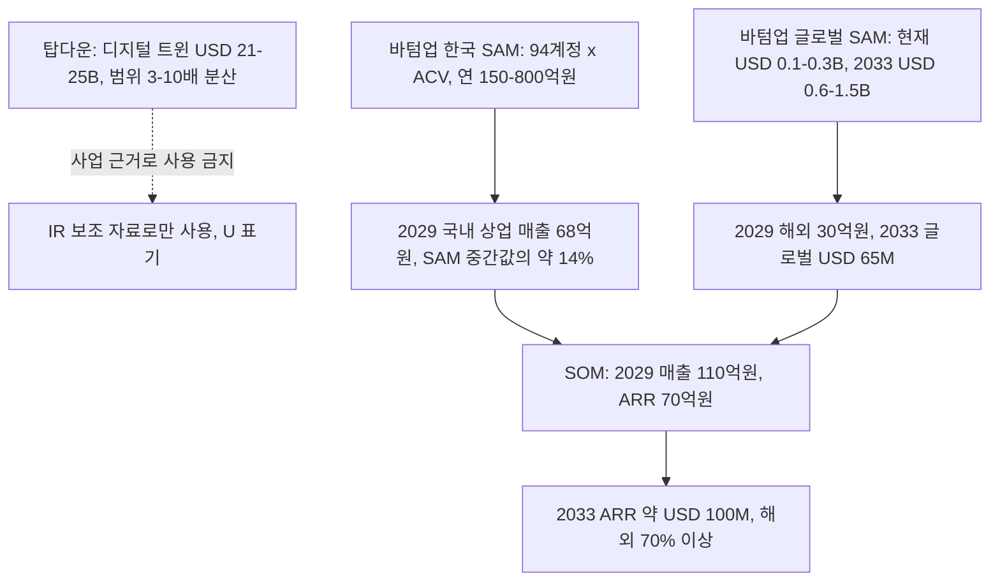
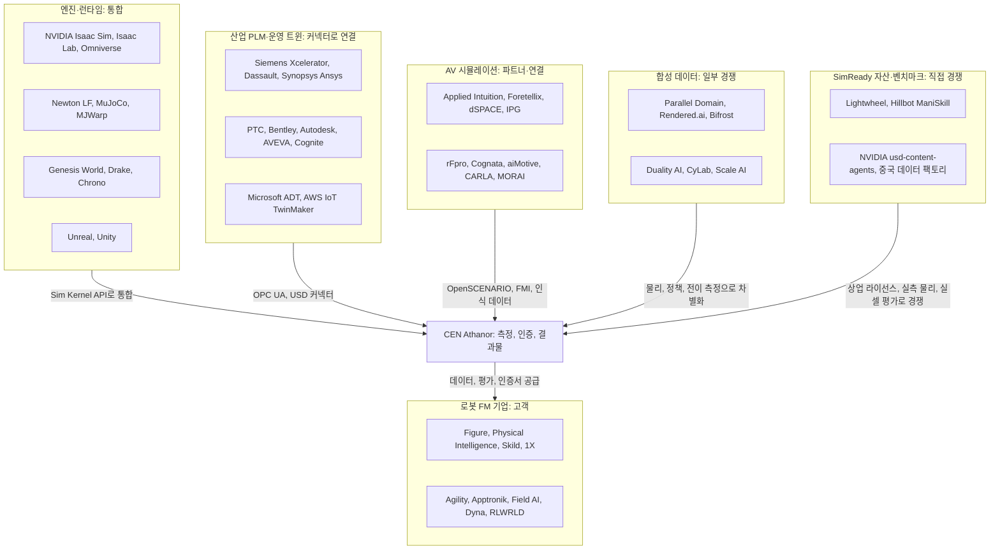
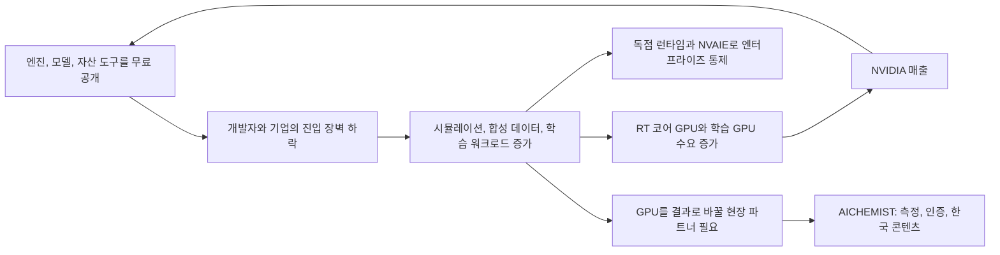
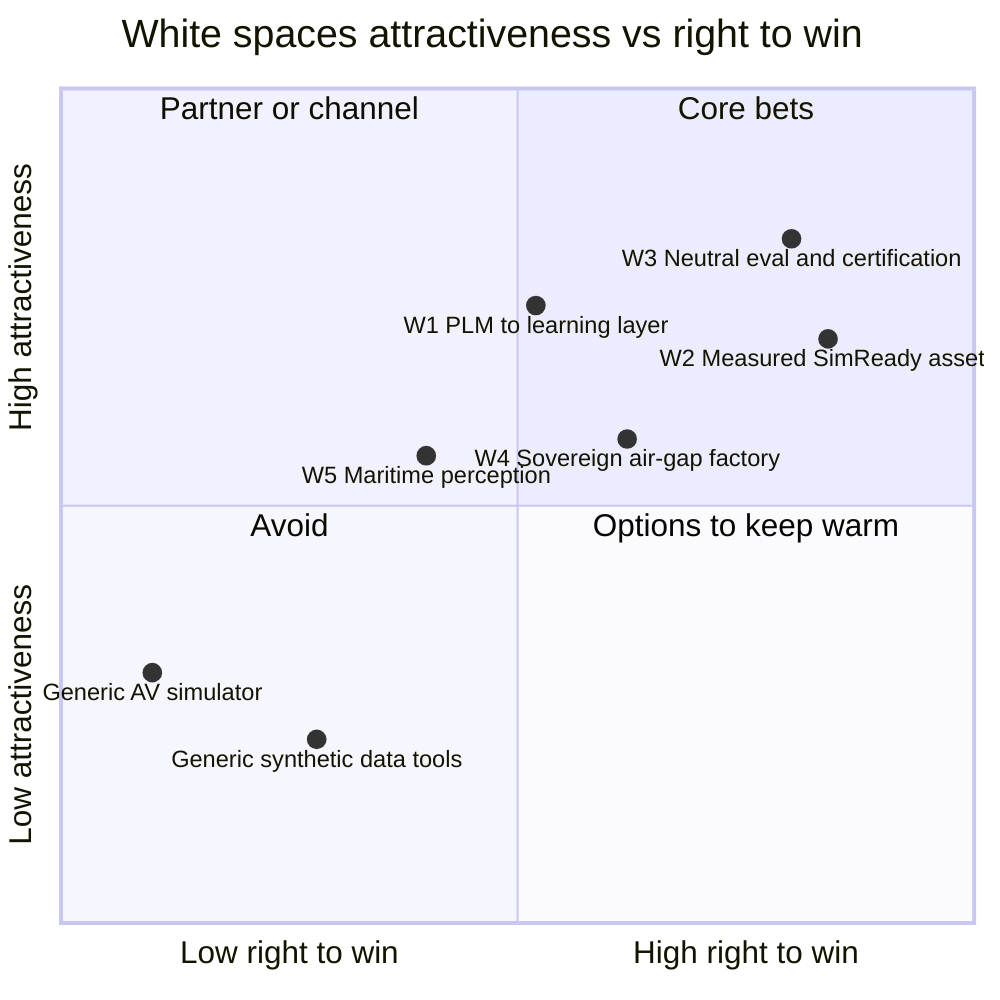
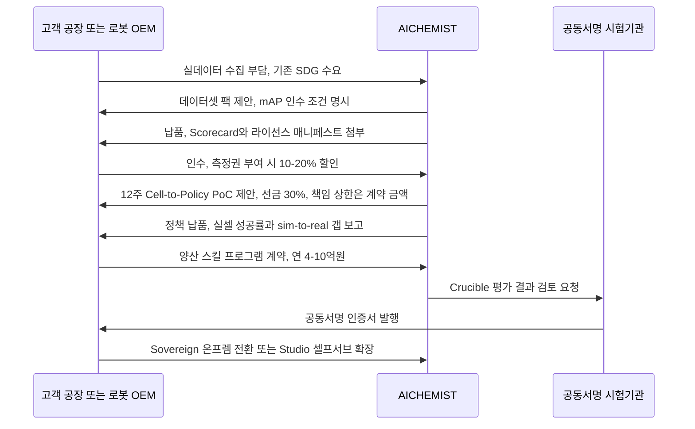

# 02. 시장과 경쟁: 엔진이 무료가 된 시장에서 '증거'를 파는 자리

> **문서 번호** 02 · **기준일** 2026-10-06 · **버전** v1.0 · **상위 문서** [README](README.md)
> **관련 문서** [01 비전·포지셔닝](01-vision-positioning.md) · [03 엔진 선정](03-engine-selection-build-vs-buy.md) · [04 시스템 아키텍처](04-system-architecture.md) · [05 물리·현실감](05-physics-and-realism.md) · [06 사용성·에이전트](06-usability-and-agent.md) · [07 학습 모듈](07-training-module.md) · [08 도메인 팩](08-domain-packs.md) · [09 로드맵·조직·예산](09-roadmap-organization-budget.md) · [10 사업모델·GTM](10-business-model-gtm.md) · [11 리스크·KPI·컴플라이언스](11-risk-kpi-compliance.md) · [12 90일 실행](12-execution-90days.md) · [부록 A 기술 카탈로그](appendix-a-technology-catalog.md) · [부록 B 출처·검증](appendix-b-sources-verification.md)
> **표기** **[A]** 계획 가정(실적 확인 전까지 목표치) · **[U]** 1차 출처 미확인(대외 사용 전 [부록 B](appendix-b-sources-verification.md) 절차로 재검증) · 태그 없는 사실은 GitHub·PyPI·SkyPilot 가격 카탈로그로 확인된 값 · ₩억 = 1억 원, 1 USD = ₩1,400 [A] · 모든 매출 수치는 예측이 아닌 목표 · M1 = 2026년 11월
> **리서치 한계** 시장 규모, 투자 유치액, 가치평가, 경쟁사 가격은 대부분 사전 지식 기반이고 1차 출처로 재확인하지 못했다. 이 문서의 해당 수치는 모두 [U]이며, 이사회·IR·정부 제출 전에 재검증한다.

---

## 핵심 요약

- **탑다운 시장 수치는 사업 규모의 근거로 쓰지 않는다.** 디지털 트윈 전체 시장(USD 21–25B, 2030년 약 USD 150B [U])은 기관마다 범위 정의가 달라 3–10배씩 벌어진다. 우리가 실제로 팔 수 있는 시장은 그 1% 남짓이다.
- **바텀업 SAM:** 한국은 도달 가능 계정 50–100곳 × 평균 ACV ₩3–8억 = **연 ₩150–800억(USD 11–57M)**이다. 글로벌은 로봇 FM·휴머노이드, 글로벌 OEM·통합사, 셀프서브를 합쳐 **현재 USD 0.1–0.3B**, 2033년 USD 0.6–1.5B [A]다. **SOM은 2029년 매출 ₩110억, ARR ₩70억**이다.
- **자본은 시뮬레이터가 아니라 모델과 자율화 스택으로 간다** [U]. 그들에게 시뮬레이터는 내부 도구다. 따라서 우리의 글로벌 고객은 시뮬레이터 구매자가 아니라 **데이터·평가 구매자**다.
- **NVIDIA는 엔진·모델·자산 도구를 무료로 풀고, GPU·NVAIE·독점 런타임으로 번다.** 무료 공개가 늘수록 우리의 원가는 내려간다. 다만 범용 기능은 몇 달 안에 따라잡힌다. 그래서 측정, 권리가 정리된 한국 콘텐츠, 중립 인증에만 투자한다.
- **재벌은 트윈 인프라를 내재화한다. 하지만 자기 자신과 경쟁사를 인증할 수는 없고, 1·2차 협력사를 직접 키울 수도 없다.** 우리는 SI 계열사를 리셀러로 쓰고, 협력사와 로봇 OEM에 판매를 집중한다.
- **5개 화이트스페이스 중 '측정된 상업용 SimReady 자산'과 '중립 sim+real 평가·인증'을 핵심으로 고른다.** PLM 학습 레이어는 채널 메시지로, 소버린 팩토리는 에디션으로, 해양은 Wave 3 옵션으로 둔다.
- **전략 트리거 16개를 분기마다 점검한다.** 1순위 트리거는 NVIDIA 관리형 Isaac 클라우드의 한국 출시와 Lightwheel의 한국 영업 개시다.

---

## 1. 시장 규모

**결론: 탑다운 수치는 '관심의 크기'일 뿐 '살 수 있는 돈'이 아니다. 계정 수 × ACV의 바텀업으로만 계획한다.**

### 1.1 탑다운 수치와 분산 경고

| 시장 | 출처(판) | 기준값 | 전망값 | CAGR | 신뢰도 |
|---|---|---|---|---|---|
| 디지털 트윈 전체 | MarketsandMarkets(2025년판) | USD 21.14B(2025) | USD 149.81B(2030) | 47.9% | [U] |
| 디지털 트윈 전체 | Grand View Research | USD 24.97B(2024) | USD 155.84B(2030) | 34.2% | [U] |
| 디지털 트윈 전체 | MarketsandMarkets(2023년판) | USD 10.1B(2023) | USD 110.1B(2028) | 61.3% | [U] |
| 합성 데이터 생성 도구 | MarketsandMarkets | USD 0.3B(2023) | USD 2.1B(2028) | 45.7% | [U] |
| 합성 데이터 생성 도구 | Grand View Research | 약 USD 218M(2023) | — | 35.3%(2024–2030) | [U] |
| 로보틱스 시뮬레이션 SW | 복수 기관 종합 | USD 1–3B(2024/25) | — | 15–25% | [U] |
| AV·ADAS 시뮬레이션 | 복수 기관 종합 | USD 1.5–3B(2024/25) | — | 10–15% | [U] |
| 휴머노이드 로봇 TAM | Goldman Sachs(2024 갱신) | — | 약 USD 38B(2035) | — | [U] |
| 휴머노이드 시장 | Morgan Stanley 'Humanoid 100'(2025) | — | 약 USD 5조(2050) | — | [U] |

**분산 경고: 왜 3–10배씩 벌어지는가**
- **같은 기관 안에서도 흔들린다.** MarketsandMarkets 2025년판을 2028년까지 연장하면 USD 21.14B × 1.479³ ≈ **USD 68B**다. 같은 기관의 2023년판 2028년 전망(USD 110.1B)과 1.6배 차이가 난다. 2023년판 경로를 2030년까지 연장하면 약 USD 287B로, 2025년판(USD 149.8B)의 1.9배다(계산값 [A]).
- **범위 정의가 다르다.** IIoT 플랫폼, PLM, BIM, 시뮬레이션 SW를 포함하느냐에 따라 같은 해 값이 3–10배까지 달라진다. 로보틱스 시뮬레이션 하나만 봐도 USD 1–3B로 3배 범위다.
- **우리가 팔 수 있는 부분은 1% 남짓이다.** 우리 글로벌 SAM(USD 0.1–0.3B, §1.3)은 디지털 트윈 전체(USD 21–25B)의 약 0.4–1.4%다. 탑다운 수치를 IR에 쓰면 투자자에게 '시장 착시'로 감점받는다.
- **Applied Intuition의 반례.** AV 시뮬레이션 시장 추정치는 USD 1.5–3B인데, Applied Intuition 한 회사의 2025년 ARR 추정치가 약 USD 830M이다 [U]. 결국 '시뮬레이션 시장'이라는 분류 자체가 실제 지출(자율화 툴체인 전체)을 과소 추정하기도 하고, 반대로 디지털 트윈 전체는 과대 포장하기도 한다.

**사용 규칙:** IR·정부 제안서에서 탑다운 수치는 '시장의 관심도'를 보여주는 보조 자료로만, [U] 표기와 함께 쓴다. 사업 규모, 채용, 예산의 근거는 §1.2–§1.4의 바텀업 수치만 쓴다.

### 1.2 바텀업 한국 SAM

**공식:** SAM(한국) = Σ(세그먼트별 도달 가능 계정 수 Nₛ × 연간 계약금액 ACVₛ)
**DR 기준값:** 50–100 계정 × ₩3–8억 ≈ **연 ₩150–800억(USD 11–57M)**. 중소기업·바우처 세그먼트 연 ₩20–40억은 별도다.

| 세그먼트 | 계정 수(DR 구성) [A] | ACV 범위 [A] | 하단(₩억) | 중간값(₩억) | 상단(₩억) | ACV 근거(DR 가격표) |
|---|---|---|---|---|---|---|
| 로봇 OEM·통합사 | 15 | ₩2–6억 | 30 | 60 | 90 | PoC ₩1.5–2.5억 + 데이터셋 ₩0.5–2억 + Arena 회원 |
| 재벌 계열 공장·AI팩토리 과제 | 20 | ₩4–12억 | 80 | 160 | 240 | 양산 스킬 프로그램 연 ₩4–10억, Sovereign 연 ₩4–8억 |
| 1·2차 제조 협력사 | 30 | ₩1.5–4억 | 45 | 82.5 | 120 | 데이터셋·셀 트윈, 바우처 연계 |
| 물류·3PL | 8 | ₩3–8억 | 24 | 44 | 64 | 피킹 데이터셋 + 스킬(수요 미검증) |
| 조선·중공업 | 6 | ₩5–15억 | 30 | 60 | 90 | 작업장 셀 + 해양 인식(Wave 3) + 온프렘 |
| 방산·국방연구 | 5 | ₩5–15억 | 25 | 50 | 75 | Air-gap 연 ₩8–15억 |
| 연구기관 | 10 | ₩1–3억 | 10 | 20 | 30 | Studio Team, 평가 캠페인 |
| **합계** | **94** | **가중평균 약 ₩5.1억** | **244** | **약 477** | **709** | — |

- **해석:** DR 구성(94계정)에 세그먼트별 ACV를 적용하면 ₩244–709억, 중간값 약 ₩477억(USD 34M)이다. DR 범위(₩150–800억) 안에 있다. DR 범위의 하단은 계정 수가 50곳으로 줄어드는 경우를 반영한다.
- **한국 단일 벤더 상한:** ARR 약 USD 20–30M(₩280–420억)이다 [U]. SAM 중간값의 60–90%에 해당하므로, 한국만으로는 USD 100M ARR에 닿지 못한다. 이것이 글로벌 데이터·평가 공급을 M12–M15에 시작하는 이유다.

### 1.3 바텀업 글로벌 SAM

**공식:** SAM(글로벌) = ① FM·휴머노이드 기업 수 × 외부 데이터·평가 지출 + ② 글로벌 OEM·통합사·AI팩토리 수 × ACV + ③ 셀프서브 시장

| 구성 | 계정 수 | 연 지출 | 계산 | 값 | 근거 |
|---|---|---|---|---|---|
| ① 로봇 FM·휴머노이드 기업 | 40–60곳(Figure, Physical Intelligence, Skild, 1X, Agility, Apptronik, Field AI, Dyna, Genesis AI 등) | USD 1–3M | 40 × 1 ~ 60 × 3 | USD 40–180M | 자금 규모 [U] |
| ② 글로벌 로봇 OEM·통합사·AI팩토리 | 약 300곳 | USD 0.1–0.3M | 300 × 0.1 ~ 300 × 0.3 | USD 30–90M | [A] |
| ③ 셀프서브 Forge·인증 자산·데이터셋 | — | — | 합성 데이터 도구 시장의 일부 | USD 30–60M | [U] |
| **합계(현재)** | | | | **USD 100–330M(약 0.1–0.3B)** | |
| **2033년 전망** | | | | **USD 0.6–1.5B** [A] | 휴머노이드 설비투자, 합성 데이터 연 35–46% 성장 [U] |

**정합성 메모:** 2033년 범위(USD 0.6–1.5B)는 현재 값에 5–6배를 곱한 것으로, 연 약 26–29% 성장에 해당한다. 합성 데이터 시장 성장률(35–46% [U])을 7년간 그대로 복리로 적용하면 8–14배가 된다. 따라서 DR 수치는 의도적으로 보수적인 값이다. IR에서는 보수적인 DR 범위만 쓴다.

### 1.4 SOM과 시장 점유율 정합성 점검

**공식:** SOM(연도 t) = 목표 매출(t). 정합성 검증은 '목표 매출 ÷ SAM = 요구 점유율'로 한다.

| 시점 | 목표 | 국내/해외 분해 | 요구 점유율 | 판정 |
|---|---|---|---|---|
| 2027 | 매출 ₩15억(정부재원 ₩6억 포함), 연말 ARR ₩3억 | 국내 100% | 상업 매출 ₩9억 ÷ 한국 SAM 중간값 ₩477억 ≈ 1.9% | 무리 없음 |
| 2029 | 매출 ₩110억(≈USD 7.9M), 연말 ARR ₩70억(≈USD 5M) | 해외 ₩30억(27%), 국내 ₩80억(그중 정부재원 ₩12억) | 국내 상업 ₩68억 ÷ ₩477억 ≈ **14%** (SAM 하단 ₩150억 기준으로는 45%). 해외 ₩30억(≈USD 2.1M) ÷ USD 100–330M ≈ 0.6–2.1% | 국내는 SAM 중간값 수준이 전제다. SAM이 하단으로 확인되면 2029년 계획을 하방 시나리오(₩60억) 기준으로 다시 잡는다 [A] |
| 2033 | ARR 약 USD 100M | 한국 약 USD 25–30M, 글로벌 데이터·평가 약 USD 45M, 셀프서브·마켓 약 USD 20M, 동맹국 소버린·국방 약 USD 10M | 글로벌(데이터·평가 + 셀프서브) USD 65M ÷ 2033 SAM USD 0.6–1.5B ≈ **4–11%** [A] | 카테고리 상위권이면 달성 가능한 범위 |

- **단위경제 교차검증:** 2029년 결과물 4개 라인(Data ₩22억 + Skill ₩25억 + Forge ₩10억 + Crucible ₩12억 = ₩69억)을 유료 결과물 고객 누적 40곳으로 나누면 고객당 약 ₩1.7억이다. PoC 단가(₩1.5–2.5억)와 데이터셋 팩 단가(₩0.5–2억) 범위 안이다 [A].
- **조기경보:** 2027년 말까지 국내 세그먼트별 실측 ACV를 10건 이상 모은다. 가중평균이 ₩3억 미만이면 한국 SAM을 하단으로 다시 잡고 해외 착수를 앞당긴다.

---

## 2. 2025–2026 Physical AI 자본 흐름

**결론: 돈은 '모델과 자율화 스택'으로 갔고, 독립 시뮬레이터·범용 합성 데이터 회사는 정체됐다. 우리는 돈을 받은 쪽(FM 기업)에게 데이터와 평가를 판다.**

| 시점 | 기업·거래 | 규모 | 분류 | 신뢰도 |
|---|---|---|---|---|
| 2023-10 이후 | Parallel Domain | GitHub의 step-sdk 보관 처리(2023-10), 이후 포크만 존재 | 범용 AV 합성 데이터 | GitHub 확인 |
| 2025-03 | Siemens, Altair 인수 완료 | 약 USD 10B | 산업 시뮬레이션 통합 | [U] |
| 2025-06 | Applied Intuition Series F | USD 600M, 가치 USD 15B. ARR 약 USD 830M(2025 추정) | AV·국방 툴체인 | [U] |
| 2025-06 | Meta, Scale AI 지분 49% 인수 | 약 USD 14.3B | 사람 기반 데이터 | [U] |
| 2025-07 | Genesis AI 시드 | USD 105M(Eclipse, Khosla) | 오픈 엔진 + 자체 모델 | [U] |
| 2025-07-17 | Synopsys, Ansys 인수 완료 | 약 USD 35B | 물리 솔버 통합 | [U] |
| 2025-08 | Field AI | USD 405M, 가치 USD 2B | 로봇 FM | [U] |
| 2025 | Dyna Robotics Series A | USD 120M | 로봇 FM | [U] |
| 2025-09 | Figure Series C | USD 1B 초과, 가치 USD 39B(NVIDIA, LG Technology Ventures 참여) | 휴머노이드 | [U] |
| 2025-09 | NVIDIA, Wayve 투자 의향서 | 최대 USD 500M | 엔드투엔드 AV | [U] |
| 2025-10 | 1X NEO 사전 예약 | USD 20,000 또는 월 USD 499. 가치 USD 10B 이상 라운드 보도 | 가정용 휴머노이드 | [U] |
| 2025-10-31 | NVIDIA 한국 Blackwell 배정 | 260k장 이상(정부·Samsung·SK·HMG 각 약 50k, Naver 약 60k). HMG 약 USD 3B Physical-AI 클러스터 | 국가 인프라 | [U] |
| 2025-11 | Physical Intelligence | USD 600M, 가치 USD 5.6B | 로봇 FM | [U] |
| 2026-01 | Skild AI | 가치 약 USD 14B(SoftBank·NVIDIA 보도) | 로봇 FM | [U] |
| 2026-01 | Foretellix 인력 29명 감축(누적 투자 USD 135M) | — | AV 검증 도구 | [U] |
| 2026-01/02 | Waabi Series C | USD 750M + Uber 마일스톤 최대 USD 250M | 시뮬레이션 우선 자율주행 | [U] |
| 2026-05 | Decart | USD 300M, 가치 약 USD 4B | 월드모델 | [U] |

**시사점**

| # | 관찰 | 해석 | 우리의 행동 |
|---|---|---|---|
| 1 | FM·휴머노이드 기업이 수억–수십억 달러를 조달했다 | 이들은 시뮬레이터를 내부에서 돌리지만 데이터·평가는 외부에서 산다. 외부 지출은 계정당 연 USD 1–3M 수준이다 | 글로벌 데이터·평가 GTM을 M12–M15에 원격 우선으로 시작한다 |
| 2 | Waabi·Wayve·Tesla·Waymo는 시뮬레이터를 팔지 않는다 | 선도 자율화 기업은 시뮬레이션을 내재화한다. 범용 시뮬레이터 판매 시장은 줄어든다 | 시뮬레이터 좌석을 팔지 않는다. 결과물과 인증서만 판다 |
| 3 | Parallel Domain 정체, Foretellix 감원 | 수평형 범용 합성 데이터·검증 도구는 독립 사업으로 버티기 어렵다 | '도구'가 아니라 '측정된 전이 성능'을 판다. 버티컬 Domain Pack으로 깊이를 확보한다 |
| 4 | Synopsys–Ansys, Siemens–Altair | 기존 강자는 솔버와 엔지니어링 데이터를 통합한다. 로봇 학습에는 투자하지 않는다 | "기존 PLM 트윈을 위한 AI 학습 레이어"로 커넥터 전략을 쓴다 |
| 5 | 한국에 Blackwell 260k장 [U] | 재벌은 GPU를 이미 확보했다. 병목은 GPU가 아니라 GPU를 결과로 바꾸는 역량이다 | GPU를 파는 대신 GPU를 결과물로 바꾸는 라인을 판다. 정부 B200/H200은 학습 전용 업사이드로만 잡는다 |
| 6 | 월드모델 투자 급증(Decart, Wayve GAIA, Waymo World Model) | 외형 다양성은 생성 모델이 가져간다. 물리와 라벨의 정답은 여전히 시뮬레이터에 있다 | Cosmos는 외형 증강에만 쓰고, 라벨 일관성 QA를 판매 조건으로 둔다 |

---

## 3. 레이어별 경쟁 지형

**결론: 일곱 개 레이어 중 우리가 경쟁하는 곳은 'SimReady 자산·합성 데이터·평가'의 교차점 하나다. 나머지는 통합하거나, 연결하거나, 고객으로 삼는다.**

| 레이어 | 대표 기업 | 레이어의 수익 모델 | 2026년 상태 | 우리와의 관계 |
|---|---|---|---|---|
| ① 엔진·런타임 | NVIDIA, Google DeepMind, Newton(LF), Genesis AI, Epic, Unity | 무료 엔진 + GPU·엔터프라이즈 지원·독점 런타임 | 무료화가 끝났다. 월 단위 릴리스 | **통합**(Sim Kernel API 뒤에 둔다) |
| ② 산업 PLM·운영 트윈 | Siemens, Dassault, Synopsys/Ansys, PTC, Bentley, Autodesk, AVEVA, Cognite, Microsoft, AWS | 좌석·엔터프라이즈 라이선스, 사용량 과금 | 솔버 통합. 로봇 학습 기능은 없다. 하이퍼스케일러는 범용 트윈 PaaS에서 후퇴했다 | **연결**(PLM 트윈 → USD 학습 환경) |
| ③ AV 시뮬레이션 | Applied Intuition, Foretellix, dSPACE, IPG, rFpro, Cognata, aiMotive, CARLA, MORAI | OEM당 다년 라이선스, HIL 하드웨어 | 포화 상태. 신경·월드모델 시뮬레이션이 수작업 장면을 대체하고 있다 | **파트너·연결**(MORAI, OpenSCENARIO·FMI 브리지) |
| ④ 합성 데이터 | Parallel Domain, Rendered.ai, Bifrost, Duality, CyLab, Scale AI | 데이터셋·구독·작업 단위 과금 | 수평형은 정체. 국방·항공 틈새에서만 생존 | **부분 경쟁**(물리·정책·전이 측정으로 차별화) |
| ⑤ SimReady 자산·벤치마크 | Lightwheel, Hillbot/ManiSkill, NVIDIA usd-content-agents, 중국 데이터 팩토리 | 자산 판매, 데이터 서비스(비공개 가격) | 추정 수준 자산은 범용화. 측정·상업 라이선스 자산은 드물다 | **직접 경쟁** |
| ⑥ 로봇 FM 기업 | Figure, Physical Intelligence, Skild, 1X, Agility, Apptronik, Field AI, Dyna, Genesis AI, RLWRLD | 로봇·모델 판매 | 자금 풍부. 시뮬레이션은 내재화, 데이터·평가는 외부 구매 | **고객**(데이터·평가 공급) |
| ⑦ 한국 플레이어 | MORAI, CyLab, E8, VIRNECT, NAVER LABS, 그룹 SI | 프로젝트·라이선스 | 시뮬레이터는 MORAI가 유일한 규모 플레이어다 | 경쟁·파트너 혼재(§7) |

---

## 4. 상세 경쟁사 표

**결론: 44개 행(개별 기업과 그룹)을 분석한 결과, 정면 경쟁은 4곳(Lightwheel, Hillbot/ManiSkill, CyLab, 중국 데이터 팩토리)뿐이다. 나머지는 기반, 연결 대상, 파트너, 고객이다.**

가격 정보는 대부분 비공개이거나 사전 지식 기반이다 [U]. 'AICHEMIST 대응'의 동사는 **통합 / 연결 / 파트너 / 경쟁 / 판매(고객) / 회피 / 관찰** 중 하나로 표준화한다.

| # | 기업 | 레이어 | 제공물 | 가격 모델 | 강점 | 약점 | AICHEMIST 대응 |
|---|---|---|---|---|---|---|---|
| 1 | NVIDIA Isaac Sim·Isaac Lab·Omniverse | 엔진 | Isaac Sim 6.1.0, Isaac Lab 3.0-EA, Kit 110.x, ovrtx·ovphysx(alpha), Cosmos, GR00T N1.7, 블루프린트 | 코드 무료. 런타임 독점. NVAIE·Omniverse Enterprise 약 USD 4,500/GPU/년 [U] | 사실상 표준, OpenUSD 네이티브, RTX 센서 | GPU 종속, RT 코어 필요, 파괴적 API 변경, 연구자 UX | **통합 + co-sell.** Zone F에서만 독점 런타임 사용. 측정·인증·한국 콘텐츠로 가치 이전 |
| 2 | Newton(Linux Foundation) | 엔진 | GPU 물리 엔진(MJWarp, VBD, Kamino, MPM) | Apache-2.0 무료 | 중립 거버넌스, 처리량 최상위 | float32, GPU 비결정적, 60 DoF 초과 메커니즘에 약함 | **통합(기본 백엔드) + 업스트림 기여** |
| 3 | Google DeepMind(MuJoCo, MJWarp, Gemini Robotics, Intrinsic) | 엔진·모델 | MuJoCo 3.15, sysid 툴박스, Gemini Robotics 1.5 [U] | Apache-2.0 / API | 가장 많이 인용되는 접촉 물리, MJCF 표준 | 사실적 렌더링 없음, 최종 사용자 플랫폼 없음 | **통합**(재현·인증 백엔드). HMG·Boston Dynamics 계정 관련 동향 **관찰** |
| 4 | Genesis AI(Genesis World) | 엔진·모델 | 멀티피직스 엔진 1.4.3, 자체 모델 GENE-26.5, Nyx 렌더러(폐쇄) | Apache-2.0(엔진). 시드 USD 105M [U] | 변형체·유체를 하나의 API로, 커뮤니티 약 30k stars | 산업·OpenUSD 도구 약함, 43M FPS 주장 비판받음 | **관찰**(비CUDA 헤지) + 데이터·평가 **판매** 후보 |
| 5 | Epic Unreal Engine | 엔진 | UE5, Cesium for Unreal | 비게임 기업(연매출 USD 1M 초과) 약 USD 1,850/석/년 [U] | 최고 수준의 사실적 렌더링, 인재 풀 | Chaos 물리는 로봇용이 아님, 배치 RL 없음 | **회피**(Zone T 렌더는 WebGPU·3DGUT). 고객 보유 시 연결 |
| 6 | Unity(Unity 6, Unity Industry) | 엔진 | 실시간 3D, 브라우저 배포 | 좌석 구독(Unity Industry 약 USD 4,950/석/년 [U]) | 개발자 저변 | PhysX 4 세대 물리, 로봇 투자 축소 | **회피** |
| 7 | Siemens Xcelerator(Process Simulate, Teamcenter, Simcenter, Altair) | PLM | 공장·라인 엔지니어링 트윈, Omniverse 연동 | 좌석 + Xcelerator-as-a-Service, Altair 유닛 과금 | 한국 조선·자동차 설치 기반, 엔지니어링 데이터 장악 | 운동학·PLC 중심, 학습 불가, 고가 | **연결**: Process Simulate·Teamcenter → USD 학습 환경 커넥터 |
| 8 | Dassault 3DEXPERIENCE(CATIA, DELMIA, SIMULIA) | PLM | 가상 트윈, 조선·항공 설계 | 역할·좌석 라이선스 | 한국 조선·항공 설계 표준 | 폐쇄적 생태계, 로봇 학습 없음 | **연결**: CATIA·DELMIA → USD(조선 Domain Pack) |
| 9 | Synopsys + Ansys | PLM·솔버 | AVxcelerate Sensors 2026 R1, Fluent, SimAI | 엔터프라이즈 좌석, 고가 | 레이더·EM·CFD 솔버 정밀도 최고 | 실시간·배치 RL 불가, 고가 | **파트너**: 해양·국방 레이더 충실도 검증의 기준 솔버 후보 |
| 10 | PTC(Creo, Windchill, Vuforia) | PLM | CAD·PLM, ThingWorx·Kepware 매각 합의 보도 [U] | 좌석 구독 | CAD 기반 | IoT 트윈 사업 후퇴 | **연결**(소규모 커넥터만) |
| 11 | Bentley iTwin + Cesium | 인프라 트윈 | 도시·인프라 지리공간, 3D Tiles | 소비 기반, Cesium ion 구독 | 도시 규모 스트리밍 | 로봇·차량 물리 학습 없음 | **연결**(드론·AV 장면의 3D Tiles import) |
| 12 | Autodesk(Tandem, Revit, Fusion) | AEC 트윈 | BIM, 시설 트윈 | 좌석, 시설 단위 [U] | 창고·공장 BIM 데이터 원천 | 운영 트윈, 학습용 아님 | **연결**(BIM → SimReady 파이프라인) |
| 13 | AVEVA(Schneider Electric) | 공정·해양 트윈 | AVEVA Marine·E3D, PI System | 엔터프라이즈 구독 | 조선·플랜트 엔지니어링 데이터 | 로봇 학습 없음 | **연결**(조선 Domain Pack 데이터 커넥터) |
| 14 | Cognite | 산업 DataOps | Data Fusion, Atlas AI | 엔터프라이즈 SaaS | OT/IT 데이터 맥락화 | 물리·로봇 시뮬레이션 없음 | **관찰**(에너지·중공업 데이터 원천) |
| 15 | Microsoft(Azure Digital Twins, Fabric Digital Twin Builder) | 하이퍼스케일러 | 그래프·IoT 트윈 | 연산·메시지 단위 과금 | 엔터프라이즈 데이터 통합 | Fabric 트윈 빌더는 2026-05 문서 기준 프리뷰, 물리 없음 | **관찰**(KPI 데이터 싱크로만 연결) |
| 16 | AWS IoT TwinMaker | 하이퍼스케일러 | IoT 트윈 | 엔티티·API 과금 [U] | AWS 통합 | 정체(신규 고객 수용 여부 [U]) | **회피**. AWS는 GPU 인프라로만 사용 |
| 17 | Applied Intuition | AV | Simian, Spectral, Neural Sim, Vehicle OS, 국방 자율화 | OEM당 연 수백만 달러 추정 [U] | 카테고리 선두(가치 USD 15B, ARR 약 USD 830M 추정 [U]) | AV·국방 중심, 조작·휴머노이드 약함, 고가 | **회피**(정면 경쟁 금지). 사용 OEM에 OSI·OpenSCENARIO로 데이터 공급 |
| 18 | Foretellix | AV 검증 | Foretify, OpenSCENARIO DSL | 엔터프라이즈(비공개) | 커버리지 기반 안전 논증, 표준 영향력 | 외부 시뮬레이터 의존, 2026-01 감원 | **연결**: LLM → OpenSCENARIO DSL 출력 호환 |
| 19 | dSPACE AURELION, IPG CarMaker, Siemens Prescan, Hexagon VTD, MathWorks RoadRunner | AV·HIL | ADAS 시뮬레이션, HIL | 좌석·노드 고정 + HIL 하드웨어, 좌석당 연 수만 달러 [U] | 형식 인증·HIL 워크플로, OEM 신뢰 | ML 네이티브 아님, 배치 학습 없음 | **연결**: FMI 3.0·ASAM 포맷으로 합성 센서 데이터 공급 |
| 20 | rFpro AV elevate | AV 센서 | 다중 경로 레이 트레이싱, 180개 이상 실제 장소 트윈(노면 1 mm 정밀) | 독점 라이선스 | 엔지니어링급 센서 현실감 | 고가, OEM 협소 | **관찰**(센서 충실도 벤치마크 기준) |
| 21 | Cognata | AV·국방 | SimCloud, AVBox(오프로드·국방) | 독점(누적 약 USD 27.8M [U]) | 국방·오프로드 전환 | 소규모 | **관찰**(Wave 3b 참고) |
| 22 | aiMotive aiSim(Stellantis) | AV | ASIL-D 툴 인증 시뮬레이터, 재조명 가능 스플랫 | 독점 | 유일한 ASIL-D 툴 인증 | Stellantis 종속 | **관찰**(툴 인증 접근법 참고) |
| 23 | CARLA | AV 오픈소스 | 0.10.0(UE 5.5), 0.9.16(Cosmos·NuRec 연동) | MIT 코드, CC-BY 자산, 무료 | 학계 표준 | 상용 지원 제한, 릴리스 느림 | **연결**(학계 고객 커넥터). 자산은 CC-BY 귀속 관리 |
| 24 | Waabi World, Wayve GAIA-3, Waymo World Model, Tesla 월드 시뮬레이터 | 내부 신경 시뮬레이션 | 생성형 폐루프 시뮬레이터(판매 안 함) | 내부용 | 시뮬레이션 우선 개발의 상업적 증거 | 외부 판매 없음 | **관찰**: 범용 AV 시뮬레이터 시장 축소 신호 |
| 25 | Parallel Domain | 합성 데이터 | AV 합성 센서 데이터, PD Replica | 구독(비공개) | 초기 선도 | 공개 개발 정체(GitHub) | **관찰**(경고 사례: 수평형 AV 데이터의 한계) |
| 26 | Rendered.ai | 합성 데이터 | 합성 데이터 PaaS(anatools) | 구독 PaaS | 개발자 친화 | 소규모, 범용 도구 | **경쟁 회피**(도구가 아니라 결과물 판매) |
| 27 | Bifrost | 합성 데이터 | 국방·항공·해양 합성 데이터 | 데이터셋·엔터프라이즈(Series A 약 USD 8M [U]) | 국방 틈새, 끈끈한 계약 | 소규모 | **관찰**(Air-gap 에디션 사업모델 참고) |
| 28 | Duality AI(Falcon) | 합성 데이터·트윈 | UE 기반 Falcon 5.4, DARPA RACER, 미 육군 대드론 합성 데이터 | 엔터프라이즈·정부 계약 | 국방 합성 데이터 사업모델 검증 | UE 물리는 조작용으로 한계, 미국 국방 중심 | **관찰**(Wave 3b 최근접 유사 기업). 한국 국방 진출 시 경쟁 |
| 29 | Scale AI / Surge AI | 사람 데이터 | 텔레옵·라벨링 데이터 서비스 | 작업·시간 단위, 프로젝트 USD 100k–수천만 [U] | 노동 규모, 프런티어 랩 관계 | 사람 데이터는 비싸고 느리다 | **파트너**: Mimic이 시연을 100배로 늘리고 Arena가 정책을 채점한다 |
| 30 | **Lightwheel** | SimReady 자산 | SimReady 자산(비상업 무료), LW-BenchHub 268개 과제, leisaac, MJCF↔USD 변환기 | 상업 자산·데이터 서비스 비공개 [U] | 가장 가까운 유사 기업, NVIDIA 정렬, MuJoCo–USD 연결 | 시뮬 전용 평가, 무료 자산 비상업, 지역 거점 [U] | **경쟁**: 상업 라이선스, 실측 물리, 한국 SKU, 실셀 평가. 해외 **리셀러** 후보 |
| 31 | **Hillbot / ManiSkill3** | SimReady 자산·벤치마크 | GPU 병렬 조작 시뮬레이션·렌더링 | 코드 Apache-2.0, 자산 CC BY-NC 4.0 | 빠른 시각 RL, Real2Sim 연구 계보 | 비상업 자산, 상업 실적 미확인 | **경쟁**: 벤치마크 호환 + 상업용 자산 팩으로 공백 공략 |
| 32 | NVIDIA usd-content-agents | 자산 도구 | 재질·물성 분류·관절 추론·검증 자동화 | Apache-2.0 무료 | 수작업 SimReady 변환을 범용화 | 추정치 수준, 실측 없음 | **통합**(Bronze 단계 자동화). Silver·Gold로 차별화 |
| 33 | **중국 데이터 팩토리**(51WORLD, Manycore SpatialVerse, AgiBot Genie Sim, Galbot) | 자산·데이터 | 저가 실내 장면, 대규모 실·합성 데이터셋 | 공격적 저가, 다수 공개 데이터셋 [U] | 규모, 원가, 정부 지원 | 국방·재벌·미국 연계 고객의 신뢰 장벽. AgiBot World·GO-1은 CC BY-NC-SA | **경쟁**: '신뢰할 수 있는 비중국·라이선스 청정 공급자' 포지션 |
| 34 | Physical Intelligence | 로봇 FM | pi0, pi0-FAST, pi0.5 오픈 가중치(openpi 14.1k stars) | 가치 USD 5.6B [U] | 최고 수준 오픈 VLA | 실텔레옵 데이터 의존 | **판매(고객)** + 베이스 모델(가중치 약관 확인 전까지 pi0.5 차단) |
| 35 | Skild AI | 로봇 FM | Skild Brain | 가치 약 USD 14B [U] | 대규모 시뮬레이션·사람 영상 학습 | 플랫폼 벤더 아님 | **판매(고객)**: 합성 데이터·평가 |
| 36 | Figure AI | 휴머노이드 | Figure 03, Helix VLA | 가치 USD 39B [U] | 자본, 수직 통합 | 시뮬레이션 내재화 | **판매(고객)**: 평가·롱테일 데이터. LG 연결고리 활용 |
| 37 | Field AI, Dyna, 1X, Agility, Apptronik | 로봇 FM·휴머노이드 | 로봇·모델 | 수억 달러대 조달 [U] | 학습 데이터·평가 예산 급증 | 대부분 파이프라인 내재화 | **판매(고객)**: 인증 자산, VLA 데이터 팩, Crucible 평가 |
| 38 | **MORAI** | 한국 AV 시뮬레이터 | MORAI SIM Drive·Sky, HD맵 → 트윈, K-City, 국방 MOU | 상용 라이선스(Series B ₩250억, 누적 약 USD 24.9M, 고객 100곳 이상 [U]) | 국내 OEM·정부·국방 관계, 미국·독일 법인 | 조작·휴머노이드 RL 제한, 고전적 시뮬레이터 | **파트너**(AV 인식 데이터 유통). 해양에서는 도구가 아니라 데이터·평가로 차별화 |
| 39 | **CyLab(씨이랩)** | 한국 합성 데이터 | 인식 합성 데이터, XAIVA, NVIDIA 파트너 [U] | 프로젝트 | 국내 레퍼런스, NVIDIA 관계 | 물리·정책·전이 측정 없음 | **경쟁**: 단순 SDG 가격 경쟁은 피하고 물리·정책·측정된 전이로 차별화 |
| 40 | E8(이에이트) NDX PRO | 한국 도시·산업 트윈 | 자체 SPH/CFD(NFLOW), 스마트시티·공장 트윈 | 공공 조달 프로젝트 [U] | 공공 레퍼런스, 자체 솔버 | 로봇·ML 학습 역량 약함 | **회피**(도시 트윈 예산에서 경쟁하지 않는다) |
| 41 | VIRNECT | 한국 XR 트윈 | XR 저작·트래킹 | SaaS·엔터프라이즈(적자 [U]) | 산업 XR 고객 | 물리·로봇 학습 없음, 재무 제약 | **파트너** 후보(XR 채널) |
| 42 | NAVER LABS / NAVER Cloud | 한국 지도 트윈·클라우드 | ALIKE 매핑, ARC 로봇, 사우디 디지털 트윈, 약 60k GPU [U] | 프로젝트·클라우드 | 도시 규모 트윈, 소버린 클라우드 | 시뮬·학습 플랫폼 판매 안 함 | **파트너**(RT GPU 호스팅, co-sell). 도시 트윈은 **회피** |
| 43 | 그룹 SI(Samsung SDS, LG CNS, SK AX, Hyundai AutoEver, POSCO DX, HD Hyundai 계열 IT) | 한국 SI | Siemens·Dassault·NVIDIA 기반 그룹 트윈 구축 | 내부 이전가격·SI | 고객 관계와 조달 장악 | 로봇 학습·합성 데이터 깊이 부족 | **파트너(리셀러)**. 내재화 위험은 계약 조항으로 통제(§6) |
| 44 | RLWRLD | 한국 로봇 FM | RLDX-1(6.9B/8.1B VLA, 2026-05-06), LIBERO 97.8% | 코드 Apache-2.0, 가중치 비상업 | 국내 덱스터러스 VLA, 합성 증강 활용 | 가중치 비상업 | **판매(고객)** + 공동 마케팅. 가중치는 NEVER 목록 |

### 4.1 배틀카드: 영업 현장에서 가장 자주 나올 반론 6가지

| 반론 | 반론의 출처 | 사실관계 | 우리의 답변 | 증거 자료 |
|---|---|---|---|---|
| "NVIDIA Isaac Lab은 공짜인데 왜 돈을 내나?" | 고객 기술팀 | 엔진·학습 프레임워크는 무료가 맞다. 측정된 물성, 실셀 검증, 책임을 지는 계약은 무료가 아니다 | "엔진 값은 받지 않습니다. 현실과의 오차를 측정하고, 인수 기준을 계약서에 숫자로 쓰는 값을 받습니다." | Scorecard 샘플, PoC 오퍼 시트 |
| "Lightwheel 자산이 더 많다" | 해외 사례를 본 고객 | 무료 SimReady 자산은 비상업용이다. LW-BenchHub 268개 과제는 시뮬 전용이다 | "상업 라이선스와 실측 물성이 붙은 자산, 그리고 실셀 평가를 드립니다." | 라이선스 매니페스트, Gold 인증서 |
| "CyLab이 더 싸게 합성 이미지를 만든다" | 구매 부서 | 이미지 단가 경쟁은 우리가 이기려는 싸움이 아니다 | "이미지 장당 가격이 아니라 실데이터 mAP의 90%를 보증하는 데이터셋을 팝니다." | mAP 인수 조건, 소량 실데이터 곡선 |
| "우리 그룹 SI가 Omniverse로 하면 된다" | 재벌 계열사 | SI는 인프라를 만들 수 있다. 자기 인증과 그룹 간 중립 자산은 만들 수 없다 | "SI가 인프라를 맡고, 측정과 인증은 저희가 맡습니다. SI에는 리셀러 마진을 드립니다." | SI 리셀러 계약 템플릿 |
| "중국 데이터셋이 공짜다" | 연구 조직 | AgiBot World·GO-1은 CC BY-NC-SA다. 상업 제품에 쓸 수 없다 | "상업적으로 써도 되는 데이터인지 출처와 권리를 증명합니다." | 출처 레지스트리, 거부 목록 |
| "시뮬에서 된 게 현실에서 될지 모른다" | 모든 구매자 | 정당한 우려다. 리서치도 이를 가장 큰 고객 고통으로 지목했다 | "그래서 실셀에서 측정하고, 갭이 15%p를 넘으면 인수하지 않으셔도 됩니다. 책임 상한은 계약 금액입니다." | 정책 갭 KPI, 책임 상한 조항 |

---

## 5. NVIDIA 범용화 분석

**결론: NVIDIA는 '보완재를 무료로 만들어 핵심 상품(GPU)을 파는' 전략을 쓴다. 무료 공개 하나하나는 우리의 원가 절감이고, NVIDIA가 통제하는 지점은 독점 런타임과 RT 코어 GPU 두 곳이다.**

### 5.1 무료로 주는 것과 돈을 받는 것

| 구분 | 무료로 주는 것(라이선스) | 돈을 받는 것 | 통제 지점 |
|---|---|---|---|
| 물리 | Newton(Apache-2.0, LF), PhysX SDK 5.11(코어 Apache-2.0), Warp(Apache-2.0) | — | Warp 1.18은 Turing 이상 GPU와 R580 이상 드라이버가 필요하다. 사실상 NVIDIA GPU 전용 |
| 학습 | Isaac Lab 소스(BSD-3, mimic은 Apache-2.0), Isaac Lab Arena | isaacsim·isaaclab PyPI 휠은 NVIDIA 독점 | 편리한 설치 경로를 독점 휠로 둔다 |
| 시뮬레이터 | Isaac Sim GitHub 소스(Apache-2.0) | Kit·RTX 런타임(NVIDIA SLA + Omniverse 제품별 약관), ovrtx(AI Products 약관), ovphysx 휠·ovstage(독점) | **런타임 라이선스.** 멀티테넌트 SaaS, 온프렘 재배포, 산출물 면제 조건이 서면으로 확인되지 않았다 [U] |
| 렌더·센서 | — | RTX 실시간·패스트레이싱 센서 | **RT 코어 GPU 필수**(A40 최소, L40S 권장, RTX PRO 6000 Blackwell 최적). H100/H200/B200에는 RT 코어가 없다 |
| 모델 | Cosmos 코드(Apache-2.0), Cosmos 3 가중치(OpenMDW-1.1 [U]), GR00T N1.7 코드(Apache-2.0)·가중치(NVIDIA Open Model License), Alpamayo(OpenMDW-1.1), AlpaSim(Apache-2.0) | 학습·추론 GPU 수요 | 모델 약관의 군사·재배포 조항 [U] |
| 자산·도구 | usd-content-agents(Apache-2.0), kit-usd-agents, vfi-samples, 블루프린트(GitHub) | NuRec 컨테이너(NGC, 약관 [U]) | 고품질 신경 재구성 경로 |
| 인프라 | KAI Scheduler(Apache-2.0), OSMO(Apache-2.0), GPU Operator | NVAIE·Omniverse Enterprise(약 USD 4,500/GPU/년, Inception 75% 할인 [U]) | 엔터프라이즈 지원 계약 |
| 하드웨어 | — | RTX PRO 6000, L40S, H100/H200/B200, Jetson AGX Thor, DGX | **핵심 수익원** |

### 5.2 전략 해석

- **패턴 1: 위로 올라온다.** NVIDIA는 엔진(Newton)에서 학습(Isaac Lab), 모델(GR00T, Cosmos), 자산 제작(usd-content-agents), 블루프린트까지 계속 위층으로 올라오고 있다. 범용 기능은 몇 달 안에 무료로 따라잡힌다고 가정한다.
- **패턴 2: 통제는 런타임과 하드웨어에서 한다.** 코드는 열어도 Kit·RTX·ovrtx 런타임은 독점으로 남겨 엔터프라이즈 배포를 통제한다. 'Kit-less'가 '라이선스 무관'을 뜻하지는 않는다.
- **패턴 3: 현장 파트너가 필요하다.** NVIDIA는 고객 셀을 운영하지 않고, 결과물에 책임을 지지 않으며, 모든 고객에게 중립이어야 하므로 특정 고객의 로봇을 인증할 수 없다.

### 5.3 NVIDIA가 할 수 있는 일과 하지 않을 일

| 영역 | NVIDIA가 할 가능성 | 근거 | 우리에게 미치는 영향 | 대응 |
|---|---|---|---|---|
| 범용 SimReady 자산 자동 생성 | **높음**(이미 공개) | usd-content-agents Apache-2.0 | Bronze 등급 자산 가격 하락 | Bronze는 KPI에서 제외한다. Silver·Gold로 차별화 |
| 관리형 Isaac 클라우드 한국 출시 | 중간 | Naver·KT·NHN 파트너십 가능성 [U] | Studio·Cloud 셀프서브 계층에 타격 | **재검토 트리거.** 온프렘·인증·결과물 계층은 영향이 작다 |
| 측정된 SimReady 마켓플레이스 | 낮음–중간 | 측정 랩 운영은 NVIDIA 사업모델 밖이다 | Forge 라인에 타격 | Gold 랩 실측, 실셀 인증으로 대응 |
| 고객 실셀 운영·결과물 책임 계약 | **낮음** | GPU 벤더의 사업모델과 맞지 않는다 | — | 우리의 핵심 영역 |
| 특정 국가 로봇의 중립 인증 | **낮음** | 모든 고객에게 중립이어야 하는 플랫폼 벤더다 | — | K-Physical AI Arena |
| 한국 SKU 촬영과 권리 정리 | **낮음** | 지역 콘텐츠 운영은 파트너에게 맡긴다 | — | 한국 콘텐츠 라이브러리 |
| 텔레메트리 없는 에어갭 납품 | 낮음 | Kit는 익명 텔레메트리를 수집한다. 재배포 약관이 확인되지 않았다 [U] | — | Sovereign·Air-gap 에디션(허용형 코어) |

### 5.4 시사점과 행동 규칙

1. **30일 채택 규칙:** NVIDIA·DeepMind의 무료 공개는 원가 절감 기회다. 결과물 원가에 영향을 주는 릴리스는 30일 안에 평가하고, 채택 여부를 릴리스 트레인에 반영한다.
2. **범용 기능 투자 금지:** NVIDIA가 6개월 안에 무료로 낼 수 있는 기능(범용 자산 자동화, 범용 학습 UI)에는 엔지니어링을 쓰지 않는다.
3. **3구역 원칙 고수:** 독점 런타임은 NVIDIA 서면 조건을 받기 전까지 Zone F(내부 팩토리)의 산출물 생산에만 쓴다. NVAIE 예비비 ₩2.9억을 잡아 둔다.
4. **GPU 사용량을 늘리는 파트너로 포지셔닝:** Inception → NPN 등재(M10 목표) → HMG·Samsung·SK·Naver Physical-AI 프로그램 공동 판매. 독점 조항은 받아들이지 않는다.
5. **RT GPU 경제성 관리:** RT 풀(L40S, RTX PRO 6000)과 TRAIN 풀(H100/H200/B200)을 분리한다. 정부 B200/H200 배정분은 RTX 렌더링에 절대 쓰지 않는다.

---

## 6. 재벌 내재화 분석

**결론: 재벌은 트윈 '인프라'를 내재화한다. 하지만 자기 인증, 경쟁 그룹 간 중립 자산, 협력사 역량 강화는 구조적으로 직접 할 수 없다. 우리는 그 세 곳을 판다.**

### 6.1 그룹별 내재화 지도

| 그룹 | GPU·투자 신호 | 내재화 역량과 진행 | 스스로 만들 것 | 만들 수 없거나 사야 하는 것 | 우리의 진입점 | 내재화 위험 |
|---|---|---|---|---|---|---|
| **Samsung** | Blackwell 약 50k, Omniverse 'AI Megafactory' [U]. Rainbow Robotics 최대주주(약 35%) [U] | Samsung SDS, Samsung Research | 팹·공장 Omniverse 트윈, 내부 데이터 인프라 | 휴머노이드 중립 평가, 협력사 생태계 데이터, 그룹 간 공유 가능한 SKU 자산 | Rainbow Robotics(Wave 2 VLA 데이터·Crucible), 협력사(바우처), Samsung SDS 리셀러 | 높음 |
| **Hyundai Motor Group** | Blackwell 약 50k, 약 USD 3B Physical-AI 클러스터 [U]. Boston Dynamics Atlas 양산형 공개(CES 2026) [U] | 42dot, Hyundai AutoEver, Boston Dynamics | AV·SDV 시뮬레이션, Atlas 학습 스택 | 1·2차 협력사 셀 자동화, Arena 중립 평가, 한국 SKU | 협력사 Cell-to-Policy PoC, Hyundai AutoEver 리셀러, HMGMA(조지아) 추종 | 높음 |
| **SK** | Blackwell 약 50k, 제조 AI 클라우드 [U] | SK AX | 제조 AI 클라우드 인프라 | 버티컬 콘텐츠, 측정된 데이터 | SK AX 리셀러, AI팩토리 과제 공급기업 | 중간 |
| **LG** | Bear Robotics 과반 지분 [U], LG Technology Ventures의 Figure 투자 [U] | LG CNS | 서비스 로봇 스택 | 학습 데이터, 평가 | LG CNS 채널, Bear Robotics 데이터 공급 | 중간 |
| **HD Hyundai** | 삼호 조선소 Blackwell Omniverse + Siemens 트윈, Palantir 협력. 'Future of Shipyard'로 2030년까지 생산 시간 30% 단축 목표. Avikus 약 350척 운용 [U] | HD Hyundai 계열 IT, HD Hyundai Robotics | 조선소 공정 트윈(Siemens·NVIDIA) | 작업장 로봇 셀 스킬, 해양 인식 데이터, 센서 검증 프로파일 | HD Hyundai Robotics 작업장 핸들링 셀(Wave 1). 해양 인식(Wave 3) | 중간 |
| **Hanwha** | Hanwha Ocean, Hanwha Aerospace, Philly Shipyard(MASGA 약 USD 150B [U]) | 그룹 IT | 국방 체계 내부 개발 | 에어갭 합성 데이터, 조선 셀 스킬 | 조선 셀(Wave 1), 국방(Wave 3b, M27–) | 중간–낮음 |
| **Naver** | 약 60k GPU [U], NAVER LABS(ALIKE, ARC), 사우디 디지털 트윈 | NAVER Cloud | 도시 트윈, 클라우드 | 로봇 학습 결과물 | 국내 CSP 파트너(RT GPU), co-sell | 낮음(도시 트윈은 회피) |

### 6.2 재벌이 내재화하지 못하는 다섯 가지 구조적 이유

| # | 구조 | 설명 | 우리의 상품 |
|---|---|---|---|
| 1 | **자기 인증의 이해상충** | 재벌은 자사 로봇이나 경쟁 그룹 로봇을 스스로 채점해 조달·투자 근거로 쓸 수 없다 | K-Physical AI Arena, 공동서명 인증서 |
| 2 | **협력사 역량 공백** | 1·2차 협력사는 RL·시뮬 팀이 없다. 모회사는 협력사마다 맞춤 트윈을 만들어 줄 수 없다 | 바우처 연계 결과물 SKU, Studio |
| 3 | **그룹 간 중립 자산** | 한 그룹이 만든 SKU·셀 자산은 경쟁 그룹이 쓰지 않는다. 중립 공급자의 자산은 모두가 쓴다 | 한국 콘텐츠 라이브러리, 마켓플레이스 |
| 4 | **sim2real 과학 인재 희소** | Warp/CUDA 접촉 물리, 센서 물리, sim2real 과학자는 그룹 IT 계열사의 주력 인재가 아니다 | Fidelity Lab, Head of Fidelity & Evaluation |
| 5 | **SI 계열사의 인센티브** | SI 계열사는 인프라 구축과 SI 마진으로 평가받는다. 측정 과학에 투자할 동기가 약하다 | SI 리셀러 마진을 주고 측정·인증은 우리가 맡는다 |

### 6.3 대응 전략과 계약 조항

- **판매 초점:** 재벌 본사가 아니라 **공급망 협력사와 로봇 OEM**에 판다. 재벌 본사와는 SI 계열사를 통한 리셀러 구조와 NVIDIA co-sell로 접점을 만든다.
- **계약 조항(내재화 방어):**
  - PoC가 끝나도 Forge·Kernel·인증서 IP와 도구는 AICHEMIST 라이선스로 남는다. 고객이 받는 것은 산출물 사용권이다.
  - 도구 이전은 별도 라이선스 SKU로 판다.
  - 측정권(페어드 데이터의 익명화 재사용)을 허락하는 고객에게는 10–20%를 할인한다.
- **조기경보:** 그룹이 '사내 데이터 팩토리'를 발표하거나, SI 계열사가 우리 PoC 직후 같은 범위의 내부 과제를 발주하면 해당 계정은 협력사 중심 전략으로 즉시 전환한다.

---

## 7. 한국 경쟁사·파트너와 앵커 고객

**결론: 국내 시뮬레이터 경쟁자는 MORAI 하나이고, 그마저 AV 파트너다. 승부처는 경쟁사가 아니라 앵커 3곳의 LOI를 M3까지 받아내는 속도다.**

### 7.1 국내 경쟁사·파트너 맵

| 기업·기관 | 관계 | 근거 | 우리의 전략 |
|---|---|---|---|
| MORAI | 파트너(AV), 부분 경쟁(해양) | KAIST 연구진 창업(2018). K-City·KATRI–Mcity 가상 평가 플랫폼 [U]. GitHub 활동 2026-09까지 확인 | AV 인식 데이터 팩을 MORAI와 마켓플레이스로만 판다. 해양에서는 데이터·평가로 차별화한다 |
| CyLab(씨이랩) | 경쟁(인식 SDG) | 합성 데이터, XAIVA, NVIDIA 파트너 [U] | 단순 SDG 가격 경쟁은 피한다. 물리·정책·측정된 전이로 차별화한다 |
| E8(이에이트) | 회피 | 도시·공공 트윈, 자체 CFD [U] | 도시 트윈 공공 예산에는 들어가지 않는다 |
| VIRNECT | 파트너 후보 | 산업 XR [U] | XR 채널 |
| NAVER Cloud, KT Cloud, NHN Cloud | 파트너(인프라) | 소버린 클라우드. NHN·Naver는 정부 GPU(B200/H200) 운영사로 알려져 있다 [U] | RT GPU 공급·MIG·R580 이미지를 M2까지 확인한다(V4). CSAP 경유 공공 판매 |
| 그룹 SI | 파트너(리셀러)이자 내재화 위험 | 그룹 트윈 구축 | 리셀러 마진, IP 유지 조항 |
| RLWRLD | 고객·공동 마케팅 | RLDX-1 공개(2026-05-06), 합성 증강 사용 | 합성 데이터 공급, 공동 벤치마크 |
| KTL·KIRIA·TTA | 파트너(Arena 공동서명) | 시험·인증 기관 | 공동서명 MOU M10, 거버넌스 헌장 |
| KAIST·SNU·ETRI | 파트너(IITP 컨소시엄) | 센서 물리 공동연구 | 레이더·EO/IR 프로파일 R&D를 지분 희석 없이 수행 |
| KRISO·KR | 파트너(해양 센서 검증) [U] | 해양 실측 캠페인 | Wave 3 센서 오차 막대 공개 |

### 7.2 앵커 고객 후보와 구매 동기

| 분류 | 후보 | 구매 동기 | 근거·신뢰도 | 진입 상품 | 시점 | 조달 경로·심사 기간 | 리스크 |
|---|---|---|---|---|---|---|---|
| 로봇 OEM | **Doosan Robotics** | 코봇에 사전 학습된 스킬을 얹어 SI 통합 시간을 줄이고 제품을 차별화한다 | GitHub에서 Isaac 드라이버(cuRobo), cuMotion 드라이버, Dart 로봇 시뮬레이터 Docker(2026-09 갱신) 확인 | Cell-to-Policy PoC, 피킹 데이터셋 | Wave 1(LOI M3) | 산출물 납품 → Enterprise VPC, 1–2개월 | 자체 시뮬 팀 확장 |
| 로봇 OEM | **Rainbow Robotics** | 휴머노이드·양팔 VLA 데이터, 중립 평가 | Samsung 최대주주 약 35%(시점 상충) [U] | VLA 데이터 팩, Crucible 평가 | Wave 1 LOI 후보 → Wave 2(M12–) | Samsung 계열 보안 심사 | 그룹 내재화 |
| 로봇 OEM | HD Hyundai Robotics | 조선소·산업용 로봇의 작업장 셀 스킬 | 조선 로보틱스 앵커 후보 | 작업장 핸들링 셀 PoC | Wave 1 | 온프렘, 2–3개월 | 보수적 구매 |
| 로봇 OEM | LG / Bear Robotics, Boston Dynamics(HMG), Holiday Robotics·Aidin Robotics [U] | 서비스 로봇 데이터, Atlas 공장 투입 평가 | 사전 지식 [U] | 데이터셋, 평가 캠페인 | Wave 1–2 | 그룹별 | 그룹 내재화 |
| 조선 | **HD Hyundai(HD KSOE·삼호)** | 2030년까지 생산 시간 30% 단축. 용접·도장·블록 물류 자동화 | 'Future of Shipyard', Omniverse + Siemens 트윈 [U] | 작업장 셀 조작(Wave 1) → 해양 인식(Wave 3) | LOI M3 후보 | 온프렘, 보안 심사 2–3개월 | Siemens·NVIDIA 직접 구축 |
| 조선 | Samsung Heavy | 자율운항(SAS) 성능 검증, 작업장 자동화 | SAS로 15,000 TEU 선박 약 10,000 km 무개입 항해(2025-08-25~09-06) [U] | 셀 조작, 해양 데이터(Wave 3) | Wave 1 후보 | 온프렘 | 긴 판매 주기 |
| 조선 | Hanwha Ocean / Avikus | 미국 조선소(Philly) 현대화, 자율운항 검증 | MASGA [U], Avikus HiNAS 약 350척 [U] | 셀 조작, 해양 인식 | Wave 1 후보 / Wave 3 | 온프렘 | 해외 조달 규정 |
| 물류 | CJ Logistics, Hyundai Glovis, Coupang | SKU 회전이 빠른 피킹 자동화, 인력 부족 | **수요 미검증** [A] | 피킹 데이터셋, 스킬 | Wave 1 LOI 후보 | VPC, 1–2개월 | 수요 자체가 검증되지 않았다 |
| AI팩토리 | MOTIE M.AX 라이트하우스 주관 제조사(자동차 1차 협력사, 배터리, 전자) | 라인 구축 기간 단축, 비전 검사 데이터 | M.AX·AI팩토리 과제 [U] | 셀 트윈, 합성 비전 데이터 | Wave 1 LOI 후보 | SI 주관 컨소시엄, 2–3개월 | SI와의 역할 충돌 |
| 국방 | ADD, Hanwha Aerospace, LIG Nex1, KAI | 기밀 환경에서 부족한 EO/IR·레이더 데이터를 에어갭으로 생성 | DAPA 혁신 중소기업·국방 AI 데이터 [U] | Air-gap 에디션(P3) | Wave 3b(M27–). 2027 H2는 준비만 | 6–12개월 이상, 국방 보안·수출통제 심사 | 판매 주기 12–24개월 |
| 글로벌 FM(비교용) | 미국 로봇 FM·휴머노이드 기업 | 롱테일 시연 데이터, 제3자 평가 | 자금 규모 [U] | VLA 데이터 팩, Crucible 평가 | M12–M15 착수 | 2–4주, SOC 2 준비(P2–P3) [A] | 미국 현지 경쟁 |

### 7.3 Wave 1 앵커 선정 기준(LOI 3건, M3까지)

| 기준 | 가중치 [A] | 질문 |
|---|---|---|
| 측정 가능성 | 25% | 몇 시간 안에 실셀이나 실데이터로 결과를 채점할 수 있는가 |
| 자산 재사용성 | 20% | 이 고객을 위해 만든 SKU·셀 자산을 다음 고객에게 다시 팔 수 있는가 |
| 측정권 의향 | 20% | 페어드 데이터의 익명화 재사용을 허락하는가 |
| 예산 시점 | 15% | 2027 회계연도 예산(12–1월 확정, 신규 발주 1–2분기)에 편성할 수 있는가 |
| 레퍼런스 가치 | 10% | 실명 사례로 공개할 수 있는가 |
| 조달 마찰 | 10% | 벤더 등록·보안 심사가 3개월 안에 끝나는가 |

최종 조합은 ① 로봇 OEM 1곳(Doosan Robotics 또는 Rainbow Robotics), ② 조선 로보틱스 1곳(HD Hyundai Robotics, Samsung Heavy, Hanwha Ocean 중), ③ 물류·AI팩토리 1곳(CJ Logistics, Hyundai Glovis, Coupang, M.AX 주관 제조사 중)이다. 첫 데이터셋 고객(기존 CEN SDG 고객)은 CEO가 M1에 지정한다.

---

## 8. 5대 화이트스페이스와 선택

**결론: '측정된 상업용 SimReady 자산'과 '중립 sim+real 평가·인증'을 핵심으로 고른다. 두 영역은 우리 해자와 직결되고, NVIDIA와 재벌이 구조적으로 들어오기 어렵다.**

| # | 화이트스페이스 | 왜 비어 있나 | 시장 신호 | 우리의 우위 | 선택 |
|---|---|---|---|---|---|
| W1 | **PLM 트윈 ↔ 학습 가능한 시뮬레이터의 간극** | Siemens·Dassault 트윈은 운동학·PLC 중심이라 학습시킬 수 없다. 리서치가 '가장 큰 화이트스페이스'로 지목했다 | 재벌 공장 트윈 확산 | OpenUSD 커넥터, Sim Kernel | **채널 메시지로 채택**: "기존 PLM 트윈을 위한 AI 학습 레이어". 커넥터는 P2 |
| W2 | **측정된 상업 라이선스 SimReady 자산** | Lightwheel 무료 자산과 ManiSkill 자산은 비상업, Hunyuan3D 2.1은 한국 제외, content agent는 추정 수준 | 로봇 FM 기업의 자산·데이터 수요 | Forge, Fidelity Lab, 라이선스 레지스트리, 한국 SKU | **핵심(Wave 1)** |
| W3 | **중립 sim+real 평가·인증** | LW-BenchHub는 시뮬 전용, RoboArena는 학술용(DROID 전용). OEM·재벌은 스스로 인증할 수 없다 | K-Humanoid Alliance, 조달의 제3자 증빙 수요 | Crucible, 공동서명 헌장, 실셀 | **핵심(Wave 2, M12–)** |
| W4 | **소버린·에어갭 Physical-AI 데이터 팩토리** | 독점 런타임은 재배포·텔레메트리 약관이 확인되지 않았다. 국방·재벌은 온프렘을 요구한다 | 260k GPU 배정 [U], 국방 AI 데이터 | 허용형 코어, 서명 SBOM, 텔레메트리 없음 | **에디션으로 채택**: Sovereign GA M18, Air-gap M27–(트리거) |
| W5 | **해양·조선 인식과 시뮬레이션** | 해양 시뮬레이션에는 상업적 선두가 없다. 레이더·EO/IR 검증이 어렵다 | 자율운항선박법(2025-01-03) 성능 검증, Avikus 약 350척 [U] | 클린룸 Fossen, Chrono FSI, 조선 앵커 | **옵션**: Wave 3(M25–). 트리거는 ARR ₩30억 이상 또는 확정 금액 ₩5억 이상 앵커 계약이며, 소버린 에디션 GA와 센서 검증 프로파일이 함께 갖춰져야 한다 |

**선택 논리**
- **W2 + W3가 핵심인 이유:** 두 영역은 같은 자산(페어드 코퍼스, 인증 체계)을 공유한다. W2에서 쌓인 측정 데이터가 W3의 평가 신뢰도를 높이고, W3의 인증이 W2 자산의 가격을 올린다.
- **W1을 상품이 아닌 메시지로 두는 이유:** PLM 커넥터는 Siemens·Dassault의 API 정책에 종속된다. 커넥터 자체로는 해자가 되지 않는다. 대신 구매자의 기존 투자를 보호한다는 메시지로 영업 마찰을 줄인다.
- **W5를 미루는 이유:** 레이더·EO/IR 오차 막대를 공개하는 검증 프로파일 없이 팔면 국방·해양 고객 앞에서 신뢰를 잃는다. 판매 주기도 12–24개월이다.
- **W5 트리거의 현실:** 기준안의 2028년 말 ARR 목표는 ₩20억이다. 따라서 M25(2028.11) 시점에 ARR ₩30억 트리거는 충족되지 않는 것이 기본 경로다. M25 착수는 사실상 '확정 금액 ₩5억 이상 앵커 계약'(조선사 공동개발 또는 국방 과제)에 달려 있다. ARR 트리거만으로는 2029년 중에야 충족된다 [A]. 그래서 조선 앵커와의 관계는 Wave 1의 작업장 셀 조작 계약으로 미리 만들어 둔다.
- **버리는 영역:** 범용 AV 시뮬레이터(경쟁 지형 점수 1점), 범용 합성 데이터 도구(시장 USD 0.3–0.6B [U], 수평형 기업 정체).

---

## 9. 고객 페인포인트와 구매 동인

**결론: 고객이 사는 것은 시뮬레이터가 아니라 '불확실성 제거'다. 가장 큰 고통은 "합성 데이터와 정책이 현실에서 통한다는 증거가 없다"는 것이다.**

### 9.1 페르소나별 페인포인트

| 페르소나 | 핵심 고통 | 현재 대안과 한계 | 구매 동인 | Athanor 제안 | 증명 방법 |
|---|---|---|---|---|---|
| 로봇 OEM R&D 리드 | 고객 현장마다 스킬을 새로 튜닝한다. RL·시뮬 팀이 얇다 | 사내 팀 구성(시니어 3–4명 × 6–12개월). 채용이 어렵다 | 고정가, 인수 기준, 속도 | 12주 Cell-to-Policy PoC(₩1.5–2.5억) | 실셀 성공률, sim-to-real 갭 ≤15%p, 정책 5개 이상 r |
| 공장 자동화 리드(재벌 계열·협력사) | 라인 구축 일정, 비전 검사 데이터 부족, 카메라 반입 금지 | 실데이터 수집·라벨링(장당 수백–수천 원, 수개월) | 온프렘, 보안 인증, 예산 시점 | 데이터셋 팩, 셀 트윈, 온프렘 촬영 키트 | 합성 전용 mAP ≥ 실데이터 학습의 90% |
| 물류 운영 책임자 | SKU 회전이 빠르고 폴리백·변형체에서 피킹이 실패한다 | 수작업, 벤더 로봇의 고정 스킬 | 피킹 성공률, 사이클 타임 | 피킹 데이터셋 + 양산 스킬 프로그램(연 ₩4–10억 + 로봇당 연 ₩300만) | 1,000회당 피킹 성공 수 |
| 조선소 생산기술 | 용접·핸들링 셀 자동화, 보안, 보수적 구매 문화 | Siemens·AVEVA 트윈(학습 불가), SI 프로젝트 | 온프렘, 레퍼런스 | 작업장 셀 조작 PoC → Sovereign | 셀 KPI와 Scorecard |
| 국방 PM | 기밀 데이터 부족, 에어갭, 수출통제 | 해외 도구(신뢰·수출 문제), 실기동 시험(비싸다) | 보안, 출처 확인, 국산 | Air-gap 에디션(P3) | 오차 막대가 공개된 센서 프로파일 |
| 글로벌 FM 데이터 리드 | 롱테일 시연 데이터, 자기 채점의 신뢰도 문제 | Scale류 사람 데이터(비싸고 느리다), 사내 시뮬 | 데이터 품질, 상업 라이선스, 중립 평가 | VLA 데이터 팩, Crucible 평가 | 정책 성공률 신뢰구간, 서명 리포트 |
| 정부 과제 PM·평가위원 | 검증 가능한 KPI, 중복 지원 방지 | 자체 보고 지표(신뢰도 낮음) | TRL 상승, 제3자 시험성적서 | 공통 제안 키트(TRL 4→7) | KTL·KOLAS·TTA 시험성적서 |

### 9.2 공통 페인포인트 순위

| 순위 | 페인포인트 | 영향 | 우리의 해법 |
|---|---|---|---|
| 1 | 합성 데이터·정책이 현실에서 통한다는 증거가 없다 | 구매 결정 자체가 미뤄진다 | Scorecard, 계약서의 숫자 인수 기준 |
| 2 | RL·시뮬 인재가 없다 | 도구를 사도 못 쓴다 | 결과물 판매, 한국어 에이전트, 결과물 크레딧 |
| 3 | 데이터 수집 비용·기간·보안 제약 | 프로젝트가 수개월 늦어진다 | Forge, 온프렘 촬영 키트, 익명화 |
| 4 | 라이선스 불확실성(비상업 자산, 독점 런타임) | 법무 심사에서 멈춘다 | 라이선스 매니페스트, 3구역 원칙 |
| 5 | NVIDIA 스택의 복잡성과 잦은 API 변경 | 유지보수 부담 | 릴리스 트레인, 적합성 스위트 |
| 6 | RT GPU 비용·공급 | 원가가 불안정하다 | GPU 풀 분리, 원가 근처 토큰 가격 |
| 7 | 평가가 자기 채점이다 | 조달·투자 근거로 쓸 수 없다 | 공동서명 Arena |
| 8 | 예산 주기(12–1월 확정, 신규 발주 1–2분기) | 계약이 분기 단위로 밀린다 | 바우처 연계, 기존 고객 우선 |

### 9.3 구매 여정: 데이터셋에서 양산 프로그램까지

### 9.4 구매 동인 가중치

| 구매 동인 | 가중치 [A] | 우리가 충족하는 방법 |
|---|---|---|
| 측정 가능한 인수 기준과 책임 한도 | 25% | 계약서의 mAP·성공률 숫자, 책임 상한 = 계약 금액 |
| 보안·배포 형태(온프렘, VPC, 데이터 거주) | 20% | Sovereign 에디션, 데이터 거주 태그, ISMS-P(M18 취득) |
| 총소유비용·속도 | 20% | 고정가 PoC, 영상 → 피킹 스킬 24시간(P1) |
| 레퍼런스·제3자 증빙 | 15% | K-Pick Challenge(M12), 시험성적서 |
| 생태계 호환성(NVIDIA·PLM) | 10% | Isaac Lab·OpenUSD 호환, PLM 커넥터 |
| 정부 지원 연계 | 10% | AI·데이터 바우처 공급기업 등록(2026.12–2027.01) |

---

## 10. 전략 트리거 워치리스트

**결론: 전략을 바꾸게 할 사건 16개를 미리 정의하고, 발동 시 대응을 사전에 정해 둔다. 분기 이사회에서 점검한다.**

| # | 트리거 | 관찰 신호·출처 | 발동 임계 | 가능성 / 영향 | 사전 대응 | 책임 | 점검 주기 |
|---|---|---|---|---|---|---|---|
| 1 | **NVIDIA 관리형 Isaac 클라우드 한국 출시** | NVIDIA 뉴스룸, 국내 CSP 발표 | 한국 리전 정식 출시 | 중간 / 높음 | 셀프서브 Cloud 계층 우선순위를 낮추고 온프렘·인증·결과물로 집중. NPN co-sell로 편입 | CEO | 월간 |
| 2 | **Lightwheel 한국 영업 개시** | 채용 공고, 국내 파트너 발표 | 한국 법인·대리점 설립 | 중간 / 중간 | 해외 리셀러 제안으로 선제 협력. 실측 Gold·실셀 평가 강조 | CEO + BD | 분기 |
| 3 | NVIDIA 측정형 SimReady 마켓 출시 | GitHub(usd-content-agents), GTC 발표 | 실측 물성이 붙은 자산 판매 | 낮음–중간 / 높음 | Gold 랩 실측과 실셀 인증으로 가격 방어. Bronze 무료화 | Forge Lead | 분기 |
| 4 | NVIDIA 서면 약관 회신 | NVIDIA Korea 서면 | M3 1차, M10 최종 | — / 높음 | 확보 시 Zone T RTX 등급 검토. 미확보 시 G1에서 허용형 전용 경로 확정 | CEO + 라이선스 매니저 | 월간 |
| 5 | 재벌 사내 데이터 팩토리 발표 | 그룹 보도자료, SI 발주 | 공식 발표 | 중간 / 중간 | 해당 그룹은 협력사 중심 전략으로 전환. Arena 중립성 강조 | CEO | 분기 |
| 6 | 중국 데이터 팩토리 초저가 공세 | AgiBot, Manycore 가격 | Bronze급 자산 가격 50% 이상 하락 [A] | 높음 / 중간 | Bronze 가격 인하, Silver·Gold와 신뢰 포지션 강화 | BD | 분기 |
| 7 | 월드모델이 제어 가능한 물리에 도달 | Cosmos 3 Super, GAIA, Genie 후속 | 공개 벤치마크에서 물리 오차가 시뮬레이터 수준 | 낮음 / 높음 | Cosmos 3 Super 기반 정책 사전 선별(P3)을 앞당기고 측정 데이터를 월드모델 보정에 판매 | Head of Fidelity | 반기 |
| 8 | Isaac Lab 3.x GA·Isaac Sim 7.x GA | GitHub 릴리스 | GA + 패치 1회 | 높음 / 중간 | 다음 릴리스 트레인에 반영. 호환성 매트릭스 갱신 | CTO | 릴리스마다 |
| 9 | Newton 거버넌스·라이선스 변경 | LF 공지, GitHub | 라이선스 변경 또는 주요 기여사 이탈 | 낮음 / 높음 | MuJoCo CPU·PhysX SDK 경로로 기본 백엔드 이전 | CTO | 분기 |
| 10 | Genesis AI의 데이터 외부 판매 | 제품 발표 | 상용 데이터·평가 상품 출시 | 중간 / 중간 | 고객 후보에서 경쟁사로 재분류. 비CUDA 헤지 재평가 | CTO + BD | 분기 |
| 11 | Applied Intuition 한국 국방 진출 | 국방 조달 공고 | 국내 수주 | 중간 / 중간 | Air-gap 에디션의 국산·출처 확인 포지션 강화 | CEO | 반기 |
| 12 | K-Humanoid Alliance 데이터·평가 파트너 선정 | KEIT·MOTIE 공고 | 작업패키지 공모 | 높음 / 높음 | Crucible 기반 컨소시엄 제안 즉시 제출 | BD + Head of Fidelity | 월간 |
| 13 | 2027 정부 예산의 Physical-AI 항목 | 예산안, IRIS | 신규 과제 공고 | 높음 / 중간 | 공통 제안 키트 재사용, 중복 매트릭스 첨부 | BD | 월간 |
| 14 | 시뮬레이션 신뢰성 규제 수용(UN ADS, ISO 34505, 자율운항선박 성능 검증) | 규정 원문, KATRI·KRISO | 시뮬레이션 결과를 인증 증거로 인정 | 중간 / 높음 | Wave 3 트리거 재평가, Crucible 인증서의 규제 정합성 확보 | Head of Fidelity | 반기 |
| 15 | MORAI의 조작·휴머노이드 진입 | 제품 발표, 채용 | 로봇 학습 제품 출시 | 낮음 / 중간 | 파트너십 범위 재협상, 해양 영역 경계 명확화 | CEO | 반기 |
| 16 | RT GPU 공급·가격 급변 | SkyPilot 카탈로그, 국내 CSP 견적 | 서울 RT 단가 20% 이상 상승 또는 가동률 80% 초과 지속 | 중간 / 높음 | 자체 서버 2호기 조기 구매 검토, 토큰 가격 분기 재산정 | Platform Lead | 월간 |

---

## 11. 결정 사항 및 다음 액션

**결론: 시장 수치는 바텀업만 쓰고, 경쟁은 레이어별 동사(통합·연결·파트너·경쟁·판매)로 관리하며, 트리거는 분기마다 점검한다.**

**확정 사항**
1. 사업 규모의 근거는 바텀업 SAM(한국 ₩150–800억, 글로벌 USD 0.1–0.3B)과 SOM(2029 매출 ₩110억, ARR ₩70억)만 쓴다. 탑다운 수치는 [U] 표기와 함께 보조 자료로만 쓴다.
2. 정면 경쟁 대상은 Lightwheel, Hillbot/ManiSkill, CyLab, 중국 데이터 팩토리 4곳으로 한정한다. Applied Intuition과 AV 시뮬레이터와는 경쟁하지 않는다.
3. 핵심 화이트스페이스는 W2(측정된 상업용 SimReady 자산)와 W3(중립 sim+real 평가·인증)다.
4. 재벌 대응은 협력사·로봇 OEM 집중, SI 리셀러, IP 유지 조항의 세 축으로 한다.

| 액션 | 책임 | 기한 |
|---|---|---|
| 탑다운 시장 수치(디지털 트윈, 합성 데이터, 로보틱스 시뮬) 최신 애널리스트 보고서로 재검증 | CFO + BD | IR 자료 사용 전(Series A 데이터룸, M9 이전) |
| 경쟁사 가치평가·ARR(Applied Intuition, Skild 등)과 Lightwheel 지역 거점 1차 출처 확인 | BD | IR 자료 사용 전 |
| 앵커 3곳(로봇 OEM·조선 로보틱스·물류/AI팩토리) 타깃 확정, §7.3 기준으로 점수화 | CEO + BD | D1–30(2026.11 중순) |
| 앵커 LOI 3건 서명 | CEO | M3(2027.01) |
| 국내 물류·조선사 실제 수요와 데이터 공유 의사 인터뷰(최소 6곳) | BD | M3(2027.01) |
| 세그먼트별 실측 ACV 10건 이상 수집, 한국 SAM 재산정 | BD + CFO | 2027년 말 |
| Lightwheel 해외 리셀러 제안서 초안 | BD | M6(2027.04) |
| MORAI AV 인식 데이터 파트너십 MOU 협의 개시 | CEO | M6(2027.04) |
| SI 계열사 리셀러 계약 템플릿(IP 유지, 도구 이전 별도 SKU 조항) | 라이선스·법무 매니저 | M3(2027.01) |
| 전략 트리거 워치리스트 대시보드 구축, 분기 이사회 보고 시작 | CEO 오피스 | 2027 Q1 이사회 |
| NVIDIA Korea 서면 조건 요청서 발송(16개 항목) | CEO + 라이선스 매니저 | D1–30 |
