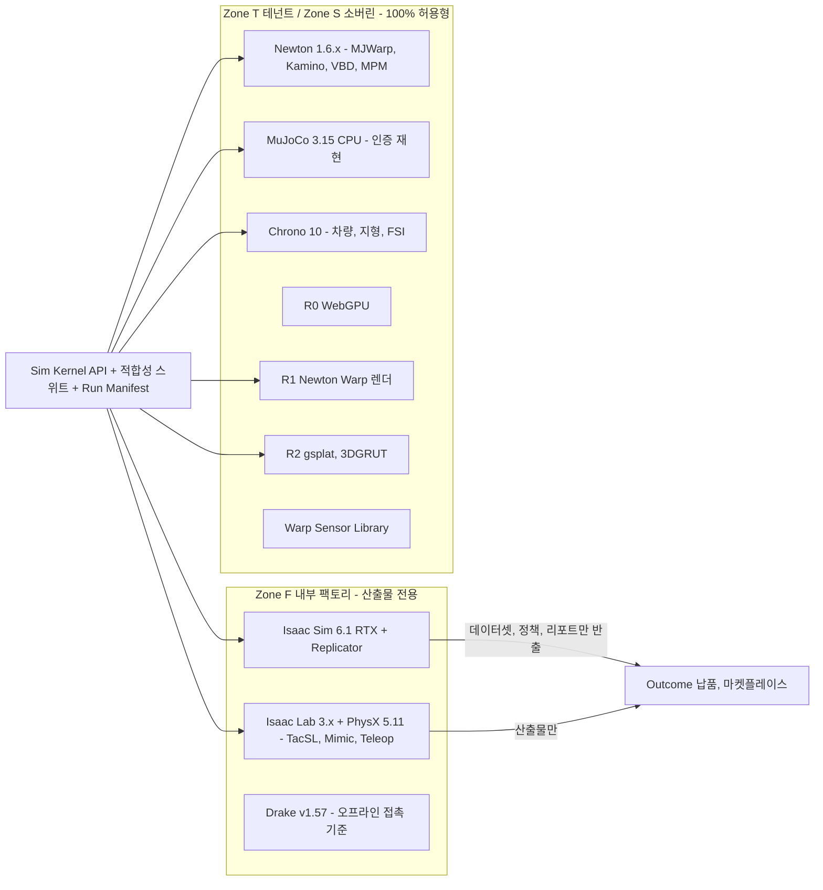
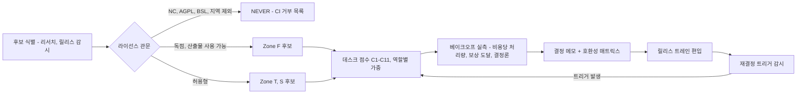
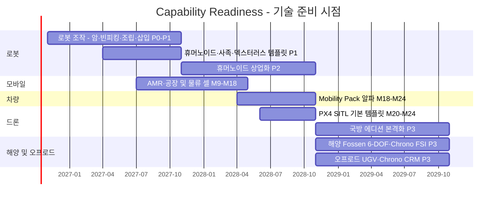
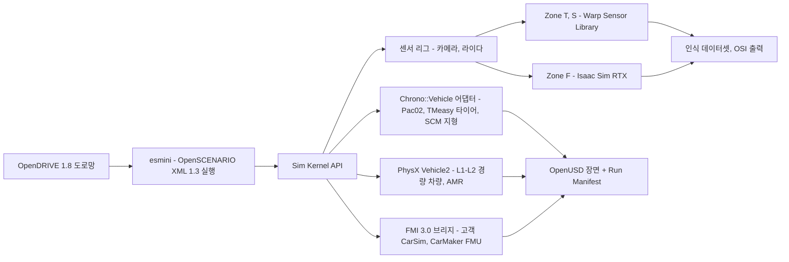
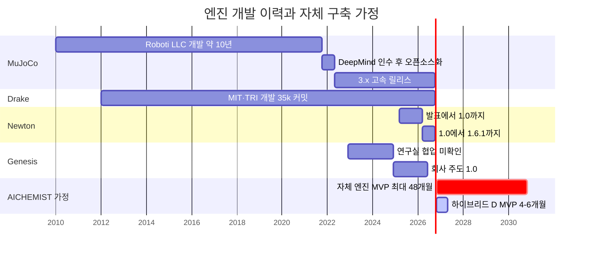
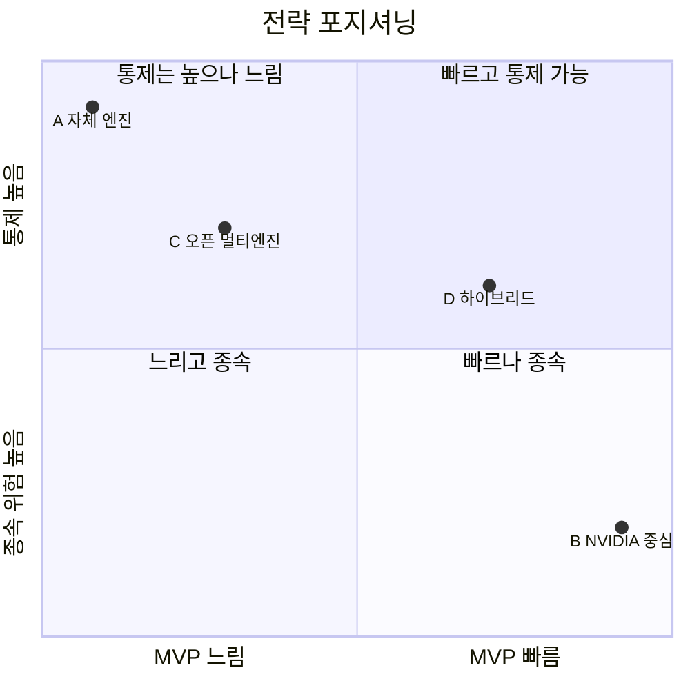
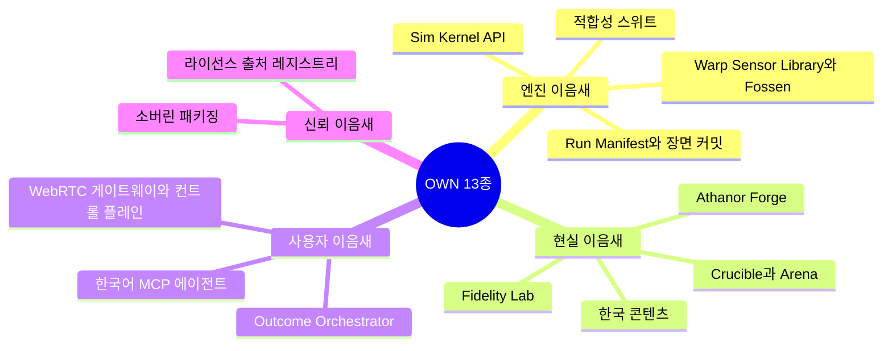
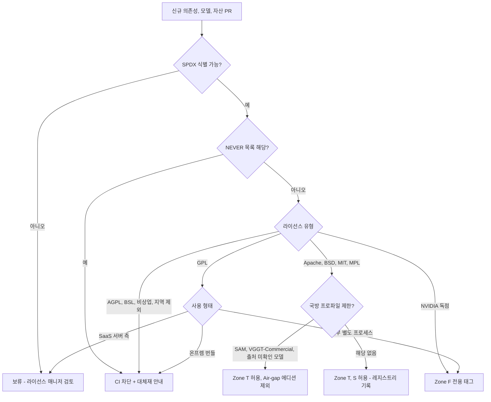
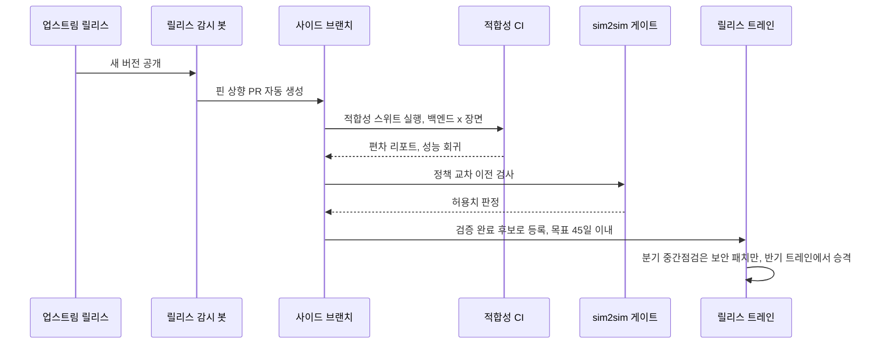

# 03. 엔진 선정과 Build vs Buy: 어떤 엔진을 쓰고, 무엇을 직접 만드는가

> **문서 번호** 03 · **기준일** 2026-10-06 · **버전** v1.0 · **상위 문서** [README](README.md)
> **관련 문서** [01 비전·포지셔닝](01-vision-positioning.md) · [02 시장·경쟁](02-market-competition.md) · [04 시스템 아키텍처](04-system-architecture.md) · [05 물리·현실감](05-physics-and-realism.md) · [06 사용성·에이전트](06-usability-and-agent.md) · [07 학습 모듈](07-training-module.md) · [08 도메인 팩](08-domain-packs.md) · [09 로드맵·조직·예산](09-roadmap-organization-budget.md) · [10 사업모델·GTM](10-business-model-gtm.md) · [11 리스크·KPI·컴플라이언스](11-risk-kpi-compliance.md) · [12 90일 실행](12-execution-90days.md) · [부록 A 기술 카탈로그](appendix-a-technology-catalog.md) · [부록 B 출처·검증](appendix-b-sources-verification.md)
> **표기** **[A]** 계획 가정(실적 확인 전까지 목표치) · **[U]** 1차 출처 미확인(대외 사용 전 [부록 B](appendix-b-sources-verification.md) 절차로 재검증) · 태그 없는 사실은 GitHub·PyPI·SkyPilot 가격 카탈로그로 확인된 값(2026-10-05/06) · ₩억 = 1억 원, 1 USD = ₩1,400 [A] · M1 = 2026년 11월, P0 = M1–M4, P1 = M5–M12, P2 = M13–M24, P3 = M25–M36 · DR = 결정 기록(Decision Record, 전 문서의 단일 기준)

---

## 핵심 요약

- **물리 엔진도, 렌더러도 직접 만들지 않는다(NO).** 자체 엔진은 150–300 engineer-year, ₩400–600억, MVP까지 30–48개월 이상이 든다. 24개월 기준 예산 ₩122억의 3–5배다. 리서치 의사결정 매트릭스에서 하이브리드(전략 D)가 4.23점으로 1위이고, 가중치를 다섯 방식으로 흔들어도 1위를 지킨다(§8.4).
- **물리는 '한 엔진'이 아니라 역할별 포트폴리오다.** 학습 처리량은 Newton 1.6.x(MJWarp 솔버), 인증·재현은 MuJoCo 3.15 CPU, 팩토리의 접촉 집약 조작은 Isaac Lab 3.x + PhysX 5.11, 오프라인 접촉 기준은 Drake v1.57, 차량·지형·해양은 Chrono 10.0이 맡는다. Genesis는 관찰만 한다.
- **렌더러도 4개 티어로 나눈다.** R0 WebGPU(서버 GPU 0), R1 Newton Warp 렌더러, R2 3DGUT 신경 렌더, R3 Isaac Sim 6.1 RTX다. R3는 내부 팩토리(Zone F)와 고객 자체 라이선스(BYOL) 환경에서만 돈다.
- **테넌트·온프렘 경로는 100% 허용형 라이선스다.** Kit, Isaac Sim, RTX, ovrtx, ovphysx 휠, isaacsim/isaaclab PyPI 휠은 NVIDIA 서면 조건을 받기 전까지 Zone F에서 산출물을 만드는 데에만 쓴다. NEVER 목록 21개 항목은 CI와 마켓플레이스에서 자동 차단한다.
- **직접 만드는 것은 13개의 '이음새'다(엔지니어링의 약 60%).** 엔진 사이의 이음새(Sim Kernel API, 적합성 스위트, Run Manifest), 현실과의 이음새(Forge, Fidelity Lab, 인증서), 사용자와의 이음새(Outcome Console, Studio, 한국어 MCP 에이전트)다. 엔진은 무료로 2–3주마다 좋아지지만, 측정과 인증은 아무도 무료로 주지 않는다.
- **'무엇이든 트윈으로'는 아키텍처로 보장하고, 시점만 상업 순서에 맞춘다.** 차량 Mobility Pack α는 M18–M24(Chrono::Vehicle + PhysX Vehicle2 + esmini + FMI 3.0), 드론 PX4 SITL 템플릿은 M20–M24, 해양·오프로드 UGV는 P3(M25–)다. 엔진은 지금 이미 정해져 있다.
- **엔진 선택은 고정값이 아니라 측정으로 갱신하는 결정이다.** 6–8주 베이크오프(W1 = 2026.11 첫 주, 결정 메모 2027.01 첫 주), 반기 릴리스 트레인, 엔진 접촉 워크스트림 용량의 25% 예약, 15개 재결정 트리거로 운영한다.

---

## 1. 결론 헤드라인

**결론: 엔진은 산다. 이음새는 만든다. 독점 런타임은 울타리 안에 둔다. 버전은 기차로 묶는다. 결정은 실측으로 갱신한다.**

| # | 헤드라인 | 핵심 근거 | 이 판단이 틀렸을 때의 대안 |
|---|---|---|---|
| H1 | **물리 엔진·렌더러를 직접 만들지 않는다** | 전략 D 4.23 vs 자체 엔진(A) 2.40. 자체 엔진이 '성공'한다고 가정해도 3.00으로 꼴찌다(§8.4 S4). 비용 ₩400–600억 | 없다. 자체 엔진은 어떤 가중치 시나리오에서도 열위다 |
| H2 | **로봇 물리의 중심은 Newton(MJWarp 기본)이고, 인증은 MuJoCo CPU가 맡는다** | Apache-2.0, Linux Foundation 거버넌스, 공개 처리량 최상위, Isaac Lab 3.x의 Kit-less 백엔드. MuJoCo CPU는 같은 MJCF를 float64로 결정론적으로 돌린다 | Newton의 라이선스나 거버넌스가 바뀌면 MJWarp 직접 호출 + mjlab으로 물러선다. 모델 포맷(MJCF·USD)이 같아 전환 비용이 작다 |
| H3 | **접촉 집약 조작은 팩토리 안에서 PhysX를 받아들인다** | TacSL·Mimic·Teleop은 PhysX 경로에서만 검증됐다. Isaac Lab의 Kit-less Newton 경로는 beta이고 검증 과제가 제한적이다 | Kit-less 동작이 검증되면(M6 목표) 테넌트에 연다. 아니면 P2에 PhysX SDK 소스 어댑터(36–48 HM, 조건 3개)를 만든다 |
| H4 | **렌더러는 R0–R3 4티어이고, RTX는 Zone F와 BYOL에만 둔다** | Kit 런타임은 독점이고, Isaac Sim 스트리밍에는 인증·암호화가 없으며, RT 코어 GPU가 필요하다 | NVIDIA 서면 조건을 확보하면 R3 호스팅 티어를 Zone T에 연다(§14 트리거 X1) |
| H5 | **소유하는 것은 Kernel·적합성·Manifest·Forge·Fidelity·Crucible 등 13개 이음새다** | 엔진은 무료로 빠르게 개선되고, 측정·인증·한국 현장 콘텐츠는 아무도 팔지 않는다 | 해당 없음. 이음새는 엔진이 바뀌어도 살아남도록 설계했다 |

**그림 1. 엔진 포트폴리오와 라이선스 구역 배치**

---

## 2. 평가 기준과 방법

**결론: 라이선스는 점수가 아니라 관문이다. 벤더 처리량은 근거가 아니다. 같은 엔진도 역할에 따라 점수가 달라지므로, 답은 '한 엔진'이 아니라 '역할별 포트폴리오'다.**

### 2.1 평가 원칙

- **원칙 1. 라이선스 관문 우선:** Zone T/S 탑재 불가이고 산출물 전용 사용도 불가 → 즉시 NEVER. 독점이지만 산출물 사용 가능 → Zone F 한정 후보. 허용형 → 점수 평가로 진행.
- **원칙 2. 벤더 수치 배제:** 측정 단위와 조건이 서로 다른 수치(§2.6)는 의사결정 매트릭스에 넣지 않음. 사내 steps/s/$와 보상 도달 시간으로 대체.
- **원칙 3. 역할별 평가:** 학습 처리량, 인증·재현, 접촉 집약 조작, 차량, 렌더·센서 역할마다 가중치를 따로 둠.
- **원칙 4. 측정 가능성:** 결정론, 적합성 스위트 통과, Run Manifest 기록 가능 여부가 인증 사업의 전제.
- **원칙 5. 범용성:** CEO 요구("대상은 로봇, 자동차 등 어떤 것도 가능")는 단일 엔진이 아니라 Kernel API 뒤의 포트폴리오와 Domain Pack으로 충족([08 도메인 팩](08-domain-packs.md)).

### 2.2 평가 기준 11개와 4대 요구사항 매핑

| 코드 | 기준 | 무엇을 보나 | 측정·근거 | 매핑 |
|---|---|---|---|---|
| C1 | 접촉·관절 정확도 | 접촉 모델, 마찰 콘, 축약좌표 관절, 폐루프 | Drake 대조, 적합성 스위트 편차, 실측 궤적 ADE | 요구 (1) 강력한 물리 |
| C2 | GPU 병렬 처리량 | 동일 하드웨어의 env-steps/s, VRAM, 스케일링 | 베이크오프 W3–W4 스윕(환경 1k–16k) | (1), (4) 학습 |
| C3 | 다물리·도메인 커버리지 | 변형체, 케이블, 입상체, 유체, 차량, 지형 | 솔버 목록, 적합성 장면 수 | (1) + 범용성 |
| C4 | sim2real 실적 | 독립적으로 검증된 전이 사례 | 동료 검토 논문, 자체 Test Cell | (2) 현실 유사도 |
| C5 | 임베드 용이성 | 헤드리스 실행, Python/C API, USD 입출력, 웹 연동 | 어댑터 공수(HM) | (3) 편의성 |
| C6 | 학습 통합 | Isaac Lab·mjlab·LeRobot 연동, Mimic·Teleop·촉각 | 템플릿 이식 공수 | (4) 학습 |
| C7 | 라이선스 | Zone T/S 탑재, 재배포, 특허 조항, 귀속 의무 | SPDX, 약관 원문 | 관문 + 점수 |
| C8 | 성숙도 | 버전, PyPI 상태(Alpha/Stable), API 동결 여부 | 릴리스 노트, 브레이킹 체인지 빈도 | 운영 리스크 |
| C9 | 생태계·거버넌스 | 유지 조직, 기여자 수, 기업 채택, 재단 귀속 | GitHub, 거버넌스 문서 | 지속성 |
| C10 | GPU 이식성 | CUDA 외 ROCm·Metal·Vulkan·CPU 경로 | 백엔드 목록 | 공급·수출통제 리스크 |
| C11 | 결정론·재현성 | 반복 비트 일치, 하드웨어 간 재현, 정밀도(float64) | 베이크오프 W7 | (2) + 인증서 |

### 2.3 역할별 가중치와 데스크 점수 [A]

아래 점수는 리서치 사실에 근거한 **데스크 점수**다. 베이크오프 실측(§13)이 나오면 C2·C11은 실측값으로 덮어쓴다. 의도는 "어느 엔진이 최고인가"가 아니라 **"역할마다 1위가 다르다"는 구조를 보이는 것**이다.

**역할별 가중치(합계 100)**

| 기준 | 학습 처리량 역할 | 인증·재현 역할 | 접촉 집약 조작 역할 |
|---|---|---|---|
| C1 접촉·관절 정확도 | 12 | 20 | 20 |
| C2 GPU 병렬 처리량 | 20 | 2 | 15 |
| C3 다물리 커버리지 | 8 | 5 | 5 |
| C4 sim2real 실적 | 10 | 10 | 15 |
| C5 임베드 용이성 | 5 | 8 | 5 |
| C6 학습 통합 | 15 | 3 | 15 |
| C7 라이선스 | 12 | 12 | 5 |
| C8 성숙도 | 8 | 10 | 10 |
| C9 생태계 | 5 | 5 | 5 |
| C10 GPU 이식성 | 2 | 5 | 0 |
| C11 결정론 | 3 | 20 | 5 |

- 접촉 집약 역할의 C7을 5로 낮춘 이유: 산출물 전용 판매가 가능하므로 Zone F 독점 런타임을 감수할 수 있음.
- 인증 역할의 C2를 2로 낮춘 이유: 인증 재현은 처리량이 아니라 비트 일치가 핵심.

**데스크 점수(1–5)**

| 엔진 | C1 | C2 | C3 | C4 | C5 | C6 | C7 | C8 | C9 | C10 | C11 |
|---|---|---|---|---|---|---|---|---|---|---|---|
| Newton 1.6 (MJWarp) | 4 | 5 | 5 | 3 | 4 | 5 | 5 | 3 | 4 | 1 | 3 |
| MuJoCo 3.15 CPU | 5 | 1 | 3 | 5 | 5 | 2 | 5 | 5 | 5 | 5 | 5 |
| Isaac Lab 3.x + PhysX 5.11 | 4 | 4 | 4 | 5 | 3 | 5 | 2 | 4 | 5 | 1 | 3 |
| Genesis 1.4.3 | 3 | 4 | 5 | 2 | 4 | 3 | 4 | 3 | 3 | 4 | 3 |
| Drake v1.57 | 5 | 1 | 3 | 4 | 3 | 1 | 5 | 5 | 4 | 4 | 5 |

**가중 합계(5점 만점)**

| 엔진 | 학습 처리량 | 인증·재현 | 접촉 집약 조작 |
|---|---|---|---|
| Newton 1.6 (MJWarp) | **4.28 (1위)** | 3.67 | 4.10 |
| MuJoCo 3.15 CPU | 3.59 | **4.73 (1위)** | 3.85 |
| Isaac Lab 3.x + PhysX 5.11 | 3.92 | 3.51 | **4.15 (1위)** |
| Genesis 1.4.3 | 3.45 | 3.27 | 3.20 |
| Drake v1.57 | 3.17 | 4.34 (2위) | 3.40 |

- **해석 1:** 역할별 1위가 DR의 엔진 선정과 정확히 일치. 학습 = Newton, 인증 = MuJoCo CPU, 접촉 집약 = PhysX, 오프라인 접촉 기준 = Drake(인증 역할 2위).
- **해석 2:** 접촉 집약 역할에서 PhysX와 Newton의 차이는 0.05점(약 1%)에 불과. C6에 TacSL·Mimic·Teleop 가용성을 반영해 Newton을 3점으로 낮추면 4.15 대 3.80으로 벌어짐. 즉 **팩토리의 PhysX 채택은 처리량이 아니라 기능 공백 때문**이고, 테넌트 경로의 기본값은 베이크오프 T7·T8과 '10% 이내면 허용형 우선' 규칙(§13)이 정함.
- **해석 3:** Genesis는 어느 역할에서도 1위가 아님. 유일한 강점은 C10(비CUDA 경로)이므로 '공급 헤지'로만 의미가 있고, 그래서 관찰(Watch) 판정.

### 2.4 의사결정 절차

### 2.5 판정 등급 정의

| 판정 | 정의 | 운영 규칙 |
|---|---|---|
| **Adopt** | 릴리스 트레인 핀 대상. 적합성 스위트에 포함하고 담당 워크스트림을 지정 | 업그레이드 세금(엔진 접촉 WS 용량 25%) 안에서 유지 |
| **Secondary** | 특정 과제·고객·도메인용 보조 경로. 어댑터를 유지 | 분기 1회 이상 적합성 스위트 실행 |
| **Watch** | 코드 의존 없음. 분기 벤치마크와 라이선스 변화만 감시 | 사이드 브랜치에서만 실행 |
| **Avoid** | 기술·유지보수·사업 사유로 쓰지 않음 | 신규 의존성 PR 거부 |
| **NEVER** | 라이선스상 사용 금지(§10.3) | CI와 마켓플레이스에서 자동 차단 |

### 2.6 벤치마크 수치 해석 규칙

| 수치 | 무엇을 쟀나 | 직접 비교가 안 되는 이유 | 허용 용도 |
|---|---|---|---|
| MJWarp 나이틀리(RTX PRO 6000, 2026-10-05): humanoid 7.95M, Franka 36.97M, G1 평지 3.79M, ALOHA 클러터 0.46M steps/s | 물리 스텝만. 장면별 월드 수 미기재 | 추론·학습·decimation이 빠져 있어 Isaac Lab 수치와 단위가 다름 | 상한 참고값 |
| MJWarp 벤치마크 README: humanoid 8,192 월드 2.73M steps/s | 물리 스텝만. GPU 미기재 | 하드웨어 불명 | 1B 스텝 원가 하한 추정(약 0.10 GPU-시간) |
| Isaac Lab(RTX 4090): G1 험지 94k/88k/82k, Shadow 손 200k/170k env-steps/s | 스텝 / +추론 / +학습 | decimation 포함 env-step | 학습 원가 추정 |
| Genesis "43M FPS"(Franka, RTX 4090) | 정적·자기충돌 장면, 단일 서브스텝 | 현실 설정에서 약 150배 낮게 재측정됨. Genesis가 27M(랜덤 행동)으로 정정 | 사용 금지 |
| MJWarp vs MJX 252배(보행)/475배(조작) | NVIDIA 블로그 | 1차 출처 미확인 [U] | 사용 금지 |
| Newton vs PhysX 손안 조작 최대 65% 빠름 | Newton beta 블로그 | 벤더 수치 [U] | 베이크오프 T4 가설 |
| GPUSimBench 경사면 EMD: ManiSkill 2.520 cm, MJX 3.970 cm. GAUGE: 균일하게 충실한 엔진 없음 | 실측 대비 충실도 | arXiv 원문 미확인 [U] | 방향성 참고. 대외 인용 금지 |

---

## 3. 로봇 물리 엔진 비교

**결론: 허용형 GPU 엔진 중 테넌트 경로의 중심이 될 수 있는 것은 Newton 하나다. MuJoCo CPU는 인증의 기준, PhysX는 팩토리의 접촉 전문가, Drake는 심판이다. 나머지는 관찰하거나 피한다.**

### 3.1 주요 엔진 비교표

| 엔진 | 최신 버전·날짜 | 라이선스 | GPU 병렬 처리량(주의) | 접촉 모델 | 변형체·유체 | 결정론 | 미분 | sim2real 실적 | SaaS 임베드 | 판정 |
|---|---|---|---|---|---|---|---|---|---|---|
| **Newton** | 1.6.1(2026-10-05). 1.0.0은 2026-03-10. 이후 월간 마이너 | Apache-2.0(문서 CC-BY-4.0). Linux Foundation 프로젝트 | MJWarp 솔버 경유(다음 행). Isaac Lab Newton 경로는 검증 과제 제한 | MJWarp 소프트 볼록 접촉 + SDF + hydroelastic(Drake 개념) + XPBD + Kamino NCP(하드 접촉) | VBD(천·케이블·연체), Style3D 천, ImplicitMPM(입상체·점성 유체) | v1.4.0부터 결정론 경로(반복 비트 일치). 하드웨어 간 이식 주장은 미시험 [U] | Featherstone·SemiImplicit 솔버만 기초 수준 | Unitree G1 보행, Skild 랙 조립, Samsung·Lightwheel 호스 삽입: NVIDIA·파트너 발표 [U] | 가능(로열티 없음) | **Adopt(1차)** |
| **MuJoCo Warp(MJWarp)** | 3.15.0(2026-10-05). PyPI 분류는 'Alpha' | Apache-2.0 | 나이틀리 RTX PRO 6000: humanoid 7.95M, Franka 36.97M steps/s(물리 전용) | MuJoCo 볼록 소프트 제약, 피라미드·타원 마찰 콘 | flex(실험적) | GPU에서 비결정(atomics), float32 | 불가(issue #500) | MuJoCo 행 참조 | 가능 | **Adopt(Newton 기본 솔버)**. 단일 메커니즘 약 60 DoF 초과 시 약함 |
| **MuJoCo CPU** | 3.15.0(2026-10-05). 3.5(2026-02-12)부터 8개월간 11회 릴리스 | Apache-2.0 | 월드당 단일 스레드. RL 규모 불가 | 기준 구현, float64. 3.13 discrete 적분기·실린더 멀티컨택트, 3.15 캡슐 멀티컨택트 | flex: Stable Neo-Hookean(3.15, 실험), IPC(3.14, 실험) | CPU에서 결정론적 | 제한적 [U] | MuJoCo Playground 제로샷: Go1, Berkeley Humanoid, G1, Booster T1, LEAP 손, Franka(RSS 2025) | 가능 | **Adopt(인증·재현·대화형)** |
| **MJX**(JAX) | MuJoCo 3.15 동반. MJWarp를 `impl='warp'`로 노출 | Apache-2.0 | 네이티브 JAX 경로는 MJWarp 대비 수백 배 느리다는 벤더 주장 [U] | MuJoCo와 동일 | MuJoCo와 동일 | GPU 배치 재현성 미검증 [U] | JAX 자동미분 [U] | Playground(MJX 경로) | 가능 | **Watch(TPU·JAX 헤지)** |
| **PhysX 5 SDK** | 5.11.0. GPU 소스(CUDA 커널 500개 이상)는 5.6(2025-04)부터 공개 | 코어 Apache-2.0(저장소 루트 BSD-3) | SDK 단독 공개 수치 없음 | TGS/PGS, 축약좌표 관절, 텐던, GPU SDF(비볼록 메시). 마찰은 패치 기반 근사 | FEM 체적·표면, 입자, Vehicle2 | 같은 하드웨어·버전의 강체·관절만 결정론. 하드웨어 간, 변형체는 보장 없음 | 불가 | Isaac Gym/Lab 계보의 공개 사례 대부분 | 소스 빌드로 가능. USD·텐서 어댑터는 직접 구축(36–48 HM) | **Secondary(P2 조건부 어댑터)** |
| **Isaac Sim 6.1 / Isaac Lab 3.x**(PhysX 경로) | Isaac Sim 6.1.0(2026-09-10). Isaac Lab 3.0.0-EA(2026-09-16, GA 2026-10 말 목표) | 저장소는 Apache-2.0(Isaac Sim)·BSD-3(Isaac Lab, mimic은 Apache-2.0). **Kit·RTX 런타임과 isaacsim/isaaclab PyPI 휠은 NVIDIA 독점** | RTX 4090: G1 험지 82k, Shadow 손 170k env-steps/s(학습 포함). L40 16장(4노드) G1 1.2M | PhysX와 동일 | PhysX FEM과 Newton VBD를 묶은 통합 변형체 API | PhysX와 동일 | 불가 | 사족·휴머노이드·덱스터러스 공개 사례 최다. TacSL 삽입 sim2real | Kit 경로: NVIDIA 서면확인 필요. Kit-less Newton 경로: 가능 | **Adopt(Zone F 전용, 접촉 집약)** |
| **ovphysx** | 0.6.3 alpha(2026-09-16). PhysX 5.11 대응 | 소스 Apache-2.0. **pip 휠과 의존성 ovstage는 NVIDIA 독점** | 공개 수치 없음 | PhysX와 동일 | PhysX와 동일 | PhysX와 동일 [A] | 불가 | — | 휠은 Zone T 금지. ovstage 없는 소스 빌드는 V2에서 검증 | **Watch** |
| **Genesis World** | 1.4.3(2026-09-30). 1.0은 2026-05 | 코드 Apache-2.0. Nyx 렌더러(gs-nyx 0.1.7)는 PyPI에 라이선스 미표기 | "43M FPS" 주장은 현실 설정에서 약 150배 낮게 재측정 | MuJoCo식 강체, IPC(libuipc), Drake 유래 SAP 커플러. 강체 솔버의 단순성과 튜닝 민감도 비판 | FEM, MPM, SPH, PBD, IPC + 촉각 센서 | 2026년 결정론 GPU 강체 모드 추가(벤더). GPUSimBench는 비결정성 지적 [U] | [U] | 기록이 적음. 회사는 자체 모델(GENE-26.5)로 무게 이동 | 코드 가능, Nyx 불가 | **Watch(비CUDA 헤지)** |
| **Drake** | v1.57.0(2026-09-10). 월간 | BSD-3(번들 서드파티 솔버는 개별 확인) | CPU 전용. 10⁴ env RL 불가 | hydroelastic(압력장) + SAP 볼록 컴플라이언트 접촉 | FEM 변형체 + 강체-변형체 접촉 | CPU 결정론 [A] | AutoDiff [U] | TRI LBM Eval(49개 과제) 시뮬 벤치마크 | 가능(내부 검증용) | **Adopt(오프라인 기준)** |
| **Chrono** | 10.0.0(2026-03 말 출시, 태그 04-07). 약 20,031 커밋 | BSD-3 | 10⁴ env 배치 RL용이 아님. CRM은 H100 1장에서 지형 29 km | NSC(상보성) + SMC(페널티) | FEA, DEM 입상체, SPH FSI, 페리다이내믹스 | 미검증 | 불가 | 차량·로버·오프로드 연구 | 가능 | **Adopt(차량·지형·해양)** |
| **ManiSkill3 / SAPIEN 3** | mani-skill 3.0.1(2026-04-21) | 코드 Apache-2.0, SAPIEN MIT. **일부 자산 CC BY-NC 4.0** | RGBD+분할 30k FPS 이상(RTX 4090, 래스터) | PhysX 5 계승 | 제한적 | PhysX와 동일 | 불가 | VLA real2sim 평가. GPUSimBench 경사면 최저 오차 [U] | 코드 가능, 자산 금지 | **Watch(벤치마크 참조)**. PyPI 유지보수자 1인 |
| **Brax** | 0.14.2(2026-03-15) | Apache-2.0 | 물리 파이프라인 폐기(0.13.0부터 training만 유지) | — | — | — | (구 버전) | — | — | **Avoid(엔진)**. brax/training은 JAX 경로에서만 허용 |
| **PyBullet** | 3.2.7(2025-01-30)이 마지막. 이슈 트래커 폐쇄 | zlib | CPU 전용 | Featherstone + LCP | 기초 연체 | CPU [A] | 불가 | 레거시 연구 | 가능하나 정체 | **Avoid** |
| **RaiSim / RaiSim2** | v1 저장소 2026-04-25 아카이브. RaiSim2는 바이너리 배포 | 독점, 활성화 키 필요 | CPU | 비공개 | RaiSim2에 변형체 | — | 불가 | ANYmal 보행(과거) | 불가 | **Avoid** |
| **Jolt Physics** | v5.6.0(릴리스 연도 미확인 [U]) | MIT | 배치 RL 없음. 멀티코어 CPU, WebAssembly | 최대좌표 제약만(축약좌표 관절 없음) | 연체, GPU 헤어(Cosserat 로드) | 결정론적(벤더) | 불가 | 게임(Horizon Forbidden West 등), Godot 4.6 기본 물리 | 가능 | **Watch(브라우저 프리뷰 물리 후보)** |
| **Gazebo Jetty(gz-sim 10) / DART** | Jetty LTS(2031-05까지 지원). DART 6.19.5(연도 미확인 [U]) | Apache-2.0 / BSD-2 | CPU. GPU 병렬 RL 없음 | DART Featherstone·LCP 등 | 제한적 | CPU | 불가 | ROS 생태계 표준 | 가능 | **Secondary(ROS·PX4 SITL·CI)** |
| **Webots** | 리서치 범위 밖 [U] | Apache-2.0로 알려짐 [U] | CPU [U] | ODE 계열 [U] | — | — | — | 교육·연구 | — | **Avoid(코어)**. 검증 없이 채택 금지 |

### 3.2 보조 후보: 솔버·촉각·신규 진입자

| 후보 | 상태 | 라이선스 | 의미 | 판정 |
|---|---|---|---|---|
| Kamino(Newton 솔버, Disney Research) | arXiv 2603.16536. Newton 1.6에서 쿨롱 마찰·관절 한계 추가. Isaac Lab에서는 beta | Apache-2.0 | 중첩 루프 6개의 DR Legs 이족을 단일 GPU 4,096 env로 학습 | **Adopt(실험적, 폐루프 전용)** |
| TacSL | Isaac Lab 3.0-EA 실험 기능. **PhysX 백엔드 전용** | Isaac Lab | 시각촉각 이미지·힘장 시뮬레이션이 기존 대비 200배 이상 빠름 | **Adopt(Zone F)** |
| Taccel | NeurIPS 2025. IPC + Affine Body Dynamics | MIT | H100 1장에서 4,096 env 915 FPS. 전체 손 촉각은 256 env 12.67 FPS | Watch |
| MuJoCo touch_grid | MuJoCo 센서 플러그인 | Apache-2.0 | 테넌트 경로의 기초 촉각 | Secondary |
| NVIDIA Warp | warp-lang 1.18.0(2026-10-05) | Apache-2.0 | 자체 커널 언어(촉각·센서 노이즈·Fossen 동역학), 자동미분(wp.Tape) | **Adopt(커널 언어)** |
| MotrixSim / GS-Playground | Rust 일반좌표 엔진, 코어는 바이너리 추정 [U]. Kunpeng CPU 362k steps/s. GS-Playground는 2,048 env(640×480) 약 10⁴ FPS, 제로샷 파지 90% [U] | 코어 불명 | 3DGS + 물리 결합 방향 검증 | Watch(설계 참고) |
| RoboVerse / MetaSim | Isaac Sim, Isaac Gym, MuJoCo, SAPIEN, Genesis, PyBullet, Newton을 한 API로 감쌈 | 오픈소스 | Sim Kernel API 설계의 선례 | 참조 |
| Taichi·DiffTaichi, Tiny Differentiable Simulator, Dojo | 유지보수 저조. Dojo는 2023-04 이후 개발 중단 | Apache-2.0 / MIT | 미분 시뮬 연구 | Avoid(Newton Featherstone + Warp 자동미분으로 대체) |

### 3.3 핵심 판단 근거

**Newton을 1차로 고른 이유.** 하나의 API 뒤에 8개 솔버(Featherstone, MuJoCo, SemiImplicit, XPBD, Kamino, VBD, Style3D, ImplicitMPM)가 있고, OpenUSD 네이티브이며, Isaac Lab 3.x가 Kit 없이 돌리는 백엔드다. 테넌트 경로의 중심이 될 수 있는 허용형 GPU 엔진은 이것 하나다. 거버넌스도 중요하다. NVIDIA 단독 소유가 아니라 Google DeepMind·Disney Research와 공동으로 시작했고 2025-09-29에 Linux Foundation에 기증됐다. 라이선스가 회수될 위험이 단일 기업 엔진보다 구조적으로 낮다. 약점은 네 가지다. ① MJWarp가 float32이고 GPU에서 비결정적이다. ② MJWarp는 미분할 수 없다. ③ 단일 메커니즘 약 60 DoF 이상에서 약하다. ④ 1.0이 나온 지 7개월이고 Isaac Lab의 Newton 경로는 beta다. 대응은 각각 ① MuJoCo CPU 재현 경로, ② Featherstone 미분 경로와 Warp 자동미분, ③ 베이크오프 T11과 관절 트리 분할, ④ 트레인 핀과 적합성 스위트다. 실무 함정도 하나 있다. PyPI의 `newton-physics`는 비활성 이름이다. 패키지는 `newton`으로 고정한다.

**MuJoCo CPU를 인증 백엔드로 고른 이유.** 같은 MJCF를 float64로 결정론적으로 돌린다. 인증서와 '재현 가능' 주장은 이 경로나 Newton 결정론 모드에서, 고정된 하드웨어와 드라이버로만 발행한다(KPI: 인증 시험 결정론적 재현율 100%). 3.5에 들어온 시스템 식별(sysid) 툴박스, 3.7의 DC 모터, 3.12의 PID 액추에이터는 Fidelity Lab의 보정 도구가 된다. 지연이 낮아 Explorer 무료 등급의 샌드박스, 텔레옵, MPC 백엔드로도 쓴다. 2–3주 주기로 무료 업데이트가 나온다는 점 자체가 자체 엔진을 만들지 않을 이유다.

**PhysX를 팩토리 안에서만 받아들이는 이유.** 접촉 집약 조작(삽입, SDF 접촉, TacSL 촉각, Mimic 증강, 텔레옵)에서 검증된 스택은 Isaac Lab + PhysX뿐이다. Isaac Lab 3.0 문서상 Newton 백엔드는 MJWarp만 검증됐고, Kamino는 beta, VBD는 실험 단계이며, 검증 과제는 고전 RL과 평지 보행 위주다. 그래서 결과를 산출물로만 파는 조건으로 Zone F에서 쓴다. PhysX SDK 코어 자체는 Apache-2.0이므로 Zone T로 가는 장기 경로가 막혀 있지는 않다. 다만 Isaac Lab 수준의 articulation·텐서 API·SDF·드라이브 패리티를 맞추는 어댑터는 36–48 HM짜리 공사다. 그래서 G1 통과, 베이크오프에서 PhysX 우위 실측, 온프렘 수요 2건 이상이라는 세 조건을 모두 충족할 때만 P2에 착수한다. 대안으로 ovphysx를 Apache 소스에서 ovstage 없이 빌드하는 방법을 P0의 V2 검증에서 법률·기술 양면으로 확인한다.

**Genesis를 관찰만 하는 이유.** 다물리 폭이 가장 넓고, Quadrants 컴파일러가 CUDA·ROCm·Metal·Vulkan·CPU를 지원하는 유일한 비CUDA 경로다. 그러나 처리량 주장의 신뢰도 문제(43M FPS → 약 150배 차이), 강체 접촉 솔버의 단순성 비판, 회사의 자체 모델 선회, Nyx의 라이선스 미표기가 겹친다. 베이크오프에서 2개 과제만 관찰 목적으로 돌린다. 승격 조건은 §14 트리거 X9에 있다.

**Drake를 심판으로 두는 이유.** hydroelastic·SAP 접촉의 엄밀성은 Drake가 가장 높고, Newton의 hydroelastic도 이 개념을 가져왔다. CPU 전용이라 RL 규모로는 못 쓰지만, 삽입·파지처럼 접촉이 승부인 과제에서 Newton과 PhysX의 결과를 대조하는 오프라인 기준으로는 대체재가 없다. 베이크오프 T7(페그·커넥터 삽입)의 대조군이다.

**나머지를 피하는 이유.** PyBullet(2025-01 이후 정체), Brax 물리(폐기), RaiSim(v1 아카이브, 독점 키), Dojo(중단)는 **단일 조직 엔진이 멈추는 방식의 표본**이다. 우리가 어떤 엔진에도 직접 묶이지 않고 Kernel API 뒤에 숨기는 이유가 여기에 있다.

### 3.4 작업 유형별 백엔드 라우팅(베이크오프 전 가설)

| 작업 유형 | 기본 백엔드 | 폴백 | 인증·재현 경로 | 구역 | 판정 근거가 될 베이크오프 과제 |
|---|---|---|---|---|---|
| 보행·전신(사족, 휴머노이드) | Newton/MJWarp | mjlab 1.6.0 | MuJoCo CPU | F·T·S | T1 G1 속도 추종, T2 BeyondMimic |
| 일반 픽앤플레이스 | 테넌트 Newton/MJWarp, 팩토리 Isaac Lab + PhysX | MuJoCo CPU | MuJoCo CPU | F·T·S | T3 Franka 큐브 들기, T5 한국 SKU 빈 피킹 |
| 손안 재배치(덱스터러스) | Newton/MJWarp | PhysX(팩토리) | MuJoCo CPU | F·T·S | T4 LEAP/Allegro |
| 삽입·SDF·촉각 | 팩토리 Isaac Lab + PhysX(TacSL) | 테넌트 Newton SDF + hydroelastic | Drake 대조 + MuJoCo CPU | F(T는 Newton) | T7 페그·커넥터, T8 케이블 |
| 폴리백·케이블·천 | Newton VBD / Style3D | MuJoCo 3.15 flex | '통계적 재현' 라벨만 | F·T·S | T6 폴리백, T8, T9 천 접기 |
| 폐루프 그리퍼·링크 기구 | Newton Kamino | MuJoCo equality 제약 | MuJoCo CPU | F·T·S | T10 Kamino 그리퍼 |
| 휴머노이드 + 양손(60 DoF 초과) | PhysX 경로 또는 관절 트리 분할 | — | MuJoCo CPU(분할 모델) | F | T11 스트레스 테스트 |
| 입상체·식품 | Newton ImplicitMPM | Genesis MPM(관찰) | '통계적 재현' 라벨만 | F·T·S | P1 추가 과제 [A] |
| AMR·공장 셀 차량 | 테넌트 Newton 관절형 휠 모델 [A], 팩토리 PhysX Vehicle2 | Chrono::Vehicle | MuJoCo CPU / Chrono | F·T·S | 적합성 장면 '바퀴 차량'(베이크오프 W2부터) |
| 승용·상용 차량, 오프로드 | Chrono 10(Vehicle, SCM) | PhysX Vehicle2, 고객 FMU | Chrono CPU [A] | F·T·S | Mobility Pack α(M18–M24) |

- **변형체 원칙:** 어떤 엔진도 변형체 결정론을 보장하지 않음. 폴리백·케이블 성능은 실측(Gold) 전에는 계약서에 보증하지 않음.
- **Newton 차량 모델의 공백:** Newton에는 전용 차량·타이어·파워트레인 모델이 없음. AMR은 구동 관절 + 마찰 휠로 표현하고, 고충실도 차량은 Chrono로 보냄. 휠·타이어 훅은 Newton 업스트림 기여 후보.

---

## 4. 차량·드론·해양 엔진 비교

**결론: 차량·드론·선박은 '나중에 만드는 제품'이 아니라 '같은 Kernel에 꽂히는 어댑터'다. 엔진은 Chrono, PhysX Vehicle2, PX4, 클린룸 Fossen으로 이미 정했다. 상업 순서에 맞춰 바뀌는 것은 착수 시점뿐이다.**

### 4.1 기술적 범용성과 상업적 집중 순서의 분리

DR의 Wave 1·2·3은 **어디서 먼저 돈을 버는가**의 순서다. **무엇이든 트윈으로 만들 수 있는가**는 처음부터 아키텍처로 보장한다. OpenUSD 단일 장면, 엔진 중립 Sim Kernel API, Domain Pack(자산·물리 프로파일·센서 리그·표준 커넥터·학습 템플릿·평가지표·인증 기준)이 로봇·차량·드론·선박·공장을 같은 방식으로 받아들인다. "자동차는 안 한다"가 아니라 "자동차 시뮬레이터 시장에서 dSPACE·IPG·Applied Intuition과 정면으로 붙지 않고, 표준으로 연결한다"가 정확한 표현이다. 이 절의 일정은 기존 인원·예산 고정값(16/26/36/48명, ₩122.0억) 안에서 조정한 것이다.

**그림 2. Capability Readiness 로드맵(기술 준비 시점, 상업 Wave와 별도)**

| 도메인 | 물리 엔진 | 센서·렌더 | 표준 커넥터 | 기술 준비 | 상업 Wave | 수행 인력 |
|---|---|---|---|---|---|---|
| 로봇 조작 | Newton, PhysX(F), MuJoCo CPU, Drake | RTX(F), Warp Sensor, 3DGUT | URDF/MJCF, ROS 2, LeRobot v3 | P0–P1(M1–M12) | Wave 1(M1–M18) | WS1, WS5 |
| 휴머노이드·사족·덱스터러스 | Newton/MJWarp, PhysX(60 DoF 초과) | 동일 | 동일 + GR00T N1.7 | 템플릿 M6–M12, 상업화 P2 | Wave 2(M12–M24) | WS1, WS5 |
| AMR·공장/물류 셀 | Newton 휠 모델, PhysX Vehicle2(F) | 동일 | OPC UA, ROS 2 | P1–P2(M9–M18) | 부가 기능(P2 라이브 트윈) | WS1, WS6 |
| 차량(Mobility Pack α) | Chrono::Vehicle(Pacejka·TMeasy, SCM) + PhysX Vehicle2 | 카메라·라이다 리그 | OpenDRIVE·OpenSCENARIO(esmini), FMI 3.0 | **P2(M18–M24)** | 파트너(MORAI), 인식 데이터 | WS1-M 1명(P2) + WS3 지원 |
| 도로 AV | 시뮬레이터 정면 경쟁 대신 연결 | NuRec·Cosmos(Zone F, 약관 후) | OpenSCENARIO, OSI, FMI | P2부터 브리지 | 파트너 전용 | WS1-M, WS3 |
| 드론 | PX4 SITL + Gazebo Jetty | Warp Sensor, RTX(F) | MAVLink, ROS 2 | 기본 템플릿 P2(M20–M24) | P3 국방 에디션 | WS1-M |
| 선박·항만·조선 해양 | 클린룸 Fossen 6-DOF(Warp) + Chrono FSI | 검증된 레이더·EO/IR 프로파일 | AIS, COLREG 시나리오 | P3(M25–) | Wave 3(트리거 조건부) | WS1-M 2명(P3) |
| 오프로드 UGV | Chrono CRM/SCM 지형 | Warp Sensor | ROS 2 | P3 | Wave 3b(M27–) | WS1-M |

### 4.2 차량 동역학·AV 시뮬레이터

| 제품 | 최신 버전·상태 | 라이선스·가격 | 강점 | 약점 | Athanor에서의 역할 | 판정 |
|---|---|---|---|---|---|---|
| **Project Chrono 10.0**(Vehicle, SCM, CRM, FSI, Sensor) | 10.0.0(2026-03 말). 체크포인팅, FSI(SPH·TDPF) 리팩터, 페리다이내믹스. AMD ROCm은 dev 브랜치에만 | BSD-3, 무료 | 바퀴·궤도 차량 템플릿. 타이어 Pac89/Pac02, TMeasy, Fiala, FEA/ANCF. SCM·CRM·DEM 변형 지형 | 학술형 UX, 센서 약함, FTire·MF 6.2 미포함, HIL 실시간 튜닝 필요, 코어 팀 작음 | Mobility α의 차량 동역학 코어. P3 오프로드·해양 FSI | **Adopt** |
| **PhysX Vehicle2**(PhysX SDK 5.11) | SDK 포함 | 코어 Apache-2.0 | 경량 운전, AMR·야드 차량, Isaac 생태계 자산 호환 | 고충실도 타이어 부족 | L1–L2 경량 차량, AMR. Zone T에서는 좁은 C++ 바인딩으로만 사용 [A] | **Adopt** |
| **CARLA** | 0.10.0(2024-12-19, UE 5.5, Chaos 물리). 0.9.16(2025-09, UE4 라인: Cosmos Transfer1·NuRec·SimReady 변환기). 후속 태그 없음, ue5-dev 브랜치는 활성(2026-10-02 푸시) | 코드 MIT, 자산 CC-BY(귀속 의무), UE EULA | 연구 표준, ScenarioRunner(OpenSCENARIO), 리더보드, 개발자 15만 명 이상 | 소규모 팀, UE4/UE5 분열, 차량·센서 물리가 엔지니어링급 아님, UE5 빌드는 16 GB 이상 VRAM | OpenSCENARIO 호환 커넥터, 벤치마크 | **Secondary(커넥터)** |
| **BeamNG.tech** | v0.39(2026 여름): 2,000 Hz 소프트바디, C++ ROS 2, MCP | 학술 무료, 상업은 견적 | 충돌·변형·손상 | 폐쇄 엔진, 센서 기초 수준 | 충돌·엣지 케이스 데이터 파트너 | **Secondary(견적 기반)** |
| **CarSim/TruckSim**(Applied Intuition, 2022-03-14 인수) | — | 독점, 견적 | 200개 이상 OEM·Tier-1의 HIL 차량 동역학 기준 | 고가, 폐쇄, 직접 경쟁자 | 고객 보유 FMU를 FMI 3.0으로 연결 | **Secondary(BYO FMU)** |
| **IPG CarMaker/TruckMaker 15.0** | 2025-11 | 독점 | 실시간 차량 모델, Euro NCAP 시나리오, 국토부 VIL 레퍼런스 | 시각·센서 현실감 열위, ML 학습 지향 아님 | FMI·OSI·OpenSCENARIO 연동 대상 | **Secondary(BYO FMU)** |
| **Hexagon VTD / VTDx** | VTDx 2025-01-15 출시(Azure SaaS, 사용량 과금) | 독점 | OpenX 레퍼런스 구현 | 모회사 구조조정 리스크 | OpenX 적합성·과금 모델 벤치마크 | Watch |
| **aiSim 5/6**(aiMotive, Stellantis) | aiSim 5 ISO 26262 ASIL-D(TÜV Nord). aiSim 6 PBR 스플래팅 | 독점 | 유일한 ASIL-D 도구 인증 | Stellantis 종속 | 도구 인증 방식 참고 | **Avoid(경쟁 영역)** |
| **dSPACE AURELION** | 25.x. UE5 이전 발표(일정 [U]) | 독점 | OEM HIL 리그와 결합 | 폐쇄 | 합성 센서 데이터의 HIL 채널 | Watch(채널) |
| **rFpro AV elevate / Ansys AVxcelerate 2026 R1** | rFpro 디지털 트윈 180곳(노면 1 mm). AVxcelerate는 Omniverse 연동, NCAP 2026 모듈 | 독점 | 엔지니어링급 센서 물리 | 고가, 엔터프라이즈 영업 | 센서 충실도 주장 벤치마크 | Watch |
| **MORAI SIM**(한국) | 고객 100곳 이상, Series B ₩250억(2022-02) | 독점 | HD맵→트윈 자동화, 정부 네트워크, KATRI 가상평가 플랫폼 | UE 기반 고전 시뮬, 신경 렌더 역량 제한 | 한국 도로 인식 데이터 판매 채널(파트너) | **Secondary(파트너)** |
| **Waymax** | — | 비상업 | — | 상업 사용 불가 | — | **NEVER** |

### 4.3 드론

| 제품 | 최신 버전·상태 | 라이선스 | 강점 | 약점 | 역할 | 판정 |
|---|---|---|---|---|---|---|
| **Gazebo Jetty + PX4 1.16/1.17 SITL** | Jetty LTS(2031-05까지). PX4 1.16은 Harmonic, 1.17은 Jetty·Ackermann SIH 추가 | Apache-2.0 / BSD-3 | 비행 스택 SITL 표준, 대형 커뮤니티 | 시각 현실감 낮음 | **P2 기본 템플릿(M20–M24)**, 비행 제어 CI | **Adopt** |
| ArduPilot SITL | ardupilot_gazebo 플러그인 | GPL-3 | 생태계 | 온프렘 번들 시 배포 의무 | 고객 환경 연동만 | **Avoid(온프렘 번들)** |
| **Pegasus Simulator** | v5.1.0(2025-10-26). Isaac Sim 5.1, PX4 1.14.3 | BSD-3(Isaac Sim 약관 적용) | RTX 센서 + PX4가 같은 USD 월드 | 1인 유지보수, Isaac 버전 지연 | Isaac Sim 6.x 포팅 또는 자체 브리지 | Secondary |
| **Project AirSim**(IAMAI) | 1.0.0, UE 5.x, JSBSim 고정익 | MIT + UE EULA | 고정익·UAM·UGV | UE 좌석비 노출 [U] | 고정익 수요 발생 시 | Watch |
| Microsoft AirSim | 2022 아카이브 | MIT | — | 중단 | — | **Avoid** |
| **Aerial Gym** | Isaac Gym 기반, Isaac Lab 포팅 진행 중 | BSD-3 | 수백만 멀티로터 병렬, 상태 정책 1분 내 학습 | 폐기된 Isaac Gym 의존 | 드론 RL 백엔드 후보 | Watch |
| Flightmare | 2020 이후 휴면 | MIT | — | 미유지 | — | **Avoid** |

### 4.4 해양

| 제품 | 상태 | 라이선스 | 강점 | 약점 | 역할 | 판정 |
|---|---|---|---|---|---|---|
| **클린룸 Fossen 6-DOF + 파랑 스펙트럼**(자체 Warp 커널) | P3 착수 | 자체 | GPL 오염 없이 선박·USV 동역학 확보 | 검증 데이터 필요(KRISO·KR 협력 [U]) | 해양 Domain Pack 코어 | **Adopt(OWN)** |
| **Chrono FSI**(SPH·TDPF) | 10.0에서 리팩터 | BSD-3 | 유체-구조 연성 | 계산량 큼 | 계류·파랑 상호작용 | **Adopt(P3)** |
| **Stonefish** | 1인 저자, 활성 | **GPL-3.0** | 공개 수중 유체역학·광학 최고 수준 | GPL, RTX·USD 없음 | 코드 사용 금지. 논문 수준 참고만 | **Avoid(온프렘 NEVER)** |
| **HoloOcean** | pip 0.5.8(2024-04). 2.0 프리뷰(UE 5.3, Fossen, 소나) | MIT 추정 [U] + UE EULA | 소나·음향 통신 모델링 | 2.0 미정식 출시, UE 의존 | 소나 모델 참고 | Watch |
| **OceanSim** | Isaac Sim 기반, RTX 이미징 소나 | 미확인 [U] | 같은 USD 스택 | 연구용 | 해양 인식 SDG 출발점 후보 | Watch |
| MarineGym | 비공개 | — | — | — | — | **Avoid** |
| **DAVE / VRX 2.0** | Gazebo + ROS 2 | Apache-2.0 | USV 경진 생태계 | 시각 현실감 낮음 | USV·AUV 제어 SITL | Secondary |
| RadaRays / Remcom WaveFarer | 오픈소스 FMCW 레이 트레이싱 / 상용 근거리 레이 트레이싱 | 미확인 [U] / 독점 | 다중경로·미세 도플러 | 느림, 연구 코드 | IITP 공동연구 레이더 모델링 참고 | Watch |

- **해양 센서 원칙:** 레이더·EO/IR은 실측 캠페인으로 오차 막대를 공개한 프로파일이 나오기 전에는 해양·국방에 판매하지 않음. '단순화된 FMCW 레이더'는 국방 증거물로 팔지 않음([05 물리·현실감](05-physics-and-realism.md)).

### 4.5 신경 AV 시뮬레이션과 월드모델

| 제품 | 상태 | 라이선스 | 역할 | 판정 |
|---|---|---|---|---|
| **Omniverse NuRec**(+ Instant NuRec) | GTC 2026 GA 보도 [U]. Instant NuRec은 10–20초 다중 카메라 클립을 약 1.5초에 재구성 [U] | 약관 미확인 [U] | Zone F의 로그 재현·신경 재구성. 약관 확보 후 | Watch → Adopt(약관 후) |
| **Cosmos Transfer 2.5 → Cosmos 3 Nano 16B** | Transfer 2.5(2025-10-06, 유지보수 축소). Cosmos 3(2026-05/06, Super 64B·Nano 16B·Edge 4B) | Transfer 2.5 가중치 NVIDIA Open Model License. Cosmos 3 OpenMDW-1.1(전문 미확인 [U]) | 깊이·분할·엣지 조건 외형 증강. M9부터 Nano 파인튜닝 | **Adopt** |
| **AlpaSim / AlpaGym** | gRPC 마이크로서비스, 재구성 장면 약 900개 | Apache-2.0 | 도로 AV 폐루프 평가 커넥터(Mobility α 이후) | Secondary |
| Alpamayo 1.5 / 2 Super(32B) | 2026-03 / 2026-06-01 | 가중치 OpenMDW-1.1(이전 HF 카드는 비상업, 상충 [U]) | 주행 정책 기준선 | Watch |
| OmniDreams | 주행 2.1만 시간으로 사후학습한 생성형 폐루프 | 미확인 | 롱테일 생성 | Watch |
| Waymo World Model, Wayve GAIA-3/4, Waabi World, Tesla 월드 시뮬레이터 | 비공개 | — | 시장 신호만 | 해당 없음 |
| Decart Oasis 3 | API $0.02/초(약 $72/시간) [U] | 독점 API | 롱테일 영상 소스 후보 | Watch |

- **원칙:** 월드모델은 외형 증강과 정책 사전 선별에만 사용. 물리·라벨·센서는 시뮬레이터 책임. 증강 프레임은 라벨 일관성 검사(KPI ≥98%, P1)를 통과한 것만 납품.

### 4.6 Mobility Pack α 구성(M18–M24)

**그림 3. Mobility Pack α 데이터·제어 흐름**

- **범위:** 차량 동역학 어댑터, 시나리오 임포트, 센서 리그, 고객 모델 브리지. **비범위:** ISO 26262 도구 인증, HIL 리그, 자체 타이어 모델(FTire·MF-Swift는 고객 라이선스로만).
- **표준 버전:** OpenSCENARIO DSL 2.1.0, XML 1.3.0, OpenDRIVE 1.8.0, OSI 3.7.0(3.8.0 존재 보고, 날짜 미확인 [U]), FMI 3.0.2. esmini 라이선스는 Mobility α 설계 메모에서 확인 [U].
- **인력:** WS1-M 1명(P2) + WS3 지원. DR 고정값 안의 일정 조정이며 인원·예산 증액 없음.
- **완료 기준 [A]:** 적합성 스위트 '바퀴 차량' 장면에서 Chrono와 PhysX Vehicle2의 정상상태 선회 궤적 편차 허용치 내, OpenSCENARIO 샘플 시나리오 재생, FMU 1종 연동 데모.

---

## 5. 렌더링·센서 엔진 비교

**결론: 사실감의 상한은 RTX가 정한다. 그래서 RTX는 팩토리의 SDG 엔진으로만 쓰고, 테넌트에게는 WebGPU·Warp·3DGUT로 서버 GPU 비용을 0에 가깝게 맞춘다. 고객 화면에는 NVIDIA 독점 런타임이 닿지 않는다.**

### 5.1 렌더러 비교표

| 렌더러 | 최신 버전·날짜 | 라이선스 | RT 코어 | 센서 충실도 | 3DGS 지원 | 구역·SaaS | 티어·역할 | 판정 |
|---|---|---|---|---|---|---|---|---|
| **Omniverse RTX / Isaac Sim 6.1** | Isaac Sim 6.1.0(2026-09-10), Kit 110.3.0(2026-08-28). RTX Real-Time 2.0 기본, Interactive Path Tracing | NVIDIA 독점(SLA + Omniverse PST) | **필수**(A40 최소, L40S 권장, RTX PRO 6000 Blackwell 최적) | 카메라(PPISP)·라이다·레이더·초음파를 한 USD 스테이지에서 | Fabric Scene Delegate로 3DGS/3DGUT 렌더, 메시 조명 상호작용 | Zone F. NVIDIA 서면확인 필요 | R3 팩토리 SDG | **Adopt(Zone F)** |
| **ovrtx** | 0.5.1 alpha(2026-10-06) | 독점(SLA + AI Products PST) | 필수 | 카메라·라이다·레이더(Kit 없이) | — | Zone F 후보 | R3 대체 | Watch(GA + 약관 후 Adopt) |
| **Newton Warp 렌더러 / Newton GL** | Isaac Lab 3.0-EA 렌더 백엔드 | Apache-2.0 / BSD-3 | 불필요 [A] | 래스터 타일드 카메라. 렌더러 중립 ISP 공유 | MJWarp 배치 렌더러가 3DGS 지원 | T·S | R1 비전 RL, 디버그 | **Adopt** |
| **Unreal Engine 5.8** | 2026-06-17(UE5 마지막). UE6 얼리 액세스 2027년 말 목표 | 소스 공개 EULA. 비게임 매출 $1M 초과 시 좌석당 연 $1,850 [U] | 불필요(Lumen) | 래스터·Lumen 근사. 센서급 아님 | 서드파티 플러그인 | 코어 제외 | CARLA 고객용 커넥터 | **Avoid(코어)** |
| **Unity 6 HDRP** | 2026 전략에서 HDRP 유지보수 모드(신기능 없음) | 좌석 구독(Industry 약 $4,950/석/년 [U]) | 불필요 | 약함 | XGRIDS SDK | — | — | **Avoid** |
| **Blender 5.1 Cycles** | 2026-03-11 | GPL(출력물 제한 없음) | 불필요(CUDA·OptiX·HIP. H100에서도 동작) | 오프라인 경로추적 정답 품질 | — | Zone F 별도 프로세스. Zone S는 V2 의견 전 제외 | 오프라인 SDG, 자산 정리 | **Secondary(Zone F)** |
| **Godot 4.6 / 4.7** | 4.6(2026-01, Jolt 기본), 4.7 beta(Vulkan 레이 트레이싱 작업) | MIT | — | SDFGI 래스터 | — | — | — | **Avoid** |
| **three.js r186 + Spark 2.x** | r186(2026-09, WebGPU compute) | MIT | 클라이언트 GPU | 없음(뷰어) | Spark: PLY·SPZ·SPLAT·KSPLAT·SOG, 1억 개 이상 스플랫 LoD | T·S | R0 기본 | **Adopt** |
| **Babylon.js 9.29** | 9.29.0(2026-10-01). 9.26부터 OpenUSD WebAssembly 로더 | Apache-2.0 | 클라이언트 | 없음 | 스플랫 스트리밍·LOD | T·S | R0(브라우저에서 USD 직접 읽기) | **Adopt** |
| **PlayCanvas 2.23 / SuperSplat 3.0** | 2.23.0(2026-10). SuperSplat 3.0(2026-06-03, WebGPU 전용) | MIT | 클라이언트 | 없음 | 거리 기반 LOD. 2,400만 가우시안 약 60 fps | T·S | R0 스플랫 | **Adopt** |
| **gsplat 1.6.0** | main 브랜치(PyPI 미배포). 3DGUT, 회전 라이다 래스터, 어안·FTheta, 멀티 GPU, PPISP | Apache-2.0 | 불필요 | 롤링셔터·왜곡·라이다 | 예 | F·T·S | R2 + Forge 재구성 | **Adopt** |
| **3DGRUT 2.0** | 2.0.0(2026-06, Neural Harmonic Textures). 1.1.0에서 USD/USDZ/NuRec 내보내기 | Apache-2.0 | 3DGUT 불필요, **3DGRT 필요** | 어안·롤링셔터, PPISP, 2차 광선 | 예. RTX 5090 MipNeRF360: 3DGUT 317 FPS, 3DGRT 68 FPS | F·T·S | R2 | **Adopt** |
| **fVDB Reality Capture** | 0.4 | Apache-2.0 | — | 메시 추출 | 예 | F·T·S | 대규모 현장 재구성 | Secondary |
| **NuRec** | GA 보도 [U] | 미확인 [U] | 필요 [A] | 카메라·라이다 재구성 | 예 | Zone F(약관 후) | — | Watch |
| **nerfstudio(NeRF)** | 활성 | Apache-2.0(**Instant-NGP는 NC**) | — | 원거리 외삽 강점, 3DGS 대비 100–200배 느림 | — | 오프라인 | 오프라인 폴백 | Secondary(오프라인) |
| **Rerun 0.38.1 / Viser** | Rerun 2026-09-17 | MIT·Apache-2.0 | — | 디버그 | Rerun 실험적 스플랫 | T | 에피소드 디버그 뷰어 | **Adopt** |

### 5.2 Renderer API 4티어

| 티어 | 엔진 | 용도 | GPU | 구역 | 단가 기준 [A] |
|---|---|---|---|---|---|
| **R0 Web** | three.js r186 + Spark, Babylon.js 9.29, PlayCanvas 2.23 | 편집·리뷰, 라이브 트윈 모니터링, 마켓 프리뷰 | 클라이언트(서버 GPU 0) | T·S | 무료 등급 포함 |
| **R1 Newton Warp** | Isaac Lab Newton 렌더러, MJWarp 배치 렌더러 | 비전 RL 타일드 카메라, RL 디버그 | CUDA GPU(RT 코어 불필요) | T·S | 풀 중 steps/s/$ 최저 |
| **R2 Neural** | gsplat 1.6 / 3DGRUT 2.0(3DGUT) | 현장 재현 배경(UsdVolParticleField), 소버린 사실감 | CUDA(3DGRT만 RT 코어) | F·T·S | 래스터 이미지 ₩0.3 |
| **R3 RTX** | Isaac Sim 6.1 RTX(ovrtx는 GA 후) | 물리 기반 카메라·라이다·레이더 SDG | **RT 코어 필수** | F, S는 BYOL만 | RTX 실시간 ₩1.5, 경로추적 ₩15 |

- **티어 선택 규칙:** 고객이 요구하는 지표(mAP 비율, 라이다 거리 오차)를 만족하는 가장 낮은 티어. 상위 티어는 Scorecard 개선이 GPU-시간당 원가를 넘을 때만. 토큰 가격 체계는 [10 사업모델·GTM](10-business-model-gtm.md).
- **이유:** 토큰 가격 기준 경로추적 이미지는 래스터의 50배(₩15 vs ₩0.3). 각 단가는 리서치 원가 하한(래스터 ≥$0.0001, RTX ≥$0.0005, 경로추적 ≥$0.005)의 약 2배로 책정된 값. 저장·이그레스(프레임 100만 장당 약 5.5 TB)가 래스터 렌더 원가보다 커질 수 있어 별도 미터링.

### 5.3 센서 현실감 경로(구역별)

| 센서 | Zone F | Zone T/S | 판매 전 검증 조건 |
|---|---|---|---|
| 카메라 | RTX + PPISP | Warp Sensor Library + 물리 기반 ISP + 디바이스 실측 프로파일 | 카메라 차트, 합성 전용 mAP 비율 ≥0.85(P0) |
| 라이다 | RTX OmniLidar | Warp 레이캐스트 + 거리·강도 프로파일. 스플랫은 gsplat 라이다 래스터 | 거리 오차 ≤3 cm(P1), ≤2 cm(P2) |
| 레이더 | RTX OmniRadar | 판매 보류 | 오차 막대 공개 전 해양·국방 판매 금지 |
| 촉각 | TacSL(PhysX) | MuJoCo touch_grid, Newton hydroelastic 압력장 기반 Warp 커널 | Kit-less TacSL 검증(M6) |
| 이벤트 카메라 | EVIS [U] | v2e [U] | Watch |
| IMU·초음파 | RTX 초음파 | Warp 노이즈 모델 | 노이즈 PSD 일치 |

---

## 6. 학습 스택 비교(요약)

**결론: RL·IL·VLA 학습 엔진도 만들지 않는다. Isaac Lab 3.x(소스 빌드)와 mjlab이 두 개의 문이고, 차별화는 템플릿·데이터·평가·배포에 둔다.** 상세 설계는 [07 학습 모듈](07-training-module.md)에 있다.

| 구성요소 | 버전·날짜 | 라이선스 | 역할 | 판정 |
|---|---|---|---|---|
| Isaac Lab 3.x(GitHub 소스 빌드) | 3.0.0-EA(2026-09-16). PyTorch 2.11, Warp 1.16, Newton 1.5.2 | BSD-3(mimic Apache-2.0) | 팩토리 학습 런타임, Kit-less Newton은 테넌트 | **Adopt** |
| mjlab | 1.6.0(2026-08-09) | Apache-2.0 | 테넌트 기본 경량 경로(Isaac Lab 매니저 API 호환) | **Adopt** |
| rsl_rl | 5.5.1(2026-09-09). bf16, torch.compile | BSD-3 | 기본 PPO·증류 | **Adopt** |
| skrl | 2.1.0(2026-05-10) | MIT | 멀티에이전트·오프폴리시 | **Adopt** |
| RLinf | 0.3(2026-07-15). Isaac Lab 3.0 백엔드 | Apache-2.0 | VLA RL 사후학습(P2) | Adopt(P2) |
| LeRobot | 0.6.1(2026-08-03) + LeRobotDataset v3 | Apache-2.0 | IL·VLA 학습, 단일 데이터셋 포맷 | **Adopt** |
| SB3 | 2.9.0(2026-06-15) | MIT | 교육 등급 | Secondary |
| RL-Games | 1.6.5(2026-02-20) | MIT | 레거시 과제 호환 | Secondary |
| Brax training / MuJoCo Playground | 0.14.2 / 0.2.0 | Apache-2.0 | JAX 경로 | Secondary |
| TorchRL | 0.14.0(2026-09-10) | MIT | 빌딩 블록 | Watch |
| PufferLib / LeanRL | 3.0.0 / 2026-10-01 아카이브 | MIT | — | **Avoid** |
| Isaac Lab Mimic / MimicGen 코드 | isaaclab_mimic 1.0.16 / NVIDIA Source Code License | Apache-2.0 / NC | 시연 증강 | Mimic **Adopt(F)** / MimicGen **NEVER** |

- **학습 원가 기준(리서치):** 사족 0.3–1 GPU-시간, 휴머노이드 속도 추종 1–2 GPU-시간, 시각 덱스터러스 200–600 GPU-시간, SmolVLA 약 4 A100-시간, GR00T·pi0.5 단일 과제 약 2–40 H100-시간. 카메라 기반 RL은 상태 기반보다 약 16배 느림.

---

## 7. 최종 선정표(DR §2 확장)

**결론: 23개 레이어 모두에 1차·폴백·구역·재결정 트리거를 고정한다. 테넌트에 노출되는 행은 전부 허용형이고, 독점 런타임은 모두 Zone F 행에 있다.**

범례: **OK** = 허용형, 멀티테넌트 SaaS·온프렘 탑재 가능 · **서면확인** = NVIDIA 독점 런타임, Zone F 산출물 생산 전용(산출물 면제 자체도 [U]) · **NO** = 사용·탑재 금지 또는 현 단계 보류. 트리거 코드(X1–X15)는 §14 참조.

| # | 레이어 | 1차 | 폴백 | 버전(2026-10) | 라이선스 | 구역 | SaaS | 선정 근거 | 트리거 |
|---|---|---|---|---|---|---|---|---|---|
| 1 | 로봇 물리: 보행·전신·학습 처리량 | **Newton**(MJWarp 솔버 기본) | MuJoCo 3.15 CPU(기준), mjlab 1.6.0 | Newton 1.6.1(2026-10-05). 트레인 핀은 Isaac Lab 3.x GA가 지원하는 버전. MJWarp 3.15(Alpha). Warp 1.18은 Turing 이상 + R580 이상 | Apache-2.0 | F·T·S | OK | LF 거버넌스, 처리량 최상위, Kit-less 백엔드. 약점은 float32·GPU 비결정·미분 불가·60 DoF | X4, X7, X8 |
| 2 | 접촉 집약 조작: 삽입·SDF·촉각 | **Isaac Lab 3.x + PhysX 5.11**(Isaac Sim 6.1) | 테넌트 Newton SDF + hydroelastic. P2 조건부 PhysX SDK 소스 어댑터 | Isaac Lab 3.0.0-EA(GA 10월 말 목표), Isaac Sim 6.1.0, PhysX SDK 5.11 | Isaac Lab BSD-3. **Isaac Sim·Kit 런타임과 PyPI 휠은 독점**. PhysX 코어 Apache-2.0 | F | 서면확인 | TacSL·Mimic·Teleop·Arena가 가장 성숙. Kit-less Newton은 beta | X1, X5, X6 |
| 3 | 폐루프 메커니즘 | Newton Kamino | MuJoCo equality 제약 | Kamino 실험적(Isaac Lab beta) | Apache-2.0 | F·T·S | OK | 링크 기구 그리퍼, 클로즈드 체인 | X4 |
| 4 | 변형체·케이블·입상체 | Newton VBD / Style3D / ImplicitMPM | MuJoCo 3.15 flex, Genesis IPC(관찰) | MuJoCo 3.15.0(2026-10-05) | Apache-2.0 | F·T·S | OK | 폴리백·케이블·호스. 결정론 보장 엔진 없음 → 측정 전 보증 금지 | X9 |
| 5 | 오프라인 접촉 기준 | **Drake** | — | v1.57.0(2026-09-10) | BSD-3 | F | OK(내부 검증) | hydroelastic·SAP 정밀도 최고. CPU 전용 | — |
| 6 | 차량·지형·해양 | **Chrono 10.0** + PhysX Vehicle2 + 클린룸 Fossen 6-DOF | BeamNG.tech(견적), 고객 CarSim/CarMaker FMU(FMI 3.0) | Chrono 10.0.0(ROCm은 dev 브랜치) | BSD-3 / Apache-2.0 / 자체 | F·T·S | OK | Mobility Pack α M18–M24, 해양·UGV P3. Stonefish(GPL) 미사용 | X14 |
| 7 | 드론 | PX4 SITL + Gazebo Jetty | Pegasus 포팅 또는 자체 브리지 | Pegasus v5.1.0(Isaac Sim 5.1 종속) | BSD-3 / Apache-2.0 | T·S | OK | 기본 템플릿 M20–M24, 본격화는 P3 국방 에디션. ArduPilot(GPL) 온프렘 제외 | X14 |
| 8 | 렌더·센서(팩토리 SDG) | **Isaac Sim 6.1 RTX 실시간** + Replicator | ovrtx(GA + 약관 후), Blender Cycles(별도 프로세스, 내부) | Kit 110.3.0(2026-08-28), ovrtx 0.5.1 alpha | NVIDIA 독점 | F | 서면확인 | RT 코어 GPU 필수. H100/H200/B200 불가 | X1, X10 |
| 9 | 렌더(테넌트·웹) | **WebGPU**: three.js r186 + Spark, PlayCanvas 2.23, Babylon.js 9.29 | Newton Warp 렌더러 | — | MIT / Apache-2.0 | T·S | OK | 서버 GPU 비용 0이 기본. 고충실도 보기는 별도 세션 | — |
| 10 | 센서 모델(테넌트·소버린) | **자체 Warp Sensor Library** + 실측 센서 프로파일 | RTX 센서(BYOL) | — | 자체(Apache 의존성) | T·S | OK | 레이더·EO/IR은 검증 계획 통과 전 판매 금지 | — |
| 11 | 신경 재구성 | **gsplat 1.6.0 + 3DGRUT 2.0** | fVDB, NuRec([U]) | 3DGRUT 2.0(2026-06) | Apache-2.0 | F·T·S | OK(NuRec 확인 필요) | Instant-NGP(NC)·Inria 3DGS 계열 대체 | X10 |
| 12 | 피드포워드 기하·생성형 3D | VGGT-1B-Commercial, MapAnything(Apache 변형), DA3 S/B/Metric, TRELLIS.2(nvdiffrast 교체), SAM 3D Objects(민수) | Articulate-Anything(MIT), CoACD/CuACD | TRELLIS.2-4B | 다양. VGGT-Commercial·SAM은 군사 용도 제한 | F·T | OK(민수) / NO(국방) | Hunyuan3D 2.1은 한국 제외로 금지 | X12 |
| 13 | 생성형 증강·월드모델 | Cosmos Transfer 2.5 → **Cosmos 3 Nano 16B**(M9부터) | Cosmos 3 Super 64B(P3), Edge 4B | Cosmos 3(2026-05/06) | OpenMDW-1.1(전문 [U]). Transfer 2.5는 NVIDIA Open Model License | F·T | OK(V7 조건) | 라벨 일관성 QA 통과 프레임만 납품 | X15 |
| 14 | 학습 프레임워크 | **Isaac Lab 3.x(소스 빌드)** + rsl_rl 5.5 / skrl 2.1, **mjlab 1.6.0** | RLinf 0.3(P2), SB3 2.9(교육) | mjlab 1.6.0(2026-08-09) | BSD-3 / Apache-2.0 / MIT | F·T | Kit-less OK | PyPI 휠(독점) 대신 소스 빌드 | X5 |
| 15 | 모방학습·VLA | **LeRobot 0.6.1** + v3. SmolVLA 450M(기본·국방), GR00T N1.7 | ACT, Diffusion Policy. pi0.5는 가중치 약관 전 차단 | LeRobot 0.6.1(2026-08-03), GR00T N1.7 GA(3B) | Apache-2.0. GR00T 가중치 NVIDIA Open Model License | F·T | OK(GR00T 군사 조항 확인) | 상세는 07 | X15 |
| 16 | 시연 증강·텔레옵 | Isaac Lab Mimic(팩토리). 테넌트 GELLO + SpaceMouse + LeRobot | SkillGen(Apache 태그 cuRobo + NVIDIA 확인 시) | isaaclab_mimic 1.0.16 | Mimic Apache-2.0. **MimicGen 코드 금지** | F | Kit-less 검증 전 팩토리 전용 | 시각운동 1,000개 생성 약 10시간 | X5 |
| 17 | 인식 모델 | Replicator SDG + RF-DETR N–L | — | — | Apache-2.0(XL/2XL은 PML 1.0) | F·T | OK | Ultralytics(AGPL) SaaS 금지 | — |
| 18 | 장면·데이터 포맷 | **OpenUSD**(툴링 26.08) + UsdPhysics + newton/mjc/physx 스키마 + `aic:TwinCertificate` | glTF + KHR_gaussian_splatting, URDF/MJCF, MCAP, LeRobot v3, FMI 3.0/SSP, ASAM OpenX | UsdPhysics 중첩·Hydra 2 기본값은 25.11부터 | AOUSD Core 1.0.1(CC-BY-ND 사양), 변환기 Apache-2.0 | F·T·S | OK | AOUSD Core에 UsdPhysics 미포함 → 적합성 스위트로 보완 | — |
| 19 | 오케스트레이션 | K8s 1.32+, GPU Operator v26.7.x, KAI Scheduler v0.18.x, Ray 2.59, SkyPilot, MLflow 3 | OSMO, Kueue/KubeRay | — | Apache-2.0 | F·T·S | OK | MinIO(AGPL [A])·lakeFS 1.87 이상(BSL) 제외 | — |
| 20 | 스트리밍 | **자체 WebRTC 게이트웨이** | Kit App Streaming(게이트웨이 뒤, F·BYOL), Selkies(MPL-2.0) | — | 자체 / MPL-2.0 | T·S | OK | Isaac Sim 스트리밍은 인증·암호화 없음, host 네트워크 필요 | X1 |
| 21 | 라이브 트윈 연결 | 자체 ROS 2 브리지(Humble·Jazzy·Lyrical, Zenoh), open62541, MQTT, Kafka | Eclipse Ditto 방식 상태 서비스 | ROS 2 Lyrical(2026-05-22, 2031-05 EOL) | MPL-2.0 / Apache-2.0 | T·S | OK | Isaac Sim ROS 워크스페이스는 Humble·Jazzy만 | — |
| 22 | 에이전트 | **자체 MCP 서버**(사양 2026-07-28) + 샌드박스 USD 코드 에이전트 | kit-usd-agents(개발 단계 API 그라운딩) | — | 자체 / Apache-2.0 | T·S | OK | 임의 코드 실행 커뮤니티 MCP는 테넌트 비노출 | — |
| 23 | 관찰 전용 | Genesis World 1.4.3, Isaac Sim 7.0 alpha(사이드 브랜치), ovphysx 0.6.3 alpha | — | — | Genesis Apache(Nyx 제외). ovphysx 소스 Apache, 휠·ovstage 독점 | — | **NO**(현 단계) | Genesis 43M FPS 주장은 약 150배 차이로 비판 | X6, X9, X11 |

- **아키텍처 상세:** 레이어 18–22의 설계는 [04 시스템 아키텍처](04-system-architecture.md), 기술 항목 전체 목록은 [부록 A 기술 카탈로그](appendix-a-technology-catalog.md).

---

## 8. BUILD vs BUY

**결론: 물리 엔진도, 렌더러도 직접 만들지 않는다. 자체 엔진은 어떤 가중치에서도 꼴찌이고, 성공한다고 가정해도 3.00점이다. 그 돈과 시간은 엔진이 줄 수 없는 측정·인증·데이터에 쓴다.**

### 8.1 명시적 답변

> **물리엔진 직접 구축? NO.** 도입·통합한다. 직접 쓰는 것은 촉각, 센서 노이즈, 해양 Fossen 동역학 같은 작은 Warp 커널뿐이고, 범용성이 있는 커널은 Newton에 업스트림해 로드맵 영향력으로 바꾼다.
>
> **렌더러 직접 구축? NO.** 팩토리는 Isaac Sim RTX, 테넌트는 WebGPU + Newton Warp 렌더러, 신경 렌더는 3DGUT(Apache-2.0)를 쓴다. 자체 패스 트레이서는 고객이 돈을 낼 가치를 하나도 더하지 않는다.
>
> **그럼 무엇을 직접 구축하나? → OWN 13종(§9).** 엔진 사이의 이음새(Kernel API, 적합성 스위트, Run Manifest), 현실과의 이음새(Forge, Fidelity Lab, Crucible, 인증서), 사용자와의 이음새(Outcome Orchestrator, 한국어 MCP 에이전트, 게이트웨이), 신뢰의 이음새(라이선스 레지스트리, 소버린 패키징).

### 8.2 네 가지 전략의 정의

리서치 build_vs_buy 매트릭스의 전략 A–D는 패널의 제안 A·B·C와 다른 축이다. 혼동을 피하려고 이 문서에서는 **'전략 A–D'**로만 부른다. 또한 제안 B가 전략 D를 'Isaac 우선 하이브리드'라고 부른 것은 오류다. D의 코어는 Newton·MuJoCo·Isaac Lab Kit-less 오픈 스택이고, RTX는 프리미엄 계층이며, Phase 0만 Isaac Sim에 기댄다.

| 전략 | 정의 | 대표 구성 | MVP까지 | 리서치 비용 추정 | 치명적 약점 |
|---|---|---|---|---|---|
| **A 자체 엔진** | 물리 + 렌더러를 직접 개발 | 40–80명 전문가 × 3–5년 | 30–48개월 이상 | 150–300 engineer-year, 약 ₩400–600억 | 무료로 2–3주마다 좋아지는 엔진과 경쟁. 한국에 접촉 동역학·GPU 솔버·경로추적 전문가가 극소수 |
| **B NVIDIA 중심** | Isaac Sim/Omniverse를 플랫폼 기반으로 | Isaac Sim 6.1 + Kit + RTX + Replicator | 3–5개월(단일 버티컬), 하드닝된 멀티테넌트 SaaS는 9–12개월 | 인력비는 D와 유사 + Omniverse Enterprise(16 GPU × 2년 약 ₩2.0억 [U]) | Kit 독점 약관이 SaaS·온프렘·자산 재판매를 막을 수 있음. NVIDIA 블루프린트가 얇은 래퍼를 흡수 |
| **C 오픈 멀티엔진** | 오픈 물리 + UE5 또는 웹/3DGS 렌더 + 자체 오케스트레이션 | MuJoCo, Newton, Genesis, Chrono, CARLA/UE | 9–15개월 | — | 물리·렌더 2엔진 동기화 비용. 물리 기반 센서를 전부 직접 구축. UE EULA·Fab 자산 제약 |
| **D 하이브리드** | 오픈 물리·학습 코어 + 선택적 RTX + 자체 플랫폼 레이어 | Newton/MuJoCo/Isaac Lab Kit-less + Isaac Sim RTX(Zone F) | 4–6개월 MVP, 12–15개월 다도메인 GA | 12→25명 램프 시 약 ₩80–84억(24개월, 컴퓨트 포함) | GPU 물리는 여전히 CUDA 종속. 백엔드가 여럿이라 QA·벤치마크 비용 증가 |

### 8.3 의사결정 매트릭스(리서치 원본)

| 기준 | 가중치 | A 자체 | B NVIDIA | C 오픈 | D 하이브리드 | 점수 근거 |
|---|---|---|---|---|---|---|
| 물리 성능 | 15% | 2 | 4 | 4 | **5** | A는 24개월 안에 Newton·MuJoCo 수준 불가. B는 PhysX 단일. D는 Newton + MuJoCo + PhysX + Drake + Chrono 포트폴리오 |
| 시각·센서 충실도 | 15% | 2 | **5** | 3 | 4.5 | B는 RTX 전면 적용. D는 RTX를 팩토리·프리미엄에 한정해 0.5 감점. C의 UE·웹은 센서급 아님 |
| MVP까지 시간 | 15% | 1 | **5** | 2 | 4 | 30–48개월 이상 / 3–5개월 / 9–15개월 / 4–6개월 |
| 24개월 비용 | 10% | 1 | 3 | 3 | **4** | A는 예산의 3–5배. B는 NVAIE·RT GPU 상시 비용. D는 렌더 비용을 결과물 단위로만 부담 |
| 라이선스·SaaS 법적 안전 | 10% | **5** | 2 | 4 | 4 | D의 4점은 **OVPhysX·OVRTX를 SaaS 계층에서 뺄 때만** 성립(Fact-check 경고) |
| 전략 통제·종속 회피 | 10% | **5** | 1 | 4 | 3 | D는 소프트웨어 종속은 피하지만 CUDA 하드웨어 종속은 남음 |
| 사용 용이성 | 10% | 3 | 3 | 3 | **4** | D는 웹 기본 + 고충실도 세션 분리 |
| 학습 통합 | 10% | 2 | **5** | 3 | **5** | Isaac Lab 3.x와 mjlab이 둘 다 붙음 |
| 한국 인재 확보 | 5% | 1 | **4** | 3 | **4** | 표준 스택 경험자 풀이 넓음 |
| **가중 합계** | 100% | **2.40** | **3.70** | **3.20** | **4.23** | D 1위 |

### 8.4 민감도 분석 [A]

리서치 원본 점수는 그대로 두고 가중치와 특정 가정만 바꿨다. **결론은 바뀌지 않는다.**

| 시나리오 | 바꾼 것 | A | B | C | D | 1위 |
|---|---|---|---|---|---|---|
| 기준(리서치) | — | 2.40 | 3.70 | 3.20 | **4.23** | D |
| S1 소버린·라이선스 중시 | 물리 15, 시각 10, MVP 10, 비용 10, **라이선스 20, 통제 15**, 편의 5, 학습 10, 인재 5 | 2.85 | 3.30 | 3.40 | **4.15** | D |
| S2 속도 중시 | 물리 15, **시각 20, MVP 25**, 비용 10, 라이선스 5, 통제 5, 편의 10, 학습 5, 인재 5 | 2.00 | 4.05 | 3.00 | **4.25** | D |
| S3 NVIDIA 서면 조건 확보 | B의 라이선스 2 → 4 | 2.40 | 3.90 | 3.20 | **4.23** | D |
| S4 자체 엔진 '성공' 가정 | A의 물리 2 → 4, 시각 2 → 4 | 3.00 | 3.70 | 3.20 | **4.23** | D |
| S5 CUDA 종속 비관 | D의 통제 3 → 2 | 2.40 | 3.70 | 3.20 | **4.13** | D |

- **B가 D를 역전하는 조건:** 시각 충실도와 MVP 시간의 가중치 합이 약 59%를 넘고(기준 30%), 나머지 기준을 기준 비율대로 줄일 때만 동률. 즉 '라이선스·통제·비용을 거의 무시하고 속도와 화질만 보는' 세계관이며, DR이 폐기한 '약관 전 호스팅 베타'의 전제와 같음.
- **NVIDIA가 서면 조건을 줘도(S3) D가 1위:** 서면 조건은 D의 R3 티어를 Zone T로 넓히는 옵션이지 전략 전환의 이유가 아님(§14 X1).
- **자체 엔진이 기술적으로 성공해도(S4) 꼴찌:** 시간(1점)과 비용(1점)은 성공으로 회복되지 않음.

### 8.5 근거: 엔진 개발 이력

| 엔진 | 개발 주체와 기간 | 규모 지표 | 2026년 속도 | 시사점 |
|---|---|---|---|---|
| MuJoCo | Roboti LLC에서 약 10년 → DeepMind 인수(2021-10) → 오픈소스(2022-05) | Menagerie 등 대형 모델 생태계 | 3.5(2026-02-12) → 3.15(2026-10-05): 8개월 11회, 7–10월에만 5회 | 한 회사의 10년이 무료로 2–3주마다 갱신된다 |
| Newton | NVIDIA·Google DeepMind·Disney Research. 2025-03 발표 → 2025-09-29 LF 기증(beta) → 2026-03-10 1.0 | 기존 Warp·MuJoCo 코드 위에 구축. 예제 100개 이상 | 1.0 → 1.6.1: 7개월간 마이너 6회 | 대형 3개 조직의 합작 속도를 스타트업이 따라잡을 수 없다 |
| Genesis | 20개 이상 연구실 약 24개월 협업 [U] → Genesis AI(시드 약 USD 105M [U]) → 2026-05 1.0 | GitHub 스타 3만 이상 | 1.4.0(09-06) → 1.4.3(09-30) | 1.0까지도 대규모 협업과 VC 자본이 필요했다 |
| Chrono | UW-Madison SBEL·Parma 대학, 수십 년 | 약 20,031 커밋 | 10.0.0(2026-03 말) | 차량·지형은 축적의 산물이다 |
| Drake | MIT CSAIL 기원 + TRI, 2012년부터 | 35,216 커밋 | 월간(v1.57.0 2026-09-10) | 접촉 정밀도는 10년 이상의 검증이다 |
| Gazebo | 16년 이상, 현재 Intrinsic 유지 | — | Jetty LTS(2031-05까지) | ROS 표준 지위는 생태계가 유지한다 |
| Warp | NVIDIA | — | 1.15(7월) → 1.18(10-05): 4개월 4회 | 커널 언어조차 월간으로 진화한다 |

**그림 4. 엔진 개발 기간과 자체 엔진 가정의 비교**

### 8.6 비용·시간 비교

| 항목 | 전략 A 자체 엔진 | 전략 D(리서치 램프안) | DR 기준안(D + 해자 투자) |
|---|---|---|---|
| 인력 | 40–80명 전문가 × 3–5년 | 12 → 25명 | 16 → 26 → 36명(M4/M12/M24) |
| 공수 | 150–300 engineer-year(1,800–3,600 HM) | 약 480 HM | 564 HM |
| 비용 | 약 ₩400–600억(3–5년) | 약 ₩80–84억(24개월) | **₩122.0억**(24개월, P0 ₩11.2억) |
| MVP | 30–48개월 이상 | 4–6개월 | G0(M4): 내부 팩토리에서 "휴대폰 영상 → 로봇 피킹 48시간" |
| 다도메인 | — | 12–15개월 GA | Studio GA M15, Mobility Pack α M18–M24 |
| 엔진 품질 리스크 | 자체 부담 | 업스트림 부담 | 업스트림 부담 + 적합성 스위트로 측정 |
| 엔진 유지비 | 전액 | 업그레이드 세금 | 엔진 접촉 WS 용량의 25%(약 ₩6억/24개월) |

- **산식 교차검증 [A]:** DR 혼합 단가 ₩1,400만/HM을 그대로 적용하면 150–300 engineer-year는 인건비만 ₩252–504억. 엔진 전문가 프리미엄, GPU 검증 인프라, 실측 랩을 더하면 리서치의 ₩400–600억 범위와 정합.
- **비율:** ₩400–600억은 24개월 기준안 ₩122억의 3.3–4.9배. 반대로 D의 엔진 유지비(약 ₩6억)는 자체 엔진 비용의 1.0–1.5%.
- **DR 기준안이 리서치 D보다 큰 이유:** 리서치 D(₩80–84억)는 엔진·플랫폼만 셈. DR 기준안은 Fidelity Lab ₩6.8억, 법무·IP·인증 ₩3.5억, GTM·관리 ₩5.5억, NVAIE 예비비 ₩2.9억, 예비비 ₩9.0억 등 **해자와 상업화 비용**을 포함([09 로드맵·조직·예산](09-roadmap-organization-budget.md)).

**그림 5. 전략 포지셔닝(출시 속도 × 라이선스 안전·통제)**

x축은 'MVP까지 시간' 점수, y축은 '라이선스 안전'과 '전략 통제' 점수의 평균이다. 점수 s를 (s−1)/4 × 0.84 + 0.08로 환산했다.

### 8.7 직접 만드는 작은 것들: BUILD 판정 규칙

**BUILD 판정 규칙 [A]:** 아래 네 조건을 **모두** 충족할 때만 직접 구축한다.
1. 허용형 대체재가 없거나, 있어도 Zone T/S의 무결성을 깨는 경우
2. 측정·인증·데이터 해자를 직접 만들거나 고객 계약의 인수 기준에 들어가는 경우
3. 초기 구현이 12 HM 이하이거나, 게이트(G1·G2)에 묶인 조건부 착수인 경우
4. 12개월 안에 NVIDIA·DeepMind·LF 로드맵이 무료로 공급할 가능성이 낮은 경우

| 후보 | ① | ② | ③ | ④ | 판정 |
|---|---|---|---|---|---|
| 자체 접촉 솔버 | 아니오(Newton·MuJoCo·PhysX·Drake) | 아니오 | 아니오 | 아니오 | **NO** |
| 자체 패스 트레이서 | 아니오(RTX, Cycles) | 아니오 | 아니오 | 아니오 | **NO** |
| 자체 신경 재구성기·월드모델 | 아니오(gsplat, 3DGRUT, Cosmos 3) | 아니오 | 아니오 | 아니오 | **NO**(파인튜닝만) |
| 자체 RL 알고리즘 라이브러리 | 아니오(rsl_rl, skrl) | 아니오 | 예 | 아니오 | **NO** |
| Warp Sensor Library | 예(Zone T/S에 RTX 없음) | 예(센서 프로파일) | 예 | 예 | **BUILD** |
| 클린룸 Fossen 6-DOF | 예(Stonefish는 GPL) | 예(해양 인증) | 예 | 예 | **BUILD**(P3) |
| 촉각 Warp 커널(Newton hydroelastic 압력장 기반) | 예(TacSL은 PhysX 전용) | 예 | 예 | 부분 | **BUILD + 범용부 업스트림** |
| 자체 WebRTC 게이트웨이 | 예(Isaac Sim 스트리밍 무인증) | 아니오(위생 요건) | 예 | 예 | **BUILD** |
| 장면 커밋 서비스 | 예(lakeFS 1.87 BSL) | 예(Run Manifest) | 예 | 예 | **BUILD** |
| PhysX SDK 소스 어댑터 | 부분(ovphysx 휠 독점) | 아니오 | **아니오(36–48 HM)** | 부분 | **조건부(P2, 3조건)** |
| Newton 차량·휠 훅 | 부분 | 아니오 | 예 | 부분 | **업스트림 기여** |

- **업스트림 원칙:** 범용 커널(촉각 압력장 샘플링, 휠 접촉 훅, 한국 산업 자산 예제)은 Newton·MuJoCo에 기여. 측정 프로파일, 인증 산출 로직, 충실도 예측기는 비공개.
- **기대 효과:** 로드맵 영향력, 업그레이드 세금 절감(업스트림된 코드는 상류가 유지), 채용 흡인(Newton 커밋 권한).

---

## 9. 우리가 소유하는 것(OWN)과 해자

**결론: 엔진은 모두가 공짜로 받는다. 우리가 파는 증거(측정·인증·제3자 평가)를 만드는 이음새만 소유한다. 13개 중 진짜 해자는 실측 코퍼스·인증 체계·Arena·한국 콘텐츠이고, 나머지는 해자를 지키는 성벽이거나 위생 요건이다.**

**그림 6. OWN 13종: 네 개의 이음새**

| # | OWN 항목 | 무엇을 만드나 | 왜 해자인가 | 해자 유형·강도 | 4대 요구 | 담당·첫 버전 | 측정 지표 |
|---|---|---|---|---|---|---|---|
| ① | **Sim Kernel API** | load/step/get_state/set_state/apply_actions/render/contacts/snapshot/restore/set_seed/capabilities. Isaac Lab 3.0 팩토리 패턴 미러링 | 고객 템플릿·정책이 엔진이 아니라 우리 API에 붙음. 엔진 교체 자유가 NVIDIA 협상력이 됨 | 전환비용 ★★ | (1)(3)(4) + 범용성 | WS1, v0 M4 | 백엔드 수, 어댑터 교체 공수 |
| ② | **적합성 스위트** | 낙하 박스, 진자, Franka 픽, 폴리백, 바퀴 차량 → 15장면 | '엔진이 바뀌어도 결과가 같다'를 증명하는 유일한 도구. 오픈소스화 시 채용 흡인 | 표준·신뢰 ★★ | (1)(2) | WS1, v0 M4 | 3×5 → 4×8 → 5×12 → 6×15 |
| ③ | **Run Manifest + 장면 커밋** | 장면 해시, 자산 해시, 컨테이너 다이제스트, 백엔드·버전, GPU SKU·드라이버, 시드, dt, MCAP 입력 로그 | 데이터셋·정책의 감사 가능한 계보. 규제·조달 증빙의 기반 | 감사 가능성 ★★ | (2)(3) | WS6, v0 M4 | 계보 누락률 0% |
| ④ | **Athanor Forge** | 촬영 → 포즈·깊이 → 3DGUT → 메시 → 관절·물성 추정 → 물리 QA → 인증서 | 스캔한 SKU를 다음 고객에게 다시 팜. 자산이 복리로 쌓임 | 데이터 복리 ★★★ | (2)(3) | WS2, v0 M4 | 무개입 비율 30→60→80→90% |
| ⑤ | **Fidelity Lab** | 측정 프로토콜, Test Cell, 페어드 실측/시뮬 코퍼스, Scorecard, 충실도 예측기 | 실제 로봇 랩과 시간이 있어야만 복제 가능. NVIDIA가 운영하지 않음 | 실측 데이터 ★★★ | (2) | WS4, Test Cell 1 M4 | 페어드 trial 1k→10k→50k→150k |
| ⑥ | **Crucible + K-Physical AI Arena** | 과제 스위트, 실셀+시뮬 채점, 거버넌스 헌장, 제3자 공동서명 | 제3자 서명 인증서가 조달 문서에 인용되면 네트워크 효과 | 신뢰·네트워크 ★★★ | (2)(4) | WS4, v0 P1 | Arena 회원 3→8→20, 조달 인용 |
| ⑦ | **Outcome Orchestrator** | 주문 명세 → 작업 DAG → QA 게이트 → 납품·인증서, 토큰 미터링 | 결과물당 엔지니어 시간 학습곡선이 원가 우위 | 학습곡선 ★★ | (3)(4) | WS6, v1 P1 | 엔지니어 시간 지수 100→50→25→15 |
| ⑧ | **라이선스·출처 레지스트리** | 코드 SPDX, 자산·데이터·가중치 권리, 마켓 매니페스트 | 재벌·국방 구매의 전제. 라이선스 결함 데이터셋은 판매 불가 | 위생·조달 ★ | 전체 | WS7, v0 M4 | CI 차단 건수, 감사 지적 0 |
| ⑨ | **한국어 MCP 에이전트** | 타입 지정 도구, 샌드박스 USD 코드 생성, 검증 게이트, 사람 승인 | 사내 딜리버리 생산성이 먼저. NVIDIA도 에이전트를 배포하므로 단독 해자는 약함([06 사용성·에이전트](06-usability-and-agent.md)) | 사용성 ★ | (3) | WS7, 사내용 P1 | 명령 성공률 ≥80%→≥92% |
| ⑩ | **WebRTC 게이트웨이 + 컨트롤 플레인** | 인증·TLS·NVENC·세션 관리, 테넌시·RBAC·데이터 거주 태그 | Isaac Sim 스트리밍의 보안 공백을 메움 | 위생·보안 ★ | (3) | WS6, P1 | 침투 테스트 고위험 0 |
| ⑪ | **Warp Sensor Library + 클린룸 Fossen** | 카메라 ISP·라이다·노이즈 모델 + 디바이스 실측 프로파일, 해양 6-DOF | Zone T/S에서 RTX 없이 쓸 수 있는 유일한 센서 경로. 실측 프로파일 자체가 상품 | 소버린 센서 ★★ | (2) + 범용성 | WS3, v0 P1 | 라이다 거리 오차 ≤3→≤2 cm |
| ⑫ | **소버린 패키징** | 서명 SBOM, 에어갭 설치기, 드라이버 사전 점검기, 오프라인 업데이트 | 재벌·국방 온프렘 조달의 진입 장벽 | 규제·조달 ★★ | (3) | WS6, 베타 M14 | 설치 소요 시간, 첫 온프렘 유료 설치(G2) |
| ⑬ | **한국 콘텐츠** | 한국 SKU, 공장·물류·조선 셀 트윈, 센서 디바이스 프로파일 | 현장 접근권과 축적이 필요. 해외 경쟁자는 한국 SKU가 없음 | 로컬 데이터 ★★★ | (2) | WS2·WS8, P0 | Silver/Gold 150→1,000→4,000→12,000 |

- **배분 원칙:** OWN이 엔지니어링의 약 60%. P1–P2 공수는 해자 35%, 생산 라인 20%, Studio·에이전트·플랫폼 20%, 엔진 통합·업그레이드 세금 15%, FDE 10% 이하.
- **Domain Pack과의 관계:** ④⑪⑬과 학습 템플릿·평가지표·인증 기준을 도메인 단위로 묶은 것이 Domain Pack([08 도메인 팩](08-domain-packs.md)). 새 대상(차량·선박)을 받아들이는 단위.

---

## 10. 라이선스 3-Zone 모델

**결론: 라이선스 리스크는 '조심'이 아니라 '구역'으로 관리한다. 독점 런타임은 Zone F 울타리 안에서 산출물만 만들고, 고객에게 닿는 모든 바이너리는 허용형이며, 금지 항목은 사람이 아니라 CI가 막는다.**

### 10.1 구역 정의와 집행 장치

| 구역 | 사용자 | 허용 구성요소 | 금지 | 매출 연결 | 집행 장치 [A] |
|---|---|---|---|---|---|
| **Zone F 내부 팩토리** | AICHEMIST 엔지니어만 | 허용형 전체 + Isaac Sim 6.1/Kit, RTX 센서, Replicator, Isaac Lab PhysX 경로, TacSL, Mimic, Isaac Teleop. 약관 확인 후 NuRec·ovrtx | 테넌트 접근, 고객 화면 스트리밍 | 산출물(데이터셋, 정책, 인증 자산, 리포트)만. 산출물 면제 자체가 [U] → NVIDIA 서면 확인. 필요 시 NVAIE(예비비 ₩2.9억) | 별도 노드 풀(RT 풀), 테넌트 네트워크 경로 없음. 산출물은 '반출 게이트'(라이선스 매니페스트 + 출처 + Run Manifest) 통과 후 Zone T로 이동 |
| **Zone T 테넌트 대면** | Studio·Cloud 고객 | Newton, MuJoCo, mjlab, Isaac Lab 소스(Kit-less Newton), PhysX SDK 소스, Chrono, WebGPU, Warp 센서, gsplat/3DGRUT, LeRobot, 자체 게이트웨이 | Kit, Isaac Sim, ovrtx, ovphysx 휠, isaacsim/isaaclab PyPI 휠(서면 조건 전) | 구독, 토큰, 마켓플레이스 | 이미지 SPDX 허용 목록. 금지 패키지(isaacsim, isaaclab 휠, ovrtx, ovphysx, omni.kit 계열) 감지 시 빌드 실패. 이미지 서명 |
| **Zone S 소버린·온프렘·에어갭** | 고객 사이트, 국내 CSP | Zone T + 서명 SBOM, 텔레메트리 없음, 오프라인 업데이트 | Zone T 금지 + GPL 번들(Blender는 V2 의견 전 제외) + 국방 에디션의 SAM 계열·VGGT-Commercial | Sovereign 라이선스. RTX는 고객이 자기 라이선스로 직접 운영(BYOL)할 때만 연동 | 서명 SBOM, 드라이버 사전 점검기, 국방 프로파일 화이트리스트. AICHEMIST가 고객 라이선스로 대신 호스팅하는 것은 NVIDIA 확인 전 금지 |

### 10.2 의존성 분류 흐름

### 10.3 NEVER 목록(21개)과 사유

| # | 항목 | 라이선스 | 금지 사유 | 대체재 |
|---|---|---|---|---|
| 1 | Hunyuan3D 2.x | Tencent Hunyuan 3D 2.1 Community License | 적용 지역에서 EU·영국·**한국을 제외**하고, 지역 밖의 **출력물 사용도 금지**. MAU 100만 초과 시 승인 조항 | TRELLIS.2(nvdiffrast 교체), SAM 3D Objects(민수) |
| 2 | Inria 3DGS 원본 | Gaussian-Splatting License | 연구·평가 전용. 상업 사용은 Inria 동의 필요 | gsplat, 3DGRUT |
| 3 | 2DGS, MILo | Inria 라이선스 계승 | 위와 동일 | gsplat 2DGS 모드, fVDB, 논문 기반 재구현 |
| 4 | PGSR | ZJU 라이선스 | 교육·연구·비영리 전용 | gsplat 위 재구현 |
| 5 | SuGaR 계열 | Inria 유래 추정 [U] | 확인 전 사용 금지 | fVDB 메시 추출 |
| 6 | Instant-NGP | NVIDIA Source Code License-NC | 비상업. **CEN NeRF 파이프라인에 포함됐을 가능성** → M1 감사 | nerfstudio(Apache), 3DGUT 이전 |
| 7 | nvdiffrast | NVIDIA Source Code License(1-Way Commercial) | NVIDIA 외 비상업. **MIT인 TRELLIS.2의 필수 의존성** | 허용형 래스터라이저로 교체 후 TRELLIS.2 사용 |
| 8 | Neuralangelo | NVIDIA 연구 라이선스 | 상업은 별도 신청 | fVDB, gsplat |
| 9 | MimicGen·DexMimicGen 코드 | NVIDIA Source Code License | 비상업(데이터셋은 CC-BY-4.0로 별개) | Isaac Lab Mimic(Apache-2.0) |
| 10 | PhysX-Anything | S-Lab License | 제한적·비상업형 | Articulate-Anything(MIT) + 자체 관절 모델 |
| 11 | ManiSkill 자산 | CC BY-NC 4.0 | 상업 번들 불가(코드는 Apache로 별개) | 자체 한국 SKU 자산 |
| 12 | AgiBot World·GO-1 | CC BY-NC-SA 4.0 | 비상업·동일조건 | 자체 텔레옵·Mimic 데이터 |
| 13 | RLDX-1 가중치 | 비상업 모델 라이선스 | 비상업. RLWRLD는 오히려 데이터 고객 후보 | SmolVLA, GR00T N1.7 |
| 14 | DA3 Large/Giant | CC-BY-NC-4.0 | 비상업 | DA3 Small/Base/Metric(Apache-2.0) |
| 15 | 원본 VGGT-1B | 비상업 | 비상업 | VGGT-1B-Commercial(군사 금지) |
| 16 | Waymax·Waymo Open Dataset | 비상업 | 유료 제품 탑재 불가 | 자체 한국 도로 데이터, MORAI 채널 |
| 17 | SaaS 내 Ultralytics | AGPL-3.0 | **네트워크 SaaS 사용만으로 소스 공개 의무** | RF-DETR N–L(Apache-2.0). 고객 요구 시 Ultralytics Enterprise |
| 18 | 온프렘 번들 내 GPL(BlenderProc, Stonefish, ArduPilot) | GPL-3.0 | **온프렘 납품 = 배포** → 카피레프트 의무 | Blender는 Zone F 별도 프로세스, 클린룸 Fossen, PX4(BSD-3) |
| 19 | lakeFS 1.87 이상 | BSL 1.1 | 경쟁 호스팅 제한, IAM 플러그인 제거 | 자체 장면 커밋 서비스, DVC·Iceberg |
| 20 | 국방 에디션 내 SAM 계열·VGGT-Commercial | SAM License / VGGT-Commercial 약관 | ITAR·무역통제 금지 용도, 군사 용도 금지 | 자체 모델, Apache 가중치(MapAnything-apache, DA3 S/B) |
| 21 | Isaac Lab 번들 cuRobo | Isaac Lab Additional Software and Materials License | **Isaac Lab 밖에서 사용 금지** | Apache-2.0 태그로 고정한 업스트림 NVlabs/curobo + NVIDIA 서면 확인 |

- **조건부 보류(NEVER는 아님):** MinIO(AGPL [A]), Genesis Nyx(라이선스 미표기), pi0.5 가중치(약관 미명시), OpenVLA 가중치(Llama 2 약관), Stability SPAR3D(매출 $1M 초과 시 엔터프라이즈 라이선스), UE 런타임(코어 탑재 금지, 커넥터만).

### 10.4 라이선스 함정 상세

| 함정 | 구조 | 실제 사고 시나리오 | 우리 대응 | 검증 상태 |
|---|---|---|---|---|
| **Isaac Sim의 'Apache-2.0' 착시** | 저장소 소스는 Apache-2.0이지만, 빌드·실행에 필요한 Kit SDK·RTX 렌더러·3D 자산은 'Isaac Sim Additional Software and Materials License'. isaacsim PyPI 메타패키지는 'NVIDIA Proprietary Software'. 컨테이너는 ACCEPT_EULA 필요, Kit은 익명 사용 데이터 수집 | "GitHub에서 Apache니까 SaaS에 올리자" → 제3자 서비스 제공·재배포는 NVAIE 필요 [U] | Zone F 한정. Isaac Lab도 PyPI 휠 대신 GitHub 소스 빌드 | 약관 원문 미확인 → NVIDIA 협상 체크리스트(결정 기록 §14.2) #1, #2, #4, #7 |
| **Kit-less ≠ 라이선스 프리** | ovrtx 0.5.1은 LicenseRef-NvidiaProprietary(AI Products PST). ovphysx는 소스 Apache-2.0이지만 pip 휠은 LicenseRef-NVIDIA-Omniverse이고 의존성 ovstage도 독점 | "Kit을 뺐으니 테넌트에 써도 된다" → 휠 자체가 독점 | ovrtx·ovphysx 휠은 Zone T 금지. ovstage 없는 소스 빌드 가능성은 V2(M3) | 법률·기술 검토 |
| **산출물 면제의 불확실성** | "출력물(데이터셋·영상)만 팔면 NVAIE 불필요"는 리서치가 1차 출처로 읽지 못한 주장 | 면제가 거부되면 Zone F RT GPU 전체에 NVAIE | 예비비 ₩2.9억(46 GPU-year × $4,500 [U]). Inception 75% 할인 시 약 ₩0.7억 [U] | 서면 회신 M3 1차, M10 최종 |
| **Hunyuan3D 2.1의 한국 제외** | 지역 조항이 출력물 사용까지 금지 | 마켓 자산 하나가 Hunyuan3D 출력이면 그 자산이 들어간 데이터셋 전체가 결함 | 마켓 출처 게이트에서 생성 모델 메타데이터 필수 | 확인(LICENSE 원문) |
| **NC 연구 코드의 의존성 전염** | MIT 프로젝트가 NC 라이브러리를 필수로 가져옴(TRELLIS.2 → nvdiffrast). 과거 파이프라인이 NC 코드를 품었을 수 있음(CEN NeRF → Instant-NGP) | 실사(M&A, 대기업 보안 심사)에서 IP 결함 | 전이 의존성까지 SPDX 스캔. M1 감사 후 gsplat/3DGRUT 이전 | M1 감사 |
| **GPL·AGPL 트리거** | 온프렘 납품은 배포(GPL 의무 발생). AGPL은 네트워크 사용만으로 발생 | 재벌·국방 온프렘에 BlenderProc가 섞여 들어감 / SaaS에 YOLO 탑재 | Zone S GPL 금지, SaaS AGPL 금지, ArduPilot 대신 PX4 | Blender 별도 프로세스 해석은 V2 |
| **SAM 군사 조항** | SAM License(SAM 3D, SAM 3)는 ITAR·무역통제 금지 용도를 배제. VGGT-1B-Commercial도 군사 용도 금지 | ADD·방산 과제 산출물에 SAM 기반 자산 포함 | 국방 에디션 화이트리스트, 프로파일별 빌드 | 약관 확인(V7) |
| **cuRobo 이중 라이선스** | 업스트림 NVlabs/curobo는 Apache-2.0으로 전환. Isaac Lab이 설치하는 cuRobo는 Isaac Lab 전용 약관 | SkillGen을 Isaac Lab 밖 모션 계획에 재사용 | Apache 태그 고정 업스트림만 허용 + NVIDIA 확인(체크리스트 #8) | 미확인 |
| **기타** | UE 비게임 좌석비(연 $1,850 [U])와 Fab 자산 제약, CARLA 자산 CC-BY 귀속, Cosmos 귀속·가드레일 조항, GR00T Open Model License, lakeFS BSL 전환 선례 | 파생 데이터셋 귀속 누락, 가드레일 우회 시 권리 종료 | 데이터셋마다 라이선스 매니페스트 첨부, 귀속 문구 자동 생성 | 모델 약관 V7(M3) |

- **V-코드(P0 검증 항목, 결정 기록 §15·[11 리스크·KPI·컴플라이언스](11-risk-kpi-compliance.md)):** V2 = Blender 별도 프로세스 GPL 해석·ovstage 대체 가능성·ArduPilot 법률 의견(M3), V4 = 국내 CSP RT GPU·MIG·R580 이미지(M2), V7 = OpenMDW-1.1·GR00T·openpi·SAM 약관 법률 검토(M3), V8 = 온프렘 LLM 출처 확인.

### 10.5 SPDX 게이트 운영 절차 [A]

1. **PR 단계:** 신규 의존성·모델·자산은 SPDX 식별자와 출처 URL 필수. 누락 시 머지 불가.
2. **빌드 단계:** 컨테이너 이미지 전이 의존성 스캔. NEVER 21개와 Zone T 금지 패키지 발견 시 빌드 실패.
3. **반출 단계:** Zone F 산출물은 라이선스 매니페스트(사용 엔진·모델·자산), Run Manifest, 출처(촬영원·동의·익명화)를 붙여야 Zone T로 이동.
4. **마켓 단계:** 비상업 품목은 상업 워크스페이스에서 자동 차단. 생성 모델 메타데이터 없는 자산은 등록 거부.
5. **감사:** 분기 1회 라이선스 매니저 + 외부 자문 샘플링. 의존성 라이선스 변경 감지 시 트리거 X12.

---

## 11. GPU 하드웨어 함의

**결론: H100·H200·B200에는 RT 코어가 없다. 그래서 GPU를 'RT 풀'과 'TRAIN 풀'로 나누고, 정부 배정 GPU는 학습 전용 업사이드로만 잡으며, 모든 노드는 R580 이상 드라이버로 표준화한다.**

### 11.1 GPU 등급별 적합성

| GPU | RT 코어 | Isaac Sim RTX | Newton·MJWarp RL | VLA·Cosmos | 시간당 가격(온디맨드) | 풀 |
|---|---|---|---|---|---|---|
| A40 | 있음 | 최소 사양 | 가능 | — | — | (레거시) |
| L40S | 있음 | **권장** | 가능 | 제한적 | RunPod $1.09, AWS 미국 $1.861, AWS 서울 $2.288 | RT |
| RTX PRO 6000 Blackwell(96 GB) | 있음 | **최적** | 가능 | Cosmos 3 Nano | RunPod $2.09, AWS 미국 $3.363, AWS 서울 $4.135, GCP G4 $4.50(스팟 $1.71) | RT(자체 16장) |
| RTX 4090 / 5090 | 있음 | 워크스테이션(최소 RTX 4080) | 가능 | — | RunPod $0.74 / $0.99 | 개발·CI |
| L4 | [U] | 미권장 | 경량 | — | RunPod $0.49, AWS 서울 $0.99 | LIGHT |
| H100 | **없음** | **불가** | 가능 | 가능 | RunPod $2.89–3.49, Lambda $3.99, AWS 미국 $6.88, AWS 서울 $9.49 | TRAIN |
| H200 | **없음** | **불가** | 가능 | Cosmos 3 Super | RunPod $4.59, AWS 미국 $7.91 | TRAIN |
| B200 / B300 | **없음** | **불가** | 가능 | Cosmos 3 Super | RunPod $6.79, Lambda $6.69, AWS 미국 $14.24 | TRAIN(정부 배정분은 업사이드) |
| Jetson AGX Thor | — | — | 배포 대상 | Cosmos 3 Edge 4B | — | LAB EDGE |

- **RTX PRO 6000 MIG:** 최대 4분할, 세션당 약 $0.84/시간은 미검증 [U] → 검증 전까지 세션당 GPU 1장 단위 과금. L40S는 MIG 미지원으로 알려짐 [U].
- **서울 프리미엄:** 동일 인스턴스가 미국 대비 23–38% 비쌈. 서울 리전은 지연이 중요한 대화형 세션 전용.

### 11.2 작업별 풀 라우팅

| 작업 | 엔진 | RT 풀 | TRAIN 풀 | LIGHT | 규칙 |
|---|---|---|---|---|---|
| RTX SDG, 고충실도 세션 | Isaac Sim RTX | 주력 | **불가** | 불가 | RT 코어 필수 |
| 3DGRT 렌더 | 3DGRUT | 주력 | 불가 | 불가 | RT 코어 필수 |
| 3DGUT 학습·렌더 | gsplat, 3DGRUT | 가능 | 주력 | 불가 | 메모리·처리량 기준 |
| 카메라 없는 물리 RL | Newton/MJWarp, mjlab | 유휴 시 | 주력 | 불가 | steps/s/$ 최저 풀로 자동 라우팅. 리서치는 L40S·RTX PRO 6000이 H100보다 env-step당 싼 경우가 많다고 봄 |
| R1 카메라 RL | Newton Warp 렌더러 | 주력 | 가능 [A] | 불가 | 베이크오프 SDG 측정 후 확정 |
| RTX 카메라 RL | Isaac Lab + RTX | 주력 | 불가 | 불가 | Zone F |
| VLA·Cosmos 파인튜닝 | LeRobot, GR00T, Cosmos 3 | Nano만 가능 | 주력 | 불가 | GR00T 파인튜닝 40 GB 이상 GPU |
| 인증 재현, 적합성 CI | MuJoCo CPU, Drake | 불가 | 불가 | 주력 | 고정 하드웨어·드라이버 |
| 차량 동역학 | Chrono(CPU), CRM(GPU) | 가능 | 가능 | 주력 | CRM은 H100 1장에서 지형 29 km |

### 11.3 드라이버 R580과 이식성

- **드라이버 하한:** Warp 1.18(Newton 1.6.x의 핵심 의존성)은 Turing(sm_75) 이상 GPU와 R580 이상 드라이버(CUDA 13) 요구. Newton README의 'Maxwell 이상, 드라이버 545'는 낡은 정보. Turing 이전 세대(예: V100 [U])는 Newton 1.6.x 경로에서 제외.
- **조달 점검(V4, M2):** 국내 CSP 3사(NHN·Naver·KT)의 RT GPU 공급, MIG, R580 이상 이미지 확인. 베이크오프 W1에서 국내 CSP 이미지 1종으로 재현.
- **드라이버 사전 점검기(OWN ⑫):** 설치 전 드라이버 ≥ R580, compute capability ≥ 7.5, R3 노드의 RT 코어, MIG 모드, CUDA 13 런타임, Zone S 텔레메트리 차단을 자동 확인 [A].
- **CUDA 종속 헤지:** Newton·MJWarp·Warp·Isaac은 모두 NVIDIA 전용. 헤지 경로는 MuJoCo CPU(모든 CPU), MJX(TPU), Genesis Quadrants(ROCm·Metal·Vulkan). Chrono의 ROCm 경로는 dev 브랜치에만 있음. 비용이 거의 들지 않는 MuJoCo CPU 경로를 상시 유지하는 이유.

### 11.4 단위 원가와 KPI 정합

- **1B env-step 원가(리서치 산식):** Isaac Lab G1 험지 보행 기준 RTX 4090 3.39 GPU-시간($1.17–2.51), L40S급 4.48 GPU-시간($2.69 Vast, $4.88 RunPod, $8.34 AWS 미국, $10.25 AWS 서울). 카메라 1대 포함 시 L40S급 13.2 GPU-시간($7.94–30.26). MJWarp 물리 전용 humanoid는 약 0.10 GPU-시간.
- **KPI 정합 [A]:** DR 목표는 카메라 없는 RL 1B 스텝당 ≤$10(P1), ≤$6(P2), ≤$4(P3). P1은 미국 하이퍼스케일러로도 가능. P2는 자체 서버(내부 원가 약 ₩1,600/GPU-시간, 가동률 60% [A])나 네오클라우드 라우팅이 필요하고, 이때 L40S급 4.48 GPU-시간은 약 ₩7,200(약 $5.1). P3의 ≤$4는 Newton/MJWarp 경로의 처리량 우위가 실측으로 확인돼야 달성 가능 → 베이크오프 T1·T5의 핵심 질문.

---

## 12. 버전 정합성과 릴리스 트레인

**결론: 2026년의 엔진들은 월 단위로 바뀐다. 최신 버전을 쫓지 않고, 반기 트레인마다 실제 국내 CSP 이미지에서 검증한 호환성 매트릭스 하나로 묶는다.**

### 12.1 확인된 버전 불일치

- **Isaac Lab ↔ Newton:** Isaac Lab 3.0.0-EA는 Isaac Sim 6.1, PyTorch 2.11, **Warp 1.16, Newton 1.5.2** 대상. Newton 1.6.1 단독은 **Warp 1.18** → Turing 이상 + R580 이상.
- **mjlab ↔ MuJoCo:** Fact-check 기준 mjlab 1.6.0은 마지막 확인 시 MuJoCo Warp 3.11에 고정. DR Train 1의 MuJoCo 3.15.x와 어긋날 수 있음 → W1에서 재확인, 다르면 mjlab 전용 이미지로 분리하고 인증 재현은 MuJoCo 3.15 CPU에서 수행(차이는 적합성 스위트로 관리).
- **Isaac Lab 3.0의 브레이킹 체인지:** 쿼터니언 순서(w,x,y,z) → (x,y,z,w), 반환 타입 ProxyArray. → Kernel API가 정준 규약 하나를 고정하고 어댑터에서 변환, 적합성 스위트에 회전 규약 테스트 포함 [A].
- **ROS 2:** Isaac Sim ROS 워크스페이스는 Humble·Jazzy만. Lyrical(2031-05 EOL)은 자체 브리지로 지원.

### 12.2 핀 원칙

1. 트레인마다 Newton은 **Isaac Lab 3.x GA가 실제로 지원하는 버전 하나**로 통일.
2. 테넌트 Kernel 경로가 1.6.x 신기능(솔버 등)을 반드시 써야 할 때만 이중 핀 허용. 차이는 적합성 스위트로 관리.
3. 호환성 매트릭스는 **실제 국내 CSP GPU 이미지에서 검증한 뒤** 발행.
4. PyPI에 없는 구성요소(gsplat 1.6.0은 main 브랜치)는 커밋 해시로 고정.

### 12.3 Train 1 호환성 매트릭스(초안, W8 확정)

| 구성요소 | Zone F 핀 | Zone T·S 핀 | 제약·근거 |
|---|---|---|---|
| Isaac Sim | 6.1.x | — (Zone T 금지) | 7.x는 GA + 패치 1회 후 다음 트레인 |
| Kit | 110.x(110.3.0 기준) | — | 약 12개월에 메이저 3회 |
| Isaac Lab | 3.x GA(소스 빌드) | 3.x GA(소스, Kit-less Newton) | GA 2026-10 말 목표. 지연 시 EA |
| Newton | GA 릴리스 노트 핀(EA 기준 1.5.2) | 동일 핀 원칙, 예외 승인 시 1.6.x | 패키지명 `newton` |
| Warp | GA 핀(EA 기준 1.16) | 예외 시 1.18 | 1.18은 R580·Turing 이상 |
| MuJoCo / MJWarp | 3.15.x | 3.15.x | MJWarp는 PyPI Alpha |
| mjlab | — | 1.6.x | MJWarp 핀 재확인(W1) |
| PyTorch | 2.11 | 2.11 | Isaac Lab EA 기준 |
| Python | 3.12 | 3.12 | Isaac Sim 6.1 기준 |
| 드라이버 / CUDA | R580 이상 / 13.x | R580 이상 / 13.x | 사전 점검기로 강제 |
| OpenUSD | 런타임은 Isaac Sim 번들 USD | 툴링 26.08 | UsdPhysics 중첩·Hydra 2 기본값은 25.11부터 |
| Drake | v1.57.x | (내부 검증만) | 월간 릴리스, 트레인마다 갱신 |
| Chrono | — | 10.0.x(Mobility α부터) | ROCm 미사용 |
| gsplat / 3DGRUT | 커밋 해시 / 2.0 | 커밋 해시 / 2.0 | gsplat 1.6.0 PyPI 미배포 |
| ROS 2 | Humble, Jazzy | Humble, Jazzy, Lyrical | 자체 브리지 + Zenoh |

### 12.4 2026년 릴리스 속도와 대응

| 구성요소 | 2026년 실적 | 위험 | 우리 규칙 |
|---|---|---|---|
| Newton | 1.0(03-10) → 1.6.1(10-05), 월간 마이너 | 월 단위 API 변경 | 트레인 핀, 분기 검토 |
| MuJoCo / MJWarp | 2–3주 주기 | MJWarp Alpha | 트레인 핀 |
| Warp | 1.15(7월) → 1.18(10-05) | 드라이버 하한 상승 | Isaac Lab 핀을 따름 |
| Isaac Sim | 5.0(2025-08) → 6.0(2026-06) → 6.1(09-10) → 7.0.0a1(09-18) | isaacsim.sensors.rtx가 6.0에서 실험 모듈로 이동 | 7.x는 GA + 패치 1회 후 |
| Isaac Lab | 2.3.2(02) → 3.0-beta(03) → beta2(06) → EA(09-16) | 쿼터니언·ProxyArray·액추에이터 API 변경 | Kernel 어댑터가 흡수 |
| Kit | 108(2025-08) → 109.0.1(2025-12) → 110.1(2026-04) → 110.3(2026-08) | 약 3메이저/12개월 | Zone F 한정 |
| ovrtx / ovphysx / ovstage | 모두 alpha·프리릴리스 | API 변경 예고 | Watch. 채택 조건: 프로덕션 릴리스 + 서면 약관 + 적합성 통과 |
| Cosmos | 2.5 → 3이 약 8개월 만에 대체 | 모델 수명 짧음 | 플러그인 구조 |

### 12.5 업그레이드 절차

- **트레인 일정:** Train 1(2026-12 ~ 2027-06), Train 2(2027-07 ~ 2027-12), Train 3(2028-01 ~ 2028-06), 이후 반기마다.
- **'채택 지연' KPI의 정의:** 업스트림 릴리스부터 사이드 브랜치에서 적합성·sim2sim 게이트를 통과해 '검증 완료 후보'가 되기까지의 기간. 목표 ≤45일(P1), ≤30일(P2·P3). 프로덕션 승격은 다음 트레인.
- **업그레이드 세금:** 엔진에 닿는 워크스트림(WS1·WS3·WS6) 용량의 25% 고정 예약(약 ₩6억/24개월). 업그레이드에 계획 대비 1.5배 이상 공수가 들면 경보 → 백엔드 수 축소 또는 트레인 연기를 엔진 검토 위원회가 결정.

---

## 13. 베이크오프 요약

**결론: 6–8주, 약 ₩0.4억으로 "어느 작업에 어느 엔진"을 실측으로 정한다. 벤더 수치는 결정 근거에서 뺀다.** 주차별 실행과 체크리스트는 [12 90일 실행](12-execution-90days.md)에 있다.

| 항목 | 내용 |
|---|---|
| 일정 | W1 = 2026.11 첫 주 ~ W8 = 2026.12 말. 결정 메모 2027.01 첫 주 |
| 하드웨어 | RTX PRO 6000 Blackwell Server 1장, H100 1장(클라우드), SDG 단가 비교용 L40S 1장. 동일 이미지, 드라이버 R580 이상, CUDA 13. 국내 CSP 이미지 1종에서 재현 |
| 백엔드 | B1 Newton 1.6.x 단독(Kernel v0 경유), B2 Isaac Lab 3.x Kit-less Newton(번들 핀), B3 Isaac Lab 3.x + PhysX(Zone F), B4 MuJoCo 3.15 CPU(기준), B5 mjlab 1.6.0. 오프라인 기준 Drake v1.57. 선택: Genesis 1.4.3(2개 과제, 관찰) |
| 제외 | PhysX SDK 소스 어댑터(아직 존재하지 않음) |
| 예산·책임 | 클라우드 약 ₩0.4억(P0 컴퓨트 안). CTO(대행) + Kernel 리드 |

| 과제 | 내용 | 이 과제가 결정하는 것 |
|---|---|---|
| T1 | G1 속도 추종(평지·험지) | 보행 기본 백엔드(B1·B2·B5), RTX PRO 6000 vs H100의 steps/s/$ |
| T2 | BeyondMimic 모션 클립 | 휴머노이드 모션 트래킹 템플릿 백엔드, mjlab 성숙도 |
| T3 | Franka 큐브 들기 | 기초 조작 처리량, Test Cell 1 실셀 이전 |
| T4 | LEAP/Allegro 손안 재배치 | '최대 65% 빠름' 벤더 주장 검증, 덱스터러스 기본값 |
| T5 | 한국 SKU 클러터 빈 피킹 | Wave 1 핵심 과제의 기본 백엔드, 실셀 이전 |
| T6 | 폴리백 피킹(VBD) | 변형체 상품 출시 가능성, '통계적 재현' 수준 |
| T7 | 페그·커넥터 삽입(SDF/hydroelastic, Drake 대조) | PhysX 어댑터 조건 (b) 판정, 테넌트 접촉 기본값 |
| T8 | 케이블 삽입 | 케이블·호스 과제(조선·가전) 백엔드 |
| T9 | 천 접기(선택) | Style3D·VBD 성숙도 |
| T10 | Kamino 폐루프 그리퍼 | Kamino의 Adopt 범위 |
| T11 | 휴머노이드 + 양손 덱스터러스(60 DoF 초과) | 휴머노이드+핸드 템플릿 경로(PhysX vs 트리 분할) |
| SDG | 래스터·RTX·경로추적 이미지/초/GPU(RTX PRO 6000 vs L40S) | 토큰 단가(₩0.3·₩1.5·₩15) 원가 검증, RT 풀 사이징 |
| W7 | Newton 결정론 모드·MuJoCo CPU 비트 일치, GPU 간 재현 | 인증 발행 경로(트리거 X8) |

**결정 규칙**
- **효율 지표 [A]:** `E(b, t) = [env-steps/s ÷ GPU 시간당 단가($)] × [SR_교차(b, t) ÷ max SR_교차(t)]`. SR_교차는 백엔드 b에서 학습한 정책을 다른 백엔드(Newton → PhysX → MuJoCo)에서 돌렸을 때의 성공률. '성공률을 보정한 steps/s/$'의 구체식.
- **관문:** 적합성 스위트 통과 + sim2sim 이전 편차가 허용치 이내(초안: 성공률 차 ≤10%p [A], 결정 메모에서 확정).
- **동률 규칙:** 최고 E 대비 10% 이내면 허용형 경로(Zone T 호환)를 우선.
- **보조 지표:** 보상 임계 도달 비용 = 벽시계 시간(h) × $/h. VRAM. 스팟 단가 기준 재계산.
- **산출물:** 작업 유형별 기본 백엔드 매트릭스(§3.4 갱신), Train 1 호환성 매트릭스(§12.3 확정), GPU 풀 사이징 수정안, 토큰 원가 갱신.

---

## 14. 재결정 트리거

**결론: 엔진 선택은 15개 트리거로 감시하고, 트리거가 당겨지면 정해진 범위만 다시 결정한다. 분위기나 발표가 아니라 지표와 서면이 기준이다.**

| 코드 | 트리거 | 감시 지표·출처 | 임계값 | 재검토 범위 | 기본 대응 |
|---|---|---|---|---|---|
| X1 | NVIDIA 서면 조건 확보 | NVIDIA 협상 체크리스트(결정 기록 §14.2) 서면 회신 | 멀티테넌트 호스팅·재배포 허용 | R3 티어, Sovereign RTX 번들, Enterprise VPC RTX 옵션 | Zone T에 R3 호스팅 티어 개설. 해당 매출 라인을 계획에 편입 |
| X2 | NVIDIA 거부·무응답 | 회신 여부 | M3까지 1차 회신 없음 | Zone 경계 | G1(M11)에서 '허용형 전용' 확정. NVAIE 예비비 집행 여부 판단 |
| X3 | 관리형 Isaac 클라우드 한국 출시, Lightwheel 한국 영업 개시 | 시장 모니터링([02 시장·경쟁](02-market-competition.md)) | 발표 또는 첫 국내 계약 | 포지셔닝, R3 전략 | CEO 주재 전략 재검토(DR 리스크 #8) |
| X4 | Newton 라이선스·거버넌스 변경 | LF 거버넌스 문서, LICENSE | 라이선스 변경, 주요 공동 설립 조직 이탈 | 레이어 1·3·4 | MJWarp 직접 호출 + mjlab로 후퇴. Kernel 어댑터 교체 |
| X5 | Isaac Lab GA·Kit-less 기능 | GA 릴리스 노트, 사내 시험 | GA 지연 또는 Kit-less에서 TacSL·Mimic·Teleop 동작(M6 시험) | 레이어 2·14·16 | 동작하면 테넌트에 접촉 집약·Mimic 개방. GA 지연 시 EA 핀 유지 |
| X6 | PhysX SDK 어댑터 3조건 | G1 결과, 베이크오프, 영업 파이프라인 | G1 통과 + PhysX 접촉 우위 + 온프렘 수요 2건 이상. 또는 ovphysx 소스 빌드 적법(V2) | 레이어 2 | P2에 36–48 HM 어댑터 착수, 또는 ovphysx 소스 경로 채택 |
| X7 | MJWarp 한계 해소 | MJWarp 릴리스, issue #500 | 60 DoF 초과 성능 개선 또는 미분 지원 | 레이어 1, 휴머노이드 템플릿 | 휴머노이드+핸드를 Newton으로 이동. 미분 기반 sysid 도입 |
| X8 | Newton 교차 하드웨어 결정론 | 베이크오프 W7 | GPU 간 비트 일치 성공 / 실패 | 인증 발행 경로 | 성공 시 Newton 결정론 모드 인증 확대. 실패 시 MuJoCo CPU 전용 |
| X9 | Genesis 승격 조건 | 독립 벤치마크, PyPI 라이선스 | 대상 과제에서 Newton 대비 90% 이상 + ROCm 프로덕션 + Nyx 라이선스 명시 [A] | 레이어 4·23 | Watch → Secondary(비CUDA 헤지 어댑터) |
| X10 | ovrtx·NuRec GA + 약관 | PyPI 상태, NVIDIA 서면 | 프로덕션 릴리스 + 서면 약관 + 적합성 통과 | 레이어 8·11 | 팩토리 SDG에서 Kit 의존 축소, NuRec를 Forge·DATA에 도입 |
| X11 | Isaac Sim 7.x | GitHub 릴리스 | GA + 패치 1회 | 레이어 2·8 | 다음 트레인에서 채택 |
| X12 | 의존성 라이선스 변경 | SPDX 경보(lakeFS BSL 전환 선례) | 허용형 → 비허용형 전환 | 해당 레이어 | 1개 트레인 안에 대체. 필요 시 마지막 허용형 버전 고정 |
| X13 | GPU 공급·가격·수출통제 쇼크 | RT 가동률, 단가, 규제 | RT 가동률 80% 초과 지속, NVIDIA GPU 단가 30% 이상 상승 [A], 수출통제 강화 | 레이어 1·8, 조달 | MuJoCo CPU·Genesis 헤지 가동, 국내 CSP 장기 계약 |
| X14 | 차량·드론·해양 수요 | 영업 파이프라인 | 자금 확보 앵커(확정 ₩5억 이상) 또는 ARR ₩30억 | 레이어 6·7 | Mobility·해양 착수를 앞당김(공격안 범위 안에서) |
| X15 | 모델 약관 변경·후속 모델 | 모델 카드, NVIDIA 서면 | Cosmos 3 OpenMDW 전문, GR00T·openpi 약관 확인, 후속 세대 출시 | 레이어 13·15 | pi0.5 차단 해제 여부, Cosmos 세대 교체 |

- **엔진 검토 위원회 [A]:** CTO(의장), Kernel 리드, Head of Fidelity, 라이선스 매니저. 분기 1회 정기 회의, 트리거 발생 시 10영업일 안에 임시 회의. 결정은 결정 메모와 트레인 매트릭스로 남김.
- **변경하지 않는 것:** 트리거가 당겨져도 Zone 경계(허용형 테넌트 경로)와 DR 부록 A 고정값(인원·예산·게이트)은 이 위원회가 바꾸지 않음. 바꾸려면 이사회 승인.

---

## 15. 결정 사항 및 다음 액션

**결론: 이번 분기에 확정하는 것은 엔진 포트폴리오, 3-Zone 경계, NEVER 21개, Train 1 원칙이다. 베이크오프와 NVIDIA 서면 회신이 그다음 결정을 만든다.**

**결정 사항**
- 물리 엔진·렌더러 자체 구축 NO. 전략 D(하이브리드) 채택.
- 역할별 엔진 포트폴리오: Newton(MJWarp) / MuJoCo 3.15 CPU / Isaac Lab 3.x + PhysX 5.11(Zone F) / Drake / Chrono 10. Genesis는 Watch.
- 렌더 4티어(R0–R3). RTX는 Zone F와 BYOL에만.
- 3-Zone 라이선스 경계와 NEVER 21개를 CI·마켓플레이스에서 자동 집행.
- Capability Readiness: Mobility Pack α M18–M24, 드론 템플릿 M20–M24, 해양·UGV P3.

| 액션 | 책임 | 기한 |
|---|---|---|
| NVIDIA Korea에 서면 조건 요청서 발송(엔진 관련 #1 산출물 면제, #2 멀티테넌트, #4 재배포, #8 cuRobo, #10 ovrtx·ovphysx 포함) | CEO + 라이선스 매니저 | D1–30 중 1주 차(2026-11 첫 주). 1차 회신 M3(2027-01), 최종 M10(2027-08) |
| 베이크오프 W1 착수: 이미지·드라이버(R580 이상, CUDA 13)·국내 CSP 이미지 1종 검증, mjlab의 MJWarp 핀 재확인 | CTO(대행) + Kernel 리드 | 2026-11 첫 주 |
| SPDX 거부 목록 CI(NEVER 21개) 적용 + CEN NeRF 파이프라인 라이선스 감사 착수 | CTO + 라이선스 자문 | M1(2026-11) |
| 국내 CSP 3사 RT GPU·MIG·R580 이미지 확인(V4) | Platform Lead | M2(2026-12) |
| 엔진 검토 위원회 구성, 첫 분기 회의 | CTO | M2(2026-12) |
| ovphysx 소스 빌드(ovstage 제거)와 Blender 별도 프로세스 GPL 해석 법률·기술 검토(V2) | 라이선스 자문 + Kernel 리드 | M3(2027-01) |
| Newton 하드웨어 간 결정론 시험(W7) → 인증 발행 경로 확정 | Head of Fidelity(대행) + Kernel 리드 | M3(2027-01) |
| 결정 메모(작업 유형별 기본 백엔드, T11 결과 포함) + Train 1 호환성 매트릭스 발행 | CTO | 2027-01 첫 주 |
| Isaac Lab 3.x GA 릴리스 노트의 Newton·Warp 핀 확인 → Train 1 핀 확정 | Kernel 리드 | GA 후 2주 이내(GA 목표 2026-10 말) |
| Sim Kernel API v0 + 적합성 스위트 v0(장면 5개 × 백엔드 3) | WS1 Sim Kernel & Physics | M4(2027-02, G0) |
| Kit-less 모드에서 TacSL·Mimic·Teleop 동작 시험 → 트리거 X5 판정 | WS5 + WS1 | M6(2027-04) |
| Newton 업스트림 기여 계획(촉각 압력장, 휠 접촉 훅, 한국 산업 자산 예제) | WS1 | M6(2027-04) |
| PhysX SDK 어댑터 착수 여부 판정(트리거 X6, 3조건) | CTO + 엔진 검토 위원회 | G1(M11, 2027-09) |
| Mobility Pack α 설계 메모(Chrono::Vehicle·PhysX Vehicle2·esmini·FMI 3.0 범위, esmini 라이선스 확인) | WS1-M(채용 전 CTO) | M17(2028-03) |
