# 04. 시스템 아키텍처: 엔진 중립 커널 위에 세운 측정 가능한 트윈 팩토리

> **문서 번호** 04 · **기준일** 2026-10-06 · **버전** v1.0 · **상위 문서** [README](README.md)
> **관련 문서** [01 비전·포지셔닝](01-vision-positioning.md) · [02 시장·경쟁](02-market-competition.md) · [03 엔진 선정·Build vs Buy](03-engine-selection-build-vs-buy.md) · [05 물리·현실감](05-physics-and-realism.md) · [06 사용성·에이전트](06-usability-and-agent.md) · [07 학습 모듈](07-training-module.md) · [08 도메인 팩](08-domain-packs.md) · [09 로드맵·조직·예산](09-roadmap-organization-budget.md) · [10 사업모델·GTM](10-business-model-gtm.md) · [11 리스크·KPI·컴플라이언스](11-risk-kpi-compliance.md) · [12 90일 실행](12-execution-90days.md) · [부록 A 기술 카탈로그](appendix-a-technology-catalog.md) · [부록 B 출처·검증](appendix-b-sources-verification.md)
> **표기** **[A]** 계획 가정(실적·실측 확인 전까지 설계 목표치) · **[U]** 1차 출처 미확인(대외 사용 전 [부록 B](appendix-b-sources-verification.md) 절차로 재검증) · 태그 없는 버전·라이선스는 GitHub·PyPI에서 확인한 값(2026-10-05/06) · M1 = 2026년 11월, P0 = M1–M4(2026.11–2027.02), P1 = M5–M12(2027.03–2027.10), P2 = M13–M24(2027.11–2028.10), P3 = M25–M36(2028.11–2029.10) · 게이트 G0 M4, G1 M11, G2 M18, G3 M24 · 독자: CTO, 플랫폼·커널 엔지니어, 기술 실사 담당자

---

## 핵심 요약

- **소유하는 것은 엔진이 아니라 네 개의 계약(contract)이다.** Sim Kernel API(+적합성 스위트), 장면 커밋 서비스(+`aic:TwinCertificate`), Run Manifest, Outcome Orchestrator다. Newton·MuJoCo·PhysX·Chrono·RTX는 이 계약 뒤에 꽂히는 교체 가능한 부품이다. 엔진이 2–3주마다 바뀌어도 계약은 반기 릴리스 트레인 단위로만 바뀐다.
- **9개 레이어(L0–L8), 3개 라이선스 구역(Zone F/T/S), 4개 GPU 풀(RT/TRAIN/LIGHT/LAB EDGE)은 서로 직교한다.** 모든 컴포넌트는 "레이어·구역·풀"이라는 3개 좌표를 가진다. 구역 경계는 빌드 시점(SBOM 게이트)과 실행 시점(스케줄러 어드미션)에서 이중으로 강제하므로, 사람이 실수해도 Kit 바이너리가 테넌트 네임스페이스에 올라갈 수 없다.
- **OpenUSD가 유일한 정본이다.** 물리는 UsdPhysics를 공통 어휘로 쓰고, 백엔드 고유값은 `newton:`·`mjc:`·`physx*` 네임스페이스에, 인증·출처는 자체 `aic:` 네임스페이스에 둔다. URDF·MJCF·glTF·OpenDRIVE는 경계 포맷일 뿐이다. 장면 변경은 콘텐츠 해시 레이어 커밋으로만 일어난다.
- **재현성은 기능이 아니라 데이터 구조다.** Run Manifest가 없는 Job은 스케줄러가 받지 않는다. 결정론 등급은 Manifest 필드 `det_class`(D0_bitwise / D1_statistical / D2_generative / none)로 기록한다. 인증서는 MuJoCo CPU 또는 Newton 결정론 경로(W7 N1–N5 통과 후)에서 고정 하드웨어·드라이버로만 발행하고(재현율 100%), GPU 배치 산출물에는 '통계적 재현' 라벨을 붙인다. Chrono·클린룸 Fossen·PX4 SITL 경로는 반복 비트 일치 시험을 통과하고 CTO가 D0 목록에 등록하기 전까지 D1이다.
- **브라우저가 기본이고 서버 GPU는 돈을 받는 순간에만 쓴다.** 기본 뷰는 R0 WebGPU(서버 GPU 0)다. R1–R3 서버 렌더는 세션 매니저가 요청 시 띄우고 유휴 5분에 자동 정지한다[A]. Isaac Sim 스트리밍에는 인증·암호화가 없으므로 자체 WebRTC 게이트웨이 뒤에만 둔다.
- **한국어 에이전트는 '코드를 실행하는 챗봇'이 아니라 타입 도구 18종과 5단 가드레일이다.** 샌드박스 → UsdValidation → 물리 정합성 → 2-백엔드 스모크 테스트 → 사람 병합 순서다. 인증서 발행과 교차 거주지 반출은 에이전트가 단독으로 실행할 수 없다.
- **범용성은 Domain Pack으로 보장한다.** 로봇·차량·드론·선박·공장은 같은 Kernel, 같은 장면 서비스, 같은 Manifest, 같은 인증 체계를 쓴다. 도메인 차이는 7개 구성요소(자산·물리 프로파일·센서 리그·표준 커넥터·학습 템플릿·평가 지표·인증 기준)로 이뤄진 팩으로 꽂는다. 상업 Wave가 바꾸는 것은 팩의 출시 시점뿐이다.

---

## 1. 아키텍처 원칙

**결론: 7개 원칙은 모두 CI·스케줄러·스키마가 자동으로 강제하는 규칙으로 번역한다. 사람의 주의력에 기대는 원칙은 원칙이 아니다.**

| # | 원칙 | 규칙(MUST) | 강제 지점 | 위반 시 동작 | 왜 필요한가 |
|---|---|---|---|---|---|
| P1 | **엔진 중립** | L4 이상의 코드는 엔진 SDK(`newton`, `mujoco`, `isaaclab`, `omni.*`, `pychrono`)를 import하지 않는다. Kernel API만 호출한다 | import-linter 규칙[A]과 어댑터 패키지 경계(`athanor.kernel.adapters.*`만 엔진 import 허용) | PR 빌드 실패 | Kit은 12개월에 메이저 약 3회, Newton은 7개월에 마이너 6회 바뀌었다. Isaac Lab 3.0은 쿼터니언 순서를 (w,x,y,z)에서 (x,y,z,w)로 바꿨다. 변동을 어댑터 한 곳에 가둬야 업그레이드 세금(엔진 접촉 WS 용량 25%)이 예산 안에 머문다 |
| P2 | **OpenUSD 정본** | 장면·자산·로봇·차량·센서 리그는 USD로만 저장한다. 다른 포맷은 import/export 경계에서만 존재한다 | 장면 서비스만 정본 저장소에 쓰기 권한을 가진다. 커밋 시 UsdValidation과 자체 검증기(AIC-V001–V012)를 실행한다 | 커밋 거부 | AOUSD Core 1.0.1이 데이터 모델·합성·값 해석을 표준화했다. UsdPhysics는 PhysX·Newton·MuJoCo 변환기가 모두 읽는 공통 어휘다 |
| P3 | **브라우저 우선** | 기본 화면은 R0(클라이언트 WebGPU)다. 서버 GPU 렌더는 명시적 요청과 토큰 과금이 있을 때만 쓴다 | 세션 매니저 어드미션, 유휴 자동 정지 | 세션 미할당 | 전용 L40S 세션은 시간당 $1.86–2.29다. 기본값이 서버 렌더면 구독 총마진이 음수가 된다 |
| P4 | **라이선스 구역** | 모든 이미지·패키지·모델 가중치는 `zone ∈ {F, T, S}` 라벨과 SPDX 매니페스트를 가진다. Zone F 라벨 이미지는 테넌트 네임스페이스에서 실행할 수 없다 | 빌드 SBOM 게이트 + 레지스트리 서명 + K8s 어드미션 정책 | 빌드 차단, 파드 거부 | 'Kit-less'는 '라이선스 프리'가 아니다. ovphysx 휠, ovrtx, isaacsim/isaaclab PyPI 휠은 모두 NVIDIA 독점이다 |
| P5 | **재현성** | 모든 Job은 시작 전에 Run Manifest를 등록하고, 종료 시 서명해 동결한다. 인증서는 결정론 경로에서만 발행한다 | 어드미션 웹훅(Manifest 없으면 거부), 인증서 발행기가 `det_class = D0_bitwise`와 D0 등록 경로 여부를 검사 | 실행 거부, 발행 거부 | MJWarp는 float32이고 GPU에서 비결정적이다. 비트 일치 재현은 MuJoCo CPU와 Newton 결정론 경로(1.4부터, 베이크오프 W7 통과 후 인증 사용)에서만 현실적이다 |
| P6 | **측정 내장** | 모든 산출물은 Scorecard 필드와 증거 링크(MCAP, Manifest)를 가진다. 실셀 시험은 페어드 코퍼스에 자동 적재된다 | Orchestrator QA 게이트, 인증서 스키마의 필수 필드 | 납품 차단 | 해자는 측정이다. 어떤 엔진도 현실에 균일하게 충실하지 않다는 것이 리서치의 결론이다 |
| P7 | **한국어 우선 에이전트** | 모든 기능은 UI보다 먼저 MCP 타입 도구로 노출한다. UI는 같은 도구를 호출하는 한 클라이언트일 뿐이다 | 도구 레지스트리 리뷰, 한국어 명령 스크립트 회귀 테스트(P0 20개, P1 50개, P2 100개) | 기능 릴리스 보류 | 결과물당 엔지니어 시간을 P1에 50%, P2에 75% 줄이는 수단이 에이전트다. UI 전용 기능은 자동화할 수 없다 |

**원칙이 충돌할 때의 우선순위:** P4 라이선스 구역 > P5 재현성 > P6 측정 > P1 엔진 중립 > P2 OpenUSD 정본 > P3 브라우저 우선 > P7 에이전트 우선. 예를 들어 테넌트가 더 높은 사실감을 원해도 RTX(Zone F)를 테넌트 세션에 붙이지 않는다(P4 > 사실감). 인증 시험을 GPU 배치로 빨리 끝낼 수 있어도 인증서는 CPU 결정론 경로로 다시 돌린다(P5 > 처리량).

---

## 2. 전체 구조

**결론: 9개 레이어 위로 네 개의 흐름(주문, 자산, 라이브, 증거)이 지나간다. 해자는 네 번째 흐름, 즉 실셀 시험이 페어드 코퍼스에 쌓여 Forge 사전분포·센서 프로파일·충실도 예측기를 다시 보정하는 고리에서 생긴다.**

레이어 번호는 결정 기록(DR) §6.1을 따른다. 리서치의 참조 아키텍처(L5 Learning, L6 APIs, L7 UX, L8 Agents)와 번호가 다르다. 본 문서와 후속 문서는 DR 번호만 쓴다.

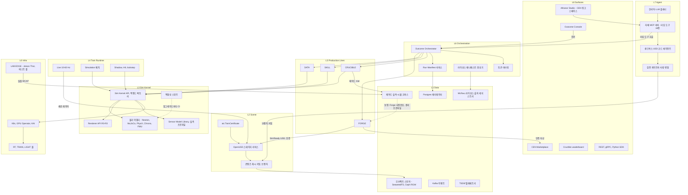

### 2.1 네 개의 주요 흐름

| 흐름 | 경로 | 산출물 | 핵심 계약 | 목표 지연 |
|---|---|---|---|---|
| **① 주문(Outcome)** | Console 또는 MCP → Orchestrator(주문 명세 → DAG 컴파일) → 생산 라인 → Kernel → QA 게이트 → 인증서 → 납품 | 데이터셋, 정책, 인증 트윈, 평가 리포트 | 주문 명세 스키마, DAG 노드 계약, Run Manifest | 영상 → 피킹 스킬 48시간(P0 내부) → 24시간(P1) → 당일(P2 셀프서브) → 4시간(P3) |
| **② 자산(Forge)** | 휴대폰·로봇 영상 → 익명화 → 포즈·메트릭 깊이 → 3DGUT 스플랫 → 메시 → 생성형 보완 → 관절 추정 → 볼록 분해 → 물성 사전분포 → 실측 보정 → 3-백엔드 물리 QA → SimReady USD + 인증서 | Bronze/Silver/Gold 자산 | `aic:TwinCertificate`, 라이선스 매니페스트 | 영상 → Bronze 강체 2시간(P0) → 30분(P1) → 15분(P2) → 10분(P3) |
| **③ 라이브** | PLC·로봇·AMR → 엣지 게이트웨이(OPC UA, MQTT, ROS 2 + Zenoh) → Kafka → 트윈 상태 서비스 → USD 라이브 세션 레이어 → 브라우저(WebSocket)·TSDB | 실시간 미러, 실패 이벤트, 드리프트 지표 | W3C WoT ↔ USD prim 경로 매핑 | 10–60 Hz, 종단 지연 p95 ≤ 250 ms[A] |
| **④ 증거(Proof)** | 실셀 시험(LAB EDGE) MCAP + 시뮬 재생 Manifest → 페어드 코퍼스 → 충실도 예측기·센서 프로파일·Forge 사전분포 재보정 | Scorecard, 인증서, 코퍼스 trial | 페어드 trial 레코드 스키마(§11.5) | trial 1k(M4) → 10k(M12) → 50k(M24) → 150k(M36) |

### 2.2 레이어 × 구역 × 풀 좌표

| 레이어 | 대표 컴포넌트 | Zone F(팩토리) | Zone T(테넌트) | Zone S(소버린·에어갭) | 주 GPU 풀 |
|---|---|---|---|---|---|
| L8 | Console, Studio, Marketplace | 내부 Console | Studio, Marketplace | Studio(로컬), Marketplace 오프라인 미러[A] | 없음(클라이언트) |
| L7 | MCP 서버, 코드 에이전트 | 사내 딜리버리 엔지니어용(P0 v0, P1 전체) | P1 베타 읽기·실행 도구, P2 전체 | 온프렘 LLM, 출처 확인 모델(V8) | LIGHT(샌드박스) |
| L6 | Orchestrator, 미터링 | 팩토리 주문 | 셀프서브 주문 | 동일 바이너리, 텔레메트리 없음 | LIGHT |
| L5 | FORGE, DATA, SKILL, CRUCIBLE | RTX SDG, PhysX 조작, Mimic, Teleop | M9 베타(Zone T 전용, 초대제): Bronze Forge·Newton/MuJoCo 템플릿. M15 GA: 생산화 게이트를 통과한 라인 | Zone T 구성과 같음 | RT, TRAIN |
| L4 | Live, Simulation, Shadow | Simulation | Simulation, Live(P2) | 세 모드 모두 | RT, TRAIN, LIGHT |
| L3 | Kernel, 어댑터, R0–R3 | 모든 어댑터, R3 | Newton, MuJoCo, Chrono, 클린룸 Fossen(P3), FMU·PX4 SITL 브리지, R0–R2 | Zone T와 같고 R3는 BYOL만 | RT, TRAIN, LIGHT |
| L2 | 스테이지·커밋 서비스 | 공용(구역 태그 레이어 분리) | 공용 | 로컬 인스턴스 | LIGHT |
| L1 | 스토어, DB, Kafka, 코퍼스 | 공용(테넌트 버킷 분리) | 테넌트별 버킷·키 | 고객 인프라 | CPU |
| L0 | K8s, KAI, 풀 | 자체 RT 서버 전용 노드 | 테넌트 큐 | 고객 클러스터 | 전체 |

---

## 3. 레이어별 상세

**결론: OWN은 위로 갈수록 두꺼워지고 INTEGRATE는 아래로 갈수록 두꺼워진다. L3 이하에서 직접 만드는 것은 얇은 계약층(Kernel API, 어댑터, 적합성 스위트, Warp 센서 커널, 장면 서비스)뿐이다.**

구분 범례: **OWN** 직접 개발·IP 보유 · **INTEGRATE** 오픈소스를 버전 고정해 통합 · **LICENSE** 상용 라이선스(Zone F 또는 고객 BYOL) · **WATCH** 관찰만 하고 프로덕션 경로에 넣지 않음.

### 3.1 L0 인프라

| 컴포넌트 | 기술·버전(2026-10) | 책임 | 구분 | 구역 | 도입 |
|---|---|---|---|---|---|
| 클러스터 | Kubernetes 1.32 이상 | 모든 워크로드의 실행 기반. Cloud, Sovereign, Air-gap 동일 Helm 번들 | INTEGRATE | F·T·S | P0 |
| GPU 스택 | NVIDIA GPU Operator v26.7.1, 드라이버 R580 이상, CUDA 13 | 드라이버·툴킷·DCGM exporter·MIG 관리 | INTEGRATE | F·T·S | P0 |
| 스케줄러 | KAI Scheduler v0.18.2(Apache-2.0) | 갱 스케줄링, 계층형 DRF 큐, 회수, 토폴로지 배치. NvFractions는 같은 테넌트 안에서만 | INTEGRATE | F·T·S | P0 |
| DRA | NVIDIA DRA driver | GPU 할당은 공식 미지원·기본 비활성 → **의존하지 않는다**. ComputeDomains만 관찰 | WATCH | — | — |
| 분산 실행 | Ray 2.59(KubeRay) | RL 롤아웃, SDG 데이터 파이프라인, 스윕 | INTEGRATE | F·T·S | P0 |
| 멀티클라우드 버스트 | SkyPilot(Apache-2.0) | 스팟 페일오버, autostop. 거주 태그가 허용하는 리전으로만 | INTEGRATE | F·T | P0 |
| 샌드박스 런타임 | gVisor, Kata Containers | 사용자·에이전트 코드 격리(§12.3) | INTEGRATE | T·S | P1 |
| 레지스트리 | Harbor[A] + 서명 검증 | 구역 라벨·서명 이미지 보관, 에어갭 미러 | INTEGRATE | F·T·S | P0 |
| 노드 풀 | RT(L40S, RTX PRO 6000), TRAIN(H100/H200/B200), LIGHT(L4, CPU), LAB EDGE(Jetson AGX Thor) | 능력별 분리(§12.1) | — | — | P0 |
| 드라이버 사전 점검기 | 자체(Python + DCGM 질의) | Turing 이상 GPU, R580 이상, MIG 프로파일, 스토리지 대역폭 점검 후 설치 허용 | **OWN** | S | P2 |

### 3.2 L1 데이터

| 컴포넌트 | 기술·버전 | 책임 | 구분 | 도입 |
|---|---|---|---|---|
| 오브젝트 스토어 | SeaweedFS 또는 Ceph RGW(S3 API) | 콘텐츠 주소 지정 블롭, 데이터셋, MCAP, 체크포인트 | INTEGRATE | P0 |
| 메타데이터 DB | PostgreSQL | 커밋·브랜치, Manifest, 주문·DAG 상태, 계보 엣지, 미터링 | INTEGRATE | P0 |
| 이벤트 백본 | Apache Kafka(4.x KRaft 전용 [U]) | 라이브 텔레메트리, Job 이벤트, 감사 로그 | INTEGRATE | P0(내부), P2(라이브) |
| TSDB | TimescaleDB 2.x Apache-2.0 에디션(MVP, TSL 고급 기능 미사용) 또는 InfluxDB 3 Core 3.11.4(대형 플릿) | 라이브 트윈 이력, sim SLO 시계열. Zone T/S는 TSL 배제 원칙(DR §0 #4 정오표 T-4) | INTEGRATE | P2 |
| 로그 포맷 | MCAP(MIT) | 시뮬·실측 원시 다중 센서 로그 | INTEGRATE | P0 |
| 학습 데이터셋 | LeRobotDataset v3(LeRobot 0.6.1) | IL·VLA 학습 내보내기, Hub 스트리밍 | INTEGRATE | P0 |
| 데이터셋 스냅샷 | Apache Iceberg 또는 DVC | 대형 데이터셋 버전 | INTEGRATE | P1 |
| 모델 레지스트리 | MLflow 3.16.1 | 정책·검출기·VLA 체크포인트, 메트릭 | INTEGRATE | P0 |
| 라이선스·출처 레지스트리 | 자체 | 코드 SPDX, 자산·데이터·가중치 권리, NEVER 목록 판정 | **OWN** | P0 |
| 페어드 코퍼스 | 자체 스키마(Parquet + MCAP + Manifest) | 실측/시뮬 trial 쌍, 측정권 플래그 | **OWN** | P0 |

### 3.3 L2 장면

| 컴포넌트 | 기술·버전 | 책임 | 구분 | 도입 |
|---|---|---|---|---|
| 툴링 USD | OpenUSD 26.08(2026-07-20) | 장면 서비스, 검증, 베이킹. UsdPhysics 중첩·Hydra 2 기본값은 25.11부터, UsdVolParticleField(3DGS)·wasm 빌드는 26.03부터 | INTEGRATE | P0 |
| 런타임 USD(Zone F) | Isaac Sim 6.1 번들 USD(버전 [U]) | 팩토리 런타임 로딩 | LICENSE | P0 |
| 스테이지 서비스 | 자체(Python + C++ 바인딩) | 레이어 스택 조립, 쿼리, prim 경로 검색 | **OWN** | P0 |
| 커밋 서비스 | 자체 | 콘텐츠 해시 커밋, 브랜치, 3-way 레이어 병합 | **OWN** | P0 |
| 자산 해석기 | 자체 ArResolver 플러그인(`ath://`)[A] | 콘텐츠 해시 URI → 오브젝트 스토어, 로컬 캐시 | **OWN** | P0 |
| 변환기 | newton-physics/urdf-usd-converter, mujoco-usd-converter, adobe/USD-Fileformat-plugins(glTF·FBX·OBJ·PLY·SPZ·STL) | 경계 포맷 import/export | INTEGRATE(Apache-2.0) | P0 |
| 물리 스키마 | UsdPhysics + newton-usd-schemas v0.x(실험적) + mjcPhysics + PhysxSchema | 공통 물리 + 백엔드 확장 | INTEGRATE | P0 |
| 자체 스키마 | `aic:` codeless 스키마(TwinCertificate, Provenance, SensorProfile, DomainPack, Scenario) | 인증·출처·센서 프로파일·도메인 팩 | **OWN** | P0 |
| 검증 | UsdValidation(26.x, fixer 포함) + 자체 검증기 AIC-V001–V012 | 커밋 게이트, 에이전트 게이트 | INTEGRATE + **OWN** | P0 |
| 웹 베이커 | 자체 파이프라인(USD → glTF/GLB + KHR_gaussian_splatting·SPZ LOD 타일) | R0 웹 배포 | **OWN** | P1 |

### 3.4 L3 Sim Kernel

| 컴포넌트 | 기술·버전 | 책임 | 구분 | 구역 | 도입 |
|---|---|---|---|---|---|
| Sim Kernel API | 자체(§4) | 엔진 중립 ABI, 백엔드 팩토리, capability 협상 | **OWN** | F·T·S | P0(v0), P1(v1 동결) |
| Newton 어댑터 | Newton(트레인 핀 = Isaac Lab 3.x GA 릴리스 노트 핀, EA 기준 1.5.2 / Warp 1.16. 예외 승인 이미지 `kernel-newton:train-1-1.6`에서만 1.6.1 + Warp 1.18). MJWarp 3.15 기본, Kamino·VBD·Style3D·ImplicitMPM | 학습 처리량, 보행·조작·변형체 | INTEGRATE | F·T·S | P0 |
| MuJoCo CPU 어댑터 | MuJoCo 3.15.0(float64) | 결정론 재현·인증, 레퍼런스 | INTEGRATE | F·T·S | P0 |
| Isaac Lab + PhysX 어댑터 | Isaac Lab 3.x(소스 빌드) + Isaac Sim 6.1 + PhysX 5.x(번들 버전 [U], 공개 SDK 최신 5.11) | 접촉 집약 조작, TacSL, Mimic, Teleop, Vehicle2(야드 차량·AMR) | LICENSE(Kit 런타임) | **F만** | P0 |
| Drake 어댑터 | Drake v1.57.0(BSD-3, CPU) | 오프라인 접촉 골드 스탠다드(hydroelastic, SAP) | INTEGRATE | F·T(내부 검증) | P1 |
| Chrono 어댑터 | Chrono 10.0.0(Vehicle, SCM/CRM, FSI-SPH) | 차량·지형·해양 FSI. CPU 경로는 반복 비트 일치 시험 + CTO 등록 전까지 D1(D0 목표 M22 [A]) | INTEGRATE | F·T·S | P2(Mobility Pack α) |
| 클린룸 Fossen 어댑터 | 자체 Warp 커널(6-DOF 선체 동역학 + 파랑 스펙트럼), Warp CPU 경로 | 선박·USV·부유체 동역학, 적합성 6번째 백엔드(C13). D0 등록 전 D1(목표 M28 [A]) | **OWN** | F·T·S | P3 |
| FMU 마스터 | FMI 3.0.2 + SSP | 고객 CarSim/CarMaker·플랜트 모델 공동 시뮬레이션(BYOL). 공동 시뮬레이션 브리지이므로 적합성 백엔드 수에 넣지 않는다 | **OWN**(마스터 알고리즘) | F·T·S | P2 |
| PX4 SITL 브리지 | PX4 1.16/1.17 SITL + Gazebo Jetty, lockstep 클록 | 드론 템플릿(P2 RL 1종), 적합성 C14. lockstep D0 등록 전 D1 | **OWN**(브리지) + INTEGRATE | T·S | P2(M20–M24) |
| PhysX SDK 소스 어댑터 | PhysX SDK 5.11(Apache-2.0 코어) | 테넌트용 PhysX 경로 | **OWN** | T·S | P2 조건부(36–48 HM) |
| Genesis | Genesis World 1.4.3 | 비CUDA 헤지 관찰 | WATCH | — | — |
| Renderer API | 자체(§5) | R0–R3 티어 추상화 | **OWN** | F·T·S | P0 |
| Sensor Model Library | 자체 Warp 커널 + 실측 프로파일 | 렌더러 중립 센서 모델 | **OWN** | F·T·S | P0(카메라·깊이), P1(라이다·IMU) |
| 적합성 스위트 | 자체(§4.6) | 백엔드 간 허용치 검증, 업그레이드 게이트 | **OWN** | — | P0(3 × 5) |

### 3.5 L4 트윈 런타임

| 컴포넌트 | 기술·버전 | 책임 | 구분 | 도입 |
|---|---|---|---|---|
| 시뮬레이션 러너 | 자체(Kernel + Ray) | 헤드리스 배치, 체크포인트, 스팟 재개 | **OWN** | P0 |
| 엣지 게이트웨이 | 자체 ROS 2 브리지(Jazzy·**Lyrical** 기본, Humble은 M7 이후 best-effort·2027-05 EOL, rmw_zenoh), open62541 v1.5.9(OPC UA, MPL-2.0), MQTT 클라이언트 | 고객 셀 텔레메트리 수집, 아웃바운드 전용 mTLS | **OWN** + INTEGRATE | P2 |
| 트윈 상태 서비스 | 자체 경량 서비스(Kafka + Postgres) 우선, Eclipse Ditto 3.9.7(EPL-2.0) 대안 | 최신 상태, W3C WoT Thing Description ↔ USD prim 경로 | **OWN** | P2(M12에 결정) |
| 라이브 레이어 작성기 | 자체 | 변환·관절 상태·신호만 USD 세션 레이어에 10–60 Hz로 덮어씀 | **OWN** | P2 |
| fork-from-live 서비스 | 자체 | 스냅샷 → 보정 → what-if → 사후 비교(§8.3) | **OWN** | P2 |
| 섀도·HIL 클록 마스터 | 자체(`use_sim_time` + `/clock`, OPC UA 동기) | lockstep 클록, 데드라인 관리 | **OWN** | P2 |

### 3.6 L5 생산 라인

| 라인 | 핵심 통합 기술(버전) | 자체 개발 범위 | 구역 |
|---|---|---|---|
| **FORGE** | gsplat 1.6.0, 3DGRUT 2.0(3DGUT), fVDB Reality Capture 0.4, VGGT-1B-Commercial(V7 조건부), MapAnything-apache 가중치, DA3 Small/Base/Metric, TRELLIS.2(nvdiffrast 교체), SAM 3D Objects(민수, V7 조건부), Articulate-Anything(MIT), CoACD/CuACD | 오케스트레이션, 익명화, 관절·물성 추정 모델, 물리 QA, 인증서 생성기 | F·T(Bronze 셀프서브 M9 베타) |
| **DATA** | Isaac Sim 6.1 Replicator + RTX(Zone F 전용), Newton Warp 래스터 + Warp Sensor Library(Zone T·S), Cosmos Transfer 2.5(M5–M8) → Cosmos 3 Nano 16B 파인튜닝(M9부터), RF-DETR N–L | 라벨 일관성 QA, 도메인 랜덤화 프리셋, mAP 비율 자동 측정 | F 중심, T는 M15 생산화 게이트 후 |
| **SKILL** | Isaac Lab 3.x(rsl_rl 5.5, skrl 2.1), mjlab 1.6.0, LeRobot 0.6.1(ACT, Diffusion, SmolVLA 450M, GR00T N1.7), Isaac Lab Mimic, RLinf 0.3(P2), ONNX → TensorRT | sim2sim 게이트, Sim2Real 키트, Jetson 패키저 | F·T(템플릿) |
| **CRUCIBLE** | Isaac Lab Arena 기반 과제 러너, MuJoCo CPU 결정론 재생 | 과제 스위트, 신뢰구간·회귀 게이트, 공동서명 워크플로, 회피 규정 집행 | F(P1 내부), T(M18 외부 Arena) |

### 3.7 L6 오케스트레이션

| 컴포넌트 | 기술 | 책임 | 구분 | 도입 |
|---|---|---|---|---|
| Outcome Orchestrator | 자체 상태 기계(Postgres) + Kafka 이벤트, 실행은 KAI(K8s Job)·KubeRay | 주문 명세 → DAG → QA 게이트 → 납품 + 인증서 | **OWN** | P0 v0, P1 v1 |
| 대체 실행기 | NVIDIA OSMO 6.3.1(Apache-2.0) | DR 지정 폴백. Orchestrator 실행기 인터페이스 뒤에 꽂음 | INTEGRATE(폴백) | 필요 시 |
| 토큰 미터링 | 자체(DCGM GPU-초 + KAI 큐 귀속 → CEN 토큰) | 풀별 원가 기반 과금 | **OWN** | P0(내부 원가), P1(과금) |
| Run Manifest 서비스 | 자체 | 등록·동결·서명·재생 | **OWN** | P0 |
| 라이선스 매니페스트 생성기 | 자체(SPDX + 자산·가중치 권리) | 모든 납품물에 라이선스 증명 첨부 | **OWN** | P0 |

### 3.8 L7 에이전트

| 컴포넌트 | 기술 | 책임 | 구분 | 도입 |
|---|---|---|---|---|
| MCP 서버 | 자체(MCP 사양 2026-07-28) | 타입·권한 도구 18종(§10.2) | **OWN** | P0 사내 v0, P1 v1 |
| 플래너 LLM | SaaS: 프런티어 API · Sovereign: 온프렘 오픈 가중치 · 공공·국방: 출처 확인 국산 모델(V8) | 한국어 의도 → 도구 계획 | INTEGRATE | P0 |
| USD 코드 에이전트 | 자체 + gVisor/Kata 샌드박스 | 타입 연산으로 표현 못 하는 편집만 코드로 생성 | **OWN** | P1 |
| 검증 게이트 | 자체(§10.3) | 5단 가드레일 | **OWN** | P0 |
| API 그라운딩 | NVIDIA kit-usd-agents(Apache-2.0: Kit MCP 12, USD Code MCP 7, OmniUI MCP 10, Isaac Sim MCP 5 도구) | 개발 단계에서만 사용 | INTEGRATE(내부) | P0 |
| 로봇 연결 | ros-mcp-server(Apache-2.0) | 테넌트 ACL 뒤에서만 | INTEGRATE | P2 |

### 3.9 L8 표면

| 컴포넌트 | 기술·버전 | 책임 | 구분 | 도입 |
|---|---|---|---|---|
| Outcome Console | 자체 웹 앱 | 한국어 주문·검토·인수, Scorecard 뷰 | **OWN** | P0 내부, P1 고객 |
| Athanor Studio | 자체(CEN 워크스페이스 안) | 장면 편집, 템플릿, 셀프서브 라인 | **OWN** | M9 베타(Zone T 전용, Explorer는 대기자 명단 초대제·주간 승인 상한), M15 GA(공개 가입) |
| 웹 R0 클라이언트 | three.js r186(WebGPU/WebGL2) + Spark 2.x(WebGL2, 기본), Babylon.js 9.29(OpenUSD WASM), PlayCanvas 2.23(WebGPU, 대형 스플랫) | R0 렌더 | INTEGRATE | P1 |
| 코드 작업 환경 | Jupyter, VS Code, Selkies(MPL-2.0) 데스크톱 | 코드 우선 사용자 | INTEGRATE(CEN 기존) | P1 |
| 디버그 뷰어 | Rerun 0.38.1, Lichtblick(MPL-2.0), Viser(Apache-2.0) | 에피소드·MCAP 타임라인 | INTEGRATE | P0 |
| Marketplace | CEN 마켓플레이스 + Certified 등급 | 인증 자산·데이터셋 유통 | **OWN**(확장) | P1 |
| Leaderboard | 자체 | Crucible·Arena 결과 공개 | **OWN** | M12 K-Pick Challenge(2027-10-22. 헌장 서명이 늦으면 공동서명 기관 입회 아래 비순위 시연), M18 Arena v1 |
| SDK | REST, gRPC, Python SDK(`athanor`) | 프로그래매틱 접근 | **OWN** | P1 |

---

## 4. Sim Kernel API 명세

**결론: Kernel은 "같은 USD 커밋을 백엔드만 바꿔 실행하고, 그 차이를 숫자로 보고하는" 얇은 ABI다. Isaac Lab 3.x의 `physics=...|renderer=...` 팩토리 패턴을 그대로 미러링하므로 새로 발명하는 것은 거의 없고, 우리가 더하는 것은 capability 협상, 구역 강제, Manifest 자동 기록, 적합성 스위트다.**

### 4.1 설계 목표와 비목표

| 구분 | 내용 |
|---|---|
| 목표 G1 | 같은 장면 커밋을 백엔드 설정만 바꿔 실행한다. 상위 코드는 바뀌지 않는다 |
| 목표 G2 | 배치(`n_envs`) 텐서 인터페이스. 상태·행동·센서는 DLPack 호환 텐서(Warp array, torch.Tensor)로 무복사 교환한다. CPU 백엔드는 numpy를 쓴다 |
| 목표 G3 | `snapshot()`/`restore()`로 fork-from-live, 스팟 재개, 결정론 재생을 같은 메커니즘으로 처리한다 |
| 목표 G4 | capability 협상으로 '조용한 실패'(백엔드가 기능을 무시하고 그럴듯한 값을 내는 것)를 없앤다 |
| 목표 G5 | 모든 `load()`가 Run Manifest에 백엔드·버전·이미지 다이제스트·솔버 설정을 자동 기록한다 |
| 비목표 N1 | 최소공통분모 강제. 백엔드 고유 기능은 capability 플래그와 `extras` 네임스페이스로 노출한다 |
| 비목표 N2 | 학습 루프 소유. 학습 루프는 Isaac Lab·mjlab·LeRobot이 소유하고, Kernel은 그들이 쓸 수 있는 환경 백엔드를 제공한다 |
| 비목표 N3 | 멀티 GPU 분산. Kernel 인스턴스 하나는 프로세스 하나, GPU(또는 MIG 슬라이스) 하나다. 분산은 Ray가 맡는다 |

**공통 규약(어댑터가 경계에서 변환한다)**
- **단위·좌표:** SI 단위, Z-up, `metersPerUnit = 1`. 장면 검증기(AIC-V001)가 강제한다.
- **쿼터니언:** API 경계에서는 **(x, y, z, w)**로 고정한다. Isaac Lab 3.x 규약과 같다. MuJoCo(w, x, y, z)·Chrono 어댑터는 경계에서 변환한다. Isaac Lab 3.0의 대표적 비호환 변경이 바로 이 순서였으므로, 변환은 어댑터 경계 한 곳에서만 하고 상위 코드에는 한 가지 규약만 존재하게 한다.
- **상태 키:** `root_pose[n,7]`, `root_vel[n,6]`, `joint_pos[n,J]`, `joint_vel[n,J]`, `joint_effort[n,J]`, `body_pose[n,B,7]`, `particle_pos[n,P,3]`, `actuator_cmd[n,A]`, `sim_time[n]`. 관절·바디 순서는 `load()`가 돌려주는 `LoadReport.index`의 USD prim 경로 순서로 고정한다.
- **시간:** `dt`는 물리 스텝, `substeps`는 제어 1회당 물리 스텝 수다. 제어 주기 = `dt × substeps`.

### 4.2 Python 인터페이스(v0, P0 동결 목표)

```python
# athanor/kernel/api.py — Sim Kernel API v0
# 동결: 초안 W2(2026-11-09 주), v0 동결 G0(M4, 심의 2027-02-26), v1 동결 P1 말(M12) [A]
from __future__ import annotations

from dataclasses import dataclass, field
from enum import Flag, auto
from typing import Any, Literal, Mapping, Protocol, Sequence, runtime_checkable

Tensor = Any  # DLPack 호환: warp.array | torch.Tensor | numpy.ndarray(CPU 백엔드)
Zone = Literal["F", "T", "S"]


@dataclass(frozen=True)
class StageRef:
    commit: str                                  # "sha256:..." 장면 커밋 ID
    prim_root: str = "/World"
    variants: Mapping[str, str] = field(default_factory=dict)  # Domain Pack variant 선택


@dataclass(frozen=True)
class BackendConfig:
    physics: str                                 # "newton_mjwarp" | "mujoco_cpu" | "isaaclab_physx" | "drake" | "chrono" | "fossen" | "fmu" | "px4_sitl"
    renderer: str = "none"                       # "none" | "r1_warp" | "r2_neural" | "r3_rtx" (R0는 웹 베이커가 담당)
    train_pin: str = "train-1"                   # 릴리스 트레인 핀(호환성 매트릭스 키)
    device: str = "cuda:0"                       # CPU 백엔드는 "cpu"
    n_envs: int = 1
    dt: float = 1.0 / 200.0
    substeps: int = 1
    deterministic: bool = False                  # True면 결정론 경로 강제. 불가하면 load()가 실패
    precision: Literal["fp32", "fp64"] = "fp32"
    extras: Mapping[str, Any] = field(default_factory=dict)    # "newton:*", "mjc:*", "physx*" 네임스페이스 설정


class Cap(Flag):
    BATCHED_GPU = auto()
    DETERMINISTIC_BITWISE = auto()
    FP64 = auto()
    DIFFERENTIABLE = auto()
    REDUCED_COORD_ARTICULATION = auto()
    CLOSED_LOOP = auto()
    LARGE_DOF_GT60 = auto()
    SDF_CONTACT = auto()
    HYDROELASTIC = auto()
    CLOTH = auto()
    VOLUME_FEM = auto()
    CABLE = auto()
    GRANULAR_MPM = auto()
    VEHICLE_TIRE = auto()
    DEFORMABLE_TERRAIN = auto()
    FLUID_FSI = auto()
    TACTILE = auto()
    FULL_SNAPSHOT = auto()
    TILED_CAMERA = auto()
    FMU_COSIM = auto()


@dataclass(frozen=True)
class Capabilities:
    static: Cap                                  # 어댑터가 선언한 능력(적합성 스위트가 검증)
    effective: Cap                               # 현재 설정·하드웨어에서 실제로 유효한 능력
    max_envs_hint: int                           # 베이크오프 실측 기반 권장 상한
    backend: str
    version: str                                 # 예: "newton 1.5.2 / warp 1.16.0"(train-1 EA 핀)
    image_digest: str                            # "sha256:..." 컨테이너 다이제스트
    zone: Zone


@dataclass(frozen=True)
class LoadReport:
    index: Mapping[str, Sequence[str]]           # "joints" | "bodies" | "sensors" → prim 경로 순서
    ignored_attrs: Sequence[str]                 # 이 백엔드가 읽지 않은 네임스페이스 속성
    warnings: Sequence[str]


@dataclass(frozen=True)
class StepResult:
    sim_time: Tensor                             # float[n_envs]
    wall_time_s: float
    nan_envs: Tensor                             # bool[n_envs] NaN/Inf 또는 폭발 감지
    contact_count: Tensor                        # int[n_envs]


@dataclass(frozen=True)
class ContactBatch:
    env_id: Tensor                               # int[K]
    body_a: Tensor                               # int[K] → LoadReport.index["bodies"]
    body_b: Tensor
    position: Tensor                             # float[K,3] 월드 좌표(m)
    normal: Tensor                               # float[K,3]
    normal_force: Tensor                         # float[K] (N)
    tangential_force: Tensor                     # float[K,3] (N)
    penetration: Tensor                          # float[K] (m, 양수 = 관통)


@runtime_checkable
class SimKernel(Protocol):
    def load(self, stage: StageRef, cfg: BackendConfig) -> LoadReport: ...
    def step(self, n: int = 1) -> StepResult: ...
    def get_state(self, keys: Sequence[str] | None = None,
                  env_ids: Tensor | None = None) -> Mapping[str, Tensor]: ...
    def set_state(self, state: Mapping[str, Tensor], env_ids: Tensor | None = None) -> None: ...
    def apply_actions(self, actions: Mapping[str, Tensor], env_ids: Tensor | None = None) -> None: ...
    def render(self, sensor_ids: Sequence[str],
               env_ids: Tensor | None = None) -> Mapping[str, Tensor]: ...
    def contacts(self, env_ids: Tensor | None = None, max_contacts: int = 65536) -> ContactBatch: ...
    def snapshot(self) -> bytes: ...             # 버전 태그 + 전체 상태 + RNG 상태
    def restore(self, blob: bytes) -> None: ...  # 버전 불일치면 SnapshotIncompatible
    def set_seed(self, seed: int) -> None: ...   # 백엔드 내부 모든 RNG(랜덤화, 센서 노이즈)
    def capabilities(self) -> Capabilities: ...
    def close(self) -> None: ...


class KernelError(Exception): ...
class LoadError(KernelError): ...
class CapabilityMissing(KernelError): ...
class ZoneViolation(KernelError): ...
class SolverDiverged(KernelError): ...           # 전 env가 발산했을 때만. 일부는 nan_envs로 보고
class SnapshotIncompatible(KernelError): ...
```

**설계 판단과 검토한 대안**

| 결정 | 채택 | 검토한 대안 | 기각 이유 |
|---|---|---|---|
| 텐서 교환 | DLPack 무복사 | gRPC 직렬화, 공유 메모리 IPC | 4,096 env × 수백 차원 상태를 매 스텝 직렬화하면 처리량이 수십 배 떨어진다. 원격 호출이 필요한 경우(라이브·HIL)는 상위 서비스가 감싼다 |
| 인스턴스 = 프로세스 = GPU 1장 | 채택 | 한 프로세스에서 다중 백엔드 | Kit과 Warp의 CUDA 컨텍스트·드라이버 핀이 충돌한다. Newton 1.5.x(Isaac Lab 핀)와 1.6.x(Warp 1.18)를 한 프로세스에 둘 수 없다 |
| 부분 발산 처리 | `nan_envs` 마스크 반환, 배치 지속 | 예외 발생 | RL 배치에서 env 1개 발산으로 4,096개를 버리면 비용이 폭증한다. 격리·재시작은 상위 학습 루프가 한다 |
| 결정론 요청 | `deterministic=True`인데 불가하면 `load()` 실패 | 경고 후 진행 | 인증 경로에서 조용히 비결정 실행되면 인증서 전체의 신뢰가 무너진다 |

### 4.3 백엔드 팩토리

```python
# athanor/kernel/factory.py
from dataclasses import dataclass

from athanor.bench import bench_score            # 베이크오프·월간 벤치 기반 steps/s/$ 점수
from athanor.kernel.api import (BackendConfig, Cap, CapabilityMissing, LoadError,
                                SimKernel, ZoneViolation)

# 실행 구역 → 허용 어댑터 라벨. 어댑터 라벨: F = NVIDIA 독점 런타임 포함, T = 허용형(T·S 공용), S = 소버린 전용 패키징
ALLOWED_ZONES = {"F": {"F", "T", "S"}, "T": {"T", "S"}, "S": {"S", "T"}}


@dataclass(frozen=True)
class AdapterSpec:
    name: str              # "newton_mjwarp"
    cls: type              # SimKernel 구현
    zone: str              # 어댑터 자체의 라이선스 구역: Isaac Lab+PhysX, R3 RTX는 "F"
    static_caps: Cap
    image: str             # "harbor.athanor.internal/kernel/newton:train-1@sha256:..."
    train_pins: tuple[str, ...]


_REGISTRY: dict[str, AdapterSpec] = {}


def register(spec: AdapterSpec) -> None:
    if spec.name in _REGISTRY:
        raise ValueError(f"duplicate adapter {spec.name}")
    _REGISTRY[spec.name] = spec


def make_kernel(cfg: BackendConfig, *, run_zone: str, required: Cap,
                manifest: "RunManifestWriter") -> SimKernel:
    spec = _REGISTRY.get(cfg.physics)
    if spec is None:                             # AC-11: 오류는 KernelError 계층으로만
        raise LoadError(f"unknown adapter {cfg.physics}")
    if spec.zone not in ALLOWED_ZONES[run_zone]:
        raise ZoneViolation(f"{spec.name}(zone {spec.zone}) cannot run in zone {run_zone}")
    if cfg.train_pin not in spec.train_pins:
        raise LoadError(f"{spec.name} not certified for {cfg.train_pin}")
    missing = required & ~spec.static_caps
    if missing:
        raise CapabilityMissing(f"{spec.name} lacks {missing}; "
                                f"candidates={route(required, run_zone, cfg.train_pin)}")
    kernel = spec.cls()
    manifest.record_backend(name=spec.name, image=spec.image, cfg=cfg)
    return kernel


def route(required: Cap, run_zone: str, train_pin: str) -> list[str]:
    """required를 모두 만족하고, 구역이 허용되며, 같은 트레인 핀을 지원하는 어댑터를 steps/s/$ 실측 순으로 반환."""
    ok = [s for s in _REGISTRY.values()
          if not (required & ~s.static_caps)
          and s.zone in ALLOWED_ZONES[run_zone]
          and train_pin in s.train_pins]
    return [s.name for s in sorted(ok, key=lambda s: -bench_score(s.name, required))]
```

작업 유형별 기본 라우팅은 베이크오프 결정 메모(2027.01 첫 주)로 확정하고, 그 전까지는 아래 가설로 운영한다. 표의 근거는 [03 엔진 선정](03-engine-selection-build-vs-buy.md) §3.4다.

```yaml
# kernel-routing.yaml — Train 1 가설. 결정 메모로 덮어쓴다 [A]
version: train-1
decision_rule: "성공률 보정 steps/s/$ 최대. 단 적합성 통과 + sim2sim Tier 1(≤10%p) 통과. 차이 10% 이내면 Zone T 호환 경로 우선"
sim2sim_backends: { F: [newton_mjwarp, isaaclab_physx, mujoco_cpu], T: [newton_mjwarp, mujoco_cpu], S: [newton_mjwarp, mujoco_cpu] }
d0_registry: [mujoco_cpu]          # newton_deterministic은 W7 N1–N5 통과 후 추가. chrono_cpu(목표 M22), fossen_cpu(M28), px4_sitl_lockstep은 비트 일치 시험 + CTO 등록 후 [A]
task_types:
  locomotion:        { tenant: newton_mjwarp,    factory: newton_mjwarp,  fallback: mjlab,       certify: mujoco_cpu }
  pick_place:        { tenant: newton_mjwarp,    factory: isaaclab_physx, fallback: mujoco_cpu,  certify: mujoco_cpu }
  in_hand_dexterous: { tenant: newton_mjwarp,    factory: newton_mjwarp,  fallback: isaaclab_physx, certify: mujoco_cpu }
  insertion_sdf:     { tenant: newton_sdf_hydro, factory: isaaclab_physx, reference: drake,
                       certify: [newton_deterministic, mujoco_cpu_sdf_approx] }   # 전자는 W7 통과 시. 후자는 MuJoCo 전용 별도 보정 세트, 인증서에 "접촉 모델 상이" 표기. Drake는 대조 기준만
  deformable:        { tenant: newton_vbd,       factory: newton_vbd,     fallback: mujoco_flex,
                       certify: mujoco_cpu_static_calib }   # 정적 보정 시험(처짐·정지 형상)만 D0, 인증서 "experimental". 동역학 산출물은 D1
  granular:          { tenant: newton_mpm,       factory: newton_mpm,     certify: none }         # 인증 대상 아님, Scorecard만
  closed_loop:       { tenant: newton_kamino,    factory: newton_kamino,  fallback: mujoco_equality, certify: mujoco_cpu }
  humanoid_dex_gt60: { tenant: split_tree,       factory: isaaclab_physx, certify: mujoco_cpu_split }   # 베이크오프 T11로 확정
  amr_cell_vehicle:  { tenant: newton_wheel,     factory: isaaclab_physx_vehicle2, fallback: chrono, certify: mujoco_cpu }   # Vehicle2는 Zone F 전용
  road_offroad:      { tenant: chrono,           factory: chrono,         fallback: fmu,
                       certify: statistical_only }   # Chrono CPU는 반복 비트 일치 시험(N1–N4 동등) + DR 개정 후 D0 등록(목표 M22) [A]. M18–M24
  drone_px4:         { tenant: px4_sitl,         factory: px4_sitl,       certify: statistical_only }   # PX4 SITL lockstep D0 등록 후 전환. M20–M24
  marine_6dof:       { tenant: fossen,           factory: fossen,         fallback: chrono_fsi,
                       certify: statistical_only }   # 클린룸 Fossen CPU D0 등록(목표 M28) 후 전환. P3
```

### 4.4 Capability 플래그

`●` 지원(적합성 테스트로 검증) · `◐` 제한적·실험적 · `○` 미지원 · `—` 해당 없음. 표는 어댑터 선언값이며, `effective`는 설정·하드웨어에 따라 줄어든다(예: Newton의 `DETERMINISTIC_BITWISE`는 결정론 모드 + 동일 GPU SKU·드라이버에서만).

| 플래그 | 의미 | Newton/MJWarp | MuJoCo CPU | Isaac Lab + PhysX(F) | Drake | Chrono 10 | FMU |
|---|---|---|---|---|---|---|---|
| BATCHED_GPU | 수천 env GPU 배치 | ● | ○ | ● | ○ | ◐(CPU 중심) | ○ |
| DETERMINISTIC_BITWISE | 같은 시드·하드웨어에서 비트 일치 | ◐(1.4+ 결정론 경로, 하드웨어 간 이식은 [U]) | ● | ◐(동일 하드웨어·버전, 강체·관절만) | ● | ◐(CPU 경로. 비트 일치 시험 + CTO 등록 전 인증 불가, 목표 M22) [A] | 모델 의존 |
| FP64 | 배정밀 | ○(float32) | ● | ○ | ● | ● | 모델 의존 |
| DIFFERENTIABLE | 미분 가능 | ◐(Featherstone·SemiImplicit만 기본 수준. MJWarp 불가) | ○ | ○ | ●(AutoDiff [U]) | ○ | ○ |
| REDUCED_COORD_ARTICULATION | 축약좌표 관절 | ●(Featherstone, MuJoCo 솔버) | ● | ● | ● | ● | — |
| CLOSED_LOOP | 폐루프 메커니즘 | ◐(Kamino 실험적) | ●(equality) | ● | ● | ● | — |
| LARGE_DOF_GT60 | 단일 메커니즘 60 DoF 초과에서 안정 | ◐(MJWarp 약점) | ● | ● | ● | — | — |
| SDF_CONTACT | SDF 충돌 | ● | ◐ | ● | ● | ◐ | — |
| HYDROELASTIC | 압력장 접촉 | ●(1.6.0에서 33–37% 가속) | ○ | ○ | ● | ○ | — |
| CLOTH / CABLE | 천·케이블 | ●(VBD, Style3D) | ◐(flex) | ◐ | ○ | ◐(ANCF) | — |
| VOLUME_FEM | 체적 변형체 | ◐ | ◐(Stable Neo-Hookean, IPC 실험적) | ● | ○ | ●(FEA) | — |
| GRANULAR_MPM | 입상체 | ●(ImplicitMPM) | ○ | ◐ | ○ | ●(DEM, CRM) | — |
| VEHICLE_TIRE | 타이어 모델 | ○(관절 휠 근사) | ○ | ●(Vehicle2, Zone F 전용) | ○ | ●(Pac89/Pac02, TMeasy, Fiala, FEA/ANCF) | ● |
| DEFORMABLE_TERRAIN | 변형 지형 | ○ | ○ | ○ | ○ | ●(SCM, CRM) | ○ |
| FLUID_FSI | 유체-구조 연성 | ○ | ○ | ○ | ○ | ●(FSI-SPH) | ◐ |
| TACTILE | 촉각 센서 | ◐(hydroelastic 압력장 기반 Warp 커널, 자체) | ◐(touch_grid) | ●(TacSL) | ◐ | ○ | ○ |
| FULL_SNAPSHOT | 전체 상태 + RNG 스냅샷 | ● | ● | ◐(Kit 상태 일부) [A] | ● | ●(10.0 체크포인팅) | ◐(FMI 3.0 상태 직렬화 지원 FMU만) |
| TILED_CAMERA | 배치 카메라 렌더 | ●(R1 Warp) | ○ | ●(R3) | ○ | ◐ | ○ |
| FMU_COSIM | FMU 공동 시뮬 | — | — | — | — | ◐ | ● |

- **클린룸 Fossen 어댑터(P3):** 6-DOF 선체 동역학 전용이다. 선언하는 capability는 BATCHED_GPU(Warp), FLUID_FSI ◐(계수 기반 유체력과 파랑 스펙트럼, 자유수면 해석 아님), FULL_SNAPSHOT뿐이다[A]. DETERMINISTIC_BITWISE는 Warp CPU 경로가 비트 일치 시험을 통과하고 D0 목록에 등록된 뒤(목표 M28 [A])에만 선언한다. 표의 다른 플래그는 해당 없음(—)이다.
- **PX4 SITL 브리지(P2):** FMU와 같은 공동 시뮬레이션 브리지로 취급하며, 비행 동역학은 PX4·Gazebo 쪽에 있다. lockstep 클록 아래 FULL_SNAPSHOT ◐만 선언한다[A].

### 4.5 어댑터 계약(Adapter Contract)

어댑터는 아래 12개 조항을 모두 지켜야 릴리스 트레인에 들어간다. 조항마다 적합성 스위트에 대응 테스트가 있다. 조항 안의 수치(스텝 수, 회귀 비율)는 설계 목표치[A]이며 베이크오프 결정 메모에서 확정한다.

| # | 조항(MUST) | 검증 테스트 |
|---|---|---|
| AC-1 | UsdPhysics 공통 스키마만으로 장면을 실행할 수 있어야 한다. 네임스페이스 속성은 자기 것만 읽고 나머지는 `ignored_attrs`에 기록한다 | `test_tier1_only_load` |
| AC-2 | 네임스페이스 속성이 Tier 1 값(질량, 관성, 관절 한계)을 덮어쓰면 `LoadError`를 낸다 | `test_no_tier1_override` |
| AC-3 | 경계 규약(SI, Z-up, 쿼터니언 xyzw, 상태 키, prim 경로 순서)을 지킨다 | `test_frame_conventions` |
| AC-4 | 부분 발산은 `nan_envs`로 보고하고 예외를 던지지 않는다. 발산 env는 `set_state`로 복구 가능해야 한다 | `test_partial_divergence` |
| AC-5 | `restore(snapshot())` 후 100스텝 결과가 결정론 백엔드에서는 비트 일치, 그 외에는 §4.6 허용치 안이다 | `test_snapshot_roundtrip` |
| AC-6 | `set_seed`는 도메인 랜덤화와 센서 노이즈를 포함한 모든 내부 RNG에 적용된다. 같은 시드 2회 실행의 랜덤화 샘플이 동일하다 | `test_seed_coverage` |
| AC-7 | `capabilities().static`의 모든 플래그는 대응 테스트를 통과해야 한다. 거짓 플래그 1개 = 어댑터 릴리스 차단 | `test_caps_honesty/*` |
| AC-8 | 텐서는 DLPack 호환이며 디바이스 간 암묵적 복사를 하지 않는다 | `test_zero_copy` |
| AC-9 | `load()`는 Run Manifest에 백엔드명·버전·이미지 다이제스트·솔버 설정을 기록한다 | `test_manifest_hook` |
| AC-10 | 어댑터 패키지는 구역 라벨과 SPDX 매니페스트를 갖는다. Zone F 어댑터는 Zone T/S 이미지에 포함될 수 없다 | SBOM 게이트(§14.2) |
| AC-11 | 오류는 `KernelError` 계층으로만 던진다. 엔진 고유 예외를 상위로 새지 않게 한다 | `test_error_mapping` |
| AC-12 | 성능 회귀 보고: 표준 장면 steps/s/GPU를 직전 트레인 대비로 보고한다. 10% 초과 하락은 경고, 25% 초과는 차단[A] | `bench_regression` |

### 4.6 적합성 스위트: 장면 목록과 허용치

DR KPI는 "통과한 백엔드 수 × 장면 수"다. P0 3 × 5, P1 4 × 8, P2 5 × 12, P3 6 × 15. **판정은 '적용 가능한 조합 100% 통과'다.** 예를 들어 MuJoCo CPU에 타이어 장면을 강요하지 않고 N/A로 명시한다.

**백엔드 증설 순서[A]:** P0 `newton_mjwarp`, `mujoco_cpu`, `isaaclab_physx`(3) → P1 + `drake`(4, 오프라인 기준, 접촉 장면만) → P2 + `chrono`(5) → P3 + `fossen`(6, 클린룸 Fossen 6-DOF, 해양 장면 C13). `fmu`와 `px4_sitl`은 공동 시뮬레이션 브리지라 적합성 백엔드 수에 넣지 않는다. 조건부 `physx_sdk` 어댑터(DR §3.4의 3개 조건 충족 시)는 착수하면 추가 백엔드(7번째)로 센다.

**장면 목록과 허용치[A]** (이 표의 C01–C15가 장면 번호·장면·허용치의 정본이다. 허용치는 베이크오프 W2 측정 후 결정 메모(2027-01 첫 주)에서 고정한다)

| ID | 장면 | 도입 | 측정 지표 | 허용치[A] | 적용 백엔드 |
|---|---|---|---|---|---|
| C01 | 낙하 박스(1 kg, 10 cm 정육면체, 1 m 낙하) | P0 | 자유낙하 위치: 이산 적분기 해 x_n = x₀ − ½·g·dt²·n(n+1) 대비, 또는 연속 해석해 대비 / 정지 후 관통 / 정지 드리프트 / 백엔드 간 정지 자세 | 이산 해 대비 ≤ 1e-6 m 또는 연속 해 대비 ≤ 3 mm(dt = 1 ms) / ≤ 1 mm / ≤ 0.5 mm/s / ≤ 2 mm·1° | 전체 |
| C02 | 진자(1 m, 1 kg, 10°·60°) | P0 | 주기: 10°는 소각 해석해 대비, 60°는 타원적분 정확해 T = 4√(L/g)·K(sin(θ₀/2)) 대비 / 10초 에너지 드리프트(무감쇠) / 백엔드 간 각도 RMSE | ≤ 0.5% / ≤ 1% / ≤ 1° | 전체. PhysX는 `physxRigidBody:angularDamping = 0`과 관절 마찰 0을 Tier 2로 명시 |
| C03 | Franka 픽(스크립트 관절 궤적, 5 cm 큐브) | P0 | 파지 성공 / 리프트 중 미끄럼 / EE 궤적 ADE(백엔드 간) / 관절 토크 상대차 | 10/10 / ≤ 5 mm / ≤ 5 mm / ≤ 10% | Newton, MuJoCo, PhysX |
| C04 | 폴리백(VBD vs MuJoCo flex) | P0 | 정지 형상 Chamfer / 100시드 파지 성공률 차이 | ≤ 15 mm / ≤ 15%p(통계적, 결정론 요구 없음) | Newton, MuJoCo, PhysX |
| C05 | 바퀴 차량(4륜 AMR, 1 m/s + 0.5 rad/s, 10초) | P0 | 최종 위치·요 오차(백엔드 간) | ≤ 5 cm, ≤ 3° | Newton(관절 휠), PhysX(Vehicle2), MuJoCo |
| C06 | 관절 서랍 열기 | P1 | 힘-변위 곡선 RMSE | ≤ 10% | Newton, MuJoCo, PhysX |
| C07 | 페그 삽입(공차 0.5 mm) | P1 | 접촉력 피크 vs Drake / 100시드 성공·실패 판정 일치 | ±20% / ≥ 95% | Newton(SDF·hydro), PhysX, Drake |
| C08 | 한국 SKU 빈 클러터(30개 정착 5초) | P1 | 관통 / 폭발(속도 > 10 m/s) | ≤ 2 mm / 0건 | Newton, MuJoCo, PhysX |
| C09 | 케이블 삽입 | P2 | 끝점 궤적 ADE / 성공률 차이 | ≤ 10 mm / ≤ 15%p | Newton, PhysX |
| C10 | Kamino 폐루프 그리퍼 | P2 | 링크 구속 오차 / 파지력 차이 | ≤ 0.5 mm / ≤ 10% | Newton(Kamino), MuJoCo(equality) |
| C11 | 휴머노이드 + 양손(60 DoF 초과) 정지·보행 1주기 | P2 | 관절 궤적 RMSE / 발 접촉 타이밍 | ≤ 2° / ≤ 10 ms | PhysX, MuJoCo, Newton(분할) |
| C12 | 차량 정상상태 선회(Mobility Pack α) | P2 | 정상 선회 반경·요레이트 | ≤ 3%, ≤ 3% | Chrono, PhysX Vehicle2 |
| C13 | 선박 6-DOF 롤 감쇠(Fossen) | P3 | 롤 주기·감쇠비 vs 해석해 | ≤ 2%, ≤ 5% | 자체 Fossen, Chrono FSI |
| C14 | 쿼드로터 호버·스텝 응답(PX4 SITL) | P3 | 고도 오버슈트·정착 시간 | ≤ 5%, ≤ 10% | PX4 SITL 브리지 |
| C15 | SCM 지형 침하(오프로드 UGV) | P3 | 침하 깊이 vs 실측 | ≤ 15% | Chrono |

- **C01 허용치의 근거:** 시험 대상 백엔드(MuJoCo/MJWarp Euler, PhysX TGS/PGS, Newton Featherstone/SemiImplicit, Drake 이산 스텝)는 모두 1차 반암시적 적분이다. 반암시적 Euler의 위치는 x_n = x₀ − ½·g·dt²·n(n+1)이므로 연속 해석해와의 차이는 ½·g·dt·t다. 1 m 낙하(t ≈ 0.4515 s, dt = 1 ms)에서 약 2.2 mm가 되므로, 연속 해석해 대비 1e-4 m 기준은 어떤 백엔드도 통과할 수 없다. 그래서 적분기 구현 검증은 이산 해 대비 ≤ 1e-6 m로, 물리 근사 검증은 연속 해 대비 ≤ 3 mm로 나눠 본다. RK4는 MuJoCo CPU에서만 쓸 수 있고, 그때만 연속 해에 바짝 붙는다.
- **C02 감쇠 조건:** PhysX 강체·관절 링크는 기본 각감쇠(0.05 s⁻¹)가 있어 10초 동안 에너지의 약 60%를 잃는다. 장면에 Tier 2 속성으로 0을 명시하지 않으면 에너지 드리프트 기준을 통과할 수 없다. 60° 진폭을 소각 주기와 비교하면 약 7% 어긋나므로 정확해와 비교한다.
- **05 S 번호와의 대응:** [05 §8.1](05-physics-and-realism.md)의 S1–S15 번호는 쓰지 않고 C 번호로 바꾼다. 대응은 S1→C01, S2→C02, S3→C03, S4→C04, S5→C05, S7→C07, S9→C10, S10→C11, S15→C13이다. 05에만 있는 장면(S6 경사면 미끄럼, S8 케이블 처짐, S11 박스 5단 적재, S12 AMR·차량 타이어 슬립, S13 입상체 붓기, S14 천 드레이프)은 C16+ 확장 후보로 두고, 단계별 '백엔드 × 장면' KPI에는 C01–C15만 센다.

**결정론·재현 테스트(모든 단계 공통, 필수)**

시험 ID는 결정론 등급(D0/D1/D2, §7.4)과 헷갈리지 않도록 DT 접두사를 쓴다.

| ID | 테스트 | 기준 | 비고 |
|---|---|---|---|
| DT-1 | 같은 시드·하드웨어·드라이버 2회 실행 | 비트 일치 100% | `mujoco_cpu`, Newton 결정론 모드(W7 N1–N5 통과 후). DR KPI '인증 시험 결정론적 재현율 100%'의 근거 |
| DT-2 | GPU SKU 간(RTX PRO 6000, H100, L40S) 재현 | 측정·공개만(합격 기준 없음) | Newton '하드웨어 간 이식 가능 결정론' 주장 검증(베이크오프 W7 N2) |
| DT-3 | 스냅샷 왕복(AC-5) | 결정론: 비트 일치, 그 외: 장면 허용치 | fork-from-live와 스팟 재개의 전제 |
| DT-4 | Manifest 재생(§7.4) | 출력 해시 일치(`D0_bitwise` 클래스) | 인증서 발행 전 필수 |
| DT-5 | D0 경로 등록 시험(Chrono CPU, 클린룸 Fossen Warp CPU, PX4 SITL lockstep) | 반복 비트 일치(N1–N4와 동등) 100% + CTO 등록 | 통과 전 해당 경로 산출물은 `D1_statistical`. 목표 등재 Chrono M22, Fossen M28 [A] |

**실행 체계**
- **트리거:** 엔진·드라이버·USD·Kernel 버전을 바꾸는 모든 PR, 야간 정기 실행, 트레인 승격 전 전체 실행이다.
- **풀:** CPU 장면은 LIGHT, GPU 장면은 RT·TRAIN의 소형 슬롯에서 돈다.
- **산출물:** 장면 × 백엔드 행렬, 허용치 대비 여유(margin), 직전 트레인 대비 차이를 낸다. 결과는 Run Manifest와 함께 보관하고 공개 벤치마크(분기 갱신, P1)의 원천이 된다.
- **DR 해석:** 베이크오프 W2의 "적합성 스위트 v0 × 5개 백엔드"는 B1–B5 다섯 **실행 구성**(Newton 단독, Isaac Lab Kit-less Newton, Isaac Lab + PhysX, MuJoCo CPU, mjlab)을 뜻한다. B1·B2·B5는 같은 Newton/MJWarp 계열이므로, P0 '3 × 5'의 백엔드 3개는 Newton/MJWarp 계열·PhysX·MuJoCo CPU의 통과 수로 센다.

### 4.7 sim2sim 게이트(2단 구조)

게이트는 [07 §7.3](07-training-module.md)의 2단 구조를 정본으로 한다. DR KPI '정책 수출 전 적용률 100%'는 Tier 1 기준이다. 게이트는 Kernel API만으로 구현되므로 엔진이 바뀌어도 코드가 바뀌지 않는다.

**Tier 1: 수출 차단 게이트(모든 정책)**

| 단계 | 내용 | 기준[A] |
|---|---|---|
| 1 | 학습 백엔드(예: Newton)에서 평가 1,000 에피소드 | 기준 성공률 S₀ |
| 2 | 교차 백엔드 전부에서 같은 정책·같은 시드 집합. Zone F 정책: PhysX·Newton·MuJoCo CPU 3개. Zone T/S 정책: Newton·MuJoCo CPU 2개(조건부 PhysX SDK 소스 어댑터 편입 시 3개) | 성공률 차이 ≤ 10%p, 평균 반환 비율 ≥ 0.85 |
| 3 | 지연·노이즈 주입(Sim2Real 키트 프리셋) | 성공률 하락 ≤ 15%p |
| 4 | ONNX(opset 고정) 변환 후 동일 입력 대조 | 행동 최대 오차 ≤ 1e-3 |
| 실패 시 | 수출 차단, DAG가 원인 분류(물리 의존·과적합·수치)와 함께 SKILL 라인에 반려 | — |

**Tier 2: 인증 등급 게이트(로봇-과제 인증서·Crucible 공식 캠페인 대상 정책)**

| 단계 | 내용 | 기준[A] |
|---|---|---|
| 1 | Tier 1 통과 | — |
| 2 | 게이트 백엔드 전부에서 같은 초기 조건 200개 | 백엔드 쌍별 성공률 차이 ≤ 5%p, 관절 궤적 RMSE ≤ 0.05 rad |
| 실패 시 | 인증 보류, 접촉 파라미터 랜덤화 폭 확대 후 재학습 또는 고객 승인하에 운영 범위 축소 | — |

- **왜 두 단인가:** 모든 정책에 5%p를 걸면 변형체·접촉 과제의 PoC 반복이 막히고, 인증서에 10%p를 허용하면 인증의 의미가 흐려진다. 납품 속도는 Tier 1이, 인증의 엄격성은 Tier 2가 지킨다.

### 4.8 버전 핀과 이중 핀 처리

- **트레인 단위 핀:** Train 1(2026-12 ~ 2027-06)은 Zone F에 Isaac Sim 6.1.x, Kit 110.x, Isaac Lab 3.x GA를 쓴다. Newton·Warp는 GA 릴리스 노트에 명시된 핀이다(EA 기준 Newton 1.5.2, Warp 1.16. GA 핀은 [U]). 공통으로 드라이버 R580 이상, OpenUSD 툴링 26.08을 쓴다.
- **이중 핀 예외:** 테넌트 Kernel이 Newton 1.6.x 신기능을 꼭 써야 하면 `kernel-newton:train-1-isaaclab`과 `kernel-newton:train-1-1.6` 두 이미지를 발행한다. 두 이미지는 같은 적합성 스위트를 돌리고, 장면별 차이를 결정 메모에 기록한다. Warp 1.18은 Turing 이상 GPU와 R580 이상 드라이버가 필요하므로, 이 이미지는 사전 점검기를 통과한 노드에만 스케줄된다.
- **호환성 매트릭스 필드:** Isaac Sim, Kit, Isaac Lab, Newton, Warp, MuJoCo, MJWarp, mjlab, PhysX SDK, Drake, Chrono, OpenUSD(툴링·런타임), PyTorch, CUDA, 드라이버, Python. 실제 국내 CSP GPU 이미지에서 검증한 뒤에 발행한다.
- **mjlab 이미지:** mjlab 1.6.x는 MuJoCo Warp 3.11에 고정돼 있으므로 `kernel-mjlab:train-1`(MJWarp 3.11) 별도 이미지로 운영한다. mjlab으로 학습한 정책의 인증 재현은 MuJoCo 3.15 CPU에서 하고, 두 버전의 차이는 적합성 스위트로 관리한다.
- **API 폐기 정책:** Kernel API는 SemVer를 따른다. 폐기 예고 후 2개 트레인 동안 유지한다[A].

---

## 5. Renderer API와 Sensor Model Library

**결론: 렌더러는 '이상적 버퍼'(radiance, 깊이, 광선 적중)만 만들고, 센서 모델은 렌더러와 분리된 Warp 라이브러리가 실측 디바이스 프로파일로 입힌다. 그래서 같은 카메라 프로파일이 R1·R2·R3 어디서든 같은 노이즈·ISP를 내고, Scorecard는 "어느 티어, 어느 프로파일"인지를 기록한다.**

### 5.1 티어 R0–R3

| 티어 | 엔진(버전) | 용도 | GPU | 구역 | 과금 기준 |
|---|---|---|---|---|---|
| **R0 Web** | three.js r186(WebGPU/WebGL2) + Spark 2.x(WebGL2), PlayCanvas 2.23(WebGPU), Babylon.js 9.29(OpenUSD WASM) | 편집·리뷰, 라이브 트윈 모니터링, 마켓 프리뷰 | 클라이언트(서버 GPU 0) | T·S | 무료 등급 포함 |
| **R1 Warp** | Newton Warp 렌더러, MJWarp 배치 렌더러 | 비전 RL 타일드 카메라, 디버그 | CUDA GPU(RT 코어 불필요) | F·T·S | 풀 토큰 단가 |
| **R2 Neural** | gsplat 1.6.0, 3DGRUT 2.0(3DGUT) | 현장 재구성 배경(UsdVolParticleField), 소버린 사실감 | CUDA(3DGRT만 RT 코어) | F·T·S | 래스터 이미지 ₩0.3 |
| **R3 RTX** | Isaac Sim 6.1 RTX(ovrtx는 GA·약관·적합성 후) | 물리 기반 카메라(PPISP)·라이다·레이더 SDG | **RT 코어 필수**(A40 최소, L40S 권장, RTX PRO 6000 Blackwell 최적) | **F**, S는 고객 운영 BYOL만 | RTX 실시간 ₩1.5, 경로추적 ₩15 |

**티어 선택 규칙:** 주문이 요구하는 지표(합성 전용 mAP 비율, 라이다 거리 오차)를 만족하는 **가장 낮은 티어**를 고른다. 상위 티어는 Scorecard 개선 효과가 GPU-시간 원가 증가분을 넘을 때만 쓴다. P2부터는 충실도 예측기가 주문 명세를 보고 티어를 자동 추천한다[A]. H100·H200·B200에는 RT 코어가 없으므로 R3 작업은 TRAIN 풀에 절대 배정하지 않는다.

### 5.2 Renderer 인터페이스

```python
# athanor/render/api.py
from dataclasses import dataclass
from enum import Enum
from typing import Literal, Mapping, Protocol, Sequence


class RenderTier(str, Enum):
    R0_WEB = "r0_web"
    R1_WARP = "r1_warp"
    R2_NEURAL = "r2_neural"
    R3_RTX = "r3_rtx"


Output = Literal["radiance", "rgb", "depth", "normals", "semantic", "instance", "flow",
                 "lidar_hits", "radar_returns"]


@dataclass(frozen=True)
class CameraSpec:
    prim_path: str                     # USD 카메라 prim(aic:SensorProfileAPI 적용)
    resolution: tuple[int, int]
    intrinsics: tuple[float, float, float, float]       # fx, fy, cx, cy (px)
    distortion: Literal["none", "opencv", "fisheye", "ftheta"]
    rolling_shutter_line_s: float = 0.0
    outputs: tuple[Output, ...] = ("rgb", "depth", "semantic")
    profile_id: str | None = None      # 실측 디바이스 프로파일. None이면 Scorecard에 '미보정' 표기


@dataclass(frozen=True)
class LidarSpec:
    prim_path: str
    pattern: Literal["spinning", "solid_state", "custom"]
    channels: int
    h_fov_deg: float
    v_fov_deg: tuple[float, float]
    range_m: tuple[float, float]
    rate_hz: float
    profile_id: str | None = None


class Renderer(Protocol):
    tier: RenderTier

    def attach(self, kernel: "SimKernel") -> None: ...          # 커널의 상태 텐서를 무복사로 구독
    def add_sensor(self, spec: CameraSpec | LidarSpec) -> str: ...
    def render_ideal(self, sensor_ids: Sequence[str],
                     env_ids: "Tensor | None" = None) -> Mapping[str, "Tensor"]: ...
    def capabilities(self) -> Mapping[str, bool]: ...        # rt_cores, tiled, splats, path_tracing, lidar, radar
```

`SimKernel.render()`는 내부적으로 `Renderer.render_ideal()` → `SensorModel.simulate()`를 연결한 결과를 돌려준다. 학습 코드는 이 분리를 몰라도 된다.

### 5.3 Sensor Model Library

```python
# athanor/sensors/api.py
from typing import Literal, Mapping, Protocol


class SensorModel(Protocol):
    kind: Literal["camera", "depth", "lidar", "radar", "imu", "tactile", "ft"]

    def configure(self, spec: "CameraSpec | LidarSpec", profile: "DeviceProfile") -> None: ...

    def simulate(self, ideal: Mapping[str, "Tensor"], state: Mapping[str, "Tensor"],
                 rng: "WarpRNG") -> Mapping[str, "Tensor"]:
        """이상적 버퍼에 실측 프로파일(노이즈 PSD, ISP, 롤링셔터, 강도·드롭아웃 모델)을 적용한다."""
        ...

    def calibrate(self, real_log: "MCAPRef", reference: "CalibrationTarget") -> "DeviceProfile":
        """실측 MCAP(차트·타깃 촬영)에서 프로파일을 추정한다. 결과는 aic:SensorProfile로 커밋된다."""
        ...
```

**디바이스 프로파일 예시(JSON, 요약)**

```json
{
  "profile_id": "aic-sp-cam-0042",
  "kind": "camera",
  "device": { "vendor": "<고객 카메라 제조사>", "model": "<모델>", "serial_class": "lot-2027A" },
  "protocol": "AIC-MP-CAM v1.1",
  "measured_at": "2027-03-04T10:20:00+09:00",
  "intrinsics": { "fx": 615.2, "fy": 615.0, "cx": 320.4, "cy": 241.1, "model": "opencv", "k": [0.091, -0.212, 0.0004, -0.0002, 0.103] },
  "noise": { "read_e": 2.1, "gain_e_per_dn": 0.48, "prnu": 0.006, "dark_current_e_s": 0.9 },
  "isp": { "gamma": 2.2, "ccm": [[1.62,-0.48,-0.14],[-0.21,1.43,-0.22],[-0.05,-0.52,1.57]], "mtf50_cy_px": 0.31 },
  "rolling_shutter_line_s": 2.9e-5,
  "validation": { "chart_delta_e_mean": 2.4, "validated": true, "evidence": "ath://blob/sha256:7c1e...mcap" }
}
```

**센서별 구역 경로와 판매 전 조건**

| 센서 | Zone F | Zone T/S | 판매 전 검증 조건(DR) |
|---|---|---|---|
| 카메라 | RTX + PPISP(네이티브 모드) 또는 Athanor 프로파일 | Warp ISP + 디바이스 프로파일 | 카메라 차트, 합성 전용 mAP 비율 ≥ 0.85(P0) → ≥ 0.90(P1) |
| 라이다 | RTX 라이다 | Warp 레이캐스트 + 거리·강도·드롭아웃 프로파일, 스플랫 배경은 gsplat 회전 라이다 래스터 | 거리 오차 ≤ 3 cm(P1), ≤ 2 cm(P2) |
| 레이더·EO/IR | RTX 레이더 | 인터페이스만 존재 | **오차 막대 공개 전 해양·국방 판매 금지.** 프로파일 `validated=false`면 Silver/Gold 인증서 발행 불가, 해양·국방 주문 명세는 Orchestrator가 거부 |
| 촉각 | TacSL(PhysX) | MuJoCo touch_grid, Newton hydroelastic 압력장 기반 자체 Warp 커널 | Kit-less TacSL 검증(M6) |
| IMU·F/T | Warp 노이즈 모델 | 같음 | 노이즈 PSD 일치 |

RTX 센서를 쓸 때는 두 모드가 있다. `native`는 RTX의 자체 센서 모델을 그대로 쓰고, `athanor`는 RTX의 이상적 버퍼에 우리 프로파일을 입힌다. Scorecard와 Run Manifest는 어느 모드였는지를 기록한다. 같은 프로파일을 R1·R2·R3에 걸어 티어 간 차이를 분리해 측정할 수 있다는 점이 이 구조의 핵심 이점이다.

---

## 6. 장면 서비스

**결론: 장면은 Git처럼 다루되 단위는 파일이 아니라 USD 레이어다. 자산은 콘텐츠 해시로 불변이고, 모든 편집은 자기 레이어를 만들며, 병합은 prim 경로 단위로 충돌을 판정한다. lakeFS(BSL 1.1 전환)를 들이지 않고 이 얇은 서비스를 직접 만든다.**

### 6.1 스테이지와 레이어 스택

하나의 트윈 장면은 아래 레이어 스택으로 조립된다. 위가 강하다. 1번은 USD 스테이지의 session layer라서 루트 레이어 스택보다 항상 강하고, 저장되지 않는다. 2–6번은 루트 레이어(`root.usda`)의 sublayer이며 강도 순으로 정렬한다. 7번은 prim이 참조·payload로 끌어오는 불변 자산이다.

| 순위 | 레이어 | 내용 | 작성 주체 | 커밋 여부 | 수명 |
|---|---|---|---|---|---|
| 1 | **세션 레이어(live)** | 변환, 관절 상태(`PhysicsJointStateAPI`), 신호 값만 | 라이브 레이어 작성기(10–60 Hz) | 커밋 안 함. fork 시점에만 스냅샷 커밋 | 휘발 |
| 2 | **편집 레이어** | 사용자·에이전트 편집 1건 = 레이어 1개 | Studio, `scene.apply_ops`, 코드 에이전트 | 브랜치 커밋 | 영구 |
| 3 | **시나리오 레이어** | 도메인 랜덤화 분포, 이벤트, OpenSCENARIO 유래 동작 | DATA·SKILL 라인, Crucible | 커밋 | 영구 |
| 4 | **보정 레이어** | sysid 결과(마찰·질량·감쇠·액추에이터 파라미터) | Forge, fork-from-live 보정기 | 커밋 | 영구 |
| 5 | **현장·셀 레이어** | 고객 현장 레이아웃, 스플랫 배경(UsdVolParticleField), 충돌 프록시 | Forge(현장), FDE | 커밋 | 영구 |
| 6 | **Domain Pack 레이어** | 센서 리그, 물리 프로파일 기본값, 표준 prim 규약 | Domain Pack 릴리스 | 팩 버전으로 고정 | 영구 |
| 7 | **자산 참조(payload)** | SimReady 자산(`ath://blob/sha256:...`), 인증서 메타데이터 포함 | Forge, Marketplace | 불변 | 영구 |

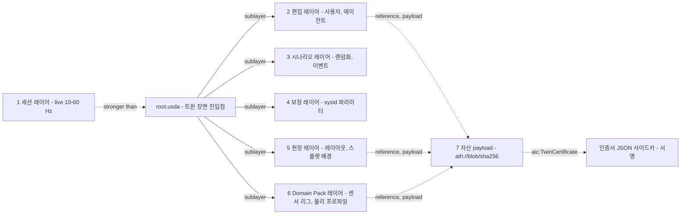

- **자산 해석:** 자체 ArResolver 플러그인이 `ath://blob/sha256:<hash>` URI를 오브젝트 스토어 경로로 바꾸고 노드 로컬 캐시에 둔다[A]. 로컬 절대경로 참조는 검증기 AIC-V006이 거부한다.
- **두 USD 버전 문제:** 툴링은 OpenUSD 26.08이고 Zone F 런타임은 Isaac Sim 6.1 번들 USD다. 그래서 자체 스키마는 C++ 플러그인이 아닌 **codeless 스키마**(plugInfo + generatedSchema.usda)로 만든다. newton-usd-schemas와 같은 방식이다. 해석기 플러그인만 두 USD 버전용으로 각각 빌드한다(기술 부채 TD-1).
- **해시 정규화:** `.usdc`는 바이트가 정규형이 아니다. 해시는 정규화한 `.usda` 텍스트(속성 정렬, 부동소수 표기 고정, 주석·타임스탬프 제거)로 계산하고, 저장과 로딩은 `.usdc`로 한다[A].

### 6.2 커밋·브랜치·병합

**커밋 객체**

```json
{
  "commit": "sha256:3b9a…",
  "parents": ["sha256:91fe…"],
  "layers": [
    { "role": "edit",     "path": "edits/0007_agent_lighting.usda", "sha256": "sha256:aa01…" },
    { "role": "scenario", "path": "scenario/dr_pick_v3.usda",       "sha256": "sha256:c3d2…" }
  ],
  "asset_closure": "sha256:e0c4…",
  "domain_pack": "manipulation-pack@1.2.0",
  "validation_report": "ath://report/sha256:51ab…",
  "author": { "kind": "agent", "user": "u_1932", "agent_session": "as_7f2c" },
  "message": "조명 3종 추가(4000K, 5600K, 6500K), 박스 위치 랜덤화 범위 ±5 cm",
  "created_at": "2027-04-12T14:03:11+09:00"
}
```

- **커밋 ID** = 위 JSON에서 `commit` 필드를 뺀 정규 JSON의 sha256. 같은 내용이면 같은 ID가 나온다.
- **`asset_closure`:** 장면이 참조하는 모든 자산 해시를 정렬해 다시 해시한 값이다. 자산 하나라도 바뀌면 바뀐다. Run Manifest는 이 값을 그대로 기록한다.
- **브랜치:** Postgres의 가변 포인터다. `main`은 보호 브랜치이며, 병합하려면 검증 게이트 통과 + 사람 승인이 필요하다. 에이전트는 `agent/<session>` 브랜치에만 쓴다.
- **동시성:** 전역 잠금은 없다. 브랜치 헤드를 compare-and-swap으로 갱신하는 낙관적 동시성이다.

**병합 알고리즘(레이어 단위 3-way)**

1. 병합 기준점(merge base) B, 양쪽 헤드 X·Y를 구한다.
2. X와 Y 각각에 대해 B 대비 추가된 레이어를 모으고, 각 레이어를 Sdf 수준에서 열어 **변경된 (prim 경로, 속성) 집합** ΔX, ΔY를 만든다.
3. ΔX ∩ ΔY에서 값이 다른 항목이 충돌이다. prim 삭제와 그 하위 속성 수정이 겹쳐도 충돌이다.
4. 충돌이 없으면 두 레이어 목록을 시간순으로 합쳐 새 커밋을 만든다. 레이어는 다시 쓰지 않으므로 병합은 O(레이어 수)다.
5. 충돌이 있으면 Studio 차이 화면(R0)에 prim 단위로 보여 준다. 에이전트는 해결안을 제안할 수 있지만, 확정은 사람이 한다.
6. 병합 커밋도 검증 게이트(§10.3의 ②–④)를 다시 통과해야 한다.

**엔터프라이즈 연동:** Git/Git-LFS와 Perforce 동기화 커넥터를 P2에 제공한다[A]. 데이터셋은 Iceberg 또는 DVC 스냅샷으로 버전을 관리하고, 데이터셋의 Run Manifest가 장면 커밋을 가리킨다.

### 6.3 스키마 정책

| 계층 | 스키마 | 규칙 |
|---|---|---|
| **Tier 1 공통** | UsdGeom, UsdShade(MDL, MaterialX, OpenPBR), **UsdPhysics**(RigidBodyAPI, MassAPI, CollisionAPI, MaterialAPI, 관절, ArticulationRootAPI, JointStateAPI), UsdSemantics, UsdVolParticleField(3DGS) | 모든 장면은 Tier 1만으로 모든 지원 백엔드에서 적합성 허용치 안에 들어가야 한다. 질량·관성·관절 한계·마찰은 Tier 1에만 둔다 |
| **Tier 2 백엔드 확장** | `newton:`(newton-usd-schemas v0.x, 실험적), `mjc:`(mjcPhysics), `physx*`(PhysxSchema) | 선택 사항이다. 각 백엔드는 자기 네임스페이스만 읽는다. Tier 1 값과 모순되면 검증 실패(AIC-V008). 솔버 파라미터(접촉 강성, 반복 횟수, 솔버 종류)만 둔다 |
| **Tier 3 AICHEMIST** | `aic:` codeless 스키마: `AicTwinCertificateAPI`, `AicProvenanceAPI`, `AicSensorProfileAPI`, `AicDomainPackAPI`, `AicScenarioAPI` | 메이저 버전 안에서는 속성 추가만 허용한다. `aic:schemaVersion`을 기록한다 |
| **금지** | USD 안의 실행 코드, 절대 경로, 해석 불가 참조, 비SI 단위, 미등록 네임스페이스 | 커밋 거부 |

AOUSD Core 1.0.1은 UsdPhysics를 규범으로 포함하지 않고, glTF의 KHR_physics_rigid_bodies는 아직 Review Draft다. **물리 이식성의 규범은 표준이 아니라 우리 적합성 스위트다.** 이것이 Tier 1 규칙을 "모든 백엔드에서 허용치 안"으로 정의한 이유다. AOUSD 회원 가입으로 UsdPhysics 규범화에 참여하는 방안은 §18의 확장 항목으로 둔다.

### 6.4 `aic:TwinCertificate` 스키마

인증서는 두 부분이다. **USD 안의 요약**(검색·필터·뷰어 표시용)과 **서명된 JSON 사이드카**(전체 Scorecard, 증거 링크, 서명)다. 인증서는 자산의 콘텐츠 해시에 묶인다. 자산이 1바이트라도 바뀌면 해시가 달라져 검증기(AIC-V009)가 '미인증'으로 강등한다.

**필드 정의의 정본은 [05 §14.2](05-physics-and-realism.md) 표 14-2다.** 이 절은 장면 서비스·검증기·Marketplace가 읽는 필드를 아키텍처 관점에서 정리한다. 05 표에 없는 `aic:cert:protocol`, `aic:cert:massRelErr`·`frictionRelErr`, `aic:cert:validBackends`, `aic:cert:sidecar`·`sidecarSha256`은 검색·검증을 위해 스키마 1.0에 함께 등록하는 **파생 필드**다(메이저 버전 안 속성 추가 규칙, §6.3).

| 속성 | 타입 | 의미 |
|---|---|---|
| `aic:cert:id`, `aic:cert:schemaVersion` | string | 인증서 UUID(예: `3f6b2a8e-91c4-4d7a-b0e2-5c8d1f4a7e93`), 스키마 버전 `1.0` |
| `aic:cert:tier` | token | `bronze`(VLM 추정) / `silver`(영상 식별) / `gold`(랩 실측) |
| `aic:cert:status` | token | `valid` / `suspended` / `revoked` / `superseded`. 리콜 절차(§11.4)와 재인증 트리거(05 표 14-3)가 바꾼다 |
| `aic:cert:subjectAssetHash` | string | 인증 대상 자산(평탄화한 레이어 스택 = 자산 closure)의 SHA-256. 시각·물리를 함께 보증 |
| `aic:cert:envelope` | dictionary | 운영 범위(표면 재질, 하중, 속도, 온도, 조명) |
| `aic:cert:protocol` | string | 측정 프로토콜 ID·버전(파생) |
| `aic:phys:*`, `aic:phys:source:<param>`, `aic:phys:backend:<engine>` | double / token / dictionary | 물성 값과 표준편차, 값의 출처(`vlm`/`video`/`lab`), 백엔드별 보정 파라미터 세트 |
| `aic:cert:massRelErr`, `aic:cert:frictionRelErr` | float | 등급별 상대 오차(파생): Gold = 랩 측정 불확도, Silver = 영상 sysid 사후분포 기반 추정 오차, Bronze = VLM 사전분포 폭. `aic:phys:massSigma ÷ aic:phys:mass` 등으로 계산한다. DR KPI 'Gold 자산 질량/마찰 오차'(Forge 자동 추정 vs Gold 랩 실측, [05 §16.1](05-physics-and-realism.md))와는 다른 값이며, 인증 임계나 고객 보증 문구로 쓰지 않는다 |
| `aic:score:ade`, `aic:score:restPoseErr` | double | 보류 trial 기준 표준 밀기·낙하 궤적 ADE, 정지 자세 오차 |
| `aic:det:class`, `aic:det:replayBackend`, `aic:det:replayHash` | token / string | 결정론 등급(인증 시험은 `D0`만), 재현 엔진(D0 등록 경로), 해시 체인 루트 |
| `aic:conf:suiteVersion`, `aic:conf:trainId`, `aic:cert:validBackends` | string / string[] | 통과한 적합성 스위트와 릴리스 트레인, 허용치 안에서 검증된 백엔드@트레인 목록(파생) |
| `aic:evidence:runManifestId`, `aic:evidence:trialIds` | string / string[] | 인증 시험의 Run Manifest, 코퍼스 trial ID |
| `aic:cert:sidecar`, `aic:cert:sidecarSha256` | asset, string | 서명 JSON 사이드카와 해시(파생) |
| `aic:cert:issuedAt`, `aic:cert:validUntil` | string(ISO 8601) | 발행일, 유효기간. Bronze 12개월, Silver 24개월, Gold 24개월(05 표 14-1). 릴리스 트레인 업그레이드 때마다 D0를 다시 돌려 허용치 안이면 새 `trainId`로 재서명한다 |
| `aic:cert:issuer`, `aic:cert:cosigner` | string | 발행자, 공동서명 기관(Crucible·Arena 인증서에 필수) |
| `aic:sig:alg`, `aic:sig:keyId`, `aic:sig:value`, `aic:cert:revocationUrl` | string | 서명(Ed25519 [A], 사이드카와 같은 서명), 키 ID, 폐기 조회 URL |

- **인증 경로 제한:** `aic:det:class = D0`이고 `replayBackend`가 D0 등록 경로(MuJoCo CPU, W7 통과 후 Newton 결정론 모드)일 때만 발행기가 서명한다. 변형체는 MuJoCo CPU 정적 보정 시험 항목만 D0로 발행하고 `experimental`을 표기한다. Chrono·Fossen·PX4 SITL 동역학 항목은 D0 등록 전까지 인증서에 넣지 않는다.
- **Bronze 셀프서브 인증서:** QA-F를 통과하면 Forge 서비스 계정이 자동 서명한다. 에이전트가 `cert.issue`를 단독으로 호출하는 경로는 없다(§10.2).

**USDA 예시** (Silver 등급 한국 라면 박스 자산. 백엔드 네임스페이스 속성명은 예시다 [A])

```usda
#usda 1.0
(
    defaultPrim = "KR_RamenBox_A"
    metersPerUnit = 1
    upAxis = "Z"
    customLayerData = {
        string "aic:schemaVersion" = "1.0"
        string "aic:domainPack" = "manipulation-pack@1.2.0"
    }
)

def Xform "KR_RamenBox_A" (
    kind = "component"
    prepend apiSchemas = ["PhysicsRigidBodyAPI", "PhysicsMassAPI", "PhysxRigidBodyAPI", "SemanticsLabelsAPI:class",
                          "AicTwinCertificateAPI", "AicProvenanceAPI"]
)
{
    # Tier 1: 공통 물리(모든 백엔드가 읽는다)
    float physics:mass = 0.612
    point3f physics:centerOfMass = (0, 0, 0.071)
    float3 physics:diagonalInertia = (0.0021, 0.0034, 0.0027)
    token[] semantics:labels:class = ["ramen_box", "carton"]

    # Tier 2: 백엔드 확장. 해당 applied API 스키마(여기서는 PhysxRigidBodyAPI)를 적용한 prim에만 둔다.
    # newton:·mjc: 속성도 newton-usd-schemas·mjcPhysics의 applied 스키마를 함께 적용해야 한다.
    # 스키마 없이 쓴 네임스페이스 속성은 '미등록 네임스페이스'로 커밋이 거부된다(§6.3)
    float physxRigidBody:maxDepenetrationVelocity = 1.0

    # Tier 3: 인증(요약). 전체 Scorecard와 서명은 사이드카에 있다. 필드 정본은 05 §14.2
    string aic:cert:id = "3f6b2a8e-91c4-4d7a-b0e2-5c8d1f4a7e93"
    string aic:cert:schemaVersion = "1.0"
    token aic:cert:tier = "silver"
    token aic:cert:status = "valid"
    string aic:cert:subjectAssetHash = "sha256:9f2c41d07e…e1"
    string aic:cert:protocol = "AIC-MP-OBJ-RIGID v1.2"
    double aic:phys:mass = 0.612
    double aic:phys:massSigma = 0.037
    double aic:phys:muDynamic = 0.47
    token aic:phys:source:mass = "video"
    token aic:phys:source:muDynamic = "video"
    float aic:cert:massRelErr = 0.06
    float aic:cert:frictionRelErr = 0.14
    double aic:score:ade = 0.012
    double aic:score:restPoseErr = 0.004
    token aic:det:class = "D0"
    string aic:det:replayBackend = "mujoco==3.15.0"
    string aic:conf:trainId = "train-1"
    string[] aic:cert:validBackends = ["newton_mjwarp@train-1", "mujoco_cpu@train-1", "isaaclab_physx@train-1"]
    string aic:evidence:runManifestId = "ath://manifest/sha256:5d0e…"
    asset aic:cert:sidecar = @ath://blob/sha256:b71a…/certificate.json@
    string aic:cert:sidecarSha256 = "sha256:b71a…"
    string aic:cert:issuedAt = "2027-03-18T09:12:00+09:00"
    string aic:cert:validUntil = "2029-03-18T00:00:00+09:00"
    string aic:cert:issuer = "AICHEMIST Fidelity Lab"

    # 출처: 촬영원, 동의, 익명화, 라이선스(마켓플레이스 출처 게이트가 읽는다)
    string aic:prov:captureSource = "customer-site/phone-video"
    string aic:prov:consentId = "consent_2027_0311_0042"
    token aic:prov:anonymized = "faces,plates,labels"
    string aic:license:spdx = "LicenseRef-AICHEMIST-Asset-Commercial-1.0"
    token aic:prov:measurementRights = "granted"
    token aic:prov:residency = "KR"

    def Mesh "Visual" (prepend references = @ath://blob/sha256:41c2…/visual.usdc@) {}

    def Mesh "Collision" (
        prepend references = @ath://blob/sha256:c9e0…/collision_hulls.usdc@
        prepend apiSchemas = ["PhysicsCollisionAPI", "PhysicsMeshCollisionAPI", "MaterialBindingAPI"]
    )
    {
        uniform token physics:approximation = "convexDecomposition"
        uniform token purpose = "guide"
        rel material:binding:physics = </KR_RamenBox_A/PM_Cardboard>
    }

    def Material "PM_Cardboard" (prepend apiSchemas = ["PhysicsMaterialAPI"])
    {
        float physics:staticFriction = 0.52
        float physics:dynamicFriction = 0.47
        float physics:restitution = 0.05
    }
}
```

**사이드카 JSON(요약)** (키 이름은 05 §14.2의 JSON 예시와 같다)

```json
{
  "cert_id": "3f6b2a8e-91c4-4d7a-b0e2-5c8d1f4a7e93",
  "schema_version": "1.0",
  "tier": "silver",
  "status": "valid",
  "subject_asset_hash": "sha256:9f2c41d07e…e1",
  "envelope": { "surfaces": ["pvc_belt", "steel"], "speed_mps": [0.0, 0.5], "temperature_c": [5, 35] },
  "physics": {
    "mass": { "value": 0.612, "sigma": 0.037, "source": "video" },
    "mu_dynamic": { "value": 0.47, "sigma": 0.066, "source": "video" },
    "mass_rel_err": 0.06, "friction_rel_err": 0.14
  },
  "scores": { "ade_m": 0.012, "rest_pose_err_m": 0.004 },
  "render": { "psnr_db": 29.8, "ssim": 0.91, "lpips": 0.11, "tier": "r2_neural" },
  "conformance": { "train_id": "train-1", "backends": 3, "scenes_passed": ["C01", "C03", "C08"] },
  "determinism": { "class": "D0", "replay_backend": "mujoco==3.15.0", "hash_root": "sha256:4be2…" },
  "evidence": [
    { "kind": "capture_video", "uri": "ath://blob/sha256:0a91…", "sha256": "sha256:0a91…" },
    { "kind": "sysid_mcap",    "uri": "ath://blob/sha256:77de…", "sha256": "sha256:77de…" },
    { "kind": "run_manifest",  "uri": "ath://manifest/sha256:5d0e…" }
  ],
  "issuer": "AICHEMIST Fidelity Lab",
  "cosigner": null,
  "valid_until": "2029-03-18T00:00:00+09:00",
  "signature": { "alg": "Ed25519", "key_id": "aic-cert-2027-01", "value": "base64:…" }
}
```

**공개 검증:** Marketplace와 고객은 `cert verify <asset>` API로 ① 사이드카 서명, ② 사이드카 해시, ③ 자산 해시 일치를 확인할 수 있다[A]. 고객 PO가 인증서를 인수 기준으로 인용하려면(KPI: P1 고객 PO 1건) 이 검증 경로가 반드시 있어야 한다.

### 6.5 커밋 검증 규칙

임계값(관통 1 mm, 볼록 헐 64개 등)은 설계 목표치[A]이며, Forge QA 실측 분포를 보고 P1에 재조정한다.

| ID | 검사 | 실패 시 | 자동 수정 |
|---|---|---|---|
| AIC-V001 | `metersPerUnit = 1`, `upAxis = Z` | 거부 | 변환 레이어 제안 |
| AIC-V002 | 모든 강체에 질량 > 0, 관성 양의 정부호 | 거부 | 메시 부피·밀도 기반 추정(Bronze 표기) |
| AIC-V003 | 충돌 근사가 존재하고 볼록 헐 수 ≤ 64[A] | 거부 | CoACD/CuACD 재분해 |
| AIC-V004 | t = 0 상호 관통 ≤ 1 mm | 거부 | 수직 분리 제안 |
| AIC-V005 | 관절 한계·구동 게인 유한, 한계 범위 정상 | 거부 | — |
| AIC-V006 | 모든 참조가 `ath://` 콘텐츠 해시로 해석 | 거부 | 업로드 후 재작성 |
| AIC-V007 | 참조 자산마다 라이선스 매니페스트 존재, NEVER 목록 출처 없음 | 거부 + 보안 알림 | — |
| AIC-V008 | Tier 2 속성이 Tier 1 값을 덮어쓰지 않음 | 거부 | — |
| AIC-V009 | 인증서 `subjectAssetHash` = 실제 자산 해시, `aic:cert:status = valid` | '미인증' 강등 | — |
| AIC-V010 | SDG 대상 자산에 의미 라벨 존재 | 경고(DATA 라인에서는 거부) | 클래스 추론 제안 |
| AIC-V011 | 센서 prim에 `AicSensorProfileAPI`와 `validated` 상태 | 경고(해양·국방 주문은 거부) | — |
| AIC-V012 | Zone 태그: Zone F 전용 자산(NVIDIA 자산 등)이 테넌트 장면에 없음 | 거부 | — |

---

## 7. Run Manifest

**결론: Run Manifest는 "이 결과를 누가, 무엇으로, 어디서, 어떤 난수로 만들었는가"를 담은 서명된 영수증이다. 스케줄러는 Manifest 없는 Job을 받지 않고, 인증서·데이터셋·정책·Marketplace 리스팅은 모두 Manifest를 가리킨다.**

### 7.1 수명주기

1. **등록(pending):** Orchestrator가 DAG 노드를 내보낼 때 생성한다. 어드미션 웹훅이 Manifest ID 레이블이 없는 파드를 거부한다.
2. **보강(running):** Kernel `load()`가 백엔드·버전·이미지 다이제스트를, 노드 에이전트가 GPU SKU·드라이버·MIG 프로파일을 기록한다.
3. **동결(finalized):** 종료 시 출력 해시·메트릭·토큰 사용량을 채우고 Orchestrator 키로 서명한다. 이후 변경할 수 없다.
4. **재생(replay):** `athanor replay <manifest>`가 같은 이미지·같은 GPU SKU·드라이버 풀에 다시 스케줄하고 결과를 대조한다(§7.4).

### 7.2 JSON Schema(요약)

```json
{
  "$schema": "https://json-schema.org/draft/2020-12/schema",
  "$id": "https://schemas.athanor.aichemist.ai/run-manifest/1.0.json",
  "title": "Athanor Run Manifest v1.0",
  "type": "object",
  "required": ["manifest_version", "run_id", "kind", "tenant", "scene", "code", "backend",
               "hardware", "seeds", "det_class", "licenses", "status"],
  "properties": {
    "manifest_version": { "const": "1.0" },
    "run_id": { "type": "string", "pattern": "^run_[0-9A-HJKMNP-TV-Z]{26}$" },
    "kind": { "enum": ["forge_qa", "sdg", "augment", "rl_train", "il_train", "vla_finetune",
                       "eval", "crucible_eval", "replay", "conformance", "live_fork", "export"] },
    "tenant": {
      "type": "object", "required": ["id", "zone", "residency"],
      "properties": {
        "id": { "type": "string" },
        "zone": { "enum": ["F", "T", "S"] },
        "residency": { "enum": ["KR", "US", "EU"] }
      }
    },
    "order": { "type": "object", "properties": { "order_id": {"type": "string"}, "dag_id": {"type": "string"}, "node_id": {"type": "string"} } },
    "scene": {
      "type": "object", "required": ["commit", "asset_closure"],
      "properties": {
        "commit": { "type": "string", "pattern": "^sha256:[0-9a-f]{64}$" },
        "asset_closure": { "type": "string", "pattern": "^sha256:[0-9a-f]{64}$" },
        "domain_pack": { "type": "string" },
        "variants": { "type": "object", "additionalProperties": { "type": "string" } }
      }
    },
    "code": {
      "type": "object", "required": ["image_digest", "kernel_api", "adapters"],
      "properties": {
        "image_digest": { "type": "string", "pattern": "^sha256:[0-9a-f]{64}$" },
        "git_sha": { "type": "string" },
        "kernel_api": { "type": "string" },
        "train": { "type": "string" },
        "adapters": { "type": "array", "items": { "type": "object",
          "required": ["name", "version", "image_digest", "zone"],
          "properties": { "name": {"type": "string"}, "version": {"type": "string"},
                          "image_digest": {"type": "string"}, "zone": {"enum": ["F", "T", "S"]} } } }
      }
    },
    "backend": {
      "type": "object", "required": ["physics", "renderer", "dt", "substeps", "n_envs", "deterministic", "precision"],
      "properties": {
        "physics": {"type": "string"}, "renderer": {"type": "string"},
        "solver": {"type": "object"}, "dt": {"type": "number"}, "substeps": {"type": "integer"},
        "n_envs": {"type": "integer"}, "deterministic": {"type": "boolean"},
        "precision": {"enum": ["fp32", "fp64"]}
      }
    },
    "hardware": {
      "type": "object", "required": ["gpu_sku", "gpu_count", "driver", "cuda"],
      "properties": {
        "pool": {"enum": ["RT", "TRAIN", "LIGHT", "LAB_EDGE"]},
        "gpu_sku": {"type": "string"}, "gpu_count": {"type": "integer"},
        "mig_profile": {"type": ["string", "null"]}, "driver": {"type": "string"},
        "cuda": {"type": "string"}, "cpu_model": {"type": "string"}, "node_id": {"type": "string"}
      }
    },
    "seeds": {
      "type": "object", "required": ["master", "derivation"],
      "properties": { "master": {"type": "integer"}, "derivation": {"type": "string"} }
    },
    "inputs": { "type": "object", "properties": {
      "mcap_logs": {"type": "array", "items": {"$ref": "#/$defs/blob"}},
      "datasets":  {"type": "array", "items": {"$ref": "#/$defs/blob"}},
      "policies":  {"type": "array", "items": {"$ref": "#/$defs/blob"}},
      "sensor_profiles": {"type": "array", "items": {"$ref": "#/$defs/blob"}} } },
    "outputs": { "type": "array", "items": {"$ref": "#/$defs/blob"} },
    "det_class": { "enum": ["D0_bitwise", "D1_statistical", "D2_generative", "none"] },
    "det_replay": { "type": "object", "properties": {
      "replay_backend": {"type": "string"}, "d0_registered": {"type": "boolean"},
      "hash_chain_root": {"type": "string"}, "experimental": {"type": "boolean"} } },
    "generative": { "type": "object", "properties": {
      "model_weights_sha256": {"type": "string"}, "control_map_sha256": {"type": "string"},
      "label_consistency_pass": {"type": "boolean"} } },
    "licenses": {
      "type": "object", "required": ["manifest_ref", "zone_check"],
      "properties": { "manifest_ref": {"type": "string"}, "spdx": {"type": "array", "items": {"type": "string"}},
                      "zone_check": {"enum": ["pass", "fail"]}, "never_list_hits": {"type": "integer", "const": 0} }
    },
    "metrics": { "type": "object" },
    "parents": { "type": "array", "items": { "type": "string" } },
    "status": { "enum": ["pending", "running", "succeeded", "failed", "preempted", "finalized"] },
    "signature": { "type": "object", "properties": { "alg": {"type": "string"}, "key_id": {"type": "string"}, "value": {"type": "string"} } },
    "created_at": { "type": "string", "format": "date-time" },
    "finished_at": { "type": "string", "format": "date-time" }
  },
  "$defs": {
    "blob": { "type": "object", "required": ["uri", "sha256"],
              "properties": { "uri": {"type": "string"}, "sha256": {"type": "string"}, "type": {"type": "string"} } }
  }
}
```

### 7.3 예시: 피킹 검출기용 SDG 실행

```json
{
  "manifest_version": "1.0",
  "run_id": "run_01JD7K3W9ZQ4M8V2T6X1B0C5RH",
  "kind": "sdg",
  "tenant": { "id": "t_kr_0007", "zone": "F", "residency": "KR" },
  "order": { "order_id": "ord_2027_0213", "dag_id": "dag_9a1", "node_id": "data.render.shard-03" },
  "scene": {
    "commit": "sha256:3b9a6c…(64 hex)",
    "asset_closure": "sha256:e0c4f1…(64 hex)",
    "domain_pack": "manipulation-pack@1.2.0",
    "variants": { "lighting": "warehouse_mix", "bin": "kr_blue_600" }
  },
  "code": {
    "image_digest": "sha256:4f7d…(64 hex)",
    "git_sha": "c81e2b7",
    "kernel_api": "0.3.0",
    "train": "train-1",
    "adapters": [
      { "name": "isaaclab_physx", "version": "isaacsim 6.1.0 / physx 5.x(bundled)", "image_digest": "sha256:9c0b…", "zone": "F" },
      { "name": "r3_rtx", "version": "kit 110.x(bundled)", "image_digest": "sha256:9c0b…", "zone": "F" }
    ]
  },
  "backend": { "physics": "isaaclab_physx", "renderer": "r3_rtx", "solver": { "tgs_iters": 8 },
               "dt": 0.005, "substeps": 2, "n_envs": 64, "deterministic": false, "precision": "fp32" },
  "hardware": { "pool": "RT", "gpu_sku": "RTX PRO 6000 Blackwell Server", "gpu_count": 1,
                "mig_profile": null, "driver": "580.xx", "cuda": "13.x", "node_id": "rt-own-01-g3" },
  "seeds": { "master": 20270213, "derivation": "philox4x32(master, shard_id, env_id)" },
  "inputs": { "sensor_profiles": [ { "uri": "ath://blob/sha256:7c1e…", "sha256": "sha256:7c1e…", "type": "aic-sp-cam-0042" } ] },
  "outputs": [ { "uri": "ath://dataset/ds_ramen_pick_v2/shard-03", "sha256": "sha256:aa90…", "type": "coco+lerobot-v3" } ],
  "det_class": "D1_statistical",
  "licenses": { "manifest_ref": "ath://license/lm_2027_0213", "spdx": ["Apache-2.0", "BSD-3-Clause", "LicenseRef-NVIDIA-Proprietary"],
                "zone_check": "pass", "never_list_hits": 0 },
  "metrics": { "frames": 250000, "frames_per_gpu_s": 41.2, "label_consistency": 0.991,
               "gpu_seconds": 6068, "tokens": 101, "nan_envs": 0 },
  "parents": ["run_01JD7J…forge_qa"],
  "status": "finalized",
  "signature": { "alg": "ed25519", "key_id": "orc-2027-01", "value": "base64:…" },
  "created_at": "2027-02-13T10:02:11+09:00",
  "finished_at": "2027-02-13T11:43:19+09:00"
}
```

`zone = F`이고 `LicenseRef-NVIDIA-Proprietary`가 들어 있으므로, 이 Manifest의 출력물은 "산출물로만 판매" 규칙(DR §6.2)을 따른다. Zone F 런타임 자체는 납품물에 포함되지 않는다. 라이선스 매니페스트 생성기가 이 정보를 납품물 라이선스 고지에 자동으로 옮긴다.

### 7.4 재생 절차와 판정

`det_class`는 [05 §6.1](05-physics-and-realism.md)의 결정론 3등급(D0/D1/D2)과 같은 값이며, 05 §6.4의 `det.class`는 이 필드를 가리킨다. 대응은 D0 = `D0_bitwise`, D1 = `D1_statistical`, D2 = `D2_generative`다.

| 재현 클래스(`det_class`) | 발행 조건 | 재생 판정 | 쓰임 |
|---|---|---|---|
| **D0_bitwise** | D0 등록 경로: `mujoco_cpu`, Newton 결정론 모드(W7 N1–N5 통과 후). 동일 CPU 명령어 집합 또는 GPU SKU·드라이버·이미지. Chrono CPU·클린룸 Fossen·PX4 SITL lockstep은 비트 일치 시험 + CTO 등록(DT-5) 뒤에만 | 모든 출력 해시 일치 | 인증서, 회귀 테스트, 감사 |
| **D1_statistical** | GPU 배치(MJWarp, PhysX GPU, RTX), 변형체·입상체 동역학, D0 등록 전의 차량·드론·해양 동역학 | 지정 메트릭이 신뢰구간 안(예: 성공률 95% CI 겹침, mAP ±0.01)[A] | 데이터셋, 학습, 평가 캠페인, Scorecard 리포트 |
| **D2_generative** | Cosmos 증강, VLM 물성 추정 등 생성형 단계. 모델 가중치 해시·시드·제어 맵 해시만 기록 | 출력 동일성 미보장. 라벨 일관성 QA([05 §12.2](05-physics-and-realism.md)의 C1–C8 검사, QA-D1) 통과 여부만 재판정 | QA를 통과한 증강 프레임만 납품, Bronze 물성 사전분포 |
| **none** | 라이브 입력에 의존하고 MCAP를 남기지 않은 실행 | 재생 불가 | 탐색용 세션만. 납품 금지 |

- **변형체 인증:** 변형체(VBD·flex·cable) 산출물은 D1이다. 인증서는 정적 보정 시험(처짐·정지 형상)을 MuJoCo CPU로 D0 재현한 항목에만 붙이고 `det_replay.experimental = true`로 표기한다.
- **D0 등록 전 도메인:** Chrono(목표 M22)·Fossen(목표 M28)·PX4 SITL 경로의 동역학 산출물은 D1로 표기하고 Scorecard만 납품한다. 그동안 인증서는 자산·센서 항목에만 발행한다 [A].

---

## 8. 트윈 런타임 모드

**결론: 시뮬레이션 트윈이 기본 제품이고, 라이브 트윈은 측정 도구다. 세 모드는 같은 장면 커밋과 같은 Kernel을 공유하고, 다른 것은 클록과 입력의 출처뿐이다.**

### 8.1 모드 비교

| 항목 | **Live** | **Simulation** | **Shadow / HIL** |
|---|---|---|---|
| 목적 | 인수 모니터링, 현장 실패 마이닝, 충실도 드리프트 측정 | 데이터·학습·평가·what-if | 실제 컨트롤러 검증, 배포 전 리허설 |
| 클록 | 벽시계(실시간) | 시뮬 클록(실시간보다 빠름) | 시뮬 클록이 마스터, lockstep |
| 입력 | 현장 텔레메트리 | 장면 커밋, 시나리오 레이어 | 실제 컨트롤러 명령(ROS 2, OPC UA) |
| 물리 | 기본은 기구학 미러(물리 미실행). 선택적으로 예측 실행 | 전체 물리 배치 | 전체 물리, env 1–수 개 |
| 데이터 경로 | 엣지 → Kafka → 상태 서비스 → USD 세션 레이어 → WebSocket·TSDB | Kernel → MCAP·데이터셋 → 오브젝트 스토어 | Kernel ↔ 컨트롤러, 전 구간 MCAP 기록 |
| 주 풀 | LIGHT(상태), RT(선택적 렌더) | RT·TRAIN(스팟 우선) | RT(전용, 선점 불가) |
| SLO[A] | 10–60 Hz 유지, 종단 지연 p95 ≤ 250 ms | steps/s/GPU 베이크오프 기준선 대비 하락 ≤ 10% | 데드라인 미스 ≤ 0.1%, RTF ≤ 1.0 허용 |
| 출시 | P2(첫 라이브 트윈은 M18 앵커 셀) | P0(내부) | P2 |

### 8.2 라이브 파이프라인

- **엣지 게이트웨이(고객 사이트, 컨테이너 1개):** 자체 ROS 2 브리지(Jazzy·Lyrical 기본, Humble은 2027-05 EOL이므로 M7 이후 best-effort. Isaac Sim ROS 워크스페이스가 Humble·Jazzy만 지원하므로 자체 구현), rmw_zenoh(Zenoh 라우터 필요, 멀티캐스트 탐색 기본 비활성), open62541 v1.5.9(OPC UA, PubSub 암호화), MQTT. 연결은 **아웃바운드 전용 mTLS**라 고객 방화벽에 인바운드 포트를 열지 않는다.
- **토픽 규약:** `t.<tenant>.twin.<twin_id>.state`, `.events`, `.alarms`. 테넌트 간 ACL은 토픽 접두사 단위로 건다.
- **트윈 상태 서비스:** 최신 상태와 W3C WoT Thing Description을 보관하고, TD 속성을 USD prim 경로에 1:1로 매핑한다. 예를 들어 TD 속성 `robot1/joint_3/position`은 `/World/Cell01/Robot1/joint_3.state:angular:physics:position`이 된다.
- **라이브 레이어 작성기:** 변환, 관절 상태, 신호 값만 세션 레이어에 쓴다. 기하·물성은 절대 바꾸지 않는다. 브라우저에는 델타 인코딩한 WebSocket으로 보낸다.
- **이력:** TSDB(TimescaleDB Apache-2.0 에디션 또는 InfluxDB 3 Core)에 저장하고, 원시 고빈도 스트림은 MCAP으로 오브젝트 스토어에 롤링 저장한다. TimescaleDB의 네이티브 압축·연속 집계는 TSL 기능이라 Zone T/S에서는 쓰지 않는다. 장기 이력은 다운샘플 후 Parquet(Iceberg)로 내린다.
- **범위 제한:** 범용 IIoT 플랫폼이 아니다. Siemens·AVEVA·Dassault 트윈과는 OPC UA·USD로 연결한다.

### 8.3 fork-from-live

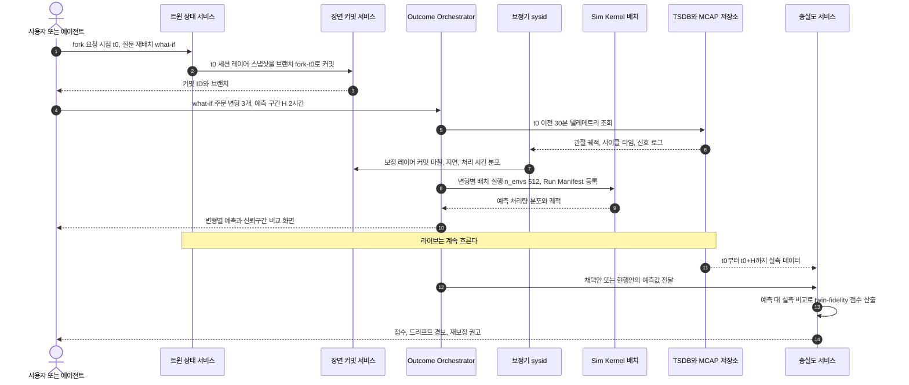

- **twin-fidelity 점수[A]:** 지표별 정규화 오차의 가중 평균을 100점으로 환산한다. 처리량은 `1 − |예측 − 실측| / 실측`, 궤적은 ADE를 장면 스케일로 나눈 값, 이벤트(정지·알람)는 발생 시점 F1을 쓴다. 점수가 3회 연속 기준선 대비 10점 넘게 떨어지면 재보정 DAG를 자동 생성한다[A].
- **M18 데모와 연결:** "라이브 셀 트윈에서 한국어로 재배치 what-if를 실행해 예측 처리량과 실측을 비교"(DR §7.2)가 정확히 이 시퀀스다.

### 8.4 섀도·HIL lockstep

1. Kernel이 클록 마스터가 되어 `/clock`을 발행한다(`use_sim_time = true`). PLC는 OPC UA 동기 메서드로 같은 틱을 받는다.
2. 매 제어 주기마다 Kernel → 센서 메시지 발행 → 컨트롤러 명령 대기(데드라인 = 제어 주기의 2배[A]) → `apply_actions` → `step(substeps)` 순으로 진행한다.
3. 데드라인을 넘기면 직전 명령을 유지하고 미스를 기록한다. 미스율이 0.1%를 넘으면 세션을 '무효'로 표시한다[A].
4. 전 구간을 MCAP으로 기록하므로, 섀도 실행은 그대로 재생 가능한 회귀 시험이 된다.

---

## 9. 생산 라인과 Outcome Orchestrator

**결론: Forge·Data·Skill·Crucible는 Orchestrator 위의 DAG 템플릿이다. 노드는 콘텐츠 해시를 입력으로 받는 순수 함수처럼 다뤄 같은 입력이면 결과를 재사용하고, QA 게이트는 DAG의 일급 노드라 건너뛸 수 없다. '엔지니어 개입'도 이벤트로 기록해 생산화 게이트(무개입 80%, 라인 총마진 60%)를 자동으로 계측한다.**

### 9.1 주문 명세 예시

```yaml
# order-spec v1 — Outcome Console 또는 MCP order.quote/job.submit가 생성
order_id: ord_2027_0213
customer: t_kr_0007
product: dataset_pack            # dataset_pack | certified_twin | cell_to_policy_poc | crucible_campaign
zone: F                          # 산출물 전용 팩토리 생산
residency: KR
scope:
  domain_pack: manipulation-pack@1.2.0
  site_twin: ath://commit/sha256:3b9a…
  classes: [ramen_box, carton, polybag_snack, pet_bottle]
  frames: 1_000_000
  modalities: [rgb, depth, instance, bbox2d]
  operating_envelope: { lux: [150, 1200], cct_k: [3000, 6500], clutter: [5, 40] }
acceptance:                       # 계약서 인수 기준 그대로
  metric: synthetic_only_map_ratio
  holdout: customer_real_holdout_v1   # 고객 보류 실데이터
  threshold: 0.90
  alt: { metric: synth_plus_10pct_real_vs_100pct_real, threshold: 1.0 }
deliverables: [lerobot_v3, coco, scorecard, run_manifests, license_manifest]
credits: { token_ratio: 0.25, validity_months: 12 }
measurement_rights: granted       # 측정권 할인 10–20% 적용
deadline: 2027-03-31
```

### 9.2 DAG 노드 계약

| 필드 | 의미 |
|---|---|
| `kind` | `compute`(K8s Job·Ray Job), `gate`(QA 판정), `human`(승인·검토), `deliver`(납품·인증서 발행) |
| `inputs` / `outputs` | 콘텐츠 해시 목록. 출력은 오브젝트 스토어에 기록한 뒤 해시로만 전달한다 |
| `image`, `pool`, `zone`, `residency` | 실행 좌표. 스케줄러 어드미션이 다시 검사한다 |
| `budget_tokens` | 노드 상한. 초과 시 일시정지 후 승인 요청 |
| `retry` | 스팟 선점 시 스냅샷에서 재개, 최대 3회[A] |
| `memo_key` | `sha256(image_digest + inputs + params)`. 같은 키의 성공 결과가 있으면 재실행하지 않는다 |
| `manifest` | 노드마다 Run Manifest 1개 |

**실행기 결정:** Orchestrator는 주문·DAG·게이트·미터링 의미론을 직접 소유하고(Postgres 상태 기계 + Kafka 이벤트), 실행은 KAI 큐의 K8s Job과 KubeRay에 위임한다. 실행기 인터페이스 뒤에 DR이 지정한 폴백인 OSMO 6.3.1(Apache-2.0)을 꽂을 수 있게 한다. Argo Workflows와 Temporal도 검토했다[A]. 하지만 QA 게이트, 토큰 예산, Manifest 발행, 구역 검사를 플러그인으로 덧대야 하고, 결국 핵심 로직은 우리 코드에 남는다. 그래서 의미론은 소유하고 실행은 빌린다.

### 9.3 네 라인의 DAG

```mermaid
flowchart LR
    subgraph FORGE["FORGE 라인"]
        F1["촬영 수집 - 영상, 라이다, CAD"] --> F2["익명화 - 얼굴, 번호판, 고객 IP"]
        F2 --> F3["포즈, 메트릭 깊이 - VGGT-Commercial, MapAnything, DA3"]
        F3 --> F4["3DGUT 스플랫 - gsplat, 3DGRUT"]
        F4 --> F5["메시, 생성형 보완 - fVDB, TRELLIS.2"]
        F5 --> F6["관절 추정, 볼록 분해 - CuACD"]
        F6 --> F7["물성 사전분포 - VLM"]
        F7 --> F8["실측 보정 - sysid 밀기, 낙하 영상"]
        F8 --> GF{"QA-F 게이트"}
        GF -->|"통과"| F9["인증서 발행 - Bronze, Silver, Gold"]
    end
    subgraph DATA["DATA 라인"]
        D1["장면 조립 - 자산, 현장 트윈"] --> D2["도메인 랜덤화 레이어"]
        D2 --> D3["렌더 - R1, R2, R3"]
        D3 --> D4["Cosmos 증강 - M5-M8 Transfer 2.5, M9부터 Cosmos 3 Nano"]
        D4 --> GD1{"QA-D1 라벨 일관성"}
        GD1 --> D5["검출기 학습 - RF-DETR"]
        D5 --> GD2{"QA-D2 mAP 비율"}
        GD2 -->|"통과"| D6["패키징 - LeRobot v3, COCO"]
    end
    subgraph SKILL["SKILL 라인"]
        S1["템플릿 선택 - RL, IL, VLA"] --> S2["시연 수집, Mimic 증강"]
        S2 --> S3["학습 - Isaac Lab, mjlab, LeRobot"]
        S3 --> GS1{"QA-S1 보상 임계"}
        GS1 --> GS2{"QA-S2 sim2sim 게이트"}
        GS2 --> S4["ONNX, TensorRT, Jetson 패키지"]
        S4 --> GS3{"QA-S3 실셀 시험"}
    end
    subgraph CRU["CRUCIBLE 라인"]
        C1["과제 스위트 선택"] --> C2["결정론 재생 - MuJoCo CPU"]
        C2 --> C3["실셀 시험 - LAB EDGE"]
        C3 --> GC{"QA-C 신뢰구간, 회귀"}
        GC --> C4["공동서명 검토"]
        C4 --> C5["서명 리포트, 리더보드"]
    end
    F9 -->|"인증 자산"| D1
    F9 --> S1
    D6 -->|"인식 모델, 데이터"| S1
    GS3 -->|"정책"| C1
    C3 -->|"페어드 trial"| CORPUS["페어드 코퍼스"]
    GS3 --> CORPUS
    CORPUS -.->|"사전분포, 프로파일 재보정"| F7
```

### 9.4 QA 게이트

| 게이트 | 라인 | 검사 | 기준(DR KPI 또는 [A]) | 실패 시 |
|---|---|---|---|---|
| QA-F | Forge | 커밋 검증 V001–V012, 3-백엔드 정착·낙하 시험, 등급별 오차 | Forge 자동 추정(VLM 사전분포 + 영상 sysid)의 Gold 기준 세트 대비 질량/마찰 오차 P0 ≤ 15%/≤ 25%, P1 ≤ 10%/≤ 20%([05 §16.1](05-physics-and-realism.md)). Silver는 영상 sysid 성공 + 허용치[A]. Gold는 랩 실측값과 측정 불확도를 기록한다 | 등급 강등 또는 재촬영 요청 |
| QA-D1 | Data | 증강 프레임 라벨 일관성(원본 대비 마스크 IoU, 클래스 보존) | 통과율 ≥ 98%(P1), ≥ 99%(P2) | 불일치 프레임 폐기, 증강 강도 축소 |
| QA-D2 | Data | 보류 실데이터 기준 합성 전용 mAP ÷ 실데이터 학습 mAP | ≥ 0.85(P0), ≥ 0.90(P1), ≥ 0.95(P2) 또는 주문 명세 값 | 랜덤화 분포 재설계 DAG 자동 생성 |
| QA-S1 | Skill | 학습 보상·성공률 임계 | 템플릿별 정의 | 하이퍼파라미터 스윕(P2 PBT) |
| QA-S2 | Skill | sim2sim(§4.7) | Tier 1 ≤ 10%p를 모든 정책에 100% 적용. 인증·Crucible 공식 대상은 Tier 2(초기 조건 200개, 쌍별 ≤ 5%p, 관절 RMSE ≤ 0.05 rad)[A] | 수출 차단(Tier 1), 인증 보류(Tier 2) |
| QA-S3 | Skill | 실셀 성공률, sim-to-real 갭 | 갭 ≤ 25%p(P0, 1개 과제), ≤ 15%p(P1), ≤ 10%p(P2) | 실패 마이닝 → 시나리오 추가 → 재학습 |
| QA-C | Crucible | 성공률 95% CI, sim/real Pearson r, 회귀 | r ≥ 0.7(P1), ≥ 0.8(P2). 회피 규정: 자사 학습 정책은 공동서명 기관 검토 필수 | 발행 보류 |
| QA-L | 전 라인 | 라이선스 매니페스트, NEVER 목록 0건, 구역 검사 | 위반 0건 | 납품 차단 + 보안 알림 |

### 9.5 생산화 게이트의 자동 계측

- **엔지니어 개입 이벤트:** DAG 노드를 수동 재시작하거나, 파라미터를 바꾸거나, 사람이 산출물을 고치면 `human_intervention{node, minutes, reason}` 이벤트가 남는다.
- **무개입 비율** = 개입 0건으로 끝난 주문 ÷ 전체 주문. Forge KPI는 30%(P0) → 60%(P1) → 80%(P2) → 90%(P3)다.
- **라인 총마진**(G1 '50% 이상'과 생산화 게이트 '60%'의 판정 지표, [10 §6.4](10-business-model-gtm.md)의 완전원가 정의) = (라인 매출 − 컴퓨트·토큰 원가 − 인건비(개입·FDE·Skill·Forge 시간 × head-month ₩1,400만 환산) − 랩·현장 원가 − 크레딧 이행 원가 − 인수 리스크 충당금) ÷ 라인 매출. 직접원가 마진(토큰 원가와 개입 시간만 뺀 값)은 이 지표로 쓰지 않는다.
- **자동 계측:** 컴퓨트·토큰 원가는 미터링(§12.5)에서, 인건비는 `human_intervention` 이벤트와 FDE·Skill·Forge 타임시트에서, 랩·현장 원가는 LAB EDGE 셀 사용 시간과 출장 원가에서, 크레딧 이행 원가는 크레딧 토큰 소진 기록에서, 인수 리스크 충당금은 계약별 충당 비율에서 끌어온다. 대시보드는 라인·분기 단위로 집계한다.
- **결과물당 엔지니어 시간 지수:** P0 = 100 기준으로 50(P1) → 25(P2) → 15(P3)다. '연 50% 감소' KPI는 P0 기준선 대비 연율로 재며, P3 말 지수 15는 연 약 −51%에 해당한다. Orchestrator 대시보드가 분기마다 이사회 KPI로 내보낸다.
- 세 조건(무개입 ≥ 80%, 총마진 ≥ 60%, 서면 라이선스 근거)을 모두 충족한 라인만 Studio 셀프서브로 열린다. 이 판정은 대시보드 수치로 내리며, 회의 의견으로 내리지 않는다.

---

## 10. 에이전트·MCP 레이어

**결론: 에이전트는 타입이 지정된 18개 도구로 플랫폼을 조작하고, 타입 연산으로 표현할 수 없는 편집만 샌드박스에서 USD 코드를 생성한다. 코드 경로는 5단 가드레일을 통과해야 브랜치에 들어가고, `main` 병합과 인증서 발행은 언제나 사람이 한다.**

### 10.1 구조

- **클라이언트:** CEN의 기존 LLM 텍스트 명령 인터페이스가 MCP 클라이언트가 된다. Studio·Console UI도 같은 도구를 호출한다(P7 원칙).
- **서버:** 자체 MCP 서버(사양 2026-07-28). 도구마다 입력·출력 JSON Schema, 권한 스코프, 비용 추정 함수, 감사 로그가 붙는다.
- **공개 순서:** 사내 딜리버리 엔지니어(P0 v0: 읽기·실행 도구, P1 전체) → 디자인 파트너(M9 Studio 베타. Zone T 전용, Explorer는 대기자 명단 초대제·주간 승인 상한. 읽기·실행 + 브랜치 편집) → 전체 고객(M15 Studio GA, 공개 가입). 먼저 사내에서 결과물당 엔지니어 시간을 절반으로 줄여 효과를 증명한다.

### 10.2 타입 도구와 권한

| 도구 | 기능 | 부작용 | 권한 스코프 | 비용·승인 규칙 | 공개 |
|---|---|---|---|---|---|
| `scene.search` | 자산·prim 검색(의미 라벨, 인증 등급) | 없음 | `scene:read` | 무료 | P0 |
| `scene.query` | prim 속성·관계 조회 | 없음 | `scene:read` | 무료 | P0 |
| `scene.diff` | 두 커밋의 prim 단위 차이 | 없음 | `scene:read` | 무료 | P0 |
| `scene.apply_ops` | 타입 연산 적용(add_asset, set_transform, set_physics_material, add_sensor, set_joint_drive, randomize, delete_prim, create_variant) | 에이전트 브랜치에 새 레이어 커밋 | `scene:write:branch` | 무료. `main`에는 쓸 수 없음 | P0 |
| `asset.search` | Marketplace·사내 라이브러리 검색 | 없음 | `asset:read` | 무료. 상업 워크스페이스에서는 비상업 품목 자동 제외 | P0 |
| `asset.certify` | Forge 인증 주문 생성 | 주문 생성 | `asset:certify:request` | 토큰 견적 → 사용자 확인 | P1 |
| `sim.run` | 단일 시뮬 실행(장면 커밋 + 백엔드 설정) | Job 생성, 토큰 소모 | `compute:run` | 일일 예산 안이면 자동, 초과 시 승인[A] | P0 |
| `sim.sweep` | 파라미터 스윕 | 다수 Job | `compute:run` | 견적 ≥ 1,000 토큰이면 승인[A] | P1 |
| `sdg.generate` | DATA 라인 실행 | DAG 생성 | `compute:run`, `data:write` | 견적 승인 필수 | P0(사내) |
| `skill.train` | SKILL 라인 실행 | DAG 생성 | `compute:run`, `model:write` | 견적 승인 필수 | P1 |
| `eval.run` | Crucible 평가 실행 | DAG 생성 | `compute:run`, `eval:run` | 견적 승인 필수 | P1 |
| `cert.issue` | 인증서 발행(Silver·Gold·로봇-과제) | 인증서·서명 생성 | `cert:issue`(Fidelity 역할만) | **에이전트 단독 실행 불가.** 사람 2인 승인[A], Crucible은 공동서명 기관 필수. Bronze 셀프서브 인증서는 이 도구가 아니라 QA-F 통과 시 Forge 서비스 계정이 자동 서명한다 | P1(사내만) |
| `twin.query` | 라이브 상태·이력 조회 | 없음 | `twin:read` | 무료 | P2 |
| `twin.forecast` | fork-from-live what-if | 브랜치·DAG 생성 | `twin:read`, `compute:run` | 견적 승인 | P2 |
| `dataset.export` | 데이터셋 내보내기 | 이그레스 | `data:export` | 거주 태그 불일치 시 차단. 이그레스 요금 고지 | P1 |
| `order.quote` | 결과물 주문 견적 | 없음 | `order:quote` | 무료 | P1 |
| `job.submit` | 저수준 Job 제출(SDK 사용자) | Job 생성 | `compute:run` | `sim.run`과 같음 | P1 |
| `job.status` | 상태·로그·Manifest 조회 | 없음 | `job:read` | 무료 | P0 |

- **타입 연산 우선:** `scene.apply_ops`의 8개 연산으로 셀 구성·랜덤화 요청의 대부분을 처리하는 것이 목표다(P1 측정 목표 80%[A]). 코드 생성은 나머지 경우에만 쓴다. 타입 연산은 검증이 쉽고 프롬프트 인젝션으로 임의 코드가 실행될 여지가 없다.
- **시나리오 출력 제한:** 에이전트가 만드는 시나리오는 OpenSCENARIO DSL(2.1.0)로만 낸다. 재현성과 외부 도구 호환성을 확보하기 위해서다.
- **커뮤니티 MCP:** isaac-sim-mcp, blender-mcp(`execute_blender_code`)처럼 임의 코드를 실행하는 서버는 테넌트에 노출하지 않는다. ros-mcp-server는 테넌트 ACL 뒤에서만 쓴다. kit-usd-agents는 개발 단계 API 그라운딩에만 쓴다.

### 10.3 5단 가드레일 파이프라인

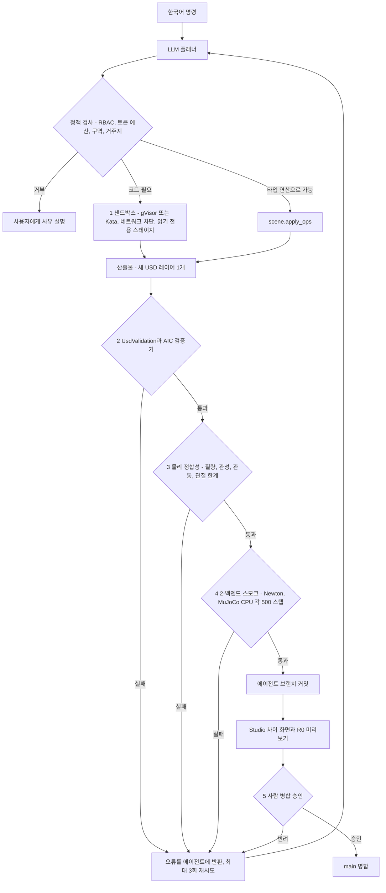

| 단계 | 구체 기준[A] | 근거 |
|---|---|---|
| ① 샌드박스 | gVisor(CPU 전용 코드) 또는 Kata(GPU 필요 시). 네트워크 egress 차단, 스테이지는 읽기 전용 마운트, CPU 2코어·메모리 4 GiB·60초 제한, 출력은 USD 레이어 1개뿐 | 에이전트 생성 코드는 RCE 표면이다. Ray Sandbox는 실험적이라 쓰지 않는다 |
| ② 검증 | UsdValidation + AIC-V001–V012 | §6.5 |
| ③ 물리 정합성 | 질량 > 0, 관성 양의 정부호이며 바운딩 박스 기반 추정치의 0.2–5배, t = 0 관통 ≤ 1 mm, 관절 한계 lower < upper, 구동 게인 유한 | 물리 폭발의 대부분은 이 네 가지에서 나온다 |
| ④ 2-백엔드 스모크 | Newton과 MuJoCo CPU에서 500스텝. NaN 0건, 최대 속도 ≤ 10 m/s, 수동 장면에서 에너지 증가 ≤ 5% | 한 백엔드에서만 도는 장면은 엔진 중립 원칙 위반이다 |
| ⑤ 사람 병합 | 차이 화면 검토 후 승인. 인증·납품 장면은 담당 엔지니어 승인 필수 | 마지막 책임은 사람이 진다 |

### 10.4 모델 라우팅과 프롬프트 인젝션 방어

| 에디션 | 플래너 모델 | 데이터 경계 |
|---|---|---|
| Cloud | 프런티어 API(계약상 학습 미사용 조건) | 테넌트 컨텍스트만 주입. 다른 테넌트 데이터는 검색 인덱스부터 분리 |
| Sovereign | 온프렘 오픈 가중치 모델 | 외부 호출 없음 |
| 공공·국방 | 출처를 확인한 국산 모델 우선(V8) | 에어갭. 모델 가중치의 SBOM 등재 |

- **데이터·지시 분리:** Marketplace 설명, 자산 메타데이터, 고객 문서 등 도구 출력은 '데이터'로 감싸 플래너에 전달하고, 그 안의 지시문은 실행하지 않는다.
- **권한 상승 차단:** 도구 권한은 사용자 토큰의 스코프를 넘을 수 없다. 에이전트 세션 토큰은 사용자 스코프의 부분집합이며 유효시간은 1시간이다[A].
- **회귀 평가:** 한국어 명령 스크립트(P0 20개 ≥ 80%, P1 50개 ≥ 85%, P2 100개 ≥ 90%, P3 ≥ 92%)를 모델·도구 변경마다 CI에서 돌린다. 성공 판정은 "최종 장면이 게이트를 통과하고 기대 차이와 일치"다.

---

## 11. 데이터 레이어

**결론: 데이터 클래스마다 정본 포맷을 하나씩만 둔다. 저장소는 S3 API를 계약으로 삼아 SeaweedFS와 Ceph RGW를 바꿔 끼울 수 있게 하고, 라이선스가 흔들리는 MinIO(AGPL-3.0 [U])와 lakeFS(1.87부터 BSL 1.1)는 넣지 않는다. 모든 산출물은 콘텐츠 해시 계보로 묶여, 자산 하나에 문제가 생기면 영향받는 납품물을 한 번의 쿼리로 찾을 수 있다.**

### 11.1 데이터 클래스별 포맷

| 데이터 클래스 | 정본 포맷 | 경계(import/export) 포맷 | 저장 위치 | 보존[A] |
|---|---|---|---|---|
| 장면·자산·로봇·차량 | OpenUSD(`.usdc` 저장, 정규 `.usda`로 해시) | URDF, MJCF, SDFormat 16, glTF/GLB, FBX, OBJ, STL | 오브젝트 스토어(콘텐츠 주소) | 영구(불변) |
| 신경 재구성 | USD `UsdVolParticleField`(3DGS) | glTF + **KHR_gaussian_splatting**(비준 완료), SPZ, SOG, PLY | 오브젝트 스토어 + 웹 타일 | 영구 |
| 원시 로그(시뮬·실측) | **MCAP**(MIT) | rosbag2(기본 저장소가 MCAP), CSV | 오브젝트 스토어, 인덱스는 Postgres | 실측: 영구(코퍼스). 시뮬: 납품 후 90일 |
| 로봇 학습 데이터셋 | **LeRobotDataset v3**(Parquet + MP4, `meta/info.json`, `stats.json`, `finalize()` 필수) | HDF5(robomimic 계열)[A] | 오브젝트 스토어, Iceberg/DVC 스냅샷 | 계약 기간 + 1년 |
| 인식 데이터셋 | COCO·KITTI·nuScenes 형식 내보내기 | OpenLABEL 1.0.0(차량)[A] | 오브젝트 스토어 | 계약 기간 + 1년 |
| 시스템 모델 | **FMI 3.0.2 FMU + SSP** | Modelica(고객 도구에서 FMU로 내보내기) | 오브젝트 스토어 | 영구 |
| 도로·시나리오 | **OpenDRIVE 1.8.0, OpenSCENARIO XML 1.3.0 / DSL 2.1.0** | OSI 3.x(센서 데이터 내보내기. 3.7.0 확인, 3.8.0 [U]) | 장면 커밋의 시나리오 레이어로 변환 | 영구 |
| 라이브 텔레메트리 | Kafka 토픽 → TSDB | OPC UA, MQTT, ROS 2 메시지 | TSDB + MCAP 롤링 | 원시 30일, 다운샘플 2년 |
| 모델 | PyTorch 체크포인트(MLflow 3), ONNX(opset 고정), TensorRT 엔진(Jetson SKU별) | — | MLflow 레지스트리 | 납품 버전 영구 |
| 인증서 | USD `aic:` 요약 + 서명 JSON 사이드카 | PDF 리포트(표시용) | 오브젝트 스토어(Object Lock) | 영구 |
| Run Manifest | JSON(§7) | — | Postgres + 오브젝트 스토어(Object Lock) | 영구 |
| 페어드 코퍼스 | trial 레코드(Parquet) + 실측 MCAP + 시뮬 Manifest | 익명화 공개 서브셋[A] | 오브젝트 스토어(전용 버킷) | 영구 |

**용량 기준:** 멀티모달 프레임 100만 장에 약 5.5 TB(DR)다. 고객 과금은 스토리지 ₩40,000/TB-월, 이그레스 ₩150/GB다. 이 두 단가는 리서치 원가 기준 총마진이 16–20%로 하한 30%보다 낮으므로 '원가 회수 품목'으로 분류한다. 자체 SeaweedFS·Ceph RGW 저장소로 옮긴 뒤 30%를 맞추고, 2027 Q1 재산정에서 실측 원가로 다시 판정한다.

### 11.2 저장소 선택

| 후보 | 라이선스 | 장점 | 단점 | 판정 |
|---|---|---|---|---|
| **SeaweedFS** | Apache-2.0 [A] | 단일 바이너리로 가볍고, S3 API를 지원하며, 작은 객체가 많을 때(MCAP 청크, 웹 타일) 강하다. 에어갭 설치가 쉽다 | 초대형 운영 레퍼런스가 Ceph보다 적다[A] | **Cloud와 소·중규모 Sovereign의 기본** |
| **Ceph RGW** | LGPL 계열 [A] | 성숙도, 이레이저 코딩, 자가 치유. 재벌·조선 고객이 이미 운영하는 경우가 많다 | 운영 복잡도가 높다 | **대규모 Sovereign, 고객 표준 인프라** |
| MinIO | AGPL-3.0 [U] | 널리 쓰인다 | 네트워크 SaaS 사용과 온프렘 배포 모두에서 소스 공개 의무가 생길 위험 | **제외**(DR) |
| lakeFS 1.87 이상 | BSL 1.1 | 데이터 브랜칭 | 경쟁 호스팅 제공을 제한하고, ACL 레퍼런스 서버를 제거했다 | **제외.** 장면은 자체 커밋 서비스, 데이터셋은 Iceberg/DVC |
| Nucleus / ovstorage | 독점 / Apache-2.0(사전 릴리스, 엔터프라이즈 미지원) | Omniverse 연동 | 독점이거나 미성숙 | Zone F에서 필요할 때만 / WATCH |

- **S3 계약:** 플랫폼은 PUT/GET/HEAD, 멀티파트, 목록, 서버측 암호화, **Object Lock**(Manifest·인증서 불변 보관)만 쓴다. 두 백엔드 모두에 대해 같은 S3 적합성 테스트를 돌린다[A]. 콘텐츠 주소 저장이므로 버전 관리 기능에 의존하지 않는다.
- **암호화 키:** 테넌트별 버킷과 테넌트별 키를 쓴다. KMS는 OpenBao(MPL-2.0 [U])를 기본으로 한다. HashiCorp Vault는 BSL 1.1로 전환됐으므로[U] 번들에서 제외한다. 두 항목 모두 SPDX 확인 대상(DR §15 #21과 같은 M2 검증)에 넣는다.
- **SPDX 확인:** SeaweedFS·Ceph 라이선스는 DR §15 #21에 따라 M2까지 확인한다. 결과가 바뀌면 S3 계약 덕분에 백엔드만 교체한다.

### 11.3 메타데이터 모델(Postgres)

| 스키마 | 주요 테이블 | 비고 |
|---|---|---|
| `scene` | commits, branches, layers, asset_closure | 커밋 ID는 콘텐츠 해시 |
| `asset` | assets, certificates, provenance, license_manifests | 인증서는 자산 해시에 묶임 |
| `run` | manifests, outputs, metrics | Object Lock 사본을 함께 보관 |
| `order` | orders, dags, nodes, gates, interventions | 생산화 게이트 계측(§9.5) |
| `lineage` | edges(src_hash, dst_hash, relation, run_id) | OpenLineage 호환 이벤트로도 내보냄[A] |
| `tenant` | tenants, quotas, residency, keys_ref | 거주 태그의 정본 |
| `metering` | gpu_seconds, tokens, storage, egress | CEN 과금으로 전송 |
| `corpus` | trials, cells, robots, sensor_profiles | §11.5 |

### 11.4 계보와 리콜 절차

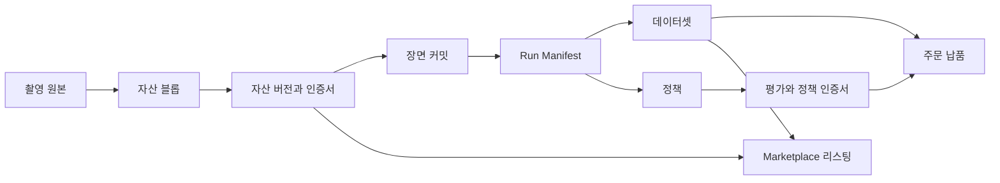

**리콜 절차(라이선스 문제나 측정 오류 발견 시)**
1. 문제 자산·모델·코드 해시를 레지스트리에 `revoked`로 등록한다.
2. 계보 그래프를 하류 방향으로 탐색해 영향받는 커밋·Manifest·데이터셋·정책·인증서·리스팅을 찾는다.
3. 인증서는 자동으로 '정지'되고, Marketplace 리스팅은 비공개로 바뀐다.
4. 영향받은 고객과 주문 목록이 계약 담당에게 전달된다. 대체 산출물 재생산 DAG 초안이 함께 생성된다.
5. 처리 결과를 감사 로그에 남긴다. 목표: 발견부터 영향 목록 확정까지 1시간 이내[A].

### 11.5 페어드 코퍼스 레코드(해자의 데이터 구조)

| 필드 | 내용 |
|---|---|
| `trial_id`, `cell_id`, `task_id` | 시험 식별, 테스트 셀, Crucible 과제 스위트 ID |
| `robot` | 모델, 시리얼 등급, 펌웨어, 그리퍼·말단장치 |
| `policy_hash` | 시험한 정책(MLflow 버전) |
| `real.mcap`, `real.outcome` | 실측 로그, 성공 여부·소요 시간·실패 유형 |
| `sim.manifest`, `sim.outcome` | 같은 조건의 시뮬 재생 Manifest와 결과 |
| `scene_commit`, `sensor_profiles` | 트윈 장면, 센서 프로파일 해시 |
| `conditions` | 조도, 색온도, 온도, 물체 배치 시드 |
| `rights` | 측정권(`granted/denied`), 동의, 익명화 상태, 거주 태그, 기여자 로열티 ID |

- **적재 규칙:** `rights.measurement = granted`인 trial만 교차 고객 재사용(충실도 예측기 학습, 사전분포 보정)에 들어간다. 나머지는 해당 고객 전용 보정에만 쓴다.
- **목표:** trial 누적 1k(P0) → 10k(P1) → 50k(P2) → 150k(P3), 측정권 고객 누적 0 → 4 → 12 → 25(DR KPI).

---

## 12. 인프라

**결론: GPU는 능력별로 풀을 나누고(RT 코어 유무), 큐는 테넌트 → 등급 순으로 나누며, 테넌트 간에는 어떤 형태의 시분할도 허용하지 않는다. 거주 태그(KR/US/EU)는 사람이 아니라 스케줄러가 강제한다.**

### 12.1 GPU 풀

| 풀 | GPU | 노드 레이블·테인트 | 용도 | 용량(DR) | 규칙 |
|---|---|---|---|---|---|
| **RT** | L40S, RTX PRO 6000 Blackwell(드라이버 R580 이상) | `athanor.io/pool=rt`, `athanor.io/zone=F` 또는 `T` | Isaac Sim RTX SDG, 고충실도 세션, 3DGUT 렌더, 경량 Kernel RL | 자체 서버 8 GPU(M5) + 8 GPU(M13, G1 통과 조건) = 16 GPU. 클라우드 버스트 평균 3(P0) → 5(P1) → 8(P2) GPU, P2 최대 약 32 GPU | RTX PRO 6000 MIG는 [U]이므로 **세션당 GPU 1장 단위로 과금**. 구역 분리는 노드 단위다(아래 '자체 서버의 구역 배치') |
| **TRAIN** | H100 / H200 / B200 | `athanor.io/pool=train` | VLA·Cosmos 파인튜닝, 렌더 없는 물리 RL | 네오클라우드 약 65k GPU-시간(24개월). 정부 B200/H200은 업사이드 | **RTX 센서 렌더링에 절대 배정하지 않는다**(RT 코어 없음). 정부 배정분은 학습 전용 |
| **LIGHT** | L4, CPU, 개발 워크스테이션 | `athanor.io/pool=light` | CI, 적합성 스위트, 웹 베이킹, MuJoCo CPU 재현, 샌드박스, 컨트롤 플레인 | — | 인증 재현은 고정 CPU SKU 노드에서 |
| **LAB EDGE** | Jetson AGX Thor, 테스트 셀 PC | 클러스터 밖(아웃바운드 mTLS) | 실셀 시험, 배포 검증 | Test Cell 1(P0), Test Cell 2(P1), 휴머노이드 셀(P2) | 실측 데이터를 코퍼스로 직접 적재 |

**자체 서버의 구역 배치**
- K8s 노드 레이블·테인트는 노드 단위로 작동하므로, 8-GPU 서버 1대(K8s 노드 1개)에 `zone=F`와 `zone=T`를 동시에 붙일 수 없다. 그렇게 하면 독점 Kit 파드와 테넌트 파드가 한 노드를 공유해 §12.3의 노드 격리 규칙이 깨진다.
- **M5–M12:** 자체 서버 1호기는 Zone F 전용 노드로 쓴다. Zone T 배치·세션은 클라우드·국내 CSP 노드에서 실행한다.
- **GPU 단위 분할이 필요하면:** GPU 패스스루 VM 2대(예: 4 + 4 GPU)를 만들어 각각 별도 K8s 노드(`zone=F`, `zone=T`)로 등록한다. 하이퍼바이저와 노드 OS·이미지 레지스트리 경로를 구역별로 분리한다[A].
- **M13 2호기 이후:** 서버 단위로 Zone F와 Zone T를 나눈다(2호기는 G1 통과 조건).

**라우팅 규칙**
- R3 RTX 작업은 RT 풀에서만 실행한다.
- 렌더 없는 물리 RL은 월간 steps/s/$ 표에서 가장 싼 적합 GPU로 보낸다. 시뮬레이션에서는 L40S나 RTX PRO 6000이 env-step당 가격으로 H100을 이기는 경우가 많다는 것이 리서치 결론이다. 표는 베이크오프 결정 메모로 처음 채운다.
- VLA·Cosmos 파인튜닝은 TRAIN 풀로 보낸다.
- 대화형 세션은 서울 리전(지연 우선, 미국 대비 23–38% 비쌈)에서, 배치는 자체 서버와 네오클라우드에서 돈다.

### 12.2 큐 계층(KAI Scheduler)

| 큐 | 풀 | 보장 쿼터 | 초과 사용 | 선점 | 체크포인트[A] |
|---|---|---|---|---|---|
| `factory-f`(Zone F 팩토리) | 자체 RT의 Zone F 노드, TRAIN | 자체 RT 서버의 일정 비율(베이크오프 후 결정)[A] | 허용 | 초과분만 | 10분 |
| `tenant-<id>/interactive` | RT(서울), LIGHT | 계약 GPU 수(예: Enterprise VPC 예약 RT 4장) | 불가 | 불가 | 일시정지 시 스냅샷 |
| `tenant-<id>/batch` | RT, TRAIN, LIGHT | 등급별 | 유휴 자원 허용 | 초과분 선점 | 10분 |
| `tenant-<id>/training` | TRAIN, RT | 등급별, 갱 스케줄 | 허용 | 초과분 선점 | 30분 |
| `preview-untrusted` | 전용 비신뢰 노드 풀 | 없음 | 불가 | 언제든 | 없음 |
| `ci-conformance` | LIGHT + RT·TRAIN 소량 | 야간 고정 슬롯 | — | 트레인 승격 주간에는 불가 | — |

- **유료 등급:** 보장 쿼터 안에서는 선점되지 않고, 초과분은 선점 가능 자원으로 쓴다(DR).
- **스팟 운영:** 배치·학습은 스팟 우선이다. Kernel `snapshot()`, 정책 체크포인트, MCAP를 주기적으로 남기고, SkyPilot이 선점 시 다른 리전·클라우드로 재개한다. 재개는 같은 Manifest의 `parents`로 연결된다.

### 12.3 멀티테넌시 격리

| 층위 | 메커니즘 | 금지 사항 |
|---|---|---|
| GPU | 테넌트마다 GPU 전체 또는 MIG 슬라이스(H100. RTX PRO 6000 MIG는 [U]이며 검증 전에는 전체 GPU만). KAI NvFractions·시분할은 **같은 테넌트의 작업끼리만** | 테넌트 간 시분할·fractional 공유 금지(메모리·장애 격리가 없다) |
| 컨테이너 | CPU 전용 사용자·에이전트 코드는 gVisor, GPU가 필요한 사용자 코드는 Kata Containers(VM 격리)[A] | Ray Sandbox(실험적) 의존 금지 |
| 노드 | Zone F 노드는 테인트 + 어드미션으로 테넌트 파드를 거부. 한 물리 서버를 두 구역에 쓰려면 GPU 패스스루 VM으로 노드를 나눈다(§12.1). 무료 프리뷰는 비신뢰 전용 노드 풀 | 무료 등급과 유료 등급의 노드 공유 금지, Zone F·T 파드의 같은 노드 배치 금지 |
| 네트워크 | 테넌트 네임스페이스별 기본 거부 NetworkPolicy, egress 허용 목록 | Kit·Isaac Sim 파드의 host 네트워크를 공인망에 노출 금지 |
| 스토리지 | 테넌트별 버킷·키, 버킷 정책으로 교차 접근 차단 | 공유 버킷 금지 |
| 신원 | CEN SSO(OIDC) → 테넌트·역할 매핑, 짧은 수명 토큰 | 장기 정적 키 금지 |
| GPU 메모리 | 세션 종료 시 GPU 메모리 초기화 후 반납[A] | — |

### 12.4 데이터 거주 태그

- **태그:** `athanor.io/residency ∈ {KR, US, EU}`를 테넌트 네임스페이스, 버킷, 데이터셋, 노드, 클라우드 리전 프로파일에 붙인다.
- **강제:** 어드미션 정책 엔진(OPA Gatekeeper 또는 Kyverno, Apache-2.0 [A])이 "파드가 읽고 쓰는 데이터의 거주 태그 = 노드 거주 태그"를 검사한다. SkyPilot 버스트는 허용 리전 목록이 태그로 제한된다. `dataset.export`는 대상 위치의 태그가 다르면 차단한다.
- **기록:** Run Manifest의 `tenant.residency`와 `hardware.node_id`로 사후 감사가 가능하다.
- **배경:** 국내 공공·제조 고객은 국내 호스팅을 요구하는 경우가 많다. PIPA 국외 이전 규정 적합성은 [11 리스크·KPI·컴플라이언스](11-risk-kpi-compliance.md)에서 다룬다.

### 12.5 미터링 → CEN 토큰

- **원천:** DCGM exporter의 GPU-초와 KAI의 큐 귀속(어느 테넌트·어느 등급)을 결합한다.
- **환산:** 토큰 = Σ(GPU-초 × 풀 단가 ÷ 3,600). 단가는 RT 배치 60, RT 서울 대화형 95, TRAIN 80, LIGHT 20 토큰/시간(1 토큰 = ₩100)이다. RTX 세션은 GPU 1장 단위로 과금한다. 스토리지는 TB-월당 400 토큰(₩40,000), 이그레스는 GB당 1.5 토큰(₩150)이다.
- **원가 재산정:** 분기마다 실제 풀 원가로 다시 계산한다. 총마진 하한은 30%다(DR §10.1). 스토리지·이그레스는 예외로 '원가 회수 품목'이며(§11.1), 자체 저장소 이전 후 30%를 맞추고 2027 Q1 재산정에서 다시 판정한다.
- **결과물 크레딧:** 결과물 계약의 20–30%를 12개월 유효 토큰으로 넣고, 쓸 때 매출로 인식한다. 미터링 서비스는 크레딧 토큰과 구매 토큰을 구분해 기록한다.

---

## 13. 스트리밍과 웹 클라이언트

**결론: 기본은 WebGPU(R0)로 서버 GPU를 쓰지 않는다. 서버 렌더는 '고충실도 보기' 버튼을 눌렀을 때만 WebRTC로 띄우고, 세션 매니저가 유휴 5분에 일시정지·GPU 반납, 30분에 종료한다[A]. Isaac Sim·Kit 스트리밍은 인증·암호화가 없고 host 네트워크를 요구하므로, 자체 게이트웨이 뒤의 격리 노드에서만 돈다.**

### 13.1 기본 경로: R0 WebGPU

1. 장면 커밋이 생기면 웹 베이커(LIGHT 풀)가 USD를 glTF/GLB와 KHR_gaussian_splatting·SPZ LOD 타일로 굽는다.
2. 브라우저 클라이언트는 three.js r186(WebGPU/WebGL2) + Spark 2.x(WebGL2 기반. PLY·SPZ·SPLAT·KSPLAT·SOG 지원, 1억 개 이상 스플랫 LoD 페이징)를 기본으로 쓴다. 작은 스테이지를 USD 그대로 열 때는 Babylon.js 9.29의 OpenUSD WASM 로더를 쓰고, 대형 현장 스플랫은 PlayCanvas 2.23(WebGPU)의 거리 기반 LOD 스트리밍을 쓴다.
3. 라이브 트윈은 WebSocket 델타로 변환·관절 상태만 받는다.
4. **목표[A]:** 셀 장면 첫 프레임 ≤ 3초(보통 노트북, 국내망). Studio 신규 사용자 첫 시뮬레이션까지 ≤ 10분(P1 베타), ≤ 5분(P2, DR KPI).

### 13.2 요청 시 경로: WebRTC 세션

| 세션 유형 | 렌더 | 구역 | 사용자 | GPU |
|---|---|---|---|---|
| 서버 Warp·신경 렌더 보기 | R1, R2 | T·S | Studio 고객 | RT 1장 |
| RTX 고충실도 보기 | R3(Kit App Streaming) | **F(사내 리뷰)**, 고객 BYOL 환경 | AICHEMIST 엔지니어, BYOL 고객 | RT 1장 |
| 코드 데스크톱 | Selkies(MPL-2.0) 데스크톱 | T·S | 코드 우선 사용자 | LIGHT 또는 RT |

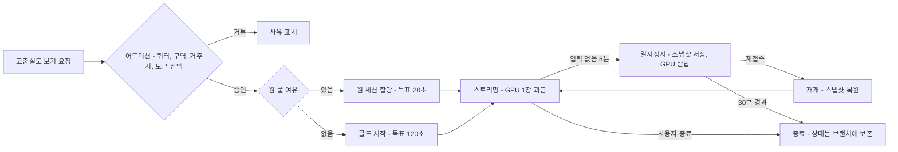

- **웜 풀 크기[A]:** 직전 4주 같은 시간대 동시 세션 수 p90의 20%를 상한으로 하고, 업무 시간(KST 09–19시)에만 유지한다.
- **비용 근거:** 전용 L40S 세션은 시간당 $1.86–2.29다. MIG 4분할 시 약 $0.84/시간이라는 추정은 미검증[U]이므로 가격표에 쓰지 않는다.

### 13.3 자체 WebRTC 게이트웨이

| 구성요소 | 설계 | 비고 |
|---|---|---|
| 시그널링 | WSS(TLS 1.3), 세션 ID에 묶인 단기 JWT(CEN SSO OIDC로 발급) | 토큰 수명 ≤ 10분, 재발급은 세션 매니저만[A] |
| 미디어 | WebRTC DTLS-SRTP, NVENC 인코딩(H.264 기본, HEVC·AV1은 브라우저 협상)[A] | NVENC 사용률은 DCGM으로 감시 |
| NAT 통과 | TURN over TLS 443(coturn [A]) | 기업망 방화벽 대응 |
| 입력 채널 | WebRTC data channel, 스키마 검증, 초당 이벤트 상한 | 입력 주입 공격 차단 |
| 렌더 파드 격리 | Kit 파드는 공인 IP가 없는 격리 노드에서 실행. host 네트워크가 필요하면 그 노드는 게이트웨이와만 통신 | DR: Isaac Sim 스트리밍은 무인증·무암호화, host 네트워크 필요 |
| 감사 | 세션 시작·종료·과금·녹화 동의를 Kafka 감사 토픽에 기록 | ISMS-P 증적 |

### 13.4 지연과 리전

- 대화형 세션은 서울 리전(국내 CSP 또는 AWS 서울)에서 돈다. 목표: 국내 RTT p95 ≤ 50 ms, 프레임 드롭 ≤ 1%[A].
- 국내 CSP의 RT GPU 공급, MIG, R580 이미지는 M2까지 확인한다(V4). 확인 전에는 AWS 서울 RTX PRO 6000($4.135/시간)을 기준 원가로 쓴다.

---

## 14. 보안, SBOM, 관측성

**결론: 가장 큰 보안 위험 다섯 가지(무인증 스트리밍, 에이전트 RCE, 테넌트 간 GPU 공유, 라이선스 오염, 거주지 위반)는 모두 앞 절의 구조적 통제로 막혀 있다. 이 절은 그 통제를 빌드 파이프라인과 관측 지표로 증명하는 방법을 정한다.**

### 14.1 위협 모델

| 위협 | 경로 | 통제 | 검증 |
|---|---|---|---|
| 무인증 스트림 노출 | Kit/Isaac Sim 스트리밍 포트 | 자체 게이트웨이, 격리 노드, 공인 IP 없음 | GA 전 침투 테스트(Studio M15, Sovereign M18 이전) |
| 에이전트 RCE | 생성 코드, 커뮤니티 MCP | 타입 연산 우선, gVisor/Kata 샌드박스, egress 차단, 커뮤니티 MCP 미노출 | 레드팀 프롬프트 세트 분기 실행[A] |
| 프롬프트 인젝션 | 자산 메타데이터, Marketplace 텍스트 | 데이터·지시 분리, 권한 부분집합 토큰, 사람 병합 | 인젝션 회귀 테스트 |
| 테넌트 간 누출 | GPU 공유, 버킷, 네트워크 | 시분할 금지, 테넌트별 키, 기본 거부 네트워크 | 분기 격리 감사 |
| 라이선스 오염 | 의존성, 모델 가중치, 자산 | SBOM 게이트, NEVER 목록, 출처 레지스트리, 리콜 절차 | CI 차단 건수 리포트(위험 #5 조기경보) |
| 거주지 위반 | 버스트, 내보내기 | 거주 태그 어드미션, export 차단 | Manifest 감사 |
| 엣지 게이트웨이 탈취 | 고객 사이트 | 아웃바운드 전용 mTLS, 서명 설정, 토픽 ACL | 인증서 회전 90일[A] |
| 수출통제·군사 조항 | SAM License(ITAR 금지), VGGT-Commercial(군사 금지) | 국방 라이선스 프로파일(화이트리스트), 건별 수출 심사 | 에어갭 빌드 SBOM 검사 |

### 14.2 SBOM·서명 파이프라인

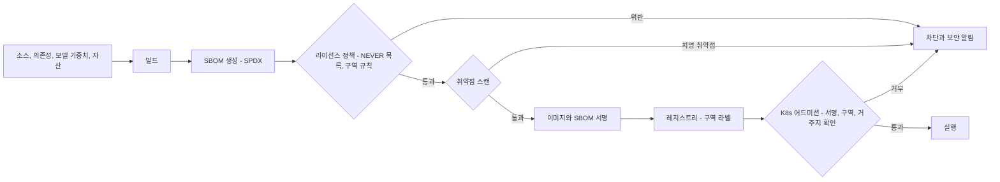

- **도구[A]:** SBOM은 SPDX 형식(Syft 등 Apache-2.0 도구), 취약점 스캔은 Trivy, 서명은 Sigstore cosign을 쓴다. 에어갭에서는 오프라인 키로 서명·검증한다. 도구 선택은 [A]이며 P0 라이선스 레지스트리 v0에서 확정한다.
- **구역 규칙(자동 판정):**
  - Zone T/S 이미지: Kit, Isaac Sim, Replicator, ovrtx, ovphysx 휠, isaacsim/isaaclab PyPI 휠 포함 시 차단. 허용 라이선스는 허용형(Apache-2.0/BSD/MIT)과 의무 이행이 가능한 약한 카피레프트(MPL-2.0: open62541·Selkies·OpenBao·Lichtblick, EPL-2.0: Ditto, LGPL: Ceph RGW)뿐이다. TSL(TimescaleDB 고급 기능)·BSL 포함 시 차단.
  - Zone T(SaaS): AGPL(예: Ultralytics) 포함 시 차단.
  - Zone S(온프렘 번들): GPL(BlenderProc, Stonefish, ArduPilot) 포함 시 차단. Blender는 V2 법률 의견 전까지 제외. Drake는 독점 솔버를 뺀 소스 빌드만 허용(V2 후). SAM 계열·VGGT-Commercial·GR00T 파인튜닝 가중치는 재배포 조항 서면 확인 전 차단.
  - 전 구역: NEVER 목록(Hunyuan3D 2.x, Inria 3DGS 계열, Instant-NGP, nvdiffrast, MimicGen·DexMimicGen 코드, PhysX-Anything, ManiSkill 자산, AgiBot World·GO-1, RLDX-1 가중치, DA3 Large/Giant, 원본 VGGT-1B, Waymax·WOD, lakeFS 1.87 이상, Isaac Lab 번들 cuRobo)과 후보 #22(MapAnything 기본 CC-BY-NC 가중치. MapAnything-apache 가중치만 허용) 포함 시 차단.
  - 국방 프로파일: SAM 계열, VGGT-Commercial, 미확인 모델 차단.
- **모델·데이터 BOM:** 가중치(GR00T N1.7은 NVIDIA Open Model License로 학습·내부 사용은 가능하지만 파인튜닝 가중치의 고객 납품은 V7 통과 후, Cosmos 3는 OpenMDW-1.1)와 데이터셋 라이선스도 같은 매니페스트에 넣는다. SAM License·VGGT-1B-Commercial은 '조건부(V7)'로 태그하고, 테넌트 호스팅 추론은 V7 통과 후에 연다. 납품물의 라이선스 고지는 이 매니페스트에서 자동 생성한다.
- **인증 일정(DR):** ISMS-P·ISO 27001은 M6 착수, M18 취득. GS 인증은 동결 릴리스로 M18. 침투 테스트는 각 GA 이전.

### 14.3 관측성

- **트레이스:** OpenTelemetry로 `job.submit → 어드미션 → KAI 배치 → Kernel load → step → render → encode → deliver`를 하나의 트레이스로 잇는다. 트레이스 ID를 Run Manifest에 기록한다.
- **메트릭:** Prometheus + DCGM exporter로 GPU 사용률, 메모리, NVENC, 전력을 수집한다. Kernel은 `StepResult`에서 RTF, steps/s, NaN env 수, 접촉 수를 내보낸다.
- **에피소드 디버깅:** Rerun 0.38.1(ROS 2 MCAP 타임라인, 실험적 스플랫)과 Lichtblick(MPL-2.0)을 Studio에 붙인다.
- **비용:** Job별·테넌트별·라인별 원가 대시보드를 운영한다. 라인 총마진 계산(§9.5)과 같은 데이터를 쓴다.

**시뮬레이션 SLO**

| SLI | 정의 | 목표 | 경보 |
|---|---|---|---|
| RTF(Live·Shadow) | 시뮬 시간 ÷ 벽시계 시간 | 1.00 ± 0.02[A] | 1분 평균 이탈 |
| RTF(Simulation) | 배치 전체 시뮬 시간 ÷ 벽시계 시간 | 과제별 기준선(베이크오프) | 기준선 대비 −10% |
| steps/s/GPU | 백엔드·과제·GPU SKU별 env-step 처리량 | 기준선 대비 하락 ≤ 10%, 25% 초과 하락 시 트레인 승격 차단[A] | 야간 벤치 회귀 |
| GPU당 병렬 env | 템플릿 과제 기준 | ≥ 4,096(P0–P1), ≥ 8,192(P2–P3) — DR KPI | 미달 템플릿 표시 |
| NaN·폭발 감지 | 상태에 NaN/Inf, 속도 > 50 m/s, 수동 장면 에너지 증가 > 20%[A] | 감지된 env 즉시 격리, 에피소드 제외 | 실행 중 env의 0.1% 초과 시 실행 플래그[A] |
| 접촉 이상 | env당 접촉 수가 장면 기준선의 5배 초과[A] | 경고 | 관통 의심 |
| 결정론 재현 | 인증 시험 재생의 비트 일치율 | 100% — DR KPI | 1건이라도 불일치하면 발행 중지 |
| 스트리밍 | RTT p95, 프레임 드롭, 세션 시작 시간 | ≤ 50 ms, ≤ 1%, 웜 ≤ 20초 / 콜드 ≤ 120초[A] | 5분 창 위반 |
| 큐 대기 | 등급별 대기 p95 | 대화형 ≤ 30초, 배치 ≤ 30분[A] | 15분 창 위반 |
| RT 풀 가동률 | 7일 평균 | ≤ 80% | 80% 초과 지속(DR 위험 #7 조기경보) |

---

## 15. 배포 에디션

**결론: 세 에디션은 같은 소스, 같은 Helm 차트, 같은 Kernel이다. 다른 것은 값 프로파일(구역, 텔레메트리, 업데이트 채널, 모델 라우팅)뿐이다. Zone F 구성요소는 Sovereign·Air-gap 빌드에 아예 포함되지 않는다.**

| 항목 | **Athanor Cloud** | **Athanor Sovereign** | **Athanor Air-gap** |
|---|---|---|---|
| 대상 | Studio·Cloud 고객, Enterprise VPC | 온프렘, 국내 소버린 클라우드(재벌, 조선, 공공) | 국방(ADD, 방산 프라임) |
| 구역 | Zone F(팩토리) + Zone T(테넌트) | Zone S | Zone S + 국방 라이선스 프로파일 |
| 인프라 | 서울 리전(국내 CSP·AWS 서울) + 자체 RT 서버 + 네오클라우드 버스트 | 고객 K8s 또는 국내 CSP 소버린 영역 | 물리적으로 분리된 고객 랙 |
| 스토리지 | SeaweedFS | SeaweedFS 또는 Ceph RGW(고객 표준) | 같음 |
| LLM | 프런티어 API | 온프렘 오픈 가중치 | 출처 확인 국산 모델(V8) |
| RTX | Zone F 내부 전용 | 고객이 직접 운영하는 BYOL 환경만. AICHEMIST 대행 호스팅은 NVIDIA 확인 전 금지 | 기본 제외 |
| 업데이트 | 연속 배포(트레인 내 패치) | 서명 번들 pull, 고객 승인 | 오프라인 서명 번들, 반입 절차 |
| 텔레메트리 | 운영 메트릭 수집 | **없음** | **없음** |
| 가격(DR) | Explorer 무료(M9 대기자 명단 초대제·주간 승인 상한, 공개 가입은 M15 GA), Builder 월 ₩99,000, Team 월 ₩190만(편집 5석, 리뷰어·뷰어 좌석은 무료·무제한), Enterprise VPC 연 ₩2억부터 | 플랫폼 연 ₩2.5억(16 GPU·20석 이하) + 초과 GPU당 연 ₩1,200만 | 연 ₩8–15억 |
| 출시(DR) | Studio 베타 M9(Zone T 전용), GA M15 | 베타 M14, GA M18 | M27부터(트리거 조건부: 기준안 2028년 말 ARR ₩20억이므로 확정 ₩5억 이상 앵커 계약 경로) |

### 15.1 Athanor Cloud

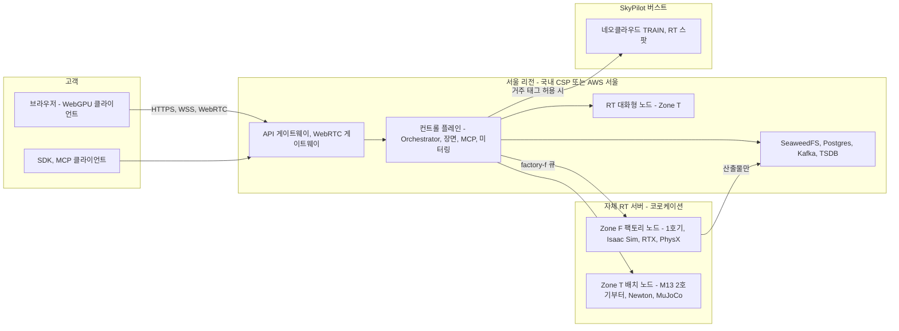

### 15.2 Athanor Sovereign

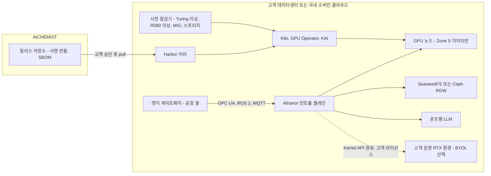

- **설치 순서:** 사전 점검기 실행 → 서명 번들 검증 → Helm 설치(`values-sovereign.yaml`) → 적합성 스위트 스모크(설치 검증 보고서 자동 생성) → 고객 SSO 연동.
- **지원:** 원격 접속은 고객이 여는 시간 제한 세션에서만 한다. 상시 원격 접속 경로는 두지 않는다.

### 15.3 Athanor Air-gap

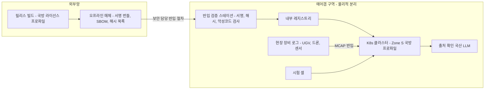

- **M36 데모(DR):** 에어갭 랙에서 촬영 → 학습 → 평가 전 과정을 네트워크를 물리적으로 끊은 채 실행한다. 이를 위해 Forge의 모든 모델(국방 프로파일 화이트리스트), LLM, 적합성 스위트, 인증서 서명 키가 랙 안에 있어야 한다.

---

## 16. CEN 연동 지점

**결론: Athanor는 CEN 위에 새로 지은 제품이 아니라 CEN의 다섯 자산(워크스페이스, 토큰, 마켓플레이스, NeRF 파이프라인, LLM 명령 인터페이스)에 꽂히는 확장이다. 연동 계약을 먼저 정하면 P0에 웹·멀티테넌트 엔지니어링을 거의 하지 않아도 된다.**

| CEN 자산 | Athanor 연동 | 인터페이스 | 담당 WS | 시점 |
|---|---|---|---|---|
| **GPU 클라우드 워크스페이스**(브라우저 가상 OS, JupyterLab) | Studio가 워크스페이스 안에서 동작한다. Jupyter 커널에 `athanor` SDK를 사전 설치하고, Selkies 데스크톱을 쓰며, WebGPU 뷰어를 임베드한다 | 워크스페이스 플러그인, SDK | WS7 | M9 베타 |
| **구독·토큰** | GPU-초 → 토큰 미터링, 결과물 크레딧(계약 금액의 20–30%, 12개월 유효), 무료 등급 LIGHT 월 5시간 | 미터링 이벤트 API(Kafka → CEN 과금) | WS6 | P0 원가 계측, P1 과금 |
| **마켓플레이스** | Certified 등급, 라이선스 매니페스트·출처·인증 등급·Run Manifest 필수 첨부, 75/25 배분, 상업 워크스페이스에서 비상업 품목 자동 차단, 인증서 공개 검증 | 리스팅 API, `cert verify` | WS7 | P1 |
| **NeRF 2D→3D 파이프라인** | M1 SPDX 감사(Instant-NGP 등 비상업 구성요소 확인) → gsplat/3DGRUT로 이전 → Forge v0(P0, 강체) | Forge DAG의 재구성 노드 | WS2 | M1 감사, P0 이전 |
| **LLM 텍스트 명령 인터페이스** | MCP 클라이언트로 전환, 한국어 명령 → 타입 도구 | MCP(사양 2026-07-28) | WS7 | P0 사내, M9 베타 |
| **계정·SSO** | CEN 계정 → 테넌트·조직·역할 매핑(OIDC) | OIDC | WS6 | P1 |

---

## 17. 도메인 범용성: Domain Pack이 꽂히는 방식

**결론: "무엇이든 트윈으로"는 아키텍처가 처음부터 보장한다. 새 도메인은 코어를 고치지 않고 Domain Pack(7개 구성요소)과 필요한 경우 Kernel 어댑터 하나를 더해 수용한다. 상업 Wave는 '어디서 먼저 돈을 버는가'의 순서일 뿐이며, 차량·드론·선박을 하지 않는다는 뜻이 아니다.**

### 17.1 Domain Pack의 7개 구성요소

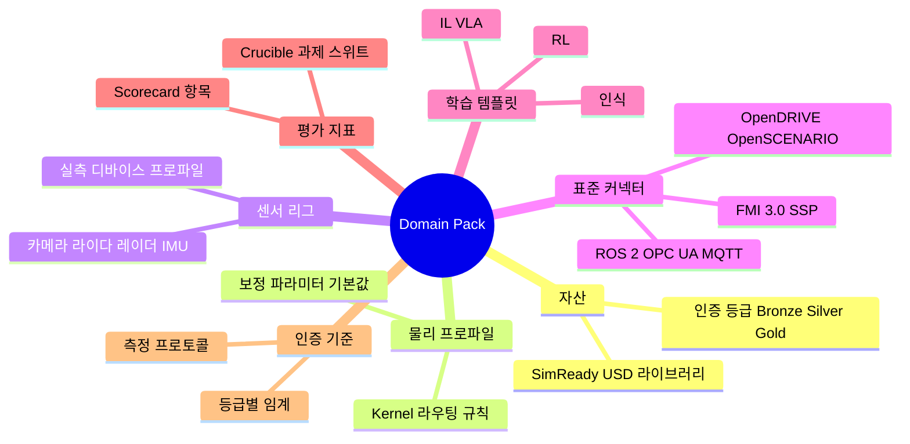

| 구성요소 | 아키텍처상 위치 | 형식 |
|---|---|---|
| 자산 | L2 자산 payload, Marketplace | SimReady USD + `aic:` 인증 |
| 물리 프로파일 | L3 라우팅(`kernel-routing.yaml` 조각), L2 보정 레이어 기본값 | YAML + USD 레이어 |
| 센서 리그 | L2 Domain Pack 레이어, L3 Sensor Model Library | USD 센서 prim + `aic:SensorProfile` |
| 표준 커넥터 | L4 엣지 게이트웨이 플러그인, L1 import 변환기 | 커넥터 컨테이너, 변환기 |
| 학습 템플릿 | L5 SKILL·DATA 라인 | Isaac Lab·mjlab 과제, LeRobot 설정, GUI·YAML 편집 |
| 평가 지표 | L5 CRUCIBLE, Scorecard | 과제 스위트 정의, 지표 함수 |
| 인증 기준 | L2 `aic:` 스키마, Fidelity Lab 프로토콜 | 등급 임계, 측정 프로토콜 문서 |

### 17.2 Domain Pack 매니페스트 예시: Mobility Pack α

```yaml
# domainpack.yaml — Mobility Pack α (P2, M18–M24). 인원·예산은 DR 고정값 안: WS1-M 1명(차량·해양 동역학 엔지니어, 착석 M18) + WS3 지원
name: mobility-pack-alpha
version: 0.1.0
readiness: P2                      # 기술 준비 시점(상업 Wave와 별도, 정본은 08 §2.3)
requires:                          # 모든 구역에서 설치 가능해야 하는 필수 어댑터
  kernel_api: ">=1.0"
  adapters: [chrono, fmu]
  capabilities: [VEHICLE_TIRE, DEFORMABLE_TERRAIN, FMU_COSIM]
optional:
  adapters_zone_f: [isaaclab_physx_vehicle2]   # Zone F 전용. 조건부 PhysX SDK 소스 어댑터 전에는 Zone T/S에 설치하지 않는다
  adapters_zone_ts: [newton_wheel]             # 테넌트 야드 차량·AMR
assets:
  - ath://pack/mobility/vehicles/sedan_generic@sha256:…    # 차체·서스펜션·타이어 파라미터
  - ath://pack/mobility/roads/kr_urban_sample@sha256:…
physics_profiles:
  tire_models: [pacejka, tmeasy]   # Chrono::Vehicle
  terrain: [rigid, scm]
  routing: { road_vehicle: chrono, yard_vehicle: { F: isaaclab_physx_vehicle2, T: newton_wheel, S: newton_wheel }, customer_model: fmu }
  determinism: { chrono_cpu: D1_statistical }   # 비트 일치 시험 + CTO 등록 후 D0(목표 M22) [A]
sensor_rigs:
  - name: front_camera_lidar
    sensors: [camera_fwd_120, lidar_spinning_64]
    profiles_required: validated   # 미검증 프로파일로 Silver/Gold 발행 불가
connectors:
  import: [opendrive_1_8, openscenario_xml_1_3, openscenario_dsl_2_1]   # esmini 기반 재생 [U: 버전]
  cosim: [fmi_3_0_2, ssp]          # 고객 CarSim/CarMaker FMU
  export: [osi_3]
templates:
  - perception_sdg_road            # 한국 도로 인식 데이터 팩(MORAI 파트너 경유 판매)
  - steady_state_cornering_eval
metrics: [steady_state_radius_err, yaw_rate_err, perception_map_ratio]
certification:
  vehicle_dynamics_silver: { yaw_rate_err_max: 0.05, protocol: "AIC-MP-VEH v0.1", requires_d0: chrono_cpu }   # [A] Chrono D0 등록 전에는 Scorecard만 발행
conformance_scenes: [C05, C12]
```

### 17.3 새 도메인을 꽂는 절차

| 단계 | 작업 | 산출물 | 코어 변경 |
|---|---|---|---|
| 1 | 도메인 요구 분석: 필요한 capability 플래그 목록 작성 | 요구 capability 표 | 없음 |
| 2 | 기존 어댑터로 충족되는지 `route(required)`로 확인. 없으면 어댑터 추가(Kernel 계약 §4.5 준수) | 어댑터 또는 '기존 충족' 판정 | 어댑터 패키지만(코어 불변) |
| 3 | 자산·스키마: Tier 1으로 표현하고 부족한 부분만 `aic:` codeless 확장 | 스키마 PR, 자산 라이브러리 | 스키마 추가(하위 호환) |
| 4 | 센서 리그와 실측 프로파일 정의. 미검증 센서는 `validated=false`로 판매 제한 | 센서 prim, 프로파일 | 없음 |
| 5 | 커넥터: 엣지 게이트웨이 플러그인·import 변환기 | 커넥터 컨테이너 | 없음 |
| 6 | 학습 템플릿·평가 지표·인증 기준 작성 | 템플릿, 과제 스위트, 프로토콜 | 없음 |
| 7 | 적합성 장면 추가(§4.6 표) | C-장면, 허용치 | 스위트 확장 |
| 8 | 팩 리뷰(라이선스·SBOM·구역) 후 다음 릴리스 트레인에 포함 | 서명된 팩 | 없음 |

### 17.4 도메인별 준비 시점과 필요한 확장

준비 시점과 상업 Wave의 정본은 [08 도메인 팩 §2.3](08-domain-packs.md)이고, 간트 차트는 [09 §1.1](09-roadmap-organization-budget.md)과 [README §5](README.md)에만 둔다. 이 표는 아키텍처 관점(추가 어댑터·스키마, 커넥터, 적합성 장면, 인증 재현 경로)만 다루며, 준비 시점은 대조용으로 한 열만 남긴다.

| 도메인 | 기술 준비(08 §2.3) | 추가 어댑터·스키마 | 커넥터 | 적합성 장면 | 인증 재현 경로 |
|---|---|---|---|---|---|
| 로봇 조작(암·빈피킹·조립·삽입) | P0–P1(M1–M12) | 없음(Newton, MuJoCo, PhysX) | ROS 2, OPC UA | C01–C08 | MuJoCo CPU(D0), Newton 결정론 모드(W7 후) |
| 모바일 로봇·AMR·공장/물류 셀 | P1–P2(M9–M18) | 없음(테넌트 Newton 관절 휠, 팩토리 PhysX Vehicle2는 Zone F 전용) | ROS 2(Jazzy·Lyrical), OPC UA | C05 | MuJoCo CPU(D0) |
| 휴머노이드·사족·덱스터러스 핸드 | P1 템플릿(M6–M12), P2 상업화(휴머노이드·덱스터러스만. 사족은 템플릿·Crucible 평가로만 수익화) | 관절 트리 분할 유틸리티 | ROS 2, 텔레옵(GELLO, SpaceMouse) | C11 | MuJoCo CPU(분할 모델) |
| 차량(Mobility Pack α) | P2(M18–M24). AV 시뮬레이터 시장에는 정면으로 들어가지 않고 MORAI·표준으로 연결 | Chrono 어댑터, FMU 마스터 | OpenDRIVE, OpenSCENARIO, FMI 3.0, OSI | C12 | D1(Chrono CPU D0 등록 목표 M22 [A]) |
| 도로 AV | 연결 전략: OpenSCENARIO·OSI·FMI 브리지, 한국 도로 인식 데이터 팩, NuRec/Cosmos(Zone F) 신경 재구성 연계 | 브리지만 | 같음 | — | 해당 없음 |
| 드론 | P2 PX4 SITL 기본 템플릿(M20–M24, RL 1종), 상업화는 P3 국방 에디션 | PX4 SITL 브리지 | MAVLink | C14 | D1(PX4 SITL lockstep D0 등록 후) |
| 선박·항만·조선 해양 | P3(M25–): Fossen 6-DOF, Chrono FSI, 검증 센서 프로파일 | 클린룸 Fossen 어댑터(적합성 6번째 백엔드), 레이더·EO/IR 센서 모델 | NMEA·AIS[A] | C13 | D1(Fossen D0 등록 목표 M28 [A]) |
| 오프로드 UGV | P3: Chrono CRM 지형 | Chrono 지형 확장 | ROS 2 | C15 | D1(Chrono D0 등록 후) |

- **Wave 3 트리거의 현실성:** 기준안의 2028년 말 ARR 목표는 ₩20억이므로, M25에 ARR ₩30억 트리거는 충족되지 않는 것이 기본 경로다. M25 착수는 확정 ₩5억 이상 앵커 계약(조선사 공동개발 또는 국방 과제)에 달려 있고, 국방 Air-gap 에디션은 M27부터다. 아키텍처는 트리거와 무관하게 Fossen 어댑터와 C13 장면을 P3 백엔드 증설 순서에 둔다.

---

## 18. 기술 부채와 확장 지점

**결론: 의도적으로 지는 부채는 12개이며, 각각 상환 조건과 담당이 정해져 있다. 확장 지점은 11개의 프로토콜·스키마로 고정해, 파트너와 고객이 코어를 포크하지 않고 기능을 더하게 한다.**

### 18.1 알려진 기술 부채

| ID | 부채 | 원인 | 이자(비용) | 상환 계획·트리거 | 담당 |
|---|---|---|---|---|---|
| TD-1 | USD 두 버전(툴링 26.08, Isaac Sim 번들) | Zone F 런타임 고정 | 해석기 플러그인 이중 빌드, 스키마 호환 테스트 | codeless 스키마 유지. Isaac Sim 다음 트레인 USD 상향 시 단일화 | WS1 |
| TD-2 | Newton 이중 핀(Isaac Lab 핀 vs 1.6.x) | Isaac Lab 3.x GA의 Newton·Warp 핀이 최신보다 뒤처짐 | 이미지 2종, 적합성 2회 | 트레인마다 단일 핀 복귀를 기본으로 하고, 예외는 결정 메모에 기록 | WS1 |
| TD-3 | newton-usd-schemas v0.x 변동 | 실험적 스키마 | Tier 2 속성 이전 작업 | Tier 2를 솔버 파라미터로만 제한, 업스트림 기여 | WS1 |
| TD-4 | 자체 DAG 상태 기계 | 의미론 소유 결정(§9.2) | 실행기 유지보수 | 실행기 인터페이스 유지, P2에 OSMO 전환 비용 재평가 | WS6 |
| TD-5 | 트윈 상태 서비스 자체 구현 vs Ditto | 경량화 선택 | 기능 추가 부담 | M12에 예상 트윈 수·갱신율로 결정 | WS6 |
| TD-6 | 테넌트용 PhysX 경로 부재 | PhysX SDK 소스 어댑터 미구축 | 테넌트 접촉 집약 조작·Vehicle2 기능 공백(Vehicle2는 Zone F 전용) | P2 조건부 착수(G1 통과, 베이크오프 우위, 온프렘 수요 2건), 36–48 HM | WS1 |
| TD-7 | Kit-less TacSL·Mimic·Teleop 미검증 | Isaac Lab Newton 경로 beta | 테넌트 IL 기능 제한 | M6 사내 시험 | WS5 |
| TD-8 | RTX PRO 6000 MIG 미검증 | 1차 출처 없음[U] | 세션당 GPU 1장 과금으로 원가 상승 | M4 실측 후 슬라이스 과금 도입 여부 결정 | WS6 |
| TD-9 | NVIDIA 전용 GPU 경로 | Warp·Newton·RTX 모두 CUDA | 공급·가격 충격이 그대로 전달 | Genesis 관찰, Chrono ROCm(개발 브랜치) 관찰. Kernel 계약은 디바이스 중립으로 유지 | CTO |
| TD-10 | MJWarp 60 DoF 초과 약점 | 솔버 특성 | 휴머노이드 + 양손 경로 분기 | 베이크오프 T11, 관절 트리 분할 유틸리티 | WS1 |
| TD-11 | Selkies 유지보수 위험 | 프로젝트가 메인테이너를 구함 | 데스크톱 스트리밍 단절 위험 | 자체 WebRTC 게이트웨이로 데스크톱 스트림 흡수 준비(P2) | WS7 |
| TD-12 | TSDB 라이선스 경계(TimescaleDB TSL 고급 기능 배제) | Zone T/S는 TSL을 넣지 않는 원칙(DR §0 #4 정오표 T-4) | 네이티브 압축·연속 집계를 못 써 저장·쿼리 비용 증가 | Apache-2.0 에디션만 쓰고, 대형 플릿이면 InfluxDB 3 Core 또는 Iceberg 다운샘플로 이전 | WS6 |

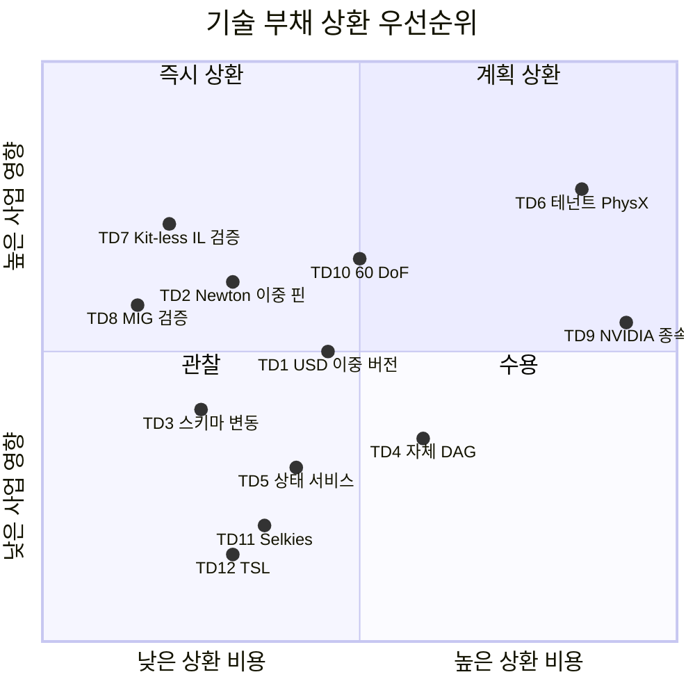

### 18.2 확장 지점

| ID | 확장 지점 | 인터페이스 | 예시 | 확장 주체 | 안정성 |
|---|---|---|---|---|---|
| EP-1 | 물리 어댑터 | `SimKernel` 프로토콜 + 어댑터 계약 | Chrono, FMU, PhysX SDK, Genesis | 내부, 파트너 | v1부터 SemVer |
| EP-2 | 렌더 티어 | `Renderer` 프로토콜 | ovrtx(GA·약관 후) | 내부 | v1부터 |
| EP-3 | 센서 모델 | `SensorModel` 프로토콜 + `aic:SensorProfile` | 해양 레이더, 이벤트 카메라 | 내부, IITP 공동연구 | P1부터 |
| EP-4 | 스키마 | `aic:` codeless 스키마 | `AicDomainPackAPI` 확장 | 내부 | 메이저 내 추가만 |
| EP-5 | 커넥터 | 엣지 게이트웨이 플러그인 SDK | 고객 PLC, MES | 파트너, SI | P2 |
| EP-6 | MCP 도구 | 도구 레지스트리(스키마 + 권한 + 비용 함수) | 파트너 분석 도구 | 파트너 | P2 |
| EP-7 | Orchestrator 단계 | 컨테이너 단계 계약(입력·출력 해시, Manifest) | 고객 평가 스크립트 | 고객, 파트너 | P2 |
| EP-8 | 검증기 | UsdValidation 플러그인 | 고객 QA 규칙 | 고객 | P2 |
| EP-9 | 스토리지 | S3 API 계약 | 고객 Ceph, 국내 CSP 오브젝트 스토어 | 고객 | P0부터 |
| EP-10 | LLM 공급자 | 모델 라우터 | 국산 모델, 온프렘 모델 | 내부 | P1 |
| EP-11 | Domain Pack | `domainpack.yaml` | Mobility Pack α, 해양 팩 | 내부, 파트너 | P2 |

**표준화 참여(확장 항목):** AOUSD 회원 가입으로 UsdPhysics·SimReady 규범화에 참여하는 방안을 P2에 검토한다. 우리 적합성 스위트를 공개(오픈소스)하는 것은 채용 흡인 요인(DR §8.4)이자 사실상 표준을 선점하는 수단이다.

---

## 19. 결정 사항 및 다음 액션

**결론: 이 문서로 확정하는 아키텍처 결정은 10개이고, 그중 7개는 베이크오프가 시작되는 W1–W2(2026-11-02 ~ 11-13)에 코드로 존재해야 한다.**

### 19.1 결정 사항

| # | 결정 | 근거 절 |
|---|---|---|
| AD-1 | 레이어 번호는 DR §6.1(L0–L8)을 따르고, 모든 컴포넌트는 레이어·구역·풀 좌표를 가진다 | §2 |
| AD-2 | Sim Kernel API는 §4.2 시그니처를 v0로 삼는다. 쿼터니언 xyzw, SI·Z-up, DLPack 무복사, 인스턴스 = 프로세스 = GPU 1장 | §4 |
| AD-3 | 적합성 판정은 '적용 가능 조합 100% 통과'다. 백엔드는 3 → 4(+Drake) → 5(+Chrono) → 6(+클린룸 Fossen), 장면은 C01–C15 정본으로 5 → 8 → 12 → 15로 늘린다. FMU·PX4 SITL 브리지는 백엔드 수에 넣지 않는다 | §4.6 |
| AD-4 | 렌더러와 센서 모델을 분리한다. 미검증 센서 프로파일로는 Silver/Gold 인증을 발행하지 않는다 | §5 |
| AD-5 | 장면 버전 관리는 자체 레이어 커밋 서비스로 한다(lakeFS 미채택). 인증서는 자산 콘텐츠 해시에 묶는다 | §6 |
| AD-6 | Run Manifest 없는 Job은 어드미션에서 거부한다. 결정론 등급은 `det_class`(D0_bitwise/D1_statistical/D2_generative/none)로 기록하고, 인증은 D0 등록 경로의 `D0_bitwise` 클래스에서만 발행한다 | §7 |
| AD-7 | Orchestrator는 의미론을 소유하고 실행은 KAI·KubeRay에 위임한다. OSMO를 폴백 실행기로 둔다 | §9.2 |
| AD-8 | 에이전트는 타입 연산을 우선하고, 코드 경로는 5단 가드레일을 통과해야 한다. `cert.issue`는 에이전트 단독 실행 금지 | §10 |
| AD-9 | 오브젝트 스토어는 S3 계약 위의 SeaweedFS(기본)·Ceph RGW(대규모)로 한다. MinIO·lakeFS·Vault는 번들에서 제외 | §11.2 |
| AD-10 | 테넌트 간 GPU 시분할을 금지하고, 거주 태그는 어드미션 정책으로 강제한다 | §12 |

### 19.2 다음 액션

| 액션 | 책임 | 기한 |
|---|---|---|
| Sim Kernel API v0 초안 공개, Newton·MuJoCo CPU 어댑터 골격 | WS1 Kernel 리드(CTO 대행) | 2026-11-13(W2) |
| Run Manifest 스키마 v0(베이크오프 측정 하네스용 최소판, `det_class` 필드 포함) | WS1(재배치된 CEN 플랫폼 엔지니어, CTO 대행 감독)¹ | 2026-11-06(W1) |
| Run Manifest 서비스 v0 + 어드미션 웹훅(Manifest 없는 파드 거부), 서명·동결 | WS1(재배치 플랫폼 엔지니어)¹ | 2026-12-17(D60) |
| 적합성 스위트 v0(C01–C05) × 베이크오프 B1–B5 실행 | WS1 | 2026-11-13(W2) |
| SPDX 거부 목록 CI(NEVER 목록 + 후보 #22, 구역 규칙) + CEN NeRF 파이프라인 감사 착수 | CTO + 라이선스 자문 | 2026-11-17(D30) |
| 라이선스·출처 레지스트리 v0 백엔드(코드·자산·가중치 권리, V7 조건부 태그, 리콜 플래그) | WS1(재배치 플랫폼 엔지니어)¹ + 라이선스 자문, CTO 감독 | 2026-12-17(D60) |
| 국내 CSP 3사 R580 이상 이미지·RT GPU·MIG 검증(V4) | WS1 재배치 플랫폼 엔지니어(M3부터 WS6 Platform Lead) | 2026-12-31(M2) |
| SeaweedFS·Ceph·OpenBao SPDX 확인(DR §15 #21) | WS1 재배치 플랫폼 엔지니어 + 라이선스 자문 | 2026-12-31(M2) |
| 장면 커밋 서비스 v0(콘텐츠 해시, 브랜치, `ath://` 해석기) | WS1(재배치 플랫폼 엔지니어)¹ | 2026-12-17(D60) |
| `aic:TwinCertificate` 스키마 v0(05 §14.2 필드) + 서명 사이드카, 첫 Silver 자산 50개에 적용 | Head of Fidelity(대행) + WS2 | 2027-01-16(D90) |
| 베이크오프 결정 메모 → `kernel-routing.yaml` 확정, Train 1 호환성 매트릭스, 적합성 허용치 확정(C01–C15) | CTO | 2027-01 첫 주 |
| 자체 서버 1호기 Zone F 전용 노드 구성(Zone T는 클라우드·국내 CSP 노드) | WS6 Platform Lead | 2027-03-31(M5) |
| MCP 서버 v0(사내: scene.*, asset.search, sim.run, sdg.generate, job.status) + 한국어 스크립트 20개 회귀 | WS7(Product Lead 착석 M8 전까지 CTO 대행) | 2027-02-26(M4, G0) |
| Outcome Orchestrator v0(DATA·FORGE DAG, QA-D1/D2·QA-F, 개입 이벤트 계측) | WS6 + WS2 | 2027-02-26(M4, G0) |
| Kit-less TacSL·Mimic·Teleop 사내 검증(TD-7) | WS5 Skill Lead | 2027-04-30(M6) |
| WebRTC 게이트웨이 설계 리뷰, Kit 스트리밍 격리 노드 구성 | Platform Lead | 2027-05-31(M7) |
| Studio 베타(Zone T 전용, Explorer 초대제)용 R0 웹 베이커와 세션 매니저 | WS7 + WS6 | 2027-07-31(M9) |
| 트윈 상태 서비스 결정(자체 vs Ditto, TD-5) | Platform Lead | 2027-10-31(M12) |
| Kernel API v1 동결, SemVer 정책 발효 | CTO | 2027-10-31(M12) |
| Sovereign Helm 번들, 사전 점검기, 오프라인 서명 업데이트 | WS6 | 2027-12-31(M14, 베타) |

¹ P0의 Run Manifest·장면 커밋 서비스·라이선스 레지스트리 백엔드는 WS1에 재배치된 CEN 마켓플레이스·플랫폼 엔지니어(Kernel 리드 대행)가 맡는다. WS6 Platform 리드(K8s GPU 플랫폼 엔지니어)는 M3에 착석하므로 P1부터 이 서비스들의 운영을 WS6이 넘겨받고, 레지스트리 UI는 WS7이 맡는다. 날짜 기준은 D0 = 2026-10-16, D30 = 2026-11-17, D60 = 2026-12-17, D90 = 2027-01-16이다.

### 19.3 DR 해석 메모

| 항목 | DR 표기 | 본 문서의 해석 |
|---|---|---|
| 적합성 KPI와 베이크오프 | KPI P0 '3 × 5'와 베이크오프 W2 '× 5개 백엔드' | W2의 5개는 실행 구성(B1–B5)이고, KPI의 3개는 통과 백엔드 수다. B1·B2·B5는 Newton/MJWarp 계열이다(§4.6) |
| 현실감 'L1–L4'와 아키텍처 'L0–L8' | DR §4.2의 현실감 4계층이 L1–L4로 표기돼 아키텍처 레이어 번호와 겹친다 | 아키텍처 문서에서 L 번호는 시스템 레이어에만 쓴다. 현실감 계층은 [05 물리·현실감](05-physics-and-realism.md)의 표기를 따르고 본 문서에서는 R0–R3 렌더 티어와 센서 프로파일로만 언급한다 |
| 리서치 참조 아키텍처 번호 | 리서치: L5 Learning, L6 APIs, L7 UX, L8 Agents | DR §6.1 번호(L5 Lines, L6 Orchestration, L7 Agent, L8 Surfaces)를 따른다 |
| OpenUSD 버전 | 툴링 26.08, 런타임은 Isaac Sim 6.1 번들 USD | 자체 스키마는 codeless로 만들어 두 버전 모두에서 로딩한다(TD-1) |
| Run Manifest v0 시점 | 베이크오프 W1(2026-11-02 주)에 'Run Manifest v0', 30/60/90일 계획 D31–60에 'Run Manifest·라이선스 레지스트리 v0' | W1(2026-11-06)은 측정 하네스용 최소 스키마, D60(2026-12-17)은 어드미션 강제·서명을 갖춘 서비스로 나눈다. 둘은 같은 스키마 v0를 공유하고, P0 담당은 WS1(재배치 플랫폼 엔지니어)이다 |
| 결정론 등급 필드 | DR §4.1 '통계적 재현' 라벨, 05 §6.4 `det.class` | Run Manifest 필드 `det_class`(D0_bitwise / D1_statistical / D2_generative / none)로 정본화한다(§7.2·§7.4) |
| 적합성 장면 번호 | 05 §8.1의 S1–S15 | 본 문서 §4.6의 C01–C15가 정본이다. 05에만 있는 장면은 C16+ 확장 후보다 |
| 적합성 6번째 백엔드 | 04 초안 'P3 + fmu 또는 physx_sdk' | P3 + 클린룸 Fossen(C13). FMU는 브리지라 세지 않고, 조건부 PhysX SDK 어댑터는 착수 시 7번째로 센다 |
