# 05. 물리와 현실감: 측정으로 증명하는 강력한 물리와 현실 유사도

> **문서 번호** 05 · **기준일** 2026-10-06 · **버전** v1.1(DR v1.1·문서 간 정합 반영) · **상위 문서** [README](README.md)
> **관련 문서** [01 비전·포지셔닝](01-vision-positioning.md) · [02 시장·경쟁](02-market-competition.md) · [03 엔진 선정·Build vs Buy](03-engine-selection-build-vs-buy.md) · [04 시스템 아키텍처](04-system-architecture.md) · [06 사용성·에이전트](06-usability-and-agent.md) · [07 학습 모듈](07-training-module.md) · [08 도메인 팩](08-domain-packs.md) · [09 로드맵·조직·예산](09-roadmap-organization-budget.md) · [10 사업모델·GTM](10-business-model-gtm.md) · [11 리스크·KPI·컴플라이언스](11-risk-kpi-compliance.md) · [12 90일 실행](12-execution-90days.md) · [부록 A 기술 카탈로그](appendix-a-technology-catalog.md) · [부록 B 출처·검증](appendix-b-sources-verification.md)
> **표기** **[A]** 계획 가정(실적 확인 전까지 목표치) · **[U]** 1차 출처 미확인(대외 사용 전 [부록 B](appendix-b-sources-verification.md) 절차로 재검증) · 태그 없는 사실은 GitHub·PyPI로 확인된 값(2026-10-05/06) · ₩억 = 1억 원 · M1 = 2026년 11월, P0 = M1–M4(2026.11–2027.02), P1 = M5–M12(2027.03–2027.10), P2 = M13–M24(2027.11–2028.10), P3 = M25–M36(2028.11–2029.10) · DR = 결정 기록(Decision Record, 전 문서의 단일 기준)

---

## 핵심 요약

- **강력한 물리는 '엔진 하나'가 아니라 '작업별 라우팅 + 보정 + 재현 + 측정'이다.** 13개 작업 유형을 Newton 1.6.x(버전은 Isaac Lab 3.x GA 핀으로 통일, 2026-10 최신 1.6.1. MJWarp·Kamino·VBD·Style3D·ImplicitMPM·SDF/hydroelastic), MuJoCo 3.15 CPU, Isaac Lab 3.x + PhysX 5.x(Zone F, Isaac Sim 6.1 번들 버전 [U], 공개 SDK 최신 5.11), Drake v1.57, Chrono 10.0에 나눠 보낸다. 경계는 적합성 스위트([04 §4.6](04-system-architecture.md)의 C01–C15, P0 3×5 → P3 6×15)와 수출 전 sim2sim 게이트(Tier 1 적용률 100%, 인증 대상은 Tier 2 추가)로 지킨다.
- **'재현 가능'은 세 등급으로 나눠 판다.** 인증서는 D0(비트 일치: MuJoCo CPU, 또는 베이크오프 W7을 통과한 Newton 결정론 모드 + 고정 GPU·드라이버)에서만 발행한다. GPU 배치·변형체 산출물은 D1 '통계적 재현', 생성형 증강 프레임은 D2다. 차량(Chrono)·드론(PX4 SITL)·해양(Fossen) 동역학은 D0 등록 시험을 통과하기 전까지 D1이다. 인증 시험 결정론적 재현율 100%는 P0부터 고정 KPI다.
- **물성 파라미터는 엔진 간에 이식되지 않는다.** 같은 실측 trial로 백엔드마다 파라미터 세트를 따로 맞추고 인증서에 백엔드별로 기록한다. 보정 사다리는 VLM 사전분포(Bronze) → 영상 sysid(Silver) → Fidelity Lab 실측(Gold) → 접촉 부품의 Drake 교차 검증이다.
- **현실감은 하나의 OpenUSD 스테이지 위 4계층으로 쌓는다.** L1 PBR 재질(MDL, MaterialX, OpenPBR), L2 신경 재구성(3DGUT, UsdVolParticleField), L3 실측 보정 센서(RTX / Warp Sensor Library + 디바이스 프로파일), L4 생성형 증강(M5–M8 Cosmos Transfer 2.5 → M9부터 Cosmos 3 Nano, 라벨 일관성 QA 통과 프레임만 납품)이다.
- **Athanor Forge는 CEN NeRF 파이프라인의 후속인 10단계 Real2Sim 라인이다.** 비상업 구성요소는 하나도 쓰지 않는다. 허용형(MapAnything-apache, DA3 S/B/Metric, gsplat 1.6.0, 3DGRUT 2.0, TRELLIS.2(nvdiffrast 교체), Articulate-Anything, CoACD/CuACD)이 기본이고, 커스텀 사용 제한 라이선스인 VGGT-1B-Commercial·SAM 3D Objects는 V7 법률 검토를 통과한 민수 경로에서만 조건부로 쓴다. CEN NeRF 라이선스 감사는 M1, 3DGUT 전환과 NeRF 런타임 퇴역은 M4(G0, 2027-02-26)에 한다.
- **'현실 유사도'의 정의는 Sim2Real Gap Scorecard다.** mAP 비율, 성공률 갭(%p), Pearson r, ADE/FDE, Chamfer, 노이즈 PSD, PSNR/SSIM/LPIPS를 공식·표본 요건·측정 프로토콜까지 고정해 제3자가 재계산할 수 있게 한다. FID·KID는 분포 드리프트 경보용 보조 지표다.
- **Fidelity Lab이 증거를 생산하고, 레이더는 증거 전까지 팔지 않는다.** Test Cell 1(P0)·2(P1)에서 Gold 최소 프로토콜(물체당 50 trial [A])을 자동 반복해 페어드 코퍼스 1k → 10k → 50k → 150k trial과 Bronze/Silver/Gold 인증서(`aic:TwinCertificate`)를 만든다. 레이더·EO/IR은 오차 막대를 공개한 프로파일 전에는 해양·국방에 판매하지 않는다.

---

## 1. 결론: 물리와 현실감은 '측정 루프'로 설계한다

**결론: 우리는 엔진이 정확하다고 주장하지 않는다. 실측과 시뮬의 차이를 숫자로 재고, 그 숫자를 인증서로 판다.**

2026년 10월 기준으로 현실에 균일하게 충실한 엔진은 없다. GAUGE(arXiv 2608.05948)는 Isaac Sim 6.0.0, Genesis, Newton 1.3.0을 14개 실측 과제군으로 비교했고, 충격성 접촉·빠른 직물 운동·체적 변형에서 가장 큰 갭을 보고했다[U]. GPUSimBench(arXiv 2607.13059)는 주요 GPU 시뮬레이터 모두에서 실행 간·환경 간 비결정성을 보고했다[U]. 따라서 CEO 요구사항 (1) '강력한 물리'와 (2) '현실 유사도'는 엔진 브랜드로 답할 수 없다. 우리의 답은 네 가지 장치의 결합이다. ① 작업 유형별로 가장 맞는 백엔드를 고르는 라우팅, ② 실측으로 파라미터를 맞추는 보정, ③ 인증 가능한 결정론 경로, ④ 그 결과를 공식으로 채점하는 Scorecard와 인증서다. 이 네 장치는 엔진이 바뀌어도 살아남는 우리 소유 IP다([03 §9](03-engine-selection-build-vs-buy.md)).

**표 1-1. CEO 요구사항에 대한 정의와 증명 방식**

| 요구 | 우리의 정의 | 핵심 메커니즘 | 증명 KPI: P1(M12) → P3(M36) | 본문 |
|---|---|---|---|---|
| (1) 강력한 물리 | 과제별 최적 백엔드에서, 실측으로 보정된 파라미터로, 재현 가능하게 돈다 | 라우팅(§2), 접촉 모델 가이드(§3), 변형체(§4), 폐루프·고자유도(§5), 결정론(§6), 보정(§7), 적합성 스위트(§8) | 적합성 4×8 → 6×15(C01–C15). Forge 자동 추정값의 Gold 랩 실측 대비 질량/마찰 오차 ≤10%/≤20% → ≤5%/≤10%. 궤적 ADE ≤2 cm → ≤1 cm. 결정론적 재현 100% | §2–§8 |
| (2) 현실 유사도 | 시각·물리·센서 갭을 계층별로 닫고, 모든 납품물에 Scorecard를 붙인다 | 4계층 스택(§9), Forge(§10), 센서 프로파일(§11), 증강 QA(§12), Scorecard(§13), 인증(§14), Fidelity Lab(§15) | mAP 비율 ≥0.90 → 3개 버티컬 ≥0.95. 갭 ≤15%p(3개 과제) → ≤8%p(10개 과제). r ≥0.7 → ≥0.85. 라이다 ≤3 cm → ≤2 cm + 레이더 프로파일 공개 | §9–§15 |
| 범용성(DR v1.1) | 로봇·차량·드론·선박·공장을 같은 Kernel·같은 인증 체계로 받는다 | Domain Pack의 물리 프로파일·센서 리그·인증 기준([08](08-domain-packs.md)) | 적합성 스위트에 바퀴 차량 장면(C05)을 P0부터, 차량 선회(C12)를 P2에, 선박 롤 감쇠(C13)를 P3에 포함 | §2.3 |

**표 1-2. 다섯 가지 설계 원칙**

| # | 원칙 | 구체적 규칙 | 지키지 않으면 생기는 일 |
|---|---|---|---|
| P1 | 측정 없는 주장 금지 | 모든 납품물에 Scorecard. '실측 검증' 문구는 Gold에만 | "사실적"이라는 말이 계약 분쟁의 근거가 된다 |
| P2 | 작업이 엔진을 고른다 | Domain Pack 물리 프로파일 → Kernel 라우팅. 사용자 오버라이드는 Run Manifest에 기록 | 단일 엔진 고집으로 접촉·변형체 품질이 무너진다 |
| P3 | 결정론은 등급으로 표기 | D0/D1/D2. 인증서는 D0만 | '재현 가능'이 거짓말이 되고 인증 신뢰가 붕괴한다 |
| P4 | 보정은 백엔드별 | 같은 trial, 다른 파라미터 세트. sim2sim 게이트는 각자의 보정값으로 | 마찰 계수를 복사하는 순간 백엔드 간 편차가 생긴다 |
| P5 | 범용성은 아키텍처, 순서는 상업 | 차량·드론·해양 물리는 준비 시점표대로 준비. 판매 순서는 Wave | "자동차는 안 한다"로 오독되거나, 반대로 검증 전 판매가 일어난다 |

**그림 1. 측정 루프: 촬영에서 인증, 드리프트 감시까지**

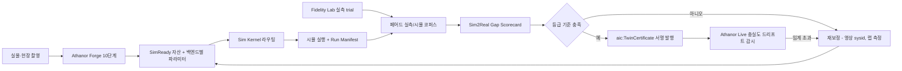

---

## 2. 물리 ①: 작업 유형별 백엔드 라우팅

**결론: 작업 유형이 백엔드를 고른다. Kernel은 Domain Pack의 물리 프로파일을 읽어 학습 백엔드로 보내고, 인증 시험은 언제나 결정론 경로에서 다시 돈다.**

### 2.1 라우팅 표(베이크오프 전 가설, 2027년 1월 첫 주 결정 메모로 확정)

[03 §3.4](03-engine-selection-build-vs-buy.md)의 라우팅 가설을 운영 단위로 펼친 표다. dt와 decimation은 출발값이며, 베이크오프 W5–W6의 '성공률 보정 steps/s/$'로 덮어쓴다.

**표 2-1. 작업 유형 → 백엔드 라우팅**

| # | 작업 유형 | 대표 과제(베이크오프) | 학습 기본 백엔드·접촉 | 대안·폴백 | 인증 재현(D0) | 산출물 결정론 | 출발 dt·decimation / 정책 주기 [A] | 구역 | 기술 준비 시점 |
|---|---|---|---|---|---|---|---|---|---|
| 1 | 보행·전신(사족, 휴머노이드 속도 추종, 모션 트래킹) | T1 G1 속도 추종, T2 BeyondMimic | Newton/MJWarp, 소프트 볼록 접촉, 타원 콘 | mjlab 1.6.0(MJWarp 3.11 고정 별도 이미지), PhysX(Zone F) | MuJoCo 3.15 CPU | D1 | 5 ms, decimation 4 / 50 Hz | F·T·S | 템플릿 P1(M6–M12), 상업화 P2(휴머노이드·덱스터러스만) |
| 2 | 일반 픽앤플레이스·빈 피킹 | T3 Franka 큐브, T5 한국 SKU 클러터 | 팩토리: Isaac Lab + PhysX(TGS, GPU SDF). 테넌트: Newton/MJWarp | MuJoCo CPU | MuJoCo CPU | D1 | 5 ms, decimation 4 / 50 Hz | F·T·S | P0–P1 |
| 3 | 손안 재배치(덱스터러스) | T4 LEAP/Allegro | Newton/MJWarp | PhysX(Zone F) | MuJoCo CPU | D1 | 1/240 s(≈4.17 ms), decimation 8 / 30 Hz | F·T·S | P1 |
| 4 | 삽입·조립(공차 ≤0.5 mm), 촉각 | T7 페그·커넥터 | 팩토리: PhysX SDF + TacSL. 테넌트: Newton SDF + hydroelastic | Drake hydroelastic/SAP(대조 기준) | Newton 결정론 모드(W7 통과 시) 또는 MuJoCo CPU + SDF 근사 | D1 | 1/480 s(≈2.08 ms), decimation 8 / 60 Hz | F(T는 Newton) | P0–P1 |
| 5 | 케이블 삽입·라우팅 | T8 케이블 삽입 | Newton VBD(로드) | MuJoCo cable composite, PhysX(Zone F) | 정적 보정 시험(처짐)만 MuJoCo CPU cable composite로 D0 재현, 'experimental' | D1 | 1/480 s, decimation 16 / 30 Hz | F·T·S | P1 |
| 6 | 폴리백·천·연체 | T6 폴리백, T9 천 접기 | Newton VBD / Style3D | MuJoCo 3.15 flex(Stable Neo-Hookean 3.15·IPC 접촉 3.14 모두 실험), PhysX FEM(Zone F) | 정적 보정 시험(정지 형상)만 MuJoCo CPU flex로 D0 재현, 'experimental' | D1 | 1/480 s, decimation 16 / 30 Hz | F·T·S | P1(Forge v1 VBD 폴리백) |
| 7 | 입상체·식품·점성 유체 | P1 추가 과제 [A] | Newton ImplicitMPM | Genesis MPM(관찰만) | 없음 → 인증 대상 아님(Scorecard 리포트만) | D1 | 1/960 s, decimation 32 / 30 Hz | F·T·S | P1–P2 |
| 8 | 폐루프 그리퍼·링크·델타 | T10 Kamino 그리퍼 | Newton Kamino(NCP, 하드 접촉) | MuJoCo equality 제약 | MuJoCo CPU(equality 모델) | D1 | 2 ms, decimation 10 / 50 Hz | F·T·S | P1(experimental 표시) |
| 9 | 휴머노이드 + 양손(단일 메커니즘 60 DoF 초과) | T11 스트레스 테스트 | PhysX(Zone F) 또는 관절 트리 분할 | — | MuJoCo CPU(분할 모델) | D1 | 4 ms, decimation 5 / 50 Hz | F(분할 모델은 T·S) | 템플릿 출시 전 T11 판정 |
| 10 | AMR·공장 셀 차량 | 적합성 장면 C05(+ 후보 C19 타이어 슬립) | 테넌트(Zone T/S): Newton 관절형 휠 + 마찰 [A]. 팩토리(Zone F 전용): PhysX Vehicle2(Isaac Lab 경유) | Chrono::Vehicle | MuJoCo CPU(Newton 관절 휠 모델). Chrono는 D0 등록 후 | D1 | 5 ms, decimation 10 / 20 Hz | F·T·S(Vehicle2는 F만) | P1–P2(M9–M18) |
| 11 | 승용·상용 차량, 오프로드 | Mobility Pack α 시나리오, 적합성 C12 | Chrono 10(Vehicle, Pacejka/TMeasy 타이어, SCM 지형, Zone T/S) + PhysX Vehicle2(Zone F 전용). 고객 CarSim/CarMaker FMU(FMI 3.0, BYOL) | BeamNG.tech(견적 기반, 벤더 라이선스) | Chrono CPU(D0 등록 시험 후, 목표 M22) [A] | D1 | 1 ms, decimation 10 / 100 Hz | F·T·S(Vehicle2는 F만) | α는 P2(M18–M24), CRM 오프로드 P3 |
| 12 | 드론 | PX4 SITL 템플릿(RL 1종, P2), 적합성 C14 | PX4 SITL + Gazebo Jetty(자체 PX4 브리지) | Pegasus 포팅(Isaac Sim 런타임 의존, Zone F·BYOL 전용) | PX4 SITL lockstep(D0 등록 시험 후) [A] | D1 | 4 ms, decimation 1 / 250 Hz(lockstep) | F·T·S(Pegasus는 F만) | 템플릿 P2(M20–M24), 상업화 P3 국방 에디션 |
| 13 | 선박·부유체·항만 | 적합성 장면 C13 | 자체 클린룸 Fossen 6-DOF(Warp) + Chrono FSI(SPH) | — | 자체 Fossen CPU 경로(D0 등록 시험 후, 목표 M28) [A] | D1 | 10 ms, decimation 10 / 10 Hz | F·T·S | P3(M25–) |

- **dt·decimation 규칙:** 정책 주기 = dt × decimation이다. [04](04-system-architecture.md) Kernel API의 `substeps`(제어 1회당 물리 스텝 수, 제어 주기 = `dt × substeps`)가 이 decimation과 같은 값이다. Isaac Lab·mjlab은 정수 decimation만 표현하므로 위 출발값은 모두 정수 decimation으로 맞췄다. 실제 로봇 컨트롤러 주기가 다르면 [07 §7.1](07-training-module.md)의 '제어 주기 정합' 규칙대로 dt를 조정한다.
- **인증 재현 규칙:** 학습은 어느 백엔드에서 하든, 인증 시험 장면은 D0 경로에서 다시 돌린다. 변형체(VBD·flex·cable, 5·6행) 동역학 산출물은 D1이다. 변형체 자산 인증서는 정적 보정 시험(P-CABLE 처짐, 정지 형상)을 MuJoCo CPU cable/flex 모델(같은 trial로 따로 보정한 세트)로 D0 재현한 항목에만 붙이고 'experimental'로 표기한다. 파지·삽입 중 변형 같은 동역학 거동은 Scorecard 리포트와 '통계적 재현' 라벨로만 납품한다. D0 경로가 없는 입상체·유체(7행)는 인증 대상에서 제외하고 Scorecard 리포트만 납품한다.
- **D0 허용 목록 확장 규칙:** DR이 인증 재현에 허용한 경로는 MuJoCo CPU와 Newton 결정론 모드(베이크오프 W7의 N1–N5 통과 후) 두 가지다. Chrono CPU(차량)·클린룸 Fossen(Warp CPU, 선박)·PX4 SITL lockstep(드론)은 §6.3의 N1–N4와 동등한 반복 비트 일치 시험을 통과하고 CTO가 D0 목록에 등록한 뒤에만 인증 경로로 쓴다(목표 등재 Chrono M22, Fossen M28 [A]). 등록 전 해당 동역학 산출물은 D1 '통계적 재현'으로 표기하고 Scorecard 리포트만 납품하며, 인증서는 자산·센서 항목에만 발행한다.
- **Drake의 위치:** 인증 재현 백엔드가 아니라 접촉 '기준값' 생성기다. 삽입 과제의 기대 접촉력·성공 판정을 만들고, Newton·PhysX 파라미터를 거기에 맞춘다(§7.6). Drake PyPI 휠은 'BSD and Other/Proprietary'(번들된 서드파티 솔버에 별도 약관)이므로 Zone F 내부 검증에 쓰고, Zone S(온프렘·에어갭) 번들에는 독점 솔버를 뺀 소스 빌드만 V2 법률 의견 뒤에 넣는다.
- **mjlab 고정:** mjlab은 MJWarp 3.11에 고정한 별도 이미지로 운영하고, 인증 재현은 MuJoCo 3.15 CPU에서 한다.
- **Genesis:** 어느 행에도 기본값으로 들어가지 않는다. 베이크오프에서 2개 과제만 관찰한다.

### 2.2 라우팅 메커니즘

Kernel의 `capabilities()`는 어댑터마다 관절 좌표계(축약/최대), 접촉 모델, 변형체 종류, 결정론 등급, 미분 가능 여부, 허용 구역을 돌려준다. 라우터는 Domain Pack 물리 프로파일의 요구 기능과 교집합을 구하고, 남은 후보 중 베이크오프 결정 메모의 기본값을 고른다. Studio 고급 모드에서 사용자가 바꿀 수 있지만, 바꾼 사실과 사유는 Run Manifest에 남고 인증 재현 경로는 바뀌지 않는다.

```yaml
# Domain Pack 물리 프로파일 예시 [A]
physics_profile: pick-korean-sku-bin/v1
task_type: bin_picking
zone: T                       # F | T | S
train_backend: newton.mjwarp
contact:
  model: soft_convex          # soft_convex | sdf_hydroelastic | physx_tgs | kamino_ncp
  cone: elliptic
  penetration_budget_mm: 0.5
deformables: none
certify_backend: mujoco.cpu   # D0 경로(determinism: D0_bitwise)
sim2sim_gate: [newton.mjwarp, mujoco.cpu]   # Zone T/S는 PhysX 제외(PhysX SDK 어댑터 편입 전)
gate_tolerance:               # 2단 구조, 정본은 07 §7.3
  tier1:                      # 모든 수출 정책, 실패 시 수출 차단
    episodes: 1000
    success_gap_pp: 10
    return_ratio_min: 0.85
    latency_noise_drop_pp: 15
    onnx_action_max_abs_err: 1.0e-3
  tier2:                      # 로봇-과제 인증서·Crucible 공식 캠페인 대상
    initial_conditions: 200
    success_gap_pp: 5
    joint_rmse_rad: 0.05
calibration_source: certificate   # 자산 인증서의 백엔드별 파라미터 세트를 그대로 사용
```

- **구역별 sim2sim 게이트:** 팩토리(Zone F) 정책은 Newton → PhysX → MuJoCo CPU 3개 백엔드, 테넌트(Zone T/S) 정책은 Newton ↔ MuJoCo CPU 2개 백엔드로 확인한다. PhysX SDK 소스 어댑터가 DR §3.4의 세 조건(G1 통과, 베이크오프에서 PhysX 우위 실측, 온프렘 수요 2건 이상)을 충족해 P2에 들어오면 Zone T/S 게이트도 3개로 넓힌다. 임계값은 Tier 1·Tier 2의 2단이며 §8.4에 적는다.
- **오버라이드 감사:** 비기본 백엔드로 학습한 정책은 Scorecard에 'off-default' 플래그를 달고, Crucible 평가에서 따로 집계한다.

### 2.3 범용성: 대상별 물리 준비 시점(상업 Wave와 별도)

DR v1.1 보완에 따라 '무엇을 트윈으로 만들 수 있는가'와 '어디서 먼저 돈을 버는가'를 분리한다. 아래 표의 준비 시점은 기술 준비이고, 판매 순서는 [10 사업모델·GTM](10-business-model-gtm.md)의 Wave를 따른다. 예산·인원은 DR 부록 A 고정값 안에서 처리한다. 적합성 장면 번호는 [04 §4.6](04-system-architecture.md)의 C01–C15가 정본이고, C16 이후는 이 문서가 제안하는 확장 후보다(§8.1).

**표 2-2. 대상별 물리 준비 시점**

| 대상 | 물리 구성 | 핵심 물리 요소 | 적합성 장면 | 기술 준비 | 상업 진입 |
|---|---|---|---|---|---|
| 로봇 조작(암, 빈 피킹, 조립, 삽입) | Newton, PhysX(F), MuJoCo CPU, Drake | 소프트·SDF·hydroelastic 접촉, 파지 마찰 | C01–C04, C06–C10(+ 후보 C16·C17·C18) | P0–P1(M1–M12) | Wave 1(M1–M18) |
| 모바일 로봇·AMR·공장/물류 셀 | PhysX Vehicle2(Zone F 전용), Newton 관절 휠 모델(Zone T/S) | 휠 슬립, 바닥 마찰, 적재 하중 | C05(+ 후보 C19) | P1–P2(M9–M18) | P2 라이브 트윈 부가 기능 |
| 휴머노이드·사족·덱스터러스 핸드 | Newton/MJWarp, PhysX(60 DoF 초과, Zone F) 또는 관절 트리 분할 | 접지 접촉, 손가락 다접촉, 액추에이터 동역학 | C11 | 템플릿 P1(M6–M12) | Wave 2(M12–M24). P2 상업화는 휴머노이드·덱스터러스만, 사족은 템플릿·Crucible 평가로만 수익화 |
| 차량(Mobility Pack α) | Chrono::Vehicle(Pacejka/TMeasy, SCM, Zone T/S) + PhysX Vehicle2(Zone F 전용) + esmini(OpenDRIVE/OpenSCENARIO) + FMI 3.0 | 타이어 힘, 서스펜션, 지형 변형 | C12(+ 후보 C19) | P2(M18–M24). WS1-M 1명(차량·해양 동역학 엔지니어, 서치 M16·착석 M18) + WS3 지원 | AV 시뮬레이터 시장에는 정면으로 들어가지 않고 MORAI·표준(OpenSCENARIO·OSI·FMI 3.0)으로 연결 |
| 드론 | PX4 SITL + Gazebo Jetty | 추력·항력, 바람 외란 | C14(PX4 SITL 브리지, 백엔드 수 미집계) | P2(M20–M24, RL 템플릿 1종) | P3 국방 에디션 |
| 선박·항만·조선 해양 | 클린룸 Fossen 6-DOF + Chrono FSI | 부가질량, 감쇠, 파랑 강제력 | C13 | P3(M25–) | Wave 3(트리거 조건부) |
| 오프로드 UGV | Chrono CRM(SPH 지형), Chrono SCM | 연약 지반 침하·견인력 | C15 | P3 | Wave 3b(M27–) |

- **차량 물리에 대한 입장:** 자동차를 하지 않는 것이 아니다. AV 시뮬레이터 시장에는 정면으로 들어가지 않고 MORAI·표준(OpenSCENARIO·OSI·FMI 3.0)으로 연결하며, 차량 트윈 기술(Mobility Pack α: 야드·저속 차량 동역학과 도로 시나리오 재생)은 M18–M24에 준비한다. Newton에는 전용 타이어·파워트레인 모델이 없으므로 고충실도 차량은 Chrono가 맡는다. 테넌트 AMR은 Newton 관절 휠 모델을 쓰고, PhysX Vehicle2는 조건부 PhysX SDK 소스 어댑터가 생기기 전까지 Zone F 전용이다.

---

## 3. 물리 ②: 접촉 모델 선택 가이드

**결론: 접촉은 네 가지로 나눈다. '빠르고 부드러운' MJWarp, '비볼록·분산 압력'의 Newton SDF/hydroelastic, '검증된 조작 스택'의 PhysX, '엄밀한 심판'의 Drake SAP다. 고르는 기준은 형상의 비볼록성, 공차, 힘 정확도 요구, 처리량, 촉각 필요 여부다.**

### 3.1 네 가지 접촉 모델 비교

**표 3-1. 접촉 모델 비교**

| 항목 | MJWarp 소프트 접촉 | Newton SDF + hydroelastic | PhysX 5.x(Isaac Lab, Zone F)¹ | Drake hydroelastic + SAP |
|---|---|---|---|---|
| 정식화 | 볼록 최적화 기반 소프트 제약. 피라미드·타원 마찰 콘. MuJoCo와 동일한 MJCF 의미론 | SDF 충돌 + 압력장(pressure-field) 접촉. Drake 개념을 차용한 분산 접촉 패치 | TGS/PGS 반복 솔버, 축약좌표 관절, GPU SDF(비볼록 삼각 메시). 마찰은 패치 기반 근사 | 압력장 접촉 + SAP(볼록 컴플라이언트) 솔버. FEM 변형체와 강체-변형체 접촉 |
| 수치 정밀도 | float32(GPU). 같은 모델의 MuJoCo CPU는 float64 | float32 [A] | float32 | float64 |
| 결정론 | GPU 비결정(atomics). MuJoCo CPU는 결정론 | Newton 결정론 모드(v1.4.0+). 하드웨어 간 이식은 미시험 [U] | 같은 하드웨어·버전의 강체·관절만 결정론 | CPU 결정론 [A] |
| 강점 | 처리량 최상위(나이틀리 RTX PRO 6000: Franka 36.97M, humanoid 7.95M steps/s, 물리 전용). 보행·파지 sim2real 기록 | 비볼록 메시, 좁은 공차, 면 접촉(박스 바닥·커넥터)의 접촉력 분포 | TacSL·Mimic·Teleop이 검증된 유일한 조작 스택. 공개 sim2real 사례 최다 | 접촉력·압력 분포의 엄밀성 최고. TRI LBM Eval(49개 과제)에 사용 |
| 약점 | 소프트라서 침투 허용. 메시는 볼록 껍질. 단일 메커니즘 약 60 DoF 이상에서 약함. 미분 불가 | Isaac Lab 경로는 검증 과제 제한. 탄성 계수 보정 필요 | 마찰 근사. 하드웨어 간·변형체 비결정. Kit 의존 경로는 Zone F 전용 | CPU 전용. 10⁴ env RL 불가 |
| 보정 대상 파라미터 | `solref`(timeconst, dampratio), `solimp`, `friction`(미끄럼·비틀림·구름), `condim`, `impratio` | 형상 재질 마찰, 접촉 강성·감쇠, hydroelastic 계수, SDF 해상도 [A] | `contactOffset`, `restOffset`, 정·동마찰, 반발계수, 솔버 위치·속도 반복 수 | `hydroelastic_modulus`, `hunt_crossley_dissipation`, `mu_static`, `mu_dynamic`, `resolution_hint` |
| 상대 처리량 [A] | 최고 | 중간 | 중상 | 오프라인 |
| 쓰는 곳 | 보행, 일반 파지, 손안 조작, 빈 피킹(테넌트) | 삽입·조립, 박스 적재, 면 접촉(테넌트의 접촉 집약 경로) | 팩토리 접촉 집약 조작, 촉각, 시연 증강 | 삽입 기준값, 접촉 파라미터 교정, 분쟁 시 3차 의견 |

¹ Isaac Sim 6.1에 번들된 PhysX·Kit 버전은 미확인이다. 'Isaac Lab 3.x + PhysX 5.x(Isaac Sim 6.1 번들 버전 [U], 공개 SDK 최신 5.11)', 'Kit 110.x [U]'로 표기하고, 인증서·Run Manifest에는 실제 이미지에서 읽은 번들 버전을 기록한다.

### 3.2 선택 순서도

**그림 2. 접촉 모델 선택 순서도**

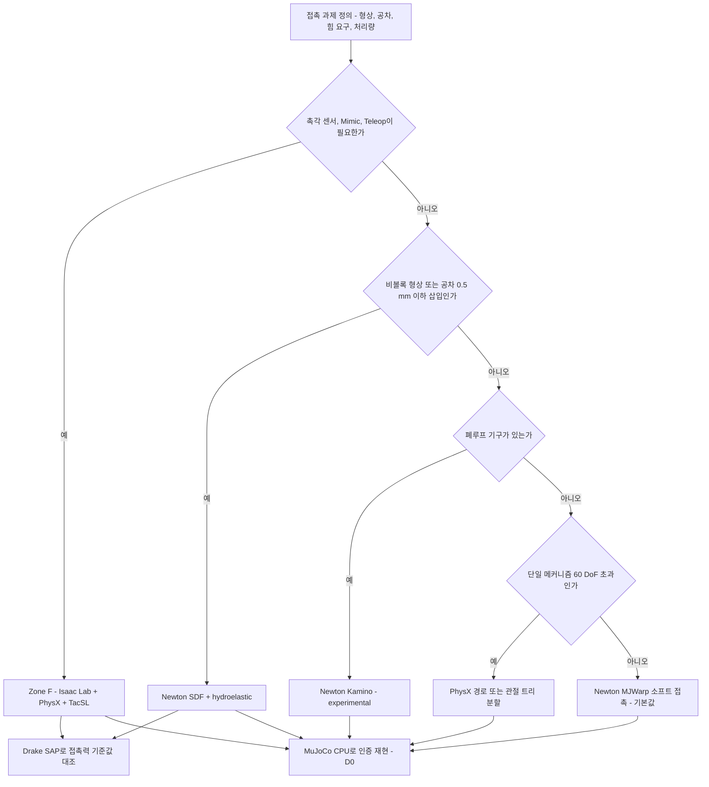

### 3.3 정량 선택 규칙 [A]

| 규칙 | 조건 | 선택 | 근거 |
|---|---|---|---|
| R1 침투 예산 | 정지 상태 침투가 0.5 mm를 넘고 `solref` 단축(timeconst ≥ 2·dt 유지)으로 해소되지 않음 | MJWarp → hydroelastic | 소프트 접촉의 침투가 파지 안정성·삽입 판정을 왜곡 |
| R2 공차 | 삽입 공차 ≤0.5 mm 또는 비볼록 결합부 | hydroelastic(테넌트) / PhysX SDF(팩토리) | 볼록 껍질 근사로는 결합부가 표현되지 않음 |
| R3 힘 인수 기준 | 고객 인수 기준에 접촉력(N)·삽입력 피크가 들어감 | Drake 대조 필수 + F/T 실측 | 힘은 궤적보다 엔진 간 편차가 큼 |
| R4 처리량 | 목표 학습량이 1B env-step 이상이고 R1–R3 해당 없음 | MJWarp | 1B 스텝 RL 비용 KPI(≤$10 P1)를 맞추는 유일한 경로 |
| R5 촉각 | 시각촉각 관측이 정책 입력 | PhysX + TacSL(Zone F). 테넌트는 Kit-less 검증(M6) 전 약속 금지 | TacSL은 Isaac Lab의 PhysX 백엔드 전용 |
| R6 10% 규칙 | 두 후보의 성공률 보정 steps/s/$ 차이가 10% 이내 | 허용형 경로(Zone T 호환) 우선 | DR 베이크오프 결정 규칙 |

### 3.4 엔진 간 파라미터는 이식되지 않는다

같은 이름의 파라미터도 엔진마다 의미가 다르다. MuJoCo는 미끄럼·비틀림·구름 마찰을 타원 콘으로 다루고 반발을 `solref`의 감쇠비로 간접 표현한다. PhysX는 패치 기반 근사 마찰과 명시적 반발계수를 쓴다. Drake는 Hunt-Crossley 소산과 정·동마찰을 쓴다. 그래서 MuJoCo에서 μ = 0.5로 맞춘 물체를 PhysX에 μ = 0.5로 넣으면 다른 궤적이 나온다. 우리는 이를 '파라미터 복사 금지' 규칙으로 막는다. 같은 실측 trial 묶음에 백엔드마다 따로 보정하고, 인증서에 백엔드별 세트를 저장하며, sim2sim 게이트도 각 백엔드의 보정값으로 돌린다.

**표 3-2. 물리량별 엔진 파라미터 대응**

| 물리량 | MuJoCo / MJWarp | Newton(SDF·hydroelastic) | PhysX 5.x(Isaac Sim 6.1 번들 [U]) | Drake |
|---|---|---|---|---|
| 마찰 | `friction[0]` 미끄럼, `[1]` 비틀림, `[2]` 구름, 콘 종류 | 형상 재질 마찰 계수 [A] | `staticFriction`, `dynamicFriction`, 패치 마찰 모드 | `mu_static`, `mu_dynamic`, stiction tolerance |
| 접촉 강성·감쇠 | `solref`(timeconst, dampratio), `solimp`(폭·중점·지수) | 접촉 강성·감쇠, hydroelastic 계수 [A] | `contactOffset`, `restOffset`, 컴플라이언트 접촉 강성·감쇠 | `hydroelastic_modulus`, `hunt_crossley_dissipation` |
| 반발 | `solref` 감쇠비로 간접 | 반발 계수 [A] | `restitution` | 소산 계수로 간접 |
| 기하 해상도 | 볼록 껍질(CoACD), SDF 플러그인 | SDF 격자 해상도 [A] | 볼록 분해 또는 GPU SDF | `resolution_hint` |
| 보정 산출 | 인증서 `aic:phys:backend:mujoco` | `aic:phys:backend:newton` | `aic:phys:backend:physx` | `aic:phys:backend:drake` |

---

## 4. 물리 ③: 변형체·케이블·입상체

**결론: 변형체는 '맞춰야 쓰는 물리'다. 솔버는 Newton VBD·Style3D·ImplicitMPM으로 정했지만, 성능 보증은 실측 보정과 M12 측정 이전에는 하지 않는다.**

물류 폴리백, 공장 케이블·호스, 식품·입상체는 Wave 1의 실제 주문에서 빠질 수 없다. 그러나 어떤 엔진도 변형체 결정론을 보장하지 않고(PhysX는 천·연체에 대해 명시적으로 보장하지 않음), GAUGE는 빠른 직물 운동과 체적 변형에서 가장 큰 갭을 보고했다[U]. 그래서 변형체는 세 가지 장치로 판다. ① 객체 클래스별 표준 보정 프로토콜, ② '통계적 재현(D1)' 라벨, ③ 운영 범위를 명시한 계약 문구다.

**표 4-1. 변형체 클래스별 모델·보정·보증 정책**

| 클래스 | 대표 대상 | 모델 | 1차 솔버 | 폴백·관찰 | 식별할 파라미터 | 보정 프로토콜(§15.3) | 보증 정책 |
|---|---|---|---|---|---|---|---|
| 폴리백·파우치 | 물류 택배 비닐, 지퍼백 | 얇은 막(shell) + 내용물 강체·입상체 결합 [A] | Newton VBD(1.6의 compliant ALM 옵션 포함) | MuJoCo 3.15 flex, PhysX FEM 표면(Zone F) | 막 신축·굽힘 강성, 표면 마찰, 내용물 질량 분포 | 낙하(P-DROP) + 폴리백 전용 P-BAG-v1(집기 처짐, 흡착 들어올림 처짐, P1 제정 [A]) | M12 실측 전 성능 보증 금지. 이후 Gold 프로파일이 있는 SKU만 |
| 케이블·호스 | 커넥터 케이블, 냉장고 호스, 공압 튜브 | 로드(rod) | Newton VBD | MuJoCo cable composite | 선밀도, 굽힘·비틀림 강성, 감쇠 | 케이블 처짐(P-CABLE), 캔틸레버 처짐 | 처짐 오차 ≤5% 실측 확인 후 인수 기준에 포함 [A] |
| 천·직물 | 작업복, 포장 천 | 천(cloth) | Newton Style3D | Newton VBD | 신축·전단·굽힘 강성, 마찰 | 드레이프 형상 Chamfer | 데모·데이터 전용(P3 후보 장면 C21 천 드레이프 통과 전까지) |
| 체적 연체 | 스펀지, 고무 그리퍼 패드, 과일 | 체적 FEM / VBD 연체 | Newton VBD | MuJoCo 3.15 Stable Neo-Hookean(실험), MuJoCo IPC flex 접촉(3.14, 실험), PhysX FEM 체적 | 영률 E, 푸아송비 ν, 감쇠 | 압입(F/T 압자) | 측정된 E·ν 범위 안에서만 |
| 입상체·식품 | 곡물, 스낵, 너트·볼트 벌크 | MPM 입자 | Newton ImplicitMPM | Genesis MPM(관찰) | 입자 크기, 밀도, 내부 마찰각 | 안식각 측정 | 안식각 ±2° 확인 후 [A] |
| 점성 유체 | 소스, 접착제 | MPM 점성 | Newton ImplicitMPM | — | 점도 | 유출 시간 | R&D 전용 |

**변형체 보정의 핵심 기법: 대규모 병렬 식별 [A].** 변형체는 파라미터가 많고 기울기를 얻기 어렵다(MJWarp는 미분 불가, Newton은 Featherstone·SemiImplicit만 기초 미분). 대신 GPU 배치를 '후보 파라미터의 병렬 평가'에 쓴다. 예를 들어 CMA-ES 개체 64개 × 보정 trial 16개 = 1,024개 월드를 한 번에 돌려, 실측 영상에서 복원한 점군 시퀀스와 시뮬 메시 사이의 Chamfer 거리를 최소화한다. 이때 GPU 비결정성은 문제가 되지 않는다. 목적함수가 통계적이기 때문이다. 최종 후보만 D1 등급으로 3개 시드에서 재확인한다.

- **IPC 계열의 위치:** MuJoCo 3.14의 IPC flex 접촉(관통 없음)과 Genesis IPC(libuipc)는 얇은 막의 관통 문제를 풀 수 있는 후보다. 둘 다 실험 단계이므로 P1 베이크오프 추가 과제로만 평가한다[A].
- **인증서 범위:** 변형체 동역학 산출물은 D1이다. 변형체 자산 인증서는 정적 보정 시험(P-CABLE 처짐, 정지 형상)을 MuJoCo CPU cable/flex로 D0 재현한 항목에만 붙이고 'experimental'로 표기한다(§2.1). 입상체·점성 유체는 인증 대상이 아니다.
- **계약 문구:** "변형체 거동은 [운영 범위]에서 측정된 Scorecard 값을 보고하며, 해당 범위 밖의 성능은 보증하지 않는다." 책임 상한은 계약 금액이다(DR PoC 조건).

---

## 5. 물리 ④: 폐루프(Kamino)와 고자유도(60 DoF 초과)

**결론: 폐루프는 Kamino로 열되 'experimental' 표시를 붙여 판다. 60 DoF를 넘는 단일 메커니즘은 MJWarp에 그대로 넣지 않는다.**

### 5.1 폐루프 메커니즘: Kamino

Kamino(Disney Research, arXiv 2603.16536)는 최대좌표계에서 구속 다물체 동역학을 비선형 상보성 문제(NCP)로 GPU에서 푼다. MuJoCo의 소프트 접촉과 달리 하드 접촉 정식화이고, 기구학적 루프와 수동 관절을 직접 다룬다. 중첩 루프 6개를 가진 DR Legs 이족을 단일 GPU에서 4,096개 환경으로 학습시켰다. Newton 1.6에서 쿨롱 마찰, 관절 한계, 배치 기구학이 추가됐다. 상태는 Newton에서 experimental, Isaac Lab에서 beta다.

**표 5-1. 폐루프 처리 옵션**

| 옵션 | 원리 | 장점 | 한계 | 우리 용도 |
|---|---|---|---|---|
| Newton Kamino | NCP 하드 접촉, 루프 직접 표현 | 루프 닫힘 정확, 수동 관절 | 검증 과제 제한, experimental | 4절 링크 평행 그리퍼, 델타 로봇, 링크 다리 |
| MuJoCo equality(connect/weld) | 소프트 제약으로 루프 닫기 | 성숙, CPU 결정론 재현 가능 | 루프 닫힘 오차(드리프트), 강성 튜닝 필요 | Kamino 폴백, 인증 재현 모델 |
| 트리 근사(루프 절단 + 결합 관절) | 루프를 끊고 mimic/tendon으로 결합 | 모든 엔진에서 동작 | 힘 전달 왜곡 | Bronze 자산의 임시 표현 |

- **합격 기준 [A]:** 적합성 장면 C10(백엔드 간 링크 구속 오차 ≤0.5 mm, 파지력 차이 ≤10%, 정본 [04 §4.6](04-system-architecture.md))을 통과하고, 랩 기준으로 루프 닫힘 오차 ≤0.1 mm, 그리퍼 파지력-전류 곡선 실측 대비 ±5%를 만족해야 한다.
- **판매 규칙:** Kamino 기반 템플릿에는 'experimental' 배지를 붙인다. 인증서의 재현 경로는 MuJoCo equality 모델로 따로 보정한다.

### 5.2 60 DoF 초과 메커니즘

MJWarp 문서는 단일 연결 메커니즘이 약 60 DoF를 넘으면 성능이 약해진다고 명시한다. 휴머노이드 본체(약 30–40 DoF [A])에 덱스터러스 핸드 2개(각 약 16–22 DoF [A])를 붙이면 62–84 DoF가 된다. Wave 2(휴머노이드·양팔 VLA 데이터)는 정확히 이 구성을 요구한다.

**표 5-2. 고자유도 대응 옵션과 판정 기준**

| 옵션 | 방법 | 비용 | 판정 기준(T11) [A] |
|---|---|---|---|
| O1 PhysX 경로(Zone F) | Isaac Lab + PhysX 축약좌표 관절 | 산출물 전용, Zone T 미제공 | 기본 후보 |
| O2 관절 트리 분할 | 손을 별도 관절체로 분리하고 손목에 weld/equality로 결합 | 결합부 강성 튜닝, 손목 힘 왜곡 | 결합부 위치 오차 ≤0.5 mm, 손목 토크 오차 ≤10% |
| O3 결합 관절 축소 | 손가락 결합 관절(mimic·tendon)을 독립 DoF에서 제외 | 일부 손에서 거동 단순화 | 손 모델 사양과 일치할 때만 |
| O4 MJWarp 그대로 | 솔버 반복 수 증가 | 처리량 저하 | O1 대비 성공률 보정 steps/s/$ 가 10% 이내일 때만 |

- **결정 시점:** 베이크오프 W7(2026-12-14 ~ 12-20)의 T11 스트레스 테스트로 판정한다. 휴머노이드 + 덱스터러스 핸드 템플릿 출시(P1, M6–M12) 전에 O1–O4 중 기본값을 확정한다.
- **측정 항목:** env-steps/s, VRAM, 제약 위반량, 솔버 실패율, Newton ↔ PhysX ↔ MuJoCo 정책 이전 편차를 잰다. 적합성 장면 C11(관절 궤적 RMSE ≤2°, 발 접촉 타이밍 ≤10 ms)이 회귀 기준이다.

---

## 6. 물리 ⑤: 결정론 정책

**결론: '재현 가능'은 하나의 단어가 아니라 세 개의 등급이다. 인증서는 비트 일치 등급(D0)에서만 발행하고, GPU 배치 산출물은 '통계적 재현'으로 정직하게 표기한다.**

### 6.1 결정론 3등급

**표 6-1. 결정론 등급 정의**

| 등급 | 정의 | 허용 경로 | 고정해야 하는 것 | 검증 방법 | 대외 표기 | 쓰는 곳 |
|---|---|---|---|---|---|---|
| **D0 비트 재현**(`D0_bitwise`) | 같은 입력이면 같은 상태 해시 | MuJoCo 3.15 CPU(float64, 월드당 단일 스레드). Newton 결정론 모드(W7 통과 후, 고정 GPU SKU·드라이버). Chrono CPU·Fossen Warp CPU·PX4 SITL lockstep은 반복 비트 일치 시험 통과와 CTO 등록 후에만(목표 Chrono M22, Fossen M28 [A]) | 엔진 버전·빌드 플래그, CPU 명령어 집합 [A] 또는 GPU SKU, 드라이버(R580 이상의 정확한 빌드), CUDA, 시드, 장면 USD 해시, 자산 인증서 ID | 3회 반복 실행, 100 스텝마다 `qpos`·`qvel`·접촉 상태의 SHA-256 해시 전부 일치 | "결정론적 재현(Deterministic Replay)" | 인증서, 인증 시험, 분쟁 재현, Crucible 회귀 |
| **D1 통계적 재현**(`D1_statistical`) | 같은 설정이면 지표 분포가 같다 | Newton/MJWarp GPU 배치, PhysX, VBD·flex·cable 동역학, MPM, D0 등록 전의 Chrono·Fossen·PX4 SITL | 시드, GPU SKU, 드라이버, env 수, decimation, 솔버 설정 | 시드 3개 × 에피소드 1,024개 이상 [A]. 성공률 차이 ≤2%p이고 95% 신뢰구간이 겹침 | "통계적 재현(statistically reproducible)" | 데이터셋, 학습 정책, 벤치마크, 변형체 산출물 |
| **D2 비재현(생성형)**(`D2_generative`) | 같은 시드라도 출력 동일성을 보장하지 않음 | Cosmos 증강, VLM 물성 추정 | 모델 가중치 해시, 시드, 프롬프트·제어 맵 해시 | 라벨 일관성 QA 통과 여부만 보장(§12) | "생성형 증강 프레임" | L4 증강 프레임, Bronze 물성 사전분포 |

- **토큰 정본:** 결정론 등급은 Run Manifest 필드 `D0_bitwise` / `D1_statistical` / `D2_generative` / `none`으로 기록한다(DR §4.1). `none`은 등급 판정 대상이 아닌 실행(디버그·미리보기)이다. 인증서의 `aic:det:class`도 같은 토큰을 쓴다.

### 6.2 GPU 비결정성은 왜 생기는가

- **원자적 누적:** MJWarp는 접촉력·제약 누적에 atomics를 쓰므로 부동소수 덧셈 순서가 실행마다 달라진다. float32에서는 이 차이가 수백 스텝 뒤 궤적 분기로 커진다.
- **PhysX의 범위:** 같은 하드웨어·같은 버전의 강체·관절 장면만 결정론이다. GPU 모델이 바뀌거나 천·연체가 들어가면 보장이 없다(Isaac Lab 재현성 문서).
- **실측 보고:** GPUSimBench는 주요 GPU 배치 시뮬레이터 전반에서 실행 간·환경 간 비결정성을 보고했다[U].
- **결론:** 데이터셋·정책 같은 대량 산출물에 비트 재현을 약속하는 것은 기술적으로 거짓이다. 우리는 그 대신 D0 재현이 가능한 '인증 시험 장면'을 따로 두고, 대량 산출물은 D1로 표기한다.

### 6.3 Newton 결정론 모드 검증(베이크오프 W7, 2026-12-14 ~ 12-20)

Newton v1.4.0은 반복 롤아웃의 비트 일치를 위한 결정론 실행 경로를 추가했고, '하드웨어 간 이식 가능' 결정론도 주장한다. 후자는 미시험이다[U]. W7에서 아래 매트릭스로 판정한다.

**표 6-2. Newton 결정론 모드 시험 매트릭스**

| 시험 | 조건 | 합격 기준 | 불합격 시 |
|---|---|---|---|
| N1 동일 GPU 반복 | RTX PRO 6000 1장, 3회 반복, 적합성 장면 C01–C05 | 100 스텝 해시 100% 일치 | Newton D0 불허, MuJoCo CPU만 |
| N2 GPU 간 | RTX PRO 6000 vs H100 vs L40S | 해시 일치 | D0를 'GPU SKU 고정'으로 한정, 인증서에 SKU 기록 |
| N3 env 수 독립성 | 월드 1개 vs 4,096개 중 0번 월드 | 해시 일치 | 인증 재현은 단일 월드 실행으로 고정 |
| N4 드라이버 마이너 | R580 계열 마이너 2종 | 해시 일치 | 드라이버 빌드를 인증 재현 이미지에 고정 |
| N5 처리량 비용 | 결정론 모드 on/off | steps/s 저하율 측정(판정 아님) | 인증 시험에만 사용, 학습은 off |

- **P0 운용:** 결정 메모(2027-01 첫 주) 전까지 인증 재현은 MuJoCo CPU 단독으로 한다. 인증 시험 결정론적 재현율 100%(G0 조건 ④)는 이 경로로 달성한다.
- **LIGHT 풀 사용:** MuJoCo CPU 재현은 GPU가 필요 없으므로 LIGHT 풀(L4·CPU)에서 실행한다. 인증 원가를 낮추는 구조적 이점이다.
- **다른 D0 후보 경로:** Chrono CPU·클린룸 Fossen(Warp CPU)·PX4 SITL lockstep은 N1–N4와 동등한 반복 비트 일치 시험(04 §4.6의 DT-5)을 통과하고 CTO가 등록해야 D0 목록에 들어간다. 시험 매트릭스는 이 표의 N1·N3·N4를 CPU 경로에 맞게 바꿔 쓴다(N2 대신 CPU 명령어 집합 고정).

**그림 3. 인증 재현 시퀀스**

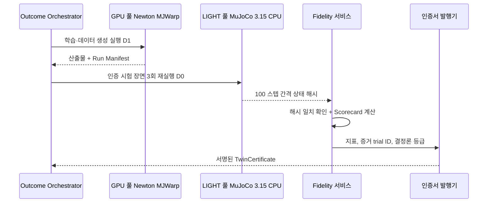

### 6.4 Run Manifest의 결정론 필드

| 필드 | 예시 | 용도 |
|---|---|---|
| `det.class` | `D0_bitwise` / `D1_statistical` / `D2_generative` / `none` | 대외 표기 자동 결정(DR §4.1 정본 토큰) |
| `engine` | `mujoco==3.15.0`, `newton==1.6.1`, `warp-lang==1.18.0` | 재현 이미지 선택 |
| `hw.gpu_sku`, `hw.driver`, `hw.cuda` | `RTX PRO 6000 Blackwell`, `580.xx`, `13.x` | D0(Newton) 조건 확인. Warp 1.18 휠은 Turing(sm_75) 이상 GPU와 R580 이상 드라이버(CUDA 13)가 필요하다 |
| `sim.dt`, `sim.substeps`, `sim.num_envs` | `0.005`, `4`, `4096` | D1 재현 조건. `substeps`는 제어 1회당 물리 스텝 수(= decimation, 04 Kernel API) |
| `seeds` | `[17, 29, 43]` | D1 재현 |
| `scene.usd_hash`, `assets[].cert_id` | SHA-256, UUID | 입력 동일성 |
| `replay.hash_chain` | 100 스텝 간격 해시 목록의 머클 루트 [A] | D0 대조 |

### 6.5 대외 문구 규칙

- **금지 문구:** "완전 재현", "어떤 GPU에서도 동일", "결정론적 데이터셋"은 쓰지 않는다.
- **허용 문구:** D0 → "인증 시험은 결정론적으로 재현됩니다(MuJoCo 3.15 CPU 기준)". D1 → "통계적으로 재현됩니다(시드·GPU·드라이버는 Run Manifest 참조)". 변형체 인증 항목 → "정적 보정 시험 항목만 결정론적으로 재현됩니다(experimental)".
- **검토자:** 마케팅·IR·정부과제 문서의 재현성 문구는 Head of Fidelity & Evaluation이 승인한다.

---

## 7. 물리 ⑥: 보정(Calibration)

**결론: 보정은 네 단의 사다리다. VLM 사전분포에서 출발해 영상 식별, 랩 실측으로 올라가고, 접촉이 승부인 부품은 Drake로 한 번 더 교차 검증한다. 모든 값에는 출처와 불확도가 붙는다.**

### 7.1 파라미터 × 출처

**표 7-1. 파라미터군별 보정 출처**

| 파라미터군 | Bronze 출처 | Silver 출처 | Gold 출처 | 도구 |
|---|---|---|---|---|
| 기하·스케일 | 피드포워드 메트릭 깊이 | + 촬영 가이드의 기준 카드(크기 기지) [A] | + 참조 스캔 대비 Chamfer 검증 | MapAnything, DA3-Metric, gsplat |
| 질량 | VLM 범주 밀도 × 체적 | 힘 정보가 있으면 식별(로봇 들어올림 관절 토크·F/T), 없으면 사전분포 유지 + 불확도 표기 | 정밀 저울(0.1 g) | VLM, MuJoCo sysid 툴박스 |
| 질량중심·관성 | 균질 밀도 가정 | 기울임·회전 거동 영상으로 COM 오프셋 | 3점 로드셀(COM), 이선 진자(관성) | 자체 지그 |
| 정·동마찰 | 재질 표(VLM 재질 분류) | 경사·밀기·미끄럼 영상: 감속도로 동마찰 | 경사판 미끄럼 개시각 + 밀기 F/T | MuJoCo sysid, 자체 피팅 |
| 반발 | 재질 표 | 낙하 영상의 반발 높이 | 고속 카메라(240 fps 이상) 낙하 | 자체 피팅 |
| 접촉 강성·감쇠 | 엔진 기본값 | 낙하·밀기 궤적 피팅 | F/T 압입 + Drake 대조 | Drake, MuJoCo sysid |
| 관절(문·서랍·뚜껑) | 기본 감쇠·마찰 | 상호작용 영상 궤적 | 토크 게이지 | Articulate-Anything + 자체 피팅 |
| 로봇 액추에이터 | 데이터시트 | 모터 로그 기반 DC 모터·PID 모델 | 액추에이터 네트워크(§7.4) | MuJoCo 3.7 DC 모터, 3.12 PID, Isaac Lab 액추에이터 넷 |
| 변형체 | 클래스 기본값 | 영상 형상 매칭(§4) | 처짐·압입 실측 | 배치 병렬 CMA-ES |

**영상만으로는 질량을 식별할 수 없다.** 운동학 궤적은 힘을 모르면 질량과 무관하게 같은 모양이 나올 수 있다(예: 평면 미끄럼 감속도 a = μ_d·g는 질량에 무관하다). 그래서 Silver 질량은 힘 정보(로봇 관절 토크, F/T)가 있을 때만 '식별'로 표기하고, 없으면 사전분포 값을 불확도와 함께 둔다. 반대로 마찰은 영상만으로 식별할 수 있다. 이 구분은 인증서의 `source` 필드에 그대로 기록된다.

### 7.2 보정 파이프라인

**그림 4. 보정 사다리**

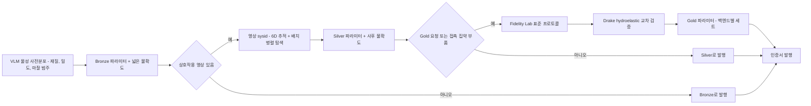

### 7.3 식별 목적함수와 최적화

```math
\theta^{*}=\arg\min_{\theta}\sum_{k\in\mathcal{T}}\sum_{t}\Big(w_p\lVert \hat p_t^{k}(\theta)-p_t^{k}\rVert^2+w_R\,d_{\mathrm{geo}}(\hat R_t^{k}(\theta),R_t^{k})^2+w_F\lVert \hat F_t^{k}(\theta)-F_t^{k}\rVert^2\Big)+\lambda(\theta-\theta_0)^{\top}\Sigma_0^{-1}(\theta-\theta_0)
```

- **기호:** θ = 식별 대상 파라미터(질량, COM, μ_s, μ_d, 반발, 접촉 강성·감쇠). 𝒯 = 보정 trial 집합. p, R = 추적한 위치·자세, F = F/T 측정 힘(없으면 w_F = 0). θ₀, Σ₀ = VLM 사전분포의 평균·공분산(베이지안 MAP 정규화).
- **1단계(전역 탐색):** CMA-ES. 개체 64 × trial 16 = 1,024 월드를 MJWarp 배치로 동시 평가 [A]. 비결정성은 목적함수 잡음으로 흡수.
- **2단계(국소 정제):** MuJoCo 3.5부터 들어온 sysid 툴박스로 MuJoCo CPU에서 유한차분 기반 정제. D0 경로이므로 결과 재현 가능.
- **3단계(불확도):** 상위 개체 앙상블 또는 라플라스 근사로 σ 추정 → 인증서 `±σ` 필드.
- **4단계(백엔드 전개):** 같은 trial 집합으로 Newton·PhysX 파라미터를 각각 재피팅(§3.4). 백엔드 간 궤적 ADE 차이를 게이트로 확인.
- **보류 검증:** 보정에 쓰지 않은 trial 20% [A]로 ADE/FDE를 계산해 Scorecard에 기록. 보정 trial로 계산한 오차는 Scorecard에 쓰지 않음.

### 7.4 액추에이터 네트워크

고객 로봇 셀의 sim-to-real 갭은 물체보다 로봇 쪽에서 더 크게 나는 경우가 많다. 기어 백래시, 전류 제한, 마찰 손실, 통신 지연이 원인이다. 절차는 다음과 같다.

1. **가진 데이터 수집:** 관절별 처프·PRBS 지령 약 20분 [A], 500 Hz 이상으로 지령 위치, 측정 위치·속도, 전류(토크) 기록(MCAP).
2. **지연 식별:** 지령-응답 교차상관으로 지연 추정. 시뮬에 관측·행동 지연 주입.
3. **파라메트릭 모델 우선:** MuJoCo 3.7 DC 모터 모델, 3.12 PID 액추에이터로 먼저 맞춤. 잔차가 허용치(토크 RMSE ≤10% [A])를 넘을 때만 네트워크로 승급.
4. **액추에이터 넷:** 과거 위치 오차·속도 이력(3 스텝 [A])을 입력으로 토크를 출력하는 MLP 또는 LSTM. Isaac Lab의 액추에이터 넷 인터페이스로 학습 루프에 투입.
5. **검증:** 보류 궤적에서 관절 추종 RMSE 비교, 정책 sim2sim 게이트 재실행.
6. **P2 확장:** 실측 로그에서 행동 보정량을 학습하는 delta-action 보정(ASAP 방식)과 잔차 RL을 Sim2Real 키트에 추가([07 학습 모듈](07-training-module.md)).

### 7.5 영상 기반 마찰·질량 식별 절차

| 단계 | 내용 | 기준 [A] |
|---|---|---|
| 1 촬영 | 스마트폰 또는 셀 카메라 2–3대, 120 fps 이상 권장, 물체를 밀기·기울이기·떨어뜨리기 각 3회. Forge 촬영 가이드 앱이 동작을 안내 | 프레임당 물체 점유 ≥5% |
| 2 6D 추적 | Forge 메시로 렌더-비교(render-and-compare) 자세 추적, 기준 카드로 스케일 고정 | 재투영 오차 ≤1 px |
| 3 이벤트 정렬 | 접촉 시작·이탈·정지 시점을 가속도 피크로 검출해 시뮬 초기 조건과 정렬 | 정렬 오차 ≤1 프레임 |
| 4 피팅 | §7.3 목적함수(w_F = 0). 마찰·반발·COM 오프셋 식별, 질량은 힘 정보가 있을 때만 | 보류 trial ADE ≤3 cm면 Silver 자격 |
| 5 기록 | `source = video`, σ, trial ID를 인증서에 저장 | — |

### 7.6 Drake를 기준(gold standard)으로 쓰는 절차

Drake는 진실이 아니다. 진실은 실측이다. Drake는 실측이 비싸거나 불가능한 조건(미세 오프셋 조합, 파손 위험 조건)에서 실측을 '보간'하는 가장 엄밀한 대리 모델이다.

1. 커넥터·페그 같은 접촉 집약 부품의 Drake 모델을 hydroelastic 컴플라이언트 형상으로 구성.
2. Fidelity Lab 삽입 trial(P-INS)의 F/T 궤적으로 Drake의 `hydroelastic_modulus`·`hunt_crossley_dissipation` 보정.
3. 보정된 Drake로 실측하지 않은 오프셋·기울기 조합 50개 [A]에서 기준 접촉력·성공 판정 생성.
4. Newton hydroelastic, PhysX SDF 파라미터를 실측 + Drake 기준에 함께 피팅.
5. **합격 기준 [A]:** 피크 삽입력 오차 ≤15%, 성공·실패 판정 일치 ≥95%.
6. 분쟁 시 3차 의견으로 Drake 재계산 결과를 첨부.

---

## 8. 물리 ⑦: 적합성 스위트(Conformance Suite)

**결론: 적합성 스위트는 '엔진이 바뀌어도 우리 결과는 바뀌지 않는다'는 증명서다. 모든 엔진 업그레이드와 릴리스 트레인은 이 스위트를 통과해야 병합된다.**

### 8.1 장면 목록(정본 C01–C15)과 05의 랩 기준

**장면 번호·장면·허용치의 정본은 [04 §4.6](04-system-architecture.md)의 C01–C15다.** 이 절은 04의 허용치를 그대로 옮기고, 이 문서가 더하는 랩 기준값(Fidelity Lab 측정 프로토콜, §15.3)과 도입 시점만 덧붙인 보충표다. 허용치 최종값은 베이크오프 W2 측정 후 결정 메모(2027-01 첫 주, 목표 2027-01-08)에서 하나로 고정한다[A]. 'N×M' KPI는 백엔드 N개 × 장면 M개이며, 적용 불가 조합은 매트릭스에 N/A로 명시하고 적용 가능한 조합은 전부 통과해야 한다. 단계별 장면 수는 P0 C01–C05, P1 C01–C08, P2 C01–C12, P3 C01–C15다.

**표 8-1. 적합성 장면(정본 04 §4.6)과 05가 더하는 랩 기준**

| C-ID | 장면(04 §4.6) | 도입 | 허용치(정본, 04 §4.6) [A] | 05가 더하는 랩 기준값·측정 프로토콜 [A] | 판정 방식 | 구 05 번호 |
|---|---|---|---|---|---|---|
| C01 | 낙하 박스(1 kg, 10 cm 정육면체, 1 m 낙하) | P0 | 자유낙하 위치: 이산 적분기 해 대비 ≤1e-6 m 또는 연속 해석해 대비 ≤3 mm(dt = 1 ms) / 정지 후 관통 ≤1 mm / 정지 드리프트 ≤0.5 mm/s / 백엔드 간 정지 자세 ≤2 mm·1° | P-DROP-v1: 첫 반발 높이 랩 실측 대비 ±10%(보조 지표, KPI 판정 밖) | D0 비트 재현 + 허용치 | S1 |
| C02 | 진자(1 m, 1 kg, 10°·60°) | P0 | 주기 ≤0.5%(10°는 소각 해석해, 60°는 타원적분 정확해 대비) / 10초 에너지 드리프트(무감쇠) ≤1% / 백엔드 간 각도 RMSE ≤1° | 해석해만 사용(랩 불필요). PhysX는 각감쇠·관절 마찰 0을 명시 | D0 + 허용치 | S2 |
| C03 | Franka 픽(스크립트 관절 궤적, 5 cm 큐브) | P0 | 파지 성공 10/10 / 리프트 중 미끄럼 ≤5 mm / EE 궤적 ADE(백엔드 간) ≤5 mm / 관절 토크 상대차 ≤10% | Test Cell 1 파지 trial로 미끄럼 기준 교차 확인(P1) | D0(MuJoCo CPU)·D1(GPU) | S3 |
| C04 | 폴리백(VBD vs MuJoCo flex) | P0 | 정지 형상 Chamfer ≤15 mm / 100시드 파지 성공률 차이 ≤15%p(통계적, 결정론 요구 없음) | P-BAG-v1(P1 제정): 정지 위치 분포 KS 검정 p ≥0.05 | 통계 판정(D1) | S4 |
| C05 | 바퀴 차량(4륜 AMR, 1 m/s + 0.5 rad/s, 10초) | P0 | 최종 위치 ≤5 cm, 요 ≤3°(백엔드 간) | 바닥재별 마찰 실측(에폭시·콘크리트), 해석적 차동 구동 운동학과 대조 | D0 + 허용치 | S5 |
| C06 | 관절 서랍 열기 | P1 | 힘-변위 곡선 RMSE ≤10% | 토크 게이지 실측(§7.1 관절 행) | D0·D1 | — |
| C07 | 페그 삽입(공차 0.5 mm) | P1 | 접촉력 피크 vs Drake ±20% / 100시드 성공·실패 판정 일치 ≥95% | P-INS-v1 실측으로 보정한 Drake 기준(§7.6: Drake 보정 합격은 피크 삽입력 오차 ≤15%) | D0·D1 | S7 |
| C08 | 한국 SKU 빈 클러터(30개, 5초 정착) | P1 | 관통 ≤2 mm / 폭발(속도 >10 m/s) 0건 | Forge 9단계 물리 QA와 같은 자산 세트 | D0·D1 | — |
| C09 | 케이블 삽입 | P2 | 끝점 궤적 ADE ≤10 mm / 성공률 차이 ≤15%p | P-CABLE-v1로 보정한 로드 파라미터 사용 | 통계 판정(D1) | — |
| C10 | Kamino 폐루프 그리퍼 | P2 | 링크 구속 오차 ≤0.5 mm / 파지력 차이 ≤10% | 실측 그리퍼 기준 루프 닫힘 ≤0.1 mm, 파지력-전류 곡선 ±5%(§5.1) | D1(MuJoCo equality로 D0 재현) | S9 |
| C11 | 휴머노이드 + 양손(60 DoF 초과) 정지·보행 1주기 | P2 | 관절 궤적 RMSE ≤2° / 발 접촉 타이밍 ≤10 ms | T11 결합부 위치 오차 ≤0.5 mm(§5.2 O2) | D1(MuJoCo CPU 분할 모델로 D0 재현) | S10 |
| C12 | 차량 정상상태 선회(Mobility Pack α) | P2 | 정상 선회 반경·요레이트 ≤3%, ≤3% | 실차·야드 차량 로그(P2, 디자인 파트너) [A] | D1(Chrono D0 등록 전) | — |
| C13 | 선박 6-DOF 롤 감쇠(Fossen) | P3 | 롤 주기·감쇠비 해석해 대비 ≤2%, ≤5% | 수조 시험 또는 문헌 대비 롤 주기 ±3%, 감쇠비 ±10% [U] | D1(Fossen D0 등록 전, 목표 M28 [A]) | S15 |
| C14 | 쿼드로터 호버·스텝 응답(PX4 SITL) | P3 | 고도 오버슈트 ≤5%, 정착 시간 ≤10% | 드론 템플릿(P2, M20–M24) 회귀 장면으로 먼저 운영 | D1(lockstep D0 등록 전) | — |
| C15 | SCM 지형 침하(오프로드 UGV) | P3 | 침하 깊이 실측 대비 ≤15% | 토조 침하 실측 [A] | D1 | — |

**표 8-1b. C16+ 확장 후보(05에만 있던 장면, KPI 미집계)**

아래 장면은 04 §4.6에 편입되기 전까지 '보조 장면'으로 야간 CI에서 돌리되, 단계별 '백엔드 × 장면' KPI에는 세지 않는다. 번호는 후보 번호이며 04 §4.6 편입 시 확정한다.

| 후보 ID | 장면 | 지표 | 허용치 [A] | 기준값 출처 | 판정 방식 | 도입 | 구 05 번호 |
|---|---|---|---|---|---|---|---|
| C16 | 경사면 미끄럼 | 미끄럼 개시각, 가속도 | ±1°, ±5% | 해석해 + P-SLIDE-v1 | D0 | P1 | S6 |
| C17 | 케이블 처짐(정적) | 중앙 처짐 오차 | ≤5% | 현수선 해 + P-CABLE-v1 | D0(MuJoCo CPU cable, 변형체 인증서의 정적 항목) | P1 | S8 |
| C18 | 박스 5단 적재 | 10초 후 붕괴 판정 일치, 변위 | 일치 100%, ≤3 mm | 랩 | D0 | P2 | S11 |
| C19 | AMR·차량 타이어 슬립 | 슬립 비-구동력 곡선 | 곡선 RMSE ≤10% | Chrono | D1 | P2 | S12 |
| C20 | 입상체 붓기 | 안식각 | ±2° | 랩 | D1 | P3 | S13 |
| C21 | 천 드레이프 | 형상 Chamfer | ≤5 mm | 랩 | D1 | P3 | S14 |

- **구 번호 대응:** S1→C01, S2→C02, S3→C03, S4→C04, S5→C05, S7→C07, S9→C10, S10→C11, S15→C13. S6·S8·S11·S12·S13·S14는 C16–C21 후보다. 다른 문서가 인용한 '05 S12'(타이어 슬립)는 C19 후보, '05 S15'(수조 기준)는 C13의 랩 기준, '05 S12 확장'(지형)은 C15를 뜻한다. S 번호는 더 쓰지 않는다.
- **허용치가 달라진 장면:** C01은 연속 해석해 대비 1e-4 m 기준을 쓰지 않는다. 반암시적 Euler의 1 m 낙하 오차가 약 ½·g·dt·t = 2.2 mm(dt = 1 ms)라서 어떤 백엔드도 통과할 수 없기 때문이다. 옛 05의 정지 자세 ≤2 mm·1°는 C01의 '백엔드 간 정지 자세'로 흡수됐다. C05·C07·C10·C13은 04의 허용치를 KPI 판정에 쓰고, 05의 값은 '랩 기준' 열에서 실측 대비 보조 지표로만 쓴다.

### 8.2 단계별 백엔드와 적용 매트릭스

- **P0(3개):** Newton/MJWarp, MuJoCo 3.15 CPU, Isaac Lab 3.x + PhysX(Zone F). 베이크오프 W2의 '× 5개 백엔드'는 실행 구성 B1–B5이며, B1·B2·B5는 같은 Newton/MJWarp 계열이므로 KPI '3×5'의 백엔드 3개는 Newton/MJWarp 계열·PhysX·MuJoCo CPU의 통과 수로 센다.
- **P1(4개):** + Drake v1.57(오프라인 접촉 기준, 접촉 장면만).
- **P2(5개):** + Chrono 10(Mobility Pack α, M18–M24).
- **P3(6개):** + 자체 Fossen 6-DOF 해양 모듈(Wave 3, 해양 장면 C13). PhysX SDK 소스 어댑터가 P2 조건으로 착수되면 추가 백엔드로 세되, 6×15 KPI는 Fossen을 포함한 6개 기준으로 판정한다.
- **브리지는 백엔드가 아니다:** FMU(FMI 3.0)와 PX4 SITL은 공동 시뮬레이션 브리지라 백엔드 수에 넣지 않는다. C14는 PX4 SITL 브리지 위에서 돌지만 KPI의 백엔드 수에는 영향을 주지 않는다.

**표 8-2. 장면 × 백엔드 적용 매트릭스(● 적용, ○ 통계 판정, — N/A, 적용 백엔드의 정본은 04 §4.6)**

| 장면 | Newton/MJWarp | MuJoCo CPU | PhysX(Isaac Lab) | Drake | Chrono | Fossen | 브리지(PX4 SITL·FMU, 미집계) |
|---|---|---|---|---|---|---|---|
| C01 낙하 박스 | ● | ● | ● | ● | ● | — | — |
| C02 진자 | ● | ● | ● | ● | ● | — | — |
| C03 Franka 픽 | ● | ● | ● | — | — | — | — |
| C04 폴리백 | ○ | ○ | ○ | — | — | — | — |
| C05 바퀴 차량 | ●(관절 휠) | ● | ●(Vehicle2, Zone F) | — | — | — | — |
| C06 관절 서랍 | ● | ● | ● | — | — | — | — |
| C07 페그 삽입 | ●(SDF·hydro) | — | ● | ● | — | — | — |
| C08 한국 SKU 빈 클러터 | ● | ● | ● | — | — | — | — |
| C09 케이블 삽입 | ○ | — | ○ | — | — | — | — |
| C10 Kamino 그리퍼 | ●(Kamino) | ●(equality) | — | — | — | — | — |
| C11 휴머노이드 + 양손 | ●(분할) | ● | ● | — | — | — | — |
| C12 차량 정상 선회 | — | — | ●(Vehicle2, Zone F) | — | ● | — | — |
| C13 선박 롤 감쇠 | — | — | — | — | ○(FSI) | ● | — |
| C14 쿼드로터 호버 | — | — | — | — | — | — | ●(PX4 SITL) |
| C15 SCM 지형 침하 | — | — | — | — | ● | — | — |

- **Fossen 열의 '—':** 클린룸 Fossen 모듈은 선체 6-DOF 동역학 전용이라 강체 일반 장면(C01·C02)에는 적용하지 않는다(04 §4.6의 '전체'는 강체 일반 백엔드를 뜻한다).
- **C07의 MuJoCo CPU:** 삽입 과제의 인증 재현 후보(MuJoCo CPU + SDF 근사, §2.1 4행)를 확인하는 참고 실행으로 돌리되, 04 §4.6 적용 백엔드에 없으므로 KPI 판정 조합에는 넣지 않는다.

### 8.3 CI 운영 절차

1. **야간 실행:** LIGHT 풀에서 MuJoCo CPU·Drake 장면을, RT/TRAIN 풀의 소형 슬롯에서 GPU 백엔드 장면을 돌린다. C16+ 후보 장면도 같은 야간 실행에 넣는다. 전체 스위트 실행 시간은 ≤2시간이다[A].
2. **업스트림 릴리스 감지:** Newton·MuJoCo·Warp·Isaac Lab·Drake의 새 태그를 매일 감시하고, 사이드 브랜치에서 7일 안에 스위트를 돌린다[A].
3. **판정:** 적용 조합이 전부 통과하면 트레인 후보로 등록한다. 1개라도 실패하면 원인을 분류(엔진 회귀 / 우리 어댑터 / 허용치 재검토)해 이슈로 등록하고, 엔진 회귀는 업스트림에 보고한다.
4. **채택:** 트레인 후보는 인증 재현 회귀(기존 인증서 표본 50개 [A]의 D0 재실행)를 통과해야 병합한다. 채택 지연 KPI는 P1 ≤45일, P2–P3 ≤30일이며, 새 엔진 릴리스를 사이드 브랜치에서 검증 완료 후보로 만들기까지의 일수로 잰다. 프로덕션 반영은 다음 릴리스 트레인에서 한다.
5. **공개:** 사내 벤치마크(steps/s/$, 보상 도달 시간)를 P0 10개 과제로 시작해 P1 분기, P2·P3 월간으로 갱신한다.

### 8.4 정책 수출 전 sim2sim 게이트(2단 구조)

**게이트의 정본은 [07 §7.3](07-training-module.md)의 2단 구조다.** 이 절은 물리 쪽 관점에서 같은 기준을 옮긴다. DR KPI '수출 전 sim2sim 게이트 적용률 100%'는 Tier 1 기준이다.

| 단 | 적용 대상 | 교차 백엔드 | 절차와 합격 기준 [A] | 불합격 시 |
|---|---|---|---|---|
| **Tier 1: 수출 차단 게이트** | 모든 정책(수출 전 적용률 100%) | Zone F 정책: PhysX·Newton·MuJoCo CPU 3개. Zone T/S 정책: Newton·MuJoCo CPU 2개(조건부 PhysX SDK 소스 어댑터 편입 시 3개) | 학습 백엔드에서 1,000 에피소드 → 교차 백엔드에서 같은 정책·같은 시드 집합: 성공률 차이 ≤10%p, 평균 반환 비율 ≥0.85 → 지연·노이즈 주입 후 성공률 하락 ≤15%p → ONNX(opset 고정) 변환 후 행동 최대 오차 ≤1e-3 | 수출 차단. 원인 분류(물리 의존·과적합·수치) 후 SKILL 라인에 반려 |
| **Tier 2: 인증 등급 게이트** | 로봇-과제 인증서·Crucible 공식 캠페인 대상 정책 | Tier 1과 같은 게이트 백엔드 전부 | Tier 1 통과 후 같은 초기 조건 200개: 백엔드 쌍별 성공률 차이 ≤5%p, 관절 궤적 RMSE ≤0.05 rad | 인증 보류. '백엔드 과적합' 플래그 → 접촉 파라미터 도메인 랜덤화 폭 확대 후 재학습, 또는 고객 승인하에 운영 범위 축소 |

- **각 백엔드는 자기 보정값으로 돈다:** 게이트의 각 백엔드는 자산 인증서의 백엔드별 파라미터 세트(§3.4)로 실행한다. 파라미터를 복사해 돌린 결과는 게이트 판정에 쓰지 않는다.
- **KPI:** Tier 1 적용률 100%(P0–P3)다. 게이트를 건너뛴 정책은 Jetson 수출 파이프라인이 거부한다. Tier 2는 인증 대상에만 적용하며 인증서의 `aic:conf` 필드에 결과를 남긴다.
- **왜 두 단인가:** 모든 정책에 5%p를 걸면 변형체·접촉 과제의 PoC 반복이 막히고, 인증서에 10%p를 허용하면 인증의 의미가 흐려진다. 납품 속도는 Tier 1이, 인증의 엄격성은 Tier 2가 지킨다.

---

## 9. 현실감 ①: 4계층 현실감 스택

**결론: 현실감은 하나의 렌더러가 아니라 네 개의 층이다. 층마다 닫는 갭과 재는 지표가 다르므로, 투자도 층별 'Scorecard 개선 / GPU-시간'으로 배분한다.**

### 9.1 계층 개요

**표 9-1. 4계층 현실감 스택**

| 계층 | 닫는 갭 | 핵심 기술(2026-10) | 라이선스 | 구역 | 측정 지표 | 담당 |
|---|---|---|---|---|---|---|
| **L1 물리 기반 메시·재질** | 재질의 빛 반응, 형상, 질량·마찰 스키마 | MDL(RTX), MaterialX 1.39.x, OpenPBR 1.0, UsdPhysics + newton/mjc/physx 스키마 | MaterialX·OpenPBR Apache-2.0, MDL SDK BSD-3 [U] | F·T·S(MDL은 RTX 경로) | 컬러 차트 색차 ΔE2000, mAP 비율 | WS3 + 테크니컬 아티스트 |
| **L2 신경 재구성 배경** | 대상 현장의 배경·조명·클러터 | gsplat 1.6.0, 3DGRUT 2.0(3DGUT), fVDB Reality Capture, `UsdVolParticleField3DGaussianSplat`, glTF `KHR_gaussian_splatting`(비준) | Apache-2.0 | F·T·S | 보류 뷰 PSNR/SSIM/LPIPS | WS2 Forge |
| **L3 보정 센서** | ISP·노이즈·왜곡·거리·강도 | 팩토리: RTX 카메라(PPISP)·OmniLidar·OmniRadar. 테넌트: 자체 Warp Sensor Library. 공통: 디바이스 실측 프로파일 | RTX는 NVIDIA 독점(Zone F), Warp 라이브러리는 자체 | F / T·S | 라이다 거리 오차, 노이즈 PSD, Chamfer | WS3 |
| **L4 생성형 증강** | 날씨·조명·마모·질감의 외형 다양성 | Cosmos Transfer 2.5(P1 DATA 라인 M5–M8) → Cosmos 3 Nano 16B(M9부터 파인튜닝) | Transfer 2.5 가중치 NVIDIA Open Model License, Cosmos 3 OpenMDW-1.1 | F 우선, T·S는 법률 검토 V7 후 | 라벨 일관성 통과율, 증강 전후 mAP 증분 | WS3 + WS5 |

**그림 5. 하나의 스테이지에서 네 계층이 결합되는 방식**

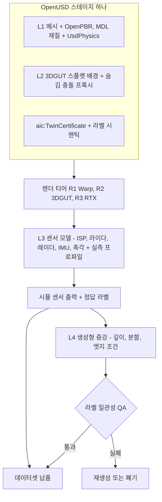

### 9.2 L1: 물리 기반 메시·재질

- **정준 재질:** 마켓플레이스 자산의 정준 재질은 MaterialX 기반 OpenPBR. RTX 경로는 MDL로 변환. TRELLIS.2 같은 생성형 출력의 기본 metallic-roughness는 Forge가 OpenPBR로 승급.
- **실측 재질 워크플로 [A]:** ColorChecker와 균일광원(D65 + 현장 조명)으로 보정된 카메라 촬영 → 스플랫·메시 위 역렌더링으로 기본색·거칠기 피팅 → ΔE2000 ≤3을 Silver 재질 기준으로 사용.
- **센서 대역 재질 표 `aic:SensorMaterial` [A]:** OpenPBR은 가시광만 다룸. 라이다(905 nm, 1550 nm) 반사율, 레이더 대역(차량 77 GHz, 해양 X-band) 유전율 등급·RCS 계수, 열적외선(8–14 μm) 방사율을 재질별로 추가. 측정은 반사율 타깃 10/50/90%와 라이다 강도 보정으로.
- **한국 SKU 특수성:** 라면·과자 포장의 유광 필름, 인쇄 한글, 반사 금속 캔. 정반사·필름 재질 프리셋을 한국 콘텐츠 라이브러리 자산으로 관리.
- **같은 prim의 물리:** `PhysicsMassAPI`, `PhysicsCollisionAPI`, `PhysicsMaterialAPI` + 엔진별 스키마 + 인증서 API를 하나의 prim에 적용. 시각과 물리가 같은 자산 해시를 공유하므로 인증서가 둘을 함께 보증.

### 9.3 L2: 신경 재구성 배경

- **NeRF가 아니라 3DGUT인 이유:** 3DGS 계열은 원래 NeRF 대비 렌더 100–200배 빠름. 3DGUT은 어안·롤링셔터 같은 로봇·차량 카메라 왜곡을 다룸. OpenUSD ParticleField 스키마와 glTF `KHR_gaussian_splatting`(비준)으로 표준화됨.
- **성능 근거:** 3DGRUT 기준 RTX 5090에서 3DGUT은 MipNeRF360 PSNR 27.43 dB @ 317 FPS, 레이 트레이싱 3DGRT는 27.22 dB @ 68 FPS(RT 코어 필요). gsplat은 공식 구현 대비 GPU 메모리 최대 4배 절감, 학습 시간 최대 15% 단축.
- **합성 규칙:** 스플랫은 배경, 상호작용 물체는 L1 메시. 바닥·벽·선반은 메시 추출 단계(Forge 4단계)의 프록시 메시를 보이지 않는 충돌 전용 prim으로 둠.
- **알려진 한계와 처방:**

| 한계 | 영향 | 처방 |
|---|---|---|
| 조명이 굽혀져(baked) 있음 | 도메인 랜덤화로 조명을 바꾸면 스플랫과 메시의 조명이 어긋남 | 스플랫 구역은 조명 랜덤화 범위를 실측 범위로 제한. 재조명 가능 스플랫은 R&D 트랙(3DGRUT 2.0 계열) [A] |
| 촬영 궤적 밖 시점 열화 | 로봇 카메라 높이가 촬영 높이와 다르면 품질 저하 | 촬영 사양: 로봇 카메라 높이 ±20 cm를 포함한 3개 높이, 인접 프레임 겹침 60–80% [A] |
| 스플랫 위 라이다·레이더 미성숙 | RGB는 맞아도 센서 갭 잔존 | Zone T 라이다는 프록시 메시 레이캐스트. gsplat 라이다 래스터는 선택 옵션 |
| 동적 물체 없음 | 사람·지게차 등 | 메시 액터 삽입 |

- **품질 게이트 [A]:** 8번째 프레임마다 보류 뷰로 두고 PSNR ≥27 dB, SSIM ≥0.85, LPIPS ≤0.20를 현장 트윈 Silver 기준으로 사용.

### 9.4 L3와 L4

L3는 §11(센서 시뮬레이션), L4는 §12(생성형 증강과 라벨 QA)에서 다룬다.

### 9.5 갭 원인별 처방과 투자 우선순위

| 갭 원인 | 처방 | 측정 | 비용 수준 [A] |
|---|---|---|---|
| 대상 현장의 배경·클러터 | L2 스플랫(Real2Sim) | 보류 뷰 LPIPS, 현장 mAP 비율 | 현장당 촬영 반나절 + GPU 수 시간 |
| 롱테일 자세·배치·조명 | 구조화된 도메인 랜덤화(Zone F는 Replicator, Zone T/S는 Newton Warp 래스터 + Warp Sensor Library). 범위는 현장 실측(조도, 색온도)으로 고정 | mAP 비율, 소량 실데이터 곡선 | 래스터 이미지 ₩0.3/장 |
| 외형 다양성(오염, 마모, 날씨) | L4 생성형 증강 | 증강 전후 mAP 증분, 라벨 통과율 | 프레임당 GPU-초 단위, 가장 비쌈 |
| 센서 특성 | L3 실측 프로파일 | 노이즈 PSD, 라이다 오차 | 센서 SKU당 측정 1–2일 |
| 남는 잔차 | 소량 실데이터 파인튜닝(기본 포함) | 합성 + 실데이터 10% vs 실데이터 100% | 고객 데이터 소량 |

- **배분 규칙:** 처방별 'Scorecard 개선량 / GPU-시간'을 분기마다 계산해 다음 분기 GPU 예산을 재배분.

---

## 10. 현실감 ②: Athanor Forge 10단계 Real2Sim 파이프라인

**결론: Forge는 '휴대폰 영상 → 인증된 SimReady 자산'을 만드는 공장 라인이다. 10단계 모두 상업 사용이 가능한 라이선스로 짠다(허용형이 기본이고, 커스텀 사용 제한 라이선스인 VGGT-1B-Commercial·SAM 3D Objects는 V7 법률 검토 조건부). 단계마다 자동 QA 게이트가 있어 무개입 비율을 30%(P0)에서 90%(P3)로 끌어올린다.**

### 10.1 파이프라인

**그림 6. Athanor Forge 10단계**

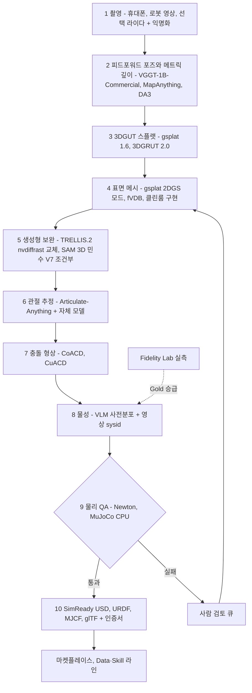

### 10.2 단계별 기술·라이선스·게이트

**표 10-1. Forge 단계 명세**

| # | 단계 | 기술(버전) | 라이선스 | 에디션 제한 | 산출물 | 자동 QA 게이트 [A] |
|---|---|---|---|---|---|---|
| 1 | 촬영·익명화 | CEN 촬영 가이드 앱(자체), 온프렘 촬영·재구성 키트(P1, 카메라 반입 제한 사이트용). 익명화는 RF-DETR N–L 기반 얼굴·번호판·고객 IP 검출 + 블러·인페인팅 | 자체 / Apache-2.0. Ultralytics(AGPL)는 SaaS 사용 금지 | 없음 | 원본 MCAP(고객 사이트·데이터 거주 태그 준수) + 익명화 프레임 | 익명화 재현율 ≥99%, 모션 블러·노출 검사, 커버리지 지도 |
| 2 | 포즈·메트릭 깊이 | VGGT-1B-Commercial(포즈), MapAnything(`map-anything-apache` 가중치), DA3 Small/Base/Metric | VGGT-1B-Commercial은 커스텀 사용 제한 라이선스(신청서, 군사·ITAR 제외) → **조건부(V7)**. MapAnything 코드·apache 가중치 Apache-2.0(기본 CC-BY-NC 가중치 금지). DA3 S/B/Metric Apache-2.0(Large/Giant/Nested CC-BY-NC 금지) | VGGT-Commercial의 테넌트 호스팅 추론은 V7 통과 후, 온프렘 가중치 번들은 재배포 조항 서면 확인 전 제외. Air-gap은 MapAnything-apache + DA3 경로만 | 카메라 포즈, 메트릭 깊이, 스케일 | 재투영 오차 ≤1 px, 기준 카드 대비 스케일 오차 ≤1% |
| 3 | 3DGUT 스플랫 | gsplat 1.6.0(main 브랜치, PyPI 미배포 → 커밋 해시 고정), 3DGRUT 2.0(PPISP 포함) | Apache-2.0 | 3DGRT는 RT 코어 GPU 필요 | `UsdVolParticleField3DGaussianSplat`, glTF + `KHR_gaussian_splatting`, 웹용 SPZ | 보류 뷰 PSNR/SSIM/LPIPS(§9.3 기준) |
| 4 | 표면 메시 | gsplat 2DGS 모드, fVDB Reality Capture(대규모 현장), PGSR·MILo 아이디어의 클린룸 재구현(논문만 참조) | Apache-2.0 / 자체 | 없음 | 수밀(watertight) 메시 + OpenPBR 텍스처 | 수밀·매니폴드, 2단계 대비 스케일 오차 ≤1%, 깊이 점군 대비 Chamfer ≤2 mm(물체) |
| 5 | 생성형 보완 | TRELLIS.2-4B(nvdiffrast를 자체 Warp/CUDA 래스터라이저로 교체 [A]. ≥24 GB VRAM, H100 512³ 약 3초·1024³ 약 17초), SAM 3D Objects(단일 시점 클러터) | TRELLIS.2 MIT. SAM 3D Objects는 SAM License(커스텀 사용 제한, 신청서, 군사·ITAR 제외) → **조건부(V7)**. Hunyuan3D 2.x 금지(한국 제외, 출력물 포함) | SAM 3D는 민수 전용·V7 조건부(테넌트 호스팅 추론은 V7 통과 후, 온프렘 번들은 재배포 서면 확인 전 제외), Air-gap 제외 | 보이지 않는 면을 보완한 메시 + 면별 '생성됨' 마스크 | 생성 보완 면적 ≤30%면 Silver 자격, 초과 시 Bronze만 |
| 6 | 관절 추정 | Articulate-Anything(액터-크리틱 자기 수정) + CEN 합성 관절 데이터로 파인튜닝한 자체 모델 | MIT / 자체. PhysX-Anything(S-Lab) 금지 | 없음 | URDF/MJCF/UsdPhysics 관절(회전·직선), 한계 | 관절 축 오차 ≤5°(상호작용 영상 대비), 한계 구간 스윕 자기충돌 0 |
| 7 | 충돌 형상 | CoACD, GPU CuACD(RTX 4090에서 메시당 약 0.25초, 약 100배). 삽입 핵심부는 SDF | MIT. V-HACD(BSD [U])는 폴백 | 없음 | 볼록 껍질 집합(통상 4–24개) 또는 SDF | 부피 부풀림 ≤3%, 껍질 수 ≤32, 적층 시 부유 간격 ≤1 mm |
| 8 | 물성 | VLM 사전분포(SaaS는 프런티어 API, 소버린은 온프렘 오픈 가중치, 공공·국방은 출처 확인 국산 모델) + 영상 sysid(MuJoCo sysid 툴박스) | 모델별 확인(V8) / Apache-2.0 | 국방: 출처 확인 모델만 | θ ± σ, `source` 태그 | 밀도 50–8,000 kg/m³, μ 0.05–1.5 범위, 사전분포와 3σ 초과 괴리 시 검토 |
| 9 | 물리 QA | Newton + MuJoCo CPU 2개 백엔드 | Apache-2.0 | 없음 | QA 리포트 | 낙하(폭발 없음, 에너지 비증가), 5초 적재 안정, 밀기 궤적 정상, 관절 한계 스윕, 관성 텐서 양정치·삼각 부등식, 정지 침투 ≤0.5 mm, 2개 백엔드 정지 자세 차 ≤2 mm |
| 10 | 내보내기·인증 | OpenUSD SimReady 구조, URDF/MJCF(Apache 변환기), glTF + `KHR_gaussian_splatting`, 증거 MCAP, `aic:TwinCertificate` + JSON 사이드카, SPDX 라이선스 매니페스트 | 자체 / Apache-2.0 | 에디션별 라이선스 프로파일 적용 | 마켓플레이스 리스팅 | 서명 검증, 라이선스 매니페스트 누락 0 |

### 10.3 시간 예산과 무개입 비율

**표 10-2. Bronze 강체 자산 시간 예산(단계별 배분은 [A], 합계는 DR KPI)**

| 단계 | P1(≤30분) | P2(≤15분, 셀프서브) | P3(≤10분) |
|---|---|---|---|
| 1 업로드·익명화 | 4분 | 2분 | 1.5분 |
| 2 포즈·깊이 | 2분 | 1분 | 0.5분 |
| 3 스플랫 | 12분 | 6분 | 4분 |
| 4 메시 | 4분 | 2분 | 1.5분 |
| 5 생성형 보완 | 2분 | 1분 | 0.5분 |
| 6 관절 | 강체는 생략 | 생략 | 생략 |
| 7 충돌 | 1분 | 0.5분 | 0.3분 |
| 8 물성(VLM) | 1분 | 0.5분 | 0.3분 |
| 9 물리 QA | 3분 | 1.5분 | 1분 |
| 10 내보내기·서명 | 1분 | 0.5분 | 0.4분 |
| **합계** | **30분** | **15분** | **10분** |

- **P0 기준:** 내부 처리 ≤2시간(사람 개입 포함).
- **무개입 비율 KPI(DR):** 30%(P0) → 60%(P1) → 80%(P2) → 90%(P3). 사람 검토 큐로 떨어진 사유를 분류해 상위 3개 사유를 분기마다 자동화 백로그로 전환.
- **등급 경로:** Bronze = 1–10단계(8단계는 VLM만). Silver = 8단계에서 상호작용 영상 sysid + 보류 trial ADE 기준 충족. Gold = Fidelity Lab 표준 프로토콜(§15.3) 측정.

### 10.4 CEN NeRF → 3DGUT 전환 계획

CEN의 현재 NeRF 파이프라인이 무엇으로 만들어졌는지(Instant-NGP, nerfstudio, 자체 구현)는 내부 확인 사항이다[U]. Instant-NGP는 NVIDIA Source Code License-NC(비상업)이므로, 하나라도 상업 경로에 있으면 즉시 차단해야 한다. 전환은 P0 4개월 안에 끝낸다. 기존 NeRF 인력 2명은 M1에 WS2 Forge로 재배치된다.

**그림 7. NeRF → 3DGUT 전환 일정**

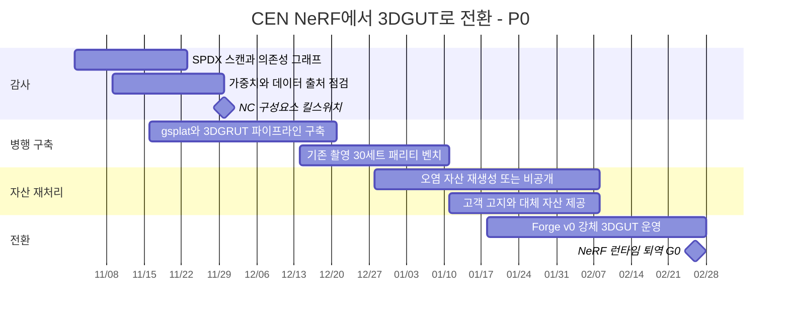

| 단계 | 기간 | 작업 | 완료 기준 | 책임 |
|---|---|---|---|---|
| T1 감사 | 2026-11(M1) | ScanCode 기반 SPDX 스캔 [A], 의존성 그래프, 모델 가중치·학습 데이터 출처, 마켓플레이스 자산의 생성 경로 추적 | 구성요소별 판정표 100% | CTO(대행) + 라이선스 자문 |
| T2 킬스위치 | 2026-11-30 | 금지 구성요소가 상업 경로에 있으면 신규 산출 중단 | CI 거부 목록 적용, 차단 건수 보고 | CTO(대행) |
| T3 병행 구축 | 2026-11 중순–12 | gsplat 1.6.0·3DGRUT 2.0 파이프라인을 같은 입력으로 구축 | 같은 촬영으로 끝까지 산출 | Forge Lead |
| T4 패리티 | 2026-12–2027-01 | 기존 촬영 30세트 [A]에서 NeRF 대비 PSNR/SSIM/LPIPS·처리 시간 비교 | 3DGUT이 동등 이상, 처리 시간 ≤ NeRF | Forge Lead |
| T5 재처리 | 2026-12 말–2027-02 | 금지 코드로 만든 자산은 원본 촬영에서 재생성, 원본이 없으면 비공개 | 오염 자산 공개 0 | Forge Lead + 마켓플레이스 |
| T6 퇴역 | 2027-02-26(M4, G0) | NeRF 런타임 프로덕션 제거. nerfstudio(Apache-2.0)는 오프라인 외삽 도구로만 보존 | 프로덕션 NeRF 호출 0 | CTO |

### 10.5 라이선스 감사 판정표

**표 10-3. Real2Sim 관련 구성요소 판정**

| 구성요소 | 라이선스 | 판정 | 조치 |
|---|---|---|---|
| Instant-NGP | NVIDIA Source Code License-NC | **NEVER** | 발견 즉시 제거, 산출 자산 재생성 |
| nerfstudio | Apache-2.0 | 허용(오프라인) | 런타임에서 제외 |
| Inria 3DGS 원본, 2DGS, MILo | Gaussian-Splatting License(연구·평가 전용) | **NEVER** | gsplat 2DGS 모드·클린룸 구현으로 대체 |
| PGSR | ZJU(교육·연구·비영리 전용) | **NEVER** | 아이디어만 클린룸 재구현 |
| SuGaR | Inria 계열 추정 [U] | **NEVER** | — |
| Neuralangelo | NVIDIA 연구 라이선스 | **NEVER** | — |
| nvdiffrast / nvdiffrec | NVIDIA Source Code License(1-Way Commercial, NVIDIA 외 비상업) | **NEVER** | TRELLIS.2의 래스터라이저 교체 |
| TRELLIS v1의 diffoctreerast | 리서치 권고상 제거 대상 | **NEVER** | TRELLIS.2(MIT)만 사용 |
| Hunyuan3D 2.x | 한국·EU·UK 제외(출력물 포함) | **NEVER** | — |
| VGGT-1B 원본 / VGGT-1B-Commercial | 비상업 / 커스텀 사용 제한(신청서, 군사·ITAR 제외) | 원본 NEVER / Commercial **조건부(V7, 민수)** | 신청서 제출. 테넌트 호스팅 추론은 V7 통과 후, 온프렘 가중치 번들은 재배포 조항 서면 확인 전 제외. Air-gap 제외 |
| DA3 Large/Giant/Nested / S·B·Metric | CC-BY-NC / Apache-2.0 | NC NEVER / S·B·Metric 허용 | 가중치 레지스트리에서 체크섬 고정 |
| MapAnything 기본 가중치 / apache 가중치 | CC-BY-NC / Apache-2.0 | 기본 NEVER(DR NEVER 목록 #22 후보) / apache 허용 | 가중치 레지스트리에서 `map-anything-apache`만 허용 |
| SAM 3D Objects | SAM License(커스텀 사용 제한, 신청서, 군사·ITAR 제외) | **조건부(V7, 민수)** | 테넌트 호스팅 추론은 V7 통과 후, 온프렘 번들은 재배포 서면 확인 전 제외. 국방 에디션 화이트리스트에서 제외 |
| PhysX-Anything | S-Lab License | **NEVER** | Articulate-Anything + 자체 모델 |
| ManiSkill 자산 | CC BY-NC 4.0 | **NEVER**(상업 번들) | — |
| CoACD / CuACD, Articulate-Anything, TRELLIS.2 코드·가중치 | MIT | 허용 | nvdiffrast 의존 제거 확인 |
| gsplat, 3DGRUT, fVDB | Apache-2.0 | 허용 | 커밋 해시 고정 |
| Cosmos Transfer 2.5 / Cosmos 3 | NVIDIA Open Model License / OpenMDW-1.1(전문 미확인 [U]) | 허용 / V7 법률 검토 조건 | 가드레일·귀속 조항 확인 |
| Blender | GPL | Zone F 별도 프로세스만 | 소버린 번들 제외(V2 의견 전) |

- **집행 장치:** 컨테이너별 SPDX SBOM, CI 거부 목록, 모델 가중치 레지스트리(라이선스 필드 필수, 체크섬 고정), 데이터셋 출처 기록, 에디션별 화이트리스트(Cloud / Sovereign / Air-gap). 상세 절차는 [03 §10](03-engine-selection-build-vs-buy.md)과 [11 리스크·KPI·컴플라이언스](11-risk-kpi-compliance.md).

---

## 11. 현실감 ③: 센서 시뮬레이션

**결론: 센서는 '모델'이 아니라 '디바이스 프로파일'로 판다. 우리가 측정한 센서 SKU·펌웨어·설정 조합만 '보정됨'이라고 부른다.**

### 11.1 센서 매트릭스

**표 11-1. 센서별 구현·프로파일·검증**

| 센서 | Zone F(팩토리) | Zone T/S(테넌트·소버린) | 프로파일 파라미터 | 측정 방법 [A] | 지표·목표 | 판매 상태 |
|---|---|---|---|---|---|---|
| 카메라(RGB, 글로벌·롤링 셔터, 어안) | Isaac Sim 6.1 RTX 카메라 + PPISP | Warp 래스터 또는 R2 3DGUT + 렌더러 중립 ISP 모델(Isaac Lab 3.0 방식) | 내·외부 파라미터, 어안·FTheta 왜곡, 롤링셔터 라인 시간, 응답 곡선, 판독·샷 노이즈, PRNU·DSNU, MTF, 색 보정 행렬, 비네팅, 노출·게인, 모션 블러 | ChArUco 보정, EMVA 1288 방식 광자 전달 곡선, slanted-edge MTF, ColorChecker, 균일광원 | mAP 비율 ≥0.85(P0) → ≥0.95(P2), 노이즈 PSD 로그 스펙트럼 거리 ≤3 dB | 판매(P0) |
| 깊이(스테레오·ToF) | RTX 깊이 | Warp 깊이 + 노이즈 커널 | 거리별 바이어스·σ, 엣지 플라잉 픽셀, 반사·투명 재질 결측 패턴 | 평판 타깃 거리 스윕, 재질 패널 | 깊이 AbsRel, 결측률 차이 | 판매(P1) |
| 라이다 | RTX OmniLidar | Warp 레이캐스트 + 프로파일. 스플랫 장면은 gsplat 라이다 래스터 선택 | 빔 패턴, 거리별·입사각별 바이어스·σ, 강도-반사율 곡선, 발산각, 드롭아웃, 다중 반사, 스캔 타이밍(모션 왜곡) | 반사율 10/50/90% 타깃, 거리 2–50 m, 입사각 0–60° 스윕 | 거리 오차 ≤3 cm(P1) → ≤2 cm(P2), Chamfer | 판매(P1) |
| 레이더 | RTX OmniRadar | **판매 보류** | RCS, 거리·속도·각 분해능, 노이즈 플로어, 다중경로, 해면 클러터 분포, 고스트 | 삼면 코너 반사체 거리 스윕, 해상 캠페인(§11.3) | 오차 막대 공개 프로파일(P3) | 검증 전 해양·국방 판매 금지 |
| EO/IR(열상) | IITP 공동연구로 개발 [A] | **판매 보류** | 방사율, 대기 감쇠, NETD, 비균일성 | 흑체 보정원, 해상 캠페인 | 겉보기 온도 오차 ≤2 K [A] | 검증 전 판매 금지 |
| IMU | 물리 기반 IMU [A] | Warp 노이즈 커널 | 각속도 랜덤워크, 바이어스 불안정성, 레이트 랜덤워크, 스케일 팩터, 축 정렬 오차, 온도 드리프트 | 정적 6시간 이상 로그의 Allan 분산, 회전대 | Allan 편차 곡선 오차 ≤20%, PSD 일치 | 판매(P1) |
| 촉각 | TacSL(PhysX 전용, 기존 대비 200배 이상 빠름) | MuJoCo `touch_grid`, Newton hydroelastic 압력장 → Warp 커널로 GelSight형 영상 합성 [A] | 젤 강성, 마커 변위-힘 곡선, 감도 맵, 지연 | F/T를 단 압자로 격자 압입 | 접촉력 추정 RMSE | Zone F 산출물(P1). 테넌트는 Kit-less 검증(M6) 전 약속 금지 |
| 이벤트 카메라 | EVIS(Isaac Sim 실시간 이벤트 시뮬, arXiv 2607.08098) [U] | v2e [U] | 대비 임계값 평균·σ, 불응기, 대역폭, 누설·샷 노이즈 이벤트율 | 점멸 LED, 회전 패턴 | 이벤트율 오차 | 관찰(요청 시 PoC) |
| 초음파 | RTX acoustic | 미제공 | — | — | — | Zone F 산출물만 |

- **Taccel의 위치:** IPC + Affine Body Dynamics, MIT, H100 1장에서 4,096 env 915 FPS(페그 삽입). 손 전체 촉각은 256 env 12.67 FPS로 아직 느림. 덱스터러스 핸드 촉각 고충실도 후보로 관찰.
- **Warp Sensor Library 구성:** 카메라 ISP, 깊이 노이즈, 라이다 레이캐스트·강도, IMU 노이즈, 촉각 영상 합성을 Warp 커널로 구현(Apache 의존성만). 범용성이 있는 커널은 Newton에 업스트림 기여해 로드맵 영향력을 확보(DR 원칙).

**카메라 ISP(PPISP) 처리 순서.** PPISP(physically-plausible ISP)는 3DGRUT(2026-01), gsplat(2026-07), Isaac Lab 3.0의 렌더러 중립 ISP로 들어왔다. 우리는 같은 ISP 모델을 R1(Warp)·R2(3DGUT)·R3(RTX) 출력에 공통으로 적용해, 렌더러를 바꿔도 카메라 외형 갭이 같은 방식으로 닫히게 한다. 처리 순서는 다음과 같다.

1. 선형 복사량(HDR) 렌더
2. **광학:** 렌즈 왜곡·MTF/블러·비네팅, 롤링셔터 시간 샘플링(3DGUT은 왜곡·롤링셔터를 렌더 단계에서 직접 처리)
3. **노출·게인:** 노출 시간, 아날로그 게인
4. **선형 RAW 영역의 센서 노이즈:** 광자(샷) 노이즈(포아송, 광학 감쇠 후 광자 수 기준), PRNU·DSNU, 암전류, 판독 노이즈
5. **ADC 양자화:** 센서 비트 깊이(예: 10·12 bit)로 양자화
6. **디모자이킹:** Bayer CFA 샘플링 후 디모자이킹
7. 화이트 밸런스 → 색 보정 행렬(CCM, ColorChecker로 피팅)
8. 톤 매핑(HDR → LDR, 감마)
9. 디바이스 프로파일의 노이즈 저감·샤프닝
10. 압축 아티팩트(선택, 고객 파이프라인이 JPEG·H.264를 쓸 때)

- **흔한 오류와 우리 규칙:** 최종 sRGB 이미지에 가우시안 노이즈를 더하면 밝기별 노이즈 분포가 실제 센서와 다르게 나온다. 노이즈는 반드시 4단계(광학 감쇠를 거친 선형 RAW)에서 주입하고, 광자 전달 곡선으로 검증한다. 비네팅을 노이즈 뒤에 적용하면 모서리의 노이즈 크기가 틀어져 광자 전달 곡선 검증이 깨지므로, 광학 단계는 항상 노이즈 앞에 둔다.

### 11.2 실측 프로파일 방법론

1. **SKU 등록:** 센서 모델, 펌웨어, 설정(노출 모드, 스캔 패턴)을 하나의 키로 등록. 펌웨어가 바뀌면 다른 프로파일.
2. **캠페인 설계:** 표준 타깃(ChArUco, ColorChecker, 반사율 패널, 코너 반사체), 조명(조도 100–2,000 lux, 색온도 2,700–6,500 K [A]), 거리·각도 격자.
3. **원시 수집:** MCAP, PTP 시간 동기 [A], 셀 자체가 Gold 트윈이므로 같은 장면을 시뮬에서 그대로 재현 가능.
4. **파라미터 추출:** 센서별 모델 피팅(광자 전달 곡선, 강도-반사율 곡선, Allan 분산).
5. **시뮬 재현:** 같은 타깃·배치를 L3 모델로 렌더.
6. **비교와 불확도:** §13 지표 + 부트스트랩 95% 신뢰구간.
7. **발행:** `aic:SensorProfile`(버전, 신뢰구간, 유효기간, 재측정 트리거)로 발행하고 마켓플레이스 상품으로 등록.
8. **재측정 트리거:** 펌웨어 변경, 렌즈 교체, 12개월 경과 [A].

### 11.3 해양·국방 판매 전 센서 검증 계획

**원칙:** 레이더(해양 레이더 포함)와 EO/IR은 오차 막대를 공개한 실측 프로파일을 통과해야만 판매한다. '단순화된 FMCW 레이더'는 국방 증거물로 팔지 않는다. 고정밀 레이더 모델링은 IITP 공동연구 예산으로 수행해 지분 희석 없이 충당한다.

**표 11-2. 센서 검증 단계**

| 단계 | 시기 | 내용 | 산출물 | 통과 기준 [A] | 책임 |
|---|---|---|---|---|---|
| V-S1 공동연구 착수 | 2027 상반기(IITP 신규 과제 2027.01–04 IRIS 제출) | ETRI·KAIST·SNU와 센서 물리 라이브러리(다중경로, RCS, EO/IR 방사) 설계 | 과제 협약, 모델 사양서 | 협약 체결 | WS9 + WS3 |
| V-S2 육상 레이더 캠페인 | P2 전반 | 기지 RCS 코너 반사체를 거리별 배치, 차량·AMR 레이더 1종 | 거리-검출확률 곡선, RCS 오차 | RCS 오차 ≤3 dB, 검출확률 곡선 차 ≤10%p | WS3 |
| V-S3 해상 캠페인 | P2 후반–P3 초 | KRISO·KR·시험기관 협력 [U]. 해상 상태 2–4, 표적 선박, X-band 해양 레이더, EO/IR | 해면 클러터 분포(K-분포 적합 KS 검정), 검출확률, 오경보율, 겉보기 온도 | 클러터 분포 KS p ≥0.05, 겉보기 온도 ≤2 K | WS3 + 협력 기관 |
| V-S4 오차 막대 공개 | P3 초 | 95% 신뢰구간을 붙인 프로파일 데이터시트 공개 + 제3자 시험성적서 | 공개 프로파일, 시험성적서 | 제3자 서명 | Head of Fidelity |
| V-S5 판매 개시 판정 | M25 이후 | Wave 3 트리거(ARR ₩30억 이상 또는 확정 ₩5억 이상 앵커. 기준안의 2028년 말 ARR은 ₩20억이므로 M25 착수는 앵커 계약 경로가 기본, DR §5.4) + Sovereign GA + V-S4 완료 | 판매 승인 메모 | 세 조건 모두 | CEO |
| V-S6 실선 검증 | M30 | 실제 선박 로그로 합성 90% 이상 학습 검출기를 해상 벤치마크 평가(DR 데모) | 검증 리포트 | 고객 합의 기준 | WS4 |

- **국방 추가 조건:** Air-gap 에디션은 SAM 계열·VGGT-Commercial·미확인 모델 제외, 건별 수출통제(EAR·ITAR) 심사.
- **DR KPI 연결:** 라이다 거리 오차 P3 목표 '≤2 cm + 레이더 프로파일 공개'의 후반부가 V-S4.

---

## 12. 현실감 ④: 생성형 증강과 라벨 일관성 QA

**결론: 월드모델은 외형만 바꾼다. 라벨·물리·센서는 시뮬레이터가 책임진다. 라벨 일관성 검사를 통과한 프레임만 납품하고, 증강 프레임의 라벨을 사후에 고치는 일은 금지한다.**

### 12.1 모델 로드맵

**표 12-1. 생성형 증강 모델 계획**

| 시기 | 모델 | 라이선스 | 용도 | GPU | 비고 |
|---|---|---|---|---|---|
| 현재(내부 시험)·M5–M8(P1 DATA 라인) | Cosmos Transfer 2.5(2B, 깊이·엣지·블러·분할 멀티 ControlNet. 저지연 증류 엣지 모델 2026-02-23) | 코드 Apache-2.0, 가중치 NVIDIA Open Model License | DATA 라인 외형 증강(P1 M5부터) | TRAIN 풀(H100급) | 저장소는 유지보수 축소 상태 |
| M9– | **Cosmos 3 Nano 16B** 한국 도메인 파인튜닝(공장·물류·조선소) | OpenMDW-1.1(전문 미확인 [U], V7 조건) | 증강 + 자동 품질 보조(장면 비평) | RTX PRO 6000 / H100 / B200 | Transfer 2.5 대비 품질은 사내 A/B로 판정 |
| P3 | Cosmos 3 Super 64B | OpenMDW-1.1 | 정책 사전 선별(실셀 평가 전 필터) | H200 / B200 | 인증을 대체하지 않음 |
| 관찰 | Cosmos 3 Edge 4B | OpenMDW-1.1 | 현장 Jetson 사전 필터 [A] | Jetson Thor | — |
| 벤치마크만 | Genie 3, Wayve GAIA-3/4, Runway GWM-1, Decart Oasis 3 | 독점 | 비교 기준 | — | 정답 기하·라벨 보장 없음 |

### 12.2 라벨 일관성 QA 절차

**그림 8. 라벨 일관성 QA 흐름**

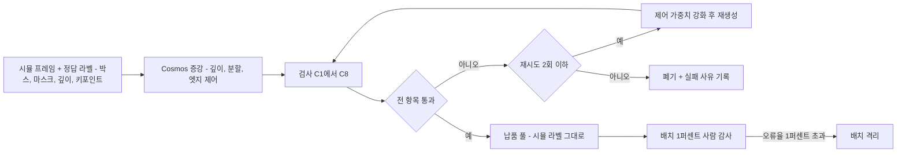

**표 12-2. 검사 항목과 임계값 [A]**

검사 ID C1–C8은 라벨 일관성 QA의 번호이며(한 자리), 적합성 장면 C01–C15(두 자리, §8.1)와 다르다. 혼동을 막기 위해 문서와 대시보드에서는 '라벨 QA C1–C8'로 부른다.

| ID | 검사 | 방법 | 통과 기준 |
|---|---|---|---|
| C1 | 인스턴스 마스크 일치 | 검증용 분할 모델(민수는 V7 통과 후 SAM 3 계열 가능, 국방은 Apache 모델만)을 증강 프레임에 적용, 정답 마스크와 인스턴스별 IoU | 32×32 px 이상 IoU ≥0.85, 소형 ≥0.70 |
| C2 | 박스·클래스 일치 | 실데이터로 학습한 교사 검출기(RF-DETR)를 증강 프레임에 적용 | 매칭 IoU ≥0.80, 클래스 일치 ≥98% |
| C3 | 깊이 일관성 | DA3-Metric 추정 깊이 vs 시뮬 정답 깊이(스케일 정렬 후) | AbsRel ≤0.10 |
| C4 | 엣지 일관성 | 증강 프레임 엣지 vs 제어 엣지 맵 | F-score ≥0.70 |
| C5 | 소형 물체 생존 | 16×16 px 이상 정답 인스턴스의 C1·C2 검출 | 누락 0 |
| C6 | 문자·로고 환각 | 정답에 문자가 있는 영역의 OCR 유사도, 문자가 없던 영역의 신규 문자 | 유사도 ≥0.8, 신규 문자 0(한글 포장 SKU 핵심) |
| C7 | 시간 일관성(영상) | 광류 워핑 오차, 프레임 간 인스턴스 수 | 워핑 오차 상한 이내, 인스턴스 수 불변 |
| C8 | 개수·환각 물체 | 정답 밖 위치의 신뢰도 0.5 이상 신규 검출 | 0 |

- **재라벨 금지 이유:** 증강 프레임 라벨을 모델 출력으로 고치면 라벨 출처가 시뮬에서 생성 모델로 바뀌어 데이터셋의 정답성이 무너진다. 실패 프레임은 폐기한다.
- **KPI(DR):** 증강 프레임 라벨 일관성 검사 통과율은 ≥98%(P1), ≥99%(P2·P3)다. 이 수치는 생성기의 품질 지표이고, 납품 프레임은 정의상 100% 통과분이다.
- **경제성 규칙 [A]:** 증강은 같은 GPU-시간을 도메인 랜덤화에 썼을 때보다 mAP 비율을 더 올릴 때만 유지한다. 데이터셋당 A/B를 1회 돌린다.
- **비용 감각:** 영상 월드모델 추론은 비싸다(구형 Cosmos Predict1 7B 기준 H100 1장에서 클립당 약 383초, 참고치). 증강 비율은 데이터셋 프레임의 10–30%에서 시작한다[A].
- **IP:** '월드모델 증강 라벨 일관성 검증'은 M24까지 출원할 특허 8건 중 하나다.

### 12.3 근거: 증강이 실제로 돕는가

- NVIDIA SO-101 학습 자료는 학습된 증강으로 큐브 집기 19/20(증강 없음 3/20), 적층 18/20(1/20)을 보고[U].
- Cosmos Policy는 과제당 합성 시연 약 800개, 실시연 0개로 Franka 제로샷 평균 35%를 보고. 증강만으로는 부족하고 소량 실데이터와 실셀 평가가 필요하다는 근거[U].
- 결론: 증강은 '소량 실데이터 파인튜닝'과 짝으로만 쓴다(DR 기본 포함 원칙).

---

## 13. 현실감 ⑤: Sim2Real Gap Scorecard

**결론: "현실과 비슷하다"는 문장은 Scorecard 숫자로만 쓴다. 지표는 인식·정책·물리·센서·렌더마다 다르고, 공식·표본·분할 규칙을 고정해 제3자가 재계산할 수 있게 한다.**

### 13.1 지표 정의

**표 13-1. Scorecard 지표**

| 영역 | 지표 | 정의(공식은 아래) | 방향 | 표본 요건 [A] | DR KPI |
|---|---|---|---|---|---|
| 인식 | mAP 비율 R_mAP | 합성 전용 모델의 실데이터 mAP ÷ 실데이터 학습 모델의 실데이터 mAP | 높을수록 | 보류 실데이터 인스턴스 ≥1,000, 장소·날짜 분할 | ≥0.85 → ≥0.95 |
| 인식 | 소량 실데이터 곡선 R_k | (합성 + 실데이터 k%) mAP ÷ 실데이터 100% mAP, k ∈ {1, 5, 10, 25} | 높을수록 | 학습 시드 3개 | R_10 ≥1.0 → ≥1.05 |
| 정책 | 성공률 갭 Δ | 시뮬 성공률과 실셀 성공률의 차(%p) | 낮을수록 | 실셀 trial ≥50/정책·과제, 시뮬 ≥1,000 | ≤25 → ≤8 %p |
| 정책 | Pearson r | 정책 K개의 (시뮬, 실셀) 성공률 상관 | 높을수록 | K ≥5(권장 8) | ≥0.7 → ≥0.85 |
| 정책 | 순위 일치 | Kendall τ, MMRV(최대 순위 위반 평균) | τ 높을수록 | K ≥5 | 보고 |
| 물리 | ADE / FDE | 평균·최종 위치 오차 | 낮을수록 | 물체당 보류 trial 10개(조건당 ≥2) | ADE ≤2 → ≤1 cm |
| 물리 | 정지 자세 오차 | 정지 후 위치·회전 오차 | 낮을수록 | 동일 | 인증 기준 |
| 물리 | 접촉력 오차 | F/T 힘 RMSE, 피크 힘 상대오차 | 낮을수록 | 삽입·밀기 trial | 인증 기준 |
| 물리 | 질량·마찰 오차 | 자동 추정 사슬 vs Gold 랩 기준(§16.1) | 낮을수록 | Gold 기준 세트 | ≤15%/≤25% → ≤5%/≤10% |
| 센서 | 라이다 거리 오차 | 매칭 빔의 평균 절대 거리 오차(+ p95) | 낮을수록 | 타깃 반사율 3종 × 거리 5종 × 입사각 3종 | ≤3 → ≤2 cm |
| 센서 | Chamfer 거리 | 시뮬·실측 점군(또는 메시) 양방향 최근접 평균 | 낮을수록 | 장면당 스캔 ≥10 | 보고 |
| 센서 | 노이즈 PSD 거리 | Welch PSD의 로그 스펙트럼 거리(dB) | 낮을수록 | 정적 로그 ≥10분(카메라), ≥6시간(IMU Allan) | 보고 |
| 렌더 | PSNR / SSIM / LPIPS | 보류 뷰 화질 | PSNR·SSIM 높을수록, LPIPS 낮을수록 | 8번째 프레임마다 보류 | Silver 현장 기준 |
| 보조 | FID / KID / CMMD | Inception 등 특징 분포 거리 | — | 드리프트 경보 전용 | 인수 기준 사용 금지 |

**공식**

```math
R_{\mathrm{mAP}}=\frac{\mathrm{mAP}_{\mathrm{real}}(M_{\mathrm{syn}})}{\mathrm{mAP}_{\mathrm{real}}(M_{\mathrm{real}})},\qquad R_{k}=\frac{\mathrm{mAP}_{\mathrm{real}}(M_{\mathrm{syn}+k\%})}{\mathrm{mAP}_{\mathrm{real}}(M_{\mathrm{real},100\%})}
```

```math
\Delta_{\mathrm{pp}}=100\cdot\left|\hat{s}_{\mathrm{sim}}-\hat{s}_{\mathrm{real}}\right|,\qquad \mathrm{CI}_{\mathrm{Wilson}}=\frac{\hat{s}+\frac{z^{2}}{2n}\pm z\sqrt{\frac{\hat{s}(1-\hat{s})}{n}+\frac{z^{2}}{4n^{2}}}}{1+\frac{z^{2}}{n}},\ z=1.96
```

```math
r=\frac{\sum_{i=1}^{K}(x_i-\bar{x})(y_i-\bar{y})}{\sqrt{\sum_{i=1}^{K}(x_i-\bar{x})^{2}\sum_{i=1}^{K}(y_i-\bar{y})^{2}}},\quad x_i=\hat{s}^{(i)}_{\mathrm{sim}},\ y_i=\hat{s}^{(i)}_{\mathrm{real}}
```

```math
\mathrm{ADE}=\frac{1}{T}\sum_{t=1}^{T}\lVert\hat{p}_t-p_t\rVert_2,\qquad \mathrm{FDE}=\lVert\hat{p}_T-p_T\rVert_2,\qquad \theta_{\mathrm{rot}}=\arccos\!\left(\frac{\mathrm{tr}(\hat{R}^{\top}R)-1}{2}\right)
```

```math
\mathrm{CD}(P,Q)=\frac{1}{|P|}\sum_{p\in P}\min_{q\in Q}\lVert p-q\rVert_2+\frac{1}{|Q|}\sum_{q\in Q}\min_{p\in P}\lVert q-p\rVert_2
```

```math
e_{\mathrm{range}}=\frac{1}{N}\sum_{i=1}^{N}\left|\hat{r}_i-r_i\right|,\qquad \mathrm{LSD}=\sqrt{\frac{1}{N_f}\sum_{f}\left(10\log_{10}\frac{\hat{S}(f)}{S(f)}\right)^{2}}\ \mathrm{dB}
```

```math
\mathrm{PSNR}=10\log_{10}\frac{\mathrm{MAX}^{2}}{\mathrm{MSE}},\qquad \mathrm{SSIM}(x,y)=\frac{(2\mu_x\mu_y+c_1)(2\sigma_{xy}+c_2)}{(\mu_x^{2}+\mu_y^{2}+c_1)(\sigma_x^{2}+\sigma_y^{2}+c_2)}
```

- **mAP 정의:** 기본은 COCO mAP@[0.5:0.95], 보조로 mAP50. 평가 스크립트 버전 고정.
- **LPIPS:** AlexNet 백본 고정 [A]. 백본이 바뀌면 값 비교 불가.
- **ADE 시간 정렬:** 릴리스·첫 접촉 이벤트를 t = 0으로 맞추고, 실측 프레임 시각에 시뮬 상태를 보간.

### 13.2 측정 프로토콜

| 영역 | 데이터 분할 | 통제 | 반복·불확도 | 서명 |
|---|---|---|---|---|
| 인식 | 실데이터를 장소·날짜 단위로 학습/보류 분할(누수 방지). 합성·실 모델은 같은 아키텍처(RF-DETR N–L), 같은 해상도·에폭·증강 | 평가 스크립트·체크포인트 해시 기록 | 학습 시드 3개, 평균 ± 표준편차 | Head of Fidelity |
| 정책 | 실셀 초기 조건 목록을 사전에 고정하고 시뮬과 공유. 실패 정의 사전 등록 | 실셀 운영자는 정책 ID를 모름(무작위 코드) [A]. 외부 채점은 공동서명 기관 입회 | Wilson 95% 신뢰구간, r은 부트스트랩 신뢰구간 | 내부: Head of Fidelity / 외부: 공동서명 기관 |
| 물리 | §15.3 표준 프로토콜. 보정 trial과 보류 trial 분리(80/20) | 셀 보정(카메라·F/T) 기록이 유효한 trial만 | 조건당 반복 ≥2, 물체당 보류 10개 | Fidelity 엔지니어 |
| 센서 | §11.2 캠페인. 타깃 배치 사진·좌표 기록 | 펌웨어·설정 키 고정 | 부트스트랩 95% 신뢰구간 | WS3 리드 |
| 렌더 | 8번째 프레임 보류 | 노출 고정 촬영 | 장면별 보고 | Forge Lead |

- **산출 형식:** 서명된 JSON(기계 판독) + PDF(인수 문서). 모든 수치에 신뢰구간, 표본 수, Run Manifest ID, 증거 trial ID 첨부.
- **PoC 인수와의 연결:** Cell-to-Policy PoC는 지정 실셀 성공률, 갭 ≤15%p, 정책 5개 이상 r 보고를 인수 기준으로 씀(DR). 이 표가 그 측정 절차.

### 13.3 FID를 보조 지표로 내리는 이유

- **과제 무관 특징:** FID는 ImageNet으로 학습한 Inception 특징의 분포 거리. 산업 장면의 소형 물체, 라벨 정렬, 기하 정확도에 둔감.
- **분포 지표의 함정:** 생성형 증강이 물체 경계를 미세하게 옮겨 라벨이 깨져도 분포는 오히려 실데이터에 가까워질 수 있음. FID가 좋아지는 동안 mAP가 떨어지는 경우가 생김.
- **표본 편향:** 작은 표본에서 편향이 크고 수만 장 단위가 필요 [A]. 고객별 소규모 보류 세트에는 불안정.
- **물리·센서 차원 없음:** 궤적·접촉력·거리 오차를 반영하지 못함.
- **리서치 근거:** FID는 검출기 mAP를 자주 예측하지 못하고, 구조 + 외형 지표(SDQM r≈0.87, SADGE r≈0.88)가 하류 mAP와 더 높은 상관을 보임[U].
- **우리 용도:** FID·KID·CMMD는 배치 간 분포 드리프트 경보로만 사용. 인수 기준·인증 기준·마케팅에 쓰지 않음.

---

## 14. 인증 체계: Bronze / Silver / Gold

**결론: 등급은 '물성 값이 어디서 왔는가'로 나눈다. VLM 추정은 Bronze, 영상 식별은 Silver, 랩 실측은 Gold다. KPI와 마케팅은 Silver/Gold만 센다.**

### 14.1 등급 기준

**표 14-1. 등급별 기준**

| 항목 | Bronze | Silver | Gold |
|---|---|---|---|
| 물성 출처 | VLM 사전분포 + 범주 표 | 상호작용 영상 sysid(밀기·기울임·낙하). 질량은 힘 정보가 있을 때만 식별 | Fidelity Lab 표준 프로토콜(저울, 경사판, F/T, 고속 카메라). 접촉 부품은 Drake 교차 검증 |
| 기하 스케일 오차 [A] | ≤3% | ≤1% | 참조 스캔 Chamfer ≤0.5 mm 또는 ≤0.5% |
| 질량 | 추정값 + 넓은 불확도 | 식별(힘 정보) 또는 사전분포 + 불확도 표기 | 저울 실측(0.1 g), COM·관성 실측 |
| 마찰·반발 | 재질 표 | 영상 식별 | 경사판·밀기·낙하 실측 |
| 물리 QA(Forge 9단계) | 필수 | 필수 | 필수 |
| 궤적 검증 [A] | — | 보류 상호작용 trial ADE ≤3 cm | 표준 낙하·밀기 보류 trial ADE가 단계 목표 이내(P1 ≤2 cm, P2 ≤1.5 cm, P3 ≤1 cm) |
| 백엔드별 파라미터 세트 | Newton, MuJoCo | Newton, MuJoCo | Newton, MuJoCo, PhysX(+ 접촉 부품은 Drake) |
| 인증 시험 재현 | D0 100% | D0 100% | D0 100% |
| 증거 | Run Manifest | + 영상 trial ID | + 랩 trial ID(코퍼스) |
| 유효기간 [A] | 12개월 | 24개월 | 24개월 |
| 대외 문구 | "추정" | "영상 식별" | "실측 검증" |
| KPI 집계 | 제외(참고: 5,000 → 100,000) | 포함 | 포함(Gold 30 → 2,000) |

- **가격(DR, [A]):** 인증 트윈(물체) ₩30만–150만(Bronze → Gold), 자산 클래스당 인증서 발급 ₩500만, 로봇-과제 인증서 ₩3,000만–1억이다. Gold는 랩 실측 원가(물체당 셀 약 1.3시간 + 기술자 검수)를 가격 하한으로 쓴다.
- **Gold 인증서가 담는 값:** Gold 인증서에는 랩 실측값과 측정 불확도(σ_lab)를 기록한다. §16.1의 '자동 Forge 추정값의 Gold 대비 질량/마찰 오차' KPI(P1 ≤10%/≤20% 등)는 자동화 체인의 정확도 지표이므로, Gold 자산의 인증 임계나 고객 보증 문구로 쓰지 않는다.
- **변형체 인증서:** 변형체 자산은 정적 보정 시험(처짐·정지 형상)을 MuJoCo CPU로 D0 재현한 항목에만 인증서를 붙이고 'experimental'로 표기한다. 동역학 항목은 Scorecard 리포트(D1)로만 낸다(§2.1).
- **로봇-과제 인증서:** 자산이 아니라 '정책 × 로봇 × 셀 × 운영 범위'에 대한 인증이다. 성공률(신뢰구간), 갭, r을 담고 sim2sim Tier 2(§8.4), Crucible 평가 캠페인, Arena 공동서명 절차를 따른다([07 학습 모듈](07-training-module.md)).
- **승급 경로:** Bronze → Silver는 고객이 Forge 앱으로 30초 상호작용 영상을 추가하면 자동으로 진행한다. Silver → Gold는 물체를 랩으로 보내거나 현장 측정 키트로 측정한다.

### 14.2 `aic:TwinCertificate` 스키마

USD API 스키마(`AicTwinCertificateAPI`)를 자산 prim에 적용하고, 같은 내용을 서명된 JSON 사이드카로 함께 배포한다. USD 쪽은 장면 안에서 도구가 읽고, JSON 쪽은 조달·계약·제3자 재계산에 쓴다.

**표 14-2. 핵심 필드**

| 그룹 | 필드 | 타입 | 설명 |
|---|---|---|---|
| 식별 | `aic:cert:id`, `aic:cert:schemaVersion` | string | UUID, 스키마 버전(`1.0`) |
| 등급·상태 | `aic:cert:tier`, `aic:cert:status` | token | `bronze`/`silver`/`gold`, `valid`/`suspended`/`revoked`/`superseded` |
| 대상 | `aic:cert:subjectAssetHash` | string | 평탄화한 레이어 스택의 SHA-256. 시각·물리 동시 보증 |
| 발행 | `aic:cert:issuer`, `aic:cert:cosigner`, `aic:cert:issuedAt`, `aic:cert:validUntil` | string | 발행 주체, 공동서명 기관(선택), ISO 8601 시각 |
| 운영 범위 | `aic:cert:envelope` | dictionary | 표면 재질, 하중, 속도, 온도, 조명 범위 |
| 물성 | `aic:phys:mass`, `aic:phys:massSigma`, `aic:phys:com`, `aic:phys:inertiaDiag`, `aic:phys:muStatic`, `aic:phys:muDynamic`, `aic:phys:restitution` | double / float3 | 값과 표준편차 |
| 출처 | `aic:phys:source:<param>` | token | `vlm`/`video`/`lab` |
| 백엔드별 세트 | `aic:phys:backend:<engine>` | dictionary | 엔진·버전·솔버별 보정 파라미터 |
| 점수 | `aic:score:ade`, `aic:score:fde`, `aic:score:restPoseErr`, `aic:score:forceRmse` | double | 보류 trial 기준 |
| 재현 | `aic:det:class`, `aic:det:replayBackend`, `aic:det:replayHash` | token / string | `D0_bitwise`/`D1_statistical`(Run Manifest와 같은 토큰), 재현 엔진, 해시 체인 루트 |
| 적합성 | `aic:conf:suiteVersion`, `aic:conf:trainId` | string | 통과한 적합성 스위트와 릴리스 트레인 |
| 증거 | `aic:evidence:trialIds`, `aic:evidence:runManifestId` | string[] / string | 코퍼스 trial ID |
| 권리 | `aic:license:spdx`, `aic:prov:captureSource`, `aic:prov:consentId`, `aic:prov:anonymized` | string / bool | 라이선스, 촬영 출처, 동의, 익명화 |
| 서명 | `aic:sig:alg`, `aic:sig:keyId`, `aic:sig:value`, `aic:cert:revocationUrl` | string | Ed25519 [A], 키 ID, 서명값, 폐기 조회 URL |

```usda
#usda 1.0
(
    defaultPrim = "KR_RamenBox_120g"
)

def Xform "KR_RamenBox_120g" (
    prepend apiSchemas = ["PhysicsRigidBodyAPI", "PhysicsMassAPI", "AicTwinCertificateAPI"]
)
{
    float physics:mass = 0.1213
    string aic:cert:id = "7d3c0f9e-2b1a-4c55-9e0e-1f6a2b7c9d10"
    string aic:cert:schemaVersion = "1.0"
    token aic:cert:tier = "gold"
    token aic:cert:status = "valid"
    string aic:cert:subjectAssetHash = "sha256:9f1c..."
    string aic:cert:issuedAt = "2027-02-15T09:00:00+09:00"
    string aic:cert:validUntil = "2029-02-14T23:59:59+09:00"
    double aic:phys:mass = 0.1213
    double aic:phys:massSigma = 0.0001
    double aic:phys:muStatic = 0.46
    double aic:phys:muDynamic = 0.38
    token aic:phys:source:mass = "lab"
    token aic:phys:source:muDynamic = "lab"
    double aic:score:ade = 0.017
    token aic:det:class = "D0_bitwise"
    string aic:det:replayBackend = "mujoco==3.15.0"
    string aic:conf:trainId = "train-1"
}
```

```json
{
  "cert_id": "7d3c0f9e-2b1a-4c55-9e0e-1f6a2b7c9d10",
  "tier": "gold",
  "subject_asset_hash": "sha256:9f1c...",
  "envelope": {"surfaces": ["steel", "pvc_belt"], "payload_kg": [0.0, 0.2], "speed_mps": [0.0, 0.5]},
  "physics": {
    "mass": {"value": 0.1213, "sigma": 0.0001, "source": "lab"},
    "mu_dynamic": {"value": 0.38, "sigma": 0.02, "source": "lab"},
    "backend": {
      "mujoco==3.15.0": {"dt": 0.005, "friction": [0.41, 0.005, 0.0001], "solref": [0.01, 1.0]},
      "newton==1.6.1": {"dt": 0.005, "mu": 0.39},
      "physx@isaacsim-6.1.0": {"dt": 0.005, "static_friction": 0.47, "dynamic_friction": 0.37, "restitution": 0.12}
    }
  },
  "scores": {"ade_m": 0.017, "fde_m": 0.021, "rest_pose_err_m": 0.003},
  "determinism": {"class": "D0_bitwise", "replay_backend": "mujoco==3.15.0", "hash_root": "sha256:4be2..."},
  "evidence": {"trial_ids": ["FL1-DROP-0001", "FL1-PUSH-0007"], "run_manifest_id": "rm-2027-02-15-0042"},
  "license": {"spdx": "LicenseRef-AICHEMIST-Asset-1.0", "anonymized": true},
  "signature": {"alg": "Ed25519", "key_id": "aic-cert-2027-01", "value": "base64..."}
}
```

- **보정 dt 기록 규칙:** 백엔드별 세트에는 보정할 때 쓴 dt를 함께 기록한다. MuJoCo `solref`의 timeconst는 §3.3 R1(timeconst ≥ 2·dt)에 따라 dt = 5 ms이면 0.01 s 이상이어야 한다. 이보다 작은 값을 넣으면 MuJoCo가 내부에서 값을 조정하므로, 인증서에 적힌 보정값과 실제로 시뮬레이션된 값이 달라진다. 다른 dt로 쓰려면 그 dt에서 다시 보정한 세트를 추가한다.
- **PhysX 키 표기:** PhysX 세트의 키는 공개 SDK 버전이 아니라 실제로 실행한 Isaac Sim 이미지의 번들 버전으로 기록한다(§3.1 각주).

### 14.3 유효기간과 재인증

**표 14-3. 재인증 트리거**

| 트리거 | 감지 | 조치 | 비용 부담 [A] |
|---|---|---|---|
| 릴리스 트레인 업그레이드 | 트레인 병합 시 자동 | 적합성 스위트 + 인증 시험 D0 재실행. 지표가 허용치 안이면 새 `trainId`로 재서명, 벗어나면 `suspended` 후 재보정 | AICHEMIST |
| SKU 변경(포장재, 내용량) | 고객 통지, 마켓플레이스 신고 | 재촬영, 재측정 전까지 등급 하향 | 고객(재측정 비용) |
| 라이브 트윈 드리프트 | Athanor Live의 twin-fidelity score 임계 하회 | `suspended`, 재보정 | 계약별 |
| 센서 펌웨어 변경 | 디바이스 레지스트리 | 센서 프로파일 재측정 | 고객 |
| 고객 이의 제기 | 접수 | 영업일 5일 안에 D0 재현 리포트 제출 [A] | AICHEMIST(근거 없으면 고객) |
| 서명 키 교체·유출 | 보안 이벤트 | 해당 키 인증서 일괄 재서명 또는 폐기 | AICHEMIST |
| 유효기간 만료 | 자동 | 재검증 후 연장. Gold는 재측정 표본 10% [A] | 갱신 수수료 |

**그림 9. 인증서 상태 흐름**

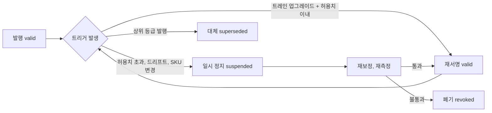

### 14.4 제3자 검증

- **시험기관:** KTL, KOLAS 인정 시험기관, TTA 중에서 지표별로 지정한다.
- **대상 지표(DR):** 합성 전용 mAP 비율, 정책 갭(%p), 라이다 거리 오차(cm), 결정론적 재현율(%)이다. P2 말까지 3개 이상을 받는다.
- **Gold 관련 지표의 이름:** 시험기관과 비교하는 Gold 측정 지표는 'Gold 랩 실측 재현성'(같은 물체를 시험기관이 다시 쟀을 때의 차이)으로 따로 부른다. §16.1의 '자동 Forge 추정값의 Gold 대비 오차' KPI와 섞지 않는다.
- **절차 [A]:** 우리가 프로토콜 문서, 데이터, D0 재현 컨테이너를 제출하면 시험기관이 재현 실행·지표 재계산을 거쳐 시험성적서를 발행한다. 정부과제·IR에는 이 지표만 '검증된 KPI'로 표기한다.
- **목표 수(DR):** 시험성적서 지표 1(P1) → 3(P2) → 5(P3)다. 첫 성적서는 2027 Q4(M12–M14)에 받는다.

---

## 15. Fidelity Lab

**결론: Fidelity Lab은 해자를 생산하는 공장이다. Test Cell 2개(₩2.4억)와 측정 키트(₩1.0억)로 표준 프로토콜 trial을 자동으로 반복해, M24까지 페어드 trial 5만 건과 Gold 자산 800개를 만든다.**

### 15.1 역할·조직·예산

- **소유 범위:** 측정 프로토콜, 테스트 셀, 페어드 코퍼스, Scorecard, 충실도 예측기, 인증서 서명을 소유한다.
- **조직(DR):** Head of Fidelity & Evaluation은 M4까지 확정한다(게이팅 조건). WS4 Fidelity Science & Crucible은 1 → 2 → 3 → 4명, WS4-L 촬영·랩 운영은 1 → 2 → 2 → 3명이다(P0 → P3). P0에는 WS4 sim2real 과학자 1명이 M4에 착석한다. Head가 미확정이면 KAIST·SNU 교수 겸직 Chief Scientist + 시니어 sim2real 엔지니어로 대체한다.
- **일정:** Test Cell 1은 D1–30(2026-10-19 ~ 11-17)에 BOM 확정과 견적 3건을 받고, 2026-11-30(D43)에 발주하며, D61–90(2026-12-18 ~ 2027-01-16)에 시운전과 측정 프로토콜 v1을 낸다. Test Cell 2는 P1(목표 M8, 2027-06 [A])에 가동한다. 휴머노이드·양팔 셀은 파트너 리스로 마련한다(Arena v1 M18 전, 목표 M15–M17 [A]).

**표 15-1. Fidelity Lab 예산(DR 기준안, ₩억)**

| 항목 | 24개월 | 산정 |
|---|---|---|
| 코봇 테스트 셀 2개 | 2.4 | 셀당 1.2(표 15-2) |
| 휴머노이드·양팔 셀(파트너 리스) | 1.2 | 리스·공동 운영 |
| 촬영·측정 키트(온프렘 키트 포함) | 1.0 | 표 15-3 |
| 랩 공간 | 1.6 | 24개월 |
| 소모품·Jetson Thor | 0.6 | 배포 검증 엣지 포함 |
| **합계** | **6.8** | P0 1.6 / P1 2.6 / P2 2.6 |

### 15.2 테스트 셀 구성표(BOM)

DR이 정한 Test Cell 1의 뼈대(코봇, 빈, 카메라 3대, F/T 센서)에 측정 지그를 더한 구성이다. 품목·단가는 계획값이며 셀당 합계를 DR 예산(₩1.2억)에 맞췄다.

**표 15-2. 코봇 테스트 셀 1개 BOM [A]**

| # | 품목 | 사양 | 수량 | 금액(₩만) | 용도 |
|---|---|---|---|---|---|
| 1 | 6축 협동로봇 | 가반하중 ≥5 kg, 앵커 OEM(Doosan Robotics 등) 파트너 조달 우선 | 1 | 4,000 | 밀기·삽입·자동 리셋 |
| 2 | 그리퍼 세트 | 평행 그리퍼 + 진공 흡착 | 1식 | 800 | 피킹·폴리백 |
| 3 | 손목 6축 F/T 센서 | 1 kHz 이상 샘플링 | 1 | 1,000 | 접촉력, 질량 식별 |
| 4 | 카메라 | 글로벌 셔터 RGB 120 fps 이상 2대 + RGB-D 1대 | 3 | 600 | 6D 추적, 인식 실데이터 |
| 5 | 고속 카메라 | 240 fps 이상 | 1 | 700 | 낙하·반발 |
| 6 | 자세 추적 | AprilTag 다중 카메라 또는 경량 모션캡처 | 1식 | 500 | 궤적 기준값 |
| 7 | 측정 지그 | 낙하 장치(전자석 릴리스, 0.1–1.0 m), 전동 경사판(0–45°, 0.1° 분해능), 밀기 표면 3종, 페그·구멍 세트(공차 0.1/0.5/1.0 mm), 케이블 처짐 프레임 | 1식 | 900 | 표준 프로토콜 |
| 8 | 빈·고정구·안전 펜스 | 빈 피킹 구역, 컨베이어 구간 | 1식 | 700 | 피킹 과제 |
| 9 | 조명 리그 | 100–2,000 lux, 2,700–6,500 K 가변 | 1식 | 400 | 조명 조건 통제 |
| 10 | 셀 워크스테이션 | RTX급 GPU, 실시간 로깅, PTP | 1 | 900 | 수집·현장 추론 |
| 11 | 통합·보정·예비 | 설치, 보정 서비스, 예비품 | — | 1,500 | — |
| | **합계** | | | **12,000** | |

**표 15-3. 공용 측정 키트 BOM(₩1.0억 라인) [A]**

| 품목 | 금액(₩만) | 용도 |
|---|---|---|
| 정밀 저울(0.1 g, 30 kg) + 3점 로드셀 COM 측정판 | 500 | 질량·COM |
| 이선 진자 관성 측정 지그 | 300 | 관성 |
| 회전형 3D 라이다 1대 | 1,500 | 라이다 프로파일, 기준 스캔 |
| 기준 IMU | 800 | IMU 프로파일 |
| 반사율 타깃 10/50/90%, ChArUco, ColorChecker, 균일광원 | 500 | 카메라·라이다 프로파일 |
| 촬영 키트(스마트폰 3대, 짐벌, 턴테이블, 휴대 조명) | 700 | Forge 촬영 |
| 온프렘 촬영·재구성 키트(오프라인 GPU 워크스테이션 + 로컬 Forge) | 3,000 | 카메라 반입 제한 사이트(P1) |
| 압입 장치(리니어 스테이지 + 로드셀) | 700 | 촉각·연체 |
| 교정·예비 | 2,000 | — |
| **합계** | **10,000** | |

### 15.3 측정 프로토콜

모든 프로토콜은 버전(`-v1`)을 가지며, 프로토콜이 바뀌면 이전 trial과 섞어 집계하지 않는다.

**표 15-4. 표준 측정 프로토콜**

| 프로토콜 | 목적 | 조건 [A] | 반복(Gold 최소 세트) | 측정량 | 유도 파라미터 | 시뮬 비교 지표 |
|---|---|---|---|---|---|---|
| **P-DROP-v1 낙하** | 반발, 접촉 감쇠, 정지 자세 | 높이 0.3·0.6 m × 자세 3종(면·모서리·꼭짓점) × 바닥 2종(강판, 고무) | 2 높이 × 3 자세 × 2 바닥 × 2회 = 24 | 6D 궤적(240 fps), 반발 높이, 정지 자세, 정착 시간 | 반발계수 e = √(h₂/h₁), 접촉 강성·감쇠 | ADE(첫 1초), FDE, 정지 자세 오차 |
| **P-PUSH-v1 밀기** | 동마찰, COM 오프셋, 질량 | 접촉점 3개, 속도 5 cm/s(기본)·15 cm/s(추가), F/T 장착 엔드이펙터 | 3 접촉점 × (5 cm/s 2회 + 15 cm/s 1회) = 9 | 힘 시계열, 물체 6D 궤적 | 정상 미끄럼 구간 μ_d = F_t/(m·g), 가속 구간 m = F/(a + μ_d·g), 회전 방향·각속도로 COM | ADE/FDE, 힘 RMSE |
| **P-SLIDE-v1 미끄럼** | 정·동마찰 | 전동 경사판 0.5°/s 상승, 표면 2종(강판, PVC 벨트) | 개시각 3회 + 표면 2 × 고정각 3회 = 9 | 미끄럼 개시각 θ_s, 고정각에서 가속도 a | μ_s = tan θ_s, μ_d = tan θ − a/(g·cos θ) | 개시각 오차, 가속도 오차 |
| **P-MASS-v1 질량·관성** | 질량, COM, 관성 | 저울, 3점 로드셀, 이선 진자 | 정적 3회 + F/T 들어올림 5회 = 8 | 질량, 로드셀 반력, 진자 주기 | 이선 진자 관성(아래 식) | 질량·관성 상대오차 |
| **P-INS-v1 삽입** | 접촉 집약 거동 | 원형·사각 페그 × 공차 0.1/0.5/1.0 mm, 횡 오프셋 0·±0.5·±1 mm, 기울기 0·1·2°, 고객 커넥터 표본 | 과제별 조건 격자 × 5회(Gold 최소 세트 외) | F/T 궤적, 성공·걸림, 소요 시간, 촉각 영상(장착 시) | hydroelastic 계수, SDF 해상도 | 성공 판정 일치, 피크 힘 오차, 힘 프로파일 RMSE(Drake·Newton·PhysX) |
| **P-CABLE-v1 케이블 처짐** | 케이블 굽힘·선밀도 | 양단 고정 스팬 0.3/0.5/0.8 m × 처짐비 2종, 캔틸레버 길이 3종 | 조건별 3회(케이블 SKU별) | 중앙 처짐, 3D 형상, 캔틸레버 끝 처짐 | 선밀도 w(저울), 굽힘 강성 EI = wL⁴/(8δ) | 처짐 오차, 형상 Chamfer |

```math
I_{\mathrm{bifilar}}=\frac{m\,g\,d^{2}\,T^{2}}{16\,\pi^{2}\,L}
```

- **기호:** m = 질량, d = 두 줄 사이 간격, T = 진자 주기, L = 줄 길이. 축 3개에 대해 각각 측정해 관성 텐서 대각 성분을 구함.
- **Gold 최소 세트 = 물체당 50 trial [A]:** 낙하 24 + 밀기 9 + 미끄럼 9 + 질량·관성 8. 자동 리셋(로봇이 물체를 원위치)으로 trial당 약 90초, 물체당 약 1.3시간.
- **품질 관리:** 카메라 재투영 오차, F/T 영점, 추적 신뢰도 기준을 통과한 trial만 코퍼스에 등록. 탈락률을 셀 상태 지표로 감시.
- **보정·보류 분리:** 50 trial 중 40은 보정, 10은 보류 검증(Scorecard)용.

### 15.4 페어드 코퍼스 데이터 모델

'페어드 trial' 1건은 품질 관리를 통과한 실측 trial 1건과, 같은 초기 조건으로 재현한 시뮬 실행 1건 이상(강체는 D0 경로, 변형체·입상체는 D1 경로), 그리고 계산된 Scorecard 행의 묶음이다. KPI(1k → 10k → 50k → 150k)는 이 정의로만 센다.

**그림 10. 페어드 코퍼스 ER 모델**

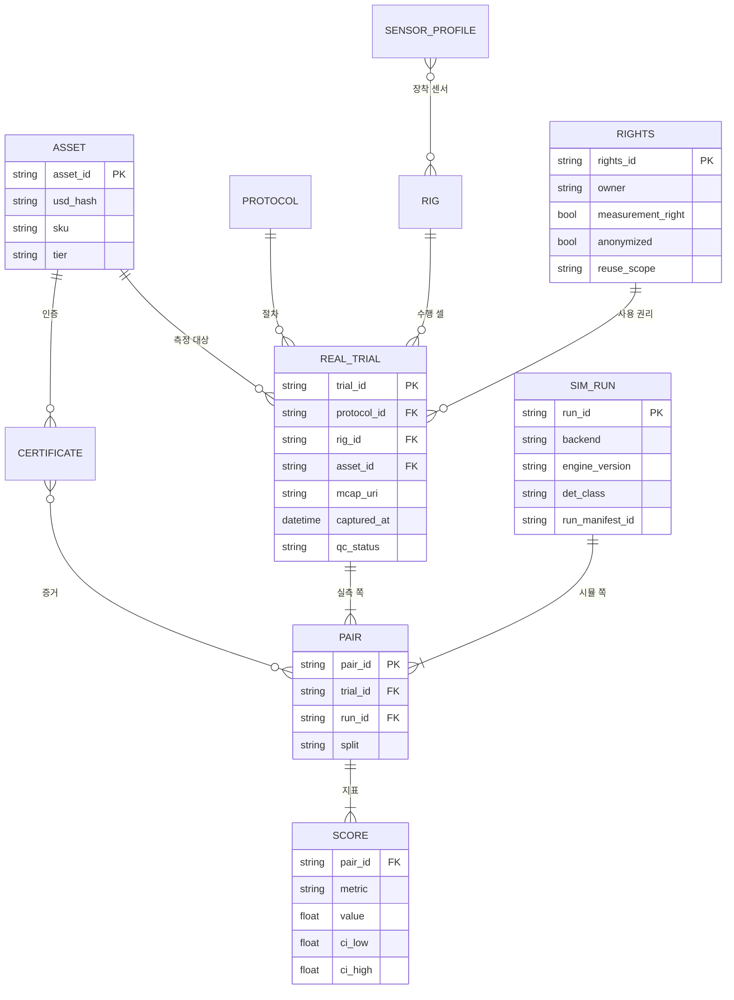

**표 15-5. 저장 형식과 권리 필드**

| 객체 | 형식·저장소 | 핵심 필드 | 비고 |
|---|---|---|---|
| 원시 센서 스트림 | MCAP → 오브젝트 스토어(SeaweedFS 또는 Ceph RGW) | 토픽, 타임스탬프, 보정 ID | 데이터 거주 태그(KR/US/EU) |
| 에피소드(정책 trial) | LeRobotDataset v3 | 관측·행동·보상, 초기 조건 ID | 마켓플레이스 판매 단위 |
| 메타데이터 | Postgres | 표 15-4 엔터티 | 라인리지 질의 |
| 지표 | Parquet | pair_id, metric, value, CI | 분기 해자 KPI 집계 |
| 장면 | OpenUSD 레이어(콘텐츠 해시) | usd_hash | 장면 커밋 서비스 |
| 권리 | Rights 레코드 | 측정권 여부, 익명화, 재사용 범위, 기여자 로열티 | 측정권 고객 10–20% 할인과 연동 |

### 15.5 용량 계산: KPI가 물리적으로 가능한가

| 기간 | 페어드 trial 목표(DR) | Gold 목표(DR) | Gold 최소 세트 기여 [A] | 나머지(정책·센서·고객 셀) [A] | 필요 셀-시간/월 [A] |
|---|---|---|---|---|---|
| P0(M4) | 1k | 30 | 1.5k(일부 프로토콜만 적용 시 약 1k) | — | Test Cell 1만으로 충분 |
| P1(M12) | 10k | 200 | 10k | 정책·센서 trial은 초과 달성분 | 약 1,100 trial/월 ≈ 셀 1개 28시간 |
| P2(M24) | 50k | 800 | 40k | 10k | 약 3,300 trial/월 ≈ 셀 2개 각 42시간 |
| P3(M36) | 150k | 2,000 | 100k | 50k | 약 8,300 trial/월 ≈ 셀 2개 각 105시간 + 고객 셀 |

- **설계 함의:** 코퍼스의 약 2/3를 우리 셀의 Gold 프로토콜이 채우도록 설계 [A]. 측정권 고객 확보(0 → 4 → 12 → 25)가 늦어져도 코퍼스 KPI가 무너지지 않음(DR 리스크 #9 완화).
- **셀 가동 여력:** trial당 90초, 하루 6시간 자동 운전이면 셀당 월 약 4,800 trial. P2까지는 가동률 40% 미만, P3에는 셀 증설(공격안의 셀 3개, 또는 Series B 이후 P3 예산) 또는 고객 셀 trial 확대가 필요.

---

## 16. 단계별 KPI 목표(DR 정합)

**결론: 물리·현실감 KPI의 목표값은 DR §4.1·§4.2·§13.2의 숫자를 그대로 쓴다. [A] 표시 세부 지표는 그 숫자를 달성하기 위한 내부 관리 지표다.**

### 16.1 물리 KPI(DR §4.1)

| 지표 | P0(M4) | P1(M12) | P2(M24) | P3(M36) |
|---|---|---|---|---|
| 적합성 스위트 통과(백엔드 수 × 장면, C01–C15)¹ | 3 × 5 | 4 × 8 | 5 × 12 | 6 × 15 |
| 사내 벤치마크 공개(steps/s/$, 보상 도달 시간) | 10개 과제 | 분기 갱신 | 월간 갱신 | 월간 갱신 |
| 자동 Forge 추정값의 Gold 랩 실측 대비 질량 / 마찰 오차² | ≤15% / ≤25% | ≤10% / ≤20% | ≤8% / ≤15% | ≤5% / ≤10% |
| 궤적 오차 ADE(표준 밀기·낙하 시험) | 기준선 측정 | ≤2 cm | ≤1.5 cm | ≤1 cm |
| 인증 시험 결정론적 재현율(D0 경로) | 100% | 100% | 100% | 100% |
| 신규 엔진 릴리스 채택 지연(고정 버전 기준)³ | — | ≤45일 | ≤30일 | ≤30일 |

¹ 장면 정의의 정본은 [04 §4.6](04-system-architecture.md)의 C01–C15다(05의 S 번호는 쓰지 않고, C16+ 후보는 집계하지 않는다). P0 '3 × 5'의 백엔드 3개는 베이크오프 구성 B1–B5 가운데 Newton/MJWarp 계열·PhysX·MuJoCo CPU의 통과 백엔드 수로 센다. P3 '6'은 클린룸 Fossen을 포함한 6개다(§8.2).

² 'Gold 자산 질량/마찰 오차'의 정의다(결정 D4, DR §4.1). 랩 실측값이 있는 Gold 자산을 기준 세트로 삼아, 같은 자산을 Forge 자동 사슬(VLM 사전분포 + 영상 sysid)로 추정한 값 θ_auto의 상대오차 |θ_auto − θ_lab| / θ_lab을 잰다. Gold 값 자체는 랩 실측이므로 이 지표는 자동화 체인의 정확도, 즉 '랩 없이 만든 Silver 자산이 얼마나 정확한가'를 Gold로 감사하는 지표다. 마찰은 백엔드별 보정값이 아닌 물리량(경사판·밀기 실측 μ) 기준이다. Gold 인증서에는 랩 실측값과 측정 불확도를 기록하며, 이 KPI 수치를 Gold 자산의 인증 임계나 고객 보증 문구로 쓰지 않는다. 시험기관 비교 지표는 'Gold 랩 실측 재현성'으로 따로 부른다(§14.4).

³ 새 엔진 릴리스를 사이드 브랜치에서 적합성 스위트·인증 재현 회귀를 통과한 '검증 완료 후보'로 만들기까지의 일수다. 프로덕션 반영은 다음 릴리스 트레인에서 한다(§8.3).

- **ADE 측정 정의:** P-DROP·P-PUSH 보류 trial(물체당 10개)의 ADE 중앙값을 Gold 자산 전체에서 평균한다.

### 16.2 현실감 KPI(DR §4.2)

| 지표 | P0(M4) | P1(M12) | P2(M24) | P3(M36) |
|---|---|---|---|---|
| 합성 전용 mAP ÷ 실데이터 학습 mAP(보류 실데이터) | ≥0.85 | ≥0.90 | ≥0.95 | 3개 버티컬에서 ≥0.95 |
| 합성 + 실데이터 10% vs 실데이터 100% | — | ≥1.0 | ≥1.0 | ≥1.05 |
| 정책 sim-to-real 성공률 갭(%p) | ≤25(1개 과제) | ≤15(3개 과제) | ≤10(5개 과제) | ≤8(10개 과제) |
| sim/real 성공률 상관(Pearson r, 정책 ≥5개) | — | ≥0.7 | ≥0.8 | ≥0.85 |
| 라이다 거리 오차(보정 타깃) | — | ≤3 cm | ≤2 cm | ≤2 cm + 레이더 프로파일 공개 |
| 증강 프레임 라벨 일관성 검사 통과율 | — | ≥98% | ≥99% | ≥99% |
| 제3자 시험성적서(KTL·KOLAS·TTA) 지표 수 | — | 1 | 3 | 5 |

### 16.3 자산·코퍼스·Forge KPI(DR §4.3·§13.2)

| 지표 | P0(M4) | P1(M12) | P2(M24) | P3(M36) |
|---|---|---|---|---|
| 페어드 실측/시뮬 trial(누적) | 1k | 10k | 50k | 150k |
| Silver/Gold 자산(누적, Bronze 제외) | 150 | 1,000 | 4,000 | 12,000 |
| 그중 Gold(랩 실측) | 30 | 200 | 800 | 2,000 |
| Bronze 자산(참고, KPI 아님) | — | 5,000 | 30,000 | 100,000 |
| 2개 이상 주문에서 재사용된 자산 비율 | — | 20% | 35% | 45% |
| 측정권 부여 고객(누적) | 0 | 4 | 12 | 25 |
| Forge 무개입 비율 | 30% | 60% | 80% | 90% |
| 영상 → Bronze 강체 자산 | ≤2시간(내부) | ≤30분 | ≤15분(셀프서브) | ≤10분 |

### 16.4 게이트와의 연결

| 게이트 | 이 문서 관련 조건(DR) | 이 문서의 담보 장치 |
|---|---|---|
| G0(M4, 2027-02-26) | ② Silver/Gold 한국 SKU 150개 ③ 합성 전용 mAP 비율 ≥0.85 ④ 인증 시험 결정론적 재현 100% | Forge v0 + Test Cell 1, Scorecard v1, MuJoCo CPU D0 재현 |
| G1(M11, 2027-09-24) | ⑥ 3개 피킹 과제 sim-to-real 갭 ≤15%p | 액추에이터 넷, sim2sim 게이트(Tier 1·2), 소량 실데이터 파인튜닝 |
| G3(M24, 2028-10-27) | ④ 5개 과제 갭 ≤10%p ⑤ sim/real r ≥0.8 ⑥ Silver/Gold 4,000개 | Test Cell 2 + 휴머노이드 셀, Gold 최소 세트 자동화 |

### 16.5 내부 관리 지표 [A]

| 지표 | P0 | P1 | P2 | P3 |
|---|---|---|---|---|
| sim2sim Tier 1 첫 시도 통과율([07 §13.3](07-training-module.md)과 같은 값) | 측정 | ≥70% | ≥80% | ≥85% |
| 적합성 스위트 전체 실행 시간 | ≤4시간 | ≤2시간 | ≤2시간 | ≤2시간 |
| Forge 9단계 QA 1차 통과율 | 측정 | ≥70% | ≥85% | ≥92% |
| 발행 센서 프로파일(SKU 누적) | 2 | 8 | 20 | 40 |
| 인증서 이의 제기 D0 재현 리포트 소요 | — | ≤5영업일 | ≤3영업일 | ≤3영업일 |
| Gold 최소 세트 물체당 소요 | 측정 | ≤2시간 | ≤1.5시간 | ≤1.3시간 |

**그림 11. 물리·현실감 주요 이정표**

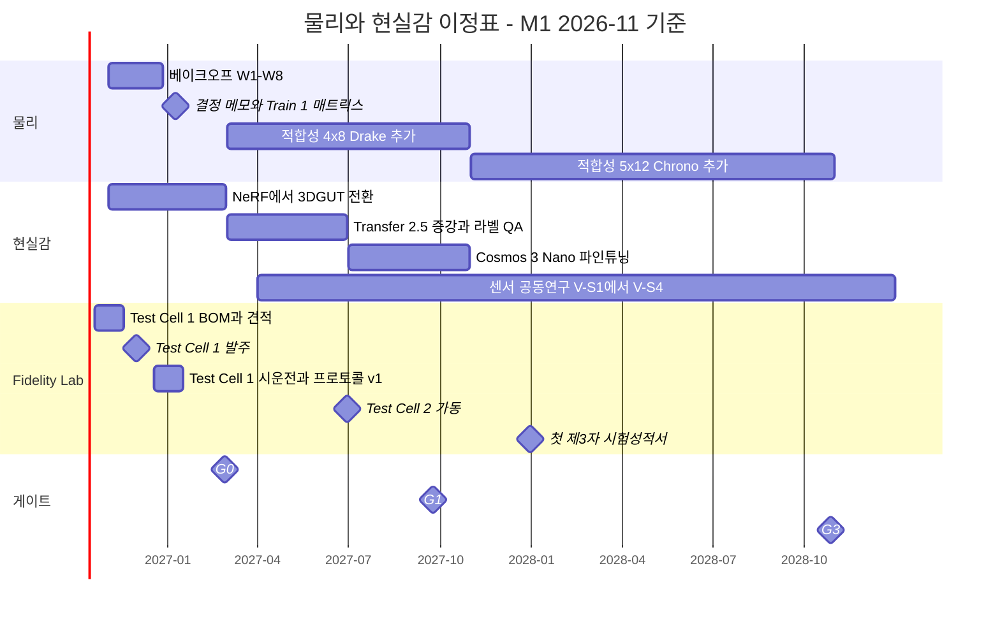

---

## 17. 한계와 리스크: 무엇을 아직 못 하고, 어떻게 가두는가

**결론: 아직 못 하는 것은 접촉 집약 조작의 힘 정확도, 변형체, 레이더 세 가지다. 셋 모두 '운영 범위 + 측정 + 계약 문구'의 세 겹으로 가둔다.**

### 17.1 3대 한계

**표 17-1. 3대 한계와 봉쇄 장치**

| 한계 | 왜 어려운가 | 현재 증거 | 봉쇄 장치 | 계약·대외 문구 | 조기경보 | 책임 |
|---|---|---|---|---|---|---|
| **접촉 집약 조작** | 충격성 접촉, 패치 마찰 근사, float32 누적, 소프트 접촉 침투, 엔진 간 파라미터 비호환 | GAUGE: 충격성 접촉에서 최대 갭[U]. 엔진 간 직접 비교 증거 없음 | Drake 교차 검증, hydroelastic·SDF, 백엔드별 보정, TacSL(Zone F), 액추에이터 넷, 소량 실데이터 + 잔차 RL, sim2sim 게이트 | 운영 범위(공차, 속도, 표면) 명시. PoC 책임 상한 = 계약 금액 | 삽입 과제 갭 >15%p, Drake 대비 피크 힘 오차 >15% | Head of Fidelity + WS1 |
| **변형체** | 파라미터 다수, 결정론 없음, 기울기 부재 | GAUGE: 빠른 직물·체적 변형에서 최대 갭[U]. PhysX는 변형체 결정론 미보장 | 클래스별 표준 프로토콜, 배치 병렬 식별, D1 라벨, Gold 변형체 프로파일 | M12 측정 전 성능 보증 금지. 이후에도 측정 범위 안만 | 폴리백 과제 실셀 성공률 분산 과다 | Head of Fidelity |
| **레이더 현실감** | 다중경로, RCS의 재질·자세 민감도, 해면 클러터, 스플랫 위 레이더 미성숙 | 오픈 센서 모델은 RTX 대비 뒤처짐(심사단 지적). RadaRays 등은 연구 코드 | RTX OmniRadar는 Zone F 산출물만, IITP 공동연구, V-S1–V-S6 검증, 오차 막대 공개 | 검증 전 해양·국방 판매 금지. 단순화 FMCW는 증거물 불가 | 캠페인 RCS 오차 >3 dB | WS3 + 센서 리드 |

### 17.2 그 밖의 리스크

| 리스크 | 봉쇄 장치 |
|---|---|
| 스플랫 조명 굽힘·외삽 열화·스플랫 위 센서 미성숙 | 촬영 사양, 조명 랜덤화 범위 제한, 충돌·라이다용 프록시 메시 |
| 생성형 증강의 물체 경계 이동·문자 환각 | 라벨 QA C1–C8 검사, 재라벨 금지, 1% 사람 감사, 배치 격리 |
| VLM 물성 추정이 수 배 틀림 | Bronze 표기 '추정', KPI 제외, Silver 승급 유도(30초 영상) |
| CoACD 충돌 형상 부풀림(적층 시 부유) | 부피 부풀림 ≤3%, 적재 안정 시험(후보 장면 C18 박스 5단 적재), 핵심부 SDF |
| MJWarp 60 DoF 초과 약점 | T11 판정, PhysX 경로·트리 분할 |
| Newton 미성숙·월간 API 변화, Isaac Lab 3.x EA | 릴리스 트레인 핀, 적합성 CI, 엔진 접촉 워크스트림 용량 25% 예약 |
| GPU 비결정성이 '재현 가능' 약속을 훼손 | D0/D1/D2 등급, 대외 문구 규칙, Newton W7 시험 |
| 측정권 거부로 코퍼스 정체 | 코퍼스 2/3를 자체 Gold 프로토콜로 채우는 설계, 측정권 할인 10–20% |
| Head of Fidelity 채용 실패(단일 실패점) | 겸직 Chief Scientist 대체 경로, Crucible 외부 출범 연기 |
| 벤더 벤치마크 수치 오용 | 사내 베이크오프 수치(steps/s/$)만 의사결정에 사용 |

**그림 12. 리스크 지도**

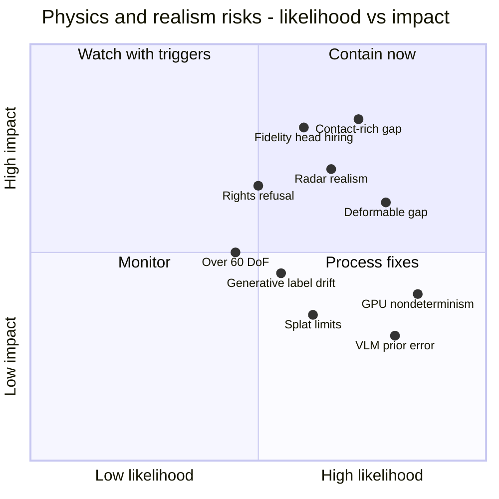

---

## 18. 결정 사항 및 다음 액션

**결론: 이 문서로 확정하는 것은 결정론 3등급, 엔진별 보정, Gold 최소 세트, KPI 측정 정의, 구역별·2단 sim2sim 게이트, 적합성 장면 정본(C01–C15)과 변형체 인증 범위, 라벨 QA 8개 검사, 레이더 판매 조건, NeRF 퇴역일이다.**

**결정 사항**

| # | 결정 | 근거 절 |
|---|---|---|
| D1 | 결정론을 D0/D1/D2(Run Manifest `D0_bitwise`/`D1_statistical`/`D2_generative`/`none`)로 나누고, 인증서는 D0에서만 발행한다. P0 인증 재현은 MuJoCo CPU 단독, Newton 결정론 모드는 W7 N1–N5 결과에 따라 허용 범위를 정한다. Chrono·Fossen·PX4 SITL은 반복 비트 일치 시험과 CTO 등록 전까지 D1이다 | §2.1, §6 |
| D2 | 물성 파라미터는 백엔드별로 보정하고 인증서에 백엔드별 세트(보정 dt 포함)로 저장한다. 파라미터 복사를 금지한다 | §3.4, §7, §14.2 |
| D3 | Gold 최소 측정 세트를 물체당 50 trial(낙하 24, 밀기 9, 미끄럼 9, 질량·관성 8)로 고정한다 | §15.3 |
| D4 | 'Gold 자산 질량/마찰 오차' KPI는 Forge 자동 추정 사슬을 Gold 랩 실측으로 감사하는 지표로 정의한다. 이 수치를 Gold 인증 임계나 고객 보증 문구로 쓰지 않는다 | §16.1 |
| D5 | sim2sim 게이트는 Zone F에서 3개(Newton·PhysX·MuJoCo CPU), Zone T/S에서 2개(Newton·MuJoCo CPU) 백엔드로 운영하고, 임계값은 07 §7.3의 Tier 1(전 정책, ≤10%p)·Tier 2(인증 대상, ≤5%p·RMSE ≤0.05 rad) 2단을 따른다 | §2.2, §8.4 |
| D6 | 증강 프레임은 라벨 QA C1–C8을 모두 통과해야 납품하며, 재라벨을 금지한다 | §12.2 |
| D7 | 레이더·EO/IR은 V-S4(오차 막대 공개 + 제3자 성적서) 완료와 Wave 3 트리거 충족 전까지 해양·국방에 판매하지 않는다 | §11.3 |
| D8 | CEN NeRF 런타임은 2027-02-26(G0)에 프로덕션에서 퇴역한다 | §10.4 |
| D9 | 적합성 장면의 정본은 04 §4.6의 C01–C15로 하고, 05에만 있던 장면은 C16–C21 후보(KPI 미집계)로 둔다. 변형체 인증서는 정적 보정 항목만 MuJoCo CPU D0 재현·'experimental'로 발행한다 | §2.1, §8.1 |

**다음 액션**

| 액션 | 책임 | 기한 |
|---|---|---|
| CEN NeRF 파이프라인 SPDX 감사 착수, 금지 구성요소 킬스위치 적용 | CTO(대행) + 라이선스 자문 | 2026-11-30(M1) |
| 적합성 스위트 v0(C01–C05) × 3개 백엔드(베이크오프 W2, 실행 구성 B1–B5) | WS1 Kernel 리드(CTO 대행) | 2026-11-13(W2) |
| Test Cell 1 BOM 확정(표 15-2)과 견적 3건 | Head of Fidelity(대행) | 2026-11-17(D30) |
| Test Cell 1 발주 | Head of Fidelity(대행) + CFO | 2026-11-30(D43) |
| 변형체 인증 규칙(정적 보정 항목만 D0 'experimental')을 04 Kernel 라우팅(`deformable.certify`)과 08 팩 매니페스트에 반영 요청 | Head of Fidelity(대행) + WS1 Kernel 리드 | 2026-12-18(M2) |
| Newton 결정론 모드 N1–N5 시험(베이크오프 W7) | WS1 + Sim Architect | 2026-12-18(W7 금) |
| T11 60 DoF 초과 스트레스 테스트와 O1–O4 판정(베이크오프 W7) | WS1 + Skill Lead | 2026-12-18(W7 금) |
| 베이크오프 결정 메모에 작업 유형별 라우팅 표(표 2-1)와 C01–C15 허용치 최종값 확정 반영 | CTO | 2027-01-08 |
| Test Cell 1 시운전, 측정 프로토콜 v1(P-DROP, P-PUSH, P-SLIDE, P-MASS) 발행 | Head of Fidelity + WS4-L | 2027-01-15(D61–90) |
| `aic:TwinCertificate` 스키마 v1.0, JSON 사이드카, Ed25519 서명 서비스 | Forge Lead + WS1(P0 라이선스 레지스트리 백엔드) | 2027-01-31 |
| Forge v0로 첫 Silver 자산 50개 | Forge Lead | 2027-01-31 |
| Scorecard v1(mAP 비율, ADE/FDE, PSNR/SSIM/LPIPS) 운영 | Head of Fidelity | 2027-02-26(G0) |
| Silver/Gold 150개, 합성 전용 mAP 비율 ≥0.85, D0 재현 100% 달성 | Forge Lead + Head of Fidelity | 2027-02-26(G0) |
| 라벨 일관성 QA v1(C1–C8)을 Cosmos Transfer 2.5와 함께 DATA 라인에 적용 | WS3 리드 | 2027-03-31(M5) |
| IITP 센서 물리 공동연구(V-S1) 제안서 제출 | WS9 BD + WS3 리드 | 2027-04-30 |
| Test Cell 2 가동, P-INS·P-CABLE 프로토콜 발행, 카메라·라이다·IMU 프로파일 1차 | Head of Fidelity + WS3 | 2027-06-30 |
| Cosmos 3 Nano 16B 한국 도메인 파인튜닝 착수(V7 법률 검토 통과 조건) | WS3 + WS5 | 2027-07-31(M9) |
| 3개 피킹 과제 sim-to-real 갭 ≤15%p 확인(G1 조건 ⑥) | Skill Lead + Head of Fidelity | 2027-09-24(G1, M11) |
| 첫 제3자 시험성적서(지표 1개) 확보 | Head of Fidelity | 2027-12-31 |
| Chrono CPU D0 등록 시험(반복 비트 일치, 04 §4.6 DT-5)과 CTO 등록 | WS1-M + WS1 | 2028-08(M22) [A] |
