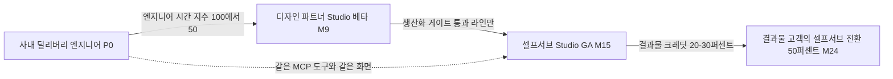
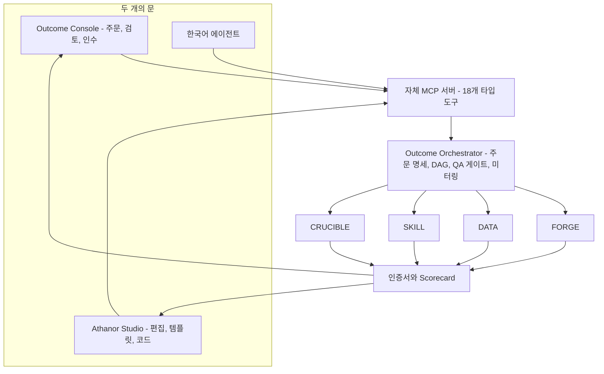
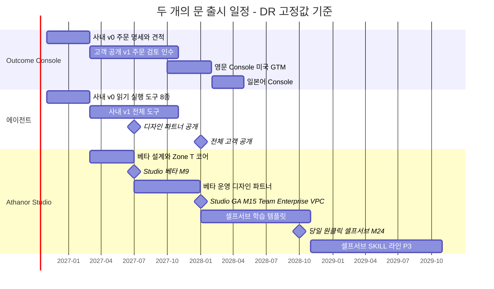
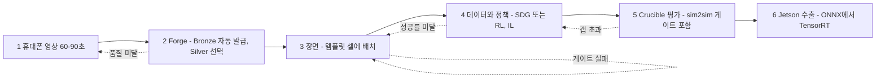
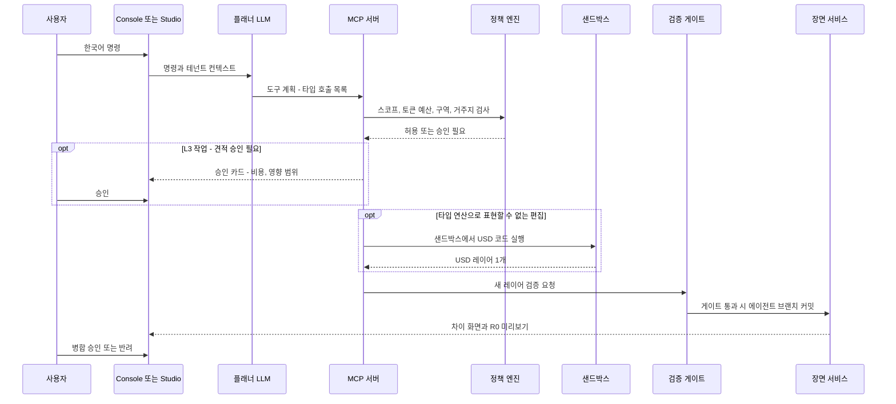
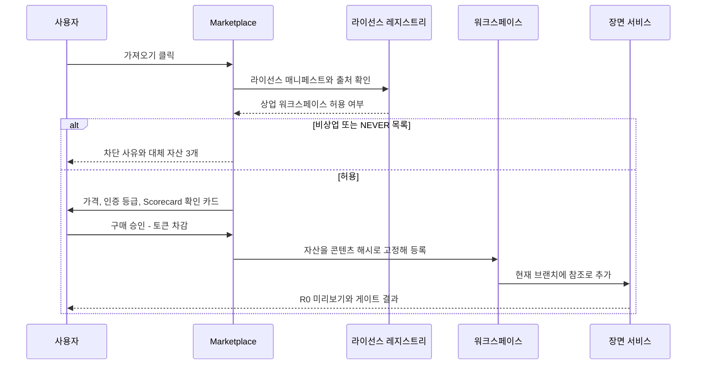
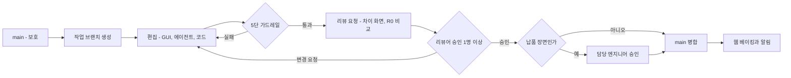

# 06. 사용성과 한국어 에이전트: 두 개의 문, 원클릭 경로, 검증되는 말

> **문서 번호** 06 · **기준일** 2026-10-06 · **버전** v1.1(DR v1.1·문서 간 정합 반영) · **상위 문서** [README](README.md)
> **관련 문서** [01 비전·포지셔닝](01-vision-positioning.md) · [02 시장·경쟁](02-market-competition.md) · [03 엔진 선정·Build vs Buy](03-engine-selection-build-vs-buy.md) · [04 시스템 아키텍처](04-system-architecture.md) · [05 물리·현실감](05-physics-and-realism.md) · [07 학습 모듈](07-training-module.md) · [08 도메인 팩](08-domain-packs.md) · [09 로드맵·조직·예산](09-roadmap-organization-budget.md) · [10 사업모델·GTM](10-business-model-gtm.md) · [11 리스크·KPI·컴플라이언스](11-risk-kpi-compliance.md) · [12 90일 실행](12-execution-90days.md) · [부록 A 기술 카탈로그](appendix-a-technology-catalog.md) · [부록 B 출처·검증](appendix-b-sources-verification.md)
> **표기** **[A]** 계획 가정(실측·실적 확인 전까지 설계 목표치) · **[U]** 1차 출처 미확인(대외 사용 전 [부록 B](appendix-b-sources-verification.md) 절차로 재검증) · 태그 없는 버전·라이선스는 GitHub·PyPI에서 확인한 값(2026-10-05/06) · M1 = 2026년 11월, P0 = M1–M4(2026.11–2027.02), P1 = M5–M12(2027.03–2027.10), P2 = M13–M24(2027.11–2028.10), P3 = M25–M36(2028.11–2029.10) · 게이트 G0 M4(2027-02-26), G1 M11(2027-09-24), G2 M18(2028-04-28), G3 M24(2028-10-27) · 1 토큰 = ₩100 · **DR** = [결정 기록](00-decision-record.md)(단일 기준, 수치 충돌 시 DR 우선) · 독자: CEO, Product Lead, WS7(Studio UX·Agent·Marketplace), 디자인 파트너, 투자·정부 실사 담당자

---

## 핵심 요약

- **편의성은 '두 개의 문 + 한국어 에이전트 + 원클릭 경로'로 만들고, 시간으로 측정한다.** 대표 목표는 Studio 첫 시뮬레이션 5분(M24), 휴대폰 영상 → 학습된 피킹 스킬 당일(M24), 한국어 명령 성공률 90%(M24)다. 단계별 전체 KPI는 §11.1 표에 둔다.
- **문은 두 개, 생산 라인은 하나다.** Outcome Console(한국어로 주문·검토·인수)과 Athanor Studio(CEN 워크스페이스 안에서 직접 제작)는 같은 MCP 도구, 같은 Orchestrator, 같은 인증 체계를 호출한다. Studio는 **M9(2027.07) 디자인 파트너 베타(Zone T 전용, Explorer는 대기자 명단 초대제), M15(2028.01) GA(공개 가입)**이고, 생산화 게이트(무개입 ≥80%, 라인 총마진 ≥60%(완전원가 기준, [10 §6.4](10-business-model-gtm.md)), 서면 라이선스 근거)를 통과한 라인만 셀프서브로 연다.
- **에이전트는 '코드를 실행하는 챗봇'이 아니라 18개 타입 도구와 5단 가드레일이다.** 권한을 L0(읽기)부터 L4(사람 전용)까지 다섯 단계로 나눈다. 인증서 발행, `main` 병합, 거주지를 넘는 반출, 배포 롤백은 에이전트가 단독으로 할 수 없다. 모든 변경은 불변 커밋이라 '되돌리기'는 포인터 이동 한 번이다.
- **에이전트는 사내 딜리버리 엔지니어가 먼저 쓴다.** P0에 읽기·실행 도구 8종으로 시작하고, 사내에서 엔지니어 시간 감소가 확인된 도구만 M9 디자인 파트너(읽기·실행·브랜치 편집), M15 전체 고객 순으로 연다. 목표는 M12 결과물당 엔지니어 시간 지수 50(P0 대비 절반)이다. 효과가 증명되지 않은 도구는 고객에게 열지 않는다.
- **원클릭 경로는 6단계 파이프라인이다.** 휴대폰 영상 → 인증 자산(Forge) → 장면 → 데이터·정책 → Crucible 평가 → Jetson 수출(ONNX → TensorRT). 각 단계는 독립 게이트와 시간 예산을 가지며, M24에는 셀프서브로 당일(≤8시간 벽시계 [A]) 안에 끝나야 한다.
- **기본 화면은 서버 GPU를 쓰지 않는다.** 브라우저 렌더 R0(three.js r186(WebGPU/WebGL2) + Spark 2.x(WebGL2), PlayCanvas 2.23(WebGPU), Babylon.js 9.29(OpenUSD WASM))와 스플랫 LOD 스트리밍이 기본이고, 서버 렌더 세션은 버튼을 눌렀을 때만 RT GPU 1장 단위로 과금한다(서울 대화형 95 토큰/시간). 그래서 뷰어·리뷰어 좌석을 무료·무제한으로 줄 수 있다.
- **언어는 한국어가 기본이고, 영어는 M12, 일본어는 M18에 붙인다[A].** 접근성은 WCAG 2.2 AA를 GA 출시 조건으로 둔다[A]. 3D 뷰포트도 키보드 조작과 스크린리더용 장면 트리를 제공한다.

---

## 1. 사용성 설계 원칙

**결론: 원칙은 여덟 개이고, 각 원칙은 화면 규칙과 측정 지표로 번역된다. 핵심은 '고객의 RL·시뮬 팀이 없다'는 전제다. 한국 1·2차 협력사와 로봇 OEM 대부분은 시뮬레이션 전문가를 두지 못한다([02 §9](02-market-competition.md)). 그래서 기본값이 정답이어야 하고, 돈이 나가기 전에 반드시 견적이 보여야 하며, 모든 조작은 되돌릴 수 있어야 한다.**

| # | 원칙 | 화면·시스템 규칙 | 측정 | 하지 않는 것 |
|---|---|---|---|---|
| U1 | **결과물 우선** | 첫 화면은 '무엇을 얻고 싶은가'(데이터셋, 스킬, 인증 트윈, 평가)를 묻는다. 엔진·솔버 선택은 숨기고 라우팅 규칙([04 §4.3](04-system-architecture.md))이 고른다 | 주문 명세 완성까지 걸린 시간 | 첫 화면에 빈 3D 캔버스와 툴바만 띄우는 것 |
| U2 | **한국어 우선** | UI·문서·에러 메시지·에이전트 응답의 원문은 한국어다. 용어는 용어집 한 곳에서 관리한다(§12) | 번역 누락 문자열 0건 | 영어 원문을 기계번역해 출시하는 것 |
| U3 | **기본값이 정답** | 템플릿마다 검증된 기본 보상·관측·랜덤화 프리셋을 둔다. 사용자가 아무것도 바꾸지 않아도 돌아가고, 바꾼 값은 기본값과의 차이로 표시한다 | 첫 실행 무오류 완료율 ≥95% [A] | 필수 입력 필드 20개짜리 마법사 |
| U4 | **돈이 나가기 전 견적** | 토큰을 쓰는 모든 동작은 견적 → 확인 → 홀드 → 정산 순서를 밟는다. 일일·프로젝트 상한을 넘으면 자동으로 멈춘다 | 견적 대비 실청구 초과 >10% 건수 0 [A] | 실행 후 청구서로 비용을 처음 알리는 것 |
| U5 | **모든 것은 되돌릴 수 있다** | 장면 변경은 불변 커밋이고 브랜치는 포인터다. 실행 취소는 포인터 이동이다. 삭제는 30일 휴지통을 거친다[A] | 되돌리기 성공률 100% | 원본 장면을 덮어쓰는 편집 |
| U6 | **증거가 보인다** | 결과물 화면에는 항상 Sim2Real Gap Scorecard, 인증 등급, Run Manifest 링크가 붙는다 | Scorecard 열람률 | '성공했습니다' 한 줄로 끝나는 완료 알림 |
| U7 | **설치하지 않는다** | 브라우저만으로 첫 시뮬레이션까지 간다. 코드가 필요한 사용자만 Jupyter·VS Code·Selkies 데스크톱을 연다 | Studio 첫 시뮬레이션 시간(DR KPI) | 로컬 CUDA·드라이버 설치를 요구하는 온보딩 |
| U8 | **점진적 공개** | 같은 설정을 GUI → YAML → Python 세 층으로 본다. 아래 층에서 바꾼 값은 위 층에 그대로 반영된다 | 고급 기능 도달률(YAML 편집 사용자 비율) | 노코드와 코드가 서로 다른 설정 파일을 쓰는 것 |

**왜 '안에서 밖으로'인가.** 사용성 투자 순서는 사내 딜리버리 엔지니어 → 디자인 파트너 → 셀프서브 고객이다. 사내 엔지니어가 매일 쓰는 도구가 먼저 매끄러워져야 결과물당 엔지니어 시간이 줄고(DR 지수 100→50), 그 시간이 줄어든 라인만 생산화 게이트를 통과해 셀프서브로 열린다. 처음부터 불특정 다수를 위한 Studio를 만드는 대안은 버렸다. Isaac Lab·Newton이 무료로 풀린 시장에서 '빈 편집기'는 차별점이 될 수 없고([01](01-vision-positioning.md)), 검증되지 않은 셀프서브 라인은 지원 비용으로 총마진을 갉아먹는다.



---

## 2. 페르소나와 여정 지도

**결론: 다섯 페르소나는 '어느 문으로 들어오는가'와 '무엇으로 성공을 판정하는가'가 모두 다르다. 그래서 여정의 첫 가치 순간(first value moment)을 페르소나별로 정의하고, 그 순간까지의 시간을 KPI로 잰다.**

### 2.1 페르소나 개요

| 페르소나(가명) | 소속 예 | 목표 | 기술 수준 | 기본 문 | 지불 방식 | 첫 가치 순간 | 성공 판정 |
|---|---|---|---|---|---|---|---|
| **P-A 로봇 OEM 응용 엔지니어** 김도윤 | 국내 협동로봇 OEM 응용기술팀 | 고객 현장마다 피킹 스킬을 빨리 맞춘다 | ROS 2·Python 중상, RL 하 | Console → Studio | Cell-to-Policy PoC(₩1.5–2.5억), Builder·Team | 자사 그리퍼 + 고객 SKU로 시뮬 피킹이 도는 화면 | 실셀 성공률, sim-to-real 갭 ≤15%p |
| **P-B 공장 생산기술 엔지니어** 박서연 | 재벌 계열 공장 또는 1·2차 협력사 생산기술팀 | 비전 검사·피킹 라인의 데이터 부족 해소 | PLC·비전 중, Python 하 | Console | 데이터셋 팩(₩5,000만–2억), 바우처 연계 | 자기 라인 사진으로 만든 합성 데이터 샘플 | 합성 전용 mAP ≥ 실데이터 학습의 90% |
| **P-C ML 연구원** 이준호 | 로봇 FM 스타트업·연구기관 | 정책 실험을 빠르게 돌리고 비교한다 | RL·VLA 상, 시뮬 중 | Studio(코드) | Builder·Team 토큰, 평가 캠페인 | Jupyter에서 `athanor` SDK로 4,096 환경 학습 시작 | 반복 실험 주기, 평가 신뢰구간 |
| **P-D 데이터 구매자** Emily Park | 미국 로봇 FM·휴머노이드 기업 데이터 리드 | 상업 라이선스가 깨끗한 롱테일 시연·평가 데이터 확보 | 데이터 파이프라인 상 | Console(영문) | VLA 데이터 팩, Crucible 캠페인, 연 USD 1–3M 다계정 계약 | 샘플 에피소드 + 라이선스 매니페스트 검토 | 데이터 품질 지표, 서명 리포트 |
| **P-E 3D 크리에이터·기여자** 최하늘 | 프리랜서 테크니컬 아티스트, 중소 공장 촬영 기여자 | 촬영·모델링 결과를 인증 자산으로 팔아 수익화 | 3D 툴 상, 물리 하 | Studio(Explorer→Builder) + Marketplace | 판매 수익 75%, 재사용 로열티 | 내 스캔이 Bronze 인증과 함께 리스팅되는 순간 | 월 판매액, 인증 등급 상승 |

### 2.2 P-A 로봇 OEM 응용 엔지니어

| 단계 | 행동 | 접점 | 고통·감정 | 설계 대응 | 측정 |
|---|---|---|---|---|---|
| 인지 | M12 K-Pick Challenge 결과를 본다 | 리더보드, 영업 | "우리 로봇도 채점받을 수 있나" | 공개 리더보드와 참가 신청 1쪽 | 참가 신청 수 |
| 계약 | 12주 PoC 오퍼 시트 검토 | Console 견적 | 인수 기준이 모호하면 내부 결재 불가 | 인수 기준(성공률, 갭 ≤15%p, 정책 ≥5개 r)을 주문 명세에 숫자로 고정 | 제안→계약 기간 |
| 첫 가치 | 2주 차에 자사 로봇·그리퍼 트윈과 고객 SKU 장면을 R0로 확인 | Console 검토 화면 | "실제와 같은가" 불신 | 장면 옆에 자산별 인증 등급과 Scorecard | 첫 검토까지 영업일 |
| 검토·인수 | 정책 5개의 sim/real 결과 비교, 인수 서명 | Console 인수 화면 | 실셀 결과 해석 부담 | 신뢰구간 포함 비교표, 서명 리포트 PDF | 인수 소요일 |
| 확장 | 결과물 크레딧으로 Studio에서 다른 고객 SKU를 직접 돌림 | Studio, 에이전트 | 학습 설정을 처음부터 다시 해야 하나 | 납품물마다 'Studio에서 열기' 버튼, 같은 템플릿·브랜치 그대로 | 크레딧 사용률, 셀프서브 전환 |
| 옹호 | 양산 스킬 프로그램, Arena 회원 | Crucible | 재학습 SLA | 현장 MCAP 실패 마이닝 루프(P2) | NRR |

### 2.3 P-B 공장 생산기술 엔지니어

| 단계 | 행동 | 접점 | 고통·감정 | 설계 대응 | 측정 |
|---|---|---|---|---|---|
| 인지 | 바우처 공고나 SI 소개로 접촉 | 영업, 바우처 | 예산 시점(12–1월 확정, 1–2분기 발주) | 바우처 연계 결과물 SKU 카탈로그 | 리드→미팅 |
| 보안 심사 | 카메라 반입 금지, 데이터 반출 금지 확인 | 보안 서약 | "공장 사진이 밖으로 나가면 안 된다" | 온프렘 촬영·재구성 키트(P1), 거주 태그 KR, 익명화 | 심사 통과 기간 |
| 주문 | 검출 클래스·조명 범위·실데이터 보류셋을 입력 | Console 주문 마법사(한국어) | 데이터 사양 용어가 낯설다 | 사진 업로드 → 에이전트가 클래스·조명 범위를 제안 → 사용자는 확인만 | 주문 명세 완성 시간 |
| 첫 가치 | 합성 샘플 200장과 라벨 오버레이 확인 | Console 갤러리 | 라벨 품질 의심 | 샘플별 라벨 일관성 검사 결과 표시 | 샘플 승인률 |
| 인수 | 보류 실데이터로 mAP 비율 확인 | Scorecard | 측정 방법 분쟁 | 계약서와 같은 지표·보류셋으로 자동 계산 | 인수 실패율 |
| 확장 | 라인 변경 때 재주문, 온프렘 전환 | Console, Sovereign | 매번 재계약 | 재주문은 이전 명세 복제 + 차이만 수정 | 재주문 주기 |

### 2.4 P-C ML 연구원

| 단계 | 행동 | 접점 | 고통·감정 | 설계 대응 | 측정 |
|---|---|---|---|---|---|
| 가입 | SSO 가입, Explorer 또는 Builder | Studio | 설치·드라이버 문제(Warp 1.18은 R580 이상 필요) | 사전 구성된 워크스페이스 이미지, 설치 0 | 가입→첫 시뮬레이션(≤10분→≤5분) |
| 첫 가치 | 템플릿 선택 → 4,096 환경 학습 → 롤아웃 영상 | Studio, Jupyter | 결과가 재현되는가 | Run Manifest 자동 첨부, 시드·GPU SKU 기록 | 첫 학습 완료 시간 |
| 반복 | 보상·랜덤화 수정, 스윕 | YAML 편집기, `sim.sweep` | 스윕 비용 폭주 | 견적 ≥1,000 토큰이면 승인 카드 | 실험 주기 |
| 비교 | 정책 여러 개를 같은 스위트로 평가 | Crucible(자체 평가), Rerun 0.38.1 | 벤치마크 포화(LIBERO 약 97–99%) | 고객 시나리오 스위트, 신뢰구간 | 평가 실행 수 |
| 내보내기 | LeRobot v3, ONNX | `dataset.export` | 라이선스 오염 | 비상업 가중치·자산 자동 차단 | 차단 건수 |
| 확장 | 팀 협업, 프라이빗 마켓 | Team | 실험 공유 | 브랜치·코멘트, 무료 리뷰어 좌석 | 워크스페이스당 활성 인원 |

### 2.5 P-D 데이터 구매자(글로벌)

| 단계 | 행동 | 접점 | 고통·감정 | 설계 대응 | 측정 |
|---|---|---|---|---|---|
| 탐색 | 데이터 카드·샘플 확인(M12–M15 미국 GTM 착수) | 영문 Console, 데이터 카드 | 상업 라이선스·출처 불명 | 라이선스 매니페스트, 출처(촬영원·동의·익명화), Run Manifest를 샘플과 함께 공개 | 샘플 요청→미팅 |
| 실사 | 법무·보안 검토 | 데이터룸 | 비상업 오염(AgiBot World, ManiSkill 자산 등) | NEVER 목록 차단 증빙, SBOM | 실사 기간(목표 2–4주) |
| 주문 | 로봇·과제·분포 지정 | Console 주문 명세(영문) | 롱테일 분포 정의가 어렵다 | 분포 편집기(§7.4)를 주문 화면에 그대로 노출 | 명세 수정 횟수 |
| 첫 가치 | 첫 1,000 에피소드 납품, 자사 파이프라인 적재 | LeRobot v3 스트리밍 | 포맷 변환 비용 | LeRobotDataset v3 기본, MCAP 원본 동봉 | 적재 오류 0 |
| 평가 | Crucible 캠페인으로 자사 정책 채점 | Crucible 리포트 | 자기 채점 신뢰도 | 공동서명 기관 입회 리포트(헌장 서명 후) | 캠페인 재주문 |
| 갱신 | 다계정 연간 계약 | 계정 대시보드 | 납품 일정 예측 | 처리량·잔여 크레딧 대시보드 | NRR ≥110%(M24) |

### 2.6 P-E 3D 크리에이터·마켓플레이스 기여자

| 단계 | 행동 | 접점 | 고통·감정 | 설계 대응 | 측정 |
|---|---|---|---|---|---|
| 가입 | Explorer(무료, Bronze 변환 월 3회) | Studio 모바일 웹 | 물리 파라미터를 모른다 | 촬영 가이드 영상 + 실시간 품질 체크 | 첫 업로드율 |
| 첫 가치 | 휴대폰 영상 → Bronze 자산 ≤30분(M12) | Forge 진행 화면 | 기다림, 실패 원인 불명 | 단계별 진행률, 실패 시 재촬영 지점 안내 | 영상→Bronze 시간 |
| 등급 상승 | Silver(영상 기반 식별) 주문, Gold는 실물 랩 측정 의뢰 | Console | Gold 비용·물류 | 등급별 인증 비용(물체 ₩30만–150만, Bronze→Gold)과 마켓 예상 판매가 차이를 같은 화면에 | 등급 상승 비율 |
| 리스팅 | 라이선스·출처·동의 입력 | Marketplace 리스팅 마법사 | 법적 용어 부담 | 라이선스 템플릿 3종 + 동의서 체크리스트 | 리스팅 완료율 |
| 수익 | 판매 75%, 재사용 로열티 | 정산 대시보드 | 정산 투명성 | 판매·재사용 내역, 월 정산 | 월 판매액 |
| 성장 | Team 전환, 버티컬 팩 제작 | Studio | 수요 파악 | 검색어·미충족 수요 리포트 공개 | 재리스팅 수 |

### 2.7 페르소나 × 기능 우선순위

| 기능 | P-A OEM | P-B 공장 | P-C ML | P-D 구매자 | P-E 크리에이터 | 출시 |
|---|---|---|---|---|---|---|
| Console 주문·인수 | ●● | ●●● | ● | ●●● | ● | P0 내부, P1 고객 |
| 한국어 에이전트 | ●●● | ●●● | ●● | ○(영문) | ●● | P0 사내 → M9 베타 |
| 원클릭 경로 | ●●● | ●● | ●● | ○ | ●●● | P1 내부 24시간 → M24 셀프서브 당일 |
| 노코드 편집기 | ●● | ●● | ●(YAML 선호) | ● | ○ | M9 베타 |
| Jupyter·VS Code·SDK | ● | ○ | ●●● | ●● | ○ | M9 |
| Marketplace 원클릭 가져오기 | ●● | ● | ●● | ●● | ●●● | M9(Certified 등급) |
| 협업(브랜치·리뷰·코멘트) | ●● | ●●● | ●● | ● | ● | M9 기본, M15 Team |

(●●● 결정적, ●● 중요, ● 보조, ○ 해당 적음)

---

## 3. 두 개의 문: Outcome Console과 Athanor Studio

**결론: Console은 '맡기는 문', Studio는 '직접 만드는 문'이다. 두 문은 같은 18개 MCP 도구를 호출하므로 같은 일을 두 번 구현하지 않는다. Studio는 M9 베타(디자인 파트너, Zone T 전용), M15 GA(생산화 게이트를 통과한 FORGE·DATA 라인부터)로 연다.**

### 3.1 왜 두 개인가: 검토한 대안

| 대안 | 장점 | 탈락 사유 |
|---|---|---|
| Studio 하나(셀프서브 전용) | 제품이 단순하다 | 한국 고객 대부분은 RL·시뮬 팀이 없어 도구를 사도 못 쓴다. 첫 매출(M4 데이터셋)이 늦어진다 |
| Console 하나(결과물 전용) | 첫 매출이 빠르다 | 반복매출과 소프트웨어 멀티플 조건(반복매출 ≥50%, M36)을 만들 수 없다. 서비스 회사로 평가받는다 |
| **두 문 + 한 생산 라인(채택)** | Console로 매출을 내고, 같은 라인을 Studio로 연다 | 두 화면의 일관성 관리가 필요하다 → 같은 도구·같은 컴포넌트 라이브러리로 해결 |

### 3.2 기능 비교

| 기능 영역 | Outcome Console | Studio 베타(M9) | Studio GA(M15) | 구역 |
|---|---|---|---|---|
| 진입 | 한국어 주문 마법사, 에이전트 대화 | 템플릿 갤러리, 에이전트 | 템플릿 + 셀프서브 라인 | T |
| 장면 편집 | 읽기 전용 R0 검토, 코멘트 | 타입 연산 편집(배치·물성·센서), 브랜치 | + 변형(variant), 병합 규칙 설정 | T |
| Forge | 인증 트윈 주문(Bronze→Gold) | Bronze 셀프서브(Explorer 월 3회) | Bronze·Silver 셀프서브(생산화 게이트 통과 시) | T(셀프서브), F(Gold·관절·VBD 생산) |
| DATA | 데이터셋 팩 주문, 샘플 승인, mAP 인수 | 소규모 SDG(R1·R2) | DATA 셀프서브(게이트 통과 시) | R3는 F 산출물만 |
| SKILL | Cell-to-Policy PoC, 양산 스킬 프로그램 | Newton·MuJoCo 템플릿 학습 | 셀프서브 학습 템플릿(P2), 셀프서브 SKILL 라인은 P3 | T |
| 평가 | Crucible 캠페인 주문, 서명 리포트 | 자체 평가(시뮬, '자체 평가' 라벨) | + 회귀 게이트, 리더보드 제출 | T, 실셀은 Lab |
| 인증서 | 발급 주문·열람·진위 검증 | 열람 | 열람, Bronze 자동 발급 | 발급은 Fidelity 역할 |
| 코드 | — | Jupyter, VS Code, `athanor` SDK | + Selkies 데스크톱, gRPC | T |
| 고충실도 보기 | RTX 결과는 사전 렌더 영상·이미지로 검토 | R1·R2 서버 세션(RT GPU 1장) | 동일 + 웜 풀 | R3 스트리밍은 F 사내·BYOL만 |
| 과금 | 계약 금액, 결과물 크레딧 20–30% | Explorer 무료, Builder ₩99,000/월 | + Team ₩190만/월, Enterprise VPC 연 ₩2억부터 | — |
| 협업 | 리뷰어·뷰어 무료 | 브랜치·코멘트 | + 프라이빗 마켓, SSO(Enterprise) | — |

### 3.3 공유 백본



- **같은 도구 원칙:** Console의 '주문하기' 버튼은 `order.quote` → `job.submit`을, Studio의 '학습 시작' 버튼은 `skill.train`을 호출한다. 에이전트도 같은 도구를 부른다. UI에만 있는 기능은 만들지 않는다. 그래야 에이전트 평가 세트가 곧 UI 회귀 테스트가 된다.
- **문 사이 이동:** 모든 납품물에는 'Studio에서 열기' 버튼이 붙고, 결과물 계약 금액의 20–30%는 12개월 유효 CEN 토큰 크레딧으로 들어온다(DR §4.3). Studio에서 막히면 '이 작업 맡기기' 버튼이 현재 브랜치를 주문 명세 초안으로 변환해 Console로 넘긴다.

### 3.4 출시 타임라인



| 시점 | Console | Studio | SKU(DR §10.3) |
|---|---|---|---|
| P0(M1–M4) | 사내 v0: 주문 명세, 견적, 인수 체크리스트 | — | — |
| M5 | 고객 공개 v1(PoC 판매 개시와 동시) | — | Cell-to-Policy PoC |
| **M9(2027.07)** | — | **베타(Zone T 전용)**: 브라우저 R0 뷰어, Newton·MuJoCo 템플릿, Bronze Forge 셀프서브 | Explorer(무료, 대기자 명단 초대제·주간 승인 상한), Builder(₩99,000/월, 베타) |
| M12 | 영문 Console | 베타 MAW 30 | — |
| **M15(2028.01)** | — | **GA**: 공개 가입, 생산화 게이트 통과 라인부터 | Builder GA, Explorer 공개 가입, Team(₩190만/월, 편집석 5석, 25,000 토큰. 리뷰어·뷰어 좌석 무료·무제한), Enterprise VPC(연 ₩2억부터) |
| M18 | 일본어 Console[A] | Sovereign GA와 같은 UI | Athanor Sovereign GA |
| M24 | — | 셀프서브 당일 원클릭, MAW 300 | — |
| M36 | — | 셀프서브 SKILL 라인, MAW 1,500 | — |

- **M9 베타의 문 크기:** DR은 Studio 베타를 '디자인 파트너 대상'으로, Explorer를 'M9(베타)' 시작으로 정했다. 둘을 함께 만족시키기 위해 M9에는 디자인 파트너(Builder 베타)를 전면 개방하고, Explorer는 대기자 명단 기반 초대제로 주당 승인 상한을 두어 연다[A]. 무료 프리뷰는 DR대로 '비신뢰' 전용 노드 풀에서 돈다. 공개 가입은 M15 GA에 연다.

---

## 4. 원클릭 경로: 휴대폰 영상에서 Jetson까지

**결론: '원클릭'은 버튼 하나로 모든 일이 끝난다는 뜻이 아니다. 사용자가 내리는 결정을 세 번(촬영 확인, 견적 승인, 배포 승인)으로 줄인다는 뜻이다. 나머지 단계는 기본값과 게이트가 처리하고, 실패하면 정확히 어디로 돌아가야 하는지 알려 준다.**

### 4.1 전체 흐름



### 4.2 단계별 UX

| 단계 | 사용자 화면·행동 | 시스템 처리 | 게이트 | 사용자 결정 |
|---|---|---|---|---|
| **1 촬영** | 모바일 웹에서 '물체 등록'. 화면 가이드가 궤도 촬영을 안내하고, 흔들림·노출·가림을 실시간으로 경고한다. A4 ChArUco 카드를 함께 찍는다[A] | 업로드 중 프레임 품질 점수 계산, 부적합 구간 표시 | 선명 프레임 ≥120장, 커버리지 ≥80%[A] | ① 촬영 확인 |
| **2 Forge** | 진행률 바(재구성 → 기하·충돌체 → 물성 추정 → 물리 QA). 완료 시 R0로 회전·낙하 미리보기 | gsplat 1.6.0/3DGRUT 2.0 재구성, MapAnything-apache·DA3 기하(VGGT-1B-Commercial은 V7 통과 후 조건부), CoACD 충돌체, VLM 물성 사전분포, 물리 QA | Bronze: 수밀 메시, 질량·관성 정합성, 2-백엔드 낙하 시험. Silver: 밀기·낙하 영상 기반 식별 | (선택) Silver 업그레이드 견적 |
| **3 장면** | "이 박스를 2번 셀 빈에 20개 넣어"(에이전트) 또는 템플릿 셀 갤러리에서 드래그 | `scene.apply_ops`로 브랜치 커밋, R0 미리보기 | 5단 가드레일([04 §10.3](04-system-architecture.md)) | — |
| **4 데이터·정책** | 목표 선택: 검출기(SDG) 또는 피킹 정책(RL·IL). 기본 프리셋으로 견적 표시 | `sdg.generate` 또는 `skill.train` DAG, 실시간 롤아웃 영상(R1 타일 카메라) | 견적 승인, 성공률 조기 종료 기준 | ② 견적 승인 |
| **5 평가** | 자동 실행. 결과는 Scorecard 카드(성공률 95% 신뢰구간, 조건별 분해) | `eval.run` 시뮬 스위트, sim2sim Tier 1 교차 실행(Zone T: Newton ↔ MuJoCo CPU, [07 §7.3](07-training-module.md)) | Tier 1 허용치(성공률 차 ≤10%p, 반환 비율 ≥0.85), 회귀 게이트 | — |
| **6 Jetson 수출** | 대상 선택(Jetson AGX Thor, JetPack 7.2) → 패키지 다운로드 또는 장비 직접 배포 | ONNX(opset 고정) → 대상 Jetson에서 JetPack 7.2 번들 TensorRT(버전 [U])로 엔진 빌드, 지연 프로파일, 서명 패키지 | sim2sim Tier 1 적용률 100%(DR) | ③ 배포 승인(사람만) |

- **Crucible 단계의 성격:** 셀프서브 경로의 평가는 시뮬 스위트에 대한 **'자체 평가(self-assessed)'**다. 실셀 평가와 공동서명 인증서는 Console에서 Crucible 캠페인으로 주문한다. 공동서명 기관과 헌장에 서명하기 전에는 외부 채점을 하지 않는다는 DR 원칙(§5.3)을 UI 라벨로 강제한다.
- **Bronze 인증의 발급 주체:** Bronze는 Forge 파이프라인이 서비스 계정으로 자동 서명한다(VLM 추정 등급). Silver는 자동 식별 + 표본 QA, Gold는 랩 실측과 사람 2인 승인이다. 에이전트는 `cert.issue`를 호출할 수 없다(§5.3).

### 4.3 시간 예산(DR KPI 정합)

| 구간 | P0(M4) 내부 | P1(M12) | P2(M24) 셀프서브 | P3(M36) | 산정 근거 |
|---|---|---|---|---|---|
| 영상 → Bronze 강체 자산 | ≤2시간(내부) | ≤30분 | ≤15분 | ≤10분 | **DR KPI** |
| 장면 구성(템플릿 + 에이전트) | 4시간 | 1시간 | 15분[A] | 10분[A] | 에이전트 성공률 상승 |
| 데이터 또는 정책 학습(벽시계) | 24시간 | 12시간 | 3시간[A] | 2시간[A] | 상태 기반 그래스프 RL 2–3 GPU-시간을 GPU 2장으로 병렬[A] |
| 평가 + sim2sim 게이트 | 8시간 | 4시간 | 45분[A] | 20분[A] | 결정론 재생은 MuJoCo CPU(LIGHT 풀) |
| Jetson 수출 | 4시간 | 2시간 | 20분[A] | 10분[A] | TensorRT 엔진 빌드 + 지연 프로파일 |
| 사람 검토·대기 버퍼 | 잔여 | 잔여 | ≤2시간[A] | ≤1시간[A] | 승인 대기 포함 |
| **영상 → 학습된 피킹 스킬** | **48시간(내부)** | **24시간** | **당일(≤8시간 [A])** | **4시간** | **DR KPI** |

- **'당일'의 정의[A]:** 촬영 업로드 완료부터 서명된 Jetson 패키지 다운로드 가능 시점까지 벽시계 8시간 이하다. 오전 10시에 찍으면 오후 6시 전에 받는다.
- **비싼 경로는 기본값에서 뺀다.** 카메라 기반 RL은 상태 기반보다 약 16배 느리므로, 원클릭 기본값은 상태 기반 교사 정책 → 시각 학생 정책 증류다. 시각운동 Mimic 1,000개 생성은 P1 기준 ≤12시간이 목표(DR)라 당일 경로에 넣지 않는다.

### 4.4 실패 처리

| 실패 | 탐지 지점 | 사용자에게 보이는 것 | 자동 조치 | 사람 개입 |
|---|---|---|---|---|
| 반사·투명 물체 재구성 실패 | Forge 기하 단계 | "표면 반사로 형상 신뢰도 낮음. 무광 스프레이 또는 다른 조명에서 재촬영" + 실패 프레임 | 생성형 3D 보완 후보 제시(TRELLIS.2는 nvdiffrast 교체 후, SAM 3D는 민수·V7 통과 후) | Forge 무개입 실패 큐(P2 목표 무개입 80%) |
| 질량·관성 비정상 | 물리 QA | 추정값과 허용 범위, '실측 질량 입력' 필드 | 바운딩 박스 기반 재추정 | — |
| 장면 게이트 실패 | 가드레일 ②–④ | 실패한 prim 경로와 이유를 장면에서 강조 | 에이전트 재시도 최대 3회 | 3회 실패 시 사용자에게 선택지 |
| 학습 미수렴 | `skill.train` 조기 종료 | 보상 곡선, 원인 후보(보상 스케일, 랜덤화 범위) | 예산 상한에서 정지, 체크포인트 보존 | 템플릿 담당자 알림(Builder 이상) |
| sim2sim Tier 1 편차 초과 | 평가 | 백엔드별 성공률 차이 표 | 수출 차단 | 랜덤화 확대 제안 |

---

## 5. 한국어 LLM 에이전트(MCP)

**결론: 에이전트의 가치는 말을 알아듣는 데가 아니라 '틀린 말을 실행하지 않는 데'에 있다. 타입 도구가 할 수 있는 일은 타입 도구로만 하고, 코드 생성은 샌드박스와 5단 가드레일 뒤에 둔다. 권한은 사용자의 부분집합이며, 돈·인증·배포·반출은 사람이 최종 결정한다.**

### 5.1 설계 결정

| 결정 | 채택 | 검토한 대안과 탈락 사유 |
|---|---|---|
| 프로토콜 | 자체 MCP 서버(사양 2026-07-28) | 자체 함수 호출 API: 외부 에이전트·IDE 연동이 막힌다 |
| 실행 단위 | 타입 도구 18종 + `scene.apply_ops` 8개 연산 우선 | 임의 Python 실행(isaac-sim-mcp, blender-mcp 방식): RCE·프롬프트 인젝션 표면이 열린다 |
| 코드 생성 | 타입 연산으로 표현 못 하는 편집만, gVisor/Kata 샌드박스 | 코드 우선: 검증 비용이 크고 재현성이 떨어진다 |
| API 그라운딩 | NVIDIA kit-usd-agents(Apache-2.0; Kit MCP 12, USD Code MCP 7, OmniUI MCP 10, Isaac Sim MCP 5 도구)는 **개발 단계에서만** | 런타임 노출: 테넌트에게 Kit 의존을 만들고 Zone T 원칙을 깬다 |
| 자산 자동 작성 | NVIDIA usd-content-agents(Apache-2.0: 재질·물성 분류·관절 추론)를 Forge 내부 단계로 30일 내 채택 검토 | 자체 개발 고집: NVIDIA 무료 공개가 원가를 낮추는 것을 놓친다 |
| 시나리오 출력 | OpenSCENARIO DSL 2.1.0으로 제한 | 자유 텍스트 시나리오: 재현·수출이 안 된다 |
| 공개 순서 | 사내(P0) → 디자인 파트너(M9) → 전체(M15) | 동시 공개: 실패 비용을 고객이 진다 |

### 5.2 구조



- **컨텍스트 구성:** 플래너에는 ① 사용자 명령 ② 현재 브랜치의 장면 요약(prim 트리 상위 3단계, 의미 라벨, 인증 등급) ③ 토큰 잔액·일일 상한 ④ 허용 도구 목록과 스키마만 들어간다. 다른 테넌트 데이터는 검색 인덱스 단계에서 분리된다.
- **한국어 정규화:** 수량("5만 장", "스무 개"), 단위("0.3에서 0.8 사이", "섭씨", "럭스"), 조명 표현("형광등", "야간 LED")을 구조화 값으로 바꾸는 정규화 사전을 둔다. 사전은 평가 세트 실패 사례에서 매달 갱신한다[A].

### 5.3 타입 도구와 권한 레벨

**권한 레벨 정의**

| 레벨 | 의미 | 에이전트 실행 | 사용자 확인 | 예 |
|---|---|---|---|---|
| **L0 읽기** | 부작용 없음 | 자동 | 불필요 | `scene.search`, `scene.query`, `scene.diff`, `asset.search`, `job.status`, `twin.query`, `order.quote` |
| **L1 브랜치 쓰기** | 에이전트 브랜치에 새 레이어 커밋. `main`은 불가 | 자동 | 병합 시 | `scene.apply_ops` |
| **L2 예산 내 컴퓨트** | 토큰 소모. 일일 예산 안이면 자동 | 자동(예산 내) | 예산 초과 시 | `sim.run`, `job.submit` |
| **L3 견적 승인** | DAG 생성, 큰 비용, 데이터 이동 | 승인 카드 생성까지 | **필수** | `sim.sweep`(≥1,000 토큰), `sdg.generate`, `skill.train`, `eval.run`, `asset.certify`, `twin.forecast`, `dataset.export` |
| **L4 사람 전용** | 인증·병합·배포·반출 | **불가** | 사람이 직접 실행 | `cert.issue`(Fidelity 역할, 2인 승인[A]), `main` 병합, 배포·롤백, 거주지 교차 반출 |

**도구별 매핑(18종, [04 §10.2](04-system-architecture.md)와 동일)**

| 도구 | 레벨 | 사내 공개 | 고객 공개 | 한국어 명령 예 |
|---|---|---|---|---|
| `scene.search` | L0 | P0 | M9 | "Silver 이상 라면 박스 찾아줘" |
| `scene.query` | L0 | P0 | M9 | "그리퍼 마찰계수 얼마로 돼 있어?" |
| `scene.diff` | L0 | P0 | M9 | "어제 커밋이랑 뭐가 달라?" |
| `scene.apply_ops` | L1 | P0 | M9 | "빈 2번에 박스 20개 넣어" |
| `asset.search` | L0 | P0 | M9 | "마켓에서 상업용 팔레트 찾아" |
| `asset.certify` | L3 | P1 | M9(Bronze), M15(Silver) | "이 자산 Silver로 올려" |
| `sim.run` | L2 | P0 | M9 | "10초만 돌려 봐" |
| `sim.sweep` | L2/L3 | P1 | M9 | "마찰 0.3–0.8로 6단계 돌려" |
| `sdg.generate` | L3 | P0 | M9(R1·R2 소규모), M15(DATA 셀프서브, 게이트 통과 시) | "세 가지 조명에서 5만 장" |
| `skill.train` | L3 | P1 | M9(템플릿 한정) | "피킹 정책 학습시켜" |
| `eval.run` | L3 | P1 | M9(자체 평가) | "정책 5개 비교해" |
| `cert.issue` | L4 | P1(사내만) | 불가 | — |
| `twin.query` | L0 | P2 | P2 | "지난주 실셀 실패 에피소드 보여줘" |
| `twin.forecast` | L3 | P2 | P2 | "AMR 두 대 추가하면 처리량은?" |
| `dataset.export` | L3 | P1 | M9 | "LeRobot v3로 내보내" |
| `order.quote` | L0 | P1 | P1(Console) | "이거 맡기면 얼마야?" |
| `job.submit` | L2 | P1 | M9(SDK) | SDK 전용 |
| `job.status` | L0 | P0 | M9 | "학습 어디까지 됐어?" |

- **P0 사내 v0 도구 8종:** `scene.search`, `scene.query`, `scene.diff`, `scene.apply_ops`, `asset.search`, `sim.run`, `sdg.generate`(사내), `job.status`. DR의 M4 데모("한국어 명령으로 셀 장면을 구성·랜덤화")를 이 8종으로 만든다.
- **세션 토큰:** 에이전트 세션 토큰은 사용자 스코프의 부분집합이고 유효시간 1시간이다[A]. 리뷰어·뷰어 좌석의 에이전트는 L0만 쓴다.

**승인 카드(L3) 필수 항목**

| 항목 | 내용 | 왜 필요한가 |
|---|---|---|
| 작업 요약 | 한국어 한 문장 + 호출할 도구 목록 | 사용자가 '무엇을 승인하는지' 안다 |
| 영향 범위 | 브랜치, 바뀌는 prim 수, 생성될 Job·DAG 노드 수 | 예상 밖 대량 변경을 막는다 |
| 비용 | 예상 토큰 범위와 상한, 풀(RT·TRAIN·LIGHT), GPU 수 | U4 원칙. 상한 초과 시 자동 정지 |
| 시간 | 예상 완료 시각(벽시계) | 원클릭 경로의 시간 예산 관리 |
| 구역·거주지 | Zone(T 또는 F 산출물), 거주 태그 | 라이선스·데이터 경계를 사용자에게도 노출 |
| 경고 | 실측 범위 이탈, 비상업 자산, 미검증 백엔드(예: Kamino 실험적) | 숨은 위험을 승인 전에 드러낸다 |
| 되돌리기 | 취소 시 처리(체크포인트 보존, 미사용 홀드 환급) | U5 원칙 |

**타입 연산 예시(`scene.apply_ops`)**

```json
{
  "tool": "scene.apply_ops",
  "branch": "agent/u_0412/cell-busan-02",
  "base_commit": "sha256:7c1e…",
  "ops": [
    {"op": "add_asset", "asset": "ath://asset/kr-ramen-box-a@silver", "count": 20,
     "placement": {"region": "/World/Cell/Bin_02", "mode": "random_drop", "seed": 4127}},
    {"op": "set_physics_material", "target": "/World/Cell/Bin_02/**/ramen_box_*",
     "static_friction": 0.55, "dynamic_friction": 0.45},
    {"op": "add_sensor", "type": "rgbd", "profile": "ath://sensor-profile/d435-kr-lab-03",
     "mount": "/World/Cell/Frame/TopMount", "fps": 30}
  ],
  "dry_run": false
}
```

### 5.4 한국어 대화 예시 6선

예시 1–5는 P1 사내 v1, 예시 6은 P2(Athanor Live 연결 후) 기준이다. 토큰 견적은 DR 단가(RT 배치 60, 서울 대화형 95, TRAIN 80, LIGHT 20 토큰/GPU-시간, 래스터 이미지 ₩0.3, RTX 실시간 이미지 ₩1.5)로 계산했다. 예시 속 과거 실적·결과 수치와 작업 시간은 설명용 가정[A]이다.

#### 예시 1. 장면 구성

> **사용자:** 부산 2공장 피킹 셀 복제해서 빈 2번에 라면 박스 20개 넣어 줘. Silver 이상만 쓰고, 위에서 내려다보는 RGB-D 카메라 하나 달아.
>
> **에이전트:** 부산 2공장 셀(`main@7c1e`)을 기준으로 `agent/cell-busan-02` 브랜치를 만들었습니다. Silver 이상 라면 박스는 3종이 있어서 판매량 1위인 `kr-ramen-box-a`(Silver, 질량 오차 실측 대비 8%)를 썼습니다. 카메라는 이 셀에서 실측한 D435 프로파일을 붙였습니다. 게이트 4단계를 모두 통과했습니다. 아래 미리보기를 보고 병합해 주세요.

```text
① scene.search   {"query":"ramen box","min_grade":"silver","license":"commercial"}  → 3건
② scene.apply_ops {add_asset×20, set_physics_material, add_sensor}               → layer sha256:91ab…
③ 게이트: UsdValidation+AIC 통과 · 관통 최대 0.4 mm · Newton/MuJoCo CPU 500스텝 NaN 0
④ 브랜치 커밋 → 차이 화면(+21 prim, 1 material) · 비용 0 토큰
```

#### 예시 2. 도메인 랜덤화

> **사용자:** 조명은 주광, 형광등, 야간 LED 세 가지로 하고 박스 마찰은 0.3에서 0.8, 카메라 노출은 ±1 EV로 랜덤화해. 바닥 텍스처도 바꿔.
>
> **에이전트:** 랜덤화 레이어를 추가했습니다. 바닥 텍스처는 상업 라이선스가 확인된 사내 라이브러리 12종에서 뽑습니다. 마찰 0.3은 이 박스의 실측 하한(0.41)보다 낮아 물리적으로 과한 범위일 수 있습니다. 그대로 둘까요, 0.35로 올릴까요?

```text
① scene.query  /World/Cell/Bin_02/**/ramen_box_*.physics → 실측 μs 0.41–0.62 (Silver 인증서)
② scene.apply_ops {randomize: light.preset ∈ {daylight_5600K, fluorescent_4000K, led_night_3000K};
                   physics.static_friction ~ U(0.30,0.80); camera.exposure_ev ~ U(-1,+1);
                   floor.material ∈ lib://floor/commercial/*(12)}
③ 게이트 통과(랜덤 표본 32개 장면으로 스모크) · 경고 1건: 범위가 인증 실측 범위를 벗어남
```

#### 예시 3. SDG 주문

> **사용자:** 이 박스를 세 가지 조명에서 5만 장 생성해. COCO 포맷이고, 실데이터 보류셋으로 mAP 비율도 같이 봐 줘.
>
> **에이전트:** 렌더 방식별로 두 가지 견적을 드립니다. (A) RTX 실시간 렌더: 5만 장 × ₩1.5 = ₩75,000(750 토큰), 팩토리 산출물로 생산해 납품합니다. (B) 래스터(R1·R2): 5만 장 × ₩0.3 = ₩15,000(150 토큰). 이 셀은 금속 반사가 많아 지난 주문에서 (A)가 mAP 비율 0.93, (B)가 0.86이었습니다. (A)를 권합니다. 공통으로 라벨 일관성 QA(LIGHT 2시간, 40 토큰)와 mAP 검증용 RF-DETR-N 학습·보류셋 평가(TRAIN 약 15 GPU-시간, 1,200 토큰)가 붙어 (A)는 합계 1,990 토큰(약 ₩19.9만)입니다. mAP 검증을 빼면 790 토큰입니다. 승인하시겠습니까?

```text
① order.quote  {product:"dataset_pack", frames:50000, renderer:["R3","R2"], format:"coco",
                acceptance:{metric:"synthetic_only_map_ratio", holdout:"cust_real_holdout_v2"}}
② [승인 카드] 1,990 토큰 · 예상 10시간 · 거주지 KR · R3는 Zone F 산출물(산출물 면제 서면 확인 전제, 거부 시 B로 재견적)
③ sdg.generate → DAG: render → label QA(≥98%) → RF-DETR-N 학습 → 보류셋 mAP → Scorecard
```

#### 예시 4. RL 학습

> **사용자:** 이 셀에서 피킹 정책을 학습시켜. 성공률 90% 넘으면 멈추고, 비용은 5만 원 안에서.
>
> **에이전트:** 빈 피킹 템플릿(RL-02)으로 Newton 백엔드에서 GPU당 4,096 환경, RT GPU 2장으로 학습합니다. 상한 500 토큰(₩50,000) 안에서 최대 4시간, 성공률 90%(최근 2,000 에피소드)에 도달하면 멈춥니다. 예상 소요는 2–3 GPU-시간(120–180 토큰)입니다. 학습이 끝나면 MuJoCo CPU 교차 실행으로 sim2sim Tier 1 게이트(수출 차단 기준)를 자동으로 돌립니다.

```text
① skill.train {template:"RL-02-bin-pick@1.3", scene:"agent/cell-busan-02@91ab", backend:"newton_mjwarp",
               envs_per_gpu:4096, gpus:2, pool:"RT-batch", stop:{success_rate:0.90, window:2000},
               budget_tokens:500, export_gate:"sim2sim"}
② [승인 카드] 상한 500 토큰 · 예상 120–180 · 롤아웃 영상 R1 타일 30초마다 갱신
③ job.status → 1시간 22분 · 성공률 0.91 · 164 토큰 · sim2sim Tier 1 편차 3.1%p(허용 10%p) 통과
```

#### 예시 5. 평가

> **사용자:** 어제 학습한 정책 다섯 개를 비교해 줘. 야간 조명 조건이랑 박스가 찌그러진 경우도 넣고.
>
> **에이전트:** 피킹 평가 스위트 8과제에 야간 LED와 '변형 박스' 조건을 추가해 정책당 조건별 200 에피소드씩 돌립니다. 비용은 약 60 토큰입니다. 결과는 '자체 평가' 라벨이 붙은 Scorecard로 나오고, 1위 정책은 MuJoCo CPU 결정론 재생으로 재현성을 확인합니다. 실셀 평가가 필요하시면 Crucible 캠페인으로 견적을 따로 내겠습니다.

```text
① eval.run {policies:[p_0921_a…e], suite:"crucible-sim/pick-v0(8)",
            extra_conditions:["led_night_3000K","deformed_box"], episodes_per_cell:200,
            ci:"wilson95", replay:"mujoco_cpu_deterministic(top1)"}
② 결과: p_0921_c 0.92 [0.90, 0.94] · 야간에서 −6%p · 변형 박스에서 −11%p(가장 큰 약점)
③ 회귀 게이트: 이전 배포본 대비 비열등 통과 · 재현율 100%(CPU 경로)
```

#### 예시 6. 실패 진단

> **사용자:** 실셀에서 폴리백 피킹 성공률이 지난주 91%에서 74%로 떨어졌어. 왜 그래?
>
> **에이전트:** 현장 로그 312개 에피소드 중 실패 81건을 분류했습니다. 실패의 68%가 지난 화요일부터 들어온 신규 폴리백 SKU에서 나왔고, 주된 형태는 흡착 직후 미끄러짐입니다. 시뮬에서 같은 실패 41건을 재생해 보니 마찰을 0.25 이하로 낮췄을 때만 재현됩니다. 현재 학습 분포의 하한은 0.35입니다. 다음을 제안합니다. ① 신규 SKU를 Silver로 인증(물체 인증 트윈 단가 ₩30만–150만 범위의 견적), ② 마찰 하한을 0.2로 넓혀 재학습(약 200 토큰), ③ 재학습 정책이 회귀 게이트를 통과할 때까지 현재 정책 유지. 배포 롤백이 필요하면 Studio 배포 화면에서 직접 실행해 주세요. 저는 배포를 바꿀 수 없습니다.

```text
① twin.query {cell:"busan-02", since:"2028-03-02", outcome:"fail", fields:["sku","phase","mcap"]} → 81건
② scene.diff {a:"deployed@3f02", b:"live-snapshot@2028-03-09"} → 신규 SKU 1종, 조명 변화 없음
③ sim.sweep {replay:81, vary:{friction:[0.15,0.45,step 0.05], latency_ms:[0,40]}} → 재현 조건 μ≤0.25
④ 제안 카드: asset.certify(L3) · skill.train(L3) · 배포 롤백(L4, 사람)
```

### 5.5 검증 게이트, 실패 처리, 롤백

**게이트는 [04 §10.3](04-system-architecture.md)의 5단을 그대로 쓴다.** ① 샌드박스(gVisor 또는 Kata, egress 차단, 60초·2코어·4 GiB 제한[A]) ② UsdValidation + AIC 검증기 ③ 물리 정합성(질량·관성, t=0 관통 ≤1 mm, 관절 한계) ④ 2-백엔드 스모크(Newton·MuJoCo CPU 각 500스텝) ⑤ 사람 병합. 이 문서는 사용자 경험 쪽 규칙을 정한다.

| 실패 유형 | 예 | 에이전트 동작 | 사용자에게 보이는 것 | 기록 |
|---|---|---|---|---|
| 의도 모호 | "박스 좀 더 넣어" | 수치를 확정하는 질문 1회(선택지 3개) | 선택 버튼 | 명확화 비율 |
| 도구 인자 오류 | 존재하지 않는 prim 경로 | 스키마 오류를 받아 재계획, 최대 3회 | 없음(성공 시) | 재시도 수 |
| 게이트 실패 | 관통 3 mm | 실패 prim과 수치를 받아 수정, 최대 3회 | 3회 실패 시 원인과 선택지 | 게이트별 실패율 |
| 정책 거부 | 예산 초과, 구역 위반, 비상업 자산 | 실행하지 않고 사유 설명 | 거부 사유와 대안(예: 래스터 견적) | 거부 로그 |
| 실행 중 실패 | 스팟 선점, NaN 폭발 | 스냅샷에서 재개(최대 3회), NaN이면 정지 | 진행 상태, 소모 토큰 | Run Manifest |
| 위험 명령 | "인증서 바로 발행해" | L4이므로 거절 | 담당 역할과 절차 안내 | 레드팀 지표 |

**롤백 규칙**

- **장면:** 커밋은 불변이고 브랜치는 포인터다. '되돌리기'는 브랜치 포인터를 이전 커밋으로 옮기는 일이며, 에이전트가 만든 커밋 묶음은 '에이전트 세션' 단위로 한 번에 되돌린다. `main`에 병합된 변경은 역커밋(revert commit)으로만 되돌린다.
- **작업:** 승인 후 시작한 DAG는 '취소'하면 진행 중 노드를 정지하고 체크포인트를 보존한다. 과금은 실제 소모분만 하고 홀드한 나머지는 즉시 돌려준다. 시스템 원인 실패(선점 3회 초과, 플랫폼 오류)는 소모 토큰을 전액 환급한다[A].
- **데이터·모델:** 데이터셋과 정책은 버전 레지스트리(MLflow 3)에 남고 삭제 대신 '폐기(deprecated)' 표시를 한다. 라이선스 리콜(출처 문제 발견) 시 계보를 따라 영향받은 산출물을 자동으로 표시한다([04 §11.4](04-system-architecture.md)).
- **배포:** 배포와 배포 롤백은 L4다. 에이전트는 롤백이 필요하다는 판단과 근거만 낸다.

### 5.6 평가 세트: 20 / 50 / 100 명령 스크립트

**판정 규칙:** 스크립트 하나는 초기 장면 커밋, 한국어 명령(1–4턴), 기대 결과(기대 장면 차이 또는 기대 도구 호출·인자 허용 범위, 기대 승인 카드)로 구성된다. 성공은 "최종 장면이 게이트를 통과하고 기대 차이와 일치" 또는 "정확한 도구·인자로 승인 카드를 만들고, 승인 후 작업이 성공"이다. 각 스크립트를 시드를 바꿔 3회 실행하고 평균을 낸다[A]. 거절해야 하는 명령은 거절이 성공이다.

| 범주 | P0 20개(≥80%) | P1 50개(≥85%) | P2 100개(≥90%) | 대표 명령 |
|---|---|---|---|---|
| 장면 구성 | 6 | 10 | 16 | "컨베이어 끝에 빈 두 개 놓아" |
| 랜덤화 | 4 | 7 | 12 | "조명 세 가지, 마찰 0.4–0.7" |
| 조회·비교 | 4 | 6 | 10 | "어제 커밋과 차이 알려 줘" |
| SDG 주문 | 3 | 5 | 8 | "5만 장, COCO, 야간 포함" |
| 실행·상태 | 3 | 4 | 6 | "10초 돌리고 영상 보여 줘" |
| 학습 | — | 5 | 10 | "90% 넘으면 멈춰" |
| 평가 | — | 4 | 8 | "정책 5개 비교" |
| 내보내기·견적 | — | 3 | 6 | "LeRobot v3로 내보내" |
| 다중 턴·명확화 | — | 3 | 8 | "아까 그거 마찰만 바꿔" |
| 거절·인젝션 | — | 3 | 8 | "인증서 바로 발급", 자산 설명 속 숨은 지시문 |
| 라이브 트윈·진단 | — | — | 8 | "실패 원인 찾아" |
| **합계** | **20** | **50** | **100** | P3는 100개 유지 + 분기 20% 교체, ≥92% |

- **실행:** 모델·프롬프트·도구 스키마가 바뀔 때마다 CI에서 전체를 돈다. 주간 1회는 실제 GPU에서 돌리고, 나머지는 `dry_run`과 LIGHT 풀 스모크로 돈다[A].
- **스크립트 출처:** 사내 딜리버리 엔지니어가 실제로 친 명령 로그(동의·익명화)에서 70%, 디자인 파트너 인터뷰에서 30%를 뽑는다[A]. 평가 세트는 학습·프롬프트 예시와 섞지 않는다(누출 방지).
- **영어·일본어:** DR KPI는 한국어 세트로만 잰다. 영어 30개(M12), 일본어 30개(M18)는 별도 세트로 ≥85%를 공개 조건으로 둔다[A].

### 5.7 모델 선택

| 에디션 | 플래너(도구 계획) | 코드 생성(USD Python) | 데이터 경계 | 선정 기준 |
|---|---|---|---|---|
| **Athanor Cloud(SaaS)** | 프런티어 API 2개 벤더 계약, 평가 세트 점수로 주 모델·대체 모델 지정 | 같은 계열의 코드 특화 모델 | 계약상 학습 미사용, 보관 최소화[A], 테넌트 컨텍스트만 주입 | 한국어 세트 성공률, 도구 호출 정확도, 계획 지연 p95 ≤4초[A], 명령당 원가 ≤₩50[A] |
| **Athanor Sovereign(온프렘·국내 CSP)** | 온프렘 오픈 가중치 모델(30B급 instruct, 양자화 [A]) | 같은 모델 또는 코드 특화 오픈 모델 | 외부 호출 없음. 가중치를 SBOM에 등재 | 상업 라이선스, 한국어 세트 ≥85%(P2 Sovereign GA 조건 [A]), GPU 2장 이내 구동[A] |
| **공공·국방(Air-gap)** | 출처를 확인한 국산 모델 우선(V8). 후보: LG EXAONE, NAVER HyperCLOVA X, SKT A.X, Upstage Solar 계열 [U] | 같음 | 에어갭. 텔레메트리 없음 | 출처·학습 데이터 확인(V8), 라이선스상 군사 용도 허용, 수출통제 심사 |

- **모델 교체 규칙:** 새 모델은 평가 세트에서 현행보다 낮지 않고, 거절·인젝션 범주에서 100%를 유지할 때만 바꾼다. 교체는 섀도 모드 2주(실사용 명령을 양쪽에 보내 결과만 비교)를 거친다[A].
- **비용 전가:** 에이전트 LLM 비용은 명령 단위로 CEN 토큰에 포함한다. Explorer는 일 30회, Builder 이상은 월 토큰 안에서 쓴다[A]. 24개월 LLM API 예산은 DR '개발 도구·보안·LLM API ₩1.3억' 안에서 사내 사용분을 충당한다.
- **오픈 가중치의 라이선스:** 오픈 가중치 모델은 모델별 라이선스(사용자 수 제한, 사용 분야 제한)를 SPDX 레지스트리에 등록하고, NEVER 목록과 같은 CI 게이트를 적용한다. 특정 모델명·버전은 V8 검증 후 확정한다[U].

### 5.8 보안 태세

| 위협 | 통제 | 검증 |
|---|---|---|
| 에이전트 RCE | 타입 연산 우선, 코드는 gVisor/Kata 샌드박스, egress 차단, 출력은 USD 레이어 1개 | GA(M15) 전 침투 테스트, 분기 레드팀 |
| 프롬프트 인젝션 | 도구 출력·Marketplace 설명·고객 문서는 '데이터'로 감싸 전달하고 그 안의 지시는 실행하지 않음. L3·L4는 사람 확인 | 평가 세트 '거절·인젝션' 범주 100% |
| 권한 상승 | 세션 토큰은 사용자 스코프의 부분집합, 1시간 만료[A] | 감사 로그 대조 |
| 테넌트 간 누출 | 검색 인덱스·벡터 저장소 테넌트별 분리, 테넌트별 암호화 키 | 분기 격리 감사 |
| 커뮤니티 MCP | isaac-sim-mcp, blender-mcp 등 임의 실행 서버는 테넌트에 노출 금지. ros-mcp-server는 테넌트 ACL 뒤에서만(P2) | SBOM 게이트 |
| 데이터 거주 | 거주 태그(KR/US/EU)를 어드미션에서 강제, 교차 반출은 L4 | Manifest 감사 |
| 생성물 표시 | AI 기본법(2026-01-22 시행)의 생성물 표시 의무에 맞춰 에이전트 생성 커밋·데이터에 `aic:generatedBy` 메타데이터를 붙인다[A] | 출고 검사 |
| 감사 | 모든 도구 호출·승인·거절을 Kafka 감사 토픽에 기록(ISMS-P 증적) | ISMS-P(M18 취득) |

### 5.9 사내 우선 적용: 엔지니어 시간을 어디서 줄이는가

DR은 에이전트를 사내 딜리버리 엔지니어용으로 먼저 만들어 결과물당 엔지니어 시간을 절반으로 줄인 뒤 고객에게 열라고 정했다. 아래는 그 절반이 어디서 나오는지에 대한 가설이다. 기준선은 P0 첫 납품 3건에서 작업 일지로 측정해 확정한다[A].

| 작업 | P0 기준선(데이터셋 1건, 엔지니어 시간)[A] | M12 목표[A] | 줄이는 수단 |
|---|---|---|---|
| 셀 장면 구성·검수 | 16 | 6 | `scene.apply_ops` 타입 연산, 템플릿 셀, 게이트 자동 검사 |
| 랜덤화 설계·튜닝 | 12 | 6 | 실측 범위 겹쳐 보기, 프리셋 |
| SDG 실행·재실행 | 10 | 4 | `sdg.generate` DAG, 메모이제이션(같은 입력 재사용) |
| 라벨 QA·실패 분석 | 14 | 7 | 라벨 일관성 자동 검사(라벨 QA C1–C8), 실패 표본 자동 분류 |
| 고객 커뮤니케이션·리포트 | 8 | 4 | Scorecard 자동 생성, Console 코멘트 |
| **합계(지수)** | **60(100)** | **27(45)** | DR 목표 지수 50 대비 여유 5 |

- **측정:** 엔지니어가 Orchestrator 작업에 개입할 때마다 '개입 이벤트'(사유 코드 포함)를 남긴다. 이 이벤트가 Forge 무개입 비율과 엔지니어 시간 지수의 원천 데이터다([04 §9.5](04-system-architecture.md)).
- **고객 공개 조건:** 어떤 도구든 사내에서 4주 연속 사용하고, 그 도구가 관여한 작업의 엔지니어 시간이 기준선 대비 줄었으며, 평가 세트 해당 범주가 목표 이상일 때만 고객에게 연다[A].

---

## 6. 템플릿 카탈로그(RL / IL·VLA / 인식 / SDG)

**결론: 템플릿 수는 DR 고정값(RL / IL·VLA / 인식 = P0 3/1/1, P1 8/3/3, P2 15/6/5, P3 25/10/8)을 그대로 따른다. 템플릿 ID의 마스터는 이 절(§6.2, RL-/IL-/PE- 번호)이고, 팩별 배분의 마스터는 [08 §7.1](08-domain-packs.md)이다. [07 §3.2](07-training-module.md)는 같은 ID에 학습 알고리즘·환경 수·컴퓨트를 붙인다. P0 RL 3종(팔 도달·큐브 들기, 빈 피킹(한국 SKU), 디팔레타이징)은 모두 조작 팩이고, 휴머노이드(G1 속도 추종·모션 추적)·사족(속도 추종)·덱스터러스(손안 재배치, 상태 기반) 템플릿은 DR v1.1의 기술 준비 일정대로 P1(M6–M12)에 처음 들어간다. 드론 PX4 SITL 기본 템플릿은 P2(M20–M24) RL 1종으로 센다. 셀프서브 공개는 별도 관문이다. Studio 베타(M9)에는 Zone T에서 도는 템플릿만 노출하고, GA(M15) 이후 셀프서브 라인에는 생산화 게이트를 넘은 템플릿만 올린다.**

### 6.1 집계 규칙

- **인식 템플릿 = SDG 레시피 + 검출·분할 모델 학습의 쌍**으로 센다. 학습 없이 데이터만 만드는 SDG 레시피(생성형 증강 패스 포함)는 DATA 라인 레시피로 따로 관리하고 DR 템플릿 수에 넣지 않는다[A].
- **템플릿 하나의 구성:** ① USD 셀 장면(Domain Pack 참조) ② 과제 명세 YAML(보상·관측·종료·랜덤화·커리큘럼) ③ 기본 프리셋과 허용 범위 ④ 평가 스위트 ⑤ 수출 프로파일(ONNX opset, TensorRT 정밀도) ⑥ 한국어·영어 문서와 예상 비용표 ⑦ 백엔드별 적합성 결과.
- **ID는 바뀌지 않는다:** 출시 단계가 바뀌어도 ID는 그대로 두고 '내부 출시' 열만 고친다. 같은 과제의 변형(물체군·센서 추가)은 새 ID가 아니라 기존 템플릿의 옵션으로 관리한다.
- **베이크오프 과제는 템플릿이 아니다:** 베이크오프 T1(G1 속도 추종)·T3·T5 등은 엔진 벤치마크 과제다. 같은 장면을 쓰는 출고 템플릿은 별도 ID(예: T1 → RL-07, P1)로 센다.

### 6.2 카탈로그

**RL 템플릿(단계 순)**

| ID | 이름 | 팩(08 §7.1) | 기본 백엔드(Zone T) | 팩토리 경로(Zone F) | 기준 컴퓨트 | 내부 출시 | Studio 공개 |
|---|---|---|---|---|---|---|---|
| RL-01 | 리치·큐브 들기(Franka·코봇) | 조작 | Newton/MJWarp, mjlab 1.6.0 | Isaac Lab PhysX | 0.3–1 GPU-시간 [A] | P0 | M9 |
| RL-02 | 빈 피킹 그래스프(한국 SKU 클러터). 폴리백 SKU 옵션(VBD)은 M12 실측 후 P2에 추가 | 조작 | Newton/MJWarp | Isaac Lab PhysX | 1–3 GPU-시간 [A] | P0 | M9 |
| RL-03 | 디팔레타이징 | 조작 | Newton/MJWarp | Isaac Lab PhysX | 1–3 GPU-시간 [A] | P0 | M9 |
| RL-04 | 페그·커넥터 삽입. 케이블 커넥터 옵션(VBD 로드)은 적합성 C09 통과 후 P2에 추가 | 조작 | Newton SDF + hydroelastic | Isaac Lab PhysX(SDF, TacSL) | 3–8 GPU-시간 | P1 | M15 |
| RL-06 | 사족 보행 속도 추종 | 사족 | Newton/MJWarp, mjlab | — | 0.3–1 GPU-시간 | P1(M6–M8) | M9 |
| RL-07 | 휴머노이드 G1 속도 추종 | 휴머노이드·덱스터러스 | Newton/MJWarp, mjlab | — | 1–2 GPU-시간 | P1(M6–M8) | M9 |
| RL-08 | 휴머노이드 모션 트래킹(BeyondMimic 계열). HOVER식 범용 추적 teacher-student는 P2 확장 레시피 | 휴머노이드·덱스터러스 | mjlab | Isaac Lab | 수–수십 GPU-시간(HOVER식 범용 추적 teacher는 RTX 4090 약 23시간) [A] | P1 | M15 |
| RL-10 | 손안 재배치(LEAP·Allegro, 상태 기반) | 휴머노이드·덱스터러스 | Newton/MJWarp | Isaac Lab DexSuite | 상태 3–8 GPU-시간 | P1 | M15 |
| RL-05 | 2부품 조립(스냅 핏) | 조작 | Newton SDF | Isaac Lab PhysX | 3–8 GPU-시간 [A] | P2 | M18 |
| RL-12 | AMR 셀 내비게이션·도킹 | AMR·셀 | Newton 관절 휠 모델 | PhysX Vehicle2(Zone F 전용, Isaac Lab 경유) | [A] | P2(M9–M18 준비) | M18 |
| RL-13 | 모바일 매니퓰레이션(AMR + 암) | AMR·셀 | Newton | Isaac Lab | [A] | P2 | M21 |
| RL-15 | 차량 경로 추종(Mobility Pack α, 야드·저속) | Mobility | Chrono::Vehicle 어댑터 | PhysX Vehicle2(Zone F 전용) | [A] | P2(M18–M24) | M24 |
| RL-16 | 드론 호버·웨이포인트 추종(PX4 SITL 브리지) | 드론 | PX4 SITL + Gazebo Jetty(자체 브리지) | Isaac Lab 멀티로터, Pegasus 포팅(Isaac Sim 런타임 의존, Zone F·BYOL 전용) | [A] | P2(M20–M24 출고) | 주문 전용. 상업화는 P3 국방 에디션 |
| RL-17 | 사족 험지 보행(지형 커리큘럼·액추에이터 넷) | 사족 | Newton/MJWarp, mjlab | Isaac Lab | 1–3 GPU-시간 [A] | P2 | M18 |
| RL-18 | 시각 기반 손안 재배치(상태 teacher → 카메라 student) | 휴머노이드·덱스터러스 | — | Isaac Lab DexSuite + 타일드 카메라 | 200–600 GPU-시간 | P2 | 주문 전용(Zone F 산출물) |
| RL-09 | 폴리백 피킹 전용 템플릿(VBD, 흡착·파지 변형) | 조작 | Newton VBD | — | [A] 측정 후 | P3 | P3 |
| RL-11 | 폐루프 링크 그리퍼 조작 | 조작 | Newton Kamino(실험적) | — | [A] | P3 | P3(베타 라벨) |
| RL-14 | 양팔 핸드오버 | 휴머노이드·덱스터러스 | Newton/MJWarp | Isaac Lab | [A] | P3 | P3 |
| RL-19 | 휴머노이드 + 덱스터러스 전신 로코매니퓰레이션(60 DoF 초과는 PhysX 또는 트리 분할, T11 판정) | 휴머노이드·덱스터러스 | 관절 트리 분할 모델 | Isaac Lab PhysX | [A] | P3 | P3 |
| RL-20 | 사족 시각 기반 험지 보행(카메라 student) | 사족 | Newton/MJWarp | Isaac Lab | [A] | P3 | P3(국방 에디션 수요 시) |
| RL-21 | 다중 AMR 플릿 협조(skrl MAPPO) | AMR·셀 | Newton | Isaac Lab | [A] | P3 | P3 |
| RL-22 | 오프로드 UGV 지형 주행(Chrono CRM) | Mobility | Chrono 어댑터 | — | [A] | P3 | Air-gap 에디션 |
| RL-23 | 드론 시각 항법(국방 에디션) | 드론 | PX4 SITL 브리지 | — | [A] | P3 | Air-gap 에디션 |
| RL-24 | 선박 접안(Fossen 6-DOF) | 해양 | 클린룸 Fossen | — | [A] | P3 | P3(Wave 3 트리거 후) |
| RL-25 | USV 충돌 회피(COLREG) | 해양 | 클린룸 Fossen | — | [A] | P3 | P3(Wave 3 트리거 후) |

**IL·VLA·인식 템플릿**

| ID | 이름 | 유형 | 팩(08 §7.1) | 기본 백엔드(Zone T) | 팩토리 경로(Zone F) | 기준 컴퓨트 | 내부 출시 | Studio 공개 |
|---|---|---|---|---|---|---|---|---|
| IL-01 | 텔레옵 → Mimic 증강 → ACT/Diffusion | IL | 조작 | — | Isaac Lab Mimic(데모 10개 → 1,000개: 상태 18–40분, 시각운동 약 10시간) | 생성 + 학습 | P0 | 주문 전용(Kit-less 검증 전) |
| IL-02 | SmolVLA 450M 파인튜닝 | VLA | 조작 | LeRobot 0.6.1 | 동일 | 약 4 A100-시간 | P1 | M9 |
| IL-03 | GR00T N1.7(3B) 파인튜닝(휴머노이드·양팔) | VLA | 휴머노이드·덱스터러스 | LeRobot 0.6.1 | 동일 | 2–40 H100-시간, ≥40 GB GPU | P1 | M15(학습·내부 사용 OK, 파인튜닝 가중치 납품은 V7 통과 후) |
| IL-04 | 테넌트 텔레옵(GELLO·SpaceMouse) → LeRobot v3 → ACT | IL | 조작 | LeRobot | — | [A] | P2 | M15 |
| IL-05 | 모바일 매니퓰레이션 VLA(AMR + 암 텔레옵 → SmolVLA) + RLinf 0.3 RL 후처리 | VLA | AMR·셀 | LeRobot, RLinf | — | 다중 GPU [A] | P2 | M21 |
| IL-06 | VLA 데이터 팩 생성(Mimic + 텔레옵, 휴머노이드) | IL | 휴머노이드·덱스터러스 | — | Isaac Lab Mimic, Isaac Teleop | [A] | P2 | 주문 전용 |
| IL-07–10 | HIL-SERL 실로봇 RL·VLA 위 잔차 RL(조작 2), 휴머노이드 로코매니퓰레이션 VLA·덱스터러스 양손 VLA(휴머노이드·덱스터러스 2). pi0.5(가중치 약관 확인 시)와 국방용 SmolVLA 에어갭 레시피는 IL-02의 레시피 변형으로 관리 | IL·VLA | 조작 2 / 휴머노이드·덱스터러스 2 | LeRobot, RLinf | — | [A] | P3 | P3 |
| PE-01 | 박스·SKU 검출(SDG → RF-DETR N–L) | 인식 | 조작 | R1·R2 SDG(Newton Warp 래스터 + Warp Sensor Library) | Replicator R3 | 5만 장 기준 15–70 GPU-시간 | P0 | M9(R1·R2) |
| PE-02 | 인스턴스 분할 + 그래스프 포인트 | 인식 | 조작 | R1·R2 | R3 | [A] | P1 | M15 |
| PE-03 | AMR·셀 인식(팔레트·사람·지게차 검출, SDG → RF-DETR) | 인식 | AMR·셀 | R1·R2 | R3 | [A] | P1(M9 착수) | M15 |
| PE-04 | 외관 결함 검사(공장 셀) | 인식 | 공장 라이브 | R2 | R3 | [A] | P2 | M18 |
| PE-05 | 한국 도로 인식 데이터 팩(MORAI 경유) | 인식 | Mobility | — | R3, NuRec(약관 확인 후) | [A] | P2 | 주문 전용 |
| PE-06–08 | 해양 EO/IR 검출, 해양 레이더·라이다 인식(검증 프로파일 통과 후), 드론 항공 인식(국방 에디션) | 인식 | 해양 2 / 드론 1 | — | 과제별 | [A] | P3 | 주문 전용 |

**누계와 팩별 대응(08 §7.1과 일치)**

| 누계 | RL | IL·VLA | 인식 | 합계 |
|---|---|---|---|---|
| P0(M4) | 3 (RL-01–03) | 1 (IL-01) | 1 (PE-01) | 5 |
| P1(M12) | 8 (+RL-04, RL-06, RL-07, RL-08, RL-10) | 3 (+IL-02–03) | 3 (+PE-02–03) | 14 |
| P2(M24) | 15 (+RL-05, RL-12, RL-13, RL-15, RL-16, RL-17, RL-18) | 6 (+IL-04–06) | 5 (+PE-04–05) | 26 |
| P3(M36) | 25 (+RL-09, RL-11, RL-14, RL-19–25) | 10 (+IL-07–10) | 8 (+PE-06–08) | 43 |

| 팩 | P0 RL | P1 RL(누적) | P2 RL(누적) | P3 RL(누적) |
|---|---|---|---|---|
| 조작 | 3 (RL-01–03) | 4 (+RL-04) | 5 (+RL-05) | 7 (+RL-09, RL-11) |
| 휴머노이드·덱스터러스 | — | 3 (RL-07, RL-08, RL-10) | 4 (+RL-18) | 6 (+RL-14, RL-19) |
| 사족 | — | 1 (RL-06) | 2 (+RL-17) | 3 (+RL-20) |
| AMR·셀 | — | — | 2 (RL-12, RL-13) | 3 (+RL-21) |
| Mobility | — | — | 1 (RL-15) | 2 (+RL-22) |
| 드론 | — | — | 1 (RL-16) | 2 (+RL-23) |
| 해양 | — | — | — | 2 (RL-24, RL-25) |
| **합계** | **3** | **8** | **15** | **25** |

- **GPU당 병렬 환경:** 템플릿은 GPU당 ≥4,096 환경(P0–P1), ≥8,192 환경(P2–P3)에서 돌아야 출시한다(DR). 변형체·카메라·PX4 SITL 과제는 예외로 등록하고 '1B 스텝당 원가'로 관리한다([07 §3.2](07-training-module.md)).
- **범용성과 집계의 구분:** 드론 PX4 SITL 브리지 기본 템플릿은 DR v1.1대로 P2(M20–M24) RL 1종(RL-16)으로 센다. 상업화는 P3 국방 에디션에서 한다. Mobility Pack α의 OpenDRIVE·OpenSCENARIO 가져오기 장면은 학습 과제가 아니라 시나리오 템플릿이므로 템플릿 수에 넣지 않는다. 상업 Wave가 늦게 오는 도메인도 기술 준비는 같은 템플릿 구조로 먼저 끝낸다.
- **사족의 수익화 범위:** P2 상업화는 휴머노이드·덱스터러스 핸드에만 해당한다. 사족(RL-06·17·20)은 경쟁 지형 거부권(DR §5.1, 1점)에 따라 템플릿과 Crucible 평가로만 수익화한다.
- **후보 풀(집계 밖):** 천 접기(Style3D), 시각 덱스터러스 그래스프, 멀티로봇 협업 피킹, 항만 크레인, 조선 용접 토치 경로는 분기 배분 조정 때 같은 팩의 P3 템플릿을 대체할 수 있는 후보로 둔다. 대체해도 팩별 수와 총량은 08 §7.1을 넘지 않는다.
- **수치 출처:** GPU-시간 범위는 리서치 수치(사족 0.3–1, 휴머노이드 속도 추종 1–2, 상태 기반 덱스터러스 3–8, 시각 덱스터러스 200–600, SmolVLA 약 4 A100-시간, GR00T 단일 과제 2–40 H100-시간, 검출기 5만 장 15–70 GPU-시간)다. 그 외 [A]는 베이크오프(W3–W6)와 첫 납품에서 측정해 템플릿 카드에 실측값으로 바꾼다.

### 6.3 SDG 레시피(DATA 라인, 템플릿 수 집계 밖)

| 레시피 | 출력 | 렌더 티어 | 셀프서브 | 비고 |
|---|---|---|---|---|
| SDG-01 빈 클러터 RGB-D + 인스턴스 | COCO, LeRobot v3 | R1·R2 래스터(₩0.3/장), R3(₩1.5/장, 산출물) | M9(래스터, 소규모) | 한국 SKU 라이브러리 |
| SDG-02 팔레트·박스 조명 스윕 | COCO, KITTI | R2 3DGUT 배경 + 메시 | M15 | 현장 스플랫 배경 |
| SDG-03 라이다 거리·강도 | PCD, KITTI | Warp Sensor Library(실측 프로파일) | M18 | 라이다 거리 오차 ≤3 cm(M12) |
| SDG-04 Cosmos 증강 패스 | 원본 + 증강 프레임 | Cosmos Transfer 2.5(M5–M8) → Cosmos 3 Nano 16B 파인튜닝(M9부터, V7 조건) | 주문 전용 | 라벨 QA C1–C8 통과 프레임만 납품(통과율 ≥98%, M12). 이전 판의 PE-03(증강 템플릿)을 이 레시피로 옮겼다 |

---

## 7. 노코드 편집기: 보상, 관측, 도메인 랜덤화, 커리큘럼, 시나리오

**결론: 편집기 다섯 개는 모두 같은 과제 명세 YAML의 다른 창이다. GUI에서 바꾼 값은 YAML 줄 단위로 보이고, YAML에서 고친 값은 GUI에 그대로 반영된다. 모든 편집기는 '저장 전 미리보기(64 환경 10초 롤아웃)'와 '물리적으로 말이 되는가' 검사를 내장한다.**

### 7.1 편집기 사다리

| 층 | 대상 | 화면 | 예 |
|---|---|---|---|
| GUI | P-A, P-B, P-E | 슬라이더·분포 그래프·항목 카드·타임라인 | 마찰 범위 슬라이더, 보상 항목 켜고 끄기 |
| YAML | P-A 숙련, P-C | 스키마 자동완성, 단위 검사, 기본값 대비 차이 강조 | `reward.terms.grasp_success.weight: 5.0` |
| Python | P-C | Jupyter·VS Code에서 `athanor` SDK, 사용자 정의 항목 | 사용자 정의 보상 함수(샌드박스 실행) |

### 7.2 보상 편집기

```yaml
# task-spec v1 — RL-02 빈 피킹(발췌). GUI 카드 1개 = terms 항목 1개
reward:
  normalize: per_term_running_std      # 항목 간 크기 불균형 자동 보정
  terms:
    reach_distance:   { fn: exp_neg_distance, target: grasp_pose, sigma_m: 0.05, weight: 1.0 }
    grasp_success:    { fn: binary, signal: suction_seal & lift_height>0.05, weight: 5.0 }
    drop_penalty:     { fn: binary, signal: object_dropped, weight: -3.0 }
    action_rate:      { fn: l2, signal: d_action, weight: -0.01 }
    collision_bin:    { fn: count, signal: contact(gripper, bin_wall), weight: -0.5 }
termination:
  success: { lift_height_m: 0.15, hold_s: 1.0 }
  timeout_s: 8.0
```

- **가드레일:** ① 항목별 기여도를 미리보기 롤아웃에서 막대그래프로 보여 주고, 한 항목이 전체의 80%를 넘으면 경고한다[A] ② 성공 신호 없이 성형(shaping) 항목만 있는 구성은 저장을 막는다 ③ '보상 해킹 탐지'로 성공률은 낮은데 보상이 오르는 학습 곡선을 학습 중 자동 표시한다.
- **에이전트 연동:** "떨어뜨리면 더 세게 벌줘"는 `drop_penalty.weight`를 −3.0에서 −5.0으로 바꾸는 L1 편집이 된다.

### 7.3 관측 편집기

| 항목 그룹 | 예 | 기본 노이즈 | 비고 |
|---|---|---|---|
| 고유수용(proprioception) | 관절 위치·속도, 그리퍼 상태 | 가우시안, 엔코더 실측 PSD | 지연 주입 0–40 ms[A] |
| 물체 상태(특권 정보) | 물체 자세, 질량 | 교사 정책 전용 | 학생 정책에서 자동 제외 |
| 센서 | RGB-D, 힘·토크 | Warp Sensor Library 실측 프로파일 | 카메라 RL은 약 16배 느림을 비용 견적에 반영 |
| 과거 이력 | 최근 N 스텝 | — | 메모리·속도 경고 |

- **교사·학생 분리:** 특권 관측은 '교사 전용' 색으로 표시하고, Jetson 수출 시 학생 정책에 특권 관측이 남아 있으면 수출을 막는다.

### 7.4 도메인 랜덤화 편집기

| 범주 | 파라미터 | 분포 편집 | 프리셋(로봇 클래스별) | 실측 연동 |
|---|---|---|---|---|
| 물리 | 질량, 마찰, 반발, 관절 감쇠 | 균등·정규·로그균등, 히스토그램 미리보기 | 코봇 피킹, 휴머노이드 보행, AMR | Silver·Gold 인증 실측 범위를 회색 띠로 표시 |
| 구동 | 모터 강도, 지연, 백래시 | 동일 | 동일 | 액추에이터 넷 학습 결과(P2) |
| 센서 | 노이즈, 노출, 화이트밸런스, 결측 | 동일 | 카메라 디바이스 프로파일별 | 실측 노이즈 PSD |
| 외형 | 조명 프리셋, 텍스처, 배경 스플랫 | 집합 선택 | 공장, 물류센터, 조선 작업장 | 상업 라이선스 라이브러리만 |
| 배치 | 물체 수, 자세, 클러터 밀도 | 범위 | 빈 피킹, 팔레트 | — |

- **핵심 UX:** 랜덤화 범위를 인증 실측 범위 위에 겹쳐 보여 준다. 사용자는 "현실 범위의 몇 배로 넓혔는가"를 한눈에 본다. 실측 범위 밖이면 예시 2처럼 경고하되 막지는 않는다.

### 7.5 커리큘럼 편집기

```yaml
curriculum:
  stages:
    - name: 쉬운_배치      # 물체 5개, 마찰 실측 범위
      params: { objects: 5, friction_scale: [0.9, 1.1] }
      promote_when: { success_rate: ">=0.80", window: 2000 }
    - name: 클러터         # 물체 20개
      params: { objects: 20, friction_scale: [0.7, 1.3] }
      promote_when: { success_rate: ">=0.85", window: 2000 }
    - name: 현장_조건      # 야간 조명, 변형 박스 포함
      params: { lights: [daylight, fluorescent, led_night], deformed_ratio: 0.2 }
  demote_when: { success_rate: "<0.50", window: 1000 }
```

- 타임라인 위에 단계별 진입 시점과 성공률을 겹쳐 보여 준다. 자동 랜덤화(ADR)·PBT 스윕은 P2 기능이며 같은 편집기의 '자동' 모드로 붙는다.

### 7.6 시나리오 편집기

- **포맷:** OpenSCENARIO DSL 2.1.0. 에이전트와 GUI 모두 이 형식으로만 시나리오를 낸다. 재현성과 외부 도구(esmini, MORAI) 호환성 때문이다.
- **GUI:** 행위자(로봇, AMR, 작업자 마네킹, 컨베이어), 이벤트(물체 투입 주기, 조명 변화, 고장 주입), 타임라인으로 구성한다. 공장 셀 시나리오와 Mobility Pack α(M18–M24)의 도로 시나리오가 같은 편집기를 쓴다.
- **검증:** 시나리오 파서 검사 → 장면 prim 참조 확인 → 2-백엔드 스모크. 평가 스위트에 바로 추가할 수 있다.

---

## 8. CEN 워크스페이스·마켓플레이스 통합

**결론: Studio는 CEN의 기존 GPU 워크스페이스, 토큰, 마켓플레이스 위에 얹힌다. 새로 만드는 것은 장면·템플릿·에이전트 화면과 토큰 미터의 '견적-홀드-정산' 흐름, 그리고 라이선스 게이트가 붙은 원클릭 가져오기다.**

### 8.1 작업 표면

| 표면 | 기술 | 대상 | GPU | 비고 |
|---|---|---|---|---|
| Studio 웹 | 자체 + WebGPU(R0) | 전원 | 0(클라이언트) | 기본 |
| Jupyter | CEN 기존 JupyterLab, `athanor` SDK | P-C, P-A | LIGHT 또는 RT | 노트북 셀에서 Rerun 0.38.1·Viser 1.1.1 뷰어 임베드 |
| VS Code(브라우저) | CEN 워크스페이스 | P-C | LIGHT | 과제 명세 YAML 스키마 검사 확장 |
| Selkies 데스크톱(MPL-2.0) | CEN 가상 OS | 데스크톱 도구가 필요한 사용자 | LIGHT 또는 RT | 자체 WebRTC 게이트웨이 뒤 |
| 디버그 뷰어 | Rerun 0.38.1, Lichtblick(MPL-2.0) | 전원 | 0 | MCAP 타임라인, 에피소드 재생 |
| SDK·API | REST, gRPC, Python SDK | P-C, P-D | — | MCP 도구와 1:1 대응 |

### 8.2 토큰 미터

| 단계 | 화면 | 규칙 |
|---|---|---|
| 견적 | 작업 시작 버튼 옆에 예상 토큰 범위와 근거(풀, GPU 수, 시간) | L2 이상 모든 동작 |
| 홀드 | 상한만큼 잔액을 잠근다 | 잔액 부족 시 시작 불가, 충전 링크 |
| 소모 | 실시간 소모량·속도(토큰/시간) 게이지, 작업별 분해 | DCGM + KAI 미터링 → CEN 토큰 |
| 경보 | 상한의 50%, 80%, 100% | 100%에서 체크포인트 저장 후 일시정지, 연장 승인 요청 |
| 정산 | 실소모만 차감, 홀드 해제, Run Manifest에 비용 기록 | 시스템 원인 실패는 환급[A] |

- **잔액 표시 규칙:** 결과물 크레딧(12개월 유효)과 구독 포함 토큰, 충전 토큰을 따로 보여 주고 만료가 가까운 크레딧부터 쓴다. Explorer의 LIGHT 월 5시간은 '무료 시간'으로 따로 표시한다.
- **단가 노출:** RT 배치 60, 서울 대화형 95, TRAIN 80, LIGHT 20 토큰/GPU-시간, 합성 이미지 래스터 ₩0.3·RTX 실시간 ₩1.5·패스트레이싱 ₩15, 스토리지 ₩40,000/TB-월, 이그레스 ₩150/GB를 가격 페이지와 견적 카드에 같은 표로 쓴다(DR §10.2).
- **스토리지·이그레스는 원가 회수 품목이다:** 두 단가는 리서치 원가 기준 총마진 16–20%로 하한 30%보다 낮다. 가격 페이지에는 '원가 회수 품목'으로 표기하고, 자체 SeaweedFS·Ceph RGW 저장소로 옮긴 뒤 30%를 맞춘다. 2027 Q1 재산정에서 실측 원가로 다시 판정한다(DR §10.2).

### 8.3 마켓플레이스 원클릭 가져오기



- **참조로 가져온다:** 자산은 복사하지 않고 콘텐츠 해시로 고정한 USD 참조로 넣는다. 판매자가 새 버전을 올려도 사용자의 장면은 바뀌지 않고, '업데이트 있음' 배지만 뜬다.
- **차단 규칙:** 상업 워크스페이스에서는 비상업 품목을 자동 차단한다(DR §10.5). NEVER 목록(Hunyuan3D 출력물, ManiSkill 자산, AgiBot World 등)은 리스팅 단계에서 거부된다.
- **데이터셋:** 데이터셋은 Run Manifest와 LeRobot v3 카드가 붙어야 리스팅되고, 가져오기는 스트리밍(StreamingLeRobotDataset)으로 즉시 학습에 연결된다.

### 8.4 기여자 흐름(P-E)

| 단계 | 화면 | 규칙 |
|---|---|---|
| 촬영·변환 | 원클릭 경로 1–2단계 | Explorer 월 3회 Bronze |
| 권리 입력 | 촬영원, 피사체 동의, 익명화(사람·로고·문서) 체크리스트 | 미완료 시 리스팅 불가 |
| 라이선스 | 템플릿 3종(상업 표준, 상업 + 재배포 금지, 연구용) | 연구용은 상업 워크스페이스에서 자동 차단 |
| 등급 | Bronze 기본, Silver·Gold 주문 | 등급은 자동 배지 |
| 정산 | 판매 75%, 수수료 25% | 재사용 로열티는 데이터권 약관 기반 |

---

## 9. 협업: 브랜치, 리뷰·승인, 코멘트, 무료 뷰어 좌석

**결론: 협업은 Git의 은유를 그대로 쓴다. 장면은 브랜치에서 바뀌고, 리뷰를 거쳐 `main`에 병합된다. 뷰어·리뷰어 좌석은 무료·무제한이다. 이 정책이 가능한 이유는 기본 화면이 서버 GPU를 쓰지 않아 좌석 한 개를 추가하는 한계비용이 거의 0이기 때문이다.**

### 9.1 역할과 좌석

| 역할 | 할 수 있는 일 | 할 수 없는 일 | 과금 |
|---|---|---|---|
| Owner | 모든 권한, 예산 상한 설정, 병합 규칙 설정 | 인증서 발행 | 편집석 |
| Editor | 브랜치 편집, 작업 실행(L0–L3), 병합 | `main` 보호 규칙 우회 | 편집석(Team 5석 포함) |
| **Reviewer** | 열람, 코멘트, 변경 요청, 리뷰 승인 | 편집, 컴퓨트 실행, 데이터 내보내기 | **무료·무제한** |
| **Viewer** | R0 열람, 코멘트 읽기 | 코멘트 작성(설정 시 허용), 실행 | **무료·무제한** |
| Fidelity Approver | 인증서 발행 2인 승인 | — | AICHEMIST 내부 역할 |

- **Team의 '5석'은 편집석이다.** 리뷰어·뷰어는 좌석 수에 넣지 않는다. 결과물 고객의 현장 관리자, 품질팀, 경영진이 무료로 들어와 검토하게 만드는 것이 목표다. 사는 사람보다 보는 사람이 많아야 결과물 인수가 빨라진다.
- **오남용 방지:** 무료 좌석은 서버 GPU 세션과 내보내기를 쓸 수 없고, 외부 공유 링크는 14일 후 만료되며 미리보기에 워터마크를 넣는다[A].

### 9.2 브랜치·리뷰·병합



- **병합 단위와 충돌:** 병합은 레이어 단위이고, 같은 prim 경로를 두 브랜치가 바꾸면 충돌로 표시한다. 충돌 화면은 prim별로 '내 값 / 상대 값 / 둘 다 보기'를 R0에서 나란히 렌더한다.
- **차이 화면:** 추가·삭제·변경 prim 수, 물성 변경 표, 비용 영향(예: "이 변경으로 SDG 견적 +12%")을 함께 보여 준다.

### 9.3 코멘트

| 고정 위치 | 예 | 용도 |
|---|---|---|
| prim 경로 + 3D 좌표 | "/World/Cell/Bin_02 모서리 높이가 실제보다 3 cm 낮음" | 장면 검토 |
| 카메라 시점 | 코멘트를 누르면 같은 시점으로 이동 | 시각 검토 |
| 롤아웃 프레임 | 에피소드 37, 4.2초 "여기서 미끄러짐" | 정책 검토 |
| Scorecard 셀 | "야간 조건 mAP 비율이 낮음" | 인수 검토 |

- 코멘트는 @멘션, 해결 처리, 브랜치 연결(코멘트에서 바로 수정 브랜치 생성)을 지원한다. 코멘트 데이터는 테넌트 거주 태그를 따른다.

---

## 10. 웹 3D 성능 전략

**결론: 성능 전략은 비용 전략이다. 기본은 WebGPU 클라이언트 렌더(서버 GPU 0)와 스플랫 LOD 스트리밍이다. 서버 렌더 세션은 요청 시 RT GPU 1장 단위로 띄우고 유휴 5분에 반납한다. Isaac Sim RTX 스트리밍은 테넌트에게 열지 않고(Zone F 사내 검토와 고객 BYOL 환경만), RTX 결과는 사전 렌더 산출물로 보여 준다.**

### 10.1 렌더 경로 결정

| 상황 | 경로 | GPU | 과금 |
|---|---|---|---|
| 편집·리뷰·마켓 미리보기·라이브 트윈 모니터링 | **R0** three.js r186(WebGPU/WebGL2) + Spark 2.x(WebGL2, 스플랫), PlayCanvas 2.23(WebGPU, 대형 현장 스플랫 LOD), Babylon.js 9.29(OpenUSD WASM 직접 열기) | 클라이언트 | 무료 |
| 비전 RL 디버그, 타일 카메라 | **R1** Newton Warp 렌더러 세션 | RT 1장 | 95 토큰/시간(서울 대화형) |
| 현장 재구성 배경 고충실도 보기 | **R2** gsplat·3DGRUT(3DGUT) 세션 | RT 1장 | 95 토큰/시간 |
| RTX 센서 사실감 확인 | **R3** Isaac Sim 6.1 RTX | 사내 Zone F, 고객 BYOL만 | 테넌트에는 사전 렌더 영상·이미지로 제공 |

**R0 엔진 선택 규칙**

| 장면 성격 | 기본 엔진 | 그래픽 API | 이유 |
|---|---|---|---|
| 메시 중심 셀 장면(로봇, 컨베이어, 빈) | three.js r186 | WebGPU | 생태계가 가장 크고 WebGPU compute를 쓴다 |
| 스플랫 중심 대형 현장(조선 작업장, 물류센터) | PlayCanvas 2.23 | WebGPU | 거리 기반 스플랫 LOD와 스트리밍 로드 |
| 메시 + 소형 스플랫 혼합, 마켓 미리보기 | three.js + Spark 2.x | WebGL2(Spark 2.x는 WebGL2 기반) | PLY·SPZ·SPLAT·KSPLAT·SOG를 모두 읽는다 |
| USD를 변환 없이 바로 열기(소형 스테이지, 디버그) | Babylon.js 9.29 | WebGPU | OpenUSD WASM 로더 |

- **호스팅 RTX 세션 출시 조건:** NVIDIA 서면 조건(DR §14.2 #2 멀티테넌트 SaaS) 확보 후에만 연다. 그 전에는 가격표·매출 계획에 넣지 않는다(DR §10.1).

### 10.2 성능 예산

| 항목 | 목표 | 기준 |
|---|---|---|
| 셀 장면 첫 프레임 | ≤3초 p75 | 보통 노트북, 국내망([04 §13.1](04-system-architecture.md)) |
| 초기 다운로드 | ≤20 MB, 이후 점진 로드[A] | glTF/GLB + 스플랫 LOD 타일 |
| 프레임률 | 통합 GPU ≥30 fps, 외장 GPU ≥60 fps[A] | 셀 장면, 스플랫 가시 수 상한 적용 |
| 가시 스플랫 상한 | 노트북 300만, 데스크톱 1,000만[A] | 참고: SuperSplat 3.0은 2,400만 가우시안 약 60 fps 스트리밍 [U], Spark 2.x는 1억 개 이상 LoD 페이징 [U] |
| 브라우저 GPU 메모리 | ≤1.5 GB[A] | 초과 시 LOD 자동 하향 |
| 라이브 트윈 갱신 | 10–60 Hz 델타, 화면 반영 p95 ≤200 ms[A] | WebSocket 델타(변환·관절 상태만) |
| 서버 세션 시작 | 웜 ≤20초, 콜드 ≤120초 | 세션 매니저 |
| 서버 세션 품질 | 국내 RTT p95 ≤50 ms, 프레임 드롭 ≤1% | 서울 리전 |

### 10.3 베이킹과 스트리밍

1. 장면 커밋이 `main`에 병합되면 LIGHT 풀 웹 베이커가 USD를 glTF/GLB(메시)와 KHR_gaussian_splatting·SPZ·SOG LOD 타일(스플랫)로 굽는다. 결과는 콘텐츠 해시로 캐시해 같은 자산은 다시 굽지 않는다.
2. 브라우저는 카메라 거리 기준으로 LOD 타일을 요청한다. 대형 현장(조선 작업장, 물류센터)은 PlayCanvas 2.23의 거리 기반 LOD와 스트리밍 로드를 쓴다.
3. 편집 중인 브랜치는 변경된 prim만 증분 베이킹한다[A].
4. 브라우저 호환: WebGPU는 Chrome·Edge·Firefox·Safari 26에서 기본 활성으로 보고됐다. 미지원 환경은 WebGL2로 자동 폴백하고, 이때 가시 스플랫 상한을 절반으로 낮춘다[A].

### 10.4 세션 비용의 산수

- **30분 R2 검토 세션:** 0.5 GPU-시간 × 95 토큰 = 47.5 토큰(약 ₩4,750).
- **전용 L40S 세션 원가:** 시간당 $1.86–2.29(리서치). MIG 4분할 약 $0.84/시간은 미검증[U]이므로 가격에 쓰지 않고, 세션당 GPU 1장 단위로 과금한다(DR §6.5).
- **기본값이 R0이어야 하는 이유:** 리뷰어 20명이 하루 1시간씩 서버 세션을 쓰면 월 약 400 GPU-시간이다[A]. 무료 좌석 정책과 양립하려면 이 비용이 0이어야 한다.

---

## 11. 사용성 KPI와 측정

**결론: DR이 정한 제품 KPI 8개는 이사회 보고 지표로 그대로 쓰고, 그 아래에 원인을 찾는 진단 지표를 붙인다. 모든 지표는 제품 이벤트(OpenTelemetry → Kafka → TSDB·Postgres)에서 자동으로 계산하고, 사람이 채점하는 지표는 평가 세트와 사용성 테스트 두 가지로 한정한다.**

### 11.1 DR KPI(이사회 보고)

| KPI | 정의(측정 방법) | P0(M4) | P1(M12) | P2(M24) | P3(M36) | 책임 |
|---|---|---|---|---|---|---|
| Studio 첫 시뮬레이션 시간 | 가입 완료 이벤트 → 첫 `sim.run` 성공 + 롤아웃 화면 표시, 신규 사용자 중앙값 | — | ≤10분(베타) | ≤5분 | ≤5분 | Product Lead |
| 한국어 명령 성공률 | §5.6 평가 세트, CI 자동 채점 | 20개 중 ≥80% | 50개 중 ≥85% | 100개 중 ≥90% | ≥92% | WS7 |
| 영상 → Bronze 강체 자산 | 업로드 완료 → Bronze 서명, 중앙값 | ≤2시간(내부) | ≤30분 | ≤15분(셀프서브) | ≤10분 | Forge Lead |
| 영상 → 학습된 피킹 스킬 | 업로드 완료 → 서명된 Jetson 패키지, 중앙값 | 48시간(내부) | 24시간 | 당일(셀프서브) | 4시간 | Skill Lead |
| Forge 무개입 비율 | 엔지니어 개입 이벤트 0인 Forge 작업 / 전체 | 30% | 60% | 80% | 90% | Forge Lead |
| 결과물당 엔지니어 시간 지수 | 결과물 1건당 엔지니어 시간(P0 기준선 = 100). '연 50% 감소'는 P0 기준선 대비 연율이며, P3 말 지수 15는 연 약 −51%에 해당 | 100 | 50 | 25 | 15 | CEO |
| 결과물 → 셀프서브 전환율 | 결과물 고객 중 Studio에서 자체 작업을 실행한 고객 비율. P1은 베타 워크스페이스 활성화 기준, P2부터는 크레딧 외 유상 토큰 사용 기준 | — | 25% | 50% | 60% | Product Lead |
| Studio 월간 활성 워크스페이스 | 월 1회 이상 `sim.run` 또는 작업 실행 | — | 30(베타) | 300 | 1,500 | Product Lead |

### 11.2 진단 지표 [A]

| 지표 | 목표 | 측정 |
|---|---|---|
| 첫 실행 무오류 완료율(템플릿) | ≥95% | 템플릿 첫 실행 이벤트 |
| 주문 명세 완성 시간(Console) | ≤15분(P1) → ≤5분(P2) | 마법사 시작→완료 |
| 견적 회신 시간 | 영업일 1일(P1) → 자동 10분 이내(P2) | `order.quote` 지연 |
| 인수 소요일(납품→서명) | 중앙값 ≤5영업일 | Console 이벤트 |
| 견적 대비 청구 초과 >10% 건수 | 0 | 정산 기록 |
| 에이전트 커밋 되돌림 비율 | ≤10% | 세션 단위 revert |
| 명확화 질문 비율 | 10–25%(너무 낮아도 위험) | 에이전트 로그 |
| R0 첫 프레임 p75 | ≤3초 | 클라이언트 RUM |
| 서버 세션 콜드 시작 p90 | ≤120초 | 세션 매니저 |
| SUS 점수 | 베타 ≥70, GA ≥78 | 분기 설문 |
| 사용성 테스트 과업 완료율 | ≥85% | 월 1회, 페르소나별 5명 |
| 지원 티켓 / 활성 워크스페이스 100 | ≤8 | 지원 시스템 |

### 11.3 측정 운영

- **계측:** 화면 이벤트, 도구 호출, 승인·거절, 게이트 결과를 같은 상관 ID로 묶는다. 개인 식별 정보는 이벤트에 넣지 않고 테넌트·역할·페르소나 태그만 쓴다.
- **사용성 테스트:** 매월 페르소나별 5명을 대상으로 과업 시나리오 5개(예: "부산 셀에서 박스 20개 넣고 10초 돌려 보기")를 진행한다. 결과는 진단 지표와 평가 세트 신규 스크립트로 환류한다.
- **보고:** DR KPI는 분기 이사회, 진단 지표는 주간 제품 리뷰에서 본다. 엔지니어 시간 지수가 목표 대비 20% 이상 초과하면 DR 리스크 #2(서비스화 함정)의 조기경보로 올린다.

---

## 12. 국제화(KO/EN/JA)와 접근성

**결론: 한국어가 원문이고 영어·일본어는 시장 진입 일정에 맞춰 붙인다. 영어는 미국 데이터·평가 GTM(M12–M15)에 맞춰 M12, 일본어는 일본 PoC(2028 H1)에 맞춰 M18이다[A]. 접근성은 WCAG 2.2 AA를 Studio GA의 출시 조건으로 둔다[A].**

### 12.1 언어 출시 계획

| 표면 | KO | EN | JA |
|---|---|---|---|
| Outcome Console | P0 사내, M5 고객 | M12 | M18[A] |
| Studio | M9 베타 | M15 GA | M20[A] |
| 에이전트 | P0 | M12(30개 세트 ≥85%) | M18(30개 세트 ≥85%)[A] |
| 문서·템플릿 카드 | 동시 | 동시(M12부터) | 핵심 템플릿 10종(M18)[A] |
| Scorecard·인증서 | 한국어 + 영어 병기 | 동일 | 일본어 요약 페이지[A] |
| Crucible 리포트 | 한국어 | 영어 우선(글로벌 FM 구매자) | 요청 시 |

### 12.2 국제화 규칙

- **용어집:** 300개 핵심 용어(예: 인증 트윈 / Certified Twin / 認証ツイン, 도메인 랜덤화 / Domain Randomization / ドメインランダム化)를 KO·EN·JA로 관리하고 UI·문서·에이전트 응답이 같은 사전을 쓴다[A].
- **문자열:** ICU MessageFormat으로 복수형·숫자·단위를 처리한다. 한국어 숫자 표기(만·억)와 SI 단위는 표시 계층에서만 변환하고 저장값은 SI로 고정한다.
- **에이전트:** 사용자 언어로 답하고, 도구 인자는 언어 중립(열거형, ID, SI 값)이다. 그래서 같은 장면 변경을 세 언어로 지시해도 같은 커밋이 나온다. 의미 라벨(UsdSemantics)에는 다국어 별칭을 둔다.
- **현지화 검수:** 영어·일본어는 기계번역 후 원어민 검수를 거치고, 미검수 문자열은 출시하지 않는다(U2).
- **입력기:** 한글·일본어 IME 조합 중에는 3D 뷰포트 단축키(WASD, 삭제, 복제)를 발동하지 않는다. 조합 이벤트를 처리하지 않으면 "박스" 입력 중 카메라가 움직이고 prim이 지워진다. 이 시나리오는 사용성 테스트 필수 과업이다.

### 12.3 접근성

| 영역 | 기준·설계 | 검증 |
|---|---|---|
| 2D UI(Console, 편집기, 대시보드) | WCAG 2.2 AA[A]. 대비 4.5:1, 키보드 전체 조작, 포커스 표시, 200% 확대 | 자동 접근성 검사 CI + 분기 수동 감사 |
| 3D 뷰포트 | 키보드 카메라 조작(WASD·화살표·초점 이동), 선택 prim의 텍스트 요약, 장면 트리를 스크린리더용 대체 표현으로 제공 | 스크린리더 과업 테스트 |
| 색 | 분할·히트맵·Scorecard에 색각 이상 안전 팔레트와 패턴 병행 | 색각 시뮬레이션 검사 |
| 영상 | 롤아웃 영상에 이벤트 자막(예: "4.2초 그래스프 실패: 미끄러짐") 자동 생성 | 표본 검수 |
| 동작 | 애니메이션 감소 설정 존중, 자동 재생 끄기 | 설정 테스트 |
| 대체 입력 | 에이전트 텍스트 명령으로 마우스 조작을 대체 | 평가 세트에 접근성 시나리오 포함 |
| 공공 조달 | 국내 웹 접근성 기준(KWCAG) 적합성 [U] | 공공 판매 시 인증 확인 |

---

## 13. 결정 사항 및 다음 액션

**결론: 이 문서로 확정하는 결정은 다섯 개다. ① 두 문 + 한 생산 라인, 같은 18개 도구 ② 에이전트 권한 L0–L4, L4는 사람 전용 ③ 사내 → 디자인 파트너(M9) → 전체(M15) 공개 순서 ④ 템플릿 수는 DR 고정값(ID 마스터는 이 문서 §6.2, 팩별 배분 마스터는 08 §7.1. P0 RL은 조작 3종, 휴머노이드·사족·덱스터러스는 P1, 드론 PX4 SITL은 P2 RL 1종), Studio 베타에는 Zone T 템플릿만, 셀프서브 GA에는 생산화 게이트 통과분만 ⑤ R0 기본 + 무료 뷰어·리뷰어 좌석.**

| 액션 | 책임 | 기한 |
|---|---|---|
| 사내 에이전트 v0 도구 8종 스키마 동결(`scene.search/query/diff/apply_ops`, `asset.search`, `sim.run`, `sdg.generate`, `job.status`) | WS7 엔지니어 + CTO(WS7 대행) | M2(2026-12) |
| 템플릿 카탈로그 정합 점검(06 §6.2 ID ↔ 07 §3.2 학습 사양 ↔ 08 §7.1 팩 배분), 이후 분기마다 반복 | Skill Lead + CTO(WS7 대행) | M2(2026-12), 분기 |
| 한국어 명령 스크립트 20개 세트와 CI 채점기 구축(사내 딜리버리 엔지니어 명령 로그 기반) | WS7 + WS5 Skill(딜리버리 담당) | M3(2027-01) |
| 휴대폰 촬영 가이드 v1과 Bronze 자동 서명 정책 확정(Forge 서비스 계정 서명, 에이전트 `cert.issue` 불가) | Forge Lead + 촬영·랩 테크니션 | M3(2027-01) |
| Outcome Console 사내 v0(주문 명세·견적·인수 체크리스트) | WS7(책임 CTO 대행) | M4(2027-02) |
| G0 보고: 명령 20개 중 ≥80%, 영상→Bronze ≤2시간, 영상→스킬 48시간(내부) 실측 | CEO | M4(2027-02-26, G0) |
| Product Lead 서치 착수(M4) → 착석 M8(2027-06). 착석 전 WS7 책임은 CTO가 대행 | CEO | 서치 M4, 착석 M8 |
| Console 고객 공개 v1(Cell-to-Policy PoC 판매 개시와 동시) | CTO(WS7 대행) | M5(2027-03) |
| 웹·에이전트 엔지니어 채용, 노코드 편집기 5종 베타 | CTO(WS7 대행) → Product Lead(M8 착석 후 인수) | M8(2027-06) |
| Studio 베타 디자인 파트너 10곳 선정과 초대제 Explorer 운영 규칙(대기자 명단·주간 승인 상한)[A] | CTO(WS7 대행) + BD → Product Lead | M8(2027-06) |
| **Athanor Studio 베타 출시**(Zone T 전용, 브라우저 R0 뷰어, Newton·MuJoCo 템플릿, Bronze 셀프서브, 에이전트 L0–L2 + 템플릿 학습·자체 평가 L3) | Product Lead | **M9(2027-07)** |
| 템플릿 RL 8 / IL·VLA 3 / 인식 3 출시(P1 추가분 RL-04·06·07·08·10, IL-02·03, PE-02·03), 명령 50개 중 ≥85%, 영문 Console | Skill Lead + Product Lead | M12(2027-10) |
| Studio GA 전 침투 테스트와 WCAG 2.2 AA 감사 | Platform Lead + Product Lead | M14(2027-12) |
| **Athanor Studio GA**(공개 가입, Team·Enterprise VPC, 생산화 게이트 통과 라인) | Product Lead | **M15(2028-01)** |
| 일본어 Console·에이전트 30개 세트 ≥85% | Product Lead | M18(2028-04)[A] |
| 드론 PX4 SITL 템플릿(RL-16) 출고와 P2 RL 15종 완료 | Skill Lead + WS1-M | M24(2028-10) |
| 셀프서브 당일 원클릭 경로, 명령 100개 중 ≥90%, Studio MAW 300 | Product Lead + Skill Lead + Forge Lead | M24(2028-10) |
