# 07. 학습 모듈: Athanor Skill과 Crucible — 실셀에서 검증되는 RL·IL·VLA·인식 학습 라인

> **문서 번호** 07 · **기준일** 2026-10-06 · **버전** v1.0 · **상위 문서** [README](README.md)
> **관련 문서** [01 비전·포지셔닝](01-vision-positioning.md) · [02 시장·경쟁](02-market-competition.md) · [03 엔진 선정·Build vs Buy](03-engine-selection-build-vs-buy.md) · [04 시스템 아키텍처](04-system-architecture.md) · [05 물리·현실감](05-physics-and-realism.md) · [06 사용성·에이전트](06-usability-and-agent.md) · [08 도메인 팩](08-domain-packs.md) · [09 로드맵·조직·예산](09-roadmap-organization-budget.md) · [10 사업모델·GTM](10-business-model-gtm.md) · [11 리스크·KPI·컴플라이언스](11-risk-kpi-compliance.md) · [12 90일 실행](12-execution-90days.md) · [부록 A 기술 카탈로그](appendix-a-technology-catalog.md) · [부록 B 출처·검증](appendix-b-sources-verification.md)
> **표기** **[A]** 계획 가정(실적·실측 확인 전까지 설계 목표치) · **[U]** 1차 출처 미확인(대외 사용 전 [부록 B](appendix-b-sources-verification.md) 절차로 재검증) · 태그 없는 버전·라이선스·수치는 GitHub·PyPI·SkyPilot 카탈로그로 확인한 값(2026-10-05/06) · 1 토큰 = ₩100, 1 USD = ₩1,400 [A] · M1 = 2026년 11월, P0 = M1–M4(2026.11–2027.02), P1 = M5–M12(2027.03–2027.10), P2 = M13–M24(2027.11–2028.10), P3 = M25–M36(2028.11–2029.10) · 게이트 G0 M4, G1 M11, G2 M18, G3 M24 · DR = 결정 기록(Decision Record, 전 문서의 단일 기준) · 독자: CEO, Skill·Fidelity 리드, 투자·정부 실사 담당, 고객 기술 책임자

---

## 핵심 요약

- **학습 엔진은 만들지 않고, '실셀에서 통과하는 정책'을 만드는 공정을 만든다.** RL은 Isaac Lab 3.x(GitHub 소스 빌드) + rsl_rl 5.5.1 / skrl 2.1.0과 mjlab 1.6.0, IL·VLA는 LeRobot 0.6.1 + LeRobotDataset v3, 인식은 Replicator + RF-DETR N–L로 고정한다. AICHEMIST의 몫은 task-spec, 인증서 기반 도메인 랜덤화, Mimic 증식 서비스, sim2sim 게이트, Crucible 평가, Jetson 패키징, 계보·라이선스 게이트다.
- **두 개의 문을 라이선스로 나눈다.** Zone F(내부 팩토리)는 PhysX·TacSL·Isaac Lab Mimic·Isaac Teleop·RTX Replicator까지 전부 쓰고 산출물만 판다. Zone T/S(테넌트·온프렘)는 허용형 구성요소(mjlab, Isaac Lab Kit-less Newton, LeRobot, GELLO·SpaceMouse, Warp 렌더러, RF-DETR N–L)로만 짠다. Kit-less 모드의 Mimic·Teleop·TacSL은 M6 사내 시험 전까지 테넌트에 약속하지 않는다.
- **Mimic의 진짜 숫자로 계획한다.** 시연 10개 → 1,000개 증식은 상태 기반 18–40분, 시각운동 약 10시간이며 Franka 생성 성공률은 약 50%다. 시각 정책·VLA에 필요한 쪽은 10시간 쪽이므로 KPI(P1 ≤12시간 → P3 ≤6시간)와 토큰 가격(시각운동 1,000개 ≈ RT 600 토큰)을 여기에 맞춘다.
- **VLA는 3등급 + 베이스라인으로 판다.** SmolVLA 450M(Apache-2.0, 약 4 A100-시간, 기본·국방), GR00T N1.7 3B(휴머노이드·양팔, NVIDIA Open Model License), pi0.5(가중치 약관 확인 전 차단). ACT·Diffusion Policy는 단일 과제 베이스라인이다. 파인튜닝 가중치는 입력 라이선스의 교집합을 상속하고, 레지스트리가 워크스페이스 프로파일과 맞지 않는 수출을 차단한다.
- **Crucible은 통계로 말한다.** 성공률은 Wilson 95% 신뢰구간으로, sim/real 일치는 Pearson r·Kendall τ·MMRV로 보고한다. 정책 5개로 잰 r = 0.8의 95% 구간은 약 [−0.28, 0.99]로 쓸모가 없으므로 인증용 r은 정책 패밀리 8개 이상(권장 12개)으로 잰다. 실셀 50 trial의 성공률 반폭은 ±14%p라서, 갭 ≤10%p(P2)를 주장하려면 정책·과제당 실셀 100 trial을 권장한다.
- **Arena의 신뢰는 헌장과 회피 규정에서 나온다.** 공동서명 기관(KTL·KIRIA·TTA 중 1곳) MOU M10, 헌장 서명은 K-Pick Challenge(M12) 이전으로 당긴다. 우리가 학습한 정책은 공동서명 기관 검토 없이 인증하지 않고, Skill 팀은 비공개 테스트 분할에 접근할 수 없다. 포화된 LIBERO(97–99%)는 비교용으로만 쓰고, 채점은 비공개·순환 과제와 실셀로 한다.
- **컴퓨트는 원가가 아니라 증거의 단위다.** Skill 라인 직접원가 예시에서 12주 PoC의 컴퓨트는 약 22,500 토큰(₩225만)으로 PoC 가격의 1–1.5%다. 마진을 결정하는 것은 GPU가 아니라 결과물당 엔지니어 시간이며, 지수 100 → 50 → 25 → 15(DR) 달성이 학습 모듈 자동화의 목표다.

---

## 1. 범위와 경계

**결론: 학습 모듈은 RL·IL·VLA·인식·월드모델 다섯 유형을 하나의 task-spec, 하나의 계보, 하나의 게이트 체계로 묶는 생산 라인이다. 알고리즘·모델 아키텍처·물리 엔진은 도입하고, 그 위의 공정과 증거를 소유한다.**

### 1.1 Athanor Skill과 Crucible의 위치

- **Athanor Skill**은 정책·모델을 만드는 라인이다. 산출물은 서명된 정책 패키지(ONNX·TensorRT 엔진 + 모델 카드 + 라이선스 매니페스트 + Run Manifest)다.
- **Athanor Crucible**은 정책을 채점하는 라인이다. 산출물은 신뢰구간이 붙은 평가 리포트와 로봇-과제 인증서이고, 외부 중립 프로그램인 **K-Physical AI Arena**를 운영한다.
- 두 라인은 같은 장면 커밋·Run Manifest·페어드 코퍼스를 쓰지만 **조직과 데이터 접근은 분리**한다(§8.5). 판매자와 채점자가 같으면 평가는 상품이 되지 못한다.
- 인식 학습 엔진은 DATA 라인과 공유한다. DATA는 데이터셋을, Skill은 학습된 모델을 판다. 이 문서는 두 라인이 쓰는 **학습 엔진**을 정의한다. 장면·Kernel·Manifest 계약은 [04 시스템 아키텍처](04-system-architecture.md), 물리 보정·Scorecard·인증서는 [05 물리·현실감](05-physics-and-realism.md)이 정본이다.

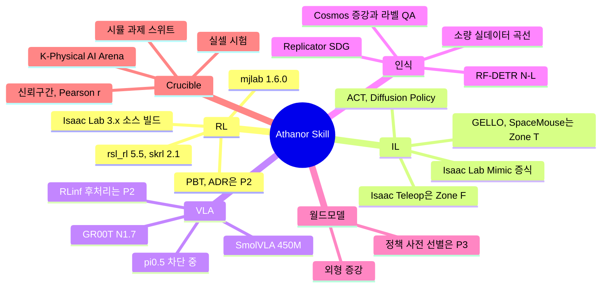

### 1.2 다섯 학습 유형의 범위

| 유형 | 입력 | 산출물 | 기본 프레임워크 | 구역 | 첫 출시 | 대표 과제(Wave 1 우선) |
|---|---|---|---|---|---|---|
| **RL** | 인증 자산 장면, 보상·관측·랜덤화 명세 | 정책(PPO 등) + 롤아웃 영상 | Isaac Lab 3.x + rsl_rl 5.5 / mjlab 1.6.0 | F·T·S | P0 | 빈 피킹 그래스프, 큐브 들기, 휴머노이드 속도 추종 |
| **IL** | 텔레옵 시연(LeRobot v3), Mimic 증식 데이터 | BC·ACT·Diffusion 정책 | LeRobot 0.6.1, Isaac Lab Mimic | F(증식)·T(학습) | P0 | 픽앤플레이스, 키팅, 커넥터 삽입 |
| **VLA** | 언어 지시 + 멀티뷰 영상 + 행동 시연 | 파인튜닝 VLA 체크포인트 | LeRobot 0.6.1(SmolVLA, GR00T N1.7) | F·T(국방은 SmolVLA만) | P1 | 다품종 토트 피킹, 양팔 핸드오버 |
| **인식** | Replicator SDG + 증강 + 소량 실데이터 | 검출·분할 모델 + Scorecard | RF-DETR N–L | F(RTX SDG)·T·S | P0 | 한국 SKU 빈 검출, 팔레트 검출 |
| **월드모델** | 시뮬 렌더 + 제어 신호(깊이·분할·엣지) | 증강 프레임, 정책 사전 선별 점수 | Cosmos Transfer 2.5 → Cosmos 3 Nano/Super | F | P1(증강), P3(선별) | 조명·재질 다양화, 실셀 시험 전 정책 필터 |

### 1.3 범용성: 대상별 학습 준비 시점

CEO 요구는 "로봇, 자동차 등 어떤 대상도 가능"이다. 학습 모듈은 대상별 차이를 **Domain Pack의 학습 템플릿과 평가지표**로 흡수한다. 아래 '기술 준비 시점'은 상업 Wave(어디서 먼저 돈을 버는가)와 별개다. 자동차를 하지 않는다는 뜻이 아니라, 자동차의 학습 산출물을 무엇으로 정의하느냐의 문제다([08 도메인 팩](08-domain-packs.md)).

| 대상 | 학습 템플릿 준비 | 주 학습 유형 | 물리·센서 백엔드 | 평가 지표 | 상업 Wave |
|---|---|---|---|---|---|
| 로봇 팔 조작(빈 피킹·조립·삽입) | P0–P1(M1–M12) | RL, IL, VLA, 인식 | Isaac Lab + PhysX(F), Newton SDF·hydroelastic(T) | 실셀 성공률, 갭, r | Wave 1 |
| 모바일 로봇·AMR·공장 셀 | M9–M18 | RL(내비게이션), 인식 | PhysX Vehicle2, Newton 휠 모델 | 충돌률, 처리량 예측 오차 | Wave 1 부가(P2 라이브 트윈) |
| 휴머노이드·사족·덱스터러스 | P1 템플릿(M6–M12) | RL(WBC·보행), VLA | Newton/MJWarp, 60 DoF 초과는 PhysX 또는 트리 분할 | 추종 오차, 낙상률, 성공률 | Wave 2(M12–) |
| 차량(Mobility Pack α) | P2(M18–M24) | 인식 데이터, 폐루프 시나리오 평가 | Chrono::Vehicle, PhysX Vehicle2, esmini | mAP 비율, 시나리오 통과율 | 파트너(MORAI)·데이터 |
| 드론 | P2(M20–M24) | RL(자세·추종), 인식 | PX4 SITL, Isaac Lab 멀티로터 액추에이터 | 추종 오차, 검출 mAP | P3 국방 에디션 |
| 선박·항만, 오프로드 UGV | P3(M25–) | 인식, 시나리오 평가 | Fossen 6-DOF, Chrono FSI·CRM | EO/IR mAP, COLREG 통과율 | Wave 3(트리거 조건부) |

### 1.4 하지 않는 것

| 하지 않는 것 | 이유 | 대신 하는 것 |
|---|---|---|
| 자체 RL 알고리즘 라이브러리 | rsl_rl이 Isaac Lab 휴머노이드 벤치마크(4,096 env × 32 × 500 이터레이션, RTX 4090)에서 198초로 최속(RL-Games·skrl 201초, SB3 287초). 차별화 여지 없음 | 알고리즘은 핀 고정, task-spec·랜덤화·게이트를 소유 |
| VLA 사전학습(from scratch) | OpenVLA급 사전학습은 약 21.5k A100-시간[U]. 우리 TRAIN 풀 24개월 총량(약 65k GPU-시간)의 3분의 1 | 공개 베이스의 파인튜닝·RL 후처리, 데이터 팩 판매 |
| 월드모델 학습(from scratch) | Cosmos 3가 64B/16B/4B로 무료 공개. 물리 일관성은 어떤 월드모델도 보장하지 않음 | Cosmos 3 Nano 도메인 파인튜닝(M9), 라벨 QA |
| 벤치마크 점수 경쟁 | LIBERO는 97–99%로 포화. 점수는 고객의 실셀 성공을 예측하지 못함 | 실셀이 붙은 비공개 과제 스위트와 sim/real 상관 |

### 1.5 전체 흐름

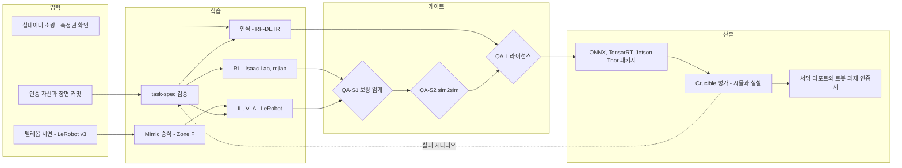

---

## 2. 학습 스택: 기능별 기본·대안·금지

**결론: 기능마다 기본 1개, 대안 1–2개, 금지 목록을 고정하고 버전은 릴리스 트레인으로 핀한다. 금지 항목은 사람이 기억하는 목록이 아니라 CI와 모델 레지스트리가 자동 차단하는 규칙이다.**

### 2.1 스택 표

| 기능 | 기본(Default) | 대안 | 금지·차단 | 버전(2026-10) | 라이선스 | 구역 | 판단 근거 |
|---|---|---|---|---|---|---|---|
| RL 런타임(팩토리) | **Isaac Lab 3.x, GitHub 소스 빌드** | Isaac Lab 2.3.2(레거시 과제 재현만) | isaacsim·isaaclab **PyPI 휠**(독점), Isaac Sim 7.0 alpha | 3.0.0-EA(2026-09-16, Isaac Sim 6.1, Python 3.12, PyTorch 2.11, Warp 1.16, Newton 1.5.2). GA 2026년 10월 말 목표 | BSD-3(isaaclab_mimic Apache-2.0). Isaac Sim·Kit 런타임은 NVIDIA 독점 | F(PhysX·RTX), T·S(Kit-less Newton) | 다중 백엔드, Kit-less 모드, 단일 `isaaclab` 학습 명령, 멀티 GPU·멀티 노드 |
| RL 런타임(테넌트 경량) | **mjlab 1.6.0** | Isaac Lab Kit-less Newton(beta) | — | 1.6.0(2026-08-09). 업스트림 MJWarp보다 뒤처진 핀(3.11) | Apache-2.0 | T·S·F | Isaac Lab과 같은 매니저 API, Omniverse 약관 없음, G1 속도·모션 모방 내장 |
| RL 알고리즘 | **rsl_rl 5.5.1** | **skrl 2.1.0**(멀티에이전트 IPPO/MAPPO, SAC/TD3), RL-Games 1.6.5(레거시 덱스터러스·PBT) | PufferLib(로보틱스 통합 없음), LeanRL(2026-10-01 아카이브) | 5.5.1(2026-09-09: bf16, torch.compile, 멀티 GPU 그래디언트 축약 개선) | BSD-3 / MIT / MIT | 전 구역 | PPO + teacher→student 증류 + 대칭 + RND |
| 교육·소규모 RL | **SB3 2.9.0** | TorchRL 0.14.0(연구 고객의 오프라인 RL) | — | 2.9.0(2026-06-15) | MIT | T | 벡터화·분산 없음. 4,096 env 규모 부적합 |
| VLA RL 후처리 | **RLinf 0.3**(P2) | LeRobot HIL-SERL(실세계 RL) | — | 0.3.0(2026-07-15), Isaac Lab 3.0 학습 백엔드로 통합 | Apache-2.0 | F → T(P2 검증 후) | OpenVLA·pi0/pi0.5·GR00T N1.5–N1.7 RL 파인튜닝 |
| IL·VLA 엔진, 데이터 포맷 | **LeRobot 0.6.1 + LeRobotDataset v3** | robomimic HDF5(경계 포맷 import만) | — | 0.6.1(2026-08-03), Python 3.12 이상, PyTorch 2.7 이상 | Apache-2.0 | 전 구역 | Parquet + MP4 샤드, 스트리밍, 마켓플레이스 교환 포맷 |
| IL 베이스라인 | **ACT, Diffusion Policy**(LeRobot 내장) | VQ-BeT | — | LeRobot 0.6.1 | Apache-2.0 | 전 구역 | 단일 과제를 1 GPU에서 빠르게 학습 |
| VLA: 저비용·국방 | **SmolVLA 450M** | — | — | smolvla_base | Apache-2.0 | 전 구역(Air-gap 기본) | 약 4 A100-시간, 소비자 GPU·엣지 서빙 |
| VLA: 휴머노이드·양팔 | **GR00T N1.7 3B** | X-VLA, Wall-X, EO-1(약관 확인 후 [U]) | — | GA. Cosmos-Reason2-2B 백본 + 16층 flow-matching DiT 행동 헤드 | 코드 Apache-2.0, 가중치 NVIDIA Open Model License | F·T(국방 프로파일은 V7 전 차단) | 40 GB 이상 GPU 파인튜닝, 16 GB 이상 추론(Jetson AGX Thor 포함) |
| VLA: 팔 범용 | pi0.5(openpi) **차단** | RDT2-FM(Apache-2.0, UMI 데이터용 옵션) | 약관 확인 전 상업 사용 금지 | pi0.5 + PyTorch(2025-09) | 코드 Apache-2.0, **가중치 약관 미명시** | 내부 평가만 | 가중치 약관 서면 확인(V7) 후 해제 |
| VLA: 참고만 | OpenVLA-OFT(벤치마크 기준선) | — | 상업 납품 | 7B, 8 GPU·150k 스텝 | 코드 MIT, 가중치 Llama 2 Community License | F(내부 비교) | 고비용·구형 백본 |
| VLA: 금지 | — | — | **AgiBot GO-1**(CC BY-NC-SA), **RLDX-1 가중치**(비상업) | — | 비상업 | 차단 | RLWRLD는 데이터 고객 후보로만 접근 |
| 시연 증식 | **Isaac Lab Mimic** | SkillGen(Apache 태그 cuRobo 고정 + NVIDIA 확인 후) | **MimicGen·DexMimicGen 코드**(NVIDIA Source Code License). Isaac Lab 번들 cuRobo | isaaclab_mimic 1.0.16 | Apache-2.0 | F(Kit-less 검증 전) | 10개 → 1,000개, 생성 성공률 약 50%(Franka) |
| 텔레옵 | **Isaac Teleop**(팩토리), **GELLO + SpaceMouse**(테넌트·현장) | 키보드, Apple Vision Pro 손 추적(Isaac Teleop 경유) | 테넌트용 CloudXR(약관 전) | Isaac Teleop은 Isaac Lab 3.0 beta부터 내장 텔레옵 대체 | GELLO MIT. Isaac Teleop 라이선스 [U] | F / T·S | MCAP 기록·재생, 리타게팅, 양팔 GELLO |
| 인식 SDG | **Replicator**(Isaac Sim 6.1 RTX) | Newton Warp 타일드 카메라(래스터, T), Blender Cycles(별도 프로세스, 내부) | BlenderProc(GPL-3.0) 온프렘 번들, Kubric(정체) | Isaac Sim 6.1.0(2026-09-10) | NVIDIA 독점 / Apache-2.0 | F / T·S | RT 코어 GPU 필수(L40S, RTX PRO 6000) |
| 생성형 증강 | **Cosmos Transfer 2.5**(현재) → **Cosmos 3 Nano 16B**(M9) | Cosmos 3 Super 64B(P3 선별), Edge 4B(관찰) | Genie 3·GAIA 등 독점 모델의 데이터 생산 사용 | Cosmos 3(2026년 5–6월), Transfer 2.5는 유지보수 축소 | OpenMDW-1.1(전문 [U]) / NVIDIA Open Model License | F | 깊이·분할·엣지 제어로 라벨 보존 |
| 자동 라벨링(실데이터) | **SAM 3.1 + VLM 캡션**(민수 전용) | RF-DETR 교사 + 사람 검수(국방) | 국방 에디션의 SAM 계열 | SAM 3.1 Object Multiplex(2026-03-27) | SAM License(군사·ITAR 제한) | F·T(민수) | 개방 어휘 분할·추적 |
| 검출기 | **RF-DETR N–L** | RT-DETR·D-FINE 계열 Apache 모델 [A] | **Ultralytics YOLO(AGPL-3.0) SaaS 사용**, RF-DETR XL/2XL(PML 1.0) 기본 사용 | COCO AP50:95 48.4–56.5, T4 TensorRT FP16 2.3–6.8 ms | Apache-2.0 | 전 구역 | ONNX·TensorRT로 Jetson 수출 |
| 촉각 | **TacSL**(Isaac Lab, PhysX 전용) | MuJoCo touch_grid | — | Isaac Lab 3.0-EA 실험 기능 | BSD-3 | F | 시각촉각 이미지·힘장, 기존 대비 200배 이상 빠름 |
| WBC 레퍼런스 | HOVER, BeyondMimic | GEAR-SONIC(P3, 64 GPU 이상) | — | HOVER Isaac Lab 2.0 확장 | Apache-2.0 / MIT / 코드 Apache-2.0 + 가중치 NVIDIA OML | F·T | 검증된 teacher-student·모션 추적 레시피 |
| 덱스터러스 레퍼런스 | Isaac Lab DexSuite(ADR·PBT) | DextrAH 레시피(라이선스 [U]) | — | DexSuite는 Isaac Lab 2.3부터 | BSD-3 | F | 픽셀→행동 덱스터러스 |
| 평가 하네스 | **Isaac Lab Arena v0.3**(alpha) + MuJoCo 3.15 CPU 재생 | SimplerEnv(MIT, MMRV·Pearson) | ManiSkill3 자산(CC BY-NC) 상업 평가 | Arena v0.3 | Apache-2.0 | F(하네스), T(셀프 평가는 mjlab) | GPU 병렬 이기종 평가, LeRobot EnvHub |
| 공개 비교 스위트 | LIBERO-plus, RoboCasa365, RoboTwin 2.0 | BEHAVIOR-1K(MIT) | 포화 LIBERO로 등급 산정 | RoboCasa365 v1.0.1(2026-05-12): 365과제, 2,500+ 장면 | MIT / CC-BY-4.0 | F·T | 비교용. 채점은 비공개 스위트 |
| 실험 추적·레지스트리 | **MLflow 3**(자체 호스팅) | W&B 0.30.0(Cloud 선택 커넥터, Sovereign 제외) | lakeFS 1.87 이상(BSL 1.1) | mlflow 3.16.1(2026-09-16) | Apache-2.0 | 전 구역 | 데이터 거주 고객 대응 |
| 분산·설정 | **Ray 2.59 + torchrun**, Hydra 1.3.7 | KubeRay·Kueue | Ray Sandbox(실험적) 의존 | ray 2.59.0(2026-10-02) | Apache-2.0 / MIT | 전 구역 | KAI 큐 귀속과 결합 |
| 데이터셋 스냅샷 | **DVC 3.67.1 / Iceberg** | — | lakeFS 1.87 이상 | dvc 3.67.1 | Apache-2.0 | 전 구역 | 콘텐츠 해시 계보 |
| 롤아웃 뷰어 | **Rerun 0.38.1, Viser 1.1.1** | Newton GL 뷰어 | — | rerun-sdk 0.38.1, viser 1.1.1 | MIT·Apache-2.0 / Apache-2.0 | 전 구역 | 브라우저 재생 |
| 수출·엣지 | **ONNX(opset 고정) → TensorRT → Jetson AGX Thor** | ONNX Runtime CPU(BeyondMimic식 경량 정책) | — | onnxruntime 1.30.0, tensorrt 11.3.0.99, JetPack 7.2 / CUDA 13.2 | MIT / NVIDIA 독점(무료) | 전 구역 | GR00T 저장소가 Thor·Orin 지원 명시 |
| 월드모델 연구 | — | V-JEPA 2.1(MIT), DreamerV3(MIT) | Genie 3(학습 API 없음) | V-JEPA 2.1(2026-03-16, 최대 2B) | MIT | 관찰 | 실로봇 데이터 희소 과제 연구 트랙 |

### 2.2 왜 PyPI 휠이 아니라 소스 빌드인가

- isaacsim·isaaclab PyPI 휠은 'NVIDIA Proprietary Software'로 표기된다. 휠을 테넌트 이미지에 넣는 순간 Zone T가 독점 약관에 오염된다.
- GitHub 소스(BSD-3)를 트레인 태그에서 빌드하면 Kit-less Newton 경로는 허용형으로 남는다. Zone F 이미지만 Isaac Sim 6.1 런타임을 추가로 얹는다.
- 이미지는 `skill-isaaclab:train-1-f`(PhysX·RTX 포함)와 `skill-isaaclab:train-1-t`(Kit-less) 두 종으로 분리 발행하고, SBOM 게이트가 `-t` 이미지에 Kit·Omniverse 바이너리가 들어오면 빌드를 실패시킨다([04 §1](04-system-architecture.md)).

### 2.3 구역별 기능 매트릭스

| 기능 | Zone F(팩토리) | Zone T(Studio·Cloud) | Zone S(Sovereign·Air-gap) | 해제 조건 |
|---|---|---|---|---|
| PhysX 접촉 집약 RL(SDF 삽입) | O | X(대신 Newton SDF·hydroelastic) | X(BYOL 고객 환경만) | NVIDIA 서면 조건 또는 P2 PhysX SDK 소스 어댑터(조건부) |
| TacSL 촉각 | O | X | X | Kit-less 동작 검증(M6) |
| Isaac Lab Mimic 증식 | O | **서비스로 제공**(테넌트가 시연 업로드 → 팩토리 증식 → LeRobot v3 반환) | 서비스 불가(에어갭) | Kit-less 검증 시 P2부터 테넌트 직접 실행 |
| Isaac Teleop(CloudXR) | O | X | X | NVIDIA 체크리스트 #12 서면 회신 |
| GELLO·SpaceMouse 텔레옵 | O | O(P2 Studio GA부터 셀프 기록) | O | — |
| RTX Replicator SDG | O | X(Warp 래스터 SDG) | BYOL만 | NVIDIA 체크리스트 #2·#4 |
| mjlab·Isaac Lab Kit-less RL | O | O | O | — |
| LeRobot IL·VLA 파인튜닝 | O | O | O(국방은 SmolVLA만) | GR00T 국방 사용은 V7 |
| Cosmos 증강 | O | 산출물로만 | X(국방) | OpenMDW-1.1 법률 검토(V7) |
| Crucible 평가 | O(하네스 운영) | 셀프 시뮬 평가(mjlab), 공식 평가는 주문 | 고객 사이트 셀프 평가 키트 [A] | 공식 인증은 항상 Crucible 라인 |

### 2.4 버전 규율과 어댑터 계층

- **트레인 핀:** Train 1(2026-12 ~ 2027-06)은 Isaac Lab 3.x GA 릴리스 노트의 Newton·Warp 핀을 따른다(EA 기준 Newton 1.5.2, Warp 1.16. GA 핀은 [U]). mjlab 1.6.x, MuJoCo 3.15.x, rsl_rl 5.5.x, LeRobot 0.6.x를 같은 매트릭스에 넣는다.
- **어댑터 계층(OWN):** Isaac Lab 3.0은 쿼터니언 순서를 WXYZ에서 XYZW로 바꾸고 데이터를 ProxyArray로 반환하며 액추에이터 API를 옮겼다. LeRobot은 0.6.1에서 `lerobot.types`를 개명했다. 고객 task-spec이 이 변화에 노출되지 않도록 `athanor.skill.adapters`가 좌표·쿼터니언·관측 텐서를 정규화한다. 쿼터니언은 내부 표준을 XYZW로 고정하고, 경계에서만 변환한다[A].
- **플러그인 원칙:** GR00T는 약 1년 사이 N1.5 → N1.7로, Cosmos Predict·Transfer 2.5는 약 8개월 만에 Cosmos 3로 대체됐다. 모델 통합은 `policy_family` 플러그인(학습·추론·수출 3개 진입점)으로만 붙이고, 새 모델은 트레인 경계에서 교체한다.
- **업그레이드 세금:** 엔진에 닿는 워크스트림 용량의 25% 예약 원칙(DR)을 Skill 어댑터 유지보수에도 적용한다. Skill 리드는 트레인 승격 주간에 어댑터 회귀 스위트(템플릿 전체 1회 학습 + sim2sim)를 통과시킨다.

---

## 3. RL 파이프라인

**결론: RL은 '템플릿 → 인증서 기반 랜덤화 → 커리큘럼 → 1–8 GPU 원클릭 학습 → 실시간 롤아웃 → 게이트'의 고정 공정이다. 처리량은 상품이 아니므로 우리는 1B 스텝당 원가와 실셀 성공률로만 경쟁한다.**

### 3.1 task-spec: 학습 주문서의 단일 형식

고객·에이전트·엔지니어가 만드는 모든 학습 작업은 같은 YAML task-spec으로 표현한다. 한국어 MCP 에이전트의 `skill.train` 도구도 이 스펙을 생성할 뿐 코드를 직접 실행하지 않는다([06 사용성·에이전트](06-usability-and-agent.md)).

```yaml
# athanor task-spec v0 (예시, Train 1) — 값은 [A]
spec_version: "0.3"
template: pick.bin.kr-sku.v1          # 템플릿 카탈로그 ID
zone: F                               # F | T | S
scene_commit: sc_8f3a1c...            # 콘텐츠 해시 장면 커밋(인증 자산 포함)
robot: cobot_6dof_parallel_gripper
backend:
  train: isaaclab-physx               # isaaclab-physx | isaaclab-newton | mjlab | newton
  sim2sim_gates: [mujoco-cpu, isaaclab-newton]
num_envs: 4096
algo: {lib: "rsl_rl==5.5.1", name: ppo, precision: bf16, compile: true}
observations: [joint_pos, joint_vel, ee_pose, object_pose_noisy, last_action]
rewards:
  reach:          {w: 1.0}
  grasp_success:  {w: 10.0}
  lift_height:    {w: 2.0, target_m: 0.15}
  action_rate:    {w: -0.01}
domain_randomization:
  physics: {source: certificate, k_sigma: 2.0}   # §3.3 인증서 기반 폭
  actuation: {motor_strength: [0.9, 1.1], action_latency_ms: [0, 20]}
  observation: {preset: cobot-default-noise}
curriculum:
  - {param: clutter_objects, start: 3, end: 15, promote_if: "success>=0.8", demote_if: "success<0.4"}
budget: {max_gpu_hours: 12, pool: rt-batch, preemptible: true}
gates:
  qa_s1: {success_rate: 0.90, eval_episodes: 1000}
  qa_s2: tier1                         # §7.3
export: {onnx_opset: pinned-per-train, trt_target: jetson-agx-thor-jp7.2}
```

- **검증:** 스펙은 제출 시 JSON Schema 검증, 구역 검사(Zone T 스펙에 `isaaclab-physx` 금지), 예산 상한, 라이선스 매니페스트 검사를 통과해야 큐에 들어간다.
- **해시:** 스펙 전체(기본값 포함 펼친 형태)를 정규화해 해시하고 Run Manifest의 `config_hash`에 넣는다. 같은 해시 + 같은 장면 커밋 + 같은 시드면 '통계적 재현' 대상이다([05 §6](05-physics-and-realism.md)).

### 3.2 RL 템플릿 카탈로그

DR의 RL 템플릿 수(P0 3 → P1 8 → P2 15 → P3 25)를 아래 순서로 채운다. 순서는 Wave 1 매출 기여와 Capability Readiness를 함께 본 것이다[A].

| ID | 템플릿 | 단계 | 기본 백엔드 | 알고리즘 | 구역 | 환경 수/GPU | 1회 학습 컴퓨트 |
|---|---|---|---|---|---|---|---|
| R01 | 팔 도달·큐브 들기(베이크오프 T3) | P0 | Isaac Lab PhysX / mjlab | PPO | F·T | 4,096 | 1–3 GPU-시간[A] |
| R02 | 빈 피킹 그래스프(한국 SKU 클러터, T5) | P0 | Isaac Lab PhysX | PPO + 증류 | F | 4,096 | 2–6 GPU-시간[A] |
| R03 | 휴머노이드 속도 추종(G1, T1) | P0 | mjlab / Newton | PPO | F·T·S | 4,096 | 1–2 GPU-시간 |
| R04 | 사족 보행 속도 추종 | P1 | mjlab / Newton | PPO | T·S | 4,096 | 0.3–1 GPU-시간 |
| R05 | 휴머노이드 모션 추적(BeyondMimic식, T2) | P1 | mjlab / Isaac Lab Newton | PPO | F·T | 4,096 | 수–수십 GPU-시간[A] |
| R06 | 페그·커넥터 삽입(SDF, T7) | P1 | Isaac Lab PhysX(F), Newton hydroelastic(T) | PPO + 접촉 랜덤화 | F·T | 2,048–4,096 | 4–12 GPU-시간[A] |
| R07 | 디팔레타이징(박스 혼적) | P1 | Isaac Lab PhysX | PPO | F | 4,096 | 3–8 GPU-시간[A] |
| R08 | 손안 재배치(LEAP/Allegro, 상태 기반, T4) | P1 | Isaac Lab PhysX / Newton | PPO(DexSuite) | F·T | 8,192 | 3–8 GPU-시간 |
| R09 | 폴리백 피킹(VBD 변형체, T6) | P2 | Newton VBD | PPO | F·T | 1,024–4,096[A] | 측정 후 확정 |
| R10 | 케이블 삽입(T8) | P2 | Newton VBD / PhysX | PPO | F | 측정 후 확정 | 측정 후 확정 |
| R11 | 폐루프 그리퍼 조작(Kamino, T10) | P2 | Newton Kamino | PPO | F·T | 4,096 | 측정 후 확정 |
| R12 | 시각 기반 덱스터러스(teacher → 카메라 student) | P2 | Isaac Lab PhysX, 타일드 카메라 | PPO + 온라인 증류 | F | teacher 4,096 / student 256 | 200–600 GPU-시간 |
| R13 | AMR 내비게이션·도킹 | P2 | PhysX Vehicle2 / Newton 휠 | PPO | F·T | 4,096 | 2–6 GPU-시간[A] |
| R14 | 멀티로봇 협업 피킹 | P2 | Isaac Lab | skrl MAPPO | F·T | 2,048[A] | 측정 후 확정 |
| R15 | 휴머노이드 범용 추적 teacher-student(HOVER식) | P2 | Isaac Lab | PPO + 증류 | F | 4,096 이상 | teacher 23.3시간(RTX 4090) / 44.6시간(L40) |
| R16–R25[A] | 양팔 핸드오버, 모바일 매니퓰레이션, 드론 자세·추종(PX4 SITL 연동), 차량 저속 주차·도킹(Mobility Pack α), 휴머노이드 + 덱스터러스 로코매니퓰레이션(60 DoF 초과, PhysX 또는 트리 분할), UGV 지형 보행 등 | P3 | 도메인 팩별 | PPO / MAPPO | 도메인 팩별 | ≥8,192(DR P2–P3 KPI) | 도메인 팩별 |

- **환경 수 KPI:** 템플릿 과제의 GPU당 병렬 환경 수는 P0–P1 ≥4,096, P2–P3 ≥8,192(DR)다. 변형체·카메라 과제는 이 KPI의 예외로 등록하고, 대신 '1B 스텝당 원가'로 관리한다.
- **템플릿의 정의:** 장면 레이어, 보상 함수, 관측·행동 공간, 기본 랜덤화, 커리큘럼, 게이트 임계, 수출 설정, 평가 과제 ID까지 포함한 패키지다. 템플릿이 Crucible 과제 ID를 갖지 않으면 카탈로그에 등록할 수 없다.

### 3.3 도메인 랜덤화: 인증서가 폭을 정한다

일반적인 도메인 랜덤화는 엔지니어의 감으로 폭을 정한다. 폭이 좁으면 실셀에서 깨지고, 넓으면 정책이 보수적으로 변해 성공률과 사이클 타임을 잃는다. 우리는 **자산 인증서의 오차 막대로 물리 파라미터 폭을 정한다.** 이것이 Forge·Fidelity Lab의 측정을 학습 성능으로 바꾸는 연결 고리다.

```math
\theta \sim \mathcal{U}\!\left[\hat{\theta}\,(1-k\,\sigma_{\mathrm{rel}}),\ \hat{\theta}\,(1+k\,\sigma_{\mathrm{rel}})\right],\qquad \mu \sim \log\mathcal{U}\!\left[\hat{\mu}\,e^{-k\,\sigma_{\log\mu}},\ \hat{\mu}\,e^{k\,\sigma_{\log\mu}}\right]
```

- `θ̂`는 인증서의 백엔드별 파라미터, `σ_rel`은 인증서에 기록된 상대 불확도, `k`는 템플릿 기본 2.0이다[A]. 마찰처럼 곱셈적으로 작용하는 값은 로그 균등 분포를 쓴다.
- **등급별 기본 불확도[A]:** Bronze(VLM 추정)는 질량 ±30%, 마찰 ±50%. Silver(영상 sysid)는 사후분포 표준편차. Gold(랩 실측)는 DR 오차 목표(P0 질량 ≤15%·마찰 ≤25% → P3 ≤5%·≤10%)를 상한으로 쓴다.
- **효과:** Gold 오차가 줄어들수록 랜덤화 폭이 좁아지고, 같은 컴퓨트로 덜 보수적인 정책이 나온다. 이 관계를 Crucible에서 'Gold vs Bronze 장면 학습 정책의 실셀 성공률 차'로 분기마다 측정해 인증 등급의 경제적 가치를 수치로 만든다[A].

| 범주 | 파라미터 | 기본 범위 [A] | 프리셋 대상 |
|---|---|---|---|
| 물체 물성 | 질량, 마찰, 반발, 관성 | 인증서 × k = 2.0 | 전 템플릿 |
| 로봇 동역학 | 링크 질량 ±10%, 관절 마찰·감쇠 ±30%, PD 게인 ±15% | 로봇 클래스 프리셋 | 팔, 휴머노이드, 사족 |
| 액추에이션 | 모터 강도 0.9–1.1, 행동 지연 0–20 ms(팔)·0–10 ms(보행) | 액추에이터 넷이 있으면 대체 | 전 템플릿 |
| 관측 | 관절 엔코더 노이즈, 물체 포즈 노이즈 5 mm·2°, 관측 지연 0–2 스텝 | 센서 프로파일에서 유도 | 전 템플릿 |
| 외란 | 랜덤 푸시, 지면 경사·마찰 | 보행 프리셋 | 휴머노이드, 사족 |
| 시각(카메라 정책) | 조명 색온도 2,700–6,500 K, 텍스처, 카메라 외부 파라미터 ±2 cm·±2° | Replicator·Warp 프리셋 | 시각 RL, VLA |
| 장면 | 물체 수·배치·자세, 빈 위치 ±3 cm | 커리큘럼과 연동 | 피킹·조립 |

### 3.4 커리큘럼

- **지형·난이도 커리큘럼:** 환경별 레벨을 두고 성공률 ≥0.8이면 승급, <0.4이면 강등한다[A]. legged_gym 이후 표준 방식이며 보행·피킹 모두에 적용한다.
- **클러터 커리큘럼:** 빈 피킹은 물체 3개에서 시작해 15개까지 늘린다. 승급 기준은 3.1의 스펙에 명시한다.
- **랜덤화 커리큘럼:** 학습 초반에는 랜덤화 폭을 50%로 시작해 보상 임계 도달 후 100%로 넓힌다[A]. 처음부터 최대 폭이면 보상 탐색이 실패하는 과제(삽입, 덱스터러스)에 기본 적용한다.
- **ADR(P2):** 파라미터마다 범위 [l, u]를 두고, 일정 비율의 환경에서 한쪽 경계값을 고정해 성능을 잰다. 경계 성공률이 t_H(0.8) 이상이면 범위를 Δ만큼 넓히고 t_L(0.4) 이하이면 좁힌다[A]. DexSuite의 ADR 구현을 기본으로 쓰고, **인증서 폭(§3.3)을 ADR의 하한**으로 둔다. 측정된 불확도보다 좁은 범위로 수렴하는 것을 막기 위해서다.

### 3.5 규모: 1 GPU에서 멀티 노드까지

| 규모 | 구성 | 근거 수치 | 용도 | 단계 |
|---|---|---|---|---|
| 1 GPU | 4,096–8,192 env, rsl_rl bf16 | RTX 4090: G1 험지 82k steps/s(학습 포함), Shadow 큐브 재배치 170k(8,192 env) | 대부분의 템플릿 | P0 |
| 1–8 GPU 원클릭 | torchrun DDP, GPU당 환경 그룹 1개, KAI 갱 스케줄 | rsl_rl 5.5의 멀티 GPU 그래디언트 축약 개선 | 시각 RL, 스윕 | P0(내부) → P1(Studio 베타) |
| 멀티 노드 | Isaac Lab 멀티 노드 + Ray, SkyPilot 스팟 재개 | 4 노드 × 4 L40: G1 960k, Shadow 1.8M train FPS | 덱스터러스 teacher, PBT | P2 |

- 16 GPU(L40) 처리량은 RTX 4090 1장 대비 G1에서 11.7배, Shadow에서 10.6배다. GPU 기종이 달라 순수 확장 효율은 아니며[A], HOVER teacher가 RTX 4090 23.3시간 vs L40 44.6시간으로 약 1.9배 차이를 보이므로 **GPU 선택이 노드 수만큼 중요하다.** 기본 GPU는 베이크오프 결정 메모(2027년 1월 첫 주)의 steps/s/$ 표로 정한다.
- 카메라 기반 RL은 상태 기반보다 약 16배 느리다(Cartpole 510k vs RGB 32k). 시각 정책은 **상태 기반 teacher를 먼저 학습하고 카메라 student로 증류**하는 것이 기본 경로다.

### 3.6 PBT와 하이퍼파라미터 탐색(P2)

| 항목 | 설정 [A] | 이유 |
|---|---|---|
| 개체 수 | 8–16 | 1 노드(8 GPU)에 GPU당 1–2 개체 |
| 교체 주기 | 50–200 PPO 이터레이션마다 하위 25%가 상위 25%의 가중치·하이퍼파라미터 복사 | 보상 가중치·학습률·엔트로피 계수 동시 탐색 |
| 섭동 | 복사한 하이퍼파라미터 × 0.8 또는 × 1.2 | 표준 PBT 탐색 |
| 적합도 | QA-S1 평가 성공률(보상 아님) | 보상 해킹 방지 |
| 비용 상한 | task-spec `budget.max_gpu_hours` × 개체 수, 주문 견적에 표시 | 스윕 비용을 고객에게 투명하게 |
| 기본 대상 | 덱스터러스, 삽입, 보상 설계가 불안정한 신규 템플릿 | 보행·도달은 고정 레시피로 충분 |

P0–P1에서는 PBT 대신 템플릿별 검증된 고정 레시피와 소규모 그리드(3–5회)로 충분하다. PBT는 Isaac Lab 멀티 노드와 KAI 갱 스케줄이 안정화된 P2에 넣는다(DR).

### 3.7 실시간 롤아웃 영상과 지표

- **영상:** 기본 50 이터레이션마다 환경 4개의 10초 클립(30 fps)을 기록한다[A]. Zone T는 Newton Warp 렌더러(타일드 카메라), Zone F는 Kit RTX 또는 Warp 중 저렴한 쪽을 쓴다. 클립은 MP4로 오브젝트 스토어에 넣고 MLflow 아티팩트로 연결한다.
- **브라우저 재생:** Studio는 Rerun·Viser 웹 뷰어로 상태 궤적과 영상을 동기 재생한다. 서버 GPU 렌더 세션을 열지 않아도 된다([04 §13](04-system-architecture.md)).
- **지표 스트림:** 보상 항목별 값, 성공률, 에피소드 길이, 랜덤화 레벨, 커리큘럼 레벨, steps/s, 누적 토큰을 1분 간격으로 MLflow에 기록한다. 토큰 계량이 실시간으로 보이므로 고객은 학습 중간에 중단·예산 증액을 결정할 수 있다.
- **조기 경보:** 보상 정체(200 이터레이션 동안 성공률 개선 <1%p), NaN, 관절 한계 위반 급증은 자동 알림과 함께 체크포인트 보존 후 일시정지한다[A].

### 3.8 RL 원가 공식과 KPI 정합

```math
C_{1\mathrm{B}}=\frac{10^{9}}{\mathrm{FPS}_{\mathrm{train}}\times 3600}\times P_{\text{GPU-h}}
```

| 사례 | FPS(학습 포함) | 1B 스텝 GPU-시간 | L40S 네오클라우드 $1.09/h | RT 혼합 $2.3/h | 자체 RTX PRO 6000 ≈ ₩1,600/h(≈$1.14) |
|---|---|---|---|---|---|
| G1 험지 보행(RTX 4090 기준) | 82,000 | 3.39 | $3.7 | $7.8 | $3.9 |
| Shadow 손안 재배치 | 170,000 | 1.63 | $1.8 | $3.8 | $1.9 |
| 접촉 많은 피킹(가정) | 40,000[A] | 6.94 | $7.6 | $16.0 | $7.9 |

- DR KPI(카메라 없는 RL, 1B 스텝당 P1 ≤$10 → P2 ≤$6 → P3 ≤$4)는 **네오클라우드·자체 서버에서는 보행류가 이미 달성 가능하고, 접촉 많은 피킹이 병목**이라는 뜻이다. P2–P3 목표는 자체 RT 서버 가동률 60% 이상, torch.compile·bf16(rsl_rl 5.1·5.5) 적용, 베이크오프 결과 기반 백엔드 라우팅으로 맞춘다.
- 서울 하이퍼스케일러(AWS 서울 L40S $2.288)에서 배치 RL을 돌리면 같은 작업이 2배 이상 비싸다. 배치 학습을 서울 리전에 배정하지 않는다는 DR 원칙의 근거다.

---

## 4. IL·VLA 파이프라인

**결론: 시연은 비싸고 증식은 싸다. 텔레옵으로 10–50개를 정성 있게 모으고, Mimic으로 1,000개로 늘리고, 등급에 맞는 VLA를 파인튜닝한 뒤, 실셀 소량 시연으로 마무리한다. 고객이 사는 것은 모델이 아니라 '시연 10개가 실셀 성공률로 바뀌는 시간'이다.**

### 4.1 흐름

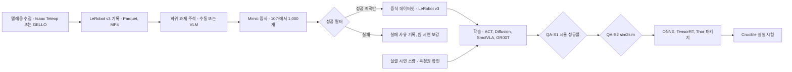

### 4.2 텔레옵: 팩토리와 테넌트의 두 경로

| 장치 | 구역 | 방식 | 강점 | 약점 | 라이선스 | 적합 과제 |
|---|---|---|---|---|---|---|
| **Isaac Teleop**(CloudXR, Apple Vision Pro 등 XR) | F | XR 손 추적·그리퍼·덱스터러스 핸드, 전신 로코매니퓰레이션(Homie), 로봇 없는 자기중심 수집, MCAP 기록·재생 | 휴머노이드·덱스터러스 시연 품질 | 저지연 네트워크 필요, Quest/Pico 지원 미확인, SaaS 약관 미확인 | 오픈소스(라이선스 [U]) | 휴머노이드, 양팔, 손 |
| **GELLO** | F·T·S | 3D 프린트 + Dynamixel 관절 공간 퍼펫(I2RT YAM, Franka FR3/FER, UR, xArm, 양팔, FACTR 중력 보상) | 저비용, 직관적, 실로봇·MuJoCo 시뮬 겸용 | 팔 형상별 하드웨어 제작 | MIT | 팔 조작, 양팔 |
| **SpaceMouse** | F·T·S | 6-DoF 말단 속도 지령 | 즉시 사용, 원격 브라우저 텔레옵 | 정밀 접촉·양팔에 약함 | 상용 기기 | 단순 픽앤플레이스 |
| 키보드 | F·T | 이산 지령 | 테스트용 | 품질 낮음 | — | 디버그 |

- **운영 규칙:** 시연 1개당 성공·실패 라벨, 운영자 ID(익명), 장치, 지연, 하위 과제 경계를 LeRobot v3 메타데이터에 기록한다[A]. 실패 시연도 버리지 않는다. 실패 마이닝과 보상 모델 학습의 재료다.
- **목표 처리량[A]:** 숙련 운영자 기준 단순 피킹 시연 시간당 30–60개, 양팔·덱스터러스 시간당 8–15개. 운영자 시간은 FDE 공수에 들어가므로 엔지니어 시간 지수에 반영한다.
- **테넌트 경로:** P1에는 AICHEMIST가 고객 현장에서 GELLO로 기록하고, P2(Studio GA, M15)부터 고객이 자기 GELLO·SpaceMouse로 Studio에 직접 기록한다[A]. 브라우저 원격 텔레옵은 자체 WebRTC 게이트웨이 뒤에서만 연다.

### 4.3 Mimic 증식: 진짜 숫자

| 항목 | 상태 기반 | 시각운동(visuomotor) | 출처 |
|---|---|---|---|
| 원 시연 | Franka 적층 10개 / GR1 픽앤플레이스 5개 | 동일 | Isaac Lab Mimic 문서 |
| 생성 1,000개 소요 | **18–40분** | **약 10시간** | 동일 |
| 생성 성공률 | Franka 약 50%, GR1 65–82% | 동일 | 동일 |
| BC-RNN 학습 | 약 30분(GR1 픽앤플레이스 RTX 6000 Ada 약 29분) | 약 6시간 | 동일 |
| 학습 정책 성공률 | Franka 40–60%, GR1 75–86% | — | 동일 |

**해석과 설계 결정**
- **시각 정책·VLA에 필요한 것은 시각운동 쪽이다.** 18–40분은 상태 기반에만 성립한다. 영업 자료와 견적은 시각운동 10시간을 기준으로 쓴다(심사위원단 3곳 모두 지적한 정정 사항).
- **성공률 50%의 의미:** 생성 시도의 절반이 실패 궤적이다. 1,000개 '성공' 시연이 필요하면 시도 약 2,000개를 예약해야 한다는 가정으로 견적한다[A]. 문서의 1,000개가 시도 기준인지 성공 기준인지는 사내 측정(P0)으로 확정한다.
- **Mimic 데이터만으로는 부족하다.** Franka 정책 성공률 40–60%는 실셀 인수 기준을 넘지 못한다. 기본 레시피는 'Mimic 1,000 + 실셀 시연 20–50 + VLA 파인튜닝'이다[A].
- **KPI 경로(DR):** 1,000개 생성 시간 P1 ≤1시간(상태)·≤12시간(시각운동) → P2 ≤40분·≤8시간 → P3 ≤30분·≤6시간. P2 이후 단축 수단은 ① 2 GPU 병렬 생성(환경 분할), ② 학습 해상도로 직접 렌더(후처리 리사이즈 제거), ③ 타일드 카메라, ④ Kit-less 검증 시 Newton 백엔드다[A].
- **비용:** 시각운동 1,000개 ≈ RT 10 GPU-시간 ≈ 600 토큰(₩6만). 텔레옵 운영자 1시간보다 싸다. '시연 10개를 1,000개로' 원클릭 기능이 Skill 라인의 핵심 차별 기능인 이유다.

**Mimic 절차(팩토리 표준)**
1. 원 시연 10개(양팔·휴머노이드 5–10개)를 Isaac Teleop 또는 GELLO로 기록한다.
2. 하위 과제 경계를 주석한다. P0는 수동, P1부터 LeRobot VLM 하위 과제 주석으로 초안을 만들고 사람이 확정한다.
3. 물체 중심 구간 변환·보간으로 새 물체 배치에 맞는 궤적을 생성하고 시뮬에서 실행한다.
4. 성공 판정 함수로 걸러 성공 궤적만 LeRobot v3로 저장한다. 실패 궤적은 `failed/` 분할로 따로 보존한다.
5. 원 시연 대비 성공률이 30% 미만이면 원 시연을 5개 추가하라는 작업을 자동 생성한다[A].

**SkillGen:** cuRobo 기반 이동 계획을 쓰는 SkillGen은 Isaac Lab 번들 cuRobo 약관이 Isaac Lab 밖 사용을 금지하므로, Apache-2.0 태그로 고정한 업스트림 cuRobo와 NVIDIA 서면 확인(체크리스트 #8)이 모두 있을 때만 켠다.

### 4.4 VLA 등급

| 등급 | 모델 | 파라미터 | 라이선스 | 파인튜닝 요구 | 파인튜닝 컴퓨트 | 추론 하드웨어 | 용도 | 구역 |
|---|---|---|---|---|---|---|---|---|
| B(베이스라인) | ACT | 소형 | Apache-2.0(LeRobot) | 단일 GPU | 2–8 GPU-시간[A] | Jetson, 산업 PC | 단일 과제 고정 셀 | 전 구역 |
| B(베이스라인) | Diffusion Policy | 소형 | Apache-2.0(LeRobot) | 단일 GPU | 4–12 GPU-시간[A] | Jetson | 다봉 행동, 접촉 과제 | 전 구역 |
| **V1** | **SmolVLA** | 450M | Apache-2.0 | 시연 50개 이상(25개는 부족), 배치 64, 20k 스텝 | **약 4 A100-시간** | 소비자 GPU, 엣지, 비동기 추론 | 기본 등급, 저가 팔, 교육, **국방** | 전 구역 |
| **V2** | **GR00T N1.7** | 3B | 코드 Apache-2.0, 가중치 NVIDIA Open Model License | 40 GB 이상 GPU 1장 이상, 예: 2,000 스텝·글로벌 배치 32·1 또는 8 GPU, NEW_EMBODIMENT 레시피 | 저장소 기준 2–16 GPU-시간, DR 범위 2–40 H100-시간 | 16 GB 이상, **Jetson AGX Thor·Orin(JetPack 7.2, CUDA 13.2)** | 휴머노이드, 양팔, 교차 체화 | F·T·S(파인튜닝 가중치 납품은 V7 확인 후, 국방은 차단) |
| V2b(차단) | pi0.5(openpi) | — | 코드 Apache-2.0, 가중치 미명시 | 추론 8 GB 초과, LoRA 22.5 GB 초과, 전체 70 GB 초과 | 30k 스텝 전체 파인튜닝 10–40 H100-시간(추정) | 8 GB 초과 | 팔 범용 조작(LIBERO 평균 96.85%) | **내부 평가만** |
| R(참고) | OpenVLA-OFT | 7B | Llama 2 Community License | 8 GPU, GPU당 약 62 GB, 150k 스텝 | 200–400 GPU-시간 | — | 기준선 비교 | F 내부 |
| O(옵션) | RDT2-FM | Qwen2.5-VL-7B 기반 | Apache-2.0 | 약 16 GB | 측정 후 | — | UMI 휴대 그리퍼 데이터 상품 | 검토 후 |

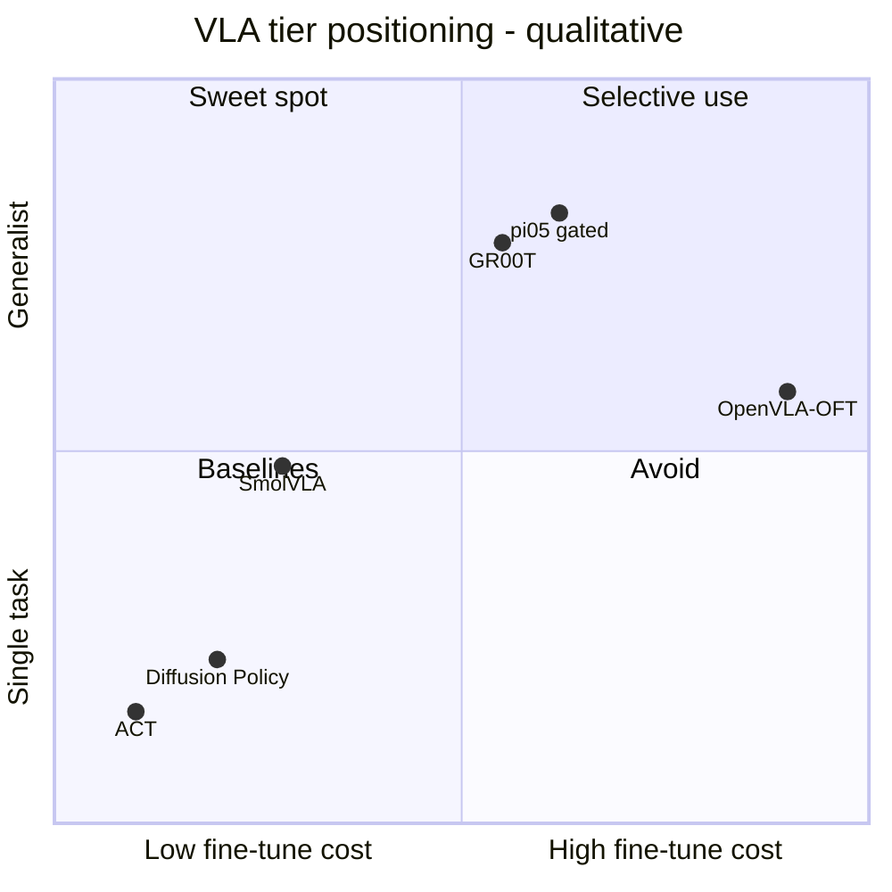

(배치는 정성 판단이며 컴퓨트 축만 리서치 수치에 근거한다[A].)

**등급 선택 규칙**
1. 국방·Air-gap 또는 가중치 약관이 고객 계약과 충돌하면 **V1(SmolVLA)** 고정.
2. 휴머노이드·양팔·다중 체화면 **V2(GR00T N1.7)**. Isaac Lab Mimic 데이터와 짝이 맞고 Thor 추론이 확인돼 있다. 단, 파인튜닝 가중치를 고객에게 납품하는 것은 NVIDIA Open Model License의 재배포 조항 해석(V7, M3)이 전제다. V7 결과가 부정적이면 GR00T는 내부 교사 모델로만 쓰고 납품 정책은 SmolVLA·ACT로 증류한다[A].
3. 단일 셀·단일 과제·고정 조명이면 **B(ACT·Diffusion)**를 먼저 학습한다. 베이스라인이 인수 기준을 넘으면 VLA로 올리지 않는다. 고객은 성공률을 사지 모델 크기를 사지 않는다.
4. pi0.5는 openpi 가중치 약관을 서면으로 확인하기 전까지 **상업 납품 금지**다(V7, M3). 해제되면 V2와 같은 줄에서 경쟁시킨다.

### 4.5 파인튜닝 레시피(표준값)

| 레시피 | 데이터 | 핵심 설정 | 평가 | 실패 시 처방 |
|---|---|---|---|---|
| SmolVLA-std | Mimic 증식 300–1,000 + 실셀 시연 ≥50[A] | smolvla_base, 20k 스텝, 배치 64, 카메라 2–3대, 행동 청크 | 시뮬 1,000 에피소드 + 실셀 50 trial | 실셀 시연 25개 추가, 조명 랜덤화 확대 |
| GR00T-NE(신규 체화) | 증식 1,000–3,000 + 실셀 시연 50–100[A] | NEW_EMBODIMENT 레시피, 상대 말단 행동 공간, 2,000–10,000 스텝[A], 글로벌 배치 32, 8 GPU | 시뮬 + 실셀(휴머노이드 셀은 P2) | 행동 정규화 통계 재계산, 체화 메타데이터 검증 |
| ACT-cell | 실셀 시연 50–200 + 증식 선택 | 행동 청크, 단일 GPU | 실셀 50 trial | 시연 다양성(초기 자세) 확대 |
| DP-contact | 증식 1,000 + 실셀 50 | 확산 스텝은 추론 지연 예산에 맞춤 | 삽입 과제 성공률 + 접촉력 피크 | 추론 스텝 축소 또는 증류 |
| 공통 데이터 비율 | 시뮬 : 실셀 = 약 20 : 1에서 시작[A] | 실셀 데이터는 측정권 여부를 메타데이터에 기록 | 비율별 A/B 1회 | 갭이 크면 실셀 비율 상향 |

- **데이터 혼합 원칙:** 실셀 시연은 소량이지만 반드시 넣는다(DR의 '소량 실데이터 파인튜닝 기본 포함'). 시뮬만으로 학습한 Cosmos Policy가 Franka 제로샷 평균 35%에 그쳤다는 보고[U]가 근거다.
- **학습 산출물:** 체크포인트, 정규화 통계, 데이터 카드(출처·라이선스·측정권), 평가 리포트를 한 MLflow 모델 버전으로 묶는다(§10).

### 4.6 VLA RL 후처리와 실세계 RL(P2)

- **RLinf 0.3**은 Isaac Lab 3.0의 학습 백엔드로 통합됐고 OpenVLA, pi0/pi0.5, GR00T N1.5–N1.7의 RL 파인튜닝을 지원한다. 처리량 2.434배 주장은 벤더 수치이므로 의사결정에 쓰지 않는다. P2에 팩토리에서 먼저 운영하고, 비용 측정 후 견적 단가를 정한다.
- **잔차 RL:** VLA를 고정하고 작은 잔차 정책을 RL로 학습해 접촉 구간의 정밀도를 올린다. 실셀 갭이 접촉 구간에서 생길 때의 1차 처방이다.
- **HIL-SERL(LeRobot):** 사람 개입을 받는 실세계 RL이다. 고객 셀에서 마지막 5–10%p를 끌어올리는 용도로, 측정권이 있는 셀에서만 운영한다[A].

### 4.7 IL·VLA 작업별 컴퓨트

| 작업 | 풀 | 1회 GPU-시간 | 1회 토큰 | 비고 |
|---|---|---|---|---|
| Mimic 상태 기반 1,000개 | RT | 0.3–0.67 | 18–40 | 18–40분 |
| Mimic 시각운동 1,000개 | RT | 약 10 | 약 600 | 시도 2,000개 예약 시 최대 2배[A] |
| BC-RNN 학습 | RT 또는 TRAIN | 0.5(상태) / 6(시각운동) | 30 / 360(RT 기준) | — |
| ACT / Diffusion | TRAIN | 2–8 / 4–12[A] | 160–640 / 320–960 | 사내 측정 후 확정 |
| SmolVLA 파인튜닝 | TRAIN | 약 4 | 약 320 | 20k 스텝 |
| GR00T N1.7 파인튜닝 | TRAIN | 2–40 | 160–3,200 | 과제·스텝 수에 비례 |
| pi0.5 전체 파인튜닝(차단) | TRAIN | 10–40 | 800–3,200 | 해제 시 |
| RLinf VLA RL 후처리(P2) | TRAIN | 50–300[A] | 4,000–24,000 | P2 측정 후 확정 |

---

## 5. 인식 SDG 파이프라인

**결론: 인식 모델은 '인증 자산으로 만든 합성 데이터 + 라벨을 보존하는 증강 + 소량 실데이터'로 학습하고, 인수는 보류 실데이터 mAP 비율과 소량 실데이터 곡선으로만 한다. 렌더 품질 지표는 인수 기준이 아니다.**

### 5.1 흐름

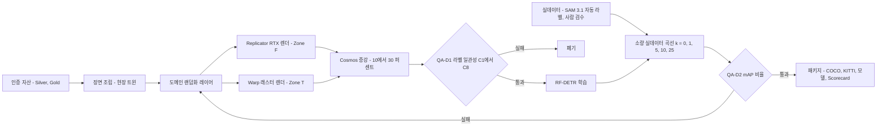

### 5.2 인식 도메인 랜덤화

| 축 | 랜덤화 내용 [A] | 한국 현장 특화 |
|---|---|---|
| 조명 | 색온도 2,700–6,500 K, 조도 100–2,000 lux, 그림자, 형광등 깜빡임 | 물류센터 LED, 조선소 실외광 |
| 재질·인쇄 | 텍스처, 반사도, 포장 인쇄 변형 | **한글 포장 SKU**(라면·음료·택배 박스), 테이프·송장 |
| 카메라 | 내부 파라미터 ±2%, 외부 ±2 cm·±2°, 노출, 모션 블러, 센서 ISP 프로파일 | 고객 카메라 실측 프로파일 우선 |
| 배치 | 물체 수·자세·적층·가림, 방해물 | 혼적 팔레트, 폴리백 |
| 배경 | 3DGUT 현장 스플랫, 무작위 배경 | 현장 스플랫이 있으면 무작위 배경 비율 30% 이하 |

- **원칙:** 현장 스플랫으로 대상 현장의 외형 갭을 줄이고, 롱테일은 구조화 랜덤화로 덮는다(DR §4.2). 무작위 텍스처를 과도하게 쓰면 현장 특화 정확도가 떨어지므로 비율을 Scorecard A/B로 정한다.

### 5.3 실데이터 자동 라벨링

- **민수:** SAM 3.1(Object Multiplex, 2026-03-27)로 개방 어휘 분할·추적, VLM으로 캡션·클래스 매핑을 만든다. SAM 3은 SA-CO에서 사람 대비 75–80% 수준이므로 **자동 라벨은 초안**이다. 배치마다 5% 사람 검수, 오류율 2% 초과 배치는 전수 검수한다[A].
- **국방·Air-gap:** SAM License는 군사·ITAR 용도를 제한한다. 국방 에디션은 RF-DETR 교사 모델 + 사람 검수로 대체하고 SAM 계열 가중치를 이미지에 넣지 않는다.
- **보류 실데이터 분할:** 장소·날짜 단위로 학습/보류를 나눈다. 같은 날 같은 셀의 프레임이 양쪽에 섞이면 mAP 비율이 부풀려진다([05 §13.2](05-physics-and-realism.md)).

### 5.4 RF-DETR 학습

| 항목 | 값 | 출처·성격 |
|---|---|---|
| 모델 | RF-DETR N–L(Apache-2.0). XL/2XL은 PML 1.0이라 기본 사용 금지 | 확인 |
| 정확도·지연 | COCO AP50:95 48.4–56.5, T4 TensorRT FP16 2.3–6.8 ms | 확인 |
| SDG 50k RTX 이미지 | 5–30 RT GPU-시간 | 추정 |
| 학습 50k × 50 에폭(S/M) | 10–40 A100-시간 | 추정 |
| 실데이터 파인튜닝 | 2 GPU-시간 미만 | 추정 |
| 배포 | RF-DETR N/S 2.3–3.5 ms(T4) → Thor는 사내 측정 | 확인(T4) / 측정 예정 |

### 5.5 소량 실데이터 파인튜닝 곡선

모든 인식 납품물에는 아래 곡선이 자동으로 붙는다. 곡선은 '실데이터를 몇 장 더 모으면 되는가'라는 고객 질문에 숫자로 답하는 장치다.

```math
R_k=\frac{\mathrm{mAP}_{\mathrm{real}}\left(M_{\mathrm{syn}+k\%}\right)}{\mathrm{mAP}_{\mathrm{real}}\left(M_{\mathrm{real},100\%}\right)},\qquad k\in\{0,1,5,10,25\}
```

| k(실데이터 비율) | P0 목표 | P1 목표 | P2 목표 | P3 목표 | 측정 규칙 |
|---|---|---|---|---|---|
| 0(합성 전용) | ≥0.85 | ≥0.90 | ≥0.95 | ≥0.95(3개 버티컬) | DR KPI |
| 1 | 보고 | 보고 | 보고 | 보고 | 학습 시드 3개 평균 ± 표준편차 |
| 5 | 보고 | 보고 | 보고 | 보고 | 동일 |
| 10 | — | ≥1.0 | ≥1.0 | ≥1.05 | DR KPI |
| 25 | 보고 | 보고 | 보고 | 보고 | 포화 확인용 |

- **실행 절차:** ① 실데이터 100% 기준 모델 학습(시드 3) → ② 합성 전용 모델 → ③ k ∈ {1, 5, 10, 25}마다 합성 사전학습 + 실데이터 파인튜닝(시드 3) → ④ 보류 실데이터로 mAP@[0.5:0.95] 평가 → ⑤ 곡선과 신뢰구간을 Scorecard에 첨부. 총 파인튜닝 12회 × 2 GPU-시간 미만 ≈ 최대 1,920 토큰이다[A].
- **판정 규칙:** 계약 인수 기준(예: '합성 + 실데이터 10%가 실데이터 100% 이상')을 처음 넘는 최소 k를 '필요 실데이터 비율'로 리포트에 쓴다. 곡선이 k = 25에서도 기준에 못 미치면 랜덤화 분포 재설계 DAG가 자동 생성된다(QA-D2).

### 5.6 데이터셋 팩 1건의 컴퓨트 견적(예시)

| 단계 | 풀 | GPU-시간 | 토큰 |
|---|---|---|---|
| Replicator SDG 50k(RTX 실시간) | RT | 5–30 | 300–1,800(이미지 단가 ₩1.5 × 50k = ₩7.5만 = 750 토큰으로 청구 가능) |
| Cosmos 증강 10–30% | TRAIN | 측정 후(§6.4 상한 참고치) | — |
| RF-DETR 학습 | TRAIN | 10–40 | 800–3,200 |
| 소량 실데이터 곡선 | TRAIN | ≤24 | ≤1,920 |
| **합계(증강 제외)** | — | 약 15–94 | **약 1,100–6,900 토큰(₩11–69만)** |

데이터셋 팩 가격(₩5,000만–2억, DR) 대비 컴퓨트는 1% 안팎이다. 가격의 근거는 GPU-시간이 아니라 mAP 인수 조건이다.

---

## 6. 월드모델 활용: Cosmos 3

**결론: 월드모델은 외형을 바꾸고 정책을 미리 거르는 도구다. 물리·라벨·센서의 정답은 언제나 시뮬레이터와 실측이 낸다. 월드모델 출력은 인증서의 증거가 될 수 없다.**

### 6.1 모델 사다리

| 시기 | 모델 | 크기·하드웨어 | 라이선스 | 용도 |
|---|---|---|---|---|
| 현재–M8 | Cosmos Transfer 2.5 | 2B, RGB·깊이·분할·엣지·블러·HD맵·라이다 제어 | 코드 Apache-2.0, 가중치 NVIDIA Open Model License | DATA·Skill 외형 증강(P1 M5부터) |
| M9– | **Cosmos 3 Nano 16B** 한국 도메인 파인튜닝 | RTX PRO 6000 / H100 / B200 | OpenMDW-1.1(전문 [U], V7 조건) | 증강, 장면 비평 보조 |
| P3 | Cosmos 3 Super 64B | H200 / B200 / GB200 | OpenMDW-1.1 | **정책 사전 선별** |
| 관찰 | Cosmos 3 Edge 4B | Jetson Orin / Thor(2026년 7월) | OpenMDW-1.1 | 현장 사전 필터 실험[A] |
| 관찰 | Cosmos3-Nano/Edge-Policy-DROID | — | OpenMDW-1.1 | 월드-액션 모델 연구 비교 |

### 6.2 용도 1: 외형 증강

- **조건 입력:** 깊이·분할·엣지 제어로 기하를 고정하고 외형(조명, 재질, 오염, 날씨)만 바꾼다. 그래서 시뮬 라벨을 그대로 쓸 수 있다.
- **QA:** 라벨 일관성 검사 C1–C8(마스크 IoU, 박스·클래스, 깊이 AbsRel, 엣지 F-score, 소형 물체 생존, 한글 문자 환각, 시간 일관성, 환각 물체)을 모두 통과한 프레임만 납품한다. 검사 정의는 [05 §12.2](05-physics-and-realism.md)가 정본이다.
- **경제성 규칙:** 같은 GPU-시간을 도메인 랜덤화에 썼을 때보다 mAP 비율을 더 올릴 때만 증강을 유지한다. 데이터셋마다 A/B 1회를 돌린다[A].
- **근거:** NVIDIA SO-101 자료는 학습된 증강으로 큐브 집기 19/20(증강 없음 3/20), 적층 18/20(1/20)을 보고했다[U]. 효과는 크지만 사내 A/B 전까지 견적 근거로 쓰지 않는다.

### 6.3 용도 2: 정책 사전 선별(P3)

실셀 시간은 가장 비싼 평가 자원이다. 후보 정책이 10개면 실셀에서 정책당 100 trial만 해도 1,000 trial이 든다. 월드모델 사전 선별은 **실셀에 올릴 후보를 줄이는 필터**다.

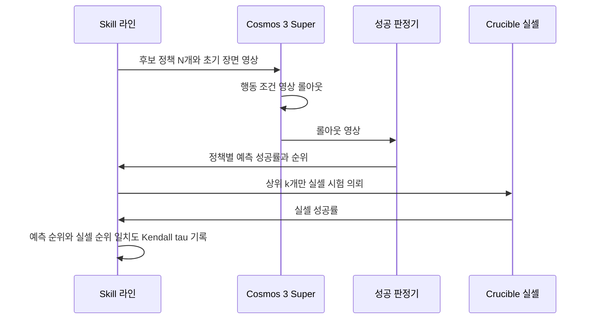

- **신뢰 조건:** 선별기의 예측 순위와 실셀 순위의 Kendall τ가 누적 정책 20개 이상에서 0.6 이상일 때만 '필터'로 쓴다[A]. 그 전에는 참고 점수로만 보고한다.
- **안전장치:** 선별에서 탈락한 정책 중 10%를 무작위로 실셀에 올려 탈락 오류율을 잰다[A]. 필터가 좋은 정책을 버리는 비율을 모르면 필터를 쓸 수 없다.
- **인증 불가:** 선별 점수는 리포트의 부록일 뿐, 로봇-과제 인증서의 수치는 실셀과 결정론 재생에서만 나온다.

### 6.4 한계

| 한계 | 내용 | 대응 |
|---|---|---|
| 물리 일관성 | 접촉, 물체 영속성, 질량 보존을 보장하지 않음 | RL 학습 환경으로 쓰지 않음 |
| 환각 | 한글 문자·로고, 소형 물체 소실, 개수 변화 | C1–C8 검사, 실패 프레임 폐기, 재라벨 금지 |
| 제로샷 정책 | Cosmos Policy: 과제당 합성 시연 약 800개·실시연 0개로 Franka 평균 35%[U] | 실셀 소량 시연을 항상 포함 |
| 비용 | 구형 Cosmos Predict1 7B가 H100 1장에서 클립당 약 383초(14B 약 593초), 참고치 | 증강 비율 10–30%에서 시작, A/B로 유지 결정 |
| 재현성 | 생성 결과는 D2 등급(생성형) | 인증서 증거에서 제외, Manifest에 시드·가중치 해시 기록 |
| 라이선스 | OpenMDW-1.1 전문 미확인 | V7(M3) 전 외부 납품 증강은 Transfer 2.5만 |

**비용 상한 참고치[A]:** 383초 × 1,000 클립 ≈ H100 106시간 ≈ TRAIN 8,500 토큰(₩85만). Transfer 2.5(2B)는 이보다 작고, Cosmos 3 Nano(16B)는 클 수 있으므로 M9 착수 전 클립당 실측 원가로 교체한다.

---

## 7. Sim2Real 툴킷

**결론: sim2real은 요령이 아니라 기본값이다. 랜덤화 프리셋, 액추에이터 넷, 증류, 지연·노이즈 주입, sim2sim 게이트를 모든 템플릿에 켜 둔 상태로 출고하고, 끄는 쪽에 승인을 요구한다.**

### 7.1 도구 목록

| 도구 | 무엇을 하나 | 기본 적용 | 제품 형태 | 단계 | 소유 |
|---|---|---|---|---|---|
| 랜덤화 프리셋 | 로봇 클래스별(협동 팔, 산업용 팔, 휴머노이드, 사족, AMR) 범위 | 전 템플릿 | YAML 프리셋 + Studio GUI | P0 | Skill |
| 인증서 기반 물리 폭 | 자산 인증서 오차 막대로 물리 랜덤화 폭 설정(§3.3) | 인증 자산 장면 | task-spec `source: certificate` | P0 | Skill + Fidelity |
| 액추에이터 네트워크 | 모터 로그로 지령→토크 응답 학습 후 시뮬에 삽입 | 보행·휴머노이드 | 실측 로그 업로드 → 학습 → 장면 레이어 | P1 | WS1 sysid + Skill |
| teacher → student 증류 | 특권 관측 teacher를 실제 관측 student로 증류(rsl_rl distillation) | 시각·부분관측 정책 | 템플릿 옵션 | P0 | Skill |
| 지연·노이즈 주입 | 관측·행동 지연, 엔코더·포즈 노이즈, 프레임 드롭 | 전 템플릿 | 센서 프로파일에서 자동 유도 | P0 | Skill + WS3 |
| 제어 주기 정합 | 실제 컨트롤러 주기·보간 방식과 시뮬 decimation 일치 | 전 템플릿 | 로봇 프로파일 필드 | P0 | Skill |
| sim2sim 게이트 | 교차 백엔드 실행으로 백엔드 과적합 탐지(§7.3) | **수출 전 100%** | CI 게이트 | P0 | Kernel + Skill |
| real2sim2real 루프 | Forge 스캔 → 장면 → 재학습 → 실셀 | 고객 셀 | Outcome DAG | P1 | Forge + Skill |
| sysid 마법사 | 실측 로그로 마찰·질량·지연 적합, ASAP식 delta-action 보정 | 갭이 동역학 원인일 때 | Studio 마법사 | P2 | WS1 + Skill |
| 잔차 RL | VLA·BC 위 잔차 정책 | 접촉 구간 갭 | 템플릿 옵션 | P2 | Skill |
| sim/real 상관 측정 | SimplerEnv식 MMRV·Pearson으로 시뮬 평가의 예측력 측정 | Crucible 전 캠페인 | Scorecard 항목 | P1 | Crucible |

### 7.2 갭 진단 순서

실셀 성공률이 시뮬보다 낮을 때 원인을 추측하지 않고 아래 순서로 분리한다.

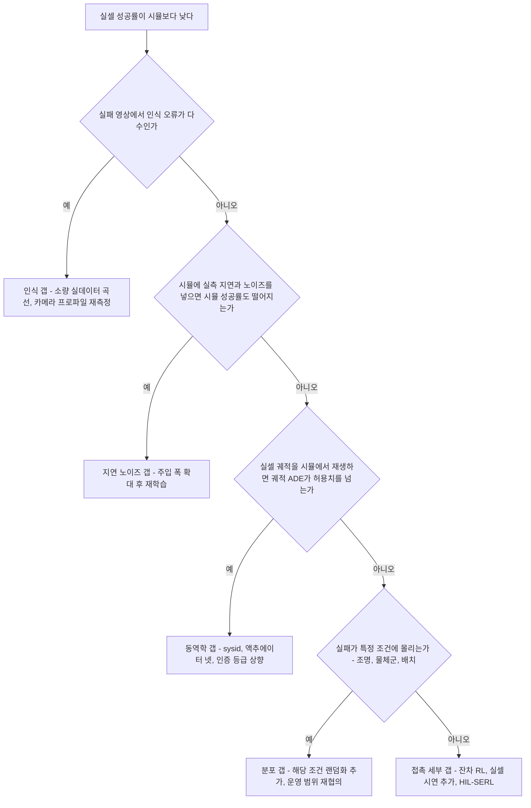

### 7.3 sim2sim 게이트 2단 구조

[04 §4.7](04-system-architecture.md)과 [05 §8.4](05-physics-and-realism.md)는 게이트를 서로 다른 엄격도로 정의한다. 학습 모듈은 이를 **두 단으로 운영**해 정합시킨다[A].

| 단 | 적용 대상 | 절차 | 합격 기준 | 실패 시 |
|---|---|---|---|---|
| **Tier 1: 수출 차단 게이트** | 모든 정책(수출 전 적용률 100%, DR KPI) | 학습 백엔드에서 1,000 에피소드 → 교차 백엔드(Zone F: PhysX·Newton·MuJoCo CPU, Zone T/S: Newton·MuJoCo CPU)에서 같은 정책·같은 시드 집합 → 지연·노이즈 주입 → ONNX 변환 대조 | 성공률 차 ≤10%p, 평균 반환 비율 ≥0.85, 주입 후 하락 ≤15%p, ONNX 행동 최대 오차 ≤1e-3 | 수출 차단, 원인 분류(물리 의존·과적합·수치) 후 반려 |
| **Tier 2: 인증 등급 게이트** | 로봇-과제 인증서·Crucible 공식 캠페인 대상 정책 | 게이트 백엔드 전부에서 같은 초기 조건 200개 | 백엔드 쌍별 성공률 차 ≤5%p, 관절 궤적 RMSE ≤0.05 rad | 인증 보류, 접촉 파라미터 랜덤화 확대 또는 운영 범위 축소 |

- **왜 두 단인가:** 모든 정책에 5%p 기준을 걸면 변형체·접촉 과제의 PoC 반복이 막힌다. 반대로 인증서에 10%p를 허용하면 인증의 의미가 희석된다. 납품 속도는 Tier 1이, 인증의 엄격성은 Tier 2가 지킨다.

### 7.4 Cell-to-Policy PoC 12주 표준 일정(Skill 관점)

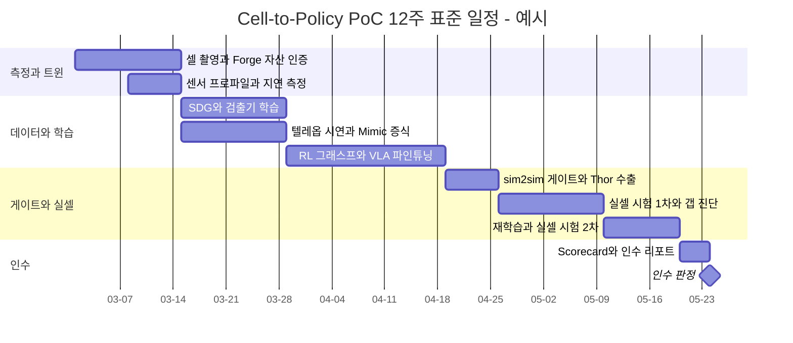

- 인수 기준은 지정 실셀 성공률, sim-to-real 갭 ≤15%p, 정책 5개 이상의 r 보고이며 책임 상한은 계약 금액이다(DR). 위 일정에서 실셀 시험을 두 번 배치한 이유는 1차 시험의 갭 진단(§7.2)이 거의 항상 재학습을 부르기 때문이다[A].

---

## 8. 평가: Athanor Crucible과 K-Physical AI Arena

**결론: Crucible은 '시뮬로 넓게 거르고 실셀로 좁게 확정하는' 2단 평가 공장이고, Arena는 그 공장을 제3자 공동서명과 거버넌스 헌장 아래 외부에 여는 프로그램이다. 숫자는 항상 신뢰구간과 함께 나가며, 헌장 서명 전에는 외부 채점을 하지 않는다.**

### 8.1 구조

| 구성요소 | 내용 | 기술 | 책임 |
|---|---|---|---|
| 과제 스위트 레지스트리 | 과제 ID, 장면 커밋, 초기 조건 목록, 성공 정의, 시간 제한, 실패 유형 분류, 버전 | OpenUSD + JSON, 콘텐츠 해시 | Head of Fidelity & Evaluation |
| 시뮬 하네스 | GPU 병렬 이기종 평가(정책 클라이언트-서버) | Isaac Lab Arena v0.3(Zone F), mjlab(Zone T 셀프 평가) | WS4 |
| 결정론 재생 | 인증용 재실행, 비트 일치 | MuJoCo 3.15 CPU, LIGHT 풀 고정 CPU SKU | WS4 + WS1 |
| 실셀 하네스 | 초기 조건 재현 지그, 자동 리셋[A], 운영자 블라인드, MCAP 기록 | Test Cell 1(P0), Test Cell 2(P1), 휴머노이드 셀(P2), Jetson AGX Thor | WS4-L 랩 운영 |
| 채점 서비스 | Wilson CI, 차이 검정, Pearson r·Kendall τ·MMRV, 회귀 게이트 | 공개 채점 코드(Apache-2.0로 공개[A]) | WS4 |
| 공동서명 워크플로 | 프로토콜 확인, 입회, 검토, 서명 | 서명 JSON + PDF | 공동서명 기관(KTL·KIRIA·TTA 중 1곳) |
| 리더보드 | 트랙별 순위, 신뢰구간, 제출 이력 | Studio·Marketplace | Arena PM(M10 채용) |

### 8.2 과제 스위트

| 스위트 | 내용 | 시뮬 과제 | 실셀 과제 | 지표 | 단계 |
|---|---|---|---|---|---|
| **KP(K-Pick)** | 한국 SKU 빈 피킹(박스·파우치·폴리백), 디팔레타이징, 키팅 | 12 | Test Cell 1 | 성공률, 1,000회당 성공 피킹, 사이클 타임 | P1 |
| **KA(K-Assembly)** | 페그·커넥터 삽입, 체결, 케이블 | 7 | Test Cell 2 | 성공률, 접촉력 피크, 소요 시간 | P1 |
| **KS(Shipyard handling)** | 조선 작업장 부재 핸들링, 공구 전달 | 3 | — | 성공률 | P1 |
| **KR(Robustness)** | 조명·방해물·카메라 이동·자세 섭동(LIBERO-plus식) | 3 | 섭동 조건 실셀 재시험 | 섭동 하 성공률 하락 폭 | P1 |
| **KH(Humanoid·Bimanual)** | 토트 이송, 양팔 핸드오버, 로코매니퓰레이션 | 10[A] | 휴머노이드 셀 | 성공률, 낙상률, 추종 오차 | P2(Arena v1, M18) |
| **공개 비교층** | LIBERO-plus, RoboCasa365, RoboTwin 2.0 일부 | 비교 전용 | — | 공개 지표 | P1 보고 |

- **Crucible v0(P1, 내부):** KP 12 + KA 7 + KS 3 + KR 3 = 시뮬 25개, 실셀 2개(Test Cell 1·2). DR의 '시뮬 25, 실셀 2'와 같다.
- **분할 정책:** 각 과제는 공개 개발 분할(초기 조건·시드 공개), 비공개 보류 분할(접근 제한), 분기마다 교체하는 순환 분할 세 가지를 가진다[A]. 순위와 인증은 비공개·순환 분할로만 낸다.
- **고객 시나리오 스위트:** 고객 셀 트윈으로 만든 전용 과제는 해당 고객 캠페인에서만 쓰고, 측정권이 있을 때만 익명화해 공통 스위트 후보로 올린다.

### 8.3 통계: 숫자가 무엇을 말할 수 있는가

**① 성공률 신뢰구간.** 성공률은 Wilson 95% 구간으로 보고한다(공식은 [05 §13.1](05-physics-and-realism.md)). 표본 수에 따른 반폭(정규 근사)은 아래와 같다.

| trial 수 n | 반폭(p = 0.5) | 반폭(p = 0.8) | 쓰임 |
|---|---|---|---|
| 50 | ±13.9%p | ±11.1%p | 실셀 최소(05 표본 요건), P1 PoC |
| 100 | ±9.8%p | ±7.8%p | 실셀 권장(P2 갭 ≤10%p 주장 시) |
| 200 | ±6.9%p | ±5.5%p | 인증서 등급 캠페인[A] |
| 400 | ±4.9%p | ±3.9%p | 시뮬 회귀 최소 |
| 1,000 | ±3.1%p | ±2.5%p | 시뮬 평가 표준 |

- **함의:** 실셀 50 trial로 잰 갭은 실셀 쪽 불확도만으로도 ±11–14%p가 흔들린다. 그래서 P1 갭 ≤15%p는 점추정으로 판정하되 신뢰구간을 함께 공개하고, P2 갭 ≤10%p부터는 정책·과제당 실셀 100 trial을 권장 표본으로 둔다[A].

**② 두 정책 비교.** 정책 버전 A와 B의 차이를 검출하는 데 필요한 정책당 trial 수(α = 0.05 양측, 검정력 0.8)는 다음과 같다.

```math
n=\frac{(z_{1-\alpha/2}+z_{1-\beta})^{2}\left[p_A(1-p_A)+p_B(1-p_B)\right]}{(p_A-p_B)^{2}}
```

| p_A → p_B | 필요 n(정책당) |
|---|---|
| 0.70 → 0.80 | 약 290 |
| 0.80 → 0.90 | 약 196 |
| 0.85 → 0.90 | 약 682 |

실셀만으로 5%p 개선을 증명하려면 정책당 700 trial 가까이 든다. **그래서 개선 판정은 시뮬(n = 1,000 이상)에서 하고, 실셀은 '시뮬 판정이 현실에서도 성립하는가'(r, 갭)를 확인하는 데 쓴다.** 이것이 2단 평가의 통계적 이유다. 실셀에서 개별 판정이 필요하면 Wald 순차검정(SPRT)으로 trial 수를 줄인다[A].

**③ sim/real 상관.** Pearson r은 정책 K개의 (시뮬 성공률, 실셀 성공률) 쌍으로 계산하고, Fisher 변환으로 신뢰구간을 붙인다.

```math
z=\tfrac{1}{2}\ln\frac{1+r}{1-r},\qquad \mathrm{SE}=\frac{1}{\sqrt{K-3}},\qquad \mathrm{CI}_{95}=\tanh\!\left(z\pm 1.96\,\mathrm{SE}\right)
```

| K(정책 수) | r = 0.8의 95% 구간 | 판단 |
|---|---|---|
| 5 | 약 [−0.28, 0.99] | 정보 없음. DR 최소 요건이지만 단독 근거로 쓰지 않음 |
| 8 | 약 [0.22, 0.96] | 인증용 최소[A] |
| 12 | 약 [0.42, 0.94] | 권장[A] |
| 20 | 약 [0.55, 0.92] | Arena 트랙 연간 리포트 |

- **정책 패밀리 전략:** 정책 수를 싸게 늘리기 위해 같은 과제에서 학습 단계별 체크포인트, 랜덤화 폭 변형, 데이터 양 변형을 '정책 패밀리'로 만든다. 성공률이 0.2–0.9 범위에 고르게 퍼지도록 고른다. 성공률이 한쪽에 몰리면 r이 구조적으로 낮아지기 때문이다[A].
- **순위 일치:** Kendall τ와 MMRV(최대 순위 위반의 평균, SimplerEnv 방식)를 함께 낸다. 고객이 실제로 묻는 것은 "시뮬에서 더 좋은 정책이 현실에서도 더 좋은가"이고, 이것은 r보다 순위 지표가 직접 답한다.

**④ 회귀 게이트.** 새 정책 버전은 시뮬 스위트에서 과제별 비열등성을 통과해야 한다: 성공률 차이(신규 − 기존)의 95% 신뢰구간 하한 ≥ −3%p(n = 1,000)[A]. 과제 25개 중 1개라도 실패하면 리포트에 '회귀'로 표시하고 실셀 단계로 넘기지 않는다.

### 8.4 거버넌스 헌장

| # | 조항 | 내용 [A] |
|---|---|---|
| 1 | 목적 | 한국 Physical-AI 정책의 시뮬·실셀 성능을 재현 가능한 프로토콜로 측정하고 공개한다 |
| 2 | 공동서명 기관 | KTL·KIRIA·TTA 중 1곳이 프로토콜 승인, 실셀 입회, 결과 서명. 공개 거부권 보유 |
| 3 | 운영 분리 | Arena PM은 Head of Fidelity & Evaluation에 보고하며 Skill 리드·영업 조직의 지휘를 받지 않는다 |
| 4 | 운영위원회 | 공동서명 기관 1, 회원 대표 2(순환), AICHEMIST 1. AICHEMIST는 과제 채택 표결에서 소수다 |
| 5 | 프로토콜 공개 | 과제 정의, 성공 판정, 통계 코드, 표본 수 규칙을 캠페인 시작 전에 공개·동결한다 |
| 6 | 사전 등록 | 실셀 초기 조건과 실패 정의를 시험 전에 등록하고 사후 변경을 금지한다 |
| 7 | 제출 규칙 | 트랙별 월 제출 횟수 제한(예: 3회), 비공개 분할 결과는 최종 제출만 공개 |
| 8 | 수수료 독립 | 회비·캠페인 비용은 결과와 무관하게 사전 확정한다 |
| 9 | 데이터 처리 | 제출 가중치는 평가 후 삭제(제출사 동의 시 보관). trial 로그는 측정권이 있을 때만 페어드 코퍼스로 |
| 10 | 이의 제기 | 결과 공개 후 30일 내, 공동서명 기관 주관 재시험 |
| 11 | 스위트 버전 | 과제 교체·폐기는 반기 단위, 버전 간 점수 비교 금지 표기 |
| 12 | 인증서 효력 | 로봇-과제 인증서는 정책 해시 × 로봇 × 셀 × 운영 범위에 대해서만 유효, 유효기간과 재인증 조건 명시 |

### 8.5 이해상충 통제

| 위험 | 통제 |
|---|---|
| 우리가 판 정책을 우리가 채점 | 회피 규정: AICHEMIST가 학습·파인튜닝한 정책은 공동서명 기관 검토 없이 인증하지 않는다. 리더보드에 'AICHEMIST 학습' 표시 |
| 우리 데이터로 학습한 경쟁 정책 우대 의심 | 리더보드에 학습 데이터 출처(AICHEMIST 데이터 팩 사용 여부) 자기신고란[A] |
| Skill 팀의 테스트 분할 유출 | 비공개 분할은 Crucible 전용 버킷, Skill 그룹 접근 거부 정책, 접근 로그 분기 감사 |
| 운영자 편향 | 실셀 운영자는 정책 ID를 모르는 무작위 코드로 시험 |
| 고객 관계에 따른 결과 조정 | 결과물 고객이 Arena 제출사면 리포트에 관계 공시, 수수료 사전 확정 |
| 헌장 전 외부 채점 | 금지. 헌장 서명 전 활동은 내부 평가와 비공개 파일럿으로 한정 |

**일정 정합:** DR은 공동서명 MOU를 M10, 헌장 서명을 2027 Q4(M12–M14), K-Pick Challenge를 M12(외부 채점, 공동서명 기관 입회)로 둔다. 헌장 서명이 M13–M14로 밀리면 M12 외부 채점이 '헌장 전 외부 채점 금지' 원칙과 충돌한다. 학습 모듈은 **헌장 초안 M8, MOU M10, 헌장 서명은 K-Pick 행사 전 M12 초**로 당겨 운영한다[A]. 서명이 늦어지면 K-Pick은 공동서명 기관 입회 하의 '비순위 시연'으로 낮춰 연다.

### 8.6 벤치마크 포화 문제

- **현상:** LIBERO는 97–99%로 포화됐다. pi0.5 평균 96.85%, OpenVLA-OFT 약 97%, RLDX-1 97.8%다. 같은 RLDX-1이 섭동을 넣은 LIBERO-Plus에서는 86.7%로 11.1%p 떨어진다. 포화된 점수는 강건성을 가린다.
- **결과:** 포화 벤치마크의 점수 차는 실셀 순위를 예측하지 못하고, 고객은 '99% 모델'이 자기 셀에서 60%를 내는 것을 보고 평가 전체를 불신한다.

| 대응 | 규칙 [A] |
|---|---|
| 비교층과 채점층 분리 | LIBERO·LIBERO-plus·RoboCasa365는 비교 보고만. 등급·인증은 비공개 스위트와 실셀 |
| 헤드룸 규칙 | 트랙 상위 3개 정책의 중앙값이 90%를 넘는 과제는 다음 반기에 난이도 상향 또는 교체 |
| 순환 분할 | 분기마다 초기 조건·물체·조명 시드의 25%를 교체 |
| 섭동 스위트 | 모든 과제에 KR 섭동 버전 병기, '섭동 하 하락 폭'을 1급 지표로 |
| 장기 과제 | RoboCasa365(365과제, 2,500+ 장면), BEHAVIOR-1K(1,000 활동)류 장기 과제를 Arena 상위 트랙에 |
| 실셀 앵커 | 시뮬 순위는 실셀 순위와 τ로 교정한 뒤에만 공개 |
| 과적합 억제 | 월 제출 제한, 비공개 분할 결과는 최종 제출만 공개, 제출 이력 공개 |

### 8.7 Crucible 상품 연결

| 상품(DR 가격) | Crucible이 내는 증거 |
|---|---|
| Crucible 평가 캠페인(정책 버전당 ₩2,000만–6,000만) | 과제별 Wilson CI, 회귀 판정, sim/real r·τ, 서명 리포트 |
| Arena 회원(연 ₩3,000만 스타트업 / ₩1억 대기업) | 공동서명 인증서, 리더보드, 분기 리포트 |
| 로봇-과제 인증서(₩3,000만–1억) | Tier 2 sim2sim, 실셀 200 trial[A], 운영 범위 명시 |
| Cell-to-Policy PoC 인수(₩1.5–2.5억) | 실셀 성공률, 갭 ≤15%p, 정책 5개 이상 r 보고 |

- **K-Pick Challenge(M12):** 로봇 OEM 3곳의 정책을 KP 스위트(시뮬)와 Test Cell 1(실셀)에서 동시에 채점한다. 채점 코드와 프로토콜은 M11에 공개한다.

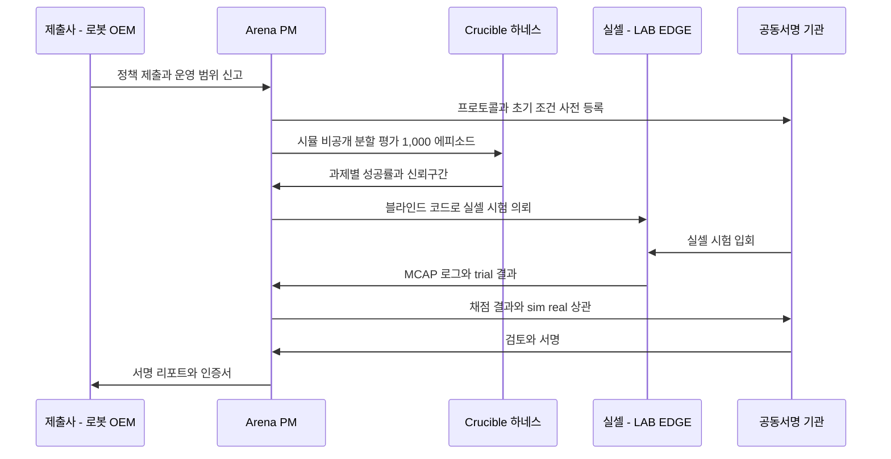

---

## 9. 배포: ONNX → TensorRT → Jetson AGX Thor, 그리고 현장 플라이휠

**결론: 정책은 '모델 파일'이 아니라 서명된 패키지로 나간다. 패키지는 sim2sim·회귀 게이트를 통과한 해시만 담고, 현장 실패는 MCAP로 돌아와 다음 버전의 학습 과제가 된다.**

### 9.1 수출 파이프라인

| 단계 | 작업 | 기준 |
|---|---|---|
| 1 | PyTorch 체크포인트 → ONNX | opset은 트레인별 고정, 동적 축 최소화 |
| 2 | ONNX Runtime 1.30.0 대조 | 동일 입력 1,000개, 행동 최대 오차 ≤1e-3(Tier 1) |
| 3 | TensorRT 11.3 엔진 빌드 | Jetson SKU·JetPack 7.2 버전별 엔진. 정밀도 FP16 기본, INT8·FP8은 보정 데이터셋과 정확도 회귀 검사 후[A] |
| 4 | 지연 프로파일 | p50·p99 지연, 메모리, 전력. 제어 주기 예산 대비 여유 ≥30%[A] |
| 5 | 패키징 | 컨테이너 + ROS 2 노드(Jazzy·Lyrical) + 안전 래퍼(관절·속도 한계, 워치독) + 모델 카드 + 라이선스 매니페스트 + Run Manifest ID |
| 6 | 서명·등록 | 패키지 해시 서명, MLflow `deployed` 단계 등록 |

- **VLA 특례:** GR00T N1.7은 Thor·Orin 추론을 공식 지원한다(JetPack 7.2, CUDA 13.2). 지연 수치는 저장소에 공개되지 않았으므로 P1에 Thor에서 직접 잰다. SmolVLA는 비동기 추론으로 행동 청크를 미리 채운다.
- **이중 계층 구조[A]:** 느린 VLM 계층과 빠른 행동 계층을 분리하는 설계(Figure Helix의 7–9 Hz / 200 Hz 구조가 참조점[U])를 Thor 패키지 템플릿으로 둔다. GEAR-SONIC은 Jetson에서 ONNX + TensorRT로 50 Hz 잠재 토큰을 낸다.
- **Thor 사양:** 개발 키트 약 USD 3,499, FP4 최대 2,070 TFLOPS, 128 GB, 40–130 W는 미확인[U]이다. 패키지 설계는 실측 프로파일만 근거로 쓴다.

| 정책 유형 | 제어 주기 목표 [A] | 추론 예산 |
|---|---|---|
| 팔 RL·ACT | 30–100 Hz | ≤10 ms |
| Diffusion Policy | 10–30 Hz(행동 청크) | ≤50 ms/청크 |
| SmolVLA·GR00T | 행동 청크 5–15 Hz, 저수준 제어기는 별도 | ≤100 ms/청크 |
| 휴머노이드 WBC | 50 Hz(GEAR-SONIC 기준) | ≤5 ms |
| 인식(RF-DETR N/S) | 카메라 프레임률 | T4 기준 2.3–3.5 ms, Thor 실측 |

### 9.2 게이트 재배포

- **섀도 모드:** 새 정책은 먼저 기존 정책과 병렬로 추론만 하고 행동은 내지 않는다. 행동 차이 분포를 24–72시간 기록한다[A].
- **카나리:** 로봇 플릿의 10% 또는 셀 1개에 먼저 배포하고, 현장 KPI(피킹 성공률, 사이클 타임)가 기존 대비 비열등하면 전체로 넓힌다.
- **롤백:** 직전 서명 패키지로 1분 내 롤백 가능해야 한다[A]. 양산 스킬 프로그램의 재학습 SLA(DR)는 이 절차를 전제로 한다.

### 9.3 현장 데이터 플라이휠(P2)

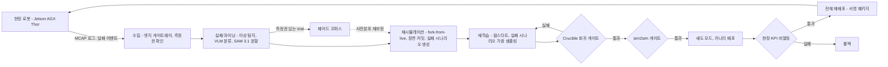

| 단계 | 기술 | 산출물 | 목표 [A] |
|---|---|---|---|
| 실패 마이닝 | 성공 판정 로그 + 이상 탐지 + VLM 실패 유형 분류. SAM 3.1은 민수만, 국방은 Apache 분할 모델 | 실패 클러스터와 대표 클립 | 실패 이벤트의 80% 자동 분류 |
| 재시뮬레이션 | Athanor Live의 fork-from-live로 현장 상태를 장면 커밋으로 고정, OpenSCENARIO DSL 변형 | 실패 시나리오 과제 | 클러스터당 시나리오 ≥20 |
| 재학습 | 실패 시나리오 가중 샘플링, 기존 체크포인트 웜스타트 | 후보 정책 | 실패 시나리오 성공률 +20%p |
| 게이트 재배포 | 회귀 게이트 + sim2sim + 섀도·카나리 | 서명 패키지 | 실패 발견 → 재배포 ≤14일(P2), ≤7일(P3) |

- **측정권 조건:** 현장 로그는 고객 데이터다. 측정권이 있는 trial만 교차 고객 재사용(코퍼스, 사전분포 보정)에 들어가고, 나머지는 해당 고객 정책의 재학습에만 쓴다([04 §11.5](04-system-architecture.md)).
- **시작 시점:** 첫 라이브 트윈은 M18 앵커 셀이다(DR). 플라이휠의 첫 완전 주기는 M18–M21에 돌리고, 그 전에는 실셀 시험 실패를 같은 루프로 처리해 절차를 미리 검증한다.

---

## 10. MLOps: 추적, 레지스트리, 계보, 라이선스 게이트

**결론: 모든 체크포인트는 '어떤 자산·장면·데이터·가중치에서 왔고, 어떤 평가를 통과했고, 누가 어디에 쓸 수 있는가'를 답할 수 있어야 레지스트리에 들어간다. 답하지 못하는 모델은 존재하지 않는 모델로 취급한다.**

### 10.1 구성

| 기능 | 기본 | 비고 |
|---|---|---|
| 실험 추적 | MLflow 3.16.1(자체 호스팅) | 지표, 영상 아티팩트, 토큰 사용량 |
| 모델 레지스트리 | MLflow 3 레지스트리 + 서명 패키지 저장소(Object Lock) | 단계 전이는 게이트 서비스만 수행 |
| 설정 | Hydra 1.3.7 + task-spec 정규화 해시 | 시뮬 설정 전체 해시 |
| 실행 기록 | Run Manifest(§7, [04](04-system-architecture.md)) | 없으면 스케줄러가 작업 거부 |
| 분산 실행 | Ray 2.59 + torchrun, KAI 큐 귀속 | 스팟 선점 시 SkyPilot 재개 |
| 데이터셋 버전 | DVC 3.67.1 / Iceberg 스냅샷 | lakeFS 1.87 이상 제외 |
| 뷰어 | Rerun 0.38.1, Viser 1.1.1 | 브라우저 재생 |
| 외부 연동 | W&B 0.30.0 커넥터(Cloud 선택) | Sovereign·Air-gap 제외 |

### 10.2 계보: 자산 → 장면 → 데이터셋 → 체크포인트 → 평가

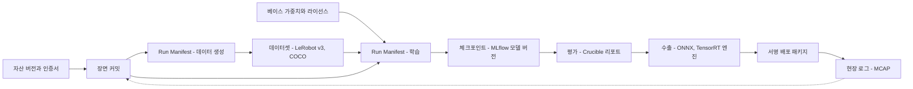

- **리콜:** 자산·가중치·데이터 하나가 `revoked`가 되면 하류 체크포인트·패키지·인증서가 자동 정지되고 영향 고객 목록이 나온다. 목표는 발견부터 영향 목록 확정까지 1시간 이내다([04 §11.4](04-system-architecture.md)).

**모델 카드 필수 필드**

| 필드 | 내용 |
|---|---|
| `base_weights` | 모델·버전·해시·라이선스(SPDX 또는 LicenseRef) |
| `datasets[]` | 데이터셋 해시, 출처(시뮬·텔레옵·실셀·현장), 라이선스, 측정권 |
| `scene_commits[]`, `manifests[]` | 학습·평가에 쓴 장면과 실행 기록 |
| `training` | task-spec 해시, 프레임워크 버전(Isaac Lab·rsl_rl·LeRobot), GPU SKU·드라이버, 시드 |
| `gates` | QA-S1 결과, sim2sim Tier, 회귀 판정, 실셀 결과(신뢰구간) |
| `zone`, `residency` | F/T/S, KR/US/EU |
| `allowed_uses` | 상업 / 재배포 / 국방 / 연구 전용(§10.4로 계산) |
| `operating_envelope` | 조명·물체군·로봇·셀 운영 범위(인수·책임 상한과 연결) |

### 10.3 레지스트리 단계

| 단계 | 진입 조건 | 전이 주체 |
|---|---|---|
| `candidate` | 학습 완료, 모델 카드 필수 필드 충족 | 학습 작업 |
| `sim-validated` | QA-S1 통과 | 게이트 서비스 |
| `exportable` | sim2sim Tier 1 통과, ONNX 대조 통과 | 게이트 서비스 |
| `real-validated` | 실셀 시험 결과 등록(신뢰구간 포함) | Crucible |
| `certified` | Tier 2 통과 + 공동서명(외부) 또는 Head of Fidelity 서명(내부) | Crucible + 공동서명 기관 |
| `deployed` | 서명 패키지 발행, 고객 배포 기록 | Platform |
| `deprecated` / `revoked` | 후속 버전 대체 / 라이선스·측정 문제 | Skill 리드 / 라이선스 레지스트리 |

### 10.4 가중치 라이선스 게이팅

파인튜닝 체크포인트는 입력의 제약을 상속한다. 사용 허용 범위는 입력 전체의 교집합이다.

```math
\mathrm{allowed}(\mathrm{ckpt})=\mathrm{allowed}(\mathrm{base})\ \cap\ \bigcap_{d\in D}\mathrm{allowed}(d)\ \cap\ \mathrm{allowed}(\mathrm{code\ path})
```

| 가중치·데이터 | 라이선스 | 상업 | 재배포 | 국방(Air-gap) | 게이트 판정 |
|---|---|---|---|---|---|
| SmolVLA | Apache-2.0 | O | O | O | **허용** |
| GR00T N1.7 | NVIDIA Open Model License | O(약관 조건) | [U](파인튜닝 가중치 납품 포함) | [U] | 학습·내부 평가 허용. 고객 납품(Jetson 패키지 포함)은 V7(M3) 서면 해석 후. 국방은 차단 |
| GEAR-SONIC 가중치 | NVIDIA Open Model License | O(약관 조건) | [U] | [U] | GR00T와 동일 |
| pi0.5(openpi) | 가중치 약관 미명시 | [U] | [U] | X | **차단**(내부 평가만) |
| OpenVLA | Llama 2 Community License | 조건부 | 조건부 | X | 내부 기준선만 |
| AgiBot GO-1, AgiBot World | CC BY-NC-SA 4.0 | X | X | X | **차단** |
| RLDX-1 가중치 | RLWRLD Model License v1.0(비상업) | X | X | X | **차단** |
| Cosmos 3 | OpenMDW-1.1 | 확인 중 | 확인 중 | 확인 중 | V7 전 외부 납품 증강은 Transfer 2.5만 |
| Cosmos Transfer 2.5 | NVIDIA Open Model License | O(약관 조건) | [U] | X | Zone F 증강 허용 |
| SAM 3 / 3.1 | SAM License | O(제한) | 조건부 | **X**(군사·ITAR) | 민수만 |
| RF-DETR N–L / XL·2XL | Apache-2.0 / PML 1.0 | O / 검토 | O / 검토 | O / X | N–L 허용, XL·2XL 차단 |
| Ultralytics YOLO | AGPL-3.0 | SaaS 불가 | — | X | **차단**(고객 Enterprise 라이선스 시 예외) |
| MimicGen·DexMimicGen 데이터셋 | CC-BY-4.0 | O(귀속) | O | 검토 | 데이터만 허용, 코드는 차단 |
| ManiSkill 자산 | CC BY-NC 4.0 | X | X | X | **차단** |
| HOVER / BeyondMimic | Apache-2.0 / MIT | O | O | O | 허용 |

- **강제 지점:** ① 학습 제출 시 task-spec의 베이스 가중치·데이터셋을 워크스페이스 프로파일(상업·연구·국방)과 대조, ② 레지스트리 `exportable` 전이 시 `allowed_uses` 재계산, ③ 마켓플레이스 등록 시 출처 게이트. 세 곳 모두 CI의 NEVER 목록과 같은 규칙 파일을 읽는다.
- **목표:** 라이선스 게이트를 우회한 납품 0건(전 단계). 위반은 납품 차단과 보안 알림으로 처리한다(QA-L).

---

## 11. 컴퓨트 예산

**결론: 작업별 GPU-시간은 리서치 수치로, 토큰은 DR 단가(RT 60, TRAIN 80, LIGHT 20 토큰/시간)로 계산한다. 학습 모듈의 컴퓨트는 DR 컴퓨트 예산 ₩14.0억 안에서 배분하며 새 예산을 만들지 않는다.**

### 11.1 작업 유형별 단가표

토큰 = GPU-시간 × 풀 단가. 1 토큰 = ₩100. 원가 기준: 자체 RTX PRO 6000 약 ₩1,600/시간(가동률 60%), RT 클라우드 혼합 $2.3(₩3,220), TRAIN $3.5(₩4,900), LIGHT L4 $0.49(₩686).

| 작업 | 풀 | 1회 GPU-시간 | 1회 토큰 | 1회 ₩ | 프로젝트 단위(스윕 포함) | 근거 |
|---|---|---|---|---|---|---|
| 사족 보행 RL | RT | 0.3–1 | 18–60 | ₩1,800–6,000 | 20–60 GPU-시간 = 1,200–3,600 토큰 | 리서치 추정 |
| 휴머노이드 속도 추종 RL | RT | 1–2 | 60–120 | ₩6,000–12,000 | 50–150 GPU-시간 = 3,000–9,000 토큰 | 리서치 추정 |
| 휴머노이드 범용 추적 teacher(HOVER) | RT | 23.3(RTX 4090) – 44.6(L40) | 1,398–2,676 | ₩14.0–26.8만 | student 0.27시간 = 16 토큰 | HOVER 저장소 |
| 팔 피킹 RL(상태) | RT | 2–6[A] | 120–360 | ₩1.2–3.6만 | 10회 스윕 = 1,200–3,600 | 사내 측정 예정 |
| 덱스터러스 손안 재배치(상태) | RT | 3–8 | 180–480 | ₩1.8–4.8만 | — | 리서치 추정 |
| 시각 덱스터러스 teacher → student | RT | 200–600 | 12,000–36,000 | ₩120–360만 | — | 리서치 추정 |
| Mimic 1,000개(상태 / 시각운동) | RT | 0.3–0.67 / 약 10 | 18–40 / 약 600 | ₩1,800–4,000 / ₩6만 | — | Isaac Lab Mimic 문서 |
| SmolVLA 파인튜닝 | TRAIN | 약 4 | 약 320 | ₩3.2만 | 5회 = 1,600 | LeRobot 문서 |
| GR00T N1.7 파인튜닝 | TRAIN | 2–40 | 160–3,200 | ₩1.6–32만 | 5회 = 800–16,000 | 저장소 예시·DR 범위 |
| pi0.5 전체 파인튜닝(차단) | TRAIN | 10–40 | 800–3,200 | ₩8–32만 | — | 추정 |
| OpenVLA-OFT(참고) | TRAIN | 200–400 | 16,000–32,000 | ₩160–320만 | — | 추정 |
| RLinf VLA RL 후처리(P2) | TRAIN | 50–300[A] | 4,000–24,000 | ₩40–240만 | — | P2 측정 |
| Replicator SDG 50k | RT | 5–30 | 300–1,800 | ₩3–18만 | 이미지 단가 청구 시 750 토큰 | 추정 |
| RF-DETR 학습 50k × 50 에폭 | TRAIN | 10–40 | 800–3,200 | ₩8–32만 | — | 추정 |
| 소량 실데이터 곡선(12회) | TRAIN | ≤24 | ≤1,920 | ≤₩19.2만 | — | §5.5 |
| Cosmos 증강 1,000 클립(상한 참고치) | TRAIN | 약 106 | 약 8,500 | 약 ₩85만 | — | Predict1 7B 383초 기준[A] |
| Crucible 시뮬 평가(25과제 × 1,000 에피소드, 정책 1개) | RT | 10–25[A] | 600–1,500 | ₩6–15만 | — | 사내 측정 예정 |
| Crucible 결정론 재생 | LIGHT | 20–50[A] | 400–1,000 | ₩4–10만 | — | 사내 측정 예정 |
| GEAR-SONIC급 WBC 파인튜닝(P3) | TRAIN | 64 GPU × 24–72시간 = 1,536–4,608[A] | 122,880–368,640 | ₩1.2–3.7억 | 고객 전액 부담 서비스 | 저장소 권고(64 GPU 이상) |

**마진 확인(RT 배치):** 시각 덱스터러스 600 RT-시간은 판매 ₩360만, 자체 서버 원가 ₩96만(73%), 클라우드 버스트 원가 ₩193만(46%)이다. TRAIN 80 토큰(₩8,000)은 원가 ₩4,900 대비 약 39%다. DR의 총마진 하한 30%를 모든 작업이 넘는다.

### 11.2 Skill 라인 직접원가 예시: 12주 Cell-to-Policy PoC

| 구성 | 풀 | GPU-시간 [A] | 토큰 |
|---|---|---|---|
| SDG 50k + RF-DETR 학습 + 소량 곡선 | RT 30 / TRAIN 64 | 94 | 1,800 + 5,120 |
| RL 그래스프 스윕 10회 × 6시간 | RT | 60 | 3,600 |
| Mimic 시각운동 1,000개 × 3회 | RT | 30 | 1,800 |
| SmolVLA 5회 + GR00T 5회(회당 16시간) | TRAIN | 100 | 8,000 |
| 내부 Crucible 평가(정책 10개) | RT 20 / LIGHT 50 | 70 | 1,200 + 1,000 |
| **합계** | RT 140 · TRAIN 164 · LIGHT 50 | 354 | **22,520 토큰(₩225만)** |

- **컴퓨트 원가:** RT 140시간 × ₩1,600–3,220 + TRAIN 164시간 × ₩4,900 + LIGHT 50시간 × ₩686 ≈ ₩106–129만이다. PoC 가격 ₩1.5–2.5억의 1% 미만이다.
- **진짜 원가는 사람이다.** Skill·FDE 공수 6 head-month(₩1,400만 × 6 = ₩8,400만)를 쓰면 ₩2억 PoC의 직접 마진은 약 57%, 공수를 3 head-month로 줄이면(엔지니어 시간 지수 50) 약 78%다[A]. 학습 모듈 자동화(task-spec, Mimic 원클릭, 게이트 자동화, 에이전트)의 사업적 목적이 여기에 있다.

### 11.3 DR 풀 안에서의 배분[A]

| 풀 | 24개월 총량(DR) | 학습 엔진(Skill + DATA 학습·증강) 배분 [A] | 주 용도 |
|---|---|---|---|
| TRAIN(네오클라우드) | 약 65k GPU-시간(₩3.2억) | 약 70% ≈ 45.5k GPU-시간 | VLA 파인튜닝 35%, Cosmos 파인튜닝·추론 30%, 인식 학습 15%, 렌더 없는 RL·RLinf 10%, 예비 10%(배분 내 비율) |
| RT 클라우드 버스트 | 약 112k GPU-시간(₩3.6억) | 약 35% ≈ 39k GPU-시간 | RL 스윕, Mimic, SDG 피크, Crucible 시뮬 |
| RT 자체 16 GPU | M5 8장 + M13 8장 | `factory-f` 큐 보장 쿼터 내 | 일상 RL·Mimic·SDG(원가 최저) |
| LIGHT | — | CI·결정론 재생 | 적합성 스위트, MuJoCo CPU 재생 |
| 정부 B200/H200 | 예산 미반영(업사이드) | 선정 시 VLA·Cosmos 파인튜닝 전용 | RTX 렌더 불가(RT 코어 없음) |

---

## 12. 기능 로드맵: Day-1 필수 vs P1·P2·P3

**결론: Day-1은 P0(M1–M4) 팩토리 내부 버전이다. 리서치가 꼽은 9개 필수 기능을 P0에 내부용으로 모두 세우고, 테넌트 노출은 Studio 베타(M9)와 GA(M15)에 맞춰 단계적으로 연다. PBT·ADR·RLinf·플라이휠은 P2, 월드모델 사전 선별과 셀프서브 SKILL은 P3다.**

### 12.1 기능 × 단계

| # | 기능 | Day-1(P0, 내부) | P1(M5–M12) | P2(M13–M24) | P3(M25–M36) |
|---|---|---|---|---|---|
| 1 | 템플릿 카탈로그(RL / IL·VLA / 인식) | 3 / 1 / 1 | 8 / 3 / 3 | 15 / 6 / 5 | 25 / 10 / 8 |
| 2 | 보상·관측·랜덤화·커리큘럼 편집기 | YAML task-spec | Studio 베타 GUI(M9, Zone T 템플릿) | GUI GA(M15), 한국어 에이전트 편집 | 셀프서브 SKILL 라인 |
| 3 | 1–8 GPU 원클릭 학습 + 실시간 롤아웃 | 내부 CLI·대시보드 | Studio 베타(mjlab·Newton) | 멀티 노드, PBT·ADR | 대규모 WBC 서비스(64 GPU 이상) |
| 4 | 텔레옵 → LeRobot v3 → Mimic → IL·VLA | Isaac Teleop + Mimic + BC(팩토리) | SmolVLA·GR00T 파인튜닝, 현장 GELLO | 테넌트 GELLO·SpaceMouse 기록, Mimic 서비스(Kit-less 검증 시 직접), RLinf | 교차 체화 VLA 데이터 팩 |
| 5 | 폐루프 평가 하네스(CI·회귀) | 내부 하네스 v0 | Crucible v0(시뮬 25 + 실셀 2, 내부), K-Pick(M12) | Crucible v1 + 외부 Arena v1(M18), 휴머노이드 트랙 | Arena 해외 회원, 조달 인용 |
| 6 | sim2sim 게이트 | Tier 1 100% | Tier 2(인증 대상) | 동일 | 동일 |
| 7 | ONNX → TensorRT → Jetson Thor | 레시피 v0(Test Cell 1) | PoC 표준 패키지 | 섀도·카나리 배포 | 플릿 단위 배포 |
| 8 | 추적·레지스트리·계보 | MLflow 3 + Run Manifest v0 | 모델 카드 전 필드, 리콜 | OpenLineage 내보내기 | 감사 리포트 자동화 |
| 9 | 가중치·자산 라이선스 게이트 | CI NEVER 목록 + 레지스트리 차단 | `allowed_uses` 교집합 계산 | 마켓플레이스 출처 게이트 연동 | 국방 프로파일 |
| 10 | 인식 SDG + 소량 곡선 | Replicator + RF-DETR + 곡선 자동화 | Cosmos Transfer 2.5 증강 + QA, Cosmos 3 Nano(M9) | Warp 래스터 SDG 셀프서브 | 해양·드론 인식 팩 |
| 11 | Sim2Real 키트 | 프리셋, 증류, 지연·노이즈, 인증서 기반 폭 | 액추에이터 넷, real2sim2real | sysid 마법사(ASAP식), 잔차 RL, HIL-SERL | 도메인 팩별 프리셋 |
| 12 | 현장 플라이휠 | — | 실셀 실패 루프(절차 검증) | Athanor Live 연동(첫 라이브 트윈 M18) | 플릿 자동 루프 ≤7일 |
| 13 | 월드모델 | — | 외형 증강 | Cosmos 3 Nano 장면 비평 | Cosmos 3 Super 정책 사전 선별 |

### 12.2 일정

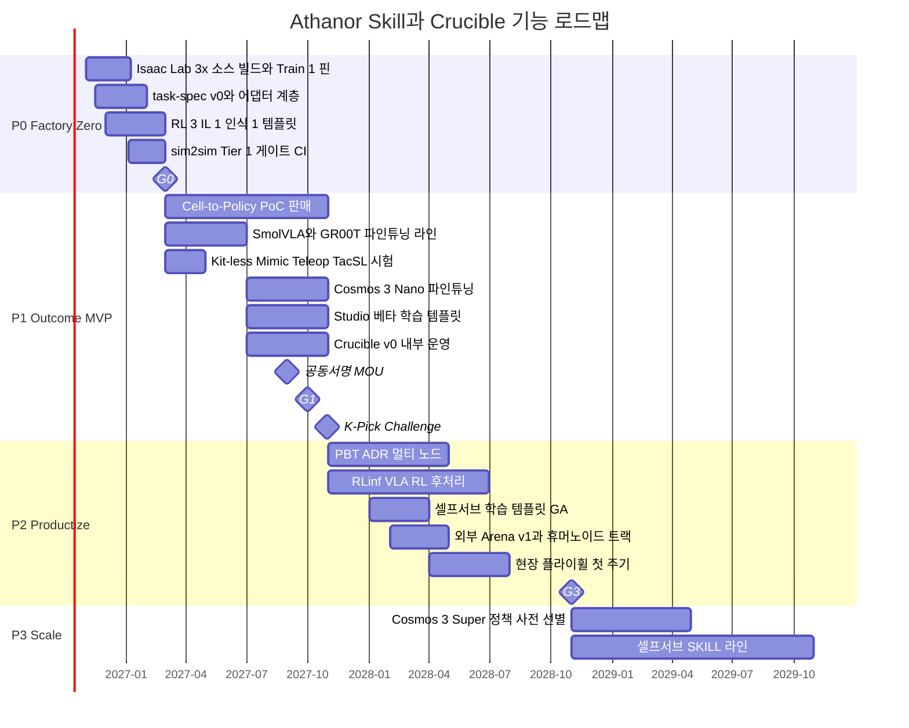

---

## 13. 단계별 학습 KPI

**결론: 학습 모듈의 KPI는 '얼마나 빨리 학습했나'가 아니라 '얼마나 많은 정책이 실셀을 통과했고, 그 통과를 시뮬이 얼마나 예측했나'다. DR 고정값을 그대로 쓰고, 내부 운영 지표는 [A]로 덧붙인다.**

### 13.1 DR 고정 KPI

| 축 | KPI | P0(M4) | P1(M12) | P2(M24) | P3(M36) | 측정 방법 | 책임 |
|---|---|---|---|---|---|---|---|
| 처리량 | 템플릿 과제 GPU당 병렬 환경 수 | ≥4,096 | ≥4,096 | ≥8,192 | ≥8,192 | 템플릿 CI 벤치 | Skill 리드 |
| 범위 | 템플릿 수(RL / IL·VLA / 인식) | 3 / 1 / 1 | 8 / 3 / 3 | 15 / 6 / 5 | 25 / 10 / 8 | 카탈로그 등록(Crucible 과제 ID 필수) | Skill 리드 |
| 증식 | Mimic 1,000개 생성(상태 / 시각운동) | 측정 | ≤1시간 / ≤12시간 | ≤40분 / ≤8시간 | ≤30분 / ≤6시간 | 표준 과제 벽시계 시간 | Skill 리드 |
| 게이트 | 수출 전 sim2sim 게이트 적용률 | 100% | 100% | 100% | 100% | 레지스트리 감사 | Kernel 리드 |
| 이전 | 실셀 이전 정책 수(누적) | 1 | 8 | 30 | 80 | `real-validated` 단계 수 | Head of Fidelity |
| 원가 | 1B 환경 스텝당 RL 비용(카메라 없음) | 측정 | ≤$10 | ≤$6 | ≤$4 | §3.8 공식, 분기 | Platform 리드 |
| 충실도 | 정책 sim-to-real 갭(%p, 과제 수) | ≤25(1) | ≤15(3) | ≤10(5) | ≤8(10) | Scorecard(Wilson CI 병기) | Head of Fidelity |
| 충실도 | sim/real Pearson r(정책 ≥5개) | — | ≥0.7 | ≥0.8 | ≥0.85 | Fisher CI 병기, 인증용은 K ≥8[A] | Head of Fidelity |
| 인식 | 합성 전용 mAP 비율 | ≥0.85 | ≥0.90 | ≥0.95 | ≥0.95(3개 버티컬) | §5.5 | Skill(인식) |
| 인식 | 합성 + 실데이터 10% vs 실데이터 100% | — | ≥1.0 | ≥1.0 | ≥1.05 | §5.5 | Skill(인식) |
| 증강 | 증강 프레임 라벨 일관성 통과율 | — | ≥98% | ≥99% | ≥99% | C1–C8 | Skill + WS3 |
| 제품 | 영상 → 학습된 피킹 스킬 | 48시간(내부) | 24시간 | 당일(셀프서브) | 4시간 | 주문 DAG 벽시계 | Product + Skill |
| 제품 | 결과물당 엔지니어 시간 지수 | 100 | 50 | 25 | 15 | `human_intervention` 이벤트 | CEO |
| 해자 | Arena 회원 | — | 3(파일럿) | 8 | 20(해외 2) | 계약 | Arena PM |
| 해자 | 인증서 인용 조달·PO | — | 고객 PO 1건 | 공공·재벌 조달 1건 | 3건 | 문서 증빙 | BD |

### 13.2 '영상 → 피킹 스킬' 시간 예산 분해[A]

| 단계 | P0 48시간(내부) | P3 4시간(셀프서브) | 단축 수단 |
|---|---|---|---|
| Forge 자산(영상 → 인증 자산) | ≤2시간 | ≤10분 | Forge 무개입(DR) |
| 장면 조립·랜덤화 | 2시간 | 10분 | 템플릿, 에이전트 |
| SDG + 검출기 | 10시간 | 1시간 | 자체 RT 병렬, 사전학습 검출기 파인튜닝 |
| 그래스프 RL 또는 IL·VLA | 20시간 | 1.5시간 | 사전학습 정책 웜스타트, 멀티 GPU |
| 평가 + sim2sim | 6시간 | 40분 | 축약 스위트 + 병렬 백엔드 |
| 수출·패키징 | 2시간 | 10분 | 엔진 캐시 |
| 대기·검수 | 6시간 | 10분 | 자동 게이트 |

### 13.3 내부 운영 KPI[A]

| KPI | P1 | P2 | P3 |
|---|---|---|---|
| VLA 파인튜닝 주문 → 체크포인트 리드타임 | ≤48시간 | ≤24시간 | ≤8시간 |
| Crucible 과제 수(시뮬 / 실셀) | 25 / 2(DR) | 60 / 4 | 120 / 6 |
| 실셀 성공률 신뢰구간 반폭(인증 리포트) | ≤±14%p(n ≥50) | ≤±10%p(n ≥100) | ≤±7%p(n ≥200) |
| 플라이휠 주기(실패 발견 → 게이트 재배포) | 절차 검증 | ≤14일 | ≤7일 |
| 월드모델 선별기 순위 일치(Kendall τ) | — | 측정 | ≥0.6(필터 사용 조건) |
| 라이선스 게이트 우회 납품 | 0건 | 0건 | 0건 |
| 첫 시도 sim2sim Tier 1 통과율 | ≥70% | ≥80% | ≥85% |

---

## 14. 조직과 학습 모듈 리스크

**결론: 학습 모듈은 WS5 Athanor Skill(2 → 3 → 4 → 5명)과 WS4 Fidelity & Crucible(1 → 2 → 3 → 4명)이 맡는다. 리서치가 권한 8–12명보다 작은 팀으로 가는 대신 MLOps는 WS6, 편집기·에이전트는 WS7이 맡고, 공정 자동화로 인원 부족을 메운다.**

| 역할 | 소속 | 합류 | 소유 |
|---|---|---|---|
| Skill 리드(RL·sim2real) | WS5 | M1(재배치 가정[A]) | task-spec, RL 템플릿, sim2sim 운영 |
| RL/IL 엔지니어 | WS5 | M3(DR 채용 순서 6번) | Mimic, IL 템플릿, Thor 수출 |
| VLA 엔지니어 | WS5 | M6 | SmolVLA·GR00T 레시피, RLinf(P2) |
| 인식·SDG | WS5 + WS3 | P1 | RF-DETR, 소량 곡선, 증강 QA |
| Head of Fidelity & Evaluation | 리더십 | M4까지 확정 | Crucible, 통계, 헌장 |
| Arena 프로그램 매니저 | WS4 | M10 | Arena 운영, 회원, K-Pick |
| MLOps·레지스트리 | WS6 | P0–P1 | MLflow, 계보, 라이선스 게이트 |

| 리스크 | 가능성 / 영향 | 완화 | 조기경보 |
|---|---|---|---|
| Isaac Lab 3.x API 변동(쿼터니언, ProxyArray, 액추에이터) | 높음 / 중간 | 어댑터 계층, 트레인 핀, 승격 주간 회귀 | 어댑터 수정 공수 계획 대비 1.5배 초과 |
| Kit-less 모드에서 Mimic·Teleop·TacSL 미동작 | 중간 / 중간 | 테넌트에는 Mimic을 서비스로 제공, M6 사내 시험 | M6 시험 실패 |
| VLA 가중치 약관(GR00T 재배포·군사, openpi 미명시) | 중간 / 높음 | SmolVLA 기본·국방, V7 법률 검토(M3), 교집합 게이트 | V7 지연 |
| 실셀 처리량 병목(trial 수 부족) | 높음 / 높음 | 시뮬 판정 + 실셀 확인의 2단 구조, 자동 리셋, SPRT, 셀 2개 병행 | 분기 trial 누적 목표 미달 |
| 벤치마크 포화·과적합 | 중간 / 중간 | 비공개·순환 분할, 헤드룸 규칙, 실셀 앵커 | 상위 3개 중앙값 >90% |
| Arena 이해상충 | 중간 / 높음 | 헌장, 회피 규정, 운영 분리, 공동서명 | MOU M10 초과, 회원 이의 제기 |
| 모델 노후화(GR00T·Cosmos 세대 교체) | 높음 / 낮음 | 플러그인 구조, 트레인 경계 교체 | 신규 GA 후 30일 내 평가 미착수 |
| 월드모델 환각이 데이터에 유입 | 중간 / 높음 | C1–C8, 재라벨 금지, 1% 사람 감사 | 감사 오류율 1% 초과 |

리스크 전체 레지스터와 컴플라이언스 절차는 [11 리스크·KPI·컴플라이언스](11-risk-kpi-compliance.md), 인원·예산 총량은 [09 로드맵·조직·예산](09-roadmap-organization-budget.md), 가격은 [10 사업모델·GTM](10-business-model-gtm.md)이 정본이다.

---

## 15. 결정 사항 및 다음 액션

**결론: 이 문서로 학습 스택의 기본·금지 목록, 인증서 기반 랜덤화, Mimic 견적 기준(시각운동 10시간), VLA 3등급, sim2sim 2단 게이트, Crucible 통계 규칙, 헌장 일정 당김, 가중치 라이선스 교집합 규칙을 확정한다.**

**결정 사항**

| # | 결정 | 근거 절 |
|---|---|---|
| D1 | RL은 Isaac Lab 3.x 소스 빌드(F·T 이미지 분리) + rsl_rl 5.5.1 / skrl 2.1.0과 mjlab 1.6.0, IL·VLA는 LeRobot 0.6.1 + LeRobotDataset v3, 인식은 RF-DETR N–L을 기본으로 한다. PyPI 휠은 쓰지 않는다 | §2 |
| D2 | 물리 도메인 랜덤화 폭은 자산 인증서 오차 막대 × k(기본 2.0)로 정하고, ADR(P2)의 하한으로 둔다 | §3.3, §3.4 |
| D3 | Mimic 견적·영업 자료는 시각운동 1,000개 약 10시간, 생성 성공률 약 50%(Franka)를 기준으로 쓴다 | §4.3 |
| D4 | VLA는 SmolVLA(V1, 기본·국방), GR00T N1.7(V2, 휴머노이드·양팔), pi0.5(V7 전 차단)의 3등급과 ACT·Diffusion 베이스라인으로 운영한다 | §4.4 |
| D5 | sim2sim은 Tier 1(수출 차단, 전 정책, ≤10%p)과 Tier 2(인증 대상, ≤5%p·RMSE ≤0.05 rad)로 운영한다 | §7.3 |
| D6 | 인증용 sim/real r은 정책 패밀리 K ≥8로 계산하고 Fisher 신뢰구간을 병기한다. P2부터 실셀 권장 표본은 정책·과제당 100 trial이다 | §8.3 |
| D7 | 거버넌스 헌장 서명을 K-Pick Challenge(M12) 이전으로 당긴다. 서명 지연 시 K-Pick은 비순위 시연으로 연다 | §8.5 |
| D8 | 파인튜닝 체크포인트의 허용 범위는 입력 가중치·데이터·코드 경로 라이선스의 교집합으로 계산하고 레지스트리가 강제한다 | §10.4 |
| D9 | 월드모델 출력은 인증 증거로 쓰지 않는다. 사전 선별은 Kendall τ ≥0.6(정책 20개 이상) 검증 후에만 필터로 쓴다 | §6.3 |

**다음 액션**

| 액션 | 책임 | 기한 |
|---|---|---|
| Isaac Lab 3.x GA 소스 빌드, `-f`/`-t` 이미지 분리, SBOM 게이트 연결 | Sim Architect(CTO 대행) + Skill 리드 | 2026-12(Train 1 시작) |
| task-spec v0 JSON Schema와 어댑터 계층(XYZW 쿼터니언, ProxyArray 정규화) | Skill 리드 | 2026-12 말(M2) |
| 베이크오프 T1·T3·T5 결과로 RL 기본 GPU·백엔드 확정, 1B 스텝 원가 기준선 기록 | Skill 리드 + Kernel 리드 | 2027-01 첫 주(결정 메모) |
| P0 템플릿 R01–R03, IL 1개(Mimic + BC), 인식 1개(RF-DETR + 소량 곡선) 출고 | Skill 리드 | 2027-02-28(G0) |
| Mimic 상태·시각운동 1,000개 생성 시간과 성공률 사내 측정(시도·성공 기준 확정) | RL/IL 엔지니어 | 2027-02-28(G0) |
| MLflow 3 레지스트리 + 모델 카드 필수 필드 + 라이선스 교집합 게이트 v0 | Platform 리드 | 2027-02-28(G0) |
| GR00T Open Model License·OpenMDW-1.1·openpi·SAM License 법률 검토(V7) | 라이선스 매니저 + 외부 자문 | 2027-01 말(M3) |
| Thor 수출 레시피 v0와 Test Cell 1 지연 프로파일 | RL/IL 엔지니어 | 2027-02-28(G0) |
| Kit-less 모드 Mimic·Teleop·TacSL 동작 시험과 테넌트 범위 결정 | Skill 리드 | 2027-04 말(M6) |
| Crucible v0 과제 스위트(KP 12, KA 7, KS 3, KR 3 + 실셀 2) 명세와 채점 코드 | Head of Fidelity & Evaluation | 2027-06 말(M8) |
| 거버넌스 헌장 초안과 공동서명 후보(KTL·KIRIA·TTA) 협의 | Head of Fidelity + BD | 초안 M8, MOU M10(2027-08) |
| K-Pick Challenge 규칙·프로토콜·채점 코드 공개 | Arena PM | 2027-09 말(M11) |
| 헌장 서명(K-Pick 외부 채점 전) | CEO + 공동서명 기관 | 2027-10 초(M12) |
| Cosmos Transfer 2.5 증강 A/B(랜덤화 대비)와 Cosmos 3 Nano 착수 판단 | Skill(인식) + WS3 | A/B M8, 착수 M9 |
| PBT·ADR, RLinf, 플라이휠 설계 착수(P2 백로그) | Skill 리드 | 2027-11(M13) |
