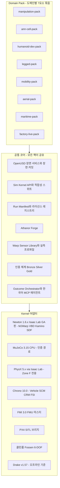
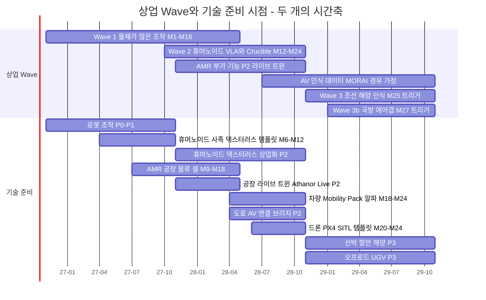
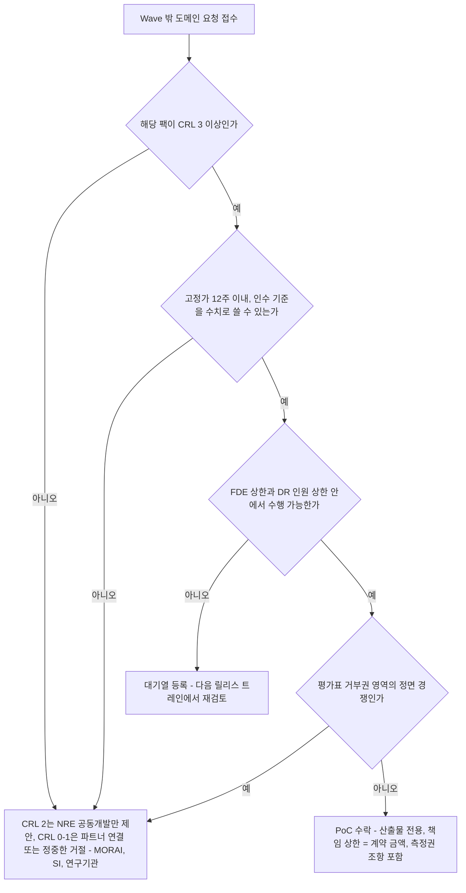
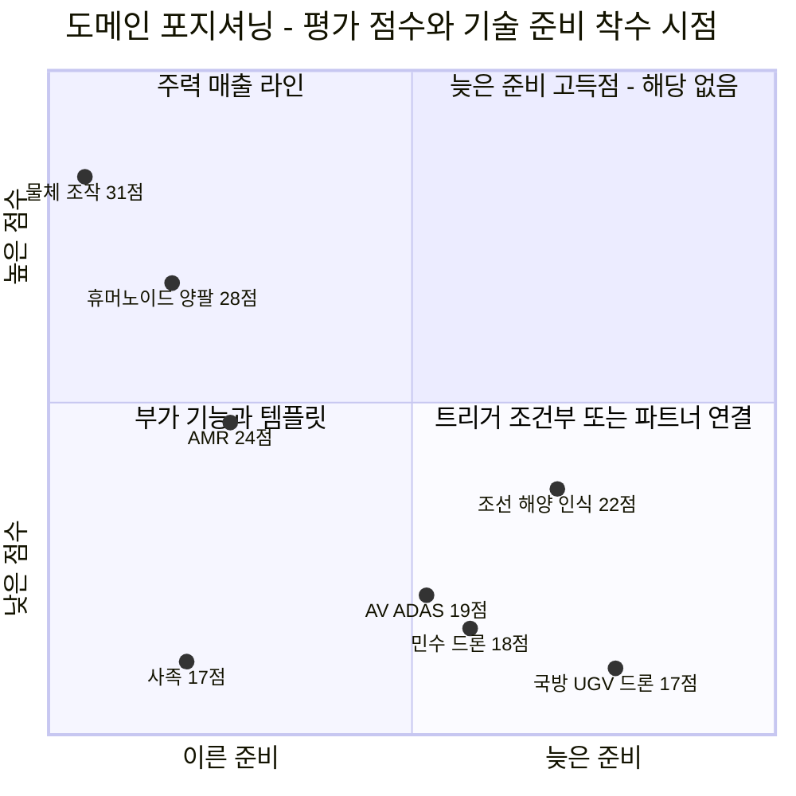
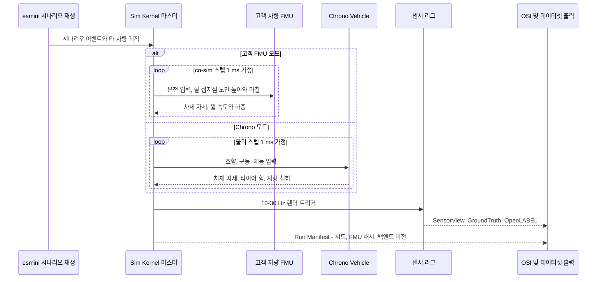
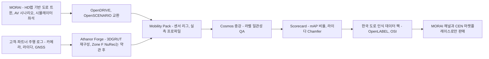
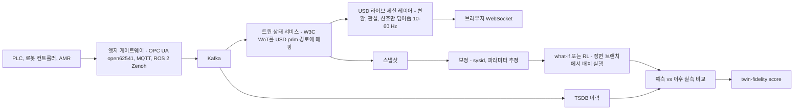
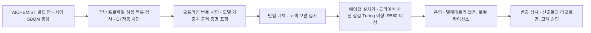
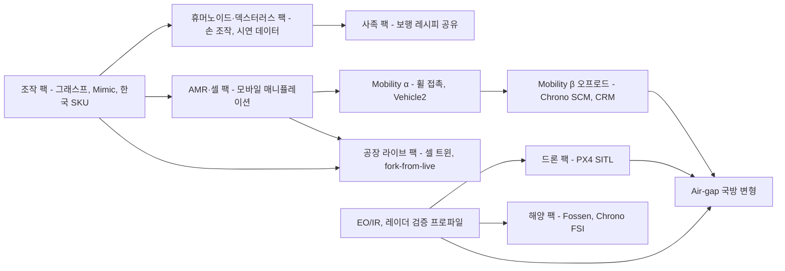

# 08. 도메인 팩: 하나의 커널로 무엇이든 트윈으로

> **문서 번호** 08 · **기준일** 2026-10-06 · **버전** v1.0 · **상위 문서** [README](README.md)
> **관련 문서** [01 비전·포지셔닝](01-vision-positioning.md) · [02 시장·경쟁](02-market-competition.md) · [03 엔진 선정·Build vs Buy](03-engine-selection-build-vs-buy.md) · [04 시스템 아키텍처](04-system-architecture.md) · [05 물리·현실감](05-physics-and-realism.md) · [06 사용성·에이전트](06-usability-and-agent.md) · [07 학습 모듈](07-training-module.md) · [09 로드맵·조직·예산](09-roadmap-organization-budget.md) · [10 사업모델·GTM](10-business-model-gtm.md) · [11 리스크·KPI·컴플라이언스](11-risk-kpi-compliance.md) · [12 90일 실행](12-execution-90days.md) · [부록 A 기술 카탈로그](appendix-a-technology-catalog.md) · [부록 B 출처·검증](appendix-b-sources-verification.md)
> **표기** **[A]** 계획 가정(실적 확인 전까지 목표치) · **[U]** 1차 출처 미확인(대외 사용 전 [부록 B](appendix-b-sources-verification.md) 절차로 재검증) · 태그 없는 사실은 리서치에서 GitHub·PyPI·표준 원문으로 확인된 값(2026-10-05/06) · ₩억 = 1억 원 · M1 = 2026년 11월, P0 = M1–M4(2026.11–2027.02), P1 = M5–M12(2027.03–2027.10), P2 = M13–M24(2027.11–2028.10), P3 = M25–M36(2028.11–2029.10) · DR = 결정 기록(Decision Record, 전 문서의 단일 기준) · v1.1 보완 = DR 상단의 범용성 보완(기술적 범용성과 상업 집중 순서의 분리)

---

## 핵심 요약

- **범용성은 약속이 아니라 구조다.** OpenUSD 단일 장면, 엔진 중립 Sim Kernel API, 그리고 7요소(자산·물리 프로파일·센서 리그·표준 커넥터·학습 템플릿·평가지표·인증 기준)로 이뤄진 Domain Pack이 로봇·차량·드론·선박·공장을 같은 방식으로 받는다. 새 대상은 코어를 고치지 않고 팩 하나와, 필요하면 Kernel 어댑터 하나를 더해 수용한다. 이 문서는 8개 팩(조작, AMR·셀, 휴머노이드·덱스터러스, 사족, Mobility, 드론, 해양, 공장 라이브)을 정의한다.
- **시간축은 두 개다.** 상업 Wave(DR §5: Wave 1 M1–M18, Wave 2 M12–M24, Wave 3 M25–, Wave 3b M27–)는 '어디서 먼저 돈을 버는가'의 순서다. Capability Readiness(DR v1.1 범용성 보완)는 '무엇을 트윈으로 만들 수 있는가'의 순서다. 차량 Mobility Pack α는 M18–M24, 드론 PX4 SITL 템플릿은 M20–M24에 준비한다. 정확한 문장은 "자동차는 안 한다"가 아니라 "자동차 시뮬레이터 시장에서 정면 경쟁하지 않고 표준으로 연결한다"이다.
- **준비는 상업보다 앞설 수 있지만, 상업이 준비를 앞서지는 않는다.** 팩 성숙도를 CRL(Capability Readiness Level) 0–5 [A]로 판정하고, CRL 4(검증된 센서 프로파일과 Silver/Gold 인증 발행) 전에는 그 도메인의 인증 결과물을 팔지 않는다. Wave 밖에서 들어오는 요청은 4단계 수락 규칙으로 처리한다.
- **DR §5.1 평가표의 거부권이 차량과 사족의 위치를 정한다.** AV·ADAS(19점)와 사족(17점)은 '열린 경쟁 지형'이 1점이므로 독자 매출 라인이 될 수 없다. AV는 MORAI를 거치는 인식 데이터와 OpenSCENARIO·OSI·FMI 3.0 브리지로, 사족은 템플릿과 Crucible 평가로만 수익을 낸다.
- **Mobility Pack은 3단 구조다.** α(M18–M24)는 야드 차량·AMR(Zone F는 PhysX Vehicle2, Zone T/S는 Newton 관절 휠)과 Chrono::Vehicle(Pacejka·TMeasy 타이어, SCM 지형)이다. P3에는 오프로드 UGV(Chrono CRM)가 붙고, 도로 AV는 처음부터 연결 모드로 간다. 규제 수요(UN ADS 규정 [U], ISO 34505:2025, ISO 21448, UL 4600 Ed.3, 국내 Level-4 성능인증)에는 도구 인증이 아니라 Credibility Dossier 조각과 K-City 상관 연구로 대응한다.
- **해양과 국방은 센서 증거가 먼저다.** 클린룸 Fossen 6-DOF, Chrono FSI, 오차 막대를 공개한 레이더·EO/IR 프로파일이 갖춰지기 전에는 판매하지 않는다. Air-gap 에디션(M27–, 연 ₩8–15억)은 SAM 계열·VGGT-Commercial·GPL 번들·미확인 모델을 뺀 별도 라이선스 프로파일과 서명 SBOM, 오프라인 서명 업데이트로 운영한다.
- **새 도메인은 정해진 절차와 공수로 편입한다.** 기존 어댑터로 충족되는 Type A는 12–25 HM, 신규 어댑터가 필요한 Type B는 18–37 HM, 신규 물리 연구가 필요한 Type C는 30–60 HM이다 [A]. 농업 로봇·건설 장비·의료 로봇에 이 절차를 적용해 판정했다. 모든 확장은 DR 고정값(인원 16/26/36/48명, 24개월 예산 ₩122.0억) 안에서 고객 NRE와 정부과제로 충당한다.

---

## 1. 범용성 원칙: 하나의 커널, 여러 도메인

**결론: 도메인마다 시뮬레이터를 새로 만들지도 않고, 엔진 하나가 모든 물리를 잘한다고 믿지도 않는다. 모든 도메인이 공유하는 코어를 하나로 고정하고, 도메인마다 다른 부분은 7요소짜리 Domain Pack에 가둔다.**

### 1.1 왜 '커널 하나 + 팩'인가

CEO 요구 원문은 "대상은 로봇, 자동차 등 어떤 것도 가능"이다. 이 요구를 실현하는 길에는 두 가지 함정이 있다. 첫째는 대상마다 제품을 따로 만드는 함정이다. 로봇 시뮬레이터, 차량 시뮬레이터, 선박 시뮬레이터를 각각 만들면 엔진 통합·인증·데이터 파이프라인이 세 벌로 늘고, 인원 16–48명으로는 어느 것도 깊이를 확보하지 못한다. 둘째는 단일 엔진으로 모든 물리를 처리하려는 함정이다. 로봇의 접촉, 차량의 타이어, 선박의 유체역학은 서로 다른 물리이고, GAUGE(2026)는 현실에 균일하게 충실한 엔진이 없다고 보고했다[U]. Newton에는 전용 타이어·파워트레인 모델이 없고, Chrono는 10⁴개 환경 배치 RL용으로 설계되지 않았다.

그래서 공통부와 차이부를 분리한다. 장면 서비스, Sim Kernel API, Run Manifest, 인증 체계, Forge, Outcome Orchestrator, Studio, 한국어 MCP 에이전트는 모든 도메인이 공유한다. 도메인이 바뀔 때 달라지는 것은 7가지뿐이다. 자산, 물리 프로파일(어느 백엔드로 어떤 설정으로 돌리는가), 센서 리그, 표준 커넥터, 학습 템플릿, 평가 지표, 인증 기준이다. 이 7가지를 버전·서명 단위로 묶은 것이 Domain Pack이다([04 §17](04-system-architecture.md)).

**표 1-1. 범용성 구현 방식 대안 비교**

| 대안 | 방식 | 장점 | 결정적 약점 | 판정 |
|---|---|---|---|---|
| A. 도메인별 별도 제품 | 조작 sim, 차량 sim, 해양 sim을 각각 개발 | 영업 메시지가 단순하다 | 엔진 통합·인증·Forge가 3벌로 늘어난다. 인원 상한(26명, G1 전) 안에서는 어느 것도 깊이를 얻지 못한다 | 기각 |
| B. 자체 범용 엔진 | 모든 물리를 직접 구현 | 완전한 통제 | 150–300 engineer-year, ₩400–600억, MVP까지 30–48개월 이상(DR §3.2). 24개월 예산의 3–5배 | 기각 |
| C. 외부 시뮬레이터 래핑 | CARLA·Gazebo·Isaac Sim을 감싸 판매 | 출시가 빠르다 | 결정론·인증·라이선스를 통제하지 못한다. CARLA·Project AirSim·HoloOcean은 UE EULA를 끌고 온다(매출 USD 1M 초과 시 좌석당 연 $1,850 [U]) | 기각. 커넥터로만 사용 |
| **D. 커널 하나 + Domain Pack** | 공통 코어 고정 + 도메인 차이를 7요소로 격리 | 공통 구성 재사용률 70–80% [A]. 새 대상의 한계비용이 낮다. 인증 체계가 하나다 | 팩 경계를 지키는 규율이 필요하다(§1.5) | **채택** |

### 1.2 Domain Pack의 7요소

**표 1-2. Domain Pack 구성요소 정의와 완료 기준**

| 요소 | 담는 내용 | 형식·위치 | 완료 기준(DoD) | 소유 |
|---|---|---|---|---|
| ① 자산 | SimReady USD(물체·로봇·차량·선체·환경), 라이선스 매니페스트, 출처(촬영원·동의·익명화) | `ath://pack/<pack>/...` USD + `aic:TwinCertificate` | Bronze 이상 등급, SPDX·출처 게이트 통과, NEVER 목록(DR §3.3) 0건 | WS2 Forge |
| ② 물리 프로파일 | 과제 유형별 학습 백엔드 라우팅, 접촉 모델, dt·substep, 보정 파라미터 기본값, 인증 백엔드, sim2sim 게이트 백엔드(Zone F 3개, Zone T/S 2개) | YAML(`kernel-routing` 조각) + USD 보정 레이어 | 지정 적합성 장면 통과, 인증 경로가 D0(`D0_bitwise`) 등록 경로로 정의됨([05 §2](05-physics-and-realism.md)) | WS1 Kernel |
| ③ 센서 리그 | 센서 prim 배치, 디바이스별 실측 프로파일, `validated` 플래그 | USD 센서 prim + `aic:SensorProfile` | `validated=false` 프로파일로는 Silver/Gold를 발행하지 않음 | WS3 센서 |
| ④ 표준 커넥터 | import·export 변환기, 엣지 게이트웨이 플러그인, co-sim 브리지 | 커넥터 컨테이너, Apache 계열 변환기 | 왕복(round-trip) 테스트 통과, 라이선스 판정 OK, 구역(Zone) 태그 | WS1·WS6 |
| ⑤ 학습 템플릿 | 과제 명세(보상·관측·종료·랜덤화·커리큘럼), 기본 프리셋, 수출 프로파일 | Isaac Lab 3.x·mjlab 과제, LeRobot 설정 | 템플릿 7요소([06](06-usability-and-agent.md)) 충족, 백엔드별 적합성 결과 첨부 | WS5 Skill |
| ⑥ 평가 지표 | Scorecard 항목, Crucible 과제 스위트, 표본·신뢰구간 요건 | 지표 함수 + 스위트 정의 | 제3자가 공식으로 재계산 가능 | WS4 Fidelity |
| ⑦ 인증 기준 | 등급별 임계치, 측정 프로토콜, 시험성적서 대상 지표 | `aic:` 스키마 + 프로토콜 문서(AIC-xx-xxx) | Fidelity Lab에서 프로토콜 재현 가능 | WS4 Fidelity |

**팩은 별도 SKU로 팔지 않는다[A].** 팩은 결과물 SKU(인증 트윈, 데이터셋 팩, Cell-to-Policy PoC, Crucible 캠페인)와 에디션(Cloud, Sovereign, Air-gap)을 만드는 생산 단위다. Studio에서는 팩이 템플릿·자산 카탈로그로 노출되고, 사용량은 CEN 토큰으로 과금된다. 따라서 도메인별 매출은 DR §10.6의 라인(Data, Skill, Forge, Crucible, Studio·Cloud, Sovereign·Air-gap, 정부 용역)에 귀속되며, 이 문서는 도메인별 매출 목표를 새로 두지 않는다.

### 1.3 팩 매니페스트: 조작 팩 예시

[04 §17.2](04-system-architecture.md)가 Mobility Pack α 매니페스트를 보여 주므로, 여기서는 Wave 1 주력인 조작 팩을 예로 든다. 모든 팩은 같은 필드를 쓴다.

```yaml
# domainpack.yaml — manipulation-pack (Wave 1 주력). 값 중 임계·설정은 [A]
name: manipulation-pack
version: 1.2.0                     # 릴리스 트레인(반기)에 맞춰 SemVer
readiness: { crl: 4, since: "M4" }  # Capability Readiness Level(§1.4). G0 조건과 동기화
zones: [F, T, S]                   # Zone F: PhysX·TacSL·Mimic 경로 포함 / T·S: 허용형 + 의무 이행 가능한 약한 카피레프트만(DR §6.2)
requires:
  kernel_api: ">=1.0"
  adapters: [newton_mjwarp, mujoco_cpu, isaaclab_physx, drake]   # 04 §4.2 어댑터 레지스트리 이름. isaaclab_physx는 Zone F 전용
  capabilities: [REDUCED_COORD_ARTICULATION, SDF_CONTACT, HYDROELASTIC, CLOTH, CABLE, CLOSED_LOOP]   # 04 §4.2 Cap 열거형
assets:
  - ath://pack/manip/kr-sku/ramen-box-a@sha256:…      # 한국 SKU(Silver/Gold)
  - ath://pack/manip/cells/test-cell-1@sha256:…       # Fidelity Lab Test Cell 1
physics_profiles:                  # 표기는 04·05·07과 같은 snake_case(어댑터_모드)
  bin_picking:     { train: newton_mjwarp, contact: soft_convex, cone: elliptic, certify: mujoco_cpu }
  polybag:         { train: newton_vbd, certify: mujoco_cpu_static_calib, determinism: D1_statistical }   # 동역학 D1. 정적 보정 항목만 D0 'experimental'
  peg_insertion:   { train_F: isaaclab_physx_sdf, train_T: newton_sdf_hydro,
                     reference: drake_hydroelastic, certify: mujoco_cpu }
  linkage_gripper: { train: newton_kamino, certify: mujoco_equality }   # MuJoCo CPU equality 모델 D0(별도 보정 세트). Kamino 산출물은 D1
sensor_rigs:
  - name: cell_rgbd_3cam_ft        # Test Cell 1과 동일 구성: 카메라 3대 + F/T 센서
    profiles_required: validated
connectors:
  import: [urdf, mjcf, usd, step_via_customer_cad]
  runtime: [ros2_jazzy, ros2_lyrical, ros2_humble_bridge]   # 신규 배포 기본은 Jazzy·Lyrical. Humble(2027-05 EOL) 브리지는 M7 이후 best-effort
  export: [lerobot_v3, mcap, coco, onnx_tensorrt_jetson_thor]
templates: [RL-01, RL-02, RL-03, RL-04, IL-01, IL-02, PE-01, PE-02]   # ID 마스터 06 §6.2. P1 말 조작 팩 배분 4/2/2(§7.1)
metrics: [picks_per_1000, sim2real_gap_pp, map_ratio, pearson_r_policies, cycle_time_s]
kpi:
  forge_auto_vs_gold: { mass: 0.10, friction: 0.20 }   # 05 §16.1 P1. Forge 자동 추정 |θ_auto − θ_lab| / θ_lab. 인증 임계 아님
certification:
  object_gold:   { value_source: lab, mass_uncert_max: "[A]", friction_uncert_max: "[A]", protocol: "AIC-OBJ-GOLD v1" }   # 랩 실측값 + 측정 불확도 기록
  cell_silver:   { scorecard: [map_ratio, gap_pp], protocol: "AIC-CELL v1" }
conformance_scenes: [C01, C02, C03, C04, C06, C07, C08]   # 04 §4.6 번호 체계(정본)
license_profile: commercial        # defense 프로파일은 §5 규칙으로 별도 빌드
owners: { pack: "Skill Lead", physics: "WS1", sensors: "WS3", cert: "Head of Fidelity" }
```

### 1.4 Capability Readiness Level(CRL)

'준비됐다'는 말이 팀마다 다르게 쓰이면 범용성 약속이 영업 리스크로 바뀐다. 그래서 팩 성숙도를 6단계로 고정한다[A]. CRL 판정은 CTO가 주관하는 분기 리뷰에서 하고, 결과는 Studio 카탈로그와 영업 자료에 같은 표기로 노출한다.

**표 1-3. CRL 정의와 판매 허용 범위 [A]**

| CRL | 이름 | 진입 조건 | 허용되는 대외 활동 | 금지 |
|---|---|---|---|---|
| 0 | 판정 | 어댑터 후보 식별, 라이선스 사전 판정(SPDX, 구역) | 기술 로드맵 언급 | 데모, 견적 |
| 1 | 어댑터 | Kernel 어댑터가 존재하고 적합성 장면 1개 이상 통과 | 내부 데모 | 고객 PoC |
| 2 | 템플릿 | 학습 템플릿 1개 이상, 센서 리그 정의, Bronze 자산 | 디자인 파트너와 무상·NRE 공동개발 | 인증 결과물 판매 |
| 3 | 알파(α) | 표준 커넥터, 평가 지표, 인증 기준 초안, 실측 trial 수집 시작 | 고정가 PoC·파일럿 데이터 팩(산출물 전용, 책임 상한 = 계약 금액, 인증서 없이 Scorecard 수치만 보고) | Silver/Gold 인증 발행 |
| 4 | 상업 | 센서 프로파일 `validated=true`, Silver/Gold 인증 발행, Scorecard 기반 인수 가능 | 결과물 SKU 전체, 에디션 탑재 | 셀프서브 개방 |
| 5 | 셀프서브 | 생산화 게이트 통과: 무개입 80% 이상, 라인 총마진 60% 이상([10 §6.4](10-business-model-gtm.md) 완전원가 기준), 모든 구성요소의 테넌트 사용 서면 라이선스 근거(DR §4.3) | Studio 셀프서브, 마켓플레이스 | — |

### 1.5 팩 경계 규칙

- **코어 포크 금지:** 팩은 Kernel·스키마·Orchestrator를 수정하지 않음. 필요한 기능은 어댑터 추가 또는 `aic:` codeless 스키마 확장(하위 호환)으로만 해결
- **구역 태그 강제:** 팩의 모든 구성요소에 Zone F/T/S 태그. Zone F 전용 구성요소(Isaac Sim 6.1, RTX 센서, Replicator, PhysX Vehicle2 via Isaac Lab, TacSL, Mimic, Pegasus 포팅)가 들어간 템플릿은 테넌트 카탈로그에 노출 불가. 벤더·고객 라이선스 구성요소(BeamNG.tech, 고객 CarSim·CarMaker FMU)는 BYOL 태그
- **인증 경로 단일화:** 어떤 팩이든 '재현 가능' 인증서는 D0(`D0_bitwise`) 등록 경로(고정 하드웨어·드라이버)에서만 발행(DR v1.1 §4.1). 현재 등록 경로는 MuJoCo CPU이며, Newton 결정론 모드는 N1–N5 시험(베이크오프 W7) 통과 후 편입
- **D0 경로 확장 규칙(DR v1.1 §4.1):** Chrono CPU(차량), 클린룸 Fossen(Warp CPU, 선박), PX4 SITL lockstep(드론)은 반복 비트 일치 시험(N1–N4 동등)을 통과하고 CTO가 D0 목록에 등록한 뒤에만 인증 경로로 사용(목표 등재 Chrono M22, Fossen M28 [A]). 등록 전 해당 동역학 산출물에는 D1 '통계적 재현' 라벨과 Scorecard 리포트만 붙이고, 인증서는 자산·센서 항목에 한정(§2.5)
- **변형체·입상체·유체:** 변형체(VBD·flex·cable) 산출물은 D1. 변형체 인증서는 정적 보정 시험(처짐·정지 형상)을 MuJoCo CPU로 D0 재현한 항목에만 붙이고 'experimental'로 표기. 입상체(SCM·CRM·DEM)·유체(FSI) 산출물은 인증 대상에서 제외
- **센서 미검증 판매 금지:** `validated=false` 센서로 만든 데이터는 Bronze 등급과 '미검증 센서' 라벨로만 출고
- **NEVER 목록 상속:** DR §3.3 NEVER 목록은 모든 팩의 CI에서 자동 차단. 국방 프로파일은 추가 제외 목록 적용(§5)
- **팩 하나 = 적합성 장면 1개 이상:** 팩이 쓰는 물리 경로는 반드시 적합성 스위트 장면으로 회귀 검사. 장면 번호·허용치의 정본은 04 §4.6의 C01–C15이고, 05에만 있던 장면은 C16+ 확장 후보. 장면 수는 DR KPI(P0 3×5 → P3 6×15) 안에서 배분하며 KPI에는 C01–C15만 셈

**그림 1. 공통 코어, Domain Pack, Kernel 어댑터의 관계**



---

## 2. 두 개의 시간축: 상업 Wave와 Capability Readiness

**결론: 상업 Wave는 '어디서 먼저 돈을 버는가', Capability Readiness는 '무엇을 트윈으로 만들 수 있는가'다. 두 축은 일부러 다르게 움직인다. 준비가 상업보다 앞서는 구간은 옵션 가치이고, 상업이 준비보다 앞서는 구간은 만들지 않는다.**

### 2.1 두 축의 정의

**표 2-1. 두 시간축 비교**

| 축 | 질문 | 결정 근거 | 결정 주체 | 변경 조건 | 근거 문서 |
|---|---|---|---|---|---|
| 상업 Wave | 어디서 먼저 돈을 버는가 | DR §5.1 7개 기준 점수, 앵커 접근성, 결과 측정 속도, 거부권 | CEO·이사회 | G1(M11)·G2(M18)·G3(M24), Wave 3 트리거(ARR ₩30억 또는 확정 ₩5억 이상 앵커) | DR §5, [10](10-business-model-gtm.md) |
| Capability Readiness | 무엇을 트윈으로 만들 수 있는가 | 어댑터·템플릿·커넥터·인증 기준의 기술 준비 | CTO | 반기 릴리스 트레인, 분기 CRL 리뷰 | v1.1 보완, [03 §4](03-engine-selection-build-vs-buy.md), [04 §17](04-system-architecture.md) |

### 2.2 왜 두 축이 다른가

- **고객 질문에 대한 답이 먼저 있어야 함.** 조선소·자동차 계열 고객은 첫 미팅에서 "우리 차량·선박도 되나요"를 물음. 그 시점에 '엔진은 정해져 있고 준비 일정이 있다'는 답이 없으면, Wave 1 조작 계약까지 신뢰를 잃음. 범용성은 영업 대화의 전제 조건
- **공통 부품 덕분에 준비 비용이 낮음.** '바퀴 차량' 장면(C05: 4륜 AMR 1 m/s + 0.5 rad/s, 10초, 백엔드 간 위치 ≤5 cm·요 ≤3°)은 P0 적합성 스위트 v0에 이미 들어 있음. Chrono 어댑터는 Kernel 계약을 따르는 패키지 하나. 준비의 한계비용은 WS1-M 1명(P2)과 WS3 지원 수준
- **상업 집중은 자원 제약의 결과임.** 인원 16(M4) → 26(M12) → 36(M24) → 48(M36)명과 FDE 상한(결과물 매출 ₩8억당 1명)으로는 매출 라인을 동시에 셋 이상 깊게 운영할 수 없음. 매출 라인은 앵커와 빠른 측정성이 있는 곳에만 엶
- **준비가 상업을 앞서는 구간은 옵션 가치임.** CRL 3 팩은 고정가 PoC를, CRL 2 팩은 NRE 공동개발을 받을 수 있음. 예를 들어 M21에 조선소가 야드 트랜스포터 인식 데이터를 요청하면, Mobility Pack α(CRL 3)로 PoC를 수주할 수 있음(§2.4 규칙)
- **상업이 준비를 앞서는 구간은 금지임.** CRL 4 전에는 해당 도메인의 Silver/Gold 인증 결과물을 팔지 않음. 해양 레이더·EO/IR 데이터를 센서 검증 전에 판매하지 않는 DR §4.2 원칙의 일반화

### 2.3 두 타임라인

**그림 2. 상업 Wave와 Capability Readiness**



**표 2-2. 도메인별 두 시점과 그 사이에 파는 것**

| 도메인 | 기술 준비(v1.1 보완) | 상업 시점(DR) | 차이가 나는 이유 | 준비~상업 사이의 수익화 |
|---|---|---|---|---|
| 로봇 조작 | P0–P1(M1–M12) | Wave 1(M1–M18), 첫 데이터셋 계약 M4 | 차이 없음. 준비와 판매가 함께 감 | 데이터셋(M4), 바우처(M5–M8), PoC(M5부터) |
| AMR·공장/물류 셀 | P1–P2(M9–M18) | P2 라이브 트윈 부가 기능 | '열린 경쟁 지형' 2점. 단독 라인보다 셀 트윈의 부속이 유리 | 조작 셀 계약에 AMR 동선·인식 데이터 포함 |
| 휴머노이드·덱스터러스 | 템플릿 M6–M12, 상업화 P2 | Wave 2(M12–M24), Arena v1 M18 | 헌장 초안(M8) → 공동서명 MOU(M10) → 헌장 서명(M12 초) 전 외부 순위 채점 금지. 서명 지연 시 K-Pick은 비순위 시연 | 글로벌 FM 기업 데이터·평가(M12–M15 착수) |
| 사족 | 템플릿 M6–M12 | 독자 매출 라인 없음 | 거부권(경쟁 지형 1점) | Crucible 평가, 국방 에디션 안 UGV |
| 차량(Mobility α) | P2(M18–M24) | AV는 MORAI 파트너 전용, 인식 데이터만 | 거부권(경쟁 지형 1점). OEM HIL 도구와 정면 경쟁 회피 | 야드 차량 셀 트윈(조작·AMR 계약 부속), MORAI 경유 데이터 |
| 드론 | 템플릿 P2(M20–M24) | 국방 에디션 안(P3, M27–) | 민수 18점, 국방 17점. 판매 주기 12–24개월 | P3에 CRL 3 도달 후 조선소 선체 점검 등 PoC만 |
| 선박·항만·해양 | P3(M25–) | Wave 3(M25–, 트리거. 기본 경로는 확정 ₩5억 이상 앵커 계약) | 센서 검증(레이더·EO/IR)이 판매 전제 | 조선소 작업장 셀은 Wave 1 조작 팩으로 이미 판매 |
| 오프로드 UGV | P3 | Wave 3b(M27–, 트리거) | 국방 조달·보안 요건 | 없음 |
| 공장 라이브 트윈 | P2(첫 라이브 트윈 M18) | P2 부가 기능 | 범용 IIoT 플랫폼을 만들지 않는다는 범위 제한 | 양산 스킬 프로그램의 인수 모니터링 |

### 2.4 Wave 밖 요청 수락 규칙

준비는 됐지만 상업 Wave가 아닌 도메인에서 수요가 들어올 때의 규칙이다. 기회를 놓치지 않으면서 서비스화 함정(DR 리스크 #2)에 빠지지 않는 것이 목적이다.

**그림 3. Wave 밖 도메인 요청 판정 흐름 [A]**



- **예시 1(수락):** M21 조선소 야드 트랜스포터 카메라·라이다 인식 데이터셋. Mobility Pack α CRL 3, 고정가·mAP 인수 기준 가능, FDE 여유 있음 → 데이터셋 팩 SKU(₩5,000만–2억)로 수락
- **예시 2(파트너 연결):** M14 OEM의 ADAS HIL 검증용 시뮬레이터 도입 요청. 거부권 영역(AV 시뮬레이터 정면 경쟁) → MORAI·고객 보유 CarMaker 경로로 연결, 우리는 한국 도로 인식 데이터만 제안
- **예시 3(대기열):** M10 해상 USV 충돌 회피 정책 학습. 해양 팩 CRL 0 → 대기열, IITP 센서 과제와 연계해 P3에 재검토

### 2.5 DR 문구와의 정합

v1.1 보완은 DR 부록 A 고정값을 바꾸지 않고 일정만 조정한다. 그 과정에서 DR v1.0 본문 일부 문구가 v1.1 보완과 어긋났다. 아래 6건은 이 문서의 해석대로 DR v1.1(상단 보완 블록과 §16 정합 결정)에 모두 반영됐다. 표는 변경 이력과 해석 근거로 남긴다(§8).

**표 2-3. DR v1.0 문구와 v1.1 보완의 차이, 확정 해석**

| # | DR v1.0 원 문구 | v1.1 보완 문구 | 확정 해석(DR v1.1 반영) | 고정값 영향 |
|---|---|---|---|---|
| 1 | §2 #6: Chrono 10.0은 'M24 이후 착수' | Mobility Pack α에 Chrono::Vehicle 어댑터 포함, M18–M24 | 차량용 Chrono::Vehicle 어댑터는 M18 착수. 해양(Chrono FSI)·오프로드(CRM)는 P3 유지 | 없음(WS1-M 1명 + WS3 지원) |
| 2 | §2 #7: 드론은 'P3 국방 에디션 안에서만 착수' | P2 PX4 SITL 브리지 기본 템플릿(M20–M24) | 템플릿(기술 준비)은 P2에 RL 1종으로 세고, 상업 착수는 P3 국방 에디션. 적합성 C14는 P3 정식 편입 | 없음 |
| 3 | §5.1: 사족은 '템플릿만 제공(매출 라인 아님)' | '휴머노이드·사족·덱스터러스: P1 템플릿, P2 상업화' | P2 상업화는 휴머노이드·덱스터러스에만 적용. 사족은 거부권(경쟁 지형 1점)에 따라 템플릿과 Crucible 평가로만 수익화 | 없음 |
| 4 | §8.3: WS1-M 채용은 '해양 동역학 엔지니어(M20)' | Mobility Pack α를 WS1-M 1명이 M18부터 수행 | 직무를 '차량·해양 동역학 엔지니어(Chrono, FMI, Fossen)'로 정의. 서치 M16, 착석 M18([09 §7.1](09-roadmap-organization-budget.md) 채용 표 기준. DR §8.3의 M20은 최종 기한). 공백 시 CTO 설계 메모(M17)와 WS1·WS3가 어댑터 골격 담당 | 없음(P2 말 WS1-M 1명 그대로) |
| 5 | §2 #6: 'PhysX Vehicle2(AMR·야드 차량)' 행의 SaaS 호스팅 OK | — | 현재 PhysX 경로는 Isaac Lab·Isaac Sim을 거치므로 Zone F 전용. 테넌트·온프렘 개방은 PhysX SDK 소스 어댑터(P2 조건부, X6) 또는 Mobility α 설계 메모(M17)의 C++ 바인딩 결정 이후. Zone T/S의 AMR은 Newton 관절 휠, 차량은 Chrono::Vehicle | 없음 |
| 6 | §4.1: 인증·재현은 MuJoCo CPU 또는 Newton 결정론 모드만 | 차량·해양 Domain Pack 인증 기준 요구 | D0 경로 확장 규칙: Chrono CPU·클린룸 Fossen·PX4 SITL lockstep은 반복 비트 일치 시험 통과 + CTO 등록 후 인증 경로(목표 Chrono M22, Fossen M28 [A]). 등록 전 동역학은 D1 라벨과 Scorecard만, 인증은 자산·센서에 한정 | 없음 |

---

## 3. 도메인 우선순위 평가표(DR §5.1)와 해설

**결론: 상업 순서는 점수가 아니라 '거부권 + 측정성 + 앵커'가 정한다. 조작(31점)이 1위인 이유는 매출화 속도와 결과 측정성이 모두 5점이기 때문이고, AV(19점)가 파트너 전용인 이유는 총점이 아니라 '열린 경쟁 지형' 1점 때문이다.**

### 3.1 평가표

점수는 1–5점이다[A]. '열린 경쟁 지형'이 1점이면 독자 매출 라인이 될 수 없다(거부권). '결과 측정성'은 납품물을 현실 대비 얼마나 빨리 채점할 수 있는지를 본다. '라이선스·조달 마찰'은 역척도이므로 높을수록 마찰이 적다.

**표 3-1. 타깃 도메인 평가(DR §5.1, 수치 고정)**

| 도메인 | 국내 수요 | 열린 경쟁 지형 | 앵커 접근성 | Forge·CEN 적합 | 매출화 속도 | 결과 측정성 | 라이선스·조달 마찰(역) | 합계 /35 | 결정 |
|---|---|---|---|---|---|---|---|---|---|
| **물체가 많은 조작**(물류 피킹·디팔레타이징·키팅, 공장 셀 조립·검사, 조선 작업장 핸들링) | 4 | 4 | 4 | 5 | 5 | 5 | 4 | **31** | **Wave 1 (M1–M18)** |
| **휴머노이드·양팔 VLA 데이터 + Crucible 평가** | 4 | 4 | 4 | 4 | 3 | 5 | 4 | **28** | **Wave 2 (M12–M24)** |
| AMR 플릿(공장 트윈의 맥락으로) | 3 | 2 | 3 | 4 | 4 | 4 | 4 | 24 | 부가 기능(P2 라이브 트윈) |
| **조선·항만·해양 인식**(EO/IR, 해양 레이더, COLREG) | 5 | 4 | 3 | 3 | 2 | 3 | 2 | **22** | **Wave 3 (M25–)**, 트리거 조건부 |
| AV·ADAS | 4 | 1 | 3 | 3 | 2 | 3 | 3 | 19 | **파트너 전용(MORAI)**, 인식 데이터만 |
| 민수 드론 | 2 | 2 | 2 | 3 | 3 | 3 | 3 | 18 | 국방 에디션 안에서 처리 |
| 국방 UGV·드론(에어갭) | 4 | 3 | 2 | 3 | 1 | 3 | 1 | 17 | **Wave 3b (M27–)**, 트리거 조건부 |
| 사족보행 | 2 | 1 | 2 | 2 | 3 | 3 | 4 | 17 | 템플릿만 제공(매출 라인 아님) |

### 3.2 해설

- **조작(31점):** Forge의 작업 단위가 '물체'이므로 한 고객을 위해 스캔한 한국 SKU가 다음 고객에게 재판매되어 자산이 복리로 쌓임. 1,000회당 피킹 성공 수와 실데이터 mAP로 수 시간 안에 채점 가능. 조선 작업장 용접·핸들링 셀도 조작이므로, 해양 인식 없이 조선 고객 접점을 Wave 1에 확보
- **휴머노이드·양팔(28점):** 가장 낮은 항목은 매출화 속도 3점. 원인은 Arena 공동서명·헌장(이해상충 통제)과 휴머노이드 셀(파트너 리스) 준비 기간. 결과 측정성은 5점이므로 측정 인프라가 갖춰지는 M18 이후 가장 강한 라인이 됨
- **AMR(24점):** 수요·측정성은 충분하지만 '열린 경쟁 지형' 2점. AMR 제조사와 플릿 관리 SW가 이미 시뮬레이션을 내재화했고, NVIDIA 공장 블루프린트가 무료로 존재. 그래서 단독 라인이 아니라 공장 셀 트윈과 라이브 트윈의 부속으로 팖
- **조선·해양(22점):** 국내 수요 5점은 표 전체 최고. 자율운항선박법(2025-01-03 시행)이 성능 검증을 요구하고 상업적 선두 시뮬레이터가 없음. 그러나 매출화 속도 2점, 라이선스·조달 마찰 2점(온프렘, 보안 심사, 레이더 충실도 증거 필요)이 Wave 3로 미는 이유
- **AV·ADAS(19점):** 국내 수요 4점이지만 경쟁 지형 1점으로 거부권 발동. dSPACE, IPG CarMaker 15.0, Applied Intuition(CarSim 보유, ARR 약 USD 830M 추정 [U]), aiSim(ISO 26262 ASIL-D 인증), 무료 CARLA와 NVIDIA AlpaSim(Apache-2.0)이 이미 자리 잡음. 우리가 이길 수 있는 지점은 시뮬레이터가 아니라 한국 도로 인식 데이터와 센서 신뢰성 증거
- **민수 드론(18점)·국방(17점):** 민수 드론은 오픈소스 스택(PX4, Gazebo Jetty, Aerial Gym)이 무료로 충분해 독자 시장이 작음. 국방은 매출화 속도·조달 마찰이 모두 1점이므로 Air-gap 에디션이라는 별도 제품 틀 안에서만 진행
- **사족(17점):** 0.3–1 GPU-시간이면 정책 하나가 나오고, Isaac Lab·mjlab·MuJoCo Playground가 무료 레시피를 제공. 경쟁 지형 1점으로 거부권. 사족은 '팔 것'이 아니라 '보유할 것'

### 3.3 민감도 분석: 무엇이 바뀌면 결정이 바뀌는가 [A]

| 도메인 | 현재 | 재평가 트리거 | 바뀐 점수(가정) | 새 합계 | 결정 변화 |
|---|---|---|---|---|---|
| 조선·해양 | 22 | 확정 금액 ₩5억 이상 공동개발 계약(앵커 3→5, 매출화 2→3) | 앵커 5, 매출화 3 | 25 | Wave 3 트리거 충족. 단, 센서 검증 전 판매 금지는 유지 |
| AMR | 24 | AMR OEM이 데이터·평가를 외부 조달하는 사례 2건 이상(경쟁 지형 2→3) | 경쟁 3 | 25 | 독자 데이터셋 라인 검토(P2 말) |
| AV·ADAS | 19 | MORAI가 파트너십 거절 또는 경쟁 진입 | 앵커 3→2 | 18 | 변화 없음(거부권 유지). 인식 데이터는 마켓플레이스 단독 판매로 전환 |
| 사족 | 17 | 국방 사족 과제에서 평가·데이터 유료 수요 2건 이상 | 수요 2→3, 앵커 2→3 | 19 | 변화 없음(거부권). Air-gap 에디션 내부 템플릿 강화 |
| 휴머노이드 | 28 | Arena 공동서명 MOU가 M10을 넘겨 지연 | 매출화 3→2 | 27 | Wave 2 유지, Arena v1 일정 순연(보수안과 연동) |

- **재평가 주기:** G1(M11), G2(M18), G3(M24) 게이트마다 전체 표 재채점. 점수 변경은 근거(계약서, LOI, 경쟁사 공시)를 첨부해 이사회 보고
- **고정 원칙:** 거부권(경쟁 지형 1점)은 총점과 무관하게 우선 적용

**그림 4. 평가 점수와 기술 준비 착수 시점 [A]**



---

## 4. 팩별 상세

**결론: 8개 팩은 모두 같은 7요소 틀로 정의되며, 차이는 물리 백엔드·센서 리그·표준 커넥터·인증 기준에서만 난다. 각 팩 카드는 대상 시스템, 대표 과제, 물리 설정, 센서, 표준, 자산 소스, 템플릿, 지표, 한국 고객, 경쟁·파트너, 기술 준비, 상업 시점을 한 표로 고정한다.**

물리 설정의 dt·substep·주파수는 베이크오프(2026.11–12) 전의 출발값이며, 결정 메모(2027-01 첫 주)로 확정한다[A]. 엔진 벤더 처리량 수치는 판단 근거에서 제외한다(DR §2).

### 4.1 조작 팩(manipulation-pack): 암, 빈 피킹, 폴리백, 조립, 삽입

**결론: Wave 1의 매출과 해자가 모두 이 팩에서 나온다. 한국 SKU 자산, Test Cell 실측, 수 시간 단위 채점이 결합된 유일한 도메인이다.**

**표 4-1. 조작 팩 카드**

| 항목 | 내용 |
|---|---|
| 대상 시스템 | 6–7축 협동로봇(Doosan Robotics, Rainbow Robotics, Franka, UR 계열), 병렬·흡착·링크형 그리퍼, 디팔레타이저, 키팅 셀, 검사 셀, 조선소 용접·핸들링 셀 |
| 대표 과제 | 한국 SKU 클러터 빈 피킹, 폴리백 피킹, 디팔레타이징, 키팅, 페그·커넥터 삽입(공차 0.5 mm), 케이블 삽입, 관절 물체(서랍·도어) 조작, 조립 검사 |
| 물리 백엔드·설정 | 강체·빈 피킹: Newton/MJWarp(elliptic cone, 관통 예산 0.5 mm), dt 5 ms·decimation 4(정책 50 Hz) [A]. 삽입: 팩토리 Isaac Lab 3.x + PhysX 5.x SDF(Isaac Sim 6.1 번들 버전 [U], 공개 SDK 최신 5.11, Zone F), 테넌트 Newton SDF + hydroelastic, dt 1 ms [A], Drake v1.57 hydroelastic 오프라인 대조. 폴리백·케이블: Newton VBD(측정 전 성능 보증 금지). 링크형 그리퍼: Kamino(experimental). 인증: MuJoCo 3.15 CPU(D0) |
| 센서 리그 | Test Cell 1 구성 기준: RGB-D 카메라 3대(오버헤드 1, 측면 1, 손목 1 [A]), 6축 F/T 센서. 촉각: 팩토리 TacSL(Isaac Lab, experimental), 테넌트 MuJoCo touch_grid. 렌더: 팩토리 RTX(PPISP 카메라), 테넌트 Warp Sensor Library + 디바이스 실측 프로파일 |
| 표준·포맷 | USD(UsdPhysics + newton/mjc/physx 스키마), URDF·MJCF(Apache 변환기), ROS 2 Jazzy(2029-05 EOL)·Lyrical(2031-05 EOL) 기본, Humble(2027-05 EOL) 브리지는 M7 이후 best-effort, MCAP, LeRobotDataset v3, COCO, ONNX(opset 고정) → TensorRT → Jetson AGX Thor |
| 자산 소스 | Forge 한국 SKU(G0까지 Silver/Gold 150개), 고객 CAD, 로봇 제조사 URDF·MuJoCo Menagerie(모델별 라이선스 확인). **사용 금지:** ManiSkill 자산(CC BY-NC), Lightwheel 무료 자산(비상업), Hunyuan3D 2.x(한국 제외) |
| 학습 템플릿 | RL: 팔 도달·큐브 들기(RL-01), 빈 피킹(한국 SKU, RL-02), 디팔레타이징(RL-03), 삽입(RL-04, 팩토리 PhysX SDF·테넌트 Newton SDF) — rsl_rl 5.5 PPO. IL·VLA: 텔레옵(GELLO·SpaceMouse) → Isaac Lab Mimic(팩토리) → ACT·Diffusion·SmolVLA 450M·GR00T N1.7. 인식: 팩토리 Replicator SDG(Zone F 전용), 테넌트 Newton Warp 래스터 + Warp Sensor Library → RF-DETR N–L(Apache-2.0). 증강은 M5–M8 Cosmos Transfer 2.5, M9부터 Cosmos 3 Nano 16B 파인튜닝(라벨 일관성 QA 동일). ID는 [06 §6.2](06-usability-and-agent.md) 마스터 |
| 평가 지표 | 1,000회당 피킹 성공 수, 사이클 타임, 정책 sim-to-real 갭(%p), sim/real Pearson r(정책 5개 이상), 합성 전용 mAP ÷ 실데이터 mAP, 궤적 ADE, 접촉력 오차 |
| 인증 기준 | 물체 Gold: 랩 실측값(질량·마찰 μ)과 측정 불확도를 인증서에 기록, 프로토콜 AIC-OBJ-GOLD v1(불확도 상한 [A]은 Head of Fidelity가 측정 프로토콜 v1에서 확정). 셀: Scorecard 지정 지표. PoC 인수: 갭 ≤15%p, 정책 5개 이상 r 보고. **팩 KPI(인증 임계 아님):** Forge 자동 추정값(VLM 사전분포 + 영상 sysid)의 Gold 랩 실측 대비 질량/마찰 상대오차 ≤15%/≤25%(P0) → ≤10%/≤20%(P1) → ≤8%/≤15%(P2) → ≤5%/≤10%(P3)([05 §16.1](05-physics-and-realism.md) D4). 이 수치는 고객 보증 문구로 쓰지 않음 |
| 한국 고객 | 로봇 OEM: Doosan Robotics(GitHub에서 Isaac·cuRobo·cuMotion 드라이버 확인), Rainbow Robotics(Samsung 지분 약 35% [U]), HD Hyundai Robotics. 물류: CJ Logistics, Hyundai Glovis, Coupang(수요 미검증). M.AX AI팩토리 주관 제조사, 1·2차 협력사(바우처), 조선 3사 작업장 |
| 경쟁·파트너 | 경쟁: Lightwheel(SimReady 비상업 무료, LW-BenchHub 268개 과제는 시뮬 전용), CyLab(데이터만), 중국 데이터 팩토리(AgiBot World는 CC BY-NC-SA), NVIDIA usd-content-agents(자산 자동화 무료화). 파트너: NVIDIA(Inception→NPN, co-sell), 그룹 SI 리셀러, KTL·KIRIA·TTA(공동서명) |
| 기술 준비 | P0–P1(M1–M12). CRL 3(M3, 첫 데이터셋 계약 협상) → CRL 4(M4, G0: Silver/Gold 한국 SKU 150개, 합성 전용 mAP ≥0.85, 인증 시험 결정론 재현 100%) → CRL 5는 생산화 게이트를 통과한 라인부터: Forge·Data는 M15(Studio GA), Skill 셀프서브는 P3 [A] |
| 상업 시점 | Wave 1(M1–M18). 첫 데이터셋 계약 M4(≥₩0.5억), 바우처 납품 M5–M8, Cell-to-Policy PoC M5부터(12주, ₩1.5–2.5억, 선금 30%), 공개 K-Pick Challenge M12 |

**표 4-2. 조작 과제별 백엔드 라우팅과 재현 등급**

| 과제 | 팩토리(Zone F) 학습 | 테넌트(Zone T·S) 학습 | 오프라인 기준 | 인증·재현 | 적합성 장면(04 §4.6) |
|---|---|---|---|---|---|
| 빈 피킹(강체 클러터) | Newton/MJWarp 또는 PhysX | Newton/MJWarp, mjlab | — | MuJoCo CPU, D0 | C03, C08 |
| 폴리백 | Newton VBD | Newton VBD, MuJoCo flex(Stable Neo-Hookean 3.15·IPC 접촉 3.14 모두 experimental) | — | D1(통계적 재현). 정적 보정 항목만 MuJoCo CPU D0 'experimental' 인증 | C04 |
| 페그·커넥터 삽입 | Isaac Lab + PhysX SDF, TacSL | Newton SDF + hydroelastic | Drake hydroelastic(피크 접촉력 ±20%) | MuJoCo CPU, D0/D1 | C07 |
| 케이블 삽입 | Newton VBD + PhysX | Newton VBD | — | D1 | C09(P2) |
| 링크형 그리퍼 | Newton Kamino | Newton Kamino | MuJoCo equality | MuJoCo CPU equality 모델 D0(별도 보정 세트), Kamino 산출물은 D1 | C10(P2) |
| 관절 물체 | PhysX 또는 Newton | Newton, MuJoCo | — | MuJoCo CPU, D0 | C06 |

- **Mimic 비용 기준:** 시연 10개 → 1,000개 생성에 상태 기반 18–40분, 시각운동 약 10시간. Franka 생성 성공률 약 50%. P1 KPI는 ≤1시간 / ≤12시간
- **조선 작업장 변형:** 용접 토치 궤적 추종, 대형 블록 핸들링(가반하중 큰 산업용 로봇)은 같은 팩의 `variant: shipyard`로 처리. 해양 인식과 무관하게 Wave 1에서 판매

### 4.2 AMR·셀 팩(amr-cell-pack): 모바일 로봇, AMR, 공장·물류 셀

**결론: AMR은 '단독 시뮬레이터'가 아니라 '셀 트윈의 움직이는 부품'으로 판다. 물리는 쉽고(바퀴·바닥 마찰), 가치는 처리량 what-if와 라이브 트윈 연결에서 나온다.**

**표 4-3. AMR·셀 팩 카드**

| 항목 | 내용 |
|---|---|
| 대상 시스템 | 차동구동·메카넘 AMR, 지게차형 AGV, 모바일 매니퓰레이터, 컨베이어·셔틀, 물류 피킹 스테이션, 조선소 야드 내 저속 운반차 |
| 대표 과제 | 셀 재배치 처리량 what-if, 도킹·팔레트 진입, 협소 통로 주행, 사람 혼재 구역 감속, 모바일 매니퓰레이션(선반 피킹), 팔레트·사람·지게차 검출 |
| 물리 백엔드·설정 | 테넌트: Newton 관절 휠 + 접촉 마찰(전용 타이어 모델 없음), dt 5 ms [A]. 팩토리: Isaac Lab + PhysX Vehicle2(Zone F). 바닥 마찰은 Fidelity Lab에서 바닥재별 실측(에폭시·콘크리트 [A]). 인증: MuJoCo CPU. 적합성: C05(백엔드 간 위치 ≤5 cm, 요 ≤3°), 타이어·휠 슬립 곡선 검사(05의 슬립 장면, C16+ 확장 후보, RMSE ≤10% [A]) |
| 센서 리그 | 2D·3D 라이다, 깊이 카메라, IMU, 휠 오도메트리. Warp Sensor Library + 실측 프로파일. 라이다 거리 오차 목표 ≤3 cm(P1) → ≤2 cm(P2) |
| 표준·포맷 | ROS 2(Jazzy·Lyrical 기본, Humble은 2027-05 EOL이므로 M7 이후 best-effort 브리지. 자체 브리지 + Zenoh. Isaac Sim ROS 워크스페이스는 Humble·Jazzy만 지원), OPC UA(open62541), MQTT, MCAP. 내비게이션 스택 연동(Nav2 등)과 플릿 인터페이스 표준(VDA 5050 등)은 고객 요구 시 커넥터로 추가 [U] |
| 자산 소스 | Forge 장면 단위 촬영(3DGUT 배경 + 숨김 충돌 프록시 메시), 팔레트·랙·카트 라이브러리, 고객 레이아웃 CAD, Siemens Process Simulate·Teamcenter 라인 → USD 커넥터([02](02-market-competition.md)) |
| 학습 템플릿 | 인식 SDG(팔레트·사람·지게차, RF-DETR), 도킹 정밀도 RL, 모바일 매니퓰레이션 RL·IL, 플릿 what-if(fork-from-live, §4.8) |
| 평가 지표 | 처리량 예측 오차(시뮬 예측 vs 이후 실측), 도킹 위치 오차(cm), 니어미스율, 합성 전용 mAP 비율, twin-fidelity score |
| 인증 기준 | 셀 트윈 Silver: 동선·사이클 타임 예측 오차 임계(고객 합의), 라이다 프로파일 `validated` [A] |
| 한국 고객 | CJ Logistics, Hyundai Glovis, Coupang(수요 미검증), HMG 공장 물류, 조선 3사 야드 물류, LG/Bear Robotics(LG 과반 지분 [U]), M.AX AI팩토리 과제 수행사 |
| 경쟁·파트너 | 경쟁: AMR 제조사 내재 시뮬, Siemens Process Simulate, NVIDIA 공장 블루프린트(무료), 그룹 SI. 파트너: 그룹 SI(Samsung SDS, LG CNS, SK AX, Hyundai AutoEver), AMR 제조사(데이터 공급처) |
| 기술 준비 | P1–P2(M9–M18). CRL 2(M12) → CRL 3(M15) → CRL 4(M18) [A] |
| 상업 시점 | P2 라이브 트윈 부가 기능. 첫 라이브 트윈은 M18 앵커 셀. 단독 라인은 §3.3 재평가 트리거 충족 시 검토 |

- **PhysX Vehicle2의 구역 규칙:** Vehicle2는 PhysX SDK에 포함되지만, 지금 우리가 쓰는 PhysX 경로는 Isaac Lab·Isaac Sim을 거치므로 Zone F 전용. 테넌트에 Vehicle2를 열려면 PhysX SDK 소스 어댑터(P2 조건부: G1 통과, 베이크오프에서 PhysX 우위 실측, 온프렘 수요 2건 이상, 36–48 HM)가 필요(대안 경로: Mobility α 설계 메모(M17)의 C++ 바인딩 결정). 그 전까지 Zone T/S의 AMR은 Newton 관절 휠, 차량 등급은 Chrono::Vehicle로 처리하고, Zone T에서 Vehicle2를 쓰지 않음
- **조작 팩과의 결합:** 모바일 매니퓰레이터는 조작 팩의 그래스프 템플릿 + AMR 팩의 베이스 이동을 USD 참조로 합성. 팩 간 결합은 `requires.packs` 필드로 선언 [A]

### 4.3 휴머노이드·덱스터러스 팩(humanoid-dex-pack): 휴머노이드, 양팔, 덱스터러스 핸드

**결론: Wave 2의 상품은 휴머노이드 시뮬레이터가 아니라 '롱테일 시연 데이터 + 제3자 공동서명 평가'다. 물리의 핵심 위험은 60 DoF를 넘는 메커니즘이고, 이는 베이크오프 T11로 결판낸다.**

**표 4-4. 휴머노이드·덱스터러스 팩 카드**

| 항목 | 내용 |
|---|---|
| 대상 시스템 | 휴머노이드(Unitree G1·H1, Booster T1, 국내 휴머노이드), 양팔 작업대(ALOHA형), 덱스터러스 핸드(LEAP, Allegro, Shadow), 휴머노이드 + 양손(60 DoF 초과) |
| 대표 과제 | 속도 추종 보행(평지·험지), 모션 트래킹(BeyondMimic·HOVER 방식), 로코-매니퓰레이션, 양팔 접기·조립·전달, 손안 재배치, 공구 사용 |
| 물리 백엔드·설정 | 기본 Newton/MJWarp, dt 5 ms·decimation 4(50 Hz) [A], PD + 액추에이터 네트워크. 60 DoF 초과: 팩토리 PhysX 경로 또는 관절 트리 분할(MJWarp 약점). 폐루프 다리: Kamino(DR Legs 6중 루프, 4,096 환경·GPU 1장 사례). 인증: MuJoCo CPU 분할 모델. 적합성 C11(관절 궤적 RMSE ≤2°, 발 접촉 타이밍 ≤10 ms) |
| 센서 리그 | 관절 엔코더·토크, IMU, 발 접촉, 머리·손목 RGB-D, 촉각(TacSL 팩토리, Taccel 평가), 실측용 모션캡처 [A] |
| 표준·포맷 | MJCF·URDF·USD, LeRobotDataset v3, MCAP, GR00T N1.7(코드 Apache-2.0, 가중치 NVIDIA Open Model License. 학습·내부 사용 OK. 파인튜닝 가중치의 고객 납품은 재배포에 해당하므로 V7 법률 검토(M3) 통과 후. 결과가 부정적이면 SmolVLA 또는 ACT로 증류해 납품), ONNX → TensorRT(Jetson AGX Thor) |
| 자산 소스 | 제조사 로봇 모델, 가정·공장 장면(Forge), 모션 데이터(BeyondMimic은 LAFAN1 사용, 데이터 라이선스 [U]), 텔레옵 시연(Isaac Teleop 팩토리, GELLO·SpaceMouse 테넌트). **사용 금지:** AgiBot World·GO-1(CC BY-NC-SA), RLDX-1 가중치(비상업) |
| 학습 템플릿 | RL(P1 3종, §7.1): G1 속도 추종(mjlab 기본 과제), 모션 트래킹(teacher→student 증류), 손안 재배치(상태 기반, DexSuite ADR·PBT. 시각 기반은 P2 이후). IL·VLA: GR00T N1.7 파인튜닝(≥40 GB GPU), 양팔 Mimic 증강(팩토리). pi0.5는 가중치 약관 확인 전 차단 |
| 평가 지표 | 과제 성공률(신뢰구간), sim/real r ≥0.8(P2), 낙상률, 모션 추종 오차, 시연당 데이터 가치(파인튜닝 성공률 증분) [A], Crucible 과제 스위트 순위 일치 |
| 인증 기준 | 로봇-과제 인증서(₩3,000만–1억): 실셀 + 시뮬 동시 채점, 공동서명 기관 입회. 자사 학습 정책은 공동서명 기관 검토 후에만 인증(회피 규정) |
| 한국 고객 | K-Humanoid Alliance(2025-04-10 출범 [U]) 회원사, HMG/Boston Dynamics, Samsung/Rainbow, LG, RLWRLD(비상업 가중치이므로 '데이터 공급 대상'). 글로벌: Figure, Physical Intelligence, Skild, 1X, Agility, Apptronik, Field AI, Dyna, Genesis AI(자금 규모 [U]) |
| 경쟁·파트너 | 경쟁: Lightwheel LW-BenchHub(시뮬 전용), RoboArena(학술·DROID 전용), NVIDIA Isaac Lab Arena(도구 무료), 중국 데이터 팩토리. 파트너: 공동서명 시험기관(KTL·KIRIA·TTA 중 1곳), 휴머노이드 셀 리스 파트너 |
| 기술 준비 | 템플릿 P1(M6–M12, CRL 2) → CRL 3(M12, 시연 데이터 팩 고정가 판매·글로벌 FM 파일럿) → CRL 4(M18, 휴머노이드 셀 실측과 Arena v1 공동서명 인증) [A] |
| 상업 시점 | Wave 2(M12–M24). 글로벌 FM 데이터·평가 M12–M15 착수, 외부 Arena v1 M18(휴머노이드 제조사 3곳), Crucible 캠페인 정책 버전당 ₩2,000만–6,000만, Arena 회원 연 ₩3,000만(스타트업)·₩1억(대기업) |

**표 4-5. 휴머노이드·덱스터러스 컴퓨트 기준(리서치 수치)**

| 작업 | 컴퓨트 | 출처 성격 | 풀 |
|---|---|---|---|
| 휴머노이드 속도 추종 | 1–2 GPU-시간 | 리서치 기준 | RT 또는 TRAIN |
| G1 험지(Isaac Lab, PhysX, 4,096 환경) | 학습 포함 82k env-steps/s(RTX 4090) | Isaac Lab 공개 벤치마크 | 참고용 |
| HOVER 범용 트래킹 teacher | 23.3시간(RTX 4090), 44.6시간(L40) | 공개 리포 | TRAIN |
| 시각 기반 덱스터러스 | 200–600 GPU-시간 | 리서치 기준 | TRAIN |
| GR00T N1.7 단일 과제 파인튜닝 | 약 2–40 H100-시간, ≥40 GB GPU | 리서치 기준 | TRAIN |
| SONIC급 전신 파운데이션 컨트롤러 | 파인튜닝에 64 GPU 이상 | 공개 리포 | P3 이후 검토 |

- **T11 결정 규칙:** 베이크오프 T11(휴머노이드 + 양손 스트레스 테스트)에서 MJWarp 경로의 정책 이전 편차가 허용치를 넘으면, 휴머노이드 + 덱스터러스 템플릿은 팩토리 PhysX 경로 전용으로 출시하고 테넌트에는 관절 트리 분할 모델만 제공. 결정은 2027-01 첫 주 결정 메모에 기록
- **휴머노이드 셀:** Fidelity Lab 예산의 휴머노이드·양팔 셀(파트너 리스, ₩1.2억)로 실측. 보수안에서는 파트너 전용

### 4.4 사족 팩(legged-pack): 템플릿만, 그러나 반드시 보유

**결론: 사족은 매출 라인이 아니다. 그러나 사족 템플릿이 없으면 '무엇이든'이라는 주장이 깨지고, 국방 UGV와 점검 로봇 수요가 올 때 대응할 수 없다. 최소 비용으로 CRL 2–3을 유지한다.**

**표 4-6. 사족 팩 카드**

| 항목 | 내용 |
|---|---|
| 대상 시스템 | Unitree Go 계열, ANYmal형 산업 점검 사족, 국내 사족 로봇(Rainbow Robotics 등 [U]), 국방 사족 과제(소요 [U]) |
| 대표 과제 | 평지·험지 속도 추종, 계단·경사, 지형 커리큘럼, 페이로드 운반, 플랜트·선박 갑판 점검 경로 주행 |
| 물리 백엔드·설정 | Newton/MJWarp, dt 5 ms·50 Hz 정책 [A], 높이맵 지형 생성기, 액추에이터 네트워크(모터 로그로 학습), 지연·노이즈 주입. 인증 MuJoCo CPU |
| 센서 리그 | IMU, 관절 엔코더, 발 접촉, 높이 스캔(ray-caster), 깊이 카메라 |
| 표준·포맷 | MJCF·URDF, ROS 2, ONNX → TensorRT |
| 자산 소스 | 절차적 지형, 한국 산업 현장 Forge 장면(플랜트, 조선소 갑판), 제조사 로봇 모델 |
| 학습 템플릿 | 험지 속도 추종(rsl_rl PPO), teacher→student 증류, 액추에이터 넷 sysid. MuJoCo Playground가 Go1·LEAP 등에서 zero-shot sim2real을 보였으므로 레시피 자체는 공개 자원 활용 |
| 평가 지표 | 속도 추종 오차, 낙상률, 이동 비용(COT), 실기체 성공률 |
| 한국 고객 | 국내 사족 개발사, 점검 서비스 기업, 국방(Air-gap 에디션 내부) [A] |
| 경쟁·파트너 | 경쟁: 무료 레시피(Isaac Lab, mjlab, Playground)가 사실상 경쟁자. 파트너: Newton 업스트림(ETH RSL 등 사용 사례) |
| 기술 준비 | 템플릿 P1(M6–M12, CRL 2). P3 국방 에디션 수요 시 CRL 3 [A] |
| 상업 시점 | 독자 매출 라인 없음. 매출은 Crucible 라인(사족 제조사 정책 채점)과 Wave 3b UGV 패키지로 귀속 |

- **유지 비용 상한[A]:** 연 2 HM 이하(Newton·Isaac Lab 업그레이드에 따른 템플릿 회귀). 상향 조건은 유료 수요 2건 이상
- **왜 버리지 않는가:** 사족 템플릿은 휴머노이드 보행 레시피(액추에이터 넷, 증류, 지형 커리큘럼)와 코드를 공유하므로 한계비용이 거의 없음. 동시에 채용 흡인 요인(Newton 업스트림·공개 벤치마크)

### 4.5 Mobility Pack(mobility-pack): 야드 차량 → 오프로드 UGV → 도로 AV 연결

**결론: 자동차를 하지 않는 것이 아니다. 차량 동역학은 Chrono::Vehicle(Zone T/S·F)과 PhysX Vehicle2(Zone F 전용)로 준비하고(α, M18–M24), 도로 AV는 시뮬레이터 정면 경쟁 대신 OpenSCENARIO·OSI·FMI 3.0과 MORAI 파트너십으로 '연결'한다. 우리가 파는 것은 한국 도로·야드의 인식 데이터와 시뮬레이션 신뢰성 증거다.**

#### 4.5.1 3단 구조

**표 4-7. Mobility Pack 단계**

| 단계 | 대상 | 물리 | 센서 | 표준·커넥터 | 기술 준비 | 상업 |
|---|---|---|---|---|---|---|
| **α: 야드·저속 차량** | 야드 트랙터, 조선소 블록 트랜스포터, 공장 견인차, 대형 AMR | PhysX Vehicle2(Zone F), Chrono::Vehicle(Pacejka·TMeasy 타이어, 강체·SCM 지형) | 카메라·라이다 리그 | OpenDRIVE 1.8 import, OpenSCENARIO XML 1.3 재생(esmini), FMI 3.0.2 브리지 | **P2(M18–M24)**, WS1-M 1명 + WS3 지원 | 조작·AMR·셀 계약의 부속, 야드 인식 데이터셋(CRL 3 PoC 허용) |
| **β: 오프로드 UGV** | 국방 UGV, 건설·농업 차량(§6 예시) | Chrono SCM·CRM(GPU SPH, H100 1장에서 29 km 지형)·DEM | EO/IR(검증 프로파일), 라이다 | ROS 2 | P3 | Wave 3b(M27–, Air-gap 에디션) |
| **연결 모드: 도로 AV** | 승용·상용 차량 ADAS/AD 인식 | 고객 FMU(CarSim·CarMaker) 또는 Chrono | RTX 센서(Zone F), 신경 재구성 3DGRUT·NuRec(약관 후) | OpenSCENARIO, OSI, FMI 3.0, OpenLABEL | P2부터 브리지 | **파트너 전용(MORAI)**, 인식 데이터만 |

#### 4.5.2 차량 동역학 충실도 사다리 [A]

리서치는 차량 모델을 PhysX 차량(운동학·동역학 자전거, L1–L2), Chrono co-simulation(L3–L5), 고객 FMU의 세 플러그인 수준으로 제시한다. 이를 우리 등급으로 정리하면 다음과 같다.

| 등급 | 모델 | 엔진 | 용도 | 구역 |
|---|---|---|---|---|
| V1 | 운동학 자전거 | Newton 관절 휠(F·T·S), PhysX Vehicle2(F 전용) | AMR, 야드 저속 경로 | F·T·S(Vehicle2는 F) |
| V2 | 동역학 자전거 + 단순 타이어 | PhysX Vehicle2(Zone F). Zone T/S는 Chrono::Vehicle V3로 대체 | 야드 트랙터, 견인차 | F |
| V3 | 다물체 서스펜션 + TMeasy | Chrono::Vehicle | 인식 데이터용 일반 주행 | F·T·S |
| V4 | Pacejka(Pac89/Pac02) + 파워트레인 | Chrono::Vehicle | 선회·제동 거동 재현, 정상상태 선회 평가 | F·T·S |
| V5 | 변형 지형(SCM, CRM, DEM) | Chrono | 오프로드 UGV, 건설 | F·T·S(P3) |
| V6 | 고객 고충실도 모델(MF 6.x, MF-Swift, FTire) | 고객 CarSim·CarMaker FMU | 섀시 제어 연계 시나리오 | 고객 라이선스(BYOL FMU) |

**표 4-8. 타이어 모델 선택**

| 모델 | 성격 | 유효 대역 | 제공 경로 | 우리 용도 |
|---|---|---|---|---|
| Pacejka 89/2002 | 경험식(Magic Formula 계열) | 정상상태 중심 | Chrono 내장(BSD-3) | V4 선회·제동 |
| TMeasy | 반경험식, 파라미터 적음 | 일반 주행 | Chrono 내장 | V3 기본값 |
| Fiala | 단순 물리식 | 저속 | Chrono 내장 | 야드 차량 대안 |
| FEA/ANCF | 유한요소 | 고주파·변형 | Chrono 내장 | 연구·검증(느림) |
| MF 6.2 | 정상상태 경험 표준 | 정상상태 | 고객 툴(FMU) | V6 |
| MF-Swift | 강체 링 | 약 60–100 Hz | 고객 라이선스 | V6 |
| FTire | 단파장 장애물까지 | 약 100 Hz | 고객 라이선스(FMI 연결) | V6 |

- **원칙:** 자체 타이어 모델을 만들지 않음. 고충실도 타이어는 고객이 보유한 라이선스로만 FMU 연결. 리서치 경고대로 MF 6.x·FTire 데이터와 검증된 CarSim급 모델이 없으면 섀시 제어·ADAS 종횡 검증 고객을 신뢰성 있게 상대할 수 없으므로, 그 시장은 고객 FMU 브리지로만 접근
- **Pacejka 파라미터 출처:** 고객 제공 측정값 또는 공개 문헌. 출처는 자산 라이선스 매니페스트에 기록 [A]

#### 4.5.3 시나리오·데이터 표준(ASAM OpenX, FMI)

| 표준 | 버전(2026-10) | 우리 처리 | 비고 |
|---|---|---|---|
| ASAM OpenDRIVE | 1.8.0 | import → USD 도로망 + 차선 의미 정보 | HD맵 → 디지털 트윈 파이프라인은 MORAI가 강점 |
| ASAM OpenSCENARIO XML | 1.3.0 | esmini로 재생, Kernel 이벤트로 변환 | esmini 라이선스 확인 [U] |
| ASAM OpenSCENARIO DSL | 2.1.0(2024-03) | 한국어 MCP 에이전트의 시나리오 출력 형식 | 에이전트 출력을 DSL로 제한(재현성·수출성) |
| ASAM OSI | 3.7.0(2024-07-03). 3.8.0 존재 보고(날짜 [U]) | SensorView·GroundTruth 출력 | HIL 파트너(dSPACE·IPG) 연결 지점 |
| ASAM OpenLABEL | 1.0.0 | 인식 데이터 라벨 export | COCO·nuScenes형 병행 |
| ASAM OpenMATERIAL 3D | 1.0.0(2025-04-03), 1.1.0은 2026-10 목표 | 라이다·레이더 반사 재질 속성 | 센서 프로파일과 결합 |
| FMI | 3.0.2(2024-11-27) | FMU 마스터(고정 스텝 co-sim) | 고객 CarSim·CarMaker·MF-Tyre·FTire |
| SSP | 1.0/2.0 유지보수 브랜치(2.0 날짜 [U]) | 시스템 배선·파라미터 | 공장 공정 모델에도 사용 |

**그림 5. FMI co-simulation 한 스텝(α, 고객 FMU 모드와 Chrono 모드)**



#### 4.5.4 신경 재구성·생성형 증강 연계

- **NuRec·Instant NuRec:** NVIDIA가 GTC 2026에서 NGC GA를 발표(중간 신뢰도). Instant NuRec은 10–20초 다중 카메라 클립을 약 1.5초에 재구성한다고 보고[U]. 성숙도·약관 [U]이므로 Zone F에서 서면 약관 확보 후에만 도입(DR §14.2 #9)
- **3DGRUT 2.0·gsplat 1.6.0(Apache-2.0):** 테넌트·소버린 경로의 기본 신경 재구성. 어안·롤링 셔터 지원
- **Cosmos:** Transfer 2.5(현재) → Cosmos 3 Nano 16B 파인튜닝(M9부터). 날씨·조명·지역 외형 증강만 담당. 라벨 일관성 검사(P1 ≥98%) 통과 프레임만 납품
- **AlpaSim(Apache-2.0)·AlpaGym:** 폐루프 주행 정책 평가의 참조 구현. 우리는 래핑만 하고 시뮬레이터 사업을 하지 않음
- **사용 금지:** Waymax·Waymo Open Dataset(비상업), NVIDIA PhysicalAI-AV 데이터셋(내부 AV 개발 용도 라이선스)

#### 4.5.5 MORAI 연결 모드

**그림 6. 한국 도로 인식 데이터 팩의 생산·유통 경로**



- **역할 분담:** MORAI는 AV·UAM 시나리오와 시뮬레이터 좌석(KATRI–Mcity 협약에서 가상 평가 플랫폼으로 선정, 2023-05), 우리는 한국 도로 장면의 측정된 인식 데이터·Forge 자산·센서 프로파일
- **한국 특화 내용:** 한글 표지판, 이륜차, 국내 차량 구성, 화성 AI 자율주행 허브(2026-03-20 개소)·K-City 장면
- **계약 원칙[A]:** 상호 비경쟁 범위 명시(우리는 AV 시뮬레이터 좌석을 팔지 않고, MORAI는 조작·휴머노이드 데이터를 팔지 않음), 데이터 팩 수익 배분은 마켓플레이스 기준(75/25)에서 출발

#### 4.5.6 규제 맥락과 우리의 증거 상품

**표 4-9. 자율주행 시뮬레이션 신뢰성 관련 규정·표준**

| 규정·표준 | 상태 | 시뮬레이션 관련 요구 | 우리의 대응 |
|---|---|---|---|
| UN ADS 규정(WP.29) | GRVA 채택 2026-01, WP.29 승인 2026-06 [U] | 안전관리체계, safety case, 가상 시험 툴체인 포함 검증 방법의 신뢰성 입증 | 시나리오·센서 모델별 Credibility Dossier 조각 공급(도구 인증 아님) |
| ISO 34505:2025 | 2025-06-11 발행 | L3 이상 ADS의 시나리오 평가·테스트 케이스 생성 | 시나리오 커버리지 리포트, OpenSCENARIO DSL 기반 생성 |
| ISO 21448(SOTIF) | 발행된 국제표준(현행판 연도 [U]) | 의도된 기능의 안전성: 기능 한계·트리거링 조건, 미지의 위험 시나리오 탐색 | 롱테일 SDG·Cosmos 증강으로 '미지 영역' 탐색 데이터 공급. 증거 채택 여부는 OEM 안전 사례가 판단 |
| UL 4600 Ed.3 | 2023-03-17 발행(자율 트럭 포함) | 자율 제품 safety case | safety case 조각 포맷(UL 4600·UNECE ADS 양식) |
| ISO/PAS 8800:2024 | 발행 | 도로 차량 AI 안전 | 데이터셋 출처·라벨 품질 증빙(Run Manifest, 라이선스 레지스트리) |
| ISO 26262 | Ed.3 2027 전후 예상 | 기능안전, 도구 자격 | **대상 아님.** aiSim 5의 ASIL-D 인증이 업계 기준선. 우리는 도구 인증을 하지 않음 |
| 국내 Level-4 성능인증 | 2025-03-20 시행 | 시뮬레이션 인정 범위(DR §15 #22) [U] | KATRI·K-City 상관 연구로 근거 축적 |
| Euro NCAP 2026 | 4단계 × 100점 체계 | 시뮬레이션 지원 평가 확대 | 시나리오 변형 인식 데이터 |

- **Credibility Dossier 구성:** ① 검증 데이터(실측 로그·Fidelity Lab trial) ② sim-vs-real 지표(검출 mAP 갭, 라이다 점 분포 거리) ③ ISO 34505 기준 시나리오 커버리지 ④ UL 4600·UNECE ADS 양식의 safety case 조각. 데이터셋 팩에 옵션으로 첨부[A]
- **AI 기본법 정정 유지:** AI 기본법(2026-01-22 시행)은 시뮬레이션 신뢰성을 의무화하지 않음. 수요 근거는 UN ADS 규정과 ISO 34505

**K-City 상관 연구 절차[A]:**

1. KATRI·화성 허브와 공동연구 협약(MORAI 3자 참여 제안). 목표 M20 착수
2. K-City(360,000 m²) 내 대표 구간 2–3개 선정. 기존 공개 기준선은 가상 트윈과 실차 주행이 0.288 m 이내에서 92.5% 일치
3. 실차 로그 확보: 카메라·라이다·GNSS/IMU, 동일 차량 3회 이상 반복 주행
4. 재구성: OpenDRIVE + 3DGRUT(테넌트 경로), NuRec(Zone F, 약관 후) 병행 비교
5. 동일 시나리오를 OpenSCENARIO로 재생, Chrono V3/V4로 주행
6. 지표: 궤적 일치율(기존 기준선과 같은 0.288 m 밴드), 라이다 Chamfer, 합성 학습 검출기의 실데이터 mAP 갭
7. 결과에 오차 막대를 붙여 공개하고, 1개 지표 이상 KTL·TTA 시험성적서 확보(P3 제3자 지표 5개 목표 중 1개 [A])

#### 4.5.7 Mobility Pack 카드 요약

| 항목 | 내용 |
|---|---|
| 한국 고객 | 야드: HD Hyundai·Samsung Heavy·Hanwha Ocean 야드 물류, HMG 공장 물류, 항만 터미널. 오프로드: ADD, Hanwha Aerospace, LIG Nex1(Air-gap). 도로: Hyundai Mobis, 42dot, 로보택시 스타트업, L4 성능인증 신청자(MORAI 경유) |
| 경쟁 | dSPACE AURELION, IPG CarMaker 15.0, Applied Intuition(CarSim), aiSim 5/6, Hexagon VTD/VTDx, rFpro, Ansys AVxcelerate 2026 R1, Cognata·Duality(오프로드·국방), CARLA 0.10.0(무료, UE 5.5), NVIDIA AlpaSim·OmniDreams(무료), MORAI |
| 파트너 | MORAI, KATRI·화성 허브, 고객 보유 CarSim·CarMaker(FMI, 고객 라이선스 BYOL), BeamNG.tech(충돌·변형 데이터 필요 시, 견적 기반 벤더 라이선스. 'OK' 대상 아님) |
| 평가 지표 | 정상상태 선회 반경·요레이트 오차(C12: ≤3%·≤3%), 합성 전용 mAP 비율, 라이다 거리 오차, 시나리오 커버리지 |
| 인증 기준 | 차량 동역학 Silver: 요레이트 오차 임계(04 매니페스트 예시 0.05) + 프로토콜 AIC-MP-VEH [A]. Chrono 경로가 D0로 등록되기 전까지 동역학 항목은 D1 '통계적 재현' 라벨(§1.5) |
| 완료 기준(α) | C12 통과(Chrono vs PhysX Vehicle2), OpenSCENARIO 샘플 시나리오 재생, FMU 1종 연동 데모, 카메라·라이다 프로파일 1종 `validated` [A] |
| 기술 준비(CRL) | CRL 1(M18, Chrono::Vehicle 어댑터 + C12 착수) → CRL 2(M20, 야드 차량 템플릿·센서 리그) → CRL 3(M21, 고정가 PoC·파일럿 데이터 팩) → CRL 4(M24, 완료 기준 충족) [A] |
| 범위 밖(α) | 승용차 ADAS·섀시 제어 수준의 트윈. 승용 OEM·Tier-1 수요가 확정되면(트리거 X14) §6 Type B(18–37 HM, 인건비 약 ₩2.5–5.2억 [A])로 고객 NRE 또는 공격안 예산에서 착수하며, 이때 준비 시점은 약 M30 [A] |
| 인력 | WS1-M 1명(서치 M16, 착석 M18, 최종 기한 M20) + WS3 지원, 약 7 HM. 착석 전 공백은 CTO 설계 메모(M17)와 WS1·WS3가 어댑터 골격 담당. DR 고정값 안의 일정 조정, 인원·예산 증액 없음 |

### 4.6 드론 팩(aerial-pack): PX4 SITL, Pegasus, Gazebo Jetty, Aerial Gym

**결론: 드론 비행 동역학과 비행 제어는 오픈소스가 이미 해결했다. 우리는 PX4 SITL을 Kernel에 lockstep으로 물리고, 가치를 EO/IR 인식 데이터와 국방 에디션의 센서 증거에 둔다.**

**표 4-10. 드론 팩 카드**

| 항목 | 내용 |
|---|---|
| 대상 시스템 | 멀티로터(점검·ISR·물류), 고정익(P3 검토), 대드론 탐지용 표적 드론 |
| 대표 과제 | 호버·웨이포인트, 시각 항법, 선체·플랜트·교량 점검 비행, 대드론 탐지 인식 데이터, ISR 표적 인식 |
| 물리·비행 스택 | **PX4 SITL + Gazebo Jetty**가 기본. Gazebo Jetty는 LTS(2025-09, 2031-05까지 지원). PX4 1.16은 Gazebo Harmonic, PX4 1.17이 Jetty 지원과 Ackermann SIH 추가. Kernel은 SITL과 lockstep 클록으로 동기화하고, 우리 장면은 센서 렌더와 환경(바람 외란 [A])을 담당. 적합성 C14(호버·스텝 응답 오버슈트 ≤5%, 정착 시간 ≤10%)는 P3 적합성(6×15)에 정식 편입하고, P2에는 템플릿 회귀용으로 사전 실행만 함. PX4 SITL lockstep은 D0 등록 전까지 D1 |
| Isaac 계열 경로 | Pegasus Simulator v5.1.0(2025-10-26, BSD-3)은 Isaac Sim 5.1·PX4 1.14.3에 묶여 있고 메인테이너 1인. **포팅하거나 자체 브리지 개발**(DR §2 #7). Pegasus 포팅은 Isaac Sim 런타임에 의존하므로 Zone F·BYOL 전용이고, 테넌트·온프렘 경로는 자체 PX4 브리지만 씀. 팩토리 RTX SDG는 Isaac Sim 6.1에서 자체 브리지로 |
| RL 경로 | Aerial Gym(BSD-3, NTNU): GPU 대량 병렬 멀티로터 RL, 상태 기반 정책은 1분 이내, 시각 항법은 1시간 이내 학습 보고. Isaac Gym 기반이며 Isaac Lab 포팅 진행 중. 포팅 완료 전까지 참조 레시피로만 사용 |
| 센서 리그 | EO 카메라, IR(검증 프로파일 전 판매 금지), 라이다, IMU, GPS, 기압계. Warp Sensor Library + 실측 프로파일 |
| 표준·포맷 | MAVLink, ROS 2(ros_gz는 Lyrical과 Jetty를 짝지음), MCAP, COCO·OpenLABEL |
| 제외 | ArduPilot(GPL-3.0)은 온프렘 번들에서 제외. Project AirSim(MIT, UE5)은 UE EULA 노출로 상업 런타임에서 제외(고정익 연구용 참조만). Flightmare는 사실상 휴면, 채택하지 않음 |
| 자산 소스 | Forge 현장 촬영(조선소 선체, 플랜트), 드론 기체 모델, 표적 드론 라이브러리(국방 프로파일 별도) |
| 학습 템플릿 | P2: 호버·웨이포인트 RL 1종, SITL 회귀 템플릿. P3: EO/IR 표적 인식 SDG 1종, 시각 항법 RL [A] |
| 평가 지표 | 호버·스텝 응답, 경로 추종 오차, 표적 검출 mAP 비율, 실비행 대비 궤적 ADE |
| 한국 고객 | 민수: 조선소 선체 점검, 플랜트 점검 서비스. 국방: ADD, KAI, LIG Nex1, Hanwha Aerospace(대드론, ISR) |
| 경쟁·파트너 | Duality Falcon(미 육군 대드론 합성 데이터, NASA JPL DARPA RACER), Bifrost, MORAI SIM Sky(UAM), Cognata. 파트너: PX4 커뮤니티(BSD-3), 국방 프라임 |
| 기술 준비 | P2 PX4 SITL 브리지 기본 템플릿(M20–M24, CRL 2) → CRL 3(P3, 국방 에디션 디자인 파트너) → CRL 4(EO/IR 프로파일 검증 후) [A] |
| 상업 시점 | 민수는 CRL 3 도달 후(P3) PoC만. 본격 판매는 Air-gap 에디션(M27–, 트리거 조건부) |

- **DR 문구 조정:** DR v1.0 §2 #7은 드론을 'P3 국방 에디션 안에서만 착수'로 적었으나, v1.1 보완이 P2(M20–M24) PX4 SITL 템플릿을 요구한다. DR v1.1은 이를 반영해 기본 템플릿을 P2 RL 1종으로 세고 상업화를 P3 국방 에디션에 둔다(표 2-3 #2). 템플릿은 기술 준비이고, 상업 착수는 여전히 P3 국방 에디션이다

### 4.7 해양 팩(maritime-pack): 선박, 항만, 조선소

**결론: 국내 수요는 최고(5점)이지만, 레이더·EO/IR 센서 증거 없이 파는 해양 데이터는 부채다. 조선소 작업장 조작은 지금(Wave 1) 팔고, 해양 인식·자율운항은 트리거와 센서 검증이 갖춰진 M25부터 판다.**

#### 4.7.1 두 개의 트랙

| 트랙 | 내용 | 팩 | 시점 |
|---|---|---|---|
| A. 조선소 작업장 | 용접·핸들링 셀, 블록 이송, 야드 물류 | 조작 팩 `variant: shipyard`, AMR·셀 팩, Mobility α | Wave 1(M1–M18)부터 |
| B. 해양 인식·자율운항 | EO/IR·해양 레이더·AIS 인식 데이터, COLREG 시나리오, 항만 크레인 트윈, 정박·접안 | 해양 팩 | 기술 준비 P3(M25–), 상업 Wave 3(트리거) |

#### 4.7.2 물리: 클린룸 Fossen 6-DOF + 파랑 + Chrono FSI

선체 운동은 Fossen의 6자유도 표준형으로 쓴다. GPL-3.0인 Stonefish 코드를 참조하지 않는 클린룸 구현이며, Warp 커널로 배치 실행한다.

```text
M ν̇ + C(ν) ν + D(ν) ν + g(η) = τ_control + τ_wind + τ_wave
η̇ = J(η) ν

η = [x, y, z, φ, θ, ψ]ᵀ    (지구 고정 NED 좌표의 위치·자세, z 아래 방향)
ν = [u, v, w, p, q, r]ᵀ    (선체 고정 좌표의 선속·각속도)
M = M_RB + M_A             (강체 질량 + 부가질량)
C(ν) = C_RB(ν) + C_A(ν)    (코리올리·구심력)
D(ν) = D_L + D_NL(ν)       (선형 + 비선형 감쇠)
g(η)                       (복원력)

조류가 있을 때(ν_c = 선체 좌표로 변환한 조류 속도):
M_RB ν̇ + M_A ν̇_r + C_RB(ν) ν + C_A(ν_r) ν_r + D(ν_r) ν_r + g(η) = τ_control + τ_wind + τ_wave
ν_r = ν − ν_c              (상대 속도. 부가질량·감쇠 항은 상대 속도에 작용)
```

- **좌표계 변환:** Fossen 모듈은 내부에서 NED(지구 고정)·선체 고정 좌표로 계산하고, Kernel 경계에서 플랫폼 정본 좌표인 SI Z-up(ENU)으로 변환한다([04](04-system-architecture.md) AIC-V001/AC-3). 변환은 어댑터 안에서만 하며, 장면 USD와 Run Manifest에는 Z-up 값만 기록한다

- **파랑:** 파랑 스펙트럼(JONSWAP 또는 Pierson–Moskowitz [A])에서 성분파를 합성하고, 1차 파랑 강제력은 고객·선급이 제공하는 RAO(응답진폭연산자)로 계산[A]. 2차 표류력은 P3 후반 검토
- **고충실도 검증:** Chrono 10.0 FSI(SPH, TDPF)로 슬래밍·계류·크레인 하중을 오프라인 검증. RL 규모가 아니라 기준 생성용
- **적합성:** C13 롤 감쇠(해석해 대비 롤 주기 ≤2%, 감쇠비 ≤5%, 04 §4.6 정본). 실측 대조 기준은 [05 §8.1](05-physics-and-realism.md)의 부유체 롤 장면(수조 시험 또는 문헌, 롤 주기 ±3%, 감쇠비 ±10% [U])을 C13의 실측 확장으로 씀. 허용치 최종값은 결정 메모에서 고정
- **결정론:** 클린룸 Fossen(Warp CPU) 경로는 반복 비트 일치 시험 통과와 CTO 등록(목표 M28 [A]) 전까지 D1. Chrono FSI(유체) 산출물은 인증 대상에서 제외
- **물리 주기[A]:** 선체 동역학 100 Hz, 센서 렌더 10–30 Hz
- **참조하되 탑재하지 않는 것:** Stonefish(GPL-3.0), HoloOcean 2.0(UE 5.3 미리보기, pip 0.5.8), OceanSim(라이선스 미확인), MarineGym(비공개). DAVE(Apache-2.0)·VRX 2.0(Gazebo Sim + ROS 2)은 USV 제어 SITL 층으로만 고려

#### 4.7.3 센서: 증거가 상품이다

| 센서 | 모델링 경로 | 검증 계획 | 판매 조건 |
|---|---|---|---|
| EO 카메라(주야간, 안개, 해무) | RTX(팩토리), Warp Sensor Library + Cosmos 증강(라벨 QA) | 실선 로그 대비 mAP 비율 | 프로파일 `validated` |
| IR(열영상) | 자체 열 방사 모델 [A] | 실측 캠페인(KRISO·KR 협력 [U]) | 오차 막대 공개 후 |
| 해양 레이더 | 레이 트레이싱 기반(RadaRays는 오픈소스 FMCW 참조, 라이선스 미확인. Remcom WaveFarer는 상용 정밀 참조) | IITP 공동연구(ETRI·KAIST·SNU)로 고정밀 모델 개발, 연 ₩2–10억 몫 [U] | 오차 막대 공개 후. '단순화 FMCW 레이더'는 증거물로 판매 금지 |
| AIS | 교통 궤적과 일관된 메시지 합성 | 실제 AIS 로그 분포 비교 | 궤적·메시지 일관성 검사 통과 |
| 라이다(접안) | Warp Sensor Library | 라이다 거리 오차 ≤2 cm(P2 수준 유지) | 프로파일 `validated` |

#### 4.7.4 해양 팩 카드

| 항목 | 내용 |
|---|---|
| 대상 시스템 | 자율운항 상선(대형 컨테이너선), 연안 USV, 예인선, 항만 크레인·터미널, 조선소 의장 안벽 |
| 대표 과제 | 선박·부표·소형선 탐지(EO/IR·레이더), COLREG 상황별 충돌 회피 정책 평가, 접안 보조, 크레인 하역 what-if |
| 표준·포맷 | COLREG 시나리오 라이브러리(P3까지 500개): 정면 마주침(제14규칙), 횡단(제15규칙), 추월(제13규칙), 제한 시계(제19규칙) 등. NMEA·AIS 메시지 [A], OpenUSD, MCAP |
| 자산 소스 | 한국 항만·조선소 Forge 장면, 고객 선체 CAD(AVEVA Marine·CATIA 커넥터, [02](02-market-competition.md)), 해상 상태·기상 라이브러리 |
| 학습 템플릿 | 해양 인식 SDG 2종(EO/IR, 레이더), USV 충돌 회피 RL·평가 2종(P3) [A] |
| 평가 지표 | 실선 로그 대비 합성 학습 검출기 mAP(M30: 합성 90% 이상으로 학습한 검출기의 해상 벤치마크), 레이더 프로파일 오차, COLREG 커버리지, 롤 감쇠 오차 |
| 인증 기준 | 해양 센서 프로파일 Gold: 실측 캠페인 오차 막대 공개 + 제3자 시험성적서 1개 이상 [A] |
| 한국 고객 | HD Hyundai(Avikus 약 350척 운용 [U], HiNAS Control은 HMM 선박 40척 [U]), Samsung Heavy(SAS가 15,000 TEU 선박을 Oakland→Kaohsiung 약 10,000 km 무개입 항해, 2025-08-25~09-06 [U]), Hanwha Ocean. 검증 파트너: KRISO, KR [U] |
| 경쟁·파트너 | 상업적 선두 없음. 위협: 대형 조선사의 내재화(HD Hyundai는 Omniverse·Siemens·Palantir와 트윈 구축), MORAI 해양 확장, Bifrost(해양 합성 데이터). 원칙: 해양에서는 도구가 아니라 데이터·평가를 판다 |
| 수요 근거 | 자율운항선박법(2025-01-03 시행)의 성능 검증 요구(시뮬레이션 인정 범위 [U]), HD Hyundai 'Future of Shipyard' 2030년 생산 시간 30% 단축 목표 [U], 자율운항 R&D(2020–2025, 약 ₩1,600억 [U]) |
| 기술 준비 | P3(M25–). WS1-M 2명(P3): P2에 채용한 차량·해양 동역학 엔지니어(표 2-3 #4) + P3 1명 추가. CRL 1(M25, Fossen 어댑터 + C13) → CRL 3(M28, 디자인 파트너 PoC) → CRL 4(레이더·EO/IR 프로파일 오차 막대 공개 시점, M30 실선 검증과 연동) [A] |
| 상업 시점 | Wave 3(M25–). 트리거: ARR ₩30억 이상 또는 확정 금액 ₩5억 이상 앵커 계약, 그리고 Sovereign GA와 센서 검증 프로파일. 기준안의 2028년 말 ARR 목표는 ₩20억이므로 M25에 ARR ₩30억 트리거는 충족되지 않는 것이 기본 경로이고, M25 착수는 확정 ₩5억 이상 앵커 계약(조선사 공동개발 또는 국방 과제)에 달려 있음 [A]. M25는 트리거 판정 개시 시점. 공격안에서는 해양 트랙 M18 병행 착수(DR §9.3) |

### 4.8 공장 라이브 팩(factory-live-pack): OPC UA, PLC, MQTT, fork-from-live

**결론: 라이브 트윈은 IIoT 플랫폼이 아니라 측정 도구다. PLC와 MES는 그대로 두고, OPC UA·MQTT·ROS 2로 상태를 받아 '배포된 스킬의 인수 모니터링, 현장 실패 마이닝, 트윈 충실도 드리프트 측정' 세 가지에만 쓴다.**

**그림 7. 라이브 데이터 흐름과 fork-from-live**



**표 4-11. 공장 라이브 팩 카드**

| 항목 | 내용 |
|---|---|
| 대상 시스템 | 로봇 셀, 조립·검사 라인 구간, 물류 피킹 스테이션, AMR 플릿, 조선소 블록 공정 구간 |
| 대표 과제 | 배포 스킬 인수 모니터링(현장 KPI), 실패 마이닝(실패 → 새 시나리오 → 재학습 → 게이트 재배포), 재배치 what-if(예측 처리량 vs 실측), 트윈 드리프트 경보 |
| 커넥터·설정 | OPC UA: open62541(MPL-2.0, v1.5.9·v1.4.21·v1.3.22 2026-10 동시 릴리스, PubSub 암호화·TLS MQTT 지원). MQTT, ROS 2(Jazzy·Lyrical 기본, Humble은 M7 이후 best-effort 브리지. 자체 브리지 + Zenoh). Kafka → 트윈 상태 서비스(Eclipse Ditto 방식, Ditto 3.9.x는 WoT TD 지원·EPL-2.0. 자체 구현 여부는 M12에 트윈 수·갱신율로 결정) → USD 라이브 세션 레이어(10–60 Hz) |
| PLC 정책 | PLC 코드를 에뮬레이션하지 않음[A]. 실제 PLC 또는 소프트 PLC의 OPC UA 서버에 읽기 전용으로 연결이 기본. 섀도·HIL 모드에서는 고객 공정·PLC 모델을 FMI 3.0 FMU로 받아 lockstep 클록으로 실행. 쓰기(제어) 경로는 고객 승인과 별도 안전 검토 없이는 열지 않음 |
| fork-from-live 절차 [A] | ① 스냅샷(라이브 레이어 고정, 1초 이내) ② 보정(MuJoCo sysid·영상 기반 식별, 30–120분) ③ 장면 브랜치에서 what-if·RL 배치(시나리오 수백–수천 회) ④ 1–4주 뒤 라이브 데이터와 비교 ⑤ twin-fidelity score 기록, 임계 미달 시 재보정 |
| 센서·데이터 | PLC 태그, 로봇 관절 상태, AMR 위치, 셀 카메라(선택), MCAP 현장 로그 |
| 표준 | ISO 23247-1~4:2021(제조 디지털 트윈 프레임워크), ISO/IEC 30173:2023(개념·용어), ISO/IEC 30172:2023(사용 사례), OPC UA 컴패니언 사양(대상 장비별 [U]), W3C WoT TD |
| 연결 대상 PLM 트윈 | Siemens Process Simulate·Teamcenter, Dassault DELMIA, AVEVA → USD 커넥터. 메시지: "기존 PLM 트윈을 위한 AI 학습 레이어" |
| 평가 지표 | 처리량 예측 오차, 상태 지연(엣지→브라우저 ms), twin-fidelity score, 실패 재현률(현장 실패 중 시뮬에서 재현된 비율) [A] |
| 한국 고객 | 재벌 계열 공장(SI 경유, 온프렘), M.AX AI팩토리 라이트하우스, 1·2차 협력사, 양산 스킬 프로그램 고객 |
| 경쟁·파트너 | 경쟁: Siemens Xcelerator, AVEVA, Dassault, PTC(Kepware), Cognite, Microsoft Fabric digital twin builder(2026-05 기준 preview), NVIDIA 공장 블루프린트. 파트너: 그룹 SI(재벌 본사가 아니라 협력사·로봇 OEM 중심 판매) |
| 기술 준비 | P2(커넥터·fork-from-live, OPC UA·라이브 트윈 엔지니어 M13 채용, 첫 라이브 트윈 M18 앵커 셀) |
| 상업 시점 | P2 부가 기능. 양산 스킬 프로그램(연 ₩4–10억 + 로봇당 연 ₩300만)의 재학습 SLA와 인수 모니터링에 포함. M18 데모: 라이브 셀 트윈에서 한국어로 재배치 what-if를 실행해 예측 처리량과 실측 비교 |

---

## 5. 국방 에어갭 특수 규칙

**결론: 국방은 '팩 하나'가 아니라 모든 팩에 덧씌우는 별도 라이선스·보안 프로파일이다. 무엇을 넣지 않는가가 무엇을 넣는가보다 먼저 정해진다.**

### 5.1 에디션과 일정

- **Athanor Air-gap:** 연 ₩8–15억, 오프라인 업데이트·인증 지원·상주 엔지니어 포함. M27 이후 트리거 조건부(Wave 3b)
- **준비 일정:** DAPA 프로그램은 2027 하반기에 '준비'로만 잡음(판매 주기 12–24개월). Sovereign 온프렘 베타(M14) → GA(M18)가 Air-gap의 기술 기반. 국방 보안 책임자 채용 M26. M36 데모: 에어갭 랙에서 네트워크를 물리적으로 끊은 채 촬영 → 학습 → 평가 전 과정 실행

### 5.2 국방 라이선스 프로파일

**표 5-1. 국방 프로파일 허용·금지 구성요소**

| 영역 | 허용 | 금지·보류 | 근거 |
|---|---|---|---|
| 물리 | Newton, MuJoCo/MJWarp, Isaac Lab(GitHub 소스 빌드, Kit-less), PhysX SDK(소스, 조건부 어댑터), Chrono 10.0, Drake(Zone F 내부 검증 전용. 온프렘·에어갭 번들은 독점 서드파티 솔버를 제외한 소스 빌드만, V2 법률 의견 후), 클린룸 Fossen | Kit, Isaac Sim, ovrtx, ovphysx 휠, isaacsim/isaaclab PyPI 휠(NVIDIA 서면 조건 전), **Drake PyPI 휠**(분류 'BSD and Other/Proprietary', 번들 서드파티 솔버에 별도 약관) | Zone S 규칙. 온프렘 = 배포. DR §2 #5 |
| 비행·제어 | PX4(BSD-3), Gazebo(Apache-2.0) | ArduPilot(GPL-3.0) | 온프렘 GPL 번들 금지 |
| Forge·기하 | gsplat 1.6.0, 3DGRUT 2.0, MapAnything-apache 가중치(기본 비 apache 가중치는 NEVER 후보 #22), DA3 Small/Base/Metric, CoACD/CuACD, Articulate-Anything | **SAM 계열(SAM 3D Objects, SAM 3)**: SAM License가 ITAR·군사 용도 제한. **VGGT-1B-Commercial**: 군사 용도 금지. Hunyuan3D, Inria 3DGS 계열 등 NEVER 목록 전체 | DR §2 #12, §3.3 |
| 학습·모델 | LeRobot, rsl_rl, skrl, **SmolVLA 450M(국방 기본 VLA)**, ACT, Diffusion Policy, RF-DETR N–L | GR00T N1.7(군사·재배포 조항 V7 확인 전, 파인튜닝 가중치 납품 불가), openpi 가중치(약관 불명), Cosmos 3·Transfer 2.5(OpenMDW-1.1·Open Model License 사용 분야 법률 검토 V7 전) | DR §2 #13·#15, §15 #4 |
| 렌더·센서 | 자체 Warp Sensor Library + 실측 프로파일. RTX는 고객이 자기 라이선스로 직접 운영할 때만 연동(BYOL) | AICHEMIST가 고객 라이선스로 대신 호스팅 | DR §6.2 |
| 에이전트 LLM | 온프렘 오픈 가중치 모델, 출처를 확인한 국산 모델 우선(V8) | 프런티어 API, 출처 미확인 가중치 | DR §6.4 |
| 인프라 | SeaweedFS 또는 Ceph RGW, Postgres, Kafka, KAI Scheduler | MinIO(AGPL-3.0 [U]), lakeFS 1.87 이상(BSL 1.1), TimescaleDB 고급 기능(TSL), BlenderProc·Stonefish(GPL) | DR §2 #19, §6.2 |

### 5.3 운영 규칙

**그림 8. 에어갭 배포·업데이트 흐름**



- **텔레메트리 0:** 모든 구성요소의 외부 호출 차단을 설치기에서 검사. Kit 익명 사용 데이터는 Kit 자체를 배포하지 않으므로 해당 없음(BYOL 환경은 고객 책임, NVIDIA 체크리스트 #7로 비활성화 방법 확인)
- **Zone S SBOM 차단 규칙:** 서명 SBOM 생성 단계에서 표 5-1의 금지·보류 구성요소가 하나라도 있으면 번들 서명을 중단. 차단 대상에는 Kit·Isaac Sim 바이너리, ovrtx·ovphysx·isaacsim/isaaclab 휠, **Drake PyPI 휠**(독점 서드파티 솔버 번들), SAM 계열·VGGT-Commercial 가중치, GPL·AGPL·BSL·TSL 구성요소, MapAnything 기본 가중치가 포함. Drake는 독점 솔버를 뺀 소스 빌드 산출물만 V2 법률 의견 후 허용
- **업데이트 주기[A]:** 분기 1회 서명 번들 + 긴급 보안 패치. 릴리스 트레인의 동결 릴리스(GS 인증본)를 기준으로 빌드
- **데이터 반입·반출[A]:** 반입은 고객 보안 검사를 거친 매체로만. 반출은 산출물(정책, 리포트, 인증서)만, 고객 승인 기록과 함께. 페어드 코퍼스 측정권은 국방 계약에서 기본 제외
- **센서 증거:** 레이더·EO/IR은 오차 막대가 공개된 프로파일만 탑재. '단순화 FMCW 레이더'는 증거물로 판매 금지(DR §4.2)
- **수출통제:** 건별 EAR·ITAR 심사. SAM License의 ITAR 조항, 첨단 GPU·모델 가중치의 EAR 지침(NVIDIA 체크리스트 #16) 확인. 중동은 2029년 이후 국내 프라임 경유 G2G로만
- **인원 보안:** 상주 엔지니어 보안 서약, 국방 보안 책임자(M26) 산하 관리. 3책5공 규정과 국방 과제 인력 배치표 별도 관리

### 5.4 팩별 국방 변형

| 팩 | 국방 변형 내용 | 비고 |
|---|---|---|
| Mobility β | Chrono CRM 지형 UGV, 궤도 차량 템플릿, EO/IR 인식 | Wave 3b 핵심 |
| 드론 | PX4 SITL, 대드론·ISR 인식 데이터 | ArduPilot 제외 |
| 해양 | 해상 감시 EO/IR·레이더 데이터 | 센서 검증 후 |
| 사족 | 험지 보행 템플릿 | 매출 라인 아님 |
| 조작 | 정비·탄약 취급 셀 [A] | 고객 요구 시 |

---

## 6. 새 도메인 추가 절차

**결론: 새 도메인은 '편입 심사 → 어댑터 판정 → 7요소 작성 → 적합성 → 디자인 파트너 PoC'의 11단계(0–10번)로 넣는다. 공수는 어댑터 필요 여부로 결정되며, 모든 공수는 DR 인원·예산 안에서 고객 NRE 또는 정부과제로 충당한다.**

### 6.1 체크리스트와 공수 [A]

**표 6-1. 새 도메인 편입 11단계(0–10번)**

| # | 단계 | 산출물 | 공수(HM) | 책임 | 통과 기준 |
|---|---|---|---|---|---|
| 0 | 편입 심사: DR §5.1의 7개 기준 채점, 거부권 확인, 라이선스 사전 판정 | 채점표, SPDX 판정 | 0.5 | Product Lead + CTO | 거부권 없음, 합계 18점 이상 또는 확정 NRE 존재 |
| 1 | capability 요구표 작성, `route(required)` 실행 | 요구 capability 목록, 기존 어댑터 충족 여부 | 0.5 | WS1 | Type A/B/C 판정 |
| 2 | Kernel 어댑터(필요 시) | 어댑터 패키지(코어 불변) | A: 0 / B: 6–12 / C: 18–36 | WS1 | Kernel 계약 준수, 적합성 장면 1개 통과 |
| 3 | 자산 라이브러리 | Bronze 100개, Silver 20개 이상 | 2–4 | WS2 Forge | 라이선스 매니페스트 100% |
| 4 | 센서 리그 + 실측 프로파일 | 센서 prim, 프로파일 | 1–3(장비 별도) | WS3 | `validated` 플래그 판정 |
| 5 | 표준 커넥터 | import·export·co-sim | 1–3 | WS1·WS6 | 왕복 테스트 |
| 6 | 학습 템플릿 2개(RL 1, 인식 또는 IL 1) | 과제 명세, 프리셋 | 2–4 | WS5 | 템플릿 7요소 |
| 7 | 평가 지표·인증 기준·측정 프로토콜 | Scorecard 항목, AIC 프로토콜 | 1–2 | WS4 | 제3자 재계산 가능 |
| 8 | 적합성 장면 1–2개 추가 | C-장면, 허용치 | 1 | WS1 | CI 통과 |
| 9 | 팩 리뷰: 라이선스·SBOM·구역 | 서명된 팩 | 0.5 | 라이선스 매니저 | NEVER 0건 |
| 10 | 디자인 파트너 PoC | 인수 리포트 | 3–6 | WS8 FDE | CRL 3 → 4 판정 근거 |
| | **합계** | | **Type A 12–25 / Type B 18–37 / Type C 30–60** | | |

- **Type 정의:** A = 기존 어댑터로 물리가 충족됨(새 자산·센서·템플릿만). B = 기존 엔진 계열 안에서 어댑터 추가(예: Chrono 모듈 확장, FMU 마스터 확장). C = 기존 엔진에 없는 물리(예: 연조직 FEM 고충실도) → 연구 파트너·IITP 과제 없이는 착수 금지
- **재원 규칙:** ① 고객 NRE 또는 PoC 대금 ② 정부과제 모듈(중복 매트릭스로 기존 과제와 겹치지 않게) ③ 게이트 시점 재우선순위. 업그레이드 세금 25%(엔진 변동 대응 예약분)는 새 도메인에 쓰지 않음
- **인원 규칙:** DR 인원 상한(G1 전 26명, G2 전 32명) 초과 채용으로 새 도메인을 시작하지 않음

### 6.2 예시 판정: 농업 로봇, 건설 장비, 의료 로봇

**표 6-2. 예시 도메인 채점(DR §5.1 기준, 전부 [A])**

| 도메인 | 국내 수요 | 열린 경쟁 지형 | 앵커 접근성 | Forge·CEN 적합 | 매출화 속도 | 결과 측정성 | 라이선스·조달 마찰(역) | 합계 | Type | 공수(HM) | 판정 |
|---|---|---|---|---|---|---|---|---|---|---|---|
| 농업 로봇(과수 수확, 온실) | 3 | 3 | 2 | 4 | 2 | 3 | 4 | 21 | A(필드 차량 포함 시 B) | 14–22 | P2 이후 NRE 있으면 편입 |
| 건설 장비(굴착 자동화) | 3 | 3 | 3 | 3 | 2 | 3 | 3 | 20 | B | 24–35 | Mobility β(P3)와 묶어 편입 |
| 의료 로봇(수술 보조, 재활) | 2 | 3 | 2 | 2 | 1 | 2 | 1 | 13 | C | 36–60 | 보류. 연구 파트너·과제로만 |

**농업 로봇(과수 수확·온실)**
- **물리:** 로봇 팔과 그리퍼는 조작 팩 재사용(Newton/MJWarp). 줄기·가지는 Newton VBD 로드, 과실은 강체 + 접촉 컴플라이언스로 근사. 필드 운반차는 Chrono SCM(그 경우 Type B)
- **센서:** RGB-D, 다중분광 카메라 [A], 잎 가림이 심한 장면의 깊이 노이즈 프로파일
- **자산:** Forge로 작물 촬영(잎 가림 때문에 장면 단위 3DGUT + 절차적 식물 생성 [A])
- **템플릿·지표:** 수확 그래스프 RL, 과실 검출 SDG / 수확 성공률, 과실 손상률, 사이클 타임
- **판정 근거:** 조작 팩 재사용률이 높아 Type A. 매출화 속도 2점이 약점이므로 농기계사 NRE가 있을 때만 착수

**건설 장비(굴착 자동화)**
- **물리:** Chrono SCM·CRM(GPU SPH)·DEM 입상체로 굴착 토사, 유압 실린더·밸브는 고객 Modelica·Simulink 모델을 FMI 3.0 FMU로 연결
- **센서:** 라이다, 카메라, IMU, GNSS
- **지표:** 버킷 채움률, 굴착 깊이 오차, 사이클 타임, 토사 침하 깊이(C15 SCM 침하 ≤15%). 입상체 산출물은 인증 대상이 아니므로 Scorecard 리포트로만 납품
- **판정 근거:** Mobility β(오프로드 UGV)와 Chrono 지형 코드를 공유하므로 P3에 묶어 편입하면 한계비용이 낮아짐

**의료 로봇(수술 보조·재활)**
- **물리:** 연조직 대변형 FEM이 핵심. MuJoCo 3.15 flex(Stable Neo-Hookean, experimental), Newton VBD, Drake FEM(오프라인)으로는 임상 수준 검증 불가 → Type C
- **규제:** 의료기기 인허가(식약처) 경로 [U]. 우리는 임상 검증 증거를 공급하지 않으며, 공급하더라도 학습 데이터·사전 평가에 한정
- **판정 근거:** 매출화 속도 1점, 조달 마찰 1점. 병원·연구기관 파트너와 정부 R&D가 함께 있을 때만 연구 트랙으로 검토

---

## 7. 팩 포트폴리오 KPI와 자원 배분

**결론: 팩별 배분은 DR 총량 KPI를 쪼갠 것이며 총량을 바꾸지 않는다. 배분표는 분기마다 실적에 맞춰 조정하되, 합계는 DR 값과 항상 일치해야 한다.**

### 7.1 학습 템플릿 배분(DR §4.4 총량 기준) [A]

DR KPI의 템플릿 수(RL / IL·VLA / 인식)는 P0 3/1/1, P1 8/3/3, P2 15/6/5, P3 25/10/8이다. 템플릿 ID의 마스터는 [06 §6.2](06-usability-and-agent.md)(RL-/IL-/PE- 번호), 팩별 배분의 마스터는 이 표다(DR v1.1 §16 #1). 팩별 배분은 다음과 같다.

| 팩 | P0(M4) RL/IL/인식 | P1(M12) | P2(M24) | P3(M36) |
|---|---|---|---|---|
| 조작 | 3 / 1 / 1 | 4 / 2 / 2 | 5 / 3 / 2 | 7 / 5 / 2 |
| 휴머노이드·덱스터러스 | — | 3 / 1 / 0 | 4 / 2 / 0 | 6 / 4 / 0 |
| 사족 | — | 1 / 0 / 0 | 2 / 0 / 0 | 3 / 0 / 0 |
| AMR·셀 | — | 0 / 0 / 1 | 2 / 1 / 1 | 3 / 1 / 1 |
| Mobility | — | — | 1 / 0 / 1 | 2 / 0 / 1 |
| 드론 | — | — | 1 / 0 / 0 | 2 / 0 / 1 |
| 해양 | — | — | — | 2 / 0 / 2 |
| 공장 라이브(검사 인식) | — | — | 0 / 0 / 1 | 0 / 0 / 1 |
| **합계(DR KPI와 일치)** | **3 / 1 / 1** | **8 / 3 / 3** | **15 / 6 / 5** | **25 / 10 / 8** |

- **P0 RL 3종의 구성:** 팔 도달·큐브 들기, 빈 피킹(한국 SKU), 디팔레타이징. 모두 조작 팩이다
- **P1에 처음 들어가는 템플릿(M6–M12):** 휴머노이드·덱스터러스 RL 3종(G1 속도 추종, 모션 추적, 손안 재배치(상태 기반)), 사족 RL 1종(속도 추종)
- **드론:** PX4 SITL 기본 템플릿(호버·웨이포인트)은 P2(M20–M24)의 RL 1종으로 센다. 상업화는 P3 국방 에디션에서 한다
- **사족 범위:** P2 상업화는 휴머노이드·덱스터러스 핸드에만 해당한다. 사족은 거부권(경쟁 지형 1점)에 따라 템플릿과 Crucible 평가로만 수익화한다

### 7.2 Silver/Gold 자산 배분(DR §13.2 총량 기준) [A]

| 팩 | P0(M4) | P1(M12) | P2(M24) | P3(M36) |
|---|---|---|---|---|
| 조작(한국 SKU, 셀) | 150 | 900 | 3,000 | 7,000 |
| AMR·셀·공장 | — | 60 | 500 | 1,500 |
| 휴머노이드·덱스터러스 | — | 40 | 400 | 1,500 |
| Mobility | — | — | 100 | 800 |
| 해양 | — | — | — | 800 |
| 드론 | — | — | — | 400 |
| **합계(DR KPI와 일치)** | **150** | **1,000** | **4,000** | **12,000** |

### 7.3 팩별 워크스트림 매핑

| 팩 | 주 워크스트림 | 지원 | 인원 근거 |
|---|---|---|---|
| 조작 | WS5 Skill, WS2 Forge | WS1, WS3, WS4 | DR §8.1 기존 배치 |
| AMR·셀 | WS1 | WS3, WS6 | 조작 팩 인력 공유 |
| 휴머노이드·덱스터러스 | WS5 | WS1, WS4(Arena) | VLA 엔지니어 M6 채용 |
| 사족 | WS5 | WS1 | 연 2 HM 상한 |
| Mobility | WS1-M(P2 1명, M18 착석) | WS3 | v1.1 보완, 표 2-3 #4 |
| 드론 | WS1-M | WS3 | P2 템플릿, P3 본격화 |
| 해양 | WS1-M(P3 2명) | WS3, WS4 | P2 채용 차량·해양 동역학 엔지니어(표 2-3 #4) + P3 1명 |
| 공장 라이브 | WS6 | WS1 | OPC UA·라이브 트윈 엔지니어 M13 |

**그림 9. 팩 사이의 재사용 계보**



---

## 8. 결정 사항 및 다음 액션

**결론: 이 문서로 확정하는 것은 팩 7요소 정의, CRL 판정 체계, 두 시간축의 분리, Wave 밖 수락 규칙, 국방 프로파일, 새 도메인 편입 절차다. 가장 먼저 코드로 존재해야 하는 것은 팩 매니페스트 스키마와 조작 팩 v0.1이다.**

**확정 사항**
1. Domain Pack은 7요소(자산·물리 프로파일·센서 리그·표준 커넥터·학습 템플릿·평가지표·인증 기준)로 정의하고, `domainpack.yaml` + `AicDomainPackAPI`로 버전·서명 관리
2. 팩 성숙도는 CRL 0–5로 판정하고, CRL 4 전에는 해당 도메인의 Silver/Gold 인증 결과물을 판매하지 않음
3. 상업 Wave(DR §5)와 Capability Readiness(v1.1 보완)를 모든 대외 문서에서 별도 축으로 표기
4. AV·사족은 거부권 영역. AV는 MORAI 경유 인식 데이터와 OpenSCENARIO·OSI·FMI 3.0 브리지로만, 사족은 템플릿·Crucible로만 수익화
5. 국방은 모든 팩 위에 덧씌우는 별도 라이선스 프로파일로 운영(SAM 계열·VGGT-Commercial·GPL·미확인 모델 제외)
6. 새 도메인은 11단계(0–10번) 절차로 편입하며, DR 인원·예산 고정값 안에서 고객 NRE·정부과제로 충당
7. 팩 인증서는 D0 등록 경로에서만 발행. 차량·선박·드론 동역학은 반복 비트 일치 시험과 CTO 등록 전까지 D1 라벨과 Scorecard만 납품. Gold 인증서에는 랩 실측값과 측정 불확도를 기록하고, '질량/마찰 오차' KPI는 Forge 자동 추정의 정확도 지표로만 사용

**표 8-1. 다음 액션**

| 액션 | 책임 | 기한 |
|---|---|---|
| 팩 매니페스트 스키마 v0(`domainpack.yaml`, `AicDomainPackAPI`) 확정. 어댑터·Cap 이름은 04 §4.2 레지스트리(snake_case)를, 적합성 장면은 04 §4.6의 C01–C15와 S→C 대응표를 그대로 적용 | WS1 Kernel 리드 + Platform Lead | M2(2026-12) |
| CRL 판정 기준과 분기 리뷰 운영 규칙 승인 | CTO | M3(2027-01) |
| manipulation-pack v0.1: 한국 SKU Silver/Gold 150개, 템플릿 RL 3 / IL 1 / 인식 1, C01–C05 통과 | Forge Lead + Skill Lead | M4(2027-02, G0) |
| 베이크오프 T11 결과로 휴머노이드 + 양손 경로(MJWarp 분할 vs PhysX 팩토리) 결정 | CTO | 2027-01 첫 주(결정 메모) |
| Wave 밖 요청 수락 규칙(그림 3)을 영업 플레이북과 Outcome Console 견적 흐름에 반영 | Product Lead + BD | M6(2027-04) |
| humanoid-dex-pack·legged-pack 템플릿(CRL 2) 출시 | Skill Lead | M12(2027-10) |
| amr-cell-pack α: Newton 관절 휠 C05 회귀, AMR 인식 SDG 템플릿, 바닥재 마찰 실측 | WS1 + WS3 | M9 착수, M18 CRL 4 |
| factory-live-pack: OPC UA·라이브 트윈 엔지니어 채용, 트윈 상태 서비스 Ditto vs 자체 결정 | Platform Lead | 채용 M13, 결정 M12, 첫 라이브 트윈 M18 |
| WS1-M(P2 1명) 직무를 '차량·해양 동역학 엔지니어(Chrono, FMI, Fossen)'로 정의하고 서치 착수. 공백 시 CTO 설계 메모(M17)와 WS1·WS3가 어댑터 골격 담당 | CEO + CTO | 서치 M16, 착석 M18([09 §7.1](09-roadmap-organization-budget.md) 채용 표 기준. DR §8.3의 M20은 최종 기한) |
| Mobility Pack α 설계 메모(Chrono::Vehicle·PhysX Vehicle2(Zone F)·esmini·FMI 3.0 범위, esmini 라이선스 확인, Vehicle2 C++ 바인딩의 Zone T 개방 여부 결정) | CTO(WS1-M 채용 전) | M17(2028-03) |
| MORAI 파트너십: 상호 비경쟁 범위와 한국 도로 인식 데이터 팩 유통 조건 협의 | WS9 BD | 협의 착수 M12, MOU M18 |
| KATRI·화성 허브 K-City 상관 연구 제안 | Head of Fidelity | M20(2028-06) |
| aerial-pack: PX4 SITL 브리지 기본 템플릿(P2 RL 1종)과 C14 사전 실행(정식 편입은 P3 적합성 6×15), Pegasus 포팅(Zone F·BYOL 전용) vs 자체 브리지 결정 | WS1-M | 결정 M20, 템플릿 완료 M24 |
| 해양 센서 검증 계획: IITP 공동연구(레이더·EO/IR 프로파일) 제안, KRISO·KR 협력 의향 확인 | Head of Fidelity + BD | IITP 제안 2027-04, 트리거 판정 M24(G3) |
| 국방 라이선스 프로파일 v0(허용 목록 CI)과 에어갭 설치기 요구사항 | 라이선스 매니저 + Platform Lead | v0 M14(Sovereign 베타), v1 M26 |
| DR 문구 정합(표 2-3의 6건): Chrono 착수 시점, 드론 P2 템플릿, 사족 해석, WS1-M 직무·시점, Vehicle2 구역, 차량·해양 결정론 경로 | Chief Strategist | **완료**(DR v1.1 반영). 이후 변경은 DR §16 정합 결정 표로만 관리 |
| Chrono CPU·클린룸 Fossen·PX4 SITL lockstep 반복 비트 일치 시험(N1–N4 동등) 실행, 통과 시 CTO가 D0 목록에 등록(DR v1.1 §4.1 D0 경로 확장 규칙) | WS1-M + Head of Fidelity(시험) / CTO(등록) | Chrono M22, Fossen M28, PX4 SITL은 Air-gap 에디션(M27) 전 [A] |
