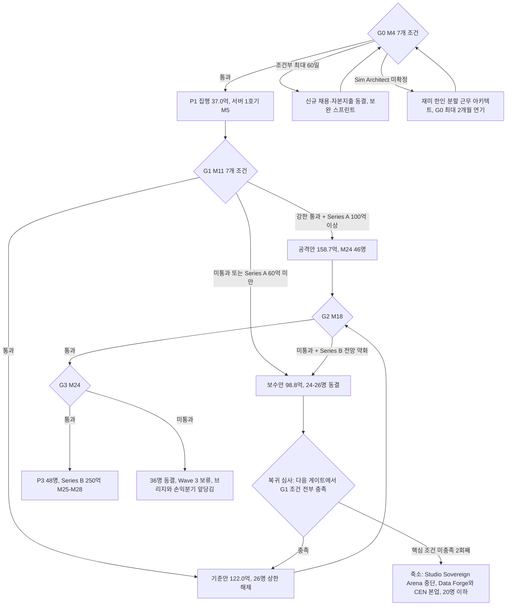
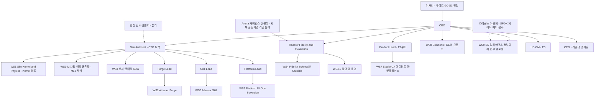
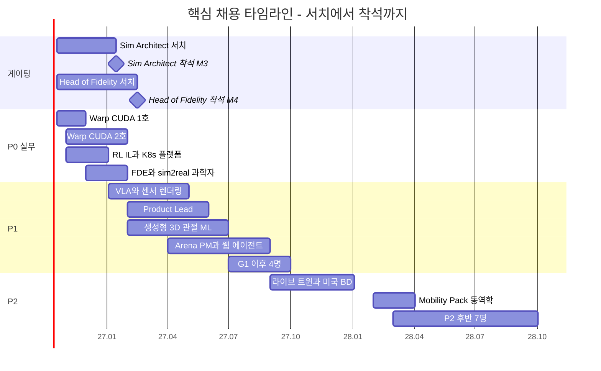
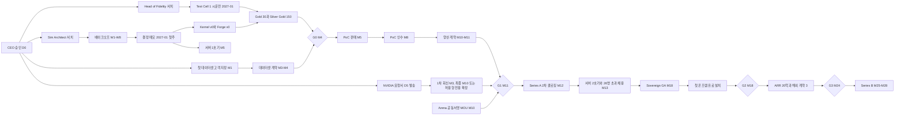

# 09. 로드맵·조직·예산: 36개월 실행 설계와 자본 투입 규율

> **문서 번호** 09 · **기준일** 2026-10-06 · **버전** v1.0 · **상위 문서** [README](README.md)
> **관련 문서** [01 비전·포지셔닝](01-vision-positioning.md) · [02 시장·경쟁](02-market-competition.md) · [03 엔진 선정](03-engine-selection-build-vs-buy.md) · [04 시스템 아키텍처](04-system-architecture.md) · [05 물리·현실감](05-physics-and-realism.md) · [06 사용성·에이전트](06-usability-and-agent.md) · [07 학습 모듈](07-training-module.md) · [08 도메인 팩](08-domain-packs.md) · [10 사업모델·GTM](10-business-model-gtm.md) · [11 리스크·KPI·컴플라이언스](11-risk-kpi-compliance.md) · [12 90일 실행](12-execution-90days.md) · [부록 A 기술 카탈로그](appendix-a-technology-catalog.md) · [부록 B 출처·검증](appendix-b-sources-verification.md)
> **표기** **[A]** 계획 가정(실적 확인 전까지 목표치) · **[U]** 1차 출처 미확인(대외 사용 전 [부록 B](appendix-b-sources-verification.md) 절차로 재검증) · 태그 없는 수치는 결정 기록(DR) 부록 "전 문서 공통 고정값" 또는 GitHub·PyPI·SkyPilot 가격 카탈로그로 확인된 값 · ₩억 = 1억 원, 1 USD = ₩1,400 [A] · 모든 매출 수치는 예측이 아닌 목표 · M1 = 2026년 11월

---

## 핵심 요약

- **36개월을 네 단계(P0 Factory Zero → P1 Outcome MVP + Studio Beta → P2 Productize, Live & Sovereign → P3 Scale, Maritime·Defense, Global)와 네 개의 게이트(G0 M4, G1 M11, G2 M18, G3 M24)로 자른다.** 돈은 게이트를 통과할 때만 다음 단계로 풀린다. G1을 통과하지 못하면 이사회 추가 결의 없이 보수안(₩98.8억)으로 자동 전환한다.
- **24개월 기준 예산은 ₩122.0억(P0 11.2 / P1 37.0 / P2 73.8)이고, 그중 65%인 ₩79.0억이 인건비다.** 564 head-month × ₩1,400만이다. 이번 분기 CEO가 실제로 승인하는 금액은 P0 ₩11.2억뿐이다. 보수안은 ₩98.8억, 공격안은 ₩158.7억이다.
- **인원은 16(M4) → 26(M12) → 36(M24) → 48(M36)명이다.** 월별 인원 곡선을 뒤로 미뤄(back-loaded) 한국 시니어 채용 지연 3–6개월을 예산에 반영했다.
- **범용성의 실제 투입:** 차량 Mobility Pack α는 WS1-M 1명(7 HM)으로 야드·저속 차량과 도로 시나리오 재생까지 만든다(M24에 CRL 4). 승용차 ADAS·섀시 제어 수준은 수요가 확정되면 별도 예산(18–37 HM)으로 연다(§1.2). 기존 CEN 인력 6명은 M1에 모두 재배치되며, CEN 본업 유지 방안은 §5.4에 있다.
- **진짜 임계 경로는 기술이 아니라 "PoC → 양산 전환"이다.** M5에 판매한 12주 PoC가 M8에 인수되고 M10–M11에 양산 계약으로 넘어가야 G1(M11)의 핵심 조건을 채운다. 이 경로에는 여유가 없다. NVIDIA 조건은 '허용형 전용 확정'이라는 대안이 있어 임계 경로가 아니다.
- **DR의 24개월 총액 수학은 맞지만 월별 현금 흐름에는 공백이 있다.** 기존 현금 ₩15억은 M4에 ₩4억 수준까지 내려간다. 그래서 Series A ₩80억 가운데 ₩20억을 M5에 Series A 전환 조건부 브리지로 먼저 받고, ₩30억(M10)과 ₩30억(M12, G1 연동)으로 나눠 클로징한다 [A]. 총액과 M24 말 잔액(약 ₩14억)은 DR과 같다. 브리지 협의 개시와 현금 확인은 이번 달 CEO 승인 안건이다([12 §1](12-execution-90days.md) ⑥).
- **실패가 이어질 때의 손실 상한도 미리 정한다.** 보수안 전환 뒤 다음 게이트에서도 복귀 조건을 채우지 못하면 Studio·Sovereign·Arena 투자를 멈추고 Data·Forge 결과물 사업과 CEN 본업으로 축소한다(§3.7a).
- **GPU는 "실측 후 구매"다.** 자체 RTX PRO 6000 8-GPU 서버 1호기는 베이크오프 결정 메모를 본 뒤 M5에, 2호기는 G1 통과와 1호기 가동률 60% 이상을 확인한 뒤 M13에 산다. 48개월 상각 기준으로 자체 서버는 가동률 약 31%에서 RunPod 온디맨드와 손익분기다. 24개월 현금만 보면 오히려 약 16% 비싸므로, 구매 근거는 잔존가치·데이터 거주·RT GPU 공급 안정성이다 [A].
- **릴리스 트레인은 반기 단위(Train 1: 2026-12 ~ 2027-06부터)이고, 제품 마일스톤은 트레인에 묶는다.** Studio 베타는 Train 2, Studio GA·Sovereign GA·GS 인증 동결 릴리스는 Train 3, Mobility Pack α는 Train 4에 들어간다.

---

## 1. 36개월 로드맵 한눈에 보기

**결론: 상업 Wave(어디서 먼저 돈을 버는가)와 Capability Readiness(무엇을 트윈으로 만들 수 있는가)를 별개의 축으로 운영한다. 로봇 조작이 먼저 매출을 만들지만 차량·드론·선박 기술 준비는 같은 36개월 안에서 일정이 정해져 있다.**

### CEO용 36개월 요약

CEO와 이사회가 판단할 시점은 아래 8개다. 각 시점에 돈이 풀리거나 멈추고, 판정 기준은 숫자로 정해져 있다. 상세 일정은 §1.1 간트(실행 담당자용)에 있다.

| 시점 | 게이트·자금 | 핵심 출시 | 판정 기준 |
|---|---|---|---|
| **M4** (2027-02-26) | **G0** | Kernel v0·Forge v0, "휴대폰 영상 → 피킹 48시간" 데모, 첫 데이터셋 계약 | 7개 조건: 결정 메모, Silver/Gold 한국 SKU 150, 합성 전용 mAP ≥0.85, 결정론 재현 100%, 첫 계약 ≥₩0.5억, LOI 3, Sim Architect 확정(§3.2) |
| **M5** (2027-03) | **Series A 전환 브리지 ₩20억** | Cell-to-Policy PoC 판매 개시, 자체 RT 서버 1호기 | G0 증거 패키지가 브리지 근거. 브리지 전 월말 현금 저점은 M4 약 ₩4억(§9.2) |
| **M9** (2027-07) | Series A 텀시트 | **Studio 베타**(Zone T 전용, Explorer는 대기자 명단 초대제) | 텀시트가 없거나 Series A 총액(브리지 ₩20억 포함)이 ₩60억 미만이면 즉시 채용 동결·보수안(§9.3). 월말 현금 2차 저점 약 ₩5억 |
| **M11** (2027-09-24) | **G1** | PoC 인수 → 양산 계약, Arena 공동서명 MOU(M10) | 유료 결과물 고객 ≥3(양산·연간 ≥1), 라인 총마진 ≥50%, 갭 ≤15%p 등 7개. 미통과 시 보수안(₩98.8억) 자동 전환(§3.3) |
| **M12** (2027-10) | **Series A 2차 클로징 ₩30억**(1차 ₩30억은 M10) | Arena 헌장 서명(M12 초), K-Pick Challenge(10-22) | 2차 클로징은 G1 통과 연동. 증빙 KPI는 M12 시점 실적(2027 Q4 목표 코퍼스 10k, Silver/Gold 1,000 대비 궤적) |
| **M15** (2028-01) | — | **Studio GA**(공개 가입), 미국 데이터·평가 GTM | 생산화 게이트(무개입 80%, 라인 총마진 60%, 서면 라이선스 근거)를 통과한 라인부터 셀프서브 개방 |
| **M18** (2028-04-28) | **G2** | Sovereign GA, Arena v1, 첫 라이브 트윈, GS 동결 릴리스 | 첫 온프렘 유료 설치, 반복매출 ≥30%, 정부재원 ≤40%(§3.4) |
| **M24** (2028-10-27) | **G3** → Series B ₩250억 착수 | Mobility Pack α(CRL 4), 드론 PX4 SITL 템플릿, 셀프서브 당일 데모 | 계약 ARR ≥₩20억, 직전 분기 혼합 총마진 ≥55%, 해외 계약 ≥3 등 7개(§3.5) |

### 1.1 36개월 간트 차트(실행 담당자용)

```mermaid
gantt
    title CEN Athanor 36개월 로드맵 M1 2026-11 ~ M36 2029-10
    dateFormat YYYY-MM-DD
    axisFormat %y.%m
    section 단계
    P0 Factory Zero                      :p0, 2026-11-01, 2027-02-28
    P1 Outcome MVP 및 Studio Beta        :p1, 2027-03-01, 2027-10-31
    P2 Productize Live Sovereign         :p2, 2027-11-01, 2028-10-31
    P3 Scale Maritime Defense Global     :p3, 2028-11-01, 2029-10-31
    section 게이트와 자금
    G0 M4                                :milestone, g0, 2027-02-26, 0d
    Series A 전환 브리지 20억 M5         :milestone, br, 2027-03-15, 0d
    Series A 클로징 M9-M12               :sa, 2027-07-01, 2027-10-31
    G1 M11                               :milestone, g1, 2027-09-24, 0d
    G2 M18                               :milestone, g2, 2028-04-28, 0d
    G3 M24                               :milestone, g3, 2028-10-27, 0d
    Series B 250억 M25-M28               :sb, 2028-11-01, 2029-02-28
    section 릴리스 트레인
    Train 1                              :t1, 2026-12-01, 2027-06-30
    Train 2                              :t2, 2027-07-01, 2027-12-31
    Train 3                              :t3, 2028-01-01, 2028-06-30
    Train 4                              :t4, 2028-07-01, 2028-12-31
    Train 5                              :t5, 2029-01-01, 2029-06-30
    Train 6                              :t6, 2029-07-01, 2029-10-31
    section Kernel과 엔진
    엔진 베이크오프 W1-W8                :bk, 2026-11-02, 2026-12-27
    베이크오프 결정 메모                 :milestone, dm, 2027-01-08, 0d
    Kernel v0 적합성 3x5                 :k0, 2026-11-02, 2027-02-26
    Kernel v1 적합성 4x8                 :k1, 2027-03-01, 2027-10-29
    조건부 PhysX SDK 어댑터              :k2, 2027-11-01, 2028-10-31
    Kernel v2 적합성 5x12 및 6x15        :k3, 2027-11-01, 2029-10-31
    section Forge와 Fidelity Lab
    NeRF 감사와 3DGUT 이전               :f0, 2026-11-02, 2027-02-26
    Test Cell 1 발주와 시운전            :tc1, 2026-11-02, 2027-01-15
    Forge v0 강체                        :fv0, 2026-12-01, 2027-02-26
    Forge v1 관절 VBD 온프렘 촬영키트    :fv1, 2027-03-01, 2027-10-29
    Test Cell 2                          :tc2, 2027-05-01, 2027-06-30
    휴머노이드 셀 파트너 리스            :hc, 2028-01-01, 2028-03-31
    section 결과물 라인
    첫 데이터셋 계약                     :milestone, ds, 2027-02-26, 0d
    바우처 납품 M5-M8                    :vo, 2027-03-01, 2027-06-30
    Cell-to-Policy PoC 판매와 납품       :poc, 2027-03-01, 2028-10-31
    DATA 라인 Transfer 2.5 후 Cosmos 3 Nano M9 :dl, 2027-03-01, 2028-10-31
    VLA 데이터 팩                        :vla, 2027-11-01, 2028-10-31
    셀프서브 SKILL 라인                  :ss, 2028-11-01, 2029-10-31
    section Crucible과 Arena
    Crucible v0 내부                     :cr0, 2027-05-01, 2027-10-29
    Arena 헌장 초안 M8                   :milestone, ach, 2027-06-25, 0d
    Arena 공동서명 MOU M10               :milestone, mou, 2027-08-27, 0d
    Arena 헌장 서명 K-Pick 전            :milestone, chs, 2027-10-15, 0d
    K-Pick Challenge M12                 :milestone, kp, 2027-10-22, 0d
    Crucible v1 외부 Arena 준비          :cr1, 2027-11-01, 2028-04-27
    Arena v1 출범 M18                    :milestone, ar1, 2028-04-28, 0d
    section Studio와 에이전트
    사내 MCP 에이전트                    :ag, 2027-03-01, 2027-10-29
    Studio 베타 M9                       :sb9, 2027-07-01, 2028-01-27
    Studio GA M15                        :milestone, sga, 2028-01-28, 0d
    셀프서브 당일 데모 M24               :milestone, sd, 2028-10-27, 0d
    section Live와 Sovereign
    Sovereign 온프렘 베타 M14            :sv, 2027-12-01, 2028-04-27
    Sovereign GA M18                     :milestone, svga, 2028-04-28, 0d
    Athanor Live 커넥터                  :lv, 2027-11-01, 2028-04-27
    첫 라이브 트윈 M18                   :milestone, lv1, 2028-04-28, 0d
    Air-gap 국방 에디션 M27부터          :ag2, 2029-01-01, 2029-10-31
    section 기술 준비도
    로봇 조작 P0-P1                      :c1, 2026-11-01, 2027-10-31
    휴머노이드 사족 덱스 템플릿          :c2, 2027-04-01, 2027-10-31
    모바일 AMR 공장 물류 셀              :c3, 2027-07-01, 2028-04-30
    Mobility Pack 알파 M18-M24           :c4, 2028-04-01, 2028-10-31
    드론 PX4 SITL 템플릿 M20-M24         :c5, 2028-06-01, 2028-10-31
    선박 항만 해양 M25부터               :c6, 2028-11-01, 2029-10-31
    오프로드 UGV                         :c7, 2028-11-01, 2029-10-31
    section 상업 Wave와 해외
    Wave 1 물체가 많은 조작              :w1, 2026-11-01, 2028-04-30
    Wave 2 휴머노이드 VLA와 Crucible     :w2, 2027-10-01, 2028-10-31
    미국 데이터 평가 GTM                 :us, 2028-01-01, 2029-10-31
    미국 법인 M24-M27                    :usc, 2028-10-01, 2029-01-31
    Wave 3 조선 해양 인식 트리거 조건부  :w3, 2028-11-01, 2029-10-31
    section 인증과 GPU
    상표 출원 M2                         :milestone, tm, 2026-12-30, 0d
    ISMS-P ISO 27001 M6-M18              :isms, 2027-04-01, 2028-04-28
    GS 인증 동결 릴리스 M18              :milestone, gs, 2028-04-28, 0d
    자체 RT 서버 1호기 M5                :milestone, s1, 2027-03-15, 0d
    자체 RT 서버 2호기 M13 G1 조건       :milestone, s2, 2027-11-15, 0d
```

### 1.2 두 개의 축: 상업 집중 순서 vs 기술 준비 시점

플랫폼은 처음부터 무엇이든 트윈으로 만들 수 있게 설계한다(OpenUSD 단일 장면 + 엔진 중립 Sim Kernel API + Domain Pack). 순서가 정해지는 것은 **매출을 어디서 먼저 만드는가**뿐이다. "자동차는 하지 않는다"가 아니라 "자동차는 M18–M24에 Mobility Pack α로 기술 준비를 마치고, 상업화는 파트너 경로와 트리거로 연다"가 정확한 표현이다. Domain Pack 구성은 [08 도메인 팩](08-domain-packs.md)에 있다.

| 대상 | 기술 준비(Capability Readiness) | 상업 집중(Wave) | 예산·인원 출처 | 첫 실증 |
|---|---|---|---|---|
| 로봇 조작(암·빈피킹·조립·삽입) | P0–P1 (M1–M12) | **Wave 1 (M1–M18)** | WS1·WS2·WS5 기준 인원 | M4 "영상 → 피킹 48시간" |
| 모바일 로봇·AMR·공장/물류 셀 | P1–P2 (M9–M18): PhysX Vehicle2(Zone F), Newton 휠 모델(Zone T/S) | Wave 1의 부가 기능, P2 라이브 트윈 | WS1 + WS6(라이브 트윈) | M18 라이브 셀 트윈 what-if |
| 휴머노이드·사족·덱스터러스 핸드 | P1 템플릿(M6–M12), P2 상업화 | **Wave 2 (M12–M24)** | WS5 VLA(M6 착석) | M18 Arena v1 휴머노이드 트랙 |
| 차량 Mobility Pack α | **P2 (M18–M24)**: Chrono::Vehicle 어댑터(Pacejka/TMeasy 타이어, SCM 지형), PhysX Vehicle2(Zone F), OpenDRIVE/OpenSCENARIO import(esmini), 카메라·라이다 리그, FMI 3.0 브리지 | 도로 AV는 "연결" 전략: OpenSCENARIO·OSI·FMI 브리지, 한국 도로 인식 데이터 팩, MORAI 파트너 | WS1-M 1명(M18 착석) + WS3 지원. 고정값 불변 | M24 적합성 C12(정상 선회) 통과 |
| 드론 | P2 PX4 SITL 기본 템플릿(M20–M24, RL 1종), P3 국방 에디션 | Wave 3b 안에서 처리 | WS1-M + WS5 템플릿 | M24 PX4 SITL 템플릿 시연. C14(호버·스텝 응답)는 P3 적합성(6×15)에서 정식 통과 |
| 선박·항만·조선 해양 | P3 (M25–): Fossen 6-DOF, Chrono FSI, 검증 센서 프로파일 | **Wave 3 (M25–, 트리거 조건부)** | P3 인원(WS1-M 2명) | M30 실선 로그 검증 |
| 오프로드 UGV(Chrono CRM 지형) | P3 | Wave 3b (M27–) | P3 인원 | M36 에어갭 랙 데모 |

**차량 준비 수준의 정직한 표기:** α는 야드·저속 차량과 도로 시나리오 재생까지를 M24에 CRL 4로 만든다. 투입은 WS1-M 1명의 약 7 HM(M18–M24)과 WS3 지원이며, 완료 기준은 C12 정상선회 통과, OpenSCENARIO 샘플 시나리오 재생, FMU 1종 연동 데모, 카메라·라이다 프로파일 1종 `validated`다([08 §4.5.7](08-domain-packs.md)). 승용차 ADAS·섀시 제어 수준의 트윈은 범위 밖이다. 승용 OEM·Tier-1 수요가 확정되면(트리거 X14) [08 §6](08-domain-packs.md) Type B(18–37 HM, 인건비 약 ₩2.5–5.2억 [A])를 고객 NRE나 공격안 예산으로 착수하고, 이 경우 준비 시점은 약 M30이다 [A]. 차량·드론 동역학 산출물은 Chrono CPU·PX4 SITL lockstep이 D0 등록(목표 Chrono M22 [A])을 마치기 전까지 D1 '통계적 재현' 라벨과 Scorecard만 붙는다.

### 1.3 달력 대조표

| 기간 | 달력 | 단계 | 게이트·자금 | 트레인 |
|---|---|---|---|---|
| M1–M4 | 2026.11–2027.02 | P0 | G0(2027-02-26) | Train 1 시작(2026-12) |
| M5–M12 | 2027.03–2027.10 | P1 | 브리지(M5), G1(2027-09-24), Series A 클로징(M10·M12) | Train 1 → Train 2(2027-07) |
| M13–M24 | 2027.11–2028.10 | P2 | G2(2028-04-28), G3(2028-10-27) | Train 2 → 3(2028-01) → 4(2028-07) |
| M25–M36 | 2028.11–2029.10 | P3 | Series B(M25–M28) | Train 4 → 5(2029-01) → 6(2029-07) |

---

## 2. 단계별 상세 (P0–P3)

**결론: 각 단계는 "무엇을 증명하는가" 하나로 정의된다. P0는 기술 선택과 첫 매출, P1은 결과물 라인의 수익성, P2는 반복매출과 소버린 조달, P3는 해외와 신규 도메인이다.**

### 2.1 P0 Factory Zero (M1–M4, 2026.11–2027.02)

- **증명할 것:** 내부 팩토리(Zone F)가 "휴대폰 영상 → 인증 자산 → 학습된 피킹 정책"을 48시간 안에 돌릴 수 있고, 그 기술 선택이 사내 실측에 근거한다는 것.
- **예산·인원:** ₩11.2억, M4 말 16명, 44 HM. 웹·멀티테넌트 엔지니어링은 거의 하지 않는다.

| 워크스트림 | P0 산출물 | 완료 기준 | 책임 |
|---|---|---|---|
| WS1 Kernel | Sim Kernel API v0, 적합성 스위트 v0(C01–C05) × 3개 백엔드(Newton/MJWarp·MuJoCo CPU·Isaac Lab PhysX), 베이크오프 결정 메모, Train 1 호환성 매트릭스, Run Manifest v0(2026-11-06, W1)·장면 커밋·라이선스 레지스트리 v0 백엔드(재배치 인력, P1부터 운영은 WS6·레지스트리 UI는 WS7) | 적합성 3 × 5 통과, 결정 메모 2027-01 첫 주, Manifest 재생 해시 일치 | CTO(대행 → Sim Architect) |
| WS2 Forge | CEN NeRF SPDX 감사(M1), gsplat 1.6.0·3DGRUT 2.0 이전, Forge v0(강체) | Silver/Gold 한국 SKU 150개(그중 Gold 30), NeRF 런타임 퇴역(2027-02-28) | Forge Lead |
| WS3 센서·SDG | Replicator SDG 파이프라인(Zone F), SDG 처리량 측정(베이크오프 SDG 과제) | 합성 전용 검출기 mAP ÷ 실데이터 mAP ≥0.85 | CTO |
| WS4·WS4-L Fidelity | Test Cell 1(코봇, 빈, 카메라 3대, F/T 센서), 측정 프로토콜 v1(P-DROP, P-PUSH, P-SLIDE, P-MASS), Scorecard v1 | 페어드 trial 1k, 인증 시험 결정론적 재현 100% | Head of Fidelity(M4 착석 전까지 측정 프로토콜·인증 기준 서명은 외부 자문 교수 + CEO 공동, CTO 대행은 실행만. [12 §2.1](12-execution-90days.md)) |
| WS5 Skill | RL 3 / IL·VLA 1 / 인식 1 템플릿, 48시간 데모 정책 | GPU당 병렬 환경 ≥4,096, 실셀 이전 정책 1개 | Skill Lead |
| WS6 Platform | 최소 K8s + KAI 클러스터(M3 착석 후), SPDX 거부 목록 CI 운영, 국내 CSP 이미지 검증(V4) | CI 차단 규칙 가동(상업 경로 차단 0건), R580 이미지 재현 | Platform Lead |
| WS7 Agent | 사내 딜리버리 엔지니어용 한국어 명령 스크립트 | 20개 중 ≥80% 성공 | Product(대행 CTO) |
| WS8 FDE | 첫 데이터셋 고객 딜리버리 | mAP 인수 조건 충족 | CEO |
| WS9 BD | NVIDIA 서면 요청(D0 이후 첫 주, D5 = 2026-10-23 발송. 1차 회신 기한 M3, 최종 조건 M10), LOI 3, TIPS 운영사, 바우처 공급기업 등록(2026.12–2027.01), KOITA·벤처·IRIS 정비, 상표 출원(M2) | LOI 3건 서명(M3), 첫 계약 ≥₩0.5억 | CEO |

- **데모(M4):** "휴대폰 영상에서 로봇 피킹까지 48시간". 한국어 명령으로 셀 장면을 구성하고 랜덤화한다.
- **P0의 함정과 대응:** 베이크오프 인력이 부족하다. Sim Architect가 M3에야 착석하므로 W1–W4는 CTO 대행과 재배치 인력 3명이 Isaac Lab·mjlab 기본 제공 과제부터 돌리고, Warp/CUDA 엔지니어 1호(M2 착석)가 W5부터 합류한다. 과제 우선순위는 [12 §5](12-execution-90days.md)에 있다.

### 2.2 P1 Outcome MVP + Studio Beta (M5–M12, 2027.03–2027.10)

- **증명할 것:** 결과물 라인이 총마진 50% 이상으로 반복 생산되고, 엔지니어 시간이 결과물당 절반으로 줄어든다는 것. Series A의 증거가 여기서 나온다.
- **예산·인원:** ₩37.0억, M12 말 26명, 160 HM. G1(M11) 전까지 인원 상한 26명.

| 워크스트림 | P1 산출물 | M12 KPI(DR 고정값) | 책임 |
|---|---|---|---|
| WS1 | Kernel v1, 적합성 4 × 8(+ Drake), 업그레이드 채택 지연 ≤45일(사이드 브랜치 검증 완료 후보 기준), sim2sim 게이트 적용률 100%(Tier 1, 모든 수출 정책) | 궤적 ADE ≤2 cm | CTO |
| WS2 | Forge v1(관절 물체, VBD 폴리백, 온프렘 촬영·재구성 키트) | Silver/Gold 1,000(Gold 200), Forge 무개입 60% | Forge Lead |
| WS3 | DATA 라인(M5–M8 Cosmos Transfer 2.5, M9부터 Cosmos 3 Nano 16B 파인튜닝, 라벨 일관성 QA 동일), Warp Sensor Library v1 | mAP 비율 ≥0.90, 라벨 일관성 ≥98%, 라이다 ≤3 cm | CTO |
| WS4·WS4-L | Test Cell 2(M8 목표), Crucible v0(시뮬 25, 실셀 2, 내부), Arena 공동서명 MOU(M10), K-Pick Challenge(M12) | 갭 ≤15%p(3개 과제), r ≥0.7, 페어드 trial 10k | Head of Fidelity |
| WS5 | SKILL 라인(그래스프 RL, Mimic + SmolVLA/GR00T N1.7 파인튜닝, Jetson 수출), 12주 PoC 납품 | 템플릿 8 / 3 / 3, 영상 → 스킬 24시간 | Skill Lead |
| WS6 | Outcome Orchestrator v1, 토큰 미터링, ISMS-P·ISO 27001 착수(M6) | 1B 스텝당 RL 비용 ≤$10 | Platform Lead |
| WS7 | 사내 MCP 에이전트, **Athanor Studio 베타(M9, Zone T 전용, Explorer는 대기자 명단 초대제·주간 승인 상한)**, 마켓플레이스 'Certified' 등급 | 에이전트 50개 중 ≥85%, 첫 시뮬레이션 ≤10분, 활성 워크스페이스 30 | Product Lead |
| WS8 | PoC 3–4건 딜리버리, FDE 상한(결과물 매출 ₩8억당 1명) | 결과물당 엔지니어 시간 지수 50 | CEO |
| WS9 | PoC 판매(M5), 바우처 납품(M5–M8), TIPS 선정(M6–M8 예상 [A]), Series A, NPN 등재(M10 목표), NVIDIA 최종 조건(M10) | 2027 매출 ₩15억, 유료 고객 누적 6, 측정권 고객 4 | CEO |

- **데모(M12):** 공개 **K-Pick Challenge**(2027-10-22). 로봇 OEM 3곳의 정책을 시뮬과 실셀에서 동시에 채점하고, 외부 채점에는 공동서명 기관이 입회한다. 전제는 Arena 헌장 초안(M8) → 공동서명 MOU(M10, 2027-08-27) → 헌장 서명(M12 초, K-Pick 이전)이다. 서명이 늦어지면 K-Pick은 공동서명 기관 입회 아래 순위를 매기지 않는 공개 시연으로 연다.
- **P1의 함정과 대응:** PoC가 SI 업무로 번진다. 오퍼 시트의 운영 범위(조명·물체군)와 책임 상한(= 계약 금액)으로 범위를 닫고, 결과물 크레딧(계약 금액의 20–30%를 12개월 유효 CEN 토큰)으로 후속 수요를 셀프서브로 돌린다. 오퍼 시트는 [12 §6](12-execution-90days.md)에 있다.

### 2.3 P2 Productize, Live & Sovereign (M13–M24, 2027.11–2028.10)

- **증명할 것:** 반복매출과 소버린 조달이 붙는다는 것. 서비스 회사가 아니라 소프트웨어·데이터 인프라 회사라는 증거(반복매출 30%, 총마진, NRR 110%)를 Series B 앞에 쌓는다.
- **예산·인원:** ₩73.8억, M24 말 36명, 360 HM. G2(M18) 전까지 인원 상한 32명.

| 워크스트림 | P2 산출물 | M24 KPI | 책임 |
|---|---|---|---|
| WS1·WS1-M | 적합성 5 × 12, 조건부 PhysX SDK 어댑터(36–48 HM, 3조건 충족 시), **Mobility Pack α(M18–M24)** | 채택 지연 ≤30일, ADE ≤1.5 cm | CTO |
| WS2 | 셀프서브 Forge(생산화 게이트 통과 시), 생성형 3D·관절 ML 고도화 | Silver/Gold 4,000(Gold 800), 무개입 80%, 재사용률 35% | Forge Lead |
| WS3 | 센서 프로파일 확장(라이다 ≤2 cm), 드론 PX4 SITL 템플릿 렌더 지원 | mAP 비율 ≥0.95 | CTO |
| WS4·WS4-L | **Crucible v1 + 외부 Arena v1(M18)**, 휴머노이드 셀(파트너 리스), 시험성적서 지표 3개 | 갭 ≤10%p(5개), r ≥0.8, 페어드 50k, Arena 회원 8 | Head of Fidelity |
| WS5 | 셀프서브 학습 템플릿, VLA 데이터 팩(Mimic + 텔레옵), RLinf VLA RL 후처리 | 템플릿 15 / 6 / 5, 실셀 이전 정책 누적 30 | Skill Lead |
| WS6 | **Athanor Live**(첫 라이브 트윈 M18), **Sovereign 베타(M14) → GA(M18)**, MIG 테넌시(검증 시), ISMS-P 취득(M18) | 온프렘 첫 유료 설치(G2) | Platform Lead |
| WS7 | **Studio GA(M15)**, 마켓플레이스 셀프서브, GS 인증(동결 릴리스, M18) | 첫 시뮬레이션 ≤5분, 활성 워크스페이스 300, 결과물 → 셀프서브 전환 50%(P2 정의: 결과물 고객 중 12개월 안에 크레딧 외 유료 토큰·구독을 쓴 비율. P1은 Studio 베타 워크스페이스 활성화 비율) | Product Lead |
| WS8 | 양산 스킬 프로그램 운영, FDE 2명 | 엔지니어 시간 지수 25 | CEO |
| WS9 | **미국 데이터·평가 GTM(M15, 원격 우선)**, 일본 PoC 준비, Series B 준비 | 해외 계약 ≥3, ARR ₩20억(G3 판정은 M24 계약 ARR, 연간 목표는 연말 인식 ARR), NRR ≥110% | CEO |

- **데모(M18):** 휴머노이드 제조사 3곳이 참여하는 Arena v1 출범. 라이브 셀 트윈에서 한국어로 재배치 what-if를 실행해 예측 처리량과 실측을 비교한다.
- **데모(M24):** 셀프서브 "영상 투입 → 인증 트윈과 피킹 스킬, 당일 산출".
- **P2의 함정과 대응:** 동시에 너무 많은 것을 출시한다(Studio GA, Live, Sovereign, Arena v1, GS, ISMS-P가 M15–M18에 몰린다). 그래서 Train 3(2028-01 ~ 2028-06)를 **"출시 전용 트레인"**으로 지정하고 엔진 핀 상향을 최소화한다(§4).

### 2.4 P3 Scale, Maritime·Defense, Global (M25–M36, 2028.11–2029.10)

- **증명할 것:** 한국 상한(단일 벤더 ARR 약 USD 20–30M [U])을 넘는 경로, 즉 해외 데이터·평가와 소버린·국방이 실제 매출이 된다는 것.
- **인원:** M36 말 48명. P3 예산은 DR 24개월 예산 밖이며 Series B로 충당한다. 지표 예산은 §8.7에 [A]로 둔다.

| 축 | P3 산출물 | 착수 조건 |
|---|---|---|
| Wave 3 해양 | Fossen 6-DOF, Chrono FSI, 검증된 레이더·EO/IR 프로파일, COLREG 시나리오 500개, 항만 크레인 트윈 | ARR ₩30억 이상 **또는** 자금 확보 앵커(확정 ₩5억 이상) + Sovereign GA + 센서 검증 프로파일. 기준안의 2028년 말 ARR은 ₩20억이므로 M25 착수의 기본 경로는 앵커 계약(조선사 공동개발 또는 국방 과제)이고, ARR ₩30억 경로는 2029년 중에야 충족된다 [A]. M25는 트리거 판정 개시 시점 |
| Wave 3b 국방 | Athanor Air-gap(M27–), Chrono 오프로드 UGV, PX4 드론 인식 | 위 트리거 + 국방 라이선스 프로파일(SAM 계열·VGGT-Commercial·Drake PyPI 휠 제외), V8 통과. 2029년 Air-gap 매출 약 ₩4.5억은 앵커 계약 전제 [A] |
| 학습 | Cosmos 3 Super 기반 정책 사전 선별, 셀프서브 SKILL 라인 | P2 생산화 게이트 통과 |
| 해외 | 미국 법인(M24–M27), 일본 고객, 국내 OEM 미국 공장(HMGMA, Hanwha Philly [U]) 추종 | G3 통과, Series B |

- **M36 지표(DR 고정):** 2029 매출 ₩110억, ARR ₩70억, 반복매출 ≥50%, 해외 ≥27%, 총마진 ≥60%, NRR ≥120%, Arena 인증서 인용 조달·PO 누적 ≥3, Silver/Gold 12,000.
- **데모:** M30 실선 로그로 해양 인식 팩 검증(합성 90% 이상으로 학습한 검출기). M36 에어갭 랙에서 촬영 → 학습 → 평가 전 과정을 네트워크를 물리적으로 끊고 실행.

---

## 3. 게이트 체계 G0–G3

**결론: 게이트는 이진 판정이다. 증거 패키지가 없으면 미통과다. G1 미통과는 이사회 추가 결의 없이 보수안으로 자동 전환되며, 이 규칙 자체를 지금 승인받는다.**

### 3.1 운영 원칙

- **판정 주체:** 이사회. CEO가 증거 패키지를 제출하고, CTO·Head of Fidelity·CFO(기존 경영지원 [A])가 서명한다.
- **증거 패키지:** 지표 원자료(Run Manifest ID, 계약서, 세금계산서, 시험성적서), KPI 대시보드 스냅샷, 측정 방법, 미달 항목의 원인 분석. 구두 보고는 증거가 아니다.
- **판정 일정 [A]:** G0 2027-02-26, G1 2027-09-24, G2 2028-04-28, G3 2028-10-27. 패키지는 판정 10영업일 전에 배포한다.
- **세 가지 결과만 있다:** 통과 / 미통과 / (G0에 한해) 조건부 통과(최대 60일, 그 기간 신규 채용과 자본지출 동결).

### 3.2 G0 (M4, 2027-02-26): 기술 선택과 첫 매출

| # | 조건(DR) | 측정·증거 | 미달 시 분기 |
|---|---|---|---|
| ① | 베이크오프 결정 메모 완료 | 서명된 메모, 작업 유형별 기본 백엔드 매트릭스, Train 1 매트릭스 | 가설 라우팅([03 §3.4](03-engine-selection-build-vs-buy.md))으로 P1 시작, 서버 1호기 발주 보류 |
| ② | Silver/Gold 한국 SKU 150개 | 인증서 레지스트리 조회(`aic:TwinCertificate`), Bronze 제외 | ≥100개면 조건부 통과 + 4주 촬영 스프린트 |
| ③ | 합성 전용 검출기 mAP ≥0.85(실데이터 대비) | 보류된 실데이터 세트, 고정 학습 레시피(RF-DETR N–L) | 데이터셋 SKU 인수 기준을 '합성 + 실데이터 10% ≥ 실데이터 100%'로 한정 |
| ④ | 인증 시험 결정론적 재현 100% | MuJoCo CPU D0 재현, 상태 해시 일치 로그 | **양보 불가.** 통과 전 인증서 발행 금지 |
| ⑤ | 첫 데이터셋 계약 ≥₩0.5억 | 서명 계약서 | 바우처 기반 첫 레퍼런스를 M6까지 확보. 브리지 협상 시 리스크 공개 |
| ⑥ | LOI 3건 | 서명 LOI(정부 제안서 인용 동의 조항 포함) | 2건이면 TIPS 제출 진행, 3번째 앵커는 M6까지 |
| ⑦ | Sim Architect 채용 확정 | 서명 오퍼레터 | 원격 재미 한인 아키텍트 분할 근무 투입, G0 최대 2개월 연기 |

### 3.3 G1 (M11, 2027-09-24): 스케일 허가

| # | 조건(DR) | 측정·증거 | 판정 메모 |
|---|---|---|---|
| ① | 유료 결과물 고객 ≥3, 그중 양산·연간 계약 ≥1 | 계약서, 매출 인식 기록 | 바우처 고객은 '유료'로 세지 않는다 [A] |
| ② | NVIDIA 서면 조건 확보 **또는** 허용형 전용 운영 결정 확정 | 서면 회신 또는 이사회 결의 | OR 조건이므로 자체 통제 가능 |
| ③ | 결과물 라인 총마진 ≥50% | [10 §6.4](10-business-model-gtm.md) 완전원가 정의: (라인 매출 − 컴퓨트·토큰 원가 − 인건비(개입·FDE·Skill·Forge 시간, head-month ₩1,400만 환산) − 랩·현장 원가 − 크레딧 이행 원가 − 인수 리스크 충당금) ÷ 라인 매출 | 직접원가 마진은 쓰지 않는다. 혼합 총마진(2027 약 45%)과 구분 |
| ④ | 측정권 부여 고객 ≥2 | 계약서 측정권 조항 | 할인 10–20% 적용 여부 기록 |
| ⑤ | Arena 공동서명 기관 MOU | 서명 MOU(목표 2027-08-27) | KTL·KIRIA·TTA 중 1곳. 헌장 초안 M8, 헌장 서명 M12 초 |
| ⑥ | 3개 피킹 과제에서 sim-to-real 갭 ≤15%p | Crucible 실셀 리포트, 신뢰구간 | 과제 정의는 Crucible KP 스위트 |
| ⑦ | 결과물당 엔지니어 시간 P0 대비 −50% | 시간 기록(작업 DAG 단위) | 지수 50 |

- **강한 통과(공격안 발동):** 7개 조건 전부 + 양산 계약 ≥2 + ARR 경로 확인 + Series A ≥₩100억. 이때만 46명·₩158.7억 계획을 연다.
- **통과:** 26명 상한 해제(G2까지 32명), 서버 2호기 M13 발주, Wave 2 M12 착수.
- **미통과 → 보수안(₩98.8억) 자동 전환:** §3.8의 30일 절차를 실행한다.

### 3.4 G2 (M18, 2028-04-28): 소버린과 반복매출

| # | 조건(DR) | 측정·증거 | 미달 시 |
|---|---|---|---|
| ① | 첫 온프렘 유료 설치 | Sovereign 라이선스 계약, 설치 인수 확인서 | Sovereign 매출 목표(2028 ₩3억)를 2029로 이월, WS6 증원(M21) 보류 |
| ② | 반복매출 비중 ≥30% | 구독·토큰·양산 프로그램·Sovereign 연간 라이선스 | 결과물 크레딧 → 셀프서브 전환 캠페인, 가격 재설계 |
| ③ | 정부재원 매출 비중 ≤40% | 바우처·정부 용역 별도 원장(상업 ARR과 분리) | 신규 정부 용역 수주 동결, 상업 파이프라인 우선 |

- **통과:** 32명 상한 해제, M19–M24 채용(7명) 진행.
- **미통과 + Series B 전망 약화:** DR 규칙대로 **G2 시점에 보수안으로 전환**한다. 인원은 그 시점 수준(29명)에서 동결하고 M19 이후 채용 7명을 취소한다.

### 3.5 G3 (M24, 2028-10-27): Series B와 P3

| # | 조건(DR) | 측정 기준 |
|---|---|---|
| ① | ARR ≥₩20억 | M24 시점 서명된 반복 계약의 연환산 금액(계약 ARR), 정부재원 제외. 2028년 말 인식 ARR 목표 ₩20억(DR 부록 "전 문서 공통 고정값")과 구분([10 §8.3](10-business-model-gtm.md), [11 §6.5](11-risk-kpi-compliance.md)) |
| ② | 총마진 ≥55% | **직전 분기(2028 Q3) 혼합 총마진** [A]. 2028년 연간 목표 약 52%와 구분(§11 참조) |
| ③ | 해외 데이터·평가 계약 ≥3 | 서명 계약서 |
| ④ | 5개 과제에서 갭 ≤10%p | Crucible 리포트 |
| ⑤ | sim/real r ≥0.8 | 정책 패밀리 ≥8개(권장 12) [A], Fisher 95% CI 병기(DR §16 #46) |
| ⑥ | Silver/Gold 자산 4,000개 | 인증서 레지스트리 |
| ⑦ | Series B 착수 | 리드 투자자 텀시트 또는 IR 착수 결의 |

- **통과:** P3 확장(48명), Wave 3 트리거 판정 개시, 미국 법인 설립.
- **미통과:** 인원 36명 동결, Wave 3 보류, 기존 투자자 브리지 협상, 손익분기(목표 M44 전후 [A]) 앞당기기 계획으로 전환.

### 3.6 실패 분기 흐름

### 3.7 게이트 설계에서 검토한 대안

| 대안 | 내용 | 기각 이유 | 채택안 |
|---|---|---|---|
| 마일스톤 분할 집행만 운영 | 예산을 분기별로 나눠 집행하고 게이트 없이 KPI만 보고 | 실적이 미달해도 매몰비용 때문에 다음 분기 예산이 관성적으로 집행된다. 서비스화 함정(리스크 #2)이 숫자에 늦게 드러난다 | 이진 게이트 + 자동 전환 |
| G1을 M12(Series A 완료 후)에 둠 | 투자금 확보 뒤 판정 | Series A 2차 클로징 조건과 P2 채용 개시(M13)가 같은 증거를 필요로 한다. M11에 판정해야 2차 클로징(M12)과 서버 2호기 발주(M13)에 1개월 여유가 생긴다 | G1 = M11 |
| G1 미통과 시 이사회 재심 | 실패 후 이사회가 다시 결정 | 재심은 대개 "한 분기만 더"로 끝난다. 보수안을 지금 사전 승인해 두면 전환 비용(협상, 사기 저하)이 가장 작다 | 자동 전환 + 다음 게이트 복귀 심사 |
| 게이트 조건을 매출액 하나로 단순화 | 'ARR ₩X억' 단일 조건 | 정부재원 매출로 쉽게 채워지고, 해자(측정권·인증서·Arena)가 쌓였는지 알 수 없다 | 사업 3 + 해자 2 + 기술 2의 혼합 조건 |

### 3.7a 중단·축소 기준(프로그램 손실 상한)

**결론: 보수안은 '한 번의 유예'다. 보수안에 들어간 뒤 다음 게이트에서도 핵심 조건을 채우지 못하면 플랫폼 투자를 멈추고 결과물 사업으로 축소한다. 이 규칙도 보수안 자동 전환과 함께 지금 이사회에서 사전 결의한다.**

| 진입 경로 | 다음 판정 시점 | 판정할 핵심 조건 | 미충족 시 조치 [A] |
|---|---|---|---|
| G1(M11) 미통과 → 보수안 | G2(M18, 2028-04-28) | G1 핵심 세 조건: 유료 결과물 고객 3곳, 양산·연간 계약 1건, 라인 총마진 ≥50%([10 §6.4](10-business-model-gtm.md) 완전원가) | **축소 실행** |
| G2(M18) 미통과 + Series B 전망 약화 → 보수안 | G3(M24, 2028-10-27) | G2 ①·② 조건: 첫 온프렘 유료 설치, 반복매출 비중 ≥30% | **축소 실행** |

- **축소의 내용 [A]:** Studio·Sovereign·Arena 투자를 중단한다. Data·Forge 결과물 사업(데이터셋 팩, 인증 트윈)과 CEN 본업(§5.4)으로 범위를 줄이고, 인원은 20명 이하로 줄인다. Kernel은 결과물 생산에 필요한 백엔드(Newton/MJWarp, MuJoCo CPU)만 유지하고 신규 어댑터 개발을 멈춘다.
- **결정 절차:** 판정 다음 날부터 30일 안에 이사회가 축소안을 결의한다. CEO와 CFO가 축소 후 월 소진(약 ₩3–3.5억 [A] = 20명 × ₩1,400만 + 비인건비)과 런웨이를 함께 보고한다. 판정을 미루거나 '한 분기만 더'를 결의하지 않는다(§3.7의 재심 기각 이유와 같다).
- **손실 상한 [A]:** G1 경로에서 축소가 결정되는 M18까지 누적 지출은 약 ₩73억(P0·P1 ₩48.2억 + 보수안 P2 전반 약 ₩25억)이다. 이 금액이 이사회가 미리 알고 승인하는 최대 노출이다.
- **축소 후에도 남는 자산:** 한국 SKU Silver/Gold 라이브러리, 측정 프로토콜과 페어드 코퍼스, 인증 체계, Forge 파이프라인. 이 네 가지는 축소안에서도 매출(데이터셋 팩, 인증 트윈)을 만드는 생산 설비다.

### 3.8 보수안 전환 30일 절차

| 일차 | 조치 | 책임 | 절감 효과 [A] |
|---|---|---|---|
| D+1 | 26명 초과 채용 오퍼 동결, 진행 중 서치 중단(성공보수 미발생 단계) | CEO | M13–M24 신규 10명 취소 → HM 360 → 288 |
| D+3 | 서버 2호기 발주 취소, RT 풀은 1호기 + 클라우드 버스트로 운영 | Platform Lead | 컴퓨트 24개월 ₩14.0억 → ₩9.5억 |
| D+7 | Wave 2 축소: Arena v1을 M24로, 휴머노이드 셀은 파트너 전용 | Head of Fidelity | Fidelity Lab ₩6.8억 → ₩4.6억 |
| D+10 | Sovereign GA를 M24로, GS 인증을 P3로 연기 | Platform Lead | 법무·IP·인증 ₩3.5억 → ₩2.5억 |
| D+14 | 미국 GTM을 M24 이후로 연기, 행사 축소 | CEO | GTM·관리 ₩5.5억 → ₩3.5억 |
| D+30 | 보수안 예산을 이사회에 보고, 복귀 조건(다음 게이트에서 G1 조건 충족) 명시 | CEO + CFO | 24개월 ₩122.0억 → ₩98.8억 |

---

## 4. 릴리스 트레인

**결론: 엔진은 월 단위로 바뀌지만 고객이 받는 제품은 반기 트레인으로만 바뀐다. 제품 마일스톤을 트레인에 묶어, 출시와 엔진 업그레이드가 같은 달에 겹치지 않게 한다.**

### 4.1 트레인 달력

| 트레인 | 기간 | 엔진 핀 원칙 | 묶이는 제품 마일스톤 | 연결 게이트 |
|---|---|---|---|---|
| **Train 1** | 2026-12 ~ 2027-06 | Zone F: Isaac Sim 6.1.x, Kit 110.x(Isaac Sim 6.1 번들 버전 [U]), Isaac Lab 3.x GA(GA 노트의 Newton·Warp 핀) + PhysX 5.x(번들 버전 [U]). Zone T: 같은 Newton 핀 원칙(2026-10 최신 Newton 1.6.1). 예외 승인 시 Newton 1.6.x + Warp 1.18(Newton의 최소 Warp 버전은 pyproject로 확인 [U]. Warp 1.18 휠은 Turing 이상 GPU와 R580 이상 드라이버(CUDA 13) 필요). MuJoCo 3.15.x, mjlab 1.6.x(MJWarp 3.11 고정 별도 이미지, 인증 재생은 MuJoCo 3.15 CPU), R580 이상, OpenUSD 툴링 26.08 | Kernel v0, Forge v0, 첫 데이터셋, PoC 판매(M5), 바우처 납품(M5–M8) | G0 |
| **Train 2** | 2027-07 ~ 2027-12 | Isaac Sim 7.x는 GA + 패치 1회 충족 시에만 승격 | Studio 베타(M9, Zone T 전용), Crucible v0, Arena 헌장 서명(M12 초), K-Pick Challenge(M12), Sovereign 온프렘 베타(M14) | G1 |
| **Train 3** | 2028-01 ~ 2028-06 | **출시 전용 트레인 [A]:** 보안 패치와 필수 핀만 반영 | Studio GA(M15), Sovereign GA(M18), GS 동결 릴리스(M18), Arena v1(M18), 첫 라이브 트윈(M18) | G2 |
| **Train 4** | 2028-07 ~ 2028-12 | 조건부 PhysX SDK 어댑터 편입 가능 | Mobility Pack α(M18–M24 완성), 드론 PX4 SITL 기본 템플릿(RL 1종), 셀프서브 당일 데모(M24). Chrono CPU D0 등록 시험(목표 M22 [A]) | G3 |
| **Train 5** | 2029-01 ~ 2029-06 | 국방 프로파일 화이트리스트 분기 | Air-gap 에디션(M27–), 해양 인식 팩(M30 검증) | — |
| **Train 6** | 2029-07 ~ 2029-12 | — | M36 에어갭 랙 데모, P3 지표 | M36 |

### 4.2 트레인 운영 절차 [A]

| 시점 | 작업 | 산출물 | 책임 |
|---|---|---|---|
| 상시 | 업스트림 릴리스 감시 → 사이드 브랜치 핀 상향 PR 자동 생성 → 적합성·sim2sim 게이트 | '검증 완료 후보'(채택 지연 KPI: P1 ≤45일, P2·P3 ≤30일. 프로덕션 반영은 다음 릴리스 트레인) | WS1 |
| T−6주 | 후보 동결(feature freeze). 새 엔진 버전 진입 마감 | 후보 목록 | CTO |
| T−4주 | 적합성 스위트 전체 실행(C01–C15 중 해당 단계 장면), 인증 장면 D0 재현, sim2sim 교차 이전(Zone F 3개·Zone T/S 2개 백엔드) | 장면 × 백엔드 행렬 | WS1 + Head of Fidelity |
| T−3주 | 국내 CSP 이미지(NHN·Naver·KT 중 계약사)와 자체 서버에서 동일 이미지 검증 | 이미지 다이제스트 | WS6 |
| T−2주 | 호환성 매트릭스 RC, SBOM·라이선스 차이 검사(SPDX 게이트) | 매트릭스 RC, 서명 SBOM | WS6 + 라이선스 매니저 |
| T−1주 | Sovereign 고객 사전 공지, 릴리스 노트 | 공지문 | Product Lead |
| T0 | 승격. Studio·Cloud 순차 배포(카나리 10% → 100%) | 트레인 릴리스 | Platform Lead |
| T+6주 | 중간점검: 보안 패치만 반영 | 패치 릴리스 | Platform Lead |

- **소버린 지원 정책 [A]:** 온프렘 고객에게는 직전 트레인(N−1)을 12개월 지원한다. 에어갭 고객은 오프라인 서명 번들로 트레인당 1회 업데이트한다.
- **GS 인증:** Train 3의 M16 스냅샷을 동결 릴리스로 제출해 M18 취득을 목표로 한다.
- **업그레이드 세금:** 엔진에 닿는 WS1·WS3·WS6 용량의 25%를 고정 예약한다. 24개월 기준 43.5 HM, 약 ₩6.1억이다(§6.4). 계획 대비 1.5배 이상 공수가 들면 엔진 검토 위원회가 백엔드 축소나 트레인 연기를 결정한다.

---

## 5. 조직

**결론: CEO 아래 세 개의 기둥(Sim Architect = 엔진·플랫폼, Head of Fidelity = 측정·인증, Product Lead = 사용자 표면)을 세우고, 해자에 해당하는 측정·인증 라인은 엔지니어링 조직과 분리한다. 측정하는 사람이 만드는 사람에게 보고하지 않게 하기 위해서다.**

### 5.1 조직도

- **설계 이유:** Head of Fidelity가 CTO 아래에 있으면, 엔진 팀이 만든 결과물을 같은 라인이 채점하게 된다. Arena 이해상충 회피 규정과 제3자 공동서명은 이 분리를 전제로 한다.
- **회의체 [A]:** 주간 운영 회의(CEO, 3기둥, 워크스트림 리드), 격주 딜리버리 리뷰(FDE·Skill·Forge), 분기 엔진 검토 위원회(CTO 의장, Kernel 리드, Head of Fidelity, 라이선스 매니저), 분기 이사회 KPI 보고(해자 KPI 공개), Arena 거버넌스 위원회(헌장 서명 후 반기).

### 5.2 역할 × FTE (DR §8.1, 각 단계 말 인원, CEO 제외)

| 역할(워크스트림) | 소유 범위 | P0 (M4) | P1 (M12) | P2 (M24) | P3 (M36) | 책임자 |
|---|---|---|---|---|---|---|
| 리더십: Sim Architect(CTO 트랙), Head of Fidelity & Evaluation, Product Lead(P1부터), US GM(P3) | 아키텍처, 인증 체계, 제품 | 2 | 3 | 3 | 4 | CEO |
| WS1 Sim Kernel & Physics | Kernel API, 어댑터, 적합성 스위트, Warp 커널, sysid 도구, Newton 업스트림 | 3 | 4 | 4 | 5 | CTO |
| WS1-M 차량·해양 동역학 | Chrono, FMI, Fossen. Mobility Pack α(M18–M24) | 0 | 0 | 1 | 2 | CTO |
| WS2 Athanor Forge | 신경 재구성, 기하·SimReady, 생성형 3D·관절 ML | 2 | 4 | 5 | 6 | Forge Lead |
| WS3 센서·렌더링·SDG | RTX 센서, Warp Sensor Library, 센서 프로파일, 렌더 티어 | 1 | 2 | 3 | 4 | CTO |
| WS4 Fidelity Science & Crucible | sim2real 과학자, 지표, sysid, Arena 프로그램 | 1 | 2 | 3 | 4 | Head of Fidelity |
| WS4-L 촬영·랩 운영 | 촬영 기술자, 로봇 테크니션 | 1 | 2 | 2 | 3 | Head of Fidelity |
| WS5 Athanor Skill | RL, IL·VLA, 인식, Jetson 배포 | 2 | 3 | 4 | 5 | Skill Lead |
| WS6 Platform, MLOps & Sovereign | K8s/KAI, 컨트롤 플레인, 미터링, 게이트웨이, 보안, 에어갭 패키징, SBOM | 1 | 2 | 4 | 5 | Platform Lead |
| WS7 Studio UX, Agent & Marketplace | WebGPU 클라이언트, MCP 에이전트, 마켓플레이스, 라이선스 레지스트리 UI | 1 | 2 | 3 | 4 | Product Lead |
| WS8 Solutions/FDE & 콘텐츠 | 현장 배치 엔지니어, 테크니컬 아티스트, 버티컬 팩 | 1 | 1 | 2 | 3 | CEO |
| WS9 BD, 얼라이언스, 정부과제, 라이선스·법무, 글로벌 GTM | NVIDIA 협상, 과제, 계약, 미국 BD(M15부터) | 1 | 1 | 2 | 3 | CEO |
| **합계** | | **16** | **26** | **36** | **48** | |

- **기존 CEN 인력 6명 재배치 매핑 [A]:** NeRF 2명 → WS2, SDG·렌더링 1명 → WS3, 웹 워크스페이스 1명 → WS7, ML 1명 → WS5, 마켓플레이스·플랫폼 1명 → **WS1**(Run Manifest·장면 커밋 서비스·라이선스 레지스트리 백엔드 담당, Kernel 리드 대행). 마지막 매핑은 DR §8.1(P0 WS6 = 1명)과 §8.3(K8s GPU 플랫폼 엔지니어 M3 채용)을 동시에 만족시키기 위한 것이다(§11 참조).
- **인원 상한:** G1 통과 전 26명, G2 전 32명. Lead 3명(Forge·Skill·Platform)은 별도 헤드카운트가 아니라 해당 워크스트림 인원 중 선임이 겸한다 [A].

### 5.3 워크스트림별 RACI (WS1–WS9)

R = 실행, A = 최종 책임(행마다 1명), C = 사전 협의, I = 통보.

| # | 워크스트림 · 핵심 산출물·결정 | R | A | C | I |
|---|---|---|---|---|---|
| 1 | WS1 Kernel API·어댑터·적합성 스위트, 트레인 호환성 매트릭스 | Kernel 리드 | CTO | Platform Lead, Head of Fidelity, Skill Lead | CEO, Product Lead |
| 2 | WS1 베이크오프 결정 메모, 작업 유형별 기본 백엔드 | Kernel 리드 + Skill Lead | CTO | Head of Fidelity, 라이선스 매니저, Platform Lead | CEO, 이사회 |
| 3 | WS1-M Mobility Pack α, 해양 Fossen 모듈 | 동역학 엔지니어 | CTO | WS3 센서 리드, FDE, Product Lead | CEO |
| 4 | WS2 Forge v0 → v1, Bronze/Silver/Gold 자산 생산 | Forge Lead | CTO | Head of Fidelity(인증 기준), Product Lead(마켓) | BD |
| 5 | WS3 Warp Sensor Library, 센서 프로파일, SDG 처리량·원가 | 센서 리드 | CTO | Head of Fidelity(프로파일 검증), Skill Lead | Product Lead |
| 6 | WS4 Scorecard, 인증서 발행 기준(`aic:TwinCertificate`) | 수석 sim2real 과학자 | Head of Fidelity | CTO, Forge Lead, 외부 공동서명 기관 | CEO, 고객 |
| 7 | WS4 Arena 헌장, 공동서명 MOU, K-Pick Challenge | Arena PM | Head of Fidelity | CEO, BD, 외부 공동서명 기관 | 이사회 |
| 8 | WS4-L Test Cell 1·2, 측정 프로토콜, 페어드 코퍼스 | 랩 매니저 | Head of Fidelity | Kernel 리드, Skill Lead | CTO |
| 9 | WS5 SKILL 라인, PoC 정책 학습, Jetson 수출 | Skill Lead | CTO | Head of Fidelity(인수 측정), FDE | CEO, BD |
| 10 | WS6 K8s/KAI, 미터링, 게이트웨이, Sovereign 패키징, ISMS-P | Platform Lead | CTO | 라이선스 매니저, Product Lead | CEO |
| 11 | WS7 Studio, MCP 에이전트, 마켓플레이스 구현 | WS7 엔지니어 | Product Lead | CTO, Platform Lead | BD |
| 12 | WS7 생산화 게이트 개방(셀프서브 라인 공개) 결정 | Product Lead | CEO | CTO, Head of Fidelity, 라이선스 매니저 | 이사회 |
| 13 | WS8 고객 딜리버리, FDE 상한 준수 | FDE | CEO | Skill Lead, Forge Lead, Head of Fidelity | BD |
| 14 | WS9 NVIDIA 서면 조건 협상 | 얼라이언스·라이선스 매니저 | CEO | CTO, 외부 법률 자문 | 이사회 |
| 15 | WS9 정부과제(TIPS·바우처·IITP·KEIT·NIA) | 정부과제 매니저 | CEO | CTO, Head of Fidelity(KPI), CFO | 이사회 |
| 16 | WS9 계약(데이터권·측정권·책임 상한) | 라이선스·법무 매니저 | CEO | Head of Fidelity, FDE, 외부 자문 | CTO |
| 17 | 게이트 G0–G3 판정 | CEO(증거 패키지) | 이사회 | CTO, Head of Fidelity, Product Lead, CFO | 전 직원 |
| 18 | 예산 집행, 예비비 해제 | CFO | CEO | 워크스트림 리드 | 이사회 |

- **P0 겸임 [A]:** P0의 WS9는 1명이므로 얼라이언스·라이선스·정부과제·법무 매니저 역할을 한 사람이 맡고, 외부 라이선스 자문(법무·IP 예산)이 보완한다. Product Lead(서치 M4)가 착석하기 전(M8)까지 WS7의 A는 CTO가 대행한다. 가격표 v1.0(M1)은 CEO와 CFO(기존 경영지원)가 책임진다.
- **P0 측정 독립성:** Head of Fidelity가 착석하는 M4 전까지 측정 프로토콜·인증 기준·Gold 판정의 서명권은 외부 자문 교수(겸직 Chief Scientist 후보)와 CEO가 공동으로 갖는다. CTO 대행은 실행(Test Cell 발주, 하네스)만 맡는다. '측정하는 사람이 만드는 사람에게 보고하지 않는다'는 원칙을 첫 인증서부터 지키기 위해서다([12 §2.1](12-execution-90days.md)).

### 5.4 기존 CEN 사업 연속성

**결론: 기존 CEN의 워크스페이스·토큰·마켓플레이스는 Studio의 기반이므로 끄지 않고 계속 운영한다. 바뀌는 것은 NeRF 2D→3D 변환 하나이며, 고객에게는 D30 공지 → D60 대체 경로 → 2027-02-28 퇴역 순서로 알린다. 기존 CEN 매출은 2027년 ₩15억 목표에 넣지 않고 별도 원장으로 관리한다 [A].**

기존 CEN 인력 6명은 M1에 모두 Athanor 워크스트림으로 재배치된다(§5.2). 그래서 "본업은 누가, 어떻게 유지하는가"를 인력·일정·매출 처리 세 가지로 미리 정한다.

**① 기준선(CFO, M1 첫 주 확인)**

| 지표 | 기준선 | 확인 책임 | 기한 |
|---|---|---|---|
| 기존 CEN 매출(최근 12개월, 워크스페이스·토큰·마켓 수수료·SDG 용역별) | CFO 확인값 기입 | CFO | 2026-11-06 |
| 유료 고객 수, 상위 10개 고객의 매출 비중 | CFO 확인값 기입 | CFO + BD | 2026-11-06 |
| 월간 활성 사용자(MAU), NeRF 변환 사용 고객 수·월 변환 건수 | 운영 로그 기입 | WS7 재배치 인력 | 2026-11-06 |
| CEN 운영 원가(클라우드 GPU·스토리지·외부 서비스, 월) | CFO 확인값 기입 | CFO | 2026-11-06 |

**② 유지할 기능과 대체할 기능**

| 기능 | 처리 | Athanor와의 관계 | 일정 |
|---|---|---|---|
| GPU 클라우드 워크스페이스 | **유지** | Studio 워크스페이스의 전신. 같은 계정·과금 체계로 Studio 베타(M9)에 통합 | M9 통합 |
| CEN 토큰 | **유지** | Athanor의 과금 단위. 결과물 크레딧도 CEN 토큰으로 지급 | 계속 |
| 토큰 기반 마켓플레이스 | **유지** | 'Certified' 등급 추가(P1), 셀프서브 마켓(P2). 금지 코드로 만든 자산은 원본 촬영에서 재생성하고, 원본이 없으면 비공개([05 §10.4](05-physics-and-realism.md) T5) | 재처리 2026-12 말–2027-02 |
| SDG 서비스 | **유지·확장** | Athanor Data 라인으로 흡수. 첫 데이터셋 고객은 기존 CEN SDG 고객 | 첫 계약 M3–M4 |
| NeRF 2D→3D 변환 | **대체** | Forge(gsplat 1.6.0·3DGRUT 2.0)로 이전. nerfstudio(Apache-2.0)는 오프라인 도구로만 보존 | 킬스위치 2026-11-30, 퇴역 2027-02-28 |

**③ 운영 담당 [A]**

- **WS7 재배치 인력(웹 워크스페이스) 0.3 FTE:** 워크스페이스·토큰·마켓플레이스 운영, 장애 대응, 고객 문의
- **WS2 재배치 인력(NeRF) 0.2 FTE:** NeRF 고객 이전 지원, 오염 자산 재처리
- **공수:** 합계 0.5 FTE × 24개월 ≈ 12 HM을 564 HM 안에서 충당한다. 대가로 P0 WS7의 사내 에이전트 작업이 0.7 FTE로 줄어든다. 본업 운영 부하가 0.5 FTE를 넘는 달이 2개월 이어지면 주간 운영 회의 안건으로 올린다
- **원가:** CEN 운영 원가는 기존 CEN 매출로 충당하는 독립채산을 원칙으로 한다. 적자이면 CFO가 분기 이사회에 보고한다

**④ NeRF 사용 고객 공지와 이전 일정**

| 시점 | 조치 | 책임 |
|---|---|---|
| D30(2026-11-17) | NeRF 변환 사용 고객 전원에게 서면 공지: 퇴역일, 대체 경로, 기존 결과물 다운로드 기한, 11-30 킬스위치의 영향 가능성 | CEO + WS7 |
| 2026-11-30 | 킬스위치: SPDX 감사에서 금지 구성요소가 확인된 경로만 신규 산출 중단. 그 기간 요청은 3DGUT 병행 파이프라인(T3) 수동 처리 또는 기존 결과물 재다운로드로 대응 | CTO 대행 |
| D60(2026-12-17) | 대체 경로 베타 개방: Forge 기반 3DGUT 변환을 같은 토큰 단가로 제공, 기존 고객 무상 재변환 1회 [A]. 패리티 검증(T4, PSNR/SSIM/LPIPS)은 2027-01 완료 | Forge + WS7 |
| 2027-02-28 | NeRF 런타임 퇴역(프로덕션 NeRF 호출 0) | CTO |

**⑤ 매출 처리 [A]**

- **2027년 목표에 넣지 않는다.** DR의 매출 목표(2027년 ₩15억)와 24개월 현금 계획(창 내 회수 ₩41억, §9.1)은 Athanor 라인 기준으로 설계됐고, CEN 매출 기준선은 아직 확인 전이다
- **귀속 규칙:** 기존 CEN 거래 중 Athanor 기능(Studio·Forge·Data)을 거친 것만 해당 라인에 귀속한다(예: Studio·Cloud 2027년 ₩0.5억). 나머지는 'CEN 레거시' 별도 원장으로 보고한다
- **현금:** 운영 원가를 넘는 순현금은 정부 보조금과 같은 원칙으로 런웨이 업사이드로만 처리한다. 기준선이 연 ₩3억 이상 [A]이면 CFO가 G0 증거 패키지와 함께 목표 포함 여부를 이사회에 다시 올린다

**⑥ 리스크: CEN 본업 잠식·고객 이탈**

| 조기경보 [A] | 대응 | 책임 |
|---|---|---|
| 월 유료 고객 수가 기준선 대비 20% 이상 감소, 또는 NeRF 고객 이탈 2곳 이상 | 무상 재변환, 결과물 크레딧 제공, CEO 직접 연락, WS7 운영 비중 일시 상향 | CEO + Product(대행 CTO) |

- 이 리스크는 [11 리스크 레지스터](11-risk-kpi-compliance.md)와 [01 §2.2](01-vision-positioning.md) 보완 과제에도 같은 내용으로 연결한다.

---

## 6. 공수 (Head-month)

**결론: 564 HM은 "월별 인원 곡선의 면적"이다. 단계 말 인원(16/26/36)은 DR 고정값 그대로 두고, 그 사이를 뒤로 미룬 곡선으로 채워 평균 11/20/30명을 맞췄다.**

### 6.1 월별 인원 곡선 [A]

| 단계 | 월별 인원(M1 → 단계 말) | HM | 평균 |
|---|---|---|---|
| P0 | M1 7, M2 9, M3 12, M4 16 | **44** | 11 |
| P1 | M5 16, M6 17, M7 18, M8 19, M9 20, M10 21, M11 23, M12 26 | **160** | 20 |
| P2 | M13 26, M14 26, M15 28, M16 28, M17 28, M18 29, M19 30, M20 31, M21 32, M22 32, M23 34, M24 36 | **360** | 30 |
| **합계** | | **564** | |

- M1 7명 = 재배치 6명 + BD·정부과제·라이선스 매니저 1명.
- 상한 준수: M11 23명·M12 26명(G1 전 ≤26), M18 29명(G2 전 ≤32).

### 6.2 워크스트림별 Head-month [A]

| 워크스트림 | P0 (M1–M4) | P1 (M5–M12) | P2 (M13–M24) | **24개월** | 비중 |
|---|---|---|---|---|---|
| 리더십 | 3 | 21 | 36 | **60** | 10.6% |
| WS1 Sim Kernel & Physics | 8 | 25 | 48 | **81** | 14.4% |
| WS1-M 해양·차량 동역학 | 0 | 0 | 7 | **7** | 1.2% |
| WS2 Athanor Forge | 8 | 21 | 49 | **78** | 13.8% |
| WS3 센서·렌더링·SDG | 4 | 14 | 26 | **44** | 7.8% |
| WS4 Fidelity Science & Crucible | 1 | 11 | 29 | **41** | 7.3% |
| WS4-L 촬영·랩 운영 | 3 | 10 | 24 | **37** | 6.6% |
| WS5 Athanor Skill | 6 | 23 | 38 | **67** | 11.9% |
| WS6 Platform, MLOps & Sovereign | 2 | 9 | 38 | **49** | 8.7% |
| WS7 Studio UX, Agent & Marketplace | 4 | 10 | 25 | **39** | 6.9% |
| WS8 Solutions/FDE & 콘텐츠 | 1 | 8 | 18 | **27** | 4.8% |
| WS9 BD·얼라이언스·정부과제·법무 | 4 | 8 | 22 | **34** | 6.0% |
| **합계** | **44** | **160** | **360** | **564** | 100% |

- **산정 방식:** 단계 초 인원 × 개월 수 + 신규 착석자의 착석 월부터 단계 말까지의 개월 수. 착석 월은 §7.1 채용 타임라인의 '예산상 착석' 열이다.
- **인건비 환산:** 564 × ₩1,400만 = ₩78.96억 ≈ DR ₩79.0억. 단계별 44 × 0.14 = ₩6.16억(DR 6.2), 160 × 0.14 = ₩22.4억, 360 × 0.14 = ₩50.4억.

### 6.3 공수 배분 (P1–P2 엔지니어링 시간)

DR §8.2의 목표 배분을 워크스트림 HM에 활동 기준으로 매핑했다. 엔지니어링 HM은 리더십·WS9를 뺀 433 HM(P1 + P2)이다.

| 활동 버킷 | DR 목표 | 매핑 근거 [A] | HM | 실제 배분 |
|---|---|---|---|---|
| 해자: Forge, Fidelity Lab, Crucible, 인증서 | 35% | WS2의 85%, WS4·WS4-L 전부, WS3의 30%(측정 센서 프로파일), WS1의 20%(sysid 도구) | 160.1 | 37% |
| 생산 라인: DATA, SKILL | 20% | WS5 전부, WS2의 15%(데이터셋 생산), WS3의 45%(SDG) | 89.5 | 21% |
| Studio·에이전트·오케스트레이션·플랫폼 | 20% | WS7 전부, WS6의 75%, WS1의 35%(Run Manifest·장면 커밋·Orchestrator 연동) | 95.8 | 22% |
| 엔진 통합·업그레이드 세금 | 15% | WS1의 45%, WS1-M 전부, WS3의 25%, WS6의 25% | 61.6 | 14% |
| 고객 딜리버리(FDE) | ≤10% | WS8 전부 | 26.0 | 6% |
| **합계** | | | **433** | 100% |

- **편차 관리:** 버킷별 실제 배분이 목표 대비 ±5%p를 넘으면 분기 운영 회의 안건으로 올린다. 특히 FDE가 10%를 넘으면 서비스화 함정(리스크 #2)의 조기경보다.
- **P0 배분:** 웹·멀티테넌트 엔지니어링은 WS7 1명(재배치)의 사내 에이전트 작업뿐이다. 나머지는 Kernel, 베이크오프, Forge, 랩에 집중한다.

### 6.4 업그레이드 세금 산식

- 예약 HM = 0.25 × (WS1 81 + WS3 44 + WS6 49) = 0.25 × 174 = **43.5 HM**
- 금액 = 43.5 × ₩1,400만 = **₩6.09억**(DR '약 ₩6억 상당'과 일치). 별도 예산이 아니라 인건비 안의 용량 예약이다.

### 6.5 변형안의 Head-month

| 변형 | P0 | P1 | P2 | 합계 | P2 평균 인원 | 인건비 |
|---|---|---|---|---|---|---|
| 보수안 | 44 | 160 | 288 | **492** | 24명(26명 동결, 결원 미충원) | ₩68.9억 |
| 기준안 | 44 | 160 | 360 | **564** | 30명 | ₩79.0억 |
| 공격안 | 44 | 160 | 488 | **692** | 약 40.7명(M24 46명) | ₩96.9억 |

- 보수안·공격안 모두 G1(M11) 판정 뒤 갈라지므로 P0·P1 HM은 같다고 본다 [A].

### 6.6 왜 뒤로 미룬 인원 곡선인가

| 곡선 | P1 HM | DR 대비 | 문제 |
|---|---|---|---|
| 앞당김(M6까지 26명 채용) | 약 200 | +40 HM, 약 +₩5.6억 | G1 증거가 나오기 전에 인원이 다 찬다. 실패 시 감원 비용과 조직 충격이 가장 크다. 한국 시니어 시장에서 6개월 안에 10명을 채우는 것 자체가 비현실적이다 |
| 선형(16 → 26 균등) | 약 173 | +13 HM, 약 +₩1.8억 | DR 고정값(160)을 깨고, M9–M11 인원이 G1 상한(26)에 너무 빨리 붙는다 |
| **뒤로 미룸(채택)** | **160** | 일치 | 시니어 채용 지연 3–6개월을 정직하게 반영한다. G1 직전 3개월(M10–M12)에 6명을 앉혀 Series A 2차 클로징과 같은 시점에 인원이 늘어난다 |

- **대가:** P1 초반(M5–M8)에는 16–19명으로 PoC 납품, 바우처 납품, Studio 베타 준비를 동시에 해야 한다. 그래서 P1 초반의 웹·멀티테넌트 작업은 Studio 베타(M9)에 필요한 최소 범위(Zone T WebGPU 뷰어, Newton·MuJoCo 템플릿, Bronze Forge 셀프서브)로 묶는다.

---

## 7. 채용

**결론: 처음 90일 안에 두 개의 게이팅 채용(Sim Architect, Head of Fidelity)을 동시에 연다. 나머지 채용은 착석 월을 DR 목표보다 0–5개월 늦춰 예산에 반영했고, 한국 시장에서 구하기 어려운 세 역할(아키텍트, Warp/CUDA 접촉 물리, RTX 센서)은 재미 한인·게임사·연구실 풀로 소싱한다.**

### 7.1 채용 타임라인

| 순서 | 역할 | WS | DR 목표 | 서치 개시 | 예산상 착석 [A] |
|---|---|---|---|---|---|
| 1 | **Sim Architect (CTO 트랙)** | 리더십 | M3 확정 | M0(D1) | M3 |
| 2 | **Head of Fidelity & Evaluation** | 리더십 | M4 확정 | M0(D1) | M4 |
| 3 | Warp/CUDA 물리 엔지니어 1호(Kernel 리드 승계) | WS1 | M2–M4 | M0 | M2 |
| 4 | Warp/CUDA 물리 엔지니어 2호 | WS1 | M2–M4 | M1 | M4 |
| 5 | BD·정부과제·라이선스 매니저 | WS9 | M1 | M0 | M1 |
| 6 | 촬영·랩 테크니션 | WS4-L | M2 | M1 | M2 |
| 7 | RL/IL 엔지니어 | WS5 | M3 | M1 | M3 |
| 8 | K8s GPU 플랫폼 엔지니어 | WS6 | M3 | M1 | M3 |
| 9 | 제조 배경 FDE | WS8 | M4 | M2 | M4 |
| 10 | sim2real·지표 과학자(Fidelity 1호) | WS4 | §8.1 P0 = 1 | M2 | M4 |
| 11 | VLA 엔지니어 | WS5 | M6 | M3 | M6 |
| 12 | 센서·렌더링 엔지니어(게임사 출신) | WS3 | M6 | M3 | M7 |
| 13 | Product Lead | 리더십 | P1부터 | M4 | M8 |
| 14 | 생성형 3D·관절 ML 엔지니어 | WS2 | M6 | M4 | M9 |
| 15 | Arena 프로그램 매니저 | WS4 | M10 | M7 | M10 |
| 16 | 웹·에이전트 엔지니어 | WS7 | M8 | M6 | M11 |
| 17 | 로봇 테크니션(Test Cell 2) | WS4-L | — | M9 | M11 |
| 18 | 보안·소버린 패키징 엔지니어 | WS6 | M12 | M9 | M12 |
| 19 | Warp·sysid 엔지니어 3호 | WS1 | — | M9 | M12 |
| 20 | 신경 재구성 엔지니어 | WS2 | — | M9 | M12 |
| 21 | OPC UA·라이브 트윈 엔지니어 | WS6 | M13 | M11 | M15 |
| 22 | 미국 BD 리드 | WS9 | M15 | M12 | M15 |
| 23 | 차량·해양 동역학 엔지니어(Mobility Pack α, 직무: Chrono·FMI·Fossen) | WS1-M | M18(늦어도 M20) | M16 | M18 |
| 24 | FDE 2호 | WS8 | — | M16 | M19 |
| 25 | sim2real 과학자 3호(휴머노이드 트랙) | WS4 | — | M17 | M20 |
| 26 | SRE·소버린 설치 엔지니어 | WS6 | — | M18 | M21 |
| 27 | VLA·휴머노이드 엔지니어 | WS5 | — | M20 | M23 |
| 28 | 라이다·레이더 센서 엔지니어 | WS3 | — | M20 | M23 |
| 29 | Forge 엔지니어 | WS2 | — | M21 | M24 |
| 30 | Studio 웹 엔지니어 | WS7 | — | M21 | M24 |
| P3 | US GM, 국방 보안 책임자(M26), 해양 엔지니어 2호 등 12명(워크스트림별 +1) | 전 WS | M25–M36 | — | — |

### 7.2 핵심 역할 JD 요약

전체 JD 초안(Sim Architect, Head of Fidelity)은 [12 §7](12-execution-90days.md)에 있다.

| 역할 | 첫 12개월 성과 기준 | 필수 역량 | 1순위 소싱 |
|---|---|---|---|
| Sim Architect (CTO 트랙) | 베이크오프 결정 메모 서명, Kernel v1, 트레인 2회 무사고 승격, 적합성 4 × 8 | Isaac Lab·Newton·MuJoCo 중 2개 이상 프로덕션 경험, OpenUSD, GPU 배치 시뮬레이션 아키텍처 | 재미 한인(NVIDIA·DeepMind·Meta·Tesla·Boston Dynamics 출신) |
| Head of Fidelity & Evaluation | 측정 프로토콜 v1, Gold 30 → 200, 갭 ≤15%p(3과제), Arena MOU | 실로봇 랩 운영 경험, sim2real·sysid 논문, 통계적 실험 설계 | KAIST·SNU·POSTECH·UNIST 랩, 해외 박사후 |
| Warp/CUDA 물리 엔지니어 | Warp 커널(촉각·센서 노이즈), 적합성 스위트, Newton 업스트림 PR 머지 | CUDA·Warp, 접촉 동역학, C++/Python | Newton·MuJoCo GitHub 기여자, 게임 물리 엔진 경력자 |
| RL/IL 엔지니어 | 템플릿 RL 3 → 8, PoC 정책 3건 인수 | Isaac Lab·rsl_rl, LeRobot, 도메인 랜덤화 | 연구실 박사, Samsung Research·NAVER LABS 출신 |
| K8s GPU 플랫폼 엔지니어 | KAI 계층형 큐, DCGM 미터링, 서버 1호기 가동 | K8s 1.32+, GPU Operator, Ray, 보안 격리 | 국내 클라우드·게임사 인프라 |
| 제조 배경 FDE | PoC 2건 인수, 셀 촬영 표준 작업서 | 로봇 셀 통합, PLC·안전, 고객 현장 경험 | 로봇 SI, 자동화 장비사 |
| 센서·렌더링 엔지니어 | RTX 센서 프로파일 v1, 라이다 ≤3 cm | 실시간 렌더링, 셰이더, 카메라 ISP 모델링 | Nexon, NCSoft, Krafton, Pearl Abyss |
| Product Lead | Studio 베타(M9) → GA(M15), 에이전트 85% | B2B 개발자 도구 PM, 3D·ML 도구 경험 | 국내 SaaS·게임 엔진 툴 PM |
| Arena 프로그램 매니저 | 공동서명 MOU(M10), K-Pick Challenge(M12) | 표준화·시험인증 프로세스, 대외 협상 | 시험기관·표준 단체 출신 |
| 미국 BD 리드 | 해외 데이터·평가 계약 ≥3(M24) | 로봇 FM·휴머노이드 기업 네트워크, 데이터 계약 | 미국 현지 채용(원격), 실리콘밸리 한인 네트워크 |

### 7.3 한국 인재 소싱

| 채널 | 대상 역할 | 방식 | 리드타임 [A] | 비용 [A] |
|---|---|---|---|---|
| 리테인드 헤드헌터(국내 1, 미국 1) | Sim Architect, Head of Fidelity, Product Lead, 미국 BD | 착수금 + 성공보수 연봉의 20–25% | 8–16주 | DR 헤드헌팅 예산 ₩1.4억(24개월) 안에서 시니어 4–5명 |
| 재미 한인 네트워크(KSEA 등 학회·동문, 전·현직 NVIDIA·DeepMind·Meta·Tesla·Boston Dynamics) | 아키텍트, Warp/CUDA, VLA | CEO 직접 아웃리치, 리퍼럴 | 8–20주 | 리퍼럴 보너스 ₩500–1,000만 |
| 오픈소스 기여자(Newton, MuJoCo, Isaac Lab, LeRobot, gsplat) | Warp/CUDA, RL, Forge | 커밋 이력 기반 아웃리치, 업스트림 커밋 권한 제안 | 4–12주 | 낮음 |
| 국내 게임사(Nexon, NCSoft, Krafton, Pearl Abyss) | 센서·렌더링, 웹 3D, 테크니컬 아티스트 | 기술 밋업, Wanted·Remember | 6–12주 | 채용 플랫폼 수수료 |
| 대학 연구실(KAIST, SNU, POSTECH, UNIST) | sim2real 과학자, RL/IL, 겸직 교수 | 공동연구, 박사후연구원, 겸직 계약 | 4–12주 | 공동연구비(정부과제 연계) |
| 기업 연구소 출신(Samsung Research, NAVER LABS, Hyundai 로보틱스) | Forge, Skill, Platform | Remember·LinkedIn | 8–12주 | 플랫폼 수수료 |
| ADD 출신 | 센서·레이더, 국방 보안 책임자 | 추천 | P2–P3 | — |
| 전문연구요원(KOITA 인정 기업부설연구소) | 석·박사 신입 엔지니어 | 병역특례 TO 활용 | 학기 단위 | 연구소 요건 유지 |
| 학회(CoRL, ICRA, RSS, Humanoids, 국내 로봇 학술대회) | 과학자, 엔지니어 | 세미나·리크루팅 세션 | 연 단위 | GTM 출장 예산 |

- **흡인 요인:** Newton 업스트림 커밋 권한, 공개 벤치마크(분기), CoRL·ICRA 논문, 오픈소스 적합성 스위트. "정상급 엔진 생태계의 기여자"라는 경력 가치를 제안한다.
- **완충:** 비핵심 작업(웹 프런트엔드, 테크니컬 아트)은 외주로 지연을 흡수한다.

### 7.4 보상과 스톡옵션

**기본급 밴드(2026년 연 기본급, 계획 가정, 낮은 신뢰도 [U]):**

| 역할군 | 밴드 | 완전부담 월 비용(×1.18 + 연 ₩2,500만 간접비) |
|---|---|---|
| CTO·아키텍트 | ₩1.8–2.6억 | ₩1,978만–2,765만 |
| PhD 연구 과학자(Head of Fidelity 포함) | ₩1.5–2.5억 | ₩1,683만–2,667만 |
| 시니어 물리·시뮬레이션, 시니어 RL/VLA | ₩1.2–1.8억 | ₩1,388만–1,978만 |
| 시니어 렌더링·센서 | ₩1.1–1.7억 | ₩1,290만–1,880만 |
| 시니어 인프라·MLOps | ₩1.0–1.5억 | ₩1,192만–1,683만 |
| 시니어 웹 3D·풀스택 | ₩0.9–1.3억 | ₩1,093만–1,487만 |
| 미드 엔지니어 | ₩0.65–0.95억 | ₩847만–1,142만 |
| 테크니컬 아티스트·테크니션 | ₩0.6–0.9억 | ₩798만–1,093만 |

- **혼합 단가 검증:** ₩1,400만/HM = (평균 기본급 B × 1.18 + ₩0.25억) ÷ 12 → **B ≈ ₩1.21억.** M24 36명을 리더십 3(₩2.2억), 시니어 10(₩1.5억), 미드 15(₩0.9억), 테크니션·운영 5(₩0.7억), BD·해외 3(₩1.4억)으로 구성하면 평균 ₩1.19억이다. 시니어 원격 프리미엄은 이 혼합 안에 들어 있다. **급여 밴드는 M2까지 Wanted·Remember·헤드헌터 자료로 재검증한다(V5).**
- **스톡옵션 풀:** 발행주식의 약 8–10%를 핵심 10명용으로 둔다 [A].

| 대상 | 배정 가이드 [A] | 비고 |
|---|---|---|
| Sim Architect | 1.5–2.0% | 게이팅 채용 |
| Head of Fidelity & Evaluation | 1.0–1.5% | 게이팅 채용 |
| Product Lead | 0.6–0.8% | |
| Forge·Skill·Platform Lead(3명) | 각 0.4–0.6% | 내부 승진 포함 |
| US GM(P3) | 0.8–1.0% | 미국 법인 설립 후 |
| 시니어 엔지니어·과학자(약 10명) | 각 0.1–0.3% | |
| 미배정 예비 | 1.0–1.5% | Series A·B 때 리프레시 |

- **베스팅 [A]:** 4년, 연 25%. 국내 비상장 회사의 행사 요건(부여 결의 후 2년 재직 [U])이 사실상 2년 클리프 역할을 한다.
- **세제·법률 [U]:** 벤처기업 주식매수선택권 특례(부여 한도, 외부 전문가 부여 가능 여부), 행사이익 비과세 한도, 과세이연 요건은 세무·법률 자문으로 M2까지 확인한다. 미국 채용자는 미국 법인 설립 전까지 현지 고용대행(EOR) + 본사 옵션으로 처리한다 [A].
- **원칙:** 현금 보상을 시장 상단에 맞추지 않는다. 기본급은 밴드 중간값, 차이는 옵션과 업스트림·논문 기회로 메운다.

### 7.5 P3 채용 계획 [A] (36 → 48명)

| 워크스트림 | 역할 | 착석 목표 | 연결 조건 |
|---|---|---|---|
| 리더십 | US GM | M25–M27 | 미국 법인 설립(M24–M27) |
| WS1 | 미분 가능 sysid·Newton 업스트림 엔지니어 | M28 | MJWarp 한계 해소 트리거(X7) 감시 |
| WS1-M | 해양 동역학 엔지니어 2호(Fossen, Chrono FSI) | M25 | Wave 3 트리거 충족 시 |
| WS2 | 대형 구조물·선박 촬영 재구성 엔지니어 | M27 | Wave 3 트리거 |
| WS3 | 레이더·EO/IR 센서 엔지니어 | M25 | 센서 검증 계획(오차 막대 공개) |
| WS4 | 해양 검증 과학자 | M27 | M30 실선 로그 검증 |
| WS4-L | 해양 측정 기술자 또는 미국 셀 테크니션 | M30 | 해양 캠페인 또는 미국 고객 셀 |
| WS5 | Cosmos 3 Super 정책 사전 선별·셀프서브 SKILL 엔지니어 | M26 | P2 생산화 게이트 |
| WS6 | 국방 보안 책임자 | M26 | Air-gap 에디션(M27–) |
| WS7 | 글로벌 Studio·마켓플레이스 엔지니어 | M28 | 해외 셀프서브 |
| WS8 | 미국 FDE | M27 | 해외 데이터·평가 계약 ≥3 |
| WS9 | 일본·미국 BD | M29 | 일본 고객, 국내 OEM 미국 공장 |

- Wave 3 트리거(ARR ₩30억 또는 자금 확보 앵커 ≥₩5억)가 당겨지지 않으면 WS1-M·WS2·WS3·WS4의 해양 4명은 휴머노이드·Mobility 트랙으로 역할을 바꿔 채용하거나 보류한다. 기준안의 2028년 말 ARR은 ₩20억이므로 M25 시점에 현실적인 트리거는 앵커 계약뿐이다. 해양 채용은 앵커 계약 서명을 확인한 뒤 오퍼를 낸다 [A].

### 7.6 채용 실패 대응

| 역할 | 조기경보 | 대체 경로 | 비용·일정 영향 [A] |
|---|---|---|---|
| Sim Architect | D45 최종 후보 3명 미만, M3 미확정 | 원격 재미 한인 분할 근무(주 2–3일) | G0 최대 2개월 연기. 분할 근무 비용은 정규직 단가 범위 안 |
| Head of Fidelity | M3 최종 후보 2명 미만, M4 미확정 | 겸직 Chief Scientist(KAIST·SNU 교수) + 시니어 sim2real 엔지니어 | Crucible 외부 출범(Arena v1) 지연, 공동서명 협상력 약화 |
| Warp/CUDA 2명 | M3까지 1명도 미확정 | Newton·MuJoCo 기여자 원격 계약, 게임 물리 엔지니어 전환 교육 | 업그레이드 세금 증가(채택 지연 KPI 경보) |
| RTX 센서 엔지니어 | M7 미착석 | 게임사 렌더링 엔지니어 + RTX 센서 외부 자문, 센서 프로파일은 Head of Fidelity 측정으로 보완 | 라이다 ≤3 cm(M12) 위험 |
| Product Lead | M8 미착석 | CEO 겸임 + 외주 UX, Studio 베타 범위 축소 | Studio 베타(M9) 디자인 파트너 수 축소 |
| 미국 BD 리드 | M15 미착석 | 미국 현지 리셀러(Lightwheel 등 후보 [U]) 또는 CEO 출장 영업 | 해외 계약 ≥3(G3 ③) 위험 |

---

## 8. 예산

**결론: 24개월 기준안 ₩122.0억 가운데 사람이 65%, 컴퓨트가 11%다. 비용 리스크는 GPU가 아니라 채용 속도이고, GPU는 실측 뒤 구매하는 순서로 통제한다.**

### 8.1 기준안: 항목 × 단계 (DR §9.2, ₩억)

| 항목 | 산정 근거 | P0 (M1–M4) | P1 (M5–M12) | P2 (M13–M24) | **24개월 합계** |
|---|---|---|---|---|---|
| **인건비** | 564 HM × ₩1,400만 | 6.2 | 22.4 | 50.4 | **79.0** |
| 컴퓨트: 자체 RT 서버 | 8-GPU RTX PRO 6000 × 2대 | 0.0 | 1.6 | 1.6 | 3.2 |
| 컴퓨트: 코로케이션·전력 | | 0.0 | 0.2 | 0.4 | 0.6 |
| 컴퓨트: RT 클라우드 버스트 | 약 112k GPU-시간 × $2.3 | 0.3 | 1.0 | 2.3 | 3.6 |
| 컴퓨트: TRAIN 풀 | 약 65k GPU-시간 × $3.5 | 0.1 | 0.9 | 2.2 | 3.2 |
| 컴퓨트: 개발 워크스테이션·CI | RTX 5090급 등 | 0.5 | 0.6 | 0.3 | 1.4 |
| 컴퓨트: 스토리지·이그레스 | 멀티모달 프레임 100만 장당 약 5.5 TB | 0.1 | 0.3 | 0.8 | 1.2 |
| 컴퓨트: 서울 파일럿·스트리밍 세션 | AWS 서울·국내 CSP | 0.0 | 0.2 | 0.6 | 0.8 |
| **컴퓨트 소계** | | **1.0** | **4.8** | **8.2** | **14.0** |
| 라이선스: NVAIE 예비비 | 46 GPU-year × $4,500 [U] | 0.0 | 0.9 | 2.0 | 2.9 |
| 라이선스: 개발 도구·보안·LLM API | | 0.2 | 0.6 | 0.5 | 1.3 |
| **라이선스 소계** | | **0.2** | **1.5** | **2.5** | **4.2** |
| **법무·IP·인증** | 라이선스 자문·NVIDIA 협상·데이터권 1.0, 특허 0.6, ISMS-P/ISO 27001 0.8, GS 0.4, KTL/TTA 시험성적서 0.4, 침투 테스트 0.3 | 0.6 | 1.2 | 1.7 | **3.5** |
| **Fidelity Lab** | 코봇 테스트 셀 2개 2.4, 휴머노이드·양팔 셀(파트너 리스) 1.2, 촬영·측정 키트(온프렘 키트 포함) 1.0, 랩 공간 1.6, 소모품·Jetson Thor 0.6 | 1.6 | 2.6 | 2.6 | **6.8** |
| **GTM·관리** | 행사·Arena 출범 1.5, 출장·일본 PoC·미국 GTM 1.3, 헤드헌팅 수수료 1.4, 일반관리 1.3 | 0.8 | 1.8 | 2.9 | **5.5** |
| **소계** | | **10.4** | **34.3** | **68.3** | **113.0** |
| 예비비(8%) | | 0.8 | 2.7 | 5.5 | 9.0 |
| **총계** | ≈ USD 8.7M | **11.2** | **37.0** | **73.8** | **122.0** |

### 8.2 단가 검산

| 항목 | 산식 | 결과 | DR 값 |
|---|---|---|---|
| RT 클라우드 GPU-시간 | 평균 3 GPU × 4개월 × 730h + 5 × 8 × 730 + 8 × 12 × 730 = 8,760 + 29,200 + 70,080 | 108,040 GPU-h(+ P2 피크 버스트 ≈ 112k) | 약 112k |
| RT 클라우드 금액 | 112k × $2.3 × ₩1,400 | ₩3.61억 | 3.6 |
| TRAIN 금액 | 65k × $3.5 × ₩1,400 | ₩3.19억 | 3.2 |
| TRAIN 단계별 시간 | P0 ₩0.1억 → 약 2.0k h, P1 ₩0.9억 → 약 18.4k h, P2 ₩2.2억 → 약 44.9k h | 합계 약 65.3k h | 약 65k |
| NVAIE 예비비 | (P0–P1 14 GPU × 1년 + P2 32 GPU × 1년) × $4,500 × ₩1,400 | 46 GPU-year → ₩2.90억 | 2.9 |
| 자체 서버 GPU-시간 원가 | (₩1.6억 ÷ 48개월 + 코로케이션 약 ₩200만/월) ÷ (8 GPU × 730h × 60%) | 약 ₩1,520/GPU-h | 약 ₩1,600 |

### 8.3 변형안 비교 (DR §9.3, ₩억, 24개월)

| 항목 | **보수안(Lean)** | **기준안(Base)** | **공격안(Aggressive)** |
|---|---|---|---|
| 발동 조건 | G1 미충족, 또는 Series A < ₩60억 | 기본 계획 | G1을 강하게 통과(양산 계약 ≥2, ARR 경로 확인) + Series A ≥ ₩100억 |
| 인원(M24 말) | 24–26명 동결 | 36명 | 46명 |
| Head-month | 492 | 564 | 692 |
| 인건비 | 68.9 | 79.0 | 96.9 |
| 컴퓨트 | 9.5(서버 1대) | 14.0 | 22.0(서버 3대, 미국 리전) |
| 라이선스 | 2.5 | 4.2 | 5.5 |
| 법무·IP·인증 | 2.5(GS는 P3로 연기) | 3.5 | 4.5 |
| Fidelity Lab | 4.6(휴머노이드 셀은 파트너 전용) | 6.8 | 9.0(해양 센서 리그, 셀 3개) |
| GTM·관리 | 3.5(미국 GTM은 M24 이후) | 5.5 | 9.0(미국 법인 M15) |
| 소계 | 91.5 | 113.0 | 146.9 |
| 예비비 8% | 7.3 | 9.0 | 11.8 |
| **총계** | **98.8 (≈99)** | **122.0** | **158.7 (≈159)** |
| 범위 변화 | Wave 2를 축소(Arena v1은 M24로), Sovereign GA는 M24로, 미국 GTM 연기 | DR §7 그대로 | 해양 트랙을 M18에 병행 착수, 미국 법인 M15, Studio GA를 M12로 앞당김 |

**변형안의 P2 잔여 예산 [A]** (P0·P1은 기준안대로 집행됐다고 가정, 즉 P0 + P1 = ₩48.2억)

| 항목 | 보수안 P2 | 기준안 P2 | 공격안 P2 |
|---|---|---|---|
| 인건비 | 40.3 | 50.4 | 68.3 |
| 컴퓨트 | 3.7 | 8.2 | 16.2 |
| 라이선스 | 0.8 | 2.5 | 3.8 |
| 법무·IP·인증 | 0.7 | 1.7 | 2.7 |
| Fidelity Lab | 0.4 | 2.6 | 4.8 |
| GTM·관리 | 0.9 | 2.9 | 6.4 |
| 예비비 | 3.8 | 5.5 | 8.3 |
| **P2 합계** | **50.6** | **73.8** | **110.5** |

- **보수안의 빈틈:** P2 Fidelity Lab ₩0.4억은 랩 공간 임차(월 약 ₩0.07억 [A])를 감당하지 못한다. 보수안으로 전환하면 Test Cell 1·2를 한 공간으로 합치고, 휴머노이드 시험은 공동서명 기관·대학 랩 공간에서 수행한다. 부족분은 GTM·관리(₩0.9억)와 예비비에서 상계한다(§11).

### 8.4 월별 소진 곡선 [A]

인건비 = 월 인원 × ₩1,400만. 비인건비는 실제 발생 시점(서버, 테스트 셀, 행사)에 배치했다. '예비비 포함'은 단계별 예비비를 소계에 비례 배분한 값이다. 단계 합계는 DR §9.2와 일치한다.

| 월 | 달력 | 인원 | 인건비 | 비인건비 | 주요 비인건비 | 소계 | 예비비 포함 | 누적 |
|---|---|---|---|---|---|---|---|---|
| M1 | 26.11 | 7 | 0.98 | 1.25 | 워크스테이션 0.3, 베이크오프 클라우드, Test Cell 1 선금 0.4, 라이선스 감사 | 2.23 | 2.41 | 2.4 |
| M2 | 26.12 | 9 | 1.26 | 0.90 | 상표 출원, 랩 공간 | 2.16 | 2.34 | 4.7 |
| M3 | 27.01 | 12 | 1.68 | 1.33 | Test Cell 1 잔금 0.8, 아키텍트 성공보수 | 3.01 | 3.25 | 8.0 |
| M4 | 27.02 | 16 | 2.24 | 0.72 | 촬영 키트, 헤드헌팅 | 2.96 | 3.20 | **11.2** |
| M5 | 27.03 | 16 | 2.24 | 2.54 | **서버 1호기 1.6** | 4.78 | 5.16 | 16.4 |
| M6 | 27.04 | 17 | 2.38 | 1.19 | ISMS-P 착수 | 3.57 | 3.85 | 20.2 |
| M7 | 27.05 | 18 | 2.52 | 1.34 | 온프렘 촬영 키트 0.4 | 3.86 | 4.16 | 24.4 |
| M8 | 27.06 | 19 | 2.66 | 2.14 | **Test Cell 2 1.2** | 4.80 | 5.18 | 29.5 |
| M9 | 27.07 | 20 | 2.80 | 1.14 | Series A IR | 3.94 | 4.25 | 33.8 |
| M10 | 27.08 | 21 | 2.94 | 1.04 | | 3.98 | 4.29 | 38.1 |
| M11 | 27.09 | 23 | 3.22 | 1.03 | | 4.25 | 4.58 | 42.7 |
| M12 | 27.10 | 26 | 3.64 | 1.48 | **K-Pick Challenge 0.5** | 5.12 | 5.52 | **48.2** |
| M13 | 27.11 | 26 | 3.64 | 2.75 | **서버 2호기 1.6** | 6.39 | 6.90 | 55.1 |
| M14 | 27.12 | 26 | 3.64 | 1.35 | GA 전 침투 테스트 | 4.99 | 5.39 | 60.5 |
| M15 | 28.01 | 28 | 3.92 | 1.65 | 휴머노이드 셀 리스 착수, 미국 GTM | 5.57 | 6.02 | 66.5 |
| M16 | 28.02 | 28 | 3.92 | 1.35 | GS 인증 | 5.27 | 5.69 | 72.2 |
| M17 | 28.03 | 28 | 3.92 | 1.40 | ISMS-P 심사 | 5.32 | 5.75 | 78.0 |
| M18 | 28.04 | 29 | 4.06 | 1.70 | **Arena v1 출범 0.6** | 5.76 | 6.22 | 84.2 |
| M19 | 28.05 | 30 | 4.20 | 1.25 | | 5.45 | 5.89 | 90.1 |
| M20 | 28.06 | 31 | 4.34 | 1.27 | | 5.61 | 6.06 | 96.1 |
| M21 | 28.07 | 32 | 4.48 | 1.27 | | 5.75 | 6.21 | 102.3 |
| M22 | 28.08 | 32 | 4.48 | 1.27 | | 5.75 | 6.21 | 108.6 |
| M23 | 28.09 | 34 | 4.76 | 1.32 | | 6.08 | 6.57 | 115.1 |
| M24 | 28.10 | 36 | 5.04 | 1.32 | | 6.36 | 6.87 | **122.0** |

- **검산:** P0 비인건비 4.2(= 10.4 − 6.2), P1 11.9(= 34.3 − 22.4), P2 17.9(= 68.3 − 50.4). 컴퓨트 P1 4.8 = 서버 1.6 + 월 0.4 × 8, P2 8.2 = 서버 1.6 + 월 0.55 × 12.
- **읽는 법:** 월 소진은 M5 약 ₩5억 → M12 약 ₩5.5억 → M24 약 ₩6.9억(예비비 포함)으로 오른다. DR의 "P2 말 월 소진 약 ₩6억"과 같은 범위다.

### 8.5 GPU 조달 계획

| 자원 | 규모 | 시점 | 조건 | 예산 |
|---|---|---|---|---|
| 베이크오프 클라우드 | RTX PRO 6000 1장, H100 1장, L40S 1장 | M1–M2 | 동일 이미지, R580 이상, CUDA 13 | 약 ₩0.4억(P0 컴퓨트 안) |
| **자체 RT 서버 1호기** | 8× RTX PRO 6000 Blackwell Server | **M5 발주·가동** | 결정 메모가 RTX PRO 6000을 SDG·RL 기본으로 확인. 견적 3건(M4) | ₩1.6억 [A] |
| **자체 RT 서버 2호기** | 8× RTX PRO 6000 | **M13** | **G1 통과** + 1호기 가동률 3개월 평균 ≥60% [A] | ₩1.6억 [A] |
| RT 클라우드 버스트 | 평균 3(P0) → 5(P1) → 8(P2) GPU, P2 최대 약 32 | 상시 | 배치는 RunPod 등 네오클라우드(RTX PRO 6000 $2.09, L40S $1.09), 데이터 거주는 국내 CSP, 지연 민감 대화형만 AWS 서울($4.135) | ₩3.6억 |
| TRAIN 풀 | 약 65k H100급 GPU-시간 | P1부터 증가 | 네오클라우드 H100 $2.89–3.99. 서울 하이퍼스케일러 H100($9.49/GPU-h)은 쓰지 않음 | ₩3.2억 |
| 정부 GPU(B200/H200) | 배정분 | 2027 Q1 신청 | **학습 전용, 예산 미반영(업사이드).** RT 코어가 없어 RTX 렌더링 불가 | ₩0 |
| LIGHT·LAB EDGE | L4, CPU, Jetson AGX Thor | 상시 | CI, 적합성, MuJoCo CPU 재현, 실셀 | 워크스테이션·CI, Fidelity Lab 소모품 |

- **자가 보유 손익분기 [A]:** 서버 1대 월 원가 ≈ ₩1.6억 ÷ 48 + 코로케이션 ₩200만 ≈ ₩533만. RunPod RTX PRO 6000($2.09 = ₩2,926/h) 대비 월 1,822 GPU-시간, 즉 **가동률 약 31%**에서 손익분기다. 데이터 거주가 필요한 AWS 서울($4.135 = ₩5,789/h) 대비로는 가동률 약 16%다. 이 경제적 손익분기는 낮지만, 24개월 현금 기준으로 보면 그림이 달라진다(아래).
- **서버 사양 가이드 [A]:** 8× RTX PRO 6000 Blackwell Server Edition(96 GB), 듀얼 소켓 CPU, 1.5–2 TB RAM, NVMe 30–60 TB, 100 GbE 이상 2포트, 이중 전원. 랙 전력은 서버당 5–7 kW로 잡고 코로케이션 계약 전에 실측한다 [U]. 드라이버는 R580 이상으로 고정하고 MIG 지원은 실측 전까지 가정하지 않는다(세션당 GPU 1장 과금).
- **조달 절차 [A]:** ① 결정 메모(2027-01 첫 주) → ② 국내 유통사 견적 3건(M4) → ③ 코로케이션(수도권 IDC) 계약 → ④ M5 발주·입고·번인 테스트 2주 → ⑤ Train 1 이미지 검증 후 RT 풀 편입. 2호기는 G1 판정 다음 날 발주 품의.
- **24개월 현금 기준으로 다시 보면 [A]:** 서버 2대(₩3.2억) + 코로케이션(₩0.6억) = ₩3.8억으로 가동률 60%에서 약 112k GPU-시간(1호기 20개월 + 2호기 12개월)을 얻는다. GPU-시간당 약 ₩3,390이다. 같은 시간을 RunPod 미국 리전($2.09)에서 사면 약 ₩3.28억이므로, **현금만 보면 자체 서버가 약 16% 비싸다.** 그런데도 사는 이유는 세 가지다.
  - ① **잔존가치:** M24 시점 장부 잔존가치가 약 ₩2.1억(1호기 28/48, 2호기 36/48)이다. 경제적 원가는 약 ₩1.7억, GPU-시간당 약 ₩1,490으로 RunPod의 절반이다.
  - ② **데이터 거주:** 재벌·조선·국방 고객 데이터는 국외 반출이 막힌 경우가 많다. 비교 대상은 RunPod가 아니라 AWS 서울($4.135, 같은 시간 약 ₩6.5억)이나 국내 CSP 단가 [U]다.
  - ③ **공급 안정성:** RT 코어 GPU(L40S, RTX PRO 6000)는 H100보다 공급이 얇다. 최소 16장을 자체 보유해야 PoC 납기를 지킬 수 있다.
- **검토한 대안:** 전량 클라우드(현금 유연성 최고, 데이터 거주 고객 대응 불가), 국내 CSP 장기 예약(V4 견적 전까지 단가 [U], M2 견적 후 재비교), 리스(월 부담 평준화, 국내 GPU 서버 리스 조건 [U]). 서버 1호기 발주 전(M4)에 세 대안의 견적을 같은 표로 비교하고, 리스가 현금 기준 10% 이상 유리하면 리스로 바꾼다.
- **NVAIE 예비비:** 산출물 면제가 거부되는 최악의 경우에만 집행한다. Inception 할인 75% [U]가 적용되면 약 ₩0.7억이다. NVIDIA 서면 회신([12 §4](12-execution-90days.md), DR §14.2)에 따라 M10에 집행 여부와 규모를 확정하고, 쓰지 않으면 P2 예비비로 이월한다.

### 8.6 예산 통제 규칙 [A]

| 규칙 | 내용 |
|---|---|
| 월간 차이 분석 | 워크스트림별 계획 대비 실적을 월 5영업일까지 보고. 누적 ±10% 초과 시 원인과 조치 |
| 자본지출 승인 | ₩0.5억 이상(서버, 테스트 셀, 휴머노이드 셀 리스)은 CEO 승인 + 해당 게이트 조건 확인 |
| 예비비 해제 | 단계 예비비는 CEO 승인, 단건 ₩1억 이상은 이사회 보고 |
| 채용 승인 | 단계 말 인원과 게이트 상한을 넘는 오퍼는 발행 불가(시스템 차단) |
| 정부 보조금 | 선정 전에는 예산에 넣지 않음. 선정 후에는 기존 예산 항목을 대체해 런웨이를 늘리고, 신규 인원 증원에 쓰지 않음(이사회 승인 시 예외) |

### 8.7 P3 지표 예산 [A] (DR 24개월 예산 밖, 참고용)

| 항목 | 산식 | 금액 |
|---|---|---|
| 인건비 | M25 37명 → M36 48명, 약 510 HM × ₩1,400만(임금 상승 미반영) | 약 ₩71억 |
| 비인건비 | 컴퓨트 약 12, GTM·미국 법인 약 10, Fidelity Lab(해양 센서 리그는 파트너 경유) 약 5, 라이선스·인증(SOC 2 준비, 국방 보안) 약 6 | 약 ₩33억 |
| 예비비 8% | | 약 ₩8억 |
| **P3 합계** | | **약 ₩113억** |

- P3 예산은 Series B(₩250억) 확정 후 G3 증거와 함께 이사회에 별도 상정한다.

---

## 9. 자금 조달

**결론: 24개월 순현금 소요는 ₩81억이다. 기존 현금 ₩15억 + Series A ₩80억 = ₩95억으로 덮고 M24 말 약 ₩14억이 남는다. 다만 Series A의 일부를 M5에 브리지로 먼저 받아야 M5–M9의 현금 공백이 사라진다.**

### 9.1 소요 자금 계산 (DR §9.4)

| 단계 | 값 | 근거 |
|---|---|---|
| 24개월 창 매출 목표 | 약 ₩48억 | 2027년 ₩15억 + 2028년 1–10월 약 ₩33억 |
| 그중 정부재원 매출 | 약 ₩13억 | 바우처, 정부 데이터 구축 용역(별도 보고) |
| 그중 상업 매출 | 약 ₩35억 | |
| 창 내 현금 회수 | 약 ₩41억 | 회수 지연 60–90일, PoC 선금 30% |
| 24개월 지출 | ₩122.0억 | 기준안 |
| **순현금 소요** | **₩122억 − ₩41억 ≈ ₩81억** | |
| 조달 | 기존 현금 ₩15억 + Series A ₩80억(M5 브리지 ₩20억 포함) = ₩95억 | 기존 현금은 CFO가 M1 첫 주에 확인 |
| M24 말 잔액 | 약 ₩14억 | P2 말 월 총소진 약 ₩6억 기준 약 2.3개월 |

### 9.2 현금 브리지 [A]

**매출·회수 배분(목표, 기간별, ₩억):**

| 기간 | 달력 | 매출 인식 | 현금 회수 | 근거 |
|---|---|---|---|---|
| P0 (M1–M4) | 2026.11–2027.02 | 0.3 | 0.15 | 첫 데이터셋 계약 선금 30% |
| P1a (M5–M8) | 2027.03–06 | 3.7 | 2.4 | 바우처 납품, 첫 PoC 선금 |
| P1b (M9–M12) | 2027.07–10 | 6.7 | 5.6 | PoC 인수, 양산 계약 1건 |
| P2a (M13–M18) | 2027.11–2028.04 | 14.3 | 12.2 | 연말 인수 집중(국내 예산 집행 주기) |
| P2b (M19–M24) | 2028.05–10 | 23.3 | 20.6 | Sovereign·양산 프로그램·해외 |
| **합계** | | **48.3** | **41.0** | 미회수 매출채권 약 ₩7.3억이 M24 이후로 이월 |

- 달력 검산: 2027년 = P0 0.3 + P1 10.4 + 2027년 11–12월 4.3 = ₩15.0억. 2028년 1–10월 = 10.0 + 23.3 = ₩33.3억.

**월말 현금 잔액(기준안, ₩억):**

| 월 | 지출(예비비 포함) | 회수 | 조달 | **월말 현금** | 메모 |
|---|---|---|---|---|---|
| M1 (26.11) | 2.41 | 0 | 기존 15 | 12.6 | 기존 현금 ₩15억 [A, CFO 확인] |
| M2 | 2.34 | 0 | | 10.3 | |
| M3 | 3.25 | 0 | | 7.0 | |
| M4 (27.02) | 3.20 | 0.15 | | **4.0** | **1차 저점.** G0 |
| M5 (27.03) | 5.16 | 0.30 | **브리지 20** | 19.1 | Series A 전환 조건부 |
| M6 | 3.85 | 0.50 | | 15.7 | |
| M7 | 4.16 | 0.70 | | 12.3 | |
| M8 | 5.18 | 0.90 | | 8.0 | 데이터룸 완성 |
| M9 (27.07) | 4.25 | 1.20 | | **5.0** | **2차 저점.** 텀시트 |
| M10 (27.08) | 4.29 | 1.30 | **1차 클로징 30** | 32.0 | |
| M11 (27.09) | 4.58 | 1.50 | | 28.9 | G1 |
| M12 (27.10) | 5.52 | 1.60 | **2차 클로징 30** | 55.0 | G1 통과 연동 |
| M13–M18 | 35.97 | 12.20 | | 31.2(M18) | 서버 2호기, G2 |
| M19–M24 | 37.81 | 20.60 | | **14.0(M24)** | G3, Series B 착수 |

- **DR과의 정합:** 조달 총액(₩15억 + ₩80억), 순소요(₩81억), M24 잔액(약 ₩14억)은 DR과 같다. 달라진 것은 Series A ₩80억의 **납입 시점 구조**뿐이다(브리지 ₩20억 M5 → 1차 ₩30억 M10 → 2차 ₩30억 M12).
- **왜 브리지가 필요한가:** DR §9.4는 24개월 총액으로 검산했다. 월 단위로 보면 기존 현금 ₩15억은 P0만 덮고 M5에 바닥난다. 브리지 없이 Series A 클로징을 M9 이후로 기다리면 M5–M9에 약 ₩12–17억이 부족하다.
- **브리지 구조 [A]:** SAFE 또는 전환사채, Series A 가격에 15–20% 할인 전환, 상환 조건 없음. 대상은 기존 투자자 프로라타, TIPS 운영사 투자(₩3억 이상 [U]), 전략적 투자자(지분 상한 10%, 독점·우선협상권 불가)다. G0 증거 패키지가 브리지의 근거 자료다.
- **최소 현금 규칙 [A]:** 월말 현금이 '향후 2개월 순소진'보다 낮아지면 CEO는 신규 채용 오퍼를 멈추고 이사회에 보고한다. 기준안에서 이 규칙이 걸리는 달은 M4와 M9뿐이며, 둘 다 조달 일정으로 해소되도록 설계했다.
- **CFO 확인 사항(M1):** 실제 가용 현금이 ₩15억 미만이면 브리지를 M3로 당기고 규모를 부족분만큼 늘린다. 총액 ₩80억은 유지한다.

### 9.3 Series A ₩80억 (본 클로징 M9–M12, 브리지 M5)

| 항목 | 내용 |
|---|---|
| 납입 구조 [A] | 브리지 ₩20억(M5, 전환) + 1차 클로징 ₩30억(M10) + 2차 클로징 ₩30억(M12, G1 통과 연동) |
| 증빙 KPI(DR) | 코퍼스 10k trial, Silver/Gold 자산 1,000개, 유료 결과물 고객 ≥3, 총마진 ≥45%, 측정권 고객 2, NVIDIA 조건 |
| KPI 시점 정렬 | 텀시트(M9)는 2027 Q3 궤적(페어드 6k, Silver/Gold 700, 측정권 2)으로, 2차 클로징(M12)은 M12 시점 실적(2027 Q4 목표 10k·1,000 대비 궤적)과 G1 결과로 확인한다 |
| 프로세스 [A] | M6–M7 사전 미팅·NDA → M8 데이터룸(KPI 대시보드, 서명 SBOM, 라이선스 레지스트리, 계약서, Run Manifest 샘플) → M9 IR·텀시트 → M10 실사(기술 실사에 라이선스·IP 포함)·1차 클로징 → M12 2차 클로징 |
| 투자자 구성 원칙 [A] | 딥테크 VC 리드, 정책금융 연계 펀드, 해외 로보틱스 전문 VC 1곳. 재벌 CVC는 Arena 중립성 때문에 소수 지분(≤10%)·정보권만 허용 |
| 자금 사용 [A] | M10–M24 순소진(약 ₩52억) + M24 잔여 런웨이. 기준안 구성비를 그대로 적용: 인건비 64.8%, 컴퓨트 11.5%, 라이선스 3.4%, 법무·IP·인증 2.9%, Fidelity Lab 5.6%, GTM·관리 4.5%, 예비비 7.4%(금액 배분은 [10 §8.4](10-business-model-gtm.md)) |
| 미달 시 | M9까지 텀시트가 없으면 Series A < ₩60억과 같은 것으로 보고 **즉시 채용을 동결하고 보수안을 실행한다**(M9 월말 현금 약 ₩5억이라 기다릴 여유가 없다). 텀시트 금액에 브리지를 더한 Series A 총액이 ₩60억 미만이어도 보수안(브리지 ₩20억이면 본 클로징 텀시트 ₩40억 미만) |

### 9.4 Series B ₩250억 (M25–M28)

| 항목 | 내용 |
|---|---|
| 착수 조건 | G3(M24) 통과 |
| 증빙 KPI(DR §10.8) | ARR ≥₩20억, 반복매출 ≥30%, 총마진 ≥55%, 해외 계약 ≥3, NRR ≥110%. ARR은 M24 시점 계약 ARR(정부재원 제외), 총마진은 직전 분기(2028 Q3) 혼합 총마진으로 판정한다(G3와 같은 정의, §3.5). 2028년 연간 목표(혼합 총마진 약 52%, 연말 인식 ARR ₩20억)와 구분 |
| 현금 브리지 [A] | M24 잔액 약 ₩14억. P3 초 월 총소진 약 ₩8–9억, 회수 약 ₩6억 → 월 순소진 약 ₩2–3억 → **약 5개월, 즉 M28–M29까지 버틴다.** 그래서 M28 클로징이 마지노선이다 |
| 자금 사용 [A] | P3 지표 예산(약 ₩113억)의 순소진, 미국 법인·글로벌 데이터·평가 영업, Wave 3(조건부), 손익분기(M44 전후 [A])까지의 런웨이 |
| 지연 시 | DR 규칙: Series B가 늦어질 전망이면 **G2(M18) 시점에 보수안으로 전환**한다. G3 이후 지연이면 36명 동결 + 기존 투자자 브리지 |

### 9.5 정부 자금: 업사이드로만 운영

| 프로그램 | 규모 [U] | 일정 | 지원 모듈 | 창 내 현금 효과 [A] | 매칭·조건 |
|---|---|---|---|---|---|
| Deep-tech TIPS | 3년 최대 ₩15억 + 운영사 투자 ₩3억 이상 | 운영사 2026 Q4, 제출 2027 Q1(M3–M5), 선정 M6–M8 | Forge + Sim Kernel + Fidelity Scorecard | 약 ₩8억 | 성과물 수행기관 귀속, 기술료 확인 |
| 초격차 스타트업 1000+ | 3년 최대 ₩6억 | 공모 2027.02–03 | 사업화·글로벌 트랙 | 약 ₩3억 | |
| IITP 피지컬 AI·디지털 트윈 | 연 ₩2–10억 몫 | 2027.01–04(IRIS) | 센서 물리 라이브러리 | 약 ₩3–5억 | ETRI·KAIST·SNU 공동수행 |
| **합계(추정)** | | | | **약 ₩13–16억** | 민간 부담 25% 이상(일부 현금) |

- **처리 원칙:**
  - 선정 전에는 소요 자금에서 빼지 않는다. 선정되면 같은 모듈의 기존 예산을 대체하고, 그만큼 런웨이가 늘어난다(약 ₩13–16억 ÷ 월 순소진 → 약 3–5개월 [A]).
  - 바우처(AI 바우처 ₩2–3억/건, 데이터 바우처 최대 약 ₩7,000만/과제)와 NIA·M.AX 용역은 보조금이 아니라 **정부재원 매출**이다. 비희석 자금 추정에 넣지 않는다.
  - 민간 부담 25%는 기준안 인건비·GTM 예산 안에서 충당한다. 3책5공(연구자 1인당 동시 과제 제한)과 중복 매트릭스는 [10 사업모델·GTM](10-business-model-gtm.md)과 [11 리스크·KPI·컴플라이언스](11-risk-kpi-compliance.md)에서 관리한다.

### 9.6 현금 공백을 메우는 방법: 검토한 대안

| 대안 | 내용 | 장점 | 단점 | 판정 |
|---|---|---|---|---|
| Series A 단일 클로징을 M9로 당김 | ₩80억을 한 번에 M9에 받음 | 구조 단순 | DR의 Series A 증빙 KPI(코퍼스 10k, Silver/Gold 1,000)는 2027 Q4 목표다. M9에는 Q3 궤적만 있고 G1 결과도 없어 가격이 깎인다 | 기각 |
| **전환 조건부 브리지 + 2회 클로징** | ₩20억(M5) + ₩30억(M10) + ₩30억(M12) | 총액·M24 잔액 유지. 2차 클로징을 G1과 M12 시점 KPI(Q4 목표 대비 궤적)에 연동해 가격 방어 | 브리지 할인(15–20%)만큼 희석 | **채택** |
| 벤처 대출 | 은행·정책금융 대출 | 희석 없음 | 국내 스타트업 대출은 담보·보증 요구가 크고 한도가 작다 [U]. 상환 일정이 G1 실패 시 부담 | 보조 수단(서버 리스·운전자금에 한정) |
| 정부 보조금으로 메움 | TIPS 등 | 희석 없음 | 선정·지급 시점이 불확실하다. DR 원칙상 소요 자금에서 차감 금지 | 기각(업사이드로만) |
| 고객 선금 확대 | PoC 선금 30% → 50% | 희석 없음 | 첫 계약 협상력을 깎고 PoC 판매 속도를 늦춘다. 임계 경로가 상업 경로이므로 역효과 | 기각(30% 유지) |

### 9.7 변형안별 자금 [A]

| 변형 | 24개월 지출 | 창 내 회수 가정 | 순소요 | 조달 | 비고 |
|---|---|---|---|---|---|
| 보수안 | ₩98.8억 | 약 ₩38억(Wave 2·Sovereign 지연 반영) | 약 ₩61억 | 기존 ₩15억 + Series A ₩50–60억 | M24 잔액 약 ₩4–14억, Series B 시점 재평가 |
| 기준안 | ₩122.0억 | 약 ₩41억 | 약 ₩81억 | 기존 ₩15억 + Series A ₩80억 | M24 잔액 약 ₩14억 |
| 공격안 | ₩158.7억 | 약 ₩45억 | 약 ₩114억 | 기존 ₩15억 + Series A ≥₩100억 | 잔액 여유가 거의 없어 Series B를 M22–M24로 당겨야 함 |

---

## 10. 의존성과 임계 경로

**결론: 임계 경로는 "G0 → PoC 판매(M5) → 인수(M8) → 양산 계약(M10–M11) → G1 → Series A 2차 클로징(M12) → 서버 2호기·26명 초과 채용 → Sovereign GA(M18) → 첫 온프렘 설치(G2) → ARR ₩20억(G3)"이다. 기술 일정에는 여유가 있지만 이 상업 경로에는 여유가 없다.**

### 10.1 임계 경로 다이어그램

### 10.2 의존성 표

| 선행 | 후행 | 필요 시점 | 여유 [A] | 지연 시 영향 | 완화 |
|---|---|---|---|---|---|
| Sim Architect 확정(M3) | 결정 메모 서명, Train 1 승격 | 2027-01 | 0–1개월 | G0 최대 2개월 연기 | 원격 분할 근무 아키텍트(DR §8.4 대체 경로) |
| 결정 메모(2027-01 첫 주) | 서버 1호기 사양·발주(M4–M5) | M5 | 4주 | 클라우드 버스트 증가(월 약 ₩0.1–0.2억) | 가설 라우팅으로 P1 착수 |
| Test Cell 1 시운전(2027-01-15) | Gold 30, 페어드 1k(G0 ②) | M4 | 6주 | G0 ② 미달 | 측정 프로토콜 일부만 적용한 trial로 1k 확보 |
| Head of Fidelity 착석(M4) | 인증 기준 승인, 첫 인증서 발행 | M4–M5 | 0 | 인증서 발행 지연 → PoC 인수 기준 약화 | 겸직 Chief Scientist(KAIST·SNU 교수) + 시니어 엔지니어 |
| 첫 데이터셋 고객 지정(M1) | 계약 서명(M3–M4) | M4 | 0(고객 예산 확정 12–1월) | G0 ⑤ 미달, 브리지 협상력 약화 | 2순위 고객 병행 제안, 바우처 레퍼런스 |
| **G0 → PoC 판매(M5) → 인수(M8)** | **양산 계약(M10–M11)** | **M11** | **0(임계)** | **G1 ① 미달 → 보수안** | PoC 2건 이상 동시 판매, 양산 전환 조건을 PoC 계약에 사전 옵션으로 기재 |
| Arena 공동서명 접촉(D31–60) | MOU(M10) | M10 | 1–2개월 | G1 ⑤ 미달 | 3개 기관 병행 협상 |
| NVIDIA 1차 회신(M3) | 최종 조건(M10) 또는 허용형 전용 결의 | M11 | OR 조건 | 없음(허용형 전용으로 통과 가능) | Zone T/S 허용형 설계 |
| Series A 1차·2차 클로징(M10·M12) | 서버 2호기, 26명 초과 채용(M13–) | M13 | 1개월 | P2 채용 지연 → Studio GA·Sovereign GA 지연 | 브리지 구조(§9.2) |
| ISMS-P 착수(M6) | 취득(M18) → 재벌 온프렘 조달 | M18 | 0 | G2 ① 지연 | 컨설팅 조기 계약, Sovereign 첫 고객은 로봇 OEM·조선 우선 |
| Sovereign 베타(M14) | GA(M18) → 첫 온프렘 유료 설치 | M18 | 0 | G2 ① 미달 | 베타 고객을 유료 전환 조건부로 선정 |
| Studio 베타(M9) | 생산화 게이트 → GA(M15) | M15 | 2개월 | 셀프서브 전환 지표 지연 | FORGE·DATA 라인부터 순차 개방 |
| 미국 GTM(M15) | 해외 데이터·평가 계약 ≥3(M24) | M24 | 3개월 | G3 ③ 미달 | M12부터 원격 파일럿, KIAT·수출바우처 |
| WS1-M 착석(M18) | Mobility Pack α 완성(M24) | M24 | 0 | 기술 준비 일정만 지연(게이트 영향 없음) | WS3·WS1 지원, Chrono 커뮤니티 |

### 10.3 일정 조기경보 [A]

| 지표 | 경보 조건 | 조치 |
|---|---|---|
| Sim Architect 파이프라인 | D45까지 최종 후보 3명 미만 | 분할 근무 대안 동시 협상 개시 |
| PoC 파이프라인 | M5 말 서명 PoC 0건 | CEO 직접 영업 전환, 바우처 연계 PoC 할인 |
| PoC 인수 | M8에 인수 실패 1건 이상 | 운영 범위 재협상, Head of Fidelity 원인 분석 2주 |
| 엔지니어 시간 지수 | 분기 목표 대비 20% 이상 초과 | FDE 상한 재점검, 생산화 작업 우선순위 상향 |
| Series A | M9까지 텀시트 없음 | 즉시 채용 동결, 보수안 실행(§9.3) |
| RT 가동률 | 80% 초과 3주 지속 | 클라우드 버스트 확대, 2호기 조기 검토(G1 전에는 리스) |

---

## 11. DR 해석 메모

DR 고정값은 바꾸지 않았다. 아래 다섯 곳은 DR 안의 긴장을 이 문서가 해석으로 해소한 지점이며, #1–#4는 DR v1.1의 §16 정합 결정(P0 소유권·인력 배치, Series A 납입 구조, G3 판정 기준, WS1-M 직무·시점)으로 확정됐다.

| # | 지점 | 해석 |
|---|---|---|
| 1 | §8.1 P0 WS6 = 1명 vs §8.3 K8s GPU 플랫폼 엔지니어 M3 채용 + 기존 마켓플레이스·플랫폼 인력 1명 | 기존 플랫폼 인력을 WS1(Run Manifest·장면 커밋·라이선스 레지스트리 백엔드)로 재배치하고 WS6은 신규 K8s 엔지니어 1명으로 둔다. P0 단계 말 16명과 워크스트림별 수치가 모두 유지된다 |
| 2 | §9.4 조달 수학(24개월 총액) vs 월별 현금 | 기존 현금 ₩15억은 M5에 소진된다. Series A ₩80억 중 ₩20억을 M5 전환 조건부 브리지로 앞당겨 공백을 메운다. 총액·M24 잔액 불변 |
| 3 | G3 총마진 ≥55% vs 2028 혼합 총마진 목표 약 52% | G3의 55%는 직전 분기(2028 Q3) 실적, 52%는 2028년 연평균으로 해석한다. 연중 개선 곡선을 전제로 한다 |
| 4 | §8.3 해양 동역학 엔지니어 M20 vs DR v1.1 범용성 보완의 Mobility Pack α(M18–M24, WS1-M 1명) | WS1-M 1명을 '차량·해양 동역학 엔지니어'로 정의해 서치 M16, M18에 착석시킨다(M20은 최종 기한). P2 HM 360은 다른 채용의 착석 월로 상쇄했다 |
| 5 | 보수안 Fidelity Lab ₩4.6억 | P0·P1을 기준안대로 쓴 뒤 G1에서 전환하면 P2 잔액이 ₩0.4억이라 랩 공간 임차를 덮지 못한다. 전환 시 셀 공간을 통합하고 GTM·관리·예비비와 상계한다 |

---

## 12. 결정 사항 및 다음 액션

| 액션 | 책임 | 기한 |
|---|---|---|
| P0 ₩11.2억 집행 승인과 게이트 규칙(G1 미통과 시 보수안 자동 전환, §3.7a 중단·축소 기준) 이사회 사전 결의 | CEO | 2026-10-16(D0) |
| Series A ₩80억 납입 구조(브리지 ₩20억 M5 + 1차 ₩30억 M10 + 2차 ₩30억 M12) 승인과 투자자 협의 개시([12 §1](12-execution-90days.md) ⑥) | CEO | 2026-10-16(D0) |
| 실제 가용 현금 확인, ₩15억 미만이면 브리지를 M3로 당기고 규모 재설계 | CFO | 2026-11-06(M1 첫 주) |
| 기존 CEN 매출·유료 고객·MAU·운영 원가 기준선 확인(§5.4 ①) | CFO + WS7 재배치 인력 | 2026-11-06 |
| NeRF 사용 고객 서면 공지 → 3DGUT 대체 경로 베타 개방(§5.4 ④) | CEO + WS7 / Forge Lead | 2026-11-17(D30) / 2026-12-17(D60) |
| Sim Architect·Head of Fidelity 리테인드 서치 계약(국내 1, 미국 1) | CEO | 2026-10-23 |
| 기존 CEN 인력 6명 재배치 확정(마켓플레이스·플랫폼 인력의 WS1 배치 포함) | CEO + CTO 대행 | 2026-10-30 |
| 급여 밴드(V5)와 스톡옵션 세제·법률 확인, 옵션 풀 8–10% 이사회 안건화 | CFO + 외부 자문 | 2026-12-31(M2) |
| 월별 소진 곡선·인원 곡선을 KPI 대시보드에 연결, 월간 차이 분석 개시 | CFO + Platform Lead | 2026-11-30 |
| 서버 1호기 견적 3건과 코로케이션 후보 2곳 확보 | Platform Lead | 2027-02-26(M4) |
| Series A 전환 브리지(₩20억) 조건 협의(할인 15–20%, G0 증거 패키지를 근거 자료로 지정). 기존 투자자 사전 협의는 D30부터 | CEO | 2027-01-29(M3) |
| G0 증거 패키지 배포 | CEO | 2027-02-12(G0 10영업일 전) |
| Train 1 호환성 매트릭스 발행, Train 3를 '출시 전용 트레인'으로 지정 | CTO | 2027-01-08 / 2027-06-30 |
| G1 판정 일정(2027-09-24) 확정과 보수안 30일 절차 세부안 승인(자동 전환 규칙 자체는 D0 결의) | 이사회 | 2027-02-26(G0와 동시) |
| P3 지표 예산과 Series B 자금 사용 계획 초안 | CEO + CFO | 2028-09-29(G3 1개월 전) |
