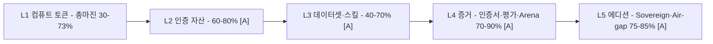
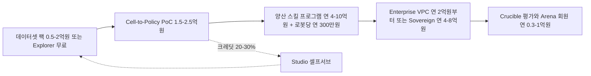
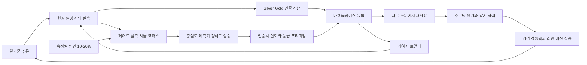
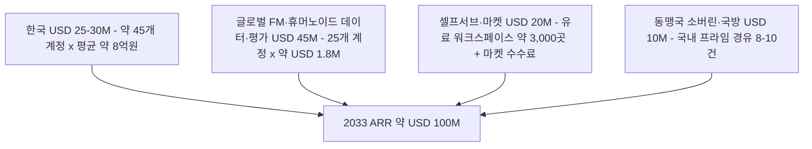
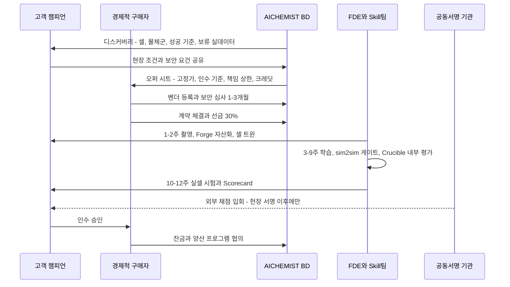
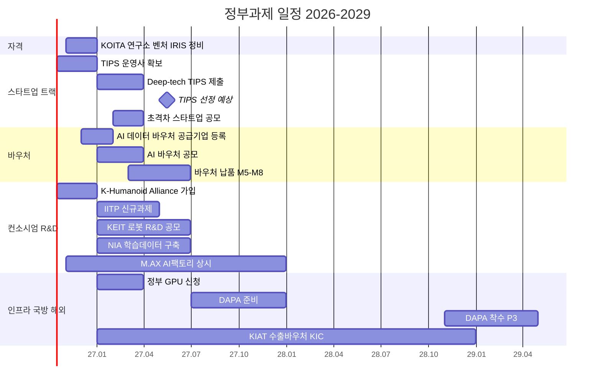
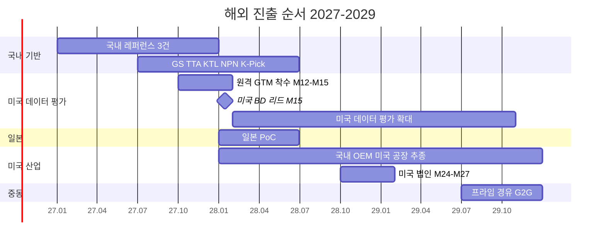

# 10. 사업모델과 GTM: 컴퓨트는 원가에, 가치는 증명에

> **문서 번호** 10 · **기준일** 2026-10-06 · **버전** v1.1(DR v1.1 §16 Errata 반영) · **상위 문서** [README](README.md)
> **관련 문서** [01 비전·포지셔닝](01-vision-positioning.md) · [02 시장·경쟁](02-market-competition.md) · [03 엔진 선정·Build vs Buy](03-engine-selection-build-vs-buy.md) · [04 시스템 아키텍처](04-system-architecture.md) · [05 물리·현실감](05-physics-and-realism.md) · [06 사용성·에이전트](06-usability-and-agent.md) · [07 학습 모듈](07-training-module.md) · [08 도메인 팩](08-domain-packs.md) · [09 로드맵·조직·예산](09-roadmap-organization-budget.md) · [11 리스크·KPI·컴플라이언스](11-risk-kpi-compliance.md) · [12 90일 실행](12-execution-90days.md) · [부록 A 기술 카탈로그](appendix-a-technology-catalog.md) · [부록 B 출처·검증](appendix-b-sources-verification.md)
> **표기** **[A]** 계획 가정(실적 확인 전까지 목표치) · **[U]** 1차 출처 미확인(대외 사용 전 [11 §7](11-risk-kpi-compliance.md) 절차로 재검증) · 태그 없는 사실은 GitHub·PyPI·SkyPilot 가격 카탈로그로 확인된 값 · ₩억 = 1억 원, 1 USD = ₩1,400 [A] · 모든 매출 수치는 예측이 아닌 목표 · M1 = 2026년 11월, P0 = M1–M4(2026.11–2027.02), P1 = M5–M12(2027.03–2027.10), P2 = M13–M24(2027.11–2028.10), P3 = M25–M36(2028.11–2029.10) · DR = 결정 기록(전 문서의 단일 기준)

---

## 핵심 요약

- **수익 공식은 하나다. GPU 시간은 원가 근처(총마진 하한 30%)로 팔아 사용량을 키우고, 이익은 인수 기준이 숫자로 박힌 결과물과 인증서에서 회수한다.** 좌석 과금은 없고 뷰어·리뷰어 좌석은 무료·무제한이다. NVIDIA 런타임에 닿는 매출 라인은 서면 약관이 오기 전까지 목표에 넣지 않았다.
- **매출은 6개 상업 라인과 1개 정부 용역 범주로 관리한다.** Athanor Data·Skill·Forge·Crucible, Studio·Cloud, Sovereign·Air-gap이 상업 라인이고, 정부 데이터 구축·NRE 용역은 별도로 보고한다. 목표는 2027년 ₩15억 → 2028년 ₩45억 → 2029년 ₩110억, 연말 ARR은 ₩3억 → ₩20억 → ₩70억이다.
- **엔지니어 시간 지수가 곧 마진이다.** 12주 Cell-to-Policy PoC 1건(₩2.0억)의 총마진은 지수 100에서 약 39%, 65에서 약 53%, 25에서 약 70%다 [A]. G1(M11, 심의 2027-09-24)의 '라인 총마진 50% 이상'은 §6.4의 완전원가 기준이며, 지수를 약 70 아래로 낮춰야만 통과한다.
- **마켓플레이스는 매출 라인이 아니라 해자 엔진이다.** 75/25 배분, 기여자 로열티, Bronze→Gold 최대 5배 가격 프리미엄, 측정권 할인 10–20%가 맞물려 "주문이 자산을 만들고, 자산이 다음 주문의 원가를 낮추는" 루프를 돌린다. 핵심 지표는 수수료가 아니라 재사용률(20% → 35% → 45%)이다.
- **한국만으로는 USD 100M ARR에 닿지 않는다.** 한국 SAM은 연 ₩150–800억, 단일 벤더 상한은 ARR USD 20–30M [U]이다. 2033년 USD 100M은 글로벌 로봇 파운데이션모델·휴머노이드 기업 대상 데이터·평가(M12–M15 착수, 2033년 약 USD 45M)가 있어야 성립한다.
- **밸류에이션은 다섯 숫자가 정한다.** 2029년에 총마진 60% 이상, 반복매출 50% 이상, NRR 120% 이상, 결과물당 엔지니어 시간 연 50% 감소, 정부재원 15% 이하를 충족해야 소프트웨어·데이터 인프라 멀티플을 받는다. 못 미치면 서비스 멀티플이다. Series A ₩80억(M5 전환 조건부 브리지 ₩20억 + M10 ₩30억 + M12 ₩30억, [09 §9.2](09-roadmap-organization-budget.md))과 Series B ₩250억(M25–M28)은 이 다섯 숫자의 궤적으로 조달한다. 브리지를 먼저 받는 이유는 월말 현금이 M4 약 ₩4억, M9 약 ₩5억까지 내려가기 때문이다. Series A 가격은 실적 배수가 아니라 해자 KPI와 G1 통과로 방어한다(§8.3.1).
- **GTM은 '재벌 본사'가 아니라 '재벌 공급망과 로봇 OEM'을 겨눈다.** NVIDIA Inception → NPN(M10) co-sell과 그룹 SI 리셀러로 조달 장벽을 넘고, 정부과제에서는 컨소시엄 안의 인프라 공급자로 TRL 4→7 공통 키트를 재사용한다. 해외는 미국 데이터·평가(원격 우선) → 일본 PoC(2028 H1) → 미국 산업 고객(2028–2029) → 중동(2029 이후) 순이다.

---

## 1. 사업모델 원칙

**결론: 시뮬레이터 좌석의 가격은 0으로 수렴했다. AICHEMIST는 컴퓨트를 원가 근처에서 팔아 사용을 넓히고, 마진은 "현실에서 작동한다는 증거"에서 받는다.**

### 1.1 왜 이 모델인가

세 가지 구조 변화가 가격 결정권의 위치를 옮겼다.

| 구조 변화 | 확인된 사실 | 가격 결정권에 주는 의미 |
|---|---|---|
| 엔진의 무료화 | Newton 1.6.1(Apache-2.0, Linux Foundation), MuJoCo 3.15.0, PhysX SDK 5.11(코어 Apache-2.0), Isaac Lab 소스(BSD-3)가 모두 무료다. MuJoCo는 2026년 7–10월에 마이너 5회, Newton은 1.0 이후 7개월간 마이너 6회를 냈다 | 시뮬레이터 좌석·엔진 라이선스로는 가격을 지킬 수 없다. 좌석 과금 모델의 상한은 0으로 수렴한다 |
| 컴퓨트 원가의 투명화 | SkyPilot 카탈로그로 공개 단가가 확인된다(RunPod RTX PRO 6000 $2.09, L40S $1.09, H100 PCIe $2.89, AWS 서울 RTX PRO 6000 $4.135/시간) | 고객이 원가를 안다. GPU 시간에 큰 마크업을 붙이면 고객은 클라우드로 직접 간다 |
| 증거의 희소성 | 고객의 1순위 불만은 "합성 데이터가 충분히 좋은지 증명할 수단이 없다"이다. 어떤 엔진도 현실에 균일하게 충실하지 않다(GAUGE·GPUSimBench, 수치 [U]) | 희소한 것은 시뮬레이션이 아니라 측정된 sim-to-real 점수다. 구매자는 그 숫자를 계약서에 쓸 수 있을 때 돈을 낸다 |

### 1.2 일곱 가지 운영 원칙

| # | 원칙 | 운영 규칙 | 위반 시 경보 |
|---|---|---|---|
| 1 | 컴퓨트는 원가 근처 | 토큰 가격은 분기마다 실제 풀 원가로 다시 계산한다. 항목별 총마진 하한은 30%다 | 분기 재산정에서 항목 마진이 30% 미만 |
| 2 | 가치는 결과물과 인증서에서 | 모든 결과물 SKU는 계약서에 숫자로 된 인수 기준을 단다(mAP 비율, 성공률 갭 %p, Pearson r, 궤적 오차) | 인수 기준 없는 계약 서명 시도 |
| 3 | 좌석은 무료 | 뷰어·리뷰어는 무제한이다. 과금은 작업(토큰)과 결과물에만 붙는다 | 좌석 기반 견적 요청 시 영업 교육 |
| 4 | NVIDIA 런타임 연동 라인은 약관과 연동 | 호스팅 RTX 세션, 온프렘 RTX 번들, NuRec 기반 상품은 서면 조건이 오기 전까지 계획 매출에서 뺀다 | 해당 라인 견적 발행 시도 |
| 5 | 정부재원 매출은 분리 | 바우처·정부 용역은 '정부재원 매출'로 따로 보고하고 상업 ARR에 넣지 않는다. 2028년부터 매출의 40% 이하 | 분기 비중 40% 초과 |
| 6 | 결과물에서 셀프서브로 | 결과물 계약 금액의 20–30%를 12개월 유효 CEN 토큰으로 구성한다. 생산화 게이트(무개입 80%, 라인 총마진 60%(§6.4 완전원가), 서면 라이선스 근거)를 통과한 라인만 셀프서브로 연다 | 게이트 미통과 라인의 셀프서브 출시 |
| 7 | 데이터권이 가격 변수 | 측정권(페어드 데이터의 익명화 재사용)을 허락하면 10–20% 할인한다 | 분기 측정권 고객 목표 미달 |

### 1.3 검토한 대안

| 대안 | 장점 | 치명적 약점 | 결정 |
|---|---|---|---|
| 좌석 라이선스(UE 비게임 좌석 연 약 $1,850 [U]를 기준점으로) | 매출 예측이 쉽다 | NVIDIA가 엔진을 무료로 주는 시장에서 가격이 0으로 수렴한다. 좌석이 늘수록 조직 확산이 막힌다 | **기각** |
| GPU 시간 순수 미터링 | 셀프서브 확장이 쉽다 | 원가가 공개돼 있어 마진이 압착된다. 하이퍼스케일러·네오클라우드와 가격 경쟁을 한다 | **보조 수단**(토큰)으로만 |
| NRE·SI 용역 | 즉시 매출이 난다 | 서비스 멀티플을 받고, 재벌 SI 계열사에 흡수된다 | **기각**(정부 용역은 별도 범주로만 허용) |
| 결과물 + 인증서 + 원가 근처 컴퓨트 | 지불 의사가 가장 높고, 주문마다 자산·코퍼스가 쌓인다 | 서비스화 함정 | **채택.** 생산화 게이트, FDE 상한(결과물 매출 ₩8억당 1명), 엔지니어 시간 지수로 통제 |

### 1.4 가치 포착 계층

| 계층 | 대표 SKU | 목표 총마진 | 가격 결정 기준 | 마진을 올리는 레버 |
|---|---|---|---|---|
| L1 컴퓨트 | CEN 토큰(RT·TRAIN·LIGHT) | 30–73%(DR §10.2) | 풀 원가 + 하한 30% | 자체 RT 서버 가동률, 풀 라우팅 |
| L2 인증 자산 | 인증 트윈(물체·셀·현장) | 60–80% [A] | 인증 등급(Bronze→Gold) | Forge 무개입 비율, 자산 재사용 |
| L3 데이터셋·스킬 | 데이터셋 팩, PoC, 양산 스킬 프로그램 | 40–70% [A] | 구매자 ROI(라벨링·사내 팀 대체) | 엔지니어 시간 지수, 템플릿 |
| L4 증거 | 인증서 발급, Crucible 평가, Arena 회원 | 70–90% [A] | 제3자 공동서명의 신뢰 | 결정론적 재현, 과제 스위트 재사용 |
| L5 에디션 | Sovereign, Air-gap | 75–85% [A] | 연 라이선스 | 서명 SBOM·설치기 자동화 |

- **혼합 총마진 목표:** 2027년 약 45% → 2028년 약 52% → 2029년 약 60%. 믹스를 L1·L3에서 L4·L5 쪽으로 옮기고, L3의 엔지니어 시간을 줄여 달성한다.

---

## 2. 6개 매출 라인과 수익 구조

**결론: 매출은 6개 상업 라인과 1개 정부 용역 범주로 관리한다. 2029년에는 Skill·Data가 매출의 43%, 반복매출 성격이 강한 Studio·Cloud와 Sovereign·Air-gap이 28%를 차지하도록 믹스를 옮긴다.**

### 2.1 라인별 정의와 목표

| 라인 | 무엇을 파는가 | 과금 단위 | 매출 인식 [A] | ARR 산입 | 목표 총마진 [A] | 2027 | 2028 | 2029 |
|---|---|---|---|---|---|---|---|---|
| ① Athanor Data | 합성 멀티모달 데이터셋 팩, 증강, VLA 시연 데이터 팩 | 팩 단위(₩5,000만–2억) | 인수 시험 통과 시점 | 아니오(연간 리프레시 계약은 예) | 55–70% | 5.0 | 11.0 | 22.0 |
| ② Athanor Skill | Cell-to-Policy PoC, 양산 스킬 프로그램, 런타임 | PoC 고정가, 연 프로그램료 + 로봇당 런타임 | PoC는 마일스톤·인수, 프로그램·런타임은 기간 안분 | 프로그램·런타임 예 | 40–65% | 5.5 | 13.0 | 25.0 |
| ③ Athanor Forge | 인증 트윈(물체·셀·현장) | 자산·셀·현장 단위 | 납품·인증서 발행 시점 | 아니오 | 60–80% | 1.5 | 5.0 | 10.0 |
| ④ Athanor Crucible | 평가 캠페인, 인증서 발급, Arena 회원 | 캠페인, 인증서 건, 연회비 | 리포트 납품 시점, 회비는 기간 안분 | 회원 예 | 70–90% | 0.5 | 4.0 | 12.0 |
| ⑤ Studio·Cloud | 구독, 토큰, Enterprise VPC, 마켓 수수료 | 월·연 구독, 토큰 소비, 수수료 25% | 구독은 안분, 토큰은 사용 시점, 수수료는 거래 시점 | 구독·VPC·12개월 이상 약정 토큰 예 | 50–70% | 0.5 | 5.0 | 16.0 |
| ⑥ Sovereign·Air-gap | 온프렘·국내 소버린 클라우드, 국방 에어갭 | 연 라이선스 + 초과 GPU당 요금 | 라이선스·지원 분리 인식(K-IFRS 1115 판단 필요 [U]) | 예 | 75–85% | 0.0 | 3.0 | 15.0 |
| (별도) 정부 데이터 구축·NRE 용역 | NIA 구축 사업, 정부 용역, 공동개발 NRE | 과제·용역 계약 | 진행률 | 아니오 | 25–40% | 2.0 | 4.0 | 10.0 |
| **합계** | | | | | **~45% / ~52% / ~60%** | **15.0** | **45.0** | **110.0** |

- **정부재원 매출의 위치:** 2027년 정부재원 ₩6.0억(40%)은 정부 용역 ₩2.0억과, Data·Forge 라인 안에서 결과물 SKU로 납품하는 바우처 약 ₩4.0억으로 구성된다 [A]. 2028년 ₩9.0억은 용역 ₩4.0억 + 바우처 약 ₩5.0억, 2029년 ₩12.0억은 용역 ₩10.0억 + 바우처 약 ₩2.0억이다 [A].
- **ARR 정의(IR 각주로 고정):** 연말 시점에 계약상 연환산되는 반복 계약가치다. 포함 항목은 구독, Enterprise VPC, Sovereign·Air-gap 연 라이선스·지원, 양산 스킬 프로그램 연 기본료, 로봇당 런타임, Arena 회비, 12개월 이상 약정 토큰이다. PoC, 데이터셋 팩, 건별 인증서, 단발 평가 캠페인, 정부 용역, 바우처는 넣지 않는다. 실사에서 가장 먼저 깎이는 숫자이므로 정의를 바꾸지 않는다.

### 2.2 라인별 돈 버는 방식

| 라인 | 첫 매출 | 반복으로 바뀌는 지점 | 마진이 오르는 이유 | 핵심 선행지표 |
|---|---|---|---|---|
| ① Data | M4 첫 데이터셋 계약(₩0.5억 이상) | 연간 리프레시 계약(신규 SKU·조명·시즌 추가) | 한국 SKU 라이브러리 재사용. 두 번째 고객부터 촬영 비용이 사라진다 | 재사용률, 합성 전용 mAP 비율 |
| ② Skill | M5 PoC 판매 개시 | PoC → 양산 프로그램(연 ₩4–10억) + 로봇당 연 ₩300만 런타임 | 템플릿·Mimic 증강·에이전트로 엔지니어 시간 지수가 100 → 15로 내려간다 | PoC → 양산 전환율(목표 50% [A]), 정책 갭 %p |
| ③ Forge | P0 내부 Silver 자산, P1 판매 | 셀프서브 Forge(토큰 과금, M15 GA 이후) | 무개입 비율 30% → 90% | 영상 → Bronze 자산 시간, 무개입 비율 |
| ④ Crucible | M12 K-Pick Challenge 이후 캠페인 | Arena 연회비, 정책 버전마다 반복되는 평가 | 과제 스위트와 결정론적 재현 하네스를 매번 재사용한다 | Arena 회원 수, 인증서 인용 PO |
| ⑤ Studio·Cloud | M9 초대제 베타(Builder, Zone T 전용). 공개 가입은 M15 GA | 구독 + 결과물 크레딧 소진 후 유료 토큰 | 무료 등급 원가 통제, 자체 RT 서버 비중 확대 | 결과물 → 셀프서브 전환율(25% → 50% → 60%. P1은 베타 워크스페이스 활성화, P2부터는 크레딧 외 유료 사용 기준, [11 §3.3](11-risk-kpi-compliance.md)) |
| ⑥ Sovereign·Air-gap | M14 베타 설치, M18 GA | 연 라이선스 자체가 반복매출 | 서명 SBOM·에어갭 설치기 자동화로 설치 공수가 고정된다 | 첫 온프렘 유료 설치(G2), GPU 증설 |

### 2.3 2029년 목표 ₩110억의 바텀업 구성 [A]

| 라인 | 국내 구성 | 해외 구성 | 합계(DR) |
|---|---|---|---|
| ① Data | 데이터셋 팩 10건 × 평균 ₩1.0억 = 10.0 | 미국 FM·휴머노이드용 VLA 데이터 팩 12.0 | **22.0** |
| ② Skill | 양산 프로그램 3건 × ₩5.0억 = 15.0, PoC 2건 × ₩2.0억 = 4.0, 런타임 로봇 100대 × ₩300만 = 3.0 | 해외 PoC·스킬 3.0 | **25.0** |
| ③ Forge | 물체 인증 트윈 약 750개 × 평균 ₩40만 = 3.0, 셀·현장 트윈 4건 × ₩1.0억 = 4.0 | 해외 인증 자산 3.0 | **10.0** |
| ④ Crucible | Arena 회비(연중 평균 약 14곳) 5.0, 평가 캠페인·인증서 1.0 | 해외 Arena 회원 2곳 2.0, 해외 평가 캠페인 10건 × ₩0.4억 = 4.0 | **12.0** |
| ⑤ Studio·Cloud | Builder 약 3.0, Team 약 2.2, Enterprise VPC 2건 × ₩2.0억 = 4.0, 초과 토큰 0.8 | 해외 셀프서브·마켓 수수료 6.0 | **16.0** |
| ⑥ Sovereign·Air-gap | Sovereign 3개 사이트 10.5, Air-gap 첫 계약(연중 일부, 앵커 계약 전제¹) 4.5 | — | **15.0** |
| 정부 용역 | 정부 데이터 구축·NRE 10.0 | — | **10.0** |
| **합계** | **80.0** | **30.0(27%)** | **110.0** |

- **해석:** 국내 ₩80억 중 정부재원 ₩12억을 빼면 국내 상업 매출은 ₩68억이다. 한국 SAM 중간값(약 ₩477억, [02 §1.2](02-market-competition.md))의 약 14%다. 해외 ₩30억은 데이터(12)·평가(6)가 60%를 차지한다. USD 100M 경로의 씨앗이 이 두 줄이다.
- ¹ **Air-gap ₩4.5억의 전제 [A]:** 기준 시나리오는 M25(2028.11) 이전에 확정 금액 ₩5억 이상의 조선·국방 앵커 계약(조선사 공동개발 또는 국방 과제) 1건을 가정한다. 기준안의 2028년 말 ARR 목표가 ₩20억이므로 M25 시점에 'ARR ₩30억' 트리거는 충족되지 않는 것이 기본 경로이고, Wave 3 착수는 이 앵커 계약에 달려 있다([02 §8](02-market-competition.md) 'W5 트리거의 현실', DR §16 #25). 국방 Air-gap 에디션은 M27부터다.
  - 앵커 계약이 없으면 Air-gap ₩4.5억은 2030년으로 넘어가고, 2029년 기준 매출은 약 ₩105억이 된다. 이 경우는 하방 시나리오(₩60억, 'Wave 3 미발동')와 다르다. 다른 라인이 기준 경로대로 가면 하방이 아니라 '앵커 없는 기준안'이다.
  - IR 자료에서 2029년 ₩110억을 쓸 때는 이 전제를 각주로 함께 적는다.

---

## 3. CEN 토큰 가격과 원가 근거

**결론: 1 토큰 = ₩100이다. GPU 시간은 공개 원가 대비 30–73% 총마진으로 묶어 두고, 마진이 하한에 붙는 경로(서울 대화형, 고원가 TRAIN, 스토리지·이그레스)는 라우팅과 분기 재산정으로 관리한다.**

### 3.1 토큰 가격표(DR §10.2 고정값)

| 토큰 항목 | 가격 | 원가 근거 | 총마진 |
|---|---|---|---|
| RT GPU-시간(배치: 자체 서버·네오클라우드) | 60 토큰(₩6,000) | 자체 RTX PRO 6000 상각 + 전력, 가동률 60%에서 약 ₩1,600 [A]. RunPod $2.09(₩2,926) | 51–73% |
| RT GPU-시간(서울 거주 대화형·데이터 거주) | 95 토큰(₩9,500) | AWS 서울 RTX PRO 6000 $4.135(₩5,789) | 약 39%(국내 CSP 단가는 [U]) |
| TRAIN GPU-시간(H100급) | 80 토큰(₩8,000) | 네오클라우드 $2.89–3.99(₩4,046–5,586) | 30–49%. 서울 하이퍼스케일러 H100($9.49/GPU-시간)은 쓰지 않는다 |
| LIGHT 시간(L4·CPU) | 20 토큰(₩2,000) | RunPod L4 $0.49(₩686), AWS 서울 L4 $0.99(₩1,386) | 31–66%. 무료 등급에는 월 5시간 포함 |
| 합성 이미지 | 래스터 ₩0.3, RTX 실시간 ₩1.5, 패스트레이싱 ₩15 | 리서치 하한(래스터 ≥$0.0001, RTX ≥$0.0005, 패스 ≥$0.005)의 약 2배 | — |
| 스토리지·이그레스 | ₩40,000/TB-월, ₩150/GB | 프레임 100만 장당 약 $126/월, 이그레스 약 $495 | 별도 미터링. 리서치 원가 기준 16–20%로 하한 미달이라 **원가 회수 품목**(§3.2 경고) |

### 3.2 원가 산식과 검산

| 항목 | 원가 산식 | 원가(₩/단위) | 가격(₩) | 총마진 산식 | 결과 |
|---|---|---|---|---|---|
| 자체 RT(RTX PRO 6000) | 서버 ₩1.6억 ÷ 8장 = 장당 ₩2,000만. 3년 정액 상각 ÷ (8,760시간 × 가동률 60%) = ₩1,268. 전력·코로케이션 약 ₩330(벽시계 시간당 약 ₩200 ÷ 0.6) [A] | 약 1,600 | 6,000 | (6,000 − 1,600) ÷ 6,000 | **73%** |
| RT 네오클라우드 | RunPod $2.09 × ₩1,400 | 2,926 | 6,000 | (6,000 − 2,926) ÷ 6,000 | **51%** |
| RT 클라우드 혼합(DR 예산 단가) | $2.3 × ₩1,400 | 3,220 | 6,000 | — | 46% |
| RT 서울 대화형 | AWS 서울 $4.135 | 5,789 | 9,500 | (9,500 − 5,789) ÷ 9,500 | **39%** |
| TRAIN 저원가 | $2.89 | 4,046 | 8,000 | (8,000 − 4,046) ÷ 8,000 | **49%** |
| TRAIN 고원가 | $3.99 | 5,586 | 8,000 | — | **30%** |
| TRAIN 서울 하이퍼스케일러(금지) | $9.49 | 13,286 | 8,000 | — | **−66%** |
| LIGHT | $0.49 / $0.99 | 686 / 1,386 | 2,000 | — | **66% / 31%** |
| 래스터·RTX·패스 이미지 | 하한 × ₩1,400 | 0.14 / 0.70 / 7.0 | 0.3 / 1.5 / 15 | — | 약 2.1배 |
| 스토리지 | S3 Standard $0.023/GB-월 → TB당 약 ₩32,200 | 32,200 | 40,000 | — | 약 20% |
| 이그레스 | $0.09/GB | 126 | 150 | — | 약 16% |

**자체 RT 서버 가동률 민감도 [A]**

| 가동률 | 상각(₩/시간) | 전력·코로케이션(₩/시간) | 원가 합계 | 60 토큰 총마진 | 운영 결정 |
|---|---|---|---|---|---|
| 40% | 1,903 | 500 | 2,403 | 60% | 2호기(M13) 구매 보류 |
| 60%(기준) | 1,268 | 330 | 1,598 | 73% | 계획대로 |
| 80% | 951 | 250 | 1,201 | 80% | 클라우드 버스트 확대, 3호기는 공격안에서만 |

- **스토리지·이그레스 정합성 경고:** DR 단가(₩40,000/TB-월, ₩150/GB)를 리서치 원가(AWS S3 기준)에 대면 총마진이 16–20%로, 하한 30%보다 낮다. 이 항목은 '원가 회수 품목'으로 분류하고, 자체 SeaweedFS·Ceph RGW 저장소(TB-월 원가 ₩28,000 이하 목표 [A])로 옮겨 30%를 맞춘다. 2027 Q1 첫 분기 재산정에서 실측 원가로 다시 판정한다.
- **서울 대화형 단가:** 국내 CSP의 RT GPU 단가가 확인되면(V4, M2) 서울 경로를 국내 CSP로 바꾸고 95 토큰의 마진을 다시 계산한다.

### 3.3 포함 토큰의 실효 단가와 함정

| 상품 | 가격 | 포함 토큰(액면) | 실효 토큰 단가 | 가장 불리한 사용(TRAIN 고원가 $3.99) | 대응 규칙 [A] |
|---|---|---|---|---|---|
| Builder | 월 ₩99,000 | 1,000(₩100,000) | ₩99 | 80 × ₩99 = ₩7,920 vs 원가 ₩5,586 → 29% | 사실상 선불. 가치는 템플릿에 있다 |
| Team | 월 ₩190만 | 25,000(₩250만) | ₩76 | 80 × ₩76 = ₩6,080 vs ₩5,586 → **8%** | 포함 토큰의 TRAIN 사용은 $3.0/시간 이하 풀로만 라우팅. 포함 토큰은 월 단위 소멸 |
| 결과물 크레딧 | 계약 금액의 20–30% | 계약 안 | ₩100 | 30% | 12개월 유효. 미사용분은 기간 만료 시 매출 인식(회계 확인 [U]) |
| Explorer(무료) | ₩0 | LIGHT 월 5시간 | — | 사용자당 월 ₩3,430–6,930 원가 | 무료 사용자 1,000명 기준 연 약 ₩0.8억. 마케팅비로 관리, '비신뢰' 전용 노드 풀 |

### 3.4 토큰 운영 규칙

1. **풀 라우팅:** 배치 RT는 자체 서버 → 네오클라우드 순으로 보낸다. 서울 리전은 데이터 거주·지연 요건이 있는 대화형 세션에만 쓴다.
2. **TRAIN 금지 경로:** 서울 하이퍼스케일러 H100은 어떤 경우에도 토큰으로 팔지 않는다(마진 −66%).
3. **분기 재산정:** 매 분기 첫 달에 실제 풀 원가로 항목별 마진을 다시 계산한다. 30% 미만 항목은 가격 또는 라우팅을 바꾼다.
4. **세션 과금 단위:** RTX PRO 6000 MIG가 검증되기 전([11 §7](11-risk-kpi-compliance.md) #17)에는 세션당 GPU 1장 단위로 과금한다.
5. **대량 선구매:** 할인은 항목별 총마진 30% 하한 안에서만 허용하고 CEO가 승인한다.

---

## 4. SKU 체계: 구독·에디션·결과물

**결론: 고객은 세 개의 문으로 들어온다. 무료 Explorer(확산), 결과물 SKU(가장 큰 매출), 에디션(가장 높은 반복매출)이다. 모든 결과물 SKU에는 숫자로 된 인수 기준이 붙는다.**

### 4.1 구독·에디션 SKU(DR §10.3 고정값)

| SKU | 가격 [A] | 포함 내용 | 시작 시점 | 주 구매자 | 다음 단계 |
|---|---|---|---|---|---|
| **Explorer** | 무료 | 브라우저 뷰어(WebGPU, 미지원 브라우저는 WebGL2), MuJoCo CPU 샌드박스, Bronze Forge 변환 월 3회, LIGHT 5시간 | M9 초대제 베타(대기자 명단·주간 승인 상한, Zone T 전용), 공개 가입은 M15 GA | 연구자, 학생, 협력사 엔지니어 | Builder, 데이터셋 문의 |
| **Builder** | 월 ₩99,000 / 워크스페이스 | 1,000 토큰, 템플릿 | M9(베타, Zone T 전용), M15 GA | 스타트업, 연구실 | Team |
| **Team** | 월 ₩190만 | 편집 좌석 5석(리뷰어·뷰어 좌석은 무료·무제한), 25,000 토큰, 프라이빗 마켓플레이스 | M15 | 로봇 OEM 내부 팀, 1·2차 협력사 | Enterprise VPC |
| **Enterprise VPC** | 연 ₩2억부터 | 국내 CSP 또는 고객 VPC, SSO, SLA, 예약 RT GPU 4장. RTX는 고객 자체 라이선스로 고객이 운영(BYOL) | M15 | 대기업 계열, 로봇 OEM | Sovereign |
| **Athanor Sovereign**(온프렘·국내 소버린 클라우드) | 플랫폼 연 ₩2.5억(16 GPU·20석 이하) + 초과 GPU당 연 ₩1,200만. 일반 거래 연 ₩4–8억 | 허용형 코어, 서명 SBOM, 텔레메트리 없음, 지원 SLA | 베타 M14, GA M18 | 재벌 계열 공장, 조선 | 양산 스킬 프로그램, Arena |
| **Athanor Air-gap**(국방) | 연 ₩8–15억 | 오프라인 업데이트, 인증 지원, 상주 엔지니어 | M27 이후(트리거 조건부) | ADD, 방산 프라임 | 국방 과제 |

- **베타 운영 규칙:** M9 베타는 Zone T 전용이다. Explorer는 공개 가입이 아니라 대기자 명단에서 주간 승인 상한만큼 초대한다. 상한은 RT GPU 풀(자체 16장 계획) 여유 용량과 '비신뢰' 노드 풀 원가(§3.3)에 맞춰 Product Lead(M8 착석 전에는 CTO 대행)가 주마다 정한다 [A]. 공개 가입과 Studio GA는 M15다.
- **셀프서브 인증서:** Bronze 셀프서브 인증서는 Forge 서비스 계정이 자동 서명한다. `cert.issue`는 에이전트가 단독으로 호출할 수 없다([06](06-usability-and-agent.md), DR §10.3). Silver·Gold 인증서는 Head of Fidelity 조직의 서명을 거친다.

### 4.2 결과물 SKU와 구매자 ROI(DR §10.4 고정값 + ROI 계산 예)

| 결과물 | 가격 [A] | 인수 기준(계약서 명시) | ROI 계산 예 [A] |
|---|---|---|---|
| **인증 트윈: 물체** | ₩30만–150만(Bronze→Gold) | 인증 등급, 궤적·정지 자세 오차 임계 | 고객이 직접 하면 물체당 엔지니어 1–3일. 일당 약 ₩70만(₩1,400만 ÷ 20일)이면 ₩70만–210만이 든다. Gold의 랩 실측은 고객이 재현하기 어렵다 |
| **인증 트윈: 셀·현장** | ₩3,000만–1.5억 | 지정 지표의 Scorecard 값 | 직접 비용 대체(엔지니어 2명 × 4–8주 ≈ ₩0.28–0.56억)로 하단 가격대가 정당화된다. 상단은 Scorecard 인수 기준과 재사용 가치에서 나온다 |
| **합성 멀티모달 데이터셋 팩** | ₩5,000만–2억 | 합성 전용이 실데이터 학습 mAP의 90% 이상, 또는 합성 + 실데이터 10%가 실데이터 100% 이상. 단, 첫 데이터셋 계약(M3–M4)의 인수 하한은 합성 전용 mAP 비율 0.85(P0 KPI), 목표 0.90이다. 정가 계약(P1 이후)의 기준은 0.90이다 | 실데이터 30만 장 × 장당 ₩300–3,000 = ₩0.9–9억과 3–6개월을 대체한다 |
| **Cell-to-Policy PoC**(12주, 고정가) | ₩1.5–2.5억, 선금 30%, 산출물 전용 | 지정 실셀 성공률, sim-to-real 갭 ≤15%p, 정책 5개 이상 r 보고. 책임 상한 = 계약 금액. 운영 범위(조명·물체군) 명시 | 사내 팀(시니어 3–4명 × 6–12개월 = 18–48 HM ≈ ₩2.5–6.7억) 대비 비용 1.3–3.4배 절감, 일정 3–9개월 단축 |
| **양산 스킬 프로그램** | 연 ₩4–10억 + 런타임 로봇당 연 ₩300만 | 현장 KPI(피킹 성공률, 사이클 타임)와 재학습 SLA | 예: 셀 10개 × 2교대 × 작업자 2명 × 연 ₩5,000만 = 연 ₩20억 인력비 영향. 프로그램 ₩6억 + 런타임 ₩0.3억이면 회수 4개월 안쪽(로봇 하드웨어 별도) |
| **Crucible 평가 캠페인** | 정책 버전당 ₩2,000만–6,000만 | 신뢰구간이 붙은 성공률, sim/real r, 서명 리포트 | 실셀 시험 2–4주 × 엔지니어 3명(₩0.4–0.8억)과 현장 실패 리스크를 줄인다 |
| **Arena 회원** | 연 ₩3,000만(스타트업), ₩1억(대기업) | 공동서명 인증서, 리더보드 | 조달·투자 유치용 제3자 증빙 |
| **인증서 발급** | 자산 클래스당 ₩500만. 로봇-과제 인증서 ₩3,000만–1억 | Gold는 랩 실측 | 고객 내부 검증 절차를 대체한다 |

### 4.3 계약 장치: 결과물 크레딧, 측정권 할인, 도구 이전 SKU

| 장치 | 규칙 | 회계·운영 처리 [A] | 목적 |
|---|---|---|---|
| 결과물 크레딧 | 계약 금액의 20–30%를 12개월 유효 CEN 토큰으로 구성(계약 금액 안) | PoC ₩2.0억에 25% → ₩0.5억(50만 토큰)은 이연 매출. 사용 시 인식, 만료 미사용분은 만료 시점 인식(K-IFRS 1115 해석 확인 [U]) | 결과물 고객을 Studio로 끌어들인다 |
| 측정권 할인 | 페어드 데이터 익명화 재사용을 허락하면 10–20% 할인. 첫 계약 3건에서 조항을 시험 | 할인은 계약가에서 차감. 측정 데이터는 코퍼스로 귀속 | 해자(페어드 코퍼스) 축적 |
| 도구 이전 SKU | PoC 뒤에도 Forge·Kernel·인증 IP와 도구는 AICHEMIST 라이선스로 남는다. 고객이 도구를 원하면 별도 라이선스로 판다 | 가격은 Sovereign 에디션 가격표를 준용한다(플랫폼 연 ₩2.5억부터) | 재벌 내재화 차단, 반복매출 전환 |

### 4.4 Land-and-Expand 경로

- **계정당 ACV 사다리 [A]:** 첫해 ₩0.5–2.5억(데이터셋 또는 PoC) → 2년 차 ₩4–10억(양산 프로그램) → 3년 차 ₩6–15억(프로그램 + Sovereign + Arena). NRR 목표 110%(2028) → 120%(2029)는 이 사다리에서 나온다.
- **확장의 전제:** PoC 인수에 실패한 계정은 확장되지 않는다. 그래서 PoC 운영 범위(조명·물체군)를 좁게 정의하고, 인수 기준은 측정 가능한 숫자로만 쓴다.

### 4.5 Domain Pack과 Wave 밖 요청의 가격 처리

- **범용성과 판매 순서는 다르다.** 플랫폼은 OpenUSD 단일 장면, 엔진 중립 Sim Kernel API, Domain Pack으로 로봇·차량·드론·선박·공장을 같은 방식으로 받는다([08](08-domain-packs.md)). Wave 1→3은 '어디서 먼저 돈을 버는가'의 순서다.
- **Domain Pack에는 별도 가격표를 만들지 않는다.** 차량 Mobility Pack α(M18–M24), 드론 PX4 SITL 템플릿(M20–M24), 해양 팩(P3)도 위 SKU(데이터셋 팩, PoC, 인증 트윈, 평가 캠페인)로 판다. 가격표가 하나여야 영업·회계·인수 기준이 하나로 유지된다.
- **Wave 밖 요청:** 해당 팩의 CRL 3 이상, 12주 고정가, 수치 인수 기준, FDE 여유를 모두 충족할 때만 PoC로 받는다([08 §2.4](08-domain-packs.md)).
- **차량:** 도로 자율주행 HIL·인증 도구 시장에서는 정면 경쟁하지 않는다. 그러나 차량 트윈 자체는 만든다. Mobility Pack α(야드·저속 차량 동역학과 도로 시나리오 재생, M18–M24)는 위 SKU로 판다. 도로 AV 시뮬레이터가 필요한 고객은 MORAI와 표준(OpenSCENARIO·OSI·FMI 3.0), 고객 보유 CarMaker·CarSim(BYOL FMU) 경로로 연결한다. 한국 도로 인식 데이터 팩은 MORAI 채널로도 판다(§9.2).

---

## 5. 마켓플레이스 경제학

**결론: 마켓플레이스의 수수료 매출은 2029년 약 ₩1억 [A]으로 작다. 그러나 재사용률 45%를 만들어 Forge·Data 라인의 원가를 낮추고, 인증 등급에 가격 프리미엄을 붙여 측정의 가치를 시장 가격으로 바꾼다.**

### 5.1 거래 규칙과 배분

| 거래 유형 | 판매자 | 배분 | 필수 첨부 | 차단 조건 |
|---|---|---|---|---|
| 제3자 인증 자산 | 외부 판매자(협력사, 로봇 부품사, 촬영 파트너) | 판매자 75 / AICHEMIST 25 | 라이선스 매니페스트(SPDX), 출처(촬영원·동의·익명화), 인증 등급 | 출처 불명, 생성 모델 메타데이터 누락 |
| 제3자 데이터셋 | 외부 판매자 | 75 / 25 | 위 항목 + Run Manifest | 비상업 원천 포함 |
| 1차 자산·데이터셋 | AICHEMIST | 100(기여자 로열티 차감) | 위와 동일 | — |
| 기여자 촬영 기반 자산 | AICHEMIST 또는 제3자 | 매출의 10%를 기여자 로열티로 [A] | 데이터권 약관 동의 기록 | 동의 철회(이후 판매 중단) |
| 비상업 품목 | — | — | — | 상업 워크스페이스에서 자동 차단 |

### 5.2 기여자 로열티 [A]

- **대상:** 익명화된 촬영물이 다른 주문·자산·데이터셋에서 재사용될 때의 원촬영 기여자다. 중소 공장(바우처 고객), 촬영 파트너, 연구실이 해당한다.
- **요율과 지급:** 해당 자산·데이터셋 순매출의 10%, 분기 정산, 최소 지급액 ₩10만. 제3자 판매자의 자산이면 로열티는 판매자 몫(75%)에서 낸다.
- **동의 철회:** 철회 이후의 신규 판매는 중단한다. 이미 납품된 결과물의 사용권은 유지한다(약관 명시).
- **효과:** 협력사가 자기 현장 촬영을 '자산'으로 인식하게 만들어, 측정권 동의율과 코퍼스 성장 속도를 높인다.

### 5.3 인증 등급별 가격 프리미엄 [A]

| 등급 | 측정 근거 | 물체 가격 예 | Bronze 대비 | 판매자 원가 구조 | 프리미엄의 정당화 |
|---|---|---|---|---|---|
| Bronze | VLM 물성 추정 | ₩30만 | 1.0× | Forge 자동 변환(셀프서브는 토큰) | 빠르고 싸다. KPI 집계에서 제외 |
| Silver | 영상 기반 식별(sysid) | ₩70만 | 약 2.3× | 영상 촬영 + 자동 식별 + QA | 궤적·정지 자세 오차가 측정돼 있다 |
| Gold | 랩 실측(질량·마찰·관절) | ₩150만 | 5.0× | Test Cell 실측 + 인증서 | 랩 실측값과 측정 불확도를 인증서에 기록한다(AIC-OBJ-GOLD v1 프로토콜, 불확도 상한은 Head of Fidelity가 측정 프로토콜 v1에서 고정 [A])¹ |

- ¹ **Gold가 파는 것은 '측정값과 그 불확도'다.** 'Forge 자동 추정값의 Gold 랩 실측 대비 질량/마찰 오차 ≤10%/≤20%(P1)'는 VLM 사전분포 + 영상 sysid로 만든 자동 추정이 Gold 실측에 얼마나 가까운지 보는 내부 KPI다([05 §16.1](05-physics-and-realism.md) D4, DR §16 #7). 이 수치를 Gold 자산의 인증 임계나 고객 보증 문구, 판매 페이지 문안으로 쓰지 않는다. 시험기관과 비교하는 지표는 'Gold 랩 실측 재현성'으로 따로 부른다([11 §3.5](11-risk-kpi-compliance.md)).

- **제3자 판매자 예시 [A]:** 그리퍼 부품사가 Gold 자산 20개 클래스 하나를 등록한다. 클래스 인증서 ₩500만을 내고 자산당 ₩100만에 판매해 첫해 60건(₩6,000만 GMV)을 판다. 판매자 몫 ₩4,500만, AICHEMIST 몫은 수수료 ₩1,500만 + 인증서 ₩500만이다.

### 5.4 네트워크 효과 루프

### 5.5 마켓플레이스 지표와 누수 방지

| 지표 | 2027 | 2028 | 2029 | 비고 |
|---|---|---|---|---|
| 2개 이상 주문에서 재사용된 자산 비율 | 20%(P1) | 35%(P2) | 45%(P3) | DR KPI. 해자 축 핵심 |
| 제3자 GMV [A] | ₩0.3억 | ₩1.5억 | ₩4.0억 | 수수료 25% → 2029년 약 ₩1.0억 |
| 인증 등급 리스팅 비중 [A] | 50% | 65% | 75% | Silver/Gold 비중 |
| 활성 기여자 수 [A] | 10 | 40 | 120 | 바우처 고객 중심 |

- **누수 방지:** 자산 ID가 라이선스 매니페스트와 인증서 레지스트리에 묶인다. 인증서는 AICHEMIST 레지스트리 조회로만 검증되므로, 플랫폼 밖 거래 자산은 '인증' 표기를 쓸 수 없다.
- **품질 방어:** 생성 모델 메타데이터가 없는 자산, Hunyuan3D 출력, 비상업 원천 자산은 등록 단계에서 거부한다([11 §4](11-risk-kpi-compliance.md)).

---

## 6. 매출 목표, 시나리오, 단위경제

**결론: 2027–2029 목표는 ₩15억 → ₩45억 → ₩110억이다. 2029년 하방은 ₩60억, 상방은 ₩150억이다. 단위경제의 핵심 변수는 가격이 아니라 엔지니어 시간 지수와 자산 재사용률이다.**

### 6.1 연도별 매출 목표(DR §10.6 고정값, ₩억)

| 라인 | 2027 | 2028 | 2029 |
|---|---|---|---|
| Athanor Data(데이터셋 팩) | 5.0 | 11.0 | 22.0 |
| Athanor Skill(PoC, 양산 프로그램, 런타임) | 5.5 | 13.0 | 25.0 |
| Athanor Forge(인증 트윈·자산) | 1.5 | 5.0 | 10.0 |
| Athanor Crucible(평가, 인증, Arena) | 0.5 | 4.0 | 12.0 |
| Studio·Cloud(구독, 토큰, 마켓플레이스 수수료) | 0.5 | 5.0 | 16.0 |
| Athanor Sovereign·Air-gap 에디션 | 0.0 | 3.0 | 15.0 |
| 정부 데이터 구축·NRE 용역 | 2.0 | 4.0 | 10.0 |
| **합계** | **15.0** | **45.0** | **110.0** |
| 이 중 정부재원 매출(바우처, 정부 용역) | 6.0 (40%) | 9.0 (20%) | 12.0 (11%) |
| 이 중 해외 매출 | 0.0 (0%) | 4.0 (9%) | 30.0 (27%) |
| 반복매출 비중 | ~10% | ~30% | ~50% |
| 혼합 총마진 | ~45% | ~52% | ~60% |
| 연말 ARR | 3 | 20 | 70 |

- **현금 관점:** 24개월 창(M1–M24) 매출 목표는 약 ₩48억(2027년 ₩15억 + 2028년 1–10월 약 ₩33억)이고, 회수 지연 60–90일과 선금을 반영한 창 내 회수액은 약 ₩41억이다. 순현금 소요는 약 ₩81억이다([09](09-roadmap-organization-budget.md)).
- **손익분기:** 기준안에서 2030년 중반(M44 전후)을 목표로 한다 [A].

### 6.2 2027년 분기별 매출 경로 [A]

**정본은 [09 §9.2](09-roadmap-organization-budget.md)의 기간별 매출표(P0 0.3, P1a(M5–M8) 3.7, P1b(M9–M12) 6.7, 2027년 11–12월 4.3)다. 아래 표는 그 값을 달력 분기로 다시 나눈 환산 근사치다.** 기간 안의 월별 배분은 09 §9.2의 월별 현금 회수 비중을 램프로 썼다(P1a의 M5 몫 약 12.5%, P1b의 M12 몫 약 29%) [A]. IR 분기 보고와 현금 브리지는 이 표와 09 기간표가 같은 합계를 갖도록 함께 갱신한다.

| 분기 | 매출(₩억) | 09 기간표에서의 산출 | 주요 구성 | 검증 이벤트 |
|---|---|---|---|---|
| 2027 Q1(M3–M5) | 0.8 | P0 0.3 + P1a 중 M5 약 0.5 | 첫 데이터셋 계약 인수(M4, ₩0.5억 이상), 첫 PoC 계약·선금(M5), 바우처 납품 착수(M5) | G0(M4, 심의 2027-02-26) |
| 2027 Q2(M6–M8) | 3.2 | P1a 중 M6–M8 약 3.2 | 바우처 납품(M6–M8), 첫 PoC 8주 차 시뮬 검증 마일스톤 | 첫 PoC 인수(M7–M8) |
| 2027 Q3(M9–M11) | 4.8 | P1b 중 M9–M11 약 4.8 | PoC 2–3건, 데이터셋 팩, Studio 초대제 베타(M9) | G1(M11, 심의 2027-09-24): 유료 결과물 고객 3곳 이상, 양산·연간 계약 1곳 이상 |
| 2027 Q4(M12–M14) | 6.2 | P1b 중 M12 약 1.9 + 2027년 11–12월 4.3 | 양산 프로그램 첫 계약, K-Pick Challenge(2027-10-22) 후 평가, 정부 용역 | 연말 ARR ₩3억 |
| **합계** | **15.0** | 0.3 + 3.7 + 6.7 + 4.3 = 15.0 | | |

- **검산:** 2027년 7–10월(M9–M12) 매출은 4.8 + 1.9 = ₩6.7억으로 09의 P1b와 같고, 3–6월(M5–M8)은 0.5 + 3.2 = ₩3.7억으로 P1a와 같다.

### 6.3 시나리오

**2029년 라인별 시나리오(하방·상방 합계는 DR 고정값, 라인 배분은 [A])**

| 라인 | 하방 | 기준 | 상방 |
|---|---|---|---|
| Data | 13.0 | 22.0 | 30.0 |
| Skill | 15.0 | 25.0 | 32.0 |
| Forge | 6.0 | 10.0 | 13.0 |
| Crucible | 5.0 | 12.0 | 17.0 |
| Studio·Cloud | 7.0 | 16.0 | 22.0 |
| Sovereign·Air-gap | 6.0 | 15.0 | 24.0 |
| 정부 용역 | 8.0 | 10.0 | 12.0 |
| **합계** | **60.0** | **110.0** | **150.0** |
| 해외 매출 [A] | 8.0(13%) | 30.0(27%) | 45.0(30%) |

| 시나리오 | 발생 조건 | 연도 경로 [A] | 대응 |
|---|---|---|---|
| **하방 ₩60억** | 해외 지연, Wave 3 미발동, G1 미충족 시 보수안(₩98.8억) 전환 | 2027 ₩10억 → 2028 ₩28억 → 2029 ₩60억 | 인원 24–26명 동결, Arena v1은 M24로, Sovereign GA는 M24로, 미국 GTM 연기 |
| **기준 ₩110억** | G1·G2·G3 통과, Series A ₩80억(M5 브리지 ₩20억 + M10·M12 본 클로징), 미국 데이터·평가 M12–M15 착수, **M25 이전 확정 ₩5억 이상 조선·국방 앵커 계약 1건(Air-gap ₩4.5억의 전제 [A], §2.3 각주)**. 앵커가 없으면 2029년 약 ₩105억 | 2027 ₩15억 → 2028 ₩45억 → 2029 ₩110억 | DR 로드맵 그대로. 앵커 확보 여부는 M25부터 TR-09([11 §6.3](11-risk-kpi-compliance.md))로 판정 |
| **상방 ₩150억** | 공격안(₩158.7억, G1 강한 통과 + Series A ₩100억 이상) + 해양 앵커 확보 | 2027 ₩20억 → 2028 ₩60억 → 2029 ₩150억 | 해양 트랙 M18 병행, 미국 법인 M15, Studio GA M12 |

### 6.4 단위경제 1: Cell-to-Policy PoC 1건 [A]

**전제:** 계약가 ₩2.0억(가격 범위 중간값), 결과물 크레딧 25%(₩0.5억), 지불 조건 30% 선금 / 30% 시뮬 검증(8주 차) / 40% 인수(12주 차), 회수 60일.

**정의(정본):** 이 표의 원가 구성이 G1과 생산화 게이트에서 쓰는 **'라인 총마진'(완전원가)**의 정의다. 라인 매출에서 컴퓨트·토큰 원가, 인건비(개입·FDE·Skill·Forge 시간을 head-month ₩1,400만으로 환산), 랩·현장 원가, 크레딧 이행 원가, 인수 리스크 충당금을 빼고 라인 매출로 나눈다. 직접원가 마진(컴퓨트·외주만 차감)은 게이트 판정에 쓰지 않는다(DR §16 #19).

| 원가 항목 | 산식 | 지수 100(P0) | 지수 65(M11) | 지수 50(M12) | 지수 25(M24) |
|---|---|---|---|---|---|
| 엔지니어 인건비 | 기준 6.0 HM(FDE 2, Skill 2, Forge 1, Fidelity·랩 1) × 지수 × ₩1,400만 | 0.840 | 0.546 | 0.420 | 0.210 |
| 컴퓨트 | RT 600시간 × ₩1,600 + TRAIN 300시간 × ₩5,000 | 0.025 | 0.025 | 0.025 | 0.025 |
| 랩·현장 | 실셀 시험, 촬영 출장, Jetson 수출 검증 | 0.080 | 0.080 | 0.080 | 0.080 |
| 크레딧 이행 원가 | ₩0.5억 × 사용률 80% × 원가율 45% | 0.180 | 0.180 | 0.180 | 0.180 |
| 인수 리스크 충당 | 계약가의 5%(책임 상한 = 계약 금액) | 0.100 | 0.100 | 0.100 | 0.100 |
| **원가 합계(₩억)** | | **1.225** | **0.931** | **0.805** | **0.595** |
| **총마진** | (2.0 − 원가) ÷ 2.0 | **39%** | **53%** | **60%** | **70%** |

- **결론:** G1의 라인 총마진 50%는 지수 약 70 이하에서만 나온다. DR 분기 해자 KPI가 2027 Q3에 지수 65를 요구하는 이유가 여기에 있다.
- **현금:** 선금 ₩0.6억으로 1–4주 차 비용을 덮는다. 최대 운전자본 부족은 10–14주 차에 약 ₩0.3억이고, 잔금 ₩0.8억은 인수 후 60일에 들어온다.
- **전환 가치:** PoC가 양산 프로그램(연 ₩5억, 총마진 60%)으로 전환되면 3년 공헌이익은 약 ₩9억이다. PoC 자체의 이익보다 전환율 50%가 더 중요하다.

### 6.5 단위경제 2: 데이터셋 팩 1건 [A]

**전제:** 물류 피킹 클러터 도메인, SKU 120개(라이브러리 재사용 80개 + 신규 Silver 촬영 40개), 멀티모달 30만 프레임(RGB-D, 세그멘테이션, bbox, 6D 자세), 30% Cosmos 증강, 인수 기준은 고객 보류 실데이터에서 합성 전용 mAP 비율 0.90 이상. 계약가 ₩1.0억, 크레딧 25%.

| 원가 항목 | 산식 | 첫 판매(지수 100) | 첫 판매(지수 50) | 같은 팩 재판매(비독점, 재사용 70%) |
|---|---|---|---|---|
| 엔지니어 | 2.5 HM × 지수 × ₩1,400만 / 재판매 0.5 HM | 0.350 | 0.175 | 0.070 |
| 신규 촬영·랩 | 신규 SKU 40개 촬영·QA | 0.030 | 0.030 | 0.000 |
| RT 렌더링 | 30만 프레임 ÷ 시간당 약 3,600 프레임 ≈ 85시간, 재시도 포함 | 0.010 | 0.010 | 0.005 |
| Cosmos 증강 | 9만 프레임, 약 120 GPU-시간 × ₩5,000 | 0.006 | 0.006 | 0.003 |
| 실데이터 보류셋 라벨링 | 3,000장 × ₩1,500 | 0.045 | 0.045 | 0.045 |
| 인수 시험 학습 | RF-DETR 3시드 × 합성·실데이터, 약 60 GPU-시간 | 0.003 | 0.003 | 0.003 |
| 스토리지·전송 | 약 1.6 TB | 0.003 | 0.003 | 0.003 |
| 크레딧 이행 원가 | ₩0.25억 × 80% × 45% | 0.090 | 0.090 | 0.063 |
| 인수 리스크 충당 | 계약가의 3% | 0.030 | 0.030 | 0.021 |
| **원가 합계(₩억)** | | **0.567** | **0.392** | **0.213** |
| **매출(₩억)** | | 1.0 | 1.0 | 0.7 |
| **총마진** | | **43%** | **61%** | **70%** |

- **결론:** 데이터 라인의 마진은 가격이 아니라 재사용에서 나온다. 같은 한국 SKU 라이브러리로 두 번째 고객을 받으면 마진이 70%로 오른다. 측정권 할인 15%를 주더라도(매출 ₩0.85억) 지수 50 기준 마진은 약 56%다.

### 6.6 단위경제 3: Sovereign 거래 1건 [A]

**전제:** 재벌 계열 공장 1곳, GPU 32장(고객 보유 하드웨어), RTX는 고객 BYOL. 연 라이선스 = ₩2.5억 + 초과 16장 × ₩1,200만 = ₩4.42억. 첫해 설치·통합 서비스 ₩0.6억 별도.

| 항목 | 1년 차 | 2년 차 이후(연) | 비고 |
|---|---|---|---|
| 라이선스 매출 | 4.42 | 4.42 | GPU 증설 시 장당 ₩1,200만 추가 |
| 설치·통합 매출 | 0.60 | — | 온프렘 촬영·재구성 키트 포함 |
| **매출 합계** | **5.02** | **4.42** | |
| 설치 인력 | 2명 × 1개월 = 2 HM → 0.28 | — | 드라이버 사전 점검기, 에어갭 설치기 |
| 지원 SLA | 0.25 FTE × 12개월 = 3 HM → 0.42 | 0.42 | 1차 지원은 SI 리셀러가 맡을 수 있다 |
| 릴리스·SBOM·업데이트 배분 | 0.20 | 0.20 | Sovereign 고객 전체가 공유하는 비용의 배분 |
| 보안 심사·침투 테스트 배분 | 0.05 | 0.05 | |
| 출장·현장 | 0.03 | 0.02 | |
| **원가 합계** | **0.98** | **0.69** | |
| **총마진** | **80%** | **84%** | |

- **3년 계약가치(TCV):** ₩4.42억 × 3 + ₩0.6억 = 약 ₩13.9억. 양산 스킬 프로그램이나 Arena 회원이 붙으면 계정 ACV는 ₩6–15억으로 커진다.
- **CAC [A]:** BD 3 HM + 프리세일즈 2 HM + 보안 문서 대응 ≈ ₩0.7억. 첫해 공헌이익(₩4.0억)으로 2–3개월 안에 회수한다. 영업 주기 6–9개월과 벤더 등록 2–3개월이 실제 제약이다.

### 6.7 고객 생애가치 요약 [A]

| 고객 유형 | 첫해 ACV | 3년 누적 매출(NRR 반영) | 3년 누적 총이익 | CAC | LTV/CAC |
|---|---|---|---|---|---|
| 로봇 OEM(데이터 → PoC → 양산) | ₩2.5억 | ₩14억 | ₩8억 | ₩0.8억 | 약 10× |
| 재벌 계열 공장(PoC → Sovereign) | ₩2.0억 | ₩15억 | ₩11억 | ₩1.2억 | 약 9× |
| 1·2차 협력사(바우처 → Team) | ₩1.0억 | ₩3억 | ₩1.8억 | ₩0.3억 | 약 6× |
| 미국 FM·휴머노이드(데이터·평가) | ₩3.0억 | ₩20억 | ₩13억 | ₩1.5억 | 약 9× |

---

## 7. 시장 규모 요약과 USD 100M ARR 경로

**결론: 사업 규모는 바텀업 숫자로만 말한다. 시장 규모와 요구 점유율의 정본은 [02 §1](02-market-competition.md)이고, 이 문서는 그 결론만 요약한다. 10의 고유 내용은 2033년 ARR USD 100M까지 구간별로 필요한 증거와 실패 신호다(§7.4). 2033년 USD 100M은 해외 비중 70% 이상이어야 성립한다.**

### 7.1 시장 규모와 요구 점유율 요약(정본: 02 §1)

| 구분 | 값 | 이 문서에서 쓰는 방법 |
|---|---|---|
| 탑다운(디지털 트윈 전체 USD 21–25B 등) | 기관마다 3–10배 차이 [U] | 사업 규모 근거로 쓰지 않는다. IR 부록에서만 [U] 표기와 함께 쓴다([02 §1.1](02-market-competition.md)) |
| 한국 SAM(바텀업) | 연 ₩150–800억(USD 11–57M). 94계정 구성 기준 중간값 약 ₩477억. 중소기업·바우처 연 ₩20–40억은 별도 | 단일 벤더의 한국 상한은 ARR USD 20–30M [U]이다. 한국은 '성장 시장'이 아니라 '거점 시장'이다([02 §1.2](02-market-competition.md)) |
| 글로벌 SAM(바텀업) | 현재 USD 0.1–0.3B → 2033년 USD 0.6–1.5B [A]. 가장 큰 덩어리는 로봇 FM·휴머노이드 기업 40–60곳(USD 40–180M)이다 | 해외 첫 상품을 데이터·평가로 정한 근거다(§11, [02 §1.3](02-market-competition.md)) |
| 목표 매출과 요구 점유율 | 2027년: 국내 상업 ₩9억 ≈ 한국 SAM 중간값의 1.9%. 2029년: 국내 상업 ₩68억 ≈ 약 14%, 해외 ₩30억 ≈ 글로벌 SAM의 0.6–2.1%. 2033년: 글로벌 USD 65M ≈ 4–11% | 목표에서 역산한 'SOM'은 순환 논리라 쓰지 않는다(DR §16 #45). 한국 SAM이 하단으로 확인되면 2029년 계획을 하방 시나리오(₩60억)로 다시 잡는다([02 §1.4](02-market-competition.md)) |

- 옛 §7.2(SAM 산식)와 §7.3(점유율 정합성) 표는 [02 §1.2–§1.4](02-market-competition.md)로 합쳤다. 다른 문서가 참조하는 §7.4의 번호는 그대로 둔다.

### 7.4 USD 100M ARR 경로(DR §10.8 고정값 + 구성 [A])

| 시점 | ARR | 해외 비중 | 성장 동력 | 라운드·증빙 KPI |
|---|---|---|---|---|
| 2027년 말 | ₩3억(~USD 0.2M) | 0% | 국내 결과물(데이터, PoC) | **Series A ₩80억(M5 전환 조건부 브리지 ₩20억 + M10 ₩30억 + M12 ₩30억, [09 §9.2](09-roadmap-organization-budget.md)):** 유료 고객 ≥3, 코퍼스 10k, Silver/Gold 1,000, 총마진 ≥45%, 측정권 고객 2 |
| 2028년 말 | ₩20억(~USD 1.4M) | ~10% | 국내 양산 프로그램, Sovereign, 미국 데이터·평가 파일럿 | **Series B ₩250억(M25–M28):** 계약 ARR ≥₩20억\*, 반복매출 ≥30%, 직전 분기 혼합 총마진 ≥55%\*, 해외 계약 ≥3, NRR ≥110% |
| 2029년 말 | ₩70억(~USD 5M) | ~30% | 미국 FM·휴머노이드 데이터·평가, Arena 인증서 | — |
| 2030년 말 | ~USD 15M | ~50% | 글로벌 FM 계정 10곳 이상, Forge 셀프서브 글로벌 | Series C(USD 60–100M) |
| 2031년 말 | ~USD 40M | ~65% | 글로벌 계정 25곳 × 약 USD 1M, 마켓플레이스 | — |
| 2033년 | **~USD 100M** | **≥70%** | 한국 ~USD 25–30M(상한), 글로벌 데이터·평가 ~USD 45M, 셀프서브·마켓 ~USD 20M, 동맹국 소버린·국방(국내 프라임 경유) ~USD 10M | 후기 단계 또는 IPO |

- \* Series B 증빙 KPI의 ARR은 M24 시점에 서명된 반복 계약의 연환산(계약 ARR, 정부재원 제외)이고, 총마진은 직전 분기(2028 Q3) 혼합 총마진이다. 2028년 연간 목표(혼합 총마진 약 52%, 연말 인식 ARR ₩20억)와 구분한다(G3와 같은 정의, DR §16 #18).

| 구간 | 배수 | 필요한 증거 [A] | 실패 신호 |
|---|---|---|---|
| 2029 → 2030(USD 5M → 15M) | 3.0× | 미국 FM 계정 10곳, 계정당 연 USD 0.7M 이상, 원격 납품 마진 60% 유지 | 2029년 해외 매출 ₩20억 미만 |
| 2030 → 2031(USD 15M → 40M) | 2.7× | 다계정 연간 계약(USD 1M 이상) 비중 50% 이상, 셀프서브 글로벌 유료 워크스페이스 1,000곳 | 미국 NRR 110% 미만 |
| 2031 → 2033(USD 40M → 100M) | 2.5×(2년) | 글로벌 계정 25곳 × USD 1.8M, 마켓 GMV의 해외 비중 60% 이상 | 2032년 ARR USD 65M 미만 [A] |

---

## 8. 밸류에이션 논리와 라운드 마일스톤

**결론: 같은 매출이라도 다섯 개 숫자가 멀티플을 가른다. 이 다섯 숫자를 이사회 KPI로 두고, 각 라운드는 그 궤적을 증명하는 시점에 연다.**

### 8.1 소프트웨어·데이터 인프라 멀티플을 받는 다섯 조건

| 조건 | 2027 | 2028 | 2029(판정 연도) | 측정 방법 |
|---|---|---|---|---|
| 혼합 총마진 | ~45% | ~52% | **≥60%** | 라인별 손익, 분기 |
| 반복매출 비중 | ~10% | ~30% | **≥50%** | ARR 산입 항목 인식 매출 ÷ 총매출 |
| NRR | — | ≥110% | **≥120%** | 12개월 코호트 |
| 결과물당 엔지니어 시간 | 지수 50(M12) | 지수 25(M24) | **연 50% 감소** | 지수 15(M36). P0 기준 100 → 15는 32개월간 연환산 약 −51%다 |
| 정부재원 매출 | 40% | 20% | **≤15%**(목표 11%) | 바우처 + 정부 용역 ÷ 총매출 |

- **판정 방법 메모:** P2 → P3 구간만 보면 지수 25 → 15는 −40%다. '연 50% 감소'는 P0 기준점(M4)부터의 연환산 감소율로 판정한다.

### 8.2 멀티플 사다리 [U]

| 회사 유형 | 통상 평가 기준 [U] | 우리 위치를 결정하는 지표 |
|---|---|---|
| 서비스·SI·데이터 용역 | 매출의 한 자릿수 초반 배수 | 정부재원 비중, 엔지니어 시간 |
| 데이터·인프라 소프트웨어 | ARR의 높은 한 자릿수–10배대 | 반복매출, 총마진 |
| 글로벌 고성장 AI 인프라 | ARR의 수십 배(성장률 연동) | 해외 비중, NRR, ARR 성장률 |

- 비교 기업(Applied Intuition USD 15B 가치·ARR 약 USD 830M 추정, Meta의 Scale AI 지분 49% 약 USD 14.3B 등)은 모두 [U]이며, IR 자료에는 '검증 필요' 표기와 함께만 쓴다.

### 8.3 라운드별 마일스톤과 필요 밸류에이션 [A]

| 라운드 | 시점 | 규모 | 증빙 KPI(DR) | 희석 가정 [A] | 필요 post-money [A] | 정당화 논리 |
|---|---|---|---|---|---|---|
| Series A 브리지 | M5(2027.03) | ₩20억(SAFE 또는 전환사채, Series A 가격에 15–20% 할인 전환, 상환 조건 없음) | G0 통과(심의 2027-02-26), 첫 데이터셋 계약 인수(M4, ₩0.5억 이상, 합성 전용 mAP 비율 ≥0.85), Deep-tech TIPS 제출(M3–M5) | Series A 클로징 때 전환(§8.3.1) | Series A 가격에 연동 | M4 월말 현금이 약 ₩4억(1차 저점)이라 본 클로징을 기다릴 수 없다. G0 증거 패키지가 근거 자료다. 대상은 기존 투자자 프로라타, TIPS 운영사, 전략적 투자자(지분 상한 10%, 독점·우선협상권 불가)다([09 §9.2](09-roadmap-organization-budget.md)) |
| Series A 본 클로징 | M9 텀시트 → M10 1차 ₩30억 → M12 2차 ₩30억(G1 통과 연동), 2027.07–10 | ₩60억(브리지 포함 총 ₩80억) | 유료 결과물 고객 ≥3, 코퍼스 10k trial, Silver/Gold 1,000, 총마진 ≥45%, 측정권 고객 2, NVIDIA 조건 | 약 21–27%(브리지 할인 포함, §8.3.1) | ₩320–400억 | 2028년 목표 매출 ₩45억 대비 7–9배. 감사 가능한 해자 KPI가 붙은 결과물 회사. 텀시트(M9)는 2027 Q3 궤적으로, 2차 클로징(M12)은 2027 Q4 실적으로 확인한다 |
| Series B | M25–M28(2028.11–2029.02) | ₩250억 | 계약 ARR ≥₩20억, 반복매출 ≥30%, 직전 분기 혼합 총마진 ≥55%, 해외 계약 ≥3, NRR ≥110%(G3 통과) | 20–25% | ₩1,000–1,250억 | 2029년 목표 ARR ₩70억 대비 14–18배. 서비스 멀티플로는 불가능하므로 다섯 조건의 궤적과 해외 비중이 필수 |
| Series C | 2030년 말 | USD 60–100M | ARR ~USD 15M, 해외 ~50%, 글로벌 FM 계정 10곳 이상 | 15–20% | USD 300–670M | 2031년 목표 ARR USD 40M 대비 8–17배 |
| 후기 단계·IPO | 2033년 | — | ARR ~USD 100M, 해외 70% 이상 | — | — | 다섯 조건의 지속 |

- **납입 구조(DR §16 #17):** Series A ₩80억은 M5 브리지 ₩20억 + M10 1차 ₩30억 + M12 2차 ₩30억으로 받는다. 총액, 본 클로징 증빙 KPI, 순현금 소요(₩81억), M24 말 잔액(약 ₩14억)은 그대로다. 기존 가용 현금 ₩15억은 CFO가 M1 첫 주에 확인하고, 미달이면 브리지를 M3로 앞당긴다.
- **판정 기준 정합:** Series B 증빙 KPI의 '총마진 ≥55%'와 'ARR ≥₩20억'은 2028년 연간 목표(혼합 총마진 약 52%, 연말 ARR ₩20억)와 시점이 다르다. 총마진은 직전 분기(2028 Q3) 혼합 총마진으로, ARR은 M24 시점의 계약 ARR(정부재원 제외)로 판정한다 [A] ([11 §6.5](11-risk-kpi-compliance.md)).
- **보수안 전환:** M9까지 Series A 텀시트가 없거나 텀시트 금액이 ₩60억 미만이면 즉시 채용을 동결하고 보수안을 실행한다. M9 월말 현금이 약 ₩5억(2차 저점)이라 기다릴 여유가 없다. Series B가 늦어질 전망이면 G2(M18)에서 보수안으로 전환한다([09 §9.3–§9.4](09-roadmap-organization-budget.md)).
- **보조금 처리:** Deep-tech TIPS 등 보조금은 선정 후에만 런웨이에 더하고, 라운드 규모 산정에서 미리 빼지 않는다.
- **스톡옵션:** 핵심 10명을 위한 풀은 발행주식의 약 8–10% [A]이며 Series A 전에 설정한다(희석 영향은 §8.3.1).

### 8.3.1 희석 경로와 밸류에이션 민감도 [A]

Series A의 필요 post-money(₩320–400억)는 미래 목표 배수로만 정당화된다. 투자자가 볼 실적 배수, 브리지 할인과 옵션 풀을 반영한 지분 경로, 가격이 기대보다 낮을 때의 대응을 함께 둔다.

| 단계 | 시점 | 금액 | post-money(하 / 중 / 상) | 라운드 희석(하 / 중 / 상) | 누적 창업자·기존 주주 지분(하 / 중 / 상) | 실적 배수(참고) |
|---|---|---|---|---|---|---|
| 현재 | M0 | — | — | — | 100% | — |
| 브리지(할인 20% 가정) | M5 납입, Series A 클로징 때 전환 | ₩20억 | Series A와 같음(₩250 / 320 / 400억) | 10.0% / 7.8% / 6.3% | 90.0% / 92.2% / 93.8% | — |
| 옵션 풀(핵심 10명) | Series A 직전, pre-money에서 설정 | 완전희석 주식의 9%(8–10%의 중간) | — | 9.0% | 81.0% / 83.2% / 84.8% | — |
| Series A 본 클로징 | M10 ₩30억 + M12 ₩30억 | ₩60억(신규) | ₩250 / 320 / 400억 | 24.0% / 18.8% / 15.0% | **57.0% / 64.4% / 69.8%** | M9 계약 ARR 약 ₩0.5억의 500–800×, M9 기준 LTM 매출 약 ₩5.4억(정부재원 약 40% 포함)의 46–74×, M12 기준 LTM 매출 약 ₩10.7억의 23–37×, 2028년 목표 매출 ₩45억의 5.6–8.9× |
| Series B | M25–M28 | ₩250억 | ₩750 / 1,000 / 1,250억 | 33.3% / 25.0% / 20.0% | **38.0% / 48.3% / 55.8%** | M24 계약 ARR ₩20억의 38–63×, 2029년 목표 ARR ₩70억의 11–18× |

- **계산 기준:** 브리지·옵션 풀·Series A의 희석률은 Series A 클로징 직후 완전희석 주식 수 기준이다. 브리지 전환 지분은 ₩20억 ÷ (1 − 할인 20%) ÷ post-money다. 할인이 15%면 브리지 희석은 9.4% / 7.4% / 5.9%로 0.4–0.6%p 줄어든다. Series B 희석은 그 시점 전 주주에게 비례로 적용했다. 현재 창업자와 기존 투자자의 지분 구성은 CFO가 M1에 확인한다([11 §7](11-risk-kpi-compliance.md) #24와 함께).
- **M9·M12 실적 수치의 근거:** LTM 매출은 [09 §9.2](09-roadmap-organization-budget.md) 기간표(P0 0.3, P1a 3.7, P1b 6.7)에서 나온다. M9 계약 ARR 약 ₩0.5억은 양산·연간 계약 전환(M10–M11) 전이라 Arena 파일럿·약정 토큰 정도만 들어간다는 가정이다 [A].
- **해석:** 실적 배수로는 Series A 가격이 설명되지 않는다. 서비스 기준(매출의 한 자릿수 초반 배수)으로 보면 기업가치는 M9 기준 약 ₩10–20억, M12 기준 약 ₩20–40억 수준이다 [A]. 그래서 Series A 가격은 세 가지로 협상한다. ① 감사 가능한 해자 KPI(코퍼스 10k, Silver/Gold 1,000, 측정권 고객 2) ② G1에서 확인되는 라인 총마진 50%(완전원가)와 엔지니어 시간 −50% ③ 2028년 목표의 선행 배수 5.6–8.9×. 2차 클로징 ₩30억을 G1 통과와 2027 Q4 실적에 연동한 것도 이 가격을 방어하기 위해서다.
- **밸류에이션이 낮을 때의 대응:** Series A post-money가 ₩250억 미만으로 제시되면 라운드를 ₩60억(브리지 ₩20억 + 본 클로징 ₩40억)으로 줄이고, 보수안 기준(Series A < ₩60억)과 비교해 판단한다. ₩60억이면 기존 현금 ₩15억을 더해도 ₩75억이라 기준안 순소요 ₩81억에 못 미친다. 그래서 이사회는 G1 판정 때 '기준안 축소 운영(예비비 사용·Wave 2 일정 조정)'과 '보수안(₩98.8억, 순소요 약 ₩61억) 전환' 중 하나를 고른다.
- **Series B가 낮을 때:** post-money가 ₩750억 미만이면 라운드 규모와 P3 확장 범위(Wave 3, 미국 법인)를 G3 판정과 함께 이사회가 다시 정한다. P3 채용 12명을 위해 Series B 직전에 옵션 풀을 약 3% 보충하면 누적 지분은 약 1.7–2.1%p 더 낮아진다.

### 8.4 Series A 자금 사용 계획 [A]

DR 기준안 24개월 예산 구성비(총 ₩122.0억)를 Series A ₩80억(브리지 ₩20억 포함)에 그대로 적용한 배분이다. 브리지 ₩20억은 M5–M9 운영 자금(1·2차 현금 저점 사이)에 먼저 쓰인다([09 §9.2](09-roadmap-organization-budget.md)).

| 항목 | 기준안 24개월(₩억) | 구성비 | Series A 배분(₩억) |
|---|---|---|---|
| 인건비 | 79.0 | 64.8% | 51.8 |
| 컴퓨트 | 14.0 | 11.5% | 9.2 |
| 라이선스(NVAIE 예비비 포함) | 4.2 | 3.4% | 2.7 |
| 법무·IP·인증 | 3.5 | 2.9% | 2.3 |
| Fidelity Lab | 6.8 | 5.6% | 4.5 |
| GTM·관리 | 5.5 | 4.5% | 3.6 |
| 예비비 | 9.0 | 7.4% | 5.9 |
| **합계** | **122.0** | **100%** | **80.0** |

---

## 9. GTM: 구매자별 진입, 채널, 첫 3건, 협상, 계약 조항

**결론: 첫 고객은 재벌 본사가 아니라 공급망 협력사와 로봇 OEM이다. NVIDIA co-sell과 그룹 SI 리셀러로 조달 장벽을 넘고, 모든 계약에 인수 기준·책임 상한·IP 유지·측정권 조항을 표준으로 넣는다.**

### 9.1 구매자 유형별 진입 경로

| 구매자 유형 | 진입 상품과 첫 티켓 | 결정권자 | 예산 주기 | 조달 리드타임 | 확장 경로 | 주 채널 |
|---|---|---|---|---|---|---|
| 로봇 OEM(Doosan Robotics, Rainbow Robotics, HD Hyundai Robotics) | Cell-to-Policy PoC ₩1.5–2.5억, 데이터셋 | CTO·로봇 SW 본부장 | 연 단위, 신규 발주는 1–2분기 | 벤더 등록 1–2개월 | 양산 프로그램 → Enterprise VPC → Arena | 직판 |
| 재벌 계열 공장·AI팩토리(Samsung, HMG, SK, LG 계열) | 데이터셋, 셀 트윈, PoC | 공장 혁신·스마트팩토리 조직 | 12–1월 확정, 1–2분기 발주 | SI 벤더 등록 2–3개월. 카메라 반입 금지가 흔해 온프렘 촬영·재구성 키트(P1) 필수 | Sovereign(M18 GA) → 양산 프로그램 | 그룹 SI 리셀러, NVIDIA co-sell |
| 1·2차 제조 협력사(자동차·전자·배터리) | 바우처 연계 결과물 SKU | 대표·생산기술 임원 | 바우처 공모 1–3월 | 1개월 | Studio Team → 데이터셋 리프레시 | 직판, 바우처 |
| 물류·3PL(CJ Logistics, Hyundai Glovis, Coupang) | 피킹 데이터셋, 스킬(수요 미검증 [A]) | 물류 자동화 조직 | 연 단위 | 1–2개월 | 양산 프로그램 + 런타임 | 직판 |
| 조선·중공업(HD Hyundai, Samsung Heavy, Hanwha Ocean) | 작업장 셀 조작(Wave 1), 해양 인식(Wave 3) | 생산기술연구소 | 연 단위 | 2–3개월, 온프렘 | Sovereign → 해양 팩(P3) | 직판, 그룹 SI |
| 국방(ADD, Hanwha Aerospace, LIG Nex1, KAI) | Air-gap 에디션(P3) | 사업단·연구소 | 국방 예산 주기 | 6–12개월 이상, 수출통제 심사 | 과제 단위 | 방산 프라임 경유 |
| 공공 SaaS(지자체, 공공기관) | 공공 데이터 구축 | 발주 기관 | 회계연도 | CSAP 인증 국내 CSP 경유 [U] | 정부 용역 | 국내 CSP |
| 글로벌 FM·휴머노이드(미국) | VLA 데이터 팩, Crucible 평가 | Head of Data·연구 리드 | 분기·라운드 연동 | 2–4주 | 다계정 연간 계약(USD 1–3M) | 직판(원격), SOC 2 준비(P2–P3) [A] |

### 9.2 채널 전략

| 채널 | 역할 | 시작 | 경제 조건 [A] | 충돌 관리 | 성과 지표 |
|---|---|---|---|---|---|
| 직판(CEO + BD) | 첫 3건과 앵커 LOI, 글로벌 FM | M1 | — | 계정 소유권 등록 | 파이프라인 가중 금액 |
| NVIDIA Inception → NPN | Inception 즉시 가입, NPN 등재 M10 목표. HMG·Samsung·SK·Naver 피지컬 AI(Physical AI) 프로그램 공동 판매 | M1 / M10 | 수수료 없음. 'GPU 사용량을 늘리는 파트너'로 포지셔닝 | 딜 등록. 독점 조항은 받지 않는다 | co-sell 소개 건수, 성사 건수 |
| 그룹 SI 리셀러(Samsung SDS, LG CNS, SK AX, Hyundai AutoEver, HD Hyundai 계열 IT) | 벤더 등록·보안 심사·1차 지원 대행. 공급망 협력사로 확산 | 첫 계약 M8 목표 | 구독·에디션 재판매 마진 15–20%, 결과물 SKU 소개 수수료 10%. 인증서는 재판매 대상이 아니다 | SI는 Forge·Kernel 소스에 접근하지 않는다. 인증서 발급은 AICHEMIST와 공동서명 기관만 | SI 경유 매출 비중 |
| MORAI | 한국 도로 인식 데이터 팩 판매 채널, 도로 AV 시뮬레이션이 필요한 고객 연결 | P2 | 채널 수수료 20–30% | 도로 AV 시뮬레이터는 만들지 않는다. 차량 트윈(Mobility Pack α, M18–M24)은 우리가 직접 판다 | 데이터 팩 판매 건수, 상호 소개 건수 |
| 마켓플레이스·셀프서브 | 롱테일 고객, 해외 셀프서브 | M9 초대제 베타(Zone T 전용) / M15 GA·공개 가입 | 수수료 25% | 결과물 고객의 크레딧 소진 경로 | 전환율, 유료 워크스페이스 |
| 정부 컨소시엄 | 재벌·연구기관 주도 과제의 인프라 공급자 | 2027 Q1 | 과제 예산 | 주관기관과 경쟁하지 않는다 | 참여 과제 수, 정부재원 비중 |

- **채널 믹스 목표 [A]:** 2027년 직판 90% / SI 5% / NVIDIA co-sell 5% → 2029년 직판 55% / SI 20% / NVIDIA co-sell 10% / 마켓·셀프서브 15%.

### 9.3 첫 3건 세일즈 플레이북

| 항목 | 딜 1: 기존 CEN SDG 고객 데이터셋 | 딜 2: 로봇 OEM Cell-to-Policy PoC | 딜 3: 조선 로보틱스 또는 물류·AI팩토리 |
|---|---|---|---|
| 대상 | CEO가 M1에 지정하는 기존 CEN SDG 고객 1곳 | Doosan Robotics(Isaac·cuRobo 통합 확인) 또는 Rainbow Robotics | HD Hyundai Robotics, Samsung Heavy, Hanwha Ocean 중 1곳, 또는 CJ Logistics·Hyundai Glovis·Coupang·M.AX 주관 제조사 중 1곳 |
| 진입 상품 | 합성 데이터셋 팩(산출물 전용), ₩0.5억 이상 | 12주 PoC ₩1.5–2.5억, 선금 30% | 작업장 셀 트윈 + 데이터셋(₩0.5–1.5억), 이후 PoC. 물류는 바우처 연계 |
| 일정 | M1 지정 → M2 제안(mAP 인수 조건) → M3 계약(고객 2027 회계연도 예산) → M4 인수 | M3 LOI → M5 계약 → M7–M8 인수 → M10–M11 양산·연간 계약 전환(G1) | M3 LOI → M5–M6 계약 → M8–M9 인수 → 측정권 조항 시험 |
| 챔피언 | 기존 SDG 프로젝트 담당자 | 로봇 응용 SW 팀장 | 생산기술연구소 자동화 파트장 |
| 인수 기준 | 고객 보류 실데이터에서 합성 전용 mAP 비율 ≥0.85(P0 수준), 목표 0.90 | 지정 셀 성공률, 갭 ≤15%p, 정책 5개 이상 r | 셀 Scorecard 지정 지표, 데이터셋 mAP 비율 |
| 데이터권 | 측정권 옵션 제시(할인 10%) | 측정권 + 공동 사례 연구 | 측정권 필수 제안(할인 15–20%), 온프렘 촬영 키트 |
| 주요 리스크 | 보류 실데이터 부재 | 고객 하드웨어·조명 변수 | 현장 카메라 반입 금지, 보안 심사 지연 |
| 대비책 | 고객 라벨 이미지 1,000장으로 보류셋 구성 | 운영 범위를 물체군 1개·조명 2조건으로 좁힘 | 온프렘 촬영·재구성 키트, SI 경유 벤더 등록 |
| 성공 시 효과 | G0 ⑤ 충족, 첫 유료 레퍼런스 | G1 ① 양산 계약 조건 | G1 ④ 측정권 고객, 조선 접점 |

**PoC 판매·납품 순서**

**딜 자격 판정(MEDDICC 변형) [A]**

| 항목 | 질문 | 통과 기준 |
|---|---|---|
| Metrics | 고객이 계약서에 쓸 숫자가 있는가 | mAP 비율, 성공률, 사이클 타임 중 하나 이상 |
| Economic buyer | 예산 집행권자를 만났는가 | 2차 미팅 전 대면 |
| Decision criteria | 경쟁 대안이 무엇인가 | 사내 팀, SI, 해외 벤더 중 명시 |
| Decision process | 벤더 등록·보안 심사 절차를 아는가 | 리드타임 문서화 |
| Identify pain | 데이터·학습 병목이 정량화됐는가 | 실데이터 비용 또는 일정 지연 금액 |
| Champion | 내부 옹호자가 있는가 | 실무 리드 1명 이상 |
| Competition | NVIDIA 직접 지원·SI 내재화 가능성 | 내재화 방지 조항 수용 여부 |

### 9.4 가격 협상 가이드

**하한선(협상 불가)**

| 항목 | 하한 |
|---|---|
| PoC 가격 | ₩1.5억, 선금 30% 이상 |
| 혼합 총마진 | 30% 미만 계약 금지 |
| 책임 | 상한 = 계약 금액. 무한 책임 불가 |
| IP | Forge·Kernel·인증 IP 이전 불가(도구 이전은 별도 SKU) |
| 독점 | 한국 SKU 라이브러리 독점 제공 불가 |
| 지불 조건 | 60일 이내 |

**주고받기(Give-Get) 표 [A]**

| 고객 요구 | 줄 수 있는 것 | 반드시 받을 것 |
|---|---|---|
| 가격 인하 | 측정권 할인 10–20% | 측정권 조항 서명 |
| 추가 인하 | 사례 연구·로고 사용권 대가 5% | 정량 사례 연구 공개 동의 |
| 다년 약정 할인 | 5–10% | 2년 이상 약정, 연초 선납 |
| 범위 확대 | 2단계 PoC로 분리 | 1단계 인수 기준 확정 |
| 책임 확대 | 운영 범위 내 재학습 1회 | 책임 상한 유지 |
| 데이터 반출 금지 | 온프렘 촬영·재구성 키트 | Sovereign 또는 설치비 |

**승인 권한 [A]:** 정가 대비 할인 10% 이하는 BD 리드, 10–20%는 CEO, 20% 초과·표준 외 조항은 CEO + 이사회 보고.

**자주 나오는 반론과 답변**

| 반론 | 답변 |
|---|---|
| "NVIDIA는 Isaac Sim을 무료로 준다" | 시뮬레이터는 무료다. 우리가 파는 것은 계약서에 쓰는 측정값(mAP 비율, 갭 %p)과 그 측정을 책임지는 인수 조건이다 |
| "그룹 SI가 더 싸다" | SI는 엔지니어 시간을 판다. 우리는 고정가와 인수 기준을 판다. SI는 우리 리셀러로 참여할 수 있다 |
| "현장 데이터는 못 준다" | 온프렘 촬영·재구성 키트로 데이터가 현장을 떠나지 않는다. 측정권은 선택이며 할인으로 보상한다 |
| "실패하면 누가 책임지나" | 책임 상한 = 계약 금액. 운영 범위 안에서 재학습 1회를 포함한다 |
| "PoC 뒤에 우리가 직접 하겠다" | 산출물 사용권은 영구다. 도구가 필요하면 도구 이전 라이선스를 판다. 인증서는 제3자 공동서명이라 자체 발급이 불가능하다 |

### 9.5 재벌 내재화 방지 계약 조항

| # | 조항 | 목적 | 문구 요지 [A] | 협상 여지 |
|---|---|---|---|---|
| 1 | IP 유지 | 도구·방법론 흡수 차단 | Forge·Kernel·인증 IP, 파이프라인, 학습 모델, 도구는 AICHEMIST에 귀속된다. 고객은 납품 산출물의 영구 사용권을 받는다 | 없음 |
| 2 | 도구 이전 별도 SKU | 내재화 수요를 매출로 전환 | 도구 사용권은 별도 라이선스(Sovereign 가격표 준용) | 가격만 협상 |
| 3 | 역설계·파생 금지 | 파이프라인 복제 차단 | 산출물을 이용한 경쟁 도구 개발과 메타데이터 역추적 금지 | 없음 |
| 4 | 인증서 발급 주체 | 자기 인증 차단 | 인증서는 AICHEMIST 레지스트리와 공동서명 기관만 발급·검증한다. 변경 시 재인증 | 없음 |
| 5 | 측정권 | 코퍼스 축적 | 페어드 데이터의 익명화 재사용 허락 시 10–20% 할인 | 할인율 |
| 6 | 런타임 요금 | 배포 후 반복매출 | 배포된 스킬은 로봇당 연 ₩300만 런타임 계약에 묶인다 | 대수 구간 |
| 7 | 재학습 SLA | 지속 관계 | 현장 KPI 하락 시 재학습 응답 시간 명시 | SLA 수준 |
| 8 | 책임 상한·운영 범위 | 무한 책임 차단 | 책임 상한 = 계약 금액. 조명·물체군 등 운영 범위 명시 | 없음 |
| 9 | 핵심 인력 비유인 | 인재 유출 차단 | 계약 기간과 종료 후 12개월 [A] | 기간 |
| 10 | 데이터 거주·삭제 | 보안 심사 통과 | 거주 지역 태그, 종료 시 삭제 증명 | 기간 |
| 11 | 산출물 재판매 범위 | 2차 유통 통제 | 제3자 재판매는 마켓플레이스 등록으로만 | 범위 |
| 12 | 전환 지원 유상화 | 이탈 시에도 매출 | 계약 종료 시 이전 지원은 시간당 유상 | 요율 |

---

## 10. 정부과제: 프로그램 맵, 제안 키트, 중복·3책5공 매트릭스

**결론: 우리는 대형 국가과제의 주관기관이 아니라 재벌·연구기관 컨소시엄 안의 '시뮬레이션·합성데이터·로봇학습 인프라 공급자'다. 하나의 공통 제안 키트(TRL 4→7, 제3자 검증 KPI)를 모든 과제에 재사용하고, 모듈별 중복 지원을 매트릭스로 차단한다.**

### 10.1 프로그램 맵

| 프로그램 | 일정 | 우리 역할 | 지원 모듈 | 규모 [U] | 회계 처리 | 핵심 조건 |
|---|---|---|---|---|---|---|
| 자격·서류 정비 | 2026 Q4(M1–M2) | — | KOITA 기업부설연구소, 벤처 인증, IRIS·SMTECH 계정 | — | — | 대부분 부처 R&D의 전제 |
| **Deep-tech TIPS** | 운영사 확보 2026 Q4, 제출 2027 Q1(M3–M5), 선정 예상 M6–M8 [A] | 단독 | Forge + Sim Kernel + Fidelity Scorecard | 3년 최대 ₩15억, 운영사 투자 ₩3억 이상 | 정부보조금(매출 아님) | 성과물 수행기관 귀속. 매칭·기술료 확인 |
| **AI 바우처**(NIPA, 공급기업) | 등록 2026.12–2027.01, 공모 2027.01–03, 납품 M5–M8 | 공급기업 | 결과물 SKU(데이터셋, 셀 트윈) | 바우처당 약 ₩2–3억 | 정부재원 매출 | 실명 레퍼런스와 측정된 합성→실 결과 |
| **데이터 바우처**(K-DATA, 공급기업) | 등록 2026.12–2027.01, 수요 공모 2027.01–02 | 공급기업 | 합성데이터 가공 | 과제당 최대 약 ₩7,000만 | 정부재원 매출 | 마켓 콘텐츠와 연계 |
| **초격차 스타트업 1000+** | 공모 2027.02–03 예상 | 단독 | 사업화·글로벌 트랙(미국·일본) | 3년 최대 ₩6억 | 정부보조금 | 빅데이터·AI 또는 로봇 분야 |
| **IITP** 피지컬 AI·디지털 트윈 R&D | 신규 과제 2027.01–04(IRIS) | ETRI·KAIST·SNU와 공동수행 | 센서 물리 라이브러리(라이다·레이더·EO/IR 프로파일), 월드모델 증강 | 연 ₩2–10억 몫 | 정부보조금 | 레이더·EO/IR 오차 막대 공개 |
| **K-Humanoid Alliance / KEIT 로봇 R&D** | 가입 2026 Q4, 공모 2027 Q1–Q2 | 컨소시엄 참여 | 시연 데이터 팩토리 + 중립 평가(Crucible) | 연 ₩3–10억 몫(추정) | 정부보조금 | 컨소시엄 IP 약정 사전 협상 |
| **NIA AI 학습데이터 구축** | 2027 Q1–Q2 | 주관 또는 참여 | 휴머노이드·조작 합성데이터셋 구축 | 컨소시엄당 연 ₩10–50억 | 정부재원 매출(용역) | 데이터셋 개방은 수용, 생성기·페어드 코퍼스는 독점 유지(계약 명시) |
| **MOTIE M.AX / AI팩토리 라이트하우스** | 2026–2027 상시 | 공급기업(SI 주관) | 셀 트윈·합성 비전 | 과제당 ₩3–30억(추정) | 정부재원 매출 | SI와 협업 |
| **정부 GPU 배정**(B200/H200) | 2027 Q1 신청 | — | 학습 전용(VLA, 인식, 물리 RL) | 현물 | 업사이드(예산 미반영) | RT 코어 없음. 스타트업 접근성 [U] |
| **DAPA 혁신 중소기업·국방 AI 데이터** | 2027 H2 준비, 착수 P3 | 공급기업 | Air-gap 에디션 | 프로그램 단위 수십억 원 | 정부재원 매출 | 에어갭·수출통제·국방 라이선스 프로파일 전제 |
| **KIAT 국제공동 R&D, 수출바우처, NIPA KIC 실리콘밸리** | 2027–2028 | 단독·공동 | 일본·미국 파트너 PoC, 전시회 | 수출바우처 연 최대 약 ₩1억 | 정부보조금 | 미국 GTM 보조 |

### 10.2 일정

### 10.3 재사용 제안 키트

**구성품(한 번 만들고 모든 과제에 재사용)**

| # | 구성품 | 내용 | 갱신 주기 | 책임 |
|---|---|---|---|---|
| 1 | 기술 개요서 | Sim Kernel API, Forge, Fidelity Scorecard, Crucible, 인증 체계 | 반기 | CTO |
| 2 | TRL 로드맵 | TRL 4→7 단계별 증거와 일정(아래 표) | 반기 | CTO + Head of Fidelity |
| 3 | KPI 템플릿 | 제3자 검증 가능한 지표와 연차 목표(아래 표) | 분기 | Head of Fidelity |
| 4 | 수요 증빙 | 실명 LOI 3건(로봇 OEM, 조선 로보틱스, 물류 또는 AI팩토리), 첫 유료 계약 | 분기 | CEO |
| 5 | 사업화 계획 | 가격표, 바텀업 SAM, 매출 목표(정부재원 비중 상한 포함) | 분기 | BD |
| 6 | 중복 매트릭스·3책5공 배치표 | §10.4 | 제안서마다 | BD·정부과제 매니저 |
| 7 | IP·데이터 조건표 | 컨소시엄 IP 귀속, 개방 데이터와 독점 생성기의 경계 | 제안서마다 | 라이선스·법무 |
| 8 | 인프라 증빙 | 자체 RT GPU 16장 계획, Test Cell, 국내 CSP 계약 | 반기 | Platform Lead |
| 9 | 자체 기술·IP 소유 표 | 모듈별 자체 개발 범위, 활용 오픈소스와 라이선스, 소유 IP·특허 출원 계획, 외산 의존 대체 경로(아래 표) | 반기(특허 출원 시 즉시) | CTO + 변리사 |

**#9 자체 기술·IP 소유 표(기술성 배점의 핵심 질문 "자체 개발인가, 외산 오픈소스 조립인가"에 대한 답) [A]**

대표 문장: "물리 엔진은 Newton·MuJoCo(Apache-2.0)를 활용하고, 엔진 교체 인터페이스(Sim Kernel API)·적합성 스위트·인증서 산출 방법·충실도 예측기는 자체 개발해 특허 8건(M24 누적)을 출원한다." 근거는 DR §3.3(OWN 맵)·§3.5(고유 IP 목록)와 [03 §9](03-engine-selection-build-vs-buy.md)다.

| 모듈(§10.4) | 자체 개발 범위 | 활용 오픈소스(라이선스) | 소유 IP·특허 출원 계획 | 외산 의존 대체 경로 |
|---|---|---|---|---|
| M1 Sim Kernel API·적합성 스위트 | Kernel API 사양(load/step/snapshot/set_seed 등), 엔진 어댑터, 적합성 스위트(장면 C01–C15, [04 §4.6](04-system-architecture.md)), Run Manifest·장면 커밋 서비스 | Newton 1.6.x·MuJoCo 3.15(Apache-2.0), Isaac Lab 소스(BSD-3), Chrono 10(BSD-3), Drake(BSD-3 소스 빌드) | 사양·테스트 장면·Run Manifest 스키마(저작권·영업비밀). 오픈소스 공개 범위는 변리사 검토 후 결정 | 엔진 하나가 막히면 어댑터만 바꿔 MuJoCo CPU·PhysX SDK·Chrono로 옮긴다(TR-18, [11 §6.3](11-risk-kpi-compliance.md)) |
| M2 Forge(Real2Sim)·인증서 생성기 | 오케스트레이션, 관절·물성 추정 자체 모델, VLM 물성 사전분포, 영상 sysid, 물리 QA, 인증서 생성기(`aic:TwinCertificate`) | gsplat 1.6.0·3DGRUT 2.0(Apache-2.0), MapAnything-apache·DA3 S/B(Apache-2.0), VGGT-1B-Commercial·SAM 3D(커스텀 사용 제한, V7 조건부), TRELLIS.2(MIT, 래스터라이저 교체), CoACD | **특허: 인증서 산출 방법(2건 목표)** | 커스텀 사용 제한 모델이 막히면 Apache 가중치 + 자체 모델 구성(국방 Forge와 같은 구성)으로 바꾼다 |
| M3 Fidelity Scorecard·충실도 예측기 | Scorecard 지표 산식, 페어드 코퍼스, 충실도 예측기, 측정 프로토콜(AIC-OBJ-GOLD 등) | 범용 통계·ML 라이브러리(허용형) | **특허: 충실도 예측(2건), 페어드 측정 프로토콜(2건)**. 페어드 코퍼스는 독점 데이터 자산 | 외산 의존 없음 |
| M4 센서 물리 라이브러리 | Warp Sensor Library, 라이다·레이더·EO/IR 디바이스 실측 프로파일 | Warp(Apache-2.0), Newton 렌더 경로 | 센서 프로파일 데이터(영업비밀) | Zone F의 RTX 센서는 산출물 생산에만 쓰고, 테넌트·온프렘은 자체 라이브러리로 동작 |
| M5 월드모델 증강·라벨 일관성 검사 | 증강 프레임의 라벨 일관성 검증, 생성물 메타데이터(`generated=true`) | Cosmos Transfer 2.5(NVIDIA Open Model License), Cosmos 3(OpenMDW-1.1, 전문 [U]) | **특허: 월드모델 증강 라벨 일관성 검증(1건)** | 생성 모델을 바꿔도 검증 로직은 모델과 독립적으로 유지된다 |
| M6 Crucible 평가·Arena | 과제 스위트, 통계 하네스(신뢰구간·r), D0 재현 하네스, 거버넌스 헌장 | MuJoCo 3.15 CPU(D0 재생), LeRobot(Apache-2.0) | 과제 스위트·헌장(저작권), 인증서 효력 체계 | 외산 의존 없음 |
| M7 시연 데이터 팩토리(텔레옵·Mimic) | 텔레옵 수집 파이프라인, 증강 오케스트레이션, 데이터 품질 게이트 | Isaac Lab Mimic(Zone F 전용), LeRobot·SmolVLA(Apache-2.0) | 시연 데이터 팩(데이터 자산) | MimicGen·DexMimicGen 코드는 NEVER. Isaac Lab Mimic이 막히면 자체 증강으로 대체 |
| M8 개방 합성 데이터셋 구축 | 생성기와 페어드 코퍼스(수행기관 독점 유지) | 위 M2·M5의 허용형 구성요소 | 생성기·코퍼스 독점 조항(NIA 계약에 명시) | — |
| M9 제조 현장 셀 트윈·합성 비전 | 셀 트윈 템플릿, 한국 SKU 라이브러리, 인식 인수 시험 | RF-DETR N–L(Apache-2.0), OpenUSD | 한국 콘텐츠 라이브러리(데이터 자산) | Ultralytics(AGPL)는 SaaS에서 쓰지 않는다 |
| M10·M12 사업화·해외 현지화 | 가격표, 현지 SKU | — | — | — |
| M11 Air-gap 에디션 | 서명 SBOM, 에어갭 설치기, 드라이버 사전 점검기, 클린룸 Fossen 해양 모듈 | 허용형과 의무 이행이 가능한 약한 카피레프트만(Zone S 규칙) | 소버린 패키징(영업비밀) | NVIDIA 런타임 없이 동작하는 '허용형 전용' 구성이 기본이다 |

- **특허 출원 목표:** 1차년도 3건 → M24 누적 8건 → 3차년도 12건(KPI 템플릿과 같음). 모듈 표 밖의 한국어 MCP 에이전트에서는 'LLM→USD 변경 검증 게이팅' 1건을 출원한다(위 7건과 합쳐 M24 누적 8건). 출원 전 업스트림 기여·논문 공개는 [11 §4.8](11-risk-kpi-compliance.md)의 절차를 따른다.

**TRL 4→7 정의와 증거**

| TRL | 정의 | 우리 증거 | 시점 | 검증 방법 |
|---|---|---|---|---|
| 4 | 실험실 환경에서 구성요소 검증 | Forge v0(강체), Kernel v0 + 적합성 3×5, Test Cell 1, 합성 전용 mAP 비율 ≥0.85, 결정론적 재현 100% | M4(G0) | 사내 시험 보고서, Run Manifest |
| 5 | 유사 환경에서 통합 검증 | 고객 셀 트윈 기반 PoC, 3개 피킹 과제 갭 ≤15%p | M8–M12 | 고객 인수 문서, 첫 KTL·TTA 시험성적서(지표 1개) |
| 6 | 유사 환경에서 시스템 시연 | Sovereign 베타 설치(M14), Studio GA(M15), Arena v1(M18) | M14–M18 | 설치 확인서, 공동서명 리포트 |
| 7 | 운영 환경에서 시제품 시연 | 라이브 셀 트윈(M18 앵커 셀), 양산 스킬 프로그램, 5개 과제 갭 ≤10%p, r ≥0.8 | M18–M24 | 시험성적서 지표 3개, 고객 현장 KPI |

**KPI 템플릿(1·2·3차년도 = P1·P2·P3 말 기준)**: [DR §13.2](00-decision-record.md)에서 정부 제출용 하위 집합을 발췌했다. 값이 다르면 DR이 우선한다.

| KPI | 정의 | 1차년도 | 2차년도 | 3차년도 | 검증 주체 |
|---|---|---|---|---|---|
| 합성 전용 mAP 비율 | 합성 학습 mAP ÷ 실데이터 학습 mAP(보류 실데이터) | ≥0.90 | ≥0.95 | ≥0.95(3개 버티컬) | KTL·KOLAS·TTA |
| 정책 sim-to-real 갭 | 실셀 vs 시뮬 성공률 차(%p) | ≤15(3개 과제) | ≤10(5개) | ≤8(10개) | 공동서명 기관 입회 |
| sim/real Pearson r | 정책 5개 이상 성공률 상관 | ≥0.7 | ≥0.8 | ≥0.85 | 공동서명 기관 |
| 라이다 거리 오차 | 보정 타깃 대비 | ≤3 cm | ≤2 cm | ≤2 cm + 레이더 프로파일 | 시험기관 |
| 결정론적 재현율 | 인증 시험 재실행 비트 일치 | 100% | 100% | 100% | 시험기관 |
| Silver/Gold 자산(누적) | Bronze 제외 | 1,000 | 4,000 | 12,000 | 레지스트리 감사 |
| 적합성 스위트 | 백엔드 수 × 장면 수(장면 정본은 04 §4.6의 C01–C15) | 4×8 | 5×12 | 6×15 | CI 기록 |
| GPU당 병렬 환경 수 | 템플릿 과제 기준 | ≥4,096 | ≥8,192 | ≥8,192 | 사내 벤치마크 공개 |
| 제3자 시험성적서 지표 수 | 위 지표 중 | 1 | 3 | 5 | KTL·KOLAS·TTA |
| 특허 출원(누적) [A] | 인증서 산출, 충실도 예측 등 | 3 | 8 | 12 | 출원 번호 |
| 매출(달력 연도) | — | ₩15억 | ₩45억 | ₩110억 | 재무제표 |
| 고용(단계 말) | CEO 제외 | 26 | 36 | 48 | 4대보험 명부 |

**평가 배점별 답변 설계(배점은 부처마다 다름 [U])**

| 평가 항목 | 통상 배점 [U] | 평가위원의 질문 | 우리 답변의 증거 |
|---|---|---|---|
| 기술성·혁신성 | 40–60 | NVIDIA 무료 도구와 무엇이 다른가. 핵심 기술을 자체 개발했는가 | 자체 기술·IP 소유 표(키트 #9), 인증서 산출 방법·충실도 예측 특허(M24까지 8건 [A]), Sim Kernel 적합성 스위트, 베이크오프 실측치 |
| 사업성·시장성 | 20–40 | 누가 돈을 내는가 | 실명 LOI 3건, 첫 유료 계약, 결과물 가격표, 바텀업 SAM, 정부재원 비중 상한 |
| 수행 역량·인프라 | 약 20 | 이 팀이 해낼 수 있는가 | Sim Architect·Head of Fidelity, CEN 기존 SDG 실적, Test Cell, 자체 RT GPU |
| 가점 | 가변 | 고용·표준·국제협력 | 16 → 48명 고용, OpenUSD·Newton 업스트림 기여, 미국·일본 파트너 |
| 발표 | 통상 70점 이상 컷 [U] | 숫자가 검증 가능한가 | 제3자 시험성적서 지표만 '검증된 KPI'로 표기 |

### 10.4 중복 지원 방지 매트릭스와 3책5공 배치

**모듈 × 프로그램 매트릭스(● R&D 지원 대상, ◐ 배경 IP로 활용하되 지원받지 않음, — 무관)**

| 모듈 | TIPS | 초격차 | IITP | KEIT·K-Humanoid | NIA | M.AX | 바우처 | DAPA(P3) | KIAT |
|---|---|---|---|---|---|---|---|---|---|
| M1 Sim Kernel API·적합성 스위트 | ● | — | ◐ | ◐ | — | — | — | ◐ | — |
| M2 Forge(Real2Sim)·인증서 생성기 | ● | — | — | ◐ | ◐ | ◐ | ◐ | ◐ | ◐ |
| M3 Fidelity Scorecard·충실도 예측기 | ● | — | ◐ | ◐ | — | — | — | — | — |
| M4 센서 물리 라이브러리(라이다·레이더·EO/IR) | — | — | ● | — | — | — | — | ◐ | — |
| M5 월드모델 증강·라벨 일관성 검사 | — | — | ● | — | ◐ | — | — | — | — |
| M6 Crucible 평가·Arena | — | — | — | ● | — | — | — | — | — |
| M7 시연 데이터 팩토리(텔레옵·Mimic) | — | — | — | ● | ◐ | — | — | — | — |
| M8 개방 합성 데이터셋 구축 | — | — | — | — | ● | — | — | — | — |
| M9 제조 현장 셀 트윈·합성 비전 적용 | — | — | — | — | — | ● | ◐ | — | — |
| M10 사업화·글로벌 마케팅 | — | ● | — | — | — | — | — | — | — |
| M11 Air-gap 에디션 | — | — | — | — | — | — | — | ● | — |
| M12 해외 현지화(일본 SKU·현지 셀) | — | — | — | — | — | — | — | — | ● |
| 결과물 SKU 납품(R&D 아님) | — | — | — | — | — | — | ● | — | — |

- **규칙:** 한 모듈은 한 시점에 한 프로그램에서만 ●를 받는다. 다른 과제가 그 모듈을 쓰면 ◐(배경 IP)로 표기하고 비용을 청구하지 않는다. 매트릭스는 모든 제안서에 첨부한다.

**3책5공 배치표 [A]**(연구자 1인당 동시 수행 과제 최대 5개, 그중 연구책임자 최대 3개 [U]. 참여율 합계 100% 이하)

| 인력 | TIPS | IITP | KEIT | NIA | 초격차 | M.AX | 책임 과제 수 | 참여 과제 수 | 참여율 합계 |
|---|---|---|---|---|---|---|---|---|---|
| Sim Architect(CTO 트랙) | 책임 40% | 참여 10% | — | — | — | — | 1 | 2 | 50% |
| Head of Fidelity & Evaluation | 참여 20% | — | 세부 책임 30% | 참여 10% | — | — | 1 | 3 | 60% |
| Forge Lead | 참여 30% | — | — | 참여 20% | — | — | 0 | 2 | 50% |
| 센서·렌더링 리드(WS3) | — | 세부 책임 40% | — | — | — | — | 1 | 1 | 40% |
| Skill Lead | 참여 10% | — | 참여 30% | — | — | — | 0 | 2 | 40% |
| Platform Lead | — | — | — | — | — | 참여 20% | 0 | 1 | 20% |
| BD·정부과제 매니저 | — | — | — | — | 책임 30% | — | 1 | 1 | 30% |

- **운영 원칙:** 핵심 리더의 참여율은 60%를 넘기지 않는다. 제품 개발 시간이 정부과제 보고에 잠식되면 서비스화 함정과 같은 결과가 나기 때문이다.

### 10.5 매칭·현금·기술료

- **민간 부담:** 중소기업 정부 부담은 최대 75%이므로 민간 부담 25% 이상이 필요하다. 민간 부담 중 현금 비율은 공고별로 확인한다 [U]. 이 부담은 기준안 인건비와 GTM 예산 안에서 충당한다.
- **현금 흐름:** 정산·지급 지연과 사후 기술료를 자금 계획에 반영하고, 보조금은 선정 후에만 런웨이에 더한다.
- **회계 구분:** 바우처·정부 용역·NIA 구축은 '정부재원 매출', TIPS·IITP·KEIT·초격차는 '정부보조금'이다. 두 항목을 같은 표에 섞지 않으며, 바우처를 비희석 자금 추정치에 다시 넣지 않는다.
- **IP 조건:** NIA 계약에는 "개방 대상은 데이터셋이며, 생성기와 페어드 코퍼스는 수행기관 독점"이라는 문구를 넣는다. 컨소시엄 IP 약정은 협약 전에 협상한다.

---

## 11. 해외 진출 순서

**결론: 해외의 첫 상품은 플랫폼이 아니라 데이터와 평가다. 미국 FM·휴머노이드 기업에 원격으로 먼저 팔고(M12–M15), 국내 OEM의 해외 공장과 일본을 뒤따른다.**

### 11.1 단계별 순서

| 순서 | 시장 | 시점 | 진입 상품 | 채널·조직 | 선행 조건 | 성공 지표 [A] |
|---|---|---|---|---|---|---|
| 1 | 국내 레퍼런스 | 2027 | 데이터셋, PoC | 직판 | 실명 사례(로봇 OEM 1, AI팩토리·물류 1, 조선 1)와 정량 사례 연구 | 사례 연구 3건 |
| 2 | 인증·생태계 진입 | 2027 H2–2028 H1 | — | NVIDIA NPN, TTA·KTL | GS 인증, 시험성적서, K-Pick Challenge(M12, 2027-10-22) | NPN 등재, 시험성적서 지표 1–3개 |
| 3 | **미국 데이터·평가** | M12–M15 착수, 원격 우선 | VLA 데이터 팩, Crucible 평가 | 미국 BD 리드(M15), 원격 납품 | 영문 인수 기준·계약, SOC 2 준비(P2–P3 [A]) | 2028년 해외 계약 3건(G3), 2029년 해외 ₩30억 |
| 4 | 일본 | 2028 H1 PoC | 셀 트윈, 데이터셋 | KIAT·KOTRA, 국내 협력사의 일본 공장 | 일본 SKU 현지화 | PoC 1건 → 연간 계약 |
| 5 | 미국 산업 고객 | 2028–2029 | 양산 스킬 프로그램, Sovereign | 국내 OEM 추종(HMGMA 조지아, Samsung Taylor, Hanwha Philly Shipyard [U]). 미국 법인 M24–M27 | 국내 레퍼런스 고객의 미국 공장 | 미국 공장 계약 1–2건 |
| 6 | 중동 | 2029 이후 | 소버린·국방 패키지 | 국내 프라임 경유 G2G | 건별 수출통제(US EAR) 심사 | 프라임 경유 계약 1건 |

### 11.2 미국 데이터·평가 GTM 설계

| 항목 | 설계 [A] |
|---|---|
| 타깃 | 로봇 FM·휴머노이드 기업 40–60곳 중 상위 20곳. 외부 데이터·평가 지출이 연 USD 1–3M인 회사 |
| 상품 | VLA 시연 데이터 팩(Mimic 증강 + 텔레옵), 인증 자산, 제3자 평가(Crucible) |
| 가격 | USD 가격표는 원화 가격표의 1.0–1.5배. 다계정 연간 계약 USD 1–3M을 목표로 한다 |
| 조직 | M12–M15 CEO 직접 + 원격 납품, M15 미국 BD 리드 1명, 미국 법인은 M24–M27(공격안은 M15) |
| 데이터 거주 | 미국 고객 데이터는 US 거주 태그 풀에서만 처리하고, 한국 고객 데이터는 국외로 옮기지 않는다([11 §5](11-risk-kpi-compliance.md)) |
| 신뢰 장치 | SOC 2 준비(P2–P3), Arena 해외 회원 2곳(P3), 공개 벤치마크 |
| 경쟁 | Lightwheel(시뮬 전용 벤치마크, 비상업 무료 자산), 인간 텔레옵 데이터 벤더(보완재: Mimic이 시연을 100배로 늘리고 Arena가 정책을 채점한다) |

---

## 12. IR 핵심 메시지와 12장 덱

**결론: IR의 한 문장은 "NVIDIA는 시뮬레이터를 무료로 준다. AICHEMIST는 그 시뮬레이터에서 나오는 '현실에서 작동한다는 증거'를 판다"이다. 모든 슬라이드는 이 문장을 숫자로 증명한다.**

### 12.1 핵심 메시지 6개

| # | 메시지 | 증거 | 반박 대비 |
|---|---|---|---|
| 1 | 우리는 증거를 판다 | 모든 SKU의 숫자 인수 기준, Sim2Real Gap Scorecard, Bronze/Silver/Gold 인증 | "결국 데이터 용역 아닌가" → 엔지니어 시간 지수 100 → 15, 셀프서브 전환율 |
| 2 | NVIDIA의 무료화는 우리의 원가 하락이다 | 신규 엔진 릴리스를 P1 45일·P2 이후 30일 안에 사이드 브랜치 검증 완료 후보로 만들고 다음 릴리스 트레인에 반영, Newton·MuJoCo 무료 | "NVIDIA가 직접 하면?" → 측정된 한국 콘텐츠와 중립 인증은 NVIDIA가 팔지 않는다 |
| 3 | 해자는 분기마다 감사할 수 있다 | 페어드 trial 10k → 50k → 150k, Silver/Gold 1,000 → 4,000 → 12,000, 재사용률, 측정권 고객, 조달 인용 | "해자가 약하다" → 분기 KPI 공개와 제3자 시험성적서 |
| 4 | 자본은 게이트로 단계 투입한다 | G1(M11, 2027-09-24)·G2(M18)·G3(M24), Series A는 브리지 + 2회 클로징(2차는 G1 연동), G1 미충족 시 보수안(₩98.8억) 자동 전환 | "번 레이트가 크다" → P0는 ₩11.2억 |
| 5 | 플랫폼은 범용, 상업은 집중 | OpenUSD + Sim Kernel API + Domain Pack으로 로봇·차량·드론·선박·공장 수용, 판매는 Wave 1(조작)부터 | "자동차는 안 하나" → 차량 트윈은 만든다(Mobility Pack α M18–M24). 도로 AV 시뮬레이터와는 정면 경쟁하지 않고 MORAI·표준으로 연결 |
| 6 | 글로벌 경로가 있다 | 한국 상한 USD 20–30M [U] → 미국 FM·휴머노이드 데이터·평가 → 2033 ARR USD 100M | "한국 회사의 천장" → 2029년 해외 27%, 2033년 70% 이상 |

### 12.2 12장 덱 구성

| # | 슬라이드 | 한 줄 메시지 | 핵심 증거·시각자료 |
|---|---|---|---|
| 1 | 표지 | 측정된 현실을 학습 가능한 트윈으로, 모든 결과는 증명으로 | CEN Athanor 로고, 포지셔닝 문장 |
| 2 | 문제 | 피지컬 AI의 병목은 모델이 아니라 현실에서 검증된 데이터다 | 로봇 FM 자본 집중 [U], 실데이터 수집 비용, "증거 없음" 페인포인트 |
| 3 | 해법 | 측정된 현실 → 인증 트윈 → 데이터·스킬·평가, 모두 sim-to-real 점수와 함께 | 3단 변환 공정도, 인증 등급 |
| 4 | 제품·데모 | 휴대폰 영상에서 로봇 피킹까지 48시간(M4), 당일(M24) | 데모 영상 캡처, Outcome Console·Studio 화면 |
| 5 | 왜 지금, 왜 우리 | 엔진이 무료가 된 지금, CEN의 SDG·NeRF·토큰·마켓 자산 위에 측정 레이어를 얹는다 | 엔진 릴리스 속도, CEN 자산 목록 |
| 6 | 비즈니스 모델 | 컴퓨트는 원가 근처, 마진은 결과물과 인증서 | 가치 포착 계층, 6개 라인, 가격표 요약 |
| 7 | 트랙션 | 실명 LOI 3건, 첫 데이터셋 계약, 바우처·PoC 파이프라인 | 계약·파이프라인 표, G0 결과 |
| 8 | 해자 | 감사 가능한 네 개의 해자를 분기마다 공개한다 | 분기 해자 KPI 표, 네트워크 효과 루프 |
| 9 | 시장 | 한국 SAM ₩150–800억, 글로벌 SAM USD 0.1–0.3B → 2033년 0.6–1.5B | 바텀업 산식, USD 100M 경로 |
| 10 | 경쟁 | NVIDIA는 협력자, 재벌은 고객이자 채널, 시뮬 벤더와는 다른 시장 | 경쟁 구도 표 |
| 11 | 재무·마일스톤 | ₩15억 → ₩45억 → ₩110억, ARR ₩3억 → ₩20억 → ₩70억, 세 개의 게이트 | 매출 표, 게이트, 24개월 예산 ₩122억 |
| 12 | 팀·라운드 | Series A ₩80억(M5 브리지 ₩20억 + M10·M12 본 클로징)으로 G1을 넘기고 Series B 증빙 KPI를 만든다 | 리더십, 채용 계획, 납입 구조·희석 경로(§8.3–§8.3.1), 자금 사용 계획(§8.4) |

- **부록 슬라이드:** 단위경제 3종(§6.4–6.6), 희석 경로·밸류에이션 민감도(§8.3.1), NVIDIA 약관 협상 상태, 라이선스 Zone 정책, 리스크 Top 5, 제3자 검증 KPI, 정부과제 맵.

### 12.3 IR 자료 위생 규칙

- [U] 수치(경쟁사 가치평가, 시장 규모, 260k GPU 배분, Rainbow 지분 등)는 [11 §7](11-risk-kpi-compliance.md)의 검증을 거친 뒤에만 본문에 쓰고, 검증 전에는 '검증 필요' 각주를 단다.
- '검증된 KPI' 표기는 제3자 시험성적서가 있는 지표(합성 전용 mAP 비율, 정책 갭 %p, 라이다 거리 오차, 결정론적 재현율)에만 쓴다.
- 매출 수치는 모두 '목표'로 표기하고, 정부재원 매출과 상업 ARR을 같은 막대에 쌓지 않는다.

---

## 13. 결정 사항 및 다음 액션

**결정 사항**
1. 매출은 6개 상업 라인 + 정부 용역 범주로 관리하고, ARR 정의(§2.1)를 IR 각주로 고정한다.
2. 토큰 가격은 DR §10.2를 그대로 쓰되, 스토리지·이그레스는 '원가 회수 품목'으로 분류하고 2027 Q1 재산정에서 30% 하한을 맞춘다.
3. Team 포함 토큰의 TRAIN 사용은 $3.0/시간 이하 풀로만 라우팅한다.
4. 모든 결과물 계약에 인수 기준·책임 상한·IP 유지·측정권 조항(§9.5)을 표준으로 넣는다.
5. 정부과제는 공통 제안 키트(자체 기술·IP 소유 표 #9 포함)와 중복 매트릭스로만 신청한다.
6. Series A ₩80억은 M5 전환 조건부 브리지 ₩20억 + M10 ₩30억 + M12 ₩30억(G1 연동)으로 받는다. IR·데이터룸의 모든 라운드 표기는 이 구조를 쓴다(§8.3, [09 §9.2](09-roadmap-organization-budget.md)).
7. Gold 인증서에는 랩 실측값과 측정 불확도만 기록한다. Forge 자동 추정 오차 KPI는 판매·보증 문구에 쓰지 않는다(§5.3).
8. 2029년 ₩110억은 M25 이전 확정 ₩5억 이상 앵커 계약을 전제로 한다는 각주를 IR 자료에 항상 붙인다(§2.3).

| 액션 | 책임 | 기한 |
|---|---|---|
| 가격표 v1.0(토큰·구독·결과물) 확정과 분기 재산정 절차 수립 | CEO + CFO(기존 경영지원), 원가 입력 CTO | M1(2026.11) |
| 가용 현금 확인과 Series A 전환 브리지(₩20억) 구조 협의 개시(미달 시 브리지를 M3로) | CFO + CEO | M1 첫 주(2026-11-06), 브리지 납입 M5(2027.03) |
| 캡테이블·희석 경로 모델(§8.3.1)과 옵션 풀 규모 확정 | CFO | M2(2026.12) |
| ARR·반복매출·정부재원 비중 정의서 확정 | CFO | M2(2026.12) |
| 첫 데이터셋 고객 지정 → 제안 → 계약 | CEO + BD | M1 지정, M2 제안, M4 계약 |
| PoC 오퍼 시트와 표준 계약서(§9.5 조항 포함) | BD + 라이선스·법무 매니저 | M2(2026.12) |
| 데이터권·측정권 계약 템플릿 초안 → 확정 | BD + Head of Fidelity | 초안 M2, 확정 2027 Q2 |
| 앵커 LOI 3건 서명 | CEO | M3(2027.01) |
| NVIDIA Inception 가입 → NPN 등재 | CEO + 얼라이언스·라이선스 매니저 | 즉시 / M10(2027.08) |
| AI·데이터 바우처 공급기업 등록 | BD·정부과제 매니저 | 2026.12 |
| TIPS 운영사 텀시트와 제출 패키지 | CEO + BD | 텀시트 M2, 제출 M3–M5 |
| 공통 제안 키트 v1(TRL·KPI·중복 매트릭스·3책5공 배치표·자체 기술·IP 소유 표) | BD·정부과제 매니저 + CTO(IP 표는 변리사 검토) | M3(2027.01) |
| 스토리지 원가 실측(자체 SeaweedFS·Ceph)과 단가 재판정 | Platform Lead | M4(2027.02) |
| 그룹 SI 리셀러 계약 1건 | BD | M8(2027.06) [A] |
| Series A 데이터룸과 IR 덱 v1(§12.2) | CEO + CFO | M8(2027.06) [A] |
| 마켓플레이스 기여자 로열티 약관 | Product Lead(M8 착석) + 라이선스·법무 매니저 | M9(2027.07) |
| 미국 데이터·평가 GTM 착수 계획과 USD 가격표 | CEO + 미국 BD 리드 | M12(2027.10) |
