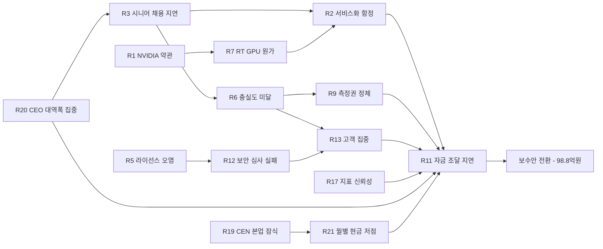
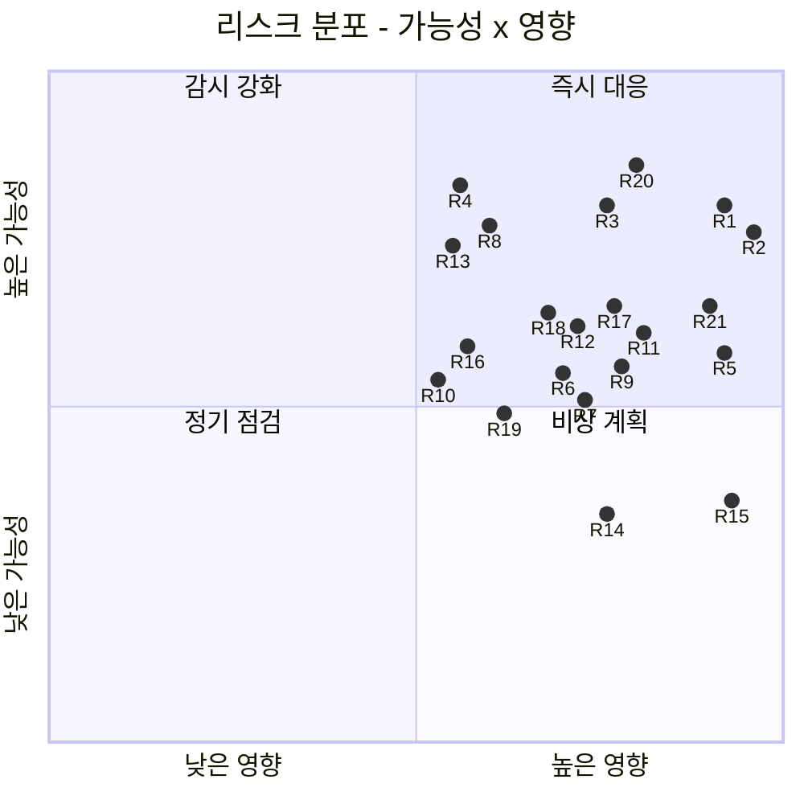
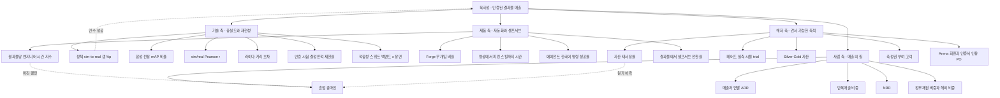
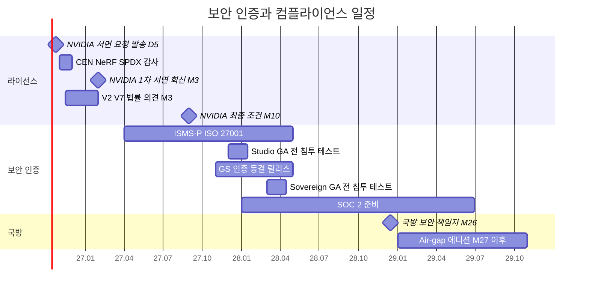

# 11. 리스크·KPI·컴플라이언스: 측정할 수 있는 것만 약속한다

> **문서 번호** 11 · **기준일** 2026-10-06 · **버전** v1.1(DR v1.1 §16 Errata 반영) · **상위 문서** [README](README.md)
> **관련 문서** [01 비전·포지셔닝](01-vision-positioning.md) · [02 시장·경쟁](02-market-competition.md) · [03 엔진 선정·Build vs Buy](03-engine-selection-build-vs-buy.md) · [04 시스템 아키텍처](04-system-architecture.md) · [05 물리·현실감](05-physics-and-realism.md) · [06 사용성·에이전트](06-usability-and-agent.md) · [07 학습 모듈](07-training-module.md) · [08 도메인 팩](08-domain-packs.md) · [09 로드맵·조직·예산](09-roadmap-organization-budget.md) · [10 사업모델·GTM](10-business-model-gtm.md) · [12 90일 실행](12-execution-90days.md) · [부록 A 기술 카탈로그](appendix-a-technology-catalog.md) · [부록 B 출처·검증](appendix-b-sources-verification.md)
> **표기** **[A]** 계획 가정(실적 확인 전까지 목표치) · **[U]** 1차 출처 미확인(대외 사용 전 §7 절차로 재검증) · 태그 없는 사실은 GitHub·PyPI·SkyPilot 가격 카탈로그·라이선스 원문으로 확인된 값 · ₩억 = 1억 원, 1 USD = ₩1,400 [A] · 모든 매출 수치는 예측이 아닌 목표 · M1 = 2026년 11월, P0 = M1–M4(2026.11–2027.02), P1 = M5–M12(2027.03–2027.10), P2 = M13–M24(2027.11–2028.10), P3 = M25–M36(2028.11–2029.10) · DR = 결정 기록(전 문서의 단일 기준)

---

## 핵심 요약

- **리스크는 21개로 관리한다.** DR Top 12에 고객 집중, 월드모델 대체, 개인정보·현장 기밀 사고, 범용성 기대 불일치, 지표·매출 인식 신뢰성, 해외 실행·환율, 그리고 CEO가 가장 먼저 물을 세 가지인 기존 CEN 본업 잠식(R19), CEO 대역폭 집중(R20), 월별 현금 저점(R21)을 더했다. 점수 16 이상인 '즉시 대응' 리스크는 NVIDIA 약관(R1), 서비스화 함정(R2), 시니어 채용 지연(R3), CEO 대역폭 집중(R20) 네 개다. 넷 다 P0–P1에 정점을 찍는다.
- **모든 리스크에는 책임자와 숫자로 된 조기경보 지표가 있다.** 예: D5(2026-10-23)에 보낸 NVIDIA 서면 요청에 M3까지 회신이 없으면 G1에서 '허용형 전용' 경로를 확정한다. 엔지니어 시간 지수가 목표를 20% 넘게 초과하면 신규 맞춤 수주를 동결한다. 월말 현금이 향후 2개월 순소진보다 낮아지면 신규 채용 오퍼를 멈춘다. 전사 재결정 트리거의 정본은 §6.3(TR-01–TR-33)이다.
- **KPI는 북극성 하나와 네 개의 축으로 묶는다.** 북극성은 '인증된 결과물 매출'이고, 기술·제품·사업·해자 축 아래 단계별 목표를 둔다. 해자 KPI(페어드 trial, Silver/Gold 자산, 재사용률, 측정권 고객)는 분기마다 투자자에게 공개한다. '검증된 KPI'라는 표기는 KTL·KOLAS·TTA 시험성적서가 붙은 4–5개 지표에만 쓴다. Forge 자동 추정의 'Gold 오차' KPI와 시험기관 비교용 'Gold 랩 실측 재현성'은 이름과 산식을 따로 둔다.
- **라이선스는 세 개의 Zone과 하나의 CI로 지킨다.** NVIDIA 독점 런타임은 Zone F(내부 팩토리) 산출물 생산에만 쓰고, Zone T(테넌트)와 Zone S(소버린·온프렘·에어갭)는 허용형(Apache-2.0/BSD/MIT)과 의무 이행이 가능한 약한 카피레프트(MPL-2.0·EPL-2.0·LGPL)로만 구성한다. NEVER 21개 항목과 #22 후보(MapAnything 기본 가중치)는 SPDX CI가 PR·빌드·반출·마켓 등록 4단계에서 자동 차단한다. CC-BY와 'Built on NVIDIA Cosmos' 귀속 문구는 납품물마다 자동 생성한다.
- **AI 기본법(2026-01-22 시행)은 시뮬레이션 신뢰성을 의무화하지 않는다.** 이 법이 다루는 것은 고영향 AI, 투명성, 생성물 표시다. 시뮬레이션 신뢰성 수요의 근거는 UN ADS 규정(WP.29 [U])과 ISO 34505:2025다. 우리 의무는 Cosmos 증강 프레임의 생성물 표시와 에이전트 사용 고지다.
- **보안 인증은 조달 일정에 맞춘다.** ISMS-P·ISO 27001은 M6 착수·M18 취득, GS 인증은 동결 릴리스로 M18, CSAP는 인증받은 국내 CSP를 경유해서만 대응한다. 국방은 SAM 계열·VGGT-Commercial을 뺀 별도 빌드 프로파일과 건별 EAR·ITAR 심사로 간다.
- **31개 미검증 항목은 담당자와 기한이 있다.** 가장 중요한 항목은 NVIDIA 약관(요청 발송 D5 = 2026-10-23, 회신 M3 1차, M10 최종)이다. 기한 안에 검증되지 않으면 항목마다 정해 둔 '기본 조치'를 자동으로 적용한다.

---

## 1. 리스크 레지스터

**결론: 리스크는 21개다. 가능성·영향을 1–5점으로 매기고 [A], 각 리스크에 책임자 한 명과 임계값이 있는 조기경보 지표를 붙인다. 임계값을 넘으면 사전에 합의한 대응을 토론 없이 실행한다.**

### 1.1 점수 기준 [A]

| 점수 | 가능성(36개월 안 발생) | 영향 |
|---|---|---|
| 5 | 거의 확실(80% 이상) | 사업 모델 존립 위협 |
| 4 | 높음(50–80%) | 게이트·라운드 지연, 매출 라인 하나 상실 |
| 3 | 중간(20–50%) | 단일 라인 차질, 분기 KPI 미달 |
| 2 | 낮음(5–20%) | 일정 지연, 국지적 비용 |
| 1 | 희박(5% 미만) | 무시 가능 |

- 등급은 점수(가능성 × 영향)로 정한다. 16 이상은 '즉시 대응', 12–15는 '집중 관리', 8–11은 '감시', 7 이하는 '정기 점검'이다.

### 1.2 레지스터(DR Top 12 + 추가 9)

- **ID 규칙:** R1–R21은 이 레지스터 전용 ID다. 학습 템플릿은 [06 §6.2](06-usability-and-agent.md)의 RL-/IL-/PE- ID를, 재결정 트리거는 §6.3의 TR- ID를, 베이크오프 과제는 [12 §5.3](12-execution-90days.md)의 T1–T11을 쓴다.

| # | 리스크 | 가능성 | 영향 | 점수 | 완화책 | 책임자 | 조기경보 지표(임계값) | 임계값 초과 시 대응 |
|---|---|---|---|---|---|---|---|---|
| R1 | **NVIDIA 약관 미확정:** 멀티테넌트 호스팅, 온프렘 재배포, 산출물 면제, NVIDIA 자산 번들, 텔레메트리 | 4 | 5 | **20** | Zone F/T/S 경계. D5(2026-10-23)에 16개 항목 서면 요청. NVAIE 예비비 ₩2.9억. 테넌트·온프렘은 허용형 전용, RTX는 BYOL. 약관 연동 라인은 목표에서 제외 | CEO + 얼라이언스·라이선스 매니저 | M3까지 1차 서면 회신 없음. M10까지 최종 조건 미확보 | G1에서 '허용형 전용' 경로 확정. 산출물 면제가 거부되면 NVAIE 예비비 집행 |
| R2 | **서비스화 함정:** 결과물 계약이 SI 업무로 변질되어 총마진 희석 | 4 | 5 | **20** | 생산화 게이트(무개입 80%, 라인 총마진 60%(완전원가, [10 §6.4](10-business-model-gtm.md)), 서면 라이선스 근거). FDE 상한(결과물 매출 ₩8억당 1명). 결과물 크레딧. 표준 SKU 밖 수주 금지 | CEO | 분기 엔지니어 시간 지수가 목표 대비 20% 초과. FDE 비중이 엔지니어링 시간의 10% 초과 | 신규 맞춤 수주 동결, 자동화 스프린트 1개 분기 |
| R3 | **한국 시니어 채용 지연:** Sim Architect, Head of Fidelity, Warp/CUDA, RTX 센서 | 4 | 4 | **16** | 지연 3–6개월을 564 HM에 반영. 게이팅 대체 경로(재미 한인 분할 근무, 겸직 Chief Scientist). 원격 채용, 게임사·연구실 풀, 스톡옵션 8–10% [A] | CEO + CTO | M3에 Architect 미확정, M4에 Head of Fidelity 미확정. 핵심 오퍼 수락률 50% 미만 [A] | G0 최대 2개월 연기, Crucible 외부 출범 연기 |
| R4 | **API 변동·버전 불일치:** Isaac Lab 3.x(쿼터니언 순서, ProxyArray), Newton 월간 릴리스, Warp R580, Kit 연간 약 3개 메이저 | 4 | 3 | 12 | 반기 릴리스 트레인, 국내 CSP 이미지에서 검증한 호환성 매트릭스, 적합성 스위트 CI, 엔진 접촉 워크스트림 용량 25% 예약, Isaac Sim 7.x는 GA + 패치 1회 이후 채택 | CTO | 업그레이드 투입 공수가 계획의 1.5배 이상. 적합성 스위트 회귀 2회 연속 | 트레인 연기, 이중 핀 예외 승인 |
| R5 | **라이선스 오염:** CEN NeRF 내 Instant-NGP 가능성, Hunyuan3D, Inria 계열, nvdiffrast, MimicGen, cuRobo, AGPL·GPL, SAM 군사 조항 | 3 | 5 | 15 | M1 감사, SPDX·NEVER CI, 마켓 출처 게이트, 국방 화이트리스트, Apache 태그로 고정한 cuRobo | CTO + 라이선스 자문 | 감사에서 차단 항목 발견. 머지 차단 시도 월 3건 이상 [A]. 출처 미기재 자산 1건 이상 | 해당 파이프라인 중단·이전(§4.7), 영향 고객 통지 |
| R6 | **충실도 미달·결과물 책임:** 접촉 집약·변형체 갭, 고객 하드웨어·조명 변수 | 3 | 4 | 12 | 인증 셀 또는 서면 프로토콜로 인수 정의. 책임 상한 = 계약 금액. 운영 범위 명시. M12 측정 전 변형체 보증 금지. 소량 실데이터 파인튜닝 기본 포함 | Head of Fidelity | 갭 KPI 미달. PoC 인수 실패 1건. 인수 리스크 충당금 사용률 50% 초과 [A] | 재학습 1회, 운영 범위 재정의, 가격표의 해당 과제 제외 |
| R7 | **GPU 등급·공급·서울 원가:** RT 공급 부족, RTX PRO 6000 MIG 미확인, 정부 GPU는 학습 전용 | 3 | 4 | 12 | 풀 분리. 국내 CSP RT 계약 조기 확보(V4). 자체 서버 2대. 세션당 GPU 1장 과금. 서울 리전은 대화형 전용 | Platform Lead | RT 가동률 80% 초과가 4주 지속. 서울 단가 10% 이상 상승. R580 이상 이미지 부재 | 버스트 계약 확대, 토큰 재산정, 공격안에서만 3호기 |
| R8 | **NVIDIA 범용화·재벌 내재화·경쟁 진입:** usd-content-agents, 관리형 Isaac 클라우드, Lightwheel 한국 진출 | 4 | 3 | 12 | 측정·인증·한국 콘텐츠로 가치 이전. 협력사·OEM 집중. IP 유지 계약 조항. 재검토 트리거 | CEO | 관리형 Isaac 클라우드 한국 출시. Lightwheel 한국 영업 개시. 재벌 자체 데이터 팩토리 발표 | 30일 안에 전략 재검토(§6.3 TR-01·TR-02·TR-10) |
| R9 | **측정권 거부로 코퍼스 해자 정체** | 3 | 4 | 12 | 측정권 할인 10–20%, 기여자 로열티, 자체 Test Cell trial, NIA 계약의 생성기·코퍼스 독점 조항 | BD + Head of Fidelity | 분기 측정권 고객이 목표 미달(2027 Q3 누적 2곳). 페어드 trial 분기 목표의 80% 미만 | 자체 셀 trial 증량, 할인 20%까지 상향 |
| R10 | **Arena 중립성·이해상충** | 3 | 3 | 9 | 공동서명 기관과 헌장 서명 전 외부 채점 금지(헌장 초안 M8 → 공동서명 MOU M10(2027-08-27) → 헌장 서명 M12 초, K-Pick Challenge 2027-10-22 이전). 회피 규정. 프로토콜 공개. Arena 프로그램 분리 운영 | Arena PM + 외부 공동서명 기관 | 회원사 이의 제기 1건 이상. 공동서명 MOU가 M10(2027-08-27) 초과. 헌장 서명이 2027-10-15까지 없음 | K-Pick Challenge를 공동서명 기관 입회 아래 순위 없는 공개 시연으로 전환. 외부 Arena 출범 연기, 프로토콜 재공개 |
| R11 | **자금·정책 주기:** Series A 지연, 보조금 지급 지연, 매칭 현금, 바우처 의존 | 3 | 4 | 12 | 단계 게이트. Series A ₩80억을 M5 브리지 ₩20억 + M10 ₩30억 + M12 ₩30억(G1 연동)으로 분할. 보조금은 업사이드로만. 정부재원 매출 2028년부터 40% 이하. 보수안 사전 설계 | CEO / CFO | M9까지 Series A 텀시트 없음 또는 텀시트 < ₩60억. 보조금 지급 지연 60일 초과. 런웨이 9개월 미만 [A] | 즉시 채용 동결, 보수안(₩98.8억) 실행(TR-05) |
| R12 | **보안·센서·수출통제:** 스트리밍 무인증, 에이전트 RCE, 멀티테넌트 격리, 해양·국방 레이더 충실도, EAR·ITAR | 3 | 4 | 12 | 자체 인증·TLS 게이트웨이, host 네트워크 미노출, 테넌트 간 GPU 공유 금지, gVisor·Kata, GA 전 침투 테스트, 센서 검증 계획, 국방 라이선스 프로파일, 건별 수출 심사 | Platform Lead + 센서 리드 + 자문 | 침투 테스트 고위험 발견 1건 이상. 센서 오차 목표 미달 | GA 연기, 해양·국방 판매 보류 |
| R13 | **고객 집중:** 2027년 매출이 앵커 2–3곳에 쏠림 | 4 | 3 | 12 | P1 말 유료 결과물 고객 6곳 확보. 단일 고객 매출 비중 상한 30% 목표 [A]. 바우처로 롱테일 확보. 2028년부터 해외 | CEO + BD | 분기 최대 고객 비중 40% 초과 | 신규 로고 영업 우선, 해당 고객 다년 계약화 |
| R14 | **월드모델 대체:** Cosmos 3, Genie 3 기반 Waymo World Model, GAIA-3 같은 생성형 시뮬레이터가 손으로 만든 장면의 가치를 낮춤 | 2 | 4 | 8 | 물리 ground truth·평가·데이터권을 소유한다. Cosmos 3를 L4 증강과 정책 사전 선별에 편입한다. 인증서는 실셀 측정에 묶는다 | CTO + Head of Fidelity | 공개 벤치마크에서 월드모델 정책 평가의 sim/real r ≥0.8 보고. 고객 RFP에 월드모델 요구 등장 | 월드모델 백엔드 편입 검토, Crucible에 월드모델 트랙 추가 |
| R15 | **개인정보·현장 기밀 사고:** 촬영물의 얼굴·번호판·작업자 정보, 고객 공정 기밀 유출 | 2 | 5 | 10 | 촬영 익명화(블러·인페인팅) 후 학습, 동의 기록, 위탁계약, 데이터 거주 태그, 온프렘 촬영·재구성 키트, 개인정보 포함 품목 마켓 금지 | Platform Lead + 라이선스·법무 매니저 | 익명화 누락 탐지 1건 이상. 고객 보안 감사 지적 | 사고 대응 절차(§5.3), 해당 데이터 판매 중단 |
| R16 | **범용성 기대 불일치:** "자동차는 안 한다"로 읽혀 앵커 이탈·정부 평가 감점 | 3 | 3 | 9 | Capability Readiness 로드맵 공개(휴머노이드·사족·덱스터러스 템플릿 M6–M12, Mobility Pack α M18–M24, 드론 PX4 SITL 템플릿 M20–M24, 해양 P3). "차량 트윈은 만들고, 도로 AV 시뮬레이터와는 정면 경쟁하지 않는다"는 문구 통일. Wave 밖 요청 규칙(CRL 3 이상). MORAI·표준(OpenSCENARIO·OSI·FMI 3.0) 연결 | CEO + CTO | 실주 사유 중 '대상 미지원' 비중 20% 초과 [A]. 평가위원 지적 | 예산·인원 고정값 안에서 CRL 일정 조정 검토 |
| R17 | **지표·매출 인식 신뢰성:** 결과물 크레딧 이연, 바우처 혼입, ARR 정의 이견으로 실사에서 할인 | 3 | 4 | 12 | ARR 정의서 고정, 정부재원 별도 보고, 크레딧 회계 정책 확정(회계법인 확인), KPI 정의서(§3.3), 분기 내부 점검 | CFO | 실사·감사에서 지표 재작성 요구. 정의 변경 시도 | 외부 회계 검토, IR 자료 수정 공시 |
| R18 | **해외 실행·환율·수출 심사:** 미국 원격 GTM 실패, USD 매출 지연, 환율 변동, EAR 심사 지연 | 3 | 4 | 12 | 원격 우선(고정비 최소), 미국 BD 리드 M15, USD 가격표, 환율 ±10% 시나리오, 건별 수출 심사, 미국 데이터의 US 거주 | CEO + 미국 BD 리드 | 2028 Q2까지 미국 유료 계약 0건. 환율이 가정 대비 ±10% 초과 | 일본·국내 OEM 미국 공장으로 순서 조정, 하방 시나리오 적용 |
| R19 | **기존 CEN 본업 잠식·기존 고객 이탈:** 기존 인력 6명 전원 재배치, NeRF 2D→3D 변환 퇴역(2027-02-28)으로 워크스페이스·토큰·마켓 고객 이탈 | 3 | 3 | 9 | 워크스페이스·토큰·마켓은 유지(Studio의 기반). 본업 운영 0.5 FTE 확보, NeRF 고객 D30 서면 공지 → D60 대체 경로·무상 재변환 1회 → 퇴역. CEN 매출은 별도 원장, 독립채산([09 §5.4](09-roadmap-organization-budget.md)) | CEO | 기존 CEN MRR 전월 대비 −10%. 월 유료 고객 수 기준선 대비 −20%. NeRF 고객 이탈 2곳 이상 | 무상 재변환·결과물 크레딧 제공, CEO 직접 연락, WS7 운영 비중 일시 상향. 본업 운영 부하가 0.5 FTE를 2개월 넘으면 주간 운영 회의 안건 |
| R20 | **CEO 대역폭 집중:** CEO가 앵커 영업(주 1일 이상), NVIDIA 협상, 브리지·Series A, 게이팅 채용 최종 면접, BD 실무(M1 전), WS8·WS9 최종 책임, M4 전 측정 서명권 공동 보유를 동시에 맡는다 | 4 | 4 | **16** | M1 BD·정부과제·라이선스 매니저 착석으로 WS9 실무 이관. M3 Sim Architect 착석 후 기술 면접·엔진 결정을 CTO로 이관. CFO(기존 경영지원)가 브리지·Series A 실무와 데이터룸을 맡고 운영 총괄 역할을 겸한다 [A]. M8 Product Lead 착석으로 WS7 대행(CTO) 해제. 별도 COO 직책은 인원 고정값(DR 부록) 밖이므로 두지 않는다 | CEO(이사회 점검) | CEO 영업 시간이 주 1일 미만인 주가 2주 연속. CEO 승인 대기 결정 3건 이상 | 이사회 의장과 위임 범위 재조정, 승인 권한 일부(할인 10–20%, 채용 오퍼) 위임, 비핵심 대외 일정 중단 |
| R21 | **월별 현금 저점:** 기존 현금 ₩15억이 M4에 약 ₩4억, 브리지 후 M9에 약 ₩5억까지 내려간다. 브리지·클로징이 한 달만 밀려도 운영 자금이 끊긴다 | 3 | 5 | 15 | [09 §9.2](09-roadmap-organization-budget.md) 브리지 일정(₩20억 M5 → ₩30억 M10 → ₩30억 M12). CFO가 M1 첫 주에 가용 현금 확인, ₩15억 미만이면 브리지를 M3로. 보조금은 선정 후에만 런웨이 반영. 최소 현금 규칙 | CFO + CEO | 월말 현금 < 향후 2개월 순소진. M1 확인 현금 < ₩15억. 브리지 M5 말 미납입 | 신규 채용 오퍼 중단과 이사회 보고. 브리지 조기 집행 또는 기존 투자자 프로라타 증액. M5 미납입이면 보수안 사전 전환(TR-05) |

### 1.3 '즉시 대응' 리스크 심층

| 리스크 | 왜 점수가 높은가 | 최악의 경로 | 최악에서도 사업이 살아남는 이유 |
|---|---|---|---|
| R1 NVIDIA 약관 | 결정에 가장 결정적인 미확인 사항이다. NVAIE $4,500/GPU/년과 Inception 75% 할인도 [U]다 | 산출물 면제 거부 + 호스팅·재배포 불가 | Zone T/S는 처음부터 허용형(Newton, MuJoCo, 소스 빌드 Isaac Lab·PhysX SDK)과 의무 이행이 가능한 약한 카피레프트로만 구성한다. Zone F 전체에 NVAIE를 사도 ₩2.9억(Inception 할인 시 약 ₩0.7억 [U])으로 예비비 안이다. 약관 연동 라인은 2027–2029 목표에 0으로 들어가 있다 |
| R2 서비스화 함정 | 2027년 매출의 40%가 정부재원이고 총마진은 약 45%다. 투자자는 이것을 서비스 회사로 읽는다 | 엔지니어 시간 지수가 P1에 50 아래로 내려가지 않음 → G1 라인 총마진 50% 미달 | G1 미충족 시 보수안 자동 전환. PoC 단위경제(지수 65에서 마진 53%)가 개선 경로를 수치로 보여 준다([10 §6.4](10-business-model-gtm.md)) |
| R3 시니어 채용 | Sim Architect와 Head of Fidelity가 게이팅 조건이다 | 두 자리 모두 M6까지 공석 | 분할 근무 아키텍트 + 겸직 Chief Scientist 경로가 미리 설계돼 있다. G0를 최대 2개월 늦추는 비용은 인건비 이연으로 상쇄된다 |
| R20 CEO 대역폭 | P0–P1의 결정적 일(앵커 3곳, NVIDIA, 브리지·Series A, 게이팅 채용)이 모두 CEO 한 사람에게 걸려 있다. R1·R3·R11의 대응도 CEO가 실행한다 | 앵커 영업이 밀려 첫 데이터셋 계약(M4)과 LOI 3건이 늦어지고, 그 결과 G0·브리지가 함께 밀림 | 위임 순서가 미리 정해져 있다(M1 BD 매니저 → M3 CTO → CFO의 자금 실무 → M8 Product Lead). 주간 CEO 시간 배분을 조기경보로 보므로 밀리기 전에 이사회가 개입할 수 있다 |

### 1.4 단계별 리스크 정점

| 단계 | 정점 리스크 | 이유 |
|---|---|---|
| P0(M1–M4) | R1, R3, R5, R19, R20, R21 | 약관 요청, 게이팅 채용, CEN NeRF 감사·퇴역(2027-02-28), CEO 업무 집중, 1차 현금 저점(M4 약 ₩4억)이 동시에 온다 |
| P1(M5–M12) | R2, R6, R9, R11, R13, R20, R21 | 첫 PoC 인수, 측정권 시험, 브리지(M5)와 Series A 본 클로징(M9 텀시트 → M10·M12 납입), 2차 현금 저점(M9 약 ₩5억), 앵커 의존 |
| P2(M13–M24) | R4, R7, R10, R12, R17, R18 | 셀프서브·온프렘 GA, 외부 Arena, 미국 GTM, Series B 실사 |
| P3(M25–M36) | R8, R12, R14, R16 | 국방·해양 진입, 경쟁 진입, 월드모델 성숙 |

### 1.5 리스크 연쇄: 원천과 귀착점

리스크는 독립적으로 터지지 않는다. 아래 연쇄는 경영진이 어디에 먼저 시간을 써야 하는지를 보여 준다.

| 구분 | 리스크 | 의미 | 관리 원칙 |
|---|---|---|---|
| 원천(source) | R3, R1, R5, R20, R19 | 다른 리스크를 일으키는 출발점이다. 대부분 P0에 결정된다 | P0 경영 시간의 우선순위. 대체 경로를 미리 실행 가능하게 만든다 |
| 증폭기 | R2, R6, R7, R21 | 원천 리스크가 마진·인수 실패와 현금 공백으로 번지는 통로다 | 엔지니어 시간 지수, 인수 범위, 풀 라우팅, 최소 현금 규칙으로 매월 차단 |
| 귀착점(sink) | R11 | 거의 모든 경로가 자금 조달 지연으로 모인다 | 귀착점을 직접 막지 않는다. 원천과 증폭기를 막고, 귀착 시에는 보수안을 자동 실행한다 |

- **시사점:** 자금 리스크(R11)를 '자금 문제'로 다루면 늦다. Series A의 증빙 KPI(유료 고객 3곳 이상, 총마진 45% 이상, 측정권 고객 2곳, 코퍼스 10k)는 R3·R2·R6·R9를 막았는지의 결과다. 또 브리지(M5)와 본 클로징 사이의 현금 저점(R21)은 CEO가 영업·채용·투자 유치를 동시에 끌고 가야 하는 시기(R20)와 겹친다. 그래서 P0의 첫 조치는 위임 순서와 현금 확인이다.

---

## 2. 리스크 히트맵

**결론: 오른쪽 위(가능성 4·영향 5)에 R1·R2가, 그 옆(가능성 4·영향 4)에 R3·R20이 있다. 이 네 개가 P0–P1 경영 시간의 대부분을 가져가야 한다. 영향 5 열의 R21(현금 저점)은 가능성이 중간이지만 터지면 존립 문제이므로 월 단위로 본다.**

| 가능성 \ 영향 | 1 | 2 | 3 | 4 | 5 |
|---|---|---|---|---|---|
| **5** | | | | | |
| **4** | | | R4, R8, R13 | **R3, R20** | **R1, R2** |
| **3** | | | R10, R16, R19 | R6, R7, R9, R11, R12, R17, R18 | R5, R21 |
| **2** | | | | R14 | R15 |
| **1** | | | | | |

- **해석:** 21개 중 15개가 영향 4–5 열에 몰려 있다. 이 사업의 리스크는 '발생 빈도'보다 '한 번 터졌을 때의 크기'가 문제다. 그래서 완화책의 중심은 사전 차단(Zone 경계, CI, 계약 조항)과 사전 설계된 후퇴 경로(보수안, 허용형 전용, BYOL)다.

---

## 3. KPI 체계

**결론: 북극성은 '인증된 결과물 매출' 하나다. 기술·제품·사업·해자 네 축이 그 아래에 있고, 모든 KPI는 산식·데이터 소스·책임자가 고정돼 있다. 해자 KPI는 분기마다 공개하고, 시험성적서가 붙은 지표만 '검증된 KPI'라고 부른다.**

### 3.1 KPI 트리

### 3.2 단계별 KPI(DR §13.2 고정값)

- **정본과 사본:** 목표 숫자의 정본은 [DR §13.2](00-decision-record.md)다. 이 표는 DR 값을 옮기고 11만의 운영 열(책임, 데이터 소스)을 붙인 운영 사본이며, 산식은 §3.3, 집계·감사 주기는 §3.6에 있다. 숫자가 다르면 DR이 우선하고, DR Errata가 바뀌면 같은 분기에 이 표를 동기화한다. [10 §10.3](10-business-model-gtm.md)의 KPI 템플릿은 이 표에서 정부 제출용으로 발췌한 하위 집합이다.

| 축 | KPI | P0 (M4) | P1 (M12) | P2 (M24) | P3 (M36) | 책임 | 데이터 소스 |
|---|---|---|---|---|---|---|---|
| 기술 | 정책 sim-to-real 갭(%p) | ≤25(1개 과제) | ≤15(3개) | ≤10(5개) | ≤8(10개) | Head of Fidelity | Crucible 실셀·시뮬 로그 |
| 기술 | 합성 전용 mAP 비율 | ≥0.85 | ≥0.90 | ≥0.95 | ≥0.95(3개 버티컬) | Head of Fidelity | 인수 시험 리포트 |
| 기술 | sim/real Pearson r(정책 ≥5개) | — | ≥0.7 | ≥0.8 | ≥0.85 | Head of Fidelity | Crucible |
| 기술 | 라이다 거리 오차 | — | ≤3 cm | ≤2 cm | ≤2 cm + 레이더 프로파일 | 센서 리드 | 보정 타깃 측정 |
| 기술 | 인증 시험 결정론적 재현(D0 경로) | 100% | 100% | 100% | 100% | CTO | Run Manifest 재실행 |
| 기술 | 적합성 스위트(백엔드 × 장면, C01–C15 정본은 04 §4.6)² | 3×5 | 4×8 | 5×12 | 6×15 | CTO | CI |
| 제품 | Forge 무개입 비율 | 30% | 60% | 80% | 90% | Forge Lead | Orchestrator 작업 로그 |
| 제품 | 영상 → 피킹 스킬 | 48시간(내부) | 24시간 | 당일(셀프서브) | 4시간 | Skill Lead | 작업 DAG 타임스탬프 |
| 제품 | 에이전트 한국어 명령 성공률 | ≥80%(20개) | ≥85%(50개) | ≥90%(100개) | ≥92% | Product Lead³ | 에이전트 평가 스위트 |
| 제품 | 결과물당 엔지니어 시간 지수 | 100 | 50 | 25 | 15 | CEO | 타임시트 + 주문 |
| 제품 | 결과물 → 셀프서브 전환율¹ | — | 25% | 50% | 60% | Product Lead | 제품 분석(P1), 빌링(P2부터) |
| 제품 | Studio 월간 활성 워크스페이스 | — | 30(베타) | 300 | 1,500 | Product Lead | 제품 분석 |
| 사업 | 계약·매출 | 첫 계약 ≥₩0.5억 | 2027년 ₩15억 | 2028년 ₩45억 | 2029년 ₩110억 | CEO | 재무제표 |
| 사업 | 유료 결과물 고객(누적) | 1 | 6 | 18 | 40 | CEO + BD | CRM |
| 사업 | 반복매출 비중 | — | ~10% | ~30% | ~50% | CFO | 매출 원장 |
| 사업 | 혼합 총마진 | — | ≥45% | ≥52% | ≥60% | CFO | 라인별 손익 |
| 사업 | 정부재원 매출 비중 | — | ≤40% | ≤20% | ≤15% | CFO | 매출 원장 |
| 사업 | 해외 매출 비중 | — | 0% | ~9% | ~27% | CFO | 매출 원장 |
| 사업 | NRR | — | — | ≥110% | ≥120% | CFO | 코호트 ARR |
| 해자 | 페어드 실측/시뮬 trial(누적) | 1k | 10k | 50k | 150k | Head of Fidelity | 코퍼스 DB |
| 해자 | Silver/Gold 자산(누적, Bronze 제외) | 150 | 1,000 | 4,000 | 12,000 | Forge Lead | 인증서 레지스트리 |
| 해자 | 그중 Gold(랩 실측) | 30 | 200 | 800 | 2,000 | Head of Fidelity | 인증서 레지스트리 |
| 해자 | Bronze 자산(참고, KPI 아님) | — | 5,000 | 30,000 | 100,000 | Forge Lead | 레지스트리 |
| 해자 | 2개 이상 주문에서 재사용된 자산 비율 | — | 20% | 35% | 45% | Forge Lead | 주문-자산 그래프 |
| 해자 | 측정권 부여 고객(누적) | 0 | 4 | 12 | 25 | BD | 계약 DB |
| 해자 | Arena 회원 | — | 3(파일럿) | 8 | 20(해외 2 포함) | Arena PM | 회원 명부 |
| 해자 | 인증서 인용 조달·PO | — | 고객 PO 1건 | 공공·재벌 조달 1건 | 3건 | BD | PO 사본 |

- ¹ 2단 정의([06 §11.1](06-usability-and-agent.md), DR §16 #22). P1에는 결과물 고객 중 Studio 베타 워크스페이스를 활성화한 비율로, P2부터는 12개월 안에 크레딧 외 유료 토큰·구독을 쓴 비율로 잰다(산식은 §3.3).
- ² P0 '3×5'의 백엔드 3개는 베이크오프 구성 B1–B5 중 Newton/MJWarp 계열·PhysX·MuJoCo CPU의 통과 백엔드 수다. 백엔드는 P1 + Drake(4) → P2 + Chrono(5) → P3 + 클린룸 Fossen 6-DOF(6)로 늘린다. FMU는 공동 시뮬레이션 브리지라 백엔드 수에 넣지 않는다. 허용치 최종값은 베이크오프 결정 메모(2027-01 첫 주)에서 고정한다.
- ³ Product Lead는 M8에 착석한다. 그 전(P0 KPI 포함)에는 CTO가 WS7 책임을 대행한다.

### 3.3 KPI 정의서(산식 고정)

| KPI | 산식 | 측정 규칙 [A] |
|---|---|---|
| 정책 sim-to-real 갭(%p) | 과제별 \|시뮬 성공률 − 실셀 성공률\| × 100의 평균 | 정책당 실셀 시행 50회 이상, 95% 신뢰구간 병기. 운영 범위(조명·물체군) 고정 |
| 합성 전용 mAP 비율 | mAP(합성 전용 학습, 보류 실데이터) ÷ mAP(실데이터 학습, 같은 보류 실데이터) | mAP@[.5:.95], 3시드 평균. 보류셋은 고객 또는 공동서명 기관이 보관 |
| sim/real Pearson r | 정책 5개 이상의 (시뮬 성공률, 실셀 성공률) 상관 | Spearman 순위 일치를 함께 보고 |
| 라이다 거리 오차 | 보정 타깃 거리 구간별 RMSE(cm) | 디바이스별 실측 프로파일 기준 |
| 결정론적 재현율 | 비트 일치 재실행 수 ÷ 인증 시험 재실행 수 | Run Manifest 결정론 등급이 `D0_bitwise`인 경로만 집계한다. 허용 경로는 MuJoCo CPU와, 베이크오프 W7의 N1–N5 시험을 통과한 Newton 결정론 모드다. Chrono CPU·클린룸 Fossen(Warp CPU)·PX4 SITL lockstep은 N1–N4 동등 시험 통과와 CTO 등록 후에만 편입한다(목표 Chrono M22, Fossen M28 [A]). 등록 전 산출물은 `D1_statistical`('통계적 재현')로 표기하고 집계에서 뺀다. 고정 하드웨어·드라이버 |
| 엔지니어 시간 지수 | (분기 결과물 단위당 엔지니어 시간 ÷ P0 기준값) × 100 | 결과물 가중치: 데이터셋 팩 1.0, 셀 트윈 1.5, PoC 3.0. 타임시트는 주문 ID 단위. 밸류에이션 조건 '연 50% 감소'는 P0 기준선(지수 100) 대비 연율로 판정한다(P3 말 지수 15 = 연 약 −51%) |
| 결과물 → 셀프서브 전환율 | 2단 정의([06 §11.1](06-usability-and-agent.md)). **P1:** 결과물 고객 중 Studio 베타 워크스페이스를 활성화(월 1회 이상 Job 실행)한 고객 비율. **P2 이후:** 결과물 고객 중 12개월 안에 크레딧 외 유료 토큰·구독을 쓴 고객 비율 | 코호트는 첫 결과물 인수 월 기준. P1 값과 P2 값은 정의가 다르므로 같은 추세선에 잇지 않는다 |
| 반복매출 비중 | ARR 산입 항목의 인식 매출 ÷ 총매출 | ARR 산입 항목은 [10 §2.1](10-business-model-gtm.md) 정의를 따른다 |
| NRR | 12개월 전 ARR 보유 고객군의 현재 ARR ÷ 그 고객군의 12개월 전 ARR | 신규 고객 제외, 이탈 포함 |
| 정부재원 비중 | (바우처 + 정부 용역 + 정부 구축사업 매출) ÷ 총매출 | 정부보조금(TIPS 등)은 매출이 아니므로 분자·분모 모두 제외 |
| 페어드 trial | 같은 초기조건으로 실셀과 시뮬에서 각각 실행·기록한 시행 쌍 | Run Manifest와 실셀 MCAP 로그가 모두 있어야 집계 |
| 재사용률 | 2개 이상 주문에 쓰인 Silver/Gold 자산 수 ÷ 누적 Silver/Gold 자산 수 | Bronze 제외 |
| 인증된 결과물 매출 | Scorecard·인증서가 첨부되어 인수된 결과물의 인식 매출 | 이사회 목표: 결과물 매출의 70%(P1) → 85%(P2) → 90%(P3) [A] |
| 라인 총마진(G1·생산화 게이트) | (라인 매출 − 컴퓨트·토큰 원가 − 인건비(개입·FDE·Skill·Forge 시간, head-month ₩1,400만 환산) − 랩·현장 원가 − 크레딧 이행 원가 − 인수 리스크 충당금) ÷ 라인 매출 | [10 §6.4](10-business-model-gtm.md)의 완전원가 정의(DR §16 #19). 직접원가 마진은 게이트 판정에 쓰지 않는다 |
| Gold 자산 질량/마찰 오차(DR §4.1) | Gold 기준 세트에서 \|θ_auto − θ_lab\| / θ_lab의 평균. θ_auto는 Forge 자동 사슬(VLM 사전분포 + 영상 sysid)의 추정값, θ_lab은 Gold 랩 실측값 | [05 §16.1](05-physics-and-realism.md) D4와 같은 산식. 목표 ≤15%/≤25%(P0) → ≤10%/≤20%(P1) → ≤8%/≤15%(P2) → ≤5%/≤10%(P3). 마찰은 경사판·밀기 실측 μ 기준. 자동화 체인의 정확도 지표이므로 Gold 인증 임계나 고객 보증 문구로 쓰지 않는다 |
| Gold 랩 실측 재현성(§3.5 ⑤) | 같은 Gold 물체를 시험기관이 다시 쟀을 때의 질량·마찰 상대 편차 \|θ_lab − θ_test\| / θ_test(θ_test는 시험기관 측정값) | 위 'Gold 오차' KPI와 별개 지표다. 인증서에 기록하는 측정 불확도(AIC-OBJ-GOLD v1)를 외부에서 확인하는 용도다 |
| sim2sim 게이트 적용률 | Tier 1을 통과하고 수출된 정책 수 ÷ 수출된 정책 수 | [07 §7.3](07-training-module.md)의 Tier 1 기준(1,000 에피소드, 성공률 차 ≤10%p, 평균 반환 비율 ≥0.85, 지연·노이즈 주입 후 하락 ≤15%p, ONNX 행동 최대 오차 ≤1e-3). 교차 백엔드는 Zone F 3개(PhysX·Newton·MuJoCo CPU), Zone T/S 2개(Newton·MuJoCo CPU). 인증서·Crucible 공식 캠페인에는 Tier 2(초기조건 200개, 백엔드 쌍별 ≤5%p, 관절 RMSE ≤0.05 rad)를 따로 적용한다 |

### 3.4 분기별 해자 KPI(DR §13.3 고정값, 투자자 보고용)

- **정본과 사본:** 숫자와 거버넌스 마일스톤의 정본은 [DR §13.3](00-decision-record.md)이다. 이 표는 그 값에 11만의 '미달 시 조치' 열을 붙인 운영 사본이며, DR이 바뀌면 같은 분기에 동기화한다.

| 분기 | 페어드 trial 누적 | Silver/Gold 누적 | 재사용률 | 측정권 고객 누적 | 엔지니어 시간 지수 | 거버넌스 마일스톤 | 미달 시 조치 [A] |
|---|---|---|---|---|---|---|---|
| 2027 Q1 (M3–M5) | 1.5k | 200 | — | 0 | 100 | Arena 공동서명 기관 접촉. G0(M4) 통과 | 자체 Test Cell trial 증량 |
| 2027 Q2 (M6–M8) | 3k | 400 | 10% | 1 | 85 | 데이터권 계약 템플릿 확정. Arena 헌장 초안(M8)¹ | 바우처 고객에 측정권 할인 제시 |
| 2027 Q3 (M9–M11) | 6k | 700 | 15% | 2 | 65 | 공동서명 MOU(M10, 2027-08-27)¹. G1(M11, 심의 2027-09-24) | G1 판정 시 보수안 검토 |
| 2027 Q4 (M12–M14) | 10k | 1,000 | 20% | 4 | 50 | 거버넌스 헌장 서명(M12 초, K-Pick Challenge 2027-10-22 이전. 미서명 시 K-Pick은 공동서명 기관 입회 아래 비순위 시연)¹. 첫 KTL·TTA 시험성적서(지표 1개). 고객 PO가 인증서를 인수 기준으로 인용 | 신규 맞춤 수주 동결(지수 60 초과 시). 헌장 미서명 시 외부 채점·순위 공개 금지 유지(R10) |
| 2028 Q1 (M15–M17) | 18k | 1,600 | 25% | 6 | 42 | Studio GA(M15) | 셀프서브 Forge 마케팅 강화 |
| 2028 Q2 (M18–M20) | 28k | 2,300 | 30% | 8 | 36 | 외부 Arena v1 출범. G2(M18) | Series B 일정 재검토 |
| 2028 Q3 (M21–M23) | 38k | 3,100 | 33% | 10 | 30 | 시험성적서 지표 3개 확보 | 시험기관 추가 지정 |
| 2028 Q4 (M24–M26) | 50k | 4,000 | 35% | 12 | 25 | 공공·재벌 조달 문서에 인증서 인용. G3(M24, 심의 2028-10-27) | G3 미충족 시 Series B 연기 |

- ¹ Arena 거버넌스 일정은 헌장 초안 M8 → 공동서명 MOU M10(2027-08-27) → 헌장 서명 M12 초(K-Pick Challenge 2027-10-22 이전)다([07 §8.4](07-training-module.md), DR §16 #20). DR §5.3과 R10에 따라 헌장 서명 전에는 외부 채점을 하지 않는다. 그래서 'Q4(M12–M14)'는 서명 마감이 아니라 분기 구간이며, 실제 서명 기한은 K-Pick 1주 전(2027-10-15)이다(R10 조기경보).

### 3.5 제3자 검증 KPI

| # | 지표 | 시험 방법 [A] | 시험기관 후보 | 첫 성적서 목표 | 활용처 |
|---|---|---|---|---|---|
| ① | 합성 전용 mAP ÷ 실데이터 mAP | 시험기관이 보관한 보류 실데이터로 두 모델 평가 | KTL, KOLAS 인정 시험기관 | 2027 Q4(P1, 지표 1개) | TIPS·NIA 제안서, 데이터셋 인수 기준 |
| ② | 정책 sim-to-real 갭(%p) | 시험기관 입회 실셀 시행과 시뮬 재실행 비교 | KTL, KIRIA | 2028 Q3까지(P2, 누적 3개) | KEIT·K-Humanoid, Arena 인증서 |
| ③ | 라이다 거리 오차(cm) | 보정 타깃 거리별 측정 | KOLAS 인정 시험기관, TTA | 2028 Q3까지 | IITP, 해양·국방 사전 증빙 |
| ④ | 결정론적 재현율(%) | 고정 하드웨어에서 인증 시험 재실행 | TTA | 2028 Q3까지 | GS 인증, 인증서 신뢰 |
| ⑤ | Gold 랩 실측 재현성(시험기관 대비 질량·마찰 편차, %) [A]² | 같은 Gold 물체를 시험기관이 다시 재서 랩 실측값과 비교 | KTL | P3(누적 5개) | 마켓 Gold 프리미엄 근거, 인증서 측정 불확도의 외부 확인 |

- ² ⑤는 DR §13.4(①–④)에 없는 [A] 추가 항목이다. DR §4.1의 'Gold 자산 질량/마찰 오차' KPI([05 §16.1](05-physics-and-realism.md) D4: Forge 자동 추정값 vs Gold 랩 실측, 산식 \|θ_auto − θ_lab\| / θ_lab)와는 **다른 양을 재는 별개 지표**다. IR·제안서에서 두 지표를 같은 이름으로 쓰지 않는다. 산식은 §3.3에 있다.

- **예산:** KTL·TTA 시험성적서 비용 ₩0.4억이 법무·IP·인증 항목(₩3.5억)에 들어 있다.
- **표기 규칙:** 정부과제 제안서와 IR 자료에서 '검증된 KPI'는 위 지표 중 성적서를 받은 것만 쓴다. 나머지는 '사내 측정'으로 표기한다.

### 3.6 KPI 데이터 파이프라인과 감사

KPI가 실사에서 깎이지 않으려면 숫자가 원천 시스템에서 사람 손을 거치지 않고 나와야 한다.

| KPI 그룹 | 원천 시스템 | 집계 주기 | 내부 점검 [A] | 외부 검증 |
|---|---|---|---|---|
| 기술(갭, mAP 비율, r, 재현율) | Run Manifest, Crucible 실셀·시뮬 로그, MCAP | 야간 자동 | 분기마다 인증 시험 10% 표본 재실행(비트 일치 확인) | KTL·KOLAS·TTA 시험성적서 |
| 제품(무개입, 엔지니어 시간, 전환율) | Outcome Orchestrator 작업 로그, 주문 ID 단위 타임시트, 빌링 | 주간 | 타임시트 누락률 5% 미만 유지, 지수 산식 변경 금지 | Series 실사 |
| 사업(매출, ARR, 마진, NRR, 비중) | 매출 원장, CRM, 계약 DB | 월간 | ARR 산입 항목을 계약서 원본과 대조 | 반기 외부 회계 검토 |
| 해자(trial, 자산, 재사용, 측정권) | 코퍼스 DB, 인증서 레지스트리, 주문-자산 그래프, 계약 DB | 분기 공개 전 | 표본 10%를 원본(촬영 로그, 서명 계약)과 대조 | 공동서명 기관(Arena 관련) |

- **정의 변경 규칙:** KPI 산식(§3.3)을 바꾸려면 이사회 승인이 필요하고, 이전 분기 수치를 새 산식으로 다시 계산해 함께 공개한다. 정의를 바꿔 목표를 맞추는 일을 구조적으로 막기 위해서다.

---

## 4. 라이선스 컴플라이언스 정책

**결론: 라이선스 리스크는 사람의 주의가 아니라 구조로 막는다. Zone이 '어디서 무엇을 쓸 수 있는가'를 정하고, SPDX CI가 4단계에서 자동으로 차단하며, 납품물마다 라이선스 매니페스트·SBOM·귀속 파일이 붙는다.**

### 4.1 Zone F/T/S 규칙

| Zone | 사용자 | 허용 | 금지 | 판정 질문 | 자동 통제 |
|---|---|---|---|---|---|
| **F 내부 팩토리** | AICHEMIST 엔지니어만 | 허용형 전체 + Isaac Sim 6.1/Kit, RTX 센서, Replicator, Isaac Lab PhysX 경로, TacSL, Mimic, Isaac Teleop. 약관 확인 후 NuRec·ovrtx | 테넌트 접근, 고객 화면 스트리밍 | "고객이 이 런타임을 직접 보거나 조작하는가?" 그렇다면 F가 아니다 | Zone F 노드 풀 분리, 네트워크 정책으로 테넌트 차단, 산출물 반출 게이트 |
| **T 테넌트 대면** | Studio·Cloud 고객 | Newton, MuJoCo, mjlab, Isaac Lab 소스(Kit-less Newton), PhysX SDK 소스(조건부 어댑터 착수 후, TR-20), Chrono, 브라우저 렌더(WebGPU/WebGL2), Warp 센서, gsplat/3DGRUT, LeRobot, 자체 게이트웨이. 약한 카피레프트(MPL-2.0: open62541·Selkies·OpenBao·Lichtblick, EPL-2.0: Ditto, LGPL: Ceph RGW)는 의무 이행 추적 후 허용 | Kit, Isaac Sim, Replicator, PhysX Vehicle2(어댑터 전까지 Zone F 전용), ovrtx, ovphysx 휠, isaacsim/isaaclab PyPI 휠(서면 조건 전). TSL(TimescaleDB 고급 기능)·BSL·AGPL·GPL·비상업 라이선스 | "이 패키지의 SPDX가 허용 목록에 있는가?" | 이미지 SPDX 허용 목록, 금지 패키지 발견 시 빌드 실패 |
| **S 소버린·온프렘·에어갭** | 고객 사이트, 국내 CSP | Zone T + 서명 SBOM, 텔레메트리 없음, 오프라인 업데이트 | Zone T 금지 + GPL 번들(Blender는 V2 의견 전 제외) + Drake PyPI 휠('BSD and Other/Proprietary', 독점 솔버를 뺀 소스 빌드만 V2 의견 후 허용) + SAM 계열·VGGT-Commercial 가중치 번들(재배포 조항 서면 확인 전) + 국방 에디션의 SAM 계열·VGGT-Commercial | "온프렘 납품은 배포다. 배포 의무를 질 수 있는가?" | 서명 SBOM(빌드마다), 드라이버 사전 점검기, 프로파일별 빌드(민수·국방) |

- **Zone T/S 라이선스 구성(DR §16 #31):** 허용형(Apache-2.0/BSD/MIT)과 의무 이행이 가능한 약한 카피레프트(MPL-2.0·EPL-2.0·LGPL)로만 구성하고, TSL·BSL·AGPL·GPL·비상업 라이선스는 제외한다. TimescaleDB는 Apache-2.0 에디션만 쓰거나 InfluxDB 3 Core로 대체한다. 약한 카피레프트는 수정한 파일의 소스 공개와 고지 의무를 SBOM과 함께 추적한다(§4.6).
- **RTX in Zone S:** 고객이 자기 라이선스로 직접 운영하는 환경(BYOL)에서만 연동한다. AICHEMIST가 고객 라이선스로 대신 호스팅하는 것은 NVIDIA 확인 전까지 금지다.
- **산출물 면제 자체가 [U]:** Zone F 산출물 판매는 NVIDIA 서면 확인(체크리스트 #1)을 받을 때까지 '확인 대기' 상태로 관리하고, 거부되면 NVAIE 예비비를 집행한다.

### 4.2 NEVER 목록(21개 + 후보 1개)과 조건부 보류

전체 표와 대체재는 [03 §10.3](03-engine-selection-build-vs-buy.md)에 있다. 여기서는 정책 범주로 묶는다.

| 범주 | 항목 | 금지 근거 |
|---|---|---|
| 지역 제외 | Hunyuan3D 2.x | 라이선스가 한국을 지역에서 제외하고, 지역 밖 출력물 사용도 금지 |
| 비상업 연구 코드 | Inria 3DGS 원본, 2DGS·MILo, PGSR, SuGaR 계열(Inria 유래 추정 [U]), Instant-NGP, nvdiffrast, Neuralangelo, MimicGen·DexMimicGen 코드, PhysX-Anything | 연구·비상업 라이선스. MIT 프로젝트의 필수 의존성으로 숨어 들어온다(TRELLIS.2 → nvdiffrast) |
| 비상업 데이터·가중치 | ManiSkill 자산(CC BY-NC 4.0), AgiBot World·GO-1(CC BY-NC-SA), RLDX-1 가중치, DA3 Large/Giant, 원본 VGGT-1B, Waymax·Waymo Open Dataset | 유료 제품에 탑재 불가 |
| 카피레프트·소스 공개형 | SaaS 내 Ultralytics(AGPL-3.0), 온프렘 번들 내 GPL(BlenderProc, Stonefish, ArduPilot), lakeFS 1.87 이상(BSL 1.1) | AGPL은 네트워크 사용만으로, GPL은 온프렘 배포로 의무가 생긴다 |
| 용도 제한 | 국방 에디션 내 SAM 계열·VGGT-Commercial | ITAR·무역통제 금지 용도, 군사 용도 금지 |
| 번들 약관 | Isaac Lab 번들 cuRobo | Isaac Lab 밖 사용 금지. Apache-2.0 태그로 고정한 업스트림만 허용 |
| #22 후보 | MapAnything 기본(비 apache) 가중치 | 기본 가중치는 비 apache(CC-BY-NC로 표기 [U], SPDX 확인 M2) 조건이다. 허용 대상은 MapAnything-apache 가중치로 한정한다([부록 A §0.3](appendix-a-technology-catalog.md), [05](05-physics-and-realism.md) Forge 라인과 정합). CI는 후보 단계에서도 차단한다 |

- **조건부 보류(NEVER 아님):** MinIO(AGPL-3.0 [U], SPDX 확인 M2), Genesis Nyx(라이선스 미표기), pi0.5 가중치(약관 미명시), OpenVLA 가중치(Llama 2 약관), Stability SPAR3D(매출 $1M 초과 시 엔터프라이즈 라이선스), UE 런타임(코어 탑재 금지, 커넥터만).

### 4.3 SPDX CI 게이트

| 단계 | 검사 대상 | 차단 조건 | 도구 [A] | 산출물 |
|---|---|---|---|---|
| 1. PR | 신규 의존성·모델·자산 | SPDX 식별자 또는 출처 URL 누락, NEVER 해당 | ScanCode Toolkit, 레지스트리 조회 | PR 라이선스 체크 결과 |
| 2. 빌드 | 컨테이너 이미지의 전이 의존성 | NEVER 21개 + #22 후보, Zone T 금지 패키지(isaacsim·isaaclab 휠, ovrtx, ovphysx 휠), Zone T/S의 TSL·BSL·AGPL·GPL | Syft(SBOM), ORT(정책 평가) | SPDX SBOM(빌드마다), cosign 서명 |
| 3. 반출(Zone F → T) | 산출물(데이터셋, 정책, 자산, 리포트) | 라이선스 매니페스트·Run Manifest·출처 누락 | 자체 반출 게이트 | 라이선스 매니페스트, ATTRIBUTION 파일 |
| 4. 마켓 등록 | 제3자·1차 리스팅 | 비상업 원천, 생성 모델 메타데이터 누락, 개인정보 미익명화 | 자체 출처 검사기 | 리스팅 매니페스트 |
| 5. 감사 | 전체 레지스트리 표본 | 의존성 라이선스 변경 감지(발견 시 TR-26) | 분기 라이선스 매니저 + 외부 자문 | 감사 보고서 |

- **지표:** SBOM 커버리지 100%(Zone T/S 이미지 전체), 출처 미기재 자산 0건, 분기 감사 지적 사항의 30일 내 해소율 100% [A].

### 4.4 마켓플레이스 출처 규칙

| 필드 | 필수 여부 | 내용 | 검증 |
|---|---|---|---|
| 라이선스 매니페스트 | 필수 | SPDX 식별자, 상업 사용 여부, 재배포 범위 | 허용 목록 대조 |
| 촬영 출처 | 촬영 기반 자산은 필수 | 촬영원(현장·기여자), 촬영일, 동의 기록 ID | 동의 DB 대조 |
| 익명화 | 사람·차량이 있으면 필수 | 얼굴·번호판·작업자 표식 처리 방법 | 자동 검출 재검사 |
| 생성 모델 메타데이터 | 생성형 경로를 거쳤으면 필수 | 모델명·버전·라이선스(예: TRELLIS.2 + 대체 래스터라이저, SAM 3D) | NEVER·용도 제한 대조 |
| 인증 등급 | 필수 | Bronze/Silver/Gold, 인증서 ID | 레지스트리 조회 |
| Run Manifest | 데이터셋은 필수 | 엔진·버전·시드·GPU SKU·드라이버 | 해시 검증 |
| 용도 태그 | 필수 | 민수 전용(civil-only) 여부 | 국방 워크스페이스 노출 차단 |

- **게시 중단 절차 [A]:** 권리 침해·출처 오류 신고 접수 후 24시간 안에 판매 중지, 7일 안에 판정, 침해 확정 시 구매자에게 대체 자산 제공 또는 환불.
- **기여자 동의 철회:** 철회 이후 신규 판매를 멈추고, 이미 납품된 결과물의 사용권은 유지한다.

### 4.5 모델 가중치 정책

| 모델·가중치 | 라이선스 | Zone F | Zone T | Zone S(민수) | Air-gap(국방) | 조건 |
|---|---|---|---|---|---|---|
| SmolVLA 450M | Apache-2.0 | 허용 | 허용 | 허용 | 허용(기본 VLA) | — |
| GR00T N1.7(3B) | 코드 Apache-2.0, 가중치 NVIDIA Open Model License | 학습·내부 사용 허용 | 산출물로 제공(가중치 납품은 V7 후) | V7 후 | 보류 | 파인튜닝 가중치의 고객 납품은 재배포에 해당하므로 V7 법률 검토(M3) 통과 후. 부정적이면 SmolVLA 또는 ACT로 증류해 납품 |
| pi0 / pi0.5(openpi) | 코드 Apache-2.0, 가중치 약관 미명시 | 차단 | 차단 | 차단 | 차단 | 약관 확인 전 |
| Cosmos Transfer 2.5 | 가중치 NVIDIA Open Model License | 허용 | 산출물만 | 산출물만 | 보류 | 'Built on NVIDIA Cosmos' 귀속, 가드레일 유지 |
| Cosmos 3(Super 64B / Nano 16B / Edge 4B) | OpenMDW-1.1(전문 [U]) | V7 조건 허용 | V7 후 | V7 후 | 보류 | 귀속·가드레일·사용 분야 조항 확인 |
| VGGT-1B-Commercial | 커스텀 사용 제한 라이선스(신청서, 군사·ITAR 제외) | 허용 | 조건부(V7 후 호스팅 추론) | 가중치 번들은 재배포 조항 서면 확인 전 제외 | **금지** | 조건부(V7). 신청 양식 필요 |
| 원본 VGGT-1B | 비상업 | 금지 | 금지 | 금지 | 금지 | NEVER |
| MapAnything | 코드 Apache-2.0, 가중치는 기본 비 apache(CC-BY-NC로 표기 [U]) / 'map-anything-apache' Apache-2.0 | apache 가중치만 | apache 가중치만 | apache 가중치만 | apache 가중치만 | 기본 가중치는 NEVER #22 후보 |
| DA3 Small/Base/Metric/Mono | Apache-2.0 | 허용 | 허용 | 허용 | 허용 | Large/Giant는 NEVER |
| SAM 3D Objects, SAM 3 | SAM License(커스텀 사용 제한 라이선스: 신청서, 군사·ITAR 제외) | 허용 | 조건부(V7 후 호스팅 추론) | 가중치 번들은 재배포 조항 서면 확인 전 제외 | **금지** | 조건부(V7). 산출물에 civil-only 태그 |
| TRELLIS.2-4B | MIT(nvdiffrast 의존) | 래스터라이저 교체 후 | 교체 후 | 교체 후 | 교체 후 + 국방 검토 | nvdiffrast는 NEVER |
| RF-DETR N–L / XL·2XL | Apache-2.0 / PML 1.0 | 허용 / 보류 | 허용 / 보류 | 허용 / 보류 | 허용 / 보류 | — |
| Ultralytics YOLO | AGPL-3.0 | 내부 실험만 | 금지 | 고객 Enterprise 라이선스 시 | 금지 | — |
| 온프렘 LLM(에이전트) | 오픈 가중치(모델별) | — | 프런티어 API | 온프렘 오픈 가중치 | 출처 확인 국산 모델 우선 | V8 출처 확인 |

- **파인튜닝 가중치 납품 규칙:** 고객에게 넘기는 가중치에는 기반 모델의 라이선스 사본과 조건 승계 문구를 붙인다. 기반 모델 약관이 재배포를 막거나 V7(M3) 해석 전이면 가중치·Jetson 패키지(ONNX/TensorRT 엔진 포함)·호스팅 추론 엔드포인트 어느 형태로도 납품하지 않고, SmolVLA·ACT 같은 허용형 모델로 증류해 납품한다(DR §16 #32, [07 §10.4](07-training-module.md)).
- **'OK(민수)' 표기 금지:** SAM 계열·VGGT-1B-Commercial은 민수용이라도 '조건부(V7)'로 표기한다(DR §16 #32).

### 4.6 귀속(Attribution) 의무

| 대상 | 라이선스 | 의무 | 이행 방식 |
|---|---|---|---|
| CARLA 자산, MimicGen 데이터셋, Newton 문서 | CC-BY(4.0) | 저작자·라이선스 표시, 변경 사실 표시 | 데이터셋 카드와 ATTRIBUTION 파일 자동 생성 |
| Cosmos Transfer 2.5 산출물 | NVIDIA Open Model License | 'Built on NVIDIA Cosmos' 표기. 가드레일 우회 시 권리 종료 | 증강 프레임이 들어간 데이터셋 카드·리포트·제품 화면에 표기. 가드레일 로그 보관 |
| Cosmos 3 산출물 | OpenMDW-1.1 | 귀속 조항(전문 [U]) | V7 결과가 나올 때까지 Transfer 2.5와 같은 표기를 적용 |
| GR00T N1.7 파인튜닝 가중치 | NVIDIA Open Model License | 라이선스 고지, 조건 승계 | V7 통과 후에만 가중치 납품. 납품 패키지에 라이선스 사본 동봉 |
| Apache-2.0 구성요소(PhysX SDK 5.11 코어, Newton, MuJoCo, gsplat, 3DGRUT, KAI 등) | Apache-2.0 | LICENSE·NOTICE 유지, 변경 표시 | Zone S 번들에 NOTICE 집계 파일 |
| BSD-3 구성요소(Isaac Lab 소스, Drake 소스 빌드, Chrono, PX4) | BSD-3 | 저작권 고지 유지 | 같은 집계 파일. Drake PyPI 휠은 'BSD and Other/Proprietary'라 Zone F 내부 검증에만 쓴다 |
| 약한 카피레프트 구성요소(MPL-2.0: open62541·Selkies·OpenBao·Lichtblick, EPL-2.0: Ditto, LGPL: Ceph RGW) | MPL-2.0 / EPL-2.0 / LGPL | 수정한 파일의 소스 공개, 고지. LGPL은 재링크 가능성 유지 | 수정 시 공개 저장소, SBOM에 의무 태그 |
| AOUSD Core Spec 1.0.1 | CC-BY-ND-4.0 | 변경본 배포 금지 | `aic:TwinCertificate`는 별도 스키마로 정의하고 사양 원문을 수정하지 않는다 |
| 마켓 제3자 자산 | 판매자 지정 | 판매자 지정 귀속 | 리스팅 매니페스트에서 상속 |

### 4.7 위반 발견 시 대응 [A]

| 단계 | 시한 | 내용 | 책임 |
|---|---|---|---|
| 1. 동결 | 발견 후 24시간 | 해당 파이프라인·리스팅·빌드 중지 | CTO |
| 2. 영향 분석 | 72시간 | 영향 받은 산출물·고객·마켓 판매 목록화(Run Manifest·SBOM 역추적) | 라이선스·법무 매니저 |
| 3. 고객 통지 | 계약 조건에 따라, 늦어도 7일 | 영향 범위와 대체 계획 | CEO |
| 4. 교정 | 30일 | 대체 구성요소로 재생성, 재인증 | 해당 워크스트림 리드 |
| 5. 사후 검토 | 교정 후 14일 | CI 규칙 보강, NEVER 목록 갱신 | CTO + 외부 자문 |

### 4.8 업스트림 기여와 특허 정책

Newton 업스트림 기여는 로드맵 영향력과 채용 흡인력을 위한 핵심 수단이다. 그러나 Apache-2.0 프로젝트에 코드를 기여하면 그 기여에 해당하는 특허 라이선스가 모든 사용자에게 함께 부여된다(Apache-2.0 제3조). 특허 포트폴리오(M24까지 8건 출원 목표 [A])와 충돌하지 않도록 기여 범위를 미리 정한다.

| 구분 | 대상 | 규칙 |
|---|---|---|
| 기여 허용 | 범용 Warp 커널(촉각, 센서 노이즈), 버그 수정, 성능 개선, 적합성 테스트 장면(낙하 박스, 진자, Franka 픽, 폴리백, 바퀴 차량) | CTO 승인 후 기여 |
| 기여 금지 | 인증서 산출 방법, 충실도 예측, 월드모델 증강 라벨 일관성 검증, LLM→USD 변경 검증 게이팅, 페어드 측정 프로토콜(특허 후보 5개 영역) | 출원 전 외부 공개 금지 |
| 조건부 | 오픈소스 적합성 스위트 공개 | 특허 후보 기법을 포함하지 않는 범위로 한정, 공개 전 변리사 검토 |

- **절차:** 기여 PR은 CTO와 변리사가 특허 후보 목록과 대조한 뒤 제출한다. 출원 전 공개는 신규성 상실 위험이 있으므로(국내 공지예외 적용 기간 [U]) 학회 논문(CoRL·ICRA)도 같은 검토를 거친다.
- **기여 약관:** Linux Foundation 프로젝트의 기여 조건(CLA·DCO 여부)은 첫 기여 전에 확인한다 [U].

---

## 5. 보안과 규제

**결론: 보안 인증은 조달 일정에 맞춰 순서대로 취득하고, 규제는 '실제로 적용되는 의무'와 '수요의 근거'를 구분한다. AI 기본법은 시뮬레이션 신뢰성을 요구하지 않는다.**

### 5.1 인증 로드맵

| 인증 | 왜 필요한가 | 범위 | 착수 | 취득 목표 | 예산(DR 법무·IP·인증 ₩3.5억 안) | 책임 |
|---|---|---|---|---|---|---|
| **ISMS-P** | 재벌·공공 보안 심사의 사실상 전제 | Studio·Cloud 서비스, 서울 리전, 사내 팩토리의 고객 데이터 처리 | M6(2027.04) | M18(2028.04) | ISMS-P + ISO 27001 합산 ₩0.8억 | Platform Lead |
| **ISO 27001:2022** | 해외 고객·글로벌 FM 기업 | ISMS-P와 같은 관리체계 | M6 | M18 | 위에 포함 | Platform Lead |
| **GS 인증**(TTA) | 공공 조달 우대, 품질 증빙 | 동결 릴리스(Sovereign 코어) | P2 초 | M18 | ₩0.4억 | CTO |
| **CSAP** | 공공 SaaS | 직접 취득하지 않는다. CSAP 인증 국내 CSP 경유로만 대응 [U] | 공공 SaaS 사업화 결정 시 | — | — | Platform Lead |
| **SOC 2**(Type I → II) | 미국 FM·휴머노이드 고객 | 미국 리전 서비스 | P2 [A] | P3 [A] | 미국 GTM 예산 | 미국 BD 리드 + Platform Lead |
| **침투 테스트** | GA 전 필수 | 게이트웨이, 에이전트 샌드박스, 테넌트 격리 | Studio GA(M15)·Sovereign GA(M18) 전 | 매 GA 전 | ₩0.3억 | Platform Lead |
| **방산 보안** | 국방 에디션 | Air-gap 에디션, 상주 인력 | M26(국방 보안 책임자 채용) | M27 이후 | P3 예산 | 국방 보안 책임자 |

### 5.2 AI 기본법(2026-01-22 시행)

| 항목 | 내용 |
|---|---|
| 법의 범위 | 인공지능 발전과 신뢰 기반 조성에 관한 기본법. 2024-12-26 국회 통과, 2025-01-21 공포, 2026-01-22 시행. 고영향 AI 사업자 의무, 투명성(AI 사용 고지), 생성형 AI 결과물 표시를 다룬다. 과태료에는 유예 기간이 있다 [U] |
| **하지 않는 것** | **시뮬레이션 신뢰성(credibility)을 의무화하지 않는다.** 디지털 트윈·시뮬레이터의 검증 의무는 이 법에서 나오지 않는다 |
| 시뮬레이션 신뢰성 수요의 실제 근거 | UN ADS 규정(WP.29, 2026년 6월 승인 [U]), ISO 34505:2025, 자율운항선박법(2025-01-03 시행)의 성능 검증, ISO 21448·UL 4600(차량 분야, [08](08-domain-packs.md)) |
| 우리에게 실제로 적용되는 의무 | ① 한국어 MCP 에이전트: 사용자에게 AI가 생성한 계획·코드임을 고지한다. ② Cosmos 증강 프레임: 데이터셋 메타데이터에 `generated=true`와 생성 모델·버전을 기록하고 데이터셋 카드에 표시한다. ③ 고객 로봇 정책이 고영향 AI 영역에 들어가는지는 고객이 판단하며, 우리는 Scorecard·인증서를 증거 자료로 제공한다(계약서에 책임 경계 명시) |
| 대외 표현 규칙 | "AI 기본법이 시뮬레이션 검증을 요구한다"는 문장은 IR·제안서·마케팅 어디에도 쓰지 않는다 |

### 5.3 개인정보(PIPA)와 국외 이전

| 위험 지점 | 통제 | 책임 |
|---|---|---|
| 현장 촬영물(얼굴·번호판·작업자 표식) | 촬영 직후 익명화(블러·인페인팅) 후에만 스플랫 학습·마켓 등록. 익명화 자동 재검사 | Forge Lead |
| 동의와 고지 | 촬영 현장 고지, 기여자 동의 기록(마켓 출처 필드와 연결) | BD + 라이선스·법무 매니저 |
| 처리 위탁 | 결과물 계약에서 고객은 개인정보처리자, AICHEMIST는 수탁자. 위탁계약서 표준 첨부 | 라이선스·법무 매니저 |
| 데이터 거주 | KR/US/EU 거주 태그를 스케줄러가 강제한다. `dataset.export`는 대상 위치 태그가 다르면 차단([04](04-system-architecture.md)) | Platform Lead |
| 국외 이전 | 한국 고객 데이터는 국외로 복제하지 않는다. 미국 팀은 KR 거주 워크스페이스 안에서만 접근한다 [A]. 불가피한 이전은 개인정보 보호법의 국외 이전 요건(동의, 계약 이행 필요와 고지, 인증 등. 제28조의8 [U])을 사전 검토 | 라이선스·법무 매니저 |
| 유출 사고 | 정보주체 통지와 개인정보보호위원회 신고(72시간 기준 [U]), 고객 통지, 해당 데이터 판매 중단 | CEO + Platform Lead |
| 합성 데이터 주장 | '개인정보 안전' 표현은 개인정보보호위원회 합성데이터 생성 참조모델(2024)에 맞춘 절차를 거친 경우에만 사용 | Head of Fidelity |

### 5.4 수출통제(EAR·ITAR)와 SAM 라이선스 군사 제한

| 영역 | 리스크 | 정책 | 책임 |
|---|---|---|---|
| 첨단 GPU(EAR) | 중동·제3국 온프렘 납품 시 GPU 서버 재수출 | AICHEMIST는 GPU 하드웨어를 재판매하지 않는다 [A]. 고객 조달 GPU에 소프트웨어만 납품. 건별로 최종 사용자·용도·목적지 심사 | CEO + 수출통제 자문 |
| 모델 가중치(EAR) | 특정 AI 모델 가중치 통제 규정의 적용 여부 | 규정 상태 자체가 [U]다. 해외·국방 납품 건마다 자문 확인 후 진행 | 수출통제 자문 |
| 소프트웨어 암호화(EAR) | TLS 포함 소프트웨어의 분류 | ECCN 자체 분류와 대량시장 예외 해당 여부 확인 [U] | 라이선스·법무 매니저 |
| 국내 전략물자 | 국방·이중용도 수출 | 전략물자관리원 판정을 수출 전 확인 [U] | 라이선스·법무 매니저 |
| ITAR | 미국 방산 기술 데이터가 국방 과제에 섞임 | 국방 과제 데이터는 Air-gap 랙에서만 처리. 미국 기원 방산 데이터 수령 시 별도 격리 | 국방 보안 책임자 |
| **SAM License** | SAM 3D Objects·SAM 3는 커스텀 사용 제한 라이선스다(신청서, ITAR·무역통제 금지 용도와 군사 용도 제외) | Air-gap 빌드 프로파일에서 제외. 민수도 '조건부(V7)': 테넌트 호스팅 추론은 V7 통과 후, 온프렘 가중치 번들은 재배포 조항 서면 확인 전 제외. SAM 경로로 만든 자산은 civil-only 태그를 달고 국방 워크스페이스에 노출하지 않는다 | CTO |
| **VGGT-1B-Commercial** | 커스텀 사용 제한 라이선스(신청서, 군사·ITAR 제외) | SAM과 같은 처리(민수 조건부 V7). 국방 Forge는 자체 모델 + Apache 가중치(MapAnything-apache, DA3 S/B)로 구성 | CTO |
| 기록 | 심사 이력 | 건별 심사 기록 5년 보관 [A] | 라이선스·법무 매니저 |

### 5.5 제품 보안 통제 요약

| 위협 | 통제 | 검증 |
|---|---|---|
| 스트리밍 무인증(Isaac Sim 스트리밍에는 인증·암호화가 없다) | 자체 WebRTC 게이트웨이(인증·TLS), host 네트워크 미노출, Kit App Streaming은 게이트웨이 뒤 Zone F·BYOL에서만 | 침투 테스트 |
| 에이전트 원격 코드 실행 | USD 코드 생성은 gVisor·Kata 샌드박스에서만, UsdValidation·물리 정합성·2-백엔드 스모크 테스트, 사람 승인 병합. 임의 실행 커뮤니티 MCP는 테넌트에 노출하지 않는다 | 레드팀 시나리오 |
| 멀티테넌트 격리 | 테넌트 간 GPU 시분할 금지, 무료 프리뷰는 '비신뢰' 노드 풀, KAI 계층형 큐 | 격리 시험 |
| 온프렘 공급망 | 서명 SBOM, 오프라인 서명 업데이트, 텔레메트리 없음 | 고객 보안 심사 |
| 센서 증거 남용 | 레이더·EO/IR은 오차 막대를 공개한 프로파일을 통과하기 전 해양·국방에 판매 금지. '단순화된 FMCW 레이더'는 국방 증거물로 팔지 않는다 | 센서 검증 계획([05](05-physics-and-realism.md)) |

---

## 6. 거버넌스

**결론: 이사회는 다섯 개의 밸류에이션 조건과 네 개의 해자 지표를 분기마다 본다. 게이트와 재결정 트리거는 사전에 합의한 대응을 자동으로 실행하게 만든다. 숫자가 나쁠 때 토론으로 시간을 쓰지 않기 위해서다.**

### 6.1 이사회 KPI 대시보드

| # | 지표 | P1(M12) | P2(M24) | P3(M36) | 보고 빈도 | 경보 기준 [A] |
|---|---|---|---|---|---|---|
| 1 | 인증된 결과물 매출 비중(결과물 매출 중) [A] | 70% | 85% | 90% | 분기 | 목표 −10%p |
| 2 | 혼합 총마진 | ≥45% | ≥52% | ≥60% | 분기 | 목표 −5%p |
| 3 | 반복매출 비중 | ~10% | ~30% | ~50% | 분기 | 목표 −5%p |
| 4 | NRR | — | ≥110% | ≥120% | 분기 | 100% 미만 |
| 5 | 결과물당 엔지니어 시간 지수 | 50 | 25 | 15 | 월 | 목표 +20% |
| 6 | 정부재원 매출 비중 | ≤40% | ≤20% | ≤15% | 분기 | 상한 초과 |
| 7 | 해외 매출 비중 | 0% | ~9% | ~27% | 분기 | 목표 −5%p |
| 8 | Silver/Gold 자산(누적) | 1,000 | 4,000 | 12,000 | 분기 | 목표의 80% 미만 |
| 9 | 페어드 trial(누적) | 10k | 50k | 150k | 분기 | 목표의 80% 미만 |
| 10 | 측정권 부여 고객(누적) | 4 | 12 | 25 | 분기 | 목표 미달 |
| 11 | 정책 sim-to-real 갭 | ≤15%p | ≤10%p | ≤8%p | 분기 | 목표 초과 |
| 12 | 현금 런웨이와 월말 현금 | 라운드 착수 시점 12개월 이상 [A]. 월말 현금 ≥ 향후 2개월 순소진 | 같음 | 같음 | 월 | 런웨이 9개월 미만, 또는 월말 현금 < 향후 2개월 순소진(R21, [09 §9.2](09-roadmap-organization-budget.md)). 기준안에서 걸리는 달은 M4·M9뿐이다 |

### 6.2 분기 리뷰(QBR) 운영

| 순서 | 안건 | 입력 | 결정 | 책임 |
|---|---|---|---|---|
| 1 | KPI 대시보드 | §6.1 12개 지표, §3.4 분기 해자 KPI | 목표 유지·조정 | CEO |
| 2 | 게이트 준비도 | 다음 게이트 조건별 진척 | 게이트 일정 확정 | CEO + CTO |
| 3 | 리스크 조기경보 | §1.2 21개 지표 | 대응 발동 여부 | 각 책임자 |
| 4 | 재결정 트리거 | §6.3 정본 목록(TR-01–TR-33. 02 §10 시장 트리거와 03 §14 X-코드 포함) | 전략 재검토 착수 여부 | CEO + 이사회 |
| 5 | 가격 재산정 | 풀 실제 원가, 항목별 마진 | 토큰·SKU 가격 조정 | CFO + Product Lead(M8 착석 전에는 CEO, 원가 입력 CTO) |
| 6 | 라이선스 감사 | 분기 감사 결과, NVIDIA 협상 상태 | 차단·교체 결정 | CTO + 라이선스 자문 |
| 7 | 검증 항목 | §7 31개 진척 | 기본 조치 발동 | CEO |
| 8 | 채용·조직 | 게이팅 채용, 인원 상한 | 채용 승인 | CEO |
| 9 | 현금·라운드 | 런웨이, 보조금 지급, 라운드 진척 | 보수안 전환 여부 | CFO |

- **연간 일정 [A]:** 분기 리뷰는 분기 종료 후 3주 안(1·4·7·10월)에 연다. 게이트 리뷰(G0 M4 = 2027-02-26, G1 M11 = 2027-09-24, G2 M18 = 2028-04-28, G3 M24 = 2028-10-27)는 분기 리뷰와 별도로 열고, 이사회 결의로 판정한다.

### 6.3 재결정 트리거(전사 정본 목록, TR-01–TR-33)

- **정본 선언:** 이 표가 전사 재결정 트리거의 정본이다. 분기 이사회(QBR 안건 4)는 이 목록 하나로 점검한다. [02 §10](02-market-competition.md)의 워치리스트는 시장 트리거의 관찰 신호 요약이고, [03 §14](03-engine-selection-build-vs-buy.md)의 X1–X15는 '엔진 범위 트리거'로서 감시 지표와 재검토 레이어 같은 운영 세부를 맡는다. 두 문서의 각 행은 마지막 열의 TR-ID로 이 표와 연결한다. **임계값이 다르면 이 표를 따른다.**
- **ID 규칙:** 'TR-'는 베이크오프 과제 T1–T11([12 §5.3](12-execution-90days.md)), DR 정오표 번호(T-1…T-13), 리스크 ID(R1–R21), 학습 템플릿 ID(RL-/IL-/PE-, [06 §6.2](06-usability-and-agent.md))와 구분하려고 붙였다. 옛 T1–T15는 같은 순서로 TR-01–TR-15가 됐다.
- **임계값 통일:** 중국 저가 공세는 '동급 자산 가격이 우리 Bronze 가격의 30% 미만'(TR-13), 월드모델은 '공개 벤치마크에서 월드모델 정책 평가의 sim/real r ≥0.8'(TR-11)로 한다. 02 §10의 #6('Bronze급 가격 50% 이상 하락')과 #7('물리 오차가 시뮬레이터 수준')은 이 값으로 대체해 읽는다.

| ID | 구분 | 트리거 | 임계값(정본) | 사전 합의 대응 | 결정권 | 시한 | 02 §10 / 03 §14 |
|---|---|---|---|---|---|---|---|
| TR-01 | 시장 | NVIDIA 관리형 Isaac 클라우드 한국 출시 | 한국 리전 정식 출시 공식 발표 | 전략 재검토: 측정·인증·한국 콘텐츠 비중 확대, 셀프서브 Cloud 계층 우선순위 하향, NPN co-sell 편입, 가격 재설계 | CEO + 이사회 | 30일 | #1 / X3 |
| TR-02 | 시장 | Lightwheel 한국 영업 개시 | 국내 고객 계약, 한국 법인·지사·대리점 개설 중 하나 | 자산 가격·SKU 재검토, 리셀러 협상 재개, 실측 Gold·실셀 평가 강조 | CEO + BD | 30일 | #2 / X3 |
| TR-03 | 라이선스 | NVIDIA 1차 서면 회신 없음 | M3(2027-01) 경과(요청 발송 D5 = 2026-10-23) | G1에서 허용형 전용 경로 확정 준비, NVAIE 예비비 집행 여부 판단 | CEO | G1(2027-09-24) | #4 / X2 |
| TR-04 | 게이트 | G1 불충족 | G1 심의(2027-09-24)에서 7개 조건 중 하나라도 미달 | 보수안(₩98.8억) 자동 전환: 인원 24–26명 동결, Wave 2 축소. Series A 2차 클로징(₩30억, G1 연동) 재협상 | 이사회 | 즉시 | — |
| TR-05 | 자금 | 브리지·Series A 미확보 | M5(2027-03) 말까지 브리지 ₩20억 미납입. 또는 M9(2027-07) 경과 시 텀시트 없음, 텀시트 금액 < ₩60억 | 브리지 미납입: 채용 동결, 기존 투자자 프로라타 증액 협상, 보수안 사전 전환. M9 조건: Series A < ₩60억과 같은 것으로 보고 즉시 보수안 실행 | CEO + CFO | 즉시 | — |
| TR-06 | 자금 | Series B 지연 | G2(2028-04-28) 시점 라운드 진척 부족 | 보수안 전환 | 이사회 | M18 | — |
| TR-07 | 경영 | 엔지니어 시간 지수 초과 | 목표 +20%가 2분기 연속 | 신규 맞춤 수주 동결, 자동화 스프린트 | CEO | 다음 분기 | — |
| TR-08 | 경영 | 정부재원 비중 초과 | 2028년 이후 분기 40% 초과 | 바우처 신규 수주 상한 설정 | CFO | 다음 분기 | — |
| TR-09 | 시장 | Wave 3 트리거 충족 | ARR ₩30억 이상, 또는 확정 ₩5억 이상 앵커(조선사 공동개발·국방 과제) + Sovereign GA + 센서 검증 프로파일. 판정은 M25부터. 기준안의 2028년 말 ARR은 ₩20억이므로 기본 경로는 앵커 계약이고, ARR 경로는 2029년 중에야 충족된다 | 해양·국방 착수 결정. 국방 Air-gap 에디션은 M27부터. 앵커가 없으면 2029년 Air-gap ₩4.5억은 2030년으로 이월([10 §2.3](10-business-model-gtm.md)) | 이사회 | 60일 | §8 W5 / X14 |
| TR-10 | 시장 | 재벌 자체 데이터 팩토리 발표 | 공식 발표 | 협력사·OEM 집중 강화, 해당 그룹 SI와 리셀러 협상, Arena 중립성 강조 | CEO | 30일 | #5 / — |
| TR-11 | 시장·기술 | 월드모델의 제어 가능한 물리 | 공개 벤치마크에서 월드모델 정책 평가의 sim/real r ≥0.8 | 생성형 백엔드 편입 검토, Crucible 월드모델 트랙 추가, Cosmos 3 Super 정책 사전 선별 앞당김. 월드모델 출력은 인증 증거로 쓰지 않는다([07](07-training-module.md) D9) | CTO + Head of Fidelity | 다음 트레인 | #7 / — |
| TR-12 | 엔진 | Isaac Sim 7.x GA + 패치 1회 | 릴리스 노트 | 다음 릴리스 트레인 채택 검토, 호환성 매트릭스 갱신 | CTO | 다음 트레인 | #8 / X11 |
| TR-13 | 시장 | 중국 데이터 팩토리의 자산 가격 붕괴 | 동급 자산 가격이 우리 Bronze 가격의 30% 미만 | Bronze 가격 인하, Silver/Gold와 신뢰 포지션 강화 | CEO + Product Lead(M8 전 CTO 대행) | 다음 분기 | #6 / — |
| TR-14 | 라이선스 | 라이선스 감사에서 차단 항목 발견 | 1건 이상 | §4.7 절차 | CTO | 24시간 | — / X12 |
| TR-15 | 경영 | 게이팅 채용 미확정 | Architect M3, Head of Fidelity M4 | 대체 경로 실행(분할 근무 아키텍트, 겸직 Chief Scientist) | CEO | 즉시 | — |
| TR-16 | 라이선스 | NVIDIA 서면 조건 확보 | 멀티테넌트 호스팅·재배포를 허용하는 서면 회신(최종 기한 M10, 2027-08) | Zone T R3 호스팅 티어 개설 검토, 약관 연동 매출 라인을 계획에 편입하는 안을 이사회에 상정 | CEO + CTO | 다음 트레인 | #4 / X1 |
| TR-17 | 시장 | NVIDIA 측정형 SimReady 마켓 출시 | 실측 물성이 붙은 자산 판매 개시 | Gold 랩 실측·실셀 인증으로 가격 방어, Bronze 무료화 검토 | Forge Lead + CEO | 다음 분기 | #3 / — |
| TR-18 | 엔진 | Newton 거버넌스·라이선스 변경 | 라이선스 변경 또는 주요 공동 설립 조직 이탈 | MJWarp 직접 호출 + mjlab로 후퇴, Kernel 어댑터 교체, MuJoCo CPU·PhysX SDK 경로로 기본 백엔드 이전 | CTO | 1개 트레인 | #9 / X4 |
| TR-19 | 엔진 | Isaac Lab GA·Kit-less 기능 | GA 지연, 또는 Kit-less에서 TacSL·Mimic·Teleop 동작 확인(M6 사내 시험) | 동작하면 테넌트에 접촉 집약·Mimic 개방 검토. GA가 늦으면 EA 핀 유지 | CTO | 다음 트레인 | #8 / X5 |
| TR-20 | 엔진 | PhysX SDK 소스 어댑터 3조건 | G1 통과 + 베이크오프에서 PhysX 접촉 우위 + 온프렘 수요 2건 이상. 또는 ovphysx 소스 빌드 적법(V2) | P2에 어댑터 착수(36–48 HM). 적합성 백엔드 +1, Zone T/S sim2sim 교차 백엔드 3개로 확대, PhysX Vehicle2 테넌트 개방 판정 | CTO(예산은 이사회) | G1 후 다음 트레인 | — / X6 |
| TR-21 | 엔진 | MJWarp 한계 해소 | 60 DoF 초과 성능 개선 또는 미분 지원 | 휴머노이드 + 핸드를 Newton으로 이동, 미분 기반 sysid 도입 | CTO | 다음 트레인 | — / X7 |
| TR-22 | 엔진 | Newton 교차 하드웨어 결정론 | 베이크오프 W7의 N1–N5 시험 결과 | 통과하면 Newton 결정론 모드를 D0 경로에 편입, 실패하면 인증은 MuJoCo CPU 전용 | CTO | 결정 메모(2027-01 첫 주) | — / X8 |
| TR-23 | 엔진 | Genesis 승격 조건 | 대상 과제에서 Newton 대비 90% 이상 + ROCm 프로덕션 + Nyx 라이선스 명시 [A] | Watch → Secondary(비CUDA 헤지 어댑터) | CTO | 다음 트레인 | — / X9 |
| TR-24 | 시장 | Genesis AI의 데이터·평가 외부 판매 | 상용 데이터·평가 상품 출시 | 고객 후보에서 경쟁사로 재분류, 비CUDA 헤지 재평가 | CTO + BD | 다음 분기 | #10 / — |
| TR-25 | 엔진·라이선스 | ovrtx·NuRec GA + 약관 | 프로덕션 릴리스 + 서면 약관 + 적합성 통과 | 팩토리 SDG의 Kit 의존 축소, NuRec를 Forge·DATA에 도입 | CTO | 다음 트레인 | — / X10 |
| TR-26 | 라이선스 | 의존성 라이선스 변경 | 허용형 → 비허용형 전환(lakeFS BSL 선례) | 1개 트레인 안에 대체, 필요하면 마지막 허용형 버전 고정 | CTO | 1개 트레인 | — / X12 |
| TR-27 | 인프라 | RT GPU 공급·가격·수출통제 쇼크 | RT 가동률 80% 초과 4주 지속, 서울 RT 단가 20% 이상 상승, NVIDIA GPU 단가 30% 이상 상승 [A], 수출통제 강화 중 하나. R7 조기경보(서울 단가 10% 상승)가 먼저 울린다 | 자체 서버 2호기 조기 구매 검토, 토큰 분기 재산정, MuJoCo CPU·Genesis 헤지 가동, 국내 CSP 장기 계약 | Platform Lead + CFO | 다음 분기 | #16 / X13 |
| TR-28 | 라이선스 | 모델 약관 변경·후속 모델 | Cosmos 3 OpenMDW 전문, GR00T·openpi 약관 확인, 후속 세대 출시 | pi0.5 차단 해제 여부, Cosmos 세대 교체, GR00T 가중치 납품 경로 판정(V7) | CTO + 라이선스 자문 | 다음 트레인 | — / X15 |
| TR-29 | 시장 | Applied Intuition 한국 국방 진출 | 국내 수주 | Air-gap 에디션의 국산·출처 확인 포지션 강화 | CEO | 반기 리뷰 | #11 / — |
| TR-30 | 정책 | K-Humanoid Alliance 데이터·평가 파트너 선정 | 작업패키지 공모 | Crucible 기반 컨소시엄 제안 즉시 제출 | BD + Head of Fidelity | 공모 마감 전 | #12 / — |
| TR-31 | 정책 | 2027 정부 예산의 피지컬 AI 항목 | 신규 과제 공고 | 공통 제안 키트 재사용, 중복 매트릭스 첨부 | BD | 공고 마감 전 | #13 / — |
| TR-32 | 규제 | 시뮬레이션 신뢰성 규제 수용 | UN ADS·ISO 34505·자율운항선박 성능 검증이 시뮬레이션 결과를 인증 증거로 인정 | Wave 3 트리거 재평가, Crucible 인증서의 규제 정합성 확보 | Head of Fidelity | 반기 리뷰 | #14 / — |
| TR-33 | 시장 | MORAI의 조작·휴머노이드 진입 | 로봇 학습 제품 출시 | 파트너십 범위 재협상, 해양 영역 경계 명확화 | CEO | 반기 리뷰 | #15 / — |

- **03 X-코드 대응:** X1→TR-16, X2→TR-03, X3→TR-01·TR-02, X4→TR-18, X5→TR-19, X6→TR-20, X7→TR-21, X8→TR-22, X9→TR-23, X10→TR-25, X11→TR-12, X12→TR-26(감사 발견은 TR-14), X13→TR-27, X14→TR-09, X15→TR-28.
- **02 #번호 대응:** #1→TR-01, #2→TR-02, #3→TR-17, #4→TR-03·TR-16, #5→TR-10, #6→TR-13, #7→TR-11, #8→TR-12·TR-19, #9→TR-18, #10→TR-24, #11→TR-29, #12→TR-30, #13→TR-31, #14→TR-32, #15→TR-33, #16→TR-27.
- **운영:** 트리거가 당겨지면 결정권자가 시한 안에 사전 합의 대응의 실행 여부를 결정하고, 결과를 다음 QBR에 보고한다. 엔진 범위 트리거(구분 '엔진')는 03 §14의 엔진 검토 위원회가 10영업일 안에 임시 회의를 열어 처리한다. Zone 경계와 DR 부록 고정값(인원·예산·게이트)은 어떤 트리거로도 이사회 승인 없이 바꾸지 않는다.

### 6.4 결정 권한

| 결정 | CEO | CTO | CFO | 이사회 |
|---|---|---|---|---|
| 게이트 판정(G0–G3), 보수안·공격안 전환 | 제안 | 협의 | 협의 | **결정** |
| 단계 예산 집행(P0 ₩11.2억 등) | 제안 | 협의 | 협의 | **결정** |
| 정가 대비 20% 초과 할인·표준 외 계약 조항 | **결정** | — | 협의 | 보고 |
| 토큰·SKU 분기 재산정 | 승인 | 협의 | **결정** | 보고 |
| 릴리스 트레인 버전 핀, 엔진 채택 | 보고 | **결정** | — | — |
| NEVER 목록 변경 | 승인 | **결정** | — | 보고 |
| 정부과제 신청과 중복 매트릭스 | **결정** | 협의 | 협의 | 보고 |
| 해외 법인 설립, Wave 3 착수 | 제안 | 협의 | 협의 | **결정** |

### 6.5 게이트 판정 절차

| 게이트 | 시점 | 판정 증거(요약) | 미충족 시 |
|---|---|---|---|
| G0 | M4(2027-02-26) | 베이크오프 결정 메모(2027-01 첫 주), Silver/Gold 한국 SKU 150개, 합성 전용 mAP ≥0.85, 결정론적 재현 100%, 첫 데이터셋 계약 ≥₩0.5억, LOI 3건, Sim Architect 확정 | Architect 미확정 시 분할 근무 경로, G0 최대 2개월 연기 |
| G1 | M11(2027-09-24) | 유료 결과물 고객 ≥3(양산·연간 ≥1), NVIDIA 서면 조건 또는 허용형 전용 확정, 결과물 라인 총마진 ≥50%(완전원가, [10 §6.4](10-business-model-gtm.md)), 측정권 고객 ≥2, Arena 공동서명 MOU(2027-08-27), 3개 피킹 과제 갭 ≤15%p, 엔지니어 시간 −50% | 보수안 자동 전환(인원 24–26명 동결, Wave 2 축소). Series A 2차 클로징(₩30억)은 G1 통과에 연동 |
| G2 | M18(2028-04-28) | 첫 온프렘 유료 설치, 반복매출 ≥30%, 정부재원 ≤40% | Series B 지연과 결합 시 보수안 전환 |
| G3 | M24(2028-10-27) | 계약 ARR ≥₩20억(정부재원 제외), 직전 분기 혼합 총마진 ≥55%, 해외 데이터·평가 계약 ≥3, 5개 과제 갭 ≤10%p, r ≥0.8, Silver/Gold 4,000, Series B 착수 | Series B 연기, P3 확장 축소 |

- **G3의 ARR 판정 기준:** G3(M24 = 2028년 10월)의 'ARR ≥₩20억'은 2028년 연말 ARR 목표(₩20억)와 같은 숫자다. 따라서 G3에서는 M24 시점에 서명된 반복 계약의 연환산 가치(계약 ARR, 정부재원 제외)로 판정하고, 연말 인식 ARR 목표는 그대로 둔다 [A]. Series B 증빙 KPI도 같은 정의를 쓴다(DR §16 #18).
- **G3의 총마진 판정 기준:** G3의 '총마진 ≥55%'는 2028년 연간 혼합 총마진 목표(약 52%)보다 높다. 그래서 G3는 직전 분기(2028 Q3) 혼합 총마진으로 판정한다 [A] ([09 §3.5](09-roadmap-organization-budget.md)와 같은 해석). 연간 목표는 바꾸지 않는다.
- **증거 보관:** 게이트 판정 자료(계약서, 시험 리포트, Run Manifest, 재무 자료)는 Series 데이터룸과 같은 구조로 보관한다.

---

## 7. 검증 필요 항목 31개

**결론: 리서치가 1차 출처로 확인하지 못한 31개 항목은 이사회·IR·정부과제 제출 전에 재검증한다. 각 항목에는 책임자, 기한(달력 날짜), 그리고 기한까지 검증되지 않으면 자동 적용되는 '기본 조치'가 있다.**

- **기한 표기:** M1 = 2026.11, M2 = 2026.12, M3 = 2027.01, M4 = 2027.02, M6 = 2027.04, M10 = 2027.08, M12 = 2027.10. 'IR 전'은 TIPS 제출 패키지에 쓰는 항목이면 M3, 그 밖에는 Series A 데이터룸 개설(M8, 2027.06) 전을 뜻한다 [A].

| # | 항목 | 현재 상태 | 영향 | 검증 방법 | 책임 | 기한 | 미검증 시 기본 조치 |
|---|---|---|---|---|---|---|---|
| 1 | NVIDIA SaaS 호스팅·산출물 면제·온프렘 재배포·텔레메트리 약관 | 미확인(가장 중요) | Zone 경계, 매출 라인 | 서면 회신(16개 항목 체크리스트, 요청 발송 D5 = 2026-10-23) | CEO + 얼라이언스·라이선스 매니저 | M3 1차, M10 최종 | G1에서 허용형 전용 확정, Zone F 산출물은 NVAIE 예비비로 보호 |
| 2 | NVAIE·Omniverse Enterprise 가격($4,500/GPU/년), Inception 75% 할인 | 미확인 | 예비비 | 원화 서면 견적 | 얼라이언스·라이선스 매니저 | M2 | 예비비 ₩2.9억(리스트 가격 기준) 유지 |
| 3 | NuRec·3DGUT 컨테이너의 성숙도·라이선스(GA 여부) | 미확인 | Forge·DATA | NVIDIA 서면 | CTO(Sim Architect) + 라이선스 매니저 | M3 | gsplat 1.6.0 + 3DGRUT 2.0(Apache-2.0)만 사용 |
| 4 | OpenMDW-1.1 전문, GR00T Open Model License(파인튜닝 가중치 고객 납품 = 재배포), openpi 가중치 약관, SAM License(SAM 3D Objects·SAM 3)·VGGT-1B-Commercial 재배포·군사 조항 | 미확인 | VLA 등급, Zone T 호스팅 추론, Zone S 가중치 번들, 국방 | 법률 검토(V7) | 외부 라이선스 자문 + Skill Lead | M3 | Cosmos 3·GR00T는 Zone F 산출물 전용, GR00T 파인튜닝 가중치 고객 납품 금지(SmolVLA·ACT로 증류 납품), SAM 계열·VGGT-Commercial은 테넌트 호스팅 보류·Zone S 가중치 번들 제외, pi0.5 차단 유지, 국방은 SmolVLA |
| 5 | 국내 CSP RT GPU(L40S, RTX PRO 6000) 공급·가격, MIG, R580 이미지 | 미확인 | RT 풀, 토큰 원가 | 견적·실측(V4) | Platform Lead | M2 | 서울 대화형은 AWS 서울 단가로 95 토큰 유지, 배치는 자체 서버·네오클라우드 |
| 6 | 정부 GPU 배정 규칙(스타트업 접근성, 허용 워크로드) | 미확인 | TRAIN 업사이드 | NIPA·MSIT 문의 | BD·정부과제 매니저 | M4 | 예산에 넣지 않음(현행 유지) |
| 7 | Deep-tech TIPS(₩15억), 초격차(₩6억), AI 바우처(₩2–3억), 데이터 바우처(₩7,000만) 상한과 2027 공고 일정 | 중간·낮은 신뢰도 | 정부과제 맵 | IRIS·K-Startup·NIPA 공고 | BD·정부과제 매니저 | 각 공고 시 | 제안서에 '공고 기준' 각주, 금액은 업사이드로만 |
| 8 | 2027 정부 예산안의 피지컬 AI·AI팩토리·휴머노이드 항목, K-Humanoid 작업패키지 개방 여부 | 미확인 | 컨소시엄 전략 | 예산안·부처 문의 | BD·정부과제 매니저 | M2 | KEIT·IITP 신규과제 공고를 기준으로 재판단 |
| 9 | 시니어 급여 밴드(₩1.2–1.8억 이상) | 낮은 신뢰도 | 인건비 단가 | Wanted·Remember·헤드헌터(V5) | CEO + 리테인드 헤드헌터 | M2 | 단가 ₩1,400만/HM 유지, 초과분은 예비비 |
| 10 | 260k GPU 딜 배분, HMG 약 USD 3B 클러스터 | 중간 신뢰도 | IR 서사 | 공식 보도자료 | CFO(IR 담당) | IR 전(TIPS용 M3) | IR·제안서에서 삭제하거나 '보도 기준 [U]' 각주 |
| 11 | Samsung의 Rainbow Robotics 지분 약 35%(시점 상충) | 중간·낮은 신뢰도 | 앵커 서술 | DART 공시 | CFO(IR 담당) | IR 전 | 지분율 표기 삭제 |
| 12 | 경쟁사 가치평가·ARR(Applied Intuition USD 15B·ARR 약 USD 830M 추정, Skild 등), Lightwheel 지역 거점 | 미확인 | 밸류에이션 서사 | 1차 보도·공시 | CFO(IR 담당) | IR 전 | 비교 기업 슬라이드 제외 |
| 13 | 시장 규모(디지털 트윈 USD 21–25B, 합성데이터 USD 0.3–0.6B, 로보틱스 시뮬 USD 1–3B) | 낮은 신뢰도 | TAM 서사 | 최신 애널리스트 보고서 | CFO + 전략 담당 | IR 전(TIPS용 M3) | 바텀업 SAM만 사용 |
| 14 | GAUGE·GPUSimBench 수치, SDQM r 약 0.87 | 미확인(arXiv 차단) | 충실도 서사 | 원문 확인 | Head of Fidelity | M2 | 정성 서술만, 수치 인용 금지 |
| 15 | Newton의 sim-to-real 사례(Unitree G1, Skild 랙 조립, Samsung 케이블 삽입) | NVIDIA·파트너 발표(중간 신뢰도) | 기술 서사 | 독립 검증 논문(CoRL 2026 등) | Head of Fidelity | M3 | '파트너 발표' 표기로만 인용 |
| 16 | Newton '하드웨어 간 이식 가능 결정론' 주장 | 미시험 | 인증서 정책 | 베이크오프 W7(N1–N5 시험) | CTO + Kernel 리드 | M3 | 인증서는 MuJoCo CPU 경로로만 발행(TR-22) |
| 17 | RTX PRO 6000 MIG(최대 4분할)와 세션당 약 $0.84/시간 원가 | 미확인 | 세션 가격 | 실측 | Platform Lead | M4 | 세션당 GPU 1장 과금 유지 |
| 18 | Isaac Lab 3.x GA 날짜와 GA 기준 Newton·Warp 핀 | 2026년 10월 말 목표 | 릴리스 트레인 | GA 릴리스 노트 | CTO | GA 시 | Train 1을 EA 기준으로 시작하고 GA 후 재핀 |
| 19 | Isaac Lab Kit-less 모드에서 Mimic·Teleop·TacSL 동작 여부 | 미확인 | 테넌트 기능 범위 | 사내 시험 | Skill Lead | M6 | 테넌트에는 약속하지 않음(Zone F 전용 유지) |
| 20 | Blender 별도 프로세스 번들 GPL 해석, ovstage 대체 가능성, ArduPilot | 미확인 | 소버린 번들 | 법률 의견(V2) | 외부 라이선스 자문 | M3 | Zone S에서 Blender·ArduPilot 제외, PX4 사용 |
| 21 | MinIO AGPL-3.0 여부, SeaweedFS·Ceph 라이선스 | [U] | 소버린 번들 | SPDX 확인 | Platform Lead | M2 | MinIO 배제, SeaweedFS 또는 Ceph RGW(LGPL, 의무 추적) |
| 22 | UN ADS 규정(WP.29, 2026년 6월 승인), ISO 34505 수용 범위, 국내 Level-4·자율운항선박 성능검증의 시뮬레이션 인정 범위 | 미확인 | Wave 3 수요 | 규정 원문, KATRI·KRISO 문의 | Head of Fidelity + BD | M12 | 해양·차량 규제 수요를 매출 근거로 쓰지 않음 |
| 23 | 국내 물류(CJ, Coupang, Glovis)·조선사의 실제 수요와 데이터 공유 의사 | 미검증 | Wave 1 | LOI, 인터뷰 | CEO + BD | M3 | 앵커 ③을 M.AX AI팩토리 주관 제조사로 교체 |
| 24 | AICHEMIST의 현재 현금(₩15억 가정), 주주 구성, 기존 CEN 매출 기준선, 기존 CEN 인력 재배치 가능 인원(6명 가정), 기존 CEN NeRF 구성요소 | 내부 확인 필요 | P0 자금, 브리지 시점, 희석 경로, 인력 | CFO·CTO 내부 점검 | CFO + CTO | M1 첫 주(2026-11-06) | 현금 ₩15억 미만이면 브리지를 M3로 앞당기고 P0 집행을 확보 금액 안으로 제한(R21) |
| 25 | 명칭 'Athanor' 상표 충돌 | 미확인 | 브랜드 | KIPRIS·USPTO·EUIPO | 라이선스·법무 매니저 + 변리사 | M2 | 대외 공표 보류, 후보명(Crucible 등) 재검토 |
| 26 | Korea–US MASGA 투자 규모(USD 150B), Hanwha Philly 관련 수요 | 중간 신뢰도 | 미국 진출 서사 | 공식 자료 | CFO(IR 담당) + BD | IR 전 | 미국 산업 고객 서사에서 MASGA 수치 삭제 |
| 27 | Isaac Sim 6.1에 번들된 PhysX·Kit 버전(공개 SDK 5.11, kit-app-template 110.3.0과 같은지) | 미확인(릴리스 노트 접근 차단) | 호환성 매트릭스, Run Manifest 표기 | Isaac Sim 6.1 릴리스 노트·컨테이너 확인 | CTO + Kernel 리드 | 베이크오프 W1(2026-11-08) | 'PhysX 5.x(Isaac Sim 6.1 번들 버전 [U])', 'Kit 110.x [U]' 표기 유지(DR §16 #34), 컨테이너에서 읽은 실제 버전을 Run Manifest에 기록 |
| 28 | Newton 1.6.1의 최소 Warp 버전(Warp 1.16 수용 여부) | 미확인 | 이중 핀 필요성, GPU·드라이버 하한 | pyproject 확인 | Kernel 리드 | 베이크오프 W1(2026-11-08) | Newton은 Isaac Lab 3.x GA 핀 하나로 통일하고, 1.6.x 신기능이 꼭 필요할 때만 이중 핀 이미지를 따로 발행한다([04 §4.8](04-system-architecture.md)). 노드 하한은 R580 이상(CUDA 13)·Turing(sm_75) 이상 |
| 29 | Drake PyPI 휠에 번들된 서드파티 솔버 약관('Other/Proprietary') | 분류만 확인 | Zone S 번들 범위 | 법률 의견(V2) | 외부 라이선스 자문 | M3 | Zone S에 Drake PyPI 휠을 넣지 않음. Zone F 내부 검증에만 사용(DR §16 #33) |
| 30 | Chrono CPU·클린룸 Fossen·PX4 SITL lockstep의 반복 비트 일치(D0 등록) | 미시험 | 차량·선박·드론 인증 범위 | N1–N4 동등 시험 | CTO + Kernel 리드 | Chrono M22, Fossen M28 [A] | D1 '통계적 재현'으로 두고 Scorecard만 납품, 인증서는 자산·센서 항목에 한정(DR §16 #6) |
| 31 | ROS 2 Humble EOL(2027-05) 이후 고객 브리지 보안 영향 | 일정은 확인 | 라이브 트윈·엣지 게이트웨이 | 고객별 배포 현황 점검 | Platform Lead | M6 | 신규 배포는 Jazzy·Lyrical 기본, Humble 브리지는 M7 이후 best-effort(DR §16 #39) |

- **운영:** 검증 결과는 [부록 B](appendix-b-sources-verification.md)의 출처 목록과 이 표를 함께 갱신한다. 상태는 '미확인 → 검증 중 → 확인/정정/폐기' 4단계로 관리하고, 분기 리뷰 안건 7에서 점검한다.

---

## 8. 결정 사항 및 다음 액션

**결정 사항**
1. 리스크 레지스터는 21개로 확정하고, 조기경보 임계값을 넘으면 §1.2의 대응을 자동 실행한다. CEO 대역폭(R20)은 이사회가 분기마다 점검한다.
2. 이사회 대시보드는 §6.1의 12개 지표로 운영하고, '검증된 KPI' 표기는 시험성적서가 있는 지표에만 쓴다.
3. 라이선스는 Zone F/T/S와 SPDX CI 4+1단계로 통제하고, 귀속 파일은 납품물마다 자동 생성한다.
4. AI 기본법을 시뮬레이션 신뢰성 의무의 근거로 쓰지 않는다.
5. G3의 ARR은 M24 시점 계약 ARR(정부재원 제외)로, 총마진은 직전 분기(2028 Q3) 혼합 총마진으로 판정한다 [A].
6. 31개 검증 항목은 기한 경과 시 '기본 조치'를 자동 적용한다.
7. 재결정 트리거의 전사 정본은 §6.3(TR-01–TR-33)이다. 02 §10과 03 §14는 이 ID를 병기한다.
8. 'Gold 자산 질량/마찰 오차'(Forge 자동 추정 vs 랩 실측)와 'Gold 랩 실측 재현성'(랩 vs 시험기관)은 이름과 산식을 따로 쓴다(§3.3, §3.5).

| 액션 | 책임 | 기한 |
|---|---|---|
| NVIDIA Korea 서면 조건 요청서 발송(16개 항목) | CEO + 얼라이언스·라이선스 매니저 | D5(2026-10-23) |
| CEN NeRF 파이프라인 SPDX 감사와 NEVER CI 적용 | CTO + 외부 라이선스 자문 | M1(2026.11) |
| 현금·CEN 인력·NeRF 구성요소 내부 점검(#24)과 브리지 구조 협의 개시 | CFO + CTO(인력·NeRF), CEO(브리지) | M1 첫 주(2026-11-06) |
| R19–R21 조기경보 데이터 연결(기존 CEN MRR, CEO 주간 시간 배분, 월말 현금 vs 2개월 순소진) | CFO + CEO | M1(2026.11) |
| KPI 정의서(§3.3)와 ARR 정의서 확정, 대시보드 v0 | CFO + Head of Fidelity(대행) | M2(2026.12) |
| V2·V7 법률 의견(Blender GPL, ovstage, OpenMDW-1.1, GR00T, openpi, SAM) | 외부 라이선스 자문 | M3(2027.01) |
| 리스크 레지스터 첫 분기 리뷰와 조기경보 지표 데이터 연결 | CEO | 2027.01(첫 QBR) |
| 트리거 ID(TR-01–TR-33) 매핑을 02 §10·03 §14 담당에 전달하고 첫 QBR에서 점검 | CEO + CTO | 2027.01(첫 QBR) |
| Arena 헌장 서명 마감 점검(R10: 2027-10-15까지 미서명 시 K-Pick 비순위 시연) | Arena PM + Head of Fidelity | 2027-10-15 |
| 마켓 출처 규칙(§4.4)과 게시 중단 절차를 Studio 베타 약관에 반영 | Product Lead(M8 착석) + 라이선스·법무 매니저 | M9(2027.07) |
| ISMS-P·ISO 27001 착수(컨설팅 계약, 범위 확정) | Platform Lead | M6(2027.04) |
| 첫 KTL·TTA 시험성적서(합성 전용 mAP 비율) 의뢰 | Head of Fidelity | 2027 Q3 의뢰, 2027 Q4 수령 |
| 개인정보 위탁계약서·촬영 동의서·익명화 절차 표준화 | 라이선스·법무 매니저 + Forge Lead | M4(2027.02) |
| 수출통제 자문 계약과 건별 심사 체크리스트 | 라이선스·법무 매니저 | M12(2027.10) |
| GS 인증용 동결 릴리스 지정과 시험 신청 | CTO | P2 초(2027.11) |
| SOC 2 준비 범위 확정(미국 리전) | Platform Lead + 미국 BD 리드 | P2 [A] |
