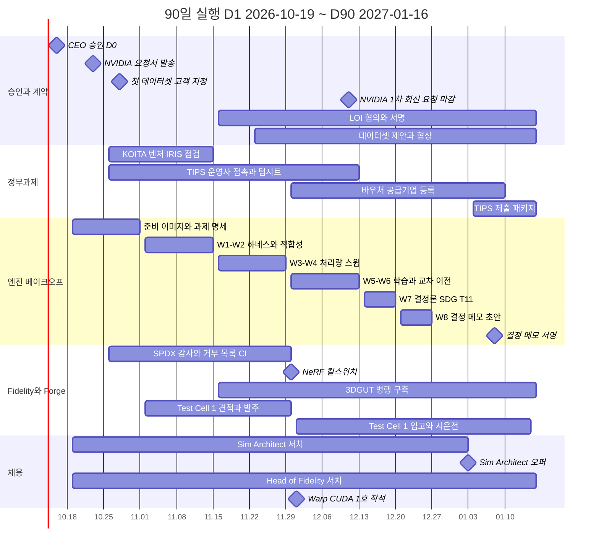
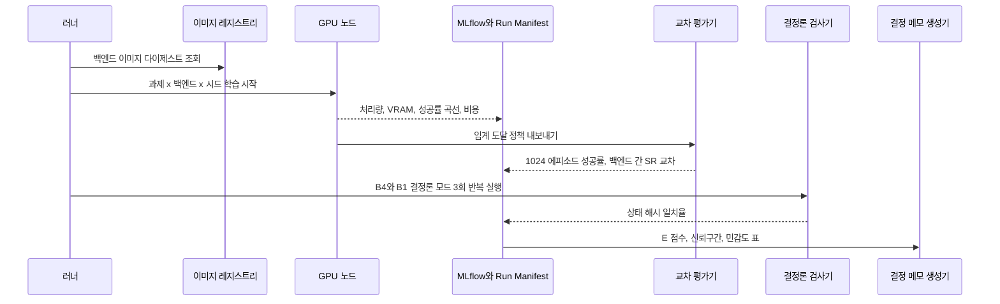

# 12. 90일 실행 계획: 승인 다음 날부터 G0 준비 완료까지

> **문서 번호** 12 · **기준일** 2026-10-06 · **버전** v1.0 · **상위 문서** [README](README.md)
> **관련 문서** [01 비전·포지셔닝](01-vision-positioning.md) · [03 엔진 선정](03-engine-selection-build-vs-buy.md) · [04 시스템 아키텍처](04-system-architecture.md) · [05 물리·현실감](05-physics-and-realism.md) · [07 학습 모듈](07-training-module.md) · [08 도메인 팩](08-domain-packs.md) · [09 로드맵·조직·예산](09-roadmap-organization-budget.md) · [10 사업모델·GTM](10-business-model-gtm.md) · [11 리스크·KPI·컴플라이언스](11-risk-kpi-compliance.md) · [부록 A 기술 카탈로그](appendix-a-technology-catalog.md) · [부록 B 출처·검증](appendix-b-sources-verification.md)
> **표기** **[A]** 계획 가정(실적 확인 전까지 목표치) · **[U]** 1차 출처 미확인(대외 사용 전 [부록 B](appendix-b-sources-verification.md) 절차로 재검증) · 태그 없는 수치는 결정 기록(DR) 부록 A 고정값 또는 GitHub·PyPI·SkyPilot 가격 카탈로그로 확인된 값 · ₩억 = 1억 원, 1 USD = ₩1,400 [A] · 모든 매출 수치는 예측이 아닌 목표 · M1 = 2026년 11월

---

## 핵심 요약

- **D0 = 2026-10-16(금) CEO 승인, D1 = 10-19(월), D90 = 2027-01-16(토)이다 [A].** 13주 동안 "기술 선택을 실측으로 확정하고, 첫 매출과 수요 증거를 서명으로 받는" 일만 한다. 90일 끝에는 G0(2027-02-26)의 7개 조건 가운데 4개(결정 메모, LOI 3건, Sim Architect 확정, 결정론 재현 하네스)가 끝나 있어야 한다.
- **CEO가 이번 달 서명할 안건은 5건이다.** ① P0 ₩11.2억 집행 ② Sim Architect와 Head of Fidelity & Evaluation 동시 서치 ③ NVIDIA Korea 서면 조건 요청서 발송 ④ Wave-1 앵커 3곳과 첫 데이터셋 고객 지정 ⑤ 6–8주 엔진 베이크오프 착수. 90일 동안 실제 지출은 약 ₩6.4억이다 [A].
- **NVIDIA 요청서는 1주 차(D5, 10-23)에 보낸다.** 16개 질문을 우선순위 3단계로 나누고, 회신은 서면만 인정한다. 1차 회신 요청일은 2026-12-11, 내부 마감은 M3 말(2027-01-29)이다. 무응답이어도 사업은 허용형 경로로 계속된다.
- **베이크오프는 W1(11-02) ~ W8(12-27), 결정 메모는 2027-01-08이다.** 백엔드 5개(B1–B5)에 과제 11개와 SDG를 돌리고, 결정은 `E(b,t)` = 성공률 보정 steps/s/$ 하나로 내린다. 차이가 10% 이내면 허용형 경로를 고른다. 인력이 부족하므로 과제를 A·B·C 세 등급으로 나눠 A등급(T1·T3·T5·T7 + SDG)부터 끝낸다.
- **첫 매출 오퍼는 두 장이다.** 첫 데이터셋 계약(정가 ₩6,000만–8,000만, 측정권 할인 후에도 ≥₩5,000만, mAP 인수 조건)과 12주 Cell-to-Policy PoC(₩1.5–2.5억, 선금 30%, 책임 상한 = 계약 금액, 양산 전환 옵션 포함)다. 두 계약 모두 측정권 조항을 시험한다.
- **앵커 LOI의 핵심 조항은 '정부 제안서 인용 동의'다.** 구매 의무는 없지만 TIPS 제출(2027 Q1)에 수요처 증거로 쓸 수 있어야 한다. LOI 3건은 D78–D90(M3)에 서명한다.

---

## 1. CEO 승인 요청 5건

**결론: 다섯 건 모두 이번 달 안에 서명해야 한다. 하나라도 늦추면 G0(2027-02-26)가 같은 기간만큼 밀리고, G1과 Series A가 연쇄적으로 밀린다.**

| # | 안건 | 승인 문안(서명용) | 자원 | 미승인·지연 시 비용 | 실행 책임 | 결정 기한 |
|---|---|---|---|---|---|---|
| ① | **P0 ₩11.2억 집행** | "P0(2026.11–2027.02) 예산 ₩11.2억(인건비 6.2, 컴퓨트 1.0, 라이선스 0.2, 법무·IP·인증 0.6, Fidelity Lab 1.6, GTM·관리 0.8, 예비비 0.8)의 집행을 승인한다. G0 미통과 시 P1 예산은 자동으로 동결한다." | ₩11.2억(90일 내 약 ₩6.4억) | 1개월 지연마다 G0·G1·Series A가 1개월씩 밀림 | CEO + CFO | D0(10-16) |
| ② | **게이팅 채용 2건 동시 서치** | "Sim Architect(CTO 트랙)를 M3까지, Head of Fidelity & Evaluation을 M4까지 확정하기 위해 국내·미국 리테인드 서치 2건을 계약한다. 미확정 시 DR 대체 경로를 자동 적용한다." | 서치 착수금 [A](헤드헌팅 예산 ₩1.4억/24개월 안) | Sim Architect 미확정 시 G0 최대 2개월 연기 | CEO | D5(10-23) |
| ③ | **NVIDIA 서면 조건 요청서 발송** | "§4의 요청서를 NVIDIA Korea와 Inception 담당자에게 발송하고, 회신은 서면만 인정한다. 독점 조항은 수용하지 않는다." | 외부 라이선스 자문 검토(법무 예산 안) | 테넌트·온프렘 경로의 RTX 등급 결정과 NVAIE 예비비 ₩2.9억 집행 판단이 늦어짐 | CEO + BD·라이선스 매니저 | D5(10-23) |
| ④ | **Wave-1 앵커 3곳과 첫 데이터셋 고객 지정** | "로봇 OEM 1, 조선 로보틱스 1, 물류·AI팩토리 1을 앵커 후보로, 기존 CEN SDG 고객 [고객명]을 첫 데이터셋 고객으로 지정한다." | CEO 영업 시간 주 1일 | 첫 매출(M4)과 TIPS 수요처 증거 동시 실패 | CEO | D10(10-28) |
| ⑤ | **6–8주 엔진 베이크오프 착수** | "W1(2026-11-02)부터 W8(2026-12-27)까지 베이크오프를 수행하고 결정 메모를 2027-01-08에 제출한다. 벤더 수치는 결정 근거에서 제외한다." | 클라우드 약 ₩0.4억(P0 컴퓨트 안), 재배치 인력 3–4 FTE | 서버 1호기 사양, Train 1 매트릭스, 토큰 원가가 모두 미확정으로 남음 | CTO 대행 + Kernel 리드 대행 | D0(10-16) |

**앵커 후보(DR §5.2):**
- ① 로봇 OEM: Doosan Robotics(Isaac·cuRobo 통합을 GitHub에서 확인) 또는 Rainbow Robotics(Samsung 지분 약 35%, 중간 신뢰도 [U])
- ② 조선 로보틱스: HD Hyundai Robotics, Samsung Heavy, Hanwha Ocean 중 1곳
- ③ 물류·AI팩토리: CJ Logistics, Hyundai Glovis, Coupang, 또는 M.AX AI팩토리 주관 제조사 중 1곳(물류 수요 자체는 미검증 [A])

**첫 데이터셋 고객 선정 기준 [A]:** 기존 CEN SDG 고객 가운데 ① 실데이터 테스트셋(라벨된 실사진 1,000장 이상)을 제공할 수 있고 ② 2027 회계연도 예산이 12–1월에 확정되며 ③ 측정권 조항을 논의할 의사가 있는 곳. 1순위와 2순위를 함께 지정하고 둘 다에 제안한다.

---

## 2. 90일 운영 체계

**결론: 90일 동안은 매주 하나의 스코어카드로만 관리한다. 지표가 노란색이면 다음 주 월요일 회의에서 대안을 결정한다.**

### 2.1 역할과 리듬

| 역할 | 90일 동안의 담당자 [A] | 비고 |
|---|---|---|
| CEO | 승인, 앵커·첫 고객 영업, NVIDIA 협상 리드, 채용 최종 면접 | 주 1일 이상 영업 |
| CTO 대행 | 기존 CEN 기술 책임자 | Sim Architect 착석(M3)과 함께 인계 |
| Kernel 리드 대행 | 재배치된 마켓플레이스·플랫폼 엔지니어(WS1) | Warp/CUDA 1호(M2 착석)가 승계 |
| Head of Fidelity 대행 | CTO 대행 겸임 + 외부 자문 교수(겸직 후보) | Test Cell 1 발주·측정 프로토콜 초안 |
| BD·정부과제·라이선스 매니저 | M1 착석(서치는 D1 개시) | 그 전까지 CEO 직접 |
| Forge | 재배치 NeRF 엔지니어 2명 | 라이선스 감사, 3DGUT 이전 |

| 회의 | 주기 | 참석 | 산출 |
|---|---|---|---|
| 운영 회의 | 매주 월 09:00, 45분 | CEO, CTO 대행, BD, Forge, Fidelity 대행 | 스코어카드 갱신, 결정 로그 |
| 베이크오프 리뷰 | 매주 금, 60분 | CTO 대행, Kernel 리드 대행, Skill(ML), SDG | 주간 측정 결과, 다음 주 과제 |
| 체크포인트 | D30(11-17), D60(12-17), D90(01-16) | CEO 주재 | 스코어카드 판정, 이사회 보고(D90) |

### 2.2 90일 스코어카드

| 영역 | D30 (11-17) | D60 (12-17) | D90 (01-16) |
|---|---|---|---|
| NVIDIA | 요청서 발송(D5), 1차 미팅 | 2차 미팅, 1차 서면 회신 요청 마감(12-11) | 1차 서면 회신 수령. 없으면 M3 말 X2 경보 준비 |
| Sim Architect | 롱리스트 ≥15, 인터뷰 ≥5 | 최종 2인, 레퍼런스 체크 | 오퍼 수락(M3 확정) |
| Head of Fidelity | 롱리스트 ≥10 | 인터뷰 ≥4 | 최종 2인(M4 확정) |
| 베이크오프 | W1–W2, 적합성 v0 × 5 구성 | W3–W6 | 결정 메모 서명(01-08), Train 1 매트릭스 |
| Test Cell 1 | BOM 견적 3건 | 발주 완료(11-30) | 시운전, 측정 프로토콜 v1(01-15) |
| Forge·라이선스 | SPDX 감사 착수, 거부 목록 CI | NeRF 킬스위치(11-30), 3DGUT 병행 구축 | Silver 자산 50개 |
| 첫 데이터셋 | 고객 지정(D10) | 제안서 발송 | 최종 협상(서명 목표 M3–M4) |
| 앵커 LOI | 3곳 1차 미팅 | 초안 협의 | **3건 서명** |
| 정부과제 | TIPS 운영사 접촉, KOITA·벤처·IRIS 점검 | 운영사 텀시트, 바우처 공급기업 등록 | TIPS 제출 패키지, 바우처 수요기업 매칭 |
| 인프라 | 국내 CSP 견적 3건 | CSP 1곳 이미지 실측(R580) | 서울 RT 용량 계약 |
| 브랜드 | 상표 검색 | 상표 출원(M2) | — |
| 지출 누계 [A] | 약 ₩1.2억 | 약 ₩3.6억 | 약 ₩6.4억 |

---

## 3. 주차별 계획 (D1–D90)

**결론: 처음 2주는 서명과 계약(요청서, 서치, 고객 지정), 3–10주는 베이크오프와 영업 병행, 마지막 3주는 결정 메모와 서명 수확이다.**

| 주 | 기간 | 사업·대외 | 기술·베이크오프 | 조직·재무 | 주말 산출물 | 책임 |
|---|---|---|---|---|---|---|
| 1 | D1–D7 (10-19 ~ 10-25) | **NVIDIA 요청서 발송(10-23)**, Inception 가입 신청, 앵커 3곳 타깃·접촉 담당 지정 | 재배치 6명 착수, 베이크오프 과제 명세 초안(T1–T11 + SDG), CEN NeRF SPDX 감사 범위 정의 | 리테인드 서치 2건 계약, JD 게시(Sim Architect, Head of Fidelity, Warp/CUDA, BD), CFO 현금 확인 착수, P0 예산 코드 개설 | 요청서 발송 증빙, 서치 계약서, 과제 명세 v0 | CEO, CTO 대행 |
| 2 | D8–D14 (10-26 ~ 11-01) | **첫 데이터셋 고객 지정(10-28)**, 앵커 1차 미팅 요청, TIPS 운영사 후보 3곳 접촉, KOITA 연구소·벤처 인증·IRIS/SMTECH 계정 점검 | 클라우드 GPU 예약(RTX PRO 6000, H100, L40S), 컨테이너 이미지(R580 이상, CUDA 13), 국내 CSP 3사에 RT GPU·MIG·R580 견적 요청, ScanCode SPDX 스캔 개시 | BD 매니저 오퍼(M1 착석), Sim Architect 롱리스트 ≥15 | CSP 견적 요청 3건, 이미지 v0 | CEO, Platform |
| 3 | D15–D21 (11-02 ~ 11-08) · **W1** | NVIDIA 1차 미팅, 앵커 미팅 1–2곳, 상표 검색(KIPRIS·USPTO·EUIPO), K-Humanoid Alliance 가입 신청 | 이미지·드라이버·국내 CSP 검증, 과제 명세 확정, Run Manifest v0, 측정 하네스 dry-run | 촬영·랩 테크니션, RL/IL, K8s 서치 개시 | 하네스 dry-run 로그, Manifest v0 스키마 | CTO 대행 |
| 4 | D22–D28 (11-09 ~ 11-15) · **W2** | 첫 데이터셋 고객 요구 인터뷰(SKU, 셀 환경, 실데이터 테스트셋) | 적합성 스위트 v0(C01–C05) × B1–B5, SPDX 1차 결과 → 거부 목록 CI 적용 | Sim Architect 1차 인터뷰 ≥5 | 적합성 행렬 v0, 감사 1차 보고 | Kernel 대행, Forge |
| 5 | D29–D35 (11-16 ~ 11-22) · **W3** | **D30 체크포인트(11-17)**, TIPS 운영사 2차 미팅, Arena 공동서명 후보(KTL·KIRIA·TTA) 접촉 계획, LOI 초안 v0 | A등급 처리량 스윕(T1·T3·T5·T7, 환경 1k–16k), VRAM, gsplat 1.6.0·3DGRUT 2.0 병행 구축 | Head of Fidelity 롱리스트 ≥10 | D30 스코어카드 | CEO |
| 6 | D36–D42 (11-23 ~ 11-29) · **W4** | **데이터셋 제안서 발송**(§6.1), LOI 초안 3곳 송부 | B등급 처리량 스윕(T2·T4·T6·T10·T11), steps/s/$ 표 v1, **Test Cell 1 발주(11-30 마감)** | Warp/CUDA 1호 오퍼(12-01 착석) | 제안서, Test Cell 1 PO | CEO, Fidelity 대행 |
| 7 | D43–D49 (11-30 ~ 12-06) · **W5** | **AI·데이터 바우처 공급기업 등록 서류 제출**, 데이터권·측정권 템플릿 v1(외부 자문 검토) | **NeRF 킬스위치 적용(11-30)**, A등급 보상 임계까지 학습(시드 3개), T7 Drake 대조 착수 | Warp/CUDA 1호 착석 | 바우처 접수증, 킬스위치 보고 | BD, Kernel |
| 8 | D50–D56 (12-07 ~ 12-13) · **W6** | **NVIDIA 2차 미팅, 1차 서면 회신 요청 마감(12-11)**, TIPS 운영사 텀시트, PoC 오퍼 시트 확정(§6.2) | sim2sim 교차 이전 매트릭스, B등급 학습, Forge v0 골격, 라이선스 레지스트리 v0 | Sim Architect 최종 2인 | 텀시트, 오퍼 시트 v1 | CEO, Skill |
| 9 | D57–D63 (12-14 ~ 12-20) · **W7** | **D60 체크포인트(12-17)**, Arena 공동서명 후보 1차 미팅, LOI 2차 협의 | 결정론(Newton 결정론 모드·MuJoCo CPU 비트 일치), GPU 간 재현성, SDG 처리량(RTX PRO 6000 vs L40S), T11 스트레스, C등급(T8·T9) 여력 시 | Sim Architect 레퍼런스 체크, Head of Fidelity 인터뷰 | 결정론 리포트, SDG 원가표 | Kernel, SDG |
| 10 | D64–D70 (12-21 ~ 12-27) · **W8** | 첫 데이터셋 계약 조건 협상(고객 2027 예산 확정 시기) | 결정 메모 초안: 작업 유형별 기본 백엔드, Train 1 매트릭스, GPU 풀 사이징, 토큰 원가. 실셀 이전(T3·T5)은 Test Cell 1 시운전 뒤 2월로 이월 | 상표 출원(12-30 마감) | 결정 메모 초안 v0 | CTO 대행 |
| 11 | D71–D77 (12-28 ~ 01-03) | 바우처 수요기업 후보 목록, 연초 고객 일정 확정 | 엔진 검토 위원회 임시 회의(결정 메모 리뷰) | **Sim Architect 오퍼 발행** | 오퍼레터 | CEO |
| 12 | D78–D84 (01-04 ~ 01-10) | **LOI 서명 주간 시작**, TIPS 제출 패키지 초안(TRL 4→7, 중복 매트릭스, 3책5공 배치표) | **결정 메모 서명(01-08)**, Train 1 매트릭스 발행, 서버 1호기 사양 확정·견적 요청 | 데이터룸 골격 착수 | 결정 메모, 매트릭스 | CTO 대행 → Sim Architect |
| 13 | D85–D90 (01-11 ~ 01-16) | **LOI 3건 서명 완료**, 바우처 수요기업 매칭, **서울 RT 용량 계약**, D90 이사회 보고 | **Test Cell 1 시운전·측정 프로토콜 v1(01-15)**, Forge v0 첫 Silver 50개 | Series A 데이터룸 골격, KPI 대시보드, G0 체크리스트 상태 점검 | D90 스코어카드, G0 준비 보고 | CEO |



---

## 4. NVIDIA 협상

**결론: NVIDIA에는 'GPU 사용량을 늘리는 한국 파트너'로 접근하고, 답은 서면으로만 받는다. 협상력의 근원은 허용형 전용 경로(Zone T/S)라는 대안이 이미 설계돼 있다는 사실이다.**

### 4.1 체크리스트 16개 항목

우선순위: **P1** = 1차 서면 회신(요청 2026-12-11, 내부 마감 M3 말 2027-01-29)에 반드시 포함, **P2** = M6까지, **P3** = M10 최종 조건까지.

| # | 항목 | 핵심 질문 | 원하는 답 | 대안(무응답·거부 시) | 연동 결정 | 우선 |
|---|---|---|---|---|---|---|
| 1 | 산출물 면제 | Isaac Sim, RTX, Replicator, NuRec로 만든 데이터셋·영상·정책·USD 자산의 판매·마켓 재판매에 NVAIE가 필요한가 | 불필요하다는 서면 확인 | NVAIE 예비비 ₩2.9억 집행(Inception 할인 시 약 ₩0.7억 [U]) | Zone F 매출 전체 | P1 |
| 2 | 멀티테넌트 SaaS | Kit·Isaac Sim 브라우저 스트리밍을 제3자에게 제공할 때의 라이선스 형태(GPU당·동시 사용자당), NVAIE와 Omniverse Enterprise 중 무엇인가 | 가격표와 조건 | Zone T는 허용형 전용, RTX 등급 미출시 | Zone T RTX 등급 | P2 |
| 3 | 가격 | NVAIE 리스트 가격($4,500/GPU/년 [U]), Inception 할인(75% [U]), 원화 견적, 클라우드 버스트 GPU 산정 방식 | 원화 서면 견적 | 리스트 가격 기준 예비비 유지 | 예비비 규모 | P1 |
| 4 | 온프렘·에어갭 재배포 | Kit, Isaac Sim, ovrtx, ovphysx 바이너리, isaacsim/isaaclab 휠의 OEM·ISV 재배포, 컨테이너 재배포, 에어갭 업데이트 | OEM 조건 또는 '불가' 확인 | Sovereign은 허용형 코어 + RTX는 BYOL | Sovereign RTX 번들 | P1 |
| 5 | BYOL 대행 운영 | 고객 보유 NVAIE로 AICHEMIST 클라우드에서 대신 운영할 수 있는가 | 허용 여부 | 고객이 직접 운영하는 환경만 연동 | Enterprise VPC RTX 옵션 | P2 |
| 6 | NVIDIA 자산 | SimReady·Isaac 자산·텍스처를 데이터셋·마켓에 번들·재판매할 수 있는가 | 허용 범위 | NVIDIA 자산을 산출물에서 제외, 자체 촬영 자산만 사용 | 마켓 출처 규칙 | P2 |
| 7 | 텔레메트리 | Kit 익명 사용 데이터 비활성화, 에어갭 운용 방법 | 비활성화 절차 | Zone F 망 분리·이그레스 차단 | 국방·재벌 보안 심사 | P1 |
| 8 | cuRobo | Isaac Lab 설치본 cuRobo의 약관, Apache 태그 업스트림의 Isaac Lab 밖 사용, SkillGen | 서면 확인 | Apache 태그 고정 업스트림만, SkillGen 비활성 | SkillGen 기능 | P3 |
| 9 | NuRec·3DGUT 컨테이너 | 성숙도, 라이선스, SaaS 사용 | 조건 | 3DGRUT 2.0(Apache-2.0) 단독 | Forge·DATA의 NuRec 도입 | P2 |
| 10 | ovrtx·ovphysx | GA 일정, 프로덕션 약관, ovstage 없이 ovphysx 소스 빌드 가능 여부 | 로드맵과 조건 | Kit 기반 RTX 유지, PhysX SDK 소스 어댑터는 조건부(P2) | Kit-less RTX, PhysX 어댑터 대안 | P3 |
| 11 | 모델 약관 | GR00T N1.7 Open Model License(상업 파인튜닝, 파인튜닝 가중치 재배포, 군사 조항), Cosmos 3 OpenMDW-1.1, Cosmos Transfer 2.5 | 서면 해석 | SmolVLA 기본 등급, 법률 검토(V7) | VLA 등급, 국방 프로파일 | P1 |
| 12 | Isaac Teleop·CloudXR | SaaS 텔레옵 라이선스 | 조건 | GELLO + SpaceMouse + LeRobot 기록 | 테넌트 텔레옵 경로 | P3 |
| 13 | 파트너 프로그램 | Inception → NPN 등급, HMG·Samsung·SK·Naver 공동 판매, 얼리 액세스, SI 계열사와의 채널 충돌 | 파트너 계약 경로 | Inception만으로 진행, 그룹 SI 리셀러 채널 | GTM 채널, NPN(M10 목표) | P2 |
| 14 | 로드맵·안정성 | Isaac Sim 7.x·Kit API 동결 약속, LTS 계획, Isaac Lab 3.x GA 일정 | 일정 | 반기 트레인, 7.x는 GA + 패치 1회 후 채택 | 릴리스 트레인 | P2 |
| 15 | 국내 RT 용량 | NVIDIA 경유로 국내 CSP(Naver, KT, NHN)의 RTX PRO 6000·L40S 확보 가능성 | 연결 | 국내 CSP 직접 계약 + 자체 서버 2대 | RT 풀 조달 | P1 |
| 16 | 수출통제 | 중동·국방 고객 대상 GPU·모델 가중치의 EAR 지침 | 가이드 | 건별 외부 수출통제 자문 | Wave 3 해외 | P3 |

### 4.2 협상 운영 원칙

| 원칙 | 내용 |
|---|---|
| 서면만 인정 | 권한 있는 NVIDIA 담당자의 이메일 또는 계약서만 '답'으로 기록한다. 회의록·구두 답변은 참고다. 모든 회신은 라이선스 레지스트리에 원문과 함께 등록한다 |
| 우리가 주는 것 | 24개월 GPU 사용 계획(자체 RTX PRO 6000 16장, RT 클라우드 약 11만 GPU-시간, H100급 학습 약 6.5만 GPU-시간), Isaac Lab·Newton 기반 한국 레퍼런스, Newton 업스트림 기여, HMG·Samsung·SK·Naver 피지컬 AI 프로그램 공동 판매, 행사 공동 사례 발표 |
| 받지 않는 것(레드라인) | 독점·우선협상 조항, Zone T/S 허용형 스택에 대한 제한, 에어갭 환경 텔레메트리, 인증서·페어드 코퍼스 데이터에 대한 NVIDIA 권리 |
| 일정 | D5 발송 → D15–D21 1차 미팅 → D50–D56 2차 미팅 → 12-11 1차 서면 회신 요청 → M3 말 내부 마감 → M6 P2 항목 → M10 최종 조건 → G1(M11) 판정 |
| 에스컬레이션 | M3 말까지 1차 회신이 없으면 트리거 X2: G1에서 '허용형 전용' 확정 경로로 준비하고 NVAIE 예비비 집행 여부를 M10에 판단한다 |
| 법률 검토 | 외부 라이선스 자문이 모든 회신을 해석 메모로 정리한다. 해석이 갈리면 보수적 해석을 따른다 |

### 4.3 요청서 초안 (국문)

> **수신:** NVIDIA Korea 엔터프라이즈·파트너 담당 귀하 / NVIDIA Inception Program 담당 귀하
> **발신:** AICHEMIST 대표이사 [성명]
> **일자:** 2026년 10월 23일
> **제목:** CEN Athanor 플랫폼의 NVIDIA Isaac Sim·Omniverse 런타임 상업적 이용 조건에 대한 서면 확인 요청
>
> 안녕하십니까. AICHEMIST는 GPU 클라우드 워크스페이스, NeRF 기반 2D→3D 변환, 토큰 기반 마켓플레이스를 제공하는 3D·AI 플랫폼 CEN을 운영하는 회사로, 현재 로봇·제조 고객을 위한 Physical-AI 디지털 트윈 플랫폼 'CEN Athanor'를 준비하고 있습니다. 저희는 Isaac Lab, Newton, OpenUSD를 핵심 기술로 채택했으며, 향후 24개월 동안 RTX PRO 6000 Blackwell 서버 16장 도입, RT GPU 클라우드 약 11만 GPU-시간, H100급 학습 약 6.5만 GPU-시간 사용을 계획하고 있습니다. 한국 로봇·조선·물류 고객 현장에서 NVIDIA 스택의 사용을 넓히는 파트너가 되고자 합니다.
>
> 사업을 시작하기 전에 라이선스 조건을 정확히 지키고자, 아래 사항에 대한 NVIDIA의 **서면 확인**을 요청드립니다. 저희의 이용 구조는 다음 세 구역으로 나뉩니다.
> - **내부 팩토리:** AICHEMIST 엔지니어만 Isaac Sim 6.1, Kit, RTX 센서, Replicator, Isaac Lab(PhysX 경로)을 사용하고, 고객에게는 데이터셋·학습된 정책·USD 자산·리포트 같은 산출물만 납품합니다.
> - **고객 대면 클라우드:** 고객이 접속하는 환경에는 NVIDIA 독점 런타임을 넣지 않고 Newton, MuJoCo, Isaac Lab 소스 빌드(Kit-less) 등 허용형 오픈소스만 사용합니다.
> - **고객 온프레미스·에어갭:** 위와 같은 허용형 구성을 기본으로 하며, RTX 기능은 고객이 보유한 NVIDIA 라이선스로 고객이 직접 운영하는 경우에만 연동합니다.
>
> **확인을 요청드리는 사항**
> 1. **산출물 판매:** 내부 팩토리에서 Isaac Sim·RTX·Replicator·NuRec로 생성한 데이터셋, 영상, 학습된 정책, USD 자산을 고객에게 판매하거나 마켓플레이스에서 재판매할 때 NVIDIA AI Enterprise 또는 Omniverse Enterprise 라이선스가 필요한지 여부
> 2. **가격:** 필요한 경우 GPU당 연간 가격, Inception 회원 할인 적용 여부, 원화 견적, 클라우드 버스트 GPU의 산정 방식
> 3. **온프레미스·에어갭 배포:** Kit, Isaac Sim, ovrtx, ovphysx 바이너리, isaacsim·isaaclab PyPI 휠, 컨테이너의 OEM·ISV 재배포 가능 여부와 조건, 에어갭 환경의 업데이트 방식
> 4. **텔레메트리:** Kit의 익명 사용 데이터 수집을 끄는 방법과 에어갭 운용 시 요구사항
> 5. **모델 약관:** GR00T N1.7(상업적 파인튜닝, 파인튜닝 가중치 재배포, 군사 용도 조항), Cosmos 3(OpenMDW-1.1), Cosmos Transfer 2.5의 상업적 이용 해석
> 6. **국내 RT GPU 용량:** NVIDIA를 통해 국내 클라우드 사업자(Naver, KT, NHN)의 RTX PRO 6000·L40S 용량을 연결받을 수 있는지 여부
> 7. **그 밖의 사항(일정 협의 가능):** 멀티테넌트 브라우저 스트리밍의 라이선스 형태, 고객 라이선스로의 대행 운영, NVIDIA 자산의 데이터셋 번들 범위, cuRobo와 SkillGen, NuRec·3DGUT 컨테이너, ovrtx·ovphysx의 GA 일정과 ovstage 없는 소스 빌드, Isaac Teleop·CloudXR, Inception에서 NPN으로의 전환과 공동 판매, Isaac Sim 7.x·Kit의 LTS 계획, 수출통제 지침
>
> **회신 요청:** 1–6번은 가능하시면 **2026년 12월 11일**까지, 7번은 2027년 상반기 중 서면(이메일 또는 계약서)으로 회신해 주시기 바랍니다. 질문별 상세 표를 첨부합니다. 한 차례 미팅으로 저희 이용 구조를 직접 설명드릴 수 있다면 더욱 좋겠습니다.
>
> 저희는 특정 공급사에 대한 독점 조건 없이, NVIDIA 스택 위에서 한국 Physical-AI 현장의 레퍼런스를 함께 만들어 가기를 희망합니다. 검토에 감사드립니다.
>
> AICHEMIST 대표이사 [성명] 드림 · [이메일] · [전화]
> 첨부: ① 이용 구조도(3개 구역) ② 질문 16개 상세표 ③ 24개월 GPU 사용 계획

### 4.4 Request letter draft (English)

> **To:** Enterprise & Partner Team, NVIDIA Korea; NVIDIA Inception Program Team
> **From:** [Name], CEO, AICHEMIST
> **Date:** October 23, 2026
> **Subject:** Request for written confirmation of commercial-use terms for NVIDIA Isaac Sim and Omniverse runtimes in the CEN Athanor platform
>
> Dear NVIDIA Korea and Inception teams,
>
> AICHEMIST operates CEN, a 3D and AI platform that offers GPU cloud workspaces, NeRF-based 2D-to-3D conversion and a token-based marketplace, and is preparing **CEN Athanor**, a Physical-AI digital twin platform for robotics and manufacturing customers in Korea. We have standardized on Isaac Lab, Newton and OpenUSD. Over the next 24 months we plan to deploy 16 RTX PRO 6000 Blackwell GPUs in our own servers and to use about 110,000 RT-GPU cloud hours and about 65,000 H100-class training hours. Our goal is to grow the use of the NVIDIA stack across Korean robotics, shipbuilding and logistics sites.
>
> Before we launch, we want to make sure we comply fully with NVIDIA's terms. We therefore request **written confirmation** on the points below. Our usage falls into three zones:
> - **Internal factory:** Only AICHEMIST engineers use Isaac Sim 6.1, Kit, RTX sensors, Replicator and the Isaac Lab PhysX path. Customers receive outputs only: datasets, trained policies, USD assets and reports.
> - **Customer-facing cloud:** No NVIDIA proprietary runtime is exposed to customers. This tier uses permissive open-source components only, such as Newton, MuJoCo and Isaac Lab built from source in Kit-less mode.
> - **Customer on-premises and air-gapped sites:** The same permissive stack by default. RTX features are connected only where the customer operates them under its own NVIDIA license.
>
> **Points for confirmation**
> 1. **Sale of outputs:** Whether an NVIDIA AI Enterprise or Omniverse Enterprise license is required when we sell, or resell through our marketplace, datasets, videos, trained policies and USD assets generated in our internal factory with Isaac Sim, RTX, Replicator or NuRec.
> 2. **Pricing:** If a license is required, the annual per-GPU price, the Inception discount, a KRW quotation, and how burst cloud GPUs are counted.
> 3. **On-premises and air-gapped deployment:** Whether, and on what terms, Kit, Isaac Sim, the ovrtx and ovphysx binaries, the isaacsim and isaaclab PyPI wheels and their containers may be redistributed under an OEM or ISV agreement, and how updates work in air-gapped environments.
> 4. **Telemetry:** How to disable Kit's anonymous usage-data collection, and any requirements for air-gapped operation.
> 5. **Model terms:** Your interpretation of commercial use for GR00T N1.7 (commercial fine-tuning, redistribution of fine-tuned weights, military-use clauses), Cosmos 3 (OpenMDW-1.1) and Cosmos Transfer 2.5.
> 6. **RT-GPU capacity in Korea:** Whether NVIDIA can connect us with RTX PRO 6000 and L40S capacity at Korean cloud providers (Naver, KT, NHN).
> 7. **Further items (timing flexible):** licensing for multi-tenant browser streaming, operation on a customer's license in our cloud, the scope for bundling NVIDIA assets in datasets, cuRobo and SkillGen, NuRec and 3DGUT containers, GA timing for ovrtx and ovphysx and building ovphysx from source without ovstage, Isaac Teleop and CloudXR, the path from Inception to NPN and co-selling, LTS plans for Isaac Sim 7.x and Kit, and export-control guidance.
>
> **Requested response:** For items 1–6, we would be grateful for a written reply (email or contract) by **December 11, 2026** if possible. Item 7 can follow during the first half of 2027. A detailed question table is attached. We would also welcome a meeting to walk you through our usage model.
>
> We do not seek exclusivity with any vendor. We want to build Korean Physical-AI references together on the NVIDIA stack. Thank you for your consideration.
>
> Sincerely,
> [Name], CEO, AICHEMIST · [email] · [phone]
> Attachments: (1) usage-zone diagram (2) detailed table of 16 questions (3) 24-month GPU usage plan

---

## 5. 엔진 베이크오프

**결론: 6–8주, 약 ₩0.4억으로 "어느 작업에 어느 엔진"을 사내 실측으로 정한다. 결정은 성공률 보정 steps/s/$ 하나로 내리고, 동률이면 허용형을 고른다.** 엔진 후보의 배경과 재결정 트리거는 [03 §13–14](03-engine-selection-build-vs-buy.md), 물리 라우팅 가설은 [05 §2](05-physics-and-realism.md)에 있다.

### 5.1 범위·일정·인력

| 항목 | 내용 |
|---|---|
| 일정 | W0 준비(10-19 ~ 11-01), W1 = 11-02 ~ W8 = 12-27, 결정 메모 2027-01-08 |
| 하드웨어 | RTX PRO 6000 Blackwell Server 1장, H100 1장(클라우드), SDG 단가 비교용 L40S 1장. 동일 이미지, 드라이버 R580 이상, CUDA 13. 국내 CSP 이미지 1종에서 재현 |
| 예산 | 클라우드 약 ₩0.4억(P0 컴퓨트 안) |
| 인력 [A] | CTO 대행 0.5, Kernel 리드 대행(WS1 재배치) 1.0, ML 엔지니어(WS5) 1.0, SDG 엔지니어(WS3) 0.5, Warp/CUDA 1호 1.0(W5부터) |
| 우선순위 [A] | **A등급(필수, W3–W6):** T1, T3, T5, T7, SDG · **B등급(W4–W7):** T2, T4, T6, T10, T11 · **C등급(여력 시, 아니면 P1로 이월):** T8, T9 |
| 구현 원칙 | Isaac Lab·mjlab 기본 제공 과제(보행, 들기, 손안 재배치, 삽입 계열)를 먼저 쓰고, T5(한국 SKU), T6(폴리백), T10(Kamino), T11(60 DoF 초과)만 새로 만든다 |

### 5.2 백엔드 목록

| ID | 구성 | 핀(2026-10 기준) | 라이선스·구역 | 이 백엔드가 답하는 질문 |
|---|---|---|---|---|
| **B1** | Newton 1.6.x 단독(MJWarp 솔버, Kernel v0 경유) | Newton 1.6.1, Warp 1.18, R580 이상 | Apache-2.0, Zone T·S 호환 | 테넌트 기본 백엔드가 될 수 있는가 |
| **B2** | Isaac Lab 3.x Kit-less Newton(번들 핀) | Isaac Lab 3.x GA(지연 시 3.0.0-EA: Newton 1.5.2, Warp 1.16) | BSD-3 소스 빌드 + Apache, Zone T 호환 | 학습 프레임워크를 팩토리·테넌트 공통으로 쓸 수 있는가. Newton 백엔드는 beta |
| **B3** | Isaac Lab 3.x + PhysX(Isaac Sim 6.1) | Isaac Sim 6.1.0, Kit 110.x, PhysX 5.11 | Isaac Sim·Kit 독점 → **Zone F 전용** | 접촉 집약 팩토리 기본이 PhysX여야 하는가 |
| **B4** | MuJoCo 3.15 CPU | 3.15.0 | Apache-2.0 | 레퍼런스이자 인증 재현(D0) 경로 |
| **B5** | mjlab 1.6.0 | 1.6.0(MJWarp 3.11 고정 여부 W1 재확인) | Apache-2.0 | 보행·모션 트래킹 테넌트 템플릿 후보 |
| 기준 | Drake v1.57.0 | v1.57.0 | BSD-3, 내부 검증 | T7 오프라인 접촉 기준(hydroelastic·SAP) |
| 선택 | Genesis 1.4.3 | 1.4.3(Nyx 렌더러 제외) | Apache-2.0, 관찰 전용 | T1·T3 두 과제만, 비CUDA 헤지 관찰 |
| 제외 | PhysX SDK 소스 어댑터 | — | — | 아직 존재하지 않음. P2 조건부 착수(DR §3.4) |

### 5.3 과제 명세 (T1–T11 + SDG)

- **보상 임계의 정의:** 백엔드마다 보상 스케일이 다르므로, '보상 임계'는 원시 보상이 아니라 **정규화된 성공 지표**로 정의한다. 학습 중 50 iteration마다 256개 환경으로 평가하고, 임계를 처음 넘은 시점을 1,024 에피소드 평가로 확인한다.
- **시드:** 과제 × 백엔드마다 3개. 학습 예산 상한(GPU-시간)을 넘기면 '미도달'로 기록한다.
- **B4(MuJoCo 3.15 CPU)의 역할:** CPU 경로이므로 대규모 병렬 학습은 하지 않는다. 다른 백엔드에서 학습한 정책의 교차 평가, 결정론 재현(D0), 처리량 기준선(코어당 steps/s)에만 쓴다. 표의 'B4'는 이 의미다.
- **T5 자산:** Forge v0가 나오기 전이므로 기존 CEN SDG 자산과 W0–W2에 gsplat로 만든 Bronze 스캔으로 한국 SKU 30종을 구성한다 [A]. 물성은 VLM 사전분포를 쓰고, 결과는 G0의 Silver/Gold 자산과 섞지 않는다.

| ID | 과제 | 로봇·자산 | 학습 환경 수/GPU [A] | 성공 지표 | 보상 임계(성공 기준) [A] | 학습 예산 상한/시드 [A] | 백엔드 | 결정 연결 |
|---|---|---|---|---|---|---|---|---|
| T1 | G1 속도 추종(평지·험지) | Unitree G1 | 4,096(스윕 1k–16k) | 선속도 추종 RMS 오차, 넘어짐 비율 | 험지에서 RMS ≤0.2 m/s, 넘어짐 ≤3%(1,024 에피소드) | 6 GPU-h | B1·B2·B3·B5, B4 평가 | 보행 기본 백엔드, RTX PRO 6000 vs H100 steps/s/$ |
| T2 | BeyondMimic 모션 클립 | G1 + 클립 3종(걷기·회전·상체 동작) | 4,096 | 클립 완주율, 평균 몸체 위치 오차 | 완주 ≥90%, 오차 ≤0.1 m | 24 GPU-h | B2·B3·B5 | 모션 트래킹 템플릿 백엔드, mjlab 성숙도 |
| T3 | Franka 큐브 들기 | Franka + 5 cm 큐브 | 4,096 | 0.1 m 들어 2초 유지 | 성공 ≥95% | 3 GPU-h | B1–B5, Genesis 관찰 | 기초 조작 처리량, 실셀 이전(2월) |
| T4 | LEAP/Allegro 손안 재배치 | LEAP 또는 Allegro 핸드 | 8,192 | 목표 자세 연속 성공 횟수 | 평균 연속 성공 ≥10(자세 오차 ≤0.2 rad) | 8 GPU-h | B1·B2·B3 | '최대 65% 빠름' 벤더 주장 검증, 덱스터러스 기본값 |
| T5 | 한국 SKU 클러터 빈 피킹 | 코봇 + 흡착·평행 그리퍼, 한국 SKU 30종(빈당 15개) | 2,048 | 파지·들기·적재 성공, 시간당 피킹 | 성공 ≥85%(1,000 피킹) | 6 GPU-h | B1·B2·B3·B4 | **Wave 1 핵심 과제 기본 백엔드**, 실셀 이전(2월) |
| T6 | 폴리백 피킹(VBD) | 폴리백 10종 | 1,024 | 0.15 m 들어 3초 유지, 시드 간 차이 | 성공 ≥80%, 시드 간 ≤2%p(D1 등급) | 8 GPU-h | B1(VBD)·B3·B4(flex) | 변형체 상품 출시 가능성, '통계적 재현' 수준 |
| T7 | 페그·커넥터 삽입 | 공차 0.5 mm 페그·커넥터 | 2,048 | 10초 안에 공칭 깊이 95% 삽입, 접촉력 피크 | 성공 ≥90%, Drake 대비 피크 ±20%(스크립트 궤적 100개) | 12 GPU-h | B1(SDF·hydroelastic)·B3(SDF)·B4, Drake 기준 | PhysX 어댑터 조건 (b), 테넌트 접촉 기본값 |
| T8 | 케이블 삽입 | 커넥터 달린 케이블 | 1,024 | 삽입 성공, 백엔드 간 끝점 ADE | 성공 ≥70%, ADE ≤10 mm | 12 GPU-h | B1(VBD)·B3·B4(cable) | 케이블·호스 과제(조선·가전) |
| T9 | 천 접기(선택) | 수건 1종 | 512 | 접힘 IoU | IoU ≥0.8에서 성공 ≥60% | 8 GPU-h | B1(Style3D·VBD)·B3 | Style3D·VBD 성숙도 |
| T10 | Kamino 폐루프 그리퍼 | 링크 기구 그리퍼 | 4,096 | 파지 성공, 링크 구속 오차 | 성공 ≥90%, 구속 오차 ≤0.5 mm | 4 GPU-h | B1(Kamino)·B4(equality) | Kamino 채택 범위 |
| T11 | 휴머노이드 + 양손 덱스터러스(60 DoF 초과) | 휴머노이드 + 핸드 2개(62–84 DoF) | 256–4,096 스윕 | env-steps/s, VRAM, 제약 위반, 솔버 실패율, 2 GPU-h PPO 학습 신호 | 학습 임계 없음. 솔버 실패 ≤0.1%, 정지·보행 1주기 관절 RMSE ≤2°(MuJoCo CPU 대비) | 2 GPU-h | B1(분할 트리)·B3·B4 | 휴머노이드+핸드 템플릿 경로(O1–O4, [05 §5.2](05-physics-and-realism.md)) |
| SDG | 래스터·RTX 실시간·경로추적 이미지 생성 | T5 빈 장면 + 공장 셀 장면, 1080p, RGB·깊이·인스턴스 세그·2D/3D bbox | 모드별 1만 프레임 | 이미지/초/GPU, 100만 장당 원가, 라벨 유효율 | 라벨 유효율 ≥99.5%, 원가 ≤ 토큰 가격의 50%(래스터 ₩0.3, RTX ₩1.5, 경로추적 ₩15) | 모드당 4 GPU-h | B3(Isaac Sim 6.1 RTX + Replicator), RTX PRO 6000 vs L40S | 토큰 단가 원가 검증, 서버 1호기 사양 |

### 5.4 측정 하네스

**구성요소**

| 구성요소 | 역할 | 구현 [A] |
|---|---|---|
| 이미지 레지스트리 | 백엔드별 컨테이너를 다이제스트로 고정 | 백엔드당 이미지 1개, 국내 CSP에서 재현 |
| 과제 정의 | 과제 ID, 백엔드, 환경 수, 에피소드 길이, 성공 함수, 임계, 예산 상한, 시드 | YAML, 스키마 검증 |
| 러너 | 과제 × 백엔드 × 시드 실행, 예산 상한 도달 시 중단 | `athanor-bench run --task T5 --backend B1 --seeds 0,1,2 --gpu rtxpro6000` |
| 텔레메트리 | GPU 사용률·VRAM·전력 1 Hz, env-step 카운터, 벽시계 | DCGM + 내부 카운터 |
| 평가기 | 1,024 에피소드 평가, 다른 백엔드로 정책 이식 평가 | 정책 내보내기(TorchScript·ONNX), Wilson 95% 신뢰구간 |
| 결정론 검사기 | 100 스텝마다 `qpos`·`qvel`·접촉 상태 SHA-256, 3회 반복 비교 | B4(MuJoCo CPU), B1 결정론 모드 |
| 비용 모델 | GPU 시간당 단가 표(온디맨드·스팟) | SkyPilot 카탈로그 스냅샷(2026-10-06): RTX PRO 6000 $2.09, L40S $1.09, H100 $2.89–3.49(RunPod), AWS 서울은 민감도 분석용 |
| 저장·리포트 | 실행 기록, 지표, 롤아웃 샘플 | MLflow 3 + Run Manifest JSON + MCAP 샘플, 결정 메모 표 자동 생성 |

**지표 정의**

| 지표 | 정의 |
|---|---|
| env-steps/s | 학습 중 총 env-step ÷ 벽시계(처음 50 iteration 워밍업 제외, 200 iteration 측정). 물리 전용 처리량은 별도로 기록하되 결정에는 쓰지 않음 |
| steps/$ | env-steps/s × 3,600 ÷ GPU 시간당 단가($) |
| 임계 도달 시간(TTT) | 학습 시작부터 성공 지표가 임계를 처음 넘은 평가 시점까지의 벽시계 시간 |
| 임계 도달 비용 | TTT(h) × 시간당 단가($) |
| SR_교차(b, t) | 백엔드 b에서 학습한 정책을 적용 가능한 다른 백엔드에서 평가한 성공률의 평균 |
| sim2sim 편차 | SR(b) − SR(b'), 백엔드 쌍마다 |
| 결정론 일치율 | 3회 반복 실행의 해시 일치 비율(D0 경로는 100% 필수) |
| GPU 간 재현성 | 같은 설정의 RTX PRO 6000·H100·L40S 성공률 차이(측정·공개만, 합격 기준 없음) |

**통계 규칙 [A]**
- 시드 3개의 중앙값을 대표값으로 쓰고 최소·최대를 함께 보고한다.
- 성공률은 1,024 에피소드의 Wilson 95% 신뢰구간으로 보고한다. 두 백엔드의 신뢰구간이 겹치면 성공률 차이는 '동률'로 본다.
- 스팟 단가로 다시 계산해도 순위가 바뀌는지 민감도를 함께 적는다.

**Run Manifest(베이크오프용) 필드:** `run_id`, `task_id`, `backend_id`, 엔진 버전(newton, warp, mujoco, isaaclab, isaacsim, kit), 드라이버, CUDA, GPU SKU, 컨테이너 다이제스트, 시드, 환경 수, `config_hash`, 장면 USD 해시, 자산 인증서 ID, 구역(F/T), 비용 표 버전, 지표.



### 5.5 결정 규칙

1. **효율 지표:** `E(b, t) = [env-steps/s ÷ GPU 시간당 단가($)] × [SR_교차(b, t) ÷ max SR_교차(t)]`. 작업 유형 t마다 E가 가장 큰 백엔드를 기본으로 한다. [03 §13](03-engine-selection-build-vs-buy.md)의 식과 같다.
2. **관문:** 적합성 스위트 통과 + sim2sim 이전 편차 ≤10%p [A]. 관문을 넘지 못한 백엔드는 E가 높아도 기본이 될 수 없다.
3. **동률 규칙:** 최고 E 대비 10% 이내면 **허용형 경로(Zone T 호환)를 우선**한다.
4. **벤더 수치 배제:** MJWarp 나이틀리, Genesis 43M FPS, 252배/475배 같은 벤더 수치는 결정 메모에 인용하지 않는다.
5. **인증 경로:** 결정론 일치율 100%를 통과한 경로(B4, 통과 시 B1 결정론 모드)만 인증서 발행에 쓴다.
6. **미도달 처리:** 어떤 백엔드도 예산 상한 안에 임계에 도달하지 못한 과제는 '측정 후 출시'로 분류한다. 템플릿을 내지 않고, 계약에서 성능을 보증하지 않는다.
7. **SDG:** 라벨 유효율 ≥99.5%를 만족하는 GPU 가운데 100만 장당 원가가 가장 낮은 것을 고른다. 원가가 토큰 가격의 50%를 넘으면 결정 메모에서 토큰 가격 조정을 제안한다.

### 5.6 결정 메모 템플릿

```markdown
# 베이크오프 결정 메모 (BKO-2027-01)
- 작성: Kernel 리드 / 승인: CTO(Sim Architect) / 협의: Head of Fidelity, 라이선스 매니저, Platform Lead
- 서명일: 2027-01-08 / 적용: Train 1

## 1. 결정 요약 (5줄 이내)
- 작업 유형별 기본 백엔드, 예외, 인증 경로, 서버 1호기 사양, 토큰 원가 변경

## 2. 작업 유형별 기본 백엔드 매트릭스
| 작업 유형 | 대표 과제 | 기본(팩토리) | 기본(테넌트) | 인증 재현 | E 점수(중앙값, 최소–최대) | 2위와 차이 | 동률 규칙 적용 |

## 3. 증거 표
- 과제 × 백엔드: env-steps/s, steps/$, TTT, 임계 도달 비용, SR(신뢰구간), SR_교차, VRAM
- sim2sim 편차 행렬, 결정론 일치율, GPU 간 재현성(공개용)

## 4. 예외와 이중 핀
- 이중 핀이 필요한 경우 사유, 적합성 스위트 관리 방법

## 5. Train 1 호환성 매트릭스 확정본
- Isaac Sim, Kit, Isaac Lab, Newton, Warp, MuJoCo, mjlab, PyTorch, CUDA, 드라이버, OpenUSD

## 6. GPU 풀 사이징 수정안
- 서버 1호기 사양(RTX PRO 6000 vs L40S), 클라우드 버스트 평균, TRAIN 시간

## 7. 토큰 원가 갱신
- RT·TRAIN·LIGHT 시간당 원가, 이미지 100만 장당 원가 → 가격 조정 제안

## 8. 미해결 항목과 재측정 계획
- 미도달 과제, C등급 이월 과제, 실셀 이전(T3·T5) 일정

## 9. 서명
- Kernel 리드 / CTO / Head of Fidelity(인증 경로) / 라이선스 매니저(구역 판정)
```

---

## 6. 첫 계약 오퍼 시트

**결론: 첫 두 계약의 목적은 금액이 아니라 세 가지 시험이다. 숫자로 쓴 인수 기준이 통하는가, 책임 상한이 받아들여지는가, 측정권 조항에 서명하는가.**

### 6.1 첫 데이터셋 계약 (Athanor Data, 합성 멀티모달 데이터셋 팩)

| 항목 | 조건 |
|---|---|
| 당사자 | AICHEMIST(공급) / [기존 CEN SDG 고객](수요) |
| 목적 | 고객 지정 비전 과제(예: 한국 SKU 검출·세그멘테이션)용 합성 학습 데이터를 납품하고, 고객 실데이터 기준 성능을 숫자로 입증한다 |
| 범위 [A] | SKU 30–80종 촬영·Forge 변환(Silver 이상), 장면 2–3종(고객 셀·빈·컨베이어), 합성 프레임 10만–30만 장, RGB·깊이·인스턴스 세그·2D/3D bbox, 도메인 랜덤화 프리셋, 라벨 일관성 QA 리포트, Run Manifest, 라이선스 매니페스트 |
| 제외 | 실데이터 라벨링, 고객 모델의 현장 배포, 현장 상주 |
| 일정 [A] | 계약 후 6–8주 납품, 인수 시험 2주 |
| **인수 기준** | 계약 시 둘 중 하나를 고정한다. **A.** 합성 전용 학습 모델의 실데이터 테스트 mAP ≥ 실데이터 학습 모델 mAP의 90%. **B.** 합성 + 실데이터 10% 학습 모델 ≥ 실데이터 100% 학습 모델 |
| 측정 방법 | 고객 보유 실데이터 테스트셋(라벨된 실사진 1,000장 이상 [A])을 계약 전에 동결하고 해시를 기록한다. 검출기와 학습 레시피를 고정하고(RF-DETR N–L 또는 고객 지정 Apache 계열), 공동 실행 뒤 양측이 결과에 서명한다 |
| 가격 | 정가 ₩6,000만–8,000만 [A](DR 데이터셋 팩 범위 ₩5,000만–2억의 하단, 첫 레퍼런스 가격). 측정권 부여 시 10–20% 할인. **할인 후 계약 금액은 ₩5,000만 이상으로 유지한다(G0 ⑤)** |
| 결과물 크레딧 | 계약 금액의 20–30%를 CEN 토큰 크레딧(12개월 유효)으로 구성. 계약 금액 안에 포함되며 사용 시 매출 인식 |
| 지급 [A] | 계약 시 30%, 인수 시 70%(인수 후 60일 이내) |
| 미달 시 [A] | 4주 무상 보완 1회. 2차 미달 시 고객이 선택: 잔금 50% 감액 후 인수, 또는 해지(선금은 수행 작업 대가로 정산) |
| 책임 상한 | **계약 금액.** 간접·결과 손해, 일실 이익 배제 |
| 데이터권 | 고객: 납품 데이터셋의 영구·비독점 사용권(자사 사업 범위). AICHEMIST: 도구·생성기·Forge·Kernel·인증서·일반 자산의 IP 보유. 고객 고유 SKU 자산은 고객 서면 동의 없이 제3자에게 판매하지 않으며, 동의 시 재사용 로열티를 지급한다 |
| 측정권 | §6.3 조항 적용(선택). 부여 시 할인 |
| 생산 구역 고지 | 내부 팩토리(Zone F)에서 Isaac Sim RTX·Replicator로 생산할 수 있으며, 고객에게는 산출물만 납품하고 런타임은 제공하지 않는다 |
| 보안 | NDA, 데이터 거주 KR, 계약 종료 후 실데이터 삭제 증명 |
| 준거법·관할 [A] | 대한민국 법, 서울중앙지방법원 |

### 6.2 12주 Cell-to-Policy PoC (Athanor Skill, 고정가, 산출물 전용)

| 항목 | 조건 |
|---|---|
| 범위 [A] | 고객 지정 실셀 1개(로봇 1대, 그리퍼 1종, 카메라 3대 이하), 과제 1개(예: 빈 피킹·키팅), 물체군 30 SKU 이하 |
| 납품물 | ① 인증 셀 트윈(Silver 이상, Sim2Real Gap Scorecard 포함) ② 학습된 정책(ONNX opset 고정 → TensorRT, Jetson AGX Thor 패키지 또는 고객 산업용 PC) ③ sim2sim 게이트 리포트 ④ 실셀 평가 리포트(신뢰구간 포함) ⑤ 정책 5개 이상의 sim/real 성공률과 Pearson r ⑥ 인증서 |
| 운영 범위(Operating Envelope) [A] | 조도 300–1,000 lux, 지정 물체군 목록, 빈 배치 도면, 로봇 속도 제한, 안전 조건. **범위 밖 성능은 보증하지 않는다** |
| **인수 기준** | (a) 운영 범위 안에서 실셀 성공률 ≥ [합의값, 예: 85%](100회 이상 시험 [A]) (b) sim-to-real 성공률 갭 ≤15%p (c) 정책 5개 이상의 sim/real r 보고(보고 의무, 하한 없음) |
| 가격 | **₩1.5–2.5억 고정가.** 측정권 부여 시 10–20% 할인. 결과물 크레딧 20–30%(CEN 토큰, 12개월) 계약 금액 안 |
| 지급 | **선금 30%**(계약 시) / 중도금 30%(W8 시뮬 검증: 인증 셀 트윈 + 시뮬 정책의 sim2sim 게이트 통과) / 잔금 40%(W12 인수) [A]. 회수 조건은 [10 사업모델·GTM](10-business-model-gtm.md)의 PoC 단위 경제와 같다 |
| 책임 상한 | **계약 금액.** 간접·결과 손해, 생산 손실 배제. 실셀 운용 중 안전 책임은 고객 현장 안전 규정에 따른다 |
| 미달 시 [A] | 4주 무상 연장 1회. 재미달 시 잔금 미청구(인수 실패로 기록). 납품물 사용권은 유지 |
| **양산 전환 옵션 [A]** | 인수 후 60일 안에 양산 스킬 프로그램(연 ₩4–10억 + 런타임 로봇당 연 ₩300만)으로 전환하면 PoC 금액의 20%를 첫해 대금에서 공제한다. G1 ①(양산 계약 ≥1)로 가는 임계 경로 장치다([09 §10](09-roadmap-organization-budget.md)) |
| IP | Forge·Kernel·인증 IP와 도구는 AICHEMIST 라이선스로 남는다. 고객은 산출물(정책·트윈)의 영구·비독점 사용권(해당 셀·자사 사업장)을 받는다. 도구 이전은 별도 라이선스 SKU |
| 고객 의무 | 셀 접근(주 2일 [A]), 로봇·안전 담당자 지정, 실데이터 수집 협조, 보안 심사 일정 확정(계약 후 2주 안) |
| 측정권 | §6.3 조항 적용(선택) |

**12주 실행 계획**

| 주 | 작업 | 산출물 | 담당 |
|---|---|---|---|
| W1–W2 | 현장 촬영(휴대폰 영상 + 측정), Forge 변환, 로봇·그리퍼 sysid | Silver 자산, 셀 트윈 v0 | Forge, FDE, WS4-L |
| W3–W4 | 장면 구성, 카메라 보정, Scorecard 측정 | 인증 셀 트윈(Silver 이상) | Head of Fidelity |
| W5–W7 | RL·IL 학습(도메인 랜덤화, Mimic 증강, 필요 시 SmolVLA 파인튜닝) | 시뮬 정책 후보 ≥5 | Skill |
| W8 | **시뮬 검증(중간 인수):** 인증 셀 트윈 + 시뮬 정책의 sim2sim 게이트 통과 | 중도금 청구 | Skill + Head of Fidelity |
| W9 | Jetson 수출(ONNX → TensorRT), 현장 설치 준비 | 배포 패키지 | Skill + FDE |
| W10–W11 | 실셀 시험(정책 5개 이상), 실패 분석, 재학습 1회 | 실셀 평가 리포트 | FDE + WS4-L |
| W12 | **인수 시험**, 인증서 발행, 양산 전환 제안 | 인수 확인서, 양산 제안서 | CEO + FDE |

### 6.3 데이터권·측정권 조항 문안 (초안)

> **제○조(측정 데이터 이용 허락)**
> ① 고객은 AICHEMIST가 이 계약을 수행하면서 생성·수집한 측정 데이터(시뮬레이션과 실측의 대응 궤적, 접촉력, 센서 통계, 성공률 등, 이하 '페어드 측정 데이터')를 비식별 처리한 뒤 AICHEMIST의 시뮬레이션 충실도 개선, 충실도 예측 모델 학습, 인증 기준 고도화에 이용하는 것을 허락한다.
> ② 고객을 식별할 수 있는 정보와, 고객 고유의 공정·배치·제품 형상을 복원할 수 있는 원본 영상·CAD는 이용 대상에서 제외하며, 고객의 사전 서면 동의 없이 고객 사업장이나 승인된 저장소 밖으로 반출하지 않는다.
> ③ AICHEMIST는 페어드 측정 데이터를 그 자체로 제3자에게 판매하거나 제공하지 않는다. 다만 개별 고객을 식별할 수 없도록 집계한 지표는 공개 벤치마크와 논문에 쓸 수 있다.
> ④ 이 허락의 대가로 계약 금액의 [10–20]%를 할인한다.
> ⑤ 고객은 서면 통지로 장래에 향해 이 허락을 철회할 수 있다. 철회 전에 비식별 처리되어 모델 학습에 반영된 부분은 삭제 의무에서 제외된다.
>
> **제○조(산출물과 도구의 권리)**
> ① 고객은 납품된 산출물(데이터셋, 정책, 트윈, 리포트)을 자사 사업 범위에서 영구적·비독점적으로 사용할 수 있다.
> ② 산출물을 만드는 데 쓰인 도구, 생성기, Forge 파이프라인, Sim Kernel, 인증 체계와 그 개선물의 권리는 AICHEMIST에 남는다.
> ③ 고객 고유 SKU로 만든 자산은 고객의 서면 동의 없이 제3자에게 판매하지 않는다. 동의하는 경우 AICHEMIST는 재사용 매출에 대해 [합의 비율]의 로열티를 지급한다.

---

## 7. JD 초안: 두 개의 게이팅 채용

**결론: 두 사람은 같은 날 서치를 시작하고, 서로에게 보고하지 않는다. Sim Architect는 '엔진 사이의 이음새'를, Head of Fidelity는 '현실과의 이음새'를 소유한다.**

### 7.1 Sim Architect (CTO 트랙)

| 항목 | 내용 |
|---|---|
| 보고 | CEO. Head of Fidelity, Product Lead와 동급 |
| 미션 | 엔진을 만들지 않고 엔진 사이의 이음새를 소유한다. Sim Kernel API, 적합성 스위트, Run Manifest, 릴리스 트레인, GPU 풀이 이 사람의 책임이다 |
| 왜 게이팅 조건인가 | 베이크오프 결정 메모 서명, Train 1 매트릭스, Kernel 설계의 품질이 이후 24개월의 업그레이드 세금과 테넌트 경로의 라이선스 안전을 정한다. M3까지 확정되지 않으면 G0가 최대 2개월 밀린다 |
| 첫 90일 | 결정 메모 검토·서명(또는 착석 시점에 따라 승인), Train 1 승격, Kernel v0 → v1 설계 리뷰, 엔진 검토 위원회 구성, WS1·WS3·WS6 채용 루프 주도, 서버 1호기 사양 승인 |
| 12개월 성과 기준 | 적합성 4 × 8, 신규 엔진 릴리스 채택 지연 ≤45일, 카메라 없는 RL 1B 스텝당 ≤$10, 서버 1호기 가동률 ≥60%, 트레인 2회 무사고 승격, Newton 업스트림 PR 머지 실적 |
| 책임 | L0–L8 아키텍처, 3구역(Zone F/T/S) 경계의 기술 집행, 엔진 채택·퇴출, GPU 풀 사이징, 게이트웨이·샌드박스 보안 아키텍처 승인, 투자 기술 실사 대응 |
| 필수 자격 | 시뮬레이션·로보틱스·게임 엔진 소프트웨어 8년 이상. Isaac Lab, Isaac Sim, Newton, MuJoCo/MJWarp 중 2개 이상을 프로덕션에서 운영한 경험. Warp 또는 CUDA 기반 GPU 배치 시뮬레이션 이해. OpenUSD 장면 구성과 스키마 설계. 10명 이상 엔지니어링 팀 리드. 영어로 NVIDIA·Linux Foundation과 기술 협상 가능 |
| 우대 | Newton·MuJoCo·Isaac Lab 커미터. 접촉 동역학 연구. K8s GPU 플랫폼. 실로봇 sim2real 배포. 한국어 업무 가능(재미 한인 원격 근무 시 분기 2주 서울 체류) |
| 보상 | 기본급 ₩1.8–2.6억 [U] + 스톡옵션 1.5–2.0% [A]. 원격 프리미엄은 인당 단가에 반영 |
| 대체 경로 | M3 미확정 시 원격 재미 한인 아키텍트 분할 근무(주 2–3일) + G0 최대 2개월 연기 |

### 7.2 Head of Fidelity & Evaluation

| 항목 | 내용 |
|---|---|
| 보고 | CEO. CTO 라인과 분리된 독립 라인(측정하는 사람이 만드는 사람에게 보고하지 않는다) |
| 미션 | "현실에서 작동한다는 증거"를 만들고 서명한다. Fidelity Lab, Sim2Real Gap Scorecard, Bronze/Silver/Gold 인증서, Athanor Crucible, K-Physical AI Arena가 이 사람의 책임이다 |
| 왜 게이팅 조건인가 | 인증 체계와 Arena의 신뢰도가 이 사람의 이력과 판단에서 나온다. 측정권 계약과 PoC 인수 기준도 이 사람이 설계한다. M4까지 확정되지 않으면 겸직 Chief Scientist 체제로 가고 Crucible 외부 출범을 늦춘다 |
| 첫 90일 | 측정 프로토콜 v1(P-DROP, P-PUSH, P-SLIDE, P-MASS) 승인, Scorecard v1, Bronze/Silver/Gold 기준 서명, Test Cell 2 사양, PoC 인수 시험 설계, Arena 공동서명 후보(KTL·KIRIA·TTA) 협상 착수 |
| 12개월 성과 기준 | Gold 자산 200, 페어드 trial 10k, 3개 피킹 과제 갭 ≤15%p, sim/real r ≥0.7, 제3자 시험성적서 지표 1개, Arena 공동서명 MOU(M10), K-Pick Challenge(M12) |
| 책임 | 측정 프로토콜과 오차 예산, 인증 발행 기준과 `aic:TwinCertificate` 스키마 승인, Crucible 과제 스위트, Arena 거버넌스 헌장과 이해상충 회피 규정, 센서 검증 계획(레이더·EO/IR 오차 막대), 랩 안전 |
| 필수 자격 | 로보틱스·제어·ML 박사. 실로봇 랩 운영 3년 이상. sim2real 또는 시스템 식별 논문. 실험 설계와 통계(신뢰구간, 검정력). 측정 장비(F/T 센서, 모션캡처, 카메라 캘리브레이션) 실무. 외부 기관과의 공동 연구 경험 |
| 우대 | KOLAS 등 시험인증 경험, 휴머노이드·덱스터러스 조작, 표준화 활동, 대학 겸직 가능 |
| 보상 | 기본급 ₩1.5–2.5억 [U] + 스톡옵션 1.0–1.5% [A] |
| 대체 경로 | M4 미확정 시 KAIST·SNU 교수를 겸직 Chief Scientist로 두고 시니어 sim2real 엔지니어를 붙인다 |

### 7.3 인터뷰 루프 [A]

| 단계 | Sim Architect | Head of Fidelity | 평가 축(각 1–5점) |
|---|---|---|---|
| 1 | CEO 면담 30분: 미션 적합성, "엔진을 만들지 않는다"에 대한 동의 | CEO 면담 30분: 독립 라인의 의미 | 미션 정렬 |
| 2 | 기술 심층 90분: 이 문서 §5 베이크오프 계획을 비평하고 개선안 제시 | 과제 발표 90분: 페그 삽입 Gold 인증 프로토콜과 오차 예산 설계 | 기술 판단 |
| 3 | 시스템 설계 60분: Kernel API와 결정론 정책 | 랩 방문 또는 원격 데모: 실제 운영했던 랩의 데이터·장비 | 실행 증거 |
| 4 | 레퍼런스 2건(전 직장 상사·동료) | 레퍼런스 2건 + 외부 자문 교수 평가 | 신뢰 |
| 5 | 이사 1인 면담 | 공동서명 후보 기관 관점 인터뷰(외부 자문) | 대외 신뢰도 |

- **합격선:** 평가 축 평균 4.0 이상, 어느 축도 3점 미만이 없을 것.

---

## 8. 앵커 LOI 템플릿 핵심 조항

**결론: LOI는 구매 약속이 아니라 '정부 제안서에 쓸 수 있는 수요 증거'와 '현장 접근권'이다. 이 두 가지만 구속력 있게 만들고 나머지는 비구속으로 둔다.**

| # | 조항 | 내용 | 구속력 |
|---|---|---|---|
| 1 | 당사자 | AICHEMIST / [로봇 OEM · 조선 로보틱스 · 물류·AI팩토리 앵커] | — |
| 2 | 목적 | CEN Athanor 기반 [과제명: 예) 한국 SKU 빈 피킹, 작업장 핸들링 셀]의 공동 검증 의사 확인 | 비구속 |
| 3 | 범위·일정 | 대상 셀·과제, 예상 결과물(데이터셋·PoC·평가), 2027년 상반기 착수 목표 | 비구속 |
| 4 | 예상 상업 조건 | 지표 가격 범위(데이터셋 팩 ₩5,000만–2억, Cell-to-Policy PoC ₩1.5–2.5억). 구매 의무 없음 | 비구속 |
| 5 | 데이터·측정권 의향 | 측정권 부여 의향과 할인(10–20%) 협의 의사 | 비구속 |
| 6 | **정부과제 인용 동의** | 이 LOI를 TIPS·IITP·KEIT·NIA 등 정부 제안서에 수요처 확인 자료로 제출·인용하는 데 동의. 회사명 표기 범위 명시 | **구속** |
| 7 | 현장 협조 | 담당자 지정, 현장 방문·촬영 조건(촬영 제한 사이트는 온프렘 촬영·재구성 키트), 보안 심사 일정 | 비구속 |
| 8 | 기밀유지 | 상호 NDA 준용 | **구속** |
| 9 | 비독점 | 양 당사자 모두 제3자와 자유롭게 협력 | **구속** |
| 10 | 유효기간 | 서명일부터 12개월 [A] | — |
| 11 | 비구속성 선언 | 6·8·9·12조 외에는 법적 구속력이 없음 | **구속** |
| 12 | 준거법 | 대한민국 법 | **구속** |
| 13 | 서명자 | 권한 있는 임원(정부 평가에서 임원 서명이 유리 [A]) | — |

- **일정:** D14 1차 미팅 요청 → D35 초안 v0 → D42 초안 송부 → D57–D63 2차 협의 → **D78–D90 서명(M3)**.
- **협상 팁 [A]:** 조선 앵커는 해양 인식이 아니라 Wave 1의 '작업장 셀 조작'으로 LOI를 맺는다. 물류 앵커는 수요가 미검증이므로, LOI 협의 자체를 수요 검증 인터뷰로 쓴다(필요 데이터량, 현재 실데이터 비용, 의사결정 구조).

---

## 9. G0 체크리스트

**결론: D90에 7개 조건 중 4개는 '완료', 3개는 '궤도 위'여야 한다. 2027-02-12에 증거 패키지를 배포하고 2027-02-26에 판정한다.** 게이트 운영 원칙과 실패 분기는 [09 §3](09-roadmap-organization-budget.md)에 있다.

| # | G0 조건(DR) | 기준값 | 증거물 | 측정 책임 | D90(01-16) 목표 상태 | 마감 | 미달 시 |
|---|---|---|---|---|---|---|---|
| ① | 베이크오프 결정 메모 완료 | 서명본 | 결정 메모, 작업 유형별 매트릭스, Train 1 매트릭스 | CTO | ☐ **완료**(01-08) | 2027-01-08 | 가설 라우팅으로 P1 착수, 서버 1호기 보류 |
| ② | Silver/Gold 한국 SKU | 150개(그중 Gold 30) | 인증서 레지스트리 조회 | Forge Lead + Head of Fidelity | ☐ Silver 50 | 2027-02-26 | ≥100이면 조건부 통과 + 촬영 스프린트 |
| ③ | 합성 전용 검출기 mAP 비율 | ≥0.85 | 보류된 실데이터 세트 평가 리포트 | Head of Fidelity | ☐ 실데이터 기준선 측정 | 2027-02-19 | 인수 기준을 '합성 + 실데이터 10%'로 한정 |
| ④ | 인증 시험 결정론적 재현 | 100% | MuJoCo CPU 상태 해시 로그(C01–C05) | Kernel 리드 | ☐ **완료**(베이크오프 W7 하네스) | 2027-02-12 | 양보 불가, 인증서 발행 금지 |
| ⑤ | 첫 데이터셋 계약 | ≥₩0.5억 | 서명 계약서 | CEO | ☐ 최종 협상 | 2027-02-26 | 바우처 레퍼런스를 M6까지, 브리지 협상 시 공개 |
| ⑥ | 앵커 LOI | 3건 | 서명 LOI(인용 동의 조항 포함) | CEO + BD | ☐ **완료** | 2027-01-16 | 2건이면 TIPS 진행, 3번째는 M6까지 |
| ⑦ | Sim Architect 채용 확정 | 오퍼 수락 | 서명 오퍼레터 | CEO | ☐ **완료** | 2027-01-29(M3) | 분할 근무 아키텍트, G0 최대 2개월 연기 |

**G0 증거 패키지에 함께 넣는 운영 항목(게이트 조건은 아니지만 누락 시 패키지 반려):**

| 항목 | 기준 | 마감 | 책임 |
|---|---|---|---|
| V1–V8 검증 상태표 | V1 NVIDIA 서면, V2 GPL·ovstage 법률 의견, V3 사내 벤치마크, V4 국내 CSP RT GPU·MIG, V5 급여 밴드, V6 정부 공고·상한, V7 모델 약관, V8 온프렘 LLM 출처 | 2027-02-12 | BD·라이선스 매니저 |
| SPDX 거부 목록 CI | 상업 경로 차단 건수 0, 감사 판정표 100% | 2026-11-30 가동 | CTO |
| NeRF 런타임 퇴역 | 프로덕션 NeRF 호출 0 | 2027-02-28 | Forge Lead |
| Run Manifest·라이선스 레지스트리 v0 | Manifest 재생 해시 일치 | 2027-02-12 | Kernel 리드 |
| Test Cell 1 + 측정 프로토콜 v1 | 시운전 완료, 페어드 trial 1k | 2027-01-15 / 2027-02-26 | Head of Fidelity |
| Head of Fidelity 확정 | 오퍼 수락(M4) | 2027-02-26 | CEO |
| TIPS | 운영사 확보, 제출 패키지 | 2027-01-16 | BD |
| 바우처 | 공급기업 등록 완료, 수요기업 매칭 | 2027-01-31 | BD |
| 상표 | 출원 완료 | 2026-12-30 | BD |
| 서버 1호기 | 견적 3건, 코로케이션 후보 2곳 | 2027-02-26 | Platform Lead |
| 국내 RT 용량 | 서울 RT 용량 계약 | 2027-01-16 | Platform Lead |
| 데모 | "휴대폰 영상에서 로봇 피킹까지 48시간" 리허설 1회 | 2027-02-19 | Skill Lead + Forge Lead |

---

## 10. 결정 사항 및 다음 액션

| 액션 | 책임 | 기한 |
|---|---|---|
| CEO 승인 5건 서명(①P0 ₩11.2억, ②게이팅 서치, ③NVIDIA 요청서, ④앵커·첫 고객 지정, ⑤베이크오프) | CEO | 2026-10-16(D0), ②③은 10-23, ④는 10-28 |
| NVIDIA 요청서(국문·영문) 법률 검토 후 발송, Inception 가입 신청 | CEO + 외부 라이선스 자문 | 2026-10-23 |
| 리테인드 서치 2건 계약, JD 4건 게시 | CEO | 2026-10-23 |
| 베이크오프 과제 명세·하네스·이미지 확정(W0) | CTO 대행 + Kernel 리드 대행 | 2026-11-01 |
| 국내 CSP 3사 RT GPU·MIG·R580 견적 요청 | Platform(WS1 재배치) | 2026-10-30 |
| 첫 데이터셋 제안서(§6.1) 발송 | CEO | 2026-11-27 |
| Test Cell 1 발주 | Head of Fidelity 대행 | 2026-11-30 |
| AI·데이터 바우처 공급기업 등록 | BD | 2026-12-04 |
| PoC 오퍼 시트(§6.2)와 측정권 조항(§6.3) 외부 자문 검토 완료 | BD + 외부 자문 | 2026-12-11 |
| 상표 출원(KIPRIS·USPTO·EUIPO 검색 후) | BD | 2026-12-30 |
| 베이크오프 결정 메모 서명, Train 1 매트릭스 발행 | CTO | 2027-01-08 |
| LOI 3건 서명, TIPS 제출 패키지 완성 | CEO + BD | 2027-01-16 |
| D90 이사회 보고(스코어카드, G0 준비 상태) | CEO | 2027-01-16 |
| G0 증거 패키지 배포 → G0 판정 | CEO → 이사회 | 2027-02-12 → 2027-02-26 |
