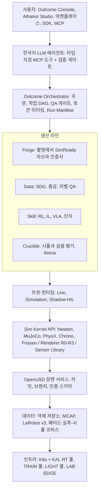
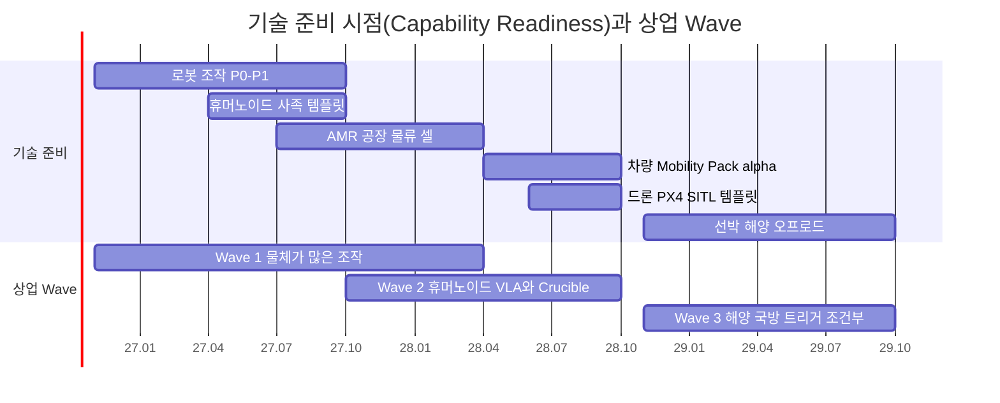

# CEN Athanor: AICHEMIST 디지털 트윈 플랫폼 구축 마스터플랜

> **기준일** 2026-10-06 · **버전** v1.1 · **작성** AICHEMIST 전략·기술팀 · **단일 기준(SSOT)** [00 결정 기록](00-decision-record.md)(문서 간 값이 다르면 00 §16 Errata → 00 본문 → 개별 문서 순으로 우선)
> **표기** **[A]** 계획 가정(실적 확인 전까지 목표치) · **[U]** 1차 출처 미확인(대외 사용 전 재검증 필수, [부록 B](appendix-b-sources-verification.md)) · ₩억 = 1억 원 · 1 USD = ₩1,400 [A]
> **기간** M1 = 2026년 11월 · P0 = M1–M4(2026.11–2027.02) · P1 = M5–M12(2027.03–2027.10) · P2 = M13–M24(2027.11–2028.10) · P3 = M25–M36(2028.11–2029.10) · D0 = 2026-10-16(CEO 승인일)

---

## 한 줄 정의

> **CEN Athanor(아타노르)는 범용 피지컬 AI(Physical AI) 디지털 트윈 플랫폼이다. 현실을 측정해 로봇·차량·드론·선박·공장 무엇이든 AI가 학습할 수 있는 디지털 트윈으로 만들고, 그 트윈에서 만든 학습 데이터·로봇 기술·평가 결과가 실제 현장에서 통한다는 것을 수치(sim-to-real 점수)로 인증해 공급한다.**

- **이름의 뜻:** Athanor는 연금술사가 오랜 연성 작업 동안 일정한 열을 유지하던 자급식 화로다. '통제된 변환으로 가치를 만든다'는 AICHEMIST의 철학을 '항상 켜진 트윈 팩토리'로 구현한다는 뜻이다([01 §2](01-vision-positioning.md)).
- **포지셔닝:** NVIDIA는 시뮬레이터를 무료로 준다. AICHEMIST는 그 시뮬레이터에서 나오는 '현실에서 작동한다는 증거'를 판다.

---

## 1. CEO 질문에 대한 답

| # | 질문 | 답 | 근거 문서 |
|---|---|---|---|
| Q1 | **어떤 엔진을 쓰나?** | 엔진 하나가 아니라 **역할별 포트폴리오**다. 로봇 학습 처리량은 **Newton 1.6.x**(MJWarp 솔버, GPU 고속), 인증·재현은 **MuJoCo 3.15 CPU**(정밀·결정론), 정밀 손 조작은 **Isaac Lab 3.x + PhysX 5.x**(사내 팩토리 전용), 접촉 정답 검증은 **Drake**, 차량·지형·선박은 **Chrono 10**이 맡는다. 렌더는 **Isaac Sim 6.1 RTX**(사내), **WebGPU**(고객 화면), **3DGUT**(신경 렌더) 3갈래다. 작업별 최종 기본값은 6–8주 베이크오프 결정 메모(2027-01-08)로 확정한다. | [03 §1·§7](03-engine-selection-build-vs-buy.md) |
| Q2 | **직접 구축하나?** | **물리 엔진·렌더러는 만들지 않는다(NO).** 자체 엔진은 150–300 engineer-year, ₩400–600억, MVP까지 30–48개월 이상이 들어 24개월 예산 ₩122억의 3–5배다. 의사결정 매트릭스도 하이브리드 4.23 > NVIDIA 중심 3.70 > 오픈 멀티엔진 3.20 > 자체 엔진 2.40이며, 가중치를 다섯 방식으로 바꿔도 순위가 같다. 대신 **엔진 사이·현실과의·사용자와의 이음새 13종을 직접 만든다**(엔지니어링의 약 60%). | [03 §8–§9](03-engine-selection-build-vs-buy.md) |
| Q3 | **자동차 등 무엇이든 되나?** | **된다. 아키텍처로 보장한다.** OpenUSD 단일 장면 + 엔진 교체 인터페이스(Sim Kernel API) 위에 대상별 Domain Pack을 꽂는다. 기술 준비 시점은 로봇 조작 M12, 휴머노이드·사족 템플릿 M6–M12, AMR·공장 M9–M18, **차량 M18–M24**(Mobility Pack α: 야드·저속 차량 동역학과 도로 시나리오 재생), 드론 템플릿 M20–M24, 선박·해양·오프로드 P3다. 자동차는 선택지 3개 중 ① α + 표준 연결을 채택하고, ② 승용 ADAS 트윈 확장(18–37 HM)은 조건부 옵션으로 두며, ③ 도로 AV 시뮬레이터 자체 구축은 기각했다. 상업적 집중(먼저 돈을 버는 곳)은 이와 따로 '물체가 많은 조작'부터 시작한다. | [08](08-domain-packs.md), [00 §5.5](00-decision-record.md) |
| Q4 | **물리 엔진은 강력한가?** | 네 장치로 '강함'을 측정 가능한 성능으로 만든다. 작업 유형별 최적 백엔드 **라우팅**, 백엔드끼리 결과를 대조하는 **적합성 스위트**, sysid·액추에이터 넷·Drake 기준의 **실측 보정**, 인증은 **결정론 경로(D0)에서만** 발행한다. 목표: GPU당 병렬 환경 ≥4,096, 궤적 오차 ADE ≤2 cm(M12) → ≤1 cm(M36), 인증 시험 재현 100%. | [05 §1–§8](05-physics-and-realism.md) |
| Q5 | **현실과 얼마나 비슷한가?** | 4계층으로 맞춘다: PBR 재질 → 3DGS 신경 재구성 → 실측 보정 센서 → 생성형 증강. 모든 납품물에 **Sim2Real Gap Scorecard**와 **Bronze/Silver/Gold 인증**을 붙인다. 목표: 합성 전용 학습 모델의 실데이터 mAP 비율 ≥0.90(M12) → ≥0.95(M24), 정책 sim-to-real 갭 ≤15%p(M12) → ≤10%p(M24). | [05 §9–§16](05-physics-and-realism.md) |
| Q6 | **쓰기 편한가?** | 문이 둘이다. **Outcome Console**에서는 한국어로 결과물을 주문하고, **Athanor Studio**는 설치 없이 브라우저(WebGPU)에서 직접 만든다. **한국어 MCP 에이전트**가 장면 구성·랜덤화·학습·평가를 말로 실행하며, 모든 변경은 검증 게이트와 사람 승인을 거친다. 목표: 첫 시뮬레이션 ≤10분(베타) → ≤5분, "휴대폰 영상 → 학습된 피킹 스킬" 24시간(M12) → 당일 셀프서브(M24). | [06](06-usability-and-agent.md) |
| Q7 | **모델 학습 기능은?** | RL(Isaac Lab 3.x, mjlab), 모방학습·VLA(LeRobot, SmolVLA, GR00T N1.7), 인식(SDG + RF-DETR), 월드모델 증강(Cosmos)을 내장한다. 원클릭 1–8 GPU 학습, Mimic 데모 증강, 수출 전 sim2sim 게이트, **Crucible 평가**(시뮬 + 실셀), Jetson Thor 배포를 한 흐름으로 묶는다. | [07](07-training-module.md) |
| Q8 | **얼마가 들고 언제 되나?** | 24개월 기준안 **₩122.0억**(보수 ₩98.8억 / 공격 ₩158.7억). 인원 16(M4) → 26(M12) → 36(M24) → 48(M36)명. 첫 매출 M4, Studio 베타 M9, GA M15, Sovereign GA M18. 게이트 G0(M4)·G1(M11)·G2(M18)·G3(M24)를 통과해야 다음 단계 자본을 투입한다. | [09](09-roadmap-organization-budget.md) |
| Q9 | **어떻게 돈을 버나?** | 컴퓨트는 원가 근처로 팔고, 가치는 **인증된 결과물**(데이터셋, 정책, 인증 트윈, 평가)에서 받는다. CEN 토큰·구독·마켓플레이스와 통합한다. 목표 매출 2027 ₩15억 → 2028 ₩45억 → 2029 ₩110억, 연말 ARR ₩3억 → ₩20억 → ₩70억. | [10](10-business-model-gtm.md) |
| Q10 | **돈은 어떻게 조달하나?** | Series A ₩80억을 **M5 전환 조건부 브리지 ₩20억 + M10 1차 ₩30억 + M12 2차 ₩30억(G1 연동)**으로 나눠 받는다. 기존 현금이 M4에 약 ₩4억까지 내려가기 때문이다. Series B ₩250억은 M25–M28. 정부 보조금은 업사이드로만 잡는다. | [09 §9](09-roadmap-organization-budget.md), [10 §8](10-business-model-gtm.md) |
| Q11 | **기존 CEN 사업은?** | 워크스페이스·토큰·마켓플레이스·SDG는 Athanor의 뼈대로 그대로 쓴다. NeRF 파이프라인은 라이선스 감사 뒤 3DGUT 기반 Forge로 교체한다(NeRF 퇴역 2027-02-28 [A]). 기존 CEN 매출은 2027 목표와 별도 장부로 관리한다. | [09 §5.4](09-roadmap-organization-budget.md) |
| Q12 | **가장 큰 리스크는?** | ① NVIDIA 독점 런타임의 SaaS·온프렘 약관 미확인 ② 결과물 사업의 SI화 ③ 한국 시니어 시뮬레이션 인재 채용 지연. 각각 3-Zone 라이선스 경계, 생산화 게이트·엔지니어 시간 KPI, 게이팅 대체 경로로 막는다. 실패가 이어질 때의 손실 상한(중단·축소 기준)도 미리 정했다. | [11](11-risk-kpi-compliance.md), [09 §3.7a](09-roadmap-organization-budget.md) |

---

## 2. 엔진 결정 한 장 요약

**결론: 엔진은 산다. 이음새는 만든다. 독점 런타임은 울타리(Zone F) 안에 둔다. 버전은 기차로 묶는다. 결정은 실측으로 갱신한다.**

| 역할 | 1차 선택 | 폴백·보조 | 라이선스 | 고객 노출 |
|---|---|---|---|---|
| 로봇 학습 처리량(보행·전신·조작) | **Newton 1.6.x**(MJWarp 솔버, Isaac Lab 3.x GA 핀으로 통일) | mjlab 1.6.0, MuJoCo 3.15 | Apache-2.0 | 가능 |
| 인증·결정론 재현 | **MuJoCo 3.15 CPU**(float64) | Newton 결정론 모드(검증 후 편입) | Apache-2.0 | 가능 |
| 접촉 집약 조작(삽입·촉각·Mimic) | **Isaac Lab 3.x + PhysX 5.x**(Isaac Sim 6.1 번들) | Newton SDF + hydroelastic | Isaac Lab BSD-3 / Isaac Sim 런타임 독점 | 산출물만 |
| 폐루프·변형체·케이블·입상체 | Newton **Kamino / VBD / MPM** | MuJoCo flex(실험적) | Apache-2.0 | 가능 |
| 접촉 정밀 기준(오프라인) | **Drake v1.57** | — | BSD-3(PyPI 휠은 독점 솔버 포함) | 내부 |
| 차량·지형·해양 | **Chrono 10.0** + 자체 Fossen 6-DOF | PhysX Vehicle2(사내 전용), 고객 CarSim/CarMaker(FMI 3.0, 고객 라이선스) | BSD-3 / 자체 | 가능(Vehicle2 제외) |
| 드론 | **PX4 SITL + Gazebo Jetty** | Pegasus 포팅(사내·BYOL 전용) | BSD-3 / Apache-2.0 | 가능 |
| 고충실도 렌더·센서·SDG | **Isaac Sim 6.1 RTX + Replicator** | ovrtx(GA·약관 후) | NVIDIA 독점 | 산출물만(BYOL 예외) |
| 고객용 SDG·센서 | **Newton Warp 래스터 + 자체 Warp Sensor Library** | RTX 센서(BYOL) | 자체(Apache 의존성) | 가능 |
| 고객 화면 렌더 | **WebGPU/WebGL2**(three.js·PlayCanvas·Babylon.js) | Newton Warp 렌더러 | MIT / Apache-2.0 | 가능 |
| 신경 재구성(Real2Sim) | **gsplat + 3DGRUT(3DGUT)** | fVDB, NuRec[U] | Apache-2.0 | 가능 |
| 생성형 증강·월드모델 | Cosmos Transfer 2.5(M5–M8) → **Cosmos 3 Nano**(M9–) | Cosmos 3 Super(P3) | OpenMDW-1.1[U] | 라벨 QA 후 |
| 학습 | **Isaac Lab 3.x(소스 빌드) + rsl_rl / skrl, LeRobot 0.6** | SmolVLA, GR00T N1.7(고객 납품은 법률 검토 후) | BSD-3 / Apache-2.0 | 가능 |
| 장면·데이터 표준 | **OpenUSD** + UsdPhysics, MCAP, LeRobot v3, FMI 3.0 | glTF + KHR_gaussian_splatting, URDF/MJCF | 개방 표준 | — |
| 관찰만(현 단계 미채택) | Genesis World, Isaac Sim 7.0 alpha, ovphysx alpha | — | — | — |

- **하드웨어 함의:** RTX 렌더링에는 RT 코어 GPU(L40S, RTX PRO 6000 Blackwell)가 필요하다. H100/H200/B200에는 RT 코어가 없어 학습 전용이다. 그래서 GPU 풀을 **RT 풀**과 **TRAIN 풀**로 나눈다.
- **라이선스 경계:** 고객이 쓰는 클라우드(Zone T)와 고객 사이트 설치본(Zone S)은 허용형(Apache/BSD/MIT)과 의무 이행이 가능한 약한 카피레프트(MPL·EPL·LGPL)로만 구성한다. NVIDIA 독점 소프트웨어는 서면 허가 전까지 사내 팩토리(Zone F)에서만 쓴다.
- **금지(NEVER) 목록:** Hunyuan3D 2.x(라이선스가 한국을 제외), Inria 3DGS 계열, Instant-NGP, nvdiffrast, MimicGen 코드, ManiSkill 자산(CC BY-NC), SaaS 안의 Ultralytics(AGPL) 등 21개(+후보 1)는 CI와 마켓플레이스에서 자동 차단한다([03 §10](03-engine-selection-build-vs-buy.md)).
- **버전과 판정의 정본:** 역할·라이선스·구역 판정은 [00 §2](00-decision-record.md), 버전 문자열·트리거 운영은 [03 §7·§12](03-engine-selection-build-vs-buy.md), 전체 기술 목록은 [부록 A](appendix-a-technology-catalog.md)가 정본이다.

---

## 3. 무엇을 직접 만들고 무엇을 가져오나

| 구분 | 대상 | 이유 |
|---|---|---|
| **OWN**(엔지니어링의 약 60%) | Sim Kernel API·적합성 스위트·Run Manifest / **Athanor Forge**(Real2Sim) / **Fidelity Lab**·Sim2Real Gap Scorecard·인증 체계 / **Athanor Crucible**·K-Physical AI Arena / Outcome Orchestrator·토큰 미터링 / 한국어 MCP 에이전트 / WebRTC 게이트웨이·컨트롤 플레인 / Warp Sensor Library·Fossen 해양 모듈 / 라이선스·출처 레지스트리 / 소버린 패키징 / 한국 콘텐츠 라이브러리 | 엔진은 무료로 2–3주마다 좋아진다. 측정·인증·한국 현장 콘텐츠는 아무도 팔지 않는다 |
| **INTEGRATE**(오픈소스, 버전 고정) | Newton, MuJoCo/MJWarp, mjlab, Isaac Lab(소스), PhysX SDK, Drake, Chrono, PX4, Gazebo, gsplat, 3DGRUT, TRELLIS.2, LeRobot, rsl_rl, Cosmos 3, OpenUSD, KAI Scheduler, Ray 등 | 대형 조직의 수년치 투자를 무료로 흡수하고, 업스트림 기여로 로드맵 영향력을 확보한다 |
| **LICENSE**(상용) | Isaac Sim/Kit RTX·Replicator(사내 팩토리), ovrtx·NuRec(약관 확보 후), 고객 보유 CarSim/CarMaker | 고충실도 센서 렌더만 상용으로 쓰고 고객 노출 경로에서는 뺀다 |
| **PARTNER** | NVIDIA(Inception → NPN 공동 판매), Linux Foundation Newton, 로봇 OEM, 시험기관(KTL·KIRIA·TTA), MORAI(AV), 그룹 SI, 국내 CSP, KAIST·SNU·ETRI | 채널·신뢰·조달 경로를 확보한다 |

---

## 4. 아키텍처 한눈에

- **라이선스 3구역:** Zone F는 사내 팩토리로, NVIDIA 독점 런타임을 허용하되 산출물만 반출한다. Zone T는 고객 SaaS, Zone S는 온프렘·소버린·에어갭으로 둘 다 허용형과 약한 카피레프트만 쓰며 Zone S에는 서명 SBOM을 붙인다. 상세는 [04](04-system-architecture.md), [03 §10](03-engine-selection-build-vs-buy.md).

---

## 5. 로드맵 한눈에

| 단계 | 기간 | 핵심 산출물 | 게이트(심의일) |
|---|---|---|---|
| **P0 Factory Zero** | M1–M4 (2026.11–2027.02) | 엔진 베이크오프·결정 메모(2027-01-08), Sim Kernel v0, Forge v0, Test Cell 1, 첫 데이터셋 계약, 앵커 LOI 3건 | **G0 M4**(2027-02-26) |
| **P1 Outcome MVP + Studio Beta** | M5–M12 (2027.03–2027.10) | Forge v1, Data·Skill 라인, 12주 Cell-to-Policy PoC 판매, Studio 베타(M9), Crucible v0, Arena 공동서명 MOU, K-Pick Challenge, Series A | **G1 M11**(2027-09-24). 통과해야 26명 초과 채용 |
| **P2 Productize, Live & Sovereign** | M13–M24 (2027.11–2028.10) | Studio GA(M15), Athanor Live, Crucible v1 + 외부 Arena(M18), Sovereign GA(M18), **Mobility Pack α(M18–M24)**, 드론 템플릿(M20–M24), 미국 데이터·평가 GTM | **G2 M18**(2028-04-28), **G3 M24**(2028-10-27) |
| **P3 Scale, Maritime·Defense, Global** | M25–M36 (2028.11–2029.10) | 해양·조선 인식 팩(트리거 조건부), Air-gap 국방 에디션(M27–), 오프로드 UGV, 미국 법인, 일본 고객 | M36 목표 |

---

## 6. 핵심 수치(단일 기준 고정값)

| 항목 | 값 |
|---|---|
| 플랫폼명 | **CEN Athanor**. 하위 브랜드: Forge, Data, Skill, Crucible, Studio, Live. 에디션: Cloud, Sovereign, Air-gap |
| 인원(단계 말) | 16(M4) / 26(M12) / 36(M24) / 48(M36)명. 24개월 564 head-month |
| 24개월 예산 | 기준 **₩122.0억**(P0 11.2 / P1 37.0 / P2 73.8). 보수 ₩98.8억, 공격 ₩158.7억 |
| 예산 구성(기준) | 인건비 79.0, 컴퓨트 14.0, 라이선스 4.2, 법무·IP·인증 3.5, Fidelity Lab 6.8, GTM·관리 5.5, 예비비 9.0 |
| 매출 목표 | 2027 ₩15억 / 2028 ₩45억 / 2029 ₩110억. 연말 ARR ₩3억 / ₩20억 / ₩70억 |
| 반복매출·총마진 | 10%·45% / 30%·52% / 50%·60% |
| 자금 | Series A ₩80억(브리지 ₩20억 M5 + ₩30억 M10 + ₩30억 M12), Series B ₩250억(M25–M28). 정부 보조금은 업사이드로만 계상 |
| 첫 매출 | M4 데이터셋 계약(≥₩0.5억, 인수 하한 mAP 비율 0.85). 바우처 납품 M5–M8. PoC 판매 M5부터 |
| CEN 토큰 | 1 토큰 = ₩100. 시간당 RT 60 / 서울 대화형 95 / TRAIN 80 / LIGHT 20 토큰 |
| 인증 등급 | Bronze(VLM 추정) / Silver(영상 기반 식별) / Gold(랩 실측). KPI는 Silver/Gold만 집계. 인증서는 D0 결정론 경로에서만 발행 |

---

## 7. 문서 지도

| # | 문서 | 핵심 질문 | 주 독자 |
|---|---|---|---|
| 00 | [결정 기록(Decision Record)](00-decision-record.md) | 무엇을 결정했나? 모든 고정값과 Errata의 단일 기준 | 전원 |
| 01 | [비전·포지셔닝](01-vision-positioning.md) | 왜 지금, 왜 우리, 무엇이고 무엇이 아닌가 | CEO, 투자자 |
| 02 | [시장·경쟁](02-market-competition.md) | 시장 규모, 경쟁 지형, NVIDIA 범용화, 화이트스페이스 | 투자자, 사업개발 |
| 03 | [엔진 선정·Build vs Buy](03-engine-selection-build-vs-buy.md) | **어떤 엔진을 쓰고 무엇을 직접 만드나** | CEO, CTO |
| 04 | [시스템 아키텍처](04-system-architecture.md) | Sim Kernel API, 장면 서비스, 에이전트, 인프라, 배포 에디션 | 엔지니어 |
| 05 | [물리·현실감](05-physics-and-realism.md) | 강력한 물리와 현실 유사도를 어떻게 만들고 증명하나 | CTO, 엔지니어, 정부 평가위원 |
| 06 | [사용성·에이전트](06-usability-and-agent.md) | 누구나 쓰는 편의성, 한국어 LLM 에이전트 | 제품, 고객 |
| 07 | [학습 모듈](07-training-module.md) | RL·IL·VLA·인식 학습, Crucible 평가, 배포 | ML 엔지니어, 고객 |
| 08 | [도메인 팩](08-domain-packs.md) | 로봇·차량·드론·선박·공장 대상별 구현과 시점 | CTO, 사업개발 |
| 09 | [로드맵·조직·예산](09-roadmap-organization-budget.md) | 36개월 일정, 게이트, 공수, 채용, 예산, 자금, CEN 본업 연속성 | CEO, CFO, 투자자 |
| 10 | [사업모델·GTM](10-business-model-gtm.md) | 가격·SKU, 매출 목표, 희석·밸류에이션, 정부과제, 해외, IR 메시지 | CEO, 투자자, 영업 |
| 11 | [리스크·KPI·컴플라이언스](11-risk-kpi-compliance.md) | 리스크 레지스터, KPI 트리, 라이선스 정책, 검증 필요 항목 | 이사회, 법무 |
| 12 | [90일 실행 계획](12-execution-90days.md) | 승인 다음 날부터 할 일, NVIDIA 협상, 베이크오프, 오퍼 시트, JD | CEO, 실행 리더 |
| A | [부록 A 기술 카탈로그](appendix-a-technology-catalog.md) | 검토한 엔진·도구·모델·서비스 294건과 판정 | 엔지니어 |
| B | [부록 B 출처·검증](appendix-b-sources-verification.md) | 팩트체크 결과, 고유 출처 545건 | 검토자 |

### 독자별 읽는 순서
- **CEO(15분):** 이 README → [00 §0 결정 요약](00-decision-record.md) → [03 §1](03-engine-selection-build-vs-buy.md) → [09 §1·§3](09-roadmap-organization-budget.md) → [12 §1](12-execution-90days.md)
- **투자자(IR 준비):** [01](01-vision-positioning.md) → [02](02-market-competition.md) → [10 §6–§8·§12](10-business-model-gtm.md) → [11 §3](11-risk-kpi-compliance.md)
- **정부과제 제안:** [05 §13–§16](05-physics-and-realism.md) → [10 §10](10-business-model-gtm.md) → [11 §3·§7](11-risk-kpi-compliance.md) → [09 §2](09-roadmap-organization-budget.md)
- **엔지니어링 착수:** [03](03-engine-selection-build-vs-buy.md) → [04](04-system-architecture.md) → [05](05-physics-and-realism.md) → [07](07-training-module.md) → [12 §5](12-execution-90days.md)

---

## 8. 이번 달 CEO 결정 사항(7건)

| # | 승인 요청 | 기한 | 근거 |
|---|---|---|---|
| ① | P0 예산 ₩11.2억 집행 | D0(10-16) | [12 §1](12-execution-90days.md), [09 §8](09-roadmap-organization-budget.md) |
| ② | Sim Architect(CTO 트랙)·Head of Fidelity & Evaluation 동시 서치. 둘 다 게이팅 채용 | D5(10-23) | [12 §7](12-execution-90days.md) |
| ③ | NVIDIA Korea에 서면 조건 요청서 발송(16개 항목) | D5(10-23) | [12 §4](12-execution-90days.md) |
| ④ | Wave 1 앵커 3곳(로봇 OEM·조선 로보틱스·물류/AI팩토리)과 첫 데이터셋 고객 지정 | D10(10-28) | [12 §1](12-execution-90days.md) |
| ⑤ | 6–8주 엔진 베이크오프 착수(W1 = 2026-11-02) | D0(10-16) | [12 §5](12-execution-90days.md) |
| ⑥ | 기존 가용 현금 ₩15억 확인(CFO, 11-06)과 Series A 브리지 구조 협의 개시 | D0(10-16) | [09 §9](09-roadmap-organization-budget.md) |
| ⑦ | G1 미통과 시 보수안 자동 전환 규칙과 중단·축소 기준의 이사회 사전 결의 | D0(10-16) | [09 §3.7a·§3.8](09-roadmap-organization-budget.md) |

---

## 9. 용어집

| 용어 | 뜻 |
|---|---|
| 디지털 트윈 | 실제 대상(로봇, 차량, 공장)을 물리·센서·외형까지 재현한 가상 복제본. Athanor에서는 그 안에서 AI를 훈련·평가할 수 있는 '학습 가능한' 트윈을 뜻한다 |
| 피지컬 AI(Physical AI) | 로봇·차량처럼 물리 세계에서 보고 판단하고 움직이는 AI |
| sim-to-real | 시뮬레이션에서 학습·검증한 결과가 실제 현장에서도 통하는 정도. 그 차이를 'sim-to-real 갭'이라 한다 |
| Sim Kernel API | 물리·렌더 엔진을 갈아끼울 수 있게 하는 AICHEMIST 자체 표준 인터페이스. 엔진 종속을 막는 핵심 장치다 |
| 적합성 스위트(Conformance Suite) | 같은 장면(C01–C15)을 여러 엔진에서 돌려 결과가 허용 오차 안에 드는지 확인하는 자동 시험 묶음 |
| sim2sim 게이트 | 학습된 정책을 고객에게 내보내기 전에 다른 물리 엔진에서도 성능이 유지되는지 확인하는 관문. Tier 1은 모든 수출 정책, Tier 2는 인증 후보에 적용한다 |
| 결정론적 재현(D0/D1/D2) | 같은 입력으로 다시 돌리면 같은 결과가 나오는 성질. D0는 비트 단위 일치, D1은 통계적 재현, D2는 생성형 결과다. 인증서는 D0에서만 발행한다 |
| Run Manifest | 실행 하나를 완전히 재현하는 데 필요한 정보(장면 해시, 엔진 버전, GPU, 드라이버, 시드)를 담은 기록. 데이터셋·모델의 출처 증빙이 된다 |
| 베이크오프(Bake-off) | 후보 엔진들을 같은 하드웨어·같은 과제로 직접 비교해 기본값을 정하는 6–8주 실측 평가 |
| 릴리스 트레인 | 엔진·라이브러리 버전을 반기 단위로 묶어 함께 검증·배포하는 규율. 월 단위로 바뀌는 오픈소스를 안정적으로 쓰기 위한 장치다 |
| 업그레이드 세금 | 외부 엔진의 API 변경에 대응하는 데 드는 고정 공수. 엔진을 다루는 워크스트림 용량의 25%를 예약한다 |
| SimReady 자산 | 외형뿐 아니라 충돌 형상, 질량, 마찰, 관절 정보까지 갖춰 시뮬레이션에 바로 쓸 수 있는 3D 자산 |
| Real2Sim / Athanor Forge | 휴대폰 영상 같은 실촬영을 SimReady 자산·장면으로 바꾸는 파이프라인. CEN NeRF 파이프라인의 후속이다 |
| 3DGS / 3DGUT | 3D Gaussian Splatting. 사진 여러 장으로 실사 수준의 3D 장면을 빠르게 재구성·렌더링하는 기술이다. 3DGUT는 어안·롤링셔터 카메라까지 다루는 확장판이다 |
| Sim2Real Gap Scorecard | 시뮬레이션 결과가 현실과 얼마나 다른지를 수치로 보여 주는 성적표(mAP 비율, 성공률 갭, 궤적 오차, 센서 오차) |
| Bronze / Silver / Gold | 자산 인증 등급. Bronze는 AI 추정, Silver는 영상 기반 식별, Gold는 랩 실측이다 |
| Fidelity Lab / 테스트 셀 | 실제 로봇·센서로 시뮬레이션 결과를 측정·대조하는 사내 실험실과 시험 설비 |
| 페어드 코퍼스 | 같은 조건의 실측 데이터와 시뮬레이션 데이터를 짝지어 쌓은 데이터 묶음. Athanor 해자의 중심이다 |
| 측정권 | 고객 현장에서 얻은 측정 데이터를 익명화해 재사용할 권리. 허락한 고객은 10–20% 할인을 받는다 |
| Crucible / K-Physical AI Arena | 정책(로봇 AI)을 시뮬레이션과 실제 테스트 셀에서 함께 채점하는 평가 라인, 그리고 제3자 공동서명 벤치마크 |
| Outcome Console / Athanor Studio | 결과물을 한국어로 주문·검토·인수하는 창구, 그리고 고객이 브라우저에서 직접 만드는 셀프서브 작업 환경 |
| Domain Pack | 대상별(로봇 조작, 차량, 드론, 선박 등) 자산·물리 설정·센서 리그·표준 커넥터·학습 템플릿·평가지표 묶음 |
| Capability Readiness / Wave | 대상별 기술 준비 시점, 그리고 그와 별개인 상업적 집중 순서(Wave 1–3) |
| Zone F / T / S | 라이선스 구역. F는 사내 팩토리(NVIDIA 독점 런타임 허용, 산출물만 반출), T는 고객 SaaS, S는 온프렘·소버린·에어갭. T와 S는 허용형과 약한 카피레프트만 쓴다 |
| 허용형 라이선스 / 약한 카피레프트 | 허용형은 Apache·BSD·MIT처럼 상업 재배포가 자유로운 라이선스다. 약한 카피레프트는 MPL·EPL·LGPL처럼 수정한 파일만 공개하면 되는 라이선스로, 의무를 추적하며 쓴다 |
| BYOL | Bring Your Own License. 고객이 보유한 NVIDIA 라이선스로 고객 환경에서 RTX를 운영하는 방식 |
| NVAIE | NVIDIA AI Enterprise. NVIDIA 소프트웨어의 상용 운영 라이선스. 리스트 가격 약 $4,500/GPU/년 [U] |
| RT 코어 | 실시간 광선 추적 전용 GPU 회로. L40S·RTX PRO 6000에는 있고 H100/H200/B200에는 없다 |
| MJWarp / Newton | MJWarp는 Google DeepMind의 MuJoCo를 GPU 병렬로 옮긴 솔버다. Newton은 NVIDIA·DeepMind·Disney가 공동 개발하고 Linux Foundation이 관리하는 GPU 물리 엔진으로, MJWarp를 기본 솔버로 쓴다 |
| OpenUSD | Pixar가 만들고 AOUSD가 표준화한 3D 장면 기술 형식. Athanor의 내부 표준 장면 형식이다 |
| VLA | Vision-Language-Action 모델. 영상과 언어 지시를 받아 로봇 동작을 출력하는 로봇 파운데이션 모델이다 |
| Mimic(데모 증강) | 사람이 보여 준 시연 몇 개를 시뮬레이션에서 수백–수천 개로 불려 학습 데이터를 만드는 기법 |
| SDG | Synthetic Data Generation. 시뮬레이션으로 라벨이 붙은 학습 데이터를 생성하는 것 |
| MCP | Model Context Protocol. LLM이 외부 도구를 타입이 지정된 방식으로 호출하게 하는 표준. Athanor의 한국어 에이전트가 이 방식으로 플랫폼을 조작한다 |
| FMI / FMU | 차량·설비의 시스템 모델을 도구 간에 교환하는 국제 표준과 그 모델 파일. 고객이 쓰는 CarSim·CarMaker 모델을 Athanor에 연결할 때 쓴다 |
| OpenDRIVE / OpenSCENARIO | 도로망과 주행 시나리오를 기술하는 ASAM 국제 표준 |
| Cell-to-Policy PoC | 고객 작업 셀 하나를 트윈으로 만들어 12주 안에 학습된 정책까지 납품하는 고정가 PoC(₩1.5–2.5억) |
| FDE | Forward Deployed Engineer. 고객 현장에 배치되어 결과물 납품을 책임지는 엔지니어 |
| 게이트(G0–G3) | 다음 단계 자본 투입 여부를 정하는 심의 관문. 미통과 시 보수안으로 자동 전환한다 |
| ARR / NRR | 연환산 반복매출 / 기존 고객 순매출 유지율 |
| HM | Head-month. 1인 1개월 공수 |

---

## 10. 근거 자료

| 경로 | 내용 |
|---|---|
| [research/research-digest-en.md](research/research-digest-en.md) | 8개 영역 리서치 요약·권고·리스크와 팩트체크 결과(영문 원문) |
| [research/research-options-en.md](research/research-options-en.md) | 영역별 후보 상세(버전·라이선스·강점·약점·출처)와 정량 데이터(영문 원문) |
| [research/raw/](research/raw/) | 영역별 리서치 원자료(JSON) |
| [research/strategy-panel/](research/strategy-panel/) | 경쟁 전략안 3종(NVIDIA 가속형, 소버린 오픈코어형, 결과물 팩토리형)과 CTO·투자자·고객/정부 심사 결과 |

> **검증 원칙:** 버전·라이선스·릴리스 일자·클라우드 단가는 GitHub·PyPI·가격 카탈로그로 확인했다. 시장 규모·투자 유치 금액·국내 정책 예산·벤더 리스트 가격은 [U]로 표기했으며, 대외 문서에 쓰기 전에 [11 §7](11-risk-kpi-compliance.md)의 담당자·기한에 따라 재검증한다.
