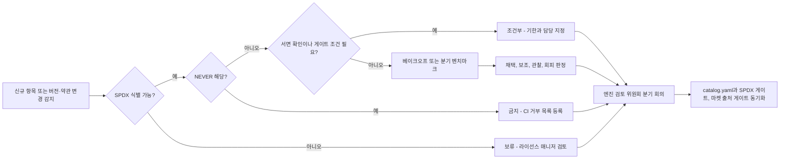

# 부록 A. 기술 카탈로그 (엔진·도구·모델·서비스 전수 평가)

| 항목 | 내용 |
|---|---|
| 문서 번호 | Appendix A |
| 기준일 | 2026-10-06 |
| 버전 | v1.0 |
| 상위 문서 | [README](README.md) |
| 관련 문서 | [00 결정 기록](00-decision-record.md) · [03 엔진 선정·Build vs Buy](03-engine-selection-build-vs-buy.md) · [부록 B 출처·검증](appendix-b-sources-verification.md) · [02 시장·경쟁](02-market-competition.md) · [04 시스템 아키텍처](04-system-architecture.md) · [05 물리·현실감](05-physics-and-realism.md) · [07 학습 모듈](07-training-module.md) · [08 도메인 팩](08-domain-packs.md) |
| 표기 | [A] 계획 가정(실적 확인 전까지 목표치) · [U] 1차 출처 미확인(대외 사용 전 [부록 B](appendix-b-sources-verification.md) 절차로 재검증) · 태그 없는 사실은 GitHub·PyPI·SkyPilot 가격 카탈로그로 확인한 값(2026-10-05/06) |
| 고정값 | 인원·예산·게이트·토큰 단가 등은 DR 안의 '부록. 전 문서 공통 고정값(Canonical Numbers)'을 따른다. 이 문서(계획서 부록 A, 기술 카탈로그)는 그 값을 바꾸지 않는다 |

**범례**

| 기호 | 뜻 |
|---|---|
| **F / T / S** | 라이선스 구역. F = 내부 팩토리(Zone F, 산출물만 판매), T = 테넌트 대면(Zone T, Studio·Cloud), S = 소버린·온프렘·에어갭(Zone S). 정의는 [DR §6.2](00-decision-record.md) |
| **R0–R3** | 렌더 티어. R0 WebGPU, R1 Newton Warp 렌더러, R2 3DGUT 신경 렌더, R3 Isaac Sim RTX([03 §5.2](03-engine-selection-build-vs-buy.md)) |
| **NEVER #n** | [03 §10.3](03-engine-selection-build-vs-buy.md)의 금지 21개 + 후보 1개(#22) 목록 번호. DR §3.3 NEVER 행과 같다 |
| **체크리스트 #n** | NVIDIA 라이선스 협상 체크리스트 항목([DR §14.2](00-decision-record.md)) |
| **V2 / V4 / V7** | P0 검증 항목. V2 = Blender·ovstage·ArduPilot·Drake 독점 솔버 번들 법률 의견(M3), V4 = 국내 CSP RT GPU·MIG·R580 이미지(M2), V7 = 모델 가중치 약관 법률 검토(M3) |
| **X1–X15** | 재결정 트리거([03 §14](03-engine-selection-build-vs-buy.md)) |
| **T1–T11 / W1–W8** | 베이크오프 과제 번호와 주차([DR §14.3](00-decision-record.md)) |
| **₩억** | 1억 원. 1 USD = ₩1,400 [A] |

---

## 핵심 요약

- **리서치 8개 영역(robot_physics, vehicle_sim, realism, platform_arch, training, market_competition, korea_policy, build_vs_buy)에 나온 선택지를 전부 실었다.** 여러 영역에 중복 등장한 항목(Newton, Isaac Sim, Cosmos, CARLA, Genesis 등)은 주된 역할 한 곳에만 두고, 다른 절에서는 '§n' 참조로 가리킨다. 결과는 8개 절(표 9개), 294개 행이다.
- **판정 분포:** 채택 95 · 보조·폴백 58 · 조건부 25 · 관찰 67 · 회피 27 · 금지(NEVER) 22(한 행에 판정이 둘이면 첫 번째만 집계). 판정은 [DR §2](00-decision-record.md) 엔진 선정표, [DR §3.3](00-decision-record.md) NEVER 목록, [03](03-engine-selection-build-vs-buy.md)의 판정(Adopt/Secondary/Watch/Avoid/NEVER)과 일치시켰고, 문서 사이에 표현이 달랐던 5건은 §0.3에서 조정했다. 03에 없는 '조건부'는 서면 확인이나 게이트 조건이 걸린 항목을 따로 드러내려고 만든 등급이다.
- **테넌트(T·S)에 닿는 '채택' 행에는 Omniverse·Isaac 계열 독점 런타임이 하나도 없다.** 코드·엔진은 허용형 오픈소스(또는 의무 이행이 가능한 약한 카피레프트)다. 모델은 커스텀·사용 제한 약관(GR00T Open Model License, Cosmos OpenMDW-1.1 [U], SAM License, VGGT-1B-Commercial)이며 고객에게 닿는 사용은 모두 V7(M3) 법률 검토가 조건이다. SAM·VGGT-Commercial은 '조건부(V7)'이며 테넌트에 닿는 채택 행이 아니다. 독점 런타임(Isaac Sim·Kit·RTX, ovrtx, ovphysx 휠, isaacsim/isaaclab 휠, NuRec)은 'Zone F 채택'이거나 '조건부'다. 'Kit-less'는 '라이선스 프리'가 아니다.
- **'금지' 22개 행은 CI 거부 목록 NEVER #1–#21을 모두 덮는다.** #18(온프렘 번들 GPL)은 ArduPilot·Stonefish·BlenderProc 3개 행에 걸치고, #20(국방 에디션의 SAM 계열·VGGT-Commercial)은 해당 행의 두 번째 판정으로 적었다. MapAnything 기본 가중치(비 apache, CC-BY-NC로 표기 [U], SPDX 확인 M2)는 NEVER #22 후보로 DR §16 #40에 반영됐다. 허용 대상은 MapAnything-apache 가중치뿐이다.
- **물리 엔진·렌더러는 만들지 않고 통합한다.** 전략 D(하이브리드) 4.23점이 1위이고, 자체 엔진(전략 A)은 '회피'다(§1.0). 직접 만드는 것은 Sim Kernel API, Warp Sensor Library, 클린룸 Fossen, WebRTC 게이트웨이, MCP 서버 같은 '이음새'뿐이다.
- **시장 표(§7)는 같은 6단계를 '관여 수준'으로 읽는다.** 정면 경쟁은 Lightwheel, Hillbot/ManiSkill, CyLab, 중국 데이터 팩토리 4곳이다. Applied Intuition과 AV 시뮬레이터 시장은 '회피'이고, 글로벌 로봇 FM 기업은 M12–M15에 여는 데이터·평가 판매 대상('조건부')이다.
- **국내 정책 표(§8)의 금액·일정은 전부 [U]다.** 리서치 시점에 정부·언론 사이트 접근이 막혀 1차 출처로 확인하지 못했다. 신청 전 공고문으로 재확인한다.
- **카탈로그는 분기 1회 갱신한다.** 엔진 검토 위원회(의장 CTO)가 정기 회의에서 판정을 바꾸고, 트리거(X1–X15)가 당겨지면 10영업일 안에 해당 행만 재판정한다. 버전·상태 열은 월 1회 자동 스캔으로 갱신한다(§9).

---

## 0. 판정 범례와 읽는 법

### 0.1 판정 등급

| 판정 | 03 대응 | 정의 | 운영 규칙 |
|---|---|---|---|
| **채택** | Adopt | 릴리스 트레인 핀 대상이다. 적합성 스위트나 레지스트리에 올리고 담당 워크스트림을 정한다. 괄호 안에 허용 구역을 적는다 | 업그레이드 부담은 엔진 접촉 워크스트림 용량의 25% 안에서 진다 |
| **보조·폴백** | Secondary | 특정 과제·고객·도메인용 보조 경로이거나 1차가 막힐 때 쓰는 폴백이다 | 어댑터를 유지하고, 분기 1회 이상 적합성을 확인한다 |
| **조건부(서면 확인 후)** | (신설) | 기술적으로는 쓸 만하지만 서면 약관, 법률 검토(V2·V7), 게이트 조건(X 트리거) 가운데 하나가 충족돼야 쓴다 | 조건 충족 전에는 Zone F 내부 평가에만 쓴다. 레지스트리에 `conditional` 태그를 달고, 기한에 재판정한다 |
| **관찰** | Watch | 코드 의존이 없다. 분기 벤치마크와 라이선스 변화만 감시한다 | 사이드 브랜치에서만 실행한다. 승격 조건이 있으면 비고에 적는다 |
| **회피** | Avoid | 기술·유지보수·사업상 이유로 쓰지 않는다 | 신규 의존성 PR을 거부한다. 라이선스 문제는 아니다 |
| **금지(NEVER)** | NEVER | 라이선스상 사용 금지다(NEVER #1–#21, 후보 #22) | CI와 마켓플레이스에서 자동 차단한다. 해제는 라이선스 변경 확인 후 엔진 검토 위원회 승인으로만 한다 |

- **구역 한정 표기:** '채택(Zone F)'은 내부 팩토리에서 산출물을 만드는 데에만 쓴다는 뜻이다. '금지(온프렘 번들)'처럼 범위가 붙은 금지는 그 범위에서만 금지다(예: ArduPilot은 고객 환경 연동은 허용).
- **한 항목에 두 판정이 붙는 경우:** 에디션이나 용도별로 판정이 갈리면 둘 다 적는다(예: VGGT-1B-Commercial은 민수 '조건부(V7)', 국방 에디션 '금지'). 집계에는 첫 번째 판정만 넣는다.
- **§7·§8 읽는 법:** 회사·프로그램은 소프트웨어처럼 '설치'하지 않으므로, 같은 6단계를 관여 수준으로 읽는다. 채택 = 지금 통합·계약·신청·영업한다. 보조 = 연결·채널·선택적 협력이다. 조건부 = 정해진 시점이나 조건이 오면 착수한다. 관찰 = 경쟁사·신호로 분기마다 감시한다. 회피 = 정면 경쟁이나 투자를 하지 않는다. 괄호 안에는 [02 §4](02-market-competition.md)의 관계 동사(통합·연결·파트너·경쟁·판매·회피·관찰)를 함께 적는다.

### 0.2 팩트체크 정정 반영표

리서치 원본에서 서로 어긋났거나 팩트체크가 정정한 값은 아래처럼 바로잡아 실었다([부록 B §3](appendix-b-sources-verification.md)).

| 항목 | 리서치 원본의 잘못된 값 | 이 카탈로그에 쓴 값 |
|---|---|---|
| Newton 1.0.0 출시일 | 2026-04-13(실제는 1.1.0), PyPI `newton-physics` 1.0.0 | **2026-03-10**. 패키지명은 `newton`(`newton-physics`는 비활성) |
| ovphysx 라이선스 | BSD-3-Clause | 소스는 Apache-2.0, **pip 휠은 LicenseRef-NVIDIA-Omniverse, 의존성 ovstage는 독점** |
| PhysX SDK 라이선스 | 5.6부터 BSD-3 | **코어 Apache-2.0**(저장소 루트는 BSD-3), GPU 소스 포함 |
| Newton·Warp 드라이버 하한 | Maxwell 이상, 드라이버 545 이상 | Warp 1.18 기준 **Turing 이상 + R580 이상(CUDA 13)** |
| Cosmos 3 크기 | 32B / 8B(언론) | **Super 64B / Nano 16B / Edge 4B**. Cosmos 2.5 저장소는 유지보수 축소 |
| KHR_gaussian_splatting | Release Candidate | **비준 완료** |
| mjlab | 1.5.x | **1.6.0**(2026-08-09). MJWarp 3.11에 핀(업스트림 3.15보다 지연) |
| UsdPhysics 중첩·Hydra 2 기본값 | 26.03 / 26.05 | **25.11** |
| Chrono AMD ROCm | 10.0 릴리스에 포함 | **dev 브랜치에만** 있음 |
| Isaac Sim 6.0 GA | 2026-06-08 | GitHub 태그 **2026-06-04**(포럼 공지는 06-08). 7.0은 alpha |
| cuRobo | 독점 약관 / Apache-2.0 | **업스트림은 Apache-2.0, Isaac Lab 번들본은 Isaac Lab 전용 약관**(NEVER #21) |
| Genesis Nyx | 별도 패키지, 라이선스 확인 필요 | **사실상 폐쇄 바이너리, PyPI 라이선스 미표기** |
| Newton 솔버 | 'IPC 포함, 미분 가능' | 8개 솔버(IPC 없음). 미분은 Featherstone·SemiImplicit만 기초 수준 |

### 0.3 문서 간 판정 조정

| 항목 | 차이 | 이 카탈로그의 처리 |
|---|---|---|
| PhysX Vehicle2 | DR §2 #6·§16 #9는 'Zone F 전용(Isaac Lab·Isaac Sim 경유)', 03·04·08과 일치 | '채택(Zone F)'으로 표기한다. 테넌트·온프렘 개방은 PhysX SDK 소스 어댑터(X6) 또는 Mobility Pack α 설계 메모(M17)의 C++ 바인딩 결정 이후다. 그전 Zone T/S의 AMR은 Newton 관절형 휠 모델, 차량은 Chrono::Vehicle을 쓴다 |
| MapAnything 기본 가중치 | 05는 '기본 NEVER', DR §3.3·03 §10.3은 'NEVER #22 후보'(DR §16 #40) | '금지'로 표기한다. 정식 편입 승인은 §9 |
| GR00T N1.7 | DR §2 #15·§16 #32: 학습·내부 사용 OK, 파인튜닝 가중치 고객 납품은 조건부(V7, M3). 07·11과 일치 | 학습·내부 사용은 '채택', 파인튜닝 가중치 고객 납품은 '조건부(V7)' |
| ArduPilot·Stonefish·BlenderProc | 03 엔진 표는 'Avoid(온프렘 번들)', NEVER #18은 '온프렘 번들 내 GPL 금지' | '금지(온프렘 번들, NEVER #18)'로 통일하고, 허용되는 범위(고객 환경 연동, Zone F 별도 프로세스)를 비고에 적는다 |
| PhysX 5.x(Isaac Sim 번들) / PhysX SDK 5.11 | DR §3.3은 INTEGRATE, 03은 'Secondary(P2 조건부 어댑터)' | 경로별로 나눈다. Isaac Lab 경유는 '채택(Zone F)', SDK 소스 어댑터는 '조건부(X6)' |

---

## 1. 물리 엔진

**결론: 허용형 GPU 엔진 가운데 테넌트 경로의 중심이 될 수 있는 것은 Newton 하나다. MuJoCo CPU는 인증의 기준, PhysX는 팩토리의 접촉 전문가, Drake는 심판이다. 엔진은 사서 쓰고, 단일 조직 엔진이 멈추는 위험은 Sim Kernel API 뒤에 숨긴다.** 차량·지형 엔진(Chrono)은 §2, 학습 프레임워크(Isaac Lab, mjlab)는 §5, 촉각 센서(TacSL 등)는 §3에 있다.

### 1.0 엔진 확보 전략(Build vs Buy 4안)

| 이름 | 범주 | 상태(2026-10) | 라이선스 | 강점(요약) | 약점(요약) | Athanor 판정 | 비고/관련 문서 |
|---|---|---|---|---|---|---|---|
| 전략 A: 엔진 전면 자체 구축(물리 + 렌더러) | 구축 전략 | 미착수. 비교 기준: MuJoCo 약 10년, Newton 3개 조직 합작, Drake 35k 커밋 | 자체 IP | IP 완전 소유, 벤더 종속·EULA 위험 없음, 비NVIDIA 하드웨어 가능 | 150–300 engineer-year, ₩400–600억, MVP 30–48개월 이상. 국내 전문가 희소, 무료 엔진이 2–3주마다 개선 | **회피**(NO) | 매트릭스 2.40으로 최하위. 소형 Warp 커널만 직접 만든다. [DR §3.1–3.2](00-decision-record.md), [03 §8](03-engine-selection-build-vs-buy.md) |
| 전략 B: NVIDIA Isaac Sim·Omniverse 중심 | 도입 전략 | Isaac Sim 6.1.0, Isaac Lab 3.0.0-EA | Apache-2.0 소스 + 독점 Kit·RTX 런타임 | RTX 센서·Replicator까지 가장 빠름(MVP 3–5개월), 최대 생태계 | 멀티테넌트 SaaS·온프렘 재배포에 서면 확인 필요, 하드 종속, RT 코어 GPU 필수, 스트리밍 인증 없음 | **회피**(플랫폼 코어로서) | 매트릭스 3.70. Isaac Sim은 Zone F 도구로만 쓴다(§3) |
| 전략 C: 오픈소스 멀티엔진 + UE5·웹 렌더 | 조립 전략 | MuJoCo 3.15, Newton 1.6.1, Genesis 1.4.3, Chrono 10, CARLA 0.10 | 허용형 + UE EULA | 소프트웨어 종속 최소, 라이선스 비용 낮음, 웹 UX 통제 | 물리·렌더 2엔진 동기화 비용, 센서 모델 직접 구축, MVP 9–15개월, UE 좌석비 [U] | **회피**(UE 결합부) | 매트릭스 3.20. 오픈 물리 부분은 전략 D에 흡수 |
| 전략 D: 하이브리드(오픈 물리·학습 코어 + 선택적 RTX + 자체 플랫폼 층) | 하이브리드 전략 | Isaac Lab 3.0-EA의 Kit-less Newton 경로로 실현 가능 | 코어 허용형. 독점은 렌더러 API 뒤에 격리 | 학습 경로에 독점 의존 없음, RT 코어 없는 GPU로 학습, MVP 4–6개월 | CUDA 종속, 멀티백엔드 QA 비용, MJWarp·ovrtx·ovphysx alpha | **채택** | 매트릭스 4.23, 가중치 5종 민감도 모두 1위. OVPhysX·OVRTX를 SaaS 티어에서 빼야 라이선스 점수가 성립. 예산은 DR 부록 "전 문서 공통 고정값"(₩122억) |

### 1.1 엔진·솔버

| 이름 | 범주 | 상태(2026-10) | 라이선스 | 강점(요약) | 약점(요약) | Athanor 판정 | 비고/관련 문서 |
|---|---|---|---|---|---|---|---|
| Newton | GPU 멀티솔버 물리 엔진 | 1.6.1(2026-10-05). 1.0.0은 2026-03-10, 이후 월간 마이너. Isaac Lab 3.0-EA는 1.5.2 대상 | Apache-2.0(문서 CC-BY-4.0). Linux Foundation 프로젝트 | 8개 솔버를 한 API로(MJWarp, Featherstone, XPBD, Kamino, VBD, Style3D, ImplicitMPM 등). SDF·hydroelastic 접촉, OpenUSD 네이티브, v1.4부터 결정론 경로 | NVIDIA GPU 전용(Warp 1.18: Turing 이상·R580 이상). 미분은 Featherstone·SemiImplicit만 기초 수준. 촉각·차량 모델 없음. API 월간 변동 | **채택**(1차, F·T·S) | 트레인 핀은 Isaac Lab 3.x GA가 지원하는 버전. sim2real 사례(Unitree G1, Skild, Samsung)는 [U]. [DR §2 #1](00-decision-record.md), [03 §3](03-engine-selection-build-vs-buy.md) |
| MuJoCo Warp (MJWarp) | GPU 배치 강체·관절 솔버 | 3.15.0(2026-10-05). PyPI 분류 'Alpha' | Apache-2.0 | 공개 처리량 최상위(나이틀리 RTX PRO 6000: humanoid 7.95M, Franka 36.97M steps/s, 물리 전용). MJCF 의미론을 CPU와 공유 | 미분 불가(issue #500), GPU 비결정·float32, 단일 메커니즘 약 60 DoF 초과 시 약함, 월드당 지연이 커 MPC 부적합 | **채택**(Newton 기본 솔버) | 'MJX 대비 252배/475배'는 [U]이고 의사결정에 쓰지 않는다. 60 DoF 한계는 베이크오프 T11 |
| MuJoCo 3.15 (CPU) | 기준 강체·관절 엔진 | 3.15.0(2026-10-05). 3.5(2026-02-12)부터 약 3주 주기 | Apache-2.0 | float64 CPU 결정론, 볼록 소프트 접촉, sysid 툴박스(3.5), DC 모터(3.7), PID(3.12), Playground 제로샷 sim2real | 월드당 단일 스레드라 RL 규모 불가. flex(IPC 3.14, Stable Neo-Hookean 3.15)는 실험적. 렌더 기초 수준 | **채택**(인증·재현·대화형·MPC) | 인증서 재현 백엔드(결정론적 재현율 KPI 100%). USD 지원은 실험적(mjcPhysics). [DR §2 #1](00-decision-record.md) |
| MJX (JAX) | JAX GPU 프런트엔드 | MuJoCo 3.15 동반. `impl='warp'`로 MJWarp 노출 | Apache-2.0 | JAX·TPU 경로, 자동미분 [U] | 네이티브 JAX 경로는 MJWarp보다 크게 느리다는 벤더 주장 [U], 배치 재현성 미검증 | **관찰**(TPU·JAX 헤지) | Playground는 §5 |
| PhysX 5.x — Isaac Lab 3.x 경로 | 접촉 집약 조작 엔진 | Isaac Lab 3.0.0-EA + Isaac Sim 6.1.0 번들 PhysX 5.x(번들 버전 [U], 공개 SDK 최신 5.11) | PhysX 코어 Apache-2.0. Isaac Sim·Kit 런타임은 NVIDIA 독점 | Isaac Gym/Lab 계보로 sim2real 사례 최다. TGS/PGS, 축약좌표 관절, 텐던, GPU SDF(비볼록 메시), TacSL·Mimic·Teleop 검증 | 패치 기반 마찰 근사. 같은 하드웨어·버전의 강체만 결정론. 미분 불가. Kit 경유라 Zone F 한정 | **채택**(Zone F 전용) | 삽입·SDF·촉각은 이 경로. 결과는 산출물로만 판매. [DR §3.4](00-decision-record.md) |
| PhysX 5.11 SDK — 소스 빌드 어댑터 | 테넌트용 PhysX 경로 | SDK 5.11.0. GPU 소스(CUDA 커널 500개 이상)는 5.6(2025-04)부터 공개 | 코어 Apache-2.0(저장소 루트 BSD-3) | 허용형으로 Zone T 이식 가능, Vehicle2 포함 | Isaac Lab 수준 패리티(articulation·텐서 API·SDF·드라이브)에 36–48 HM | **조건부**(P2, 트리거 X6) | G1 통과·베이크오프 PhysX 우위·온프렘 수요 2건 이상, 세 조건 모두 필요. [03 §3.3](03-engine-selection-build-vs-buy.md) |
| ovphysx | Kit-less PhysX Python 런타임 | 0.6.3 alpha(2026-09-16). PhysX 5.11 대응. 프로덕션은 2026년 후반 예정 | 소스 Apache-2.0. **pip 휠 LicenseRef-NVIDIA-Omniverse, 의존성 ovstage 독점** | USD 스테이지, DLPack 텐서, 환경 복제. Isaac Lab 백엔드 | alpha. 휠·ovstage가 독점이라 'Kit-less ≠ 라이선스 프리'. 공개 성능 수치 없음 | **관찰**(휠은 T·S 금지) | ovstage 없는 소스 빌드의 적법성은 V2(M3)·체크리스트 #10. [DR §2 #23](00-decision-record.md) |
| Kamino (Newton 솔버) | GPU 제약 다물체 솔버(NCP) | arXiv 2603.16536. Newton 1.6에서 쿨롱 마찰·관절 한계 추가. Isaac Lab에서는 beta | Apache-2.0 | 폐루프·수동 관절 네이티브, 하드 접촉. 중첩 루프 6개 이족(DR Legs)을 GPU 1장 4,096 env로 학습 | 가장 새로운 솔버, 검증 과제 제한. Newton에서 experimental | **채택**(실험적, 폐루프 전용) | 링크 그리퍼·델타 로봇. 폴백은 MuJoCo equality 제약. 베이크오프 T10 |
| Genesis World | GPU 멀티피직스 시뮬레이터 | 1.4.3(2026-09-30). 1.0은 2026-05 | 코드 Apache-2.0. Nyx 렌더러는 라이선스 미표기(§3) | 강체·FEM·MPM·SPH·PBD·IPC 통합, 촉각 센서. Quadrants 컴파일러로 CUDA·ROCm·Metal·Vulkan(유일한 비CUDA 경로) | '43M FPS'는 현실 설정에서 약 150배 낮게 재측정. 강체 솔버 단순성 비판. GPU 비결정 [U]. 회사가 자체 모델로 선회 | **관찰**(비CUDA 헤지) | 승격 조건 X9: Newton 대비 90% 이상, ROCm 프로덕션, Nyx 라이선스 명시 [A]. 베이크오프에서 2개 과제만 |
| Drake | CPU 모델 기반 로보틱스 툴박스 | v1.57.0(2026-09-10). 월간 릴리스 | 소스 BSD-3. PyPI 휠은 BSD and Other/Proprietary(번들 서드파티 솔버 별도 약관) | hydroelastic 압력장 + SAP 접촉 정밀도 최고, FEM 변형체, 최적화·검증 도구 | CPU 전용, 10⁴ env RL 불가, 학습 곡선 가파름 | **채택**(오프라인 접촉 기준, Zone F 내부 검증). Zone S는 독점 솔버를 뺀 소스 빌드만(V2 후) | 베이크오프 T7 대조군. Newton hydroelastic 파라미터 보정 기준. [DR §2 #5](00-decision-record.md) |
| ManiSkill3 / SAPIEN 3 | GPU 조작 시뮬레이터·벤치마크 | mani-skill 3.0.1(2026-04-21). PyPI 유지보수자 1인 | 코드 Apache-2.0, SAPIEN MIT. **일부 자산 CC BY-NC 4.0** | 이기종 장면 배치, RGBD+분할 30k FPS 이상(RTX 4090, 래스터), GPUSimBench 경사면 최저 오차 [U] | 소규모 팀(버스 팩터), PhysX 접촉 한계 계승, 변형체 제한 | **관찰**(벤치마크 참조) | 자산은 §5에서 금지(NEVER #11). 회사(Hillbot)는 §7 |
| Gazebo Jetty (gz-sim 10) / DART | ROS 네이티브 시뮬레이터·CPU 관절 엔진 | Jetty LTS(2025-09, 2031-05까지 지원), SDFormat 16. DART 6.19.5(릴리스 연도 미확인 [U]) | Apache-2.0 / BSD-2 | ROS 2 기본, 고객 SDF 월드 재사용, CPU라 CI가 저렴, PX4 SITL·VRX의 기반 | 시각·센서 충실도 낮음, GPU 배치 RL 없음, DART 팀 작음 | **보조**(ROS·PX4 SITL·CI) | ros_gz는 Lyrical–Jetty 조합. Intrinsic 유지. 드론 SITL은 §2 |
| NVIDIA Warp | 미분 가능 GPU 커널 프레임워크 | warp-lang 1.18.0(2026-10-05) | Apache-2.0 | Python으로 CUDA 커널 작성, wp.Tape 자동미분, PyTorch·JAX 연동. Newton·MJWarp의 기반 | GPU는 CUDA 전용, Turing 이상·R580 이상 드라이버(CUDA 13) 필요 | **채택**(자체 커널 언어) | 촉각·센서 노이즈·Fossen 커널을 Warp로. 국내 CSP 이미지의 R580 확인은 V4 |
| Jolt Physics | 게임 물리 엔진 | v5.6.0(릴리스 연도 미확인 [U]). Godot 4.6 기본 물리 | MIT | 결정론·멀티코어, WebAssembly·모바일 동작, 연체 | 최대좌표 제약만(축약좌표 관절 없음), 액추에이터 모델·배치 RL 없음 | **관찰**(브라우저 프리뷰 물리 후보) | Studio 웹 프리뷰 검토 시 재평가 |
| MotrixSim/MotrixLab + GS-Playground | 신규 엔진 + 3DGS 결합 | MotrixLab·문서는 Apache-2.0, 코어는 바이너리로 추정 [U]. GS-Playground는 RSS 2026 | 코어 불명 | 3DGS + 물리 결합 검증(2,048 env, 640×480 약 10⁴ FPS, 제로샷 파지 90% [U]) | 미성숙, 중국 중심, GPU 규모 근거 없음 | **관찰**(설계 참고) | Forge의 3DGS 렌더 방향을 뒷받침. Kunpeng CPU 362k steps/s [U] |
| RoboVerse / MetaSim | 다중 시뮬레이터 추상화 층 | 2025 공개 | 오픈소스(세부 [U]) | Isaac Sim·Gym, MuJoCo, SAPIEN, Genesis, PyBullet, Newton을 한 API로 | 연구용, 유지보수 [U] | **관찰**(Sim Kernel API 설계 선례) | 의존성으로는 넣지 않는다. [04](04-system-architecture.md) Sim Kernel |
| Brax (물리 파이프라인) | JAX 물리 엔진(구) | 0.14.2(2026-03-15). 0.13.0부터 training만 유지 | Apache-2.0 | 성숙한 JAX PPO/SAC(→§5) | 물리 파이프라인 폐기 | **회피**(엔진) | brax/training은 §5에서 '보조' |
| PyBullet / Bullet | 레거시 CPU 엔진 | 3.2.7(2025-01-30)이 마지막. 이슈 트래커 폐쇄 | zlib | 단순·보편, 레거시 코드 방대 | 사실상 유지보수 중단, CPU 전용, 접촉·처리량 열위 | **회피** | 레거시 import 호환만. '단일 조직 엔진이 멈추는 방식'의 표본(03 §3.3) |
| RaiSim / RaiSim2 | 독점 CPU 엔진 | v1 저장소 2026-04-25 아카이브. RaiSim2는 바이너리 배포 | 독점(활성화 키 필요) | ANYmal 보행 sim2real 실적(과거), RaiSim2에 변형체 | 폐쇄 소스, SaaS 라이선스 장벽, v1 중단 | **회피** | — |
| Taichi·DiffTaichi, Tiny Differentiable Simulator, Dojo | 미분 시뮬레이터(연구) | 활동 저조. Dojo는 2023-04 이후 개발 중단 | Apache-2.0 / MIT | 기울기 기반 sysid·설계 연구 | 미유지, 프로덕션급 아님 | **회피** | Newton Featherstone 경로 + Warp 자동미분으로 대체 |
| Webots | 범용 로봇 시뮬레이터 | 리서치 범위 밖 [U] | Apache-2.0로 알려짐 [U] | 교육·연구 저변 [U] | 검증 자료 없음 | **회피**(코어) | 03 §3.1과 같다. 검증 없이 채택하지 않는다 |

---

## 2. 차량·드론·해양 시뮬레이터

**결론: 차량·드론·선박은 '나중에 만들 제품'이 아니라 같은 Sim Kernel에 꽂히는 어댑터다. 엔진은 Chrono, PhysX Vehicle2, PX4, 클린룸 Fossen으로 이미 정했다. 도로 AV 시뮬레이터 시장에서는 정면 경쟁하지 않고 FMI·OpenSCENARIO·OSI로 연결한다.** 일정은 Mobility Pack α M18–M24, PX4 SITL 템플릿 M20–M24, 해양·오프로드 P3다([DR v1.1 보완](00-decision-record.md), [08](08-domain-packs.md)).

| 이름 | 범주 | 상태(2026-10) | 라이선스 | 강점(요약) | 약점(요약) | Athanor 판정 | 비고/관련 문서 |
|---|---|---|---|---|---|---|---|
| Project Chrono 10.0 (Vehicle, SCM/CRM, FSI, Sensor) | 다물체·차량·지형·FSI 엔진 | 10.0.0(2026-03 말, 태그 04-07), 약 20k 커밋. AMD ROCm·Vulkan/Metal 센서는 dev 브랜치에만 | BSD-3 | 바퀴·궤도 차량 템플릿, 타이어(Pac89/Pac02, TMeasy, Fiala, FEA/ANCF), SCM·CRM·DEM 변형 지형(CRM은 H100 1장에 29 km), 체크포인팅 | 10⁴ env 배치 RL용이 아님, 학술형 UX, 센서 약함, FTire·MF 6.2 미포함, 코어 팀 작음 | **채택**(차량·지형·해양 FSI) | Mobility Pack α 차량 동역학 코어(M18–M24). 오프로드·해양은 P3. 결정론 시험 전에는 '통계적 재현' 라벨(08). [DR §2 #6](00-decision-record.md) |
| PhysX Vehicle2 | 경량 차량 동역학 | PhysX SDK 5.11에 포함 | 코어 Apache-2.0 | 경량 운전, AMR·야드 차량, Isaac 생태계 자산 호환 | 고충실도 타이어 부족 | **채택**(Zone F) | Isaac Lab·Isaac Sim 경유. Zone T/S 금지(DR §6.2, §16 #9). 개방은 PhysX SDK 소스 어댑터(X6) 또는 M17 C++ 바인딩 결정 후. 그전 Zone T/S의 AMR은 Newton 관절형 휠, 차량은 Chrono::Vehicle(§0.3) |
| 클린룸 Fossen 6-DOF + 파랑 스펙트럼(자체) | 선박·USV 동역학(Warp 커널) | P3 착수 | 자체 | GPL 오염 없이 선체 운동 확보, GPU 배치 실행 | 검증 데이터 필요(KRISO·KR 협력 [U]) | **채택**(OWN, P3) | 결정론 시험 후 인증 경로에 편입(08 제안: M28). [DR §3.5 #10](00-decision-record.md) |
| CARLA | 오픈소스 AV 시뮬레이터(UE) | 0.10.0(2024-12-19, UE 5.5·Chaos). 0.9.16(2025-09-16, UE4 계열: Cosmos Transfer1·NuRec·SimReady 변환). 후속 태그 없음, ue5-dev는 2026-10-02 활성 | 코드 MIT, 자산 CC-BY(귀속), UE EULA | 연구 표준, ScenarioRunner·리더보드, 네이티브 ROS 2, 개발자 15만 명 이상 | UE4/UE5 분열, 소규모 팀, 차량·센서 물리가 엔지니어링급 아님, UE5 빌드는 16 GB 이상 VRAM | **보조**(OpenSCENARIO 커넥터·벤치마크) | 코어 런타임으로는 쓰지 않는다. 자산 귀속 문구 자동 생성 |
| BeamNG.tech | 소프트바디 차량 물리 | v0.39(2026 여름): 2,000 Hz 물리, C++ ROS 2, MCP. BeamNGpy 1.36 | 학술 무료, 상업은 견적. BeamNGpy MIT | 노드-빔 기반 충돌·변형·손상 | 폐쇄 엔진, 가격 불투명, 센서 기초 수준 | **보조**(견적 기반 폴백) | 충돌·엣지 케이스 데이터 파트너. [DR §2 #6](00-decision-record.md) 폴백 |
| CarSim / TruckSim / BikeSim | HIL 차량 동역학 기준 | Applied Intuition이 2022-03-14 인수 | 독점, 견적 | 200개 이상 OEM·Tier-1의 HIL 차량 동역학 기준 | 고가·폐쇄, 모회사가 직접 경쟁자 | **보조**(고객 보유 FMU, FMI 3.0) | 우리가 라이선스를 사지 않는다. 회사 판정은 §7 |
| IPG CarMaker / TruckMaker 15.0 | 실시간 차량·ADAS 가상 주행 | 15.0(2025-11): 가상 ECU(Synopsys Silver), 글레어·우천 정답 센서 데이터 | 독점(좌석·노드) | 실시간 차량 모델·HIL, Euro NCAP 시나리오, 국토부 VIL 레퍼런스 | 시각·센서 현실감 열위, ML 학습 지향 아님 | **보조**(고객 보유 FMU) | FMI·OSI·OpenSCENARIO 연동 대상 |
| dSPACE AURELION (+ SIMPHERA, HIL) | HIL 결합 센서 시뮬레이션 | 25.x. UE5 이전 발표(일정 [U]). OMNIVISION 센서 모델 통합(2025-11) | 독점 | OEM 랩의 HIL 리그와 결합, 센서 벤더가 검증한 카메라 모델 | 폐쇄, ML·합성 데이터 시장 지향 아님 | **관찰**(HIL 채널) | 합성 센서 데이터의 HIL 판매 채널 후보 |
| Hexagon VTD / VTDx | OpenX 네이티브 시나리오·센서 시뮬 | VTDx 2025-01-15 출시(Azure SaaS, 사용량 과금) | 독점 | OpenX 레퍼런스 구현, 종량 과금 SaaS | 모회사 구조조정 리스크, 신경 시뮬 혁신 적음 | **관찰** | OpenX 적합성·과금 모델 벤치마크 |
| aiSim 5 / 6 (aiMotive, Stellantis) | 결정론 센서 시뮬 + 신경 렌더 | aiSim 5 ISO 26262 ASIL-D(TÜV Nord). aiSim 6 재조명 가능 PBR 스플래팅 | 독점 | 유일한 ASIL-D 도구 인증, 자체 엔진 | Stellantis 종속, 폐쇄 | **회피**(경쟁 영역) | 도구 인증 접근법만 참고. ISO 26262 도구 인증은 우리 범위 밖 |
| rFpro AV elevate | 레이 트레이싱 센서·디지털 트윈 | 실제 장소 트윈 180곳 이상(노면 1 mm), Sony 센서 모델. AB Dynamics 소유 | 독점 | 엔지니어링급 다중경로 센서 현실감 | 고가, OEM 협소 | **관찰** | 센서 충실도 주장의 벤치마크 기준 |
| Ansys AVxcelerate Sensors 2026 R1 | 물리 기반 카메라·레이더·라이다·열 시뮬 | 2026 R1: Omniverse 연동, NCAP 2026 모듈(1,200개 이상 시나리오) | 독점(Synopsys) | SPEOS·HFSS 계보의 재질·다중물리 모델 | 고가, 엔터프라이즈 영업 주기 | **관찰**(레이더 충실도 기준 솔버 후보) | 회사 관계(파트너 후보)는 §7 Synopsys + Ansys |
| Foretellix Foretify | 시나리오 커버리지 V&V | OpenSCENARIO 2.x(DSL) 공저, Omniverse AV 블루프린트·Cosmos 연동. 누적 $135M, 2026-01 29명 감원 [U] | 독점 | 커버리지 기반 안전 논증, DSL 추상화 | 제3자 시뮬레이터 의존, 재무 압박 신호 | **보조**(연결: LLM→OpenSCENARIO DSL 호환) | 시나리오 생성기 설계 모델. [02 §4 #18](02-market-competition.md) |
| NVIDIA Omniverse AV Blueprint / Sensor RTX API | AV 센서 시뮬 블루프린트 | DRIVE Sim은 끝내 GA되지 않음. Sensor RTX는 파트너 얼리 액세스 | NVIDIA 독점(약관 [U]) | RTX 카메라·라이다·레이더 + 신경 렌더를 한 USD 파이프라인에 | 얼리 액세스, SaaS 약관 미확인, NVIDIA 종속 | **관찰** | NuRec·Cosmos는 §4. 도로 AV는 파트너 전용 |
| NVIDIA AlpaSim / AlpaGym | 폐루프 AV 정책 시뮬·RL | AlpaSim(2025-10, gRPC 마이크로서비스, 재구성 장면 약 900개). AlpaGym(2026-06) | Apache-2.0 | 드라이버 플러그형(Alpamayo, Transfuser, VaVAM), NuRec·OmniDreams 렌더 | 2026년 신생, API 변동, 대형 GPU 필요, 형식 인증 증거 아님 | **보조**(Mobility α 이후 커넥터) | 래핑만 하고 시뮬레이터 사업은 하지 않는다(08). Alpamayo는 §5 |
| Inverted AI (DRIVE·INITIALIZE·BLAME API) | 생성형 교통 에이전트 API | ITRA 모델, CARLA 0.10.0에 통합. 시드 $4M 이상 [U] | 상업 API(연구 무료) | 행동 모델을 만들지 않고 반응형 NPC 확보 | 외부 API 의존, 소규모 벤더 | **관찰** | Mobility α 교통 현실감 플러그인 후보 [A] |
| Waymax / Waymo Open Dataset | JAX 다중 에이전트 행동 시뮬·데이터 | Waymo Open Motion Dataset 기반 | Waymax 비상업, WOD 비상업 | 가속기 네이티브, 계획 벤치마크 | 유료 제품 탑재 불가 | **금지(NEVER #16)** | 대체: 자체 한국 도로 데이터, MORAI 채널 |
| MORAI SIM (Drive·Sky) | 상용 AV·UAM·해양 시뮬레이터(한국) | 2018 KAIST 창업. Series B ₩250억(2022-02), 고객 100곳 이상 [U]. KATRI–Mcity 가상평가(2023-05). OSS 2026-09까지 활동 | 독점 | HD맵→트윈 자동화, 정부·국방 관계, 미국·독일 법인 | UE(또는 Unity [U]) 기반 고전 시뮬, 신경·조작 RL 역량 제한 | **보조**(파트너: AV 인식 데이터 채널) | 해양에서는 도구가 아니라 데이터·평가로 차별화. [02 §7.1](02-market-competition.md) |
| FTire / MF-Swift / Magic Formula 6.2 | 고주파 타이어 모델 | FTire 약 100 Hz, MF-Swift 60–100 Hz까지 유효 | 독점(고객 라이선스) | 단파장 장애물·고주파 타이어 거동 | 별도 라이선스, Chrono에 미포함 | **보조**(고객 라이선스로만, FMI) | 자체 타이어 모델은 범위 밖([03 §4.6](03-engine-selection-build-vs-buy.md)) |
| esmini | OpenSCENARIO XML 실행기 | 리서치 범위 밖 [U] | 미확인 [U] | Mobility α 시나리오 재생 | 라이선스·유지보수 미확인 | **조건부**(라이선스 확인 후) | Mobility α 설계 메모(M17)에서 확인 |
| PX4 1.16 / 1.17 SITL (+ Gazebo Jetty) | 비행 스택 SITL | 1.16은 Gazebo Harmonic, 1.17은 Jetty·Ackermann SIH 추가 | BSD-3 / Apache-2.0 | 비행 스택 인증 워크플로의 SITL 표준, 대형 커뮤니티 | 시각 현실감 낮음 | **채택**(드론 템플릿 M20–M24, T·S) | 상업화는 P3 국방 에디션. [DR §2 #7](00-decision-record.md) |
| ArduPilot SITL | 비행 스택 SITL | ardupilot_gazebo 플러그인 | GPL-3.0 | 생태계 | 온프렘 납품 = 배포 → 카피레프트 의무 | **금지(온프렘 번들, NEVER #18)** | 고객 환경 연동만 허용. 대체는 PX4 |
| Pegasus Simulator | Isaac Sim 멀티로터 시뮬 | v5.1.0(2025-10-26). Isaac Sim 5.1·PX4 1.14.3 | BSD-3(Isaac Sim 약관 적용) | RTX 센서 + PX4 SITL을 같은 USD 월드에 | 1인 유지보수, Isaac 6.x 미대응 | **보조**(포팅 또는 자체 브리지) | Zone F 경로. [DR §2 #7](00-decision-record.md) 폴백 |
| Project AirSim (IAMAI) | UE5 항공 자율 시뮬 | 1.0.0, UE 5.x, JSBSim 고정익 | MIT + UE EULA | 고정익·UAM·UGV, PX4·ArduPilot SITL | 소규모 벤더, UE 좌석비 노출 [U] | **관찰**(고정익 수요 시) | 상업 런타임에서 제외(08) |
| Microsoft AirSim | 구 드론 시뮬레이터 | 2022 아카이브 | MIT | — | 개발 중단 | **회피** | 후속은 Project AirSim |
| Aerial Gym (NTNU) | GPU 대량 병렬 멀티로터 RL | Isaac Gym 기반, Isaac Lab 포팅 진행 중 | BSD-3 | 상태 기반 정책 1분 내, 시각 항법 1시간 내 학습, sim2real 시연 | 폐기된 Isaac Gym 의존 | **관찰** | 포팅 완료 전까지 참조 레시피(08) |
| Flightmare | Unity 쿼드로터 시뮬 | 2020 이후 휴면 | MIT | 물리·렌더 분리 | 미유지 | **회피** | — |
| Stonefish | 해양 로봇 시뮬레이터(C++) | 1인 저자, 활성 | GPL-3.0 | 공개 수중 유체역학·광학 최고 수준, 소나·DVL | GPL, RTX·USD 없음, Linux 전용 | **금지(온프렘 번들, NEVER #18)** | 코드는 쓰지 않고 논문 수준만 참고. 대체는 클린룸 Fossen |
| HoloOcean | UE 수중 시뮬레이터(BYU) | pip 0.5.8(2024-04). 2.0 프리뷰(UE 5.3, Fossen, 소나) | MIT 추정 [U] + UE EULA | 소나·음향 통신 모델링 | 2.0 미정식 출시, UE 의존 | **관찰** | 소나 모델 참고 |
| DAVE / VRX 2.0 | Gazebo 해양(수중·수상) | VRX 2.0은 Gazebo Sim + ROS 2. DAVE의 ROS 2 이전 상태 [U] | Apache-2.0 | USV 경진 생태계, 허용형 | 시각 현실감 낮음 | **보조**(USV·AUV 제어 SITL) | P3 해양 팩 |
| OceanSim | Isaac Sim 수중 인식 SDG | 공개 예정(2025 논문), RTX 이미징 소나 | 미확인 [U] | 같은 USD 스택 | 연구용 | **관찰** | 해양 인식 SDG 출발점 후보 |
| MarineGym | Isaac Sim 수중 RL | 비공개 | 비공개 | — | 접근 불가 | **회피** | — |

---

## 3. 렌더링·센서

**결론: 사실감의 상한은 RTX가 정한다. 그래서 RTX는 팩토리 SDG 엔진(Zone F)으로만 쓰고, 테넌트에게는 WebGPU·Newton Warp·3DGUT로 서버 GPU 비용을 0에 가깝게 맞춘다. 센서는 '엔진'이 아니라 '실측 프로파일'로 차별화한다.** 신경 재구성(gsplat, 3DGRUT)은 §4에 있다.

| 이름 | 범주 | 상태(2026-10) | 라이선스 | 강점(요약) | 약점(요약) | Athanor 판정 | 비고/관련 문서 |
|---|---|---|---|---|---|---|---|
| Isaac Sim 6.1 / Omniverse RTX (Kit 110.3, Replicator, RTX 센서) | 팩토리 렌더·센서·SDG 런타임 | Isaac Sim 6.1.0(2026-09-10, PyPI 2026-09-09), Kit 110.3.0(2026-08-28). RTX Real-Time 2.0, Interactive Path Tracing. 7.0.0a1(2026-09-18)은 사이드 브랜치 | 저장소 Apache-2.0. **Kit·RTX·자산은 NVIDIA 독점(SLA + Omniverse PST)**, isaacsim 휠 독점 | 카메라(PPISP)·라이다·레이더·초음파를 한 USD 스테이지에서, 3DGS 렌더(Fabric Scene Delegate), MaterialX, Replicator 어노테이터 | RT 코어 GPU 필수(A40 최소, L40S 권장, RTX PRO 6000 최적. H100/H200/B200 불가). 무거운 Kit. 스트리밍 인증·암호화 없음 | **채택**(Zone F 전용, R3) | 산출물 면제 자체가 미확인 [U], 체크리스트 #1. ROS 워크스페이스는 Humble·Jazzy만. 레이더는 오차 막대 공개 전 해양·국방 판매 금지. [DR §2 #8](00-decision-record.md) |
| Isaac Sim 7.0 alpha | 차기 메이저 버전 | 7.0.0a1(2026-09-18) 프리릴리스 | 6.x와 같은 구조로 예상 [A] | 차기 기능 미리 검증 | alpha, 파괴적 변경 예상 | **관찰**(사이드 브랜치) | GA + 패치 1회 후 다음 트레인에서 채택 검토(X11). [DR §2 #23](00-decision-record.md) |
| NVIDIA SimReady·Isaac 자산·텍스처 | 시뮬 자산 | Isaac Sim과 함께 배포 | Isaac Sim Additional Software and Materials License | 산업용 자산이 많고 바로 쓸 수 있음 | 데이터셋·마켓플레이스 번들·재판매 범위 미확인 | **조건부**(체크리스트 #6 서면 확인 후) | 확인 전에는 Zone F 내부 장면에만. 마켓 출처 규칙 적용 |
| Kit App Streaming (OKAS) / NVCF / Kit App Template | RTX 앱 스트리밍·프레임워크 | Kit 110.3.0. OKAS는 K8s/Helm 레퍼런스, NVCF는 관리형. Launcher는 2025-10-01 폐기 | NVIDIA 독점 | 고충실도 편집·보기 앱을 가장 빨리 만듦, DSX 블루프린트 참조 구현 | 세션당 GPU 1장(L40S 약 $1.86–2.29/시간), 메이저 버전 잦음, 종속 | **보조**(Zone F 사내 리뷰·BYOL, 자체 게이트웨이 뒤) | 테넌트 RTX 세션은 서면 조건 후(X1). [DR §2 #20](00-decision-record.md) |
| ovrtx | Kit-less RTX 센서 렌더 라이브러리 | 0.5.1 alpha(2026-10-06) | LicenseRef-NvidiaProprietary(SLA + AI Products PST) | Kit 없이 카메라·라이다·레이더, 자체 렌더 서비스에 임베드 가능 | alpha, 독점, RT 코어 필수 | **조건부**(GA + 서면 약관 + 적합성 통과 후, X10) | Zone T 금지 패키지. 체크리스트 #10 |
| Newton Warp 렌더러 / Newton GL / MJWarp 배치 렌더러 | 학습용 래스터 렌더러 | Isaac Lab 3.0-EA 렌더 백엔드 | Apache-2.0 / BSD-3 | 타일드 카메라 비전 RL, RT 코어 불필요, 렌더러 중립 ISP 공유, MJWarp 렌더러는 3DGS 지원 | RTX보다 사실감 낮음 | **채택**(R1, T·S) | 비전 RL의 기본. steps/s/$ 최저 [A] |
| 물리 기반 ISP (PPISP) | 카메라 ISP 모델 | 3DGRUT(2026-01), gsplat(2026-07), Isaac Lab 3.0에 탑재 | Apache-2.0 / BSD-3 | HDR→LDR 물리 기반 ISP를 렌더러 간 공유해 외형 갭을 줄임 | 디바이스별 보정 데이터 필요 | **채택**(F·T·S) | Warp Sensor Library와 결합([05](05-physics-and-realism.md)) |
| 자체 Warp Sensor Library + 디바이스 실측 프로파일 | 테넌트·소버린 센서 모델 | 자체 개발(P0–P2) | 자체(Apache 의존성) | 카메라 차트·라이다 거리/강도·노이즈 PSD 실측 프로파일. 그 자체가 상품 | 레이더·EO/IR은 검증 계획 통과 전 판매 금지 | **채택**(OWN, T·S) | 라이다 거리 오차 ≤3 cm(P1), ≤2 cm(P2). [DR §2 #10](00-decision-record.md) |
| TacSL | 시각촉각 센서 시뮬 | Isaac Lab 3.0-EA 실험 기능. **PhysX 백엔드 전용** | Isaac Lab(BSD-3) 내 | 촉각 이미지·힘장을 기존 대비 200배 이상 빠르게, 삽입 sim2real | Kit-less Newton에서는 미동작(M6 시험) | **채택**(Zone F) | 테넌트 개방은 트리거 X5. [DR §3.4](00-decision-record.md) |
| Taccel | IPC + ABD 촉각 시뮬 | NeurIPS 2025 | MIT | H100 1장 4,096 env 915 FPS(펙 삽입, 센서 2개) | 전체 손 촉각은 256 env 12.67 FPS | **관찰** | — |
| MuJoCo touch_grid | 택셀 촉각 플러그인 | MuJoCo 3.15 동반 | Apache-2.0 | 테넌트 경로의 기초 촉각 | 해상도·물리 단순 | **보조**(T·S) | Newton hydroelastic 압력장 기반 Warp 커널과 병행 |
| DIGIT / TACTO 시뮬 | 촉각 시뮬 | 이번 리서치에서 재확인 못 함 [U] | [U] | 연구 저변 | 상태 미확인 | **관찰** | — |
| 이벤트 카메라 시뮬(v2e, ESIM, EVIS, CARLA DVS) | 이벤트 센서 | EVIS(arXiv 2607.08098, Isaac Sim 실시간). v2e·ESIM 연구 코드. CARLA는 네이티브 DVS | v2e MIT [U] / 기타 [U] | 임계값 불일치·대역폭·노이즈 모델 | Isaac Sim에 네이티브 DVS 없음, 엔진 간 통일 안 됨 | **관찰** | 수요 발생 시 Zone F는 EVIS, T는 v2e([03 §5.3](03-engine-selection-build-vs-buy.md)) |
| RadaRays / Remcom WaveFarer | 레이더 물리 시뮬 | RadaRays: 오픈소스 FMCW 레이 트레이싱(Gazebo 플러그인). WaveFarer: 상용 근거리 레이 트레이싱 | 미확인 [U] / 독점 | 다중경로·확산 산란·미세 도플러 | 느림(WaveFarer), 연구 코드(RadaRays) | **관찰** | IITP 공동연구 레이더 모델링 참고 |
| Unreal Engine 5.7 / 5.8 (+ Pixel Streaming 2) | 게임 엔진 렌더러 | UE 5.8(2026-06-17)이 마지막 UE5, UE6 얼리 액세스는 2027년 말 목표. Pixel Streaming 인프라는 MIT | 소스 공개 EULA. 비게임 매출 $1M 초과 시 좌석당 연 $1,850 [U] | Lumen·Nanite 최고 수준 실시간 비주얼, 대형 마켓, AV·도시 장면 | 센서는 래스터 근사, 로봇 물리 약함, UE6 전환 리스크, Fab 자산의 AI 학습 제약 [U] | **회피**(코어 탑재) | 고객 보유 시 커넥터만(03 조건부 보류 목록). CARLA는 §2 |
| Unity 6 HDRP / Unity Industry | 게임 엔진 렌더러 | 2026 전략에서 HDRP 유지보수 모드(신기능 없음), URP 우선 | 좌석 구독(Industry 약 $4,950/석/년 [U]) | XR·모바일 배포, 개발자 저변 | 사실감 로드맵 없음, 로봇 생태계 약함 | **회피** | XR 뷰어 수요가 생길 때만 재검토 |
| Blender 5.1 Cycles / EEVEE | 오프라인 경로추적·자산 도구 | 5.1(2026-03-11), GPU Cycles 최대 10% 향상 | GPL(출력물 제한 없음) | 정답 품질 경로추적, CUDA·OptiX·HIP(RT 코어 없는 H100에서도 동작), 자산 정리 | 실시간 아님, 링크·배포 시 GPL | **보조**(Zone F 별도 프로세스) | Zone S 번들은 V2 법률 의견 전 제외. [DR §2 #8](00-decision-record.md) |
| BlenderProc 2 | Blender 기반 SDG | 2.8.0(2024-10-22), 릴리스 느림 | GPL-3.0 | BOP·COCO 내보내기, 포즈 샘플링 | GPL, GPU 배치 없음, 물리 트윈과 분리 | **금지(온프렘 번들, NEVER #18)** | Zone F 내부 사용은 GPL 분류 흐름(03 §10.2)을 따른다 |
| Kubric | Blender + PyBullet 합성 영상 | 0.1.1(2021), Blender 2.93 고정 | Apache-2.0 | 풍부한 어노테이션(광류, 포인트 트랙) | 정체된 스택 | **회피** | 참고만 |
| Godot 4.6 / 4.7 | 오픈소스 게임 엔진 | 4.6(2026-01, Jolt 기본), 4.7 beta(Vulkan 레이 트레이싱 작업) | MIT | 허용형·경량·임베드(LibGodot) | 경로추적급 사실감·센서·로봇 생태계 없음 | **회피** | — |
| three.js r186 + Spark 2.x | 웹 렌더러 + 3DGS | r186(2026-09, WebGPU compute). Spark 2.x(World Labs, 1억 개 이상 스플랫 LoD) | MIT | 서버 GPU 0, 최대 생태계, PLY·SPZ·SPLAT·KSPLAT·SOG | 물리 기반 센서·정답 라벨 없음, 대형 USD는 사전 베이킹 필요 | **채택**(R0 기본, T·S) | WebGPU는 Chrome·Edge·Firefox·Safari 26에서 기본 활성 |
| Babylon.js 9.29 | 웹 렌더러 | 9.29.0(2026-10-01). 9.26부터 OpenUSD WebAssembly 로더 | Apache-2.0 | 브라우저에서 USD를 직접 읽음, 스플랫 스트리밍·LOD, KHR_interactivity | 대형 스테이지 성능 한계 | **채택**(R0, USD 직독) | — |
| PlayCanvas 2.23 / SuperSplat 3.0 | 웹 렌더러·스플랫 편집기 | 2.23.0(2026-10). SuperSplat 3.0(2026-06-03, WebGPU 전용) | MIT | 거리 기반 스플랫 LOD, 2,400만 가우시안 약 60 fps 스트리밍 | 뷰어 용도 한정 | **채택**(R0 스플랫) | — |
| CesiumJS / 3D Tiles | 지리공간 웹 렌더 | KHR_gaussian_splatting 지원 | Apache-2.0 [U] | 도시·지형 규모 스트리밍 | 로봇·센서 물리 없음 | **보조**(드론·AV 장면 3D Tiles import) | Bentley(Cesium 모회사)는 §7 |
| Rerun 0.38.1 / Viser / Lichtblick | 디버그 뷰어 | Rerun(2026-09-17, ROS 2 MCAP 타임라인, 실험적 스플랫), Viser 1.1.1, Lichtblick(Foxglove Studio 포크) | MIT·Apache-2.0 [U] / Apache-2.0 / MPL-2.0 | 에피소드·MCAP 디버깅, Python 주도 웹 3D, Isaac Lab 3.0 시각화기와 공유 | 디버그 용도 한정 | **채택**(T, 디버그) | [04](04-system-architecture.md) |
| MDL / MaterialX 1.39.x / OpenPBR 1.0 | 물리 기반 재질 표준 | MaterialX 1.39.2(2025-01-21), OpenPBR 1.0(ASWF). Isaac Sim 6.0이 MaterialX 지원 | Apache-2.0 / MDL SDK BSD-3 [U] | Omniverse·Blender·UE·USD 간 이식, 실측 재질 워크플로 | 가시광만 다룸. 라이다·레이더·열 대역 재질 미포함 | **채택**(OpenPBR 정준, MDL은 RTX 경로) | 대역 재질은 `aic:SensorMaterial` [A]로 보완([05](05-physics-and-realism.md)) |
| SDQM / SADGE | 합성 데이터 품질 지표 | SDQM(2025) Pearson r=0.8719, SADGE Pearson 0.88·Spearman 0.77 [U] | 방법론(자체 구현) | 학습 없이 하류 mAP를 예측 | 원문 미확인, 도메인별 실측 쌍 필요 | **채택**(Scorecard 내부 구현) | 수치는 대외 인용 금지([03 §2.6](03-engine-selection-build-vs-buy.md)) |
| FID / KID / CMMD | 분포 거리 지표 | 표준 | 방법론 | 계산이 쉬움 | 검출기 mAP를 자주 예측하지 못함 | **보조**(드리프트 경보 전용) | 인수·인증 기준에 쓰지 않는다([05 §13](05-physics-and-realism.md)) |
| IPD (Instance Performance Difference) | 카메라 시뮬 평가 지표 | arXiv 2411.07375 | 방법론 | 인스턴스 단위 성능 차이 | 검증 사례 적음 [U] | **관찰** | — |

---

## 4. 신경 재구성·생성형 3D·월드모델

**결론: 재구성은 Apache-2.0 경로(gsplat, 3DGRUT, fVDB)로만 하고, 비상업 연구 코드(Inria 3DGS 계열, Instant-NGP, nvdiffrast, PhysX-Anything)는 CI가 막는다. 월드모델은 외형 증강과 정책 사전 선별에만 쓰며, 물리·라벨·센서는 시뮬레이터가 책임진다.** CEN NeRF 파이프라인은 M1 라이선스 감사 후 M4(G0)에 3DGUT로 옮긴다.

| 이름 | 범주 | 상태(2026-10) | 라이선스 | 강점(요약) | 약점(요약) | Athanor 판정 | 비고/관련 문서 |
|---|---|---|---|---|---|---|---|
| gsplat 1.6.0 | 3DGS 학습·렌더 라이브러리 | v1.6.0(main 브랜치, PyPI 미배포): 3DGUT, 회전 라이다 래스터, 어안·FTheta, 멀티 GPU, PPISP | Apache-2.0 | Inria 코드의 상업 안전 대체, GPU 메모리 최대 4배 절감, NuRec의 렌더러로도 쓰임 | 라이브러리뿐(파이프라인·UI·QA는 자체 구축), 충돌 형상 없음 | **채택**(Forge 코어, F·T·S) | 커밋 해시로 고정. [DR §2 #11](00-decision-record.md) |
| 3DGRUT 2.0 (3DGUT / 3DGRT) | 신경 재구성·렌더러 | 2.0.0(2026-06, Neural Harmonic Textures). 1.1.0(2026-06-10)에 USD/USDZ/NuRec 내보내기 | Apache-2.0 | 어안·롤링셔터, 2차 광선. RTX 5090 MipNeRF360: 3DGUT 317 FPS | 연구급 도구, 3DGRT는 RT 코어 필요·68 FPS | **채택**(R2, F·T·S) | `UsdVolParticleField3DGaussianSplat`로 내보냄 |
| fVDB Reality Capture | 대규모 스플랫·메시 추출 | 0.4(GTC 2026 전후) | Apache-2.0 | 희소 VDB로 현장 규모 확장, 상업 안전 메시 추출, gsplat 대비 약 50% 처리량 주장 | 커뮤니티 작음(69 stars), 젊은 API | **보조**(대규모 현장) | [DR §2 #11](00-decision-record.md) 폴백 |
| Omniverse NuRec / Instant NuRec | 신경 재구성(NVIDIA) | GTC 2026 NGC GA 보도 [U]. Instant NuRec은 10–20초 다중 카메라 클립을 약 1.5초에 재구성 [U] | 약관 미확인 [U] | 로그를 폐루프 장면으로, AV 다중 카메라·라이다 | 성숙도·약관 미확인, NVIDIA 중심, 기록 궤적 밖에서 품질 저하 | **조건부**(서면 약관 후, Zone F) | 체크리스트 #9, 트리거 X10 |
| nerfstudio (nerfacto) | NeRF 프레임워크 | 활성, 12k stars. splatfacto는 gsplat 사용 | Apache-2.0 | 학습 카메라에서 먼 시점 외삽에 강함 | 3DGS 대비 렌더 100–200배 느림 | **보조**(오프라인 폴백만) | NeRF 런타임은 M4에 퇴역([05](05-physics-and-realism.md)) |
| Instant-NGP | NeRF | 사실상 레거시 | NVIDIA Source Code License-NC | 빠른 NeRF 학습 | 비상업 | **금지(NEVER #6)** | CEN NeRF 파이프라인 포함 여부를 M1에 감사 |
| Zip-NeRF | 고품질 NeRF | 연구 | 미확인 [U] | 화질 최상위권 | 고해상도 프레임당 수 초 | **회피**(실시간 부적합) | — |
| Inria 3DGS 원본 | 3DGS 레퍼런스 구현 | — | Gaussian-Splatting License(연구·평가 전용) | 원조 구현 | 상업 사용은 Inria 동의 필요 | **금지(NEVER #2)** | 대체는 gsplat·3DGRUT |
| 2DGS / MILo | 스플랫→표면 재구성 | SIGGRAPH 2024 / SIGGRAPH Asia 2025 | Inria 라이선스 계승 | 수밀에 가까운 표면, MILo는 정점 수 10배 감소 | 비상업 | **금지(NEVER #3)** | 대체: gsplat 2DGS 모드, 논문 기반 클린룸 재구현 |
| PGSR | 평면 사전 표면 재구성 | TVCG | ZJU 라이선스(교육·연구·비영리 전용) | 실내·산업 평면에 강함, GPU 1장 약 1시간 | 비상업 | **금지(NEVER #4)** | gsplat 위에 재구현 |
| SuGaR 계열 | 스플랫→메시 | — | Inria 유래 추정 [U] | — | 확인 전 사용 금지 | **금지(NEVER #5)** | 대체는 fVDB 메시 추출 |
| Neuralangelo | 신경 표면 재구성 | CVPR 2023 | NVIDIA 연구 라이선스 | 고품질 표면 | 상업은 별도 신청 | **금지(NEVER #8)** | 대체: fVDB, gsplat |
| AnyGS2Mesh 등 피드포워드 GS→메시 | 스플랫→메시 | arXiv 2609.03304 | 미확인 [U] | 장면별 최적화 없는 메시화 | 성숙도·라이선스 미확인 | **관찰** | — |
| 물리 인지 스플랫(PhysGaussian, PhysTwin, OmniPhysGS) | 신경 + 물리 하이브리드 | CVPR 2024 / ICCV 2025 / 2025 | 학술 코드, 개별 확인 [U] | 시각 갭과 변형체 물리 갭을 함께 줄임(로프·천·포장재) | 객체별 최적화, 대규모 RL에 느림 | **관찰**(P3 변형체 트윈 설계 참고) | 코드 도입 전 라이선스 확인 |
| 스플랫 기반 정책 평가(PolaRiS, SplatSim, 연체 GS 평가) | Real2Sim 평가 | PolaRiS(arXiv 2512.16881). SplatSim 제로샷 86.25%(실데이터 학습 97.5%) [U] | 학술 | 짧은 영상으로 평가 환경 생성, sim/real 상관 | 일반화 미흡 | **관찰**(Crucible 평가 설계 참고) | [07](07-training-module.md) Crucible |
| VGGT-1B-Commercial | 피드포워드 포즈·기하 | 상용 체크포인트 2025-07-29(신청서 필요) | 커스텀 사용 제한 라이선스(신청서, 군사·ITAR 제외. 재배포 조항 [U]) | COLMAP 대체, 수 초 처리. Co3D AUC@30 90.37 | 대형 현장은 보정 SfM보다 정확도 낮음 | **조건부**(V7, 민수). 국방 에디션은 **금지**(NEVER #20) | Zone T 호스팅 추론은 V7 통과 후, Zone S 가중치 번들은 재배포 조항 서면 확인 전 제외. Air-gap 프로파일은 MapAnything-apache + DA3 경로만. [DR §2 #12](00-decision-record.md) |
| VGGT-1B 원본 | 피드포워드 기하 | CVPR 2025 Best Paper | 비상업 | 원본 체크포인트 | 비상업 | **금지(NEVER #15)** | 대체는 VGGT-1B-Commercial |
| VGGT-Omega | 피드포워드 기하 | 2026-05-18 공개 | 미확인 [U] | 후속 모델 | 라이선스 미확인 | **관찰** | 상용 체크포인트가 나오면 재판정 |
| MapAnything (`map-anything-apache` 가중치) | 메트릭 다중 입력 재구성 | 2025-09 공개(3DV 2026) | 코드·apache 가중치 Apache-2.0. **기본 가중치 비 apache(CC-BY-NC로 표기 [U])** | 메트릭 스케일(물리적으로 맞는 자산의 전제), 다중 입력 | 기본 가중치는 비상업 | **채택**(apache 가중치만). 기본 가중치는 **금지** | 기본 가중치는 NEVER #22 후보(DR §3.3, §16 #40). 정식 편입 승인은 §9 |
| Depth Anything 3 Small / Base / Metric-Large / Mono-Large | 단안·다시점 깊이 | 2025-11-14 | Apache-2.0 | VGGT보다 포즈·기하 우수 보고, 피드포워드 3DGS | — | **채택** | [DR §2 #12](00-decision-record.md) |
| Depth Anything 3 Large / Giant / Nested-Giant | 단안·다시점 깊이 | 2025-11-14 | CC-BY-NC-4.0 | 최고 품질 | 비상업 | **금지(NEVER #14)** | — |
| AnySplat | 피드포워드 3DGS | 리서치에서 상세 미확인 [U] | 미확인 [U] | 몇 장의 이미지로 스플랫 초기화 | 라이선스 미확인 | **관찰** | — |
| TRELLIS.2-4B | 이미지→3D 생성(PBR) | 약 2025-12. H100에서 512³ 약 3초, 1024³ 17초, 1536³ 60초. VRAM 24 GB 이상 | MIT(코드·가중치). **nvdiffrast·nvdiffrec 의존은 별도 라이선스** | 허용형 최고 생성기, 자체 데이터로 학습 가능, 전체 PBR | 수밀·스케일·질량·관절 없음 | **채택**(nvdiffrast 교체 후) | 교체 확인 전 상업 경로 차단. [DR §2 #12](00-decision-record.md) |
| nvdiffrast | 미분 래스터라이저 | — | NVIDIA Source Code License(1-Way Commercial) | 빠른 미분 렌더 | NVIDIA 외 비상업. TRELLIS.2의 필수 의존성 | **금지(NEVER #7)** | 허용형 래스터라이저로 교체 |
| Hunyuan3D 2.1 / 2.5–3.1 | 이미지→3D 생성 | 2.1 공개(2025-06-13). 2.5–3.1 Pro는 클라우드 API | Tencent Hunyuan 3D 2.1 Community License(**한국 제외, 출력물 포함**) | 품질·PBR 우수 | 한국 법인은 사용 불가, MAU 100만 초과 승인 조항 | **금지(NEVER #1)** | API 약관(한국) [U]도 쓰지 않는다. 마켓 출처 게이트로 차단 |
| SAM 3D Objects / SAM 3D Body | 단일 이미지 객체 재구성 | 2025-11-19 공개, 인코더 가중치 2026-06-01 | SAM License(커스텀 사용 제한 라이선스: 신청서, 군사·ITAR 제외. 재배포 조항 [U]) | 가려진 클러터에서 객체 형상·포즈·배치, SAM 3와 짝 | 단일 시점 환각, 스케일 모호, 물리·관절 없음 | **조건부**(V7, 민수). 국방 에디션은 **금지**(NEVER #20) | Zone T 호스팅 추론은 V7 통과 후, Zone S 가중치 번들은 재배포 조항 서면 확인 전 제외. [DR §2 #12](00-decision-record.md) |
| Stability SPAR3D | 고속 이미지→3D | 2025(약 0.3초), 2026 갱신 없음 | Stability AI Community License(연매출 $1M 미만 무료) | 매우 빠름, 편집 가능한 점군 단계 | TRELLIS.2보다 품질 낮음, 매출 상한 | **조건부**(엔터프라이즈 라이선스 후) | 03 조건부 보류 목록 |
| 상용 3D 생성 SaaS(Meshy 6, Tripo 3.0, Rodin Gen-2.5) | 텍스트·이미지→3D | Meshy Pro $20/월, Tripo Pro $12/월, Rodin 모델당 $0.5–1.5 [U] | 유료 등급 상업권. Meshy 무료 출력은 CC BY-NC | 빠르고 게임용 토폴로지 | 시뮬 준비 안 됨(질량·충돌·관절 없음), 벤더 종속 | **관찰**(벤치마크 기준선, 마켓 import 후보) | 무료 등급 출력물은 마켓에서 차단 |
| World Labs Marble (+ World API) | 생성형 3D 월드 | GA 2025-11-12, World API 2026-01, Marble 1.1(2026-04). 초안 월드 약 $0.12 [U] | 독점(Pro 플랜부터 상업권) | 스플랫 + 충돌 메시 출력으로 준시뮬 환경 | 폐쇄 모델, 스케일·의미 보장 없음 | **관찰**(배경 생성 API 후보이자 경쟁 위협) | 렌더러 Spark(MIT)는 §3에서 채택 |
| CoACD / CuACD | 볼록 분해 | CuACD(2026-09): RTX 4090에서 메시당 약 0.25초(약 100배) | MIT | 껍질 수가 적음(보통 4–24개) | 충돌 형상 부풀림(적층 시 부유), CPU는 V-HACD보다 10–100배 느림 | **채택**(Forge 7단계) | 부피 부풀림 ≤3% 게이트([05](05-physics-and-realism.md)) |
| V-HACD | 볼록 분해 | — | BSD [U] | 빠름 | 껍질 수 많음(10–64개) | **보조**(폴백) | — |
| Articulate-Anything | 텍스트·이미지·영상→URDF | ICLR 2025 | MIT | 액터-크리틱 자기 수정으로 관절 추정 | 특이한 메커니즘에서 실패 | **채택**(Forge 6단계 + 자체 모델) | [DR §3.3](00-decision-record.md) |
| PhysX-Anything | 이미지→URDF/MJCF(질량·마찰·관절) | CVPR 2026, Qwen2.5-VL 기반 | S-Lab License | 단일 이미지로 시뮬 준비 자산 | 제한적·비상업형, MuJoCo에서 변형체 불안정 | **금지(NEVER #10)** | 대체: Articulate-Anything + 자체 관절 모델 |
| Real2Code / URDFormer / ManiTwin / SLAT-Phys / Phys2Real | 시뮬 준비 변환 연구 | Real2Code(ICLR 2025), ManiTwin(10만 자산, VLM 물성), SLAT-Phys, Phys2Real(VLM 사전 + 온라인 적응) | 개별 확인 [U] | 이미지→URDF·USD 물리의 단계마다 연구 방법 존재 | VLM 물성 사전이 거침, 관절 추론 실패 | **관찰**(아이디어만, 자체 재구현) | Forge 물성 추정 설계 참고 |
| NVIDIA usd-content-agents | USD 자산 자동 작성 에이전트 | 오픈소스 공개 | Apache-2.0 | 재질 배정·물성 분류·관절 추론·검증 자동화 | 추정치 수준, 실측 없음 | **채택**(Bronze 단계 자동화, 30일 내 검토) | 무료 공개는 원가를 낮춘다. 차별화는 Silver·Gold([02 §4](02-market-competition.md), [06](06-usability-and-agent.md)) |
| Cosmos Transfer 2.5 / Predict 2.5 | 생성형 외형 전이 | 2025-10-06 공개, 엣지 증류 모델 2026-02-23. 개발이 Cosmos 3로 옮겨가 유지보수 축소 | 코드 Apache-2.0, 가중치 NVIDIA Open Model License(귀속·가드레일 조항) | 깊이·분할·엣지 조건으로 라벨을 유지한 외형 증강 | 프레임당 고비용, 소형 물체 이동·라벨 깨짐 | **채택**(M5–M8 현행) | 라벨 일관성 QA 통과 프레임만 납품. [DR §2 #13](00-decision-record.md) |
| Cosmos 3 Nano 16B | 옴니모델 월드 파운데이션 모델 | 2026-05 공개, 2026-06-01 출시. RTX PRO 6000·H100·B200 | OpenMDW-1.1(전문 미확인 [U]) | 추론·생성·행동 통합, 파인튜닝 가능, 출력 제한 없음으로 보고 | 접촉 물리 일관성 미입증 | **채택**(M9부터 파인튜닝, V7 조건) | 체크리스트 #11, 트리거 X15. 언론의 '32B/8B'는 오류 |
| Cosmos 3 Super 64B / Edge 4B | 월드 파운데이션 모델 | Super는 H200/B200/GB200, Edge는 2026-07(Jetson Thor/Orin) | OpenMDW-1.1 [U] | Super는 정책 평가, Edge는 온디바이스 | Super 계산량 매우 큼 | **보조**(Super는 P3 정책 평가, Edge는 엣지) | [DR §2 #13](00-decision-record.md) 2차 |
| Cosmos Reason 2 / cosmos-rl / Cosmos-Xenna | Cosmos 보조 모델·파이프라인 | cosmos-rl 2026-09-24 갱신 | 코드 Apache-2.0, 가중치 NVIDIA Open Model License | VLM 자동 QA·캡션, 데이터 큐레이션 | 신생, NVIDIA 중심 | **보조**(자동 라벨·QA 보조) | 국방 에디션 사용은 V7 후 |
| OmniDreams | 생성형 폐루프 주행 월드모델 | 2026-06. Cosmos 기반, 주행 2.1만 시간 사후학습 | 미확인 [U] | 실시간 다중 시점, AlpaSim 폐루프 | 형식 인증 증거로 인정되지 않음 | **관찰** | — |
| Waymo World Model | 독점 생성형 다중 센서 월드모델 | 2026-02-06 발표(Genie 3 기반) | 내부 전용 | 카메라 + 라이다 생성, 행동·레이아웃·텍스트 제어 | 구매 불가 | **관찰**(시장 신호) | — |
| Wayve GAIA-2 / 3 / 4, PRISM-1 | 독점 생성형 월드모델·4D 재구성 | GAIA-3(2025-12-02, 15B), GAIA-4(2026-08-03, 폐루프·레이더) [U]. WayveScenes101 공개 | 독점 | 평가급 반사실 생성 | 제품으로 팔지 않음 | **관찰** | 회사 동향(투자 등 [U])은 [02](02-market-competition.md) |
| Waabi World / Tesla 신경 월드 시뮬레이터 | 내부 신경 시뮬레이터 | Waabi: Series C $750M(2026) 보도와 Series B $200M(2024) 기록이 상충 [U]. Tesla: ICCV 2025 발표 | 내부 전용 | 시뮬레이션 우선 개발의 상업적 증거 | 외부 판매 없음 | **관찰**(범용 AV 시뮬 시장 축소 신호) | — |
| Genie 3 / Project Genie (Google DeepMind) | 대화형 월드모델 | 2025-08 발표. Project Genie는 2026-01-29부터 미국 Ultra 구독자 대상, 세션 60초 | 독점, 개발자 API 없음 | 720p·24 fps, 수 분 일관성 | 학습 API·정답 기하 없음 | **관찰**(벤치마크만) | — |
| Runway GWM-1 / Decart Oasis 3 / Odyssey | API 월드모델 | GWM-1(2025-12-11), Oasis 3(2026-06-10, $0.02/초 ≈ $72/시간 [U]), Odyssey [U] | 독점 API | 실시간 사실적 롱테일 영상 | 라벨·물리 보장 없음, 재현 불가 | **관찰**(롱테일 영상 소스 후보) | 인증 근거로 쓰지 않는다 |
| V-JEPA 2 / 2.1, DreamerV3 / V4 | 자기지도 영상 월드모델·모델 기반 RL | V-JEPA 2.1(2026-03-16, 최대 2B). DreamerV3(Nature 2025). DreamerV4 [U] | MIT(일부 Apache-2.0) | 상업 친화 시각 인코더, V-JEPA 2-AC 제로샷 Franka 픽앤플레이스 80% | 계획이 느리고 성공률 보통, 연구급 | **관찰**(연구 트랙) | [07](07-training-module.md) |

---

## 5. 학습 프레임워크·VLA·데이터셋

**결론: RL·IL·VLA 학습 엔진도 만들지 않는다. Isaac Lab 3.x(소스 빌드)와 mjlab이 두 개의 문이고, 데이터 정본은 LeRobotDataset v3다. VLA는 SmolVLA(기본·국방), GR00T N1.7(휴머노이드·양팔), pi0.5(약관 확인 전 차단)의 3등급이다.** 상세 설계는 [07 학습 모듈](07-training-module.md)에 있다.

| 이름 | 범주 | 상태(2026-10) | 라이선스 | 강점(요약) | 약점(요약) | Athanor 판정 | 비고/관련 문서 |
|---|---|---|---|---|---|---|---|
| Isaac Lab 3.x (GitHub 소스 빌드) | RL·IL 학습 프레임워크 | 3.0.0-EA(2026-09-16, GA는 2026-10 말 목표): Isaac Sim 6.1, PyTorch 2.11, Warp 1.16, Newton 1.5.2. 마지막 2.x는 2.3.2(2026-02-02) | BSD-3(isaaclab_mimic은 Apache-2.0) | PhysX·Newton·OVPhysX 멀티 백엔드, Kit-less 모드, 통합 `isaaclab train`, Mimic·TacSL·DexSuite. RTX 4090 G1 82k, Shadow 170k env-steps/s(학습 포함) | EA 단계, 파괴적 변경(쿼터니언 XYZW 등), Kit-less Newton은 beta·검증 과제 제한, 카메라 환경 VRAM 큼 | **채택**(F: PhysX 경로, T·S: Kit-less Newton) | GA 릴리스 노트의 Newton·Warp 핀으로 Train 1 확정. [DR §2 #14](00-decision-record.md) |
| isaacsim / isaaclab PyPI 휠 | 독점 런타임 배포물 | isaacsim 6.1.0.0(2026-09-09), isaaclab 2.3.2.post1(2026-02-11) | 'NVIDIA Proprietary Software' | 설치가 쉬움 | 독점, Zone T 금지 패키지 | **조건부**(서면 조건 전 Zone F 전용) | Zone T 이미지에서 감지되면 빌드 실패. 체크리스트 #4 |
| mjlab | 경량 RL 프레임워크(MJWarp + Isaac Lab 매니저 API) | 1.6.0(2026-08-09). MJWarp 3.11에 핀(업스트림 3.15보다 지연) | Apache-2.0(일부 유틸은 Isaac Lab 유래 BSD-3) | Omniverse EULA 없음, 단일 명령 설치, G1 속도 추종·BeyondMimic 내장, 멀티 GPU | 사진 수준 센서·USD 도구 없음, 과제 수 적음 | **채택**(테넌트 기본, T·S) | 핀 지연은 베이크오프 W1에서 재확인. 지속되면 별도 이미지 + MuJoCo 3.15 CPU 재생([03 §12](03-engine-selection-build-vs-buy.md)) |
| rsl_rl | RL 알고리즘(PPO·증류) | 5.5.1(2026-09-09): bf16, torch.compile | BSD-3 | 사족·휴머노이드 사실상 표준. Isaac Lab 휴머노이드 벤치마크 198초로 최속 | 알고리즘 폭이 좁음(PPO + 증류), 문서 빈약 | **채택**(기본 PPO) | [07](07-training-module.md) |
| skrl | RL 알고리즘 | 2.1.0(2026-05-10) | MIT | PyTorch·JAX·Warp 구현, 멀티에이전트(IPPO/MAPPO), 오프폴리시(SAC/TD3) | 커뮤니티 작음 | **채택**(멀티에이전트·오프폴리시) | — |
| RL-Games | RL 알고리즘 | 1.6.5(2026-02-20), 릴리스 느림 | MIT | 최적화된 PPO/SAC, 덱스터러스·PBT 계보 | 문서 빈약, 유지보수 둔화 | **보조**(레거시 덱스터러스·PBT) | — |
| Stable-Baselines3 | RL 알고리즘 | 2.9.0(2026-06-15) | MIT | 최대 커뮤니티·문서, 알고리즘 다수 | 벡터화·분산 학습 없음(벤치마크 287초 vs 198초) | **보조**(교육 등급) | — |
| TorchRL | RL 빌딩 블록 | 0.14.0(2026-09-10) | MIT | TensorDict 모듈, 오프라인 RL, 리플레이 버퍼 | 0.x, 로봇 레시피 적음 | **관찰** | 연구 고객의 오프라인 RL 수요가 생기면 재검토 |
| Brax training / MuJoCo Playground | JAX RL 스택·환경 모음 | brax 0.14.2, playground 0.2.0(2026-03-16, 패키지 동일성 [U]) | Apache-2.0 | JAX PPO/SAC, Playground 제로샷 sim2real(RSS 2025 Outstanding Demo) | PyTorch 중심 VLA 생태계와 분리 | **보조**(JAX 경로) | MJX는 §1 '관찰' |
| PufferLib / LeanRL | 고속 RL 라이브러리 | PufferLib 3.0.0(PyPI). LeanRL은 2026-10-01 아카이브 | MIT | 소형 환경 초고속 / torch.compile 기법 시연 | 로보틱스 통합 없음 / 미유지 | **회피** | 기법은 이미 rsl_rl에 흡수됨 |
| RLinf | VLA RL 사후학습 인프라 | 0.3(2026-07-15). Isaac Lab 3.0 학습 백엔드로 통합 | Apache-2.0 | OpenVLA·pi0/pi0.5·GR00T N1.5–N1.7 RL 파인튜닝. 처리량 2.434배 주장(벤더) | 신생, 멀티 GPU 설정이 무거움 | **채택**(P2, Zone F 먼저) | 처리량 수치는 의사결정에 쓰지 않는다 |
| LeRobot + LeRobotDataset v3 | IL·VLA 학습 + 데이터셋 표준 | 0.6.1(2026-08-03), Python 3.12 이상, PyTorch 2.7 이상 | Apache-2.0 | ACT·Diffusion·SmolVLA·GR00T N1.7·pi0.5 등 지원. Parquet + MP4 샤드, Hub 스트리밍, 비동기 추론 | 잦은 파괴적 변경(0.6.1 모듈명 변경), 대규모 사전학습 지향 아님 | **채택**(IL·VLA 기본, 데이터 정본) | 게시 전 `finalize()` 필수. [DR §2 #15](00-decision-record.md) |
| ACT / Diffusion Policy / VQ-BeT | 단일 과제 IL 정책 | LeRobot 내장 | Apache-2.0(LeRobot) | 소량 시연 기준선, 저비용 | 일반화 제한 | **채택**(베이스라인) | — |
| Isaac Lab Mimic | 시연 증강 | isaaclab_mimic 1.0.16 | Apache-2.0 | 시연 10개 → 1,000개(상태 기반 18–40분, 시각운동 약 10시간), GR1 휴머노이드 지원 | 생성 성공률 약 50%(Franka), 65–82%(GR1). 하위과제 주석 필요 | **채택**(Zone F) | Kit-less 동작은 M6 시험(X5). 견적은 시도 2배 가정 [A] |
| SkillGen (cuRobo 기반) | 모션 계획 결합 시연 증강 | Isaac Lab 2.3.0부터 | Isaac Lab 번들 cuRobo는 전용 약관. 업스트림 cuRobo는 Apache-2.0 | 모션 계획과 결합한 시연 생성 | 이중 라이선스 함정 | **조건부**(Apache 태그 cuRobo + NVIDIA 확인 후) | 체크리스트 #8 |
| Isaac Lab 번들 cuRobo | 모션 계획 라이브러리 | Isaac Lab이 설치하는 버전 | Isaac Lab Additional Software and Materials License | GPU 모션 계획 | Isaac Lab 밖 사용 금지 | **금지(NEVER #21)** | 대체: Apache-2.0 태그로 고정한 업스트림 + 서면 확인 |
| MimicGen / DexMimicGen 코드 | 시연 증강(연구) | MimicGen v1.0.1(2024-09), DexMimicGen(ICRA 2025, robosuite 기반) | NVIDIA Source Code License(비상업) | 원조 알고리즘 | 상업 SaaS 불가, 정체 | **금지(NEVER #9)** | 대체는 Isaac Lab Mimic. 공개 데이터셋은 아래 행 |
| MimicGen 공개 데이터셋 | 시연 데이터 | 12개 과제, 4.8만 개 이상 시연 | CC-BY-4.0 | 즉시 사용 가능 | 귀속 의무 | **보조**(귀속 표기 후 내부 사전학습·비교) | 데이터셋 매니페스트로 귀속 문구 자동 생성 |
| Isaac Teleop (CloudXR) | XR 텔레옵 | Isaac Lab 3.0 beta부터 내장 텔레옵을 대체 | NVIDIA 독점(CloudXR 포함, DR §6.2 목록. 세부 약관 [U]) | XR 손 추적·덱스터러스 핸드, 전신 로코매니퓰레이션(Homie), MCAP 기록·재생 | 저지연 네트워크 필요, Quest·Pico 지원 미확인, SaaS 약관 미확인 | **채택**(Zone F). 테넌트 제공은 **조건부**(체크리스트 #12) | [07](07-training-module.md) |
| GELLO + SpaceMouse | 저비용 텔레옵 | GELLO 활발(I2RT YAM, Franka FR3/FER, UR, xArm, 양팔, FACTR 중력 보상) | MIT(GELLO) | 직관적 관절 공간 퍼펫, 실로봇·MuJoCo 시뮬 겸용 | 팔 형상별 하드웨어 제작 필요 | **채택**(T·S, 현장 기록) | P2(Studio GA, M15)부터 고객 셀프 기록 |
| NVIDIA Isaac GR00T N1.7 | VLA(휴머노이드·다중 체화) | GA, 3B. Cosmos-Reason2-2B 백본, EgoScale 사람 영상 2만 시간 사전학습 | 코드 Apache-2.0, 가중치 NVIDIA Open Model License | GPU 1장(40 GB 이상)으로 파인튜닝, Jetson Thor/Orin 추론, LeRobot·RLinf 네이티브 | 비OSI 라이선스, 지연 수치 미공개, NVIDIA 중심 | **채택**(학습·내부). 고객 납품은 **조건부**(V7) | V7이 부정적이면 SmolVLA·ACT로 증류해 납품(07) |
| pi0 / pi0-FAST / pi0.5 (openpi) | VLA | pi0.5 + PyTorch 지원(2025-09). LIBERO 평균 96.85%. pi*0.6은 미공개 | 코드 Apache-2.0, **가중치 약관 미명시** | 강한 범용 조작, DROID·ALOHA·LIBERO 체크포인트 | 약관 불명, PyTorch 경로는 혼합 정밀도·FSDP·LoRA 미지원 | **조건부**(가중치 약관 서면 확인 후, 그전엔 내부 평가만) | V7(M3), 트리거 X15 |
| SmolVLA 450M | 소형 VLA | smolvla_base. 20k 스텝 약 4 A100-시간 | Apache-2.0 | 파인튜닝·서빙 비용 최저, 소비자 GPU·엣지, 비동기 추론 | 장기 과제·일반화 상한이 낮음 | **채택**(기본·국방) | 시연 50개 이상 권장(25개는 부족) |
| OpenVLA / OpenVLA-OFT | VLA 7B | OFT 레시피 LIBERO 약 97% | 코드 MIT, 가중치 Llama 2 Community License | 문서화가 잘 된 레시피 | 8 GPU·150k 스텝 고비용, 구형 백본 | **조건부**(내부 기준선만, 상업 납품 보류) | 03 조건부 보류 목록 |
| RDT2 (VQ / FM) | 교차 체화 VLA | 2025-09 공개, 논문 2026-02. UMI 사람 조작 영상 1만 시간 이상 | Apache-2.0 | 로봇 없이 UMI 휴대 그리퍼 데이터로 학습, RDT2-FM은 약 16 GB로 파인튜닝 | RDT2-VQ 전체 파인튜닝은 80 GB 이상, 그리퍼 중심 | **관찰**(UMI 데이터 상품 옵션) | 07의 VLA 등급 'O(옵션)' |
| Gemini Robotics 1.5 / ER 1.5 / On-Device | 폐쇄 VLA·체화 추론 | On-Device는 Safari SDK v2.4.1 이상, 신뢰 테스터 전용. 1.5·ER 1.5(2025-09) [U] | SDK Apache-2.0, 모델 독점 | 체화 추론·계획 최상위권(ER은 Gemini API) | 폐쇄 가중치, 접근 제한, 데이터 외부 반출 | **관찰**(상위 계획기 옵션) | 소버린·국방 에디션에는 쓸 수 없다 |
| Figure Helix | 폐쇄 휴머노이드 VLA | 2025-02 발표 [U] | 독점 | 7B System 2(7–9 Hz) + 80M System 1(200 Hz) 이중 구조 | 접근 불가 | **관찰**(설계 참조) | 이중 계층 Thor 템플릿의 참조점([07](07-training-module.md)) |
| AgiBot World / GO-1 | 대규모 실데이터·VLA | AgiBot World Beta 1,003,672 궤적(로봇 100대) | CC BY-NC-SA 4.0 | 대규모 실데이터, LeRobot 로더 | 비상업·동일조건 | **금지(NEVER #12)** | 대체: 자체 텔레옵·Mimic 데이터 |
| RLDX-1 가중치 (RLWRLD) | 덱스터러스 VLA(한국) | 2026-05-06 공개. 6.9B/8.1B, LIBERO 97.8%, LIBERO-Plus 86.7% | 코드 Apache-2.0, 가중치 RLWRLD Model License v1.0(비상업) | 국내 덱스터러스 특화, 합성 증강 활용 | 가중치 비상업 | **금지(NEVER #13)** | 회사는 데이터 고객 후보(§7) |
| Alpamayo 1.5 / 2 Super | 주행 VLA·추론 모델 | 1(10B, 2026-01), 1.5(2026-03), 2 Super 32B(2026-06-01). 저장소는 '개발 중단' 표기 | 추론 코드 Apache-2.0, 가중치 OpenMDW-1.1(이전 HF 카드는 비상업, 상충 [U]) | 주행 정책 기준선, AlpaSim 연동 | 대형 GPU, 신생 | **관찰** | Mobility Pack α 이후 재검토 |
| SAM 3 / SAM 3.1 | 개방 어휘 분할·추적(자동 라벨) | SAM 3(848M), SAM 3.1 Object Multiplex(2026-03-27) | SAM License(커스텀 사용 제한 라이선스: 신청서·게이트 체크포인트, 군사·ITAR 제외. 재배포 조항 [U]) | 실데이터 자동 라벨로 sim2real 루프를 닫음. SA-CO에서 사람 대비 75–80% | 자동 라벨은 초안 수준 | **조건부**(V7, 민수). 국방 에디션은 **금지**(NEVER #20) | Zone T 호스팅 추론은 V7 통과 후, 온프렘 가중치 번들은 재배포 조항 서면 확인 전 제외. 배치마다 5% 사람 검수 [A]. 국방은 RF-DETR 교사 + 사람 검수 |
| RF-DETR N–L | 인식 검출기 | N–L: COCO AP 48.4–56.5, T4 TensorRT FP16 2.3–6.8 ms | Apache-2.0 | 상업 안전, ONNX·TensorRT로 Jetson 배포 | — | **채택** | [DR §2 #17](00-decision-record.md) |
| RF-DETR XL / 2XL | 인식 검출기 | 상위 모델 | PML 1.0 | 정확도 상위 | 약관 검토 필요 [U] | **조건부**(PML 1.0 검토 후) | — |
| Ultralytics YOLO26 / YOLO27 | 인식 검출기 | YOLO26 현행, YOLO27 프리뷰 | AGPL-3.0 또는 유료 Enterprise | 생태계, 배포 용이 | 네트워크 SaaS 사용만으로 소스 공개 의무 | **금지(SaaS 내, NEVER #17)** | 고객이 요구하면 Ultralytics Enterprise 라이선스 구매([DR §3.3](00-decision-record.md) LICENSE) |
| Isaac Lab Arena | GPU 병렬 이기종 정책 평가 | v0.3 alpha | Apache-2.0 | GR00T·pi0.5·DreamZero 클라이언트-서버 평가, LeRobot EnvHub 연동 | alpha | **채택**(Zone F 하네스) | Crucible 시뮬 하네스. 테넌트 셀프 평가는 mjlab |
| LIBERO / LIBERO-plus | 조작 벤치마크 | libero 0.1.1(2025-11) | MIT [U] | 비교 표준, LIBERO-plus는 섭동 강건성 | LIBERO는 97–99%로 포화 | **보조**(비교 보고만) | 등급·인증 산정에 쓰지 않는다 |
| RoboCasa365 / RoboTwin 2.0 / BEHAVIOR-1K | 장기 과제 벤치마크 | RoboCasa365 v1.0.1(2026-05-12): 365 과제, 2,500개 이상 장면. BEHAVIOR-1K는 1,000개 활동(OmniGibson) | MIT / 자산 CC-BY-4.0 | 장기·다장면 과제, 대규모 사람·로봇 데이터 | 귀속 의무, BEHAVIOR는 Isaac Sim 기반 | **보조**(비교, Arena 상위 트랙) | [07](07-training-module.md) |
| SimplerEnv | real2sim 평가 | 활성 | MIT | MMRV·Pearson으로 시뮬 평가의 예측력 측정 | 과제 범위 제한 | **보조**(방법 채택) | Crucible 순위 일치 지표 |
| RoboArena | 분산 실세계 정책 평가 | DROID 기반 | MIT | 실세계 정책 비교 | 우리 실셀 평가와 별개 | **관찰** | Arena 거버넌스 참고 |
| ManiSkill 자산 | 시뮬 자산 | mani-skill 3.0.1 동반 | CC BY-NC 4.0 | 풍부한 조작 자산 | 상업 번들 불가 | **금지(NEVER #11)** | 대체: 자체 한국 SKU 자산 |
| HOVER / BeyondMimic | 휴머노이드 WBC 레시피 | HOVER teacher 10만 이터레이션 23.3시간(RTX 4090). BeyondMimic은 ROS 2 Jazzy G1 CPU 추론 | Apache-2.0 / MIT | 검증된 teacher-student·모션 추적 레시피 | G1·H1 특화 | **채택**(템플릿 레퍼런스) | 휴머노이드 템플릿 M6–M12 |
| GEAR-SONIC (GR00T-WholeBodyControl) | 휴머노이드 모션 추적 파운데이션 제어기 | 2025-11 첫 공개, 2026-08 갱신. Bones-SEED 14.2만 모션 | 코드 Apache-2.0, 가중치 NVIDIA Open Model License | Jetson ONNX·TensorRT 50 Hz | 파인튜닝에 64 GPU 이상 권장 | **보조**(P3) | 가중치 약관은 GR00T와 같은 V7 |
| Isaac Lab DexSuite | 덱스터러스 레시피 | Isaac Lab 2.3부터, ADR·PBT | BSD-3 | 픽셀→행동 덱스터러스 레시피 | 멀티 GPU·수일 계산 | **채택**(Zone F) | — |
| DextrAH | 덱스터러스 레시피 | Kuka-Allegro, 4,096 env teacher → 256 env 카메라 student | 미확인 [U] | 엔드투엔드 픽셀→행동 | 200–600 GPU-시간 추정, 라이선스 미확인 | **보조**(라이선스 확인 후 레시피만) | — |
| legged_gym | 사족 RL(레거시) | Isaac Lab으로 대체되어 폐기 | BSD-3 [U] | 평지 4분 이내 학습 | 폐기 | **회피** | — |
| MLflow 3 | 실험 추적·모델 레지스트리 | 3.16.1(2026-09-16) | Apache-2.0 | 자체 호스팅으로 데이터 거주 대응 | 계보 연결은 직접 구축 | **채택** | [07](07-training-module.md) |
| W&B | 실험 추적 SaaS | wandb 0.30.0(2026-09-09) | 클라이언트 MIT + SaaS 요금 | 협업 UX | 데이터 외부 반출 | **보조**(Cloud 선택 커넥터, Sovereign·Air-gap 제외) | — |
| ClearML | MLOps 플랫폼 | 2.1.12 | Apache-2.0 [U] | 올인원 MLOps | MLflow와 기능 중복 | **관찰** | — |
| ONNX Runtime / TensorRT / Jetson AGX Thor·Orin | 엣지 배포 스택 | onnxruntime 1.30.0(2026-09-10), TensorRT 11.3(2026-09-09). GR00T는 JetPack 7.2·CUDA 13.2에서 Thor/Orin 지원. Thor GA 2025-08 [U] | MIT / NVIDIA 독점(무료 사용) / 하드웨어 | ONNX→TensorRT 패키저, 엣지 추론 | TensorRT는 독점(무료)이라 재배포 조건 확인 필요 | **채택**(엣지 배포 타깃) | TensorRT는 고객 Jetson의 JetPack 구성요소로 쓰고 우리 이미지에 번들하지 않는다 [A]. 지연은 P1에 Thor에서 실측 |
| Cosmos-Drive-Dreams / NVIDIA PhysicalAI-AV 데이터셋 | AV 합성·실 데이터 | Drive-Dreams 합성 클립 81,802개. PhysicalAI-AV-NuRec 26.01(재구성 장면 약 900개) | NVIDIA AV Dataset License(내부 AV 개발용) 등 [U] | 즉시 쓸 수 있는 롱테일 데이터 | 재판매·상품 탑재 범위 미확인 | **조건부**(서면 확인 전 내부 평가만) | Mobility Pack α 이후 |

---

## 6. 플랫폼·인프라·표준

**결론: 장면은 OpenUSD 하나로, 원시 로그는 MCAP, 학습 데이터는 LeRobot v3, 시스템 모델은 FMI 3.0으로 정본을 하나씩 둔다. 스케줄링은 KAI, 스토리지는 S3 API(SeaweedFS·Ceph)로 고정하고, 라이선스가 흔들린 MinIO·lakeFS는 넣지 않는다. 스트리밍과 에이전트는 인증·검증 게이트를 우리가 소유한다.** 상세는 [04 시스템 아키텍처](04-system-architecture.md)에 있다.

| 이름 | 범주 | 상태(2026-10) | 라이선스 | 강점(요약) | 약점(요약) | Athanor 판정 | 비고/관련 문서 |
|---|---|---|---|---|---|---|---|
| OpenUSD 26.08 + AOUSD Core 1.0.1 | 정준 장면 기술 | OpenUSD 26.08(2026-07-20). 26.03에 wasm·UsdVolParticleField(3DGS), 25.11에 UsdPhysics 중첩·Hydra 2 기본값. AOUSD Core 1.0.1(2025-12-12) | Tomorrow Open Source Technology License(Apache-2.0 파생). 사양 CC-BY-ND-4.0 | 사실상 산업 표준, 레이어 합성으로 다중 사용자 편집·버전, UsdValidation CI 게이트 | 학습 곡선 가파름, 물리 규범 사양 없음(physx·newton·mjc 네임스페이스) | **채택**(정준 표현, 툴링 26.08) | 팩토리 런타임은 Isaac Sim 번들 USD. 자체 스키마는 코드리스로 양쪽 대응([04](04-system-architecture.md) TD-1). [DR §2 #18](00-decision-record.md) |
| UsdPhysics + newton-usd-schemas / mjcPhysics / physx 스키마 | USD 물리 스키마 | newton-usd-schemas v0.x(실험적, 코드리스) | Apache-2.0 | PhysX·Newton·MuJoCo 변환기가 공통 어휘를 읽음 | v0.x 변동, AOUSD Core에 UsdPhysics 미포함 | **채택** | 백엔드 간 적합성 스위트로 보완 |
| `aic:TwinCertificate` / `aic:SensorMaterial` (자체 스키마) | 인증·센서 재질 스키마 | 자체 정의(P0) | 자체 | 인증서를 USD에 내장 + 서명 JSON 사이드카, 센서 대역 재질 | 외부 표준이 아님 | **채택**(OWN) | [DR §3.5](00-decision-record.md), [04](04-system-architecture.md) |
| USD 변환기(urdf-usd-converter, mujoco-usd-converter, adobe USD-Fileformat-plugins, NVIDIA usd-exchange SDK) | 포맷 변환 | Newton 조직·Adobe·NVIDIA 공개 | Apache-2.0 | glTF·FBX·OBJ·PLY·SPZ·STL·URDF·MJCF 경계 변환, USD 커넥터 작성 | 왕복 변환 시 정보 손실 | **채택** | Lightwheel 변환기는 §7 |
| URDF / MJCF / SDFormat 16 | 로봇 기술 포맷 | SDFormat 16은 Gazebo Jetty와 함께 배포 | 공개 사양 | ROS·RL 연구 표준, 고객 자산 호환 | URDF는 폐루프·센서·재질 의미가 약함 | **채택**(경계 포맷) | — |
| glTF 2.0 + KHR_gaussian_splatting | 웹 전달 포맷 | KHR_gaussian_splatting 비준. KHR_physics_rigid_bodies는 Review Draft | Khronos 공개 사양 | 웹 전달 최적, 스플랫 표준화(Cesium·Babylon·PlayCanvas 지원) | glTF 물리 확장은 미비준 | **채택**(웹 LOD·스플랫). 물리 확장은 관찰 | SPZ·PLY 병행 |
| ROS 2 (Humble·Jazzy·Lyrical) + rmw_zenoh | 로봇 미들웨어 | Lyrical(2026-05-22, LTS, 2031-05 EOL). EOL: Kilted 2026-12, Humble 2027-05, Jazzy 2029-05 | Apache-2.0 | 시뮬·실물이 같은 인터페이스, Zenoh는 WAN·클라우드 연결에 적합 | 고객 버전 분열, DDS 탐색은 NAT 비친화, Zenoh 라우터 필요 | **채택**(자체 ROS 2 브리지) | Isaac Sim ROS 워크스페이스는 Humble·Jazzy만이라 자체 구현. [DR §2 #21](00-decision-record.md) |
| MCAP / rosbag2 | 원시 로그 포맷 | rosbag2 기본 저장소 플러그인 | MIT | 인덱싱·압축·다언어 라이브러리 | — | **채택**(원시 로그 정본) | LeRobot v3 변환은 §5 |
| FMI 3.0.2 + SSP | 시스템 공동 시뮬레이션 표준 | FMI 3.0.2(2024-11-27). 3.1은 없음 | 표준 무료(SSP 스키마 BSD-2) | 고객이 검증한 차량·플랜트 모델을 블랙박스 FMU로 연결 | 강체 물리와 고정 스텝 공동 시뮬의 마스터 알고리즘 필요 | **채택**(P2, FMU 마스터는 OWN) | Mobility Pack α 핵심([04](04-system-architecture.md)) |
| OpenModelica | Modelica 도구 | 1.27.x(FMI 2 중심), FMI 3은 1.28(2026 말 예정) | OSMC-PL / GPL | 오픈소스 Modelica | FMI 3 지연, GPL 계열 | **관찰** | 고객 도구에서 FMU로 내보내는 경로를 쓴다 |
| ASAM OpenX(OpenDRIVE 1.8.0, OpenSCENARIO XML 1.3.0 / DSL 2.1.0, OSI 3.7.0, OpenLABEL 1.0.0, OpenMATERIAL 3D 1.0.0) | 도로·시나리오·센서 데이터 표준 | OSI 3.8.0 존재 보고(날짜 [U]). OpenMATERIAL 3D 1.1.0은 2026-10 목표 | 무료 또는 회원제 [U]. OSI는 MPL-2.0 | OEM·Tier-1이 기대하는 포맷 | 일부 버전 확인 미완 | **채택**(Mobility Pack α) | [08](08-domain-packs.md) |
| 차량 안전·검증 표준(UN ADS 규정, ISO 34505:2025, ISO/PAS 8800, ISO 26262 Ed.3, UL 4600 Ed.3, Euro NCAP 2026) | 규제·표준 | UN ADS는 WP.29 2026-06 승인 [U]. ISO 34505는 2025-06-11 발행. ISO 26262 Ed.3는 2027년경 예상 | 표준 문서(유료) | 시뮬레이션 신뢰성 수요의 근거 | 도구 인증 요구가 무거움 | **관찰**(수요 근거로만) | 도구 인증은 범위 밖. [DR §11.2](00-decision-record.md) |
| OPC UA (open62541) | 산업 연결 | v1.5.9·v1.4.21·v1.3.22(2026-10 동시 릴리스) | MPL-2.0 | 표준 공장 연결, PubSub 암호화, TLS MQTT PubSub | OPC UA 정보 모델 → USD prim 매핑을 직접 구축 | **채택**(P2 라이브 트윈) | [DR §2 #21](00-decision-record.md) |
| MQTT(Mosquitto·EMQX) / Apache Kafka 4.x | 텔레메트리·이벤트 백본 | Kafka 4.x는 KRaft 전용 [U] | EPL/EDL·오픈소스 [U] / Apache-2.0 | 경량 IoT 수집 + 이벤트 백본 | 운영 부담 | **채택** | [04](04-system-architecture.md) |
| Eclipse Ditto | 트윈 상태 서비스 | 3.9.7(2026, CVE 수정). 3.9.0에 WoT Thing Description | EPL-2.0 | 섀도 상태·정책(ACL)·검색을 기본 제공 | JVM·MongoDB 무거움 | **보조**(대안, M12에 결정) | 기본은 자체 경량 서비스(Kafka + Postgres) |
| TimescaleDB 2.x | 시계열 DB | 하이퍼테이블, 컬럼스토어 압축 90% 이상 | 코어 Apache-2.0 + TSL(고급 기능) | Postgres 운영 역량 재사용 | TSL은 DBaaS 제공을 제한 | **채택**(MVP, Apache-2.0 에디션만) | TSL 고급 기능(압축·연속 집계)은 Zone T/S 제외(DR §6.2, §16 #31). 필요하면 InfluxDB 3 Core로 대체 |
| InfluxDB 3 Core | 시계열 DB | 3.11.4(2026-09-04). Parquet·오브젝트 스토리지 구조 | MIT/Apache [U]. Enterprise는 유료 | 데이터 레이크 친화 | Core가 신생 | **보조**(대형 플릿 평가) | — |
| SeaweedFS / Ceph RGW | S3 호환 오브젝트 스토어 | — | Apache-2.0 [U] / LGPL 계열 [U] | SeaweedFS는 경량·에어갭 설치 용이, Ceph는 성숙·이레이저 코딩 | SeaweedFS는 초대형 레퍼런스 적음, Ceph는 운영 복잡 | **채택**(SeaweedFS 기본, Ceph는 대규모 소버린) | SPDX 확인 M2([DR §15 #21](00-decision-record.md)) |
| MinIO | 오브젝트 스토어 | — | AGPL-3.0 [U](SPDX 확인 M2) | 널리 쓰임 | 네트워크 SaaS·온프렘 모두 소스 공개 위험 | **회피**(번들 제외) | 03의 '조건부 보류' 목록. [DR §2 #19](00-decision-record.md) |
| lakeFS (1.87 이상) | 데이터 브랜칭 | v1.87.0(2026-09)에 BSL 전환, 1.88.0(2026-10) | BSL 1.1 | 데이터 브랜칭 | 경쟁 호스팅 제한, IAM 플러그인·ACL 레퍼런스 서버 제거 | **금지(NEVER #19)** | 대체: 자체 장면 커밋 서비스, Iceberg·DVC |
| Apache Iceberg / DVC | 데이터셋 버전 관리 | dvc 3.67.1 | Apache-2.0 | 대형 데이터셋 스냅샷 | — | **채택**(P1) | Run Manifest가 장면 커밋을 가리킴 |
| Git LFS / Perforce 커넥터 | 엔터프라이즈 버전 관리 연동 | — | MIT / 상용 | 고객 기존 저장소 연동 | Perforce 라이선스 비용 | **보조**(P2 커넥터 [A]) | [04](04-system-architecture.md) |
| Omniverse Nucleus | Omniverse 협업 서버 | 유지되나 26H1 스토리지 스택에서 여러 백엔드 중 하나로 재배치 | NVIDIA 독점 | Omniverse 앱 연동 | 독점, 오브젝트 스토어 우선 설계와 중복 | **보조**(Zone F에서 필요할 때만) | — |
| ovstorage | 스토리지 클라이언트 추상화 | 사전 릴리스, 엔터프라이즈 미지원, 외부 기여 불가 | Apache-2.0(에이전트 스킬 CC-BY-4.0, 서비스 자료 일부 독점) | file·S3·GCS·Azure·Nucleus 등 다중 백엔드, MCP 서버 | 미성숙 | **관찰** | — |
| Kubernetes 1.32+ / GPU Operator v26.7.x / KAI Scheduler v0.18.x | GPU 클러스터 오케스트레이션 | GPU Operator v26.7.1(2026-09). KAI v0.18.2(2026-10): 갱 스케줄링, NvFractions, 계층 큐·DRF | Apache-2.0 | 테넌트·티어별 큐, 분수 GPU, 토폴로지 인지 배치 | 분수·타임슬라이스 GPU는 테넌트 간 메모리·장애 격리가 안 됨 | **채택**(분수 GPU는 테넌트 내부만) | [DR §2 #19](00-decision-record.md) |
| NVIDIA DRA 드라이버 | 동적 자원 할당 | ComputeDomains는 지원, GPU 할당은 공식 미지원·기본 비활성. K8s 1.32 이상 | Apache-2.0 | 장래 표준 할당 경로 | 미성숙 | **관찰** | 의존하지 않는다([04](04-system-architecture.md)) |
| Ray 2.59 (KubeRay) | 분산 실행 | 2.59.0(2026-10): Ray Data LLM·Serve LLM GA | Apache-2.0(Anyscale는 유료) | RL 롤아웃·SDG 데이터 파이프라인·스윕 | 스케줄러 중복 운영 복잡도 | **채택** | 실행은 KubeRay에 위임 |
| Kueue | K8s 배치 큐 | — | Apache-2.0 | K8s 네이티브 큐 | KAI와 기능 중복 | **보조**(폴백) | [DR §2 #19](00-decision-record.md) 폴백 |
| SkyPilot | 멀티클라우드 버스트 | 가격 카탈로그 2026-10-05/06 갱신 | Apache-2.0 | 스팟 페일오버·autostop·빈패킹, 20개 이상 클라우드 | 데이터 거주 태그를 지켜야 함 | **채택** | 거주 태그가 허용한 리전으로만 버스트 |
| Slurm via Slinky | HPC 방식 학습 | slurm-operator 1.3.x(K8s 1.35–1.37, Slurm 25.11 이상) | Apache-2.0 | 연구자에게 익숙한 sbatch | 운영 복잡도 추가 | **관찰**(연구팀이 요구할 때만) | — |
| NVIDIA OSMO | 피지컬 AI 워크플로 오케스트레이터 | 6.3.1(2026-06): ConfigMap 설정, 게이트웨이 TLS, AKS·EKS 배포 스크립트 | Apache-2.0 | Isaac SDG·학습·RL·HIL DAG를 YAML로 | Argo·Ray와 중복, NVIDIA 중심 로드맵 | **보조**(실행기 폴백) | 주문·DAG 의미론은 자체 Orchestrator가 소유([04](04-system-architecture.md)) |
| Argo Workflows / Temporal | 범용 워크플로 엔진 | 리서치 범위 밖 [A] | Apache-2.0 / MIT [A] | 성숙한 DAG·내구 실행 | QA 게이트·토큰·Manifest를 플러그인으로 덧대야 함 | **회피** | 04에서 검토 후 기각 [A] |
| 자체 WebRTC 게이트웨이 | 스트리밍(인증·TLS·NVENC·세션 관리) | 자체 개발 | 자체 | 인증·암호화가 없는 Isaac Sim 스트리밍의 공백을 메움 | TURN·SFU 운영 부담 | **채택**(OWN) | [DR §2 #20](00-decision-record.md) |
| Selkies | 데스크톱 스트리밍 | Ubuntu 26.04 데스크톱 컨테이너. 프로젝트가 메인테이너 모집 중 | MPL-2.0 | CEN 브라우저 가상 데스크톱 재사용 | 유지보수 인력 부족 신호 | **보조**(코드 우선 사용자 데스크톱) | [DR §2 #20](00-decision-record.md) |
| 자체 MCP 서버 (사양 2026-07-28) | 에이전트 제어 계층 | 타입 지정 도구 18종([04](04-system-architecture.md)) | 자체 | 한국어 LLM 명령을 표준 프로토콜로, USD 검증 게이트 | 자체 유지 부담 | **채택**(OWN) | `cert.issue`는 에이전트 단독 호출 불가. [DR §2 #22](00-decision-record.md) |
| kit-usd-agents | Kit·USD 코드 MCP | Kit MCP 12, USD Code MCP 7, OmniUI MCP 10, Isaac Sim MCP 5 도구. 외부 기여 받지 않음 | Apache-2.0 | Kit·USD API를 정확히 그라운딩 | Kit 의존 | **보조**(개발 단계 API 그라운딩만) | 런타임 노출 금지([06](06-usability-and-agent.md)) |
| 커뮤니티 MCP(isaac-sim-mcp, blender-mcp, unreal-mcp) | 장면 제어 MCP | blender-mcp 약 30k stars, unreal-mcp 2.1k, isaac-sim-mcp 14 커밋 | MIT | 빠른 데모 | 임의 코드 실행(RCE·프롬프트 인젝션 위험) | **회피**(테넌트 비노출) | 단일 테넌트 개발 샌드박스에서만 |
| ros-mcp-server | ROS 로봇 제어 MCP | 1.5k stars, rosbridge 기반, ROS 1·2 | Apache-2.0 | 실로봇·시뮬 로봇 제어 | 권한 통제 필요 | **조건부**(테넌트 ACL 뒤, P2) | [06](06-usability-and-agent.md) |
| 공급망·보안 도구(Harbor, cosign, Syft, Trivy, OPA Gatekeeper·Kyverno) | 레지스트리·서명·SBOM·정책 | 리서치 범위 밖 [A] | Apache-2.0 [A] | 구역 라벨 이미지 서명, SBOM, 거주 태그 어드미션 검사 | — | **채택** [A] | SPDX 확인 대상([04](04-system-architecture.md)) |
| OpenBao | 키 관리(KMS) | — | MPL-2.0 [U] | 테넌트별 키, Vault 호환 | 커뮤니티 규모 [U] | **채택** [U] | HashiCorp Vault는 BSL 전환 [U]으로 번들 제외 |
| RT 코어 GPU(RTX PRO 6000 Blackwell, L40S; 최소 A40) | RT 풀 하드웨어 | AWS 서울 L40S $2.288/시간, RTX PRO 6000 $4.135/시간. RunPod L40S $1.09, RTX PRO 6000 $2.09 | 하드웨어(종량) | RTX 렌더·SDG의 필수 등급 | H100보다 공급 얇음. L40S는 MIG 없음, RTX PRO 6000 MIG 4분할·세션당 약 $0.84/시간은 [U] | **채택**(RT 풀: 자체 16장 + 클라우드) | 수량은 DR 부록 "전 문서 공통 고정값" |
| 학습 GPU(H100, H200, B200) | TRAIN 풀 하드웨어 | AWS H100 $6.88(서울 $9.49)/GPU-시간, Lambda $3.99, RunPod $2.89–3.49 | 하드웨어(종량) | VLA·RL·월드모델 학습, 정부 GPU 배정 대상 | RT 코어 없음 → RTX 렌더 불가 | **채택**(TRAIN 풀, Kit-less 물리 RL) | GPU 풀 분리([DR §6.5](00-decision-record.md)) |
| 하이퍼스케일러(AWS·GCP·Azure·OCI) | GPU 클라우드 | 서울 리전은 미국 대비 23–38% 비쌈. AWS g7e(RTX PRO 6000)·GCP G4 신규 | 종량 | 신뢰도, 리전 다양 | 고가 | **보조**(버스트·해외) | — |
| 네오클라우드(RunPod, Lambda, Nebius, Vast.ai) | GPU 클라우드 | 하이퍼스케일러보다 40–60% 저렴, 스팟 추가 50–65% 할인 | 종량 | 원가 | 데이터 거주·보안 심사 부담 | **보조**(거주 태그가 허용한 작업만) | Lambda·Azure 카탈로그는 갱신 시점 불확실 |
| 국내 CSP(NHN, Naver, KT, Kakao, Samsung SDS) | 소버린 GPU 클라우드 | RT GPU 공급·MIG·R580 이미지 미확인 [U] | 종량·계약 | 데이터 거주, CSAP, 정부 GPU 운영사(NHN·Naver) | 가격·RT 재고 미확인 | **조건부**(V4 확인 후 주력) | M2 확인. 파트너 관계는 §7 |

---

## 7. 상용 경쟁·벤더(시장)

**결론: 엔진이 무료가 된 시장에서 정면 경쟁자는 Lightwheel, Hillbot/ManiSkill, CyLab, 중국 데이터 팩토리 4곳뿐이다. NVIDIA는 통합하고 함께 팔며, PLM 기업은 연결하고, AV 툴체인(Applied Intuition 등)과는 싸우지 않는다. 로봇 파운데이션모델 기업은 경쟁자가 아니라 M12–M15부터 데이터·평가를 팔 고객이다.** 판정은 §0.1의 '관여 수준'으로 읽는다. 괄호 안 동사는 [02 §4](02-market-competition.md)와 같다. 가치평가·투자·매출 수치는 모두 [U]다.

- **다른 절에서 평가한 항목:** Genesis World(§1), CARLA·CarSim·MORAI SIM·Foretellix(§2), Unreal·Unity(§3), Wayve·Waabi·Waymo·Decart(§4), openpi·RLDX-1 가중치·GR00T(§5). 아래 표는 회사·서비스 단위의 관계만 다룬다.

| 이름 | 범주 | 상태(2026-10) | 라이선스 | 강점(요약) | 약점(요약) | Athanor 판정 | 비고/관련 문서 |
|---|---|---|---|---|---|---|---|
| NVIDIA (Isaac·Omniverse·Cosmos·GR00T 생태계) | 플랫폼 기반·벤더 | Isaac Sim 6.1.0, Isaac Lab 3.0-EA, Kit 110.x, ovrtx·ovphysx alpha, Cosmos 3, GR00T N1.7. usd-content-agents 공개 | 코드 무료(Apache·BSD), 런타임 독점, 가중치는 Open Model License | 사실상 표준, OpenUSD 네이티브, 무료 공개를 계속 늘림 | GPU 종속, RT 코어 필요, 파괴적 API 변경, 블루프린트·콘텐츠 에이전트로 상위 계층 진입 | **채택**(통합 + co-sell) | 독점 런타임은 Zone F만. 관리형 Isaac 클라우드 한국 출시 시 전략 재검토(X3). 프로그램(Inception·NPN)은 §8 |
| NVIDIA AI Enterprise / Omniverse Enterprise 구독 | 상용 라이선스·지원 | 2026 약관 미확인 | 리스트 약 $4,500/GPU/년, Inception 75% 할인 [U] | 엔터프라이즈 지원·SLA, 생산 사용 권리 명확화 | GPU 원가에 연간 비용 추가, 종속 심화 | **조건부**(NVIDIA가 요구할 때만 구매) | 예비비 ₩2.9억(46 GPU-year). 체크리스트 #1–#3. [DR §3.3](00-decision-record.md) LICENSE |
| Google DeepMind · Intrinsic | 엔진·모델 공급원 | MuJoCo 3.15, Newton 공동 창립, Gemini Robotics 1.5 [U], Intrinsic Flowstate | Apache-2.0(MuJoCo) / API | 가장 많이 인용되는 접촉 물리, MJCF 표준, 최전선 모델 | 상업 트윈 플랫폼은 없음 | **채택**(통합: MuJoCo 공급원) | Gemini는 §5 관찰. HMG·Boston Dynamics 계정 동향 관찰 [U] |
| Genesis AI | 엔진·모델 기업 | Genesis World 1.4.3, 자체 모델 GENE-26.5(2026-05), 시드 $105M [U] | 엔진 Apache-2.0, Nyx 폐쇄 | 다물리 폭, 커뮤니티 약 30k stars, 자금 | 산업·OpenUSD 도구 약함, 자체 모델로 무게 이동 | **관찰**(비CUDA 헤지 + 데이터·평가 판매 후보) | 엔진 판정은 §1 |
| Siemens Xcelerator (Process Simulate, Teamcenter, Simcenter, Altair) | PLM·공장 트윈 | Altair 인수(약 $10B, 2025-03) [U], Omniverse 연동 | 좌석 + Xcelerator-as-a-Service | 한국 조선·자동차 설치 기반, 라인 엔지니어링 데이터 장악 | 운동학·PLC 중심, 학습 불가, 고가 | **보조**(연결: Process Simulate·Teamcenter → USD 학습 환경) | 메시지: "기존 PLM 트윈을 위한 AI 학습 레이어" |
| Dassault Systèmes 3DEXPERIENCE (CATIA, DELMIA, SIMULIA) | PLM·가상 트윈 | 생성형 AI 전략(2025) [U] | 역할·좌석 라이선스 | 한국 조선·항공 설계 표준 | 폐쇄 생태계, 로봇 학습 없음 | **보조**(연결: CATIA·DELMIA → USD) | 조선 Domain Pack 커넥터 |
| Synopsys + Ansys | 솔버·센서 시뮬 | Ansys 인수 완료(약 $35B, 2025-07-17) [U] | 엔터프라이즈 좌석, 고가 | 레이더·EM·CFD 솔버 정밀도 최고, SimAI 대리모델 | 실시간·배치 RL 불가 | **보조**(파트너 후보: 레이더 충실도 기준 솔버) | 제품(AVxcelerate)은 §2 |
| PTC (Creo, Windchill, Vuforia) | PLM | ThingWorx·Kepware 매각 합의 보도 [U] | 좌석 구독 | CAD·PLM 기반 | IoT 트윈 사업에서 후퇴 | **보조**(소규모 커넥터만) | — |
| Bentley iTwin + Cesium | 인프라·지리공간 트윈 | Cesium 인수(2024-09) [U], iTwin.js 오픈소스, 3D Tiles 표준 | 소비 기반, Cesium ion 구독 | 도시·인프라 규모 스트리밍 | 로봇·차량 물리 학습 없음 | **보조**(연결: 드론·AV 장면 3D Tiles import) | CesiumJS는 §3 |
| Autodesk (Tandem, Revit, Fusion) | AEC·시설 트윈 | AOUSD 창립 멤버 [U] | 좌석, 시설 단위 [U] | 창고·공장 BIM 데이터의 원천 | 운영 트윈이지 학습용이 아님 | **보조**(연결: BIM → SimReady) | CEN BIM 마켓과 연계 |
| AVEVA (Schneider Electric) | 공정·해양 엔지니어링 트윈 | AVEVA Marine·E3D, PI System | 엔터프라이즈 구독 | 조선·플랜트 엔지니어링 데이터 | 로봇 학습 없음 | **보조**(연결: 조선 데이터 커넥터) | — |
| Cognite (Data Fusion, Atlas AI) | 산업 DataOps | 산업 지식 그래프 + AI 에이전트 | 엔터프라이즈 SaaS | OT/IT 데이터 맥락화 | 물리·로봇 시뮬레이션 없음 | **관찰** | 에너지·중공업 데이터 원천 |
| Microsoft Azure Digital Twins / Fabric Digital Twin Builder | 하이퍼스케일러 트윈 PaaS | ADT 퇴역 공지 없음. Fabric 트윈 빌더는 2026-05 문서 기준 프리뷰 | 연산·메시지 단위 과금 | 엔터프라이즈 데이터 통합(Power BI, Fabric) | 그래프·IoT 트윈뿐, 물리 없음, 제품 방향 분열 | **관찰**(KPI 데이터 싱크로만 연결) | — |
| AWS IoT TwinMaker | 하이퍼스케일러 트윈 PaaS | 샘플 저장소에 폐기 공지 없음, 현재 상태 [U] | 엔티티·API 과금 [U] | AWS 통합 | 정체, 로봇 학습 없음 | **회피** | AWS는 GPU 인프라로만 쓴다(§6) |
| Applied Intuition | AV·국방 자율화 툴체인 | Simian, Spectral, Neural Sim, Vehicle OS, CarSim 보유. 가치 $15B, ARR 약 $830M 추정 [U]. EpiSci 인수 시점은 자료마다 2024·2025로 상충 [U] | 엔터프라이즈 라이선스(OEM당 연 수백만 달러 추정 [U]) | 카테고리 선두, SDV·국방 확장 | 조작·휴머노이드 약함, 고가 | **회피**(정면 경쟁 금지) | 이 회사를 쓰는 OEM에는 OSI·OpenSCENARIO로 데이터를 공급 |
| Cognata (SimCloud, AVBox) | AV·국방 시뮬 | 누적 약 $27.8M [U], 오프로드·국방 수요 증가 | 독점 | 국방·오프로드 전환 | 소규모, 자금 제한 | **관찰** | Wave 3b 참고 |
| Duality AI (Falcon) | 합성 데이터·트윈(국방·오프로드) | Falcon 5.4(2026-02), DARPA RACER, 미 육군 대드론 합성 데이터 | 엔터프라이즈·정부 계약(FalconEDU 무료 [U]) | 국방 합성 데이터 사업모델 검증 | UE 물리라 조작에 한계, 미국 국방 중심 | **관찰**(Wave 3b 최근접 유사 기업) | 한국 국방 진출 시 경쟁 |
| Parallel Domain | AV 합성 센서 데이터 | GitHub 제품 SDK 활동 없음(step-sdk 2023-10 아카이브) | 구독(비공개) | 초기 선도, PD Replica | 공개 개발 정체 | **관찰**(경고 사례) | 수평형 AV 합성 데이터 사업의 한계 |
| Rendered.ai | 합성 데이터 PaaS | anatools SDK, 원격탐사·SAR·국방 | 구독 PaaS | 개발자 친화 | 소규모, 범용 도구 | **회피**(도구 경쟁 회피) | 우리는 도구가 아니라 결과물을 판다 |
| Bifrost | 국방·항공·해양 합성 데이터 | Series A 약 $8M [U] | 데이터셋·엔터프라이즈 | 국방 틈새, 끈끈한 계약 | 소규모 | **관찰** | Air-gap 에디션 사업모델 참고 |
| Scale AI / Surge AI | 사람 데이터(텔레옵·라벨링) | Meta가 Scale 지분 49% 취득(약 $14.3B, 2025-06) [U] | 작업·시간 단위 | 노동 규모, 프런티어 랩 관계 | 사람 데이터는 비싸고 느림 | **보조**(파트너: 시연을 Mimic으로 증폭, Arena가 채점) | 로봇 학습 예산을 두고 경쟁하기도 함 |
| Lightwheel | SimReady 자산·합성 데이터·벤치마크 | LW-BenchHub(Isaac Lab-Arena 기반 268개 과제), 비상업 무료 SimReady 자산, leisaac, MJCF↔USD 변환기 | 오픈 저장소 Apache-2.0, 자산은 비상업 무료 | 가장 가까운 유사 기업, NVIDIA 정렬 | 시뮬 전용 평가, 무료 자산은 비상업, 지역 거점 [U] | **관찰**(경쟁. 해외 리셀러 후보) | 차별화: 상업 라이선스, 실측 물리, 한국 SKU, 실셀 평가 |
| Hillbot (ManiSkill3) | Sim-first 로봇 학습 스타트업 | 자금·제품 상태 [U] | 코드 Apache-2.0, 자산 CC BY-NC | 빠른 시각 RL, Real2Sim 계보 | 비상업 자산, 상업 실적 미확인 | **관찰**(경쟁) | 상업용 자산 팩으로 공백 공략 |
| 중국 데이터 팩토리(51WORLD, Manycore SpatialVerse, AgiBot Genie Sim, Galbot, Unitree) | 저가 트윈·체화 데이터 | 다수 공개 데이터셋, 공격적 가격 [U] | 다양(AgiBot은 CC BY-NC-SA) | 규모·원가·정부 지원 | 국방·재벌·미국 연계 고객의 신뢰 장벽 | **관찰**(경쟁) | '신뢰할 수 있는 비중국·라이선스 청정 공급자' 포지션 |
| Physical Intelligence | 로봇 파운데이션모델 | $600M 조달, 가치 $5.6B(2025-11) [U]. openpi 14.1k stars | openpi 코드 Apache-2.0 | 최고 수준 오픈 VLA | 실텔레옵 데이터 의존, 시뮬은 부차적 | **조건부**(판매 대상: 글로벌 데이터·평가 GTM M12–M15) | 가중치 판정은 §5(조건부) |
| Skild AI | 로봇 파운데이션모델 | 가치 약 $14B(2026-01) 보도 [U] | 독점 | 대규모 시뮬·사람 영상 학습 | 플랫폼 벤더가 아님 | **조건부**(판매 대상) | 합성 데이터·평가 |
| Figure AI | 휴머노이드 OEM + Helix | Series C $1B 이상, 가치 $39B(2025-09) [U] | 독점 | 자본, 수직 통합 | 시뮬레이션 내재화 | **조건부**(판매 대상) | LG Technology Ventures 투자 연결고리 |
| Field AI · Dyna · 1X · Agility · Apptronik · K-Scale | 로봇 FM·휴머노이드 | Field AI $405M(가치 $2B), Dyna $120M, 1X NEO 예약 $20,000 [U] | 독점 | 학습 데이터·평가 예산 급증 | 대부분 파이프라인 내재화 | **조건부**(판매 대상) | 인증 자산, VLA 데이터 팩, Crucible 평가 |
| CyLab(씨이랩) | 한국 인식 합성 데이터 | 합성 데이터, XAIVA, NVIDIA 파트너 [U] | 프로젝트 | 국내 레퍼런스, NVIDIA 관계 | 물리·정책·전이 측정 없음 | **관찰**(경쟁) | 단순 SDG 가격 경쟁은 피하고 측정된 전이로 차별화 |
| E8(이에이트) NDX PRO | 한국 도시·산업 트윈 | KOSDAQ 상장(2023), 자체 SPH/CFD(NFLOW) [U] | 공공 조달 | 공공 레퍼런스, 자체 솔버 | 로봇·ML 학습 역량 약함 | **회피** | 도시 트윈 공공 예산에서 경쟁하지 않는다 |
| VIRNECT | 한국 XR 산업 트윈 | KOSDAQ 상장(2023-07)·적자 [U] | SaaS·엔터프라이즈 | 산업 XR 고객 | 물리·로봇 학습 없음, 재무 제약 | **보조**(XR 채널 파트너 후보) | — |
| NAVER LABS / NAVER Cloud | 지도 트윈·로봇·소버린 클라우드 | ALIKE 매핑, ARC 로봇, 사우디 5개 도시 트윈(2024), 약 6만 GPU [U] | 프로젝트·클라우드 | 도시 규모 트윈, 소버린 클라우드 | 시뮬·학습 플랫폼은 팔지 않음 | **보조**(파트너: RT GPU 호스팅·co-sell) | 도시 트윈 영역은 회피. RT 공급은 V4 |
| 그룹 SI(Samsung SDS, LG CNS, SK AX, Hyundai AutoEver, POSCO DX, HD Hyundai 계열 IT) | 한국 SI | Siemens·Dassault·NVIDIA 기반 그룹 트윈 구축 | 내부 이전가격·SI | 고객 관계와 조달 장악 | 로봇 학습·합성 데이터 깊이 부족, 내재화 위험 | **보조**(리셀러 파트너) | Forge·Kernel·인증 IP 유지 조항([02 §6](02-market-competition.md)) |
| 42dot (Hyundai Motor Group) | 그룹 내 SDV·자율주행 조직 | 2025 말 조직 개편 보도 [U] | 내부 | HMG 차량·데이터 접근 | 시뮬레이션 내재화, 벤더 아님 | **관찰** | HMG 내부 AV 합성 데이터 채널 후보 |
| RLWRLD | 한국 로봇 FM 스타트업 | RLDX-1 공개(2026-05-06) | 코드 Apache-2.0, 가중치 비상업 | 국내 덱스터러스 VLA, 합성 증강 활용 | 가중치 비상업 | **채택**(판매 대상: 합성 데이터 공급·공동 벤치마크) | 가중치는 §5 금지(NEVER #13) |
| 국내 Wave 1 앵커 후보(Doosan Robotics, Rainbow Robotics·Samsung, HD Hyundai Robotics, CJ Logistics, Coupang, Hyundai Glovis, HMG·Boston Dynamics, LG·Bear Robotics, Hanwha) | 앵커 고객 | Doosan Robotics는 Isaac·cuMotion 드라이버로 NVIDIA 스택 사용(확인). Samsung의 Rainbow 지분 약 35%는 시점 상충 [U] | PoC·NRE 후 엔터프라이즈·온프렘 | 자금·GPU 확보, 정부 정렬 | 긴 영업 주기, 내재화·글로벌 브랜드 선호, 엄격한 온프렘 | **채택**(판매 대상: 로봇 OEM·조선 로보틱스·물류 3곳 LOI M3) | [DR §5.2](00-decision-record.md), [02 §7.3](02-market-competition.md) |
| 조선·해양(HD Hyundai·Avikus, Samsung Heavy, Hanwha Ocean) | 조선 고객 | HD Hyundai 삼호 야드 Omniverse·Siemens 트윈, Avikus HiNAS 약 350척. SHI SAS 자율운항 1만 km [U] | 엔터프라이즈 계약 | 자금력, 자율운항선박법(2025-01-03 시행 [U])의 시뮬 기반 성능검증 수요 | 대형사 내재화, 긴 영업 주기 | **채택**(Wave 1 조선 작업장 핸들링). 해양 인식은 **조건부**(Wave 3 트리거) | MASGA는 §8 |
| 국방 프라임·ADD | 국방 고객 | Air-gap 에디션 전제 | 정부 계약 | 실데이터가 기밀·희소한 영역의 합성 데이터 가치 | 보안·에어갭, 느린 주기, 수출통제 | **조건부**(P3, M27 국방) | SAM·VGGT-Commercial 제외 프로파일 |

---

## 8. 국내 정책·프로그램

**결론: 우리는 대형 국가과제의 주관기관이 아니라 컨소시엄 안의 '시뮬레이션·합성 데이터·로봇 학습 인프라 공급자'다. 1순위는 Deep-tech TIPS, AI·데이터 바우처, IITP, K-Humanoid다. 같은 모듈을 두 과제에서 지원받지 않는다(TIPS는 Forge·Kernel, IITP는 센서, KEIT는 Crucible). 보조금은 업사이드로만 잡는다.** 이 절의 금액·일정은 리서치 시점에 정부·언론 사이트 접근이 막혀 **전부 [U]**다. 신청 전에 공고문으로 재확인한다([DR §11.2](00-decision-record.md), [11](11-risk-kpi-compliance.md)).

| 이름 | 범주 | 상태(2026-10) | 라이선스 | 강점(요약) | 약점(요약) | Athanor 판정 | 비고/관련 문서 |
|---|---|---|---|---|---|---|---|
| 자격·서류 정비(KOITA 기업부설연구소, 벤처 인증, IRIS·SMTECH 계정) | 신청 전제 조건 | 대부분 부처 R&D의 전제 | 해당 없음 | 모든 과제의 입구 | 준비 기간 | **채택**(M1–M2) | — |
| 딥테크 팁스(Deep-tech TIPS, 중기부) | 비희석 R&D + VC 공동투자 | 2023년부터 운영, 2026 규정 변경 미확인 [U] | 3년 최대 ₩15억 R&D, 운영사 투자 ₩3억 이상 [U] | 스타트업 전용 최대 R&D, 운영사 추천 상시 접수, 후속 프로그램 신호 | 지분 투자 필요, 경쟁 치열, R&D 비목만 사용 | **채택**(1순위: Forge + Sim Kernel + Fidelity Scorecard) | 운영사 확보 2026 Q4, 제출 2027 Q1 [A] |
| 일반 TIPS | 비희석 R&D | 2년 최대 ₩5억 [U] | 운영사 투자 필요 | 진입 장벽 낮음 | 규모 작음 | **관찰**(딥테크 TIPS 우선) | — |
| 초격차 스타트업 1000+(DIPS) | 사업화 자금 | 2023–2027, 연 약 200개사. 2027 공모 2027-02–03 예상 [U] | 3년 최대 ₩6억 [U] | AI 또는 로봇 분야 신청, 글로벌 트랙, TIPS와 병행 가능 | 연 1회, 보고 부담 | **채택**(사업화·글로벌 트랙) | — |
| AI 바우처(NIPA, 공급기업) | 수요 측 바우처(공급기업 매출) | 공급기업 등록 2026-12–2027-01, 공모 2027-01–03 [U] | 바우처당 약 ₩2–3억 [U] | 가장 빠른 보조 매출 + 실명 레퍼런스 | 맞춤형 프로젝트, 공동 신청 필요, 마진 압박 | **채택**(납품 M5–M8) | 정부재원 매출로 별도 보고 |
| 데이터 바우처(K-DATA, 공급기업) | 수요 측 바우처 | 공급기업 등록 2026-12–2027-01, 수요 공모 2027-01–02 [U] | AI 가공 과제당 약 ₩7,000만 [U] | 합성 데이터셋을 직접 매출로 | 소액, 라벨링 업체와 가격 경쟁 | **채택** | 마켓플레이스 콘텐츠와 연계 |
| 정부 GPU 배정(첨단 GPU 확보·활용, MSIT·NIPA) | 현물 컴퓨트 | 2025 추경 약 ₩1.46조, NHN(B200 약 7,656)·Naver(H200 약 3,056)·Kakao(B200 약 2,424) 선정 [U] | 무료 또는 저가 GPU-시간 | VLA·인식·물리 RL 학습에 큰 현물 가치 | RT 코어 없어 RTX 렌더 불가, 파운데이션모델 과제 우선, 스타트업 접근성 [U] | **채택**(학습 전용, 2027 Q1 신청) | TRAIN 풀 보충. 업사이드로만 계산 |
| 국가 AI 컴퓨팅센터 | 장기 소버린 컴퓨트 | Samsung SDS 컨소시엄, 전남 해남, 2028년경 개소 목표 [U] | 할인 접근 예상 | 장기 저가 GPU | 2026–2027에 쓸 수 없음, RTX 용량 미상 | **관찰**(2028 이후) | — |
| AICA 광주 AI 데이터센터 / KISTI 6호기 | 단기 공공 컴퓨트 | 공모로 배정. KISTI 6호기 2025–2026 가동 계획 [U] | 무료 또는 저가 | 추가 무료 컴퓨트, 지역 지원 사업과 결합 | 구형 GPU·할당 제한, 배치 큐 방식 | **보조**(배치 학습) | — |
| IITP 피지컬 AI·디지털 트윈·합성 데이터 R&D | 컨소시엄 국가 R&D | 2026 예산 최우선 분야. 2027 신규 과제명·규모 미확인 [U] | 컨소시엄당 연 ₩10–50억, 스타트업 몫 연 ₩2–10억 [U] | 레이더·EO/IR 센서 물리 R&D를 지분 희석 없이 수행, ETRI·KAIST·SNU 신뢰도 | 주관은 보통 기관·대학, IP 공유, 3책5공 | **채택**(공동수행: 센서 물리 라이브러리) | 신규 과제 2027-01–04(IRIS) |
| K-휴머노이드 연합 / KEIT 로봇 R&D | 산업 연합 + 컨소시엄 R&D | 2025-04-10 출범, 2030 로봇 AI 파운데이션모델 목표 [U] | 회원 무료, 과제는 수십억 원 단위 | 휴머노이드 OEM 직접 접근, 대량 시뮬 데이터 수요 | 대기업 주도, 저마진 데이터 하청 위험 | **채택**(가입 2026 Q4: 시연 데이터 팩토리 + Crucible) | 컨소시엄 IP 약정 사전 협상 |
| MOTIE M.AX 연합 / AI 팩토리·라이트하우스 | 산업 연합 + 공급기업 계약 | M.AX 연합 2025-09경 출범 [U] | 과제당 ₩3–30억(추정) [U] | 공장 트윈·합성 비전이 핵심 산출물, 재벌 레퍼런스 | SI가 주관 차지, 긴 조달 | **채택**(공급기업, SI와 협업) | — |
| 자율주행기술개발혁신사업 & K-City | 다부처 AV R&D | 2021–2027 약 ₩1.1조, 2027 종료, 후속 미확인 [U] | 잔여 과제 소규모 | 시뮬 기반 안전 검증 수요 | MORAI가 국내 기존 사업자, 사업 종료 임박 | **관찰**(MORAI 경유 인식 데이터만) | K-City 가상·실주행 일치율 92.5%(오차 0.288 m) [U] |
| NIA AI 학습용 데이터 구축(AI-Hub) | 데이터 구축 컨소시엄 | 장기 사업, 물리 AI·로봇 데이터로 이동 가능성 [U] | 컨소시엄당 연 ₩10–50억 [U], 결과 데이터는 공개 | 대규모 합성·로봇 데이터 구축비 확보, 생성 역량 시연 | 결과물 개방 조건, 저마진·노동 집약 QA | **채택**(2027 Q1–Q2) | 데이터셋은 개방하되 생성기·페어드 코퍼스는 독점 유지(계약 명시) |
| 방사청 방산혁신기업·신속시범사업·국방 AI 데이터 | 국방 R&D·조달 | 프로그램 단위 수십억 원 [U] | 보안 인가·온프렘 필요 | 기밀·희소 데이터 영역에서 합성 데이터 가치, K-방산 수출 | 에어갭 납품, 느린 주기, 미국 엔진 탑재 시 수출통제 | **조건부**(2027 H2 준비, 실제 착수 P3) | Air-gap 에디션·국방 라이선스 프로파일이 전제 |
| 디지털트윈 국토(국토부) / NIPA 지역 디지털 트윈 | 공공 인프라 트윈 | 지속 사업 [U] | 중소 규모 계약 | 공공 레퍼런스 | GIS·BIM 중심, 물리 수요 낮음, 공간정보 업체 강세 | **회피** | 도시 트윈 예산에는 들어가지 않는다 |
| 조선 AX(HD Hyundai FOS, Hanwha Ocean, SHI) + MASGA | 산업 채널 | 미래 조선소 디지털 트윈 사업. 한미 무역 합의의 조선 협력 약 $150B(MASGA) [U] | 엔터프라이즈 계약, MOTIE·해수부 R&D | 용접·도장 로봇, 야드 물류 트윈, 미국 조선소 연결 | 보수적 구매자, Siemens·Dassault·AVEVA 기존 사업자 | **채택**(Wave 1 조선 로보틱스). MASGA는 관찰 | 미국 진출 서사(Hanwha Philly) [U] |
| KIAT 국제공동 R&D / Horizon Europe | 국제 공동 R&D | 한국은 2025년부터 Horizon Europe Pillar II 준회원국 [U] | 한국 측 연 수억 원 [U] | 해외 PoC 자금, 글로벌 레퍼런스 | 자체 자금을 가진 해외 파트너 필요, 느림 | **보조**(2027–2028 일본·미국·독일 PoC) | — |
| 수출·해외 GTM(KOTRA, 수출바우처, 해외 KSC, NIPA KIC) | GTM 지원 | 장기 운영 | 수출바우처 연 최대 약 ₩1억, 자부담 약 30% [U] | 법무·마케팅·전시회(GTC, Automatica, iREX, CES) 저가 진입 | 일반 서비스, 소액 | **보조**(2027–2028) | 미국 GTM 보조([DR §11.3](00-decision-record.md)) |
| NVIDIA Inception → NPN | 글로벌 생태계 프로그램 | Inception 무료·지분 없음. 2025-10 한국 협력 발표에 스타트업 지원 확대 포함 [U] | 무료(NPN 등급별 요건) | GTC·AI Day Seoul 공동 마케팅, HMG·Samsung·SK 피지컬 AI 팀 소개, 우대 가격 | NVIDIA 무료 블루프린트와 기능 경쟁, 종속 | **채택**(Inception 즉시, NPN 2027 H2) | 체크리스트 #13 |
| 클라우드 스타트업 크레딧(AWS Activate, Google for Startups, Microsoft for Startups, 국내 CSP) | 컴퓨트 크레딧 | AWS 약 $100k, Google AI 최대 약 $350k, Azure 약 $150k [U] | 무료, 기한 있음 | RTX급 인스턴스(L4·L40S) 브리지 | 물리·렌더 규모에서 빨리 소진, 국내 리전 RTX 재고 차이 | **채택**(2026–2027 RT 용량 브리지) | — |
| 모태펀드(KVIC) AI·딥테크 계정 / 국민성장펀드 | 정책 지분 자본 | 국민성장펀드 약 ₩150조, 2025-12경 출범 [U] | 지분 투자 | GPU 집약 플랫폼의 대형 후속 라운드 | 주로 후기·대형 기업, 희석 | **보조**(Series A·B LP 경로) | Series A ₩80억·B ₩250억은 DR 부록 "전 문서 공통 고정값" |
| GS 인증 / 혁신제품 지정 / CSAP / 디지털서비스 계약 | 공공 조달 인증 | 장기 운영. 각 2–6개월, 수천만 원 [U] | 인증 수수료 | 국방·국토부·지자체·출연연 구매 가능, 제안 가점 | 시간·비용, 버전 동결 필요 | **채택**(GS 인증 2027 H2–2028 H1). CSAP는 **조건부**(공공 SaaS 판매 시) | TTA·KTL 시험성적서와 병행 |
| 시험·인증 기관(KTL, KIRIA, TTA) | Arena 공동서명 파트너 | 공동서명 MOU M10, 헌장 서명 M12 이전 목표 [A] | 협약 | 제3자 검증 KPI, 중립 평가의 신뢰 | 기관 일정 의존 | **채택**(1곳 공동서명) | [07](07-training-module.md) D7 |
| 표준(TTA 디지털 트윈 PG, ISO/IEC JTC 1/SC 41, ISO/IEC 30173·30172, ISO 23247) | 표준화 참여 | ISO/IEC 30173:2023, 30172:2023, ISO 23247:2021. SC 41 참조구조 작업 중. TTA PG 번호 미확인 [U] | 참여 비용만 | 국내 R&D 평가 가점, 해외 구매자 신뢰 | 느림, 인력 시간 | **보조**(시뮬 충실도·합성 데이터 품질 지표 기여) | — |
| 개인정보위 합성데이터 생성 참조모델(2024) | 정책 가이드 | 2024 발간 | 공개 문서 | 제안서의 '개인정보 안전' 근거 | 강제력 없음 | **보조**(제안서·DPA 근거) | 촬영 익명화 정책과 연계 |
| 일본 진출(AIRoA, 일본 OEM, METI) | 해외 시장 | AIRoA 2024-12경 출범 [U] | 엔터프라이즈 영업 | 심한 인력난, 품질 지불 의사, 로봇 OEM 기반 | 현지어·파트너 주도 영업, 보수적 파일럿 | **조건부**(2028 H1 PoC, 국내 레퍼런스 후) | [DR §11.3](00-decision-record.md) |
| 중동·동남아(Saudi HUMAIN·NEOM·MOMRAH, UAE G42·Stargate UAE, 베트남·싱가포르) | 해외 시장 | 대형 NVIDIA 클러스터 구축 중. Naver의 사우디 5개 도시 트윈(2024, 약 ₩1,000억 규모) [U] | G2G·대형 프로젝트 | 큰 예산, 스마트시티·산업 트윈 | 긴 주기, 현지 파트너 필요, 로봇 학습 수요 적음 | **관찰**(2029 이후, 국내 프라임 경유) | 건별 수출통제(US EAR) 심사 |
| 'Physical AI Global Alliance'(명칭) | 미확인 프로그램 | 해당 명칭의 존재 미확인 [U] | — | — | 실체 불명 | **관찰** | 확인 전 제안서 인용 금지 |

**제도·규제 참고(판정 대상 아님, 모두 [U])**
- **AI 기본법**은 2026-01-22에 시행됐다. 고영향 AI, 투명성, 생성물 표시 의무를 다루며 **시뮬레이션 신뢰성을 의무화하지 않는다.** 시뮬레이션 신뢰성 수요의 근거는 UN ADS 규정(WP.29, 2026-06 승인)과 ISO 34505:2025다(§6).
- **자율주행차법 개정**으로 Level-4 성능인증 경로가 2025-03-20에 시행됐고, 화성 AI 자율주행 허브가 2026-03-20에 열렸다. **자율운항선박법**은 2025-01-03에 시행됐다.
- **예산:** 2026년 본예산 약 ₩727.9조, AI 예산 약 ₩10.1조(2025년의 약 3배), R&D 약 ₩35.3조. R&D 예산은 2024년에 삭감된 전례가 있어 정책 주기 리스크가 있다.
- **GPU:** 2025-10-31 APEC에서 Blackwell 26만 장 이상(정부 약 5만, Samsung·SK·HMG 각 약 5만, Naver 약 6만), HMG–NVIDIA 피지컬 AI 클러스터 약 $3B가 발표됐다.
- **매칭 규칙:** 중소기업 정부 부담은 최대 75%, 중견 약 70%, 대기업 50%다. 대부분 부처 R&D는 KOITA 인정 연구소가 필요하다. 공고는 12–1월 통합 공고, 신규 과제는 1–4월에 집중된다.

---

## 9. 결정 사항 및 다음 액션

**결론: 이 카탈로그를 판정의 단일 원천으로 쓰고, 분기마다 갱신한다. 판정을 바꾸는 것은 엔진 검토 위원회이고, 금지 목록을 바꾸는 것은 라이선스 매니저의 제안과 위원회 승인이다. 인원·예산·게이트 같은 DR 고정값은 이 카탈로그로 바꾸지 않는다.**

**그림 1. 카탈로그 항목의 판정·갱신 흐름**

**결정 사항**
- **판정 체계:** 6단계(채택·보조·조건부·관찰·회피·금지)를 확정한다. 03의 Adopt/Secondary/Watch/Avoid/NEVER와 1:1로 대응하고, '조건부'는 서면 확인·법률 검토·게이트 조건이 걸린 항목에만 쓴다.
- **단일 원천:** 이 문서의 표를 기계 판독 파일 `catalog.yaml`(이름, 버전, SPDX, 판정, 구역, 트리거, 담당)로 옮기고, SPDX 게이트·마켓 출처 게이트·Zone T 금지 패키지 목록이 이 파일을 읽게 한다. 문서와 파일이 어긋나면 파일이 아니라 위원회 결정 메모가 기준이다.
- **갱신 주기:**
  - **월 1회 자동 스캔:** PyPI·GitHub 릴리스 피드로 '상태(2026-10)' 열의 버전·날짜를 갱신하고, 라이선스 파일 해시가 바뀌면 경보한다(트리거 X12).
  - **분기 1회 정기 재판정:** 엔진 검토 위원회(의장 CTO, Kernel 리드, Head of Fidelity, 라이선스 매니저) 정기 회의에서 판정을 바꾼다. 첫 회의는 2026-12, 이후 3·6·9·12월이다.
  - **트리거 발생 시:** X1–X15가 당겨지면 10영업일 안에 해당 행만 재판정한다.
  - **릴리스 트레인 직전(반기):** 전체 행을 검토하고 Train 호환성 매트릭스와 맞춘다.
- **소유:** 문서 소유자는 **CTO**(Sim Architect, 채용 전에는 CTO 대행)다. 열·절별 담당은 다음과 같다. 버전·상태와 §1·§2는 Kernel 리드(WS1), §3·§4는 WS3 리드와 Forge Lead(WS2), §5는 Skill Lead(WS5), §6은 Platform Lead(WS6), 라이선스 열과 '금지' 판정은 라이선스 매니저(WS9), §7·§8은 BD·정부과제 담당(WS9, 책임 CEO)이다.
- **NEVER #22 후보:** MapAnything 기본 가중치(비 apache, CC-BY-NC로 표기 [U])는 DR §3.3·§16 #40과 03 §10.3에 NEVER #22 후보로 올라 있다. 위원회 승인으로 정식 편입한다.

| 액션 | 책임 | 기한 |
|---|---|---|
| 카탈로그 v1.0을 엔진 검토 위원회 첫 회의 안건으로 상정, 판정 확정 | CTO(대행) | 2026-12(M2) |
| `catalog.yaml` 생성, SPDX 거부 목록 CI(NEVER 21 + 후보 #22)와 마켓 출처 게이트에 연결 | 라이선스 매니저 + Platform Lead | 2026-11(M1) |
| NEVER #22 후보(MapAnything 기본 가중치)의 정식 편입 승인 요청 | 라이선스 매니저 | 2026-12(M2) |
| 월간 버전·라이선스 자동 스캔 잡 가동(PyPI·GitHub 릴리스 피드, 라이선스 해시 경보) | Platform Lead | 2026-12(M2) |
| Isaac Lab 3.x GA 릴리스 노트 반영(Newton·Warp 핀, Kit-less 범위) → v1.1 | Kernel 리드 | GA 후 2주 이내(GA 목표 2026-10 말) |
| [U] 라이선스 항목 SPDX 확인: SeaweedFS·Ceph·MinIO·OpenBao·esmini·Rerun·InfluxDB 3 Core·RF-DETR XL(PML 1.0) | 라이선스 매니저 | 2026-12(M2) |
| NVIDIA 1차 서면 회신과 V2·V7 결과로 '조건부' 행 재판정(ovrtx, NuRec, isaacsim 휠, GR00T 납품, VGGT-1B-Commercial, SAM 3D Objects, SAM 3, pi0.5, Cosmos 3, SkillGen, ovphysx 소스 빌드) | CTO + 라이선스 매니저 | 2027-01(M3) |
| 국내 CSP RT GPU 확인(V4) 결과로 §6 '국내 CSP' 행 재판정 | Platform Lead | 2026-12(M2) |
| 베이크오프 결정 메모 반영(작업 유형별 기본 백엔드, Newton 하드웨어 간 결정론, Genesis 관찰 결과, mjlab 핀) → v1.2 | CTO + Kernel 리드 | 2027-01 첫 주 |
| §8 정책 행의 금액·일정을 2027년 공고문으로 재확인하고 [U] 해제 | BD·정부과제 담당(WS9) | 공고 시(2026-12–2027-04) |
| Kit-less TacSL·Mimic·Teleop 시험 결과(X5)로 테넌트 판정 갱신 | Skill Lead + Kernel 리드 | 2027-04(M6) |
| §7 시장 행 분기 갱신(경쟁사 동향, 관리형 Isaac 클라우드 한국 출시 여부 X3) | BD 담당(WS9) | 분기마다(첫 회 2027-03) |
